# Experiment Report: Chihuahua vs Muffin Test Experiment

## Metadata

*    *Description*: In this experiment, a neural network with dense layers is trained.

*    *Start Time*: 2024-10-16 12:02:17

*    *Last Resume Time*: 2024-10-16 12:09:33

*    *Total Duration*: 0:33:17.962

*    *Directory*: [Link](./.)

## Initial Visualizations

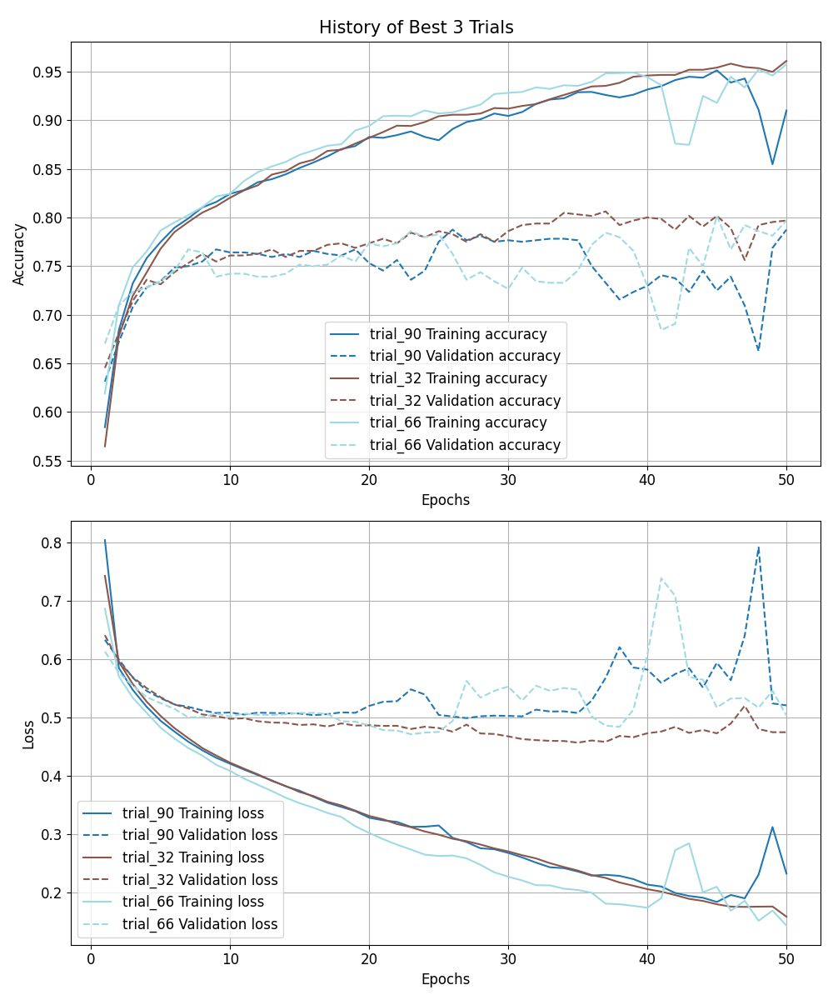

## Summary

### Hyperparameters

|               | units1        | units2        | learning_rate | Chapters      |
| ------------- | ------------- | ------------- | ------------- | ------------- |
| trial_90      | 512           | 256           | 2.2689e-05    | [Chapter](#trial_90) | 
| trial_32      | 512           | 512           | 1.0885e-05    | [Chapter](#trial_32) | 
| trial_66      | 512           | 512           | 1.9772e-05    | [Chapter](#trial_66) | 
| trial_68      | 512           | 512           | 1.0065e-05    | [Chapter](#trial_68) | 
| trial_97      | 512           | 256           | 1.5147e-05    | [Chapter](#trial_97) | 
| trial_71      | 512           | 256           | 1.4457e-05    | [Chapter](#trial_71) | 
| trial_77      | 512           | 256           | 1.2359e-05    | [Chapter](#trial_77) | 
| trial_78      | 512           | 256           | 1.2670e-05    | [Chapter](#trial_78) | 
| trial_12      | 512           | 512           | 1.2900e-05    | [Chapter](#trial_12) | 
| trial_52      | 512           | 512           | 1.0317e-05    | [Chapter](#trial_52) | 
| trial_95      | 512           | 256           | 1.0192e-05    | [Chapter](#trial_95) | 
| trial_22      | 512           | 512           | 1.4868e-05    | [Chapter](#trial_22) | 
| trial_69      | 512           | 256           | 1.4037e-05    | [Chapter](#trial_69) | 
| trial_85      | 512           | 256           | 2.0448e-05    | [Chapter](#trial_85) | 
| trial_96      | 512           | 256           | 1.2640e-05    | [Chapter](#trial_96) | 
| trial_62      | 512           | 512           | 1.2839e-05    | [Chapter](#trial_62) | 
| trial_72      | 512           | 256           | 1.4083e-05    | [Chapter](#trial_72) | 
| trial_4       | 512           | 256           | 2.6595e-05    | [Chapter](#trial_4) | 
| trial_9       | 512           | 512           | 1.2573e-05    | [Chapter](#trial_9) | 
| trial_46      | 64            | 512           | 2.7127e-05    | [Chapter](#trial_46) | 
| trial_47      | 256           | 256           | 1.0091e-05    | [Chapter](#trial_47) | 
| trial_55      | 512           | 512           | 2.0104e-05    | [Chapter](#trial_55) | 
| trial_56      | 32            | 512           | 1.3503e-05    | [Chapter](#trial_56) | 
| trial_24      | 512           | 512           | 1.0086e-05    | [Chapter](#trial_24) | 
| trial_64      | 512           | 512           | 2.3123e-05    | [Chapter](#trial_64) | 
| trial_92      | 512           | 256           | 1.0168e-05    | [Chapter](#trial_92) | 
| trial_20      | 512           | 512           | 8.8901e-05    | [Chapter](#trial_20) | 
| trial_35      | 128           | 512           | 1.0372e-05    | [Chapter](#trial_35) | 
| trial_99      | 256           | 256           | 1.9022e-05    | [Chapter](#trial_99) | 
| trial_11      | 512           | 256           | 1.9434e-05    | [Chapter](#trial_11) | 
| trial_88      | 512           | 256           | 1.2009e-05    | [Chapter](#trial_88) | 
| trial_75      | 512           | 256           | 2.2844e-05    | [Chapter](#trial_75) | 
| trial_49      | 256           | 512           | 6.7028e-05    | [Chapter](#trial_49) | 
| trial_76      | 512           | 256           | 1.8117e-05    | [Chapter](#trial_76) | 
| trial_98      | 512           | 128           | 2.5085e-05    | [Chapter](#trial_98) | 
| trial_60      | 128           | 512           | 5.4062e-05    | [Chapter](#trial_60) | 
| trial_33      | 512           | 512           | 1.6375e-05    | [Chapter](#trial_33) | 
| trial_44      | 128           | 128           | 4.6427e-05    | [Chapter](#trial_44) | 
| trial_65      | 256           | 512           | 1.2603e-05    | [Chapter](#trial_65) | 
| trial_91      | 512           | 256           | 1.2463e-05    | [Chapter](#trial_91) | 
| trial_1       | 256           | 256           | 1.3456e-04    | [Chapter](#trial_1) | 
| trial_53      | 512           | 512           | 1.3708e-05    | [Chapter](#trial_53) | 
| trial_87      | 256           | 256           | 1.5445e-05    | [Chapter](#trial_87) | 
| trial_93      | 512           | 256           | 1.5677e-05    | [Chapter](#trial_93) | 
| trial_43      | 64            | 256           | 1.5344e-05    | [Chapter](#trial_43) | 
| trial_63      | 32            | 256           | 1.7861e-05    | [Chapter](#trial_63) | 
| trial_74      | 512           | 256           | 1.6844e-05    | [Chapter](#trial_74) | 
| trial_82      | 256           | 256           | 1.3529e-05    | [Chapter](#trial_82) | 
| trial_23      | 512           | 256           | 3.2447e-05    | [Chapter](#trial_23) | 
| trial_86      | 256           | 256           | 1.2447e-05    | [Chapter](#trial_86) | 
| trial_83      | 256           | 256           | 1.5644e-05    | [Chapter](#trial_83) | 
| trial_84      | 256           | 256           | 2.5668e-05    | [Chapter](#trial_84) | 
| trial_67      | 64            | 512           | 3.6727e-05    | [Chapter](#trial_67) | 
| trial_94      | 512           | 256           | 1.8860e-05    | [Chapter](#trial_94) | 
| trial_25      | 512           | 256           | 2.4701e-05    | [Chapter](#trial_25) | 
| trial_18      | 256           | 256           | 1.0216e-05    | [Chapter](#trial_18) | 
| trial_8       | 512           | 256           | 3.4732e-04    | [Chapter](#trial_8) | 
| trial_89      | 512           | 256           | 2.9731e-05    | [Chapter](#trial_89) | 
| trial_13      | 32            | 512           | 1.2122e-05    | [Chapter](#trial_13) | 
| trial_34      | 512           | 512           | 3.0625e-05    | [Chapter](#trial_34) | 
| trial_36      | 128           | 512           | 2.1320e-05    | [Chapter](#trial_36) | 
| trial_81      | 512           | 256           | 3.4327e-05    | [Chapter](#trial_81) | 
| trial_7       | 256           | 32            | 1.7490e-04    | [Chapter](#trial_7) | 
| trial_45      | 128           | 512           | 1.5359e-05    | [Chapter](#trial_45) | 
| trial_48      | 256           | 256           | 1.3866e-04    | [Chapter](#trial_48) | 
| trial_57      | 32            | 512           | 3.5607e-05    | [Chapter](#trial_57) | 
| trial_37      | 256           | 512           | 3.9421e-05    | [Chapter](#trial_37) | 
| trial_39      | 512           | 512           | 1.5193e-05    | [Chapter](#trial_39) | 
| trial_54      | 512           | 512           | 2.8633e-05    | [Chapter](#trial_54) | 
| trial_42      | 128           | 512           | 1.0471e-05    | [Chapter](#trial_42) | 
| trial_100     | 512           | 256           | 4.1313e-05    | [Chapter](#trial_100) | 
| trial_79      | 256           | 256           | 4.7175e-05    | [Chapter](#trial_79) | 
| trial_70      | 512           | 256           | 2.9005e-05    | [Chapter](#trial_70) | 
| trial_27      | 512           | 512           | 3.5117e-04    | [Chapter](#trial_27) | 
| trial_29      | 512           | 512           | 4.5275e-05    | [Chapter](#trial_29) | 
| trial_3       | 256           | 128           | 0.0117        | [Chapter](#trial_3) | 
| trial_59      | 32            | 512           | 7.0581e-04    | [Chapter](#trial_59) | 
| trial_16      | 128           | 256           | 6.0419e-05    | [Chapter](#trial_16) | 
| trial_41      | 512           | 256           | 2.4215e-05    | [Chapter](#trial_41) | 
| trial_14      | 64            | 512           | 4.2527e-05    | [Chapter](#trial_14) | 
| trial_30      | 512           | 256           | 8.8853e-05    | [Chapter](#trial_30) | 
| trial_38      | 512           | 512           | 9.7941e-05    | [Chapter](#trial_38) | 
| trial_26      | 256           | 256           | 6.6778e-05    | [Chapter](#trial_26) | 
| trial_15      | 32            | 512           | 0.0021        | [Chapter](#trial_15) | 
| trial_10      | 256           | 512           | 1.6131e-04    | [Chapter](#trial_10) | 
| trial_50      | 512           | 512           | 2.1004e-04    | [Chapter](#trial_50) | 
| trial_61      | 128           | 32            | 0.0019        | [Chapter](#trial_61) | 
| trial_17      | 128           | 512           | 5.8205e-04    | [Chapter](#trial_17) | 
| trial_80      | 512           | 256           | 7.2385e-05    | [Chapter](#trial_80) | 
| trial_28      | 256           | 256           | 1.8507e-05    | [Chapter](#trial_28) | 
| trial_31      | 256           | 256           | 2.8895e-04    | [Chapter](#trial_31) | 
| trial_5       | 256           | 512           | 0.0014        | [Chapter](#trial_5) | 
| trial_2       | 128           | 256           | 0.0602        | [Chapter](#trial_2) | 
| trial_6       | 512           | 128           | 0.0349        | [Chapter](#trial_6) | 
| trial_19      | 256           | 512           | 0.0087        | [Chapter](#trial_19) | 
| trial_21      | 32            | 512           | 0.0036        | [Chapter](#trial_21) | 
| trial_40      | 512           | 512           | 0.0415        | [Chapter](#trial_40) | 
| trial_58      | 64            | 512           | 0.0057        | [Chapter](#trial_58) | 
| trial_73      | 512           | 256           | 0.0157        | [Chapter](#trial_73) | 
| trial_51      | 128           | 256           | 0.0796        | [Chapter](#trial_51) | 

### Test Results

|           | accuracy  | precision | recall    | f1        | Chapters  |
| --------- | --------- | --------- | --------- | --------- | --------- |
| trial_90  | 0.8130    | 0.8130    | 0.8130    | 0.8130    | [Chapter](#trial_90) | 
| trial_32  | 0.8096    | 0.8096    | 0.8096    | 0.8096    | [Chapter](#trial_32) | 
| trial_66  | 0.8074    | 0.8074    | 0.8074    | 0.8074    | [Chapter](#trial_66) | 
| trial_68  | 0.8074    | 0.8074    | 0.8074    | 0.8074    | [Chapter](#trial_68) | 
| trial_97  | 0.8074    | 0.8074    | 0.8074    | 0.8074    | [Chapter](#trial_97) | 
| trial_71  | 0.8063    | 0.8063    | 0.8063    | 0.8063    | [Chapter](#trial_71) | 
| trial_77  | 0.8063    | 0.8063    | 0.8063    | 0.8063    | [Chapter](#trial_77) | 
| trial_78  | 0.8063    | 0.8063    | 0.8063    | 0.8063    | [Chapter](#trial_78) | 
| trial_12  | 0.8052    | 0.8052    | 0.8052    | 0.8052    | [Chapter](#trial_12) | 
| trial_52  | 0.8052    | 0.8052    | 0.8052    | 0.8052    | [Chapter](#trial_52) | 
| trial_95  | 0.8040    | 0.8040    | 0.8040    | 0.8040    | [Chapter](#trial_95) | 
| trial_22  | 0.8029    | 0.8029    | 0.8029    | 0.8029    | [Chapter](#trial_22) | 
| trial_69  | 0.8018    | 0.8018    | 0.8018    | 0.8018    | [Chapter](#trial_69) | 
| trial_85  | 0.7996    | 0.7996    | 0.7996    | 0.7996    | [Chapter](#trial_85) | 
| trial_96  | 0.7996    | 0.7996    | 0.7996    | 0.7996    | [Chapter](#trial_96) | 
| trial_62  | 0.7984    | 0.7984    | 0.7984    | 0.7984    | [Chapter](#trial_62) | 
| trial_72  | 0.7984    | 0.7984    | 0.7984    | 0.7984    | [Chapter](#trial_72) | 
| trial_4   | 0.7973    | 0.7973    | 0.7973    | 0.7973    | [Chapter](#trial_4) | 
| trial_9   | 0.7973    | 0.7973    | 0.7973    | 0.7973    | [Chapter](#trial_9) | 
| trial_46  | 0.7973    | 0.7973    | 0.7973    | 0.7973    | [Chapter](#trial_46) | 
| trial_47  | 0.7973    | 0.7973    | 0.7973    | 0.7973    | [Chapter](#trial_47) | 
| trial_55  | 0.7973    | 0.7973    | 0.7973    | 0.7973    | [Chapter](#trial_55) | 
| trial_56  | 0.7973    | 0.7973    | 0.7973    | 0.7973    | [Chapter](#trial_56) | 
| trial_24  | 0.7962    | 0.7962    | 0.7962    | 0.7962    | [Chapter](#trial_24) | 
| trial_64  | 0.7962    | 0.7962    | 0.7962    | 0.7962    | [Chapter](#trial_64) | 
| trial_92  | 0.7962    | 0.7962    | 0.7962    | 0.7962    | [Chapter](#trial_92) | 
| trial_20  | 0.7951    | 0.7951    | 0.7951    | 0.7951    | [Chapter](#trial_20) | 
| trial_35  | 0.7928    | 0.7928    | 0.7928    | 0.7928    | [Chapter](#trial_35) | 
| trial_99  | 0.7928    | 0.7928    | 0.7928    | 0.7928    | [Chapter](#trial_99) | 
| trial_11  | 0.7917    | 0.7917    | 0.7917    | 0.7917    | [Chapter](#trial_11) | 
| trial_88  | 0.7917    | 0.7917    | 0.7917    | 0.7917    | [Chapter](#trial_88) | 
| trial_75  | 0.7906    | 0.7906    | 0.7906    | 0.7906    | [Chapter](#trial_75) | 
| trial_49  | 0.7895    | 0.7895    | 0.7895    | 0.7895    | [Chapter](#trial_49) | 
| trial_76  | 0.7895    | 0.7895    | 0.7895    | 0.7895    | [Chapter](#trial_76) | 
| trial_98  | 0.7895    | 0.7895    | 0.7895    | 0.7895    | [Chapter](#trial_98) | 
| trial_60  | 0.7884    | 0.7884    | 0.7884    | 0.7884    | [Chapter](#trial_60) | 
| trial_33  | 0.7872    | 0.7872    | 0.7872    | 0.7872    | [Chapter](#trial_33) | 
| trial_44  | 0.7872    | 0.7872    | 0.7872    | 0.7872    | [Chapter](#trial_44) | 
| trial_65  | 0.7872    | 0.7872    | 0.7872    | 0.7872    | [Chapter](#trial_65) | 
| trial_91  | 0.7872    | 0.7872    | 0.7872    | 0.7872    | [Chapter](#trial_91) | 
| trial_1   | 0.7861    | 0.7861    | 0.7861    | 0.7861    | [Chapter](#trial_1) | 
| trial_53  | 0.7861    | 0.7861    | 0.7861    | 0.7861    | [Chapter](#trial_53) | 
| trial_87  | 0.7861    | 0.7861    | 0.7861    | 0.7861    | [Chapter](#trial_87) | 
| trial_93  | 0.7861    | 0.7861    | 0.7861    | 0.7861    | [Chapter](#trial_93) | 
| trial_43  | 0.7850    | 0.7850    | 0.7850    | 0.7850    | [Chapter](#trial_43) | 
| trial_63  | 0.7839    | 0.7839    | 0.7839    | 0.7839    | [Chapter](#trial_63) | 
| trial_74  | 0.7828    | 0.7828    | 0.7828    | 0.7828    | [Chapter](#trial_74) | 
| trial_82  | 0.7828    | 0.7828    | 0.7828    | 0.7828    | [Chapter](#trial_82) | 
| trial_23  | 0.7816    | 0.7816    | 0.7816    | 0.7816    | [Chapter](#trial_23) | 
| trial_86  | 0.7816    | 0.7816    | 0.7816    | 0.7816    | [Chapter](#trial_86) | 
| trial_83  | 0.7805    | 0.7805    | 0.7805    | 0.7805    | [Chapter](#trial_83) | 
| trial_84  | 0.7794    | 0.7794    | 0.7794    | 0.7794    | [Chapter](#trial_84) | 
| trial_67  | 0.7783    | 0.7783    | 0.7783    | 0.7783    | [Chapter](#trial_67) | 
| trial_94  | 0.7783    | 0.7783    | 0.7783    | 0.7783    | [Chapter](#trial_94) | 
| trial_25  | 0.7772    | 0.7772    | 0.7772    | 0.7772    | [Chapter](#trial_25) | 
| trial_18  | 0.7760    | 0.7760    | 0.7760    | 0.7760    | [Chapter](#trial_18) | 
| trial_8   | 0.7749    | 0.7749    | 0.7749    | 0.7749    | [Chapter](#trial_8) | 
| trial_89  | 0.7749    | 0.7749    | 0.7749    | 0.7749    | [Chapter](#trial_89) | 
| trial_13  | 0.7738    | 0.7738    | 0.7738    | 0.7738    | [Chapter](#trial_13) | 
| trial_34  | 0.7738    | 0.7738    | 0.7738    | 0.7738    | [Chapter](#trial_34) | 
| trial_36  | 0.7738    | 0.7738    | 0.7738    | 0.7738    | [Chapter](#trial_36) | 
| trial_81  | 0.7738    | 0.7738    | 0.7738    | 0.7738    | [Chapter](#trial_81) | 
| trial_7   | 0.7727    | 0.7727    | 0.7727    | 0.7727    | [Chapter](#trial_7) | 
| trial_45  | 0.7727    | 0.7727    | 0.7727    | 0.7727    | [Chapter](#trial_45) | 
| trial_48  | 0.7727    | 0.7727    | 0.7727    | 0.7727    | [Chapter](#trial_48) | 
| trial_57  | 0.7716    | 0.7716    | 0.7716    | 0.7716    | [Chapter](#trial_57) | 
| trial_37  | 0.7660    | 0.7660    | 0.7660    | 0.7660    | [Chapter](#trial_37) | 
| trial_39  | 0.7660    | 0.7660    | 0.7660    | 0.7660    | [Chapter](#trial_39) | 
| trial_54  | 0.7648    | 0.7648    | 0.7648    | 0.7648    | [Chapter](#trial_54) | 
| trial_42  | 0.7626    | 0.7626    | 0.7626    | 0.7626    | [Chapter](#trial_42) | 
| trial_100 | 0.7592    | 0.7592    | 0.7592    | 0.7592    | [Chapter](#trial_100) | 
| trial_79  | 0.7581    | 0.7581    | 0.7581    | 0.7581    | [Chapter](#trial_79) | 
| trial_70  | 0.7559    | 0.7559    | 0.7559    | 0.7559    | [Chapter](#trial_70) | 
| trial_27  | 0.7536    | 0.7536    | 0.7536    | 0.7536    | [Chapter](#trial_27) | 
| trial_29  | 0.7525    | 0.7525    | 0.7525    | 0.7525    | [Chapter](#trial_29) | 
| trial_3   | 0.7514    | 0.7514    | 0.7514    | 0.7514    | [Chapter](#trial_3) | 
| trial_59  | 0.7480    | 0.7480    | 0.7480    | 0.7480    | [Chapter](#trial_59) | 
| trial_16  | 0.7469    | 0.7469    | 0.7469    | 0.7469    | [Chapter](#trial_16) | 
| trial_41  | 0.7447    | 0.7447    | 0.7447    | 0.7447    | [Chapter](#trial_41) | 
| trial_14  | 0.7424    | 0.7424    | 0.7424    | 0.7424    | [Chapter](#trial_14) | 
| trial_30  | 0.7335    | 0.7335    | 0.7335    | 0.7335    | [Chapter](#trial_30) | 
| trial_38  | 0.7335    | 0.7335    | 0.7335    | 0.7335    | [Chapter](#trial_38) | 
| trial_26  | 0.7301    | 0.7301    | 0.7301    | 0.7301    | [Chapter](#trial_26) | 
| trial_15  | 0.7290    | 0.7290    | 0.7290    | 0.7290    | [Chapter](#trial_15) | 
| trial_10  | 0.7279    | 0.7279    | 0.7279    | 0.7279    | [Chapter](#trial_10) | 
| trial_50  | 0.7256    | 0.7256    | 0.7256    | 0.7256    | [Chapter](#trial_50) | 
| trial_61  | 0.7245    | 0.7245    | 0.7245    | 0.7245    | [Chapter](#trial_61) | 
| trial_17  | 0.7234    | 0.7234    | 0.7234    | 0.7234    | [Chapter](#trial_17) | 
| trial_80  | 0.7189    | 0.7189    | 0.7189    | 0.7189    | [Chapter](#trial_80) | 
| trial_28  | 0.7156    | 0.7156    | 0.7156    | 0.7156    | [Chapter](#trial_28) | 
| trial_31  | 0.7100    | 0.7100    | 0.7100    | 0.7100    | [Chapter](#trial_31) | 
| trial_5   | 0.6137    | 0.6137    | 0.6137    | 0.6137    | [Chapter](#trial_5) | 
| trial_2   | 0.5342    | 0.5342    | 0.5342    | 0.5342    | [Chapter](#trial_2) | 
| trial_6   | 0.5342    | 0.5342    | 0.5342    | 0.5342    | [Chapter](#trial_6) | 
| trial_19  | 0.5342    | 0.5342    | 0.5342    | 0.5342    | [Chapter](#trial_19) | 
| trial_21  | 0.5342    | 0.5342    | 0.5342    | 0.5342    | [Chapter](#trial_21) | 
| trial_40  | 0.5342    | 0.5342    | 0.5342    | 0.5342    | [Chapter](#trial_40) | 
| trial_58  | 0.5342    | 0.5342    | 0.5342    | 0.5342    | [Chapter](#trial_58) | 
| trial_73  | 0.5342    | 0.5342    | 0.5342    | 0.5342    | [Chapter](#trial_73) | 
| trial_51  | 0.5319    | 0.5319    | 0.5319    | 0.5319    | [Chapter](#trial_51) | 

## trial_90

*    *Start Time*: 2024-10-16 12:38:45

*    *Duration*: 16.725

*    *Directory*: [Link](./trial_90)

### Hyperparameters:

| Hyperparameter      | Value               |
| ------------------- | ------------------- |
| units1              | 512                 |
| units2              | 256                 |
| learning_rate       | 2.2689088766911e-05 |

### Evaluation Metrics:

|           | train     | val       | test      |
| --------- | --------- | --------- | --------- |
| accuracy  | 0.9506    | 0.7875    | 0.8130    | 
| precision | 0.9506    | 0.7875    | 0.8130    | 
| recall    | 0.9506    | 0.7875    | 0.8130    | 
| f1        | 0.9506    | 0.7875    | 0.8130    | 

### Figures:

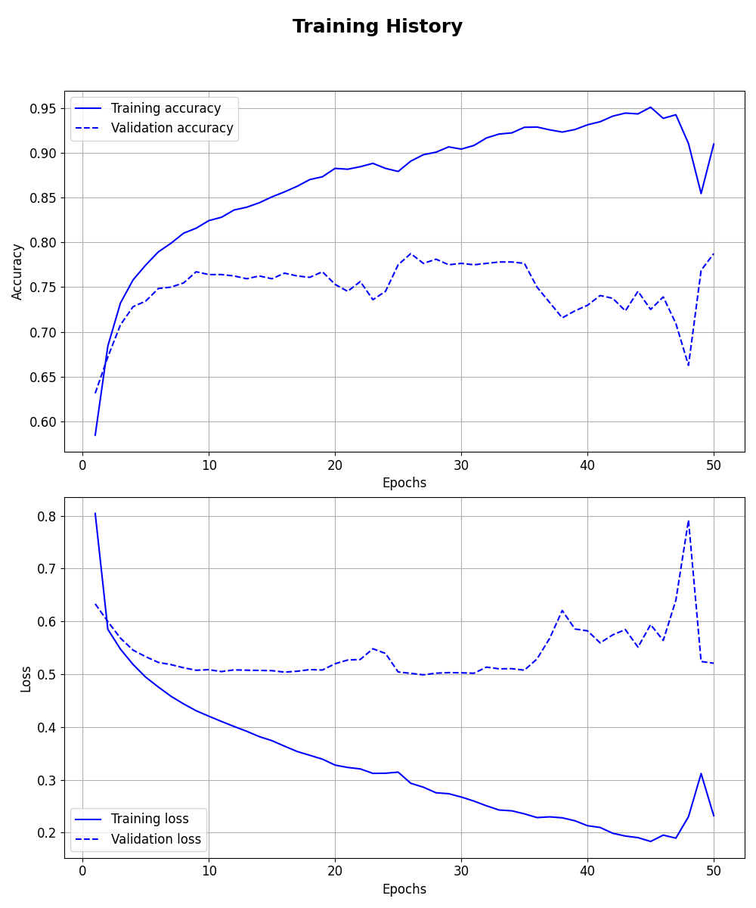

### Detailed Report of Test Set:

|              | precision    | recall       | f1-score     | support      |
| ------------ | ------------ | ------------ | ------------ | ------------ |
| chihuahua    | 0.8326       | 0.8134       | 0.8229       | 477          | 
| muffin       | 0.7916       | 0.8125       | 0.8019       | 416          | 
| micro avg    | 0.8130       | 0.8130       | 0.8130       | 893          | 
| macro avg    | 0.8121       | 0.8130       | 0.8124       | 893          | 
| weighted avg | 0.8135       | 0.8130       | 0.8131       | 893          | 
| samples avg  | 0.8130       | 0.8130       | 0.8130       | 893          | 

## trial_32

*    *Start Time*: 2024-10-16 12:19:02

*    *Duration*: 28.395

*    *Directory*: [Link](./trial_32)

### Hyperparameters:

| Hyperparameter         | Value                  |
| ---------------------- | ---------------------- |
| units1                 | 512                    |
| units2                 | 512                    |
| learning_rate          | 1.0884837637151563e-05 |

### Evaluation Metrics:

|           | train     | val       | test      |
| --------- | --------- | --------- | --------- |
| accuracy  | 0.9681    | 0.7969    | 0.8096    | 
| precision | 0.9681    | 0.7969    | 0.8096    | 
| recall    | 0.9681    | 0.7969    | 0.8096    | 
| f1        | 0.9681    | 0.7969    | 0.8096    | 

### Figures:

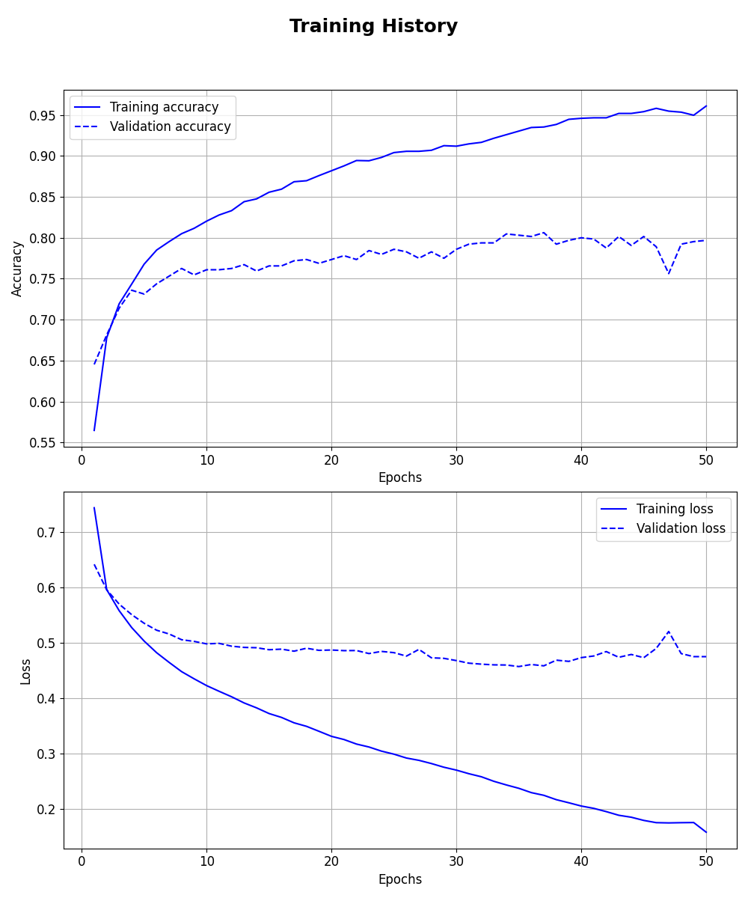

### Detailed Report of Test Set:

|              | precision    | recall       | f1-score     | support      |
| ------------ | ------------ | ------------ | ------------ | ------------ |
| chihuahua    | 0.8218       | 0.8218       | 0.8218       | 477          | 
| muffin       | 0.7957       | 0.7957       | 0.7957       | 416          | 
| micro avg    | 0.8096       | 0.8096       | 0.8096       | 893          | 
| macro avg    | 0.8087       | 0.8087       | 0.8087       | 893          | 
| weighted avg | 0.8096       | 0.8096       | 0.8096       | 893          | 
| samples avg  | 0.8096       | 0.8096       | 0.8096       | 893          | 

## trial_66

*    *Start Time*: 2024-10-16 12:30:01

*    *Duration*: 28.177

*    *Directory*: [Link](./trial_66)

### Hyperparameters:

| Hyperparameter         | Value                  |
| ---------------------- | ---------------------- |
| units1                 | 512                    |
| units2                 | 512                    |
| learning_rate          | 1.9772305326048017e-05 |

### Evaluation Metrics:

|           | train     | val       | test      |
| --------- | --------- | --------- | --------- |
| accuracy  | 0.9613    | 0.7969    | 0.8074    | 
| precision | 0.9613    | 0.7969    | 0.8074    | 
| recall    | 0.9613    | 0.7969    | 0.8074    | 
| f1        | 0.9612    | 0.7969    | 0.8074    | 

### Figures:

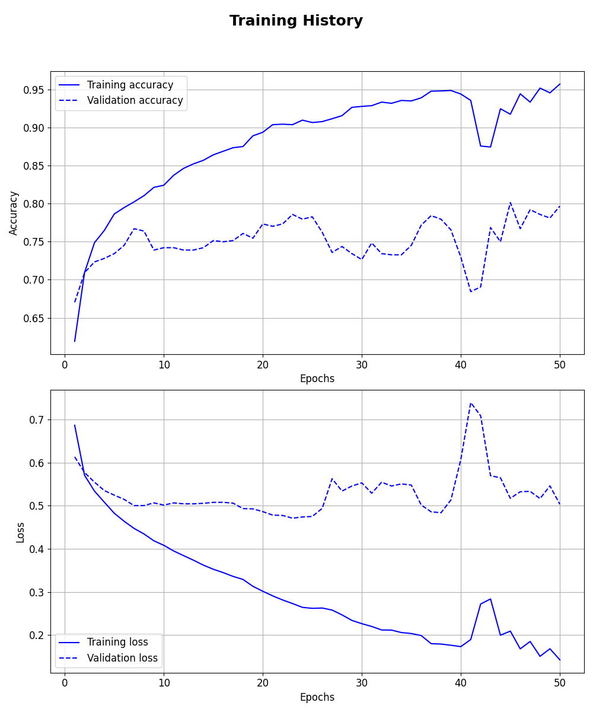

### Detailed Report of Test Set:

|              | precision    | recall       | f1-score     | support      |
| ------------ | ------------ | ------------ | ------------ | ------------ |
| chihuahua    | 0.8266       | 0.8092       | 0.8178       | 477          | 
| muffin       | 0.7864       | 0.8053       | 0.7957       | 416          | 
| micro avg    | 0.8074       | 0.8074       | 0.8074       | 893          | 
| macro avg    | 0.8065       | 0.8073       | 0.8068       | 893          | 
| weighted avg | 0.8078       | 0.8074       | 0.8075       | 893          | 
| samples avg  | 0.8074       | 0.8074       | 0.8074       | 893          | 

## trial_68

*    *Start Time*: 2024-10-16 12:30:46

*    *Duration*: 16.010

*    *Directory*: [Link](./trial_68)

### Hyperparameters:

| Hyperparameter         | Value                  |
| ---------------------- | ---------------------- |
| units1                 | 512                    |
| units2                 | 512                    |
| learning_rate          | 1.0064545574963054e-05 |

### Evaluation Metrics:

|           | train     | val       | test      |
| --------- | --------- | --------- | --------- |
| accuracy  | 0.9556    | 0.7859    | 0.8074    | 
| precision | 0.9556    | 0.7859    | 0.8074    | 
| recall    | 0.9556    | 0.7859    | 0.8074    | 
| f1        | 0.9556    | 0.7859    | 0.8074    | 

### Figures:

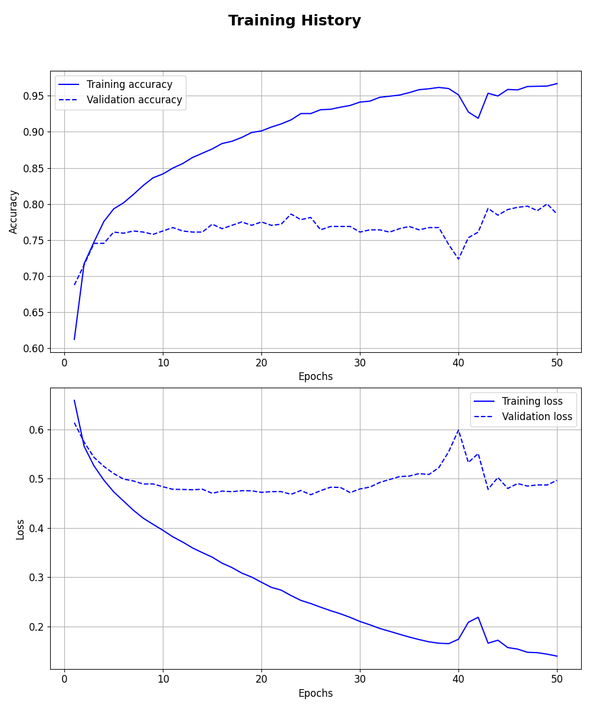

### Detailed Report of Test Set:

|              | precision    | recall       | f1-score     | support      |
| ------------ | ------------ | ------------ | ------------ | ------------ |
| chihuahua    | 0.8506       | 0.7757       | 0.8114       | 477          | 
| muffin       | 0.7664       | 0.8438       | 0.8032       | 416          | 
| micro avg    | 0.8074       | 0.8074       | 0.8074       | 893          | 
| macro avg    | 0.8085       | 0.8097       | 0.8073       | 893          | 
| weighted avg | 0.8114       | 0.8074       | 0.8076       | 893          | 
| samples avg  | 0.8074       | 0.8074       | 0.8074       | 893          | 

## trial_97

*    *Start Time*: 2024-10-16 12:41:06

*    *Duration*: 28.327

*    *Directory*: [Link](./trial_97)

### Hyperparameters:

| Hyperparameter         | Value                  |
| ---------------------- | ---------------------- |
| units1                 | 512                    |
| units2                 | 256                    |
| learning_rate          | 1.5146733601986623e-05 |

### Evaluation Metrics:

|           | train     | val       | test      |
| --------- | --------- | --------- | --------- |
| accuracy  | 0.9594    | 0.7875    | 0.8074    | 
| precision | 0.9594    | 0.7875    | 0.8074    | 
| recall    | 0.9594    | 0.7875    | 0.8074    | 
| f1        | 0.9594    | 0.7875    | 0.8074    | 

### Figures:

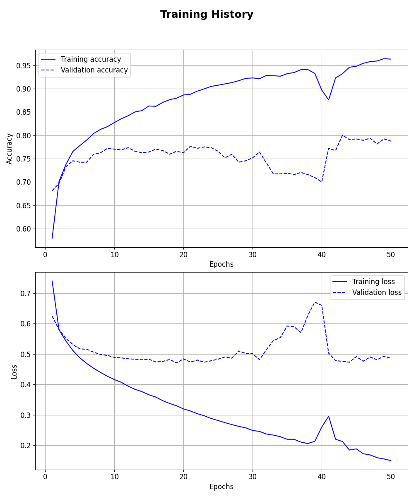

### Detailed Report of Test Set:

|              | precision    | recall       | f1-score     | support      |
| ------------ | ------------ | ------------ | ------------ | ------------ |
| chihuahua    | 0.8474       | 0.7799       | 0.8122       | 477          | 
| muffin       | 0.7687       | 0.8389       | 0.8023       | 416          | 
| micro avg    | 0.8074       | 0.8074       | 0.8074       | 893          | 
| macro avg    | 0.8081       | 0.8094       | 0.8073       | 893          | 
| weighted avg | 0.8107       | 0.8074       | 0.8076       | 893          | 
| samples avg  | 0.8074       | 0.8074       | 0.8074       | 893          | 

## trial_71

*    *Start Time*: 2024-10-16 12:31:49

*    *Duration*: 16.842

*    *Directory*: [Link](./trial_71)

### Hyperparameters:

| Hyperparameter         | Value                  |
| ---------------------- | ---------------------- |
| units1                 | 512                    |
| units2                 | 256                    |
| learning_rate          | 1.4457030400692798e-05 |

### Evaluation Metrics:

|           | train     | val       | test      |
| --------- | --------- | --------- | --------- |
| accuracy  | 0.9700    | 0.7922    | 0.8063    | 
| precision | 0.9700    | 0.7922    | 0.8063    | 
| recall    | 0.9700    | 0.7922    | 0.8063    | 
| f1        | 0.9700    | 0.7922    | 0.8063    | 

### Figures:

### Detailed Report of Test Set:

|              | precision    | recall       | f1-score     | support      |
| ------------ | ------------ | ------------ | ------------ | ------------ |
| chihuahua    | 0.8102       | 0.8323       | 0.8211       | 477          | 
| muffin       | 0.8015       | 0.7764       | 0.7888       | 416          | 
| micro avg    | 0.8063       | 0.8063       | 0.8063       | 893          | 
| macro avg    | 0.8058       | 0.8044       | 0.8049       | 893          | 
| weighted avg | 0.8061       | 0.8063       | 0.8060       | 893          | 
| samples avg  | 0.8063       | 0.8063       | 0.8063       | 893          | 

## trial_77

*    *Start Time*: 2024-10-16 12:33:55

*    *Duration*: 32.313

*    *Directory*: [Link](./trial_77)

### Hyperparameters:

| Hyperparameter        | Value                 |
| --------------------- | --------------------- |
| units1                | 512                   |
| units2                | 256                   |
| learning_rate         | 1.235863563380231e-05 |

### Evaluation Metrics:

|           | train     | val       | test      |
| --------- | --------- | --------- | --------- |
| accuracy  | 0.9641    | 0.7953    | 0.8063    | 
| precision | 0.9641    | 0.7953    | 0.8063    | 
| recall    | 0.9641    | 0.7953    | 0.8063    | 
| f1        | 0.9641    | 0.7953    | 0.8063    | 

### Figures:

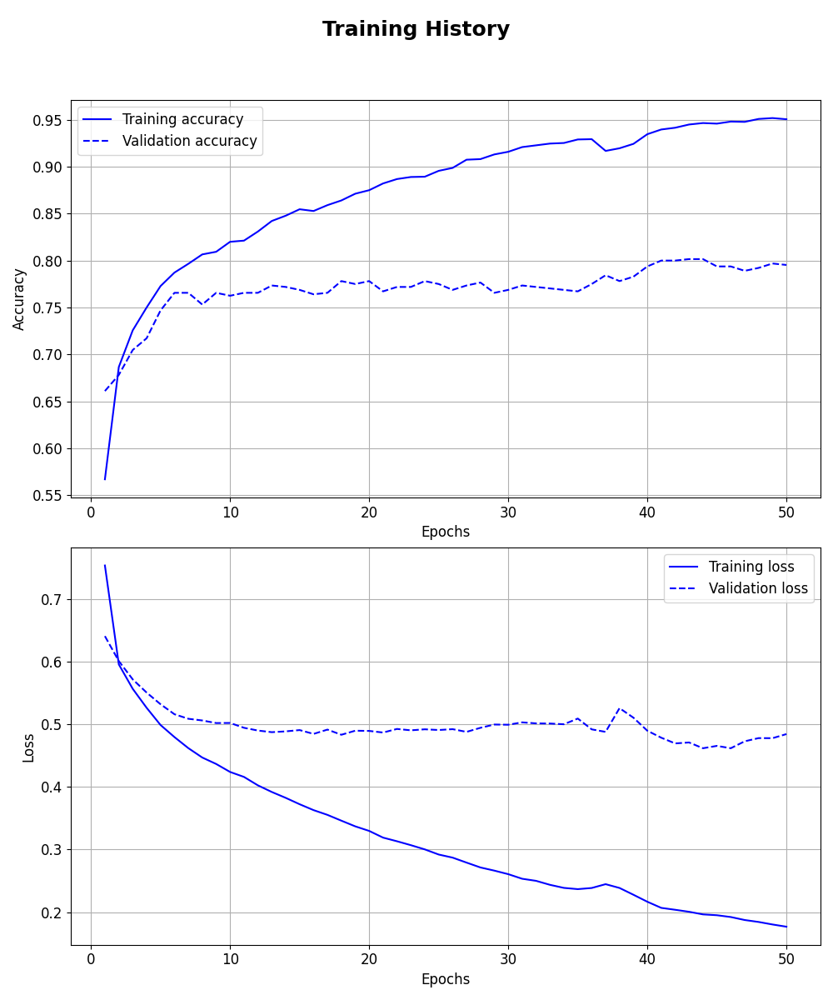

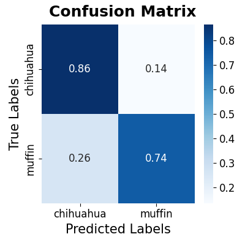

### Detailed Report of Test Set:

|              | precision    | recall       | f1-score     | support      |
| ------------ | ------------ | ------------ | ------------ | ------------ |
| chihuahua    | 0.7923       | 0.8637       | 0.8265       | 477          | 
| muffin       | 0.8257       | 0.7404       | 0.7807       | 416          | 
| micro avg    | 0.8063       | 0.8063       | 0.8063       | 893          | 
| macro avg    | 0.8090       | 0.8021       | 0.8036       | 893          | 
| weighted avg | 0.8079       | 0.8063       | 0.8052       | 893          | 
| samples avg  | 0.8063       | 0.8063       | 0.8063       | 893          | 

## trial_78

*    *Start Time*: 2024-10-16 12:34:28

*    *Duration*: 16.570

*    *Directory*: [Link](./trial_78)

### Hyperparameters:

| Hyperparameter         | Value                  |
| ---------------------- | ---------------------- |
| units1                 | 512                    |
| units2                 | 256                    |
| learning_rate          | 1.2669867731128623e-05 |

### Evaluation Metrics:

|           | train     | val       | test      |
| --------- | --------- | --------- | --------- |
| accuracy  | 0.9619    | 0.7812    | 0.8063    | 
| precision | 0.9619    | 0.7812    | 0.8063    | 
| recall    | 0.9619    | 0.7812    | 0.8063    | 
| f1        | 0.9619    | 0.7812    | 0.8063    | 

### Figures:

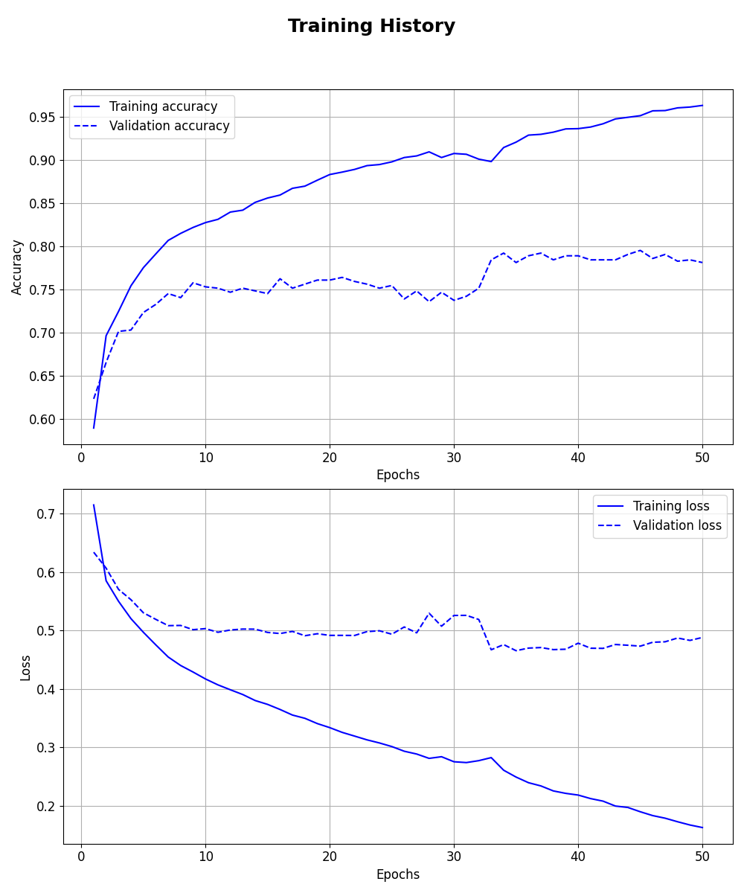

### Detailed Report of Test Set:

|              | precision    | recall       | f1-score     | support      |
| ------------ | ------------ | ------------ | ------------ | ------------ |
| chihuahua    | 0.8028       | 0.8449       | 0.8233       | 477          | 
| muffin       | 0.8107       | 0.7620       | 0.7856       | 416          | 
| micro avg    | 0.8063       | 0.8063       | 0.8063       | 893          | 
| macro avg    | 0.8068       | 0.8034       | 0.8045       | 893          | 
| weighted avg | 0.8065       | 0.8063       | 0.8057       | 893          | 
| samples avg  | 0.8063       | 0.8063       | 0.8063       | 893          | 

## trial_12

*    *Start Time*: 2024-10-16 12:12:50

*    *Duration*: 15.589

*    *Directory*: [Link](./trial_12)

### Hyperparameters:

| Hyperparameter         | Value                  |
| ---------------------- | ---------------------- |
| units1                 | 512                    |
| units2                 | 512                    |
| learning_rate          | 1.2899604496694788e-05 |

### Evaluation Metrics:

|           | train     | val       | test      |
| --------- | --------- | --------- | --------- |
| accuracy  | 0.9584    | 0.7906    | 0.8052    | 
| precision | 0.9584    | 0.7906    | 0.8052    | 
| recall    | 0.9584    | 0.7906    | 0.8052    | 
| f1        | 0.9584    | 0.7906    | 0.8052    | 

### Figures:

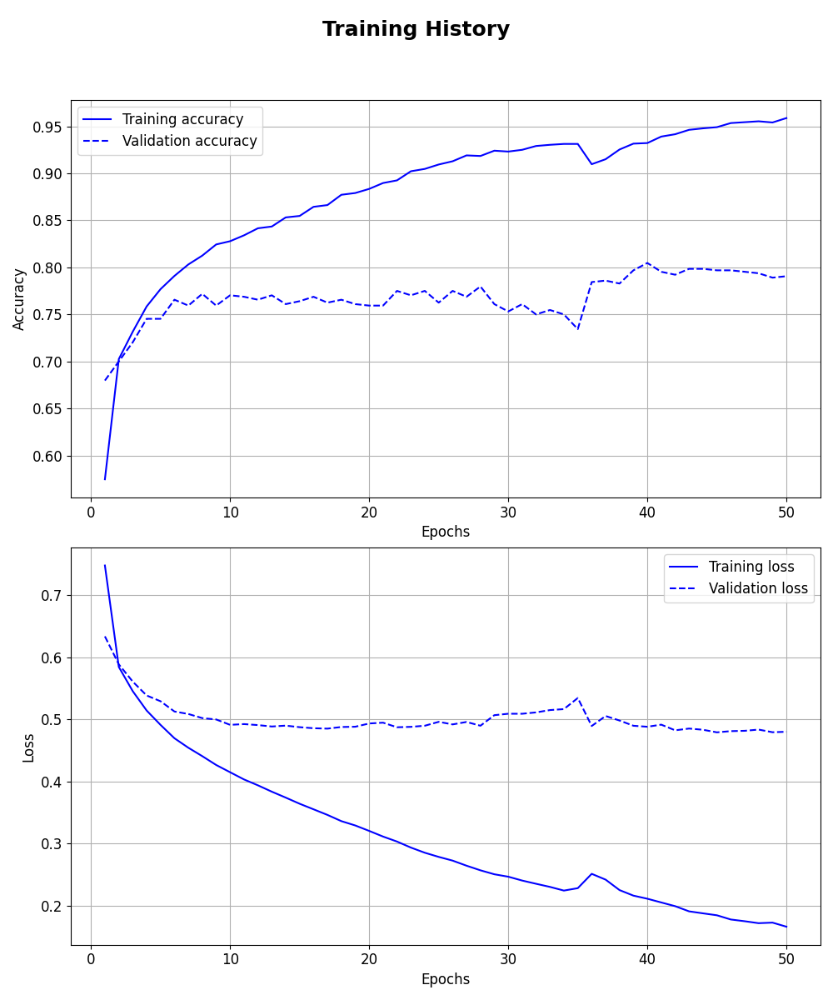

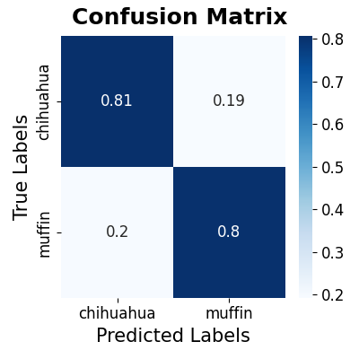

### Detailed Report of Test Set:

|              | precision    | recall       | f1-score     | support      |
| ------------ | ------------ | ------------ | ------------ | ------------ |
| chihuahua    | 0.8244       | 0.8071       | 0.8157       | 477          | 
| muffin       | 0.7840       | 0.8029       | 0.7933       | 416          | 
| micro avg    | 0.8052       | 0.8052       | 0.8052       | 893          | 
| macro avg    | 0.8042       | 0.8050       | 0.8045       | 893          | 
| weighted avg | 0.8056       | 0.8052       | 0.8053       | 893          | 
| samples avg  | 0.8052       | 0.8052       | 0.8052       | 893          | 

## trial_52

*    *Start Time*: 2024-10-16 12:25:03

*    *Duration*: 24.651

*    *Directory*: [Link](./trial_52)

### Hyperparameters:

| Hyperparameter         | Value                  |
| ---------------------- | ---------------------- |
| units1                 | 512                    |
| units2                 | 512                    |
| learning_rate          | 1.0317225707706187e-05 |

### Evaluation Metrics:

|           | train     | val       | test      |
| --------- | --------- | --------- | --------- |
| accuracy  | 0.9747    | 0.7734    | 0.8052    | 
| precision | 0.9747    | 0.7734    | 0.8052    | 
| recall    | 0.9747    | 0.7734    | 0.8052    | 
| f1        | 0.9747    | 0.7734    | 0.8052    | 

### Figures:

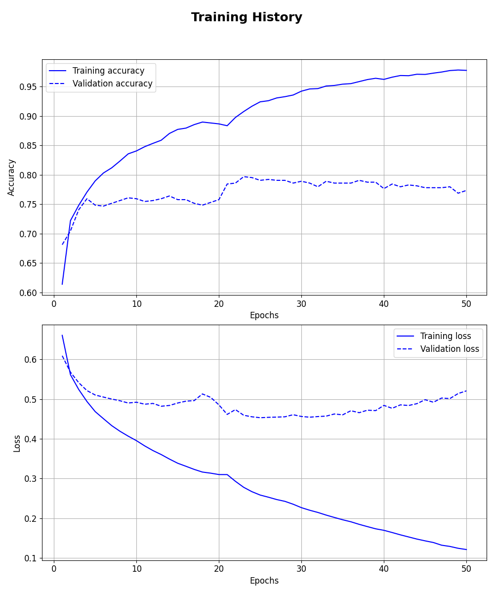

### Detailed Report of Test Set:

|              | precision    | recall       | f1-score     | support      |
| ------------ | ------------ | ------------ | ------------ | ------------ |
| chihuahua    | 0.7988       | 0.8491       | 0.8232       | 477          | 
| muffin       | 0.8135       | 0.7548       | 0.7830       | 416          | 
| micro avg    | 0.8052       | 0.8052       | 0.8052       | 893          | 
| macro avg    | 0.8061       | 0.8019       | 0.8031       | 893          | 
| weighted avg | 0.8056       | 0.8052       | 0.8045       | 893          | 
| samples avg  | 0.8052       | 0.8052       | 0.8052       | 893          | 

## trial_95

*    *Start Time*: 2024-10-16 12:40:32

*    *Duration*: 16.145

*    *Directory*: [Link](./trial_95)

### Hyperparameters:

| Hyperparameter         | Value                  |
| ---------------------- | ---------------------- |
| units1                 | 512                    |
| units2                 | 256                    |
| learning_rate          | 1.0191561094194784e-05 |

### Evaluation Metrics:

|           | train     | val       | test      |
| --------- | --------- | --------- | --------- |
| accuracy  | 0.9778    | 0.7797    | 0.8040    | 
| precision | 0.9778    | 0.7797    | 0.8040    | 
| recall    | 0.9778    | 0.7797    | 0.8040    | 
| f1        | 0.9778    | 0.7797    | 0.8040    | 

### Figures:

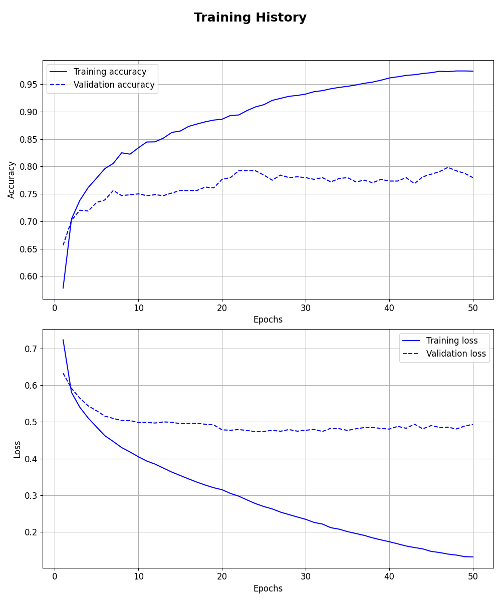

### Detailed Report of Test Set:

|              | precision    | recall       | f1-score     | support      |
| ------------ | ------------ | ------------ | ------------ | ------------ |
| chihuahua    | 0.7817       | 0.8784       | 0.8272       | 477          | 
| muffin       | 0.8375       | 0.7188       | 0.7736       | 416          | 
| micro avg    | 0.8040       | 0.8040       | 0.8040       | 893          | 
| macro avg    | 0.8096       | 0.7986       | 0.8004       | 893          | 
| weighted avg | 0.8077       | 0.8040       | 0.8023       | 893          | 
| samples avg  | 0.8040       | 0.8040       | 0.8040       | 893          | 

## trial_22

*    *Start Time*: 2024-10-16 12:15:38

*    *Duration*: 16.151

*    *Directory*: [Link](./trial_22)

### Hyperparameters:

| Hyperparameter         | Value                  |
| ---------------------- | ---------------------- |
| units1                 | 512                    |
| units2                 | 512                    |
| learning_rate          | 1.4868211488039748e-05 |

### Evaluation Metrics:

|           | train     | val       | test      |
| --------- | --------- | --------- | --------- |
| accuracy  | 0.9628    | 0.7937    | 0.8029    | 
| precision | 0.9628    | 0.7937    | 0.8029    | 
| recall    | 0.9628    | 0.7937    | 0.8029    | 
| f1        | 0.9628    | 0.7937    | 0.8029    | 

### Figures:

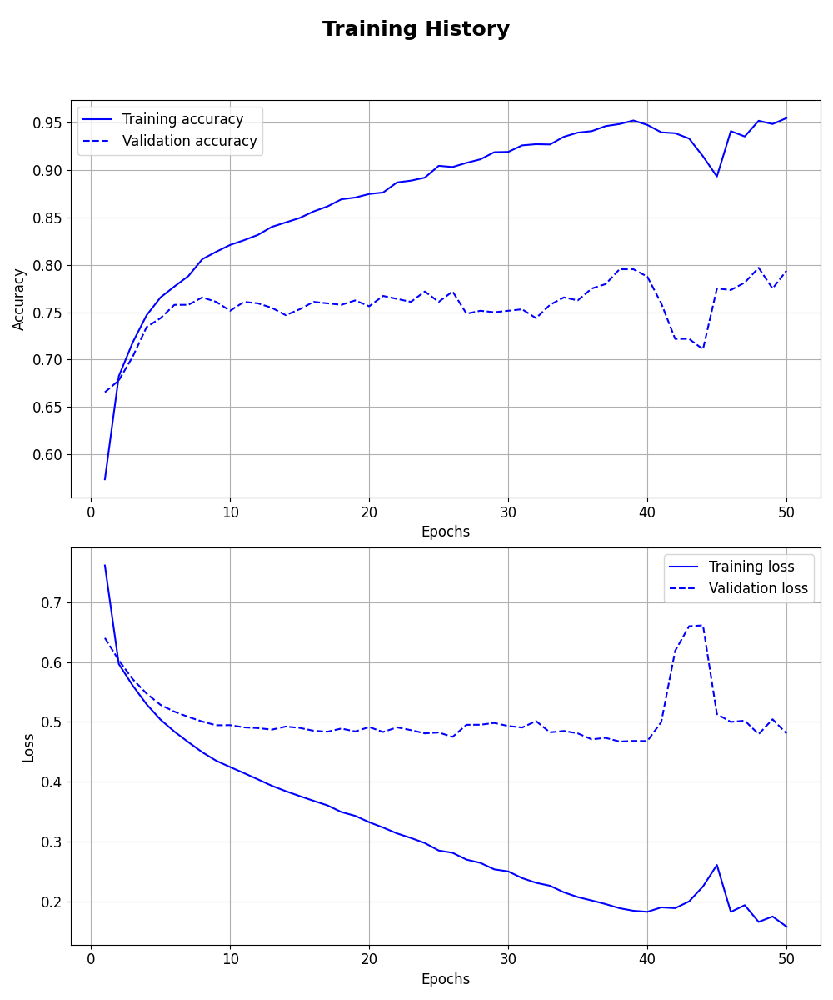

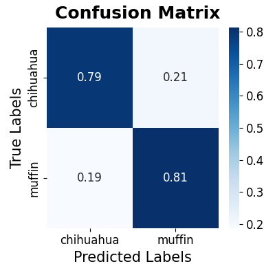

### Detailed Report of Test Set:

|              | precision    | recall       | f1-score     | support      |
| ------------ | ------------ | ------------ | ------------ | ------------ |
| chihuahua    | 0.8293       | 0.7945       | 0.8116       | 477          | 
| muffin       | 0.7752       | 0.8125       | 0.7934       | 416          | 
| micro avg    | 0.8029       | 0.8029       | 0.8029       | 893          | 
| macro avg    | 0.8023       | 0.8035       | 0.8025       | 893          | 
| weighted avg | 0.8041       | 0.8029       | 0.8031       | 893          | 
| samples avg  | 0.8029       | 0.8029       | 0.8029       | 893          | 

## trial_69

*    *Start Time*: 2024-10-16 12:31:02

*    *Duration*: 29.109

*    *Directory*: [Link](./trial_69)

### Hyperparameters:

| Hyperparameter         | Value                  |
| ---------------------- | ---------------------- |
| units1                 | 512                    |
| units2                 | 256                    |
| learning_rate          | 1.4037261027079054e-05 |

### Evaluation Metrics:

|           | train     | val       | test      |
| --------- | --------- | --------- | --------- |
| accuracy  | 0.9594    | 0.7875    | 0.8018    | 
| precision | 0.9594    | 0.7875    | 0.8018    | 
| recall    | 0.9594    | 0.7875    | 0.8018    | 
| f1        | 0.9594    | 0.7875    | 0.8018    | 

### Figures:

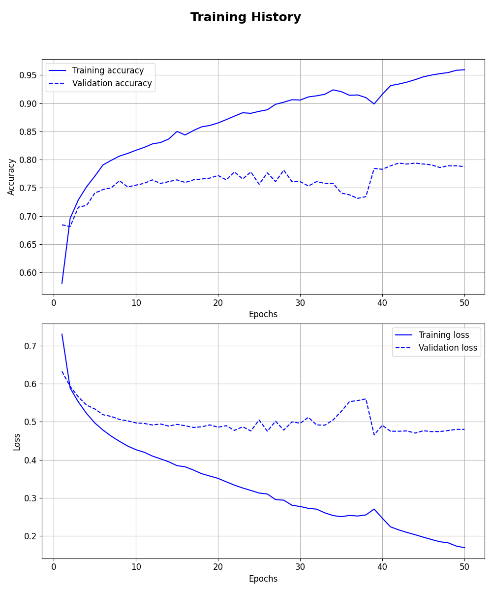

### Detailed Report of Test Set:

|              | precision    | recall       | f1-score     | support      |
| ------------ | ------------ | ------------ | ------------ | ------------ |
| chihuahua    | 0.8125       | 0.8176       | 0.8150       | 477          | 
| muffin       | 0.7893       | 0.7837       | 0.7865       | 416          | 
| micro avg    | 0.8018       | 0.8018       | 0.8018       | 893          | 
| macro avg    | 0.8009       | 0.8006       | 0.8008       | 893          | 
| weighted avg | 0.8017       | 0.8018       | 0.8017       | 893          | 
| samples avg  | 0.8018       | 0.8018       | 0.8018       | 893          | 

## trial_85

*    *Start Time*: 2024-10-16 12:36:51

*    *Duration*: 17.372

*    *Directory*: [Link](./trial_85)

### Hyperparameters:

| Hyperparameter         | Value                  |
| ---------------------- | ---------------------- |
| units1                 | 512                    |
| units2                 | 256                    |
| learning_rate          | 2.0448226878181123e-05 |

### Evaluation Metrics:

|           | train     | val       | test      |
| --------- | --------- | --------- | --------- |
| accuracy  | 0.9513    | 0.7844    | 0.7996    | 
| precision | 0.9513    | 0.7844    | 0.7996    | 
| recall    | 0.9513    | 0.7844    | 0.7996    | 
| f1        | 0.9512    | 0.7844    | 0.7996    | 

### Figures:

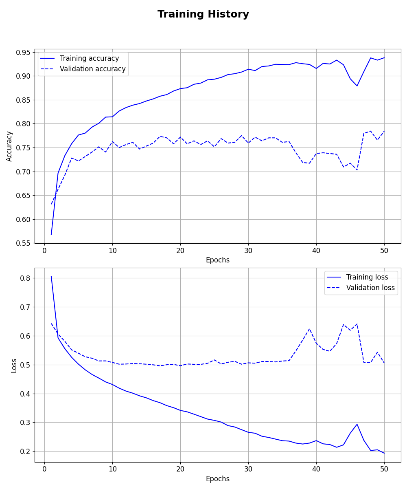

### Detailed Report of Test Set:

|              | precision    | recall       | f1-score     | support      |
| ------------ | ------------ | ------------ | ------------ | ------------ |
| chihuahua    | 0.8225       | 0.7966       | 0.8094       | 477          | 
| muffin       | 0.7749       | 0.8029       | 0.7887       | 416          | 
| micro avg    | 0.7996       | 0.7996       | 0.7996       | 893          | 
| macro avg    | 0.7987       | 0.7998       | 0.7990       | 893          | 
| weighted avg | 0.8004       | 0.7996       | 0.7997       | 893          | 
| samples avg  | 0.7996       | 0.7996       | 0.7996       | 893          | 

## trial_96

*    *Start Time*: 2024-10-16 12:40:48

*    *Duration*: 17.022

*    *Directory*: [Link](./trial_96)

### Hyperparameters:

| Hyperparameter         | Value                  |
| ---------------------- | ---------------------- |
| units1                 | 512                    |
| units2                 | 256                    |
| learning_rate          | 1.2640041664256107e-05 |

### Evaluation Metrics:

|           | train     | val       | test      |
| --------- | --------- | --------- | --------- |
| accuracy  | 0.9641    | 0.7766    | 0.7996    | 
| precision | 0.9641    | 0.7766    | 0.7996    | 
| recall    | 0.9641    | 0.7766    | 0.7996    | 
| f1        | 0.9641    | 0.7766    | 0.7996    | 

### Figures:

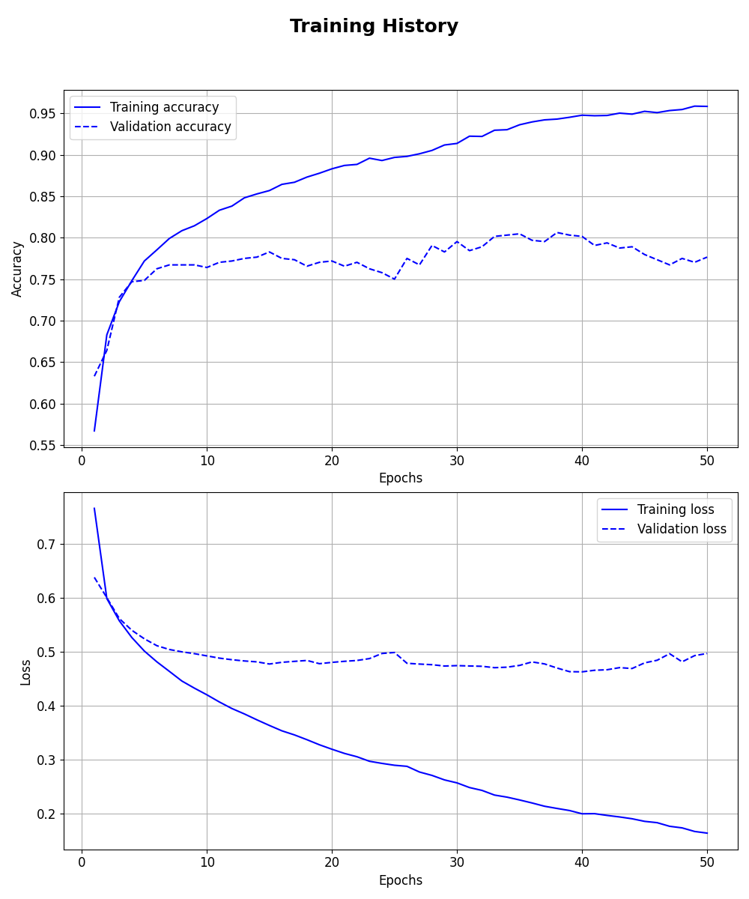

### Detailed Report of Test Set:

|              | precision    | recall       | f1-score     | support      |
| ------------ | ------------ | ------------ | ------------ | ------------ |
| chihuahua    | 0.7739       | 0.8826       | 0.8247       | 477          | 
| muffin       | 0.8395       | 0.7043       | 0.7660       | 416          | 
| micro avg    | 0.7996       | 0.7996       | 0.7996       | 893          | 
| macro avg    | 0.8067       | 0.7935       | 0.7953       | 893          | 
| weighted avg | 0.8045       | 0.7996       | 0.7974       | 893          | 
| samples avg  | 0.7996       | 0.7996       | 0.7996       | 893          | 

## trial_62

*    *Start Time*: 2024-10-16 12:28:37

*    *Duration*: 15.967

*    *Directory*: [Link](./trial_62)

### Hyperparameters:

| Hyperparameter         | Value                  |
| ---------------------- | ---------------------- |
| units1                 | 512                    |
| units2                 | 512                    |
| learning_rate          | 1.2838678072037414e-05 |

### Evaluation Metrics:

|           | train     | val       | test      |
| --------- | --------- | --------- | --------- |
| accuracy  | 0.9422    | 0.7922    | 0.7984    | 
| precision | 0.9422    | 0.7922    | 0.7984    | 
| recall    | 0.9422    | 0.7922    | 0.7984    | 
| f1        | 0.9422    | 0.7922    | 0.7984    | 

### Figures:

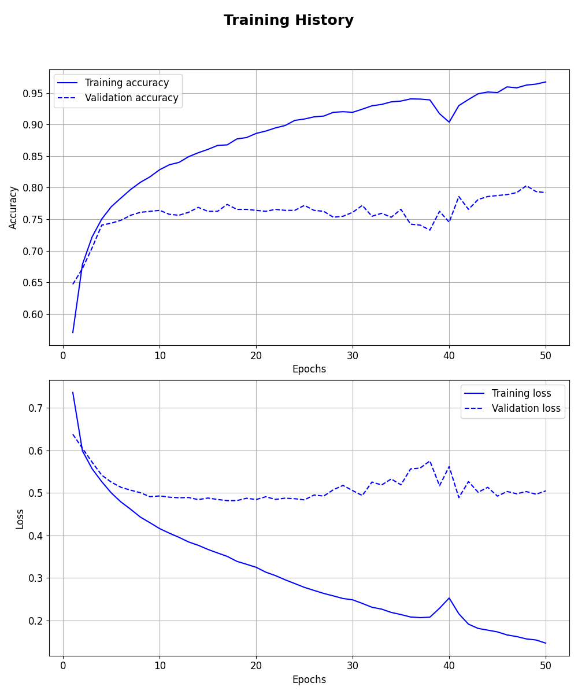

### Detailed Report of Test Set:

|              | precision    | recall       | f1-score     | support      |
| ------------ | ------------ | ------------ | ------------ | ------------ |
| chihuahua    | 0.8667       | 0.7358       | 0.7959       | 477          | 
| muffin       | 0.7418       | 0.8702       | 0.8009       | 416          | 
| micro avg    | 0.7984       | 0.7984       | 0.7984       | 893          | 
| macro avg    | 0.8042       | 0.8030       | 0.7984       | 893          | 
| weighted avg | 0.8085       | 0.7984       | 0.7982       | 893          | 
| samples avg  | 0.7984       | 0.7984       | 0.7984       | 893          | 

## trial_72

*    *Start Time*: 2024-10-16 12:32:06

*    *Duration*: 29.093

*    *Directory*: [Link](./trial_72)

### Hyperparameters:

| Hyperparameter         | Value                  |
| ---------------------- | ---------------------- |
| units1                 | 512                    |
| units2                 | 256                    |
| learning_rate          | 1.4083011417577355e-05 |

### Evaluation Metrics:

|           | train     | val       | test      |
| --------- | --------- | --------- | --------- |
| accuracy  | 0.9391    | 0.7891    | 0.7984    | 
| precision | 0.9391    | 0.7891    | 0.7984    | 
| recall    | 0.9391    | 0.7891    | 0.7984    | 
| f1        | 0.9391    | 0.7891    | 0.7984    | 

### Figures:

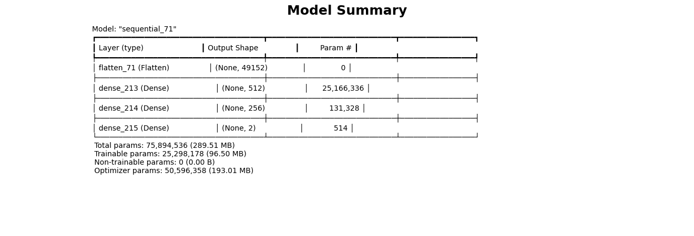

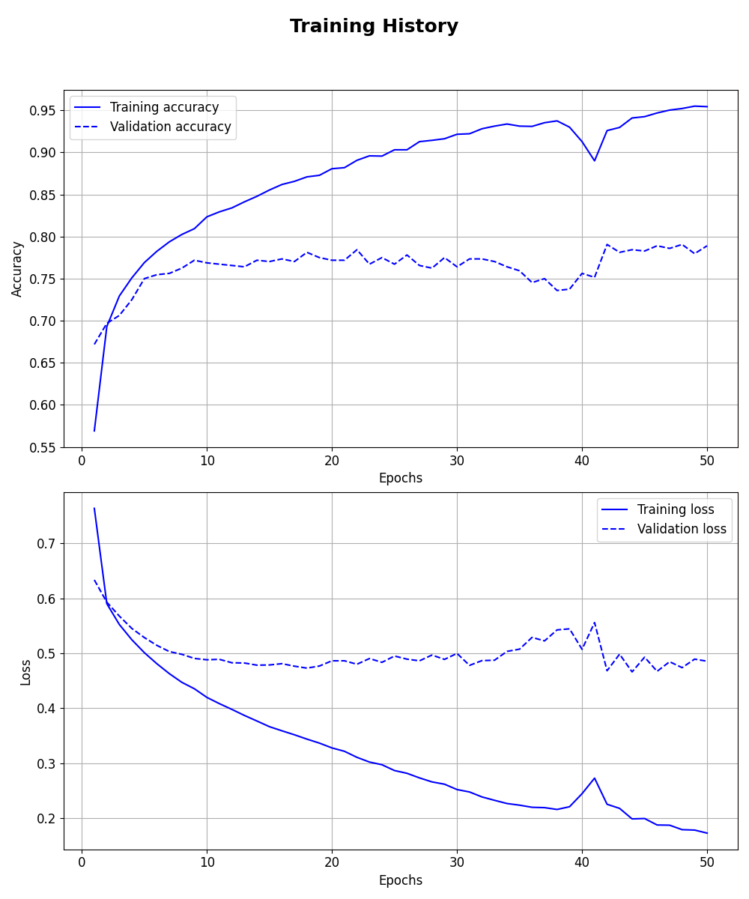

### Detailed Report of Test Set:

|              | precision    | recall       | f1-score     | support      |
| ------------ | ------------ | ------------ | ------------ | ------------ |
| chihuahua    | 0.8544       | 0.7505       | 0.7991       | 477          | 
| muffin       | 0.7489       | 0.8534       | 0.7978       | 416          | 
| micro avg    | 0.7984       | 0.7984       | 0.7984       | 893          | 
| macro avg    | 0.8017       | 0.8019       | 0.7984       | 893          | 
| weighted avg | 0.8053       | 0.7984       | 0.7985       | 893          | 
| samples avg  | 0.7984       | 0.7984       | 0.7984       | 893          | 

## trial_4

*    *Start Time*: 2024-10-16 12:10:29

*    *Duration*: 18.208

*    *Directory*: [Link](./trial_4)

### Hyperparameters:

| Hyperparameter        | Value                 |
| --------------------- | --------------------- |
| units1                | 512                   |
| units2                | 256                   |
| learning_rate         | 2.659460752492868e-05 |

### Evaluation Metrics:

|           | train     | val       | test      |
| --------- | --------- | --------- | --------- |
| accuracy  | 0.9594    | 0.7703    | 0.7973    | 
| precision | 0.9594    | 0.7703    | 0.7973    | 
| recall    | 0.9594    | 0.7703    | 0.7973    | 
| f1        | 0.9594    | 0.7703    | 0.7973    | 

### Figures:

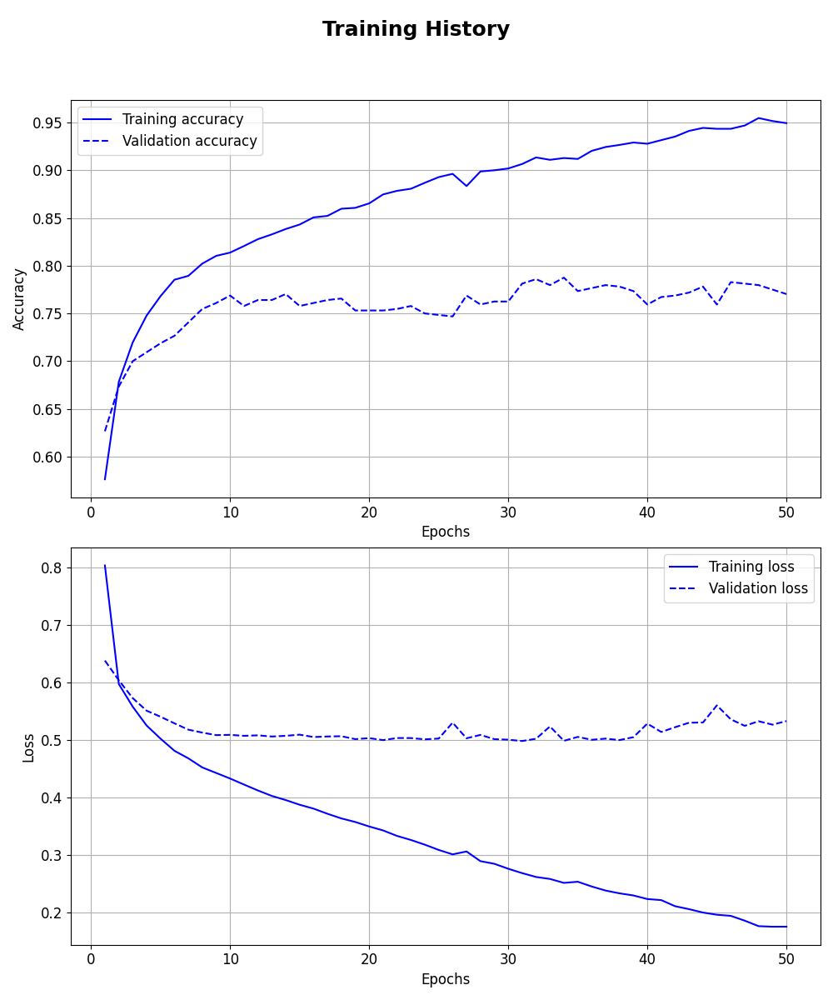

### Detailed Report of Test Set:

|              | precision    | recall       | f1-score     | support      |
| ------------ | ------------ | ------------ | ------------ | ------------ |
| chihuahua    | 0.8045       | 0.8197       | 0.8120       | 477          | 
| muffin       | 0.7887       | 0.7716       | 0.7801       | 416          | 
| micro avg    | 0.7973       | 0.7973       | 0.7973       | 893          | 
| macro avg    | 0.7966       | 0.7957       | 0.7961       | 893          | 
| weighted avg | 0.7972       | 0.7973       | 0.7972       | 893          | 
| samples avg  | 0.7973       | 0.7973       | 0.7973       | 893          | 

## trial_9

*    *Start Time*: 2024-10-16 12:11:58

*    *Duration*: 17.343

*    *Directory*: [Link](./trial_9)

### Hyperparameters:

| Hyperparameter         | Value                  |
| ---------------------- | ---------------------- |
| units1                 | 512                    |
| units2                 | 512                    |
| learning_rate          | 1.2573420219063107e-05 |

### Evaluation Metrics:

|           | train     | val       | test      |
| --------- | --------- | --------- | --------- |
| accuracy  | 0.9622    | 0.7875    | 0.7973    | 
| precision | 0.9622    | 0.7875    | 0.7973    | 
| recall    | 0.9622    | 0.7875    | 0.7973    | 
| f1        | 0.9622    | 0.7875    | 0.7973    | 

### Figures:

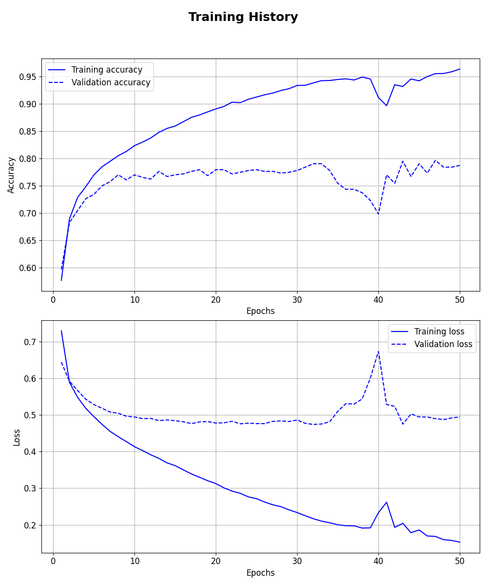

### Detailed Report of Test Set:

|              | precision    | recall       | f1-score     | support      |
| ------------ | ------------ | ------------ | ------------ | ------------ |
| chihuahua    | 0.8176       | 0.7987       | 0.8081       | 477          | 
| muffin       | 0.7752       | 0.7957       | 0.7853       | 416          | 
| micro avg    | 0.7973       | 0.7973       | 0.7973       | 893          | 
| macro avg    | 0.7964       | 0.7972       | 0.7967       | 893          | 
| weighted avg | 0.7978       | 0.7973       | 0.7975       | 893          | 
| samples avg  | 0.7973       | 0.7973       | 0.7973       | 893          | 

## trial_46

*    *Start Time*: 2024-10-16 12:23:22

*    *Duration*: 15.714

*    *Directory*: [Link](./trial_46)

### Hyperparameters:

| Hyperparameter         | Value                  |
| ---------------------- | ---------------------- |
| units1                 | 64                     |
| units2                 | 512                    |
| learning_rate          | 2.7127197529216294e-05 |

### Evaluation Metrics:

|           | train     | val       | test      |
| --------- | --------- | --------- | --------- |
| accuracy  | 0.9175    | 0.7750    | 0.7973    | 
| precision | 0.9175    | 0.7750    | 0.7973    | 
| recall    | 0.9175    | 0.7750    | 0.7973    | 
| f1        | 0.9175    | 0.7750    | 0.7973    | 

### Figures:

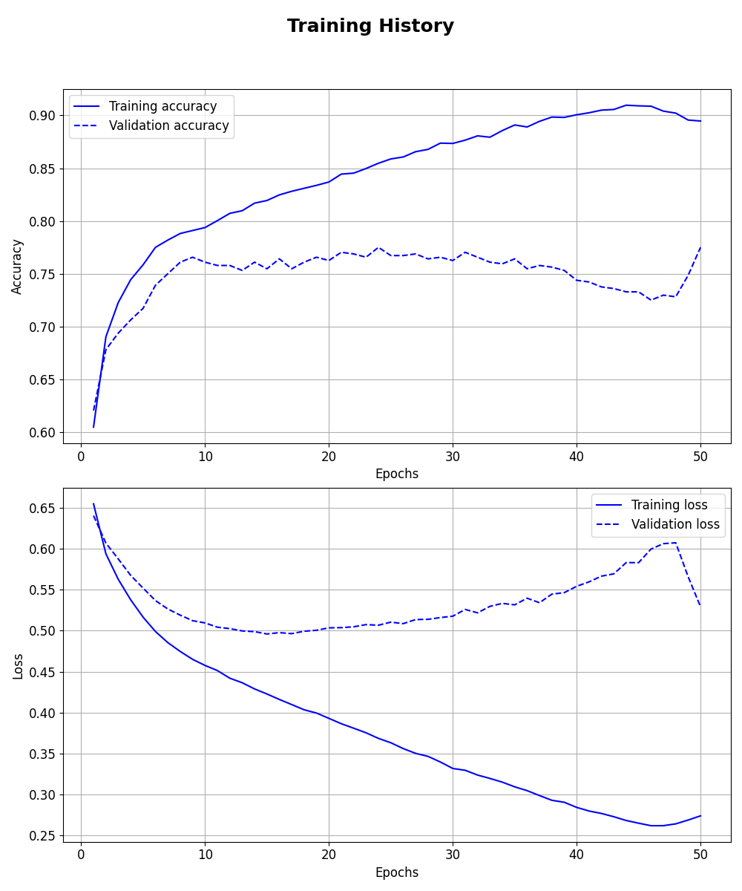

### Detailed Report of Test Set:

|              | precision    | recall       | f1-score     | support      |
| ------------ | ------------ | ------------ | ------------ | ------------ |
| chihuahua    | 0.8136       | 0.8050       | 0.8093       | 477          | 
| muffin       | 0.7791       | 0.7885       | 0.7838       | 416          | 
| micro avg    | 0.7973       | 0.7973       | 0.7973       | 893          | 
| macro avg    | 0.7963       | 0.7967       | 0.7965       | 893          | 
| weighted avg | 0.7975       | 0.7973       | 0.7974       | 893          | 
| samples avg  | 0.7973       | 0.7973       | 0.7973       | 893          | 

## trial_47

*    *Start Time*: 2024-10-16 12:23:39

*    *Duration*: 15.877

*    *Directory*: [Link](./trial_47)

### Hyperparameters:

| Hyperparameter         | Value                  |
| ---------------------- | ---------------------- |
| units1                 | 256                    |
| units2                 | 256                    |
| learning_rate          | 1.0091431359244687e-05 |

### Evaluation Metrics:

|           | train     | val       | test      |
| --------- | --------- | --------- | --------- |
| accuracy  | 0.9491    | 0.7672    | 0.7973    | 
| precision | 0.9491    | 0.7672    | 0.7973    | 
| recall    | 0.9491    | 0.7672    | 0.7973    | 
| f1        | 0.9491    | 0.7672    | 0.7973    | 

### Figures:

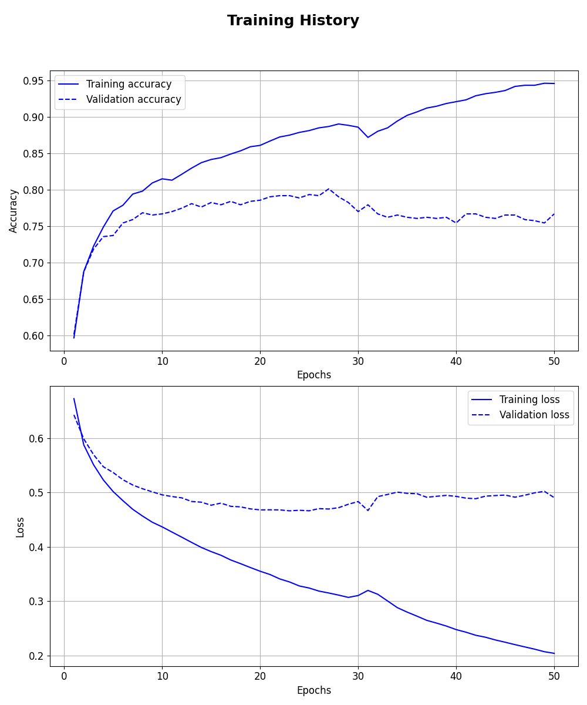

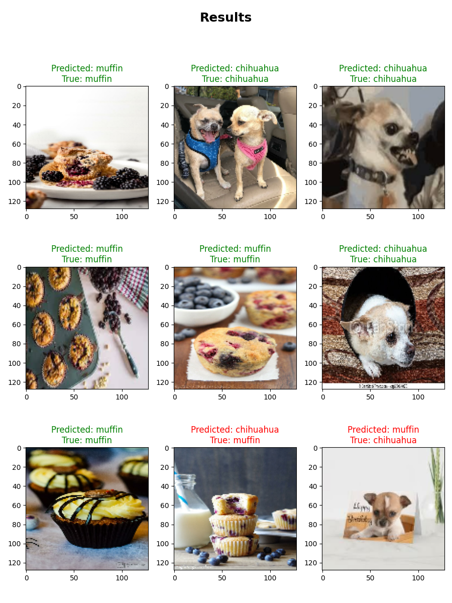

### Detailed Report of Test Set:

|              | precision    | recall       | f1-score     | support      |
| ------------ | ------------ | ------------ | ------------ | ------------ |
| chihuahua    | 0.7772       | 0.8700       | 0.8210       | 477          | 
| muffin       | 0.8273       | 0.7139       | 0.7665       | 416          | 
| micro avg    | 0.7973       | 0.7973       | 0.7973       | 893          | 
| macro avg    | 0.8022       | 0.7920       | 0.7937       | 893          | 
| weighted avg | 0.8005       | 0.7973       | 0.7956       | 893          | 
| samples avg  | 0.7973       | 0.7973       | 0.7973       | 893          | 

## trial_55

*    *Start Time*: 2024-10-16 12:26:01

*    *Duration*: 29.814

*    *Directory*: [Link](./trial_55)

### Hyperparameters:

| Hyperparameter        | Value                 |
| --------------------- | --------------------- |
| units1                | 512                   |
| units2                | 512                   |
| learning_rate         | 2.010410503228997e-05 |

### Evaluation Metrics:

|           | train     | val       | test      |
| --------- | --------- | --------- | --------- |
| accuracy  | 0.9591    | 0.7781    | 0.7973    | 
| precision | 0.9591    | 0.7781    | 0.7973    | 
| recall    | 0.9591    | 0.7781    | 0.7973    | 
| f1        | 0.9591    | 0.7781    | 0.7973    | 

### Figures:

### Detailed Report of Test Set:

|              | precision    | recall       | f1-score     | support      |
| ------------ | ------------ | ------------ | ------------ | ------------ |
| chihuahua    | 0.8122       | 0.8071       | 0.8097       | 477          | 
| muffin       | 0.7804       | 0.7861       | 0.7832       | 416          | 
| micro avg    | 0.7973       | 0.7973       | 0.7973       | 893          | 
| macro avg    | 0.7963       | 0.7966       | 0.7965       | 893          | 
| weighted avg | 0.7974       | 0.7973       | 0.7974       | 893          | 
| samples avg  | 0.7973       | 0.7973       | 0.7973       | 893          | 

## trial_56

*    *Start Time*: 2024-10-16 12:26:32

*    *Duration*: 15.796

*    *Directory*: [Link](./trial_56)

### Hyperparameters:

| Hyperparameter         | Value                  |
| ---------------------- | ---------------------- |
| units1                 | 32                     |
| units2                 | 512                    |
| learning_rate          | 1.3503380871031802e-05 |

### Evaluation Metrics:

|           | train     | val       | test      |
| --------- | --------- | --------- | --------- |
| accuracy  | 0.8881    | 0.7594    | 0.7973    | 
| precision | 0.8881    | 0.7594    | 0.7973    | 
| recall    | 0.8881    | 0.7594    | 0.7973    | 
| f1        | 0.8881    | 0.7594    | 0.7973    | 

### Figures:

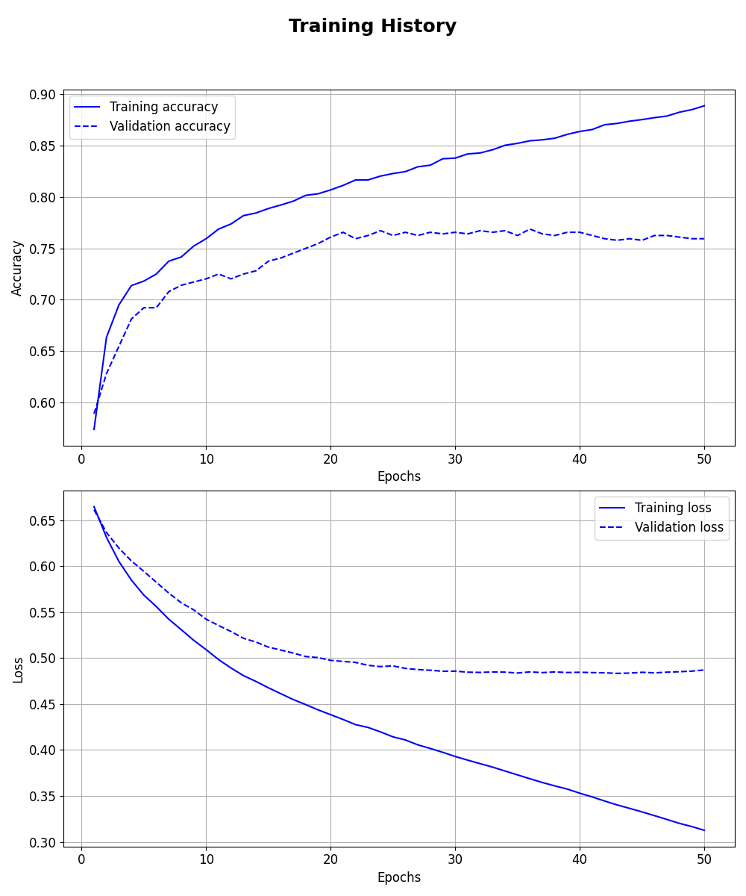

### Detailed Report of Test Set:

|              | precision    | recall       | f1-score     | support      |
| ------------ | ------------ | ------------ | ------------ | ------------ |
| chihuahua    | 0.7846       | 0.8553       | 0.8185       | 477          | 
| muffin       | 0.8150       | 0.7308       | 0.7706       | 416          | 
| micro avg    | 0.7973       | 0.7973       | 0.7973       | 893          | 
| macro avg    | 0.7998       | 0.7931       | 0.7945       | 893          | 
| weighted avg | 0.7988       | 0.7973       | 0.7962       | 893          | 
| samples avg  | 0.7973       | 0.7973       | 0.7973       | 893          | 

## trial_24

*    *Start Time*: 2024-10-16 12:16:12

*    *Duration*: 23.278

*    *Directory*: [Link](./trial_24)

### Hyperparameters:

| Hyperparameter        | Value                 |
| --------------------- | --------------------- |
| units1                | 512                   |
| units2                | 512                   |
| learning_rate         | 1.008627117028012e-05 |

### Evaluation Metrics:

|           | train     | val       | test      |
| --------- | --------- | --------- | --------- |
| accuracy  | 0.9744    | 0.7734    | 0.7962    | 
| precision | 0.9744    | 0.7734    | 0.7962    | 
| recall    | 0.9744    | 0.7734    | 0.7962    | 
| f1        | 0.9744    | 0.7734    | 0.7962    | 

### Figures:

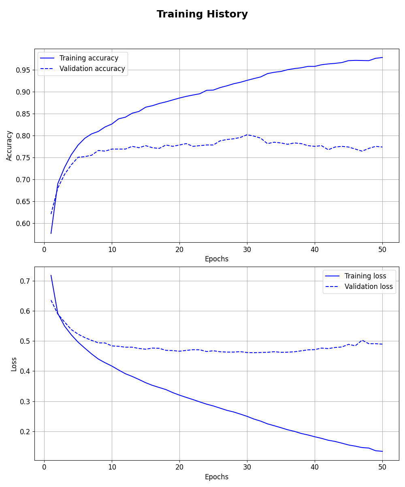

### Detailed Report of Test Set:

|              | precision    | recall       | f1-score     | support      |
| ------------ | ------------ | ------------ | ------------ | ------------ |
| chihuahua    | 0.7980       | 0.8281       | 0.8128       | 477          | 
| muffin       | 0.7940       | 0.7596       | 0.7764       | 416          | 
| micro avg    | 0.7962       | 0.7962       | 0.7962       | 893          | 
| macro avg    | 0.7960       | 0.7939       | 0.7946       | 893          | 
| weighted avg | 0.7961       | 0.7962       | 0.7958       | 893          | 
| samples avg  | 0.7962       | 0.7962       | 0.7962       | 893          | 

## trial_64

*    *Start Time*: 2024-10-16 12:29:27

*    *Duration*: 16.012

*    *Directory*: [Link](./trial_64)

### Hyperparameters:

| Hyperparameter         | Value                  |
| ---------------------- | ---------------------- |
| units1                 | 512                    |
| units2                 | 512                    |
| learning_rate          | 2.3123315844732657e-05 |

### Evaluation Metrics:

|           | train     | val       | test      |
| --------- | --------- | --------- | --------- |
| accuracy  | 0.9506    | 0.7703    | 0.7962    | 
| precision | 0.9506    | 0.7703    | 0.7962    | 
| recall    | 0.9506    | 0.7703    | 0.7962    | 
| f1        | 0.9506    | 0.7703    | 0.7962    | 

### Figures:

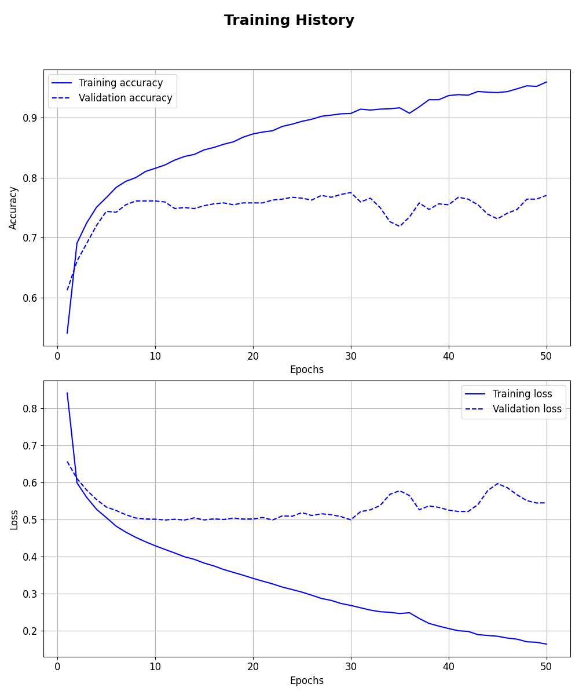

### Detailed Report of Test Set:

|              | precision    | recall       | f1-score     | support      |
| ------------ | ------------ | ------------ | ------------ | ------------ |
| chihuahua    | 0.7842       | 0.8532       | 0.8173       | 477          | 
| muffin       | 0.8128       | 0.7308       | 0.7696       | 416          | 
| micro avg    | 0.7962       | 0.7962       | 0.7962       | 893          | 
| macro avg    | 0.7985       | 0.7920       | 0.7934       | 893          | 
| weighted avg | 0.7975       | 0.7962       | 0.7951       | 893          | 
| samples avg  | 0.7962       | 0.7962       | 0.7962       | 893          | 

## trial_92

*    *Start Time*: 2024-10-16 12:39:29

*    *Duration*: 15.631

*    *Directory*: [Link](./trial_92)

### Hyperparameters:

| Hyperparameter         | Value                  |
| ---------------------- | ---------------------- |
| units1                 | 512                    |
| units2                 | 256                    |
| learning_rate          | 1.0167792013846721e-05 |

### Evaluation Metrics:

|           | train     | val       | test      |
| --------- | --------- | --------- | --------- |
| accuracy  | 0.9678    | 0.7875    | 0.7962    | 
| precision | 0.9678    | 0.7875    | 0.7962    | 
| recall    | 0.9678    | 0.7875    | 0.7962    | 
| f1        | 0.9678    | 0.7875    | 0.7962    | 

### Figures:

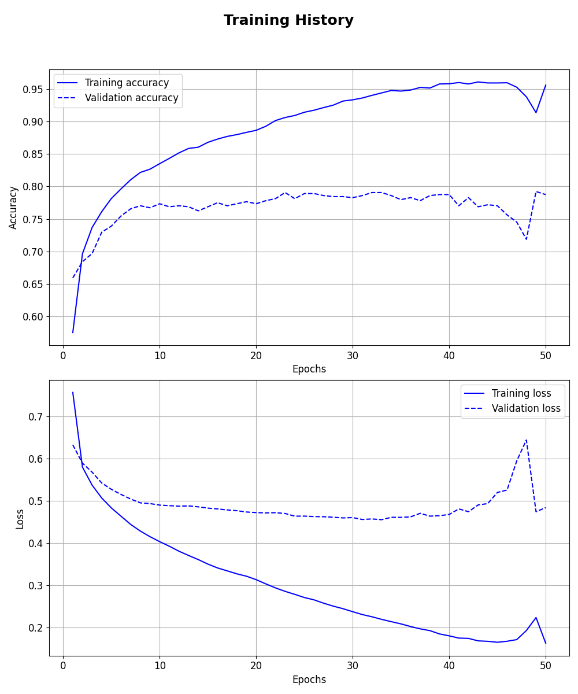

### Detailed Report of Test Set:

|              | precision    | recall       | f1-score     | support      |
| ------------ | ------------ | ------------ | ------------ | ------------ |
| chihuahua    | 0.8054       | 0.8155       | 0.8104       | 477          | 
| muffin       | 0.7854       | 0.7740       | 0.7797       | 416          | 
| micro avg    | 0.7962       | 0.7962       | 0.7962       | 893          | 
| macro avg    | 0.7954       | 0.7948       | 0.7950       | 893          | 
| weighted avg | 0.7961       | 0.7962       | 0.7961       | 893          | 
| samples avg  | 0.7962       | 0.7962       | 0.7962       | 893          | 

## trial_20

*    *Start Time*: 2024-10-16 12:15:05

*    *Duration*: 15.964

*    *Directory*: [Link](./trial_20)

### Hyperparameters:

| Hyperparameter       | Value                |
| -------------------- | -------------------- |
| units1               | 512                  |
| units2               | 512                  |
| learning_rate        | 8.89008652073232e-05 |

### Evaluation Metrics:

|           | train     | val       | test      |
| --------- | --------- | --------- | --------- |
| accuracy  | 0.9441    | 0.7563    | 0.7951    | 
| precision | 0.9441    | 0.7563    | 0.7951    | 
| recall    | 0.9441    | 0.7563    | 0.7951    | 
| f1        | 0.9441    | 0.7562    | 0.7951    | 

### Figures:

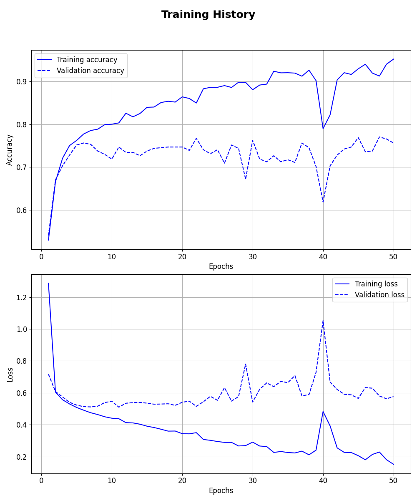

### Detailed Report of Test Set:

|              | precision    | recall       | f1-score     | support      |
| ------------ | ------------ | ------------ | ------------ | ------------ |
| chihuahua    | 0.8141       | 0.7987       | 0.8063       | 477          | 
| muffin       | 0.7741       | 0.7909       | 0.7824       | 416          | 
| micro avg    | 0.7951       | 0.7951       | 0.7951       | 893          | 
| macro avg    | 0.7941       | 0.7948       | 0.7944       | 893          | 
| weighted avg | 0.7955       | 0.7951       | 0.7952       | 893          | 
| samples avg  | 0.7951       | 0.7951       | 0.7951       | 893          | 

## trial_35

*    *Start Time*: 2024-10-16 12:20:04

*    *Duration*: 28.860

*    *Directory*: [Link](./trial_35)

### Hyperparameters:

| Hyperparameter         | Value                  |
| ---------------------- | ---------------------- |
| units1                 | 128                    |
| units2                 | 512                    |
| learning_rate          | 1.0371700763909312e-05 |

### Evaluation Metrics:

|           | train     | val       | test      |
| --------- | --------- | --------- | --------- |
| accuracy  | 0.9388    | 0.7766    | 0.7928    | 
| precision | 0.9388    | 0.7766    | 0.7928    | 
| recall    | 0.9388    | 0.7766    | 0.7928    | 
| f1        | 0.9387    | 0.7766    | 0.7928    | 

### Figures:

### Detailed Report of Test Set:

|              | precision    | recall       | f1-score     | support      |
| ------------ | ------------ | ------------ | ------------ | ------------ |
| chihuahua    | 0.7829       | 0.8470       | 0.8137       | 477          | 
| muffin       | 0.8064       | 0.7308       | 0.7667       | 416          | 
| micro avg    | 0.7928       | 0.7928       | 0.7928       | 893          | 
| macro avg    | 0.7947       | 0.7889       | 0.7902       | 893          | 
| weighted avg | 0.7939       | 0.7928       | 0.7918       | 893          | 
| samples avg  | 0.7928       | 0.7928       | 0.7928       | 893          | 

## trial_99

*    *Start Time*: 2024-10-16 12:41:53

*    *Duration*: 16.407

*    *Directory*: [Link](./trial_99)

### Hyperparameters:

| Hyperparameter         | Value                  |
| ---------------------- | ---------------------- |
| units1                 | 256                    |
| units2                 | 256                    |
| learning_rate          | 1.9021659499601177e-05 |

### Evaluation Metrics:

|           | train     | val       | test      |
| --------- | --------- | --------- | --------- |
| accuracy  | 0.9381    | 0.7812    | 0.7928    | 
| precision | 0.9381    | 0.7812    | 0.7928    | 
| recall    | 0.9381    | 0.7812    | 0.7928    | 
| f1        | 0.9381    | 0.7812    | 0.7928    | 

### Figures:

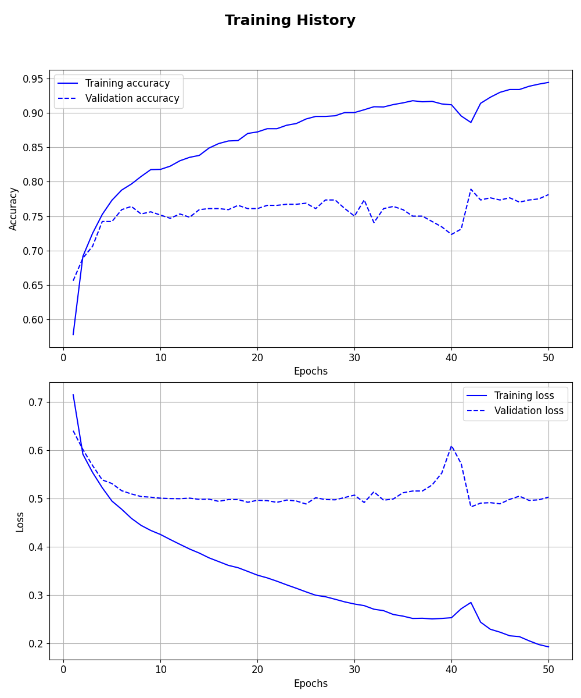

### Detailed Report of Test Set:

|              | precision    | recall       | f1-score     | support      |
| ------------ | ------------ | ------------ | ------------ | ------------ |
| chihuahua    | 0.8054       | 0.8071       | 0.8063       | 477          | 
| muffin       | 0.7783       | 0.7764       | 0.7774       | 416          | 
| micro avg    | 0.7928       | 0.7928       | 0.7928       | 893          | 
| macro avg    | 0.7919       | 0.7918       | 0.7918       | 893          | 
| weighted avg | 0.7928       | 0.7928       | 0.7928       | 893          | 
| samples avg  | 0.7928       | 0.7928       | 0.7928       | 893          | 

## trial_11

*    *Start Time*: 2024-10-16 12:12:33

*    *Duration*: 16.745

*    *Directory*: [Link](./trial_11)

### Hyperparameters:

| Hyperparameter        | Value                 |
| --------------------- | --------------------- |
| units1                | 512                   |
| units2                | 256                   |
| learning_rate         | 1.943418487808909e-05 |

### Evaluation Metrics:

|           | train     | val       | test      |
| --------- | --------- | --------- | --------- |
| accuracy  | 0.9513    | 0.7906    | 0.7917    | 
| precision | 0.9513    | 0.7906    | 0.7917    | 
| recall    | 0.9513    | 0.7906    | 0.7917    | 
| f1        | 0.9512    | 0.7906    | 0.7917    | 

### Figures:

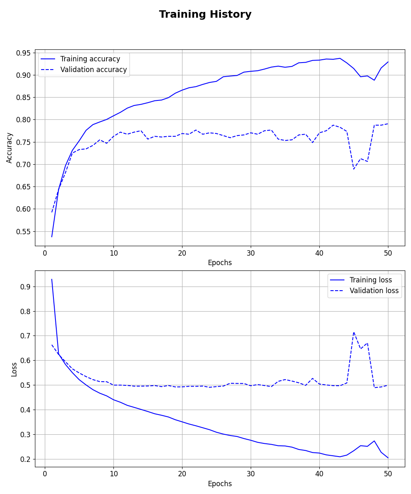

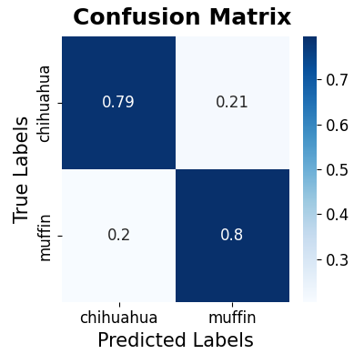

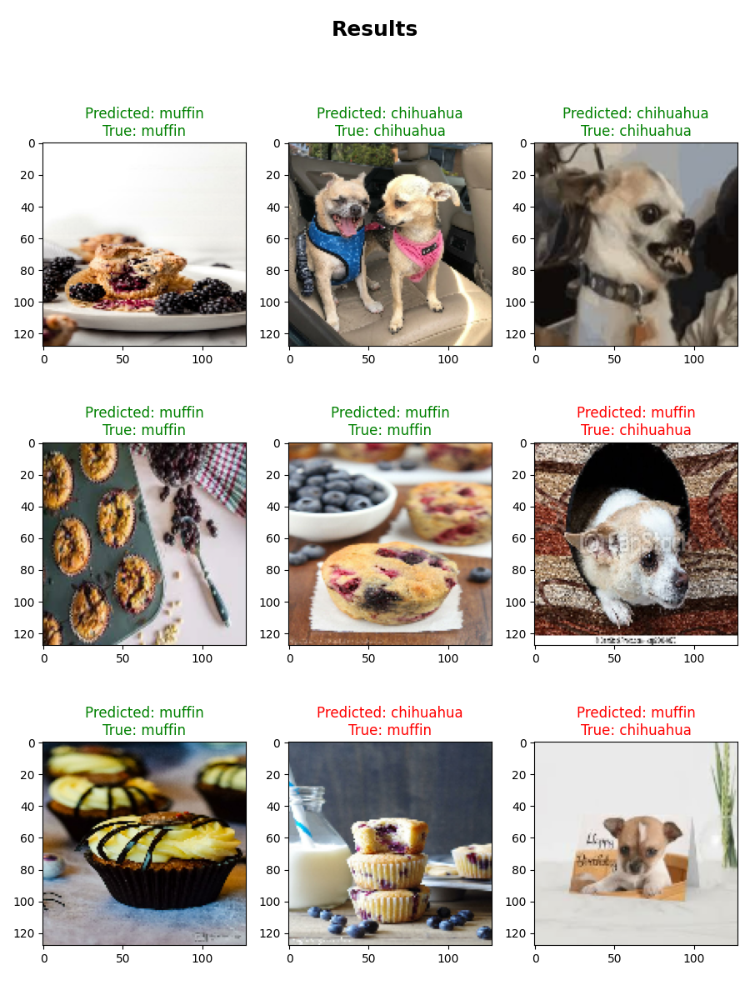

### Detailed Report of Test Set:

|              | precision    | recall       | f1-score     | support      |
| ------------ | ------------ | ------------ | ------------ | ------------ |
| chihuahua    | 0.8156       | 0.7883       | 0.8017       | 477          | 
| muffin       | 0.7662       | 0.7957       | 0.7807       | 416          | 
| micro avg    | 0.7917       | 0.7917       | 0.7917       | 893          | 
| macro avg    | 0.7909       | 0.7920       | 0.7912       | 893          | 
| weighted avg | 0.7926       | 0.7917       | 0.7919       | 893          | 
| samples avg  | 0.7917       | 0.7917       | 0.7917       | 893          | 

## trial_88

*    *Start Time*: 2024-10-16 12:37:54

*    *Duration*: 32.626

*    *Directory*: [Link](./trial_88)

### Hyperparameters:

| Hyperparameter         | Value                  |
| ---------------------- | ---------------------- |
| units1                 | 512                    |
| units2                 | 256                    |
| learning_rate          | 1.2009269995508308e-05 |

### Evaluation Metrics:

|           | train     | val       | test      |
| --------- | --------- | --------- | --------- |
| accuracy  | 0.9494    | 0.7828    | 0.7917    | 
| precision | 0.9494    | 0.7828    | 0.7917    | 
| recall    | 0.9494    | 0.7828    | 0.7917    | 
| f1        | 0.9494    | 0.7828    | 0.7917    | 

### Figures:

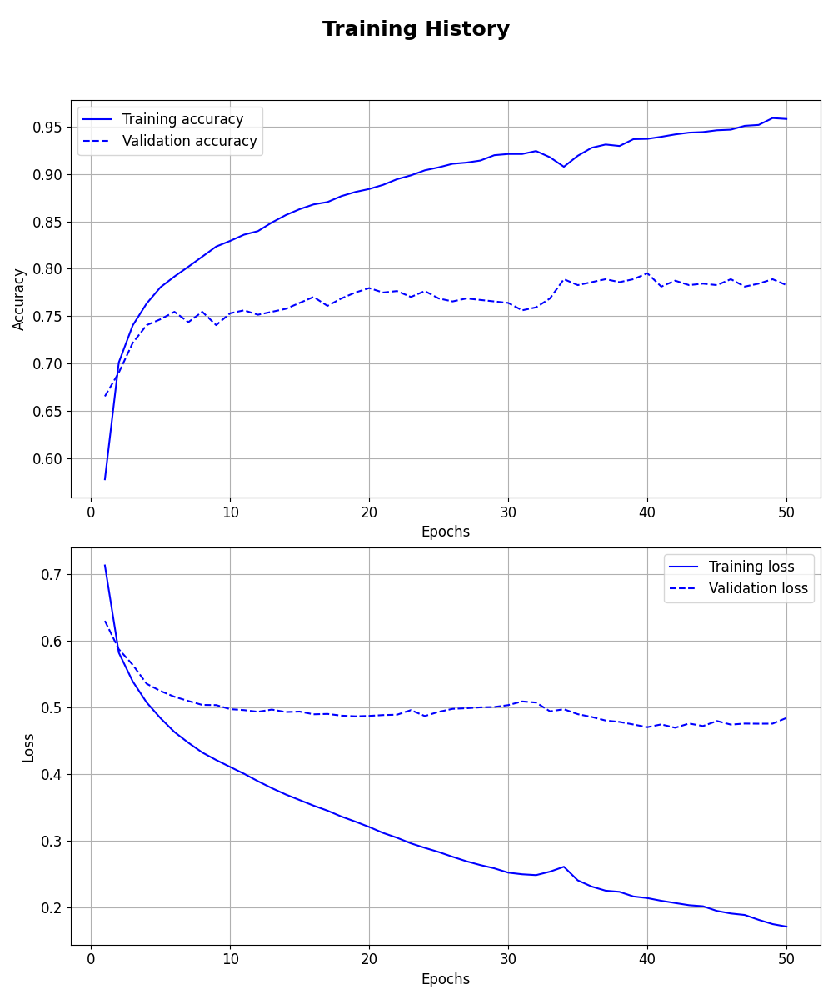

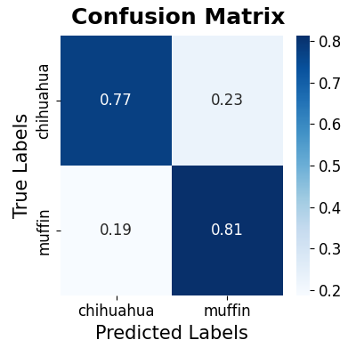

### Detailed Report of Test Set:

|              | precision    | recall       | f1-score     | support      |
| ------------ | ------------ | ------------ | ------------ | ------------ |
| chihuahua    | 0.8255       | 0.7736       | 0.7987       | 477          | 
| muffin       | 0.7578       | 0.8125       | 0.7842       | 416          | 
| micro avg    | 0.7917       | 0.7917       | 0.7917       | 893          | 
| macro avg    | 0.7917       | 0.7930       | 0.7915       | 893          | 
| weighted avg | 0.7940       | 0.7917       | 0.7920       | 893          | 
| samples avg  | 0.7917       | 0.7917       | 0.7917       | 893          | 

## trial_75

*    *Start Time*: 2024-10-16 12:33:09

*    *Duration*: 27.608

*    *Directory*: [Link](./trial_75)

### Hyperparameters:

| Hyperparameter         | Value                  |
| ---------------------- | ---------------------- |
| units1                 | 512                    |
| units2                 | 256                    |
| learning_rate          | 2.2844288976519773e-05 |

### Evaluation Metrics:

|           | train     | val       | test      |
| --------- | --------- | --------- | --------- |
| accuracy  | 0.9575    | 0.7563    | 0.7906    | 
| precision | 0.9575    | 0.7563    | 0.7906    | 
| recall    | 0.9575    | 0.7563    | 0.7906    | 
| f1        | 0.9575    | 0.7562    | 0.7906    | 

### Figures:

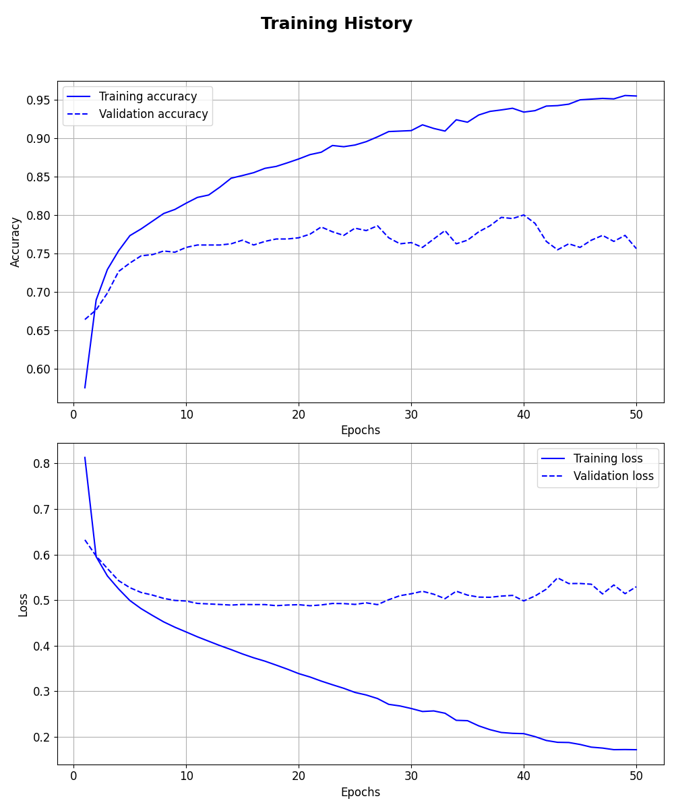

### Detailed Report of Test Set:

|              | precision    | recall       | f1-score     | support      |
| ------------ | ------------ | ------------ | ------------ | ------------ |
| chihuahua    | 0.7810       | 0.8449       | 0.8117       | 477          | 
| muffin       | 0.8037       | 0.7284       | 0.7642       | 416          | 
| micro avg    | 0.7906       | 0.7906       | 0.7906       | 893          | 
| macro avg    | 0.7924       | 0.7866       | 0.7879       | 893          | 
| weighted avg | 0.7916       | 0.7906       | 0.7896       | 893          | 
| samples avg  | 0.7906       | 0.7906       | 0.7906       | 893          | 

## trial_49

*    *Start Time*: 2024-10-16 12:24:12

*    *Duration*: 15.972

*    *Directory*: [Link](./trial_49)

### Hyperparameters:

| Hyperparameter        | Value                 |
| --------------------- | --------------------- |
| units1                | 256                   |
| units2                | 512                   |
| learning_rate         | 6.702821881218997e-05 |

### Evaluation Metrics:

|           | train     | val       | test      |
| --------- | --------- | --------- | --------- |
| accuracy  | 0.9475    | 0.7750    | 0.7895    | 
| precision | 0.9475    | 0.7750    | 0.7895    | 
| recall    | 0.9475    | 0.7750    | 0.7895    | 
| f1        | 0.9475    | 0.7750    | 0.7895    | 

### Figures:

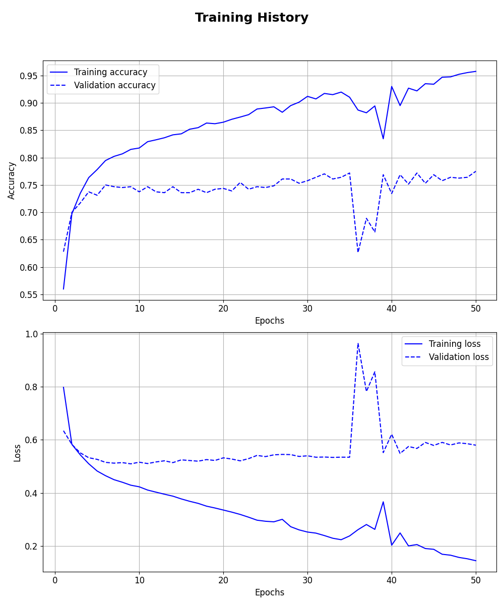

### Detailed Report of Test Set:

|              | precision    | recall       | f1-score     | support      |
| ------------ | ------------ | ------------ | ------------ | ------------ |
| chihuahua    | 0.8068       | 0.7966       | 0.8017       | 477          | 
| muffin       | 0.7701       | 0.7812       | 0.7757       | 416          | 
| micro avg    | 0.7895       | 0.7895       | 0.7895       | 893          | 
| macro avg    | 0.7885       | 0.7889       | 0.7887       | 893          | 
| weighted avg | 0.7897       | 0.7895       | 0.7896       | 893          | 
| samples avg  | 0.7895       | 0.7895       | 0.7895       | 893          | 

## trial_76

*    *Start Time*: 2024-10-16 12:33:37

*    *Duration*: 17.011

*    *Directory*: [Link](./trial_76)

### Hyperparameters:

| Hyperparameter         | Value                  |
| ---------------------- | ---------------------- |
| units1                 | 512                    |
| units2                 | 256                    |
| learning_rate          | 1.8117417335316915e-05 |

### Evaluation Metrics:

|           | train     | val       | test      |
| --------- | --------- | --------- | --------- |
| accuracy  | 0.9269    | 0.7688    | 0.7895    | 
| precision | 0.9269    | 0.7688    | 0.7895    | 
| recall    | 0.9269    | 0.7688    | 0.7895    | 
| f1        | 0.9269    | 0.7687    | 0.7895    | 

### Figures:

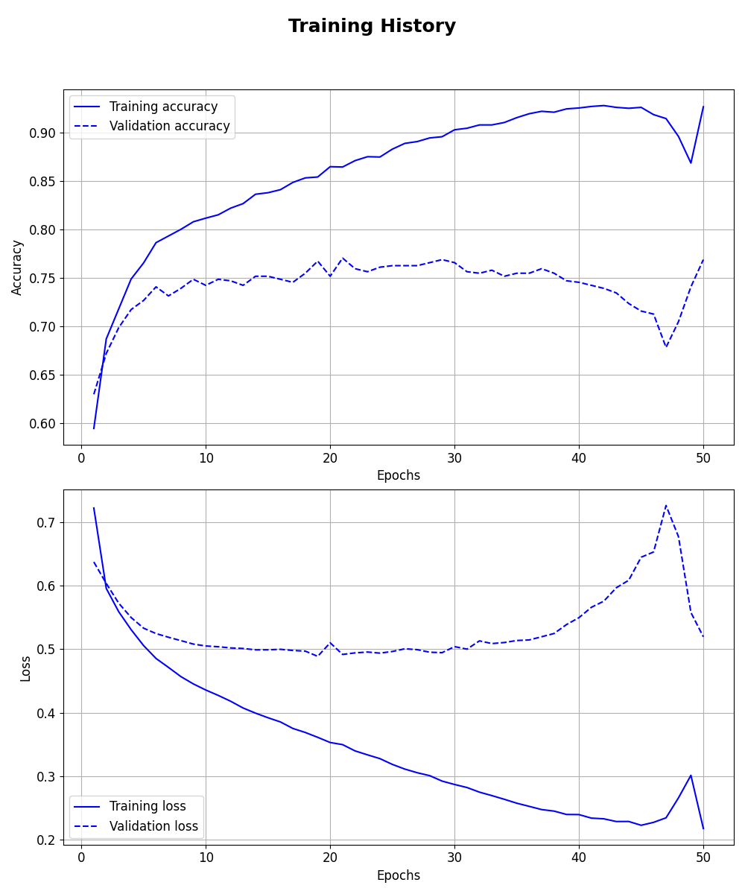

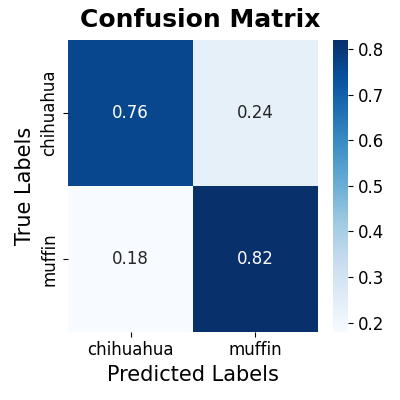

### Detailed Report of Test Set:

|              | precision    | recall       | f1-score     | support      |
| ------------ | ------------ | ------------ | ------------ | ------------ |
| chihuahua    | 0.8292       | 0.7631       | 0.7948       | 477          | 
| muffin       | 0.7511       | 0.8197       | 0.7839       | 416          | 
| micro avg    | 0.7895       | 0.7895       | 0.7895       | 893          | 
| macro avg    | 0.7901       | 0.7914       | 0.7893       | 893          | 
| weighted avg | 0.7928       | 0.7895       | 0.7897       | 893          | 
| samples avg  | 0.7895       | 0.7895       | 0.7895       | 893          | 

## trial_98

*    *Start Time*: 2024-10-16 12:41:35

*    *Duration*: 17.177

*    *Directory*: [Link](./trial_98)

### Hyperparameters:

| Hyperparameter         | Value                  |
| ---------------------- | ---------------------- |
| units1                 | 512                    |
| units2                 | 128                    |
| learning_rate          | 2.5085495312707785e-05 |

### Evaluation Metrics:

|           | train     | val       | test      |
| --------- | --------- | --------- | --------- |
| accuracy  | 0.9269    | 0.7547    | 0.7895    | 
| precision | 0.9269    | 0.7547    | 0.7895    | 
| recall    | 0.9269    | 0.7547    | 0.7895    | 
| f1        | 0.9269    | 0.7547    | 0.7895    | 

### Figures:

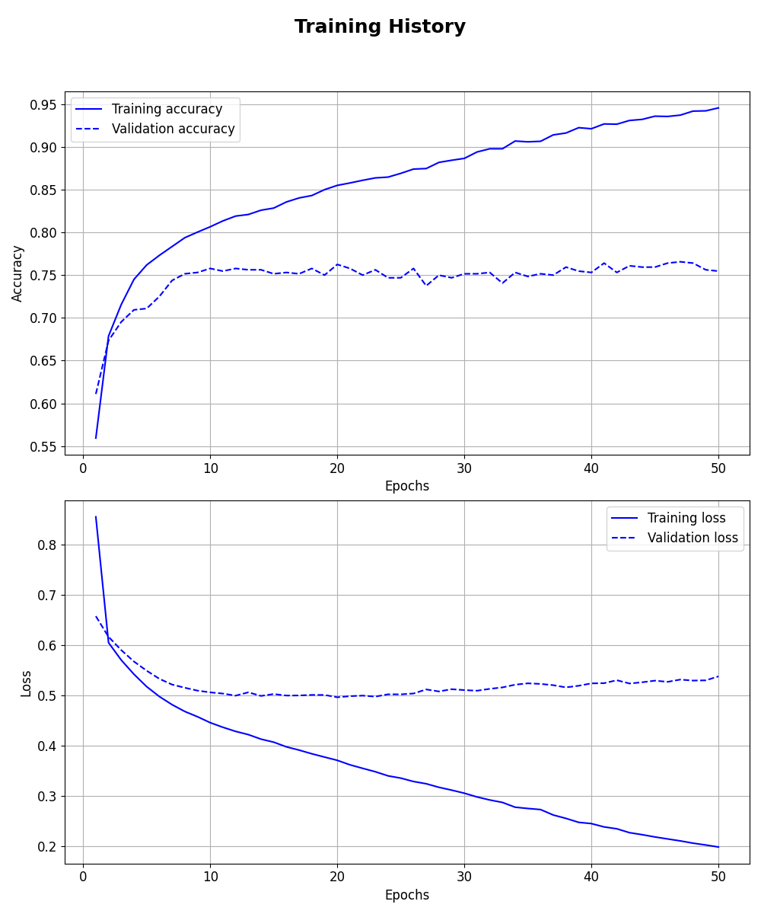

### Detailed Report of Test Set:

|              | precision    | recall       | f1-score     | support      |
| ------------ | ------------ | ------------ | ------------ | ------------ |
| chihuahua    | 0.7839       | 0.8365       | 0.8093       | 477          | 
| muffin       | 0.7969       | 0.7356       | 0.7650       | 416          | 
| micro avg    | 0.7895       | 0.7895       | 0.7895       | 893          | 
| macro avg    | 0.7904       | 0.7860       | 0.7872       | 893          | 
| weighted avg | 0.7899       | 0.7895       | 0.7887       | 893          | 
| samples avg  | 0.7895       | 0.7895       | 0.7895       | 893          | 

## trial_60

*    *Start Time*: 2024-10-16 12:27:50

*    *Duration*: 15.564

*    *Directory*: [Link](./trial_60)

### Hyperparameters:

| Hyperparameter         | Value                  |
| ---------------------- | ---------------------- |
| units1                 | 128                    |
| units2                 | 512                    |
| learning_rate          | 5.4061629578711595e-05 |

### Evaluation Metrics:

|           | train     | val       | test      |
| --------- | --------- | --------- | --------- |
| accuracy  | 0.9419    | 0.7688    | 0.7884    | 
| precision | 0.9419    | 0.7688    | 0.7884    | 
| recall    | 0.9419    | 0.7688    | 0.7884    | 
| f1        | 0.9419    | 0.7687    | 0.7884    | 

### Figures:

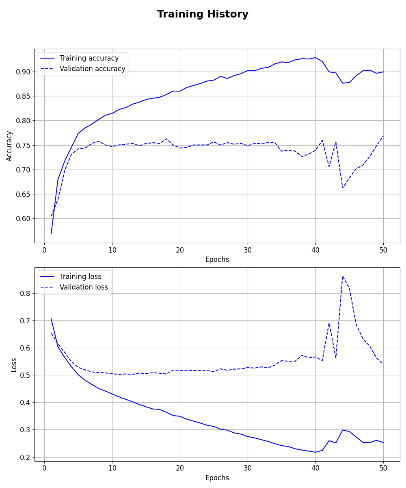

### Detailed Report of Test Set:

|              | precision    | recall       | f1-score     | support      |
| ------------ | ------------ | ------------ | ------------ | ------------ |
| chihuahua    | 0.7939       | 0.8155       | 0.8046       | 477          | 
| muffin       | 0.7816       | 0.7572       | 0.7692       | 416          | 
| micro avg    | 0.7884       | 0.7884       | 0.7884       | 893          | 
| macro avg    | 0.7878       | 0.7864       | 0.7869       | 893          | 
| weighted avg | 0.7882       | 0.7884       | 0.7881       | 893          | 
| samples avg  | 0.7884       | 0.7884       | 0.7884       | 893          | 

## trial_33

*    *Start Time*: 2024-10-16 12:19:31

*    *Duration*: 16.239

*    *Directory*: [Link](./trial_33)

### Hyperparameters:

| Hyperparameter         | Value                  |
| ---------------------- | ---------------------- |
| units1                 | 512                    |
| units2                 | 512                    |
| learning_rate          | 1.6374687731709444e-05 |

### Evaluation Metrics:

|           | train     | val       | test      |
| --------- | --------- | --------- | --------- |
| accuracy  | 0.9406    | 0.7734    | 0.7872    | 
| precision | 0.9406    | 0.7734    | 0.7872    | 
| recall    | 0.9406    | 0.7734    | 0.7872    | 
| f1        | 0.9406    | 0.7734    | 0.7872    | 

### Figures:

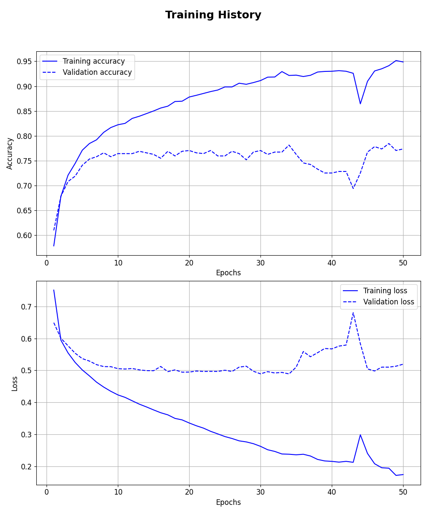

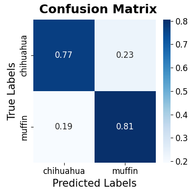

### Detailed Report of Test Set:

|              | precision    | recall       | f1-score     | support      |
| ------------ | ------------ | ------------ | ------------ | ------------ |
| chihuahua    | 0.8196       | 0.7715       | 0.7948       | 477          | 
| muffin       | 0.7545       | 0.8053       | 0.7791       | 416          | 
| micro avg    | 0.7872       | 0.7872       | 0.7872       | 893          | 
| macro avg    | 0.7871       | 0.7884       | 0.7869       | 893          | 
| weighted avg | 0.7893       | 0.7872       | 0.7875       | 893          | 
| samples avg  | 0.7872       | 0.7872       | 0.7872       | 893          | 

## trial_44

*    *Start Time*: 2024-10-16 12:22:48

*    *Duration*: 17.631

*    *Directory*: [Link](./trial_44)

### Hyperparameters:

| Hyperparameter        | Value                 |
| --------------------- | --------------------- |
| units1                | 128                   |
| units2                | 128                   |
| learning_rate         | 4.642723845024546e-05 |

### Evaluation Metrics:

|           | train     | val       | test      |
| --------- | --------- | --------- | --------- |
| accuracy  | 0.9178    | 0.7672    | 0.7872    | 
| precision | 0.9178    | 0.7672    | 0.7872    | 
| recall    | 0.9178    | 0.7672    | 0.7872    | 
| f1        | 0.9178    | 0.7672    | 0.7872    | 

### Figures:

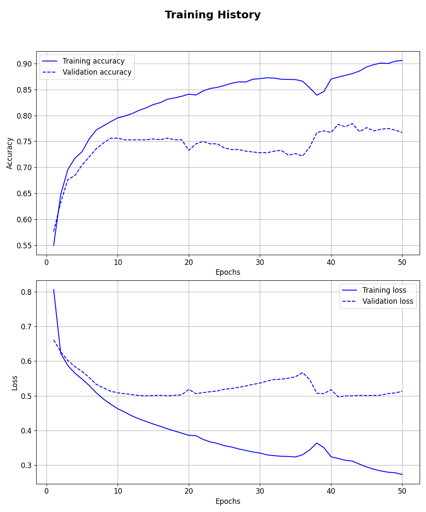

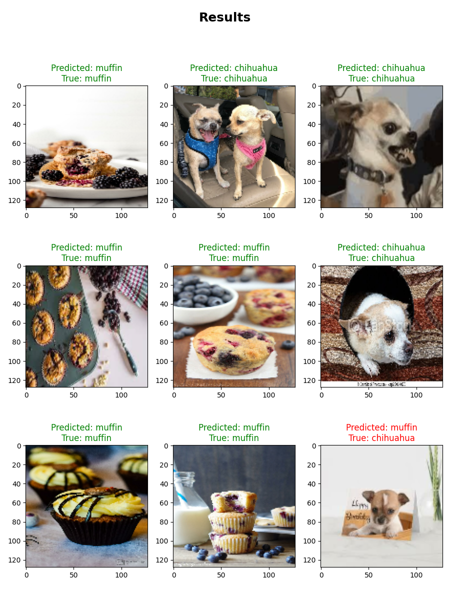

### Detailed Report of Test Set:

|              | precision    | recall       | f1-score     | support      |
| ------------ | ------------ | ------------ | ------------ | ------------ |
| chihuahua    | 0.7776       | 0.8428       | 0.8089       | 477          | 
| muffin       | 0.8005       | 0.7236       | 0.7601       | 416          | 
| micro avg    | 0.7872       | 0.7872       | 0.7872       | 893          | 
| macro avg    | 0.7890       | 0.7832       | 0.7845       | 893          | 
| weighted avg | 0.7883       | 0.7872       | 0.7861       | 893          | 
| samples avg  | 0.7872       | 0.7872       | 0.7872       | 893          | 

## trial_65

*    *Start Time*: 2024-10-16 12:29:44

*    *Duration*: 16.616

*    *Directory*: [Link](./trial_65)

### Hyperparameters:

| Hyperparameter         | Value                  |
| ---------------------- | ---------------------- |
| units1                 | 256                    |
| units2                 | 512                    |
| learning_rate          | 1.2602579174992756e-05 |

### Evaluation Metrics:

|           | train     | val       | test      |
| --------- | --------- | --------- | --------- |
| accuracy  | 0.9606    | 0.7688    | 0.7872    | 
| precision | 0.9606    | 0.7688    | 0.7872    | 
| recall    | 0.9606    | 0.7688    | 0.7872    | 
| f1        | 0.9606    | 0.7687    | 0.7872    | 

### Figures:

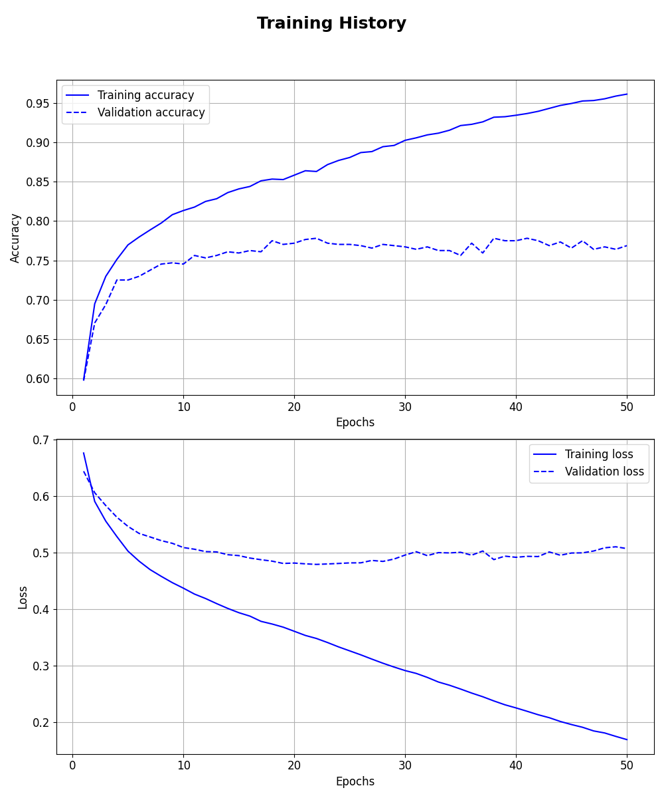

### Detailed Report of Test Set:

|              | precision    | recall       | f1-score     | support      |
| ------------ | ------------ | ------------ | ------------ | ------------ |
| chihuahua    | 0.7842       | 0.8302       | 0.8065       | 477          | 
| muffin       | 0.7912       | 0.7380       | 0.7637       | 416          | 
| micro avg    | 0.7872       | 0.7872       | 0.7872       | 893          | 
| macro avg    | 0.7877       | 0.7841       | 0.7851       | 893          | 
| weighted avg | 0.7875       | 0.7872       | 0.7866       | 893          | 
| samples avg  | 0.7872       | 0.7872       | 0.7872       | 893          | 

## trial_91

*    *Start Time*: 2024-10-16 12:39:02

*    *Duration*: 26.955

*    *Directory*: [Link](./trial_91)

### Hyperparameters:

| Hyperparameter         | Value                  |
| ---------------------- | ---------------------- |
| units1                 | 512                    |
| units2                 | 256                    |
| learning_rate          | 1.2462948401295252e-05 |

### Evaluation Metrics:

|           | train     | val       | test      |
| --------- | --------- | --------- | --------- |
| accuracy  | 0.9531    | 0.7766    | 0.7872    | 
| precision | 0.9531    | 0.7766    | 0.7872    | 
| recall    | 0.9531    | 0.7766    | 0.7872    | 
| f1        | 0.9531    | 0.7766    | 0.7872    | 

### Figures:

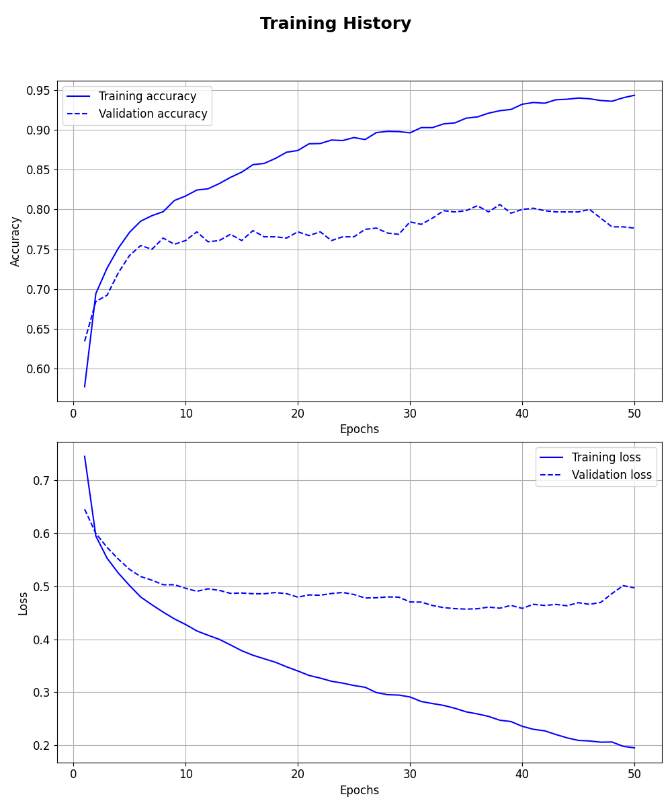

### Detailed Report of Test Set:

|              | precision    | recall       | f1-score     | support      |
| ------------ | ------------ | ------------ | ------------ | ------------ |
| chihuahua    | 0.7643       | 0.8700       | 0.8137       | 477          | 
| muffin       | 0.8229       | 0.6923       | 0.7520       | 416          | 
| micro avg    | 0.7872       | 0.7872       | 0.7872       | 893          | 
| macro avg    | 0.7936       | 0.7812       | 0.7828       | 893          | 
| weighted avg | 0.7916       | 0.7872       | 0.7850       | 893          | 
| samples avg  | 0.7872       | 0.7872       | 0.7872       | 893          | 

## trial_1

*    *Start Time*: 2024-10-16 12:09:33

*    *Duration*: 19.323

*    *Directory*: [Link](./trial_1)

### Hyperparameters:

| Hyperparameter        | Value                 |
| --------------------- | --------------------- |
| units1                | 256                   |
| units2                | 256                   |
| learning_rate         | 0.0001345632385819089 |

### Evaluation Metrics:

|           | train     | val       | test      |
| --------- | --------- | --------- | --------- |
| accuracy  | 0.9603    | 0.7625    | 0.7861    | 
| precision | 0.9603    | 0.7625    | 0.7861    | 
| recall    | 0.9603    | 0.7625    | 0.7861    | 
| f1        | 0.9603    | 0.7625    | 0.7861    | 

### Figures:

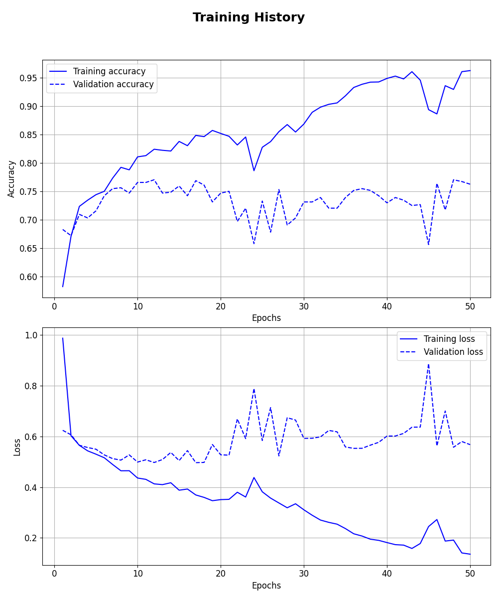

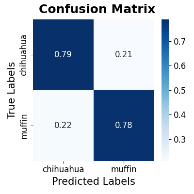

### Detailed Report of Test Set:

|              | precision    | recall       | f1-score     | support      |
| ------------ | ------------ | ------------ | ------------ | ------------ |
| chihuahua    | 0.8069       | 0.7883       | 0.7975       | 477          | 
| muffin       | 0.7635       | 0.7837       | 0.7734       | 416          | 
| micro avg    | 0.7861       | 0.7861       | 0.7861       | 893          | 
| macro avg    | 0.7852       | 0.7860       | 0.7854       | 893          | 
| weighted avg | 0.7866       | 0.7861       | 0.7863       | 893          | 
| samples avg  | 0.7861       | 0.7861       | 0.7861       | 893          | 

## trial_53

*    *Start Time*: 2024-10-16 12:25:28

*    *Duration*: 15.627

*    *Directory*: [Link](./trial_53)

### Hyperparameters:

| Hyperparameter        | Value                 |
| --------------------- | --------------------- |
| units1                | 512                   |
| units2                | 512                   |
| learning_rate         | 1.370801064992951e-05 |

### Evaluation Metrics:

|           | train     | val       | test      |
| --------- | --------- | --------- | --------- |
| accuracy  | 0.9381    | 0.7859    | 0.7861    | 
| precision | 0.9381    | 0.7859    | 0.7861    | 
| recall    | 0.9381    | 0.7859    | 0.7861    | 
| f1        | 0.9381    | 0.7859    | 0.7861    | 

### Figures:

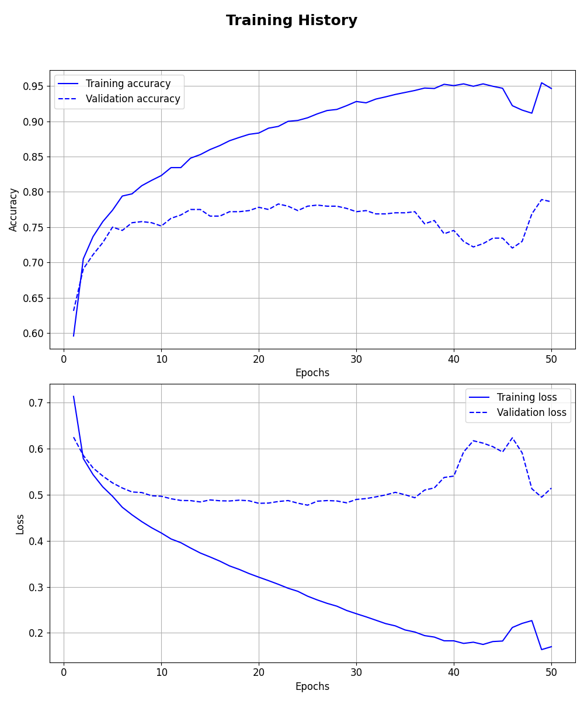

### Detailed Report of Test Set:

|              | precision    | recall       | f1-score     | support      |
| ------------ | ------------ | ------------ | ------------ | ------------ |
| chihuahua    | 0.8540       | 0.7233       | 0.7832       | 477          | 
| muffin       | 0.7301       | 0.8582       | 0.7890       | 416          | 
| micro avg    | 0.7861       | 0.7861       | 0.7861       | 893          | 
| macro avg    | 0.7920       | 0.7907       | 0.7861       | 893          | 
| weighted avg | 0.7962       | 0.7861       | 0.7859       | 893          | 
| samples avg  | 0.7861       | 0.7861       | 0.7861       | 893          | 

## trial_87

*    *Start Time*: 2024-10-16 12:37:37

*    *Duration*: 16.414

*    *Directory*: [Link](./trial_87)

### Hyperparameters:

| Hyperparameter        | Value                 |
| --------------------- | --------------------- |
| units1                | 256                   |
| units2                | 256                   |
| learning_rate         | 1.544479459577004e-05 |

### Evaluation Metrics:

|           | train     | val       | test      |
| --------- | --------- | --------- | --------- |
| accuracy  | 0.9384    | 0.7812    | 0.7861    | 
| precision | 0.9384    | 0.7812    | 0.7861    | 
| recall    | 0.9384    | 0.7812    | 0.7861    | 
| f1        | 0.9384    | 0.7812    | 0.7861    | 

### Figures:

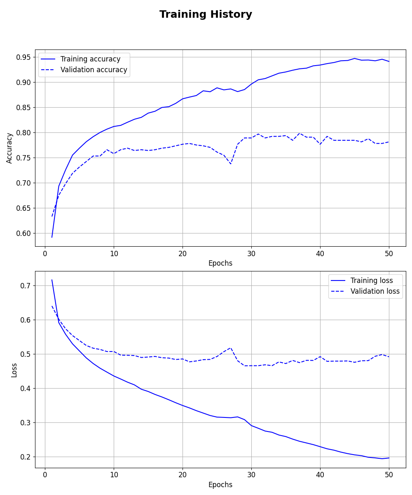

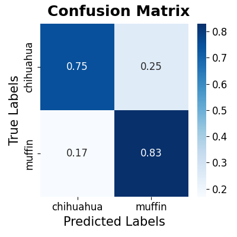

### Detailed Report of Test Set:

|              | precision    | recall       | f1-score     | support      |
| ------------ | ------------ | ------------ | ------------ | ------------ |
| chihuahua    | 0.8341       | 0.7484       | 0.7890       | 477          | 
| muffin       | 0.7419       | 0.8293       | 0.7832       | 416          | 
| micro avg    | 0.7861       | 0.7861       | 0.7861       | 893          | 
| macro avg    | 0.7880       | 0.7889       | 0.7861       | 893          | 
| weighted avg | 0.7912       | 0.7861       | 0.7863       | 893          | 
| samples avg  | 0.7861       | 0.7861       | 0.7861       | 893          | 

## trial_93

*    *Start Time*: 2024-10-16 12:39:46

*    *Duration*: 16.029

*    *Directory*: [Link](./trial_93)

### Hyperparameters:

| Hyperparameter         | Value                  |
| ---------------------- | ---------------------- |
| units1                 | 512                    |
| units2                 | 256                    |
| learning_rate          | 1.5676543012828947e-05 |

### Evaluation Metrics:

|           | train     | val       | test      |
| --------- | --------- | --------- | --------- |
| accuracy  | 0.9591    | 0.7672    | 0.7861    | 
| precision | 0.9591    | 0.7672    | 0.7861    | 
| recall    | 0.9591    | 0.7672    | 0.7861    | 
| f1        | 0.9591    | 0.7672    | 0.7861    | 

### Figures:

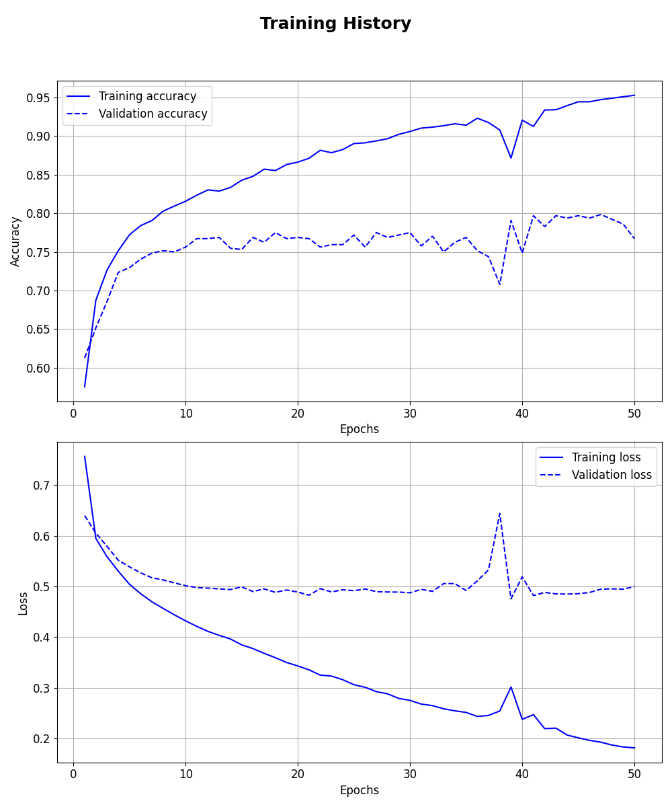

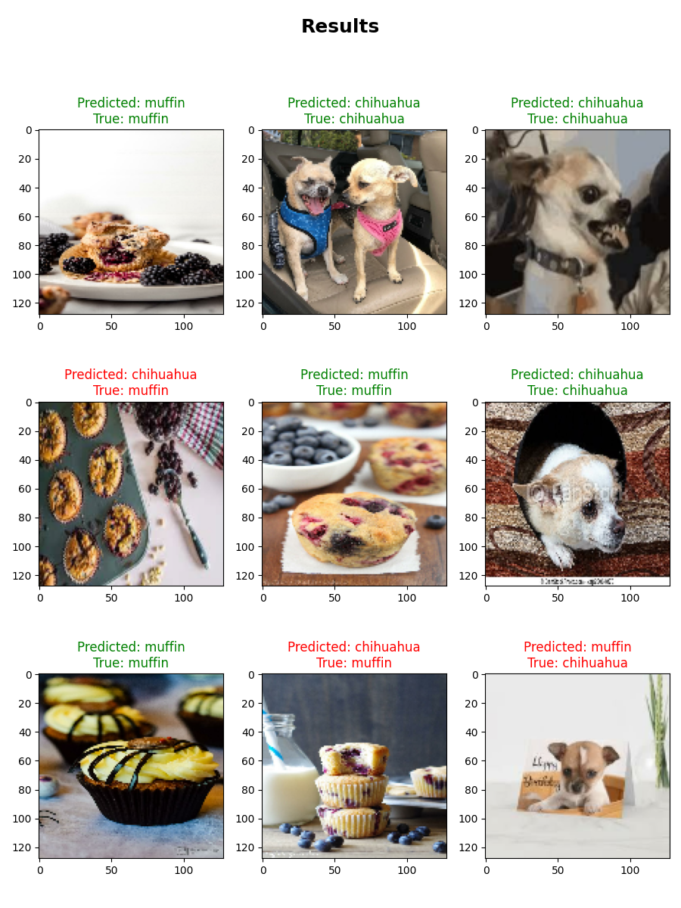

### Detailed Report of Test Set:

|              | precision    | recall       | f1-score     | support      |
| ------------ | ------------ | ------------ | ------------ | ------------ |
| chihuahua    | 0.7837       | 0.8281       | 0.8053       | 477          | 
| muffin       | 0.7892       | 0.7380       | 0.7627       | 416          | 
| micro avg    | 0.7861       | 0.7861       | 0.7861       | 893          | 
| macro avg    | 0.7865       | 0.7830       | 0.7840       | 893          | 
| weighted avg | 0.7863       | 0.7861       | 0.7855       | 893          | 
| samples avg  | 0.7861       | 0.7861       | 0.7861       | 893          | 

## trial_43

*    *Start Time*: 2024-10-16 12:22:30

*    *Duration*: 16.829

*    *Directory*: [Link](./trial_43)

### Hyperparameters:

| Hyperparameter        | Value                 |
| --------------------- | --------------------- |
| units1                | 64                    |
| units2                | 256                   |
| learning_rate         | 1.534380011874467e-05 |

### Evaluation Metrics:

|           | train     | val       | test      |
| --------- | --------- | --------- | --------- |
| accuracy  | 0.8938    | 0.7734    | 0.7850    | 
| precision | 0.8938    | 0.7734    | 0.7850    | 
| recall    | 0.8938    | 0.7734    | 0.7850    | 
| f1        | 0.8937    | 0.7734    | 0.7850    | 

### Figures:

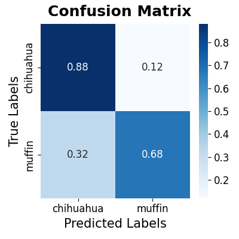

### Detailed Report of Test Set:

|              | precision    | recall       | f1-score     | support      |
| ------------ | ------------ | ------------ | ------------ | ------------ |
| chihuahua    | 0.7568       | 0.8805       | 0.8140       | 477          | 
| muffin       | 0.8314       | 0.6755       | 0.7454       | 416          | 
| micro avg    | 0.7850       | 0.7850       | 0.7850       | 893          | 
| macro avg    | 0.7941       | 0.7780       | 0.7797       | 893          | 
| weighted avg | 0.7915       | 0.7850       | 0.7820       | 893          | 
| samples avg  | 0.7850       | 0.7850       | 0.7850       | 893          | 

## trial_63

*    *Start Time*: 2024-10-16 12:28:54

*    *Duration*: 32.878

*    *Directory*: [Link](./trial_63)

### Hyperparameters:

| Hyperparameter        | Value                 |
| --------------------- | --------------------- |
| units1                | 32                    |
| units2                | 256                   |
| learning_rate         | 1.786122105359979e-05 |

### Evaluation Metrics:

|           | train     | val       | test      |
| --------- | --------- | --------- | --------- |
| accuracy  | 0.8922    | 0.7672    | 0.7839    | 
| precision | 0.8922    | 0.7672    | 0.7839    | 
| recall    | 0.8922    | 0.7672    | 0.7839    | 
| f1        | 0.8922    | 0.7672    | 0.7839    | 

### Figures:

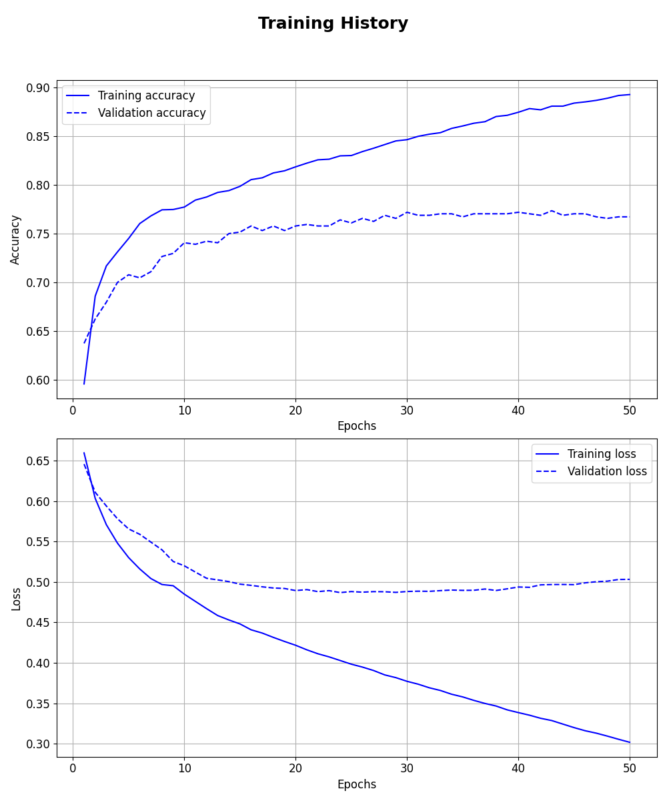

### Detailed Report of Test Set:

|              | precision    | recall       | f1-score     | support      |
| ------------ | ------------ | ------------ | ------------ | ------------ |
| chihuahua    | 0.7689       | 0.8512       | 0.8080       | 477          | 
| muffin       | 0.8055       | 0.7067       | 0.7529       | 416          | 
| micro avg    | 0.7839       | 0.7839       | 0.7839       | 893          | 
| macro avg    | 0.7872       | 0.7789       | 0.7804       | 893          | 
| weighted avg | 0.7860       | 0.7839       | 0.7823       | 893          | 
| samples avg  | 0.7839       | 0.7839       | 0.7839       | 893          | 

## trial_74

*    *Start Time*: 2024-10-16 12:32:53

*    *Duration*: 16.154

*    *Directory*: [Link](./trial_74)

### Hyperparameters:

| Hyperparameter        | Value                 |
| --------------------- | --------------------- |
| units1                | 512                   |
| units2                | 256                   |
| learning_rate         | 1.684383989192764e-05 |

### Evaluation Metrics:

|           | train     | val       | test      |
| --------- | --------- | --------- | --------- |
| accuracy  | 0.9491    | 0.7531    | 0.7828    | 
| precision | 0.9491    | 0.7531    | 0.7828    | 
| recall    | 0.9491    | 0.7531    | 0.7828    | 
| f1        | 0.9491    | 0.7531    | 0.7828    | 

### Figures:

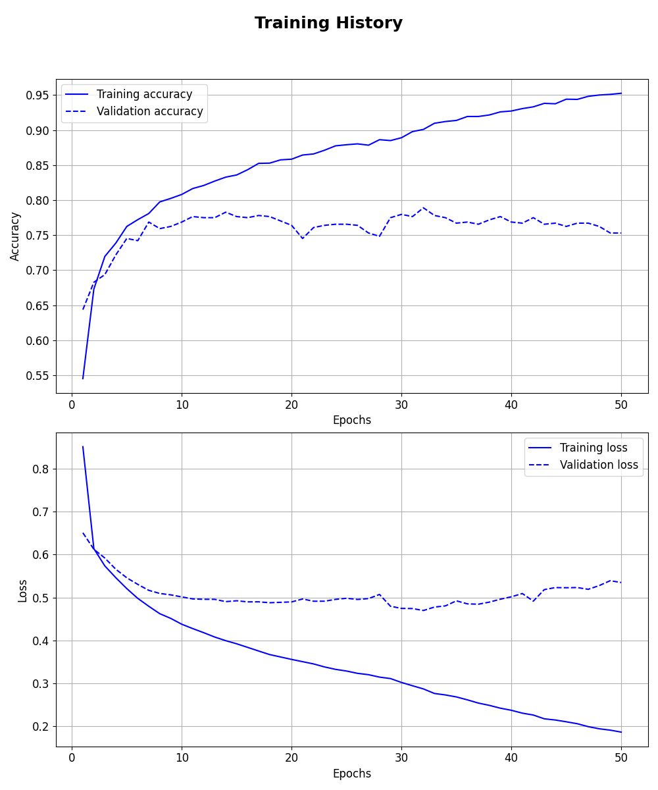

### Detailed Report of Test Set:

|              | precision    | recall       | f1-score     | support      |
| ------------ | ------------ | ------------ | ------------ | ------------ |
| chihuahua    | 0.7513       | 0.8868       | 0.8135       | 477          | 
| muffin       | 0.8364       | 0.6635       | 0.7399       | 416          | 
| micro avg    | 0.7828       | 0.7828       | 0.7828       | 893          | 
| macro avg    | 0.7938       | 0.7751       | 0.7767       | 893          | 
| weighted avg | 0.7909       | 0.7828       | 0.7792       | 893          | 
| samples avg  | 0.7828       | 0.7828       | 0.7828       | 893          | 

## trial_82

*    *Start Time*: 2024-10-16 12:35:48

*    *Duration*: 16.353

*    *Directory*: [Link](./trial_82)

### Hyperparameters:

| Hyperparameter         | Value                  |
| ---------------------- | ---------------------- |
| units1                 | 256                    |
| units2                 | 256                    |
| learning_rate          | 1.3529173487874073e-05 |

### Evaluation Metrics:

|           | train     | val       | test      |
| --------- | --------- | --------- | --------- |
| accuracy  | 0.9591    | 0.7859    | 0.7828    | 
| precision | 0.9591    | 0.7859    | 0.7828    | 
| recall    | 0.9591    | 0.7859    | 0.7828    | 
| f1        | 0.9591    | 0.7859    | 0.7828    | 

### Figures:

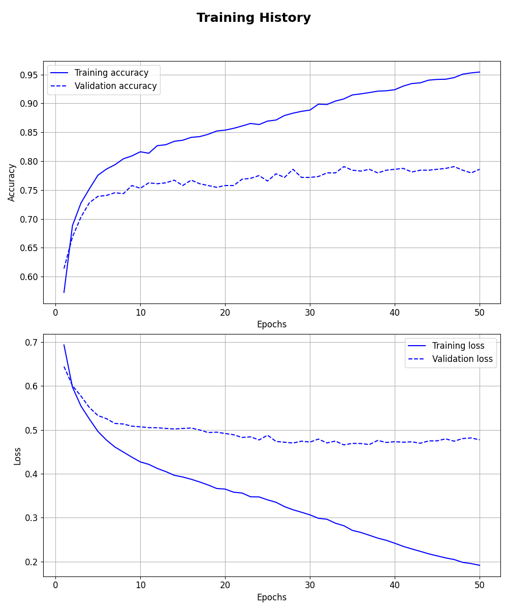

### Detailed Report of Test Set:

|              | precision    | recall       | f1-score     | support      |
| ------------ | ------------ | ------------ | ------------ | ------------ |
| chihuahua    | 0.7780       | 0.8302       | 0.8032       | 477          | 
| muffin       | 0.7891       | 0.7284       | 0.7575       | 416          | 
| micro avg    | 0.7828       | 0.7828       | 0.7828       | 893          | 
| macro avg    | 0.7835       | 0.7793       | 0.7804       | 893          | 
| weighted avg | 0.7832       | 0.7828       | 0.7819       | 893          | 
| samples avg  | 0.7828       | 0.7828       | 0.7828       | 893          | 

## trial_23

*    *Start Time*: 2024-10-16 12:15:55

*    *Duration*: 16.762

*    *Directory*: [Link](./trial_23)

### Hyperparameters:

| Hyperparameter        | Value                 |
| --------------------- | --------------------- |
| units1                | 512                   |
| units2                | 256                   |
| learning_rate         | 3.244667365868776e-05 |

### Evaluation Metrics:

|           | train     | val       | test      |
| --------- | --------- | --------- | --------- |
| accuracy  | 0.9381    | 0.7453    | 0.7816    | 
| precision | 0.9381    | 0.7453    | 0.7816    | 
| recall    | 0.9381    | 0.7453    | 0.7816    | 
| f1        | 0.9381    | 0.7453    | 0.7816    | 

### Figures:

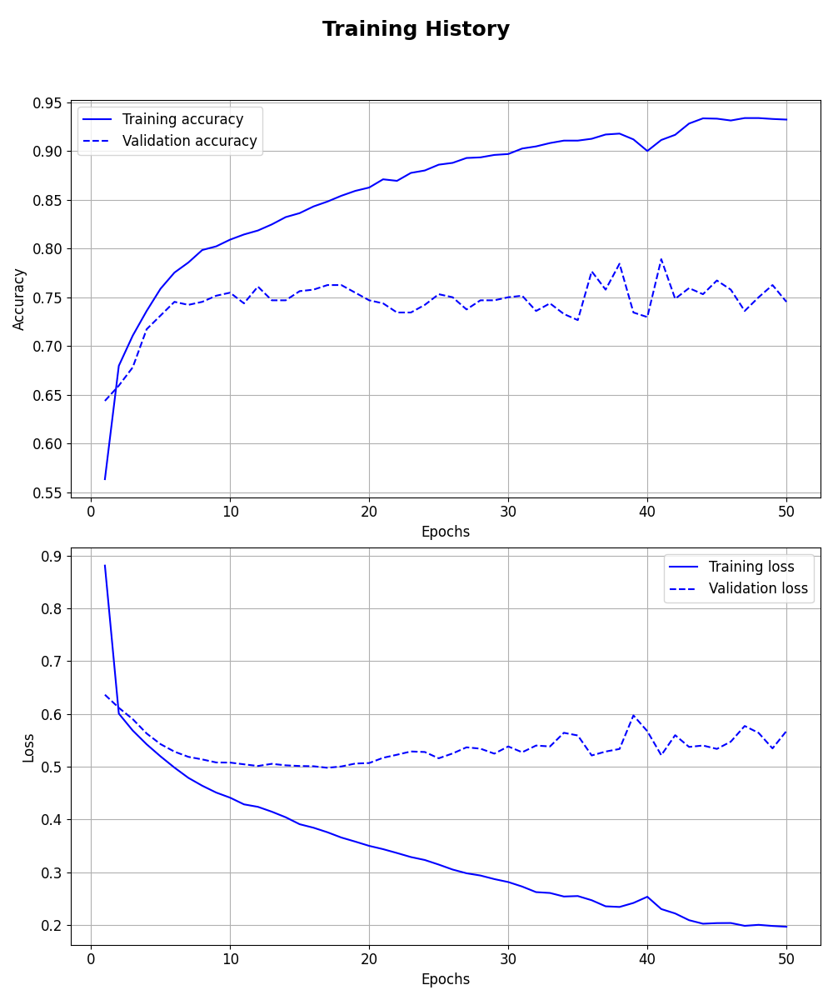

### Detailed Report of Test Set:

|              | precision    | recall       | f1-score     | support      |
| ------------ | ------------ | ------------ | ------------ | ------------ |
| chihuahua    | 0.7650       | 0.8532       | 0.8067       | 477          | 
| muffin       | 0.8061       | 0.6995       | 0.7490       | 416          | 
| micro avg    | 0.7816       | 0.7816       | 0.7816       | 893          | 
| macro avg    | 0.7856       | 0.7764       | 0.7779       | 893          | 
| weighted avg | 0.7842       | 0.7816       | 0.7799       | 893          | 
| samples avg  | 0.7816       | 0.7816       | 0.7816       | 893          | 

## trial_86

*    *Start Time*: 2024-10-16 12:37:09

*    *Duration*: 27.206

*    *Directory*: [Link](./trial_86)

### Hyperparameters:

| Hyperparameter         | Value                  |
| ---------------------- | ---------------------- |
| units1                 | 256                    |
| units2                 | 256                    |
| learning_rate          | 1.2446560096229032e-05 |

### Evaluation Metrics:

|           | train     | val       | test      |
| --------- | --------- | --------- | --------- |
| accuracy  | 0.9669    | 0.7781    | 0.7816    | 
| precision | 0.9669    | 0.7781    | 0.7816    | 
| recall    | 0.9669    | 0.7781    | 0.7816    | 
| f1        | 0.9669    | 0.7781    | 0.7816    | 

### Figures:

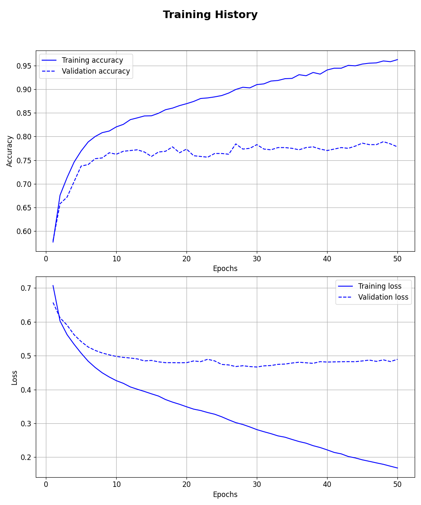

### Detailed Report of Test Set:

|              | precision    | recall       | f1-score     | support      |
| ------------ | ------------ | ------------ | ------------ | ------------ |
| chihuahua    | 0.7681       | 0.8470       | 0.8056       | 477          | 
| muffin       | 0.8011       | 0.7067       | 0.7510       | 416          | 
| micro avg    | 0.7816       | 0.7816       | 0.7816       | 893          | 
| macro avg    | 0.7846       | 0.7768       | 0.7783       | 893          | 
| weighted avg | 0.7834       | 0.7816       | 0.7801       | 893          | 
| samples avg  | 0.7816       | 0.7816       | 0.7816       | 893          | 

## trial_83

*    *Start Time*: 2024-10-16 12:36:05

*    *Duration*: 28.637

*    *Directory*: [Link](./trial_83)

### Hyperparameters:

| Hyperparameter         | Value                  |
| ---------------------- | ---------------------- |
| units1                 | 256                    |
| units2                 | 256                    |
| learning_rate          | 1.5644028901529757e-05 |

### Evaluation Metrics:

|           | train     | val       | test      |
| --------- | --------- | --------- | --------- |
| accuracy  | 0.9413    | 0.7859    | 0.7805    | 
| precision | 0.9413    | 0.7859    | 0.7805    | 
| recall    | 0.9413    | 0.7859    | 0.7805    | 
| f1        | 0.9412    | 0.7859    | 0.7805    | 

### Figures:

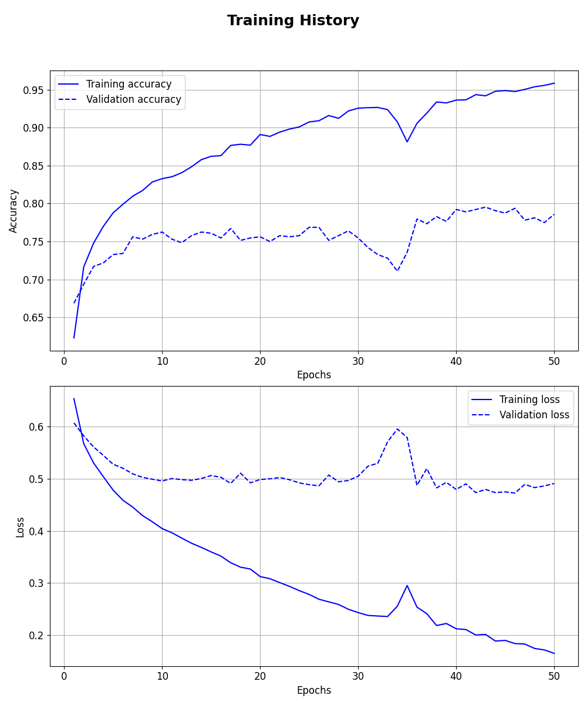

### Detailed Report of Test Set:

|              | precision    | recall       | f1-score     | support      |
| ------------ | ------------ | ------------ | ------------ | ------------ |
| chihuahua    | 0.8369       | 0.7317       | 0.7808       | 477          | 
| muffin       | 0.7311       | 0.8365       | 0.7803       | 416          | 
| micro avg    | 0.7805       | 0.7805       | 0.7805       | 893          | 
| macro avg    | 0.7840       | 0.7841       | 0.7805       | 893          | 
| weighted avg | 0.7876       | 0.7805       | 0.7805       | 893          | 
| samples avg  | 0.7805       | 0.7805       | 0.7805       | 893          | 

## trial_84

*    *Start Time*: 2024-10-16 12:36:34

*    *Duration*: 16.531

*    *Directory*: [Link](./trial_84)

### Hyperparameters:

| Hyperparameter        | Value                 |
| --------------------- | --------------------- |
| units1                | 256                   |
| units2                | 256                   |
| learning_rate         | 2.566842113684612e-05 |

### Evaluation Metrics:

|           | train     | val       | test      |
| --------- | --------- | --------- | --------- |
| accuracy  | 0.9450    | 0.7563    | 0.7794    | 
| precision | 0.9450    | 0.7563    | 0.7794    | 
| recall    | 0.9450    | 0.7563    | 0.7794    | 
| f1        | 0.9450    | 0.7562    | 0.7794    | 

### Figures:

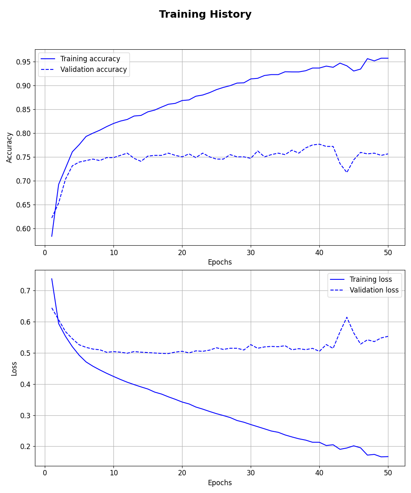

### Detailed Report of Test Set:

|              | precision    | recall       | f1-score     | support      |
| ------------ | ------------ | ------------ | ------------ | ------------ |
| chihuahua    | 0.7692       | 0.8386       | 0.8024       | 477          | 
| muffin       | 0.7936       | 0.7115       | 0.7503       | 416          | 
| micro avg    | 0.7794       | 0.7794       | 0.7794       | 893          | 
| macro avg    | 0.7814       | 0.7751       | 0.7764       | 893          | 
| weighted avg | 0.7806       | 0.7794       | 0.7781       | 893          | 
| samples avg  | 0.7794       | 0.7794       | 0.7794       | 893          | 

## trial_67

*    *Start Time*: 2024-10-16 12:30:29

*    *Duration*: 15.883

*    *Directory*: [Link](./trial_67)

### Hyperparameters:

| Hyperparameter        | Value                 |
| --------------------- | --------------------- |
| units1                | 64                    |
| units2                | 512                   |
| learning_rate         | 3.672694996048836e-05 |

### Evaluation Metrics:

|           | train     | val       | test      |
| --------- | --------- | --------- | --------- |
| accuracy  | 0.9128    | 0.7625    | 0.7783    | 
| precision | 0.9128    | 0.7625    | 0.7783    | 
| recall    | 0.9128    | 0.7625    | 0.7783    | 
| f1        | 0.9128    | 0.7625    | 0.7783    | 

### Figures:

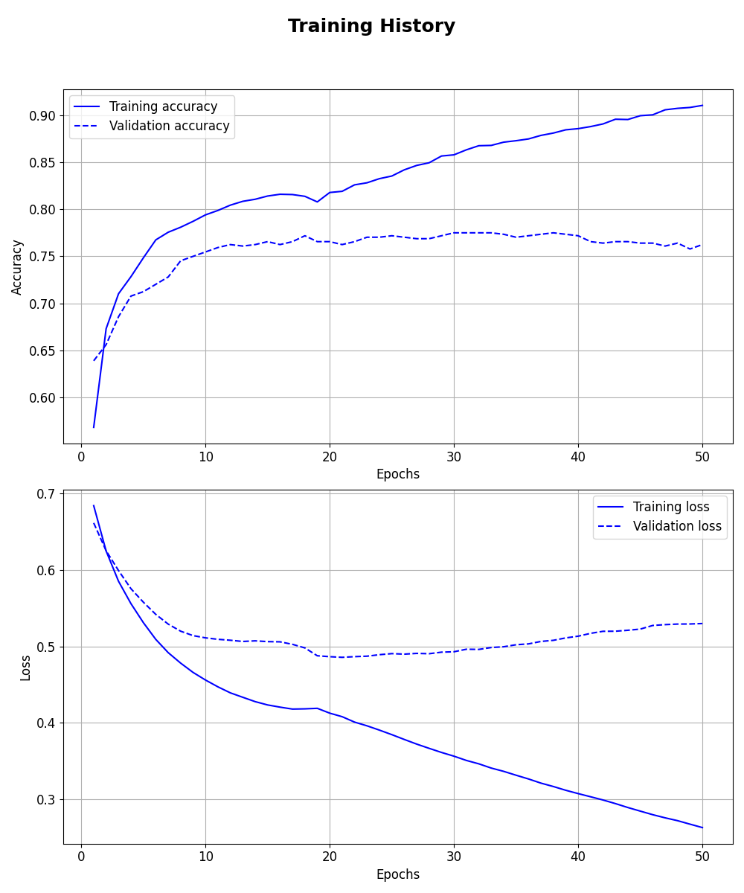

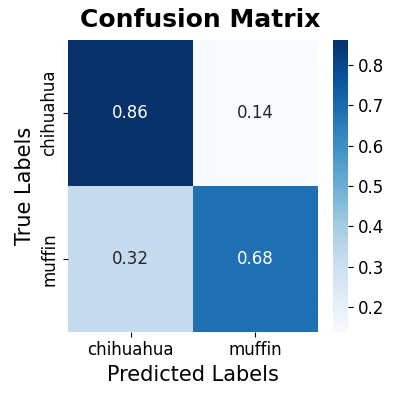

### Detailed Report of Test Set:

|              | precision    | recall       | f1-score     | support      |
| ------------ | ------------ | ------------ | ------------ | ------------ |
| chihuahua    | 0.7569       | 0.8616       | 0.8059       | 477          | 
| muffin       | 0.8114       | 0.6827       | 0.7415       | 416          | 
| micro avg    | 0.7783       | 0.7783       | 0.7783       | 893          | 
| macro avg    | 0.7842       | 0.7722       | 0.7737       | 893          | 
| weighted avg | 0.7823       | 0.7783       | 0.7759       | 893          | 
| samples avg  | 0.7783       | 0.7783       | 0.7783       | 893          | 

## trial_94

*    *Start Time*: 2024-10-16 12:40:02

*    *Duration*: 29.230

*    *Directory*: [Link](./trial_94)

### Hyperparameters:

| Hyperparameter       | Value                |
| -------------------- | -------------------- |
| units1               | 512                  |
| units2               | 256                  |
| learning_rate        | 1.88601914943057e-05 |

### Evaluation Metrics:

|           | train     | val       | test      |
| --------- | --------- | --------- | --------- |
| accuracy  | 0.9259    | 0.7750    | 0.7783    | 
| precision | 0.9259    | 0.7750    | 0.7783    | 
| recall    | 0.9259    | 0.7750    | 0.7783    | 
| f1        | 0.9259    | 0.7750    | 0.7783    | 

### Figures:

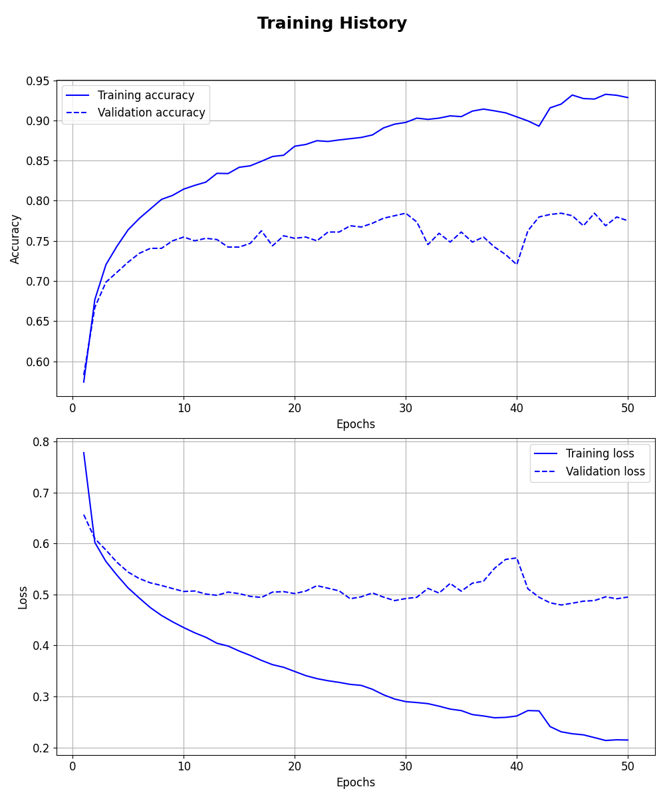

### Detailed Report of Test Set:

|              | precision    | recall       | f1-score     | support      |
| ------------ | ------------ | ------------ | ------------ | ------------ |
| chihuahua    | 0.8163       | 0.7547       | 0.7843       | 477          | 
| muffin       | 0.7412       | 0.8053       | 0.7719       | 416          | 
| micro avg    | 0.7783       | 0.7783       | 0.7783       | 893          | 
| macro avg    | 0.7787       | 0.7800       | 0.7781       | 893          | 
| weighted avg | 0.7813       | 0.7783       | 0.7785       | 893          | 
| samples avg  | 0.7783       | 0.7783       | 0.7783       | 893          | 

## trial_25

*    *Start Time*: 2024-10-16 12:16:36

*    *Duration*: 16.076

*    *Directory*: [Link](./trial_25)

### Hyperparameters:

| Hyperparameter         | Value                  |
| ---------------------- | ---------------------- |
| units1                 | 512                    |
| units2                 | 256                    |
| learning_rate          | 2.4701261109541235e-05 |

### Evaluation Metrics:

|           | train     | val       | test      |
| --------- | --------- | --------- | --------- |
| accuracy  | 0.8934    | 0.7812    | 0.7772    | 
| precision | 0.8934    | 0.7812    | 0.7772    | 
| recall    | 0.8934    | 0.7812    | 0.7772    | 
| f1        | 0.8934    | 0.7812    | 0.7772    | 

### Figures:

### Detailed Report of Test Set:

|              | precision    | recall       | f1-score     | support      |
| ------------ | ------------ | ------------ | ------------ | ------------ |
| chihuahua    | 0.8564       | 0.7002       | 0.7705       | 477          | 
| muffin       | 0.7157       | 0.8654       | 0.7835       | 416          | 
| micro avg    | 0.7772       | 0.7772       | 0.7772       | 893          | 
| macro avg    | 0.7861       | 0.7828       | 0.7770       | 893          | 
| weighted avg | 0.7909       | 0.7772       | 0.7765       | 893          | 
| samples avg  | 0.7772       | 0.7772       | 0.7772       | 893          | 

## trial_18

*    *Start Time*: 2024-10-16 12:14:31

*    *Duration*: 16.613

*    *Directory*: [Link](./trial_18)

### Hyperparameters:

| Hyperparameter        | Value                 |
| --------------------- | --------------------- |
| units1                | 256                   |
| units2                | 256                   |
| learning_rate         | 1.021643570482843e-05 |

### Evaluation Metrics:

|           | train     | val       | test      |
| --------- | --------- | --------- | --------- |
| accuracy  | 0.9391    | 0.7453    | 0.7760    | 
| precision | 0.9391    | 0.7453    | 0.7760    | 
| recall    | 0.9391    | 0.7453    | 0.7760    | 
| f1        | 0.9391    | 0.7453    | 0.7760    | 

### Figures:

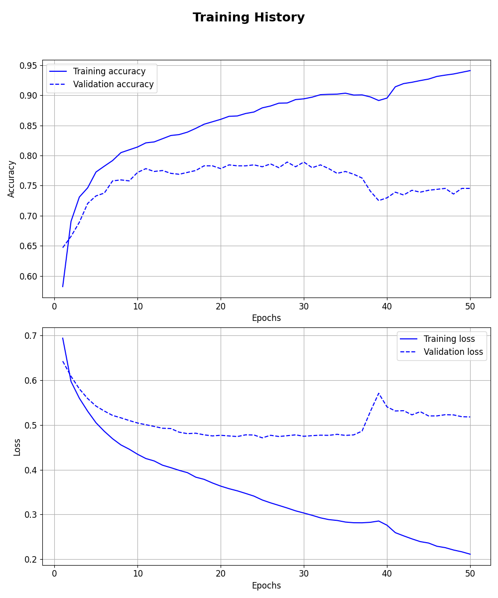

### Detailed Report of Test Set:

|              | precision    | recall       | f1-score     | support      |
| ------------ | ------------ | ------------ | ------------ | ------------ |
| chihuahua    | 0.7434       | 0.8868       | 0.8088       | 477          | 
| muffin       | 0.8333       | 0.6490       | 0.7297       | 416          | 
| micro avg    | 0.7760       | 0.7760       | 0.7760       | 893          | 
| macro avg    | 0.7884       | 0.7679       | 0.7693       | 893          | 
| weighted avg | 0.7853       | 0.7760       | 0.7720       | 893          | 
| samples avg  | 0.7760       | 0.7760       | 0.7760       | 893          | 

## trial_8

*    *Start Time*: 2024-10-16 12:11:41

*    *Duration*: 16.338

*    *Directory*: [Link](./trial_8)

### Hyperparameters:

| Hyperparameter         | Value                  |
| ---------------------- | ---------------------- |
| units1                 | 512                    |
| units2                 | 256                    |
| learning_rate          | 0.00034731958767629626 |

### Evaluation Metrics:

|           | train     | val       | test      |
| --------- | --------- | --------- | --------- |
| accuracy  | 0.9062    | 0.7516    | 0.7749    | 
| precision | 0.9062    | 0.7516    | 0.7749    | 
| recall    | 0.9062    | 0.7516    | 0.7749    | 
| f1        | 0.9062    | 0.7516    | 0.7749    | 

### Figures:

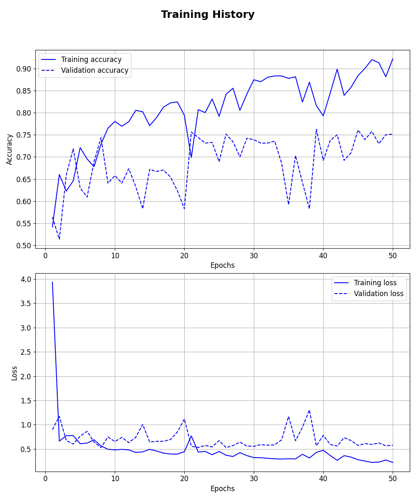

### Detailed Report of Test Set:

|              | precision    | recall       | f1-score     | support      |
| ------------ | ------------ | ------------ | ------------ | ------------ |
| chihuahua    | 0.8286       | 0.7296       | 0.7759       | 477          | 
| muffin       | 0.7273       | 0.8269       | 0.7739       | 416          | 
| micro avg    | 0.7749       | 0.7749       | 0.7749       | 893          | 
| macro avg    | 0.7779       | 0.7782       | 0.7749       | 893          | 
| weighted avg | 0.7814       | 0.7749       | 0.7750       | 893          | 
| samples avg  | 0.7749       | 0.7749       | 0.7749       | 893          | 

## trial_89

*    *Start Time*: 2024-10-16 12:38:27

*    *Duration*: 17.395

*    *Directory*: [Link](./trial_89)

### Hyperparameters:

| Hyperparameter         | Value                  |
| ---------------------- | ---------------------- |
| units1                 | 512                    |
| units2                 | 256                    |
| learning_rate          | 2.9730659620039018e-05 |

### Evaluation Metrics:

|           | train     | val       | test      |
| --------- | --------- | --------- | --------- |
| accuracy  | 0.9456    | 0.7656    | 0.7749    | 
| precision | 0.9456    | 0.7656    | 0.7749    | 
| recall    | 0.9456    | 0.7656    | 0.7749    | 
| f1        | 0.9456    | 0.7656    | 0.7749    | 

### Figures:

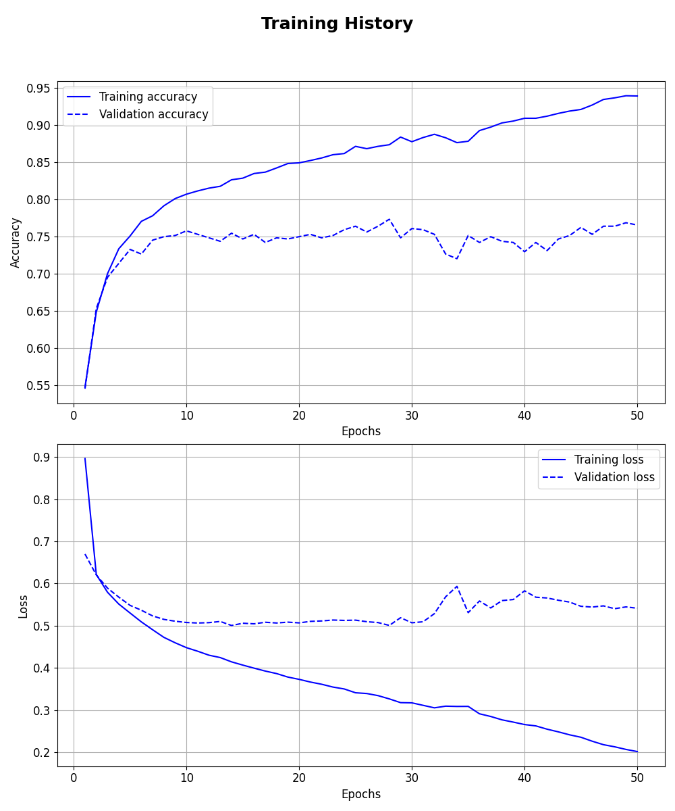

### Detailed Report of Test Set:

|              | precision    | recall       | f1-score     | support      |
| ------------ | ------------ | ------------ | ------------ | ------------ |
| chihuahua    | 0.7575       | 0.8512       | 0.8016       | 477          | 
| muffin       | 0.8011       | 0.6875       | 0.7400       | 416          | 
| micro avg    | 0.7749       | 0.7749       | 0.7749       | 893          | 
| macro avg    | 0.7793       | 0.7693       | 0.7708       | 893          | 
| weighted avg | 0.7778       | 0.7749       | 0.7729       | 893          | 
| samples avg  | 0.7749       | 0.7749       | 0.7749       | 893          | 

## trial_13

*    *Start Time*: 2024-10-16 12:13:06

*    *Duration*: 16.048

*    *Directory*: [Link](./trial_13)

### Hyperparameters:

| Hyperparameter         | Value                  |
| ---------------------- | ---------------------- |
| units1                 | 32                     |
| units2                 | 512                    |
| learning_rate          | 1.2122393116551098e-05 |

### Evaluation Metrics:

|           | train     | val       | test      |
| --------- | --------- | --------- | --------- |
| accuracy  | 0.8844    | 0.7797    | 0.7738    | 
| precision | 0.8844    | 0.7797    | 0.7738    | 
| recall    | 0.8844    | 0.7797    | 0.7738    | 
| f1        | 0.8844    | 0.7797    | 0.7738    | 

### Figures:

### Detailed Report of Test Set:

|              | precision    | recall       | f1-score     | support      |
| ------------ | ------------ | ------------ | ------------ | ------------ |
| chihuahua    | 0.7639       | 0.8344       | 0.7976       | 477          | 
| muffin       | 0.7876       | 0.7043       | 0.7437       | 416          | 
| micro avg    | 0.7738       | 0.7738       | 0.7738       | 893          | 
| macro avg    | 0.7758       | 0.7694       | 0.7706       | 893          | 
| weighted avg | 0.7750       | 0.7738       | 0.7725       | 893          | 
| samples avg  | 0.7738       | 0.7738       | 0.7738       | 893          | 

## trial_34

*    *Start Time*: 2024-10-16 12:19:48

*    *Duration*: 16.073

*    *Directory*: [Link](./trial_34)

### Hyperparameters:

| Hyperparameter         | Value                  |
| ---------------------- | ---------------------- |
| units1                 | 512                    |
| units2                 | 512                    |
| learning_rate          | 3.0624953333405955e-05 |

### Evaluation Metrics:

|           | train     | val       | test      |
| --------- | --------- | --------- | --------- |
| accuracy  | 0.9197    | 0.7922    | 0.7738    | 
| precision | 0.9197    | 0.7922    | 0.7738    | 
| recall    | 0.9197    | 0.7922    | 0.7738    | 
| f1        | 0.9197    | 0.7922    | 0.7738    | 

### Figures:

### Detailed Report of Test Set:

|              | precision    | recall       | f1-score     | support      |
| ------------ | ------------ | ------------ | ------------ | ------------ |
| chihuahua    | 0.8535       | 0.6960       | 0.7667       | 477          | 
| muffin       | 0.7123       | 0.8630       | 0.7804       | 416          | 
| micro avg    | 0.7738       | 0.7738       | 0.7738       | 893          | 
| macro avg    | 0.7829       | 0.7795       | 0.7736       | 893          | 
| weighted avg | 0.7877       | 0.7738       | 0.7731       | 893          | 
| samples avg  | 0.7738       | 0.7738       | 0.7738       | 893          | 

## trial_36

*    *Start Time*: 2024-10-16 12:20:33

*    *Duration*: 16.587

*    *Directory*: [Link](./trial_36)

### Hyperparameters:

| Hyperparameter       | Value                |
| -------------------- | -------------------- |
| units1               | 128                  |
| units2               | 512                  |
| learning_rate        | 2.13197602456447e-05 |

### Evaluation Metrics:

|           | train     | val       | test      |
| --------- | --------- | --------- | --------- |
| accuracy  | 0.9422    | 0.7688    | 0.7738    | 
| precision | 0.9422    | 0.7688    | 0.7738    | 
| recall    | 0.9422    | 0.7688    | 0.7738    | 
| f1        | 0.9422    | 0.7687    | 0.7738    | 

### Figures:

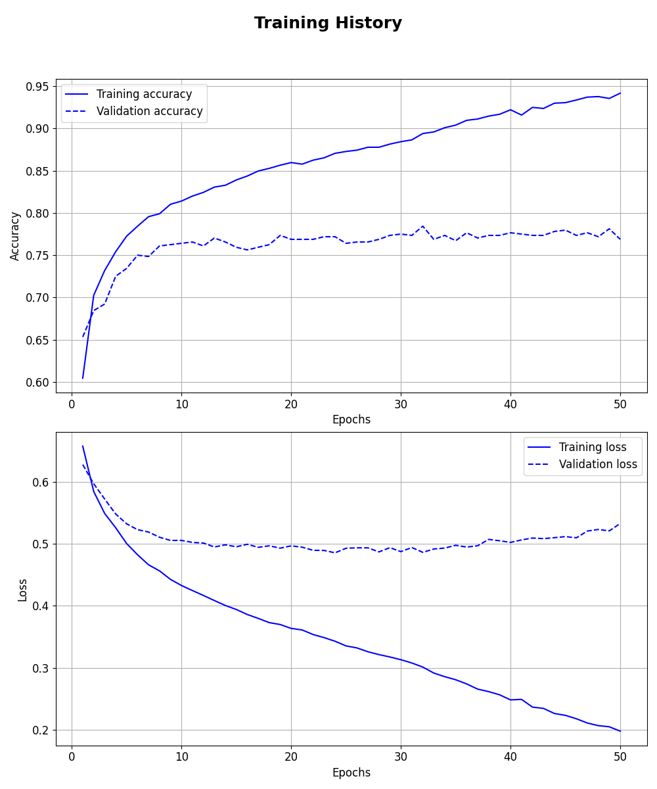

### Detailed Report of Test Set:

|              | precision    | recall       | f1-score     | support      |
| ------------ | ------------ | ------------ | ------------ | ------------ |
| chihuahua    | 0.7514       | 0.8616       | 0.8027       | 477          | 
| muffin       | 0.8092       | 0.6731       | 0.7349       | 416          | 
| micro avg    | 0.7738       | 0.7738       | 0.7738       | 893          | 
| macro avg    | 0.7803       | 0.7674       | 0.7688       | 893          | 
| weighted avg | 0.7783       | 0.7738       | 0.7711       | 893          | 
| samples avg  | 0.7738       | 0.7738       | 0.7738       | 893          | 

## trial_81

*    *Start Time*: 2024-10-16 12:35:30

*    *Duration*: 17.111

*    *Directory*: [Link](./trial_81)

### Hyperparameters:

| Hyperparameter         | Value                  |
| ---------------------- | ---------------------- |
| units1                 | 512                    |
| units2                 | 256                    |
| learning_rate          | 3.4327011074415356e-05 |

### Evaluation Metrics:

|           | train     | val       | test      |
| --------- | --------- | --------- | --------- |
| accuracy  | 0.9406    | 0.7406    | 0.7738    | 
| precision | 0.9406    | 0.7406    | 0.7738    | 
| recall    | 0.9406    | 0.7406    | 0.7738    | 
| f1        | 0.9406    | 0.7406    | 0.7738    | 

### Figures:

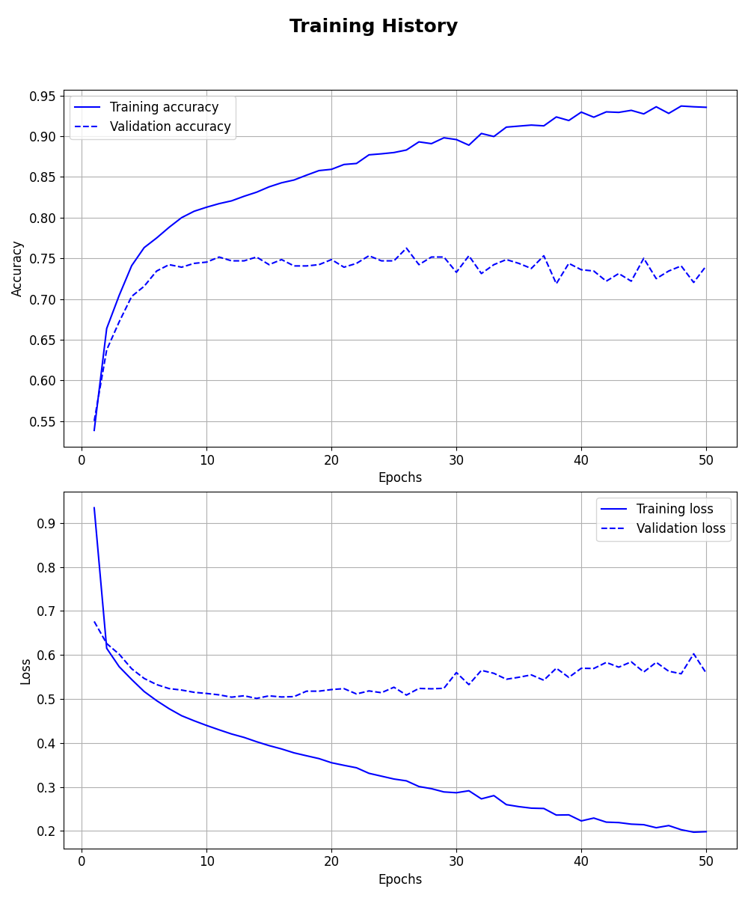

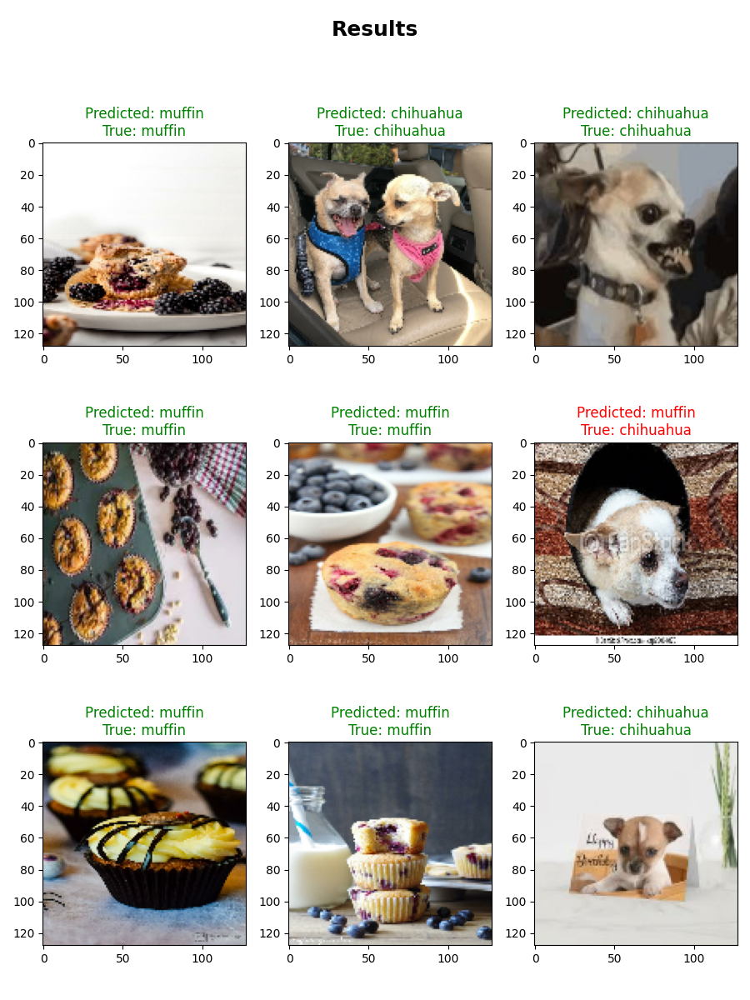

### Detailed Report of Test Set:

|              | precision    | recall       | f1-score     | support      |
| ------------ | ------------ | ------------ | ------------ | ------------ |
| chihuahua    | 0.7514       | 0.8616       | 0.8027       | 477          | 
| muffin       | 0.8092       | 0.6731       | 0.7349       | 416          | 
| micro avg    | 0.7738       | 0.7738       | 0.7738       | 893          | 
| macro avg    | 0.7803       | 0.7674       | 0.7688       | 893          | 
| weighted avg | 0.7783       | 0.7738       | 0.7711       | 893          | 
| samples avg  | 0.7738       | 0.7738       | 0.7738       | 893          | 

## trial_7

*    *Start Time*: 2024-10-16 12:11:24

*    *Duration*: 17.205

*    *Directory*: [Link](./trial_7)

### Hyperparameters:

| Hyperparameter         | Value                  |
| ---------------------- | ---------------------- |
| units1                 | 256                    |
| units2                 | 32                     |
| learning_rate          | 0.00017490164748245888 |

### Evaluation Metrics:

|           | train     | val       | test      |
| --------- | --------- | --------- | --------- |
| accuracy  | 0.9125    | 0.7250    | 0.7727    | 
| precision | 0.9125    | 0.7250    | 0.7727    | 
| recall    | 0.9125    | 0.7250    | 0.7727    | 
| f1        | 0.9125    | 0.7250    | 0.7727    | 

### Figures:

### Detailed Report of Test Set:

|              | precision    | recall       | f1-score     | support      |
| ------------ | ------------ | ------------ | ------------ | ------------ |
| chihuahua    | 0.7645       | 0.8302       | 0.7960       | 477          | 
| muffin       | 0.7840       | 0.7067       | 0.7434       | 416          | 
| micro avg    | 0.7727       | 0.7727       | 0.7727       | 893          | 
| macro avg    | 0.7742       | 0.7685       | 0.7697       | 893          | 
| weighted avg | 0.7736       | 0.7727       | 0.7715       | 893          | 
| samples avg  | 0.7727       | 0.7727       | 0.7727       | 893          | 

## trial_45

*    *Start Time*: 2024-10-16 12:23:06

*    *Duration*: 16.139

*    *Directory*: [Link](./trial_45)

### Hyperparameters:

| Hyperparameter        | Value                 |
| --------------------- | --------------------- |
| units1                | 128                   |
| units2                | 512                   |
| learning_rate         | 1.535893752640253e-05 |

### Evaluation Metrics:

|           | train     | val       | test      |
| --------- | --------- | --------- | --------- |
| accuracy  | 0.9350    | 0.7656    | 0.7727    | 
| precision | 0.9350    | 0.7656    | 0.7727    | 
| recall    | 0.9350    | 0.7656    | 0.7727    | 
| f1        | 0.9350    | 0.7656    | 0.7727    | 

### Figures:

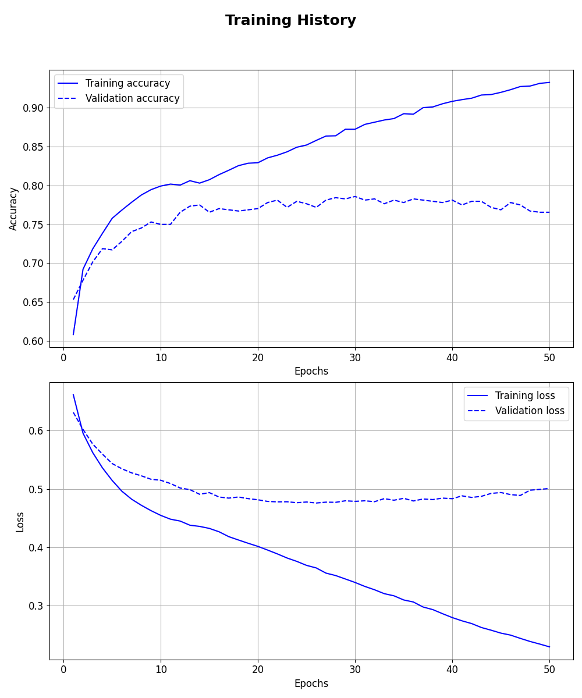

### Detailed Report of Test Set:

|              | precision    | recall       | f1-score     | support      |
| ------------ | ------------ | ------------ | ------------ | ------------ |
| chihuahua    | 0.7556       | 0.8491       | 0.7996       | 477          | 
| muffin       | 0.7983       | 0.6851       | 0.7374       | 416          | 
| micro avg    | 0.7727       | 0.7727       | 0.7727       | 893          | 
| macro avg    | 0.7770       | 0.7671       | 0.7685       | 893          | 
| weighted avg | 0.7755       | 0.7727       | 0.7706       | 893          | 
| samples avg  | 0.7727       | 0.7727       | 0.7727       | 893          | 

## trial_48

*    *Start Time*: 2024-10-16 12:23:55

*    *Duration*: 16.780

*    *Directory*: [Link](./trial_48)

### Hyperparameters:

| Hyperparameter        | Value                 |
| --------------------- | --------------------- |
| units1                | 256                   |
| units2                | 256                   |
| learning_rate         | 0.0001386592802013659 |

### Evaluation Metrics:

|           | train     | val       | test      |
| --------- | --------- | --------- | --------- |
| accuracy  | 0.9481    | 0.7594    | 0.7727    | 
| precision | 0.9481    | 0.7594    | 0.7727    | 
| recall    | 0.9481    | 0.7594    | 0.7727    | 
| f1        | 0.9481    | 0.7594    | 0.7727    | 

### Figures:

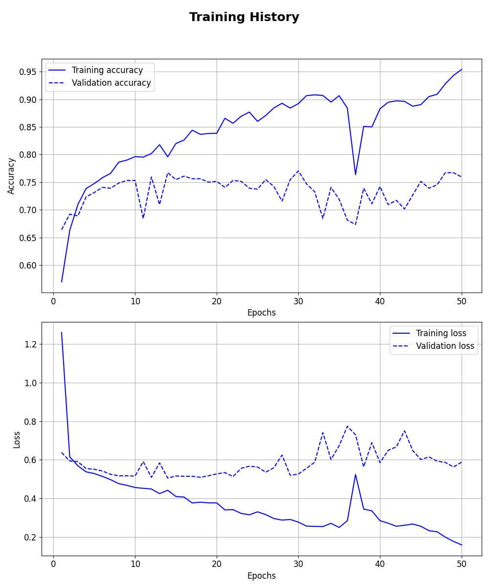

### Detailed Report of Test Set:

|              | precision    | recall       | f1-score     | support      |
| ------------ | ------------ | ------------ | ------------ | ------------ |
| chihuahua    | 0.7686       | 0.8218       | 0.7943       | 477          | 
| muffin       | 0.7781       | 0.7163       | 0.7459       | 416          | 
| micro avg    | 0.7727       | 0.7727       | 0.7727       | 893          | 
| macro avg    | 0.7733       | 0.7691       | 0.7701       | 893          | 
| weighted avg | 0.7730       | 0.7727       | 0.7718       | 893          | 
| samples avg  | 0.7727       | 0.7727       | 0.7727       | 893          | 

## trial_57

*    *Start Time*: 2024-10-16 12:26:48

*    *Duration*: 15.543

*    *Directory*: [Link](./trial_57)

### Hyperparameters:

| Hyperparameter        | Value                 |
| --------------------- | --------------------- |
| units1                | 32                    |
| units2                | 512                   |
| learning_rate         | 3.560650592019403e-05 |

### Evaluation Metrics:

|           | train     | val       | test      |
| --------- | --------- | --------- | --------- |
| accuracy  | 0.9194    | 0.7703    | 0.7716    | 
| precision | 0.9194    | 0.7703    | 0.7716    | 
| recall    | 0.9194    | 0.7703    | 0.7716    | 
| f1        | 0.9194    | 0.7703    | 0.7716    | 

### Figures:

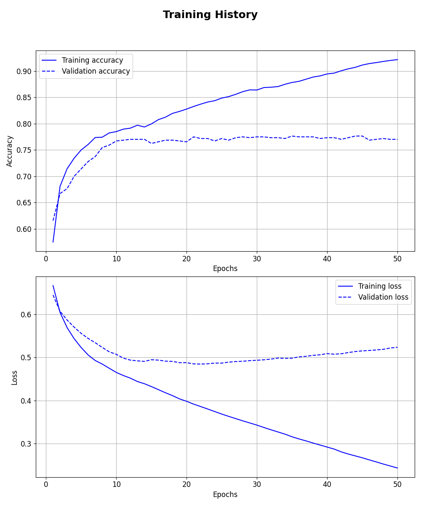

### Detailed Report of Test Set:

|              | precision    | recall       | f1-score     | support      |
| ------------ | ------------ | ------------ | ------------ | ------------ |
| chihuahua    | 0.7551       | 0.8470       | 0.7984       | 477          | 
| muffin       | 0.7961       | 0.6851       | 0.7364       | 416          | 
| micro avg    | 0.7716       | 0.7716       | 0.7716       | 893          | 
| macro avg    | 0.7756       | 0.7660       | 0.7674       | 893          | 
| weighted avg | 0.7742       | 0.7716       | 0.7695       | 893          | 
| samples avg  | 0.7716       | 0.7716       | 0.7716       | 893          | 

## trial_37

*    *Start Time*: 2024-10-16 12:20:51

*    *Duration*: 16.279

*    *Directory*: [Link](./trial_37)

### Hyperparameters:

| Hyperparameter        | Value                 |
| --------------------- | --------------------- |
| units1                | 256                   |
| units2                | 512                   |
| learning_rate         | 3.942139230550948e-05 |

### Evaluation Metrics:

|           | train     | val       | test      |
| --------- | --------- | --------- | --------- |
| accuracy  | 0.9428    | 0.7516    | 0.7660    | 
| precision | 0.9428    | 0.7516    | 0.7660    | 
| recall    | 0.9428    | 0.7516    | 0.7660    | 
| f1        | 0.9428    | 0.7516    | 0.7660    | 

### Figures:

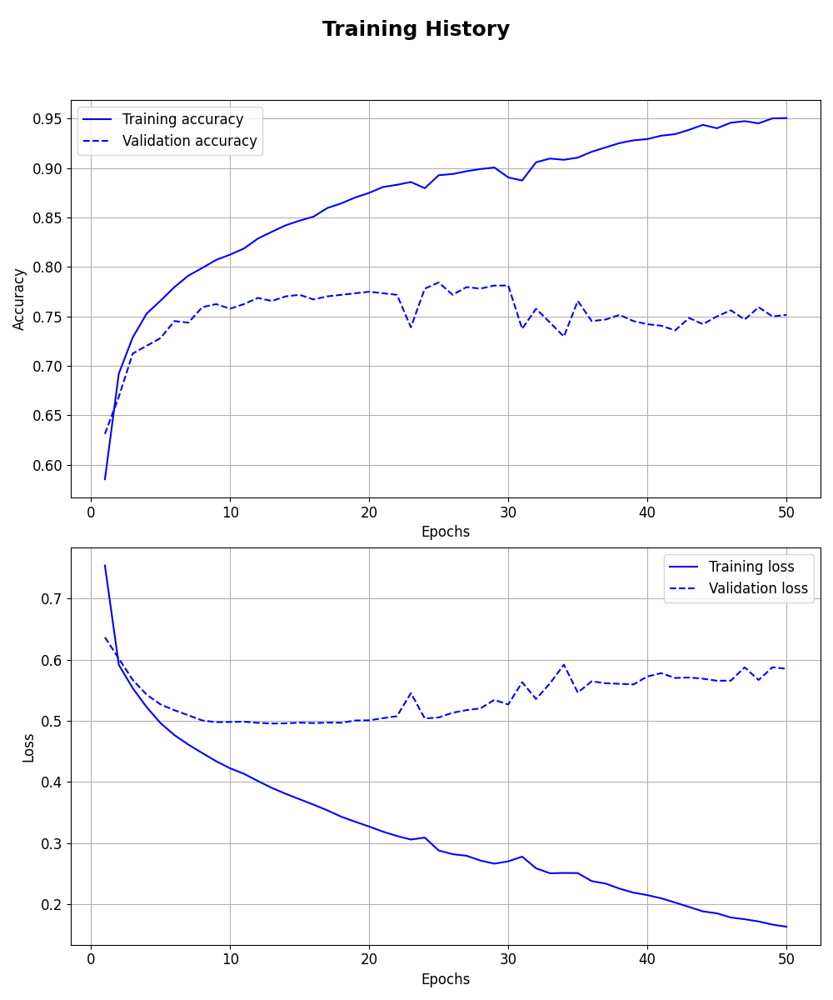

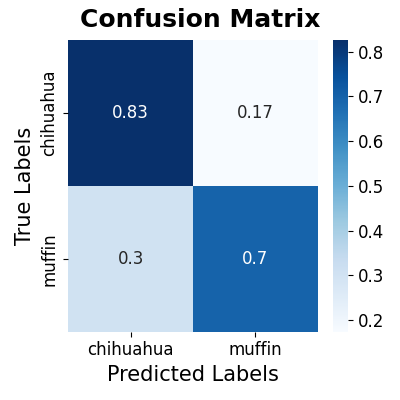

### Detailed Report of Test Set:

|              | precision    | recall       | f1-score     | support      |
| ------------ | ------------ | ------------ | ------------ | ------------ |
| chihuahua    | 0.7577       | 0.8260       | 0.7904       | 477          | 
| muffin       | 0.7775       | 0.6971       | 0.7351       | 416          | 
| micro avg    | 0.7660       | 0.7660       | 0.7660       | 893          | 
| macro avg    | 0.7676       | 0.7616       | 0.7627       | 893          | 
| weighted avg | 0.7669       | 0.7660       | 0.7646       | 893          | 
| samples avg  | 0.7660       | 0.7660       | 0.7660       | 893          | 

## trial_39

*    *Start Time*: 2024-10-16 12:21:24

*    *Duration*: 15.976

*    *Directory*: [Link](./trial_39)

### Hyperparameters:

| Hyperparameter         | Value                  |
| ---------------------- | ---------------------- |
| units1                 | 512                    |
| units2                 | 512                    |
| learning_rate          | 1.5192945198869083e-05 |

### Evaluation Metrics:

|           | train     | val       | test      |
| --------- | --------- | --------- | --------- |
| accuracy  | 0.9584    | 0.7578    | 0.7660    | 
| precision | 0.9584    | 0.7578    | 0.7660    | 
| recall    | 0.9584    | 0.7578    | 0.7660    | 
| f1        | 0.9584    | 0.7578    | 0.7660    | 

### Figures:

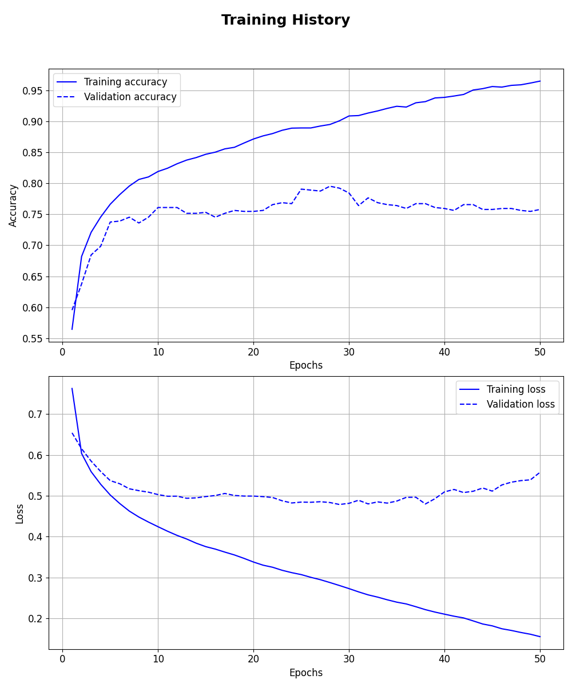

### Detailed Report of Test Set:

|              | precision    | recall       | f1-score     | support      |
| ------------ | ------------ | ------------ | ------------ | ------------ |
| chihuahua    | 0.7295       | 0.8931       | 0.8030       | 477          | 
| muffin       | 0.8350       | 0.6202       | 0.7117       | 416          | 
| micro avg    | 0.7660       | 0.7660       | 0.7660       | 893          | 
| macro avg    | 0.7822       | 0.7566       | 0.7574       | 893          | 
| weighted avg | 0.7786       | 0.7660       | 0.7605       | 893          | 
| samples avg  | 0.7660       | 0.7660       | 0.7660       | 893          | 

## trial_54

*    *Start Time*: 2024-10-16 12:25:44

*    *Duration*: 16.735

*    *Directory*: [Link](./trial_54)

### Hyperparameters:

| Hyperparameter         | Value                  |
| ---------------------- | ---------------------- |
| units1                 | 512                    |
| units2                 | 512                    |
| learning_rate          | 2.8632868282043625e-05 |

### Evaluation Metrics:

|           | train     | val       | test      |
| --------- | --------- | --------- | --------- |
| accuracy  | 0.9500    | 0.7437    | 0.7648    | 
| precision | 0.9500    | 0.7437    | 0.7648    | 
| recall    | 0.9500    | 0.7437    | 0.7648    | 
| f1        | 0.9500    | 0.7437    | 0.7648    | 

### Figures:

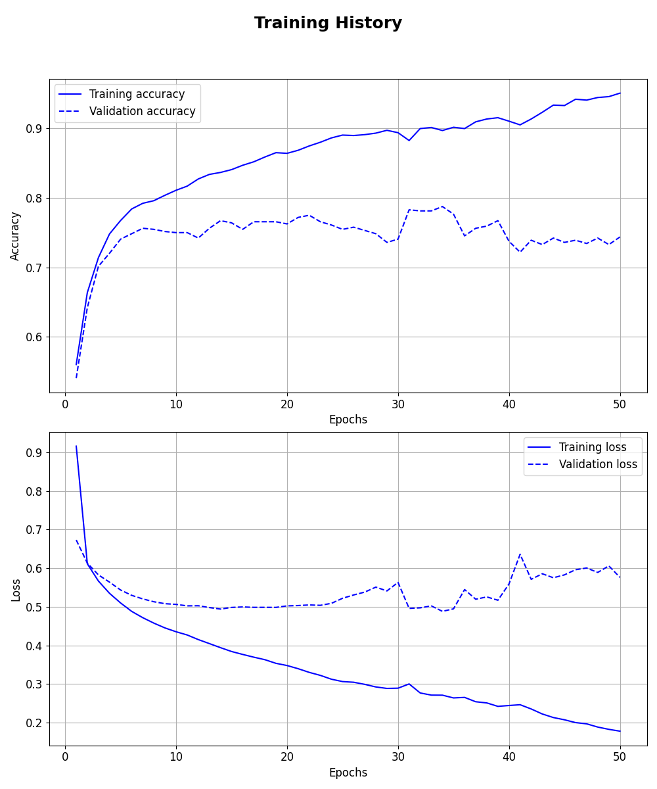

### Detailed Report of Test Set:

|              | precision    | recall       | f1-score     | support      |
| ------------ | ------------ | ------------ | ------------ | ------------ |
| chihuahua    | 0.7290       | 0.8910       | 0.8019       | 477          | 
| muffin       | 0.8323       | 0.6202       | 0.7107       | 416          | 
| micro avg    | 0.7648       | 0.7648       | 0.7648       | 893          | 
| macro avg    | 0.7806       | 0.7556       | 0.7563       | 893          | 
| weighted avg | 0.7771       | 0.7648       | 0.7594       | 893          | 
| samples avg  | 0.7648       | 0.7648       | 0.7648       | 893          | 

## trial_42

*    *Start Time*: 2024-10-16 12:22:13

*    *Duration*: 16.283

*    *Directory*: [Link](./trial_42)

### Hyperparameters:

| Hyperparameter         | Value                  |
| ---------------------- | ---------------------- |
| units1                 | 128                    |
| units2                 | 512                    |
| learning_rate          | 1.0470975713450224e-05 |

### Evaluation Metrics:

|           | train     | val       | test      |
| --------- | --------- | --------- | --------- |
| accuracy  | 0.9169    | 0.7375    | 0.7626    | 
| precision | 0.9169    | 0.7375    | 0.7626    | 
| recall    | 0.9169    | 0.7375    | 0.7626    | 
| f1        | 0.9169    | 0.7375    | 0.7626    | 

### Figures:

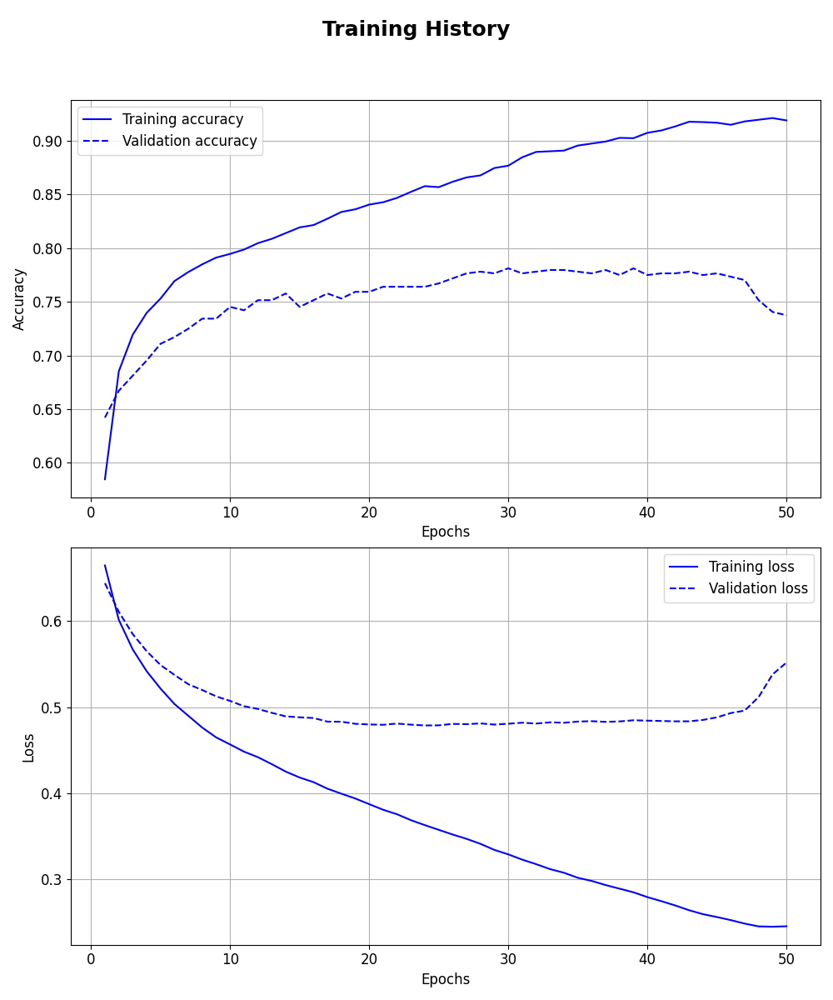

### Detailed Report of Test Set:

|              | precision    | recall       | f1-score     | support      |
| ------------ | ------------ | ------------ | ------------ | ------------ |
| chihuahua    | 0.7169       | 0.9182       | 0.8051       | 477          | 
| muffin       | 0.8617       | 0.5841       | 0.6963       | 416          | 
| micro avg    | 0.7626       | 0.7626       | 0.7626       | 893          | 
| macro avg    | 0.7893       | 0.7512       | 0.7507       | 893          | 
| weighted avg | 0.7843       | 0.7626       | 0.7544       | 893          | 
| samples avg  | 0.7626       | 0.7626       | 0.7626       | 893          | 

## trial_100

*    *Start Time*: 2024-10-16 12:42:09

*    *Duration*: 27.583

*    *Directory*: [Link](./trial_100)

### Hyperparameters:

| Hyperparameter        | Value                 |
| --------------------- | --------------------- |
| units1                | 512                   |
| units2                | 256                   |
| learning_rate         | 4.131261919298109e-05 |

### Evaluation Metrics:

|           | train     | val       | test      |
| --------- | --------- | --------- | --------- |
| accuracy  | 0.9284    | 0.7391    | 0.7592    | 
| precision | 0.9284    | 0.7391    | 0.7592    | 
| recall    | 0.9284    | 0.7391    | 0.7592    | 
| f1        | 0.9284    | 0.7391    | 0.7592    | 

### Figures:

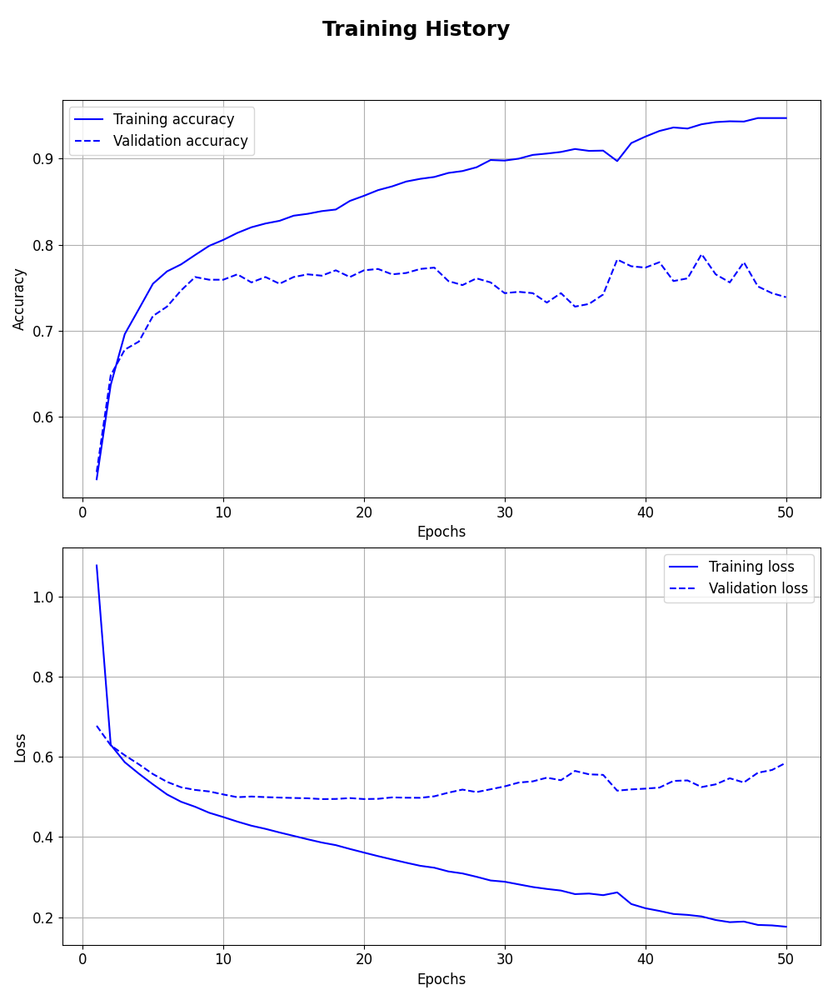

### Detailed Report of Test Set:

|              | precision    | recall       | f1-score     | support      |
| ------------ | ------------ | ------------ | ------------ | ------------ |
| chihuahua    | 0.7529       | 0.8176       | 0.7839       | 477          | 
| muffin       | 0.7680       | 0.6923       | 0.7282       | 416          | 
| micro avg    | 0.7592       | 0.7592       | 0.7592       | 893          | 
| macro avg    | 0.7604       | 0.7550       | 0.7561       | 893          | 
| weighted avg | 0.7599       | 0.7592       | 0.7580       | 893          | 
| samples avg  | 0.7592       | 0.7592       | 0.7592       | 893          | 

## trial_79

*    *Start Time*: 2024-10-16 12:34:45

*    *Duration*: 16.038

*    *Directory*: [Link](./trial_79)

### Hyperparameters:

| Hyperparameter        | Value                 |
| --------------------- | --------------------- |
| units1                | 256                   |
| units2                | 256                   |
| learning_rate         | 4.717471973123669e-05 |

### Evaluation Metrics:

|           | train     | val       | test      |
| --------- | --------- | --------- | --------- |
| accuracy  | 0.9241    | 0.7234    | 0.7581    | 
| precision | 0.9241    | 0.7234    | 0.7581    | 
| recall    | 0.9241    | 0.7234    | 0.7581    | 
| f1        | 0.9241    | 0.7234    | 0.7581    | 

### Figures:

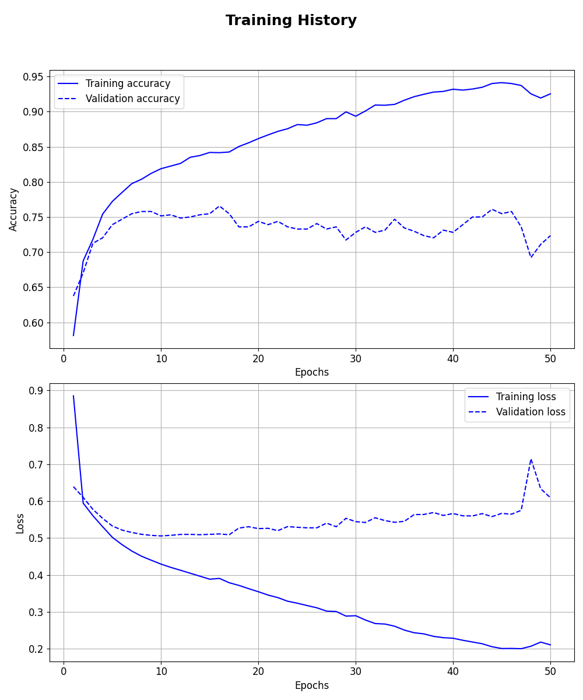

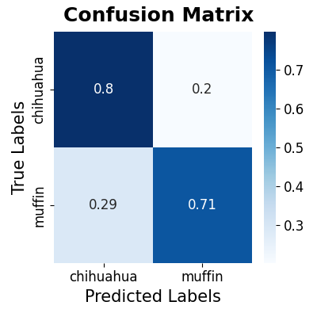

### Detailed Report of Test Set:

|              | precision    | recall       | f1-score     | support      |
| ------------ | ------------ | ------------ | ------------ | ------------ |
| chihuahua    | 0.7605       | 0.7987       | 0.7791       | 477          | 
| muffin       | 0.7551       | 0.7115       | 0.7327       | 416          | 
| micro avg    | 0.7581       | 0.7581       | 0.7581       | 893          | 
| macro avg    | 0.7578       | 0.7551       | 0.7559       | 893          | 
| weighted avg | 0.7580       | 0.7581       | 0.7575       | 893          | 
| samples avg  | 0.7581       | 0.7581       | 0.7581       | 893          | 

## trial_70

*    *Start Time*: 2024-10-16 12:31:32

*    *Duration*: 16.474

*    *Directory*: [Link](./trial_70)

### Hyperparameters:

| Hyperparameter         | Value                  |
| ---------------------- | ---------------------- |
| units1                 | 512                    |
| units2                 | 256                    |
| learning_rate          | 2.9005106136477338e-05 |

### Evaluation Metrics:

|           | train     | val       | test      |
| --------- | --------- | --------- | --------- |
| accuracy  | 0.9453    | 0.7281    | 0.7559    | 
| precision | 0.9453    | 0.7281    | 0.7559    | 
| recall    | 0.9453    | 0.7281    | 0.7559    | 
| f1        | 0.9453    | 0.7281    | 0.7559    | 

### Figures:

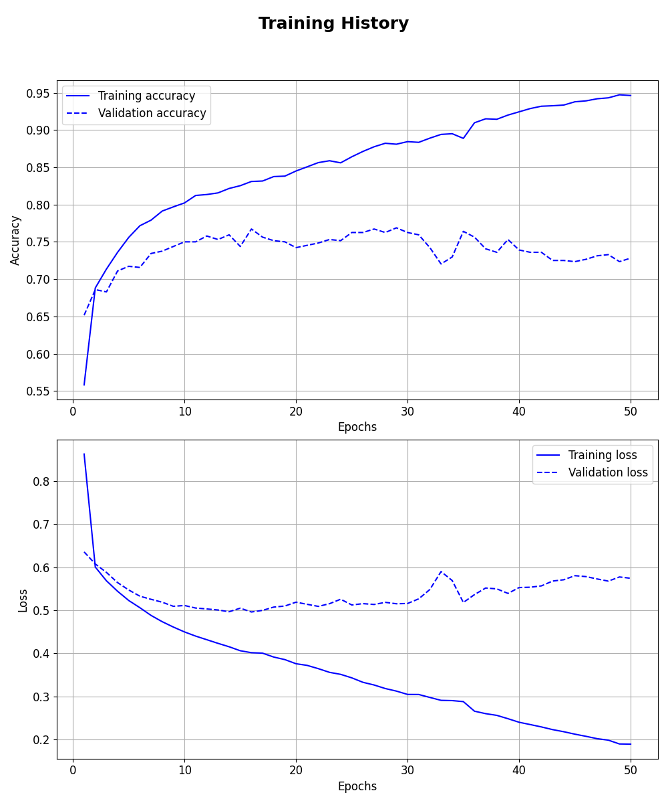

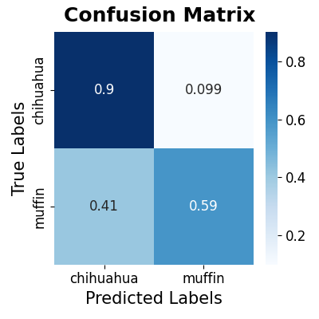

### Detailed Report of Test Set:

|              | precision    | recall       | f1-score     | support      |
| ------------ | ------------ | ------------ | ------------ | ------------ |
| chihuahua    | 0.7155       | 0.9015       | 0.7978       | 477          | 
| muffin       | 0.8390       | 0.5889       | 0.6921       | 416          | 
| micro avg    | 0.7559       | 0.7559       | 0.7559       | 893          | 
| macro avg    | 0.7773       | 0.7452       | 0.7449       | 893          | 
| weighted avg | 0.7730       | 0.7559       | 0.7485       | 893          | 
| samples avg  | 0.7559       | 0.7559       | 0.7559       | 893          | 

## trial_27

*    *Start Time*: 2024-10-16 12:17:26

*    *Duration*: 16.198

*    *Directory*: [Link](./trial_27)

### Hyperparameters:

| Hyperparameter        | Value                 |
| --------------------- | --------------------- |
| units1                | 512                   |
| units2                | 512                   |
| learning_rate         | 0.0003511679072173793 |

### Evaluation Metrics:

|           | train     | val       | test      |
| --------- | --------- | --------- | --------- |
| accuracy  | 0.9281    | 0.7609    | 0.7536    | 
| precision | 0.9281    | 0.7609    | 0.7536    | 
| recall    | 0.9281    | 0.7609    | 0.7536    | 
| f1        | 0.9281    | 0.7609    | 0.7536    | 

### Figures:

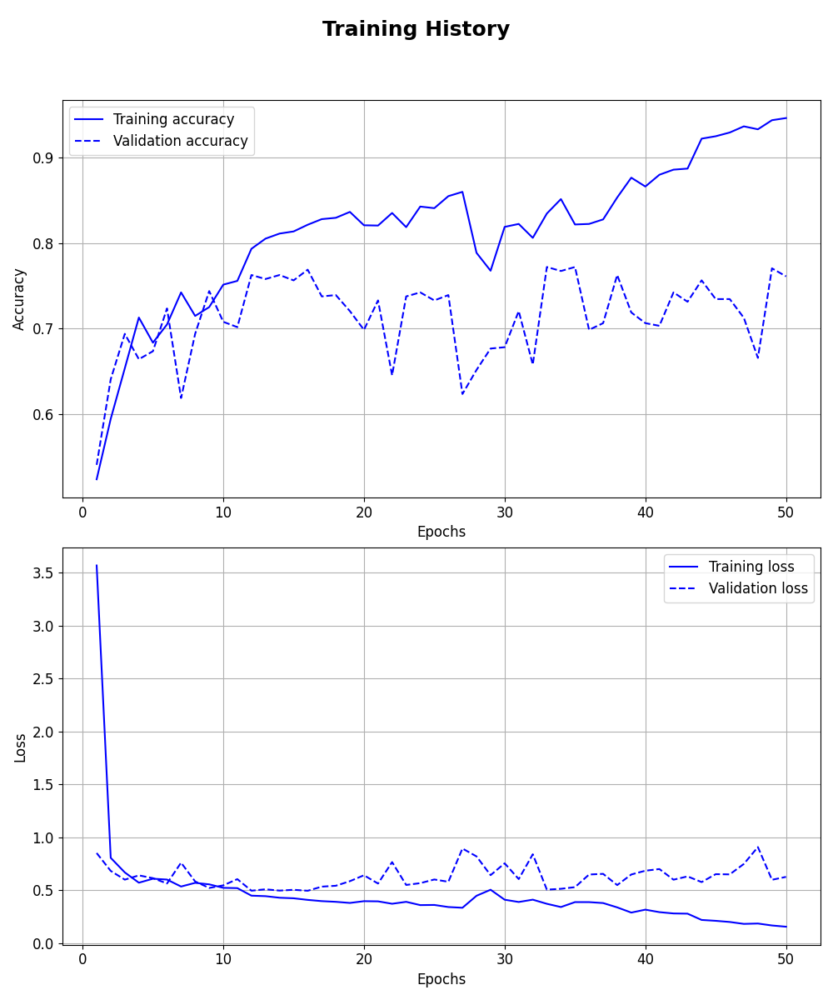

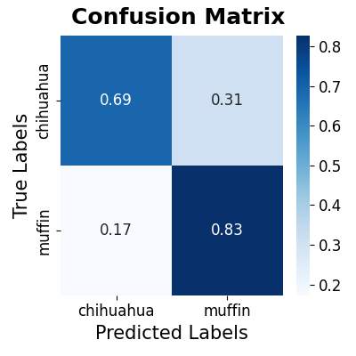

### Detailed Report of Test Set:

|              | precision    | recall       | f1-score     | support      |
| ------------ | ------------ | ------------ | ------------ | ------------ |
| chihuahua    | 0.8204       | 0.6897       | 0.7494       | 477          | 
| muffin       | 0.6992       | 0.8269       | 0.7577       | 416          | 
| micro avg    | 0.7536       | 0.7536       | 0.7536       | 893          | 
| macro avg    | 0.7598       | 0.7583       | 0.7536       | 893          | 
| weighted avg | 0.7640       | 0.7536       | 0.7533       | 893          | 
| samples avg  | 0.7536       | 0.7536       | 0.7536       | 893          | 

## trial_29

*    *Start Time*: 2024-10-16 12:17:59

*    *Duration*: 28.554

*    *Directory*: [Link](./trial_29)

### Hyperparameters:

| Hyperparameter        | Value                 |
| --------------------- | --------------------- |
| units1                | 512                   |
| units2                | 512                   |
| learning_rate         | 4.527508230170638e-05 |

### Evaluation Metrics:

|           | train     | val       | test      |
| --------- | --------- | --------- | --------- |
| accuracy  | 0.9181    | 0.7203    | 0.7525    | 
| precision | 0.9181    | 0.7203    | 0.7525    | 
| recall    | 0.9181    | 0.7203    | 0.7525    | 
| f1        | 0.9181    | 0.7203    | 0.7525    | 

### Figures:

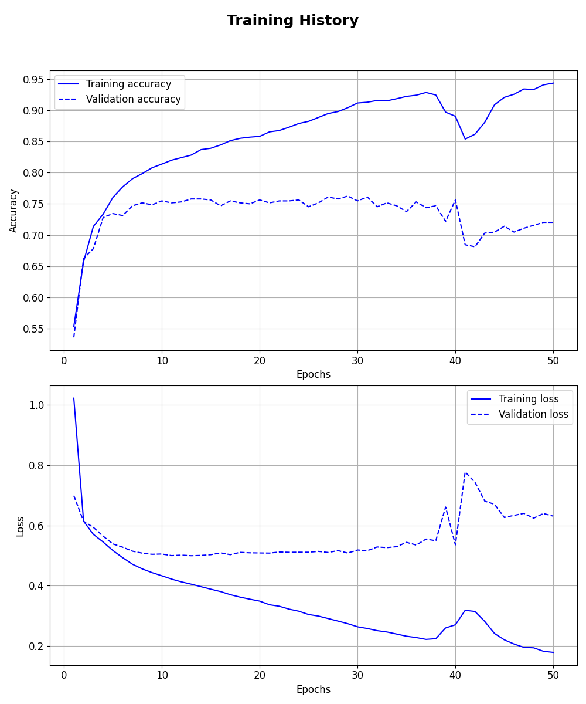

### Detailed Report of Test Set:

|              | precision    | recall       | f1-score     | support      |
| ------------ | ------------ | ------------ | ------------ | ------------ |
| chihuahua    | 0.7261       | 0.8616       | 0.7881       | 477          | 
| muffin       | 0.7982       | 0.6274       | 0.7026       | 416          | 
| micro avg    | 0.7525       | 0.7525       | 0.7525       | 893          | 
| macro avg    | 0.7622       | 0.7445       | 0.7453       | 893          | 
| weighted avg | 0.7597       | 0.7525       | 0.7483       | 893          | 
| samples avg  | 0.7525       | 0.7525       | 0.7525       | 893          | 

## trial_3

*    *Start Time*: 2024-10-16 12:10:10

*    *Duration*: 17.744

*    *Directory*: [Link](./trial_3)

### Hyperparameters:

| Hyperparameter       | Value                |
| -------------------- | -------------------- |
| units1               | 256                  |
| units2               | 128                  |
| learning_rate        | 0.011719822690644692 |

### Evaluation Metrics:

|           | train     | val       | test      |
| --------- | --------- | --------- | --------- |
| accuracy  | 0.8325    | 0.7094    | 0.7514    | 
| precision | 0.8325    | 0.7094    | 0.7514    | 
| recall    | 0.8325    | 0.7094    | 0.7514    | 
| f1        | 0.8325    | 0.7094    | 0.7514    | 

### Figures:

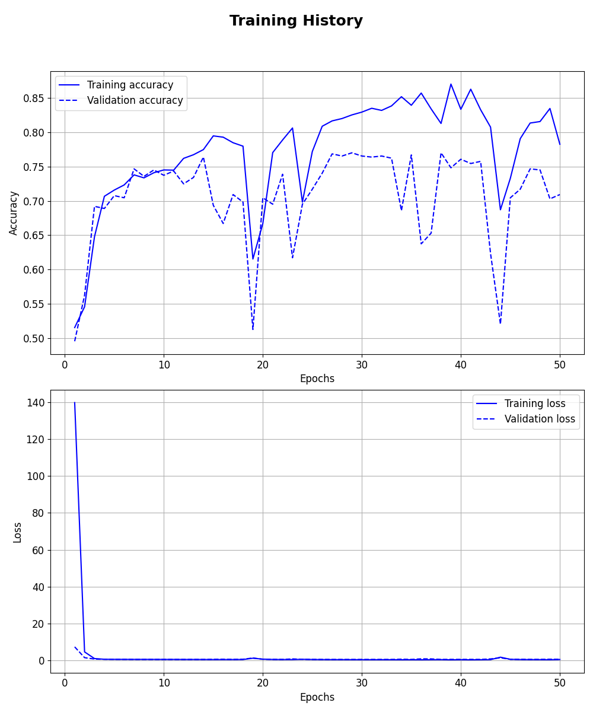

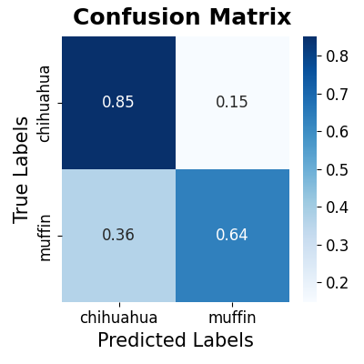

### Detailed Report of Test Set:

|              | precision    | recall       | f1-score     | support      |
| ------------ | ------------ | ------------ | ------------ | ------------ |
| chihuahua    | 0.7289       | 0.8512       | 0.7853       | 477          | 
| muffin       | 0.7887       | 0.6370       | 0.7048       | 416          | 
| micro avg    | 0.7514       | 0.7514       | 0.7514       | 893          | 
| macro avg    | 0.7588       | 0.7441       | 0.7450       | 893          | 
| weighted avg | 0.7568       | 0.7514       | 0.7478       | 893          | 
| samples avg  | 0.7514       | 0.7514       | 0.7514       | 893          | 

## trial_59

*    *Start Time*: 2024-10-16 12:27:34

*    *Duration*: 15.124

*    *Directory*: [Link](./trial_59)

### Hyperparameters:

| Hyperparameter       | Value                |
| -------------------- | -------------------- |
| units1               | 32                   |
| units2               | 512                  |
| learning_rate        | 0.000705810616756102 |

### Evaluation Metrics:

|           | train     | val       | test      |
| --------- | --------- | --------- | --------- |
| accuracy  | 0.9031    | 0.7047    | 0.7480    | 
| precision | 0.9031    | 0.7047    | 0.7480    | 
| recall    | 0.9031    | 0.7047    | 0.7480    | 
| f1        | 0.9031    | 0.7047    | 0.7480    | 

### Figures:

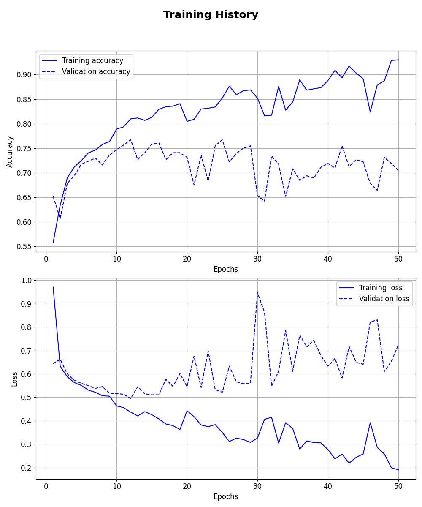

### Detailed Report of Test Set:

|              | precision    | recall       | f1-score     | support      |
| ------------ | ------------ | ------------ | ------------ | ------------ |
| chihuahua    | 0.7299       | 0.8386       | 0.7805       | 477          | 
| muffin       | 0.7768       | 0.6442       | 0.7043       | 416          | 
| micro avg    | 0.7480       | 0.7480       | 0.7480       | 893          | 
| macro avg    | 0.7534       | 0.7414       | 0.7424       | 893          | 
| weighted avg | 0.7518       | 0.7480       | 0.7450       | 893          | 
| samples avg  | 0.7480       | 0.7480       | 0.7480       | 893          | 

## trial_16

*    *Start Time*: 2024-10-16 12:13:56

*    *Duration*: 16.027

*    *Directory*: [Link](./trial_16)

### Hyperparameters:

| Hyperparameter        | Value                 |
| --------------------- | --------------------- |
| units1                | 128                   |
| units2                | 256                   |
| learning_rate         | 6.041908025383951e-05 |

### Evaluation Metrics:

|           | train     | val       | test      |
| --------- | --------- | --------- | --------- |
| accuracy  | 0.9078    | 0.7203    | 0.7469    | 
| precision | 0.9078    | 0.7203    | 0.7469    | 
| recall    | 0.9078    | 0.7203    | 0.7469    | 
| f1        | 0.9078    | 0.7203    | 0.7469    | 

### Figures:

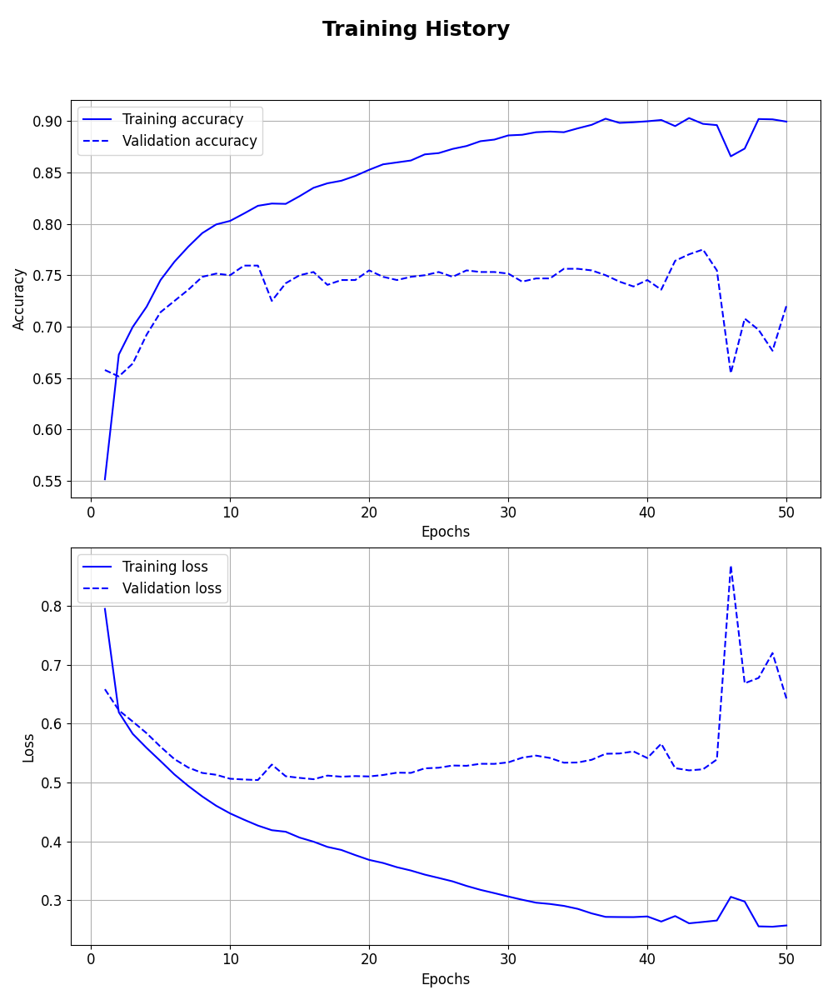

### Detailed Report of Test Set:

|              | precision    | recall       | f1-score     | support      |
| ------------ | ------------ | ------------ | ------------ | ------------ |
| chihuahua    | 0.7068       | 0.8994       | 0.7915       | 477          | 
| muffin       | 0.8322       | 0.5721       | 0.6781       | 416          | 
| micro avg    | 0.7469       | 0.7469       | 0.7469       | 893          | 
| macro avg    | 0.7695       | 0.7357       | 0.7348       | 893          | 
| weighted avg | 0.7652       | 0.7469       | 0.7387       | 893          | 
| samples avg  | 0.7469       | 0.7469       | 0.7469       | 893          | 

## trial_41

*    *Start Time*: 2024-10-16 12:21:56

*    *Duration*: 16.508

*    *Directory*: [Link](./trial_41)

### Hyperparameters:

| Hyperparameter         | Value                  |
| ---------------------- | ---------------------- |
| units1                 | 512                    |
| units2                 | 256                    |
| learning_rate          | 2.4215184940680196e-05 |

### Evaluation Metrics:

|           | train     | val       | test      |
| --------- | --------- | --------- | --------- |
| accuracy  | 0.9228    | 0.7219    | 0.7447    | 
| precision | 0.9228    | 0.7219    | 0.7447    | 
| recall    | 0.9228    | 0.7219    | 0.7447    | 
| f1        | 0.9228    | 0.7219    | 0.7447    | 

### Figures:

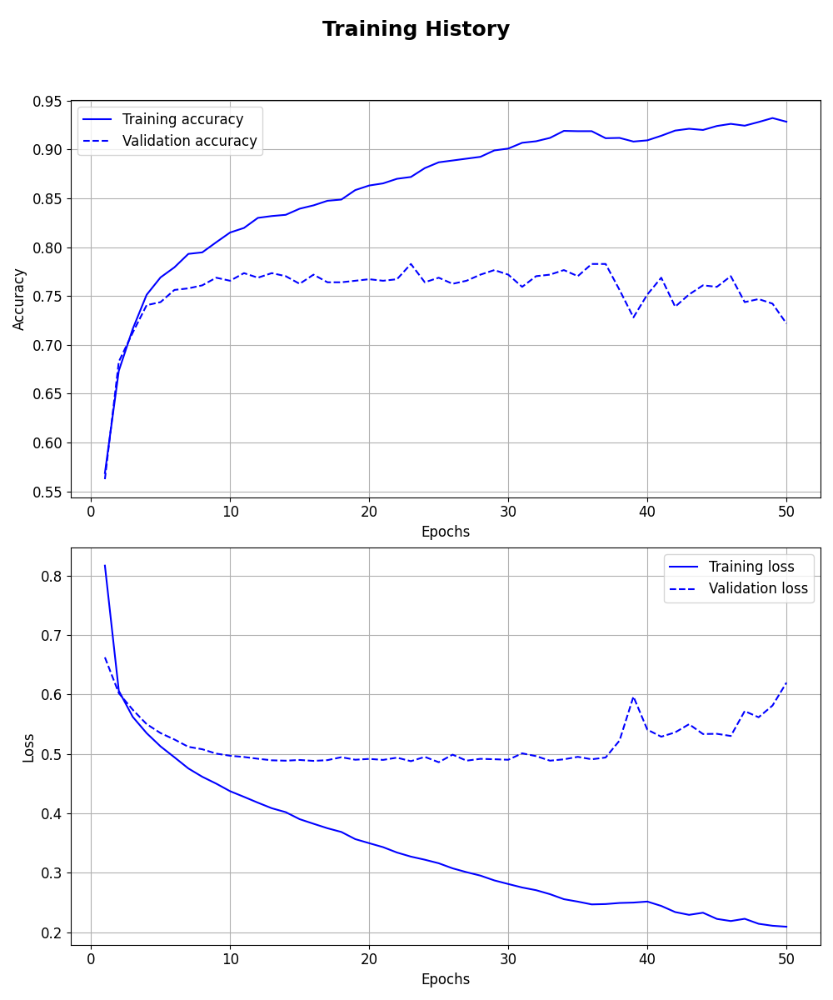

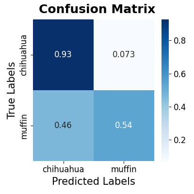

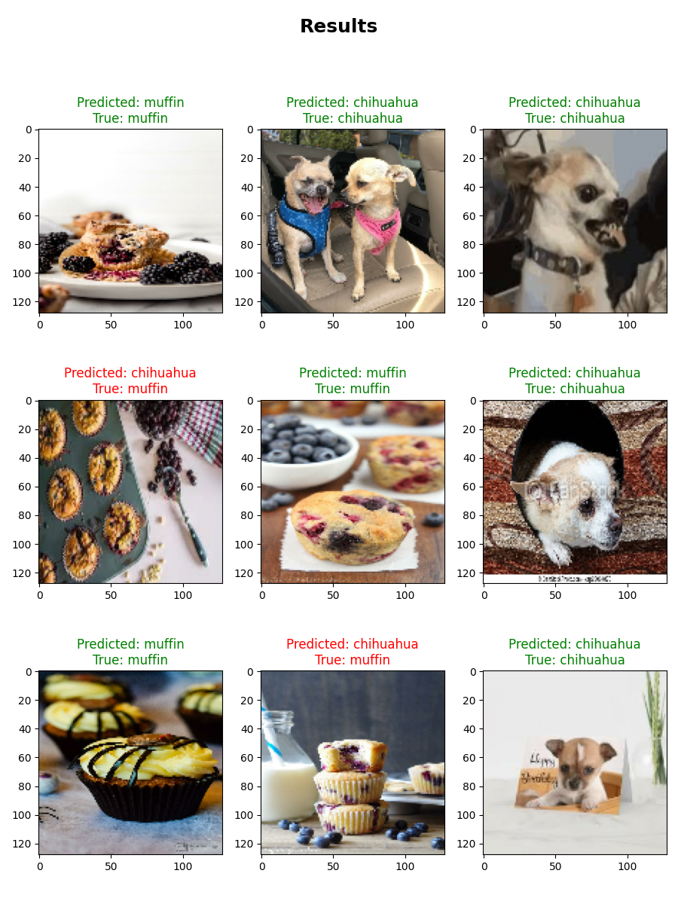

### Detailed Report of Test Set:

|              | precision    | recall       | f1-score     | support      |
| ------------ | ------------ | ------------ | ------------ | ------------ |
| chihuahua    | 0.6961       | 0.9266       | 0.7950       | 477          | 
| muffin       | 0.8643       | 0.5361       | 0.6617       | 416          | 
| micro avg    | 0.7447       | 0.7447       | 0.7447       | 893          | 
| macro avg    | 0.7802       | 0.7313       | 0.7283       | 893          | 
| weighted avg | 0.7745       | 0.7447       | 0.7329       | 893          | 
| samples avg  | 0.7447       | 0.7447       | 0.7447       | 893          | 

## trial_14

*    *Start Time*: 2024-10-16 12:13:23

*    *Duration*: 16.693

*    *Directory*: [Link](./trial_14)

### Hyperparameters:

| Hyperparameter        | Value                 |
| --------------------- | --------------------- |
| units1                | 64                    |
| units2                | 512                   |
| learning_rate         | 4.252677200026925e-05 |

### Evaluation Metrics:

|           | train     | val       | test      |
| --------- | --------- | --------- | --------- |
| accuracy  | 0.8988    | 0.7156    | 0.7424    | 
| precision | 0.8988    | 0.7156    | 0.7424    | 
| recall    | 0.8988    | 0.7156    | 0.7424    | 
| f1        | 0.8987    | 0.7156    | 0.7424    | 

### Figures:

### Detailed Report of Test Set:

|              | precision    | recall       | f1-score     | support      |
| ------------ | ------------ | ------------ | ------------ | ------------ |
| chihuahua    | 0.7194       | 0.8491       | 0.7788       | 477          | 
| muffin       | 0.7818       | 0.6202       | 0.6917       | 416          | 
| micro avg    | 0.7424       | 0.7424       | 0.7424       | 893          | 
| macro avg    | 0.7506       | 0.7346       | 0.7353       | 893          | 
| weighted avg | 0.7485       | 0.7424       | 0.7382       | 893          | 
| samples avg  | 0.7424       | 0.7424       | 0.7424       | 893          | 

## trial_30

*    *Start Time*: 2024-10-16 12:18:28

*    *Duration*: 16.577

*    *Directory*: [Link](./trial_30)

### Hyperparameters:

| Hyperparameter        | Value                 |
| --------------------- | --------------------- |
| units1                | 512                   |
| units2                | 256                   |
| learning_rate         | 8.885337679112182e-05 |

### Evaluation Metrics:

|           | train     | val       | test      |
| --------- | --------- | --------- | --------- |
| accuracy  | 0.8744    | 0.7016    | 0.7335    | 
| precision | 0.8744    | 0.7016    | 0.7335    | 
| recall    | 0.8744    | 0.7016    | 0.7335    | 
| f1        | 0.8744    | 0.7016    | 0.7335    | 

### Figures:

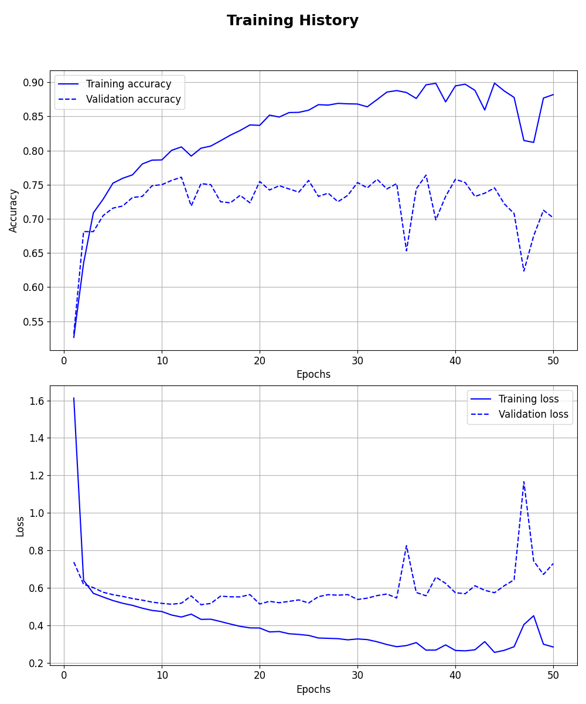

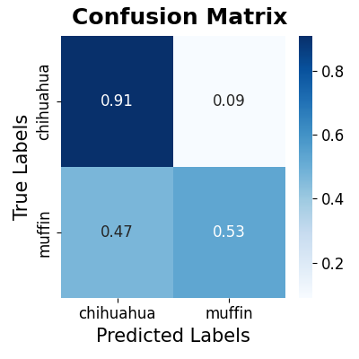

### Detailed Report of Test Set:

|              | precision    | recall       | f1-score     | support      |
| ------------ | ------------ | ------------ | ------------ | ------------ |
| chihuahua    | 0.6900       | 0.9099       | 0.7848       | 477          | 
| muffin       | 0.8371       | 0.5312       | 0.6500       | 416          | 
| micro avg    | 0.7335       | 0.7335       | 0.7335       | 893          | 
| macro avg    | 0.7636       | 0.7206       | 0.7174       | 893          | 
| weighted avg | 0.7585       | 0.7335       | 0.7220       | 893          | 
| samples avg  | 0.7335       | 0.7335       | 0.7335       | 893          | 

## trial_38

*    *Start Time*: 2024-10-16 12:21:07

*    *Duration*: 15.927

*    *Directory*: [Link](./trial_38)

### Hyperparameters:

| Hyperparameter        | Value                 |
| --------------------- | --------------------- |
| units1                | 512                   |
| units2                | 512                   |
| learning_rate         | 9.794055715966575e-05 |

### Evaluation Metrics:

|           | train     | val       | test      |
| --------- | --------- | --------- | --------- |
| accuracy  | 0.8959    | 0.7094    | 0.7335    | 
| precision | 0.8959    | 0.7094    | 0.7335    | 
| recall    | 0.8959    | 0.7094    | 0.7335    | 
| f1        | 0.8959    | 0.7094    | 0.7335    | 

### Figures:

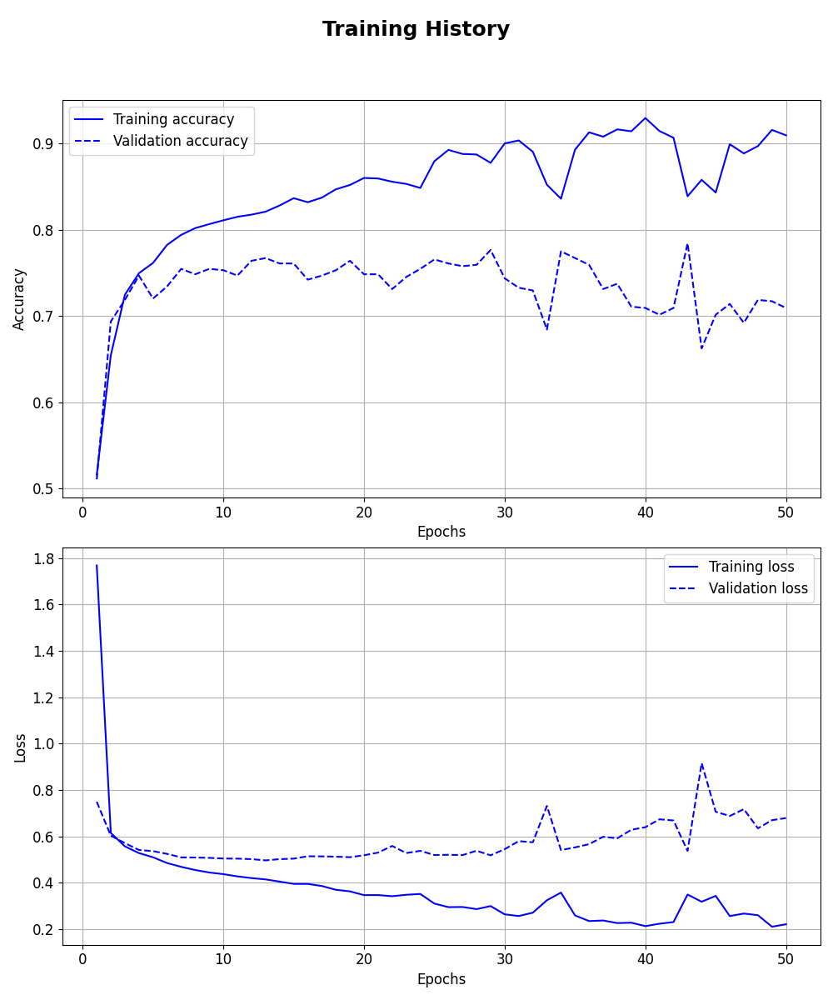

### Detailed Report of Test Set:

|              | precision    | recall       | f1-score     | support      |
| ------------ | ------------ | ------------ | ------------ | ------------ |
| chihuahua    | 0.7145       | 0.8344       | 0.7698       | 477          | 
| muffin       | 0.7649       | 0.6178       | 0.6835       | 416          | 
| micro avg    | 0.7335       | 0.7335       | 0.7335       | 893          | 
| macro avg    | 0.7397       | 0.7261       | 0.7267       | 893          | 
| weighted avg | 0.7380       | 0.7335       | 0.7296       | 893          | 
| samples avg  | 0.7335       | 0.7335       | 0.7335       | 893          | 

## trial_26

*    *Start Time*: 2024-10-16 12:16:52

*    *Duration*: 33.491

*    *Directory*: [Link](./trial_26)

### Hyperparameters:

| Hyperparameter        | Value                 |
| --------------------- | --------------------- |
| units1                | 256                   |
| units2                | 256                   |
| learning_rate         | 6.677827527589385e-05 |

### Evaluation Metrics:

|           | train     | val       | test      |
| --------- | --------- | --------- | --------- |
| accuracy  | 0.8441    | 0.7563    | 0.7301    | 
| precision | 0.8441    | 0.7563    | 0.7301    | 
| recall    | 0.8441    | 0.7563    | 0.7301    | 
| f1        | 0.8441    | 0.7562    | 0.7301    | 

### Figures:

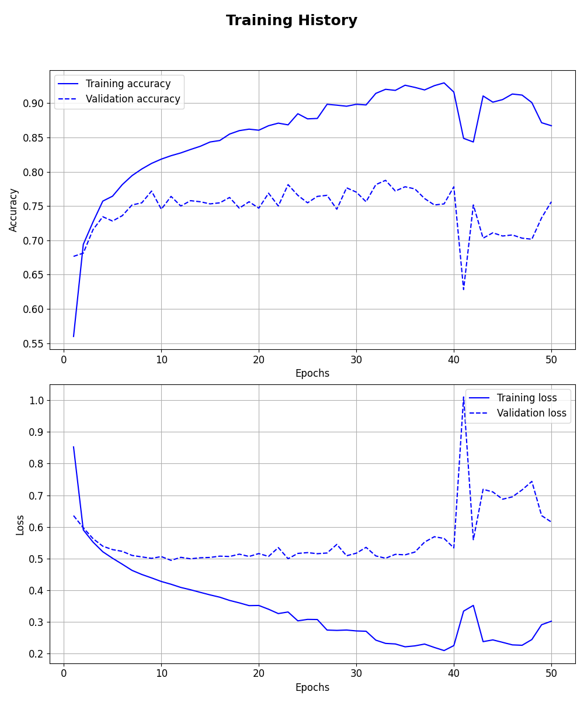

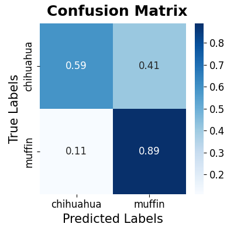

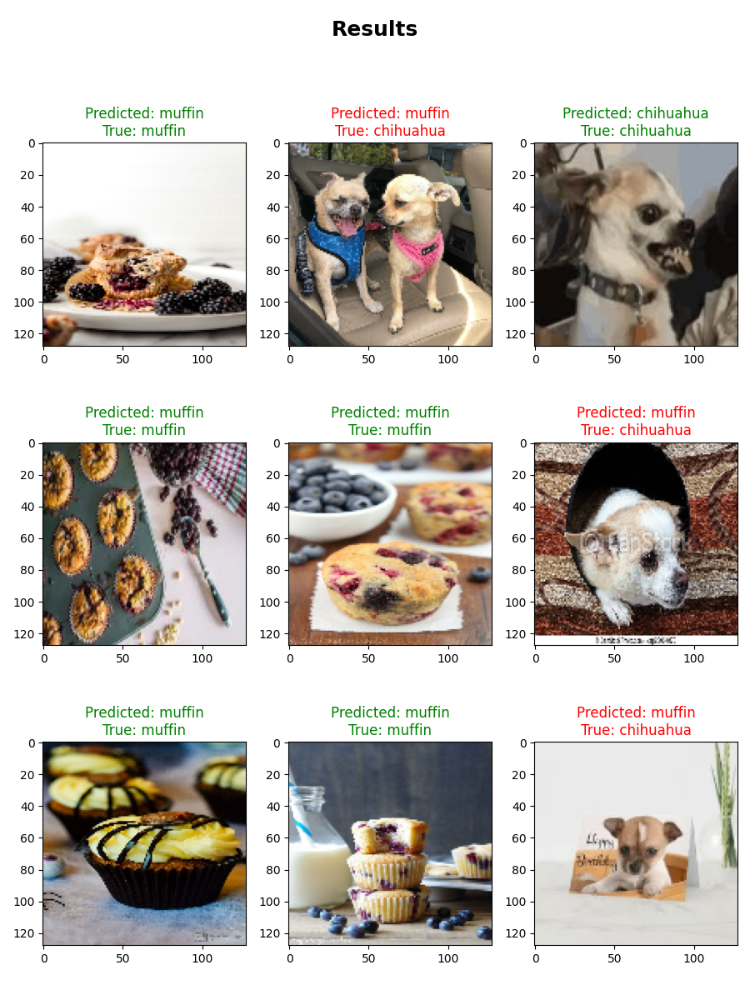

### Detailed Report of Test Set:

|              | precision    | recall       | f1-score     | support      |
| ------------ | ------------ | ------------ | ------------ | ------------ |
| chihuahua    | 0.8598       | 0.5912       | 0.7006       | 477          | 
| muffin       | 0.6549       | 0.8894       | 0.7543       | 416          | 
| micro avg    | 0.7301       | 0.7301       | 0.7301       | 893          | 
| macro avg    | 0.7573       | 0.7403       | 0.7275       | 893          | 
| weighted avg | 0.7643       | 0.7301       | 0.7256       | 893          | 
| samples avg  | 0.7301       | 0.7301       | 0.7301       | 893          | 

## trial_15

*    *Start Time*: 2024-10-16 12:13:40

*    *Duration*: 16.121

*    *Directory*: [Link](./trial_15)

### Hyperparameters:

| Hyperparameter        | Value                 |
| --------------------- | --------------------- |
| units1                | 32                    |
| units2                | 512                   |
| learning_rate         | 0.0020862386267015125 |

### Evaluation Metrics:

|           | train     | val       | test      |
| --------- | --------- | --------- | --------- |
| accuracy  | 0.8413    | 0.7297    | 0.7290    | 
| precision | 0.8413    | 0.7297    | 0.7290    | 
| recall    | 0.8413    | 0.7297    | 0.7290    | 
| f1        | 0.8412    | 0.7297    | 0.7290    | 

### Figures:

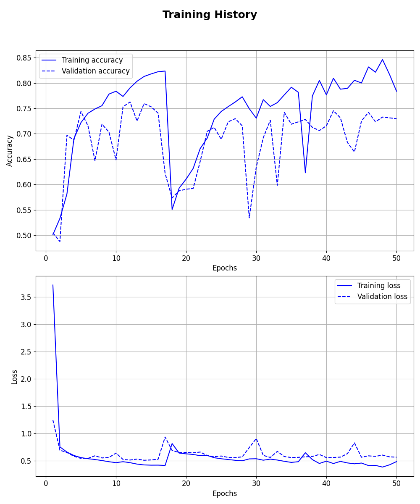

### Detailed Report of Test Set:

|              | precision    | recall       | f1-score     | support      |
| ------------ | ------------ | ------------ | ------------ | ------------ |
| chihuahua    | 0.7393       | 0.7610       | 0.7500       | 477          | 
| muffin       | 0.7164       | 0.6923       | 0.7042       | 416          | 
| micro avg    | 0.7290       | 0.7290       | 0.7290       | 893          | 
| macro avg    | 0.7279       | 0.7267       | 0.7271       | 893          | 
| weighted avg | 0.7286       | 0.7290       | 0.7286       | 893          | 
| samples avg  | 0.7290       | 0.7290       | 0.7290       | 893          | 

## trial_10

*    *Start Time*: 2024-10-16 12:12:16

*    *Duration*: 16.117

*    *Directory*: [Link](./trial_10)

### Hyperparameters:

| Hyperparameter        | Value                 |
| --------------------- | --------------------- |
| units1                | 256                   |
| units2                | 512                   |
| learning_rate         | 0.0001613141969210371 |

### Evaluation Metrics:

|           | train     | val       | test      |
| --------- | --------- | --------- | --------- |
| accuracy  | 0.8631    | 0.7453    | 0.7279    | 
| precision | 0.8631    | 0.7453    | 0.7279    | 
| recall    | 0.8631    | 0.7453    | 0.7279    | 
| f1        | 0.8631    | 0.7453    | 0.7279    | 

### Figures:

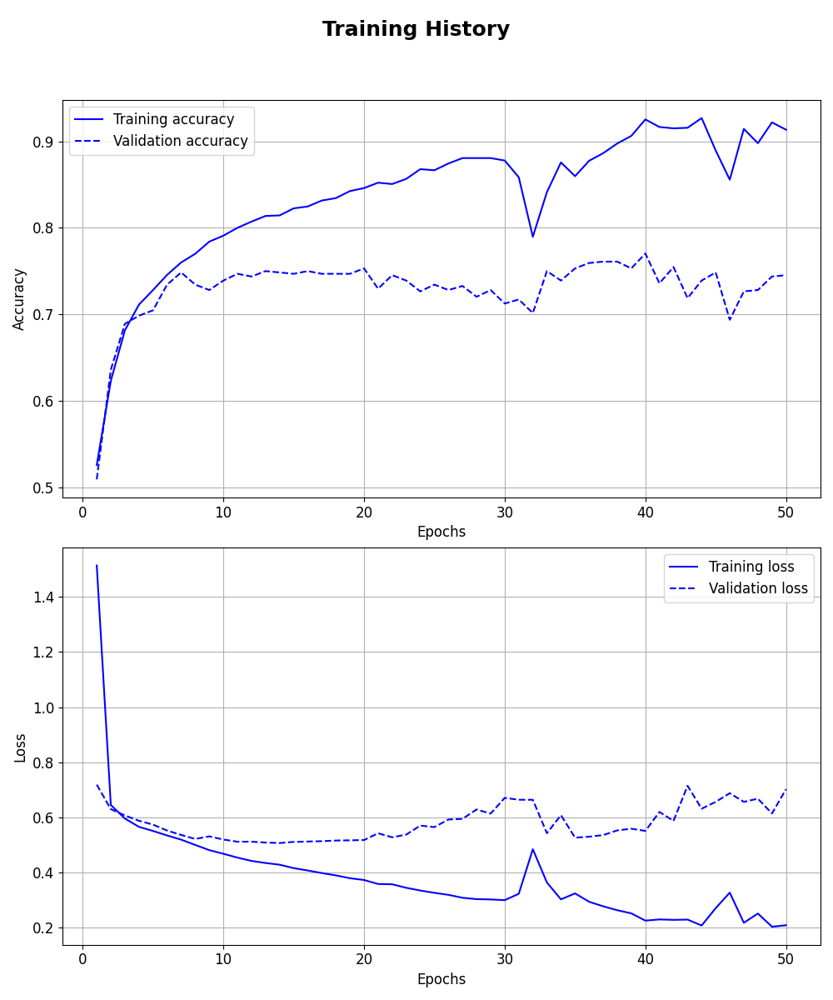

### Detailed Report of Test Set:

|              | precision    | recall       | f1-score     | support      |
| ------------ | ------------ | ------------ | ------------ | ------------ |
| chihuahua    | 0.8421       | 0.6038       | 0.7033       | 477          | 
| muffin       | 0.6570       | 0.8702       | 0.7487       | 416          | 
| micro avg    | 0.7279       | 0.7279       | 0.7279       | 893          | 
| macro avg    | 0.7495       | 0.7370       | 0.7260       | 893          | 
| weighted avg | 0.7559       | 0.7279       | 0.7245       | 893          | 
| samples avg  | 0.7279       | 0.7279       | 0.7279       | 893          | 

## trial_50

*    *Start Time*: 2024-10-16 12:24:29

*    *Duration*: 16.031

*    *Directory*: [Link](./trial_50)

### Hyperparameters:

| Hyperparameter         | Value                  |
| ---------------------- | ---------------------- |
| units1                 | 512                    |
| units2                 | 512                    |
| learning_rate          | 0.00021004336299916445 |

### Evaluation Metrics:

|           | train     | val       | test      |
| --------- | --------- | --------- | --------- |
| accuracy  | 0.8803    | 0.7063    | 0.7256    | 
| precision | 0.8803    | 0.7063    | 0.7256    | 
| recall    | 0.8803    | 0.7063    | 0.7256    | 
| f1        | 0.8803    | 0.7062    | 0.7256    | 

### Figures:

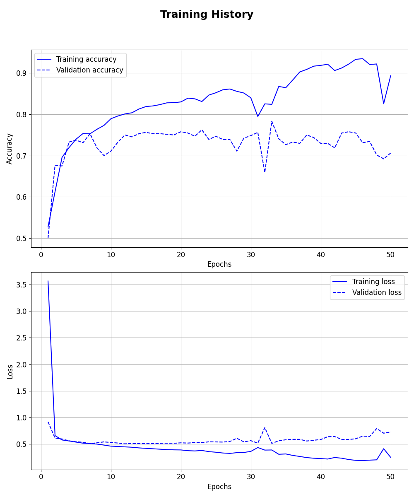

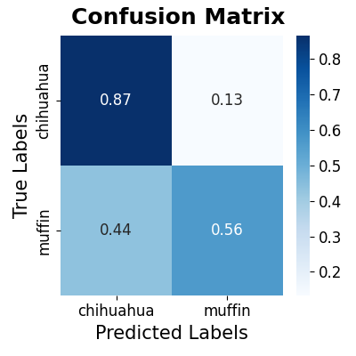

### Detailed Report of Test Set:

|              | precision    | recall       | f1-score     | support      |
| ------------ | ------------ | ------------ | ------------ | ------------ |
| chihuahua    | 0.6953       | 0.8658       | 0.7712       | 477          | 
| muffin       | 0.7860       | 0.5649       | 0.6573       | 416          | 
| micro avg    | 0.7256       | 0.7256       | 0.7256       | 893          | 
| macro avg    | 0.7406       | 0.7154       | 0.7143       | 893          | 
| weighted avg | 0.7375       | 0.7256       | 0.7182       | 893          | 
| samples avg  | 0.7256       | 0.7256       | 0.7256       | 893          | 

## trial_61

*    *Start Time*: 2024-10-16 12:28:06

*    *Duration*: 30.777

*    *Directory*: [Link](./trial_61)

### Hyperparameters:

| Hyperparameter        | Value                 |
| --------------------- | --------------------- |
| units1                | 128                   |
| units2                | 32                    |
| learning_rate         | 0.0018725902355850729 |

### Evaluation Metrics:

|           | train     | val       | test      |
| --------- | --------- | --------- | --------- |
| accuracy  | 0.9097    | 0.7063    | 0.7245    | 
| precision | 0.9097    | 0.7063    | 0.7245    | 
| recall    | 0.9097    | 0.7063    | 0.7245    | 
| f1        | 0.9097    | 0.7062    | 0.7245    | 

### Figures:

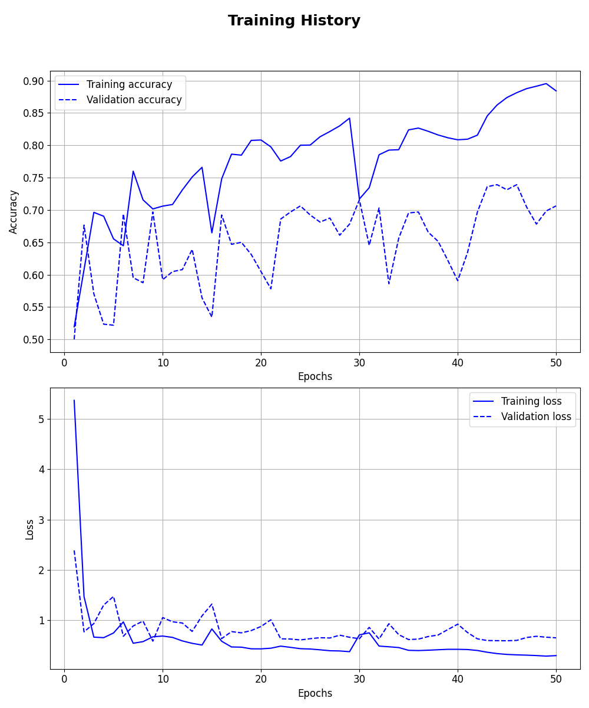

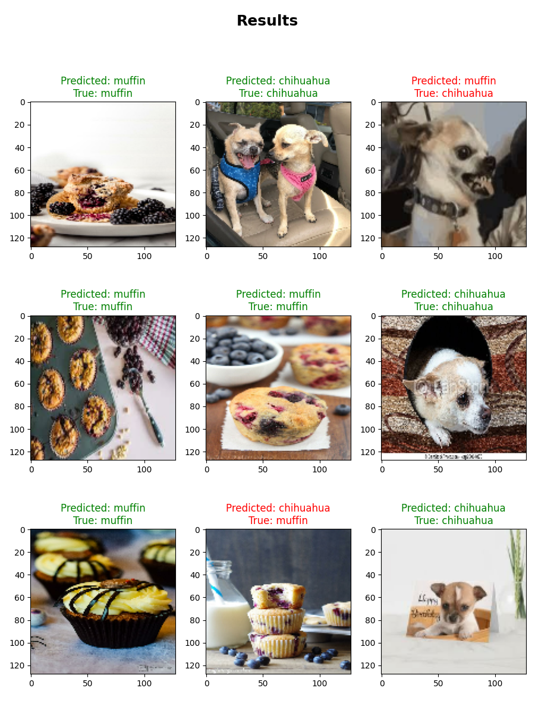

### Detailed Report of Test Set:

|              | precision    | recall       | f1-score     | support      |
| ------------ | ------------ | ------------ | ------------ | ------------ |
| chihuahua    | 0.7044       | 0.8344       | 0.7639       | 477          | 
| muffin       | 0.7591       | 0.5986       | 0.6694       | 416          | 
| micro avg    | 0.7245       | 0.7245       | 0.7245       | 893          | 
| macro avg    | 0.7318       | 0.7165       | 0.7166       | 893          | 
| weighted avg | 0.7299       | 0.7245       | 0.7199       | 893          | 
| samples avg  | 0.7245       | 0.7245       | 0.7245       | 893          | 

## trial_17

*    *Start Time*: 2024-10-16 12:14:13

*    *Duration*: 17.688

*    *Directory*: [Link](./trial_17)

### Hyperparameters:

| Hyperparameter        | Value                 |
| --------------------- | --------------------- |
| units1                | 128                   |
| units2                | 512                   |
| learning_rate         | 0.0005820534482573165 |

### Evaluation Metrics:

|           | train     | val       | test      |
| --------- | --------- | --------- | --------- |
| accuracy  | 0.8800    | 0.6797    | 0.7234    | 
| precision | 0.8800    | 0.6797    | 0.7234    | 
| recall    | 0.8800    | 0.6797    | 0.7234    | 
| f1        | 0.8800    | 0.6797    | 0.7234    | 

### Figures:

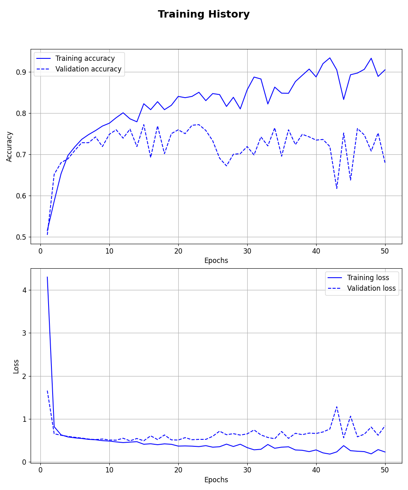

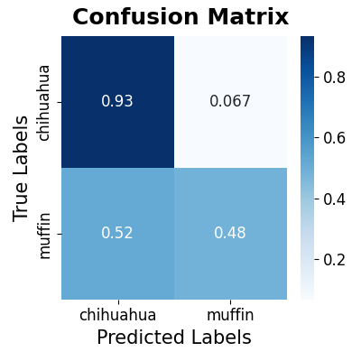

### Detailed Report of Test Set:

|              | precision    | recall       | f1-score     | support      |
| ------------ | ------------ | ------------ | ------------ | ------------ |
| chihuahua    | 0.6742       | 0.9329       | 0.7828       | 477          | 
| muffin       | 0.8627       | 0.4832       | 0.6194       | 416          | 
| micro avg    | 0.7234       | 0.7234       | 0.7234       | 893          | 
| macro avg    | 0.7685       | 0.7080       | 0.7011       | 893          | 
| weighted avg | 0.7620       | 0.7234       | 0.7067       | 893          | 
| samples avg  | 0.7234       | 0.7234       | 0.7234       | 893          | 

## trial_80

*    *Start Time*: 2024-10-16 12:35:01

*    *Duration*: 28.438

*    *Directory*: [Link](./trial_80)

### Hyperparameters:

| Hyperparameter        | Value                 |
| --------------------- | --------------------- |
| units1                | 512                   |
| units2                | 256                   |
| learning_rate         | 7.238527913744023e-05 |

### Evaluation Metrics:

|           | train     | val       | test      |
| --------- | --------- | --------- | --------- |
| accuracy  | 0.8394    | 0.7422    | 0.7189    | 
| precision | 0.8394    | 0.7422    | 0.7189    | 
| recall    | 0.8394    | 0.7422    | 0.7189    | 
| f1        | 0.8394    | 0.7422    | 0.7189    | 

### Figures:

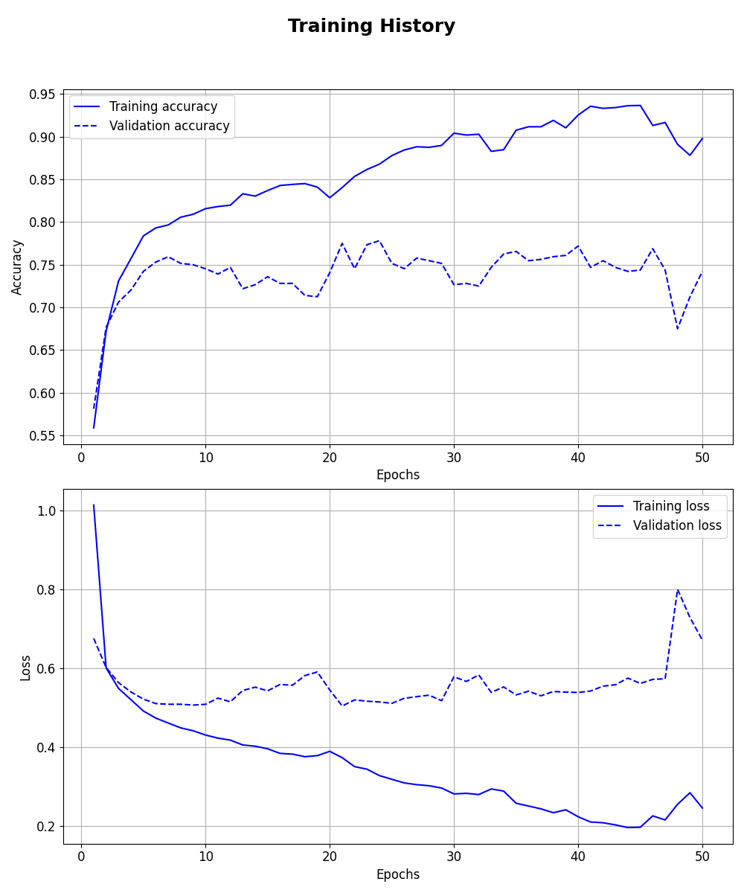

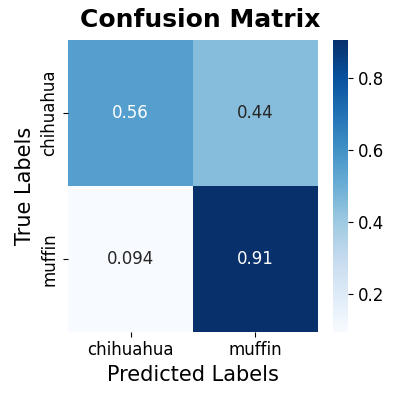

### Detailed Report of Test Set:

|              | precision    | recall       | f1-score     | support      |
| ------------ | ------------ | ------------ | ------------ | ------------ |
| chihuahua    | 0.8717       | 0.5556       | 0.6786       | 477          | 
| muffin       | 0.6401       | 0.9062       | 0.7502       | 416          | 
| micro avg    | 0.7189       | 0.7189       | 0.7189       | 893          | 
| macro avg    | 0.7559       | 0.7309       | 0.7144       | 893          | 
| weighted avg | 0.7638       | 0.7189       | 0.7120       | 893          | 
| samples avg  | 0.7189       | 0.7189       | 0.7189       | 893          | 

## trial_28

*    *Start Time*: 2024-10-16 12:17:43

*    *Duration*: 15.420

*    *Directory*: [Link](./trial_28)

### Hyperparameters:

| Hyperparameter         | Value                  |
| ---------------------- | ---------------------- |
| units1                 | 256                    |
| units2                 | 256                    |
| learning_rate          | 1.8506530223312954e-05 |

### Evaluation Metrics:

|           | train     | val       | test      |
| --------- | --------- | --------- | --------- |
| accuracy  | 0.8959    | 0.6984    | 0.7156    | 
| precision | 0.8959    | 0.6984    | 0.7156    | 
| recall    | 0.8959    | 0.6984    | 0.7156    | 
| f1        | 0.8959    | 0.6984    | 0.7156    | 

### Figures:

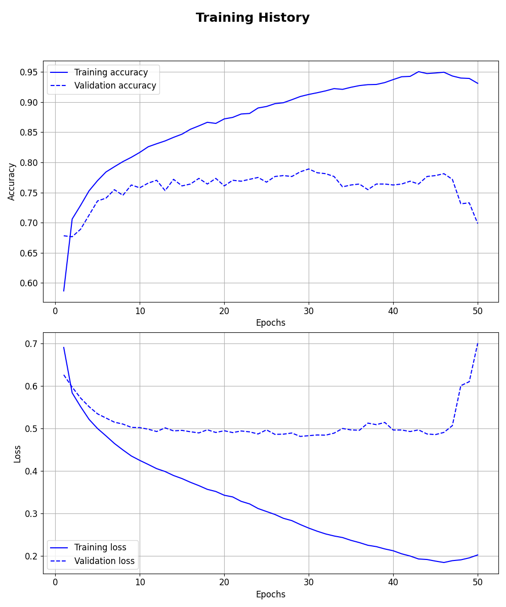

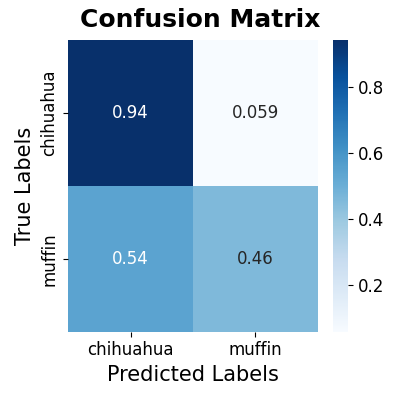

### Detailed Report of Test Set:

|              | precision    | recall       | f1-score     | support      |
| ------------ | ------------ | ------------ | ------------ | ------------ |
| chihuahua    | 0.6652       | 0.9413       | 0.7795       | 477          | 
| muffin       | 0.8716       | 0.4567       | 0.5994       | 416          | 
| micro avg    | 0.7156       | 0.7156       | 0.7156       | 893          | 
| macro avg    | 0.7684       | 0.6990       | 0.6894       | 893          | 
| weighted avg | 0.7613       | 0.7156       | 0.6956       | 893          | 
| samples avg  | 0.7156       | 0.7156       | 0.7156       | 893          | 

## trial_31

*    *Start Time*: 2024-10-16 12:18:45

*    *Duration*: 15.889

*    *Directory*: [Link](./trial_31)

### Hyperparameters:

| Hyperparameter       | Value                |
| -------------------- | -------------------- |
| units1               | 256                  |
| units2               | 256                  |
| learning_rate        | 0.000288951013469553 |

### Evaluation Metrics:

|           | train     | val       | test      |
| --------- | --------- | --------- | --------- |
| accuracy  | 0.8244    | 0.7203    | 0.7100    | 
| precision | 0.8244    | 0.7203    | 0.7100    | 
| recall    | 0.8244    | 0.7203    | 0.7100    | 
| f1        | 0.8244    | 0.7203    | 0.7100    | 

### Figures:

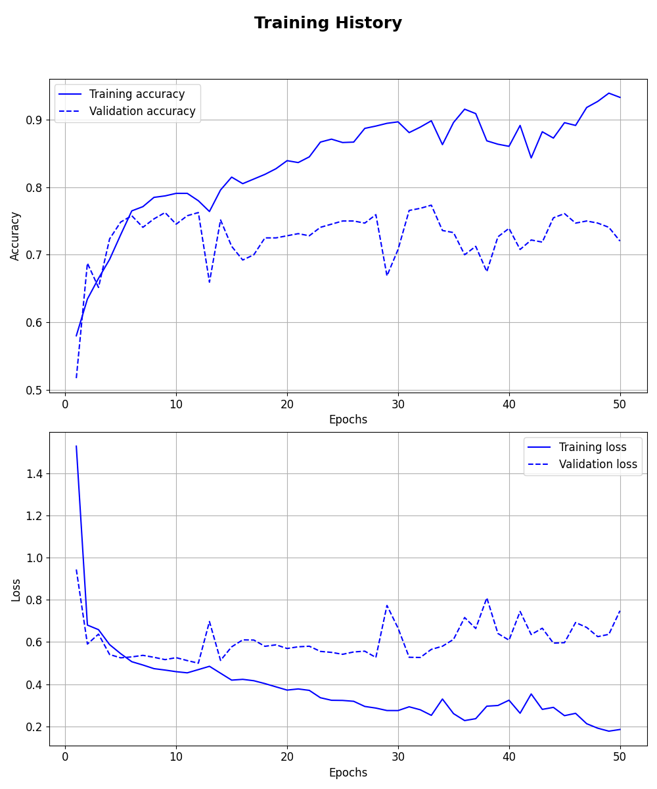

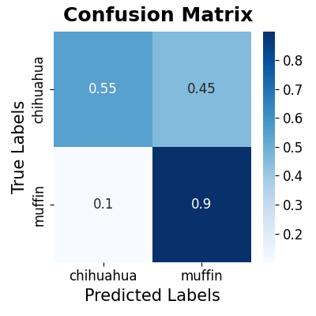

### Detailed Report of Test Set:

|              | precision    | recall       | f1-score     | support      |
| ------------ | ------------ | ------------ | ------------ | ------------ |
| chihuahua    | 0.8609       | 0.5451       | 0.6675       | 477          | 
| muffin       | 0.6328       | 0.8990       | 0.7428       | 416          | 
| micro avg    | 0.7100       | 0.7100       | 0.7100       | 893          | 
| macro avg    | 0.7469       | 0.7221       | 0.7052       | 893          | 
| weighted avg | 0.7547       | 0.7100       | 0.7026       | 893          | 
| samples avg  | 0.7100       | 0.7100       | 0.7100       | 893          | 

## trial_5

*    *Start Time*: 2024-10-16 12:10:47

*    *Duration*: 17.929

*    *Directory*: [Link](./trial_5)

### Hyperparameters:

| Hyperparameter        | Value                 |
| --------------------- | --------------------- |
| units1                | 256                   |
| units2                | 512                   |
| learning_rate         | 0.0013941584915097998 |

### Evaluation Metrics:

|           | train     | val       | test      |
| --------- | --------- | --------- | --------- |
| accuracy  | 0.7084    | 0.5797    | 0.6137    | 
| precision | 0.7084    | 0.5797    | 0.6137    | 
| recall    | 0.7084    | 0.5797    | 0.6137    | 
| f1        | 0.7084    | 0.5797    | 0.6137    | 

### Figures:

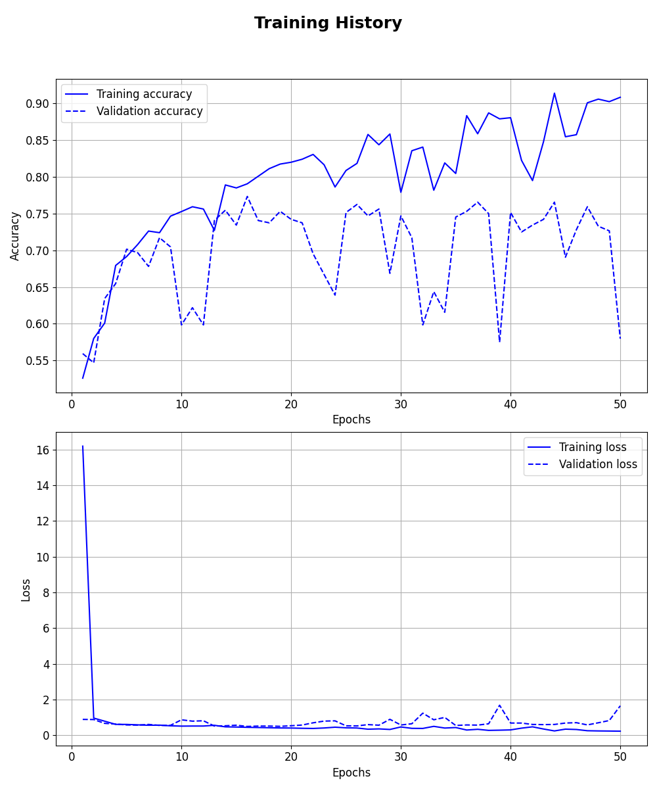

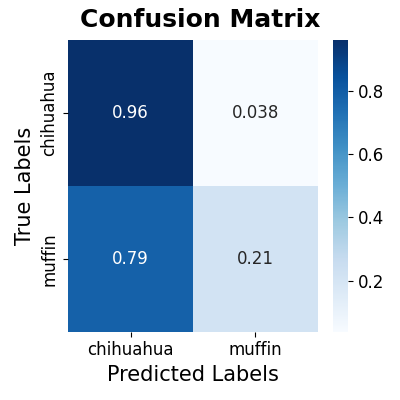

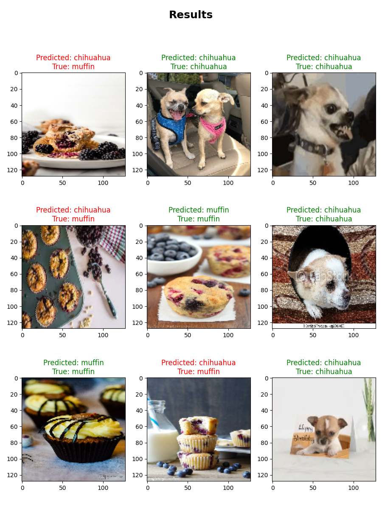

### Detailed Report of Test Set:

|              | precision    | recall       | f1-score     | support      |
| ------------ | ------------ | ------------ | ------------ | ------------ |
| chihuahua    | 0.5840       | 0.9623       | 0.7268       | 477          | 
| muffin       | 0.8318       | 0.2139       | 0.3403       | 416          | 
| micro avg    | 0.6137       | 0.6137       | 0.6137       | 893          | 
| macro avg    | 0.7079       | 0.5881       | 0.5336       | 893          | 
| weighted avg | 0.6994       | 0.6137       | 0.5468       | 893          | 
| samples avg  | 0.6137       | 0.6137       | 0.6137       | 893          | 

## trial_2

*    *Start Time*: 2024-10-16 12:09:52

*    *Duration*: 17.457

*    *Directory*: [Link](./trial_2)

### Hyperparameters:

| Hyperparameter       | Value                |
| -------------------- | -------------------- |
| units1               | 128                  |
| units2               | 256                  |
| learning_rate        | 0.060237749979663115 |

### Evaluation Metrics:

|           | train     | val       | test      |
| --------- | --------- | --------- | --------- |
| accuracy  | 0.5497    | 0.5047    | 0.5342    | 
| precision | 0.5497    | 0.5047    | 0.5342    | 
| recall    | 0.5497    | 0.5047    | 0.5342    | 
| f1        | 0.5497    | 0.5047    | 0.5342    | 

### Figures:

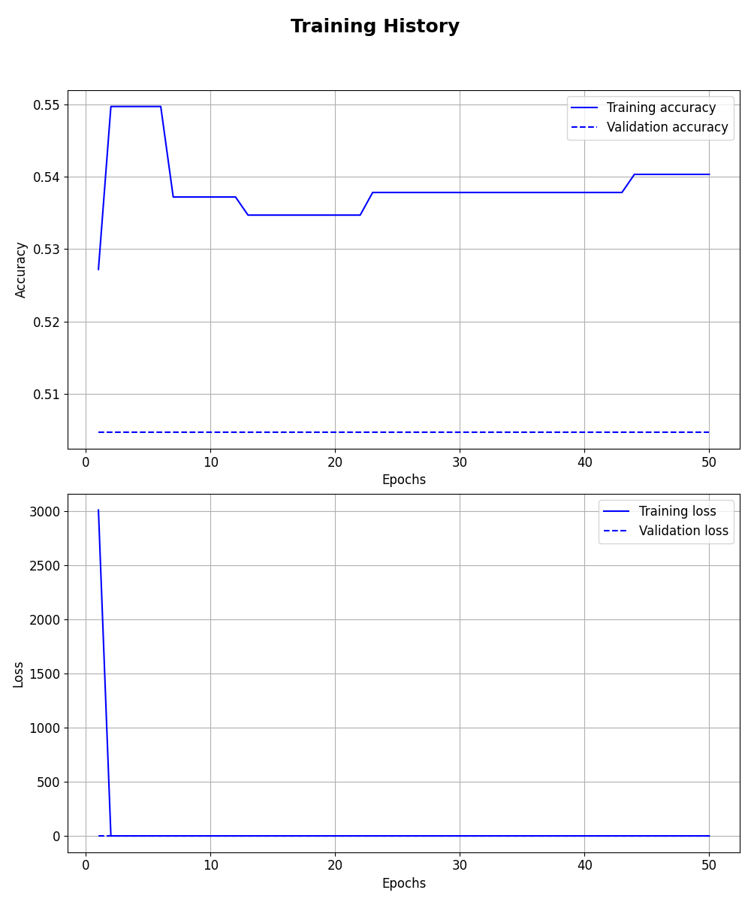

### Detailed Report of Test Set:

|              | precision    | recall       | f1-score     | support      |
| ------------ | ------------ | ------------ | ------------ | ------------ |
| chihuahua    | 0.5342       | 1.0000       | 0.6964       | 477          | 
| muffin       | 0.0000e+00   | 0.0000e+00   | 0.0000e+00   | 416          | 
| micro avg    | 0.5342       | 0.5342       | 0.5342       | 893          | 
| macro avg    | 0.2671       | 0.5000       | 0.3482       | 893          | 
| weighted avg | 0.2853       | 0.5342       | 0.3720       | 893          | 
| samples avg  | 0.5342       | 0.5342       | 0.5342       | 893          | 

## trial_6

*    *Start Time*: 2024-10-16 12:11:06

*    *Duration*: 17.339

*    *Directory*: [Link](./trial_6)

### Hyperparameters:

| Hyperparameter      | Value               |
| ------------------- | ------------------- |
| units1              | 512                 |
| units2              | 128                 |
| learning_rate       | 0.03485287093649814 |

### Evaluation Metrics:

|           | train     | val       | test      |
| --------- | --------- | --------- | --------- |
| accuracy  | 0.5497    | 0.5047    | 0.5342    | 
| precision | 0.5497    | 0.5047    | 0.5342    | 
| recall    | 0.5497    | 0.5047    | 0.5342    | 
| f1        | 0.5497    | 0.5047    | 0.5342    | 

### Figures:

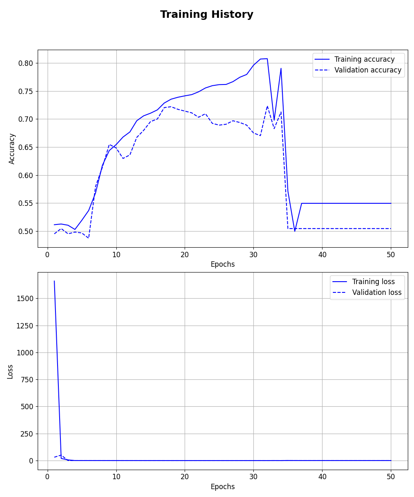

### Detailed Report of Test Set:

|              | precision    | recall       | f1-score     | support      |
| ------------ | ------------ | ------------ | ------------ | ------------ |
| chihuahua    | 0.5342       | 1.0000       | 0.6964       | 477          | 
| muffin       | 0.0000e+00   | 0.0000e+00   | 0.0000e+00   | 416          | 
| micro avg    | 0.5342       | 0.5342       | 0.5342       | 893          | 
| macro avg    | 0.2671       | 0.5000       | 0.3482       | 893          | 
| weighted avg | 0.2853       | 0.5342       | 0.3720       | 893          | 
| samples avg  | 0.5342       | 0.5342       | 0.5342       | 893          | 

## trial_19

*    *Start Time*: 2024-10-16 12:14:48

*    *Duration*: 16.279

*    *Directory*: [Link](./trial_19)

### Hyperparameters:

| Hyperparameter       | Value                |
| -------------------- | -------------------- |
| units1               | 256                  |
| units2               | 512                  |
| learning_rate        | 0.008666118212189879 |

### Evaluation Metrics:

|           | train     | val       | test      |
| --------- | --------- | --------- | --------- |
| accuracy  | 0.5497    | 0.5047    | 0.5342    | 
| precision | 0.5497    | 0.5047    | 0.5342    | 
| recall    | 0.5497    | 0.5047    | 0.5342    | 
| f1        | 0.5497    | 0.5047    | 0.5342    | 

### Figures:

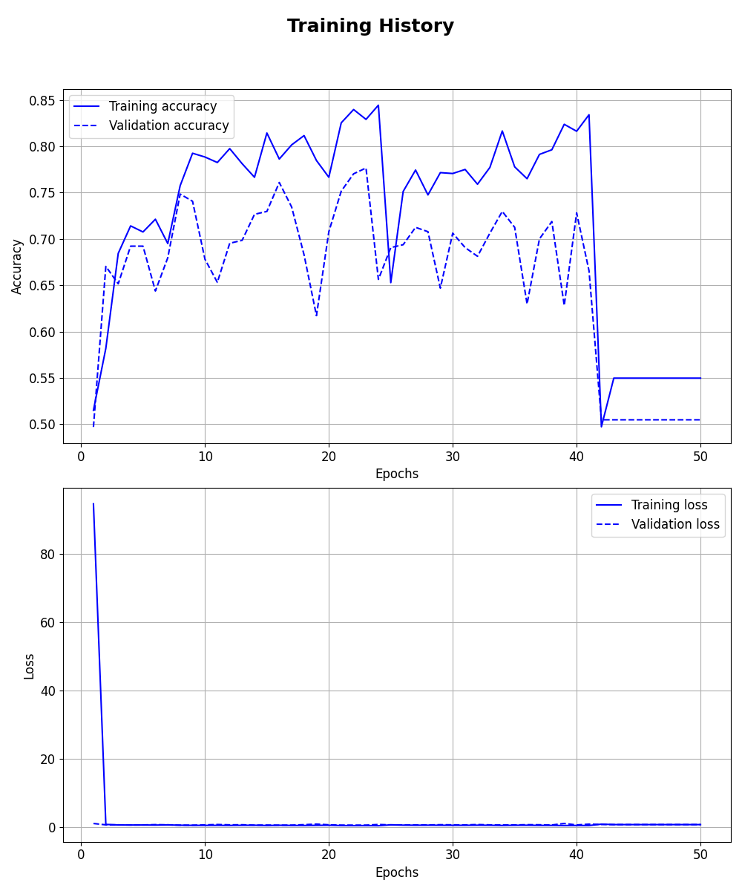

### Detailed Report of Test Set:

|              | precision    | recall       | f1-score     | support      |
| ------------ | ------------ | ------------ | ------------ | ------------ |
| chihuahua    | 0.5342       | 1.0000       | 0.6964       | 477          | 
| muffin       | 0.0000e+00   | 0.0000e+00   | 0.0000e+00   | 416          | 
| micro avg    | 0.5342       | 0.5342       | 0.5342       | 893          | 
| macro avg    | 0.2671       | 0.5000       | 0.3482       | 893          | 
| weighted avg | 0.2853       | 0.5342       | 0.3720       | 893          | 
| samples avg  | 0.5342       | 0.5342       | 0.5342       | 893          | 

## trial_21

*    *Start Time*: 2024-10-16 12:15:22

*    *Duration*: 15.823

*    *Directory*: [Link](./trial_21)

### Hyperparameters:

| Hyperparameter        | Value                 |
| --------------------- | --------------------- |
| units1                | 32                    |
| units2                | 512                   |
| learning_rate         | 0.0035983383006447205 |

### Evaluation Metrics:

|           | train     | val       | test      |
| --------- | --------- | --------- | --------- |
| accuracy  | 0.5497    | 0.5047    | 0.5342    | 
| precision | 0.5497    | 0.5047    | 0.5342    | 
| recall    | 0.5497    | 0.5047    | 0.5342    | 
| f1        | 0.5497    | 0.5047    | 0.5342    | 

### Figures:

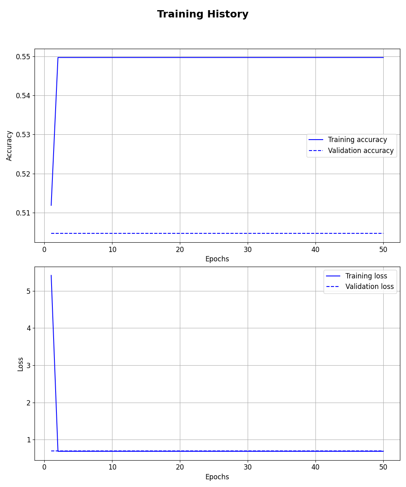

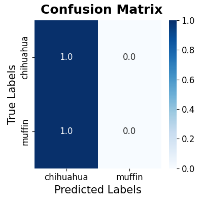

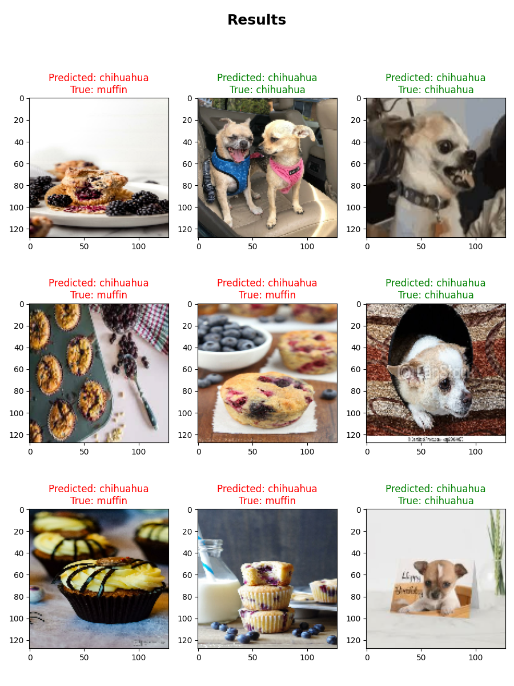

### Detailed Report of Test Set:

|              | precision    | recall       | f1-score     | support      |
| ------------ | ------------ | ------------ | ------------ | ------------ |
| chihuahua    | 0.5342       | 1.0000       | 0.6964       | 477          | 
| muffin       | 0.0000e+00   | 0.0000e+00   | 0.0000e+00   | 416          | 
| micro avg    | 0.5342       | 0.5342       | 0.5342       | 893          | 
| macro avg    | 0.2671       | 0.5000       | 0.3482       | 893          | 
| weighted avg | 0.2853       | 0.5342       | 0.3720       | 893          | 
| samples avg  | 0.5342       | 0.5342       | 0.5342       | 893          | 

## trial_40

*    *Start Time*: 2024-10-16 12:21:40

*    *Duration*: 15.502

*    *Directory*: [Link](./trial_40)

### Hyperparameters:

| Hyperparameter      | Value               |
| ------------------- | ------------------- |
| units1              | 512                 |
| units2              | 512                 |
| learning_rate       | 0.04151989753386345 |

### Evaluation Metrics:

|           | train     | val       | test      |
| --------- | --------- | --------- | --------- |
| accuracy  | 0.5497    | 0.5047    | 0.5342    | 
| precision | 0.5497    | 0.5047    | 0.5342    | 
| recall    | 0.5497    | 0.5047    | 0.5342    | 
| f1        | 0.5497    | 0.5047    | 0.5342    | 

### Figures:

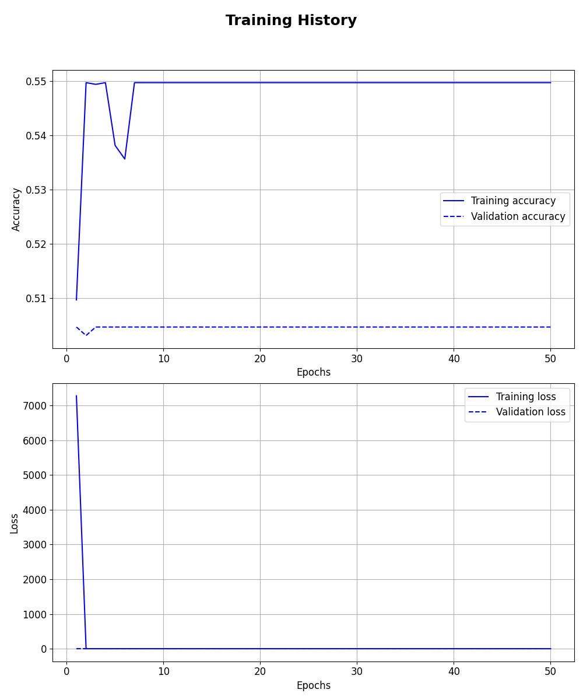

### Detailed Report of Test Set:

|              | precision    | recall       | f1-score     | support      |
| ------------ | ------------ | ------------ | ------------ | ------------ |
| chihuahua    | 0.5342       | 1.0000       | 0.6964       | 477          | 
| muffin       | 0.0000e+00   | 0.0000e+00   | 0.0000e+00   | 416          | 
| micro avg    | 0.5342       | 0.5342       | 0.5342       | 893          | 
| macro avg    | 0.2671       | 0.5000       | 0.3482       | 893          | 
| weighted avg | 0.2853       | 0.5342       | 0.3720       | 893          | 
| samples avg  | 0.5342       | 0.5342       | 0.5342       | 893          | 

## trial_58

*    *Start Time*: 2024-10-16 12:27:04

*    *Duration*: 29.758

*    *Directory*: [Link](./trial_58)

### Hyperparameters:

| Hyperparameter       | Value                |
| -------------------- | -------------------- |
| units1               | 64                   |
| units2               | 512                  |
| learning_rate        | 0.005728087773617893 |

### Evaluation Metrics:

|           | train     | val       | test      |
| --------- | --------- | --------- | --------- |
| accuracy  | 0.5497    | 0.5047    | 0.5342    | 
| precision | 0.5497    | 0.5047    | 0.5342    | 
| recall    | 0.5497    | 0.5047    | 0.5342    | 
| f1        | 0.5497    | 0.5047    | 0.5342    | 

### Figures:

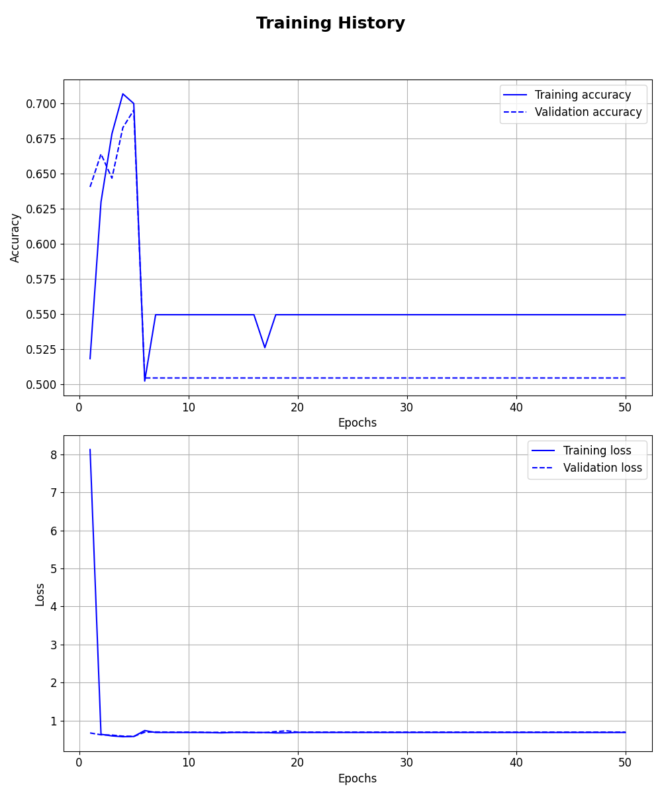

### Detailed Report of Test Set:

|              | precision    | recall       | f1-score     | support      |
| ------------ | ------------ | ------------ | ------------ | ------------ |
| chihuahua    | 0.5342       | 1.0000       | 0.6964       | 477          | 
| muffin       | 0.0000e+00   | 0.0000e+00   | 0.0000e+00   | 416          | 
| micro avg    | 0.5342       | 0.5342       | 0.5342       | 893          | 
| macro avg    | 0.2671       | 0.5000       | 0.3482       | 893          | 
| weighted avg | 0.2853       | 0.5342       | 0.3720       | 893          | 
| samples avg  | 0.5342       | 0.5342       | 0.5342       | 893          | 

## trial_73

*    *Start Time*: 2024-10-16 12:32:36

*    *Duration*: 16.230

*    *Directory*: [Link](./trial_73)

### Hyperparameters:

| Hyperparameter     | Value              |
| ------------------ | ------------------ |
| units1             | 512                |
| units2             | 256                |
| learning_rate      | 0.0157206648067134 |

### Evaluation Metrics:

|           | train     | val       | test      |
| --------- | --------- | --------- | --------- |
| accuracy  | 0.5497    | 0.5063    | 0.5342    | 
| precision | 0.5497    | 0.5063    | 0.5342    | 
| recall    | 0.5497    | 0.5063    | 0.5342    | 
| f1        | 0.5497    | 0.5062    | 0.5342    | 

### Figures:

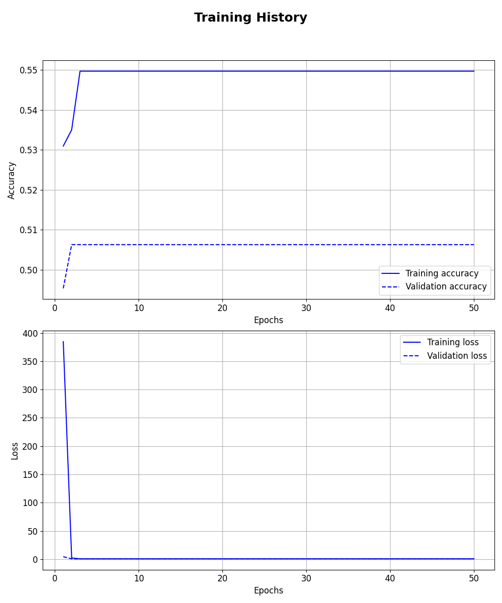

### Detailed Report of Test Set:

|              | precision    | recall       | f1-score     | support      |
| ------------ | ------------ | ------------ | ------------ | ------------ |
| chihuahua    | 0.5342       | 1.0000       | 0.6964       | 477          | 
| muffin       | 0.0000e+00   | 0.0000e+00   | 0.0000e+00   | 416          | 
| micro avg    | 0.5342       | 0.5342       | 0.5342       | 893          | 
| macro avg    | 0.2671       | 0.5000       | 0.3482       | 893          | 
| weighted avg | 0.2853       | 0.5342       | 0.3720       | 893          | 
| samples avg  | 0.5342       | 0.5342       | 0.5342       | 893          | 

## trial_51

*    *Start Time*: 2024-10-16 12:24:45

*    *Duration*: 16.811

*    *Directory*: [Link](./trial_51)

### Hyperparameters:

| Hyperparameter      | Value               |
| ------------------- | ------------------- |
| units1              | 128                 |
| units2              | 256                 |
| learning_rate       | 0.07957421350799568 |

### Evaluation Metrics:

|           | train     | val       | test      |
| --------- | --------- | --------- | --------- |
| accuracy  | 0.5500    | 0.5031    | 0.5319    | 
| precision | 0.5500    | 0.5031    | 0.5319    | 
| recall    | 0.5500    | 0.5031    | 0.5319    | 
| f1        | 0.5500    | 0.5031    | 0.5319    | 

### Figures:

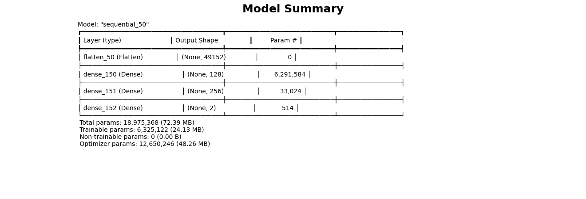

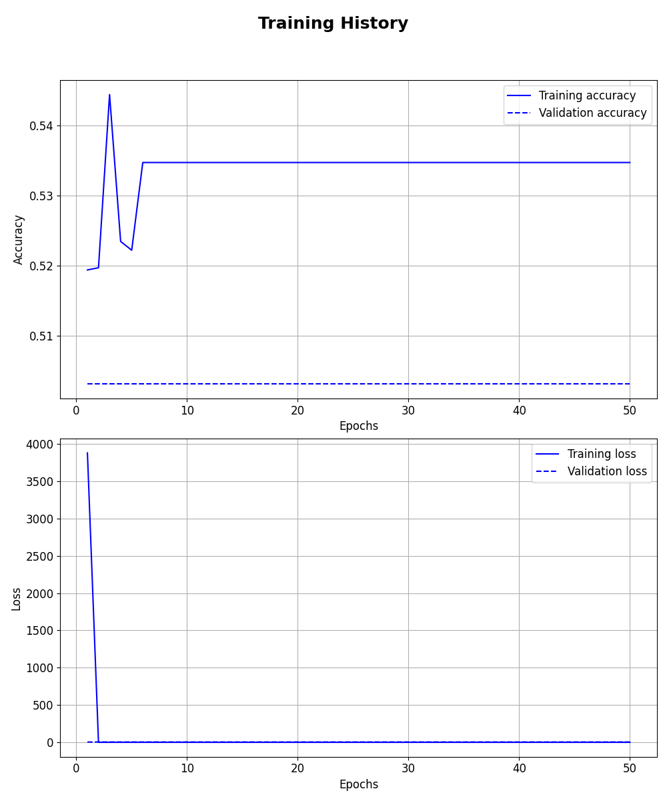

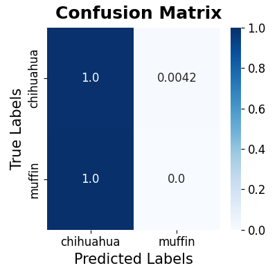

### Detailed Report of Test Set:

|              | precision    | recall       | f1-score     | support      |
| ------------ | ------------ | ------------ | ------------ | ------------ |
| chihuahua    | 0.5331       | 0.9958       | 0.6944       | 477          | 
| muffin       | 0.0000e+00   | 0.0000e+00   | 0.0000e+00   | 416          | 
| micro avg    | 0.5319       | 0.5319       | 0.5319       | 893          | 
| macro avg    | 0.2666       | 0.4979       | 0.3472       | 893          | 
| weighted avg | 0.2848       | 0.5319       | 0.3709       | 893          | 
| samples avg  | 0.5319       | 0.5319       | 0.5319       | 893          | 

