# Experiment Report: Chihuahua vs Muffin Test Experiment

## Metadata

*    *Description*: In this experiment a simple convolutional neural network is trained.

*    *Start Time*: 2024-10-17 15:49:11

*    *Last Resume Time*: 2024-10-17 16:30:15

*    *Total Duration*: 0:15:56.303

*    *Directory*: [Link](./.)

## Initial Visualizations

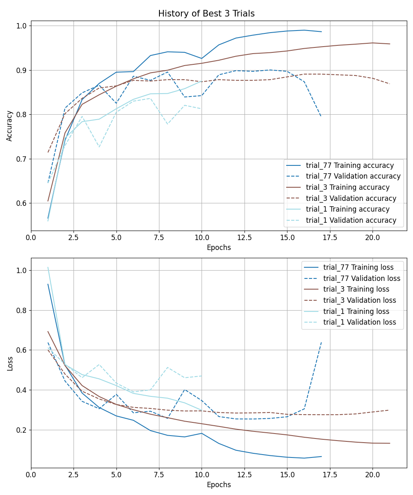

## Summary

### Hyperparameters

|               | units1        | kernel_size1  | units2        | kernel_size2  | units3        | learning_rate | Chapters      |
| ------------- | ------------- | ------------- | ------------- | ------------- | ------------- | ------------- | ------------- |
| trial_77      | 64            | 3             | 128           | 3             | 128           | 2.6657e-04    | [Chapter](#trial_77) | 
| trial_3       | 64            | 3             | 128           | 3             | 64            | 1.5603e-04    | [Chapter](#trial_3) | 
| trial_1       | 64            | 7             | 64            | 7             | 128           | 9.5289e-04    | [Chapter](#trial_1) | 
| trial_60      | 64            | 3             | 128           | 3             | 128           | 2.8161e-04    | [Chapter](#trial_60) | 
| trial_75      | 64            | 3             | 128           | 3             | 256           | 2.6328e-04    | [Chapter](#trial_75) | 
| trial_40      | 128           | 5             | 64            | 3             | 128           | 8.2279e-04    | [Chapter](#trial_40) | 
| trial_72      | 64            | 3             | 128           | 3             | 256           | 3.7945e-04    | [Chapter](#trial_72) | 
| trial_64      | 64            | 3             | 128           | 3             | 256           | 2.0793e-04    | [Chapter](#trial_64) | 
| trial_83      | 64            | 3             | 128           | 3             | 128           | 4.0988e-04    | [Chapter](#trial_83) | 
| trial_74      | 64            | 3             | 128           | 3             | 256           | 2.5950e-04    | [Chapter](#trial_74) | 
| trial_90      | 128           | 3             | 128           | 3             | 128           | 4.5147e-04    | [Chapter](#trial_90) | 
| trial_100     | 64            | 3             | 128           | 3             | 256           | 2.5164e-04    | [Chapter](#trial_100) | 
| trial_70      | 64            | 3             | 128           | 3             | 256           | 3.7684e-04    | [Chapter](#trial_70) | 
| trial_86      | 64            | 3             | 128           | 3             | 256           | 1.5058e-04    | [Chapter](#trial_86) | 
| trial_62      | 64            | 3             | 128           | 3             | 256           | 2.0257e-04    | [Chapter](#trial_62) | 
| trial_53      | 128           | 7             | 128           | 3             | 128           | 1.7644e-04    | [Chapter](#trial_53) | 
| trial_73      | 64            | 3             | 128           | 3             | 256           | 3.0231e-04    | [Chapter](#trial_73) | 
| trial_80      | 64            | 3             | 64            | 3             | 128           | 5.0680e-04    | [Chapter](#trial_80) | 
| trial_81      | 64            | 3             | 64            | 5             | 128           | 2.0131e-04    | [Chapter](#trial_81) | 
| trial_41      | 128           | 3             | 128           | 3             | 128           | 2.7936e-04    | [Chapter](#trial_41) | 
| trial_30      | 64            | 3             | 128           | 3             | 32            | 6.2710e-04    | [Chapter](#trial_30) | 
| trial_51      | 128           | 3             | 128           | 3             | 256           | 1.2388e-04    | [Chapter](#trial_51) | 
| trial_44      | 64            | 3             | 128           | 3             | 256           | 2.0781e-04    | [Chapter](#trial_44) | 
| trial_65      | 64            | 3             | 128           | 3             | 256           | 2.1561e-04    | [Chapter](#trial_65) | 
| trial_15      | 32            | 5             | 128           | 5             | 128           | 1.0813e-04    | [Chapter](#trial_15) | 
| trial_50      | 128           | 3             | 128           | 3             | 256           | 2.3660e-04    | [Chapter](#trial_50) | 
| trial_69      | 128           | 3             | 128           | 3             | 256           | 6.5338e-05    | [Chapter](#trial_69) | 
| trial_89      | 64            | 3             | 32            | 3             | 256           | 2.5391e-04    | [Chapter](#trial_89) | 
| trial_46      | 128           | 3             | 128           | 3             | 256           | 1.3921e-04    | [Chapter](#trial_46) | 
| trial_22      | 16            | 3             | 128           | 7             | 32            | 3.9033e-04    | [Chapter](#trial_22) | 
| trial_96      | 64            | 3             | 128           | 3             | 256           | 2.0240e-04    | [Chapter](#trial_96) | 
| trial_68      | 64            | 3             | 128           | 5             | 256           | 1.3483e-04    | [Chapter](#trial_68) | 
| trial_66      | 64            | 3             | 128           | 3             | 256           | 1.9269e-04    | [Chapter](#trial_66) | 
| trial_36      | 64            | 7             | 128           | 3             | 512           | 3.9872e-04    | [Chapter](#trial_36) | 
| trial_91      | 128           | 3             | 128           | 3             | 64            | 3.2331e-04    | [Chapter](#trial_91) | 
| trial_76      | 64            | 3             | 128           | 3             | 256           | 2.4868e-04    | [Chapter](#trial_76) | 
| trial_37      | 128           | 3             | 128           | 3             | 128           | 2.8399e-04    | [Chapter](#trial_37) | 
| trial_85      | 64            | 3             | 128           | 3             | 256           | 2.2078e-04    | [Chapter](#trial_85) | 
| trial_95      | 64            | 3             | 128           | 3             | 256           | 2.8039e-04    | [Chapter](#trial_95) | 
| trial_63      | 128           | 3             | 128           | 3             | 128           | 1.6126e-04    | [Chapter](#trial_63) | 
| trial_19      | 32            | 3             | 128           | 5             | 128           | 1.3096e-04    | [Chapter](#trial_19) | 
| trial_35      | 64            | 3             | 32            | 3             | 64            | 6.7780e-04    | [Chapter](#trial_35) | 
| trial_92      | 64            | 3             | 128           | 3             | 128           | 3.5276e-04    | [Chapter](#trial_92) | 
| trial_94      | 64            | 3             | 128           | 3             | 256           | 1.0224e-05    | [Chapter](#trial_94) | 
| trial_49      | 128           | 3             | 64            | 3             | 256           | 7.8448e-05    | [Chapter](#trial_49) | 
| trial_8       | 64            | 7             | 16            | 5             | 256           | 1.2047e-04    | [Chapter](#trial_8) | 
| trial_56      | 128           | 5             | 128           | 3             | 256           | 1.3965e-04    | [Chapter](#trial_56) | 
| trial_17      | 32            | 5             | 64            | 5             | 128           | 4.8506e-05    | [Chapter](#trial_17) | 
| trial_27      | 64            | 5             | 64            | 7             | 64            | 5.4223e-05    | [Chapter](#trial_27) | 
| trial_47      | 128           | 3             | 128           | 3             | 256           | 1.4609e-04    | [Chapter](#trial_47) | 
| trial_10      | 128           | 7             | 128           | 3             | 256           | 1.9170e-05    | [Chapter](#trial_10) | 
| trial_42      | 128           | 3             | 128           | 3             | 128           | 2.8550e-04    | [Chapter](#trial_42) | 
| trial_78      | 64            | 3             | 128           | 3             | 128           | 4.6636e-04    | [Chapter](#trial_78) | 
| trial_24      | 16            | 3             | 128           | 7             | 128           | 2.4948e-04    | [Chapter](#trial_24) | 
| trial_2       | 64            | 7             | 64            | 5             | 256           | 4.0433e-05    | [Chapter](#trial_2) | 
| trial_79      | 64            | 3             | 128           | 3             | 128           | 4.5788e-04    | [Chapter](#trial_79) | 
| trial_4       | 128           | 7             | 128           | 5             | 512           | 6.5658e-05    | [Chapter](#trial_4) | 
| trial_82      | 64            | 3             | 128           | 3             | 128           | 3.3911e-04    | [Chapter](#trial_82) | 
| trial_13      | 16            | 3             | 128           | 7             | 32            | 3.2162e-04    | [Chapter](#trial_13) | 
| trial_20      | 64            | 5             | 16            | 5             | 128           | 1.5968e-04    | [Chapter](#trial_20) | 
| trial_29      | 32            | 5             | 128           | 3             | 32            | 6.4571e-04    | [Chapter](#trial_29) | 
| trial_61      | 128           | 5             | 128           | 3             | 256           | 1.0472e-04    | [Chapter](#trial_61) | 
| trial_39      | 128           | 7             | 128           | 3             | 256           | 1.8423e-04    | [Chapter](#trial_39) | 
| trial_43      | 128           | 3             | 128           | 3             | 512           | 4.5933e-04    | [Chapter](#trial_43) | 
| trial_32      | 64            | 3             | 128           | 3             | 32            | 6.9569e-04    | [Chapter](#trial_32) | 
| trial_14      | 64            | 3             | 128           | 5             | 32            | 3.1912e-04    | [Chapter](#trial_14) | 
| trial_48      | 128           | 3             | 128           | 3             | 256           | 1.8728e-04    | [Chapter](#trial_48) | 
| trial_54      | 64            | 3             | 128           | 3             | 256           | 2.2245e-04    | [Chapter](#trial_54) | 
| trial_45      | 128           | 3             | 128           | 3             | 256           | 2.0883e-04    | [Chapter](#trial_45) | 
| trial_52      | 128           | 3             | 128           | 3             | 256           | 3.0763e-04    | [Chapter](#trial_52) | 
| trial_97      | 64            | 3             | 128           | 3             | 128           | 2.2737e-04    | [Chapter](#trial_97) | 
| trial_58      | 64            | 5             | 128           | 3             | 128           | 2.7552e-05    | [Chapter](#trial_58) | 
| trial_6       | 64            | 5             | 128           | 3             | 256           | 2.4948e-05    | [Chapter](#trial_6) | 
| trial_18      | 128           | 5             | 64            | 3             | 256           | 1.0538e-05    | [Chapter](#trial_18) | 
| trial_98      | 128           | 3             | 128           | 3             | 128           | 1.6750e-04    | [Chapter](#trial_98) | 
| trial_55      | 128           | 3             | 128           | 3             | 128           | 1.1565e-04    | [Chapter](#trial_55) | 
| trial_99      | 128           | 3             | 128           | 3             | 128           | 4.1485e-04    | [Chapter](#trial_99) | 
| trial_88      | 64            | 3             | 128           | 3             | 128           | 1.8160e-04    | [Chapter](#trial_88) | 
| trial_16      | 64            | 5             | 128           | 3             | 128           | 9.0342e-05    | [Chapter](#trial_16) | 
| trial_31      | 128           | 5             | 128           | 3             | 128           | 3.5417e-04    | [Chapter](#trial_31) | 
| trial_38      | 128           | 3             | 64            | 3             | 128           | 2.6515e-04    | [Chapter](#trial_38) | 
| trial_59      | 128           | 3             | 128           | 5             | 512           | 8.6253e-05    | [Chapter](#trial_59) | 
| trial_21      | 64            | 5             | 128           | 3             | 256           | 7.8992e-05    | [Chapter](#trial_21) | 
| trial_28      | 64            | 3             | 128           | 5             | 128           | 9.9432e-05    | [Chapter](#trial_28) | 
| trial_23      | 32            | 3             | 128           | 7             | 64            | 4.8806e-04    | [Chapter](#trial_23) | 
| trial_93      | 64            | 3             | 128           | 3             | 256           | 3.4216e-04    | [Chapter](#trial_93) | 
| trial_34      | 64            | 3             | 128           | 3             | 32            | 5.7254e-04    | [Chapter](#trial_34) | 
| trial_87      | 128           | 3             | 128           | 3             | 64            | 5.6669e-04    | [Chapter](#trial_87) | 
| trial_5       | 32            | 7             | 64            | 3             | 512           | 1.9443e-04    | [Chapter](#trial_5) | 
| trial_11      | 64            | 3             | 128           | 3             | 32            | 2.2107e-04    | [Chapter](#trial_11) | 
| trial_12      | 16            | 3             | 128           | 7             | 256           | 9.9840e-04    | [Chapter](#trial_12) | 
| trial_26      | 16            | 3             | 128           | 5             | 128           | 1.5799e-04    | [Chapter](#trial_26) | 
| trial_67      | 64            | 3             | 64            | 3             | 256           | 2.3743e-04    | [Chapter](#trial_67) | 
| trial_25      | 32            | 3             | 128           | 5             | 64            | 5.2164e-04    | [Chapter](#trial_25) | 
| trial_33      | 64            | 3             | 128           | 3             | 64            | 7.9710e-04    | [Chapter](#trial_33) | 
| trial_9       | 128           | 5             | 64            | 7             | 256           | 4.2513e-04    | [Chapter](#trial_9) | 
| trial_7       | 16            | 3             | 128           | 7             | 512           | 7.9733e-04    | [Chapter](#trial_7) | 
| trial_84      | 64            | 3             | 128           | 3             | 256           | 2.9499e-04    | [Chapter](#trial_84) | 
| trial_57      | 128           | 3             | 128           | 3             | 64            | 3.3720e-04    | [Chapter](#trial_57) | 
| trial_71      | 128           | 3             | 128           | 3             | 128           | 1.6729e-04    | [Chapter](#trial_71) | 

### Test Results

|           | accuracy  | precision | recall    | f1        | Chapters  |
| --------- | --------- | --------- | --------- | --------- | --------- |
| trial_77  | 0.8903    | 0.8903    | 0.8903    | 0.8903    | [Chapter](#trial_77) | 
| trial_3   | 0.8779    | 0.8779    | 0.8779    | 0.8779    | [Chapter](#trial_3) | 
| trial_1   | 0.8186    | 0.8186    | 0.8186    | 0.8186    | [Chapter](#trial_1) | 
| trial_60  | 0.7805    | 0.7805    | 0.7805    | 0.7805    | [Chapter](#trial_60) | 
| trial_75  | 0.7738    | 0.7738    | 0.7738    | 0.7738    | [Chapter](#trial_75) | 
| trial_40  | 0.7671    | 0.7671    | 0.7671    | 0.7671    | [Chapter](#trial_40) | 
| trial_72  | 0.7637    | 0.7637    | 0.7637    | 0.7637    | [Chapter](#trial_72) | 
| trial_64  | 0.7581    | 0.7581    | 0.7581    | 0.7581    | [Chapter](#trial_64) | 
| trial_83  | 0.7581    | 0.7581    | 0.7581    | 0.7581    | [Chapter](#trial_83) | 
| trial_74  | 0.7536    | 0.7536    | 0.7536    | 0.7536    | [Chapter](#trial_74) | 
| trial_90  | 0.7536    | 0.7536    | 0.7536    | 0.7536    | [Chapter](#trial_90) | 
| trial_100 | 0.7536    | 0.7536    | 0.7536    | 0.7536    | [Chapter](#trial_100) | 
| trial_70  | 0.7525    | 0.7525    | 0.7525    | 0.7525    | [Chapter](#trial_70) | 
| trial_86  | 0.7525    | 0.7525    | 0.7525    | 0.7525    | [Chapter](#trial_86) | 
| trial_62  | 0.7514    | 0.7514    | 0.7514    | 0.7514    | [Chapter](#trial_62) | 
| trial_53  | 0.7514    | 0.7514    | 0.7514    | 0.7514    | [Chapter](#trial_53) | 
| trial_73  | 0.7514    | 0.7514    | 0.7514    | 0.7514    | [Chapter](#trial_73) | 
| trial_80  | 0.7503    | 0.7503    | 0.7503    | 0.7503    | [Chapter](#trial_80) | 
| trial_81  | 0.7503    | 0.7503    | 0.7503    | 0.7503    | [Chapter](#trial_81) | 
| trial_41  | 0.7492    | 0.7492    | 0.7492    | 0.7492    | [Chapter](#trial_41) | 
| trial_30  | 0.7480    | 0.7480    | 0.7480    | 0.7480    | [Chapter](#trial_30) | 
| trial_51  | 0.7458    | 0.7458    | 0.7458    | 0.7458    | [Chapter](#trial_51) | 
| trial_44  | 0.7458    | 0.7458    | 0.7458    | 0.7458    | [Chapter](#trial_44) | 
| trial_65  | 0.7447    | 0.7447    | 0.7447    | 0.7447    | [Chapter](#trial_65) | 
| trial_15  | 0.7447    | 0.7447    | 0.7447    | 0.7447    | [Chapter](#trial_15) | 
| trial_50  | 0.7436    | 0.7436    | 0.7436    | 0.7436    | [Chapter](#trial_50) | 
| trial_69  | 0.7413    | 0.7413    | 0.7413    | 0.7413    | [Chapter](#trial_69) | 
| trial_89  | 0.7413    | 0.7413    | 0.7413    | 0.7413    | [Chapter](#trial_89) | 
| trial_46  | 0.7402    | 0.7402    | 0.7402    | 0.7402    | [Chapter](#trial_46) | 
| trial_22  | 0.7391    | 0.7391    | 0.7391    | 0.7391    | [Chapter](#trial_22) | 
| trial_96  | 0.7380    | 0.7380    | 0.7380    | 0.7380    | [Chapter](#trial_96) | 
| trial_68  | 0.7346    | 0.7346    | 0.7346    | 0.7346    | [Chapter](#trial_68) | 
| trial_66  | 0.7335    | 0.7335    | 0.7335    | 0.7335    | [Chapter](#trial_66) | 
| trial_36  | 0.7312    | 0.7312    | 0.7312    | 0.7312    | [Chapter](#trial_36) | 
| trial_91  | 0.7301    | 0.7301    | 0.7301    | 0.7301    | [Chapter](#trial_91) | 
| trial_76  | 0.7279    | 0.7279    | 0.7279    | 0.7279    | [Chapter](#trial_76) | 
| trial_37  | 0.7268    | 0.7268    | 0.7268    | 0.7268    | [Chapter](#trial_37) | 
| trial_85  | 0.7268    | 0.7268    | 0.7268    | 0.7268    | [Chapter](#trial_85) | 
| trial_95  | 0.7268    | 0.7268    | 0.7268    | 0.7268    | [Chapter](#trial_95) | 
| trial_63  | 0.7256    | 0.7256    | 0.7256    | 0.7256    | [Chapter](#trial_63) | 
| trial_19  | 0.7256    | 0.7256    | 0.7256    | 0.7256    | [Chapter](#trial_19) | 
| trial_35  | 0.7245    | 0.7245    | 0.7245    | 0.7245    | [Chapter](#trial_35) | 
| trial_92  | 0.7223    | 0.7223    | 0.7223    | 0.7223    | [Chapter](#trial_92) | 
| trial_94  | 0.7223    | 0.7223    | 0.7223    | 0.7223    | [Chapter](#trial_94) | 
| trial_49  | 0.7212    | 0.7212    | 0.7212    | 0.7212    | [Chapter](#trial_49) | 
| trial_8   | 0.7212    | 0.7212    | 0.7212    | 0.7212    | [Chapter](#trial_8) | 
| trial_56  | 0.7200    | 0.7200    | 0.7200    | 0.7200    | [Chapter](#trial_56) | 
| trial_17  | 0.7200    | 0.7200    | 0.7200    | 0.7200    | [Chapter](#trial_17) | 
| trial_27  | 0.7200    | 0.7200    | 0.7200    | 0.7200    | [Chapter](#trial_27) | 
| trial_47  | 0.7200    | 0.7200    | 0.7200    | 0.7200    | [Chapter](#trial_47) | 
| trial_10  | 0.7189    | 0.7189    | 0.7189    | 0.7189    | [Chapter](#trial_10) | 
| trial_42  | 0.7167    | 0.7167    | 0.7167    | 0.7167    | [Chapter](#trial_42) | 
| trial_78  | 0.7144    | 0.7144    | 0.7144    | 0.7144    | [Chapter](#trial_78) | 
| trial_24  | 0.7133    | 0.7133    | 0.7133    | 0.7133    | [Chapter](#trial_24) | 
| trial_2   | 0.7122    | 0.7122    | 0.7122    | 0.7122    | [Chapter](#trial_2) | 
| trial_79  | 0.7122    | 0.7122    | 0.7122    | 0.7122    | [Chapter](#trial_79) | 
| trial_4   | 0.7055    | 0.7055    | 0.7055    | 0.7055    | [Chapter](#trial_4) | 
| trial_82  | 0.7055    | 0.7055    | 0.7055    | 0.7055    | [Chapter](#trial_82) | 
| trial_13  | 0.7021    | 0.7021    | 0.7021    | 0.7021    | [Chapter](#trial_13) | 
| trial_20  | 0.6999    | 0.6999    | 0.6999    | 0.6999    | [Chapter](#trial_20) | 
| trial_29  | 0.6999    | 0.6999    | 0.6999    | 0.6999    | [Chapter](#trial_29) | 
| trial_61  | 0.6988    | 0.6988    | 0.6988    | 0.6988    | [Chapter](#trial_61) | 
| trial_39  | 0.6988    | 0.6988    | 0.6988    | 0.6988    | [Chapter](#trial_39) | 
| trial_43  | 0.6988    | 0.6988    | 0.6988    | 0.6988    | [Chapter](#trial_43) | 
| trial_32  | 0.6965    | 0.6965    | 0.6965    | 0.6965    | [Chapter](#trial_32) | 
| trial_14  | 0.6965    | 0.6965    | 0.6965    | 0.6965    | [Chapter](#trial_14) | 
| trial_48  | 0.6965    | 0.6965    | 0.6965    | 0.6965    | [Chapter](#trial_48) | 
| trial_54  | 0.6954    | 0.6954    | 0.6954    | 0.6954    | [Chapter](#trial_54) | 
| trial_45  | 0.6943    | 0.6943    | 0.6943    | 0.6943    | [Chapter](#trial_45) | 
| trial_52  | 0.6898    | 0.6898    | 0.6898    | 0.6898    | [Chapter](#trial_52) | 
| trial_97  | 0.6887    | 0.6887    | 0.6887    | 0.6887    | [Chapter](#trial_97) | 
| trial_58  | 0.6876    | 0.6876    | 0.6876    | 0.6876    | [Chapter](#trial_58) | 
| trial_6   | 0.6809    | 0.6809    | 0.6809    | 0.6809    | [Chapter](#trial_6) | 
| trial_18  | 0.6786    | 0.6786    | 0.6786    | 0.6786    | [Chapter](#trial_18) | 
| trial_98  | 0.6786    | 0.6786    | 0.6786    | 0.6786    | [Chapter](#trial_98) | 
| trial_55  | 0.6753    | 0.6753    | 0.6753    | 0.6753    | [Chapter](#trial_55) | 
| trial_99  | 0.6753    | 0.6753    | 0.6753    | 0.6753    | [Chapter](#trial_99) | 
| trial_88  | 0.6607    | 0.6607    | 0.6607    | 0.6607    | [Chapter](#trial_88) | 
| trial_16  | 0.6562    | 0.6562    | 0.6562    | 0.6562    | [Chapter](#trial_16) | 
| trial_31  | 0.6551    | 0.6551    | 0.6551    | 0.6551    | [Chapter](#trial_31) | 
| trial_38  | 0.6495    | 0.6495    | 0.6495    | 0.6495    | [Chapter](#trial_38) | 
| trial_59  | 0.6461    | 0.6461    | 0.6461    | 0.6461    | [Chapter](#trial_59) | 
| trial_21  | 0.6305    | 0.6305    | 0.6305    | 0.6305    | [Chapter](#trial_21) | 
| trial_28  | 0.6125    | 0.6125    | 0.6125    | 0.6125    | [Chapter](#trial_28) | 
| trial_23  | 0.6025    | 0.6025    | 0.6025    | 0.6025    | [Chapter](#trial_23) | 
| trial_93  | 0.5924    | 0.5924    | 0.5924    | 0.5924    | [Chapter](#trial_93) | 
| trial_34  | 0.5364    | 0.5364    | 0.5364    | 0.5364    | [Chapter](#trial_34) | 
| trial_87  | 0.5364    | 0.5364    | 0.5364    | 0.5364    | [Chapter](#trial_87) | 
| trial_5   | 0.5342    | 0.5342    | 0.5342    | 0.5342    | [Chapter](#trial_5) | 
| trial_11  | 0.5342    | 0.5342    | 0.5342    | 0.5342    | [Chapter](#trial_11) | 
| trial_12  | 0.5342    | 0.5342    | 0.5342    | 0.5342    | [Chapter](#trial_12) | 
| trial_26  | 0.5342    | 0.5342    | 0.5342    | 0.5342    | [Chapter](#trial_26) | 
| trial_67  | 0.5342    | 0.5342    | 0.5342    | 0.5342    | [Chapter](#trial_67) | 
| trial_25  | 0.5342    | 0.5342    | 0.5342    | 0.5342    | [Chapter](#trial_25) | 
| trial_33  | 0.5342    | 0.5342    | 0.5342    | 0.5342    | [Chapter](#trial_33) | 
| trial_9   | 0.5342    | 0.5342    | 0.5342    | 0.5342    | [Chapter](#trial_9) | 
| trial_7   | 0.5342    | 0.5342    | 0.5342    | 0.5342    | [Chapter](#trial_7) | 
| trial_84  | 0.5342    | 0.5342    | 0.5342    | 0.5342    | [Chapter](#trial_84) | 
| trial_57  | 0.5330    | 0.5330    | 0.5330    | 0.5330    | [Chapter](#trial_57) | 
| trial_71  | 0.5330    | 0.5330    | 0.5330    | 0.5330    | [Chapter](#trial_71) | 

## trial_77

*    *Start Time*: 2024-10-17 16:30:19

*    *Duration*: 19.321

*    *Directory*: [Link](./trial_77)

### Hyperparameters:

| Hyperparameter        | Value                 |
| --------------------- | --------------------- |
| units1                | 64                    |
| kernel_size1          | 3                     |
| units2                | 128                   |
| kernel_size2          | 3                     |
| units3                | 128                   |
| learning_rate         | 0.0002665747531231815 |

### Evaluation Metrics:

|           | train     | val       | test      |
| --------- | --------- | --------- | --------- |
| accuracy  | 0.9816    | 0.8969    | 0.8903    | 
| precision | 0.9816    | 0.8969    | 0.8903    | 
| recall    | 0.9816    | 0.8969    | 0.8903    | 
| f1        | 0.9816    | 0.8969    | 0.8903    | 

### Figures:

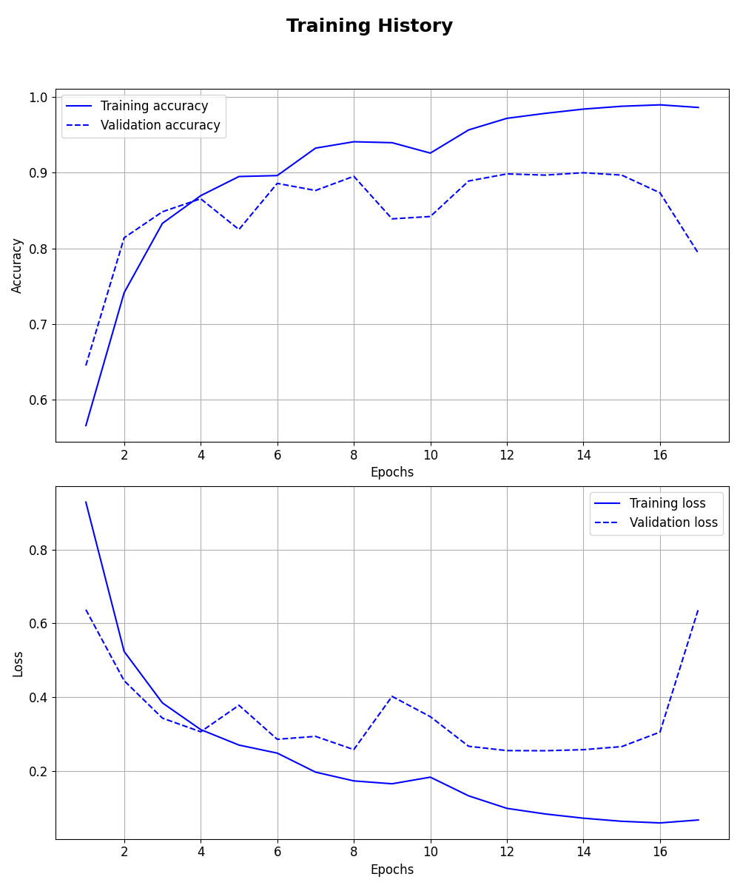

### Detailed Report of Test Set:

|              | precision    | recall       | f1-score     | support      |
| ------------ | ------------ | ------------ | ------------ | ------------ |
| chihuahua    | 0.8940       | 0.9015       | 0.8977       | 477          | 
| muffin       | 0.8859       | 0.8774       | 0.8816       | 416          | 
| micro avg    | 0.8903       | 0.8903       | 0.8903       | 893          | 
| macro avg    | 0.8899       | 0.8894       | 0.8897       | 893          | 
| weighted avg | 0.8902       | 0.8903       | 0.8902       | 893          | 
| samples avg  | 0.8903       | 0.8903       | 0.8903       | 893          | 

## trial_3

*    *Start Time*: 2024-10-17 15:49:37

*    *Duration*: 20.060

*    *Directory*: [Link](./trial_3)

### Hyperparameters:

| Hyperparameter        | Value                 |
| --------------------- | --------------------- |
| units1                | 64                    |
| kernel_size1          | 3                     |
| units2                | 128                   |
| kernel_size2          | 3                     |
| units3                | 64                    |
| learning_rate         | 0.0001560299181170092 |

### Evaluation Metrics:

|           | train     | val       | test      |
| --------- | --------- | --------- | --------- |
| accuracy  | 0.9569    | 0.8906    | 0.8779    | 
| precision | 0.9569    | 0.8906    | 0.8779    | 
| recall    | 0.9569    | 0.8906    | 0.8779    | 
| f1        | 0.9569    | 0.8906    | 0.8779    | 

### Figures:

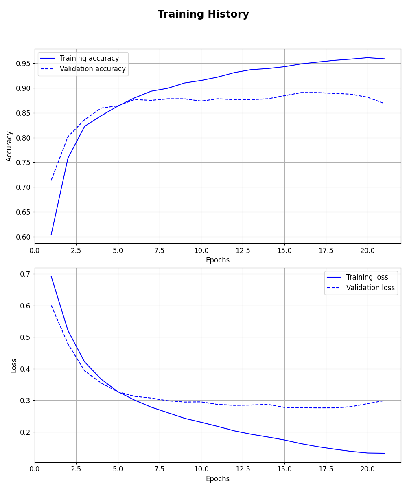

### Detailed Report of Test Set:

|              | precision    | recall       | f1-score     | support      |
| ------------ | ------------ | ------------ | ------------ | ------------ |
| chihuahua    | 0.8651       | 0.9140       | 0.8889       | 477          | 
| muffin       | 0.8946       | 0.8365       | 0.8646       | 416          | 
| micro avg    | 0.8779       | 0.8779       | 0.8779       | 893          | 
| macro avg    | 0.8798       | 0.8753       | 0.8767       | 893          | 
| weighted avg | 0.8788       | 0.8779       | 0.8776       | 893          | 
| samples avg  | 0.8779       | 0.8779       | 0.8779       | 893          | 

## trial_1

*    *Start Time*: 2024-10-17 15:49:11

*    *Duration*: 17.048

*    *Directory*: [Link](./trial_1)

### Hyperparameters:

| Hyperparameter        | Value                 |
| --------------------- | --------------------- |
| units1                | 64                    |
| kernel_size1          | 7                     |
| units2                | 64                    |
| kernel_size2          | 7                     |
| units3                | 128                   |
| learning_rate         | 0.0009528915394221494 |

### Evaluation Metrics:

|           | train     | val       | test      |
| --------- | --------- | --------- | --------- |
| accuracy  | 0.8616    | 0.8297    | 0.8186    | 
| precision | 0.8616    | 0.8297    | 0.8186    | 
| recall    | 0.8616    | 0.8297    | 0.8186    | 
| f1        | 0.8616    | 0.8297    | 0.8186    | 

### Figures:

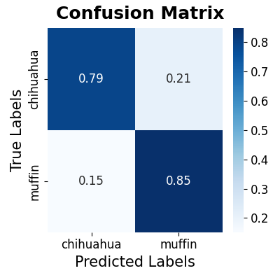

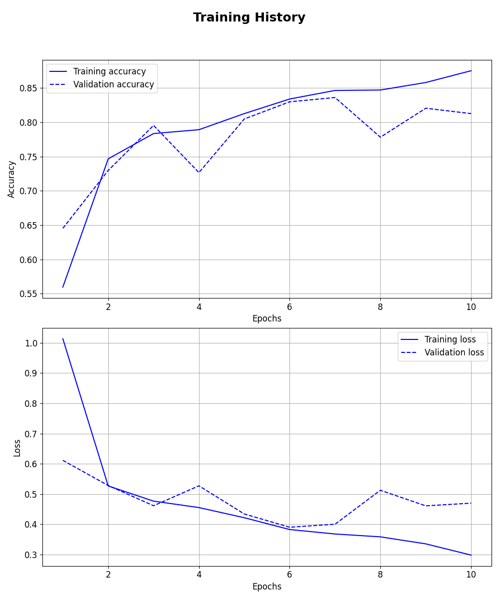

### Detailed Report of Test Set:

|              | precision    | recall       | f1-score     | support      |
| ------------ | ------------ | ------------ | ------------ | ------------ |
| chihuahua    | 0.8571       | 0.7925       | 0.8235       | 477          | 
| muffin       | 0.7810       | 0.8486       | 0.8134       | 416          | 
| micro avg    | 0.8186       | 0.8186       | 0.8186       | 893          | 
| macro avg    | 0.8191       | 0.8205       | 0.8184       | 893          | 
| weighted avg | 0.8217       | 0.8186       | 0.8188       | 893          | 
| samples avg  | 0.8186       | 0.8186       | 0.8186       | 893          | 

## trial_60

*    *Start Time*: 2024-10-17 15:57:39

*    *Duration*: 06.192

*    *Directory*: [Link](./trial_60)

### Hyperparameters:

| Hyperparameter         | Value                  |
| ---------------------- | ---------------------- |
| units1                 | 64                     |
| kernel_size1           | 3                      |
| units2                 | 128                    |
| kernel_size2           | 3                      |
| units3                 | 128                    |
| learning_rate          | 0.00028161453539539964 |

### Evaluation Metrics:

|           | train     | val       | test      |
| --------- | --------- | --------- | --------- |
| accuracy  | 0.7962    | 0.7609    | 0.7805    | 
| precision | 0.7962    | 0.7609    | 0.7805    | 
| recall    | 0.7962    | 0.7609    | 0.7805    | 
| f1        | 0.7962    | 0.7609    | 0.7805    | 

### Figures:

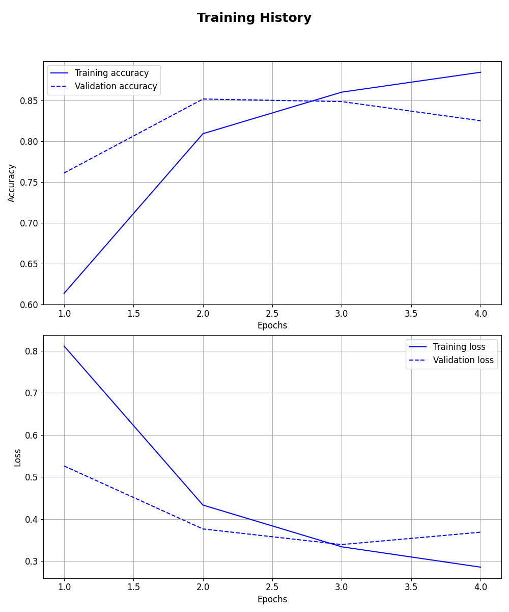

### Detailed Report of Test Set:

|              | precision    | recall       | f1-score     | support      |
| ------------ | ------------ | ------------ | ------------ | ------------ |
| chihuahua    | 0.8322       | 0.7379       | 0.7822       | 477          | 
| muffin       | 0.7340       | 0.8293       | 0.7788       | 416          | 
| micro avg    | 0.7805       | 0.7805       | 0.7805       | 893          | 
| macro avg    | 0.7831       | 0.7836       | 0.7805       | 893          | 
| weighted avg | 0.7864       | 0.7805       | 0.7806       | 893          | 
| samples avg  | 0.7805       | 0.7805       | 0.7805       | 893          | 

## trial_75

*    *Start Time*: 2024-10-17 15:59:24

*    *Duration*: 06.251

*    *Directory*: [Link](./trial_75)

### Hyperparameters:

| Hyperparameter        | Value                 |
| --------------------- | --------------------- |
| units1                | 64                    |
| kernel_size1          | 3                     |
| units2                | 128                   |
| kernel_size2          | 3                     |
| units3                | 256                   |
| learning_rate         | 0.0002632787411157407 |

### Evaluation Metrics:

|           | train     | val       | test      |
| --------- | --------- | --------- | --------- |
| accuracy  | 0.7791    | 0.7859    | 0.7738    | 
| precision | 0.7791    | 0.7859    | 0.7738    | 
| recall    | 0.7791    | 0.7859    | 0.7738    | 
| f1        | 0.7791    | 0.7859    | 0.7738    | 

### Figures:

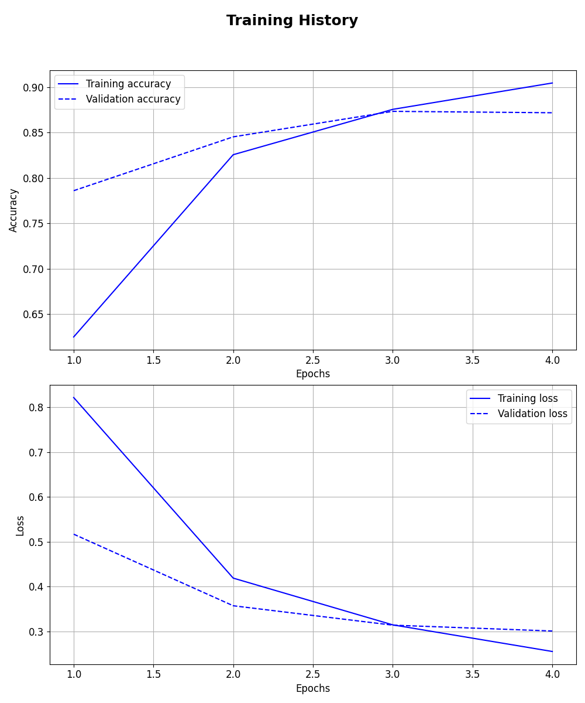

### Detailed Report of Test Set:

|              | precision    | recall       | f1-score     | support      |
| ------------ | ------------ | ------------ | ------------ | ------------ |
| chihuahua    | 0.8571       | 0.6918       | 0.7657       | 477          | 
| muffin       | 0.7106       | 0.8678       | 0.7814       | 416          | 
| micro avg    | 0.7738       | 0.7738       | 0.7738       | 893          | 
| macro avg    | 0.7839       | 0.7798       | 0.7735       | 893          | 
| weighted avg | 0.7889       | 0.7738       | 0.7730       | 893          | 
| samples avg  | 0.7738       | 0.7738       | 0.7738       | 893          | 

## trial_40

*    *Start Time*: 2024-10-17 15:54:58

*    *Duration*: 06.954

*    *Directory*: [Link](./trial_40)

### Hyperparameters:

| Hyperparameter        | Value                 |
| --------------------- | --------------------- |
| units1                | 128                   |
| kernel_size1          | 5                     |
| units2                | 64                    |
| kernel_size2          | 3                     |
| units3                | 128                   |
| learning_rate         | 0.0008227917472378652 |

### Evaluation Metrics:

|           | train     | val       | test      |
| --------- | --------- | --------- | --------- |
| accuracy  | 0.7834    | 0.7734    | 0.7671    | 
| precision | 0.7834    | 0.7734    | 0.7671    | 
| recall    | 0.7834    | 0.7734    | 0.7671    | 
| f1        | 0.7834    | 0.7734    | 0.7671    | 

### Figures:

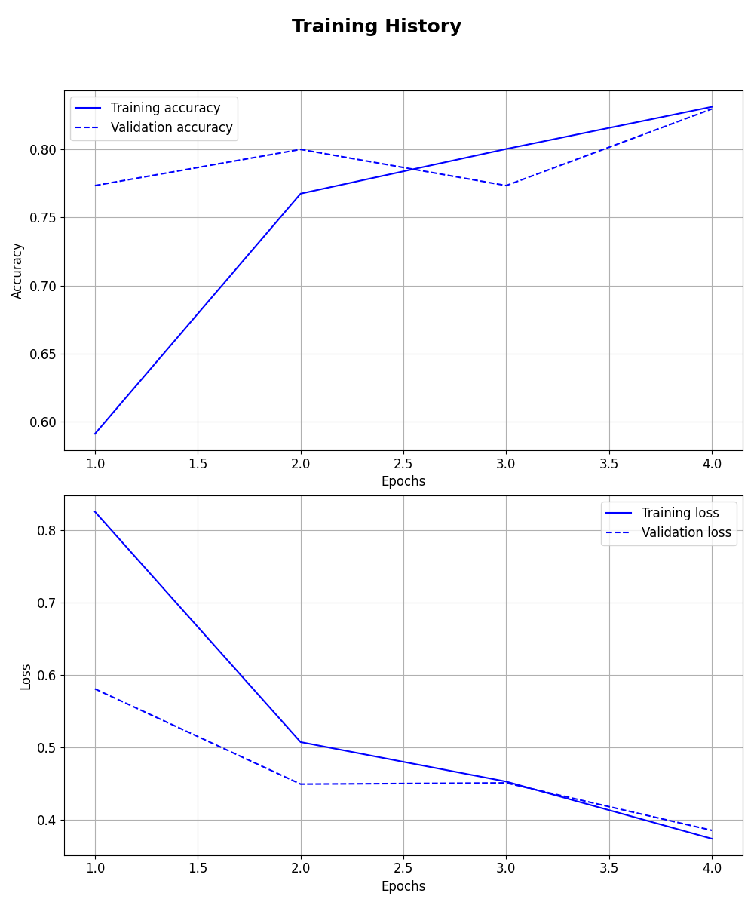

### Detailed Report of Test Set:

|              | precision    | recall       | f1-score     | support      |
| ------------ | ------------ | ------------ | ------------ | ------------ |
| chihuahua    | 0.7892       | 0.7694       | 0.7792       | 477          | 
| muffin       | 0.7430       | 0.7644       | 0.7536       | 416          | 
| micro avg    | 0.7671       | 0.7671       | 0.7671       | 893          | 
| macro avg    | 0.7661       | 0.7669       | 0.7664       | 893          | 
| weighted avg | 0.7677       | 0.7671       | 0.7672       | 893          | 
| samples avg  | 0.7671       | 0.7671       | 0.7671       | 893          | 

## trial_72

*    *Start Time*: 2024-10-17 15:59:04

*    *Duration*: 06.146

*    *Directory*: [Link](./trial_72)

### Hyperparameters:

| Hyperparameter        | Value                 |
| --------------------- | --------------------- |
| units1                | 64                    |
| kernel_size1          | 3                     |
| units2                | 128                   |
| kernel_size2          | 3                     |
| units3                | 256                   |
| learning_rate         | 0.0003794522818875842 |

### Evaluation Metrics:

|           | train     | val       | test      |
| --------- | --------- | --------- | --------- |
| accuracy  | 0.7663    | 0.7656    | 0.7637    | 
| precision | 0.7663    | 0.7656    | 0.7637    | 
| recall    | 0.7663    | 0.7656    | 0.7637    | 
| f1        | 0.7662    | 0.7656    | 0.7637    | 

### Figures:

### Detailed Report of Test Set:

|              | precision    | recall       | f1-score     | support      |
| ------------ | ------------ | ------------ | ------------ | ------------ |
| chihuahua    | 0.8393       | 0.6897       | 0.7572       | 477          | 
| muffin       | 0.7046       | 0.8486       | 0.7699       | 416          | 
| micro avg    | 0.7637       | 0.7637       | 0.7637       | 893          | 
| macro avg    | 0.7719       | 0.7691       | 0.7635       | 893          | 
| weighted avg | 0.7765       | 0.7637       | 0.7631       | 893          | 
| samples avg  | 0.7637       | 0.7637       | 0.7637       | 893          | 

## trial_64

*    *Start Time*: 2024-10-17 15:58:07

*    *Duration*: 06.082

*    *Directory*: [Link](./trial_64)

### Hyperparameters:

| Hyperparameter        | Value                 |
| --------------------- | --------------------- |
| units1                | 64                    |
| kernel_size1          | 3                     |
| units2                | 128                   |
| kernel_size2          | 3                     |
| units3                | 256                   |
| learning_rate         | 0.0002079310532191675 |

### Evaluation Metrics:

|           | train     | val       | test      |
| --------- | --------- | --------- | --------- |
| accuracy  | 0.7653    | 0.7594    | 0.7581    | 
| precision | 0.7653    | 0.7594    | 0.7581    | 
| recall    | 0.7653    | 0.7594    | 0.7581    | 
| f1        | 0.7653    | 0.7594    | 0.7581    | 

### Figures:

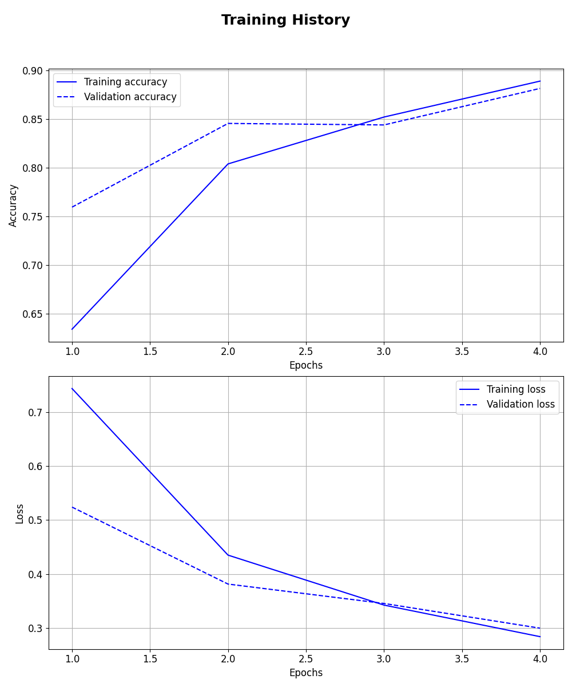

### Detailed Report of Test Set:

|              | precision    | recall       | f1-score     | support      |
| ------------ | ------------ | ------------ | ------------ | ------------ |
| chihuahua    | 0.8304       | 0.6876       | 0.7523       | 477          | 
| muffin       | 0.7008       | 0.8389       | 0.7637       | 416          | 
| micro avg    | 0.7581       | 0.7581       | 0.7581       | 893          | 
| macro avg    | 0.7656       | 0.7633       | 0.7580       | 893          | 
| weighted avg | 0.7700       | 0.7581       | 0.7576       | 893          | 
| samples avg  | 0.7581       | 0.7581       | 0.7581       | 893          | 

## trial_83

*    *Start Time*: 2024-10-17 16:31:13

*    *Duration*: 06.817

*    *Directory*: [Link](./trial_83)

### Hyperparameters:

| Hyperparameter        | Value                 |
| --------------------- | --------------------- |
| units1                | 64                    |
| kernel_size1          | 3                     |
| units2                | 128                   |
| kernel_size2          | 3                     |
| units3                | 128                   |
| learning_rate         | 0.0004098777226829769 |

### Evaluation Metrics:

|           | train     | val       | test      |
| --------- | --------- | --------- | --------- |
| accuracy  | 0.7728    | 0.7531    | 0.7581    | 
| precision | 0.7728    | 0.7531    | 0.7581    | 
| recall    | 0.7728    | 0.7531    | 0.7581    | 
| f1        | 0.7728    | 0.7531    | 0.7581    | 

### Figures:

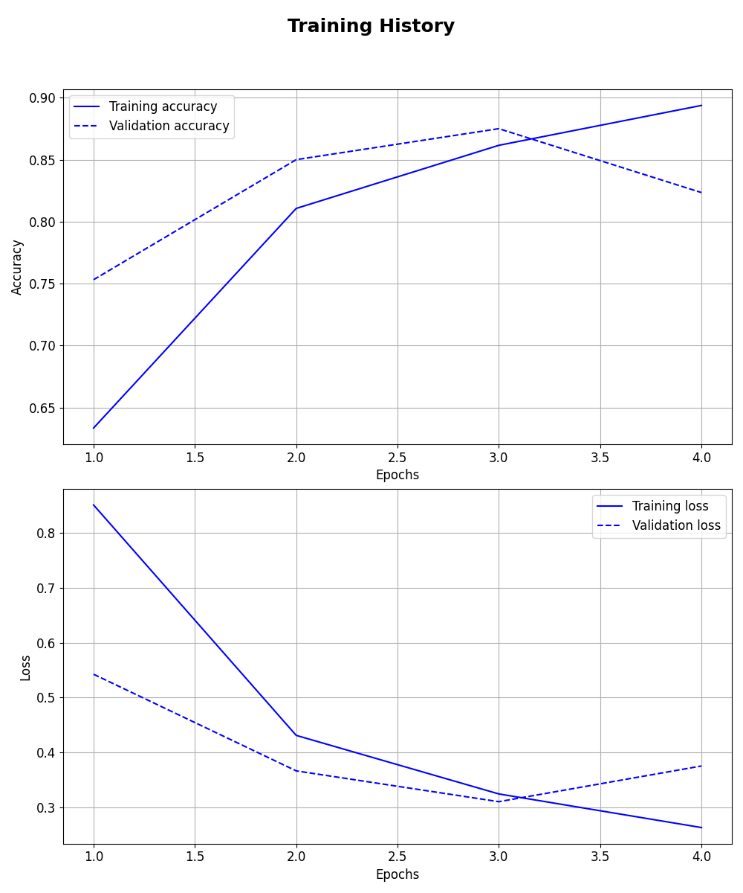

### Detailed Report of Test Set:

|              | precision    | recall       | f1-score     | support      |
| ------------ | ------------ | ------------ | ------------ | ------------ |
| chihuahua    | 0.8175       | 0.7044       | 0.7568       | 477          | 
| muffin       | 0.7075       | 0.8197       | 0.7595       | 416          | 
| micro avg    | 0.7581       | 0.7581       | 0.7581       | 893          | 
| macro avg    | 0.7625       | 0.7621       | 0.7581       | 893          | 
| weighted avg | 0.7663       | 0.7581       | 0.7580       | 893          | 
| samples avg  | 0.7581       | 0.7581       | 0.7581       | 893          | 

## trial_74

*    *Start Time*: 2024-10-17 15:59:16

*    *Duration*: 06.971

*    *Directory*: [Link](./trial_74)

### Hyperparameters:

| Hyperparameter       | Value                |
| -------------------- | -------------------- |
| units1               | 64                   |
| kernel_size1         | 3                    |
| units2               | 128                  |
| kernel_size2         | 3                    |
| units3               | 256                  |
| learning_rate        | 0.000259502350652141 |

### Evaluation Metrics:

|           | train     | val       | test      |
| --------- | --------- | --------- | --------- |
| accuracy  | 0.7603    | 0.7500    | 0.7536    | 
| precision | 0.7603    | 0.7500    | 0.7536    | 
| recall    | 0.7603    | 0.7500    | 0.7536    | 
| f1        | 0.7603    | 0.7500    | 0.7536    | 

### Figures:

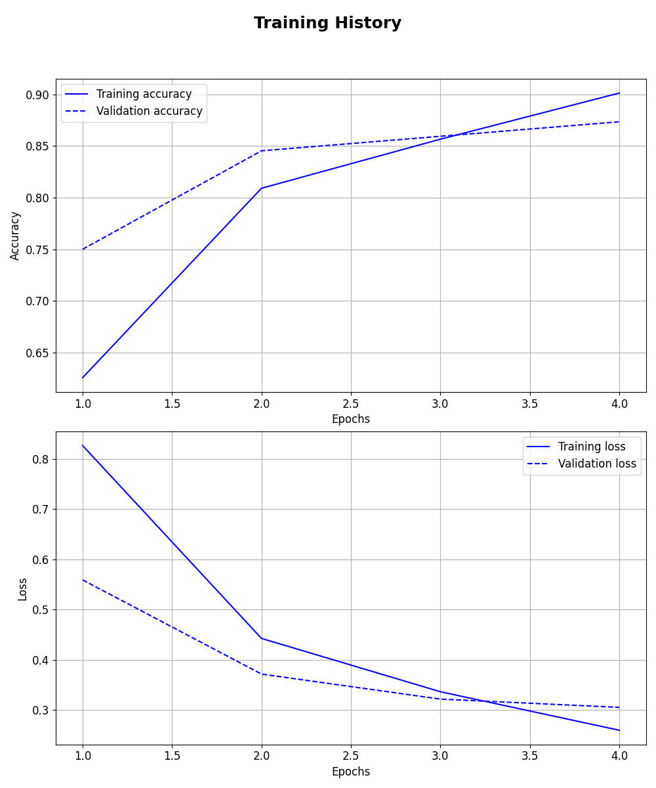

### Detailed Report of Test Set:

|              | precision    | recall       | f1-score     | support      |
| ------------ | ------------ | ------------ | ------------ | ------------ |
| chihuahua    | 0.8355       | 0.6709       | 0.7442       | 477          | 
| muffin       | 0.6922       | 0.8486       | 0.7624       | 416          | 
| micro avg    | 0.7536       | 0.7536       | 0.7536       | 893          | 
| macro avg    | 0.7638       | 0.7597       | 0.7533       | 893          | 
| weighted avg | 0.7687       | 0.7536       | 0.7527       | 893          | 
| samples avg  | 0.7536       | 0.7536       | 0.7536       | 893          | 

## trial_90

*    *Start Time*: 2024-10-17 16:32:07

*    *Duration*: 07.691

*    *Directory*: [Link](./trial_90)

### Hyperparameters:

| Hyperparameter         | Value                  |
| ---------------------- | ---------------------- |
| units1                 | 128                    |
| kernel_size1           | 3                      |
| units2                 | 128                    |
| kernel_size2           | 3                      |
| units3                 | 128                    |
| learning_rate          | 0.00045147208279710805 |

### Evaluation Metrics:

|           | train     | val       | test      |
| --------- | --------- | --------- | --------- |
| accuracy  | 0.7475    | 0.7344    | 0.7536    | 
| precision | 0.7475    | 0.7344    | 0.7536    | 
| recall    | 0.7475    | 0.7344    | 0.7536    | 
| f1        | 0.7475    | 0.7344    | 0.7536    | 

### Figures:

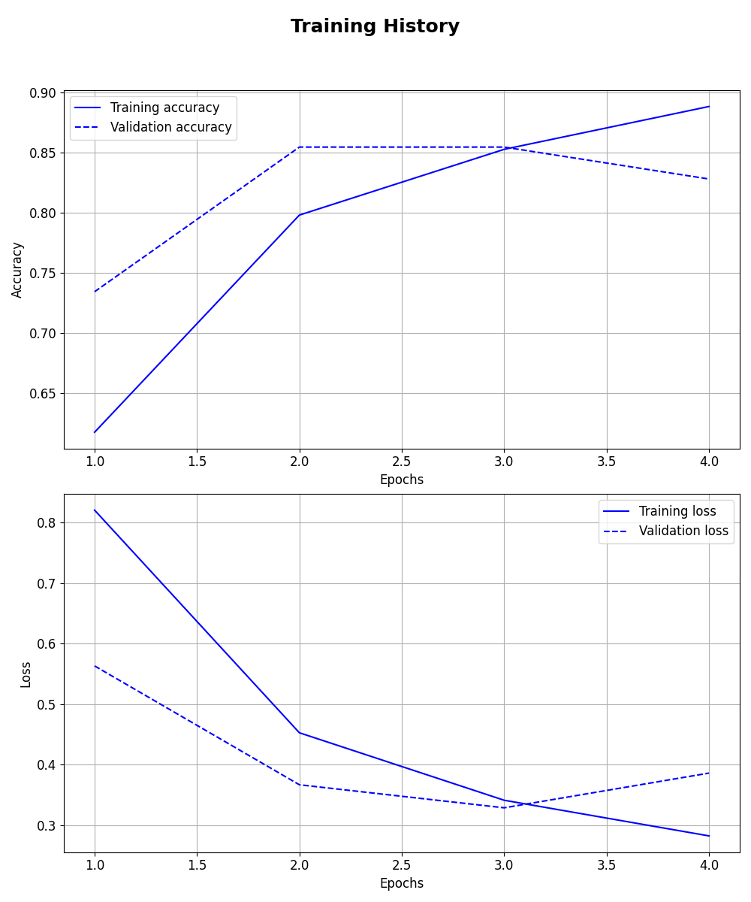

### Detailed Report of Test Set:

|              | precision    | recall       | f1-score     | support      |
| ------------ | ------------ | ------------ | ------------ | ------------ |
| chihuahua    | 0.8482       | 0.6562       | 0.7400       | 477          | 
| muffin       | 0.6870       | 0.8654       | 0.7660       | 416          | 
| micro avg    | 0.7536       | 0.7536       | 0.7536       | 893          | 
| macro avg    | 0.7676       | 0.7608       | 0.7530       | 893          | 
| weighted avg | 0.7731       | 0.7536       | 0.7521       | 893          | 
| samples avg  | 0.7536       | 0.7536       | 0.7536       | 893          | 

## trial_100

*    *Start Time*: 2024-10-17 16:33:16

*    *Duration*: 06.518

*    *Directory*: [Link](./trial_100)

### Hyperparameters:

| Hyperparameter        | Value                 |
| --------------------- | --------------------- |
| units1                | 64                    |
| kernel_size1          | 3                     |
| units2                | 128                   |
| kernel_size2          | 3                     |
| units3                | 256                   |
| learning_rate         | 0.0002516353503326469 |

### Evaluation Metrics:

|           | train     | val       | test      |
| --------- | --------- | --------- | --------- |
| accuracy  | 0.7862    | 0.7344    | 0.7536    | 
| precision | 0.7862    | 0.7344    | 0.7536    | 
| recall    | 0.7862    | 0.7344    | 0.7536    | 
| f1        | 0.7862    | 0.7344    | 0.7536    | 

### Figures:

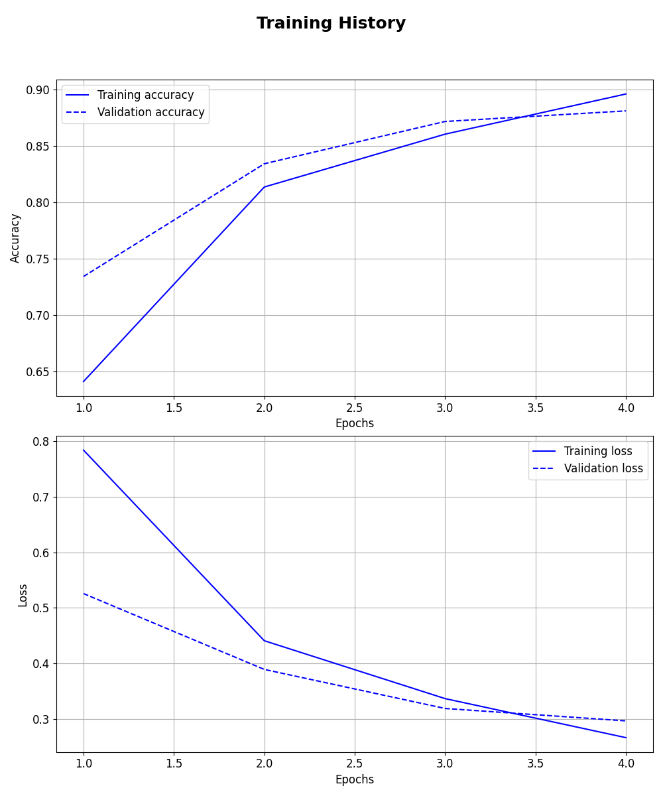

### Detailed Report of Test Set:

|              | precision    | recall       | f1-score     | support      |
| ------------ | ------------ | ------------ | ------------ | ------------ |
| chihuahua    | 0.7250       | 0.8679       | 0.7901       | 477          | 
| muffin       | 0.8043       | 0.6226       | 0.7019       | 416          | 
| micro avg    | 0.7536       | 0.7536       | 0.7536       | 893          | 
| macro avg    | 0.7647       | 0.7453       | 0.7460       | 893          | 
| weighted avg | 0.7620       | 0.7536       | 0.7490       | 893          | 
| samples avg  | 0.7536       | 0.7536       | 0.7536       | 893          | 

## trial_70

*    *Start Time*: 2024-10-17 15:58:50

*    *Duration*: 06.107

*    *Directory*: [Link](./trial_70)

### Hyperparameters:

| Hyperparameter         | Value                  |
| ---------------------- | ---------------------- |
| units1                 | 64                     |
| kernel_size1           | 3                      |
| units2                 | 128                    |
| kernel_size2           | 3                      |
| units3                 | 256                    |
| learning_rate          | 0.00037684495609334445 |

### Evaluation Metrics:

|           | train     | val       | test      |
| --------- | --------- | --------- | --------- |
| accuracy  | 0.7425    | 0.7484    | 0.7525    | 
| precision | 0.7425    | 0.7484    | 0.7525    | 
| recall    | 0.7425    | 0.7484    | 0.7525    | 
| f1        | 0.7425    | 0.7484    | 0.7525    | 

### Figures:

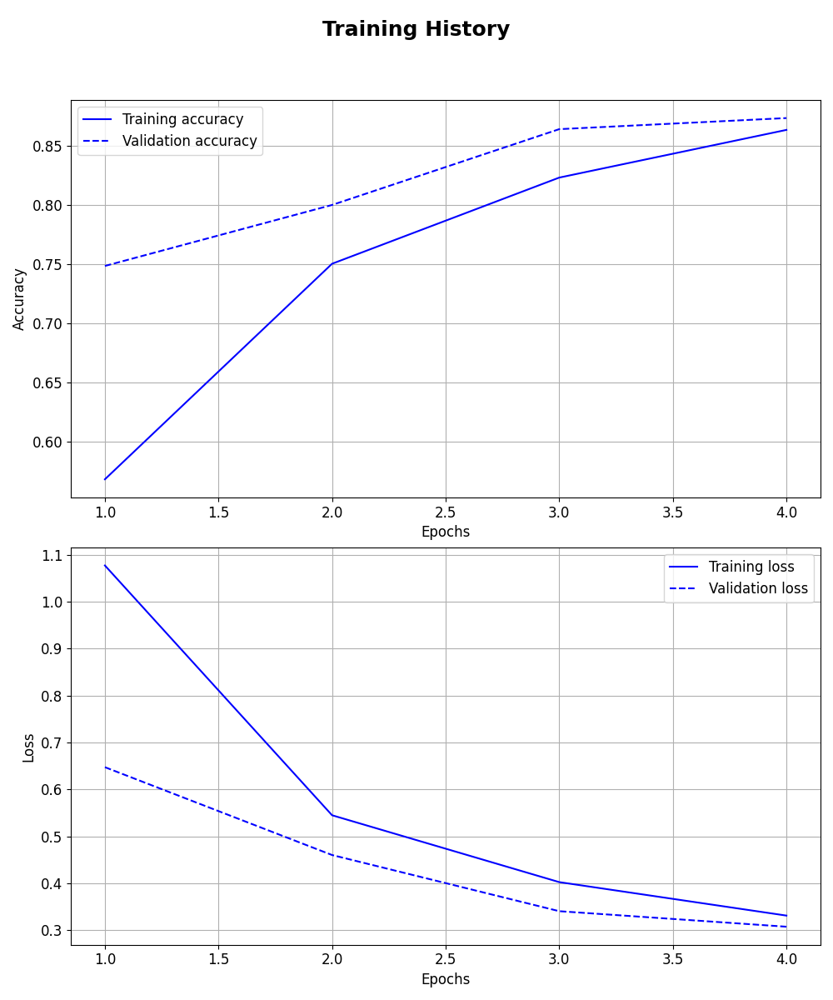

### Detailed Report of Test Set:

|              | precision    | recall       | f1-score     | support      |
| ------------ | ------------ | ------------ | ------------ | ------------ |
| chihuahua    | 0.9076       | 0.5975       | 0.7206       | 477          | 
| muffin       | 0.6684       | 0.9303       | 0.7779       | 416          | 
| micro avg    | 0.7525       | 0.7525       | 0.7525       | 893          | 
| macro avg    | 0.7880       | 0.7639       | 0.7492       | 893          | 
| weighted avg | 0.7962       | 0.7525       | 0.7473       | 893          | 
| samples avg  | 0.7525       | 0.7525       | 0.7525       | 893          | 

## trial_86

*    *Start Time*: 2024-10-17 16:31:34

*    *Duration*: 06.252

*    *Directory*: [Link](./trial_86)

### Hyperparameters:

| Hyperparameter        | Value                 |
| --------------------- | --------------------- |
| units1                | 64                    |
| kernel_size1          | 3                     |
| units2                | 128                   |
| kernel_size2          | 3                     |
| units3                | 256                   |
| learning_rate         | 0.0001505798502333703 |

### Evaluation Metrics:

|           | train     | val       | test      |
| --------- | --------- | --------- | --------- |
| accuracy  | 0.7853    | 0.7437    | 0.7525    | 
| precision | 0.7853    | 0.7437    | 0.7525    | 
| recall    | 0.7853    | 0.7437    | 0.7525    | 
| f1        | 0.7853    | 0.7437    | 0.7525    | 

### Figures:

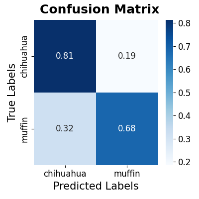

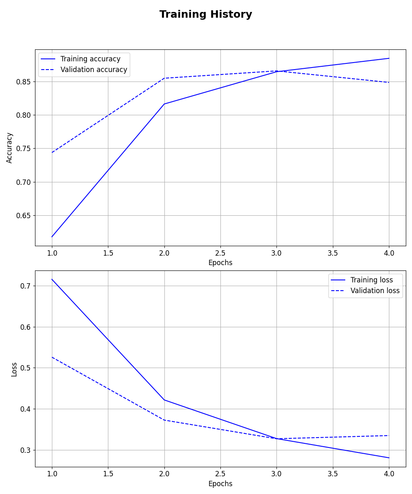

### Detailed Report of Test Set:

|              | precision    | recall       | f1-score     | support      |
| ------------ | ------------ | ------------ | ------------ | ------------ |
| chihuahua    | 0.7462       | 0.8134       | 0.7783       | 477          | 
| muffin       | 0.7614       | 0.6827       | 0.7199       | 416          | 
| micro avg    | 0.7525       | 0.7525       | 0.7525       | 893          | 
| macro avg    | 0.7538       | 0.7481       | 0.7491       | 893          | 
| weighted avg | 0.7533       | 0.7525       | 0.7511       | 893          | 
| samples avg  | 0.7525       | 0.7525       | 0.7525       | 893          | 

## trial_62

*    *Start Time*: 2024-10-17 15:57:54

*    *Duration*: 06.064

*    *Directory*: [Link](./trial_62)

### Hyperparameters:

| Hyperparameter         | Value                  |
| ---------------------- | ---------------------- |
| units1                 | 64                     |
| kernel_size1           | 3                      |
| units2                 | 128                    |
| kernel_size2           | 3                      |
| units3                 | 256                    |
| learning_rate          | 0.00020257119162182626 |

### Evaluation Metrics:

|           | train     | val       | test      |
| --------- | --------- | --------- | --------- |
| accuracy  | 0.7516    | 0.7141    | 0.7514    | 
| precision | 0.7516    | 0.7141    | 0.7514    | 
| recall    | 0.7516    | 0.7141    | 0.7514    | 
| f1        | 0.7516    | 0.7141    | 0.7514    | 

### Figures:

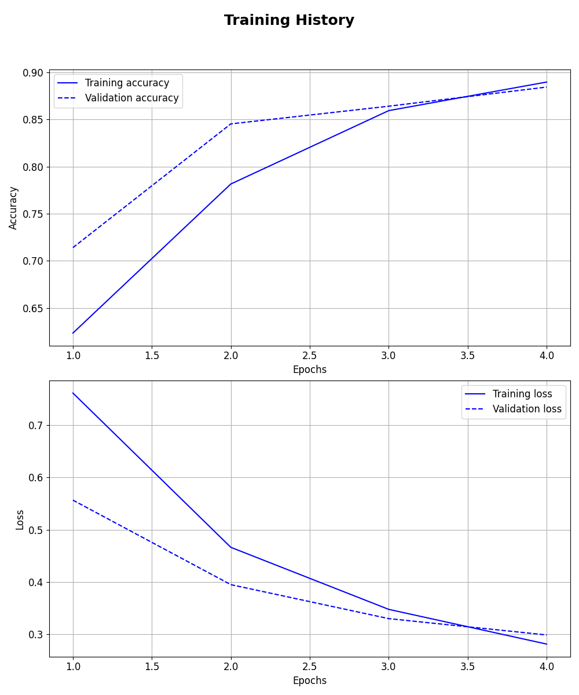

### Detailed Report of Test Set:

|              | precision    | recall       | f1-score     | support      |
| ------------ | ------------ | ------------ | ------------ | ------------ |
| chihuahua    | 0.8228       | 0.6813       | 0.7454       | 477          | 
| muffin       | 0.6948       | 0.8317       | 0.7571       | 416          | 
| micro avg    | 0.7514       | 0.7514       | 0.7514       | 893          | 
| macro avg    | 0.7588       | 0.7565       | 0.7513       | 893          | 
| weighted avg | 0.7632       | 0.7514       | 0.7509       | 893          | 
| samples avg  | 0.7514       | 0.7514       | 0.7514       | 893          | 

## trial_53

*    *Start Time*: 2024-10-17 15:56:40

*    *Duration*: 08.086

*    *Directory*: [Link](./trial_53)

### Hyperparameters:

| Hyperparameter        | Value                 |
| --------------------- | --------------------- |
| units1                | 128                   |
| kernel_size1          | 7                     |
| units2                | 128                   |
| kernel_size2          | 3                     |
| units3                | 128                   |
| learning_rate         | 0.0001764441302037558 |

### Evaluation Metrics:

|           | train     | val       | test      |
| --------- | --------- | --------- | --------- |
| accuracy  | 0.7684    | 0.7453    | 0.7514    | 
| precision | 0.7684    | 0.7453    | 0.7514    | 
| recall    | 0.7684    | 0.7453    | 0.7514    | 
| f1        | 0.7684    | 0.7453    | 0.7514    | 

### Figures:

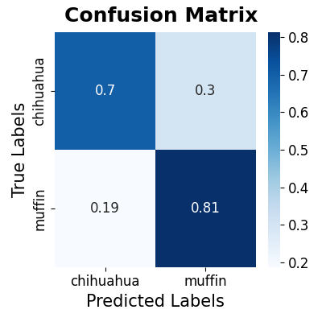

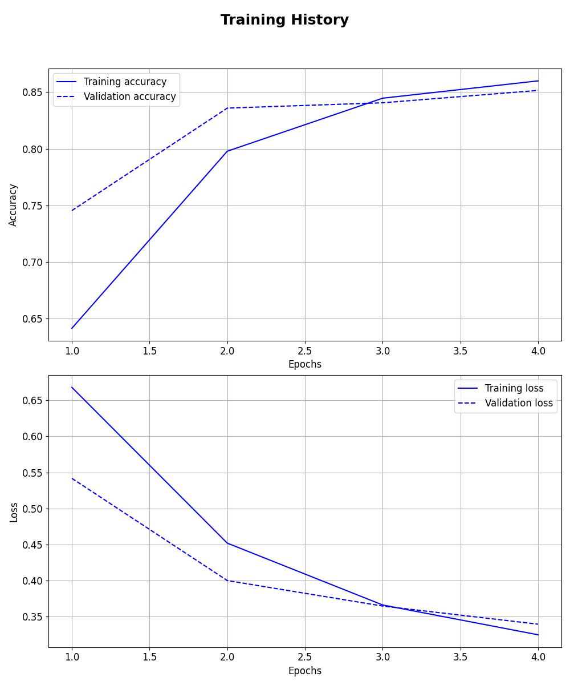

### Detailed Report of Test Set:

|              | precision    | recall       | f1-score     | support      |
| ------------ | ------------ | ------------ | ------------ | ------------ |
| chihuahua    | 0.8102       | 0.6981       | 0.7500       | 477          | 
| muffin       | 0.7012       | 0.8125       | 0.7528       | 416          | 
| micro avg    | 0.7514       | 0.7514       | 0.7514       | 893          | 
| macro avg    | 0.7557       | 0.7553       | 0.7514       | 893          | 
| weighted avg | 0.7595       | 0.7514       | 0.7513       | 893          | 
| samples avg  | 0.7514       | 0.7514       | 0.7514       | 893          | 

## trial_73

*    *Start Time*: 2024-10-17 15:59:10

*    *Duration*: 06.158

*    *Directory*: [Link](./trial_73)

### Hyperparameters:

| Hyperparameter         | Value                  |
| ---------------------- | ---------------------- |
| units1                 | 64                     |
| kernel_size1           | 3                      |
| units2                 | 128                    |
| kernel_size2           | 3                      |
| units3                 | 256                    |
| learning_rate          | 0.00030231029814696255 |

### Evaluation Metrics:

|           | train     | val       | test      |
| --------- | --------- | --------- | --------- |
| accuracy  | 0.7547    | 0.7453    | 0.7514    | 
| precision | 0.7547    | 0.7453    | 0.7514    | 
| recall    | 0.7547    | 0.7453    | 0.7514    | 
| f1        | 0.7547    | 0.7453    | 0.7514    | 

### Figures:

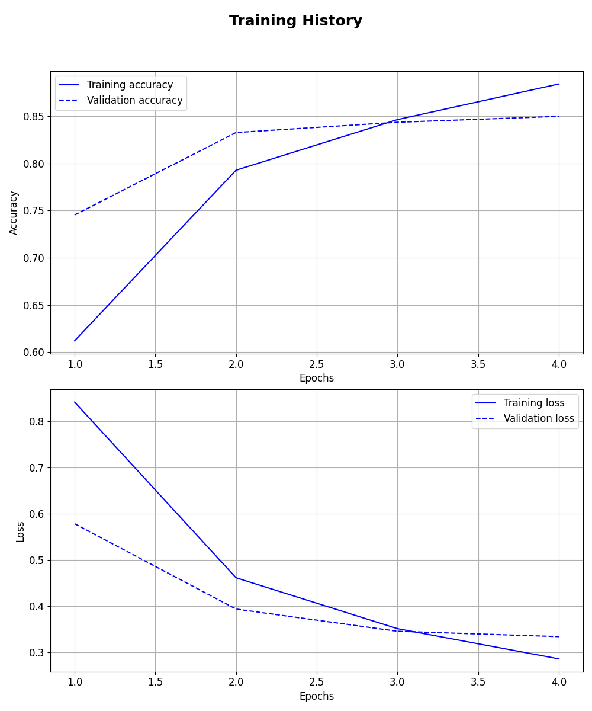

### Detailed Report of Test Set:

|              | precision    | recall       | f1-score     | support      |
| ------------ | ------------ | ------------ | ------------ | ------------ |
| chihuahua    | 0.8364       | 0.6646       | 0.7407       | 477          | 
| muffin       | 0.6887       | 0.8510       | 0.7613       | 416          | 
| micro avg    | 0.7514       | 0.7514       | 0.7514       | 893          | 
| macro avg    | 0.7626       | 0.7578       | 0.7510       | 893          | 
| weighted avg | 0.7676       | 0.7514       | 0.7503       | 893          | 
| samples avg  | 0.7514       | 0.7514       | 0.7514       | 893          | 

## trial_80

*    *Start Time*: 2024-10-17 16:30:51

*    *Duration*: 06.818

*    *Directory*: [Link](./trial_80)

### Hyperparameters:

| Hyperparameter        | Value                 |
| --------------------- | --------------------- |
| units1                | 64                    |
| kernel_size1          | 3                     |
| units2                | 64                    |
| kernel_size2          | 3                     |
| units3                | 128                   |
| learning_rate         | 0.0005068034015915362 |

### Evaluation Metrics:

|           | train     | val       | test      |
| --------- | --------- | --------- | --------- |
| accuracy  | 0.7437    | 0.7422    | 0.7503    | 
| precision | 0.7437    | 0.7422    | 0.7503    | 
| recall    | 0.7437    | 0.7422    | 0.7503    | 
| f1        | 0.7437    | 0.7422    | 0.7503    | 

### Figures:

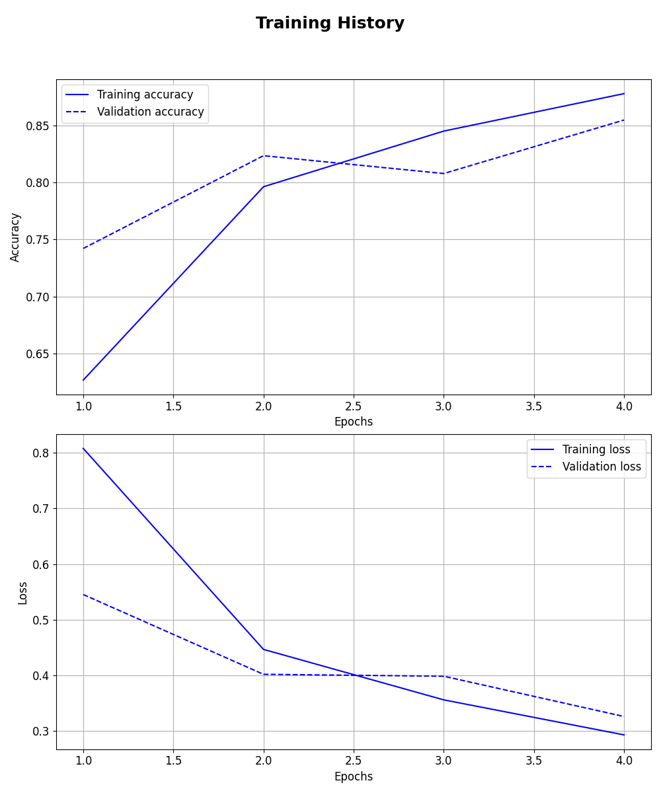

### Detailed Report of Test Set:

|              | precision    | recall       | f1-score     | support      |
| ------------ | ------------ | ------------ | ------------ | ------------ |
| chihuahua    | 0.8872       | 0.6101       | 0.7230       | 477          | 
| muffin       | 0.6708       | 0.9111       | 0.7727       | 416          | 
| micro avg    | 0.7503       | 0.7503       | 0.7503       | 893          | 
| macro avg    | 0.7790       | 0.7606       | 0.7478       | 893          | 
| weighted avg | 0.7864       | 0.7503       | 0.7461       | 893          | 
| samples avg  | 0.7503       | 0.7503       | 0.7503       | 893          | 

## trial_81

*    *Start Time*: 2024-10-17 16:30:58

*    *Duration*: 08.356

*    *Directory*: [Link](./trial_81)

### Hyperparameters:

| Hyperparameter         | Value                  |
| ---------------------- | ---------------------- |
| units1                 | 64                     |
| kernel_size1           | 3                      |
| units2                 | 64                     |
| kernel_size2           | 5                      |
| units3                 | 128                    |
| learning_rate          | 0.00020130915495256057 |

### Evaluation Metrics:

|           | train     | val       | test      |
| --------- | --------- | --------- | --------- |
| accuracy  | 0.7703    | 0.7281    | 0.7503    | 
| precision | 0.7703    | 0.7281    | 0.7503    | 
| recall    | 0.7703    | 0.7281    | 0.7503    | 
| f1        | 0.7703    | 0.7281    | 0.7503    | 

### Figures:

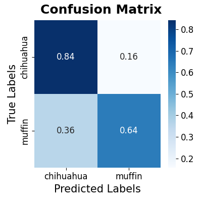

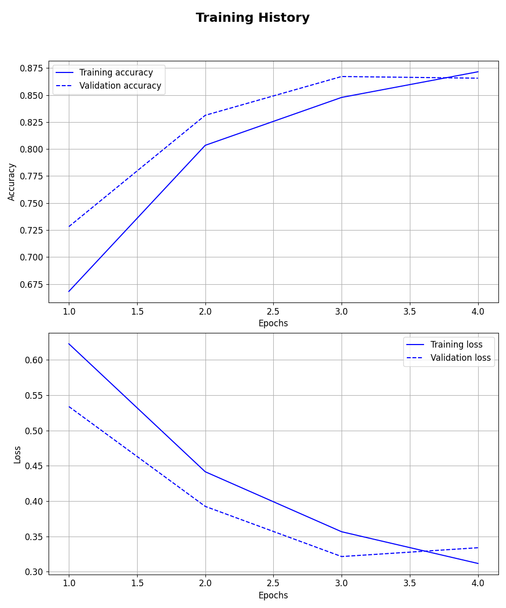

### Detailed Report of Test Set:

|              | precision    | recall       | f1-score     | support      |
| ------------ | ------------ | ------------ | ------------ | ------------ |
| chihuahua    | 0.7309       | 0.8428       | 0.7829       | 477          | 
| muffin       | 0.7813       | 0.6442       | 0.7062       | 416          | 
| micro avg    | 0.7503       | 0.7503       | 0.7503       | 893          | 
| macro avg    | 0.7561       | 0.7435       | 0.7445       | 893          | 
| weighted avg | 0.7544       | 0.7503       | 0.7471       | 893          | 
| samples avg  | 0.7503       | 0.7503       | 0.7503       | 893          | 

## trial_41

*    *Start Time*: 2024-10-17 15:55:05

*    *Duration*: 07.911

*    *Directory*: [Link](./trial_41)

### Hyperparameters:

| Hyperparameter        | Value                 |
| --------------------- | --------------------- |
| units1                | 128                   |
| kernel_size1          | 3                     |
| units2                | 128                   |
| kernel_size2          | 3                     |
| units3                | 128                   |
| learning_rate         | 0.0002793590964458728 |

### Evaluation Metrics:

|           | train     | val       | test      |
| --------- | --------- | --------- | --------- |
| accuracy  | 0.7600    | 0.7500    | 0.7492    | 
| precision | 0.7600    | 0.7500    | 0.7492    | 
| recall    | 0.7600    | 0.7500    | 0.7492    | 
| f1        | 0.7600    | 0.7500    | 0.7492    | 

### Figures:

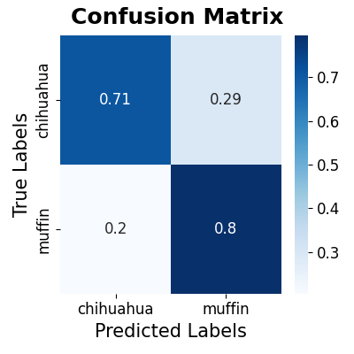

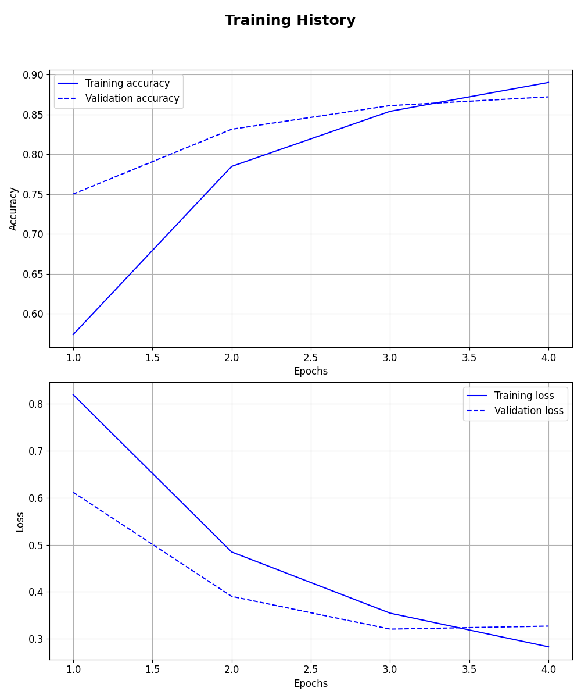

### Detailed Report of Test Set:

|              | precision    | recall       | f1-score     | support      |
| ------------ | ------------ | ------------ | ------------ | ------------ |
| chihuahua    | 0.7991       | 0.7086       | 0.7511       | 477          | 
| muffin       | 0.7043       | 0.7957       | 0.7472       | 416          | 
| micro avg    | 0.7492       | 0.7492       | 0.7492       | 893          | 
| macro avg    | 0.7517       | 0.7521       | 0.7491       | 893          | 
| weighted avg | 0.7549       | 0.7492       | 0.7493       | 893          | 
| samples avg  | 0.7492       | 0.7492       | 0.7492       | 893          | 

## trial_30

*    *Start Time*: 2024-10-17 15:53:38

*    *Duration*: 05.677

*    *Directory*: [Link](./trial_30)

### Hyperparameters:

| Hyperparameter        | Value                 |
| --------------------- | --------------------- |
| units1                | 64                    |
| kernel_size1          | 3                     |
| units2                | 128                   |
| kernel_size2          | 3                     |
| units3                | 32                    |
| learning_rate         | 0.0006271014068549362 |

### Evaluation Metrics:

|           | train     | val       | test      |
| --------- | --------- | --------- | --------- |
| accuracy  | 0.7597    | 0.7437    | 0.7480    | 
| precision | 0.7597    | 0.7437    | 0.7480    | 
| recall    | 0.7597    | 0.7437    | 0.7480    | 
| f1        | 0.7597    | 0.7437    | 0.7480    | 

### Figures:

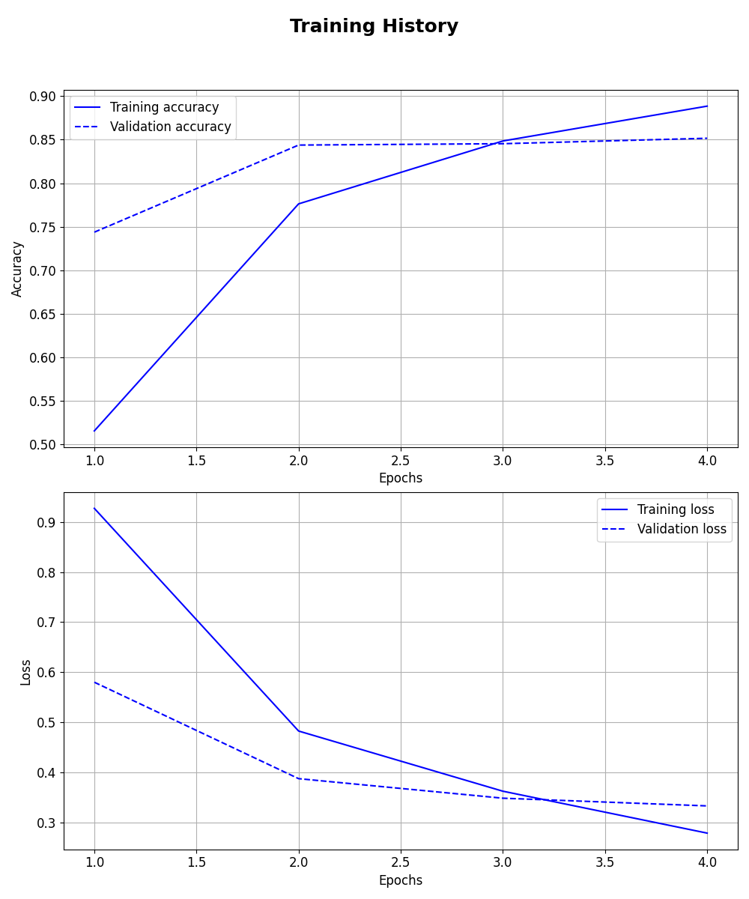

### Detailed Report of Test Set:

|              | precision    | recall       | f1-score     | support      |
| ------------ | ------------ | ------------ | ------------ | ------------ |
| chihuahua    | 0.7851       | 0.7275       | 0.7552       | 477          | 
| muffin       | 0.7118       | 0.7716       | 0.7405       | 416          | 
| micro avg    | 0.7480       | 0.7480       | 0.7480       | 893          | 
| macro avg    | 0.7484       | 0.7495       | 0.7478       | 893          | 
| weighted avg | 0.7509       | 0.7480       | 0.7483       | 893          | 
| samples avg  | 0.7480       | 0.7480       | 0.7480       | 893          | 

## trial_51

*    *Start Time*: 2024-10-17 15:56:23

*    *Duration*: 07.577

*    *Directory*: [Link](./trial_51)

### Hyperparameters:

| Hyperparameter         | Value                  |
| ---------------------- | ---------------------- |
| units1                 | 128                    |
| kernel_size1           | 3                      |
| units2                 | 128                    |
| kernel_size2           | 3                      |
| units3                 | 256                    |
| learning_rate          | 0.00012387688896846465 |

### Evaluation Metrics:

|           | train     | val       | test      |
| --------- | --------- | --------- | --------- |
| accuracy  | 0.7494    | 0.7359    | 0.7458    | 
| precision | 0.7494    | 0.7359    | 0.7458    | 
| recall    | 0.7494    | 0.7359    | 0.7458    | 
| f1        | 0.7494    | 0.7359    | 0.7458    | 

### Figures:

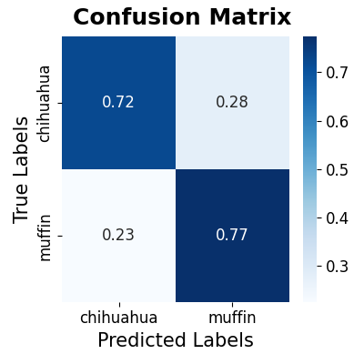

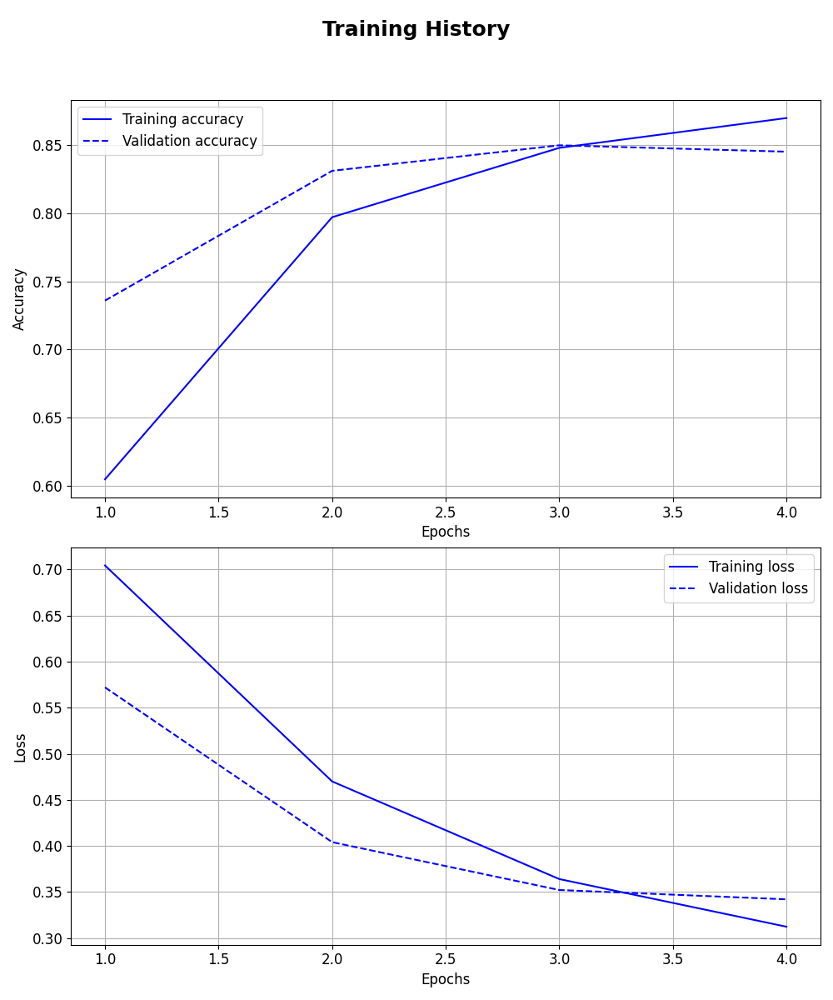

### Detailed Report of Test Set:

|              | precision    | recall       | f1-score     | support      |
| ------------ | ------------ | ------------ | ------------ | ------------ |
| chihuahua    | 0.7854       | 0.7212       | 0.7519       | 477          | 
| muffin       | 0.7077       | 0.7740       | 0.7394       | 416          | 
| micro avg    | 0.7458       | 0.7458       | 0.7458       | 893          | 
| macro avg    | 0.7465       | 0.7476       | 0.7456       | 893          | 
| weighted avg | 0.7492       | 0.7458       | 0.7461       | 893          | 
| samples avg  | 0.7458       | 0.7458       | 0.7458       | 893          | 

## trial_44

*    *Start Time*: 2024-10-17 15:55:29

*    *Duration*: 06.566

*    *Directory*: [Link](./trial_44)

### Hyperparameters:

| Hyperparameter         | Value                  |
| ---------------------- | ---------------------- |
| units1                 | 64                     |
| kernel_size1           | 3                      |
| units2                 | 128                    |
| kernel_size2           | 3                      |
| units3                 | 256                    |
| learning_rate          | 0.00020780660341765685 |

### Evaluation Metrics:

|           | train     | val       | test      |
| --------- | --------- | --------- | --------- |
| accuracy  | 0.7666    | 0.7312    | 0.7458    | 
| precision | 0.7666    | 0.7312    | 0.7458    | 
| recall    | 0.7666    | 0.7312    | 0.7458    | 
| f1        | 0.7666    | 0.7312    | 0.7458    | 

### Figures:

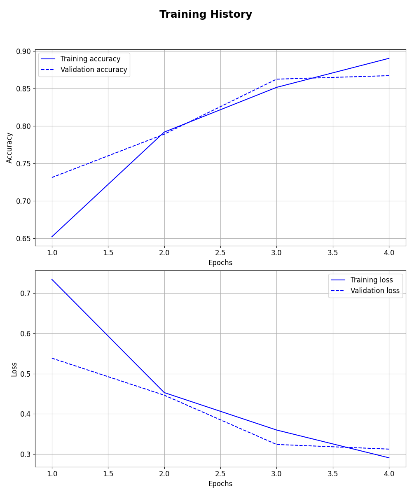

### Detailed Report of Test Set:

|              | precision    | recall       | f1-score     | support      |
| ------------ | ------------ | ------------ | ------------ | ------------ |
| chihuahua    | 0.7470       | 0.7925       | 0.7691       | 477          | 
| muffin       | 0.7442       | 0.6923       | 0.7173       | 416          | 
| micro avg    | 0.7458       | 0.7458       | 0.7458       | 893          | 
| macro avg    | 0.7456       | 0.7424       | 0.7432       | 893          | 
| weighted avg | 0.7457       | 0.7458       | 0.7450       | 893          | 
| samples avg  | 0.7458       | 0.7458       | 0.7458       | 893          | 

## trial_65

*    *Start Time*: 2024-10-17 15:58:14

*    *Duration*: 06.853

*    *Directory*: [Link](./trial_65)

### Hyperparameters:

| Hyperparameter         | Value                  |
| ---------------------- | ---------------------- |
| units1                 | 64                     |
| kernel_size1           | 3                      |
| units2                 | 128                    |
| kernel_size2           | 3                      |
| units3                 | 256                    |
| learning_rate          | 0.00021561134351633045 |

### Evaluation Metrics:

|           | train     | val       | test      |
| --------- | --------- | --------- | --------- |
| accuracy  | 0.7484    | 0.7297    | 0.7447    | 
| precision | 0.7484    | 0.7297    | 0.7447    | 
| recall    | 0.7484    | 0.7297    | 0.7447    | 
| f1        | 0.7484    | 0.7297    | 0.7447    | 

### Figures:

### Detailed Report of Test Set:

|              | precision    | recall       | f1-score     | support      |
| ------------ | ------------ | ------------ | ------------ | ------------ |
| chihuahua    | 0.8547       | 0.6289       | 0.7246       | 477          | 
| muffin       | 0.6734       | 0.8774       | 0.7620       | 416          | 
| micro avg    | 0.7447       | 0.7447       | 0.7447       | 893          | 
| macro avg    | 0.7641       | 0.7532       | 0.7433       | 893          | 
| weighted avg | 0.7703       | 0.7447       | 0.7420       | 893          | 
| samples avg  | 0.7447       | 0.7447       | 0.7447       | 893          | 

## trial_15

*    *Start Time*: 2024-10-17 15:51:45

*    *Duration*: 08.820

*    *Directory*: [Link](./trial_15)

### Hyperparameters:

| Hyperparameter         | Value                  |
| ---------------------- | ---------------------- |
| units1                 | 32                     |
| kernel_size1           | 5                      |
| units2                 | 128                    |
| kernel_size2           | 5                      |
| units3                 | 128                    |
| learning_rate          | 0.00010813113058420451 |

### Evaluation Metrics:

|           | train     | val       | test      |
| --------- | --------- | --------- | --------- |
| accuracy  | 0.7513    | 0.7344    | 0.7447    | 
| precision | 0.7513    | 0.7344    | 0.7447    | 
| recall    | 0.7513    | 0.7344    | 0.7447    | 
| f1        | 0.7512    | 0.7344    | 0.7447    | 

### Figures:

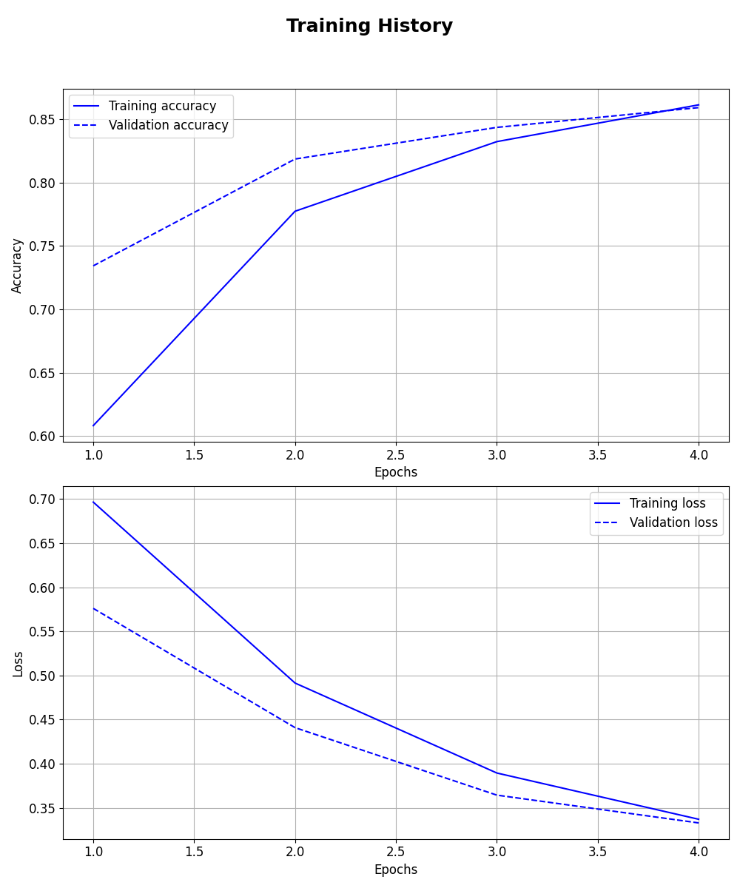

### Detailed Report of Test Set:

|              | precision    | recall       | f1-score     | support      |
| ------------ | ------------ | ------------ | ------------ | ------------ |
| chihuahua    | 0.8184       | 0.6709       | 0.7373       | 477          | 
| muffin       | 0.6873       | 0.8293       | 0.7516       | 416          | 
| micro avg    | 0.7447       | 0.7447       | 0.7447       | 893          | 
| macro avg    | 0.7528       | 0.7501       | 0.7445       | 893          | 
| weighted avg | 0.7573       | 0.7447       | 0.7440       | 893          | 
| samples avg  | 0.7447       | 0.7447       | 0.7447       | 893          | 

## trial_50

*    *Start Time*: 2024-10-17 15:56:16

*    *Duration*: 07.636

*    *Directory*: [Link](./trial_50)

### Hyperparameters:

| Hyperparameter         | Value                  |
| ---------------------- | ---------------------- |
| units1                 | 128                    |
| kernel_size1           | 3                      |
| units2                 | 128                    |
| kernel_size2           | 3                      |
| units3                 | 256                    |
| learning_rate          | 0.00023659704589527688 |

### Evaluation Metrics:

|           | train     | val       | test      |
| --------- | --------- | --------- | --------- |
| accuracy  | 0.7659    | 0.7422    | 0.7436    | 
| precision | 0.7659    | 0.7422    | 0.7436    | 
| recall    | 0.7659    | 0.7422    | 0.7436    | 
| f1        | 0.7659    | 0.7422    | 0.7436    | 

### Figures:

### Detailed Report of Test Set:

|              | precision    | recall       | f1-score     | support      |
| ------------ | ------------ | ------------ | ------------ | ------------ |
| chihuahua    | 0.7650       | 0.7505       | 0.7577       | 477          | 
| muffin       | 0.7200       | 0.7356       | 0.7277       | 416          | 
| micro avg    | 0.7436       | 0.7436       | 0.7436       | 893          | 
| macro avg    | 0.7425       | 0.7431       | 0.7427       | 893          | 
| weighted avg | 0.7440       | 0.7436       | 0.7437       | 893          | 
| samples avg  | 0.7436       | 0.7436       | 0.7436       | 893          | 

## trial_69

*    *Start Time*: 2024-10-17 15:58:41

*    *Duration*: 08.310

*    *Directory*: [Link](./trial_69)

### Hyperparameters:

| Hyperparameter        | Value                 |
| --------------------- | --------------------- |
| units1                | 128                   |
| kernel_size1          | 3                     |
| units2                | 128                   |
| kernel_size2          | 3                     |
| units3                | 256                   |
| learning_rate         | 6.533765578254134e-05 |

### Evaluation Metrics:

|           | train     | val       | test      |
| --------- | --------- | --------- | --------- |
| accuracy  | 0.7509    | 0.7266    | 0.7413    | 
| precision | 0.7509    | 0.7266    | 0.7413    | 
| recall    | 0.7509    | 0.7266    | 0.7413    | 
| f1        | 0.7509    | 0.7266    | 0.7413    | 

### Figures:

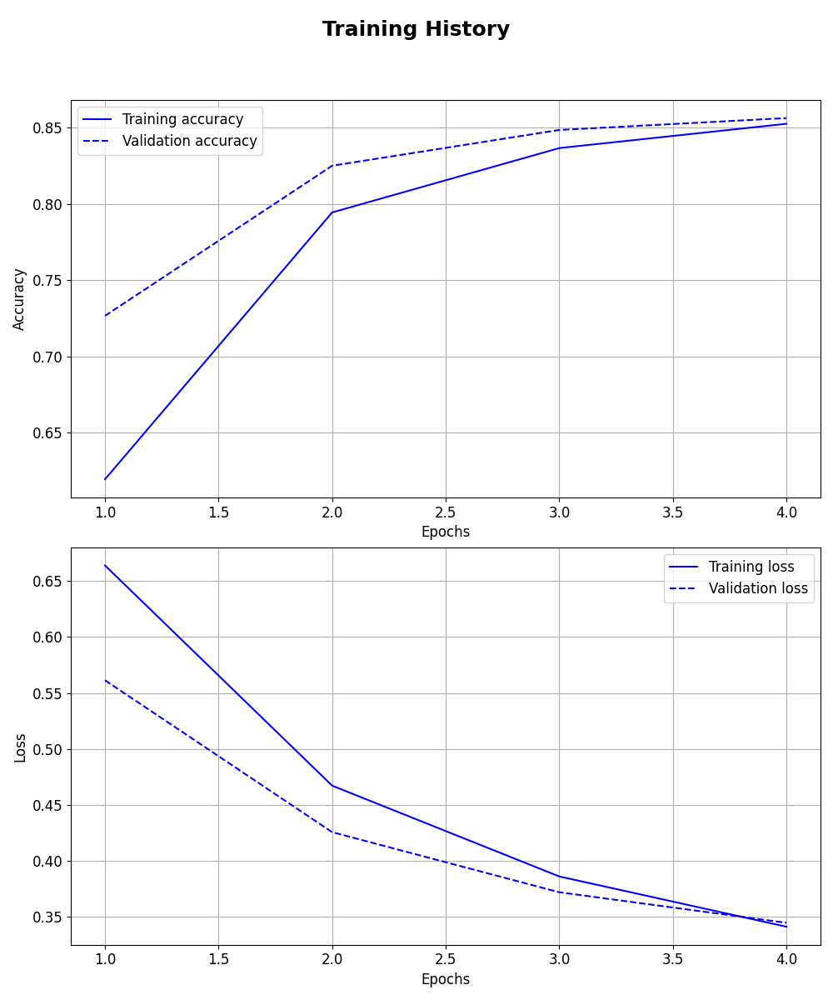

### Detailed Report of Test Set:

|              | precision    | recall       | f1-score     | support      |
| ------------ | ------------ | ------------ | ------------ | ------------ |
| chihuahua    | 0.8187       | 0.6625       | 0.7323       | 477          | 
| muffin       | 0.6824       | 0.8317       | 0.7497       | 416          | 
| micro avg    | 0.7413       | 0.7413       | 0.7413       | 893          | 
| macro avg    | 0.7505       | 0.7471       | 0.7410       | 893          | 
| weighted avg | 0.7552       | 0.7413       | 0.7404       | 893          | 
| samples avg  | 0.7413       | 0.7413       | 0.7413       | 893          | 

## trial_89

*    *Start Time*: 2024-10-17 16:32:00

*    *Duration*: 06.895

*    *Directory*: [Link](./trial_89)

### Hyperparameters:

| Hyperparameter         | Value                  |
| ---------------------- | ---------------------- |
| units1                 | 64                     |
| kernel_size1           | 3                      |
| units2                 | 32                     |
| kernel_size2           | 3                      |
| units3                 | 256                    |
| learning_rate          | 0.00025391372965788986 |

### Evaluation Metrics:

|           | train     | val       | test      |
| --------- | --------- | --------- | --------- |
| accuracy  | 0.7556    | 0.7281    | 0.7413    | 
| precision | 0.7556    | 0.7281    | 0.7413    | 
| recall    | 0.7556    | 0.7281    | 0.7413    | 
| f1        | 0.7556    | 0.7281    | 0.7413    | 

### Figures:

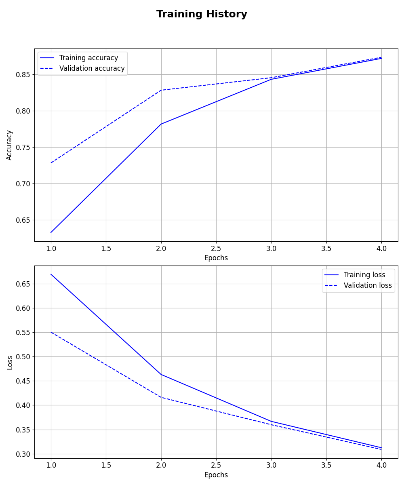

### Detailed Report of Test Set:

|              | precision    | recall       | f1-score     | support      |
| ------------ | ------------ | ------------ | ------------ | ------------ |
| chihuahua    | 0.8045       | 0.6813       | 0.7378       | 477          | 
| muffin       | 0.6892       | 0.8101       | 0.7448       | 416          | 
| micro avg    | 0.7413       | 0.7413       | 0.7413       | 893          | 
| macro avg    | 0.7468       | 0.7457       | 0.7413       | 893          | 
| weighted avg | 0.7507       | 0.7413       | 0.7410       | 893          | 
| samples avg  | 0.7413       | 0.7413       | 0.7413       | 893          | 

## trial_46

*    *Start Time*: 2024-10-17 15:55:44

*    *Duration*: 07.562

*    *Directory*: [Link](./trial_46)

### Hyperparameters:

| Hyperparameter         | Value                  |
| ---------------------- | ---------------------- |
| units1                 | 128                    |
| kernel_size1           | 3                      |
| units2                 | 128                    |
| kernel_size2           | 3                      |
| units3                 | 256                    |
| learning_rate          | 0.00013921208143377606 |

### Evaluation Metrics:

|           | train     | val       | test      |
| --------- | --------- | --------- | --------- |
| accuracy  | 0.7638    | 0.7250    | 0.7402    | 
| precision | 0.7638    | 0.7250    | 0.7402    | 
| recall    | 0.7638    | 0.7250    | 0.7402    | 
| f1        | 0.7637    | 0.7250    | 0.7402    | 

### Figures:

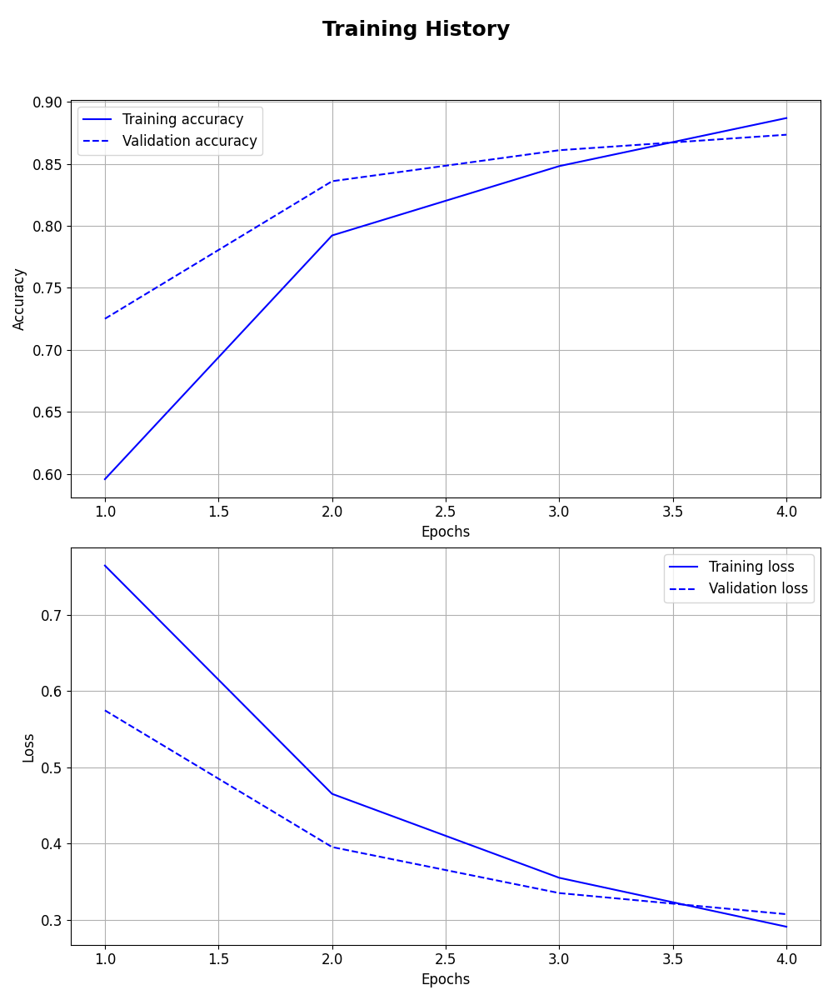

### Detailed Report of Test Set:

|              | precision    | recall       | f1-score     | support      |
| ------------ | ------------ | ------------ | ------------ | ------------ |
| chihuahua    | 0.7753       | 0.7233       | 0.7484       | 477          | 
| muffin       | 0.7054       | 0.7596       | 0.7315       | 416          | 
| micro avg    | 0.7402       | 0.7402       | 0.7402       | 893          | 
| macro avg    | 0.7403       | 0.7414       | 0.7399       | 893          | 
| weighted avg | 0.7427       | 0.7402       | 0.7405       | 893          | 
| samples avg  | 0.7402       | 0.7402       | 0.7402       | 893          | 

## trial_22

*    *Start Time*: 2024-10-17 15:52:40

*    *Duration*: 05.254

*    *Directory*: [Link](./trial_22)

### Hyperparameters:

| Hyperparameter         | Value                  |
| ---------------------- | ---------------------- |
| units1                 | 16                     |
| kernel_size1           | 3                      |
| units2                 | 128                    |
| kernel_size2           | 7                      |
| units3                 | 32                     |
| learning_rate          | 0.00039033141761412807 |

### Evaluation Metrics:

|           | train     | val       | test      |
| --------- | --------- | --------- | --------- |
| accuracy  | 0.7269    | 0.7172    | 0.7391    | 
| precision | 0.7269    | 0.7172    | 0.7391    | 
| recall    | 0.7269    | 0.7172    | 0.7391    | 
| f1        | 0.7269    | 0.7172    | 0.7391    | 

### Figures:

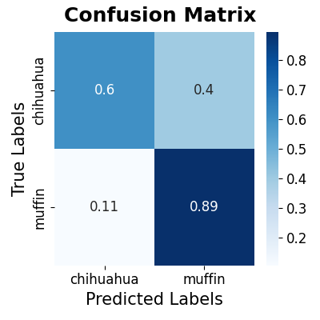

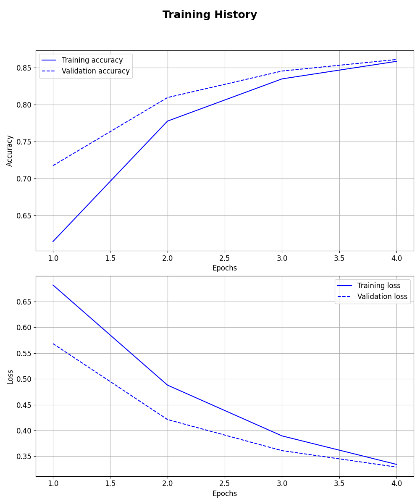

### Detailed Report of Test Set:

|              | precision    | recall       | f1-score     | support      |
| ------------ | ------------ | ------------ | ------------ | ------------ |
| chihuahua    | 0.8675       | 0.6038       | 0.7120       | 477          | 
| muffin       | 0.6631       | 0.8942       | 0.7615       | 416          | 
| micro avg    | 0.7391       | 0.7391       | 0.7391       | 893          | 
| macro avg    | 0.7653       | 0.7490       | 0.7368       | 893          | 
| weighted avg | 0.7723       | 0.7391       | 0.7351       | 893          | 
| samples avg  | 0.7391       | 0.7391       | 0.7391       | 893          | 

## trial_96

*    *Start Time*: 2024-10-17 16:32:48

*    *Duration*: 06.213

*    *Directory*: [Link](./trial_96)

### Hyperparameters:

| Hyperparameter         | Value                  |
| ---------------------- | ---------------------- |
| units1                 | 64                     |
| kernel_size1           | 3                      |
| units2                 | 128                    |
| kernel_size2           | 3                      |
| units3                 | 256                    |
| learning_rate          | 0.00020240297008748906 |

### Evaluation Metrics:

|           | train     | val       | test      |
| --------- | --------- | --------- | --------- |
| accuracy  | 0.7663    | 0.7406    | 0.7380    | 
| precision | 0.7663    | 0.7406    | 0.7380    | 
| recall    | 0.7663    | 0.7406    | 0.7380    | 
| f1        | 0.7662    | 0.7406    | 0.7380    | 

### Figures:

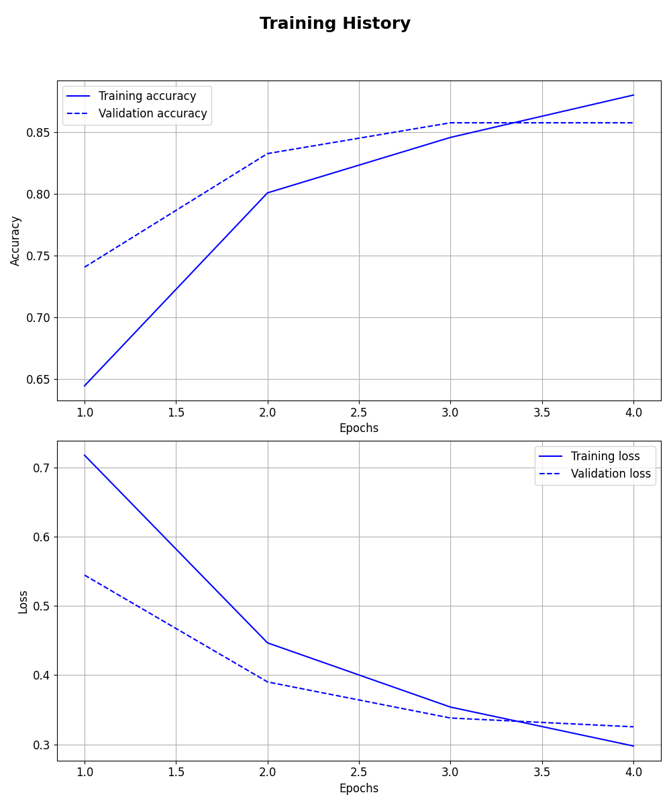

### Detailed Report of Test Set:

|              | precision    | recall       | f1-score     | support      |
| ------------ | ------------ | ------------ | ------------ | ------------ |
| chihuahua    | 0.7591       | 0.7463       | 0.7526       | 477          | 
| muffin       | 0.7146       | 0.7284       | 0.7214       | 416          | 
| micro avg    | 0.7380       | 0.7380       | 0.7380       | 893          | 
| macro avg    | 0.7368       | 0.7373       | 0.7370       | 893          | 
| weighted avg | 0.7384       | 0.7380       | 0.7381       | 893          | 
| samples avg  | 0.7380       | 0.7380       | 0.7380       | 893          | 

## trial_68

*    *Start Time*: 2024-10-17 15:58:34

*    *Duration*: 07.107

*    *Directory*: [Link](./trial_68)

### Hyperparameters:

| Hyperparameter         | Value                  |
| ---------------------- | ---------------------- |
| units1                 | 64                     |
| kernel_size1           | 3                      |
| units2                 | 128                    |
| kernel_size2           | 5                      |
| units3                 | 256                    |
| learning_rate          | 0.00013482734381691072 |

### Evaluation Metrics:

|           | train     | val       | test      |
| --------- | --------- | --------- | --------- |
| accuracy  | 0.7528    | 0.7250    | 0.7346    | 
| precision | 0.7528    | 0.7250    | 0.7346    | 
| recall    | 0.7528    | 0.7250    | 0.7346    | 
| f1        | 0.7528    | 0.7250    | 0.7346    | 

### Figures:

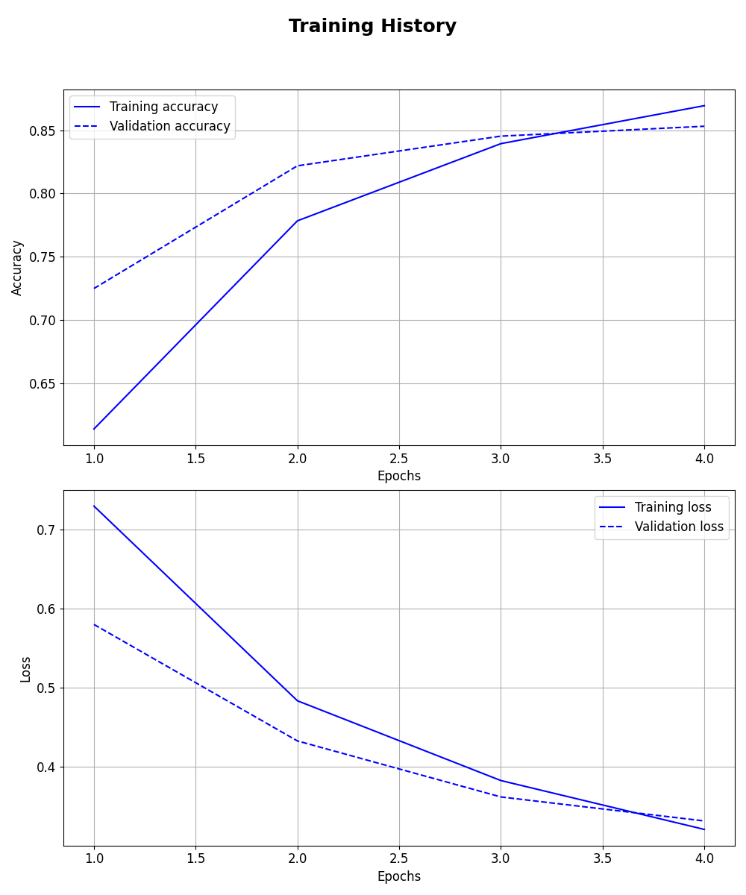

### Detailed Report of Test Set:

|              | precision    | recall       | f1-score     | support      |
| ------------ | ------------ | ------------ | ------------ | ------------ |
| chihuahua    | 0.7985       | 0.6730       | 0.7304       | 477          | 
| muffin       | 0.6823       | 0.8053       | 0.7387       | 416          | 
| micro avg    | 0.7346       | 0.7346       | 0.7346       | 893          | 
| macro avg    | 0.7404       | 0.7391       | 0.7345       | 893          | 
| weighted avg | 0.7444       | 0.7346       | 0.7343       | 893          | 
| samples avg  | 0.7346       | 0.7346       | 0.7346       | 893          | 

## trial_66

*    *Start Time*: 2024-10-17 15:58:21

*    *Duration*: 06.106

*    *Directory*: [Link](./trial_66)

### Hyperparameters:

| Hyperparameter        | Value                 |
| --------------------- | --------------------- |
| units1                | 64                    |
| kernel_size1          | 3                     |
| units2                | 128                   |
| kernel_size2          | 3                     |
| units3                | 256                   |
| learning_rate         | 0.0001926925152901088 |

### Evaluation Metrics:

|           | train     | val       | test      |
| --------- | --------- | --------- | --------- |
| accuracy  | 0.7772    | 0.7422    | 0.7335    | 
| precision | 0.7772    | 0.7422    | 0.7335    | 
| recall    | 0.7772    | 0.7422    | 0.7335    | 
| f1        | 0.7772    | 0.7422    | 0.7335    | 

### Figures:

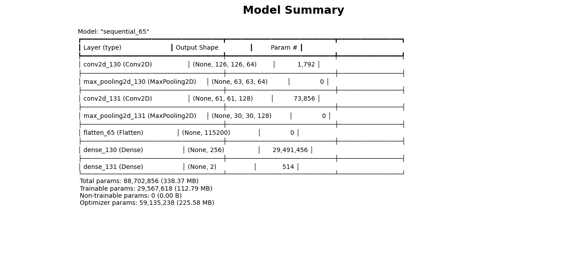

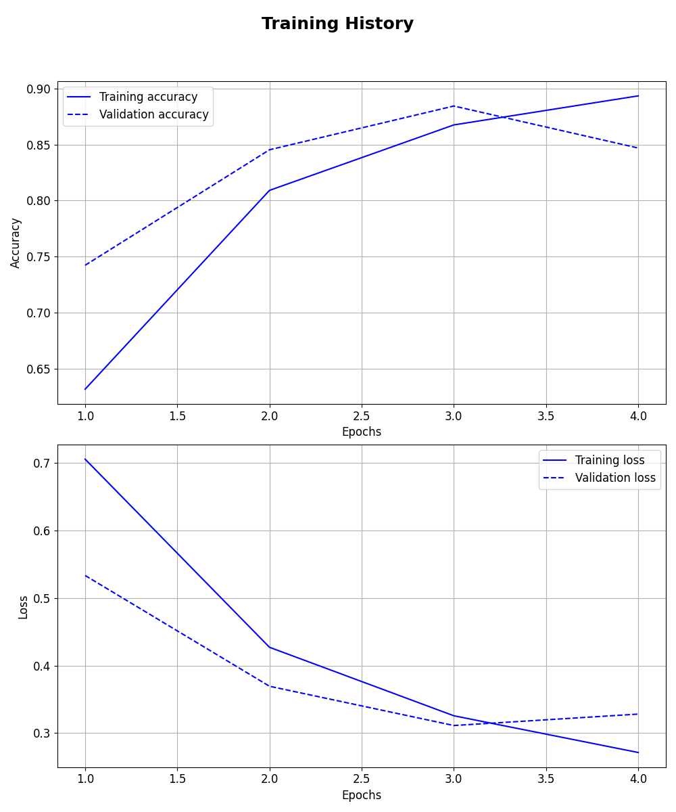

### Detailed Report of Test Set:

|              | precision    | recall       | f1-score     | support      |
| ------------ | ------------ | ------------ | ------------ | ------------ |
| chihuahua    | 0.7193       | 0.8218       | 0.7671       | 477          | 
| muffin       | 0.7557       | 0.6322       | 0.6885       | 416          | 
| micro avg    | 0.7335       | 0.7335       | 0.7335       | 893          | 
| macro avg    | 0.7375       | 0.7270       | 0.7278       | 893          | 
| weighted avg | 0.7363       | 0.7335       | 0.7305       | 893          | 
| samples avg  | 0.7335       | 0.7335       | 0.7335       | 893          | 

## trial_36

*    *Start Time*: 2024-10-17 15:54:20

*    *Duration*: 08.226

*    *Directory*: [Link](./trial_36)

### Hyperparameters:

| Hyperparameter        | Value                 |
| --------------------- | --------------------- |
| units1                | 64                    |
| kernel_size1          | 7                     |
| units2                | 128                   |
| kernel_size2          | 3                     |
| units3                | 512                   |
| learning_rate         | 0.0003987182947605584 |

### Evaluation Metrics:

|           | train     | val       | test      |
| --------- | --------- | --------- | --------- |
| accuracy  | 0.7494    | 0.7188    | 0.7312    | 
| precision | 0.7494    | 0.7188    | 0.7312    | 
| recall    | 0.7494    | 0.7188    | 0.7312    | 
| f1        | 0.7494    | 0.7187    | 0.7312    | 

### Figures:

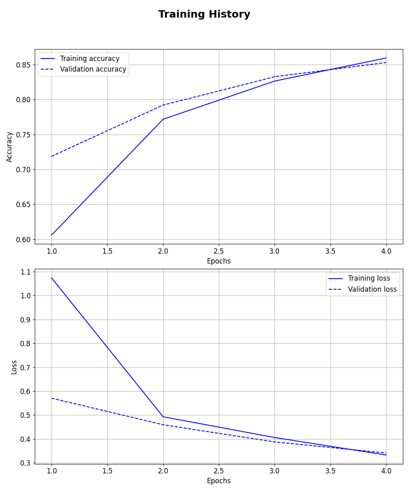

### Detailed Report of Test Set:

|              | precision    | recall       | f1-score     | support      |
| ------------ | ------------ | ------------ | ------------ | ------------ |
| chihuahua    | 0.7663       | 0.7149       | 0.7397       | 477          | 
| muffin       | 0.6964       | 0.7500       | 0.7222       | 416          | 
| micro avg    | 0.7312       | 0.7312       | 0.7312       | 893          | 
| macro avg    | 0.7314       | 0.7324       | 0.7310       | 893          | 
| weighted avg | 0.7337       | 0.7312       | 0.7316       | 893          | 
| samples avg  | 0.7312       | 0.7312       | 0.7312       | 893          | 

## trial_91

*    *Start Time*: 2024-10-17 16:32:15

*    *Duration*: 07.432

*    *Directory*: [Link](./trial_91)

### Hyperparameters:

| Hyperparameter         | Value                  |
| ---------------------- | ---------------------- |
| units1                 | 128                    |
| kernel_size1           | 3                      |
| units2                 | 128                    |
| kernel_size2           | 3                      |
| units3                 | 64                     |
| learning_rate          | 0.00032331022927089995 |

### Evaluation Metrics:

|           | train     | val       | test      |
| --------- | --------- | --------- | --------- |
| accuracy  | 0.7634    | 0.7312    | 0.7301    | 
| precision | 0.7634    | 0.7312    | 0.7301    | 
| recall    | 0.7634    | 0.7312    | 0.7301    | 
| f1        | 0.7634    | 0.7312    | 0.7301    | 

### Figures:

### Detailed Report of Test Set:

|              | precision    | recall       | f1-score     | support      |
| ------------ | ------------ | ------------ | ------------ | ------------ |
| chihuahua    | 0.7185       | 0.8134       | 0.7630       | 477          | 
| muffin       | 0.7479       | 0.6346       | 0.6866       | 416          | 
| micro avg    | 0.7301       | 0.7301       | 0.7301       | 893          | 
| macro avg    | 0.7332       | 0.7240       | 0.7248       | 893          | 
| weighted avg | 0.7322       | 0.7301       | 0.7274       | 893          | 
| samples avg  | 0.7301       | 0.7301       | 0.7301       | 893          | 

## trial_76

*    *Start Time*: 2024-10-17 15:59:30

*    *Duration*: 06.094

*    *Directory*: [Link](./trial_76)

### Hyperparameters:

| Hyperparameter         | Value                  |
| ---------------------- | ---------------------- |
| units1                 | 64                     |
| kernel_size1           | 3                      |
| units2                 | 128                    |
| kernel_size2           | 3                      |
| units3                 | 256                    |
| learning_rate          | 0.00024868154321260895 |

### Evaluation Metrics:

|           | train     | val       | test      |
| --------- | --------- | --------- | --------- |
| accuracy  | 0.7437    | 0.7141    | 0.7279    | 
| precision | 0.7437    | 0.7141    | 0.7279    | 
| recall    | 0.7437    | 0.7141    | 0.7279    | 
| f1        | 0.7437    | 0.7141    | 0.7279    | 

### Figures:

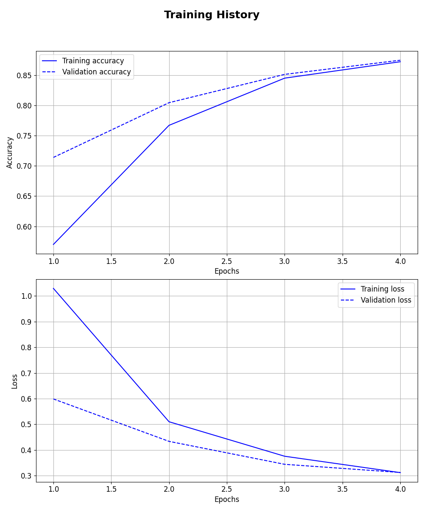

### Detailed Report of Test Set:

|              | precision    | recall       | f1-score     | support      |
| ------------ | ------------ | ------------ | ------------ | ------------ |
| chihuahua    | 0.7074       | 0.8365       | 0.7666       | 477          | 
| muffin       | 0.7629       | 0.6034       | 0.6738       | 416          | 
| micro avg    | 0.7279       | 0.7279       | 0.7279       | 893          | 
| macro avg    | 0.7352       | 0.7199       | 0.7202       | 893          | 
| weighted avg | 0.7333       | 0.7279       | 0.7234       | 893          | 
| samples avg  | 0.7279       | 0.7279       | 0.7279       | 893          | 

## trial_37

*    *Start Time*: 2024-10-17 15:54:28

*    *Duration*: 11.828

*    *Directory*: [Link](./trial_37)

### Hyperparameters:

| Hyperparameter        | Value                 |
| --------------------- | --------------------- |
| units1                | 128                   |
| kernel_size1          | 3                     |
| units2                | 128                   |
| kernel_size2          | 3                     |
| units3                | 128                   |
| learning_rate         | 0.0002839938973991679 |

### Evaluation Metrics:

|           | train     | val       | test      |
| --------- | --------- | --------- | --------- |
| accuracy  | 0.7353    | 0.7156    | 0.7268    | 
| precision | 0.7353    | 0.7156    | 0.7268    | 
| recall    | 0.7353    | 0.7156    | 0.7268    | 
| f1        | 0.7353    | 0.7156    | 0.7268    | 

### Figures:

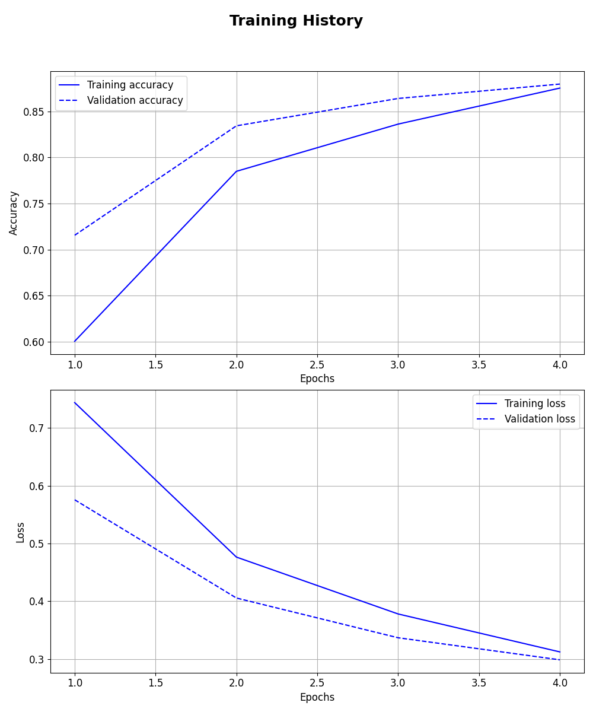

### Detailed Report of Test Set:

|              | precision    | recall       | f1-score     | support      |
| ------------ | ------------ | ------------ | ------------ | ------------ |
| chihuahua    | 0.7754       | 0.6876       | 0.7289       | 477          | 
| muffin       | 0.6830       | 0.7716       | 0.7246       | 416          | 
| micro avg    | 0.7268       | 0.7268       | 0.7268       | 893          | 
| macro avg    | 0.7292       | 0.7296       | 0.7267       | 893          | 
| weighted avg | 0.7324       | 0.7268       | 0.7269       | 893          | 
| samples avg  | 0.7268       | 0.7268       | 0.7268       | 893          | 

## trial_85

*    *Start Time*: 2024-10-17 16:31:28

*    *Duration*: 06.501

*    *Directory*: [Link](./trial_85)

### Hyperparameters:

| Hyperparameter         | Value                  |
| ---------------------- | ---------------------- |
| units1                 | 64                     |
| kernel_size1           | 3                      |
| units2                 | 128                    |
| kernel_size2           | 3                      |
| units3                 | 256                    |
| learning_rate          | 0.00022078356396309823 |

### Evaluation Metrics:

|           | train     | val       | test      |
| --------- | --------- | --------- | --------- |
| accuracy  | 0.7528    | 0.7281    | 0.7268    | 
| precision | 0.7528    | 0.7281    | 0.7268    | 
| recall    | 0.7528    | 0.7281    | 0.7268    | 
| f1        | 0.7528    | 0.7281    | 0.7268    | 

### Figures:

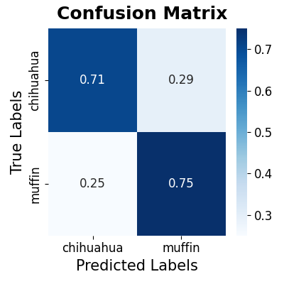

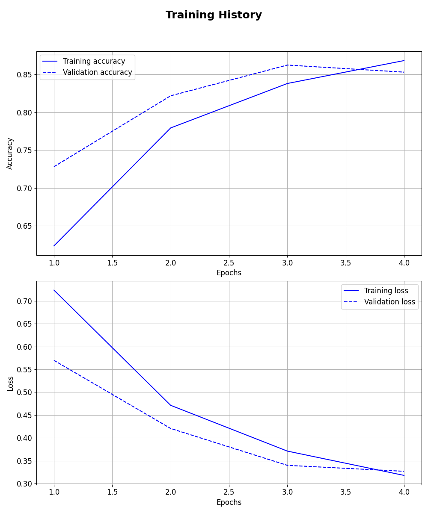

### Detailed Report of Test Set:

|              | precision    | recall       | f1-score     | support      |
| ------------ | ------------ | ------------ | ------------ | ------------ |
| chihuahua    | 0.7642       | 0.7065       | 0.7342       | 477          | 
| muffin       | 0.6903       | 0.7500       | 0.7189       | 416          | 
| micro avg    | 0.7268       | 0.7268       | 0.7268       | 893          | 
| macro avg    | 0.7272       | 0.7282       | 0.7265       | 893          | 
| weighted avg | 0.7297       | 0.7268       | 0.7271       | 893          | 
| samples avg  | 0.7268       | 0.7268       | 0.7268       | 893          | 

## trial_95

*    *Start Time*: 2024-10-17 16:32:41

*    *Duration*: 06.561

*    *Directory*: [Link](./trial_95)

### Hyperparameters:

| Hyperparameter         | Value                  |
| ---------------------- | ---------------------- |
| units1                 | 64                     |
| kernel_size1           | 3                      |
| units2                 | 128                    |
| kernel_size2           | 3                      |
| units3                 | 256                    |
| learning_rate          | 0.00028038671703303097 |

### Evaluation Metrics:

|           | train     | val       | test      |
| --------- | --------- | --------- | --------- |
| accuracy  | 0.7697    | 0.7469    | 0.7268    | 
| precision | 0.7697    | 0.7469    | 0.7268    | 
| recall    | 0.7697    | 0.7469    | 0.7268    | 
| f1        | 0.7697    | 0.7469    | 0.7268    | 

### Figures:

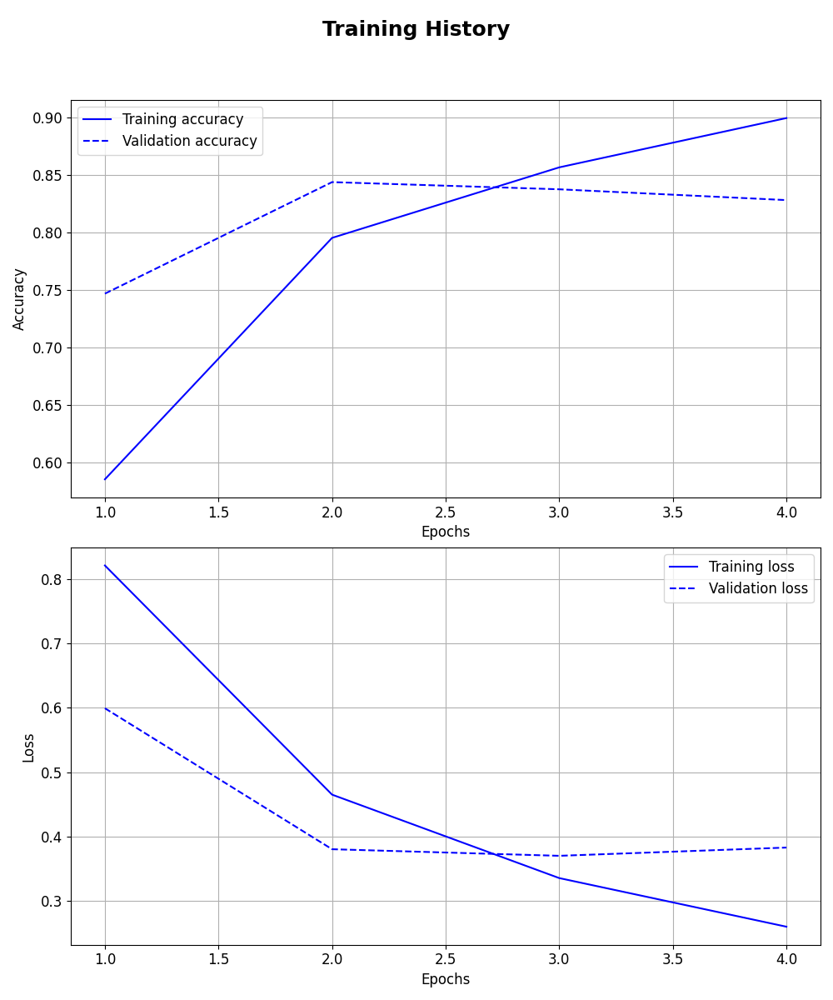

### Detailed Report of Test Set:

|              | precision    | recall       | f1-score     | support      |
| ------------ | ------------ | ------------ | ------------ | ------------ |
| chihuahua    | 0.7084       | 0.8302       | 0.7645       | 477          | 
| muffin       | 0.7575       | 0.6082       | 0.6747       | 416          | 
| micro avg    | 0.7268       | 0.7268       | 0.7268       | 893          | 
| macro avg    | 0.7329       | 0.7192       | 0.7196       | 893          | 
| weighted avg | 0.7313       | 0.7268       | 0.7226       | 893          | 
| samples avg  | 0.7268       | 0.7268       | 0.7268       | 893          | 

## trial_63

*    *Start Time*: 2024-10-17 15:58:00

*    *Duration*: 07.248

*    *Directory*: [Link](./trial_63)

### Hyperparameters:

| Hyperparameter         | Value                  |
| ---------------------- | ---------------------- |
| units1                 | 128                    |
| kernel_size1           | 3                      |
| units2                 | 128                    |
| kernel_size2           | 3                      |
| units3                 | 128                    |
| learning_rate          | 0.00016126259247999602 |

### Evaluation Metrics:

|           | train     | val       | test      |
| --------- | --------- | --------- | --------- |
| accuracy  | 0.7597    | 0.7250    | 0.7256    | 
| precision | 0.7597    | 0.7250    | 0.7256    | 
| recall    | 0.7597    | 0.7250    | 0.7256    | 
| f1        | 0.7597    | 0.7250    | 0.7256    | 

### Figures:

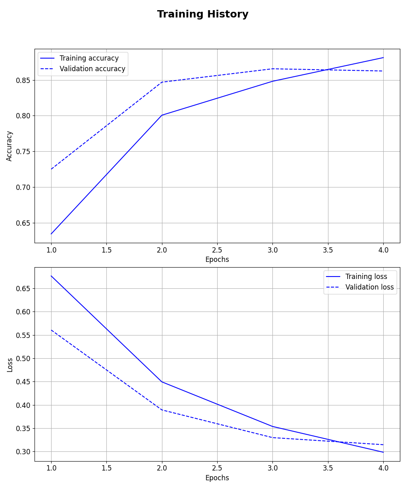

### Detailed Report of Test Set:

|              | precision    | recall       | f1-score     | support      |
| ------------ | ------------ | ------------ | ------------ | ------------ |
| chihuahua    | 0.7140       | 0.8113       | 0.7596       | 477          | 
| muffin       | 0.7436       | 0.6274       | 0.6806       | 416          | 
| micro avg    | 0.7256       | 0.7256       | 0.7256       | 893          | 
| macro avg    | 0.7288       | 0.7194       | 0.7201       | 893          | 
| weighted avg | 0.7278       | 0.7256       | 0.7228       | 893          | 
| samples avg  | 0.7256       | 0.7256       | 0.7256       | 893          | 

## trial_19

*    *Start Time*: 2024-10-17 15:52:17

*    *Duration*: 08.768

*    *Directory*: [Link](./trial_19)

### Hyperparameters:

| Hyperparameter         | Value                  |
| ---------------------- | ---------------------- |
| units1                 | 32                     |
| kernel_size1           | 3                      |
| units2                 | 128                    |
| kernel_size2           | 5                      |
| units3                 | 128                    |
| learning_rate          | 0.00013095820289496868 |

### Evaluation Metrics:

|           | train     | val       | test      |
| --------- | --------- | --------- | --------- |
| accuracy  | 0.7347    | 0.7266    | 0.7256    | 
| precision | 0.7347    | 0.7266    | 0.7256    | 
| recall    | 0.7347    | 0.7266    | 0.7256    | 
| f1        | 0.7347    | 0.7266    | 0.7256    | 

### Figures:

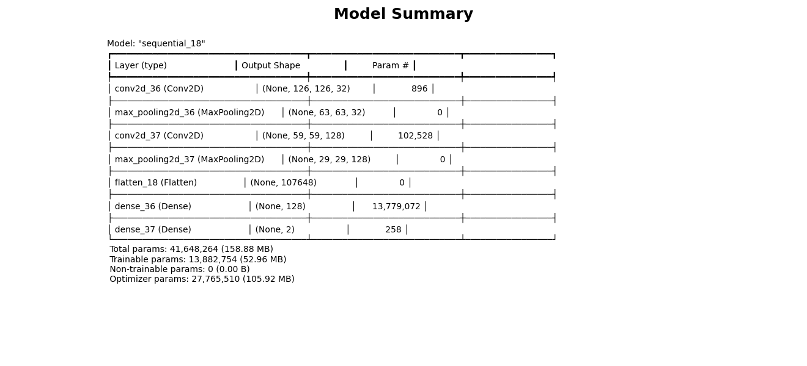

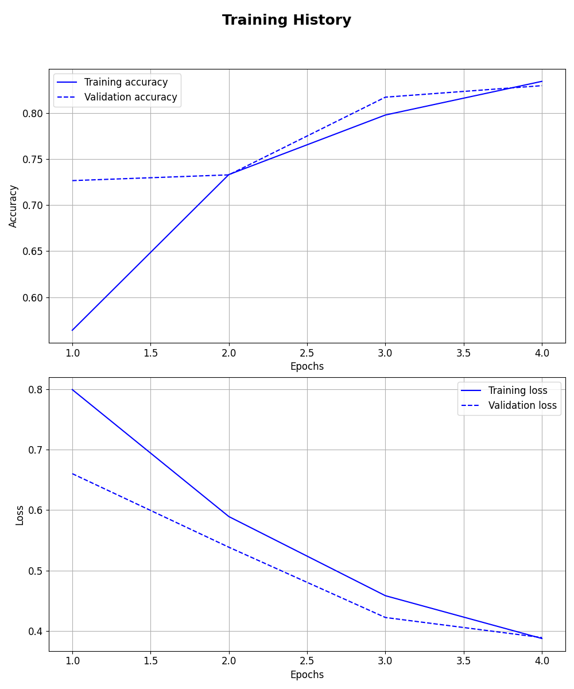

### Detailed Report of Test Set:

|              | precision    | recall       | f1-score     | support      |
| ------------ | ------------ | ------------ | ------------ | ------------ |
| chihuahua    | 0.8152       | 0.6289       | 0.7101       | 477          | 
| muffin       | 0.6629       | 0.8365       | 0.7396       | 416          | 
| micro avg    | 0.7256       | 0.7256       | 0.7256       | 893          | 
| macro avg    | 0.7390       | 0.7327       | 0.7248       | 893          | 
| weighted avg | 0.7442       | 0.7256       | 0.7238       | 893          | 
| samples avg  | 0.7256       | 0.7256       | 0.7256       | 893          | 

## trial_35

*    *Start Time*: 2024-10-17 15:54:13

*    *Duration*: 06.763

*    *Directory*: [Link](./trial_35)

### Hyperparameters:

| Hyperparameter       | Value                |
| -------------------- | -------------------- |
| units1               | 64                   |
| kernel_size1         | 3                    |
| units2               | 32                   |
| kernel_size2         | 3                    |
| units3               | 64                   |
| learning_rate        | 0.000677800198960521 |

### Evaluation Metrics:

|           | train     | val       | test      |
| --------- | --------- | --------- | --------- |
| accuracy  | 0.7462    | 0.7172    | 0.7245    | 
| precision | 0.7462    | 0.7172    | 0.7245    | 
| recall    | 0.7462    | 0.7172    | 0.7245    | 
| f1        | 0.7462    | 0.7172    | 0.7245    | 

### Figures:

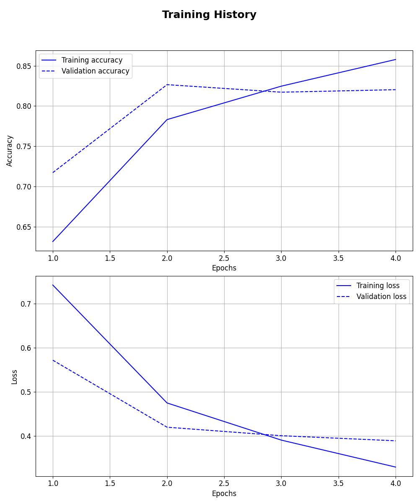

### Detailed Report of Test Set:

|              | precision    | recall       | f1-score     | support      |
| ------------ | ------------ | ------------ | ------------ | ------------ |
| chihuahua    | 0.7208       | 0.7904       | 0.7540       | 477          | 
| muffin       | 0.7297       | 0.6490       | 0.6870       | 416          | 
| micro avg    | 0.7245       | 0.7245       | 0.7245       | 893          | 
| macro avg    | 0.7253       | 0.7197       | 0.7205       | 893          | 
| weighted avg | 0.7250       | 0.7245       | 0.7228       | 893          | 
| samples avg  | 0.7245       | 0.7245       | 0.7245       | 893          | 

## trial_92

*    *Start Time*: 2024-10-17 16:32:22

*    *Duration*: 05.836

*    *Directory*: [Link](./trial_92)

### Hyperparameters:

| Hyperparameter         | Value                  |
| ---------------------- | ---------------------- |
| units1                 | 64                     |
| kernel_size1           | 3                      |
| units2                 | 128                    |
| kernel_size2           | 3                      |
| units3                 | 128                    |
| learning_rate          | 0.00035276246941701395 |

### Evaluation Metrics:

|           | train     | val       | test      |
| --------- | --------- | --------- | --------- |
| accuracy  | 0.7406    | 0.7000    | 0.7223    | 
| precision | 0.7406    | 0.7000    | 0.7223    | 
| recall    | 0.7406    | 0.7000    | 0.7223    | 
| f1        | 0.7406    | 0.7000    | 0.7223    | 

### Figures:

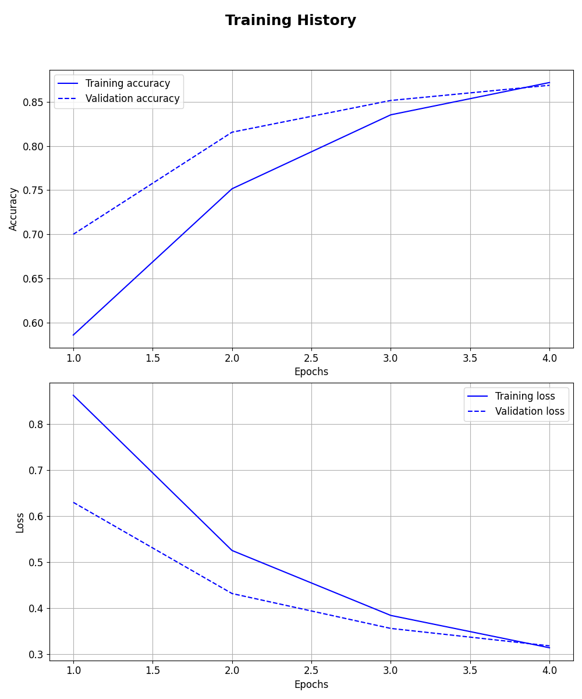

### Detailed Report of Test Set:

|              | precision    | recall       | f1-score     | support      |
| ------------ | ------------ | ------------ | ------------ | ------------ |
| chihuahua    | 0.7380       | 0.7442       | 0.7411       | 477          | 
| muffin       | 0.7039       | 0.6971       | 0.7005       | 416          | 
| micro avg    | 0.7223       | 0.7223       | 0.7223       | 893          | 
| macro avg    | 0.7210       | 0.7207       | 0.7208       | 893          | 
| weighted avg | 0.7221       | 0.7223       | 0.7222       | 893          | 
| samples avg  | 0.7223       | 0.7223       | 0.7223       | 893          | 

## trial_94

*    *Start Time*: 2024-10-17 16:32:35

*    *Duration*: 06.113

*    *Directory*: [Link](./trial_94)

### Hyperparameters:

| Hyperparameter         | Value                  |
| ---------------------- | ---------------------- |
| units1                 | 64                     |
| kernel_size1           | 3                      |
| units2                 | 128                    |
| kernel_size2           | 3                      |
| units3                 | 256                    |
| learning_rate          | 1.0223512892670772e-05 |

### Evaluation Metrics:

|           | train     | val       | test      |
| --------- | --------- | --------- | --------- |
| accuracy  | 0.7406    | 0.7047    | 0.7223    | 
| precision | 0.7406    | 0.7047    | 0.7223    | 
| recall    | 0.7406    | 0.7047    | 0.7223    | 
| f1        | 0.7406    | 0.7047    | 0.7223    | 

### Figures:

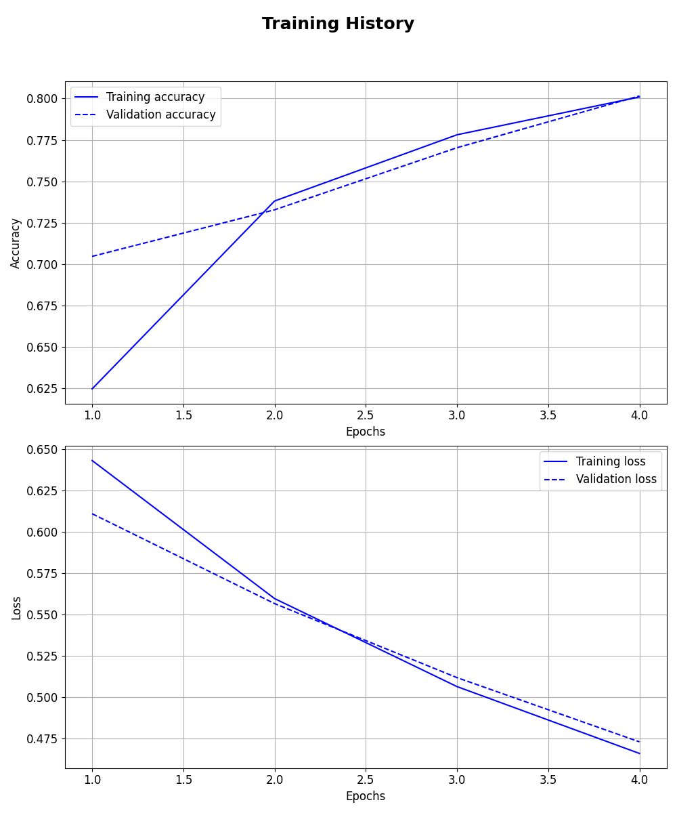

### Detailed Report of Test Set:

|              | precision    | recall       | f1-score     | support      |
| ------------ | ------------ | ------------ | ------------ | ------------ |
| chihuahua    | 0.7772       | 0.6730       | 0.7213       | 477          | 
| muffin       | 0.6750       | 0.7788       | 0.7232       | 416          | 
| micro avg    | 0.7223       | 0.7223       | 0.7223       | 893          | 
| macro avg    | 0.7261       | 0.7259       | 0.7223       | 893          | 
| weighted avg | 0.7296       | 0.7223       | 0.7222       | 893          | 
| samples avg  | 0.7223       | 0.7223       | 0.7223       | 893          | 

## trial_49

*    *Start Time*: 2024-10-17 15:56:08

*    *Duration*: 07.689

*    *Directory*: [Link](./trial_49)

### Hyperparameters:

| Hyperparameter        | Value                 |
| --------------------- | --------------------- |
| units1                | 128                   |
| kernel_size1          | 3                     |
| units2                | 64                    |
| kernel_size2          | 3                     |
| units3                | 256                   |
| learning_rate         | 7.844778656851386e-05 |

### Evaluation Metrics:

|           | train     | val       | test      |
| --------- | --------- | --------- | --------- |
| accuracy  | 0.7144    | 0.6875    | 0.7212    | 
| precision | 0.7144    | 0.6875    | 0.7212    | 
| recall    | 0.7144    | 0.6875    | 0.7212    | 
| f1        | 0.7144    | 0.6875    | 0.7212    | 

### Figures:

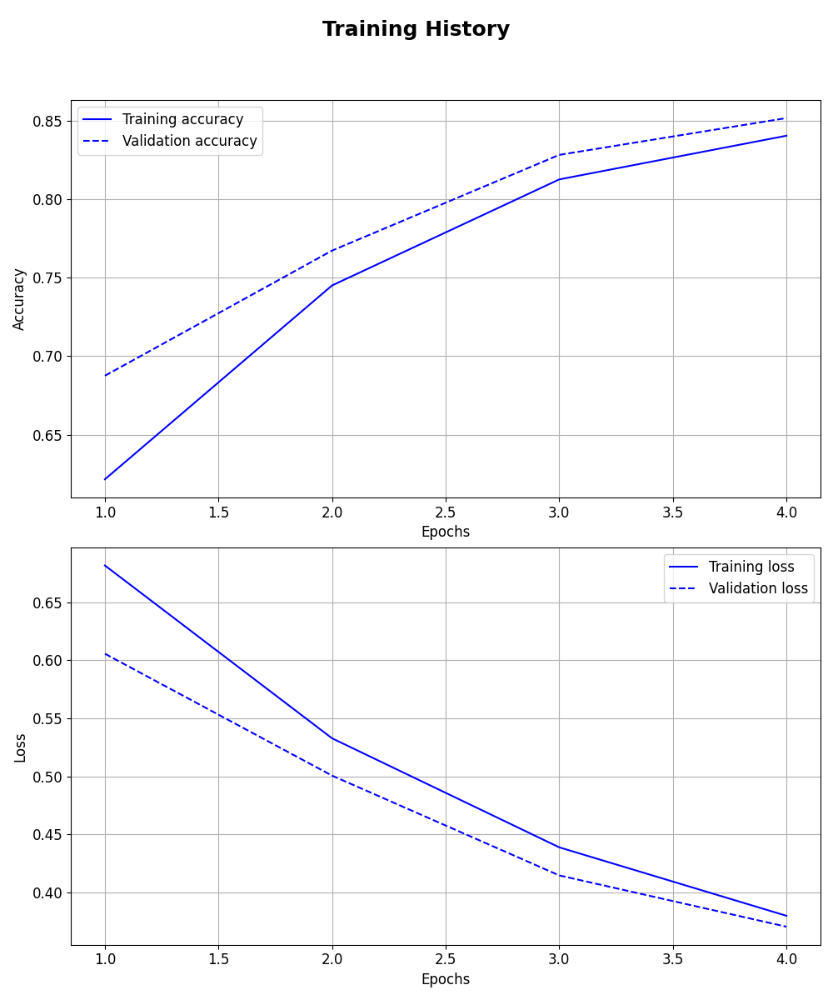

### Detailed Report of Test Set:

|              | precision    | recall       | f1-score     | support      |
| ------------ | ------------ | ------------ | ------------ | ------------ |
| chihuahua    | 0.7568       | 0.7044       | 0.7296       | 477          | 
| muffin       | 0.6860       | 0.7404       | 0.7121       | 416          | 
| micro avg    | 0.7212       | 0.7212       | 0.7212       | 893          | 
| macro avg    | 0.7214       | 0.7224       | 0.7209       | 893          | 
| weighted avg | 0.7238       | 0.7212       | 0.7215       | 893          | 
| samples avg  | 0.7212       | 0.7212       | 0.7212       | 893          | 

## trial_8

*    *Start Time*: 2024-10-17 15:50:41

*    *Duration*: 07.674

*    *Directory*: [Link](./trial_8)

### Hyperparameters:

| Hyperparameter         | Value                  |
| ---------------------- | ---------------------- |
| units1                 | 64                     |
| kernel_size1           | 7                      |
| units2                 | 16                     |
| kernel_size2           | 5                      |
| units3                 | 256                    |
| learning_rate          | 0.00012047457800162482 |

### Evaluation Metrics:

|           | train     | val       | test      |
| --------- | --------- | --------- | --------- |
| accuracy  | 0.7381    | 0.7078    | 0.7212    | 
| precision | 0.7381    | 0.7078    | 0.7212    | 
| recall    | 0.7381    | 0.7078    | 0.7212    | 
| f1        | 0.7381    | 0.7078    | 0.7212    | 

### Figures:

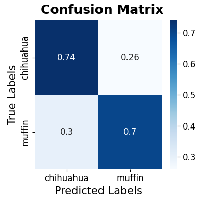

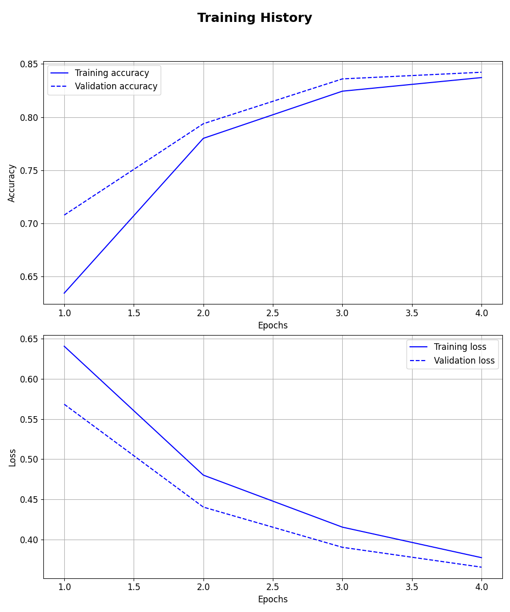

### Detailed Report of Test Set:

|              | precision    | recall       | f1-score     | support      |
| ------------ | ------------ | ------------ | ------------ | ------------ |
| chihuahua    | 0.7385       | 0.7400       | 0.7393       | 477          | 
| muffin       | 0.7012       | 0.6995       | 0.7004       | 416          | 
| micro avg    | 0.7212       | 0.7212       | 0.7212       | 893          | 
| macro avg    | 0.7198       | 0.7198       | 0.7198       | 893          | 
| weighted avg | 0.7211       | 0.7212       | 0.7211       | 893          | 
| samples avg  | 0.7212       | 0.7212       | 0.7212       | 893          | 

## trial_56

*    *Start Time*: 2024-10-17 15:57:02

*    *Duration*: 08.812

*    *Directory*: [Link](./trial_56)

### Hyperparameters:

| Hyperparameter        | Value                 |
| --------------------- | --------------------- |
| units1                | 128                   |
| kernel_size1          | 5                     |
| units2                | 128                   |
| kernel_size2          | 3                     |
| units3                | 256                   |
| learning_rate         | 0.0001396534626774623 |

### Evaluation Metrics:

|           | train     | val       | test      |
| --------- | --------- | --------- | --------- |
| accuracy  | 0.7047    | 0.6906    | 0.7200    | 
| precision | 0.7047    | 0.6906    | 0.7200    | 
| recall    | 0.7047    | 0.6906    | 0.7200    | 
| f1        | 0.7047    | 0.6906    | 0.7200    | 

### Figures:

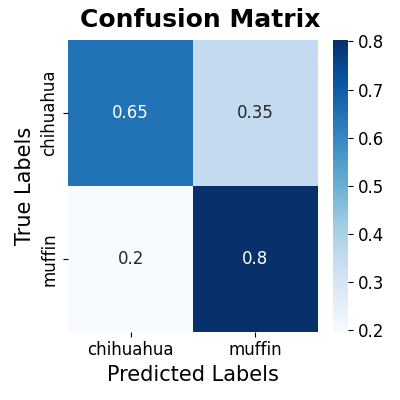

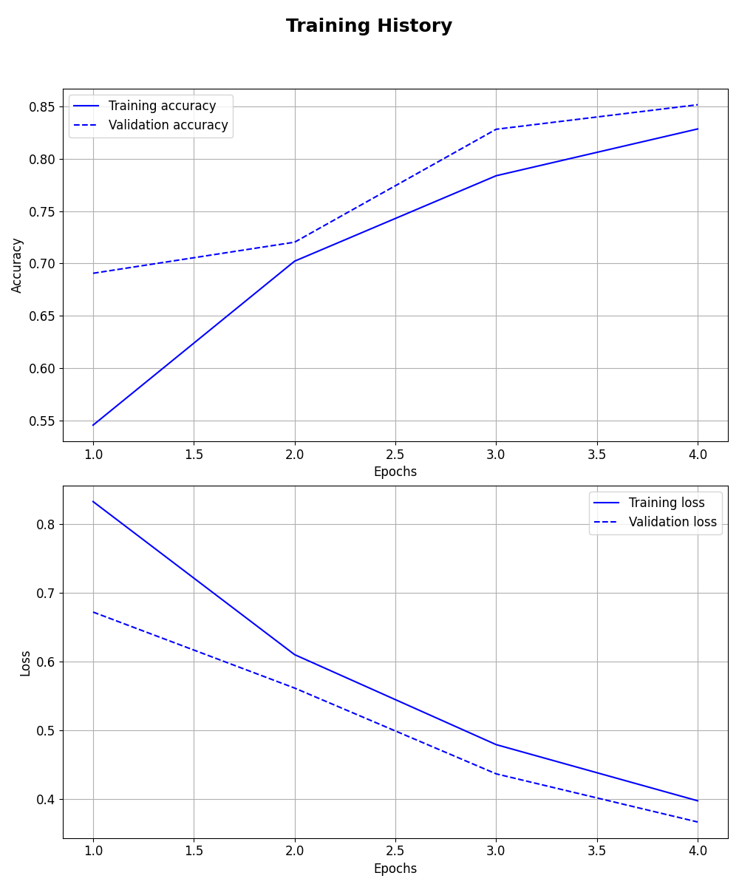

### Detailed Report of Test Set:

|              | precision    | recall       | f1-score     | support      |
| ------------ | ------------ | ------------ | ------------ | ------------ |
| chihuahua    | 0.7903       | 0.6478       | 0.7120       | 477          | 
| muffin       | 0.6653       | 0.8029       | 0.7277       | 416          | 
| micro avg    | 0.7200       | 0.7200       | 0.7200       | 893          | 
| macro avg    | 0.7278       | 0.7253       | 0.7198       | 893          | 
| weighted avg | 0.7321       | 0.7200       | 0.7193       | 893          | 
| samples avg  | 0.7200       | 0.7200       | 0.7200       | 893          | 

## trial_17

*    *Start Time*: 2024-10-17 15:52:01

*    *Duration*: 06.782

*    *Directory*: [Link](./trial_17)

### Hyperparameters:

| Hyperparameter         | Value                  |
| ---------------------- | ---------------------- |
| units1                 | 32                     |
| kernel_size1           | 5                      |
| units2                 | 64                     |
| kernel_size2           | 5                      |
| units3                 | 128                    |
| learning_rate          | 4.8505712459102725e-05 |

### Evaluation Metrics:

|           | train     | val       | test      |
| --------- | --------- | --------- | --------- |
| accuracy  | 0.7572    | 0.7297    | 0.7200    | 
| precision | 0.7572    | 0.7297    | 0.7200    | 
| recall    | 0.7572    | 0.7297    | 0.7200    | 
| f1        | 0.7572    | 0.7297    | 0.7200    | 

### Figures:

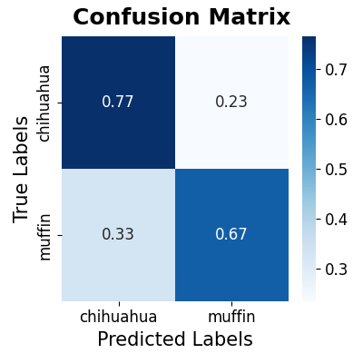

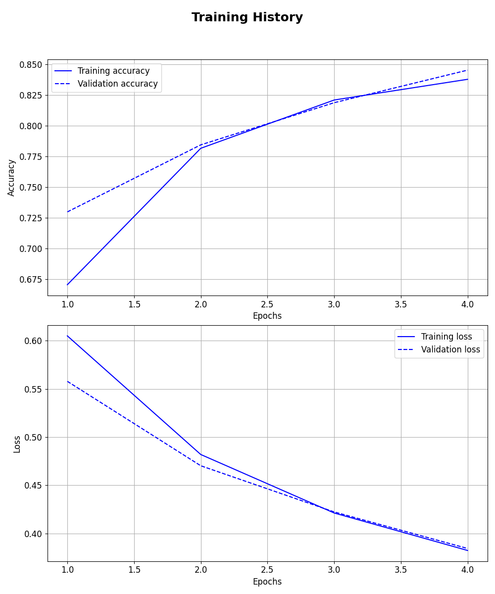

### Detailed Report of Test Set:

|              | precision    | recall       | f1-score     | support      |
| ------------ | ------------ | ------------ | ------------ | ------------ |
| chihuahua    | 0.7256       | 0.7652       | 0.7449       | 477          | 
| muffin       | 0.7128       | 0.6683       | 0.6898       | 416          | 
| micro avg    | 0.7200       | 0.7200       | 0.7200       | 893          | 
| macro avg    | 0.7192       | 0.7167       | 0.7174       | 893          | 
| weighted avg | 0.7197       | 0.7200       | 0.7192       | 893          | 
| samples avg  | 0.7200       | 0.7200       | 0.7200       | 893          | 

## trial_27

*    *Start Time*: 2024-10-17 15:53:15

*    *Duration*: 08.979

*    *Directory*: [Link](./trial_27)

### Hyperparameters:

| Hyperparameter         | Value                  |
| ---------------------- | ---------------------- |
| units1                 | 64                     |
| kernel_size1           | 5                      |
| units2                 | 64                     |
| kernel_size2           | 7                      |
| units3                 | 64                     |
| learning_rate          | 5.4223036824806075e-05 |

### Evaluation Metrics:

|           | train     | val       | test      |
| --------- | --------- | --------- | --------- |
| accuracy  | 0.7516    | 0.7188    | 0.7200    | 
| precision | 0.7516    | 0.7188    | 0.7200    | 
| recall    | 0.7516    | 0.7188    | 0.7200    | 
| f1        | 0.7516    | 0.7187    | 0.7200    | 

### Figures:

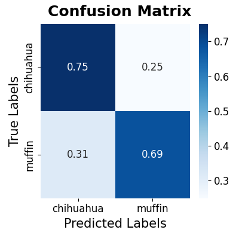

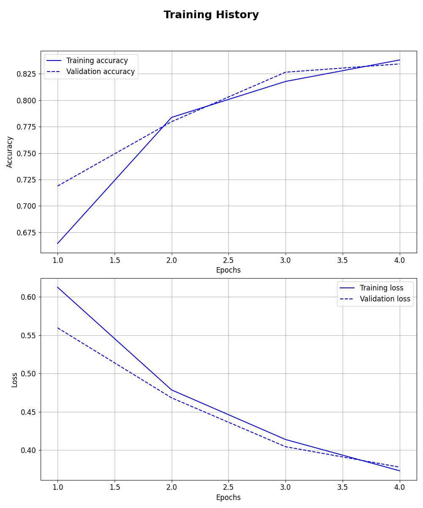

### Detailed Report of Test Set:

|              | precision    | recall       | f1-score     | support      |
| ------------ | ------------ | ------------ | ------------ | ------------ |
| chihuahua    | 0.7321       | 0.7505       | 0.7412       | 477          | 
| muffin       | 0.7054       | 0.6851       | 0.6951       | 416          | 
| micro avg    | 0.7200       | 0.7200       | 0.7200       | 893          | 
| macro avg    | 0.7188       | 0.7178       | 0.7182       | 893          | 
| weighted avg | 0.7197       | 0.7200       | 0.7197       | 893          | 
| samples avg  | 0.7200       | 0.7200       | 0.7200       | 893          | 

## trial_47

*    *Start Time*: 2024-10-17 15:55:52

*    *Duration*: 07.664

*    *Directory*: [Link](./trial_47)

### Hyperparameters:

| Hyperparameter         | Value                  |
| ---------------------- | ---------------------- |
| units1                 | 128                    |
| kernel_size1           | 3                      |
| units2                 | 128                    |
| kernel_size2           | 3                      |
| units3                 | 256                    |
| learning_rate          | 0.00014608714784216498 |

### Evaluation Metrics:

|           | train     | val       | test      |
| --------- | --------- | --------- | --------- |
| accuracy  | 0.7119    | 0.6891    | 0.7200    | 
| precision | 0.7119    | 0.6891    | 0.7200    | 
| recall    | 0.7119    | 0.6891    | 0.7200    | 
| f1        | 0.7119    | 0.6891    | 0.7200    | 

### Figures:

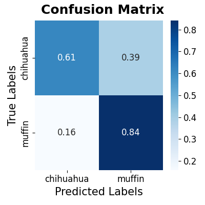

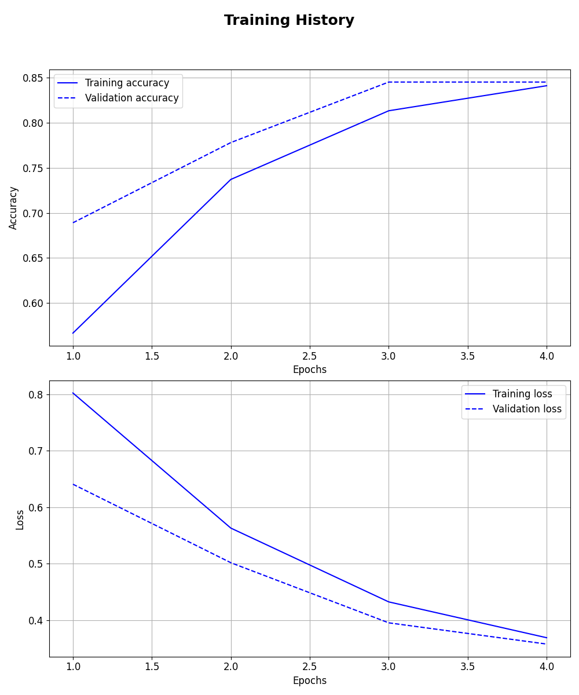

### Detailed Report of Test Set:

|              | precision    | recall       | f1-score     | support      |
| ------------ | ------------ | ------------ | ------------ | ------------ |
| chihuahua    | 0.8162       | 0.6143       | 0.7010       | 477          | 
| muffin       | 0.6554       | 0.8413       | 0.7368       | 416          | 
| micro avg    | 0.7200       | 0.7200       | 0.7200       | 893          | 
| macro avg    | 0.7358       | 0.7278       | 0.7189       | 893          | 
| weighted avg | 0.7413       | 0.7200       | 0.7177       | 893          | 
| samples avg  | 0.7200       | 0.7200       | 0.7200       | 893          | 

## trial_10

*    *Start Time*: 2024-10-17 15:51:05

*    *Duration*: 11.184

*    *Directory*: [Link](./trial_10)

### Hyperparameters:

| Hyperparameter         | Value                  |
| ---------------------- | ---------------------- |
| units1                 | 128                    |
| kernel_size1           | 7                      |
| units2                 | 128                    |
| kernel_size2           | 3                      |
| units3                 | 256                    |
| learning_rate          | 1.9170456638369927e-05 |

### Evaluation Metrics:

|           | train     | val       | test      |
| --------- | --------- | --------- | --------- |
| accuracy  | 0.7250    | 0.7094    | 0.7189    | 
| precision | 0.7250    | 0.7094    | 0.7189    | 
| recall    | 0.7250    | 0.7094    | 0.7189    | 
| f1        | 0.7250    | 0.7094    | 0.7189    | 

### Figures:

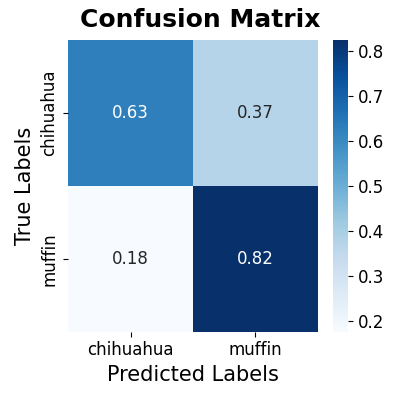

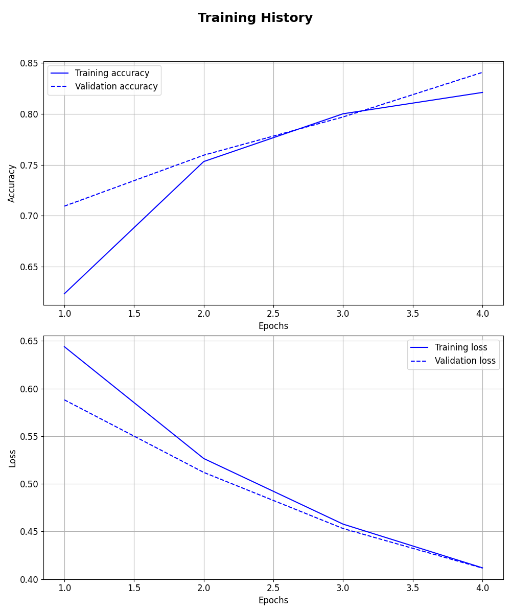

### Detailed Report of Test Set:

|              | precision    | recall       | f1-score     | support      |
| ------------ | ------------ | ------------ | ------------ | ------------ |
| chihuahua    | 0.8038       | 0.6268       | 0.7044       | 477          | 
| muffin       | 0.6583       | 0.8245       | 0.7321       | 416          | 
| micro avg    | 0.7189       | 0.7189       | 0.7189       | 893          | 
| macro avg    | 0.7311       | 0.7257       | 0.7182       | 893          | 
| weighted avg | 0.7360       | 0.7189       | 0.7173       | 893          | 
| samples avg  | 0.7189       | 0.7189       | 0.7189       | 893          | 

## trial_42

*    *Start Time*: 2024-10-17 15:55:13

*    *Duration*: 07.315

*    *Directory*: [Link](./trial_42)

### Hyperparameters:

| Hyperparameter        | Value                 |
| --------------------- | --------------------- |
| units1                | 128                   |
| kernel_size1          | 3                     |
| units2                | 128                   |
| kernel_size2          | 3                     |
| units3                | 128                   |
| learning_rate         | 0.0002854974396825062 |

### Evaluation Metrics:

|           | train     | val       | test      |
| --------- | --------- | --------- | --------- |
| accuracy  | 0.7491    | 0.7109    | 0.7167    | 
| precision | 0.7491    | 0.7109    | 0.7167    | 
| recall    | 0.7491    | 0.7109    | 0.7167    | 
| f1        | 0.7491    | 0.7109    | 0.7167    | 

### Figures:

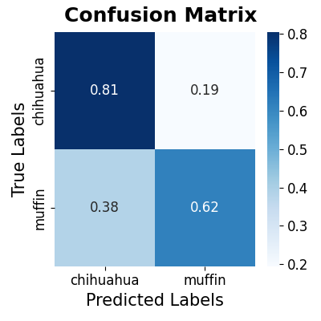

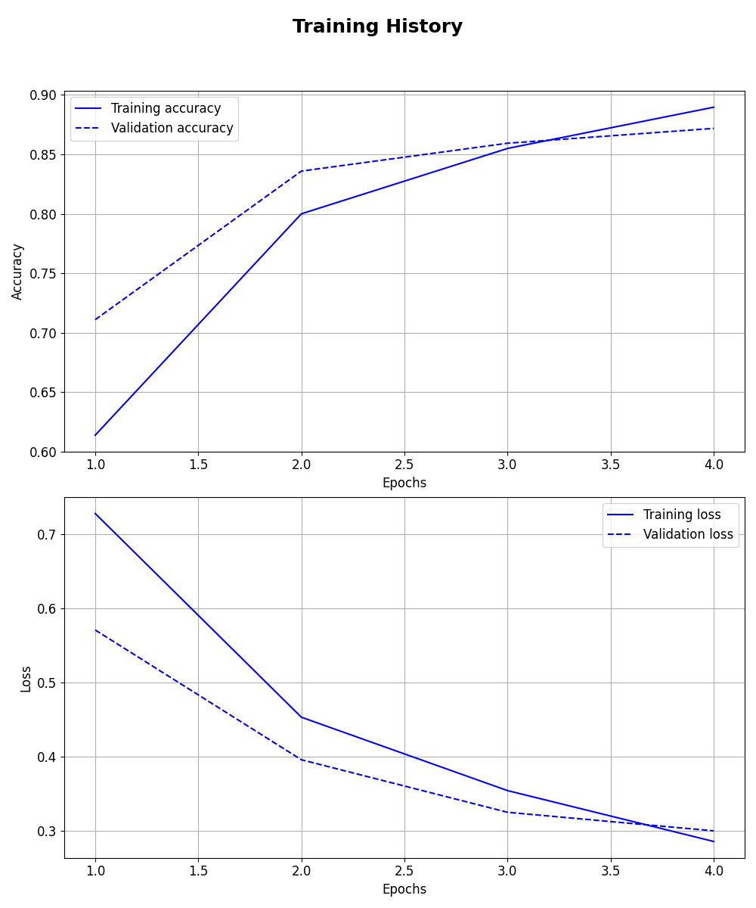

### Detailed Report of Test Set:

|              | precision    | recall       | f1-score     | support      |
| ------------ | ------------ | ------------ | ------------ | ------------ |
| chihuahua    | 0.7059       | 0.8050       | 0.7522       | 477          | 
| muffin       | 0.7335       | 0.6154       | 0.6693       | 416          | 
| micro avg    | 0.7167       | 0.7167       | 0.7167       | 893          | 
| macro avg    | 0.7197       | 0.7102       | 0.7107       | 893          | 
| weighted avg | 0.7188       | 0.7167       | 0.7136       | 893          | 
| samples avg  | 0.7167       | 0.7167       | 0.7167       | 893          | 

## trial_78

*    *Start Time*: 2024-10-17 16:30:39

*    *Duration*: 06.385

*    *Directory*: [Link](./trial_78)

### Hyperparameters:

| Hyperparameter        | Value                 |
| --------------------- | --------------------- |
| units1                | 64                    |
| kernel_size1          | 3                     |
| units2                | 128                   |
| kernel_size2          | 3                     |
| units3                | 128                   |
| learning_rate         | 0.0004663598902940522 |

### Evaluation Metrics:

|           | train     | val       | test      |
| --------- | --------- | --------- | --------- |
| accuracy  | 0.7206    | 0.6906    | 0.7144    | 
| precision | 0.7206    | 0.6906    | 0.7144    | 
| recall    | 0.7206    | 0.6906    | 0.7144    | 
| f1        | 0.7206    | 0.6906    | 0.7144    | 

### Figures:

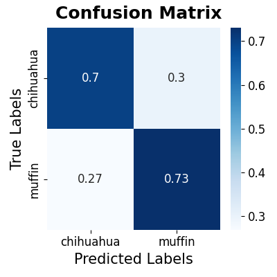

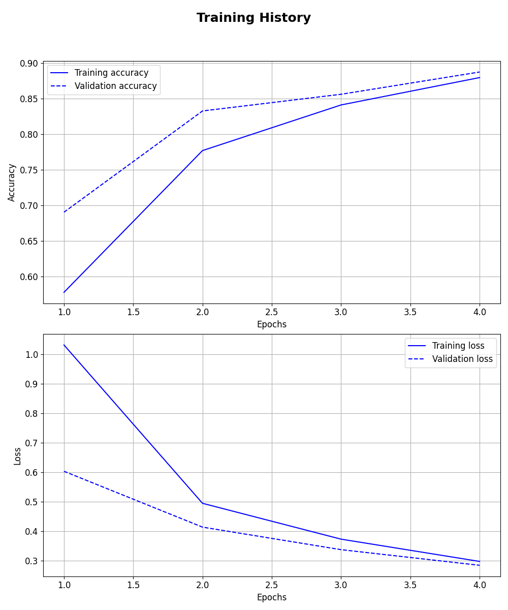

### Detailed Report of Test Set:

|              | precision    | recall       | f1-score     | support      |
| ------------ | ------------ | ------------ | ------------ | ------------ |
| chihuahua    | 0.7489       | 0.7002       | 0.7237       | 477          | 
| muffin       | 0.6801       | 0.7308       | 0.7045       | 416          | 
| micro avg    | 0.7144       | 0.7144       | 0.7144       | 893          | 
| macro avg    | 0.7145       | 0.7155       | 0.7141       | 893          | 
| weighted avg | 0.7168       | 0.7144       | 0.7148       | 893          | 
| samples avg  | 0.7144       | 0.7144       | 0.7144       | 893          | 

## trial_24

*    *Start Time*: 2024-10-17 15:52:56

*    *Duration*: 05.626

*    *Directory*: [Link](./trial_24)

### Hyperparameters:

| Hyperparameter        | Value                 |
| --------------------- | --------------------- |
| units1                | 16                    |
| kernel_size1          | 3                     |
| units2                | 128                   |
| kernel_size2          | 7                     |
| units3                | 128                   |
| learning_rate         | 0.0002494754820650141 |

### Evaluation Metrics:

|           | train     | val       | test      |
| --------- | --------- | --------- | --------- |
| accuracy  | 0.7503    | 0.7031    | 0.7133    | 
| precision | 0.7503    | 0.7031    | 0.7133    | 
| recall    | 0.7503    | 0.7031    | 0.7133    | 
| f1        | 0.7503    | 0.7031    | 0.7133    | 

### Figures:

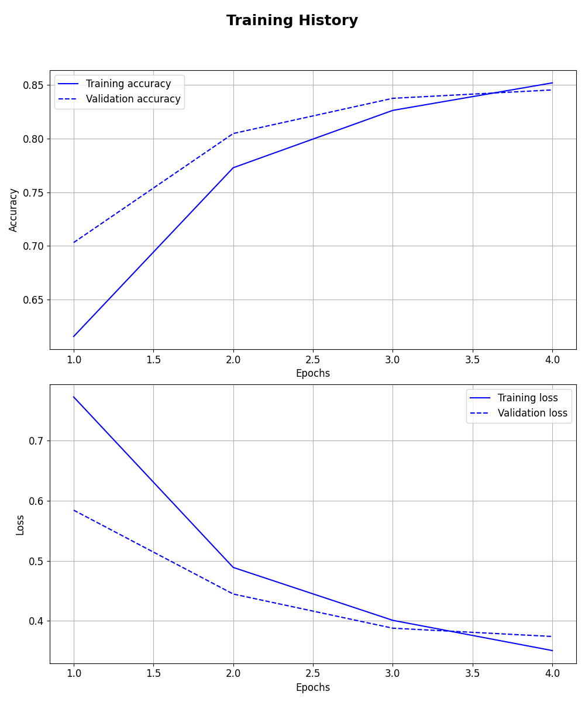

### Detailed Report of Test Set:

|              | precision    | recall       | f1-score     | support      |
| ------------ | ------------ | ------------ | ------------ | ------------ |
| chihuahua    | 0.7113       | 0.7799       | 0.7440       | 477          | 
| muffin       | 0.7162       | 0.6370       | 0.6743       | 416          | 
| micro avg    | 0.7133       | 0.7133       | 0.7133       | 893          | 
| macro avg    | 0.7137       | 0.7084       | 0.7092       | 893          | 
| weighted avg | 0.7136       | 0.7133       | 0.7115       | 893          | 
| samples avg  | 0.7133       | 0.7133       | 0.7133       | 893          | 

## trial_2

*    *Start Time*: 2024-10-17 15:49:28

*    *Duration*: 09.081

*    *Directory*: [Link](./trial_2)

### Hyperparameters:

| Hyperparameter         | Value                  |
| ---------------------- | ---------------------- |
| units1                 | 64                     |
| kernel_size1           | 7                      |
| units2                 | 64                     |
| kernel_size2           | 5                      |
| units3                 | 256                    |
| learning_rate          | 4.0433209401555656e-05 |

### Evaluation Metrics:

|           | train     | val       | test      |
| --------- | --------- | --------- | --------- |
| accuracy  | 0.7372    | 0.6969    | 0.7122    | 
| precision | 0.7372    | 0.6969    | 0.7122    | 
| recall    | 0.7372    | 0.6969    | 0.7122    | 
| f1        | 0.7372    | 0.6969    | 0.7122    | 

### Figures:

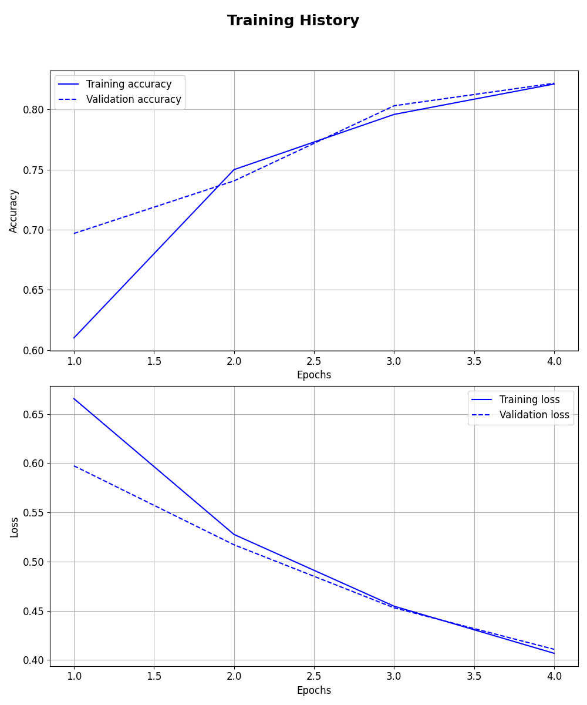

### Detailed Report of Test Set:

|              | precision    | recall       | f1-score     | support      |
| ------------ | ------------ | ------------ | ------------ | ------------ |
| chihuahua    | 0.7477       | 0.6960       | 0.7210       | 477          | 
| muffin       | 0.6771       | 0.7308       | 0.7029       | 416          | 
| micro avg    | 0.7122       | 0.7122       | 0.7122       | 893          | 
| macro avg    | 0.7124       | 0.7134       | 0.7119       | 893          | 
| weighted avg | 0.7148       | 0.7122       | 0.7125       | 893          | 
| samples avg  | 0.7122       | 0.7122       | 0.7122       | 893          | 

## trial_79

*    *Start Time*: 2024-10-17 16:30:45

*    *Duration*: 05.913

*    *Directory*: [Link](./trial_79)

### Hyperparameters:

| Hyperparameter         | Value                  |
| ---------------------- | ---------------------- |
| units1                 | 64                     |
| kernel_size1           | 3                      |
| units2                 | 128                    |
| kernel_size2           | 3                      |
| units3                 | 128                    |
| learning_rate          | 0.00045788205513930117 |

### Evaluation Metrics:

|           | train     | val       | test      |
| --------- | --------- | --------- | --------- |
| accuracy  | 0.7447    | 0.6969    | 0.7122    | 
| precision | 0.7447    | 0.6969    | 0.7122    | 
| recall    | 0.7447    | 0.6969    | 0.7122    | 
| f1        | 0.7447    | 0.6969    | 0.7122    | 

### Figures:

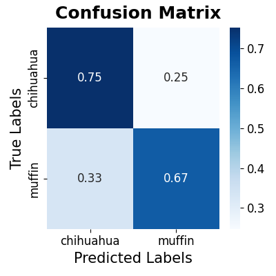

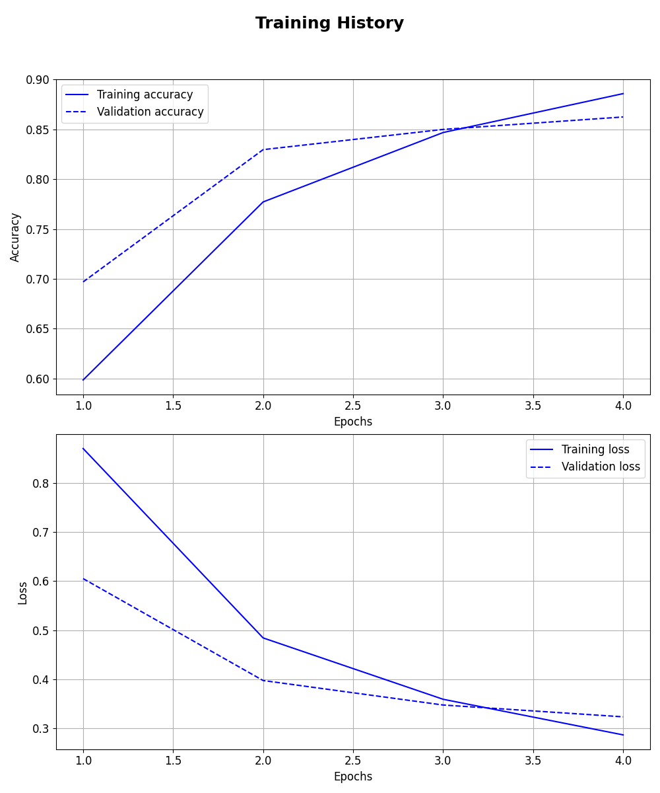

### Detailed Report of Test Set:

|              | precision    | recall       | f1-score     | support      |
| ------------ | ------------ | ------------ | ------------ | ------------ |
| chihuahua    | 0.7209       | 0.7526       | 0.7364       | 477          | 
| muffin       | 0.7013       | 0.6659       | 0.6831       | 416          | 
| micro avg    | 0.7122       | 0.7122       | 0.7122       | 893          | 
| macro avg    | 0.7111       | 0.7092       | 0.7098       | 893          | 
| weighted avg | 0.7117       | 0.7122       | 0.7116       | 893          | 
| samples avg  | 0.7122       | 0.7122       | 0.7122       | 893          | 

## trial_4

*    *Start Time*: 2024-10-17 15:49:57

*    *Duration*: 16.933

*    *Directory*: [Link](./trial_4)

### Hyperparameters:

| Hyperparameter        | Value                 |
| --------------------- | --------------------- |
| units1                | 128                   |
| kernel_size1          | 7                     |
| units2                | 128                   |
| kernel_size2          | 5                     |
| units3                | 512                   |
| learning_rate         | 6.565826339211449e-05 |

### Evaluation Metrics:

|           | train     | val       | test      |
| --------- | --------- | --------- | --------- |
| accuracy  | 0.7369    | 0.6984    | 0.7055    | 
| precision | 0.7369    | 0.6984    | 0.7055    | 
| recall    | 0.7369    | 0.6984    | 0.7055    | 
| f1        | 0.7369    | 0.6984    | 0.7055    | 

### Figures:

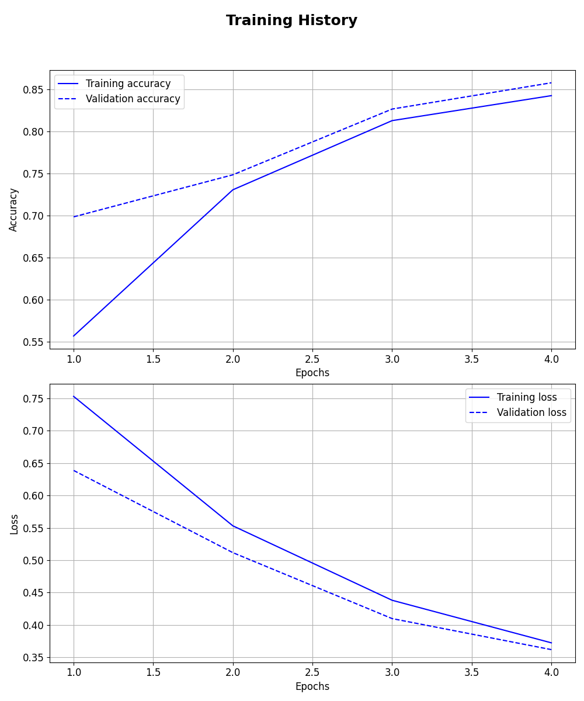

### Detailed Report of Test Set:

|              | precision    | recall       | f1-score     | support      |
| ------------ | ------------ | ------------ | ------------ | ------------ |
| chihuahua    | 0.7229       | 0.7275       | 0.7252       | 477          | 
| muffin       | 0.6852       | 0.6803       | 0.6828       | 416          | 
| micro avg    | 0.7055       | 0.7055       | 0.7055       | 893          | 
| macro avg    | 0.7041       | 0.7039       | 0.7040       | 893          | 
| weighted avg | 0.7054       | 0.7055       | 0.7054       | 893          | 
| samples avg  | 0.7055       | 0.7055       | 0.7055       | 893          | 

## trial_82

*    *Start Time*: 2024-10-17 16:31:07

*    *Duration*: 05.866

*    *Directory*: [Link](./trial_82)

### Hyperparameters:

| Hyperparameter         | Value                  |
| ---------------------- | ---------------------- |
| units1                 | 64                     |
| kernel_size1           | 3                      |
| units2                 | 128                    |
| kernel_size2           | 3                      |
| units3                 | 128                    |
| learning_rate          | 0.00033911127270496247 |

### Evaluation Metrics:

|           | train     | val       | test      |
| --------- | --------- | --------- | --------- |
| accuracy  | 0.7353    | 0.6781    | 0.7055    | 
| precision | 0.7353    | 0.6781    | 0.7055    | 
| recall    | 0.7353    | 0.6781    | 0.7055    | 
| f1        | 0.7353    | 0.6781    | 0.7055    | 

### Figures:

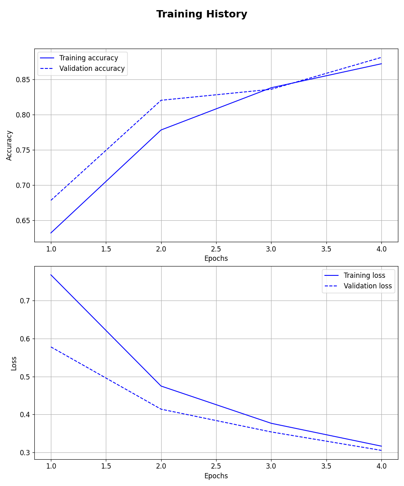

### Detailed Report of Test Set:

|              | precision    | recall       | f1-score     | support      |
| ------------ | ------------ | ------------ | ------------ | ------------ |
| chihuahua    | 0.6953       | 0.7987       | 0.7434       | 477          | 
| muffin       | 0.7217       | 0.5986       | 0.6544       | 416          | 
| micro avg    | 0.7055       | 0.7055       | 0.7055       | 893          | 
| macro avg    | 0.7085       | 0.6986       | 0.6989       | 893          | 
| weighted avg | 0.7076       | 0.7055       | 0.7019       | 893          | 
| samples avg  | 0.7055       | 0.7055       | 0.7055       | 893          | 

## trial_13

*    *Start Time*: 2024-10-17 15:51:29

*    *Duration*: 05.909

*    *Directory*: [Link](./trial_13)

### Hyperparameters:

| Hyperparameter         | Value                  |
| ---------------------- | ---------------------- |
| units1                 | 16                     |
| kernel_size1           | 3                      |
| units2                 | 128                    |
| kernel_size2           | 7                      |
| units3                 | 32                     |
| learning_rate          | 0.00032161729701391266 |

### Evaluation Metrics:

|           | train     | val       | test      |
| --------- | --------- | --------- | --------- |
| accuracy  | 0.7275    | 0.6891    | 0.7021    | 
| precision | 0.7275    | 0.6891    | 0.7021    | 
| recall    | 0.7275    | 0.6891    | 0.7021    | 
| f1        | 0.7275    | 0.6891    | 0.7021    | 

### Figures:

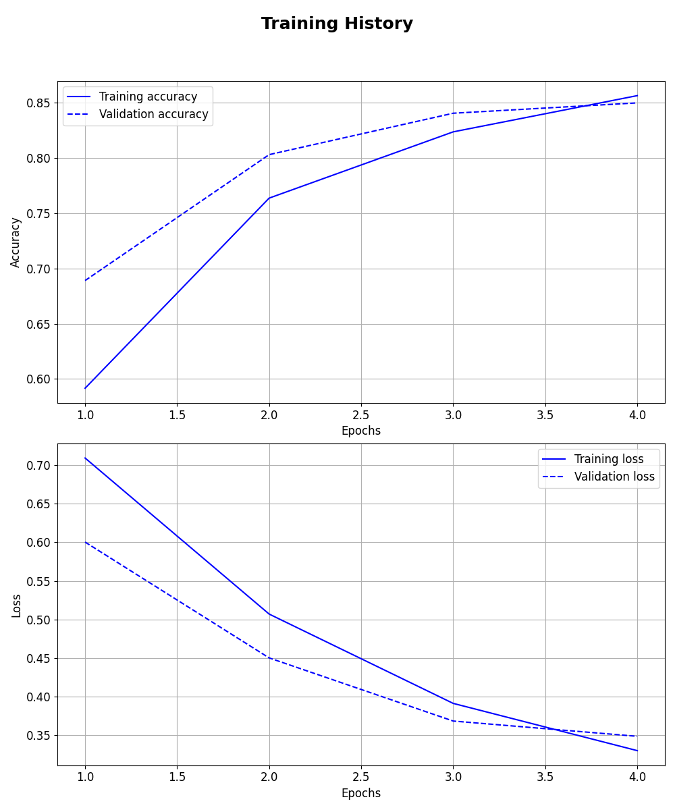

### Detailed Report of Test Set:

|              | precision    | recall       | f1-score     | support      |
| ------------ | ------------ | ------------ | ------------ | ------------ |
| chihuahua    | 0.7049       | 0.7610       | 0.7319       | 477          | 
| muffin       | 0.6984       | 0.6346       | 0.6650       | 416          | 
| micro avg    | 0.7021       | 0.7021       | 0.7021       | 893          | 
| macro avg    | 0.7016       | 0.6978       | 0.6984       | 893          | 
| weighted avg | 0.7019       | 0.7021       | 0.7007       | 893          | 
| samples avg  | 0.7021       | 0.7021       | 0.7021       | 893          | 

## trial_20

*    *Start Time*: 2024-10-17 15:52:26

*    *Duration*: 07.372

*    *Directory*: [Link](./trial_20)

### Hyperparameters:

| Hyperparameter         | Value                  |
| ---------------------- | ---------------------- |
| units1                 | 64                     |
| kernel_size1           | 5                      |
| units2                 | 16                     |
| kernel_size2           | 5                      |
| units3                 | 128                    |
| learning_rate          | 0.00015967975309033632 |

### Evaluation Metrics:

|           | train     | val       | test      |
| --------- | --------- | --------- | --------- |
| accuracy  | 0.7209    | 0.6938    | 0.6999    | 
| precision | 0.7209    | 0.6938    | 0.6999    | 
| recall    | 0.7209    | 0.6938    | 0.6999    | 
| f1        | 0.7209    | 0.6937    | 0.6999    | 

### Figures:

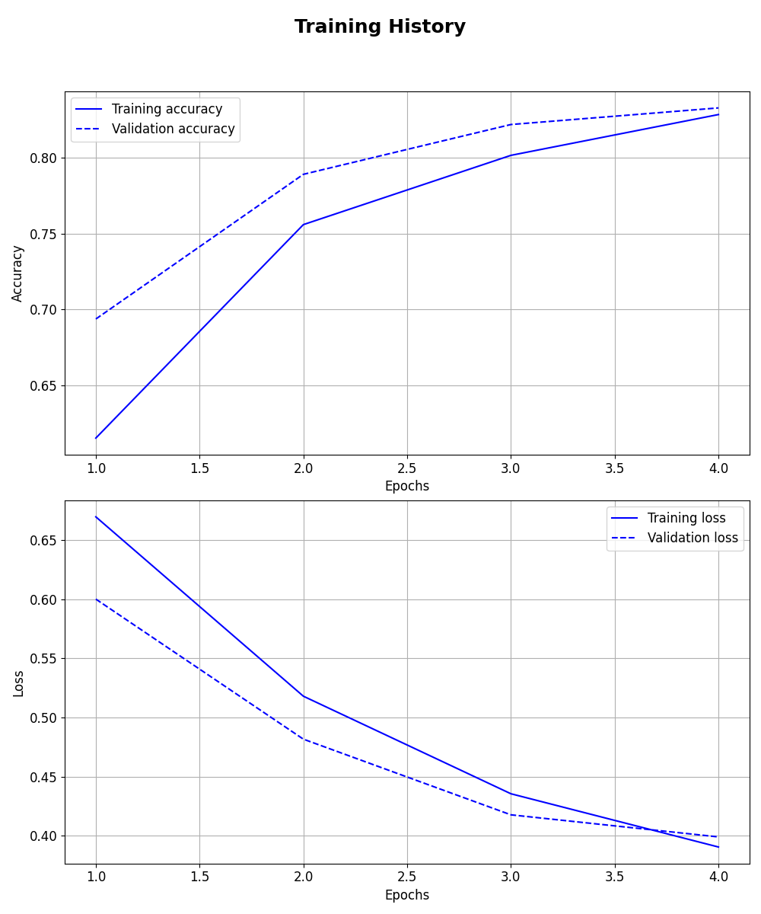

### Detailed Report of Test Set:

|              | precision    | recall       | f1-score     | support      |
| ------------ | ------------ | ------------ | ------------ | ------------ |
| chihuahua    | 0.7146       | 0.7296       | 0.7220       | 477          | 
| muffin       | 0.6823       | 0.6659       | 0.6740       | 416          | 
| micro avg    | 0.6999       | 0.6999       | 0.6999       | 893          | 
| macro avg    | 0.6984       | 0.6977       | 0.6980       | 893          | 
| weighted avg | 0.6995       | 0.6999       | 0.6996       | 893          | 
| samples avg  | 0.6999       | 0.6999       | 0.6999       | 893          | 

## trial_29

*    *Start Time*: 2024-10-17 15:53:31

*    *Duration*: 06.855

*    *Directory*: [Link](./trial_29)

### Hyperparameters:

| Hyperparameter        | Value                 |
| --------------------- | --------------------- |
| units1                | 32                    |
| kernel_size1          | 5                     |
| units2                | 128                   |
| kernel_size2          | 3                     |
| units3                | 32                    |
| learning_rate         | 0.0006457083952806414 |

### Evaluation Metrics:

|           | train     | val       | test      |
| --------- | --------- | --------- | --------- |
| accuracy  | 0.7356    | 0.6859    | 0.6999    | 
| precision | 0.7356    | 0.6859    | 0.6999    | 
| recall    | 0.7356    | 0.6859    | 0.6999    | 
| f1        | 0.7356    | 0.6859    | 0.6999    | 

### Figures:

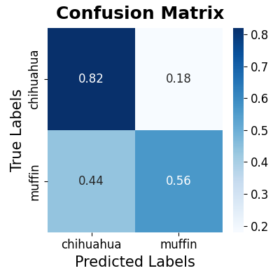

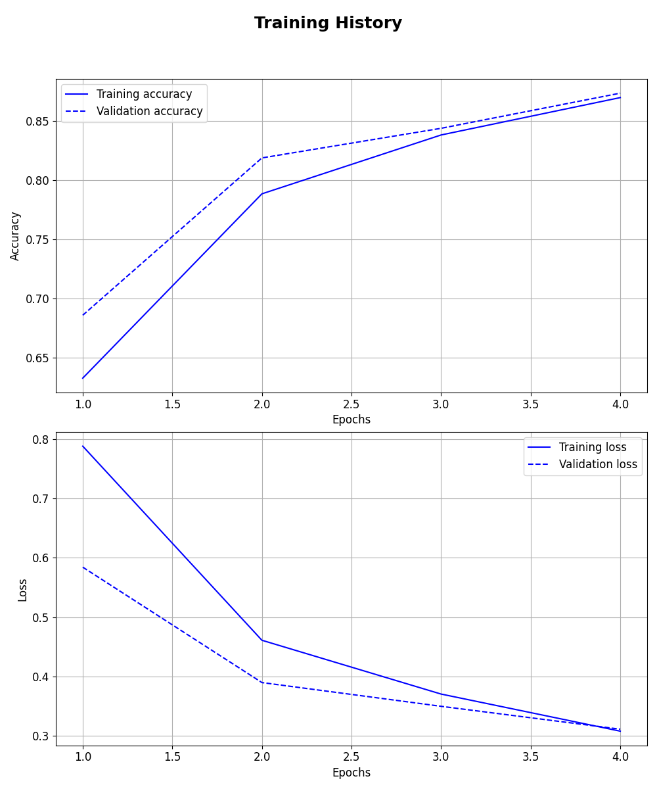

### Detailed Report of Test Set:

|              | precision    | recall       | f1-score     | support      |
| ------------ | ------------ | ------------ | ------------ | ------------ |
| chihuahua    | 0.6824       | 0.8197       | 0.7448       | 477          | 
| muffin       | 0.7312       | 0.5625       | 0.6359       | 416          | 
| micro avg    | 0.6999       | 0.6999       | 0.6999       | 893          | 
| macro avg    | 0.7068       | 0.6911       | 0.6903       | 893          | 
| weighted avg | 0.7051       | 0.6999       | 0.6940       | 893          | 
| samples avg  | 0.6999       | 0.6999       | 0.6999       | 893          | 

## trial_61

*    *Start Time*: 2024-10-17 15:57:46

*    *Duration*: 07.632

*    *Directory*: [Link](./trial_61)

### Hyperparameters:

| Hyperparameter         | Value                  |
| ---------------------- | ---------------------- |
| units1                 | 128                    |
| kernel_size1           | 5                      |
| units2                 | 128                    |
| kernel_size2           | 3                      |
| units3                 | 256                    |
| learning_rate          | 0.00010472037317929656 |

### Evaluation Metrics:

|           | train     | val       | test      |
| --------- | --------- | --------- | --------- |
| accuracy  | 0.7216    | 0.6859    | 0.6988    | 
| precision | 0.7216    | 0.6859    | 0.6988    | 
| recall    | 0.7216    | 0.6859    | 0.6988    | 
| f1        | 0.7216    | 0.6859    | 0.6988    | 

### Figures:

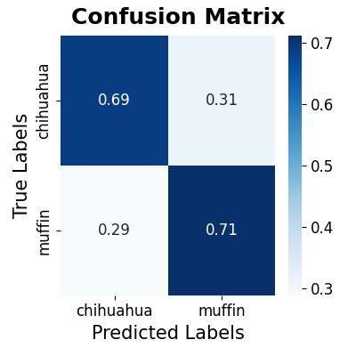

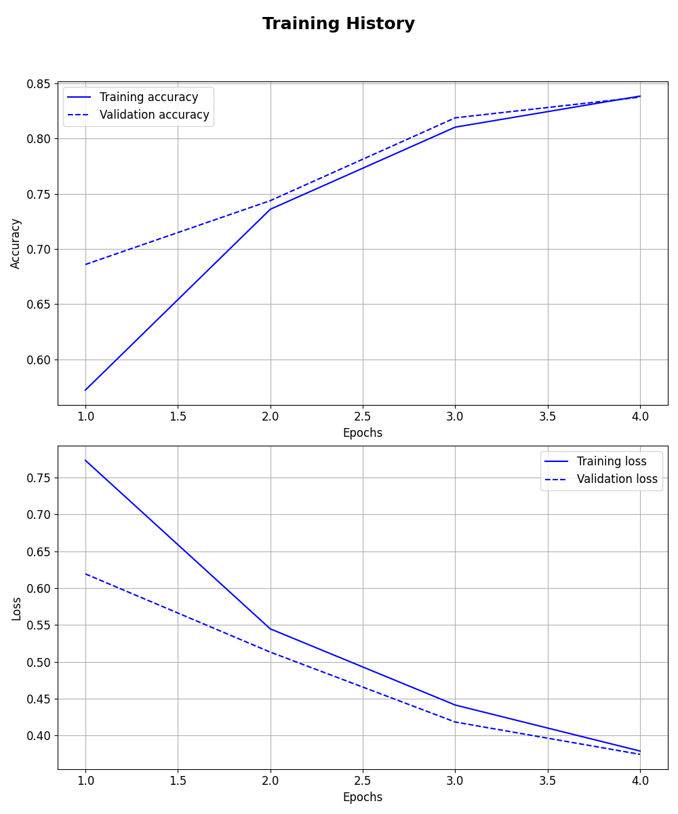

### Detailed Report of Test Set:

|              | precision    | recall       | f1-score     | support      |
| ------------ | ------------ | ------------ | ------------ | ------------ |
| chihuahua    | 0.7321       | 0.6876       | 0.7092       | 477          | 
| muffin       | 0.6652       | 0.7115       | 0.6876       | 416          | 
| micro avg    | 0.6988       | 0.6988       | 0.6988       | 893          | 
| macro avg    | 0.6987       | 0.6996       | 0.6984       | 893          | 
| weighted avg | 0.7009       | 0.6988       | 0.6991       | 893          | 
| samples avg  | 0.6988       | 0.6988       | 0.6988       | 893          | 

## trial_39

*    *Start Time*: 2024-10-17 15:54:50

*    *Duration*: 07.977

*    *Directory*: [Link](./trial_39)

### Hyperparameters:

| Hyperparameter         | Value                  |
| ---------------------- | ---------------------- |
| units1                 | 128                    |
| kernel_size1           | 7                      |
| units2                 | 128                    |
| kernel_size2           | 3                      |
| units3                 | 256                    |
| learning_rate          | 0.00018423306140546416 |

### Evaluation Metrics:

|           | train     | val       | test      |
| --------- | --------- | --------- | --------- |
| accuracy  | 0.7350    | 0.6875    | 0.6988    | 
| precision | 0.7350    | 0.6875    | 0.6988    | 
| recall    | 0.7350    | 0.6875    | 0.6988    | 
| f1        | 0.7350    | 0.6875    | 0.6988    | 

### Figures:

### Detailed Report of Test Set:

|              | precision    | recall       | f1-score     | support      |
| ------------ | ------------ | ------------ | ------------ | ------------ |
| chihuahua    | 0.6831       | 0.8134       | 0.7426       | 477          | 
| muffin       | 0.7262       | 0.5673       | 0.6370       | 416          | 
| micro avg    | 0.6988       | 0.6988       | 0.6988       | 893          | 
| macro avg    | 0.7046       | 0.6904       | 0.6898       | 893          | 
| weighted avg | 0.7032       | 0.6988       | 0.6934       | 893          | 
| samples avg  | 0.6988       | 0.6988       | 0.6988       | 893          | 

## trial_43

*    *Start Time*: 2024-10-17 15:55:20

*    *Duration*: 08.052

*    *Directory*: [Link](./trial_43)

### Hyperparameters:

| Hyperparameter         | Value                  |
| ---------------------- | ---------------------- |
| units1                 | 128                    |
| kernel_size1           | 3                      |
| units2                 | 128                    |
| kernel_size2           | 3                      |
| units3                 | 512                    |
| learning_rate          | 0.00045932636459172023 |

### Evaluation Metrics:

|           | train     | val       | test      |
| --------- | --------- | --------- | --------- |
| accuracy  | 0.7369    | 0.6812    | 0.6988    | 
| precision | 0.7369    | 0.6812    | 0.6988    | 
| recall    | 0.7369    | 0.6812    | 0.6988    | 
| f1        | 0.7369    | 0.6812    | 0.6988    | 

### Figures:

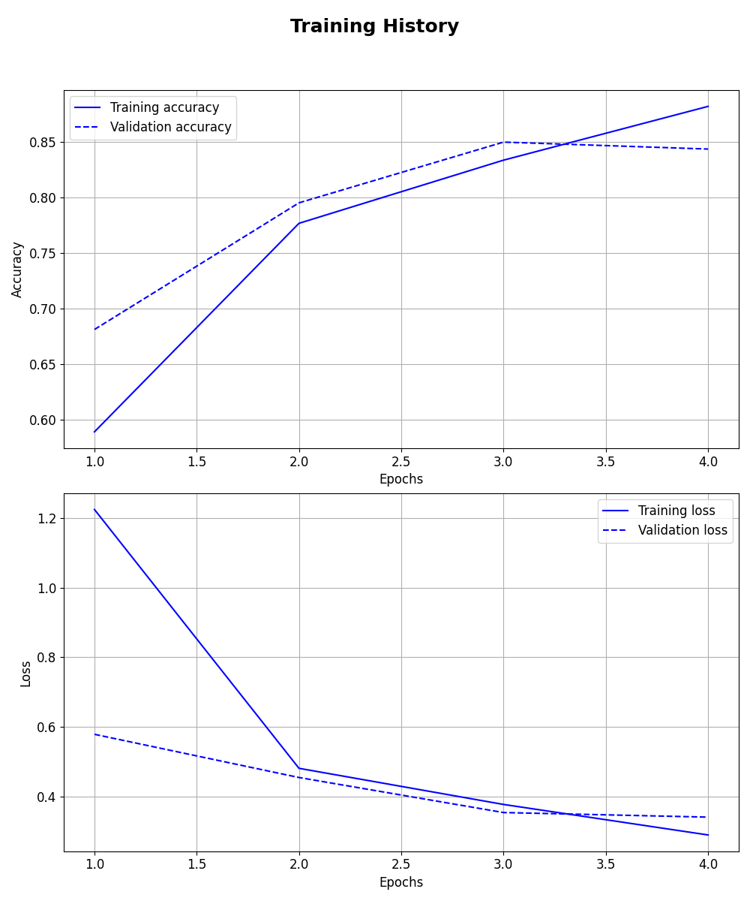

### Detailed Report of Test Set:

|              | precision    | recall       | f1-score     | support      |
| ------------ | ------------ | ------------ | ------------ | ------------ |
| chihuahua    | 0.6884       | 0.7966       | 0.7386       | 477          | 
| muffin       | 0.7155       | 0.5865       | 0.6446       | 416          | 
| micro avg    | 0.6988       | 0.6988       | 0.6988       | 893          | 
| macro avg    | 0.7020       | 0.6916       | 0.6916       | 893          | 
| weighted avg | 0.7010       | 0.6988       | 0.6948       | 893          | 
| samples avg  | 0.6988       | 0.6988       | 0.6988       | 893          | 

## trial_32

*    *Start Time*: 2024-10-17 15:53:55

*    *Duration*: 06.065

*    *Directory*: [Link](./trial_32)

### Hyperparameters:

| Hyperparameter        | Value                 |
| --------------------- | --------------------- |
| units1                | 64                    |
| kernel_size1          | 3                     |
| units2                | 128                   |
| kernel_size2          | 3                     |
| units3                | 32                    |
| learning_rate         | 0.0006956923076012777 |

### Evaluation Metrics:

|           | train     | val       | test      |
| --------- | --------- | --------- | --------- |
| accuracy  | 0.7103    | 0.6672    | 0.6965    | 
| precision | 0.7103    | 0.6672    | 0.6965    | 
| recall    | 0.7103    | 0.6672    | 0.6965    | 
| f1        | 0.7103    | 0.6672    | 0.6965    | 

### Figures:

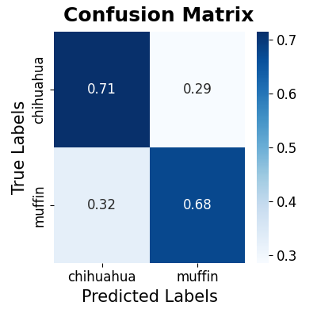

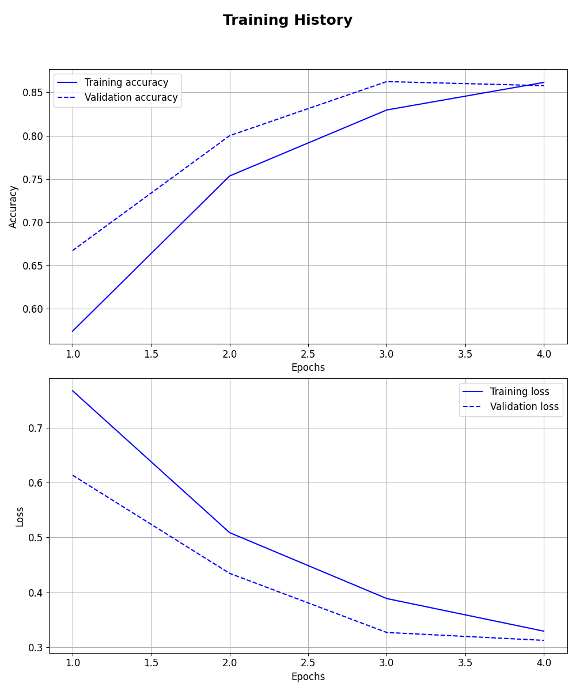

### Detailed Report of Test Set:

|              | precision    | recall       | f1-score     | support      |
| ------------ | ------------ | ------------ | ------------ | ------------ |
| chihuahua    | 0.7164       | 0.7149       | 0.7156       | 477          | 
| muffin       | 0.6739       | 0.6755       | 0.6747       | 416          | 
| micro avg    | 0.6965       | 0.6965       | 0.6965       | 893          | 
| macro avg    | 0.6951       | 0.6952       | 0.6952       | 893          | 
| weighted avg | 0.6966       | 0.6965       | 0.6966       | 893          | 
| samples avg  | 0.6965       | 0.6965       | 0.6965       | 893          | 

## trial_14

*    *Start Time*: 2024-10-17 15:51:35

*    *Duration*: 09.354

*    *Directory*: [Link](./trial_14)

### Hyperparameters:

| Hyperparameter         | Value                  |
| ---------------------- | ---------------------- |
| units1                 | 64                     |
| kernel_size1           | 3                      |
| units2                 | 128                    |
| kernel_size2           | 5                      |
| units3                 | 32                     |
| learning_rate          | 0.00031911573696807676 |

### Evaluation Metrics:

|           | train     | val       | test      |
| --------- | --------- | --------- | --------- |
| accuracy  | 0.7206    | 0.6766    | 0.6965    | 
| precision | 0.7206    | 0.6766    | 0.6965    | 
| recall    | 0.7206    | 0.6766    | 0.6965    | 
| f1        | 0.7206    | 0.6766    | 0.6965    | 

### Figures:

### Detailed Report of Test Set:

|              | precision    | recall       | f1-score     | support      |
| ------------ | ------------ | ------------ | ------------ | ------------ |
| chihuahua    | 0.6866       | 0.7945       | 0.7366       | 477          | 
| muffin       | 0.7126       | 0.5841       | 0.6420       | 416          | 
| micro avg    | 0.6965       | 0.6965       | 0.6965       | 893          | 
| macro avg    | 0.6996       | 0.6893       | 0.6893       | 893          | 
| weighted avg | 0.6987       | 0.6965       | 0.6926       | 893          | 
| samples avg  | 0.6965       | 0.6965       | 0.6965       | 893          | 

## trial_48

*    *Start Time*: 2024-10-17 15:56:00

*    *Duration*: 07.641

*    *Directory*: [Link](./trial_48)

### Hyperparameters:

| Hyperparameter         | Value                  |
| ---------------------- | ---------------------- |
| units1                 | 128                    |
| kernel_size1           | 3                      |
| units2                 | 128                    |
| kernel_size2           | 3                      |
| units3                 | 256                    |
| learning_rate          | 0.00018727647373363392 |

### Evaluation Metrics:

|           | train     | val       | test      |
| --------- | --------- | --------- | --------- |
| accuracy  | 0.7309    | 0.6969    | 0.6965    | 
| precision | 0.7309    | 0.6969    | 0.6965    | 
| recall    | 0.7309    | 0.6969    | 0.6965    | 
| f1        | 0.7309    | 0.6969    | 0.6965    | 

### Figures:

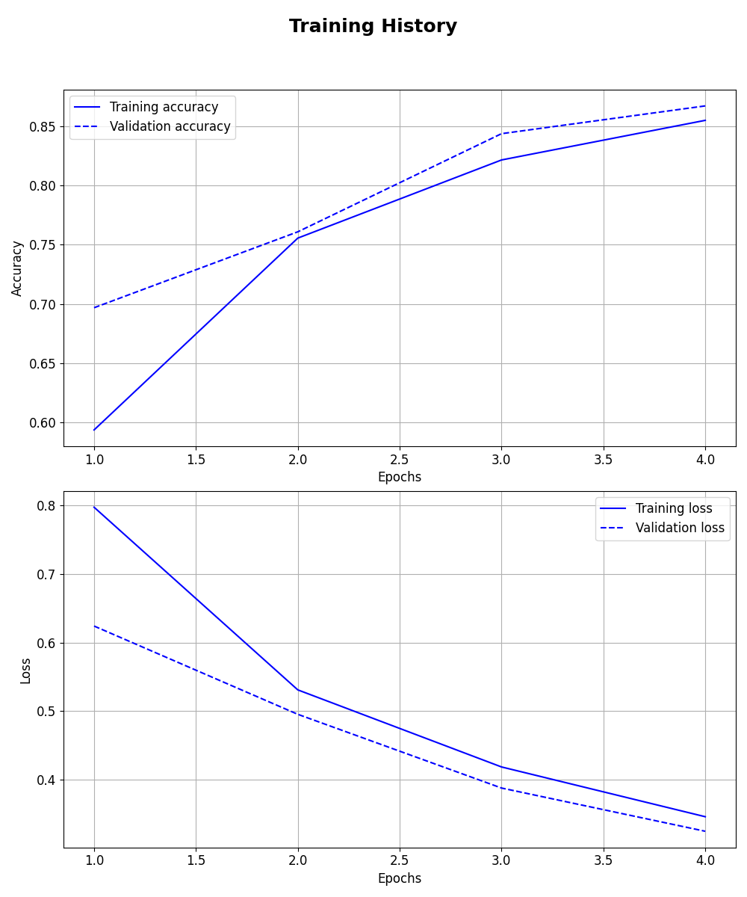

### Detailed Report of Test Set:

|              | precision    | recall       | f1-score     | support      |
| ------------ | ------------ | ------------ | ------------ | ------------ |
| chihuahua    | 0.6813       | 0.8113       | 0.7407       | 477          | 
| muffin       | 0.7231       | 0.5649       | 0.6343       | 416          | 
| micro avg    | 0.6965       | 0.6965       | 0.6965       | 893          | 
| macro avg    | 0.7022       | 0.6881       | 0.6875       | 893          | 
| weighted avg | 0.7008       | 0.6965       | 0.6911       | 893          | 
| samples avg  | 0.6965       | 0.6965       | 0.6965       | 893          | 

## trial_54

*    *Start Time*: 2024-10-17 15:56:48

*    *Duration*: 06.203

*    *Directory*: [Link](./trial_54)

### Hyperparameters:

| Hyperparameter         | Value                  |
| ---------------------- | ---------------------- |
| units1                 | 64                     |
| kernel_size1           | 3                      |
| units2                 | 128                    |
| kernel_size2           | 3                      |
| units3                 | 256                    |
| learning_rate          | 0.00022245471920984787 |

### Evaluation Metrics:

|           | train     | val       | test      |
| --------- | --------- | --------- | --------- |
| accuracy  | 0.7203    | 0.6781    | 0.6954    | 
| precision | 0.7203    | 0.6781    | 0.6954    | 
| recall    | 0.7203    | 0.6781    | 0.6954    | 
| f1        | 0.7203    | 0.6781    | 0.6954    | 

### Figures:

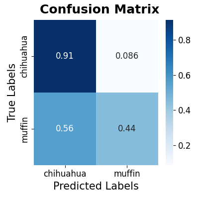

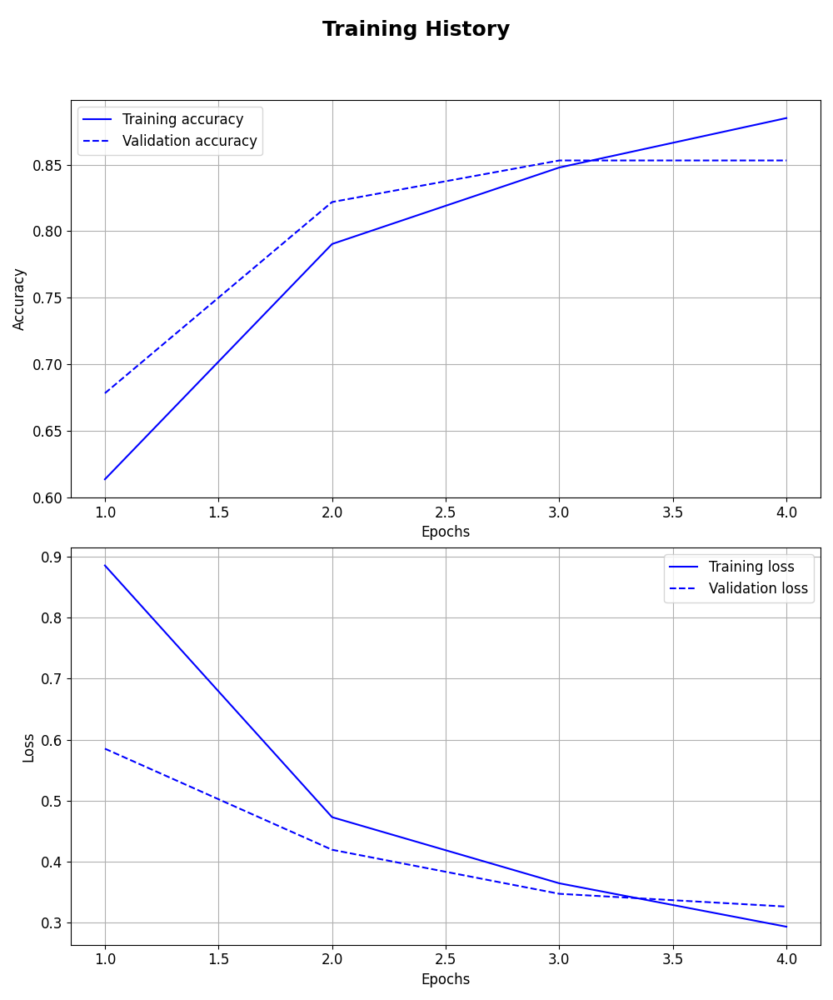

### Detailed Report of Test Set:

|              | precision    | recall       | f1-score     | support      |
| ------------ | ------------ | ------------ | ------------ | ------------ |
| chihuahua    | 0.6537       | 0.9140       | 0.7622       | 477          | 
| muffin       | 0.8186       | 0.4447       | 0.5763       | 416          | 
| micro avg    | 0.6954       | 0.6954       | 0.6954       | 893          | 
| macro avg    | 0.7361       | 0.6794       | 0.6693       | 893          | 
| weighted avg | 0.7305       | 0.6954       | 0.6756       | 893          | 
| samples avg  | 0.6954       | 0.6954       | 0.6954       | 893          | 

## trial_45

*    *Start Time*: 2024-10-17 15:55:35

*    *Duration*: 08.593

*    *Directory*: [Link](./trial_45)

### Hyperparameters:

| Hyperparameter         | Value                  |
| ---------------------- | ---------------------- |
| units1                 | 128                    |
| kernel_size1           | 3                      |
| units2                 | 128                    |
| kernel_size2           | 3                      |
| units3                 | 256                    |
| learning_rate          | 0.00020882786089453662 |

### Evaluation Metrics:

|           | train     | val       | test      |
| --------- | --------- | --------- | --------- |
| accuracy  | 0.7287    | 0.6828    | 0.6943    | 
| precision | 0.7287    | 0.6828    | 0.6943    | 
| recall    | 0.7287    | 0.6828    | 0.6943    | 
| f1        | 0.7287    | 0.6828    | 0.6943    | 

### Figures:

### Detailed Report of Test Set:

|              | precision    | recall       | f1-score     | support      |
| ------------ | ------------ | ------------ | ------------ | ------------ |
| chihuahua    | 0.7008       | 0.7463       | 0.7228       | 477          | 
| muffin       | 0.6857       | 0.6346       | 0.6592       | 416          | 
| micro avg    | 0.6943       | 0.6943       | 0.6943       | 893          | 
| macro avg    | 0.6933       | 0.6905       | 0.6910       | 893          | 
| weighted avg | 0.6938       | 0.6943       | 0.6932       | 893          | 
| samples avg  | 0.6943       | 0.6943       | 0.6943       | 893          | 

## trial_52

*    *Start Time*: 2024-10-17 15:56:31

*    *Duration*: 08.165

*    *Directory*: [Link](./trial_52)

### Hyperparameters:

| Hyperparameter         | Value                  |
| ---------------------- | ---------------------- |
| units1                 | 128                    |
| kernel_size1           | 3                      |
| units2                 | 128                    |
| kernel_size2           | 3                      |
| units3                 | 256                    |
| learning_rate          | 0.00030762819341753194 |

### Evaluation Metrics:

|           | train     | val       | test      |
| --------- | --------- | --------- | --------- |
| accuracy  | 0.7125    | 0.6703    | 0.6898    | 
| precision | 0.7125    | 0.6703    | 0.6898    | 
| recall    | 0.7125    | 0.6703    | 0.6898    | 
| f1        | 0.7125    | 0.6703    | 0.6898    | 

### Figures:

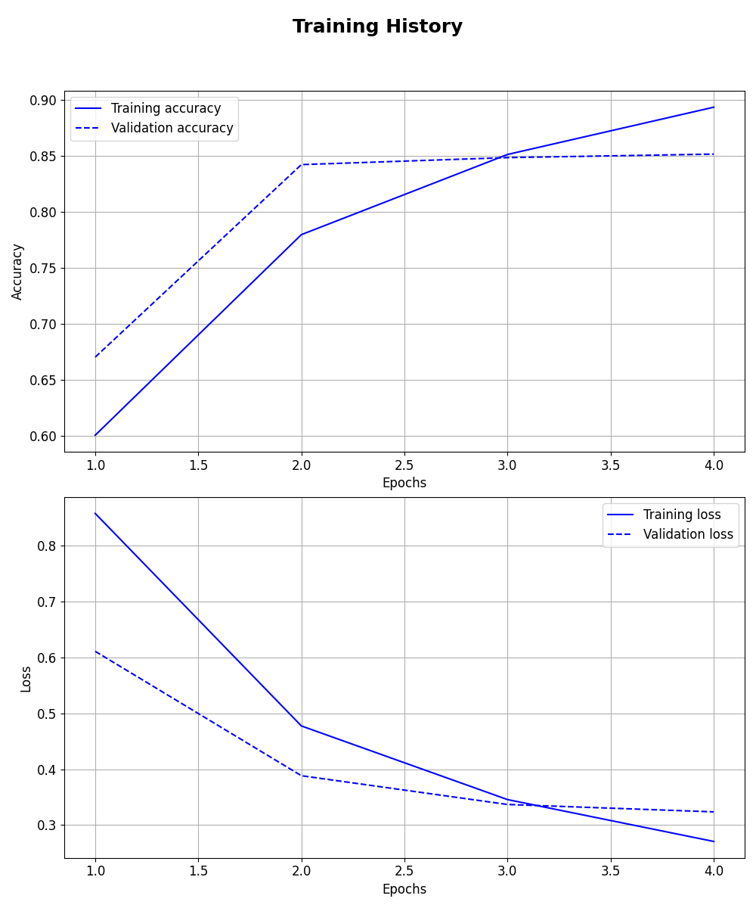

### Detailed Report of Test Set:

|              | precision    | recall       | f1-score     | support      |
| ------------ | ------------ | ------------ | ------------ | ------------ |
| chihuahua    | 0.6684       | 0.8323       | 0.7414       | 477          | 
| muffin       | 0.7324       | 0.5264       | 0.6126       | 416          | 
| micro avg    | 0.6898       | 0.6898       | 0.6898       | 893          | 
| macro avg    | 0.7004       | 0.6794       | 0.6770       | 893          | 
| weighted avg | 0.6982       | 0.6898       | 0.6814       | 893          | 
| samples avg  | 0.6898       | 0.6898       | 0.6898       | 893          | 

## trial_97

*    *Start Time*: 2024-10-17 16:32:55

*    *Duration*: 05.868

*    *Directory*: [Link](./trial_97)

### Hyperparameters:

| Hyperparameter         | Value                  |
| ---------------------- | ---------------------- |
| units1                 | 64                     |
| kernel_size1           | 3                      |
| units2                 | 128                    |
| kernel_size2           | 3                      |
| units3                 | 128                    |
| learning_rate          | 0.00022737392598377022 |

### Evaluation Metrics:

|           | train     | val       | test      |
| --------- | --------- | --------- | --------- |
| accuracy  | 0.7212    | 0.6766    | 0.6887    | 
| precision | 0.7212    | 0.6766    | 0.6887    | 
| recall    | 0.7212    | 0.6766    | 0.6887    | 
| f1        | 0.7212    | 0.6766    | 0.6887    | 

### Figures:

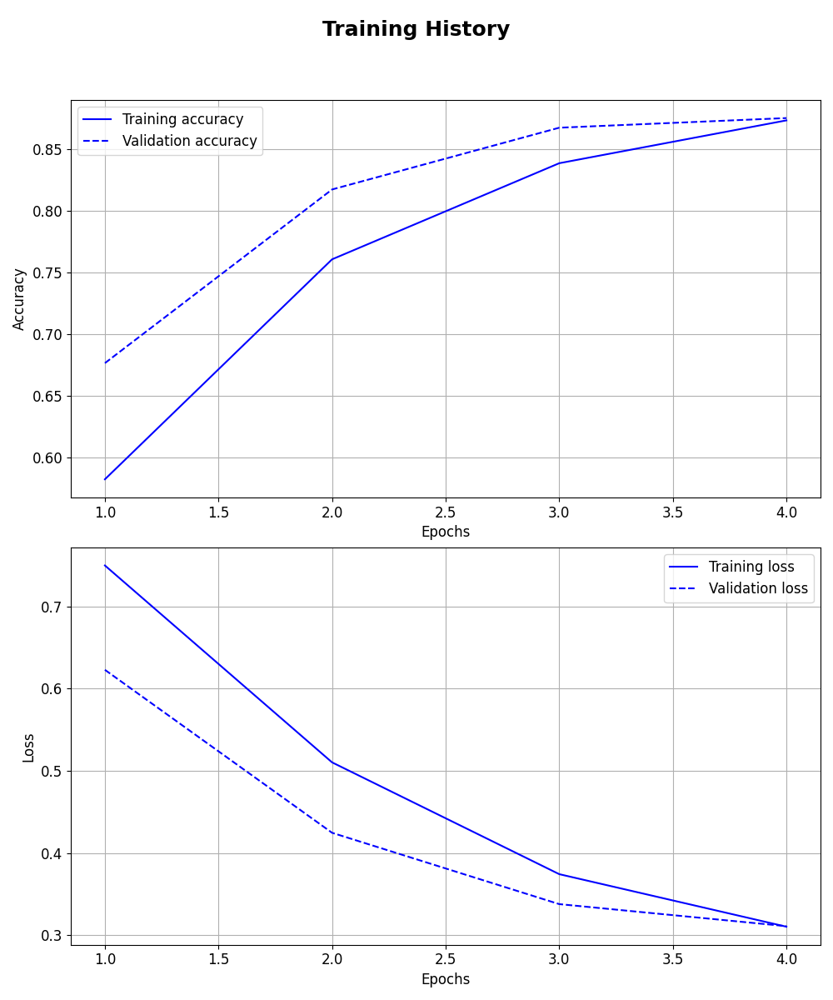

### Detailed Report of Test Set:

|              | precision    | recall       | f1-score     | support      |
| ------------ | ------------ | ------------ | ------------ | ------------ |
| chihuahua    | 0.6667       | 0.8344       | 0.7412       | 477          | 
| muffin       | 0.7331       | 0.5216       | 0.6096       | 416          | 
| micro avg    | 0.6887       | 0.6887       | 0.6887       | 893          | 
| macro avg    | 0.6999       | 0.6780       | 0.6754       | 893          | 
| weighted avg | 0.6976       | 0.6887       | 0.6798       | 893          | 
| samples avg  | 0.6887       | 0.6887       | 0.6887       | 893          | 

## trial_58

*    *Start Time*: 2024-10-17 15:57:19

*    *Duration*: 05.804

*    *Directory*: [Link](./trial_58)

### Hyperparameters:

| Hyperparameter         | Value                  |
| ---------------------- | ---------------------- |
| units1                 | 64                     |
| kernel_size1           | 5                      |
| units2                 | 128                    |
| kernel_size2           | 3                      |
| units3                 | 128                    |
| learning_rate          | 2.7551780405710867e-05 |

### Evaluation Metrics:

|           | train     | val       | test      |
| --------- | --------- | --------- | --------- |
| accuracy  | 0.7178    | 0.6891    | 0.6876    | 
| precision | 0.7178    | 0.6891    | 0.6876    | 
| recall    | 0.7178    | 0.6891    | 0.6876    | 
| f1        | 0.7178    | 0.6891    | 0.6876    | 

### Figures:

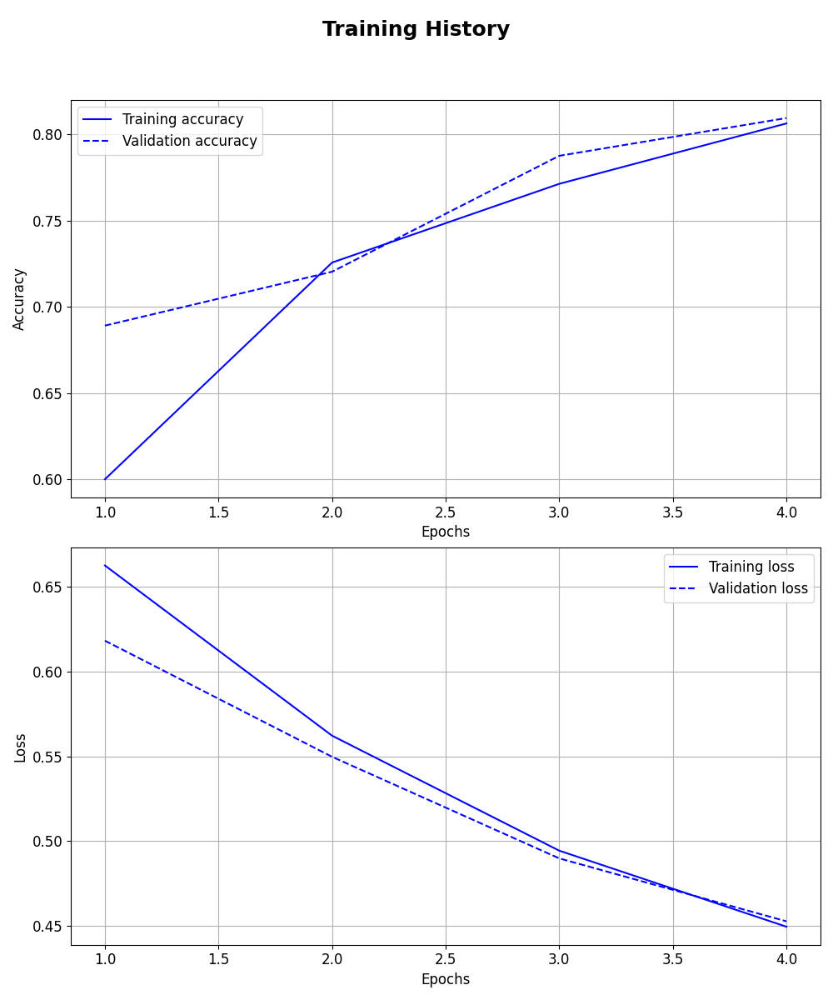

### Detailed Report of Test Set:

|              | precision    | recall       | f1-score     | support      |
| ------------ | ------------ | ------------ | ------------ | ------------ |
| chihuahua    | 0.6868       | 0.7631       | 0.7229       | 477          | 
| muffin       | 0.6887       | 0.6010       | 0.6418       | 416          | 
| micro avg    | 0.6876       | 0.6876       | 0.6876       | 893          | 
| macro avg    | 0.6877       | 0.6820       | 0.6824       | 893          | 
| weighted avg | 0.6877       | 0.6876       | 0.6852       | 893          | 
| samples avg  | 0.6876       | 0.6876       | 0.6876       | 893          | 

## trial_6

*    *Start Time*: 2024-10-17 15:50:22

*    *Duration*: 09.302

*    *Directory*: [Link](./trial_6)

### Hyperparameters:

| Hyperparameter         | Value                  |
| ---------------------- | ---------------------- |
| units1                 | 64                     |
| kernel_size1           | 5                      |
| units2                 | 128                    |
| kernel_size2           | 3                      |
| units3                 | 256                    |
| learning_rate          | 2.4947660241581293e-05 |

### Evaluation Metrics:

|           | train     | val       | test      |
| --------- | --------- | --------- | --------- |
| accuracy  | 0.7237    | 0.6828    | 0.6809    | 
| precision | 0.7237    | 0.6828    | 0.6809    | 
| recall    | 0.7237    | 0.6828    | 0.6809    | 
| f1        | 0.7237    | 0.6828    | 0.6809    | 

### Figures:

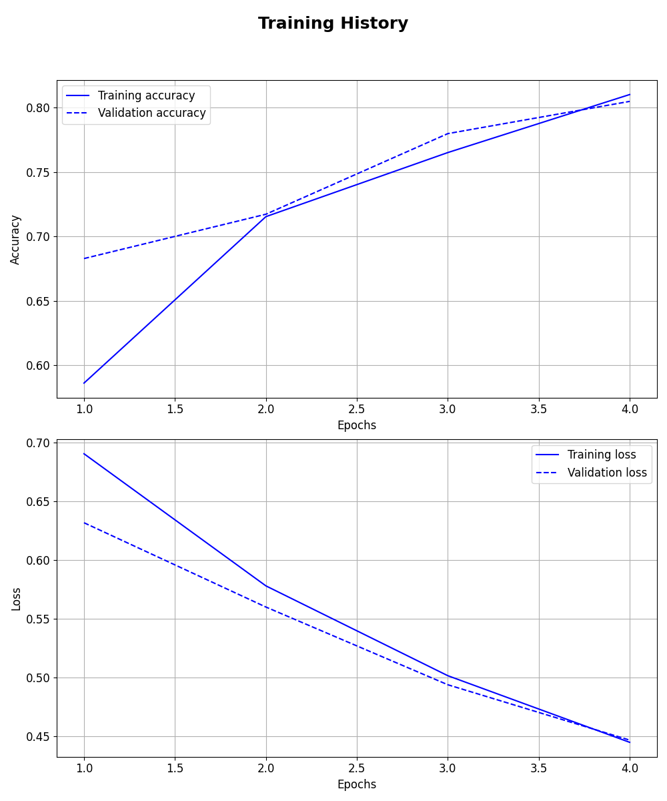

### Detailed Report of Test Set:

|              | precision    | recall       | f1-score     | support      |
| ------------ | ------------ | ------------ | ------------ | ------------ |
| chihuahua    | 0.6798       | 0.7610       | 0.7181       | 477          | 
| muffin       | 0.6825       | 0.5889       | 0.6323       | 416          | 
| micro avg    | 0.6809       | 0.6809       | 0.6809       | 893          | 
| macro avg    | 0.6811       | 0.6750       | 0.6752       | 893          | 
| weighted avg | 0.6810       | 0.6809       | 0.6781       | 893          | 
| samples avg  | 0.6809       | 0.6809       | 0.6809       | 893          | 

## trial_18

*    *Start Time*: 2024-10-17 15:52:07

*    *Duration*: 09.358

*    *Directory*: [Link](./trial_18)

### Hyperparameters:

| Hyperparameter         | Value                  |
| ---------------------- | ---------------------- |
| units1                 | 128                    |
| kernel_size1           | 5                      |
| units2                 | 64                     |
| kernel_size2           | 3                      |
| units3                 | 256                    |
| learning_rate          | 1.0538351007527214e-05 |

### Evaluation Metrics:

|           | train     | val       | test      |
| --------- | --------- | --------- | --------- |
| accuracy  | 0.7019    | 0.6625    | 0.6786    | 
| precision | 0.7019    | 0.6625    | 0.6786    | 
| recall    | 0.7019    | 0.6625    | 0.6786    | 
| f1        | 0.7019    | 0.6625    | 0.6786    | 

### Figures:

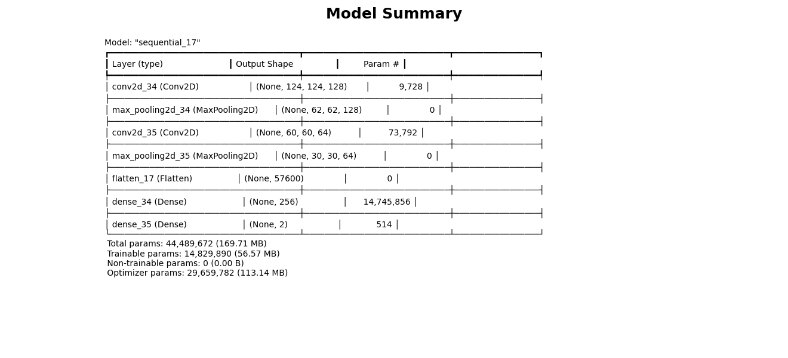

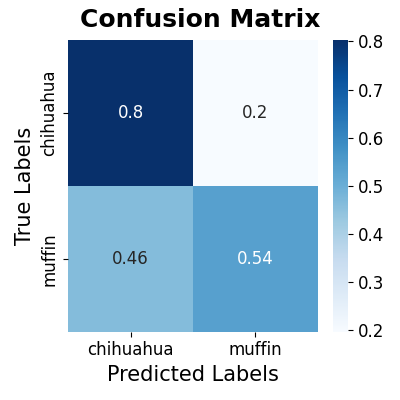

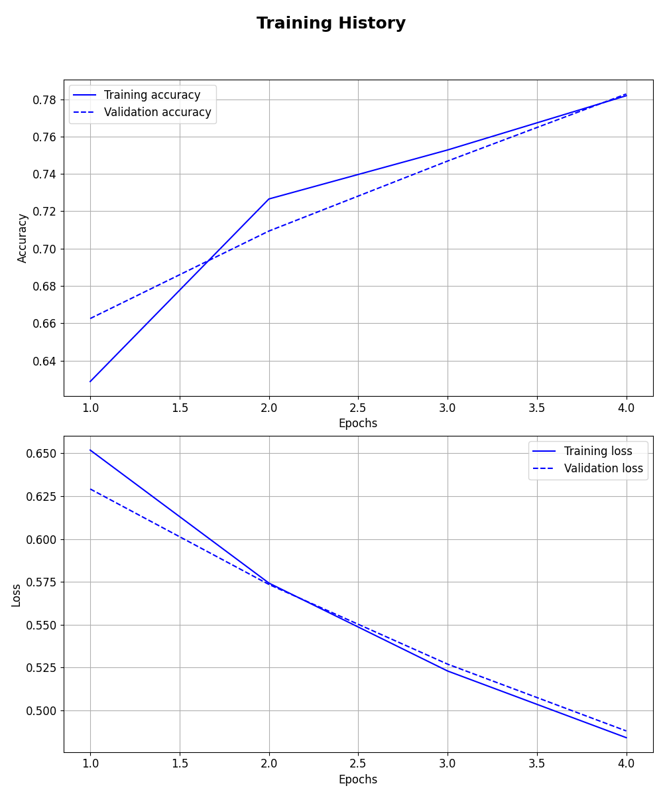

### Detailed Report of Test Set:

|              | precision    | recall       | f1-score     | support      |
| ------------ | ------------ | ------------ | ------------ | ------------ |
| chihuahua    | 0.6649       | 0.8029       | 0.7274       | 477          | 
| muffin       | 0.7035       | 0.5361       | 0.6085       | 416          | 
| micro avg    | 0.6786       | 0.6786       | 0.6786       | 893          | 
| macro avg    | 0.6842       | 0.6695       | 0.6680       | 893          | 
| weighted avg | 0.6829       | 0.6786       | 0.6720       | 893          | 
| samples avg  | 0.6786       | 0.6786       | 0.6786       | 893          | 

## trial_98

*    *Start Time*: 2024-10-17 16:33:01

*    *Duration*: 07.628

*    *Directory*: [Link](./trial_98)

### Hyperparameters:

| Hyperparameter         | Value                  |
| ---------------------- | ---------------------- |
| units1                 | 128                    |
| kernel_size1           | 3                      |
| units2                 | 128                    |
| kernel_size2           | 3                      |
| units3                 | 128                    |
| learning_rate          | 0.00016750352918738486 |

### Evaluation Metrics:

|           | train     | val       | test      |
| --------- | --------- | --------- | --------- |
| accuracy  | 0.7141    | 0.6734    | 0.6786    | 
| precision | 0.7141    | 0.6734    | 0.6786    | 
| recall    | 0.7141    | 0.6734    | 0.6786    | 
| f1        | 0.7141    | 0.6734    | 0.6786    | 

### Figures:

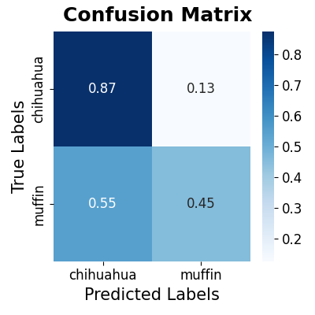

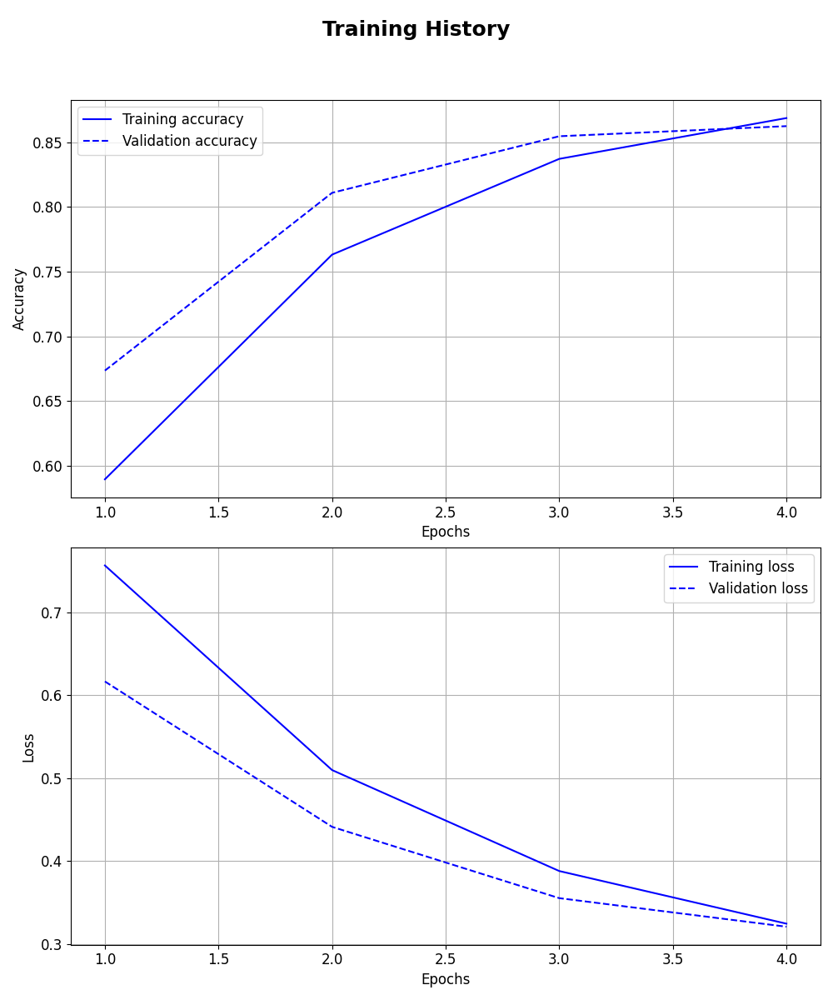

### Detailed Report of Test Set:

|              | precision    | recall       | f1-score     | support      |
| ------------ | ------------ | ------------ | ------------ | ------------ |
| chihuahua    | 0.6475       | 0.8742       | 0.7440       | 477          | 
| muffin       | 0.7590       | 0.4543       | 0.5684       | 416          | 
| micro avg    | 0.6786       | 0.6786       | 0.6786       | 893          | 
| macro avg    | 0.7033       | 0.6643       | 0.6562       | 893          | 
| weighted avg | 0.6995       | 0.6786       | 0.6622       | 893          | 
| samples avg  | 0.6786       | 0.6786       | 0.6786       | 893          | 

## trial_55

*    *Start Time*: 2024-10-17 15:56:54

*    *Duration*: 07.361

*    *Directory*: [Link](./trial_55)

### Hyperparameters:

| Hyperparameter        | Value                 |
| --------------------- | --------------------- |
| units1                | 128                   |
| kernel_size1          | 3                     |
| units2                | 128                   |
| kernel_size2          | 3                     |
| units3                | 128                   |
| learning_rate         | 0.0001156450815857172 |

### Evaluation Metrics:

|           | train     | val       | test      |
| --------- | --------- | --------- | --------- |
| accuracy  | 0.6988    | 0.6734    | 0.6753    | 
| precision | 0.6988    | 0.6734    | 0.6753    | 
| recall    | 0.6988    | 0.6734    | 0.6753    | 
| f1        | 0.6987    | 0.6734    | 0.6753    | 

### Figures:

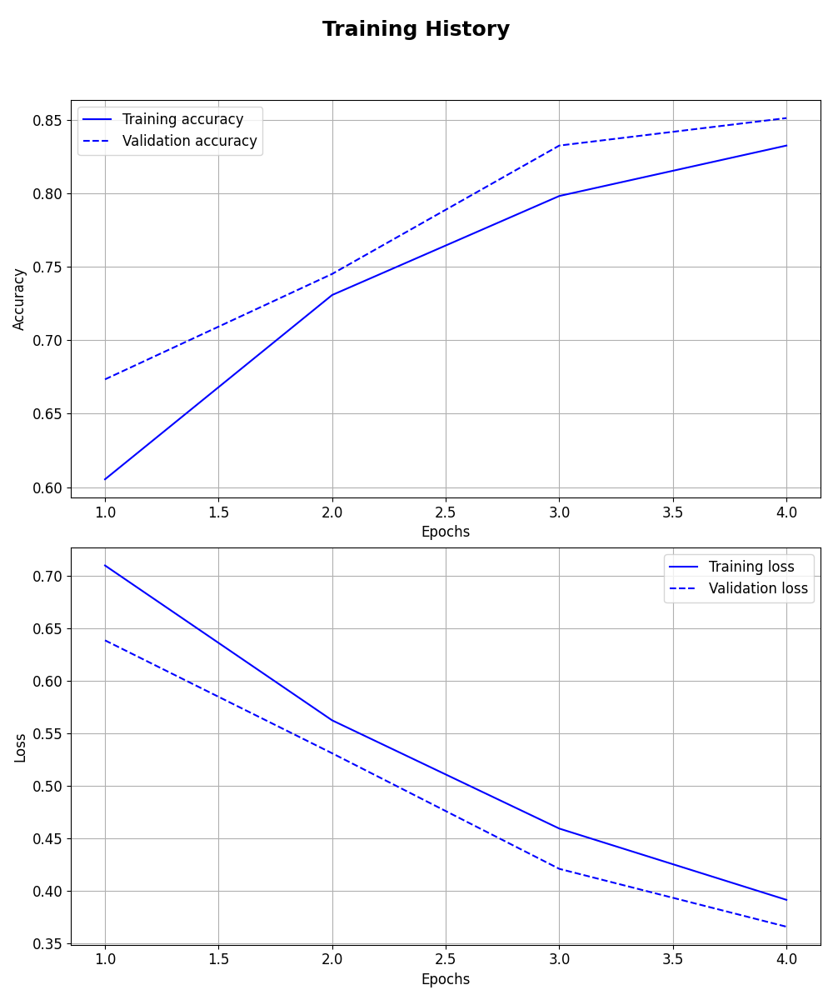

### Detailed Report of Test Set:

|              | precision    | recall       | f1-score     | support      |
| ------------ | ------------ | ------------ | ------------ | ------------ |
| chihuahua    | 0.6593       | 0.8113       | 0.7274       | 477          | 
| muffin       | 0.7059       | 0.5192       | 0.5983       | 416          | 
| micro avg    | 0.6753       | 0.6753       | 0.6753       | 893          | 
| macro avg    | 0.6826       | 0.6653       | 0.6629       | 893          | 
| weighted avg | 0.6810       | 0.6753       | 0.6673       | 893          | 
| samples avg  | 0.6753       | 0.6753       | 0.6753       | 893          | 

## trial_99

*    *Start Time*: 2024-10-17 16:33:08

*    *Duration*: 07.235

*    *Directory*: [Link](./trial_99)

### Hyperparameters:

| Hyperparameter        | Value                 |
| --------------------- | --------------------- |
| units1                | 128                   |
| kernel_size1          | 3                     |
| units2                | 128                   |
| kernel_size2          | 3                     |
| units3                | 128                   |
| learning_rate         | 0.0004148548173940254 |

### Evaluation Metrics:

|           | train     | val       | test      |
| --------- | --------- | --------- | --------- |
| accuracy  | 0.7072    | 0.6672    | 0.6753    | 
| precision | 0.7072    | 0.6672    | 0.6753    | 
| recall    | 0.7072    | 0.6672    | 0.6753    | 
| f1        | 0.7072    | 0.6672    | 0.6753    | 

### Figures:

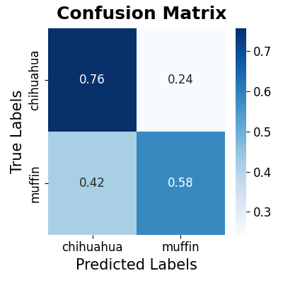

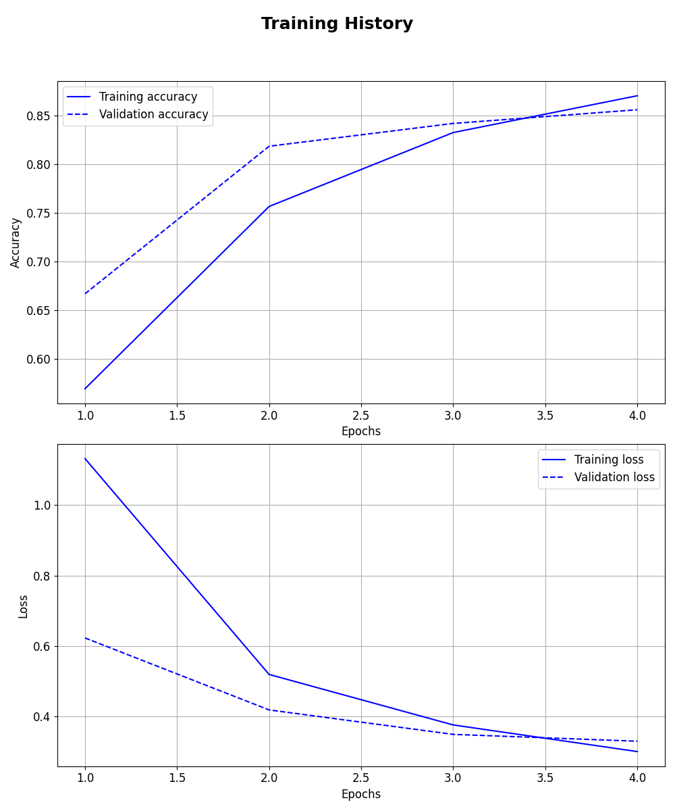

### Detailed Report of Test Set:

|              | precision    | recall       | f1-score     | support      |
| ------------ | ------------ | ------------ | ------------ | ------------ |
| chihuahua    | 0.6748       | 0.7568       | 0.7134       | 477          | 
| muffin       | 0.6760       | 0.5817       | 0.6253       | 416          | 
| micro avg    | 0.6753       | 0.6753       | 0.6753       | 893          | 
| macro avg    | 0.6754       | 0.6693       | 0.6694       | 893          | 
| weighted avg | 0.6753       | 0.6753       | 0.6724       | 893          | 
| samples avg  | 0.6753       | 0.6753       | 0.6753       | 893          | 

## trial_88

*    *Start Time*: 2024-10-17 16:31:54

*    *Duration*: 05.861

*    *Directory*: [Link](./trial_88)

### Hyperparameters:

| Hyperparameter         | Value                  |
| ---------------------- | ---------------------- |
| units1                 | 64                     |
| kernel_size1           | 3                      |
| units2                 | 128                    |
| kernel_size2           | 3                      |
| units3                 | 128                    |
| learning_rate          | 0.00018160402151020058 |

### Evaluation Metrics:

|           | train     | val       | test      |
| --------- | --------- | --------- | --------- |
| accuracy  | 0.6931    | 0.6625    | 0.6607    | 
| precision | 0.6931    | 0.6625    | 0.6607    | 
| recall    | 0.6931    | 0.6625    | 0.6607    | 
| f1        | 0.6931    | 0.6625    | 0.6607    | 

### Figures:

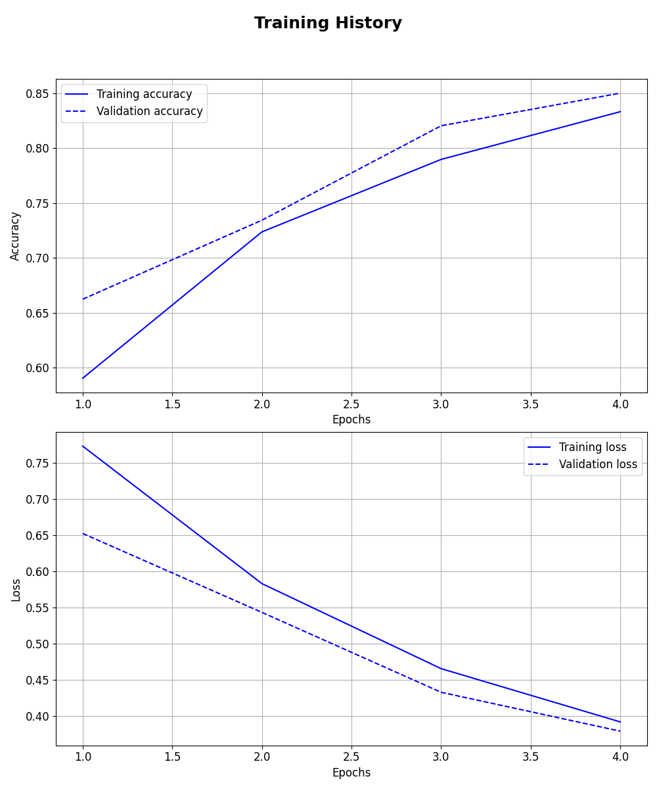

### Detailed Report of Test Set:

|              | precision    | recall       | f1-score     | support      |
| ------------ | ------------ | ------------ | ------------ | ------------ |
| chihuahua    | 0.6465       | 0.8050       | 0.7171       | 477          | 
| muffin       | 0.6890       | 0.4952       | 0.5762       | 416          | 
| micro avg    | 0.6607       | 0.6607       | 0.6607       | 893          | 
| macro avg    | 0.6677       | 0.6501       | 0.6467       | 893          | 
| weighted avg | 0.6663       | 0.6607       | 0.6515       | 893          | 
| samples avg  | 0.6607       | 0.6607       | 0.6607       | 893          | 

## trial_16

*    *Start Time*: 2024-10-17 15:51:54

*    *Duration*: 06.634

*    *Directory*: [Link](./trial_16)

### Hyperparameters:

| Hyperparameter        | Value                 |
| --------------------- | --------------------- |
| units1                | 64                    |
| kernel_size1          | 5                     |
| units2                | 128                   |
| kernel_size2          | 3                     |
| units3                | 128                   |
| learning_rate         | 9.034169704306598e-05 |

### Evaluation Metrics:

|           | train     | val       | test      |
| --------- | --------- | --------- | --------- |
| accuracy  | 0.6853    | 0.6422    | 0.6562    | 
| precision | 0.6853    | 0.6422    | 0.6562    | 
| recall    | 0.6853    | 0.6422    | 0.6562    | 
| f1        | 0.6853    | 0.6422    | 0.6562    | 

### Figures:

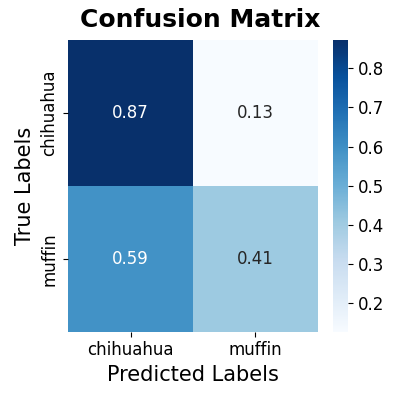

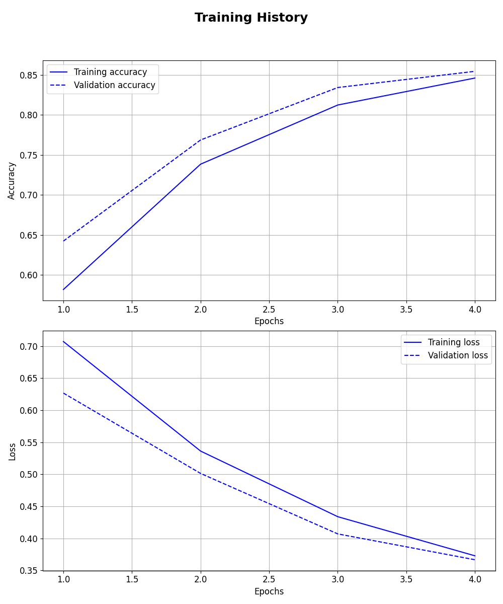

### Detailed Report of Test Set:

|              | precision    | recall       | f1-score     | support      |
| ------------ | ------------ | ------------ | ------------ | ------------ |
| chihuahua    | 0.6284       | 0.8721       | 0.7305       | 477          | 
| muffin       | 0.7359       | 0.4087       | 0.5255       | 416          | 
| micro avg    | 0.6562       | 0.6562       | 0.6562       | 893          | 
| macro avg    | 0.6822       | 0.6404       | 0.6280       | 893          | 
| weighted avg | 0.6785       | 0.6562       | 0.6350       | 893          | 
| samples avg  | 0.6562       | 0.6562       | 0.6562       | 893          | 

## trial_31

*    *Start Time*: 2024-10-17 15:53:44

*    *Duration*: 10.394

*    *Directory*: [Link](./trial_31)

### Hyperparameters:

| Hyperparameter         | Value                  |
| ---------------------- | ---------------------- |
| units1                 | 128                    |
| kernel_size1           | 5                      |
| units2                 | 128                    |
| kernel_size2           | 3                      |
| units3                 | 128                    |
| learning_rate          | 0.00035416581084669316 |

### Evaluation Metrics:

|           | train     | val       | test      |
| --------- | --------- | --------- | --------- |
| accuracy  | 0.6903    | 0.6453    | 0.6551    | 
| precision | 0.6903    | 0.6453    | 0.6551    | 
| recall    | 0.6903    | 0.6453    | 0.6551    | 
| f1        | 0.6903    | 0.6453    | 0.6551    | 

### Figures:

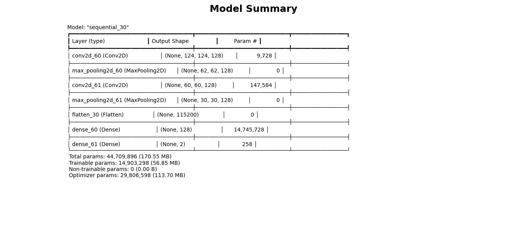

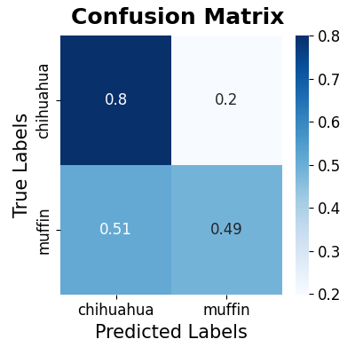

### Detailed Report of Test Set:

|              | precision    | recall       | f1-score     | support      |
| ------------ | ------------ | ------------ | ------------ | ------------ |
| chihuahua    | 0.6420       | 0.8008       | 0.7127       | 477          | 
| muffin       | 0.6812       | 0.4880       | 0.5686       | 416          | 
| micro avg    | 0.6551       | 0.6551       | 0.6551       | 893          | 
| macro avg    | 0.6616       | 0.6444       | 0.6407       | 893          | 
| weighted avg | 0.6603       | 0.6551       | 0.6456       | 893          | 
| samples avg  | 0.6551       | 0.6551       | 0.6551       | 893          | 

## trial_38

*    *Start Time*: 2024-10-17 15:54:40

*    *Duration*: 09.208

*    *Directory*: [Link](./trial_38)

### Hyperparameters:

| Hyperparameter        | Value                 |
| --------------------- | --------------------- |
| units1                | 128                   |
| kernel_size1          | 3                     |
| units2                | 64                    |
| kernel_size2          | 3                     |
| units3                | 128                   |
| learning_rate         | 0.0002651495441025123 |

### Evaluation Metrics:

|           | train     | val       | test      |
| --------- | --------- | --------- | --------- |
| accuracy  | 0.6819    | 0.6375    | 0.6495    | 
| precision | 0.6819    | 0.6375    | 0.6495    | 
| recall    | 0.6819    | 0.6375    | 0.6495    | 
| f1        | 0.6819    | 0.6375    | 0.6495    | 

### Figures:

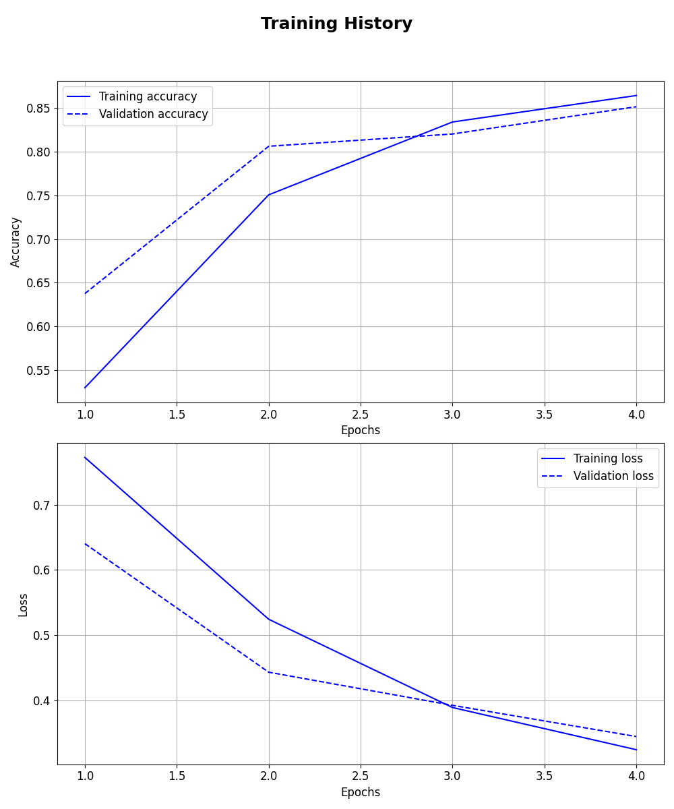

### Detailed Report of Test Set:

|              | precision    | recall       | f1-score     | support      |
| ------------ | ------------ | ------------ | ------------ | ------------ |
| chihuahua    | 0.6314       | 0.8260       | 0.7157       | 477          | 
| muffin       | 0.6914       | 0.4471       | 0.5431       | 416          | 
| micro avg    | 0.6495       | 0.6495       | 0.6495       | 893          | 
| macro avg    | 0.6614       | 0.6366       | 0.6294       | 893          | 
| weighted avg | 0.6594       | 0.6495       | 0.6353       | 893          | 
| samples avg  | 0.6495       | 0.6495       | 0.6495       | 893          | 

## trial_59

*    *Start Time*: 2024-10-17 15:57:24

*    *Duration*: 14.002

*    *Directory*: [Link](./trial_59)

### Hyperparameters:

| Hyperparameter        | Value                 |
| --------------------- | --------------------- |
| units1                | 128                   |
| kernel_size1          | 3                     |
| units2                | 128                   |
| kernel_size2          | 5                     |
| units3                | 512                   |
| learning_rate         | 8.625291271597647e-05 |

### Evaluation Metrics:

|           | train     | val       | test      |
| --------- | --------- | --------- | --------- |
| accuracy  | 0.6612    | 0.6187    | 0.6461    | 
| precision | 0.6612    | 0.6187    | 0.6461    | 
| recall    | 0.6612    | 0.6187    | 0.6461    | 
| f1        | 0.6612    | 0.6187    | 0.6461    | 

### Figures:

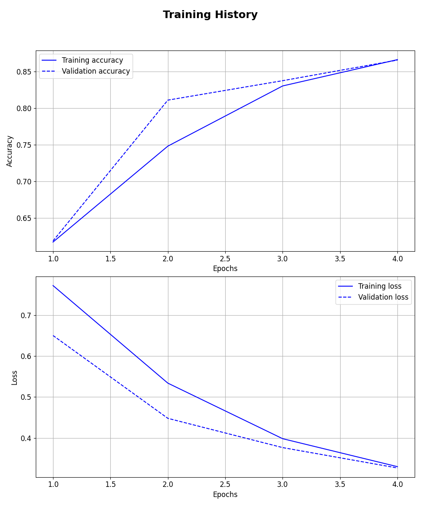

### Detailed Report of Test Set:

|              | precision    | recall       | f1-score     | support      |
| ------------ | ------------ | ------------ | ------------ | ------------ |
| chihuahua    | 0.6104       | 0.9329       | 0.7380       | 477          | 
| muffin       | 0.8049       | 0.3173       | 0.4552       | 416          | 
| micro avg    | 0.6461       | 0.6461       | 0.6461       | 893          | 
| macro avg    | 0.7077       | 0.6251       | 0.5966       | 893          | 
| weighted avg | 0.7010       | 0.6461       | 0.6062       | 893          | 
| samples avg  | 0.6461       | 0.6461       | 0.6461       | 893          | 

## trial_21

*    *Start Time*: 2024-10-17 15:52:34

*    *Duration*: 06.527

*    *Directory*: [Link](./trial_21)

### Hyperparameters:

| Hyperparameter        | Value                 |
| --------------------- | --------------------- |
| units1                | 64                    |
| kernel_size1          | 5                     |
| units2                | 128                   |
| kernel_size2          | 3                     |
| units3                | 256                   |
| learning_rate         | 7.899209058698323e-05 |

### Evaluation Metrics:

|           | train     | val       | test      |
| --------- | --------- | --------- | --------- |
| accuracy  | 0.6478    | 0.5828    | 0.6305    | 
| precision | 0.6478    | 0.5828    | 0.6305    | 
| recall    | 0.6478    | 0.5828    | 0.6305    | 
| f1        | 0.6478    | 0.5828    | 0.6305    | 

### Figures:

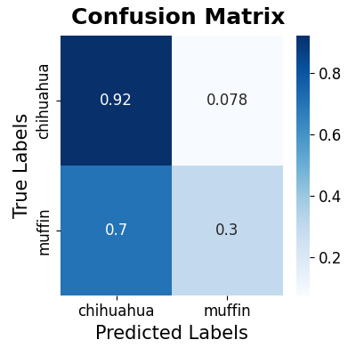

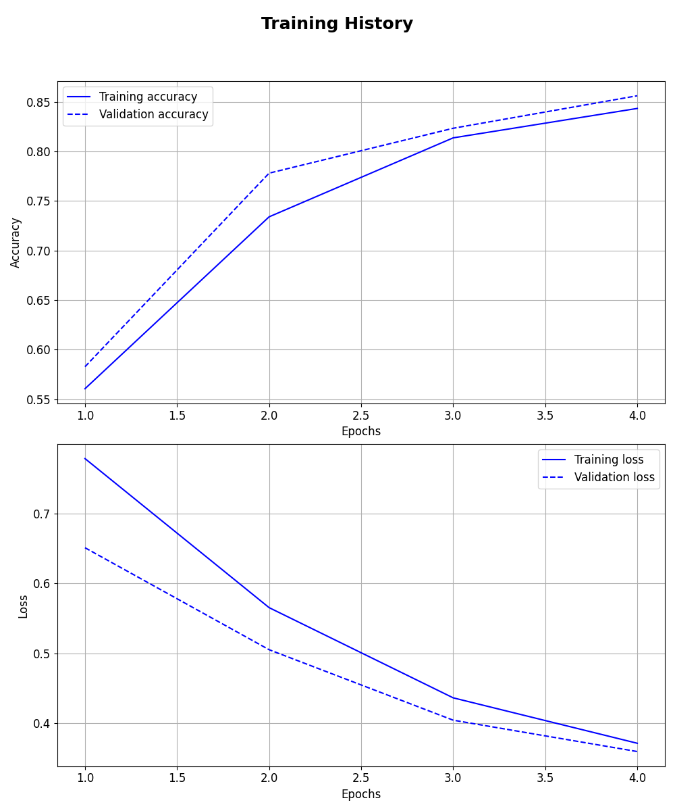

### Detailed Report of Test Set:

|              | precision    | recall       | f1-score     | support      |
| ------------ | ------------ | ------------ | ------------ | ------------ |
| chihuahua    | 0.6003       | 0.9224       | 0.7273       | 477          | 
| muffin       | 0.7688       | 0.2957       | 0.4271       | 416          | 
| micro avg    | 0.6305       | 0.6305       | 0.6305       | 893          | 
| macro avg    | 0.6845       | 0.6091       | 0.5772       | 893          | 
| weighted avg | 0.6788       | 0.6305       | 0.5874       | 893          | 
| samples avg  | 0.6305       | 0.6305       | 0.6305       | 893          | 

## trial_28

*    *Start Time*: 2024-10-17 15:53:24

*    *Duration*: 06.707

*    *Directory*: [Link](./trial_28)

### Hyperparameters:

| Hyperparameter        | Value                 |
| --------------------- | --------------------- |
| units1                | 64                    |
| kernel_size1          | 3                     |
| units2                | 128                   |
| kernel_size2          | 5                     |
| units3                | 128                   |
| learning_rate         | 9.943235990935886e-05 |

### Evaluation Metrics:

|           | train     | val       | test      |
| --------- | --------- | --------- | --------- |
| accuracy  | 0.6341    | 0.5875    | 0.6125    | 
| precision | 0.6341    | 0.5875    | 0.6125    | 
| recall    | 0.6341    | 0.5875    | 0.6125    | 
| f1        | 0.6341    | 0.5875    | 0.6125    | 

### Figures:

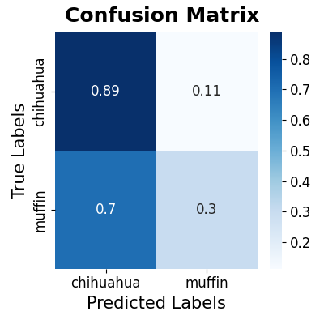

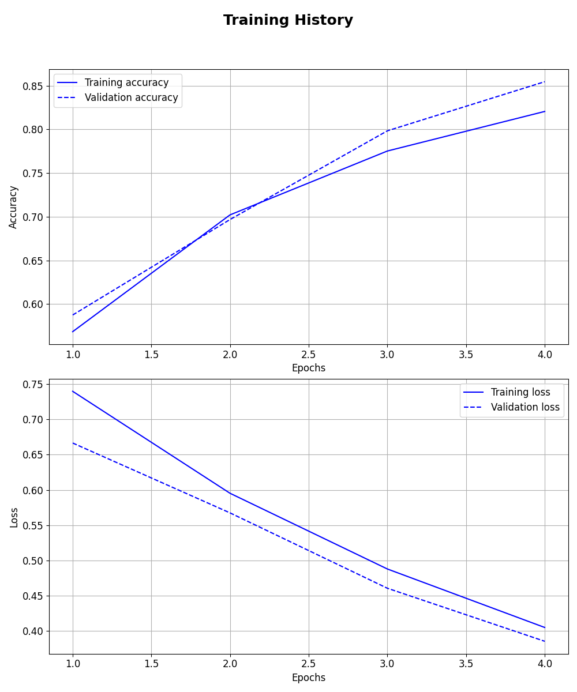

### Detailed Report of Test Set:

|              | precision    | recall       | f1-score     | support      |
| ------------ | ------------ | ------------ | ------------ | ------------ |
| chihuahua    | 0.5916       | 0.8868       | 0.7097       | 477          | 
| muffin       | 0.6966       | 0.2981       | 0.4175       | 416          | 
| micro avg    | 0.6125       | 0.6125       | 0.6125       | 893          | 
| macro avg    | 0.6441       | 0.5924       | 0.5636       | 893          | 
| weighted avg | 0.6405       | 0.6125       | 0.5736       | 893          | 
| samples avg  | 0.6125       | 0.6125       | 0.6125       | 893          | 

## trial_23

*    *Start Time*: 2024-10-17 15:52:46

*    *Duration*: 09.768

*    *Directory*: [Link](./trial_23)

### Hyperparameters:

| Hyperparameter         | Value                  |
| ---------------------- | ---------------------- |
| units1                 | 32                     |
| kernel_size1           | 3                      |
| units2                 | 128                    |
| kernel_size2           | 7                      |
| units3                 | 64                     |
| learning_rate          | 0.00048805555424876064 |

### Evaluation Metrics:

|           | train     | val       | test      |
| --------- | --------- | --------- | --------- |
| accuracy  | 0.6237    | 0.5750    | 0.6025    | 
| precision | 0.6237    | 0.5750    | 0.6025    | 
| recall    | 0.6237    | 0.5750    | 0.6025    | 
| f1        | 0.6237    | 0.5750    | 0.6025    | 

### Figures:

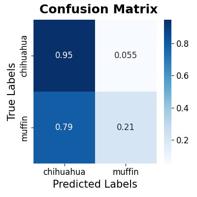

### Detailed Report of Test Set:

|              | precision    | recall       | f1-score     | support      |
| ------------ | ------------ | ------------ | ------------ | ------------ |
| chihuahua    | 0.5782       | 0.9455       | 0.7176       | 477          | 
| muffin       | 0.7699       | 0.2091       | 0.3289       | 416          | 
| micro avg    | 0.6025       | 0.6025       | 0.6025       | 893          | 
| macro avg    | 0.6741       | 0.5773       | 0.5233       | 893          | 
| weighted avg | 0.6675       | 0.6025       | 0.5365       | 893          | 
| samples avg  | 0.6025       | 0.6025       | 0.6025       | 893          | 

## trial_93

*    *Start Time*: 2024-10-17 16:32:28

*    *Duration*: 06.475

*    *Directory*: [Link](./trial_93)

### Hyperparameters:

| Hyperparameter         | Value                  |
| ---------------------- | ---------------------- |
| units1                 | 64                     |
| kernel_size1           | 3                      |
| units2                 | 128                    |
| kernel_size2           | 3                      |
| units3                 | 256                    |
| learning_rate          | 0.00034216257987899657 |

### Evaluation Metrics:

|           | train     | val       | test      |
| --------- | --------- | --------- | --------- |
| accuracy  | 0.5772    | 0.6062    | 0.5924    | 
| precision | 0.5772    | 0.6062    | 0.5924    | 
| recall    | 0.5772    | 0.6062    | 0.5924    | 
| f1        | 0.5772    | 0.6062    | 0.5924    | 

### Figures:

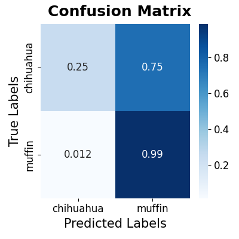

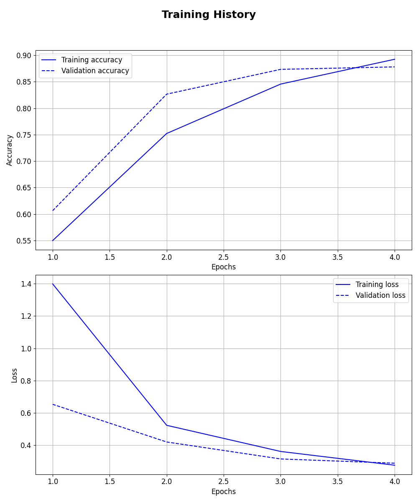

### Detailed Report of Test Set:

|              | precision    | recall       | f1-score     | support      |
| ------------ | ------------ | ------------ | ------------ | ------------ |
| chihuahua    | 0.9593       | 0.2474       | 0.3933       | 477          | 
| muffin       | 0.5338       | 0.9880       | 0.6931       | 416          | 
| micro avg    | 0.5924       | 0.5924       | 0.5924       | 893          | 
| macro avg    | 0.7466       | 0.6177       | 0.5432       | 893          | 
| weighted avg | 0.7611       | 0.5924       | 0.5330       | 893          | 
| samples avg  | 0.5924       | 0.5924       | 0.5924       | 893          | 

## trial_34

*    *Start Time*: 2024-10-17 15:54:07

*    *Duration*: 05.629

*    *Directory*: [Link](./trial_34)

### Hyperparameters:

| Hyperparameter        | Value                 |
| --------------------- | --------------------- |
| units1                | 64                    |
| kernel_size1          | 3                     |
| units2                | 128                   |
| kernel_size2          | 3                     |
| units3                | 32                    |
| learning_rate         | 0.0005725354606990249 |

### Evaluation Metrics:

|           | train     | val       | test      |
| --------- | --------- | --------- | --------- |
| accuracy  | 0.5594    | 0.5109    | 0.5364    | 
| precision | 0.5594    | 0.5109    | 0.5364    | 
| recall    | 0.5594    | 0.5109    | 0.5364    | 
| f1        | 0.5594    | 0.5109    | 0.5364    | 

### Figures:

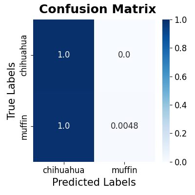

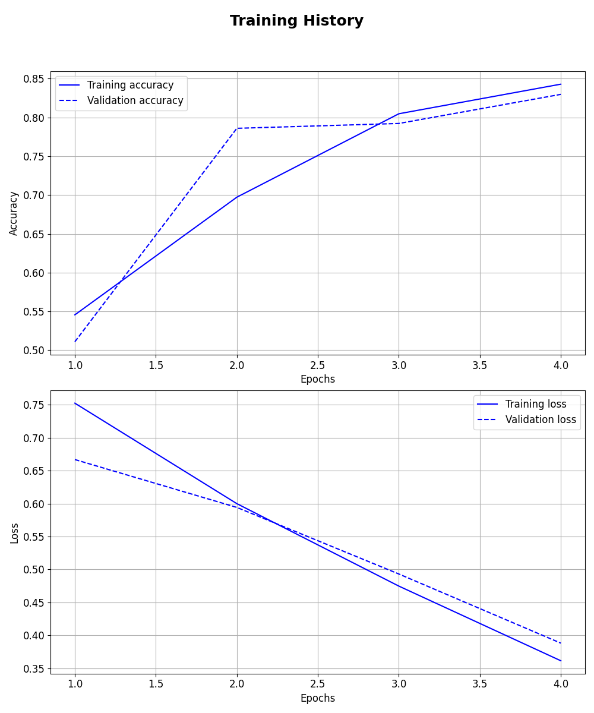

### Detailed Report of Test Set:

|              | precision    | recall       | f1-score     | support      |
| ------------ | ------------ | ------------ | ------------ | ------------ |
| chihuahua    | 0.5354       | 1.0000       | 0.6974       | 477          | 
| muffin       | 1.0000       | 0.0048       | 0.0096       | 416          | 
| micro avg    | 0.5364       | 0.5364       | 0.5364       | 893          | 
| macro avg    | 0.7677       | 0.5024       | 0.3535       | 893          | 
| weighted avg | 0.7518       | 0.5364       | 0.3770       | 893          | 
| samples avg  | 0.5364       | 0.5364       | 0.5364       | 893          | 

## trial_87

*    *Start Time*: 2024-10-17 16:31:41

*    *Duration*: 12.481

*    *Directory*: [Link](./trial_87)

### Hyperparameters:

| Hyperparameter        | Value                 |
| --------------------- | --------------------- |
| units1                | 128                   |
| kernel_size1          | 3                     |
| units2                | 128                   |
| kernel_size2          | 3                     |
| units3                | 64                    |
| learning_rate         | 0.0005666925619742146 |

### Evaluation Metrics:

|           | train     | val       | test      |
| --------- | --------- | --------- | --------- |
| accuracy  | 0.5522    | 0.5000    | 0.5364    | 
| precision | 0.5522    | 0.5000    | 0.5364    | 
| recall    | 0.5522    | 0.5000    | 0.5364    | 
| f1        | 0.5522    | 0.5000    | 0.5364    | 

### Figures:

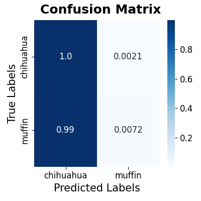

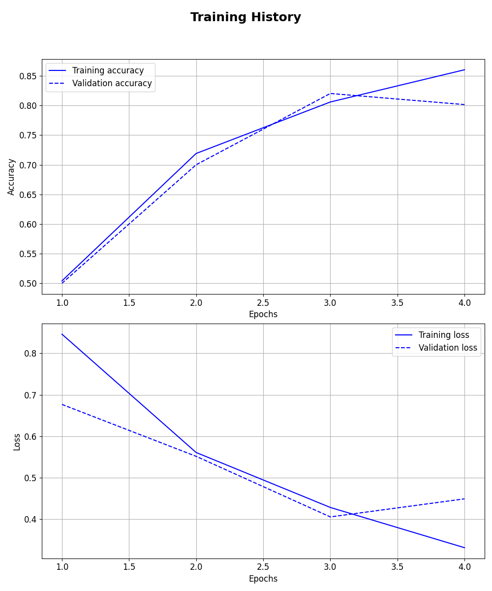

### Detailed Report of Test Set:

|              | precision    | recall       | f1-score     | support      |
| ------------ | ------------ | ------------ | ------------ | ------------ |
| chihuahua    | 0.5354       | 0.9979       | 0.6969       | 477          | 
| muffin       | 0.7500       | 0.0072       | 0.0143       | 416          | 
| micro avg    | 0.5364       | 0.5364       | 0.5364       | 893          | 
| macro avg    | 0.6427       | 0.5026       | 0.3556       | 893          | 
| weighted avg | 0.6354       | 0.5364       | 0.3789       | 893          | 
| samples avg  | 0.5364       | 0.5364       | 0.5364       | 893          | 

## trial_5

*    *Start Time*: 2024-10-17 15:50:14

*    *Duration*: 07.327

*    *Directory*: [Link](./trial_5)

### Hyperparameters:

| Hyperparameter         | Value                  |
| ---------------------- | ---------------------- |
| units1                 | 32                     |
| kernel_size1           | 7                      |
| units2                 | 64                     |
| kernel_size2           | 3                      |
| units3                 | 512                    |
| learning_rate          | 0.00019443344457175022 |

### Evaluation Metrics:

|           | train     | val       | test      |
| --------- | --------- | --------- | --------- |
| accuracy  | 0.5500    | 0.5031    | 0.5342    | 
| precision | 0.5500    | 0.5031    | 0.5342    | 
| recall    | 0.5500    | 0.5031    | 0.5342    | 
| f1        | 0.5500    | 0.5031    | 0.5342    | 

### Figures:

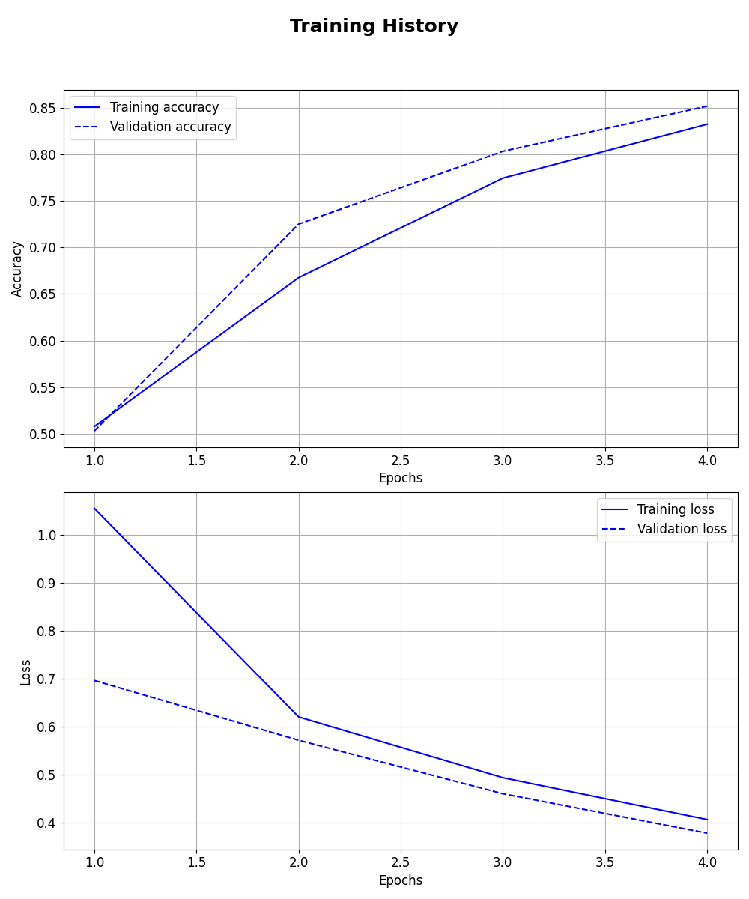

### Detailed Report of Test Set:

|              | precision    | recall       | f1-score     | support      |
| ------------ | ------------ | ------------ | ------------ | ------------ |
| chihuahua    | 0.5342       | 1.0000       | 0.6964       | 477          | 
| muffin       | 0.0000e+00   | 0.0000e+00   | 0.0000e+00   | 416          | 
| micro avg    | 0.5342       | 0.5342       | 0.5342       | 893          | 
| macro avg    | 0.2671       | 0.5000       | 0.3482       | 893          | 
| weighted avg | 0.2853       | 0.5342       | 0.3720       | 893          | 
| samples avg  | 0.5342       | 0.5342       | 0.5342       | 893          | 

## trial_11

*    *Start Time*: 2024-10-17 15:51:16

*    *Duration*: 06.588

*    *Directory*: [Link](./trial_11)

### Hyperparameters:

| Hyperparameter        | Value                 |
| --------------------- | --------------------- |
| units1                | 64                    |
| kernel_size1          | 3                     |
| units2                | 128                   |
| kernel_size2          | 3                     |
| units3                | 32                    |
| learning_rate         | 0.0002210682731514334 |

### Evaluation Metrics:

|           | train     | val       | test      |
| --------- | --------- | --------- | --------- |
| accuracy  | 0.5497    | 0.5047    | 0.5342    | 
| precision | 0.5497    | 0.5047    | 0.5342    | 
| recall    | 0.5497    | 0.5047    | 0.5342    | 
| f1        | 0.5497    | 0.5047    | 0.5342    | 

### Figures:

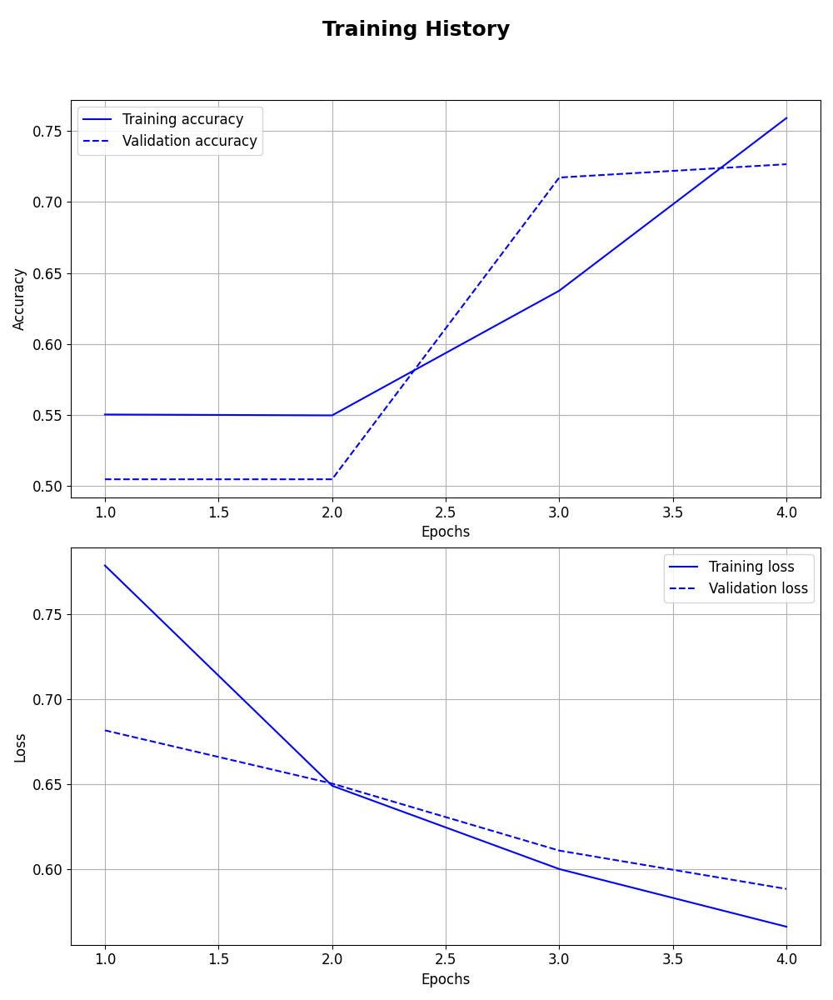

### Detailed Report of Test Set:

|              | precision    | recall       | f1-score     | support      |
| ------------ | ------------ | ------------ | ------------ | ------------ |
| chihuahua    | 0.5342       | 1.0000       | 0.6964       | 477          | 
| muffin       | 0.0000e+00   | 0.0000e+00   | 0.0000e+00   | 416          | 
| micro avg    | 0.5342       | 0.5342       | 0.5342       | 893          | 
| macro avg    | 0.2671       | 0.5000       | 0.3482       | 893          | 
| weighted avg | 0.2853       | 0.5342       | 0.3720       | 893          | 
| samples avg  | 0.5342       | 0.5342       | 0.5342       | 893          | 

## trial_12

*    *Start Time*: 2024-10-17 15:51:23

*    *Duration*: 06.136

*    *Directory*: [Link](./trial_12)

### Hyperparameters:

| Hyperparameter       | Value                |
| -------------------- | -------------------- |
| units1               | 16                   |
| kernel_size1         | 3                    |
| units2               | 128                  |
| kernel_size2         | 7                    |
| units3               | 256                  |
| learning_rate        | 0.000998398279822776 |

### Evaluation Metrics:

|           | train     | val       | test      |
| --------- | --------- | --------- | --------- |
| accuracy  | 0.5500    | 0.5078    | 0.5342    | 
| precision | 0.5500    | 0.5078    | 0.5342    | 
| recall    | 0.5500    | 0.5078    | 0.5342    | 
| f1        | 0.5500    | 0.5078    | 0.5342    | 

### Figures:

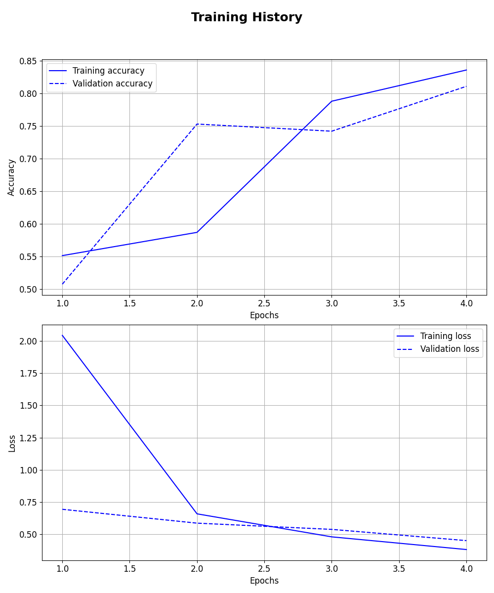

### Detailed Report of Test Set:

|              | precision    | recall       | f1-score     | support      |
| ------------ | ------------ | ------------ | ------------ | ------------ |
| chihuahua    | 0.5342       | 1.0000       | 0.6964       | 477          | 
| muffin       | 0.0000e+00   | 0.0000e+00   | 0.0000e+00   | 416          | 
| micro avg    | 0.5342       | 0.5342       | 0.5342       | 893          | 
| macro avg    | 0.2671       | 0.5000       | 0.3482       | 893          | 
| weighted avg | 0.2853       | 0.5342       | 0.3720       | 893          | 
| samples avg  | 0.5342       | 0.5342       | 0.5342       | 893          | 

## trial_26

*    *Start Time*: 2024-10-17 15:53:08

*    *Duration*: 07.413

*    *Directory*: [Link](./trial_26)

### Hyperparameters:

| Hyperparameter         | Value                  |
| ---------------------- | ---------------------- |
| units1                 | 16                     |
| kernel_size1           | 3                      |
| units2                 | 128                    |
| kernel_size2           | 5                      |
| units3                 | 128                    |
| learning_rate          | 0.00015799305702386086 |

### Evaluation Metrics:

|           | train     | val       | test      |
| --------- | --------- | --------- | --------- |
| accuracy  | 0.5497    | 0.5047    | 0.5342    | 
| precision | 0.5497    | 0.5047    | 0.5342    | 
| recall    | 0.5497    | 0.5047    | 0.5342    | 
| f1        | 0.5497    | 0.5047    | 0.5342    | 

### Figures:

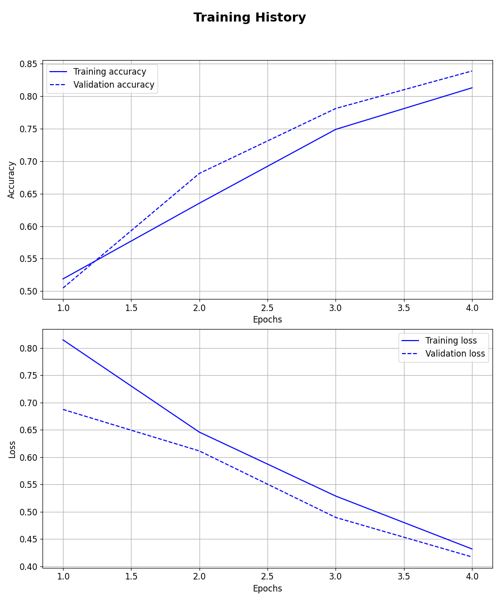

### Detailed Report of Test Set:

|              | precision    | recall       | f1-score     | support      |
| ------------ | ------------ | ------------ | ------------ | ------------ |
| chihuahua    | 0.5342       | 1.0000       | 0.6964       | 477          | 
| muffin       | 0.0000e+00   | 0.0000e+00   | 0.0000e+00   | 416          | 
| micro avg    | 0.5342       | 0.5342       | 0.5342       | 893          | 
| macro avg    | 0.2671       | 0.5000       | 0.3482       | 893          | 
| weighted avg | 0.2853       | 0.5342       | 0.3720       | 893          | 
| samples avg  | 0.5342       | 0.5342       | 0.5342       | 893          | 

## trial_67

*    *Start Time*: 2024-10-17 15:58:27

*    *Duration*: 07.051

*    *Directory*: [Link](./trial_67)

### Hyperparameters:

| Hyperparameter         | Value                  |
| ---------------------- | ---------------------- |
| units1                 | 64                     |
| kernel_size1           | 3                      |
| units2                 | 64                     |
| kernel_size2           | 3                      |
| units3                 | 256                    |
| learning_rate          | 0.00023742963027988175 |

### Evaluation Metrics:

|           | train     | val       | test      |
| --------- | --------- | --------- | --------- |
| accuracy  | 0.5500    | 0.5031    | 0.5342    | 
| precision | 0.5500    | 0.5031    | 0.5342    | 
| recall    | 0.5500    | 0.5031    | 0.5342    | 
| f1        | 0.5500    | 0.5031    | 0.5342    | 

### Figures:

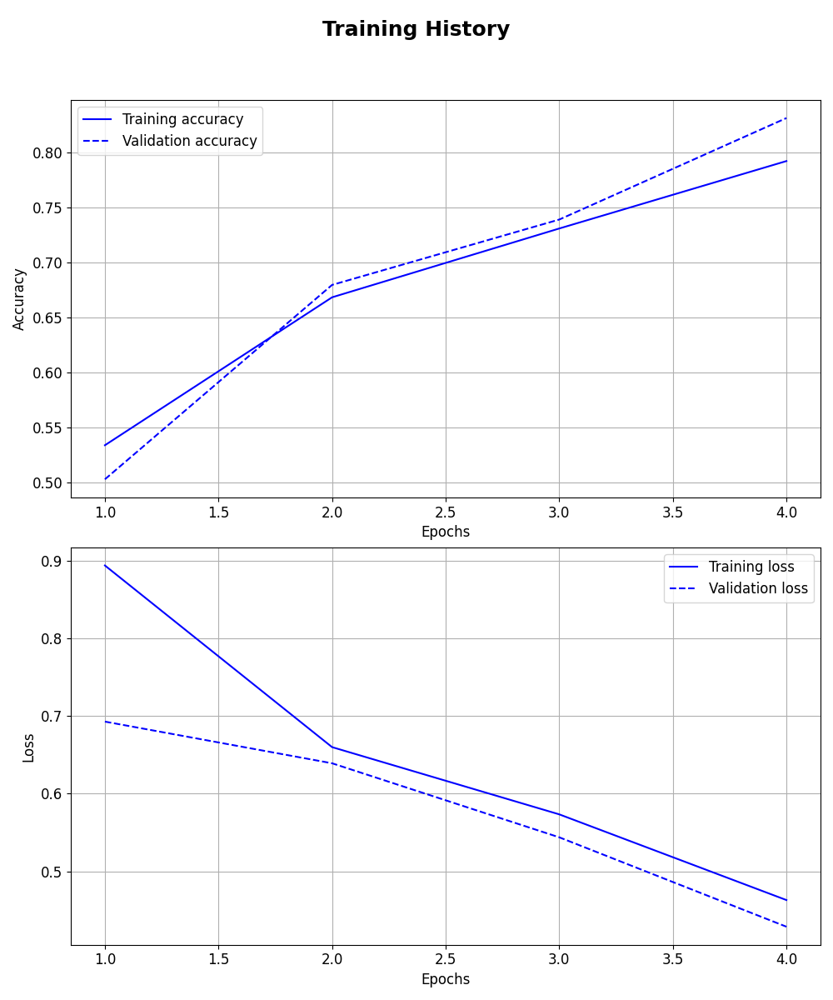

### Detailed Report of Test Set:

|              | precision    | recall       | f1-score     | support      |
| ------------ | ------------ | ------------ | ------------ | ------------ |
| chihuahua    | 0.5342       | 1.0000       | 0.6964       | 477          | 
| muffin       | 0.0000e+00   | 0.0000e+00   | 0.0000e+00   | 416          | 
| micro avg    | 0.5342       | 0.5342       | 0.5342       | 893          | 
| macro avg    | 0.2671       | 0.5000       | 0.3482       | 893          | 
| weighted avg | 0.2853       | 0.5342       | 0.3720       | 893          | 
| samples avg  | 0.5342       | 0.5342       | 0.5342       | 893          | 

## trial_25

*    *Start Time*: 2024-10-17 15:53:02

*    *Duration*: 05.829

*    *Directory*: [Link](./trial_25)

### Hyperparameters:

| Hyperparameter        | Value                 |
| --------------------- | --------------------- |
| units1                | 32                    |
| kernel_size1          | 3                     |
| units2                | 128                   |
| kernel_size2          | 5                     |
| units3                | 64                    |
| learning_rate         | 0.0005216373245570216 |

### Evaluation Metrics:

|           | train     | val       | test      |
| --------- | --------- | --------- | --------- |
| accuracy  | 0.5497    | 0.5047    | 0.5342    | 
| precision | 0.5497    | 0.5047    | 0.5342    | 
| recall    | 0.5497    | 0.5047    | 0.5342    | 
| f1        | 0.5497    | 0.5047    | 0.5342    | 

### Figures:

### Detailed Report of Test Set:

|              | precision    | recall       | f1-score     | support      |
| ------------ | ------------ | ------------ | ------------ | ------------ |
| chihuahua    | 0.5342       | 1.0000       | 0.6964       | 477          | 
| muffin       | 0.0000e+00   | 0.0000e+00   | 0.0000e+00   | 416          | 
| micro avg    | 0.5342       | 0.5342       | 0.5342       | 893          | 
| macro avg    | 0.2671       | 0.5000       | 0.3482       | 893          | 
| weighted avg | 0.2853       | 0.5342       | 0.3720       | 893          | 
| samples avg  | 0.5342       | 0.5342       | 0.5342       | 893          | 

## trial_33

*    *Start Time*: 2024-10-17 15:54:01

*    *Duration*: 05.683

*    *Directory*: [Link](./trial_33)

### Hyperparameters:

| Hyperparameter        | Value                 |
| --------------------- | --------------------- |
| units1                | 64                    |
| kernel_size1          | 3                     |
| units2                | 128                   |
| kernel_size2          | 3                     |
| units3                | 64                    |
| learning_rate         | 0.0007971049060346546 |

### Evaluation Metrics:

|           | train     | val       | test      |
| --------- | --------- | --------- | --------- |
| accuracy  | 0.5497    | 0.5047    | 0.5342    | 
| precision | 0.5497    | 0.5047    | 0.5342    | 
| recall    | 0.5497    | 0.5047    | 0.5342    | 
| f1        | 0.5497    | 0.5047    | 0.5342    | 

### Figures:

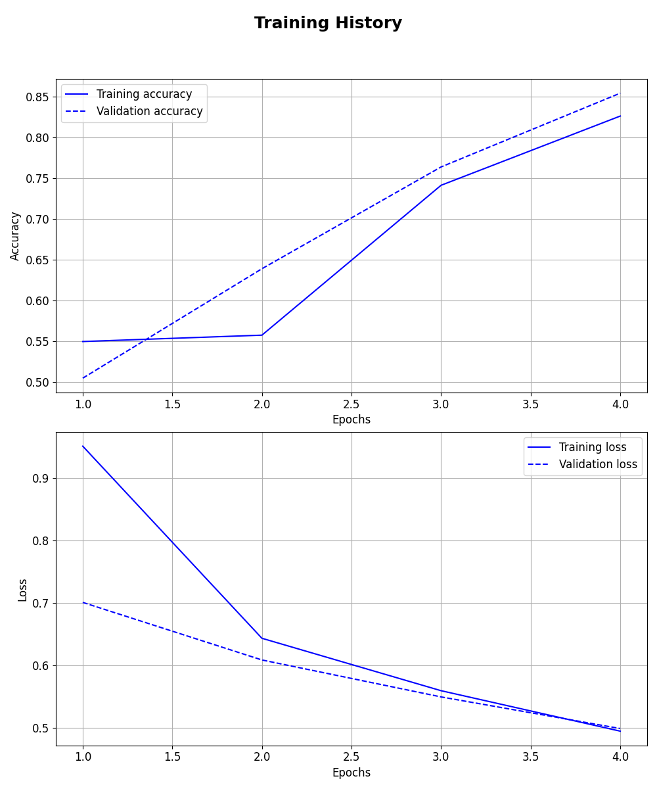

### Detailed Report of Test Set:

|              | precision    | recall       | f1-score     | support      |
| ------------ | ------------ | ------------ | ------------ | ------------ |
| chihuahua    | 0.5342       | 1.0000       | 0.6964       | 477          | 
| muffin       | 0.0000e+00   | 0.0000e+00   | 0.0000e+00   | 416          | 
| micro avg    | 0.5342       | 0.5342       | 0.5342       | 893          | 
| macro avg    | 0.2671       | 0.5000       | 0.3482       | 893          | 
| weighted avg | 0.2853       | 0.5342       | 0.3720       | 893          | 
| samples avg  | 0.5342       | 0.5342       | 0.5342       | 893          | 

## trial_9

*    *Start Time*: 2024-10-17 15:50:49

*    *Duration*: 15.441

*    *Directory*: [Link](./trial_9)

### Hyperparameters:

| Hyperparameter         | Value                  |
| ---------------------- | ---------------------- |
| units1                 | 128                    |
| kernel_size1           | 5                      |
| units2                 | 64                     |
| kernel_size2           | 7                      |
| units3                 | 256                    |
| learning_rate          | 0.00042512924273663873 |

### Evaluation Metrics:

|           | train     | val       | test      |
| --------- | --------- | --------- | --------- |
| accuracy  | 0.5491    | 0.5047    | 0.5342    | 
| precision | 0.5491    | 0.5047    | 0.5342    | 
| recall    | 0.5491    | 0.5047    | 0.5342    | 
| f1        | 0.5491    | 0.5047    | 0.5342    | 

### Figures:

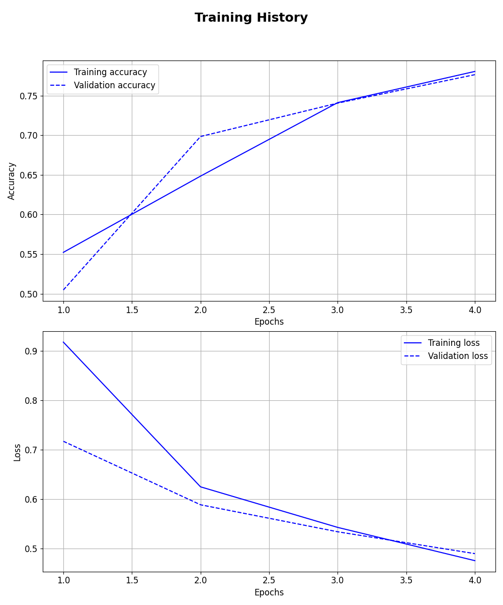

### Detailed Report of Test Set:

|              | precision    | recall       | f1-score     | support      |
| ------------ | ------------ | ------------ | ------------ | ------------ |
| chihuahua    | 0.5342       | 1.0000       | 0.6964       | 477          | 
| muffin       | 0.0000e+00   | 0.0000e+00   | 0.0000e+00   | 416          | 
| micro avg    | 0.5342       | 0.5342       | 0.5342       | 893          | 
| macro avg    | 0.2671       | 0.5000       | 0.3482       | 893          | 
| weighted avg | 0.2853       | 0.5342       | 0.3720       | 893          | 
| samples avg  | 0.5342       | 0.5342       | 0.5342       | 893          | 

## trial_7

*    *Start Time*: 2024-10-17 15:50:31

*    *Duration*: 09.473

*    *Directory*: [Link](./trial_7)

### Hyperparameters:

| Hyperparameter        | Value                 |
| --------------------- | --------------------- |
| units1                | 16                    |
| kernel_size1          | 3                     |
| units2                | 128                   |
| kernel_size2          | 7                     |
| units3                | 512                   |
| learning_rate         | 0.0007973324665490452 |

### Evaluation Metrics:

|           | train     | val       | test      |
| --------- | --------- | --------- | --------- |
| accuracy  | 0.5497    | 0.5047    | 0.5342    | 
| precision | 0.5497    | 0.5047    | 0.5342    | 
| recall    | 0.5497    | 0.5047    | 0.5342    | 
| f1        | 0.5497    | 0.5047    | 0.5342    | 

### Figures:

### Detailed Report of Test Set:

|              | precision    | recall       | f1-score     | support      |
| ------------ | ------------ | ------------ | ------------ | ------------ |
| chihuahua    | 0.5342       | 1.0000       | 0.6964       | 477          | 
| muffin       | 0.0000e+00   | 0.0000e+00   | 0.0000e+00   | 416          | 
| micro avg    | 0.5342       | 0.5342       | 0.5342       | 893          | 
| macro avg    | 0.2671       | 0.5000       | 0.3482       | 893          | 
| weighted avg | 0.2853       | 0.5342       | 0.3720       | 893          | 
| samples avg  | 0.5342       | 0.5342       | 0.5342       | 893          | 

## trial_84

*    *Start Time*: 2024-10-17 16:31:20

*    *Duration*: 07.297

*    *Directory*: [Link](./trial_84)

### Hyperparameters:

| Hyperparameter         | Value                  |
| ---------------------- | ---------------------- |
| units1                 | 64                     |
| kernel_size1           | 3                      |
| units2                 | 128                    |
| kernel_size2           | 3                      |
| units3                 | 256                    |
| learning_rate          | 0.00029498764453349827 |

### Evaluation Metrics:

|           | train     | val       | test      |
| --------- | --------- | --------- | --------- |
| accuracy  | 0.5497    | 0.5047    | 0.5342    | 
| precision | 0.5497    | 0.5047    | 0.5342    | 
| recall    | 0.5497    | 0.5047    | 0.5342    | 
| f1        | 0.5497    | 0.5047    | 0.5342    | 

### Figures:

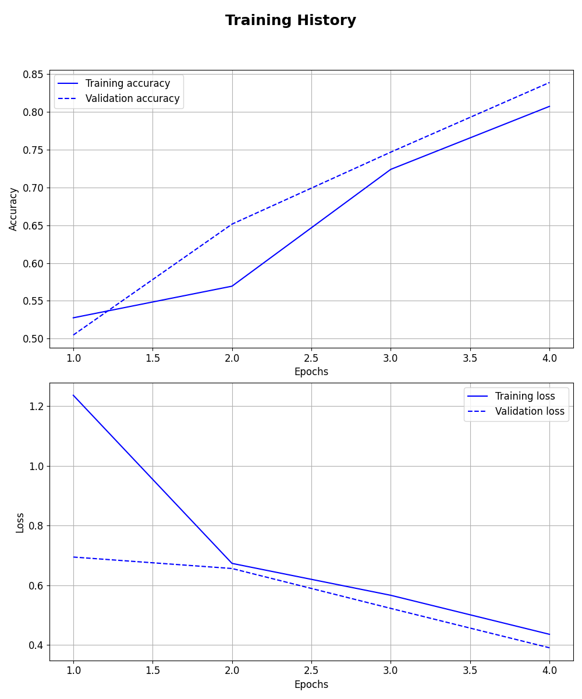

### Detailed Report of Test Set:

|              | precision    | recall       | f1-score     | support      |
| ------------ | ------------ | ------------ | ------------ | ------------ |
| chihuahua    | 0.5342       | 1.0000       | 0.6964       | 477          | 
| muffin       | 0.0000e+00   | 0.0000e+00   | 0.0000e+00   | 416          | 
| micro avg    | 0.5342       | 0.5342       | 0.5342       | 893          | 
| macro avg    | 0.2671       | 0.5000       | 0.3482       | 893          | 
| weighted avg | 0.2853       | 0.5342       | 0.3720       | 893          | 
| samples avg  | 0.5342       | 0.5342       | 0.5342       | 893          | 

## trial_57

*    *Start Time*: 2024-10-17 15:57:11

*    *Duration*: 07.492

*    *Directory*: [Link](./trial_57)

### Hyperparameters:

| Hyperparameter        | Value                 |
| --------------------- | --------------------- |
| units1                | 128                   |
| kernel_size1          | 3                     |
| units2                | 128                   |
| kernel_size2          | 3                     |
| units3                | 64                    |
| learning_rate         | 0.0003372031799309741 |

### Evaluation Metrics:

|           | train     | val       | test      |
| --------- | --------- | --------- | --------- |
| accuracy  | 0.5500    | 0.5000    | 0.5330    | 
| precision | 0.5500    | 0.5000    | 0.5330    | 
| recall    | 0.5500    | 0.5000    | 0.5330    | 
| f1        | 0.5500    | 0.5000    | 0.5330    | 

### Figures:

### Detailed Report of Test Set:

|              | precision    | recall       | f1-score     | support      |
| ------------ | ------------ | ------------ | ------------ | ------------ |
| chihuahua    | 0.5336       | 0.9979       | 0.6954       | 477          | 
| muffin       | 0.0000e+00   | 0.0000e+00   | 0.0000e+00   | 416          | 
| micro avg    | 0.5330       | 0.5330       | 0.5330       | 893          | 
| macro avg    | 0.2668       | 0.4990       | 0.3477       | 893          | 
| weighted avg | 0.2850       | 0.5330       | 0.3715       | 893          | 
| samples avg  | 0.5330       | 0.5330       | 0.5330       | 893          | 

## trial_71

*    *Start Time*: 2024-10-17 15:58:56

*    *Duration*: 07.286

*    *Directory*: [Link](./trial_71)

### Hyperparameters:

| Hyperparameter        | Value                 |
| --------------------- | --------------------- |
| units1                | 128                   |
| kernel_size1          | 3                     |
| units2                | 128                   |
| kernel_size2          | 3                     |
| units3                | 128                   |
| learning_rate         | 0.0001672863227760101 |

### Evaluation Metrics:

|           | train     | val       | test      |
| --------- | --------- | --------- | --------- |
| accuracy  | 0.5506    | 0.5000    | 0.5330    | 
| precision | 0.5506    | 0.5000    | 0.5330    | 
| recall    | 0.5506    | 0.5000    | 0.5330    | 
| f1        | 0.5506    | 0.5000    | 0.5330    | 

### Figures:

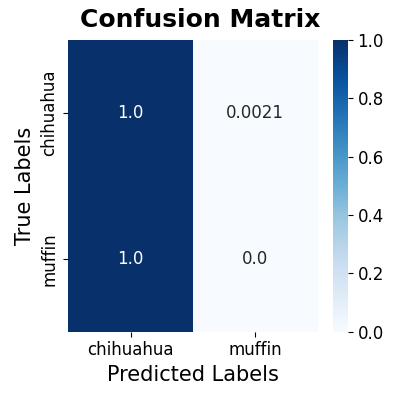

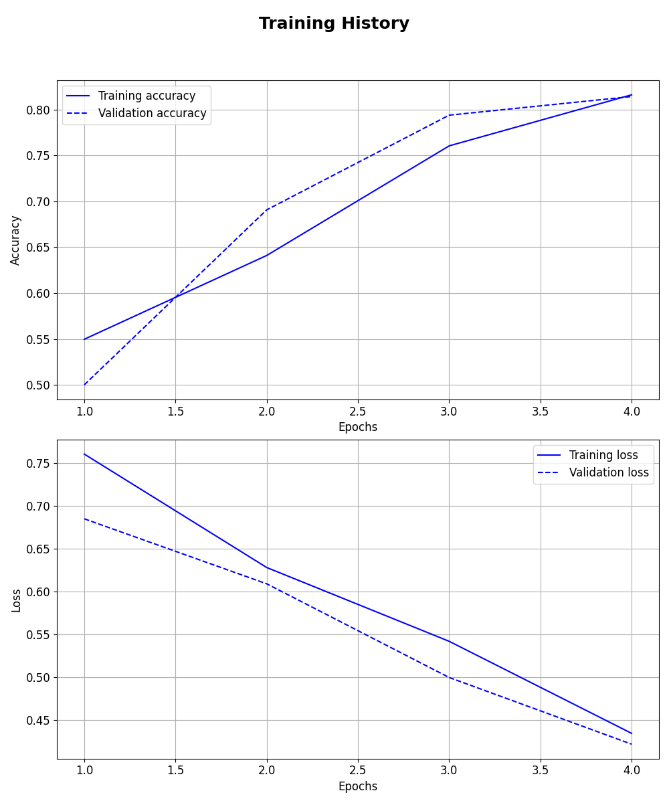

### Detailed Report of Test Set:

|              | precision    | recall       | f1-score     | support      |
| ------------ | ------------ | ------------ | ------------ | ------------ |
| chihuahua    | 0.5336       | 0.9979       | 0.6954       | 477          | 
| muffin       | 0.0000e+00   | 0.0000e+00   | 0.0000e+00   | 416          | 
| micro avg    | 0.5330       | 0.5330       | 0.5330       | 893          | 
| macro avg    | 0.2668       | 0.4990       | 0.3477       | 893          | 
| weighted avg | 0.2850       | 0.5330       | 0.3715       | 893          | 
| samples avg  | 0.5330       | 0.5330       | 0.5330       | 893          | 

