# Experiment Report: Chihuahua vs Muffin Test Experiment

## Metadata

*    *Description*: In this experiment, a convolutional neural network with increased complexity and dropout is trained.

*    *Start Time*: 2024-10-20 11:30:50

*    *Last Resume Time*: 2024-10-20 11:37:59

*    *Total Duration*: 0:51:15.588

*    *Directory*: [Link](./.)

## Initial Visualizations

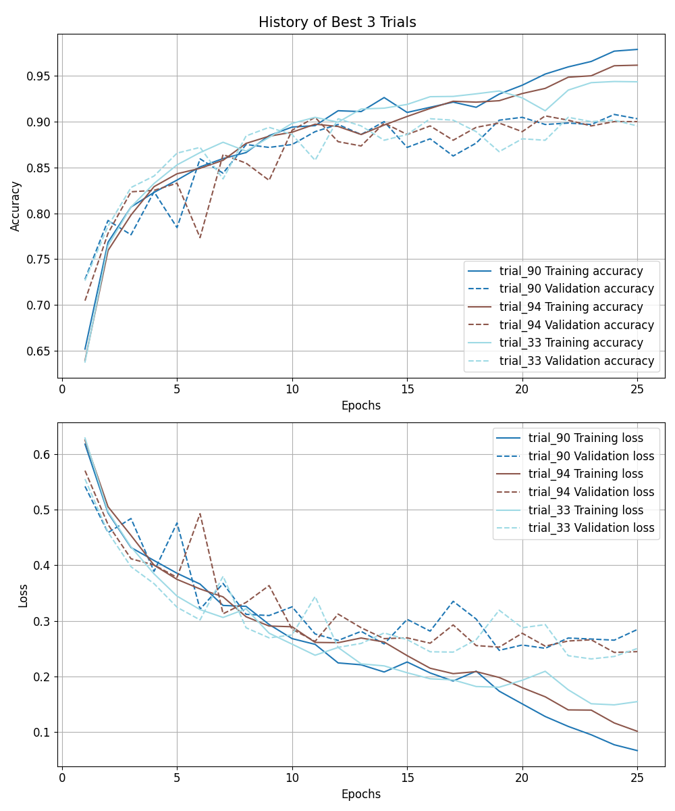

## Summary

### Hyperparameters

|               | units1        | kernel_size1  | units2        | kernel_size2  | dense_units   | dropout_rate  | learning_rate | Chapters      |
| ------------- | ------------- | ------------- | ------------- | ------------- | ------------- | ------------- | ------------- | ------------- |
| trial_90      | 128           | 5             | 64            | 7             | 128           | 0.1507        | 1.5730e-04    | [Chapter](#trial_90) | 
| trial_94      | 128           | 3             | 64            | 7             | 128           | 0.2049        | 1.3489e-04    | [Chapter](#trial_94) | 
| trial_33      | 128           | 3             | 64            | 5             | 128           | 0.1386        | 1.2009e-04    | [Chapter](#trial_33) | 
| trial_28      | 128           | 3             | 64            | 3             | 256           | 0.0943        | 1.6341e-04    | [Chapter](#trial_28) | 
| trial_83      | 128           | 3             | 64            | 7             | 512           | 0.1850        | 1.1528e-04    | [Chapter](#trial_83) | 
| trial_30      | 128           | 3             | 64            | 5             | 128           | 0.0796        | 1.2680e-04    | [Chapter](#trial_30) | 
| trial_35      | 128           | 3             | 64            | 7             | 128           | 0.1460        | 6.8260e-05    | [Chapter](#trial_35) | 
| trial_55      | 128           | 3             | 64            | 7             | 256           | 0.2646        | 1.0341e-04    | [Chapter](#trial_55) | 
| trial_82      | 128           | 3             | 64            | 7             | 128           | 0.2092        | 7.7721e-05    | [Chapter](#trial_82) | 
| trial_56      | 128           | 3             | 64            | 7             | 512           | 0.1594        | 7.6385e-05    | [Chapter](#trial_56) | 
| trial_64      | 128           | 3             | 16            | 5             | 128           | 0.1959        | 2.1726e-04    | [Chapter](#trial_64) | 
| trial_69      | 128           | 3             | 64            | 7             | 512           | 0.1766        | 4.2045e-05    | [Chapter](#trial_69) | 
| trial_75      | 64            | 3             | 64            | 7             | 128           | 0.0350        | 3.6182e-05    | [Chapter](#trial_75) | 
| trial_6       | 128           | 7             | 16            | 5             | 512           | 0.4480        | 8.1647e-05    | [Chapter](#trial_6) | 
| trial_42      | 128           | 3             | 64            | 7             | 128           | 0.1101        | 7.1873e-05    | [Chapter](#trial_42) | 
| trial_49      | 128           | 3             | 64            | 7             | 256           | 0.2283        | 4.9445e-05    | [Chapter](#trial_49) | 
| trial_86      | 128           | 3             | 64            | 5             | 256           | 0.0809        | 1.0668e-04    | [Chapter](#trial_86) | 
| trial_51      | 128           | 5             | 64            | 7             | 256           | 0.2759        | 2.7196e-04    | [Chapter](#trial_51) | 
| trial_58      | 128           | 3             | 32            | 7             | 512           | 0.3145        | 4.8583e-05    | [Chapter](#trial_58) | 
| trial_79      | 128           | 5             | 32            | 7             | 256           | 0.2268        | 1.6398e-04    | [Chapter](#trial_79) | 
| trial_96      | 128           | 3             | 64            | 7             | 128           | 0.2323        | 3.9153e-05    | [Chapter](#trial_96) | 
| trial_84      | 128           | 7             | 64            | 7             | 128           | 0.1061        | 9.0273e-05    | [Chapter](#trial_84) | 
| trial_29      | 64            | 3             | 64            | 7             | 128           | 0.2166        | 6.8364e-05    | [Chapter](#trial_29) | 
| trial_43      | 128           | 3             | 64            | 7             | 128           | 0.2266        | 7.7366e-05    | [Chapter](#trial_43) | 
| trial_46      | 128           | 3             | 64            | 7             | 128           | 0.0365        | 1.3457e-04    | [Chapter](#trial_46) | 
| trial_47      | 128           | 3             | 64            | 7             | 256           | 0.1590        | 1.0751e-04    | [Chapter](#trial_47) | 
| trial_93      | 128           | 3             | 64            | 7             | 128           | 0.2192        | 5.5498e-05    | [Chapter](#trial_93) | 
| trial_9       | 64            | 7             | 64            | 7             | 256           | 0.4399        | 4.1473e-05    | [Chapter](#trial_9) | 
| trial_52      | 128           | 3             | 64            | 7             | 256           | 0.2263        | 5.1771e-05    | [Chapter](#trial_52) | 
| trial_53      | 128           | 3             | 64            | 7             | 256           | 0.2004        | 5.8430e-05    | [Chapter](#trial_53) | 
| trial_92      | 64            | 3             | 64            | 7             | 128           | 0.2180        | 5.4860e-05    | [Chapter](#trial_92) | 
| trial_25      | 128           | 3             | 64            | 3             | 256           | 0.1041        | 5.1592e-05    | [Chapter](#trial_25) | 
| trial_32      | 128           | 3             | 64            | 3             | 128           | 0.0880        | 1.4323e-04    | [Chapter](#trial_32) | 
| trial_76      | 128           | 3             | 64            | 7             | 128           | 0.2247        | 7.8767e-05    | [Chapter](#trial_76) | 
| trial_4       | 128           | 7             | 16            | 7             | 128           | 0.4268        | 9.8775e-05    | [Chapter](#trial_4) | 
| trial_37      | 128           | 3             | 64            | 5             | 128           | 0.1696        | 2.6938e-04    | [Chapter](#trial_37) | 
| trial_44      | 128           | 3             | 64            | 7             | 128           | 0.3040        | 1.9680e-04    | [Chapter](#trial_44) | 
| trial_31      | 128           | 3             | 64            | 5             | 128           | 0.2051        | 2.7578e-04    | [Chapter](#trial_31) | 
| trial_41      | 128           | 3             | 64            | 5             | 128           | 0.2579        | 7.4715e-04    | [Chapter](#trial_41) | 
| trial_50      | 128           | 3             | 64            | 7             | 256           | 0.2459        | 1.7503e-04    | [Chapter](#trial_50) | 
| trial_89      | 128           | 3             | 64            | 5             | 256           | 0.1724        | 9.5599e-05    | [Chapter](#trial_89) | 
| trial_10      | 64            | 7             | 64            | 5             | 512           | 0.3580        | 8.7540e-05    | [Chapter](#trial_10) | 
| trial_38      | 128           | 3             | 64            | 7             | 128           | 0.0517        | 6.9300e-05    | [Chapter](#trial_38) | 
| trial_59      | 128           | 3             | 64            | 7             | 256           | 0.2373        | 3.3638e-05    | [Chapter](#trial_59) | 
| trial_67      | 128           | 3             | 64            | 7             | 256           | 0.2240        | 6.0778e-05    | [Chapter](#trial_67) | 
| trial_85      | 128           | 3             | 64            | 3             | 256           | 0.2651        | 3.6381e-04    | [Chapter](#trial_85) | 
| trial_88      | 128           | 3             | 64            | 7             | 128           | 0.2385        | 4.6586e-05    | [Chapter](#trial_88) | 
| trial_97      | 128           | 3             | 64            | 7             | 128           | 0.2802        | 3.0768e-05    | [Chapter](#trial_97) | 
| trial_73      | 64            | 3             | 64            | 7             | 128           | 0.1506        | 1.0023e-04    | [Chapter](#trial_73) | 
| trial_74      | 64            | 3             | 64            | 7             | 128           | 0.1171        | 5.4771e-05    | [Chapter](#trial_74) | 
| trial_99      | 128           | 3             | 64            | 7             | 128           | 0.2479        | 4.4923e-05    | [Chapter](#trial_99) | 
| trial_80      | 128           | 5             | 64            | 7             | 256           | 0.1720        | 1.4726e-04    | [Chapter](#trial_80) | 
| trial_87      | 128           | 3             | 64            | 7             | 512           | 0.1332        | 1.9327e-04    | [Chapter](#trial_87) | 
| trial_24      | 128           | 3             | 64            | 3             | 256           | 0.0793        | 4.0887e-05    | [Chapter](#trial_24) | 
| trial_27      | 64            | 5             | 64            | 5             | 256           | 0.1694        | 4.0699e-05    | [Chapter](#trial_27) | 
| trial_68      | 128           | 3             | 64            | 5             | 128           | 0.1311        | 8.7547e-05    | [Chapter](#trial_68) | 
| trial_54      | 128           | 3             | 64            | 7             | 256           | 0.1189        | 2.7378e-05    | [Chapter](#trial_54) | 
| trial_72      | 64            | 3             | 64            | 7             | 128           | 0.2099        | 6.9659e-05    | [Chapter](#trial_72) | 
| trial_7       | 128           | 7             | 64            | 5             | 256           | 0.2871        | 5.2490e-04    | [Chapter](#trial_7) | 
| trial_16      | 64            | 5             | 64            | 5             | 512           | 0.4355        | 3.6410e-04    | [Chapter](#trial_16) | 
| trial_26      | 128           | 5             | 64            | 3             | 128           | 0.1178        | 5.0798e-05    | [Chapter](#trial_26) | 
| trial_34      | 128           | 3             | 64            | 5             | 128           | 0.1420        | 1.2296e-04    | [Chapter](#trial_34) | 
| trial_40      | 128           | 5             | 32            | 5             | 512           | 0.1858        | 9.6667e-05    | [Chapter](#trial_40) | 
| trial_48      | 128           | 5             | 64            | 7             | 256           | 0.1605        | 8.1628e-05    | [Chapter](#trial_48) | 
| trial_63      | 128           | 3             | 64            | 5             | 128           | 0.1294        | 8.2640e-05    | [Chapter](#trial_63) | 
| trial_70      | 128           | 3             | 64            | 5             | 128           | 0.0928        | 1.2935e-04    | [Chapter](#trial_70) | 
| trial_77      | 128           | 5             | 64            | 7             | 256           | 0.1833        | 1.4985e-04    | [Chapter](#trial_77) | 
| trial_100     | 128           | 3             | 64            | 7             | 128           | 0.2539        | 6.3859e-05    | [Chapter](#trial_100) | 
| trial_36      | 128           | 3             | 64            | 5             | 128           | 0.1446        | 1.1419e-04    | [Chapter](#trial_36) | 
| trial_39      | 128           | 3             | 64            | 5             | 128           | 0.1309        | 2.6854e-05    | [Chapter](#trial_39) | 
| trial_18      | 128           | 3             | 32            | 3             | 512           | 0.0155        | 1.9491e-05    | [Chapter](#trial_18) | 
| trial_23      | 128           | 3             | 64            | 3             | 512           | 0.0615        | 1.6440e-05    | [Chapter](#trial_23) | 
| trial_15      | 64            | 7             | 32            | 7             | 128           | 0.3236        | 5.8053e-05    | [Chapter](#trial_15) | 
| trial_98      | 128           | 3             | 32            | 7             | 128           | 0.2301        | 3.9508e-05    | [Chapter](#trial_98) | 
| trial_61      | 128           | 3             | 64            | 7             | 256           | 0.2917        | 1.5022e-04    | [Chapter](#trial_61) | 
| trial_71      | 128           | 3             | 32            | 3             | 128           | 0.1412        | 6.4341e-05    | [Chapter](#trial_71) | 
| trial_12      | 64            | 5             | 32            | 7             | 512           | 0.4965        | 3.5515e-05    | [Chapter](#trial_12) | 
| trial_78      | 128           | 5             | 64            | 7             | 256           | 0.1921        | 2.2716e-04    | [Chapter](#trial_78) | 
| trial_13      | 64            | 7             | 32            | 3             | 512           | 0.3780        | 3.3661e-05    | [Chapter](#trial_13) | 
| trial_19      | 128           | 3             | 64            | 3             | 256           | 0.0430        | 1.9288e-05    | [Chapter](#trial_19) | 
| trial_60      | 128           | 3             | 64            | 7             | 128           | 0.3438        | 4.6015e-05    | [Chapter](#trial_60) | 
| trial_66      | 128           | 3             | 64            | 5             | 128           | 0.0682        | 5.9857e-04    | [Chapter](#trial_66) | 
| trial_3       | 128           | 3             | 64            | 3             | 256           | 0.1456        | 7.1378e-04    | [Chapter](#trial_3) | 
| trial_62      | 128           | 3             | 64            | 5             | 128           | 0.1011        | 1.2276e-04    | [Chapter](#trial_62) | 
| trial_17      | 64            | 7             | 16            | 7             | 256           | 0.2101        | 5.3669e-05    | [Chapter](#trial_17) | 
| trial_20      | 64            | 3             | 64            | 3             | 128           | 0.0105        | 2.1805e-05    | [Chapter](#trial_20) | 
| trial_57      | 128           | 3             | 64            | 7             | 256           | 0.0773        | 6.2421e-05    | [Chapter](#trial_57) | 
| trial_8       | 128           | 5             | 64            | 3             | 256           | 0.1095        | 2.0019e-04    | [Chapter](#trial_8) | 
| trial_5       | 128           | 7             | 64            | 5             | 256           | 0.2761        | 1.8135e-04    | [Chapter](#trial_5) | 
| trial_65      | 128           | 3             | 32            | 5             | 128           | 0.1582        | 1.1012e-04    | [Chapter](#trial_65) | 
| trial_81      | 128           | 7             | 64            | 7             | 256           | 0.2502        | 9.4930e-04    | [Chapter](#trial_81) | 
| trial_22      | 128           | 3             | 32            | 3             | 256           | 0.0148        | 1.9809e-05    | [Chapter](#trial_22) | 
| trial_91      | 128           | 3             | 64            | 7             | 256           | 0.0637        | 7.0192e-05    | [Chapter](#trial_91) | 
| trial_2       | 128           | 7             | 16            | 7             | 512           | 0.1809        | 3.0268e-05    | [Chapter](#trial_2) | 
| trial_21      | 128           | 3             | 64            | 3             | 256           | 0.2371        | 1.0038e-05    | [Chapter](#trial_21) | 
| trial_45      | 128           | 3             | 64            | 7             | 128           | 0.1865        | 9.3056e-05    | [Chapter](#trial_45) | 
| trial_14      | 64            | 5             | 16            | 5             | 512           | 0.3940        | 1.4469e-05    | [Chapter](#trial_14) | 
| trial_1       | 128           | 3             | 64            | 5             | 512           | 0.0670        | 1.0874e-04    | [Chapter](#trial_1) | 
| trial_95      | 128           | 3             | 64            | 7             | 128           | 0.2036        | 7.7150e-05    | [Chapter](#trial_95) | 
| trial_11      | 64            | 5             | 32            | 7             | 128           | 0.4852        | 1.0108e-05    | [Chapter](#trial_11) | 

### Test Results

|           | accuracy  | precision | recall    | f1        | Chapters  |
| --------- | --------- | --------- | --------- | --------- | --------- |
| trial_90  | 0.9160    | 0.9160    | 0.9160    | 0.9160    | [Chapter](#trial_90) | 
| trial_94  | 0.9160    | 0.9160    | 0.9160    | 0.9160    | [Chapter](#trial_94) | 
| trial_33  | 0.9104    | 0.9104    | 0.9104    | 0.9104    | [Chapter](#trial_33) | 
| trial_28  | 0.9093    | 0.9093    | 0.9093    | 0.9093    | [Chapter](#trial_28) | 
| trial_83  | 0.9071    | 0.9071    | 0.9071    | 0.9071    | [Chapter](#trial_83) | 
| trial_30  | 0.9059    | 0.9059    | 0.9059    | 0.9059    | [Chapter](#trial_30) | 
| trial_35  | 0.9048    | 0.9048    | 0.9048    | 0.9048    | [Chapter](#trial_35) | 
| trial_55  | 0.9048    | 0.9048    | 0.9048    | 0.9048    | [Chapter](#trial_55) | 
| trial_82  | 0.9048    | 0.9048    | 0.9048    | 0.9048    | [Chapter](#trial_82) | 
| trial_56  | 0.9037    | 0.9037    | 0.9037    | 0.9037    | [Chapter](#trial_56) | 
| trial_64  | 0.9026    | 0.9026    | 0.9026    | 0.9026    | [Chapter](#trial_64) | 
| trial_69  | 0.9026    | 0.9026    | 0.9026    | 0.9026    | [Chapter](#trial_69) | 
| trial_75  | 0.9026    | 0.9026    | 0.9026    | 0.9026    | [Chapter](#trial_75) | 
| trial_6   | 0.9015    | 0.9015    | 0.9015    | 0.9015    | [Chapter](#trial_6) | 
| trial_42  | 0.9015    | 0.9015    | 0.9015    | 0.9015    | [Chapter](#trial_42) | 
| trial_49  | 0.9015    | 0.9015    | 0.9015    | 0.9015    | [Chapter](#trial_49) | 
| trial_86  | 0.9015    | 0.9015    | 0.9015    | 0.9015    | [Chapter](#trial_86) | 
| trial_51  | 0.9003    | 0.9003    | 0.9003    | 0.9003    | [Chapter](#trial_51) | 
| trial_58  | 0.9003    | 0.9003    | 0.9003    | 0.9003    | [Chapter](#trial_58) | 
| trial_79  | 0.9003    | 0.9003    | 0.9003    | 0.9003    | [Chapter](#trial_79) | 
| trial_96  | 0.9003    | 0.9003    | 0.9003    | 0.9003    | [Chapter](#trial_96) | 
| trial_84  | 0.8992    | 0.8992    | 0.8992    | 0.8992    | [Chapter](#trial_84) | 
| trial_29  | 0.8981    | 0.8981    | 0.8981    | 0.8981    | [Chapter](#trial_29) | 
| trial_43  | 0.8981    | 0.8981    | 0.8981    | 0.8981    | [Chapter](#trial_43) | 
| trial_46  | 0.8981    | 0.8981    | 0.8981    | 0.8981    | [Chapter](#trial_46) | 
| trial_47  | 0.8981    | 0.8981    | 0.8981    | 0.8981    | [Chapter](#trial_47) | 
| trial_93  | 0.8981    | 0.8981    | 0.8981    | 0.8981    | [Chapter](#trial_93) | 
| trial_9   | 0.8970    | 0.8970    | 0.8970    | 0.8970    | [Chapter](#trial_9) | 
| trial_52  | 0.8970    | 0.8970    | 0.8970    | 0.8970    | [Chapter](#trial_52) | 
| trial_53  | 0.8970    | 0.8970    | 0.8970    | 0.8970    | [Chapter](#trial_53) | 
| trial_92  | 0.8970    | 0.8970    | 0.8970    | 0.8970    | [Chapter](#trial_92) | 
| trial_25  | 0.8959    | 0.8959    | 0.8959    | 0.8959    | [Chapter](#trial_25) | 
| trial_32  | 0.8959    | 0.8959    | 0.8959    | 0.8959    | [Chapter](#trial_32) | 
| trial_76  | 0.8959    | 0.8959    | 0.8959    | 0.8959    | [Chapter](#trial_76) | 
| trial_4   | 0.8936    | 0.8936    | 0.8936    | 0.8936    | [Chapter](#trial_4) | 
| trial_37  | 0.8936    | 0.8936    | 0.8936    | 0.8936    | [Chapter](#trial_37) | 
| trial_44  | 0.8936    | 0.8936    | 0.8936    | 0.8936    | [Chapter](#trial_44) | 
| trial_31  | 0.8925    | 0.8925    | 0.8925    | 0.8925    | [Chapter](#trial_31) | 
| trial_41  | 0.8925    | 0.8925    | 0.8925    | 0.8925    | [Chapter](#trial_41) | 
| trial_50  | 0.8925    | 0.8925    | 0.8925    | 0.8925    | [Chapter](#trial_50) | 
| trial_89  | 0.8925    | 0.8925    | 0.8925    | 0.8925    | [Chapter](#trial_89) | 
| trial_10  | 0.8914    | 0.8914    | 0.8914    | 0.8914    | [Chapter](#trial_10) | 
| trial_38  | 0.8914    | 0.8914    | 0.8914    | 0.8914    | [Chapter](#trial_38) | 
| trial_59  | 0.8914    | 0.8914    | 0.8914    | 0.8914    | [Chapter](#trial_59) | 
| trial_67  | 0.8914    | 0.8914    | 0.8914    | 0.8914    | [Chapter](#trial_67) | 
| trial_85  | 0.8914    | 0.8914    | 0.8914    | 0.8914    | [Chapter](#trial_85) | 
| trial_88  | 0.8914    | 0.8914    | 0.8914    | 0.8914    | [Chapter](#trial_88) | 
| trial_97  | 0.8914    | 0.8914    | 0.8914    | 0.8914    | [Chapter](#trial_97) | 
| trial_73  | 0.8903    | 0.8903    | 0.8903    | 0.8903    | [Chapter](#trial_73) | 
| trial_74  | 0.8903    | 0.8903    | 0.8903    | 0.8903    | [Chapter](#trial_74) | 
| trial_99  | 0.8903    | 0.8903    | 0.8903    | 0.8903    | [Chapter](#trial_99) | 
| trial_80  | 0.8891    | 0.8891    | 0.8891    | 0.8891    | [Chapter](#trial_80) | 
| trial_87  | 0.8891    | 0.8891    | 0.8891    | 0.8891    | [Chapter](#trial_87) | 
| trial_24  | 0.8880    | 0.8880    | 0.8880    | 0.8880    | [Chapter](#trial_24) | 
| trial_27  | 0.8880    | 0.8880    | 0.8880    | 0.8880    | [Chapter](#trial_27) | 
| trial_68  | 0.8880    | 0.8880    | 0.8880    | 0.8880    | [Chapter](#trial_68) | 
| trial_54  | 0.8869    | 0.8869    | 0.8869    | 0.8869    | [Chapter](#trial_54) | 
| trial_72  | 0.8869    | 0.8869    | 0.8869    | 0.8869    | [Chapter](#trial_72) | 
| trial_7   | 0.8858    | 0.8858    | 0.8858    | 0.8858    | [Chapter](#trial_7) | 
| trial_16  | 0.8858    | 0.8858    | 0.8858    | 0.8858    | [Chapter](#trial_16) | 
| trial_26  | 0.8858    | 0.8858    | 0.8858    | 0.8858    | [Chapter](#trial_26) | 
| trial_34  | 0.8847    | 0.8847    | 0.8847    | 0.8847    | [Chapter](#trial_34) | 
| trial_40  | 0.8847    | 0.8847    | 0.8847    | 0.8847    | [Chapter](#trial_40) | 
| trial_48  | 0.8847    | 0.8847    | 0.8847    | 0.8847    | [Chapter](#trial_48) | 
| trial_63  | 0.8847    | 0.8847    | 0.8847    | 0.8847    | [Chapter](#trial_63) | 
| trial_70  | 0.8847    | 0.8847    | 0.8847    | 0.8847    | [Chapter](#trial_70) | 
| trial_77  | 0.8847    | 0.8847    | 0.8847    | 0.8847    | [Chapter](#trial_77) | 
| trial_100 | 0.8847    | 0.8847    | 0.8847    | 0.8847    | [Chapter](#trial_100) | 
| trial_36  | 0.8835    | 0.8835    | 0.8835    | 0.8835    | [Chapter](#trial_36) | 
| trial_39  | 0.8835    | 0.8835    | 0.8835    | 0.8835    | [Chapter](#trial_39) | 
| trial_18  | 0.8824    | 0.8824    | 0.8824    | 0.8824    | [Chapter](#trial_18) | 
| trial_23  | 0.8813    | 0.8813    | 0.8813    | 0.8813    | [Chapter](#trial_23) | 
| trial_15  | 0.8791    | 0.8791    | 0.8791    | 0.8791    | [Chapter](#trial_15) | 
| trial_98  | 0.8779    | 0.8779    | 0.8779    | 0.8779    | [Chapter](#trial_98) | 
| trial_61  | 0.8768    | 0.8768    | 0.8768    | 0.8768    | [Chapter](#trial_61) | 
| trial_71  | 0.8768    | 0.8768    | 0.8768    | 0.8768    | [Chapter](#trial_71) | 
| trial_12  | 0.8746    | 0.8746    | 0.8746    | 0.8746    | [Chapter](#trial_12) | 
| trial_78  | 0.8746    | 0.8746    | 0.8746    | 0.8746    | [Chapter](#trial_78) | 
| trial_13  | 0.8735    | 0.8735    | 0.8735    | 0.8735    | [Chapter](#trial_13) | 
| trial_19  | 0.8735    | 0.8735    | 0.8735    | 0.8735    | [Chapter](#trial_19) | 
| trial_60  | 0.8723    | 0.8723    | 0.8723    | 0.8723    | [Chapter](#trial_60) | 
| trial_66  | 0.8712    | 0.8712    | 0.8712    | 0.8712    | [Chapter](#trial_66) | 
| trial_3   | 0.8701    | 0.8701    | 0.8701    | 0.8701    | [Chapter](#trial_3) | 
| trial_62  | 0.8701    | 0.8701    | 0.8701    | 0.8701    | [Chapter](#trial_62) | 
| trial_17  | 0.8690    | 0.8690    | 0.8690    | 0.8690    | [Chapter](#trial_17) | 
| trial_20  | 0.8690    | 0.8690    | 0.8690    | 0.8690    | [Chapter](#trial_20) | 
| trial_57  | 0.8690    | 0.8690    | 0.8690    | 0.8690    | [Chapter](#trial_57) | 
| trial_8   | 0.8667    | 0.8667    | 0.8667    | 0.8667    | [Chapter](#trial_8) | 
| trial_5   | 0.8634    | 0.8634    | 0.8634    | 0.8634    | [Chapter](#trial_5) | 
| trial_65  | 0.8634    | 0.8634    | 0.8634    | 0.8634    | [Chapter](#trial_65) | 
| trial_81  | 0.8634    | 0.8634    | 0.8634    | 0.8634    | [Chapter](#trial_81) | 
| trial_22  | 0.8611    | 0.8611    | 0.8611    | 0.8611    | [Chapter](#trial_22) | 
| trial_91  | 0.8611    | 0.8611    | 0.8611    | 0.8611    | [Chapter](#trial_91) | 
| trial_2   | 0.8600    | 0.8600    | 0.8600    | 0.8600    | [Chapter](#trial_2) | 
| trial_21  | 0.8511    | 0.8511    | 0.8511    | 0.8511    | [Chapter](#trial_21) | 
| trial_45  | 0.8499    | 0.8499    | 0.8499    | 0.8499    | [Chapter](#trial_45) | 
| trial_14  | 0.8466    | 0.8466    | 0.8466    | 0.8466    | [Chapter](#trial_14) | 
| trial_1   | 0.8309    | 0.8309    | 0.8309    | 0.8309    | [Chapter](#trial_1) | 
| trial_95  | 0.8275    | 0.8275    | 0.8275    | 0.8275    | [Chapter](#trial_95) | 
| trial_11  | 0.8052    | 0.8052    | 0.8052    | 0.8052    | [Chapter](#trial_11) | 

## trial_90

*    *Start Time*: 2024-10-20 12:23:10

*    *Duration*: 33.507

*    *Directory*: [Link](./trial_90)

### Hyperparameters:

| Hyperparameter         | Value                  |
| ---------------------- | ---------------------- |
| units1                 | 128                    |
| kernel_size1           | 5                      |
| units2                 | 64                     |
| kernel_size2           | 7                      |
| dense_units            | 128                    |
| dropout_rate           | 0.15073888319621384    |
| learning_rate          | 0.00015729605914757832 |

### Evaluation Metrics:

|           | train     | val       | test      |
| --------- | --------- | --------- | --------- |
| accuracy  | 0.9856    | 0.9031    | 0.9160    | 
| precision | 0.9856    | 0.9031    | 0.9160    | 
| recall    | 0.9856    | 0.9031    | 0.9160    | 
| f1        | 0.9856    | 0.9031    | 0.9160    | 

### Figures:

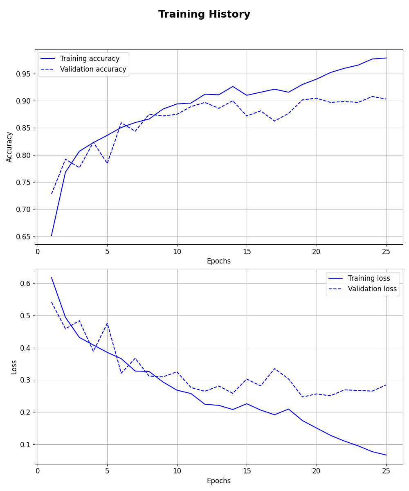

### Detailed Report of Test Set:

|              | precision    | recall       | f1-score     | support      |
| ------------ | ------------ | ------------ | ------------ | ------------ |
| chihuahua    | 0.8941       | 0.9560       | 0.9240       | 477          | 
| muffin       | 0.9452       | 0.8702       | 0.9061       | 416          | 
| micro avg    | 0.9160       | 0.9160       | 0.9160       | 893          | 
| macro avg    | 0.9196       | 0.9131       | 0.9151       | 893          | 
| weighted avg | 0.9179       | 0.9160       | 0.9157       | 893          | 
| samples avg  | 0.9160       | 0.9160       | 0.9160       | 893          | 

## trial_94

*    *Start Time*: 2024-10-20 12:25:17

*    *Duration*: 32.988

*    *Directory*: [Link](./trial_94)

### Hyperparameters:

| Hyperparameter         | Value                  |
| ---------------------- | ---------------------- |
| units1                 | 128                    |
| kernel_size1           | 3                      |
| units2                 | 64                     |
| kernel_size2           | 7                      |
| dense_units            | 128                    |
| dropout_rate           | 0.20494771584496596    |
| learning_rate          | 0.00013488839008780903 |

### Evaluation Metrics:

|           | train     | val       | test      |
| --------- | --------- | --------- | --------- |
| accuracy  | 0.9709    | 0.9000    | 0.9160    | 
| precision | 0.9709    | 0.9000    | 0.9160    | 
| recall    | 0.9709    | 0.9000    | 0.9160    | 
| f1        | 0.9709    | 0.9000    | 0.9160    | 

### Figures:

### Detailed Report of Test Set:

|              | precision    | recall       | f1-score     | support      |
| ------------ | ------------ | ------------ | ------------ | ------------ |
| chihuahua    | 0.9170       | 0.9266       | 0.9218       | 477          | 
| muffin       | 0.9148       | 0.9038       | 0.9093       | 416          | 
| micro avg    | 0.9160       | 0.9160       | 0.9160       | 893          | 
| macro avg    | 0.9159       | 0.9152       | 0.9156       | 893          | 
| weighted avg | 0.9160       | 0.9160       | 0.9160       | 893          | 
| samples avg  | 0.9160       | 0.9160       | 0.9160       | 893          | 

## trial_33

*    *Start Time*: 2024-10-20 11:52:19

*    *Duration*: 29.383

*    *Directory*: [Link](./trial_33)

### Hyperparameters:

| Hyperparameter         | Value                  |
| ---------------------- | ---------------------- |
| units1                 | 128                    |
| kernel_size1           | 3                      |
| units2                 | 64                     |
| kernel_size2           | 5                      |
| dense_units            | 128                    |
| dropout_rate           | 0.13858952691276852    |
| learning_rate          | 0.00012008677234254134 |

### Evaluation Metrics:

|           | train     | val       | test      |
| --------- | --------- | --------- | --------- |
| accuracy  | 0.9575    | 0.8953    | 0.9104    | 
| precision | 0.9575    | 0.8953    | 0.9104    | 
| recall    | 0.9575    | 0.8953    | 0.9104    | 
| f1        | 0.9575    | 0.8953    | 0.9104    | 

### Figures:

### Detailed Report of Test Set:

|              | precision    | recall       | f1-score     | support      |
| ------------ | ------------ | ------------ | ------------ | ------------ |
| chihuahua    | 0.8885       | 0.9518       | 0.9190       | 477          | 
| muffin       | 0.9398       | 0.8630       | 0.8997       | 416          | 
| micro avg    | 0.9104       | 0.9104       | 0.9104       | 893          | 
| macro avg    | 0.9141       | 0.9074       | 0.9094       | 893          | 
| weighted avg | 0.9124       | 0.9104       | 0.9100       | 893          | 
| samples avg  | 0.9104       | 0.9104       | 0.9104       | 893          | 

## trial_28

*    *Start Time*: 2024-10-20 11:50:00

*    *Duration*: 25.315

*    *Directory*: [Link](./trial_28)

### Hyperparameters:

| Hyperparameter         | Value                  |
| ---------------------- | ---------------------- |
| units1                 | 128                    |
| kernel_size1           | 3                      |
| units2                 | 64                     |
| kernel_size2           | 3                      |
| dense_units            | 256                    |
| dropout_rate           | 0.09430384806720865    |
| learning_rate          | 0.00016340772318632486 |

### Evaluation Metrics:

|           | train     | val       | test      |
| --------- | --------- | --------- | --------- |
| accuracy  | 0.9847    | 0.8859    | 0.9093    | 
| precision | 0.9847    | 0.8859    | 0.9093    | 
| recall    | 0.9847    | 0.8859    | 0.9093    | 
| f1        | 0.9847    | 0.8859    | 0.9093    | 

### Figures:

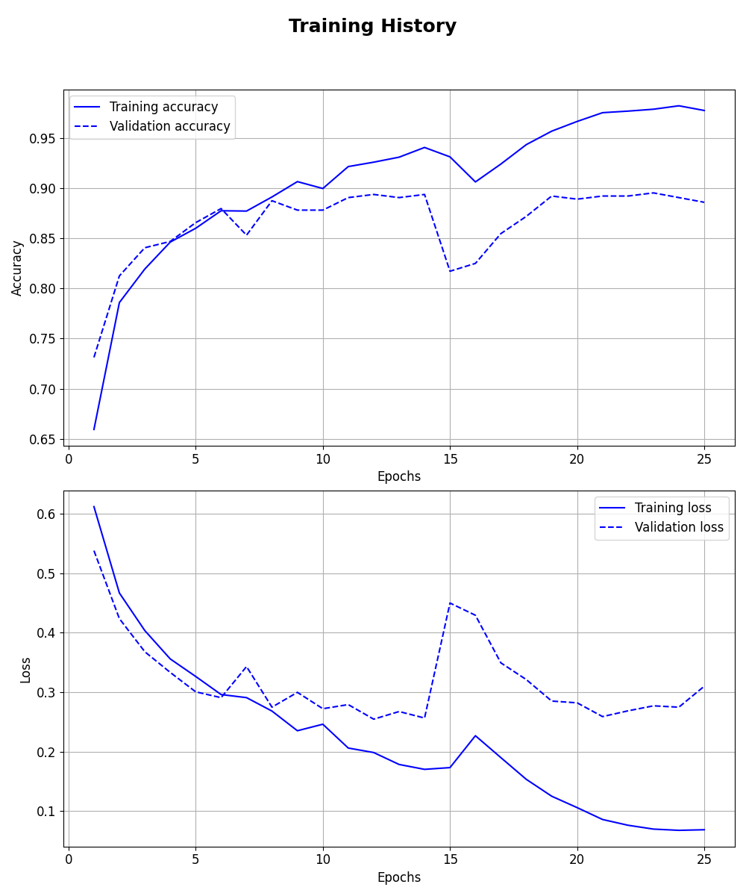

### Detailed Report of Test Set:

|              | precision    | recall       | f1-score     | support      |
| ------------ | ------------ | ------------ | ------------ | ------------ |
| chihuahua    | 0.8852       | 0.9539       | 0.9183       | 477          | 
| muffin       | 0.9420       | 0.8582       | 0.8981       | 416          | 
| micro avg    | 0.9093       | 0.9093       | 0.9093       | 893          | 
| macro avg    | 0.9136       | 0.9060       | 0.9082       | 893          | 
| weighted avg | 0.9116       | 0.9093       | 0.9089       | 893          | 
| samples avg  | 0.9093       | 0.9093       | 0.9093       | 893          | 

## trial_83

*    *Start Time*: 2024-10-20 12:19:21

*    *Duration*: 33.153

*    *Directory*: [Link](./trial_83)

### Hyperparameters:

| Hyperparameter         | Value                  |
| ---------------------- | ---------------------- |
| units1                 | 128                    |
| kernel_size1           | 3                      |
| units2                 | 64                     |
| kernel_size2           | 7                      |
| dense_units            | 512                    |
| dropout_rate           | 0.18497461170165186    |
| learning_rate          | 0.00011528438692355924 |

### Evaluation Metrics:

|           | train     | val       | test      |
| --------- | --------- | --------- | --------- |
| accuracy  | 0.9950    | 0.9016    | 0.9071    | 
| precision | 0.9950    | 0.9016    | 0.9071    | 
| recall    | 0.9950    | 0.9016    | 0.9071    | 
| f1        | 0.9950    | 0.9016    | 0.9071    | 

### Figures:

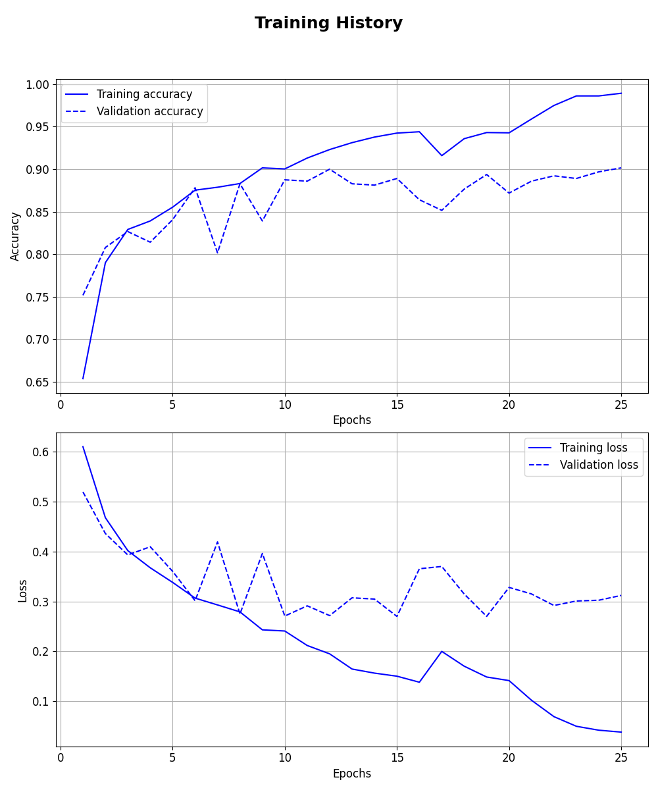

### Detailed Report of Test Set:

|              | precision    | recall       | f1-score     | support      |
| ------------ | ------------ | ------------ | ------------ | ------------ |
| chihuahua    | 0.9070       | 0.9203       | 0.9136       | 477          | 
| muffin       | 0.9071       | 0.8918       | 0.8994       | 416          | 
| micro avg    | 0.9071       | 0.9071       | 0.9071       | 893          | 
| macro avg    | 0.9071       | 0.9061       | 0.9065       | 893          | 
| weighted avg | 0.9071       | 0.9071       | 0.9070       | 893          | 
| samples avg  | 0.9071       | 0.9071       | 0.9071       | 893          | 

## trial_30

*    *Start Time*: 2024-10-20 11:50:52

*    *Duration*: 29.679

*    *Directory*: [Link](./trial_30)

### Hyperparameters:

| Hyperparameter         | Value                  |
| ---------------------- | ---------------------- |
| units1                 | 128                    |
| kernel_size1           | 3                      |
| units2                 | 64                     |
| kernel_size2           | 5                      |
| dense_units            | 128                    |
| dropout_rate           | 0.07956713490452443    |
| learning_rate          | 0.00012679780551011754 |

### Evaluation Metrics:

|           | train     | val       | test      |
| --------- | --------- | --------- | --------- |
| accuracy  | 0.9728    | 0.9031    | 0.9059    | 
| precision | 0.9728    | 0.9031    | 0.9059    | 
| recall    | 0.9728    | 0.9031    | 0.9059    | 
| f1        | 0.9728    | 0.9031    | 0.9059    | 

### Figures:

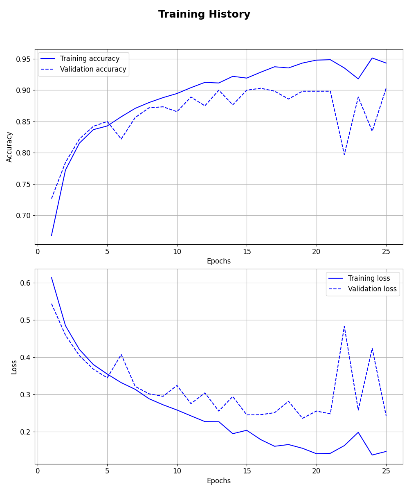

### Detailed Report of Test Set:

|              | precision    | recall       | f1-score     | support      |
| ------------ | ------------ | ------------ | ------------ | ------------ |
| chihuahua    | 0.9085       | 0.9161       | 0.9123       | 477          | 
| muffin       | 0.9029       | 0.8942       | 0.8986       | 416          | 
| micro avg    | 0.9059       | 0.9059       | 0.9059       | 893          | 
| macro avg    | 0.9057       | 0.9052       | 0.9054       | 893          | 
| weighted avg | 0.9059       | 0.9059       | 0.9059       | 893          | 
| samples avg  | 0.9059       | 0.9059       | 0.9059       | 893          | 

## trial_35

*    *Start Time*: 2024-10-20 11:53:19

*    *Duration*: 38.597

*    *Directory*: [Link](./trial_35)

### Hyperparameters:

| Hyperparameter        | Value                 |
| --------------------- | --------------------- |
| units1                | 128                   |
| kernel_size1          | 3                     |
| units2                | 64                    |
| kernel_size2          | 7                     |
| dense_units           | 128                   |
| dropout_rate          | 0.14602546304919894   |
| learning_rate         | 6.826021418260614e-05 |

### Evaluation Metrics:

|           | train     | val       | test      |
| --------- | --------- | --------- | --------- |
| accuracy  | 0.9444    | 0.9047    | 0.9048    | 
| precision | 0.9444    | 0.9047    | 0.9048    | 
| recall    | 0.9444    | 0.9047    | 0.9048    | 
| f1        | 0.9444    | 0.9047    | 0.9048    | 

### Figures:

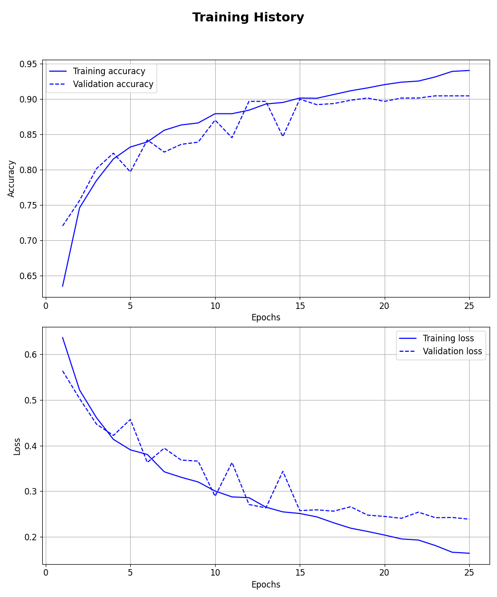

### Detailed Report of Test Set:

|              | precision    | recall       | f1-score     | support      |
| ------------ | ------------ | ------------ | ------------ | ------------ |
| chihuahua    | 0.8889       | 0.9392       | 0.9134       | 477          | 
| muffin       | 0.9254       | 0.8654       | 0.8944       | 416          | 
| micro avg    | 0.9048       | 0.9048       | 0.9048       | 893          | 
| macro avg    | 0.9072       | 0.9023       | 0.9039       | 893          | 
| weighted avg | 0.9059       | 0.9048       | 0.9045       | 893          | 
| samples avg  | 0.9048       | 0.9048       | 0.9048       | 893          | 

## trial_55

*    *Start Time*: 2024-10-20 12:04:33

*    *Duration*: 33.289

*    *Directory*: [Link](./trial_55)

### Hyperparameters:

| Hyperparameter         | Value                  |
| ---------------------- | ---------------------- |
| units1                 | 128                    |
| kernel_size1           | 3                      |
| units2                 | 64                     |
| kernel_size2           | 7                      |
| dense_units            | 256                    |
| dropout_rate           | 0.2645726878902979     |
| learning_rate          | 0.00010340639501222415 |

### Evaluation Metrics:

|           | train     | val       | test      |
| --------- | --------- | --------- | --------- |
| accuracy  | 0.9609    | 0.8938    | 0.9048    | 
| precision | 0.9609    | 0.8938    | 0.9048    | 
| recall    | 0.9609    | 0.8938    | 0.9048    | 
| f1        | 0.9609    | 0.8937    | 0.9048    | 

### Figures:

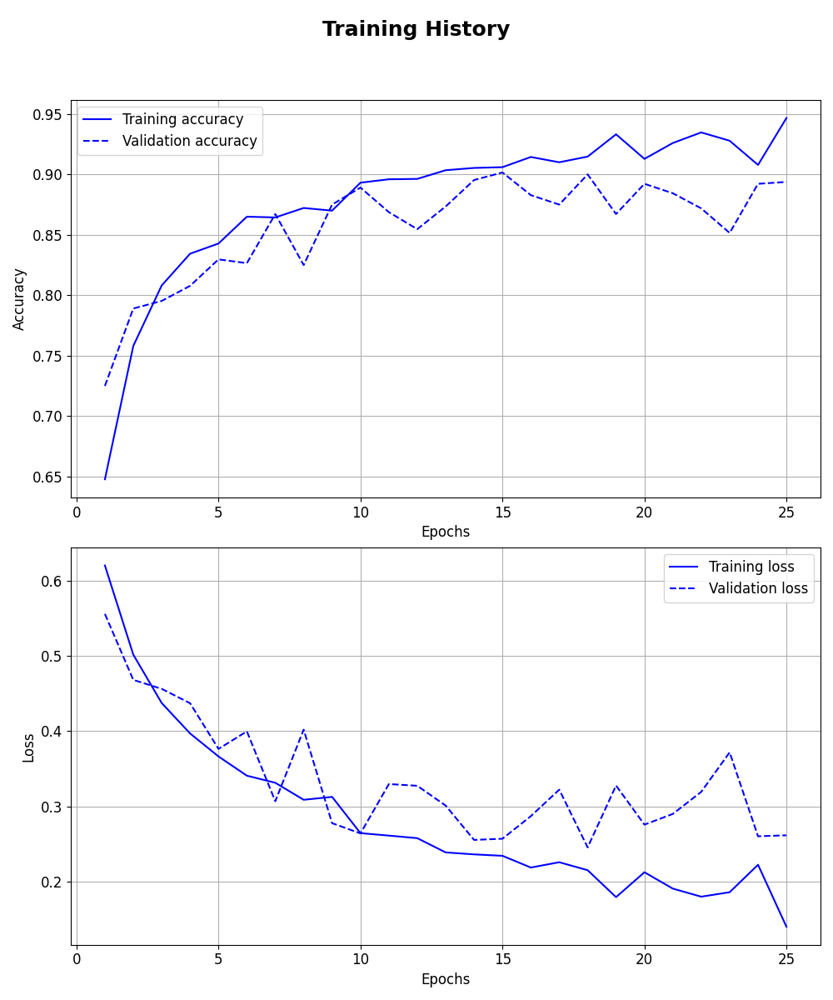

### Detailed Report of Test Set:

|              | precision    | recall       | f1-score     | support      |
| ------------ | ------------ | ------------ | ------------ | ------------ |
| chihuahua    | 0.8828       | 0.9476       | 0.9141       | 477          | 
| muffin       | 0.9344       | 0.8558       | 0.8934       | 416          | 
| micro avg    | 0.9048       | 0.9048       | 0.9048       | 893          | 
| macro avg    | 0.9086       | 0.9017       | 0.9037       | 893          | 
| weighted avg | 0.9068       | 0.9048       | 0.9044       | 893          | 
| samples avg  | 0.9048       | 0.9048       | 0.9048       | 893          | 

## trial_82

*    *Start Time*: 2024-10-20 12:18:47

*    *Duration*: 32.997

*    *Directory*: [Link](./trial_82)

### Hyperparameters:

| Hyperparameter        | Value                 |
| --------------------- | --------------------- |
| units1                | 128                   |
| kernel_size1          | 3                     |
| units2                | 64                    |
| kernel_size2          | 7                     |
| dense_units           | 128                   |
| dropout_rate          | 0.2092345389957374    |
| learning_rate         | 7.772106031977693e-05 |

### Evaluation Metrics:

|           | train     | val       | test      |
| --------- | --------- | --------- | --------- |
| accuracy  | 0.9428    | 0.8922    | 0.9048    | 
| precision | 0.9428    | 0.8922    | 0.9048    | 
| recall    | 0.9428    | 0.8922    | 0.9048    | 
| f1        | 0.9428    | 0.8922    | 0.9048    | 

### Figures:

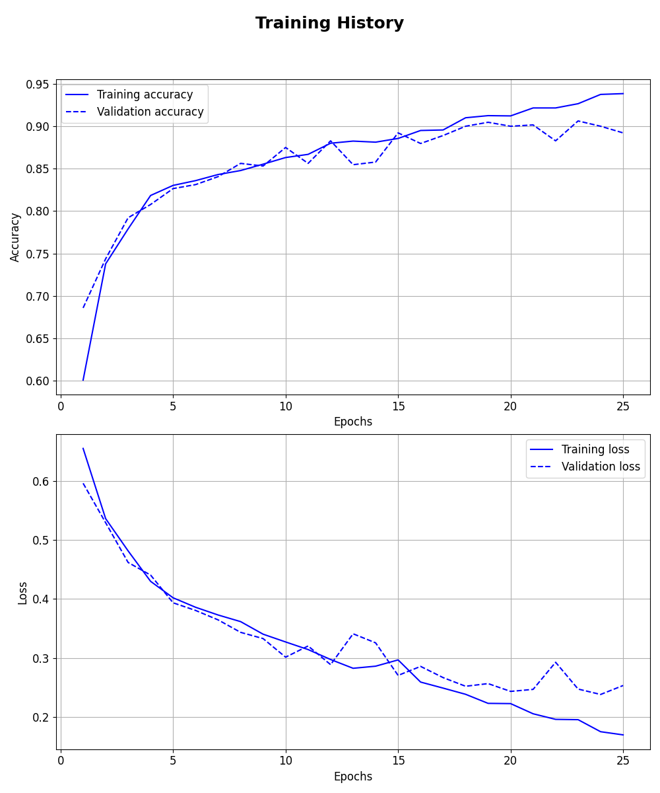

### Detailed Report of Test Set:

|              | precision    | recall       | f1-score     | support      |
| ------------ | ------------ | ------------ | ------------ | ------------ |
| chihuahua    | 0.8813       | 0.9497       | 0.9142       | 477          | 
| muffin       | 0.9367       | 0.8534       | 0.8931       | 416          | 
| micro avg    | 0.9048       | 0.9048       | 0.9048       | 893          | 
| macro avg    | 0.9090       | 0.9015       | 0.9037       | 893          | 
| weighted avg | 0.9071       | 0.9048       | 0.9044       | 893          | 
| samples avg  | 0.9048       | 0.9048       | 0.9048       | 893          | 

## trial_56

*    *Start Time*: 2024-10-20 12:05:07

*    *Duration*: 33.409

*    *Directory*: [Link](./trial_56)

### Hyperparameters:

| Hyperparameter        | Value                 |
| --------------------- | --------------------- |
| units1                | 128                   |
| kernel_size1          | 3                     |
| units2                | 64                    |
| kernel_size2          | 7                     |
| dense_units           | 512                   |
| dropout_rate          | 0.15939983644441566   |
| learning_rate         | 7.638535387067337e-05 |

### Evaluation Metrics:

|           | train     | val       | test      |
| --------- | --------- | --------- | --------- |
| accuracy  | 0.9794    | 0.8938    | 0.9037    | 
| precision | 0.9794    | 0.8938    | 0.9037    | 
| recall    | 0.9794    | 0.8938    | 0.9037    | 
| f1        | 0.9794    | 0.8937    | 0.9037    | 

### Figures:

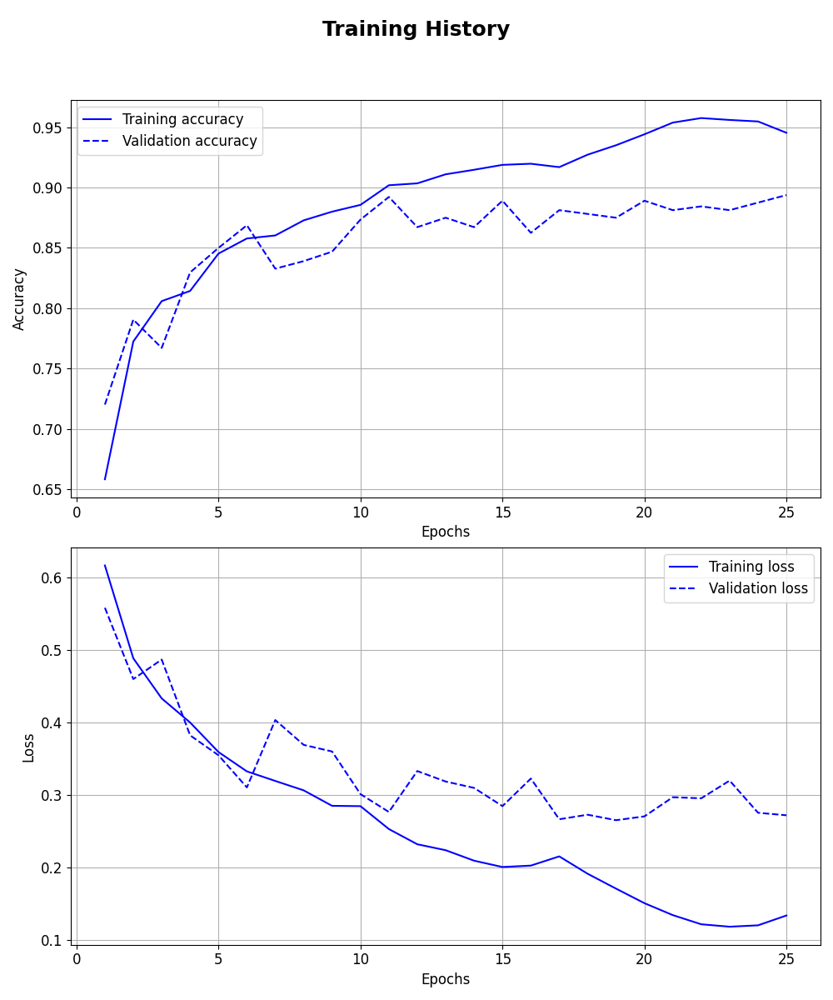

### Detailed Report of Test Set:

|              | precision    | recall       | f1-score     | support      |
| ------------ | ------------ | ------------ | ------------ | ------------ |
| chihuahua    | 0.8982       | 0.9245       | 0.9112       | 477          | 
| muffin       | 0.9104       | 0.8798       | 0.8949       | 416          | 
| micro avg    | 0.9037       | 0.9037       | 0.9037       | 893          | 
| macro avg    | 0.9043       | 0.9022       | 0.9030       | 893          | 
| weighted avg | 0.9039       | 0.9037       | 0.9036       | 893          | 
| samples avg  | 0.9037       | 0.9037       | 0.9037       | 893          | 

## trial_64

*    *Start Time*: 2024-10-20 12:09:34

*    *Duration*: 27.636

*    *Directory*: [Link](./trial_64)

### Hyperparameters:

| Hyperparameter         | Value                  |
| ---------------------- | ---------------------- |
| units1                 | 128                    |
| kernel_size1           | 3                      |
| units2                 | 16                     |
| kernel_size2           | 5                      |
| dense_units            | 128                    |
| dropout_rate           | 0.19587490610702352    |
| learning_rate          | 0.00021726350694616388 |

### Evaluation Metrics:

|           | train     | val       | test      |
| --------- | --------- | --------- | --------- |
| accuracy  | 0.9500    | 0.8953    | 0.9026    | 
| precision | 0.9500    | 0.8953    | 0.9026    | 
| recall    | 0.9500    | 0.8953    | 0.9026    | 
| f1        | 0.9500    | 0.8953    | 0.9026    | 

### Figures:

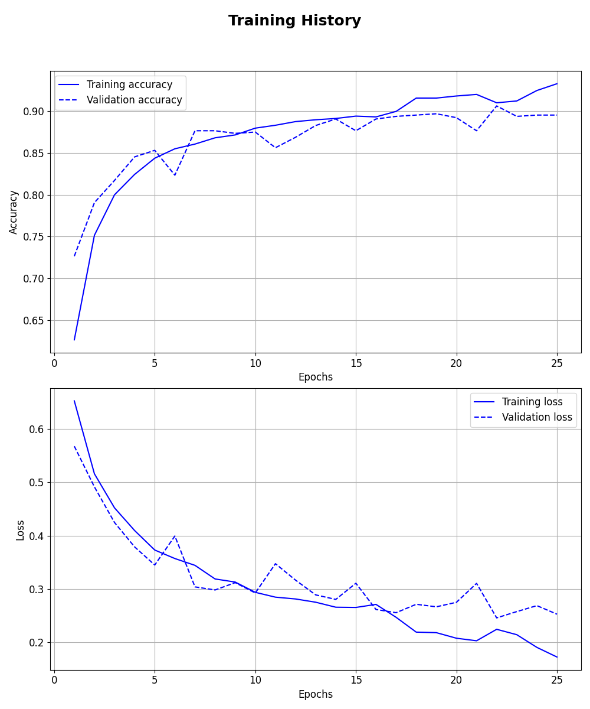

### Detailed Report of Test Set:

|              | precision    | recall       | f1-score     | support      |
| ------------ | ------------ | ------------ | ------------ | ------------ |
| chihuahua    | 0.9046       | 0.9140       | 0.9093       | 477          | 
| muffin       | 0.9002       | 0.8894       | 0.8948       | 416          | 
| micro avg    | 0.9026       | 0.9026       | 0.9026       | 893          | 
| macro avg    | 0.9024       | 0.9017       | 0.9020       | 893          | 
| weighted avg | 0.9026       | 0.9026       | 0.9025       | 893          | 
| samples avg  | 0.9026       | 0.9026       | 0.9026       | 893          | 

## trial_69

*    *Start Time*: 2024-10-20 12:12:08

*    *Duration*: 33.253

*    *Directory*: [Link](./trial_69)

### Hyperparameters:

| Hyperparameter         | Value                  |
| ---------------------- | ---------------------- |
| units1                 | 128                    |
| kernel_size1           | 3                      |
| units2                 | 64                     |
| kernel_size2           | 7                      |
| dense_units            | 512                    |
| dropout_rate           | 0.17657357567634888    |
| learning_rate          | 4.2044741673961205e-05 |

### Evaluation Metrics:

|           | train     | val       | test      |
| --------- | --------- | --------- | --------- |
| accuracy  | 0.9488    | 0.9016    | 0.9026    | 
| precision | 0.9488    | 0.9016    | 0.9026    | 
| recall    | 0.9488    | 0.9016    | 0.9026    | 
| f1        | 0.9487    | 0.9016    | 0.9026    | 

### Figures:

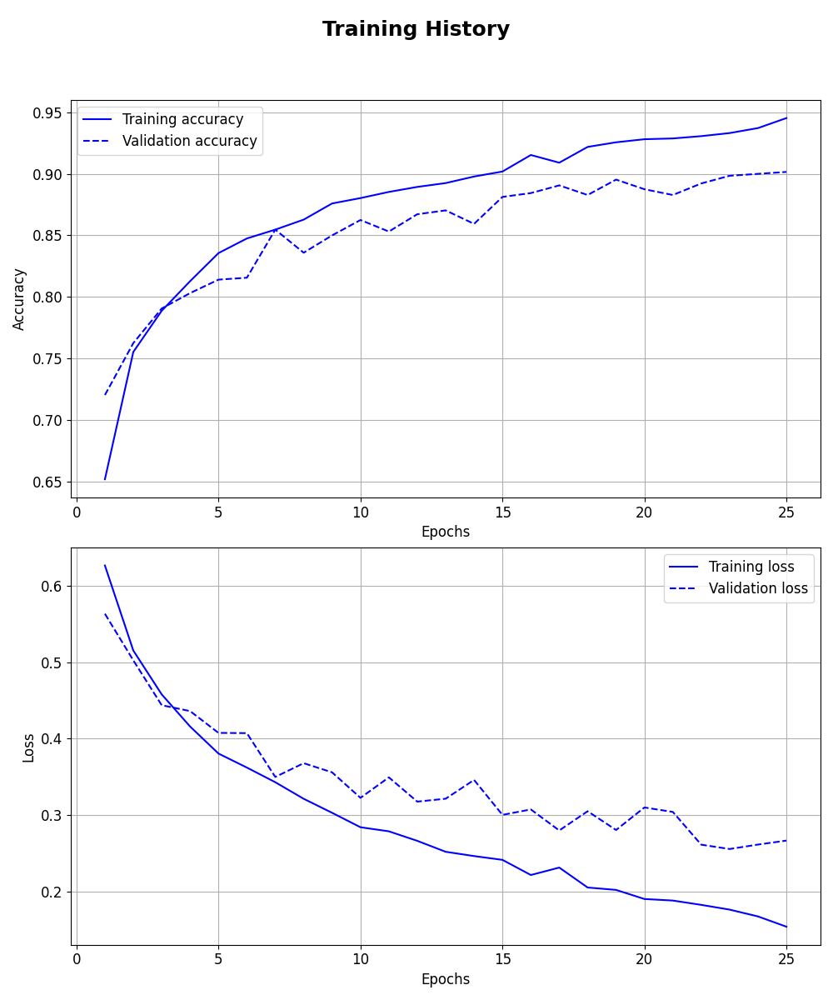

### Detailed Report of Test Set:

|              | precision    | recall       | f1-score     | support      |
| ------------ | ------------ | ------------ | ------------ | ------------ |
| chihuahua    | 0.8839       | 0.9413       | 0.9117       | 477          | 
| muffin       | 0.9273       | 0.8582       | 0.8914       | 416          | 
| micro avg    | 0.9026       | 0.9026       | 0.9026       | 893          | 
| macro avg    | 0.9056       | 0.8997       | 0.9015       | 893          | 
| weighted avg | 0.9041       | 0.9026       | 0.9022       | 893          | 
| samples avg  | 0.9026       | 0.9026       | 0.9026       | 893          | 

## trial_75

*    *Start Time*: 2024-10-20 12:14:47

*    *Duration*: 22.093

*    *Directory*: [Link](./trial_75)

### Hyperparameters:

| Hyperparameter        | Value                 |
| --------------------- | --------------------- |
| units1                | 64                    |
| kernel_size1          | 3                     |
| units2                | 64                    |
| kernel_size2          | 7                     |
| dense_units           | 128                   |
| dropout_rate          | 0.03495886535891242   |
| learning_rate         | 3.618230837361544e-05 |

### Evaluation Metrics:

|           | train     | val       | test      |
| --------- | --------- | --------- | --------- |
| accuracy  | 0.9172    | 0.9062    | 0.9026    | 
| precision | 0.9172    | 0.9062    | 0.9026    | 
| recall    | 0.9172    | 0.9062    | 0.9026    | 
| f1        | 0.9172    | 0.9062    | 0.9026    | 

### Figures:

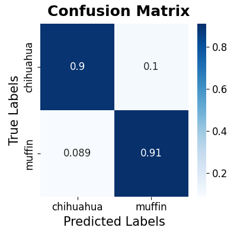

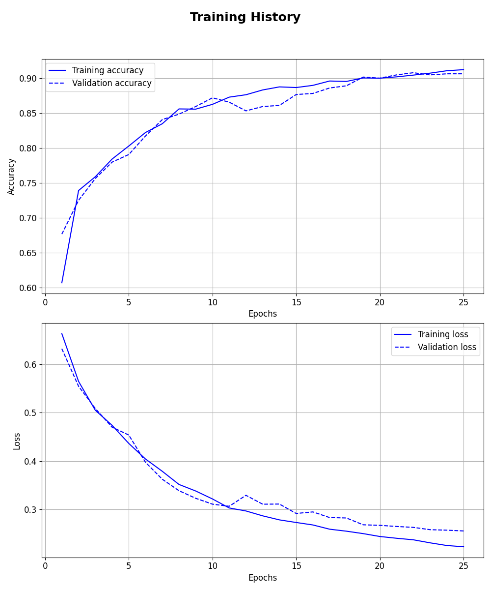

### Detailed Report of Test Set:

|              | precision    | recall       | f1-score     | support      |
| ------------ | ------------ | ------------ | ------------ | ------------ |
| chihuahua    | 0.9203       | 0.8952       | 0.9075       | 477          | 
| muffin       | 0.8834       | 0.9111       | 0.8970       | 416          | 
| micro avg    | 0.9026       | 0.9026       | 0.9026       | 893          | 
| macro avg    | 0.9019       | 0.9031       | 0.9023       | 893          | 
| weighted avg | 0.9031       | 0.9026       | 0.9027       | 893          | 
| samples avg  | 0.9026       | 0.9026       | 0.9026       | 893          | 

## trial_6

*    *Start Time*: 2024-10-20 11:40:52

*    *Duration*: 30.614

*    *Directory*: [Link](./trial_6)

### Hyperparameters:

| Hyperparameter        | Value                 |
| --------------------- | --------------------- |
| units1                | 128                   |
| kernel_size1          | 7                     |
| units2                | 16                    |
| kernel_size2          | 5                     |
| dense_units           | 512                   |
| dropout_rate          | 0.4479659514122351    |
| learning_rate         | 8.164749108419706e-05 |

### Evaluation Metrics:

|           | train     | val       | test      |
| --------- | --------- | --------- | --------- |
| accuracy  | 0.9400    | 0.8828    | 0.9015    | 
| precision | 0.9400    | 0.8828    | 0.9015    | 
| recall    | 0.9400    | 0.8828    | 0.9015    | 
| f1        | 0.9400    | 0.8828    | 0.9015    | 

### Figures:

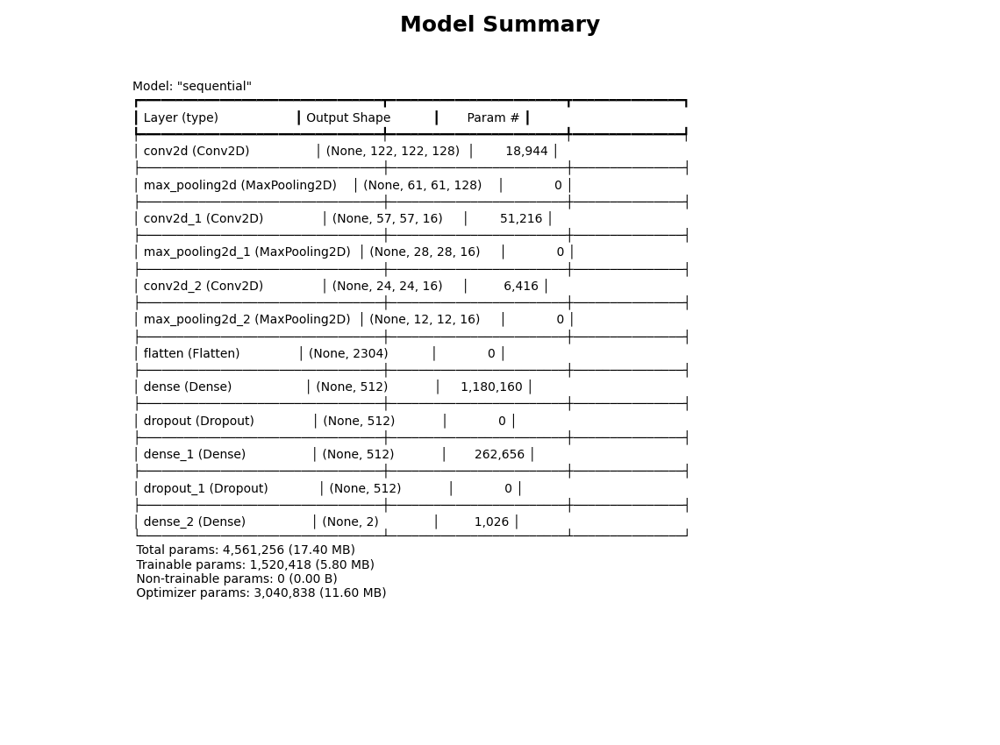

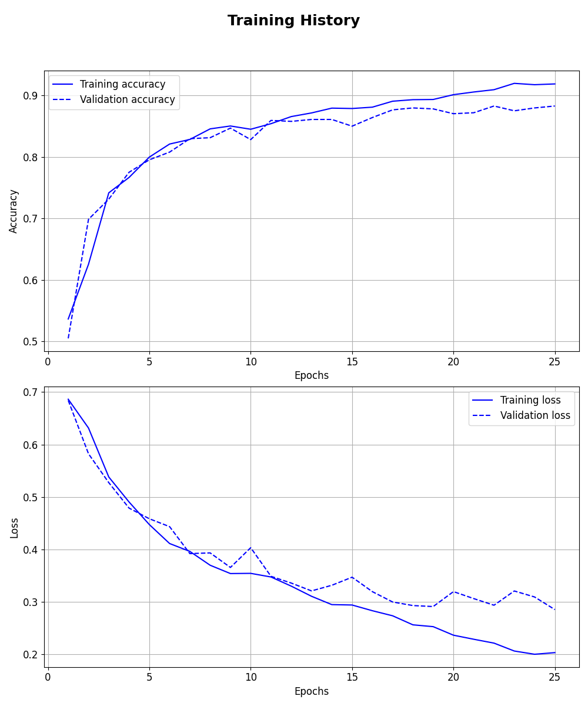

### Detailed Report of Test Set:

|              | precision    | recall       | f1-score     | support      |
| ------------ | ------------ | ------------ | ------------ | ------------ |
| chihuahua    | 0.9027       | 0.9140       | 0.9083       | 477          | 
| muffin       | 0.9000       | 0.8870       | 0.8935       | 416          | 
| micro avg    | 0.9015       | 0.9015       | 0.9015       | 893          | 
| macro avg    | 0.9013       | 0.9005       | 0.9009       | 893          | 
| weighted avg | 0.9014       | 0.9015       | 0.9014       | 893          | 
| samples avg  | 0.9015       | 0.9015       | 0.9015       | 893          | 

## trial_42

*    *Start Time*: 2024-10-20 11:57:04

*    *Duration*: 32.946

*    *Directory*: [Link](./trial_42)

### Hyperparameters:

| Hyperparameter        | Value                 |
| --------------------- | --------------------- |
| units1                | 128                   |
| kernel_size1          | 3                     |
| units2                | 64                    |
| kernel_size2          | 7                     |
| dense_units           | 128                   |
| dropout_rate          | 0.11006800945002276   |
| learning_rate         | 7.187335450648665e-05 |

### Evaluation Metrics:

|           | train     | val       | test      |
| --------- | --------- | --------- | --------- |
| accuracy  | 0.9344    | 0.8953    | 0.9015    | 
| precision | 0.9344    | 0.8953    | 0.9015    | 
| recall    | 0.9344    | 0.8953    | 0.9015    | 
| f1        | 0.9344    | 0.8953    | 0.9015    | 

### Figures:

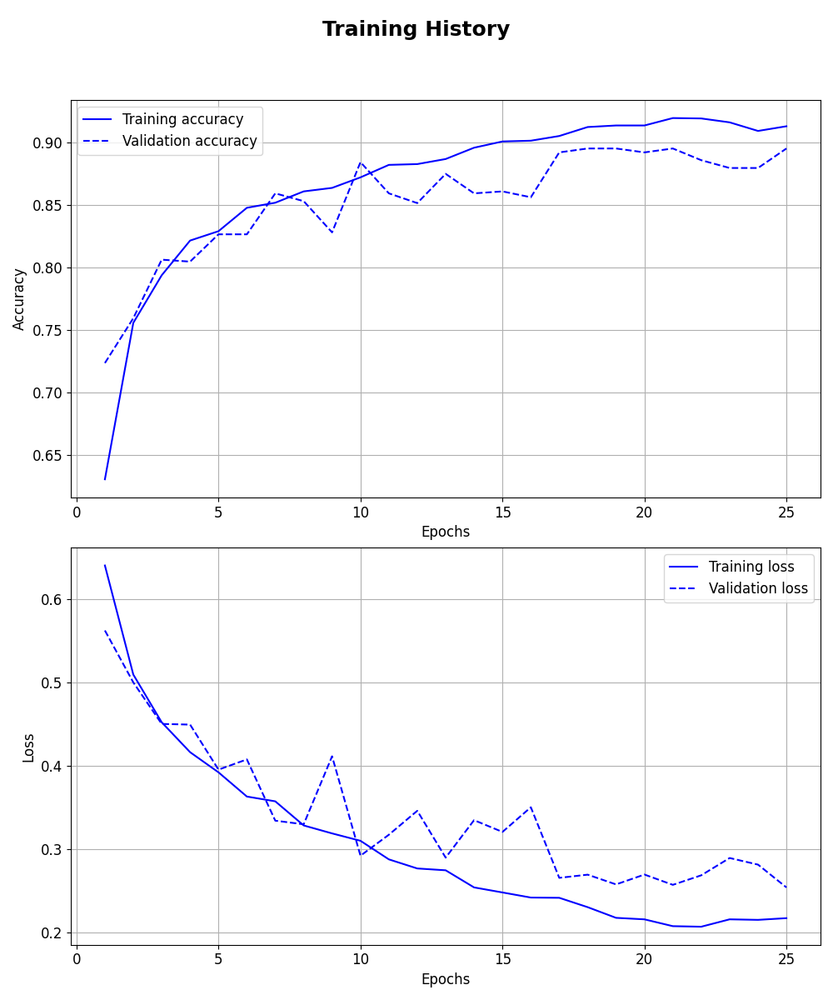

### Detailed Report of Test Set:

|              | precision    | recall       | f1-score     | support      |
| ------------ | ------------ | ------------ | ------------ | ------------ |
| chihuahua    | 0.9147       | 0.8994       | 0.9070       | 477          | 
| muffin       | 0.8868       | 0.9038       | 0.8952       | 416          | 
| micro avg    | 0.9015       | 0.9015       | 0.9015       | 893          | 
| macro avg    | 0.9008       | 0.9016       | 0.9011       | 893          | 
| weighted avg | 0.9017       | 0.9015       | 0.9015       | 893          | 
| samples avg  | 0.9015       | 0.9015       | 0.9015       | 893          | 

## trial_49

*    *Start Time*: 2024-10-20 12:01:08

*    *Duration*: 33.255

*    *Directory*: [Link](./trial_49)

### Hyperparameters:

| Hyperparameter        | Value                 |
| --------------------- | --------------------- |
| units1                | 128                   |
| kernel_size1          | 3                     |
| units2                | 64                    |
| kernel_size2          | 7                     |
| dense_units           | 256                   |
| dropout_rate          | 0.2282736343656356    |
| learning_rate         | 4.944510475178199e-05 |

### Evaluation Metrics:

|           | train     | val       | test      |
| --------- | --------- | --------- | --------- |
| accuracy  | 0.9366    | 0.9062    | 0.9015    | 
| precision | 0.9366    | 0.9062    | 0.9015    | 
| recall    | 0.9366    | 0.9062    | 0.9015    | 
| f1        | 0.9366    | 0.9062    | 0.9015    | 

### Figures:

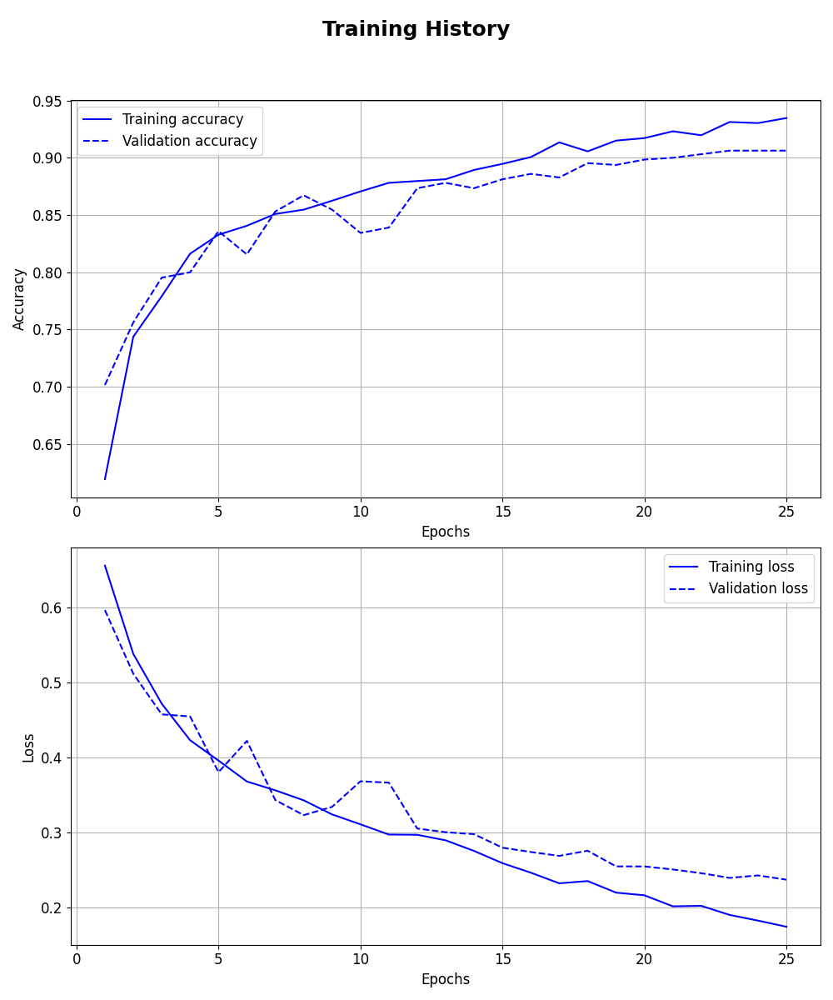

### Detailed Report of Test Set:

|              | precision    | recall       | f1-score     | support      |
| ------------ | ------------ | ------------ | ------------ | ------------ |
| chihuahua    | 0.9147       | 0.8994       | 0.9070       | 477          | 
| muffin       | 0.8868       | 0.9038       | 0.8952       | 416          | 
| micro avg    | 0.9015       | 0.9015       | 0.9015       | 893          | 
| macro avg    | 0.9008       | 0.9016       | 0.9011       | 893          | 
| weighted avg | 0.9017       | 0.9015       | 0.9015       | 893          | 
| samples avg  | 0.9015       | 0.9015       | 0.9015       | 893          | 

## trial_86

*    *Start Time*: 2024-10-20 12:20:59

*    *Duration*: 30.120

*    *Directory*: [Link](./trial_86)

### Hyperparameters:

| Hyperparameter         | Value                  |
| ---------------------- | ---------------------- |
| units1                 | 128                    |
| kernel_size1           | 3                      |
| units2                 | 64                     |
| kernel_size2           | 5                      |
| dense_units            | 256                    |
| dropout_rate           | 0.08085252713315207    |
| learning_rate          | 0.00010667985375957958 |

### Evaluation Metrics:

|           | train     | val       | test      |
| --------- | --------- | --------- | --------- |
| accuracy  | 0.9744    | 0.8891    | 0.9015    | 
| precision | 0.9744    | 0.8891    | 0.9015    | 
| recall    | 0.9744    | 0.8891    | 0.9015    | 
| f1        | 0.9744    | 0.8891    | 0.9015    | 

### Figures:

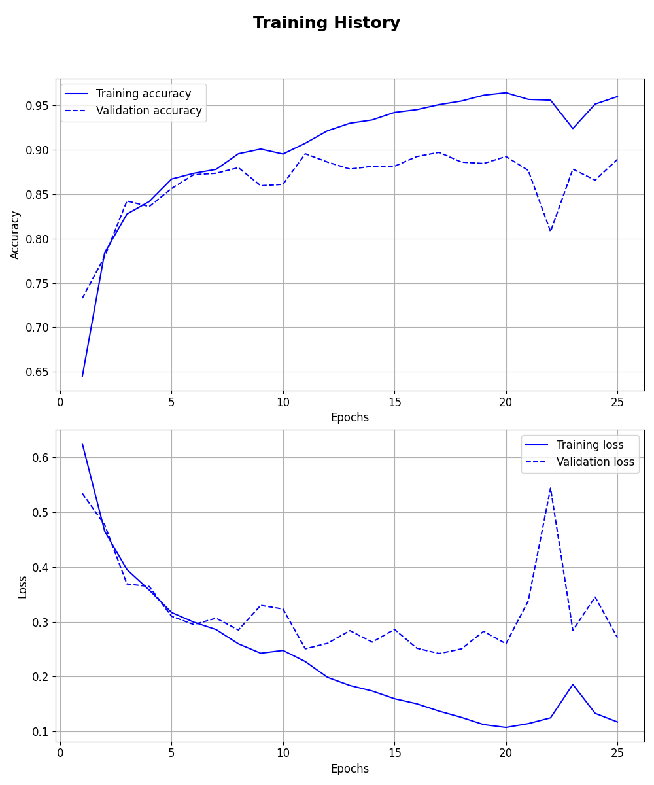

### Detailed Report of Test Set:

|              | precision    | recall       | f1-score     | support      |
| ------------ | ------------ | ------------ | ------------ | ------------ |
| chihuahua    | 0.8733       | 0.9539       | 0.9118       | 477          | 
| muffin       | 0.9409       | 0.8413       | 0.8883       | 416          | 
| micro avg    | 0.9015       | 0.9015       | 0.9015       | 893          | 
| macro avg    | 0.9071       | 0.8976       | 0.9001       | 893          | 
| weighted avg | 0.9048       | 0.9015       | 0.9009       | 893          | 
| samples avg  | 0.9015       | 0.9015       | 0.9015       | 893          | 

## trial_51

*    *Start Time*: 2024-10-20 12:02:16

*    *Duration*: 33.666

*    *Directory*: [Link](./trial_51)

### Hyperparameters:

| Hyperparameter         | Value                  |
| ---------------------- | ---------------------- |
| units1                 | 128                    |
| kernel_size1           | 5                      |
| units2                 | 64                     |
| kernel_size2           | 7                      |
| dense_units            | 256                    |
| dropout_rate           | 0.275898129443553      |
| learning_rate          | 0.00027195660598710605 |

### Evaluation Metrics:

|           | train     | val       | test      |
| --------- | --------- | --------- | --------- |
| accuracy  | 0.9981    | 0.8953    | 0.9003    | 
| precision | 0.9981    | 0.8953    | 0.9003    | 
| recall    | 0.9981    | 0.8953    | 0.9003    | 
| f1        | 0.9981    | 0.8953    | 0.9003    | 

### Figures:

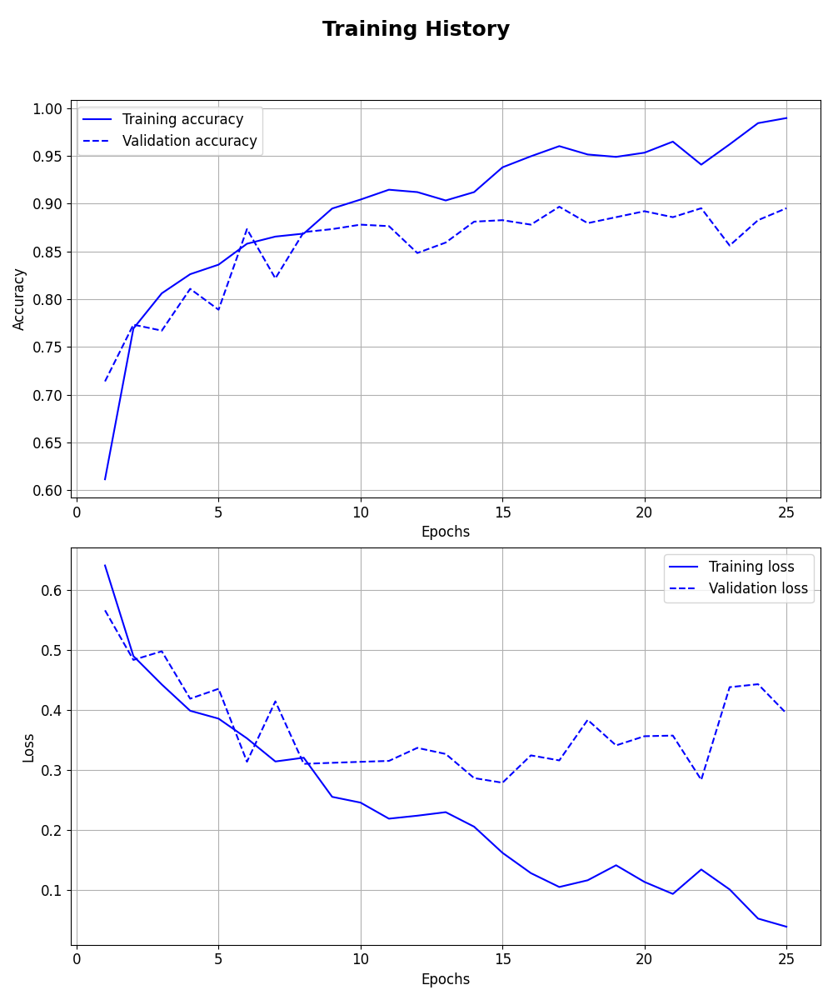

### Detailed Report of Test Set:

|              | precision    | recall       | f1-score     | support      |
| ------------ | ------------ | ------------ | ------------ | ------------ |
| chihuahua    | 0.8880       | 0.9308       | 0.9089       | 477          | 
| muffin       | 0.9160       | 0.8654       | 0.8900       | 416          | 
| micro avg    | 0.9003       | 0.9003       | 0.9003       | 893          | 
| macro avg    | 0.9020       | 0.8981       | 0.8994       | 893          | 
| weighted avg | 0.9011       | 0.9003       | 0.9001       | 893          | 
| samples avg  | 0.9003       | 0.9003       | 0.9003       | 893          | 

## trial_58

*    *Start Time*: 2024-10-20 12:06:16

*    *Duration*: 34.115

*    *Directory*: [Link](./trial_58)

### Hyperparameters:

| Hyperparameter       | Value                |
| -------------------- | -------------------- |
| units1               | 128                  |
| kernel_size1         | 3                    |
| units2               | 32                   |
| kernel_size2         | 7                    |
| dense_units          | 512                  |
| dropout_rate         | 0.3145021386975546   |
| learning_rate        | 4.85825521931806e-05 |

### Evaluation Metrics:

|           | train     | val       | test      |
| --------- | --------- | --------- | --------- |
| accuracy  | 0.9347    | 0.8875    | 0.9003    | 
| precision | 0.9347    | 0.8875    | 0.9003    | 
| recall    | 0.9347    | 0.8875    | 0.9003    | 
| f1        | 0.9347    | 0.8875    | 0.9003    | 

### Figures:

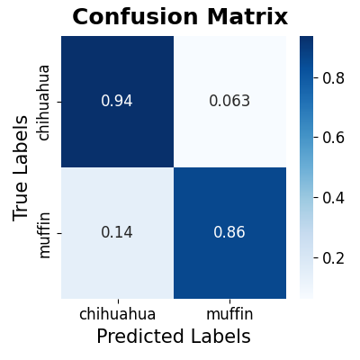

### Detailed Report of Test Set:

|              | precision    | recall       | f1-score     | support      |
| ------------ | ------------ | ------------ | ------------ | ------------ |
| chihuahua    | 0.8834       | 0.9371       | 0.9095       | 477          | 
| muffin       | 0.9225       | 0.8582       | 0.8892       | 416          | 
| micro avg    | 0.9003       | 0.9003       | 0.9003       | 893          | 
| macro avg    | 0.9029       | 0.8976       | 0.8993       | 893          | 
| weighted avg | 0.9016       | 0.9003       | 0.9000       | 893          | 
| samples avg  | 0.9003       | 0.9003       | 0.9003       | 893          | 

## trial_79

*    *Start Time*: 2024-10-20 12:16:54

*    *Duration*: 34.768

*    *Directory*: [Link](./trial_79)

### Hyperparameters:

| Hyperparameter        | Value                 |
| --------------------- | --------------------- |
| units1                | 128                   |
| kernel_size1          | 5                     |
| units2                | 32                    |
| kernel_size2          | 7                     |
| dense_units           | 256                   |
| dropout_rate          | 0.22677122482282125   |
| learning_rate         | 0.0001639830135276586 |

### Evaluation Metrics:

|           | train     | val       | test      |
| --------- | --------- | --------- | --------- |
| accuracy  | 0.9653    | 0.8953    | 0.9003    | 
| precision | 0.9653    | 0.8953    | 0.9003    | 
| recall    | 0.9653    | 0.8953    | 0.9003    | 
| f1        | 0.9653    | 0.8953    | 0.9003    | 

### Figures:

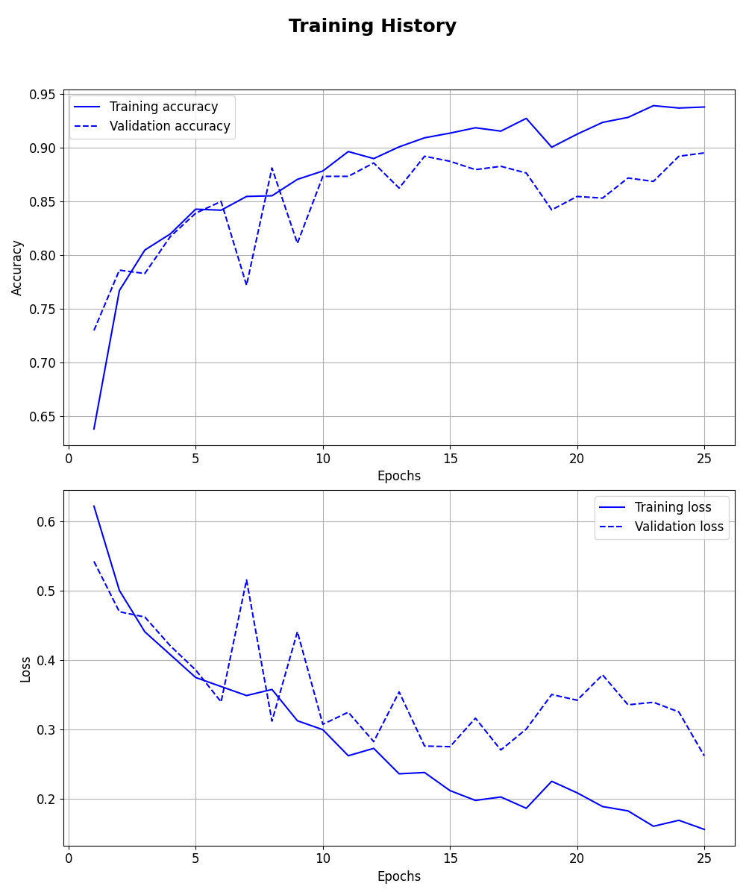

### Detailed Report of Test Set:

|              | precision    | recall       | f1-score     | support      |
| ------------ | ------------ | ------------ | ------------ | ------------ |
| chihuahua    | 0.9076       | 0.9057       | 0.9066       | 477          | 
| muffin       | 0.8921       | 0.8942       | 0.8932       | 416          | 
| micro avg    | 0.9003       | 0.9003       | 0.9003       | 893          | 
| macro avg    | 0.8998       | 0.8999       | 0.8999       | 893          | 
| weighted avg | 0.9004       | 0.9003       | 0.9003       | 893          | 
| samples avg  | 0.9003       | 0.9003       | 0.9003       | 893          | 

## trial_96

*    *Start Time*: 2024-10-20 12:26:25

*    *Duration*: 32.818

*    *Directory*: [Link](./trial_96)

### Hyperparameters:

| Hyperparameter        | Value                 |
| --------------------- | --------------------- |
| units1                | 128                   |
| kernel_size1          | 3                     |
| units2                | 64                    |
| kernel_size2          | 7                     |
| dense_units           | 128                   |
| dropout_rate          | 0.2323006995235076    |
| learning_rate         | 3.915319880575726e-05 |

### Evaluation Metrics:

|           | train     | val       | test      |
| --------- | --------- | --------- | --------- |
| accuracy  | 0.9231    | 0.9016    | 0.9003    | 
| precision | 0.9231    | 0.9016    | 0.9003    | 
| recall    | 0.9231    | 0.9016    | 0.9003    | 
| f1        | 0.9231    | 0.9016    | 0.9003    | 

### Figures:

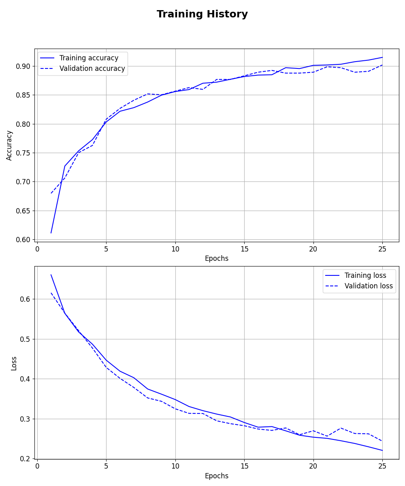

### Detailed Report of Test Set:

|              | precision    | recall       | f1-score     | support      |
| ------------ | ------------ | ------------ | ------------ | ------------ |
| chihuahua    | 0.9128       | 0.8994       | 0.9060       | 477          | 
| muffin       | 0.8865       | 0.9014       | 0.8939       | 416          | 
| micro avg    | 0.9003       | 0.9003       | 0.9003       | 893          | 
| macro avg    | 0.8996       | 0.9004       | 0.9000       | 893          | 
| weighted avg | 0.9005       | 0.9003       | 0.9004       | 893          | 
| samples avg  | 0.9003       | 0.9003       | 0.9003       | 893          | 

## trial_84

*    *Start Time*: 2024-10-20 12:19:56

*    *Duration*: 35.254

*    *Directory*: [Link](./trial_84)

### Hyperparameters:

| Hyperparameter       | Value                |
| -------------------- | -------------------- |
| units1               | 128                  |
| kernel_size1         | 7                    |
| units2               | 64                   |
| kernel_size2         | 7                    |
| dense_units          | 128                  |
| dropout_rate         | 0.10612026447266612  |
| learning_rate        | 9.02728410707301e-05 |

### Evaluation Metrics:

|           | train     | val       | test      |
| --------- | --------- | --------- | --------- |
| accuracy  | 0.9563    | 0.8844    | 0.8992    | 
| precision | 0.9563    | 0.8844    | 0.8992    | 
| recall    | 0.9563    | 0.8844    | 0.8992    | 
| f1        | 0.9562    | 0.8844    | 0.8992    | 

### Figures:

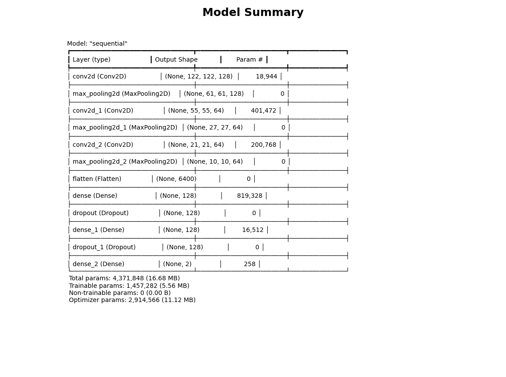

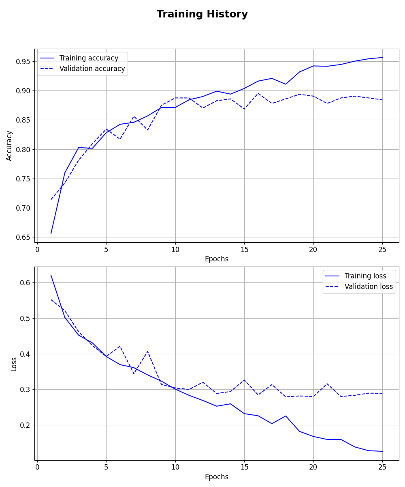

### Detailed Report of Test Set:

|              | precision    | recall       | f1-score     | support      |
| ------------ | ------------ | ------------ | ------------ | ------------ |
| chihuahua    | 0.9143       | 0.8952       | 0.9047       | 477          | 
| muffin       | 0.8826       | 0.9038       | 0.8931       | 416          | 
| micro avg    | 0.8992       | 0.8992       | 0.8992       | 893          | 
| macro avg    | 0.8985       | 0.8995       | 0.8989       | 893          | 
| weighted avg | 0.8996       | 0.8992       | 0.8993       | 893          | 
| samples avg  | 0.8992       | 0.8992       | 0.8992       | 893          | 

## trial_29

*    *Start Time*: 2024-10-20 11:50:26

*    *Duration*: 25.695

*    *Directory*: [Link](./trial_29)

### Hyperparameters:

| Hyperparameter        | Value                 |
| --------------------- | --------------------- |
| units1                | 64                    |
| kernel_size1          | 3                     |
| units2                | 64                    |
| kernel_size2          | 7                     |
| dense_units           | 128                   |
| dropout_rate          | 0.21662157999261966   |
| learning_rate         | 6.836396362949168e-05 |

### Evaluation Metrics:

|           | train     | val       | test      |
| --------- | --------- | --------- | --------- |
| accuracy  | 0.9403    | 0.8922    | 0.8981    | 
| precision | 0.9403    | 0.8922    | 0.8981    | 
| recall    | 0.9403    | 0.8922    | 0.8981    | 
| f1        | 0.9403    | 0.8922    | 0.8981    | 

### Figures:

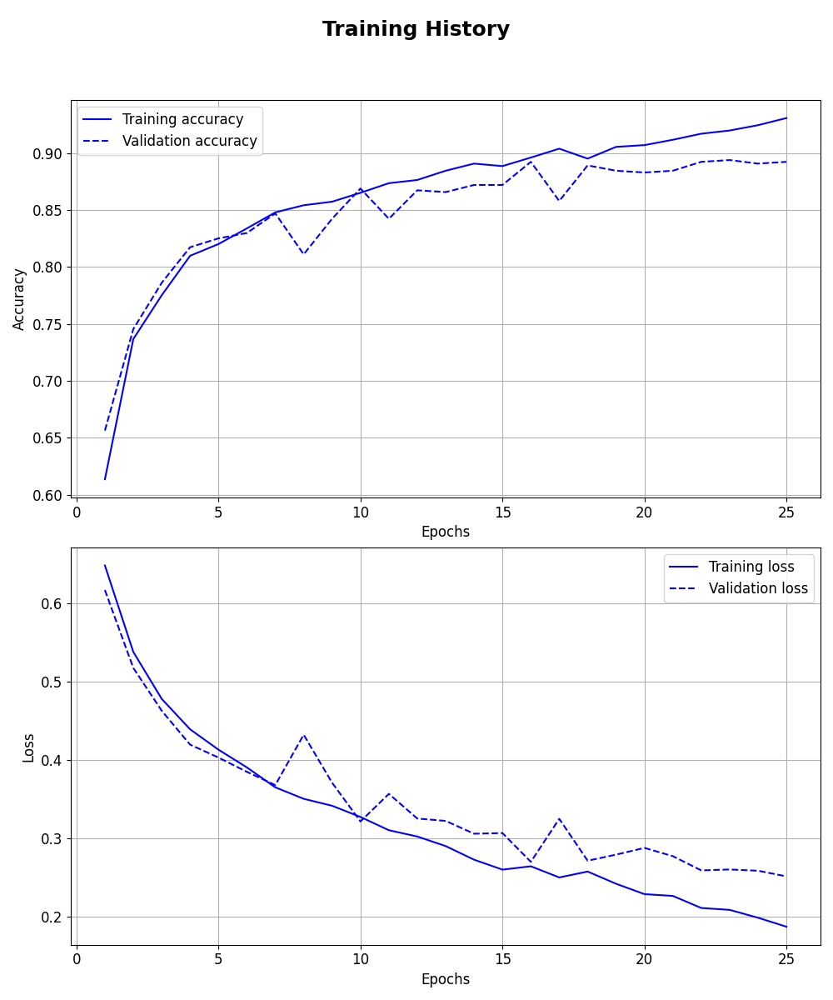

### Detailed Report of Test Set:

|              | precision    | recall       | f1-score     | support      |
| ------------ | ------------ | ------------ | ------------ | ------------ |
| chihuahua    | 0.9072       | 0.9015       | 0.9043       | 477          | 
| muffin       | 0.8878       | 0.8942       | 0.8910       | 416          | 
| micro avg    | 0.8981       | 0.8981       | 0.8981       | 893          | 
| macro avg    | 0.8975       | 0.8978       | 0.8977       | 893          | 
| weighted avg | 0.8982       | 0.8981       | 0.8981       | 893          | 
| samples avg  | 0.8981       | 0.8981       | 0.8981       | 893          | 

## trial_43

*    *Start Time*: 2024-10-20 11:57:38

*    *Duration*: 32.843

*    *Directory*: [Link](./trial_43)

### Hyperparameters:

| Hyperparameter        | Value                 |
| --------------------- | --------------------- |
| units1                | 128                   |
| kernel_size1          | 3                     |
| units2                | 64                    |
| kernel_size2          | 7                     |
| dense_units           | 128                   |
| dropout_rate          | 0.22658249616425533   |
| learning_rate         | 7.736611913451819e-05 |

### Evaluation Metrics:

|           | train     | val       | test      |
| --------- | --------- | --------- | --------- |
| accuracy  | 0.9400    | 0.9062    | 0.8981    | 
| precision | 0.9400    | 0.9062    | 0.8981    | 
| recall    | 0.9400    | 0.9062    | 0.8981    | 
| f1        | 0.9400    | 0.9062    | 0.8981    | 

### Figures:

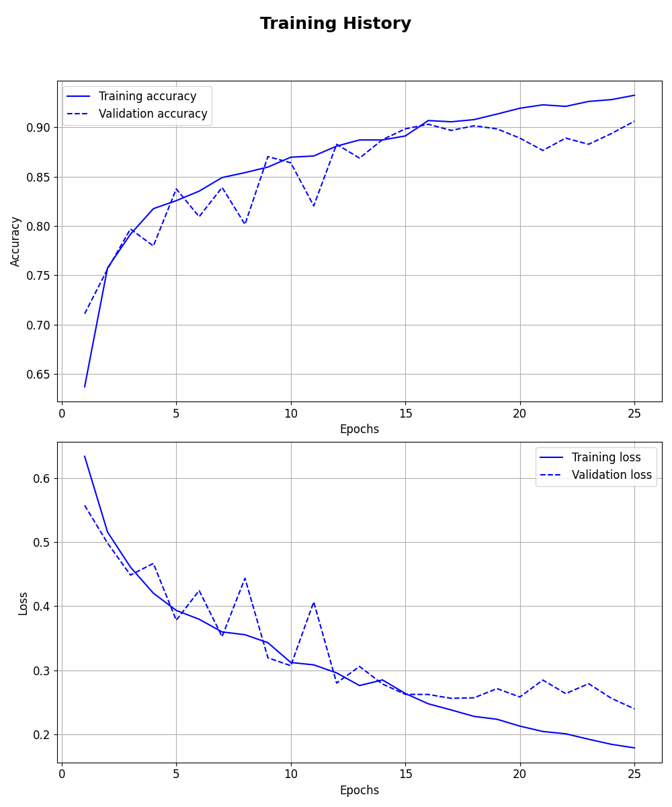

### Detailed Report of Test Set:

|              | precision    | recall       | f1-score     | support      |
| ------------ | ------------ | ------------ | ------------ | ------------ |
| chihuahua    | 0.9106       | 0.8973       | 0.9039       | 477          | 
| muffin       | 0.8842       | 0.8990       | 0.8915       | 416          | 
| micro avg    | 0.8981       | 0.8981       | 0.8981       | 893          | 
| macro avg    | 0.8974       | 0.8982       | 0.8977       | 893          | 
| weighted avg | 0.8983       | 0.8981       | 0.8981       | 893          | 
| samples avg  | 0.8981       | 0.8981       | 0.8981       | 893          | 

## trial_46

*    *Start Time*: 2024-10-20 11:59:19

*    *Duration*: 32.868

*    *Directory*: [Link](./trial_46)

### Hyperparameters:

| Hyperparameter         | Value                  |
| ---------------------- | ---------------------- |
| units1                 | 128                    |
| kernel_size1           | 3                      |
| units2                 | 64                     |
| kernel_size2           | 7                      |
| dense_units            | 128                    |
| dropout_rate           | 0.036544088621522246   |
| learning_rate          | 0.00013457145748833213 |

### Evaluation Metrics:

|           | train     | val       | test      |
| --------- | --------- | --------- | --------- |
| accuracy  | 0.9828    | 0.9016    | 0.8981    | 
| precision | 0.9828    | 0.9016    | 0.8981    | 
| recall    | 0.9828    | 0.9016    | 0.8981    | 
| f1        | 0.9828    | 0.9016    | 0.8981    | 

### Figures:

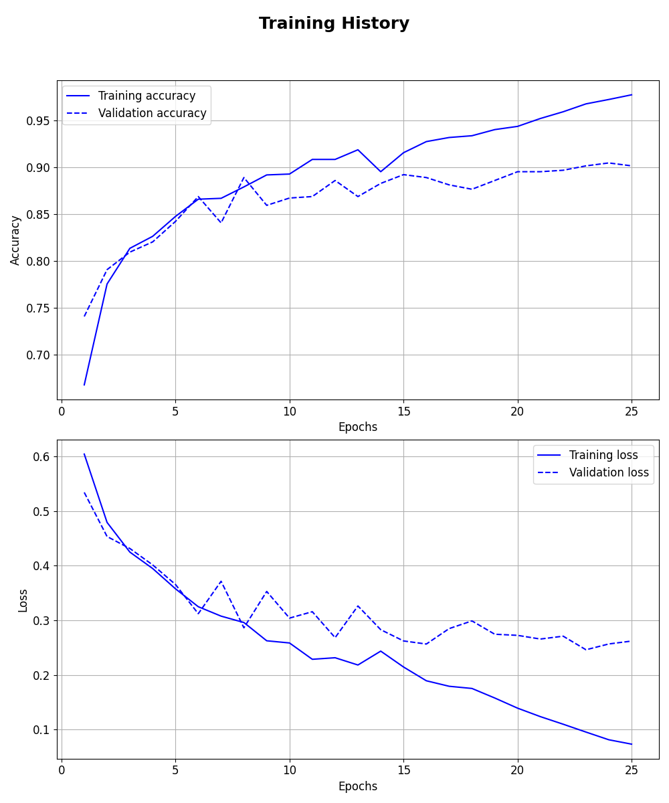

### Detailed Report of Test Set:

|              | precision    | recall       | f1-score     | support      |
| ------------ | ------------ | ------------ | ------------ | ------------ |
| chihuahua    | 0.8814       | 0.9350       | 0.9074       | 477          | 
| muffin       | 0.9199       | 0.8558       | 0.8867       | 416          | 
| micro avg    | 0.8981       | 0.8981       | 0.8981       | 893          | 
| macro avg    | 0.9007       | 0.8954       | 0.8971       | 893          | 
| weighted avg | 0.8993       | 0.8981       | 0.8978       | 893          | 
| samples avg  | 0.8981       | 0.8981       | 0.8981       | 893          | 

## trial_47

*    *Start Time*: 2024-10-20 11:59:53

*    *Duration*: 33.485

*    *Directory*: [Link](./trial_47)

### Hyperparameters:

| Hyperparameter         | Value                  |
| ---------------------- | ---------------------- |
| units1                 | 128                    |
| kernel_size1           | 3                      |
| units2                 | 64                     |
| kernel_size2           | 7                      |
| dense_units            | 256                    |
| dropout_rate           | 0.1589911801054894     |
| learning_rate          | 0.00010751180233446253 |

### Evaluation Metrics:

|           | train     | val       | test      |
| --------- | --------- | --------- | --------- |
| accuracy  | 0.9812    | 0.9016    | 0.8981    | 
| precision | 0.9812    | 0.9016    | 0.8981    | 
| recall    | 0.9812    | 0.9016    | 0.8981    | 
| f1        | 0.9812    | 0.9016    | 0.8981    | 

### Figures:

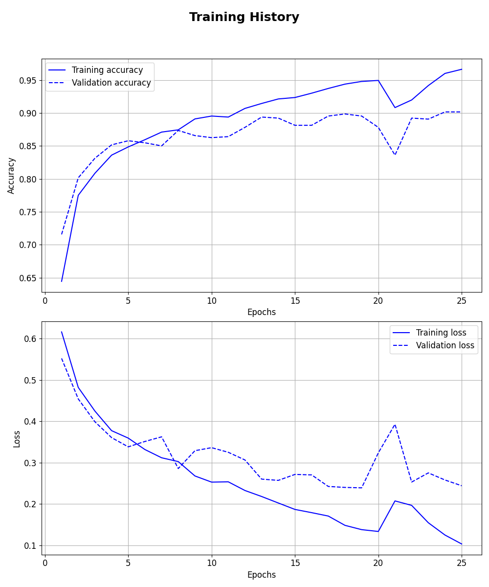

### Detailed Report of Test Set:

|              | precision    | recall       | f1-score     | support      |
| ------------ | ------------ | ------------ | ------------ | ------------ |
| chihuahua    | 0.8907       | 0.9224       | 0.9063       | 477          | 
| muffin       | 0.9073       | 0.8702       | 0.8883       | 416          | 
| micro avg    | 0.8981       | 0.8981       | 0.8981       | 893          | 
| macro avg    | 0.8990       | 0.8963       | 0.8973       | 893          | 
| weighted avg | 0.8984       | 0.8981       | 0.8979       | 893          | 
| samples avg  | 0.8981       | 0.8981       | 0.8981       | 893          | 

## trial_93

*    *Start Time*: 2024-10-20 12:24:43

*    *Duration*: 32.832

*    *Directory*: [Link](./trial_93)

### Hyperparameters:

| Hyperparameter         | Value                  |
| ---------------------- | ---------------------- |
| units1                 | 128                    |
| kernel_size1           | 3                      |
| units2                 | 64                     |
| kernel_size2           | 7                      |
| dense_units            | 128                    |
| dropout_rate           | 0.21921463379513648    |
| learning_rate          | 5.5498424624983134e-05 |

### Evaluation Metrics:

|           | train     | val       | test      |
| --------- | --------- | --------- | --------- |
| accuracy  | 0.9253    | 0.8984    | 0.8981    | 
| precision | 0.9253    | 0.8984    | 0.8981    | 
| recall    | 0.9253    | 0.8984    | 0.8981    | 
| f1        | 0.9253    | 0.8984    | 0.8981    | 

### Figures:

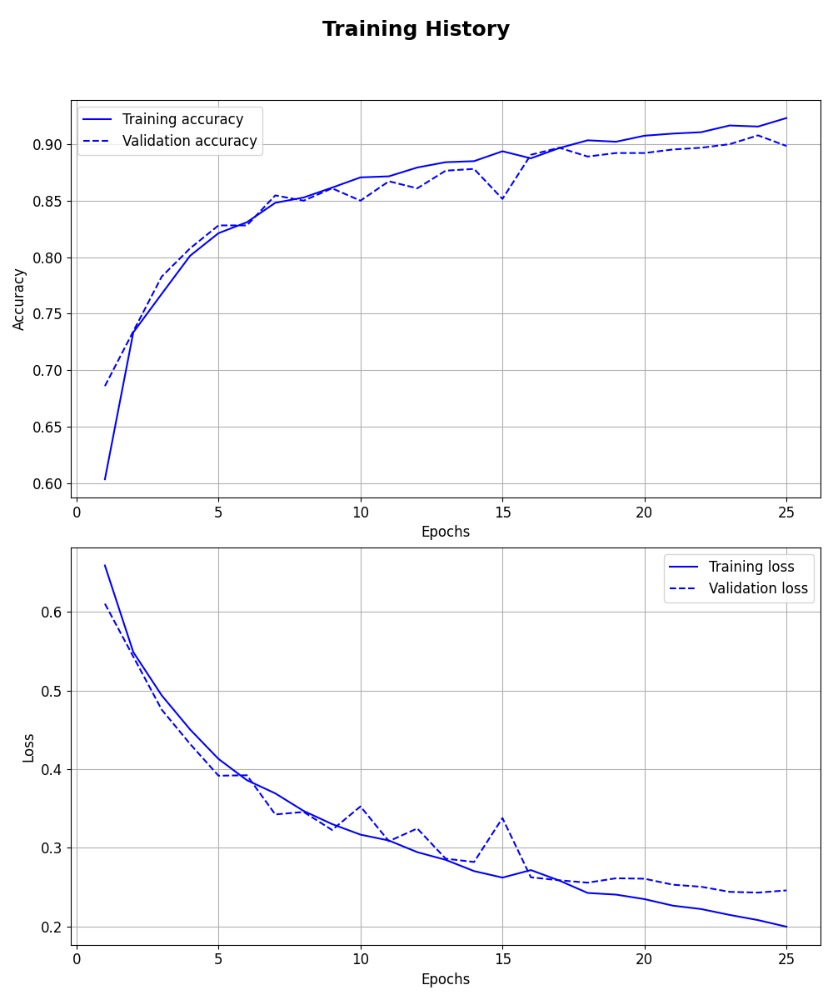

### Detailed Report of Test Set:

|              | precision    | recall       | f1-score     | support      |
| ------------ | ------------ | ------------ | ------------ | ------------ |
| chihuahua    | 0.9196       | 0.8868       | 0.9029       | 477          | 
| muffin       | 0.8753       | 0.9111       | 0.8928       | 416          | 
| micro avg    | 0.8981       | 0.8981       | 0.8981       | 893          | 
| macro avg    | 0.8974       | 0.8989       | 0.8978       | 893          | 
| weighted avg | 0.8989       | 0.8981       | 0.8982       | 893          | 
| samples avg  | 0.8981       | 0.8981       | 0.8981       | 893          | 

## trial_9

*    *Start Time*: 2024-10-20 11:42:25

*    *Duration*: 27.983

*    *Directory*: [Link](./trial_9)

### Hyperparameters:

| Hyperparameter        | Value                 |
| --------------------- | --------------------- |
| units1                | 64                    |
| kernel_size1          | 7                     |
| units2                | 64                    |
| kernel_size2          | 7                     |
| dense_units           | 256                   |
| dropout_rate          | 0.4399415525895406    |
| learning_rate         | 4.147251852678914e-05 |

### Evaluation Metrics:

|           | train     | val       | test      |
| --------- | --------- | --------- | --------- |
| accuracy  | 0.9131    | 0.8938    | 0.8970    | 
| precision | 0.9131    | 0.8938    | 0.8970    | 
| recall    | 0.9131    | 0.8938    | 0.8970    | 
| f1        | 0.9131    | 0.8937    | 0.8970    | 

### Figures:

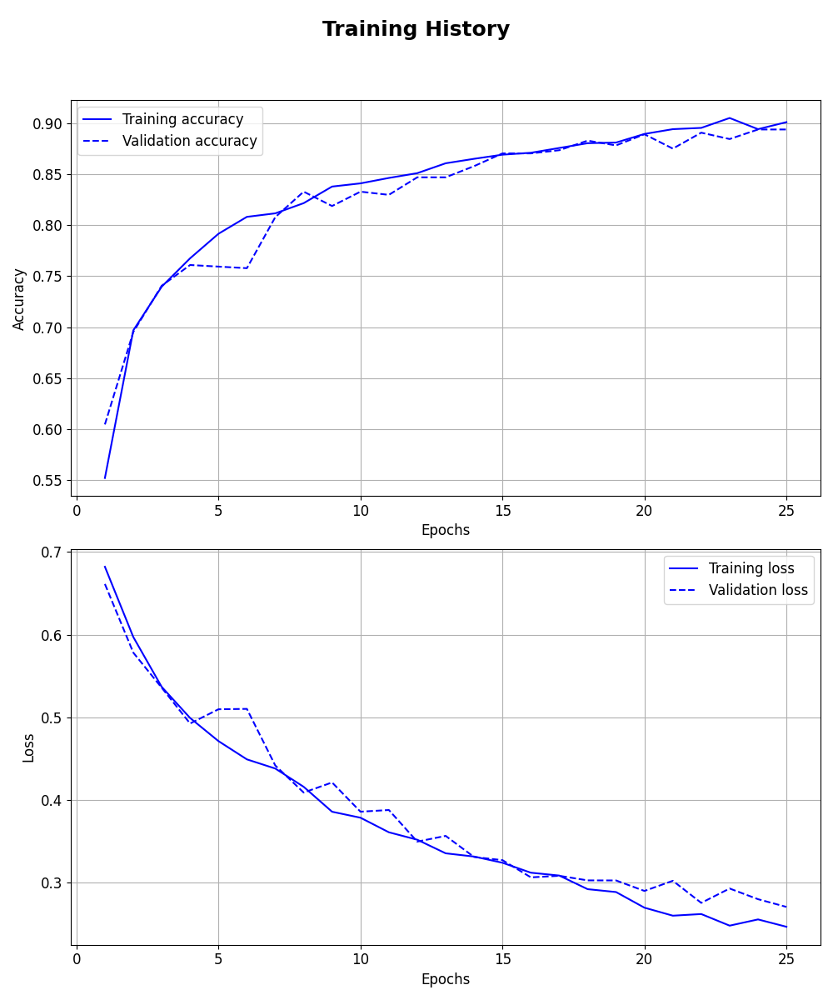

### Detailed Report of Test Set:

|              | precision    | recall       | f1-score     | support      |
| ------------ | ------------ | ------------ | ------------ | ------------ |
| chihuahua    | 0.9070       | 0.8994       | 0.9032       | 477          | 
| muffin       | 0.8857       | 0.8942       | 0.8900       | 416          | 
| micro avg    | 0.8970       | 0.8970       | 0.8970       | 893          | 
| macro avg    | 0.8963       | 0.8968       | 0.8966       | 893          | 
| weighted avg | 0.8971       | 0.8970       | 0.8970       | 893          | 
| samples avg  | 0.8970       | 0.8970       | 0.8970       | 893          | 

## trial_52

*    *Start Time*: 2024-10-20 12:02:51

*    *Duration*: 33.213

*    *Directory*: [Link](./trial_52)

### Hyperparameters:

| Hyperparameter         | Value                  |
| ---------------------- | ---------------------- |
| units1                 | 128                    |
| kernel_size1           | 3                      |
| units2                 | 64                     |
| kernel_size2           | 7                      |
| dense_units            | 256                    |
| dropout_rate           | 0.22634106272893156    |
| learning_rate          | 5.1771039177890786e-05 |

### Evaluation Metrics:

|           | train     | val       | test      |
| --------- | --------- | --------- | --------- |
| accuracy  | 0.9341    | 0.9016    | 0.8970    | 
| precision | 0.9341    | 0.9016    | 0.8970    | 
| recall    | 0.9341    | 0.9016    | 0.8970    | 
| f1        | 0.9341    | 0.9016    | 0.8970    | 

### Figures:

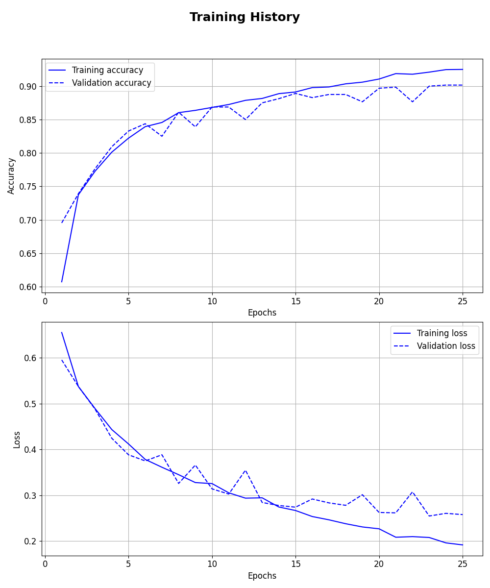

### Detailed Report of Test Set:

|              | precision    | recall       | f1-score     | support      |
| ------------ | ------------ | ------------ | ------------ | ------------ |
| chihuahua    | 0.8767       | 0.9392       | 0.9069       | 477          | 
| muffin       | 0.9241       | 0.8486       | 0.8847       | 416          | 
| micro avg    | 0.8970       | 0.8970       | 0.8970       | 893          | 
| macro avg    | 0.9004       | 0.8939       | 0.8958       | 893          | 
| weighted avg | 0.8988       | 0.8970       | 0.8966       | 893          | 
| samples avg  | 0.8970       | 0.8970       | 0.8970       | 893          | 

## trial_53

*    *Start Time*: 2024-10-20 12:03:25

*    *Duration*: 33.291

*    *Directory*: [Link](./trial_53)

### Hyperparameters:

| Hyperparameter        | Value                 |
| --------------------- | --------------------- |
| units1                | 128                   |
| kernel_size1          | 3                     |
| units2                | 64                    |
| kernel_size2          | 7                     |
| dense_units           | 256                   |
| dropout_rate          | 0.20038936690491183   |
| learning_rate         | 5.842972839109143e-05 |

### Evaluation Metrics:

|           | train     | val       | test      |
| --------- | --------- | --------- | --------- |
| accuracy  | 0.9350    | 0.8969    | 0.8970    | 
| precision | 0.9350    | 0.8969    | 0.8970    | 
| recall    | 0.9350    | 0.8969    | 0.8970    | 
| f1        | 0.9350    | 0.8969    | 0.8970    | 

### Figures:

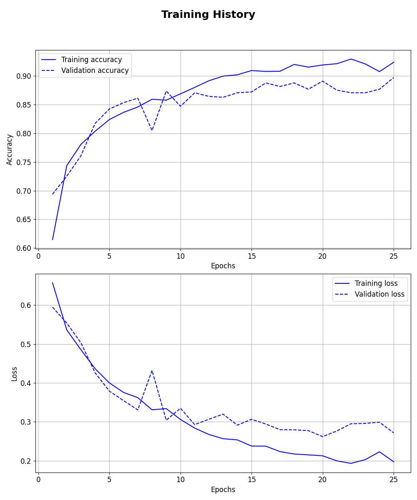

### Detailed Report of Test Set:

|              | precision    | recall       | f1-score     | support      |
| ------------ | ------------ | ------------ | ------------ | ------------ |
| chihuahua    | 0.8681       | 0.9518       | 0.9080       | 477          | 
| muffin       | 0.9378       | 0.8341       | 0.8830       | 416          | 
| micro avg    | 0.8970       | 0.8970       | 0.8970       | 893          | 
| macro avg    | 0.9030       | 0.8930       | 0.8955       | 893          | 
| weighted avg | 0.9006       | 0.8970       | 0.8963       | 893          | 
| samples avg  | 0.8970       | 0.8970       | 0.8970       | 893          | 

## trial_92

*    *Start Time*: 2024-10-20 12:24:19

*    *Duration*: 22.137

*    *Directory*: [Link](./trial_92)

### Hyperparameters:

| Hyperparameter         | Value                  |
| ---------------------- | ---------------------- |
| units1                 | 64                     |
| kernel_size1           | 3                      |
| units2                 | 64                     |
| kernel_size2           | 7                      |
| dense_units            | 128                    |
| dropout_rate           | 0.21804361218625906    |
| learning_rate          | 5.4859895855698256e-05 |

### Evaluation Metrics:

|           | train     | val       | test      |
| --------- | --------- | --------- | --------- |
| accuracy  | 0.9259    | 0.9031    | 0.8970    | 
| precision | 0.9259    | 0.9031    | 0.8970    | 
| recall    | 0.9259    | 0.9031    | 0.8970    | 
| f1        | 0.9259    | 0.9031    | 0.8970    | 

### Figures:

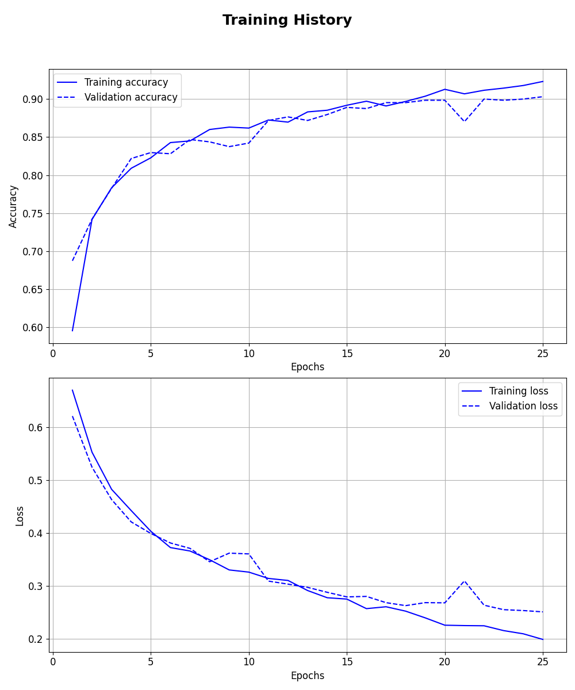

### Detailed Report of Test Set:

|              | precision    | recall       | f1-score     | support      |
| ------------ | ------------ | ------------ | ------------ | ------------ |
| chihuahua    | 0.9140       | 0.8910       | 0.9023       | 477          | 
| muffin       | 0.8785       | 0.9038       | 0.8910       | 416          | 
| micro avg    | 0.8970       | 0.8970       | 0.8970       | 893          | 
| macro avg    | 0.8962       | 0.8974       | 0.8967       | 893          | 
| weighted avg | 0.8975       | 0.8970       | 0.8971       | 893          | 
| samples avg  | 0.8970       | 0.8970       | 0.8970       | 893          | 

## trial_25

*    *Start Time*: 2024-10-20 11:48:45

*    *Duration*: 25.169

*    *Directory*: [Link](./trial_25)

### Hyperparameters:

| Hyperparameter         | Value                  |
| ---------------------- | ---------------------- |
| units1                 | 128                    |
| kernel_size1           | 3                      |
| units2                 | 64                     |
| kernel_size2           | 3                      |
| dense_units            | 256                    |
| dropout_rate           | 0.10405438879835788    |
| learning_rate          | 5.1591994452276956e-05 |

### Evaluation Metrics:

|           | train     | val       | test      |
| --------- | --------- | --------- | --------- |
| accuracy  | 0.9531    | 0.9031    | 0.8959    | 
| precision | 0.9531    | 0.9031    | 0.8959    | 
| recall    | 0.9531    | 0.9031    | 0.8959    | 
| f1        | 0.9531    | 0.9031    | 0.8959    | 

### Figures:

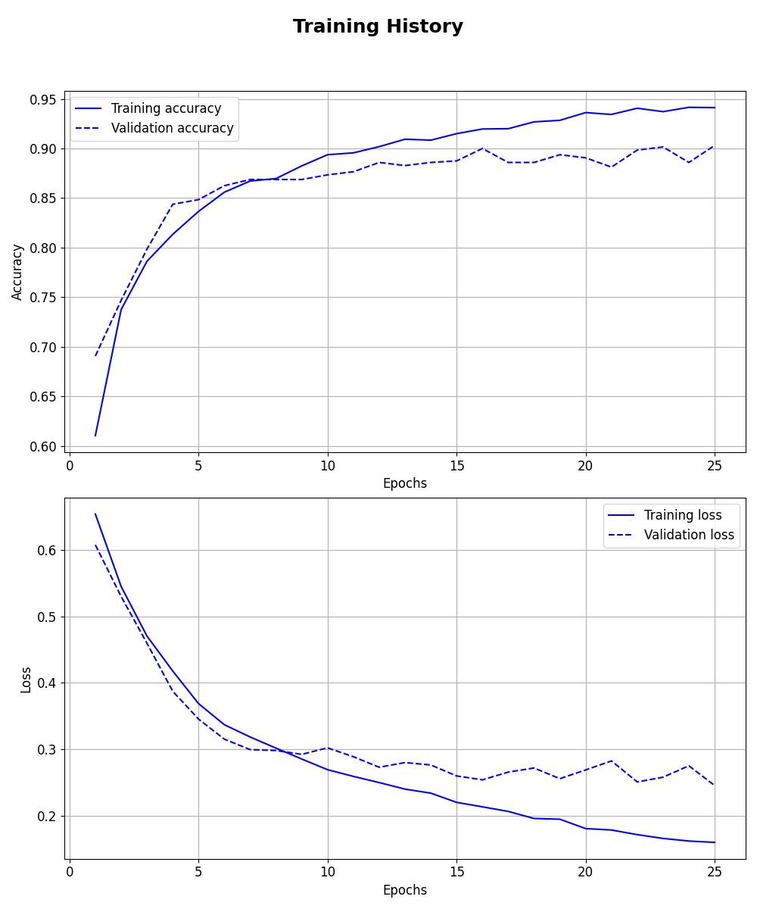

### Detailed Report of Test Set:

|              | precision    | recall       | f1-score     | support      |
| ------------ | ------------ | ------------ | ------------ | ------------ |
| chihuahua    | 0.9103       | 0.8931       | 0.9016       | 477          | 
| muffin       | 0.8800       | 0.8990       | 0.8894       | 416          | 
| micro avg    | 0.8959       | 0.8959       | 0.8959       | 893          | 
| macro avg    | 0.8951       | 0.8961       | 0.8955       | 893          | 
| weighted avg | 0.8962       | 0.8959       | 0.8959       | 893          | 
| samples avg  | 0.8959       | 0.8959       | 0.8959       | 893          | 

## trial_32

*    *Start Time*: 2024-10-20 11:51:53

*    *Duration*: 25.289

*    *Directory*: [Link](./trial_32)

### Hyperparameters:

| Hyperparameter        | Value                 |
| --------------------- | --------------------- |
| units1                | 128                   |
| kernel_size1          | 3                     |
| units2                | 64                    |
| kernel_size2          | 3                     |
| dense_units           | 128                   |
| dropout_rate          | 0.08804036278119495   |
| learning_rate         | 0.0001432259142361093 |

### Evaluation Metrics:

|           | train     | val       | test      |
| --------- | --------- | --------- | --------- |
| accuracy  | 0.9766    | 0.8875    | 0.8959    | 
| precision | 0.9766    | 0.8875    | 0.8959    | 
| recall    | 0.9766    | 0.8875    | 0.8959    | 
| f1        | 0.9766    | 0.8875    | 0.8959    | 

### Figures:

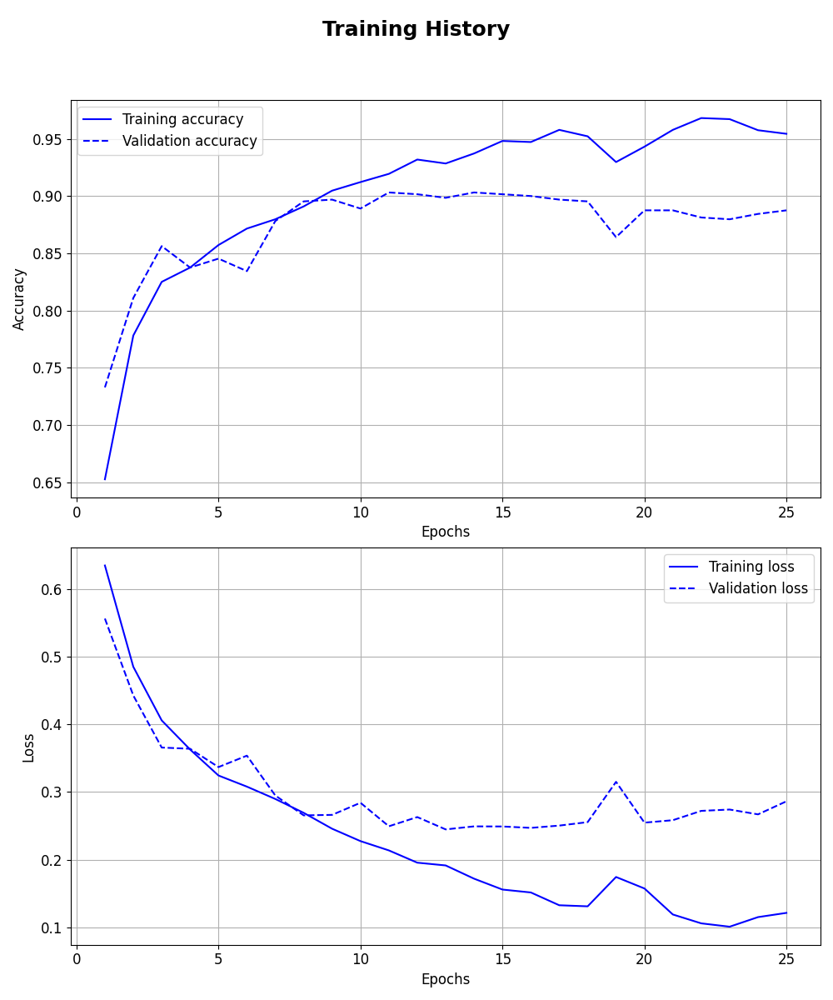

### Detailed Report of Test Set:

|              | precision    | recall       | f1-score     | support      |
| ------------ | ------------ | ------------ | ------------ | ------------ |
| chihuahua    | 0.8840       | 0.9266       | 0.9048       | 477          | 
| muffin       | 0.9109       | 0.8606       | 0.8850       | 416          | 
| micro avg    | 0.8959       | 0.8959       | 0.8959       | 893          | 
| macro avg    | 0.8975       | 0.8936       | 0.8949       | 893          | 
| weighted avg | 0.8966       | 0.8959       | 0.8956       | 893          | 
| samples avg  | 0.8959       | 0.8959       | 0.8959       | 893          | 

## trial_76

*    *Start Time*: 2024-10-20 12:15:10

*    *Duration*: 32.794

*    *Directory*: [Link](./trial_76)

### Hyperparameters:

| Hyperparameter        | Value                 |
| --------------------- | --------------------- |
| units1                | 128                   |
| kernel_size1          | 3                     |
| units2                | 64                    |
| kernel_size2          | 7                     |
| dense_units           | 128                   |
| dropout_rate          | 0.22470956769998018   |
| learning_rate         | 7.876695185789754e-05 |

### Evaluation Metrics:

|           | train     | val       | test      |
| --------- | --------- | --------- | --------- |
| accuracy  | 0.9366    | 0.9031    | 0.8959    | 
| precision | 0.9366    | 0.9031    | 0.8959    | 
| recall    | 0.9366    | 0.9031    | 0.8959    | 
| f1        | 0.9366    | 0.9031    | 0.8959    | 

### Figures:

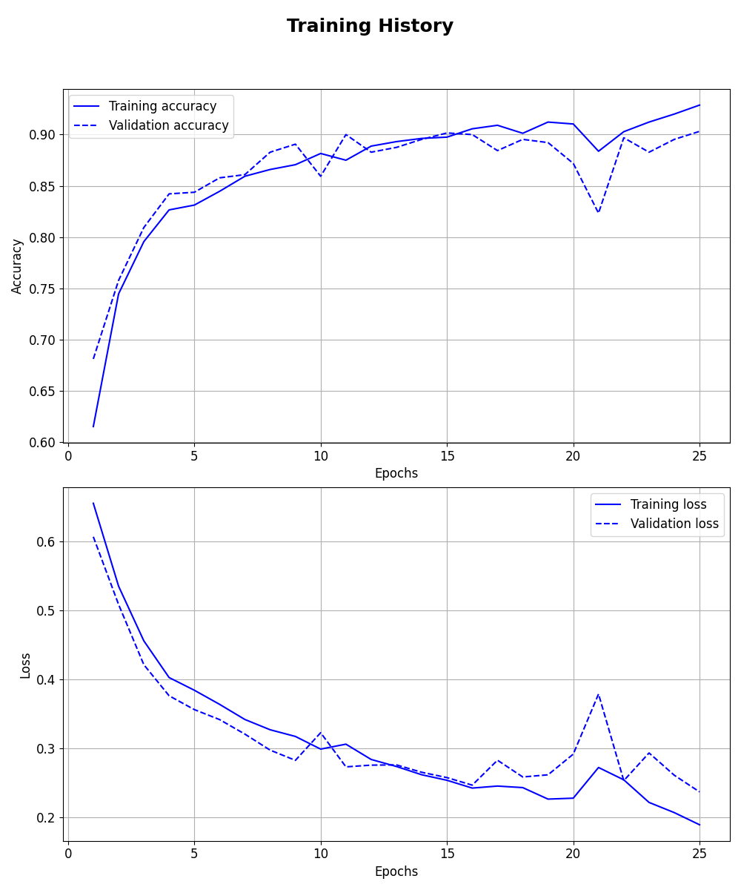

### Detailed Report of Test Set:

|              | precision    | recall       | f1-score     | support      |
| ------------ | ------------ | ------------ | ------------ | ------------ |
| chihuahua    | 0.9068       | 0.8973       | 0.9020       | 477          | 
| muffin       | 0.8836       | 0.8942       | 0.8889       | 416          | 
| micro avg    | 0.8959       | 0.8959       | 0.8959       | 893          | 
| macro avg    | 0.8952       | 0.8958       | 0.8954       | 893          | 
| weighted avg | 0.8960       | 0.8959       | 0.8959       | 893          | 
| samples avg  | 0.8959       | 0.8959       | 0.8959       | 893          | 

## trial_4

*    *Start Time*: 2024-10-20 11:39:45

*    *Duration*: 30.502

*    *Directory*: [Link](./trial_4)

### Hyperparameters:

| Hyperparameter        | Value                 |
| --------------------- | --------------------- |
| units1                | 128                   |
| kernel_size1          | 7                     |
| units2                | 16                    |
| kernel_size2          | 7                     |
| dense_units           | 128                   |
| dropout_rate          | 0.4268256623318372    |
| learning_rate         | 9.877515137356627e-05 |

### Evaluation Metrics:

|           | train     | val       | test      |
| --------- | --------- | --------- | --------- |
| accuracy  | 0.9097    | 0.8875    | 0.8936    | 
| precision | 0.9097    | 0.8875    | 0.8936    | 
| recall    | 0.9097    | 0.8875    | 0.8936    | 
| f1        | 0.9097    | 0.8875    | 0.8936    | 

### Figures:

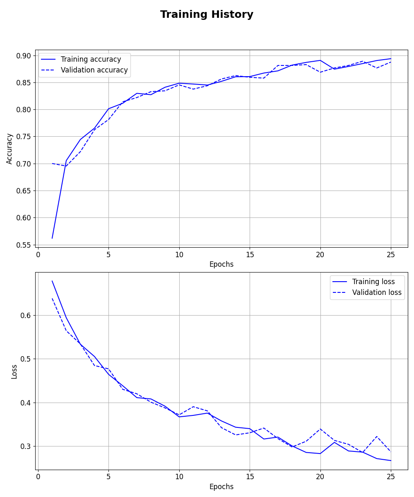

### Detailed Report of Test Set:

|              | precision    | recall       | f1-score     | support      |
| ------------ | ------------ | ------------ | ------------ | ------------ |
| chihuahua    | 0.8963       | 0.9057       | 0.9009       | 477          | 
| muffin       | 0.8905       | 0.8798       | 0.8851       | 416          | 
| micro avg    | 0.8936       | 0.8936       | 0.8936       | 893          | 
| macro avg    | 0.8934       | 0.8927       | 0.8930       | 893          | 
| weighted avg | 0.8936       | 0.8936       | 0.8936       | 893          | 
| samples avg  | 0.8936       | 0.8936       | 0.8936       | 893          | 

## trial_37

*    *Start Time*: 2024-10-20 11:54:29

*    *Duration*: 29.297

*    *Directory*: [Link](./trial_37)

### Hyperparameters:

| Hyperparameter         | Value                  |
| ---------------------- | ---------------------- |
| units1                 | 128                    |
| kernel_size1           | 3                      |
| units2                 | 64                     |
| kernel_size2           | 5                      |
| dense_units            | 128                    |
| dropout_rate           | 0.16964906896389045    |
| learning_rate          | 0.00026937522021898115 |

### Evaluation Metrics:

|           | train     | val       | test      |
| --------- | --------- | --------- | --------- |
| accuracy  | 0.9809    | 0.8813    | 0.8936    | 
| precision | 0.9809    | 0.8813    | 0.8936    | 
| recall    | 0.9809    | 0.8813    | 0.8936    | 
| f1        | 0.9809    | 0.8812    | 0.8936    | 

### Figures:

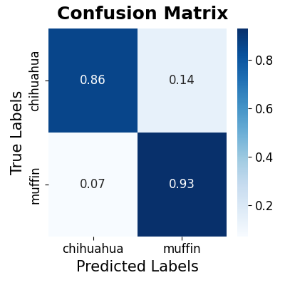

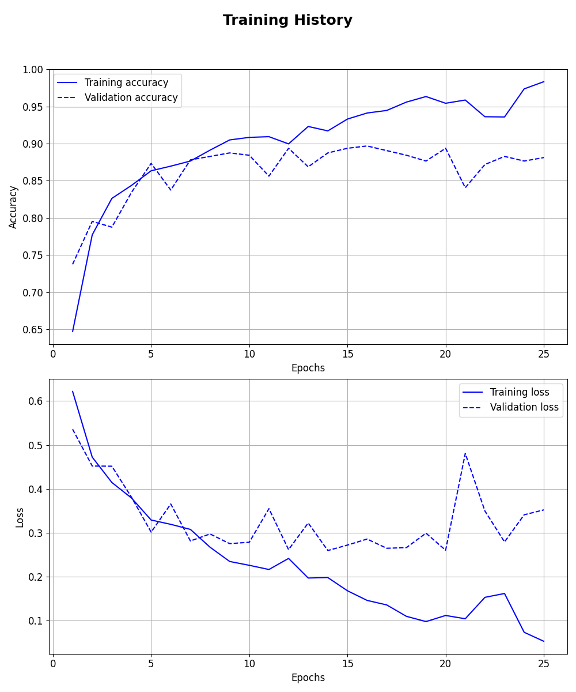

### Detailed Report of Test Set:

|              | precision    | recall       | f1-score     | support      |
| ------------ | ------------ | ------------ | ------------ | ------------ |
| chihuahua    | 0.9341       | 0.8616       | 0.8964       | 477          | 
| muffin       | 0.8543       | 0.9303       | 0.8907       | 416          | 
| micro avg    | 0.8936       | 0.8936       | 0.8936       | 893          | 
| macro avg    | 0.8942       | 0.8960       | 0.8935       | 893          | 
| weighted avg | 0.8969       | 0.8936       | 0.8937       | 893          | 
| samples avg  | 0.8936       | 0.8936       | 0.8936       | 893          | 

## trial_44

*    *Start Time*: 2024-10-20 11:58:12

*    *Duration*: 32.823

*    *Directory*: [Link](./trial_44)

### Hyperparameters:

| Hyperparameter         | Value                  |
| ---------------------- | ---------------------- |
| units1                 | 128                    |
| kernel_size1           | 3                      |
| units2                 | 64                     |
| kernel_size2           | 7                      |
| dense_units            | 128                    |
| dropout_rate           | 0.30402426555404355    |
| learning_rate          | 0.00019680487813609384 |

### Evaluation Metrics:

|           | train     | val       | test      |
| --------- | --------- | --------- | --------- |
| accuracy  | 0.9622    | 0.8922    | 0.8936    | 
| precision | 0.9622    | 0.8922    | 0.8936    | 
| recall    | 0.9622    | 0.8922    | 0.8936    | 
| f1        | 0.9622    | 0.8922    | 0.8936    | 

### Figures:

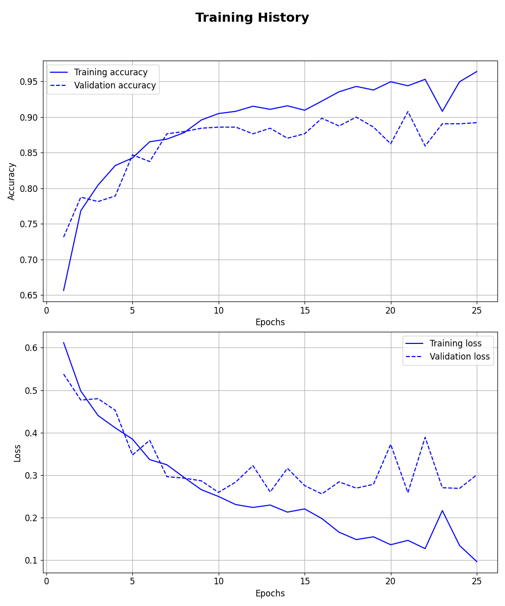

### Detailed Report of Test Set:

|              | precision    | recall       | f1-score     | support      |
| ------------ | ------------ | ------------ | ------------ | ------------ |
| chihuahua    | 0.9361       | 0.8595       | 0.8962       | 477          | 
| muffin       | 0.8527       | 0.9327       | 0.8909       | 416          | 
| micro avg    | 0.8936       | 0.8936       | 0.8936       | 893          | 
| macro avg    | 0.8944       | 0.8961       | 0.8936       | 893          | 
| weighted avg | 0.8973       | 0.8936       | 0.8937       | 893          | 
| samples avg  | 0.8936       | 0.8936       | 0.8936       | 893          | 

## trial_31

*    *Start Time*: 2024-10-20 11:51:23

*    *Duration*: 29.423

*    *Directory*: [Link](./trial_31)

### Hyperparameters:

| Hyperparameter        | Value                 |
| --------------------- | --------------------- |
| units1                | 128                   |
| kernel_size1          | 3                     |
| units2                | 64                    |
| kernel_size2          | 5                     |
| dense_units           | 128                   |
| dropout_rate          | 0.20512330309146576   |
| learning_rate         | 0.0002757843354855997 |

### Evaluation Metrics:

|           | train     | val       | test      |
| --------- | --------- | --------- | --------- |
| accuracy  | 0.9878    | 0.8891    | 0.8925    | 
| precision | 0.9878    | 0.8891    | 0.8925    | 
| recall    | 0.9878    | 0.8891    | 0.8925    | 
| f1        | 0.9878    | 0.8891    | 0.8925    | 

### Figures:

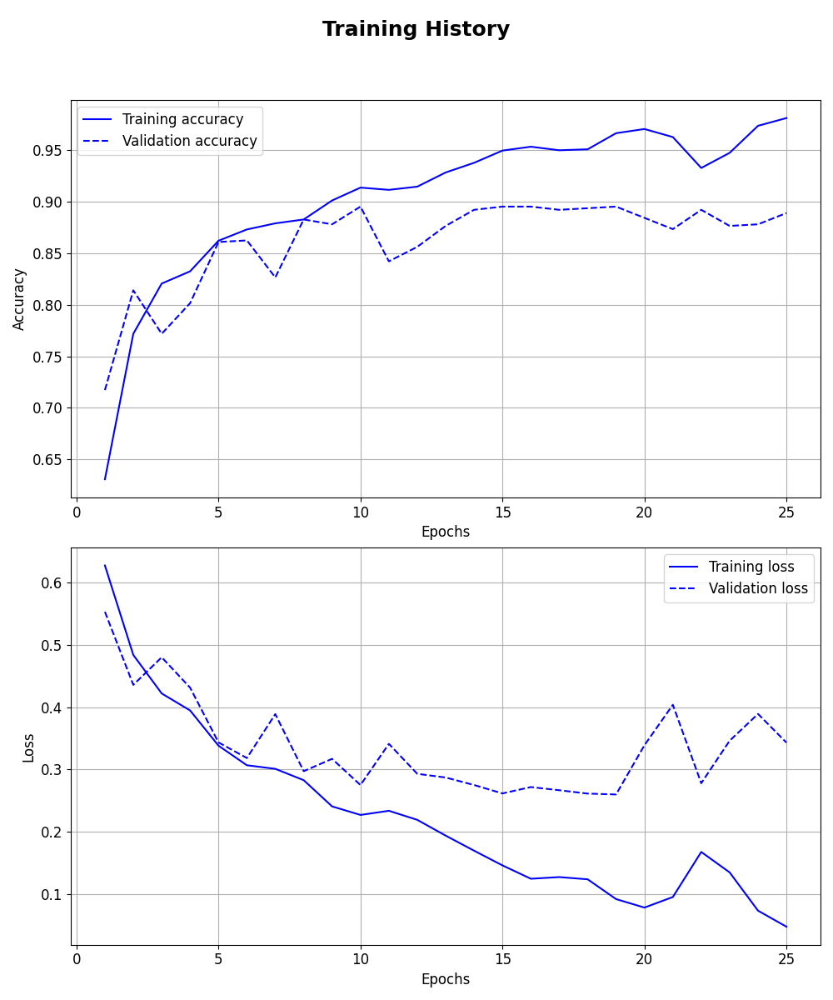

### Detailed Report of Test Set:

|              | precision    | recall       | f1-score     | support      |
| ------------ | ------------ | ------------ | ------------ | ------------ |
| chihuahua    | 0.9205       | 0.8742       | 0.8968       | 477          | 
| muffin       | 0.8636       | 0.9135       | 0.8879       | 416          | 
| micro avg    | 0.8925       | 0.8925       | 0.8925       | 893          | 
| macro avg    | 0.8921       | 0.8938       | 0.8923       | 893          | 
| weighted avg | 0.8940       | 0.8925       | 0.8926       | 893          | 
| samples avg  | 0.8925       | 0.8925       | 0.8925       | 893          | 

## trial_41

*    *Start Time*: 2024-10-20 11:56:34

*    *Duration*: 29.216

*    *Directory*: [Link](./trial_41)

### Hyperparameters:

| Hyperparameter        | Value                 |
| --------------------- | --------------------- |
| units1                | 128                   |
| kernel_size1          | 3                     |
| units2                | 64                    |
| kernel_size2          | 5                     |
| dense_units           | 128                   |
| dropout_rate          | 0.2578949891812714    |
| learning_rate         | 0.0007471523408333744 |

### Evaluation Metrics:

|           | train     | val       | test      |
| --------- | --------- | --------- | --------- |
| accuracy  | 0.9950    | 0.8938    | 0.8925    | 
| precision | 0.9950    | 0.8938    | 0.8925    | 
| recall    | 0.9950    | 0.8938    | 0.8925    | 
| f1        | 0.9950    | 0.8937    | 0.8925    | 

### Figures:

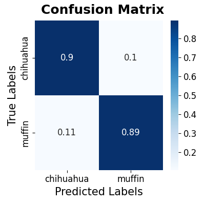

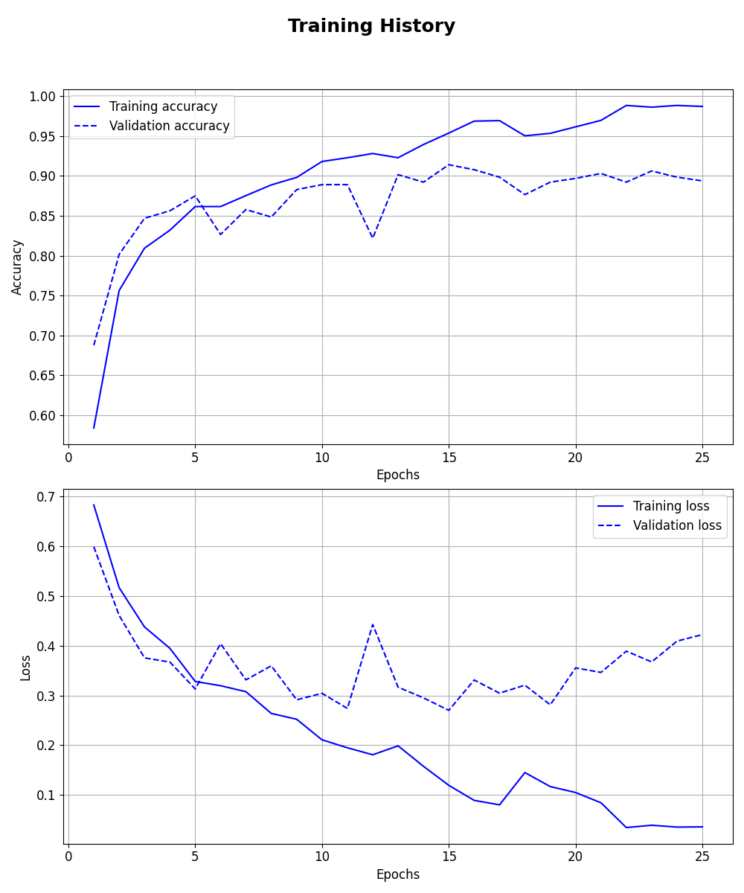

### Detailed Report of Test Set:

|              | precision    | recall       | f1-score     | support      |
| ------------ | ------------ | ------------ | ------------ | ------------ |
| chihuahua    | 0.9027       | 0.8952       | 0.8989       | 477          | 
| muffin       | 0.8810       | 0.8894       | 0.8852       | 416          | 
| micro avg    | 0.8925       | 0.8925       | 0.8925       | 893          | 
| macro avg    | 0.8919       | 0.8923       | 0.8921       | 893          | 
| weighted avg | 0.8926       | 0.8925       | 0.8925       | 893          | 
| samples avg  | 0.8925       | 0.8925       | 0.8925       | 893          | 

## trial_50

*    *Start Time*: 2024-10-20 12:01:42

*    *Duration*: 33.256

*    *Directory*: [Link](./trial_50)

### Hyperparameters:

| Hyperparameter         | Value                  |
| ---------------------- | ---------------------- |
| units1                 | 128                    |
| kernel_size1           | 3                      |
| units2                 | 64                     |
| kernel_size2           | 7                      |
| dense_units            | 256                    |
| dropout_rate           | 0.2459440028092077     |
| learning_rate          | 0.00017502697871189972 |

### Evaluation Metrics:

|           | train     | val       | test      |
| --------- | --------- | --------- | --------- |
| accuracy  | 0.9931    | 0.8953    | 0.8925    | 
| precision | 0.9931    | 0.8953    | 0.8925    | 
| recall    | 0.9931    | 0.8953    | 0.8925    | 
| f1        | 0.9931    | 0.8953    | 0.8925    | 

### Figures:

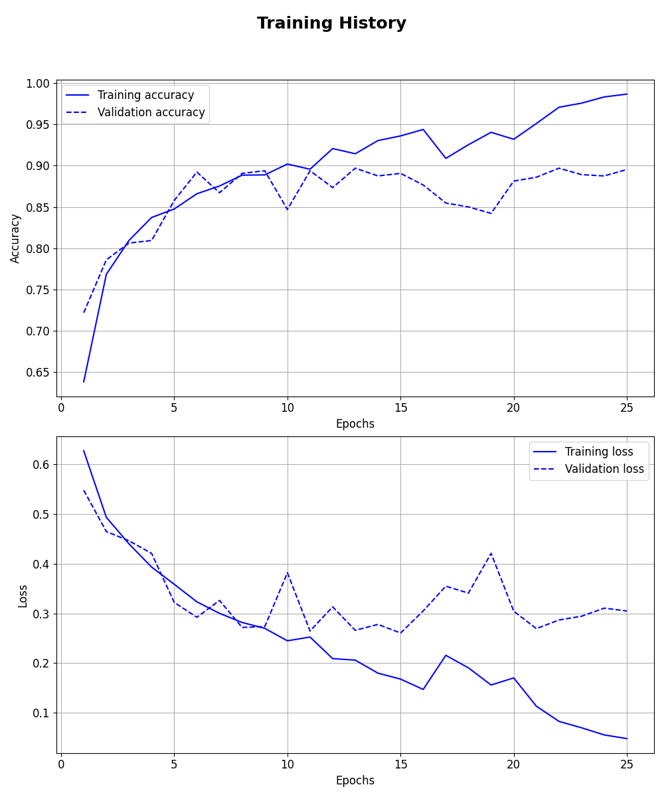

### Detailed Report of Test Set:

|              | precision    | recall       | f1-score     | support      |
| ------------ | ------------ | ------------ | ------------ | ------------ |
| chihuahua    | 0.8757       | 0.9308       | 0.9024       | 477          | 
| muffin       | 0.9145       | 0.8486       | 0.8803       | 416          | 
| micro avg    | 0.8925       | 0.8925       | 0.8925       | 893          | 
| macro avg    | 0.8951       | 0.8897       | 0.8914       | 893          | 
| weighted avg | 0.8938       | 0.8925       | 0.8921       | 893          | 
| samples avg  | 0.8925       | 0.8925       | 0.8925       | 893          | 

## trial_89

*    *Start Time*: 2024-10-20 12:22:39

*    *Duration*: 29.823

*    *Directory*: [Link](./trial_89)

### Hyperparameters:

| Hyperparameter       | Value                |
| -------------------- | -------------------- |
| units1               | 128                  |
| kernel_size1         | 3                    |
| units2               | 64                   |
| kernel_size2         | 5                    |
| dense_units          | 256                  |
| dropout_rate         | 0.17242759721540662  |
| learning_rate        | 9.55994452075401e-05 |

### Evaluation Metrics:

|           | train     | val       | test      |
| --------- | --------- | --------- | --------- |
| accuracy  | 0.9438    | 0.8750    | 0.8925    | 
| precision | 0.9438    | 0.8750    | 0.8925    | 
| recall    | 0.9438    | 0.8750    | 0.8925    | 
| f1        | 0.9437    | 0.8750    | 0.8925    | 

### Figures:

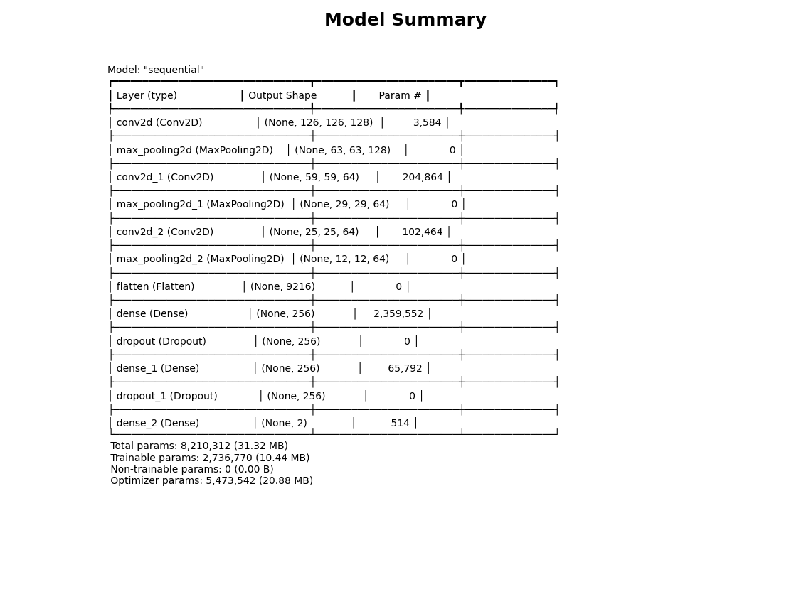

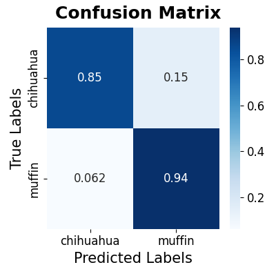

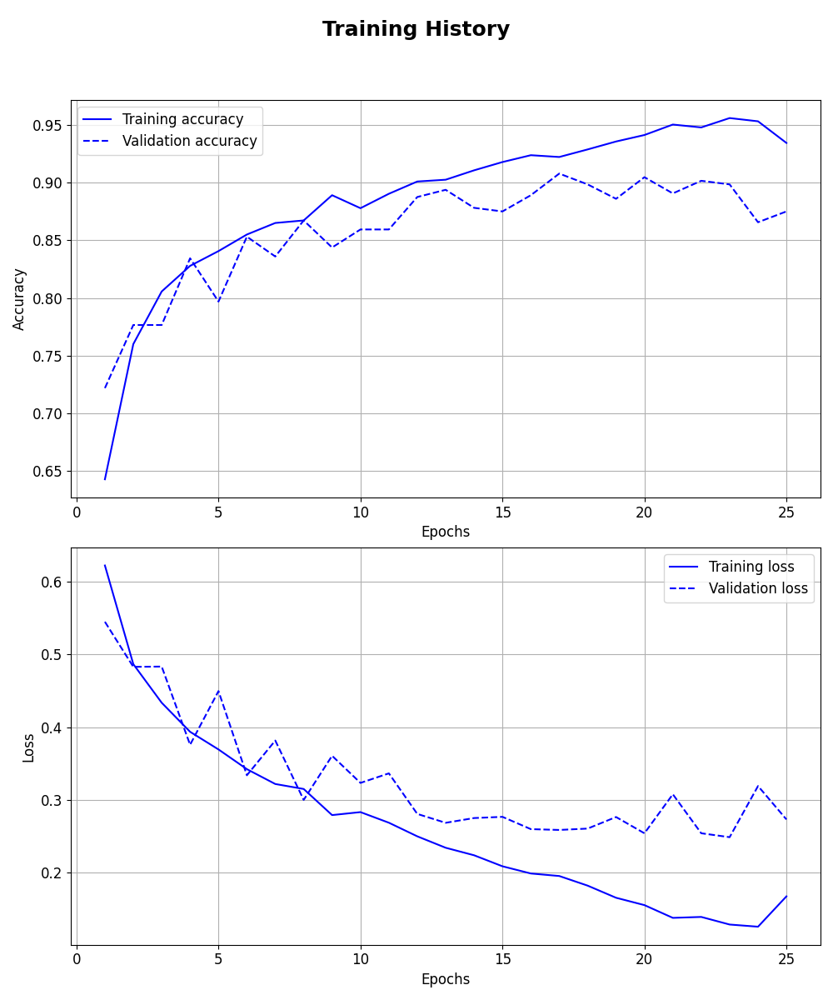

### Detailed Report of Test Set:

|              | precision    | recall       | f1-score     | support      |
| ------------ | ------------ | ------------ | ------------ | ------------ |
| chihuahua    | 0.9400       | 0.8532       | 0.8945       | 477          | 
| muffin       | 0.8478       | 0.9375       | 0.8904       | 416          | 
| micro avg    | 0.8925       | 0.8925       | 0.8925       | 893          | 
| macro avg    | 0.8939       | 0.8954       | 0.8925       | 893          | 
| weighted avg | 0.8970       | 0.8925       | 0.8926       | 893          | 
| samples avg  | 0.8925       | 0.8925       | 0.8925       | 893          | 

## trial_10

*    *Start Time*: 2024-10-20 11:42:54

*    *Duration*: 23.693

*    *Directory*: [Link](./trial_10)

### Hyperparameters:

| Hyperparameter        | Value                 |
| --------------------- | --------------------- |
| units1                | 64                    |
| kernel_size1          | 7                     |
| units2                | 64                    |
| kernel_size2          | 5                     |
| dense_units           | 512                   |
| dropout_rate          | 0.35801565254136836   |
| learning_rate         | 8.754031693730487e-05 |

### Evaluation Metrics:

|           | train     | val       | test      |
| --------- | --------- | --------- | --------- |
| accuracy  | 0.9766    | 0.8781    | 0.8914    | 
| precision | 0.9766    | 0.8781    | 0.8914    | 
| recall    | 0.9766    | 0.8781    | 0.8914    | 
| f1        | 0.9766    | 0.8781    | 0.8914    | 

### Figures:

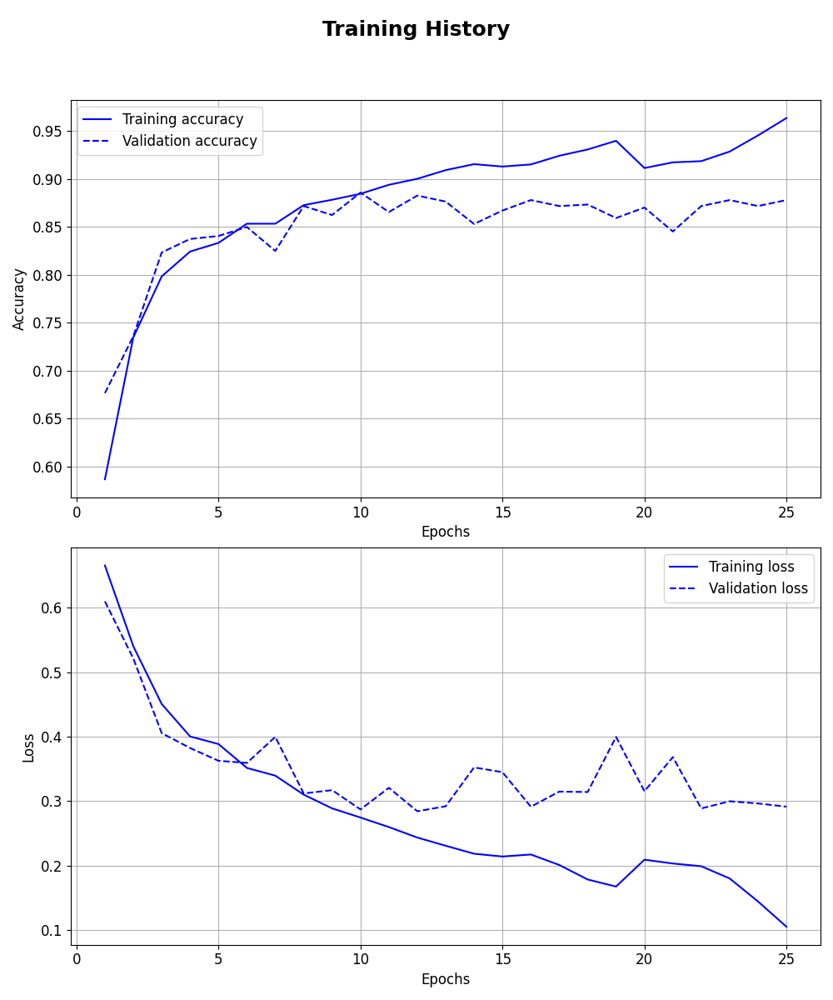

### Detailed Report of Test Set:

|              | precision    | recall       | f1-score     | support      |
| ------------ | ------------ | ------------ | ------------ | ------------ |
| chihuahua    | 0.8958       | 0.9015       | 0.8986       | 477          | 
| muffin       | 0.8862       | 0.8798       | 0.8830       | 416          | 
| micro avg    | 0.8914       | 0.8914       | 0.8914       | 893          | 
| macro avg    | 0.8910       | 0.8906       | 0.8908       | 893          | 
| weighted avg | 0.8913       | 0.8914       | 0.8914       | 893          | 
| samples avg  | 0.8914       | 0.8914       | 0.8914       | 893          | 

## trial_38

*    *Start Time*: 2024-10-20 11:54:59

*    *Duration*: 32.824

*    *Directory*: [Link](./trial_38)

### Hyperparameters:

| Hyperparameter        | Value                 |
| --------------------- | --------------------- |
| units1                | 128                   |
| kernel_size1          | 3                     |
| units2                | 64                    |
| kernel_size2          | 7                     |
| dense_units           | 128                   |
| dropout_rate          | 0.05171153810724736   |
| learning_rate         | 6.930027895613654e-05 |

### Evaluation Metrics:

|           | train     | val       | test      |
| --------- | --------- | --------- | --------- |
| accuracy  | 0.9281    | 0.8938    | 0.8914    | 
| precision | 0.9281    | 0.8938    | 0.8914    | 
| recall    | 0.9281    | 0.8938    | 0.8914    | 
| f1        | 0.9281    | 0.8937    | 0.8914    | 

### Figures:

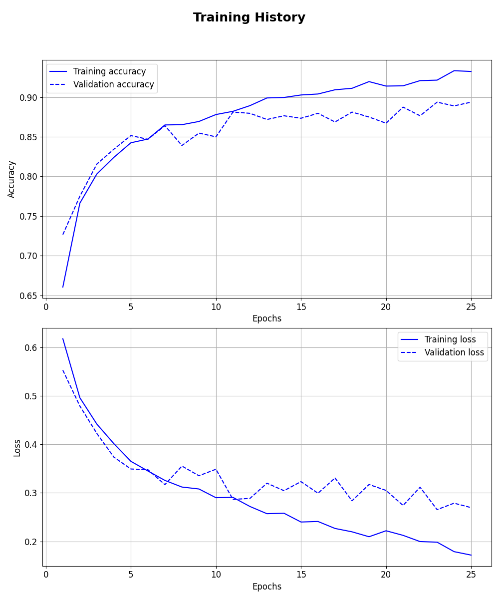

### Detailed Report of Test Set:

|              | precision    | recall       | f1-score     | support      |
| ------------ | ------------ | ------------ | ------------ | ------------ |
| chihuahua    | 0.9204       | 0.8721       | 0.8956       | 477          | 
| muffin       | 0.8617       | 0.9135       | 0.8868       | 416          | 
| micro avg    | 0.8914       | 0.8914       | 0.8914       | 893          | 
| macro avg    | 0.8910       | 0.8928       | 0.8912       | 893          | 
| weighted avg | 0.8930       | 0.8914       | 0.8915       | 893          | 
| samples avg  | 0.8914       | 0.8914       | 0.8914       | 893          | 

## trial_59

*    *Start Time*: 2024-10-20 12:06:51

*    *Duration*: 33.295

*    *Directory*: [Link](./trial_59)

### Hyperparameters:

| Hyperparameter        | Value                 |
| --------------------- | --------------------- |
| units1                | 128                   |
| kernel_size1          | 3                     |
| units2                | 64                    |
| kernel_size2          | 7                     |
| dense_units           | 256                   |
| dropout_rate          | 0.23734973624048822   |
| learning_rate         | 3.363843720343416e-05 |

### Evaluation Metrics:

|           | train     | val       | test      |
| --------- | --------- | --------- | --------- |
| accuracy  | 0.9169    | 0.9016    | 0.8914    | 
| precision | 0.9169    | 0.9016    | 0.8914    | 
| recall    | 0.9169    | 0.9016    | 0.8914    | 
| f1        | 0.9169    | 0.9016    | 0.8914    | 

### Figures:

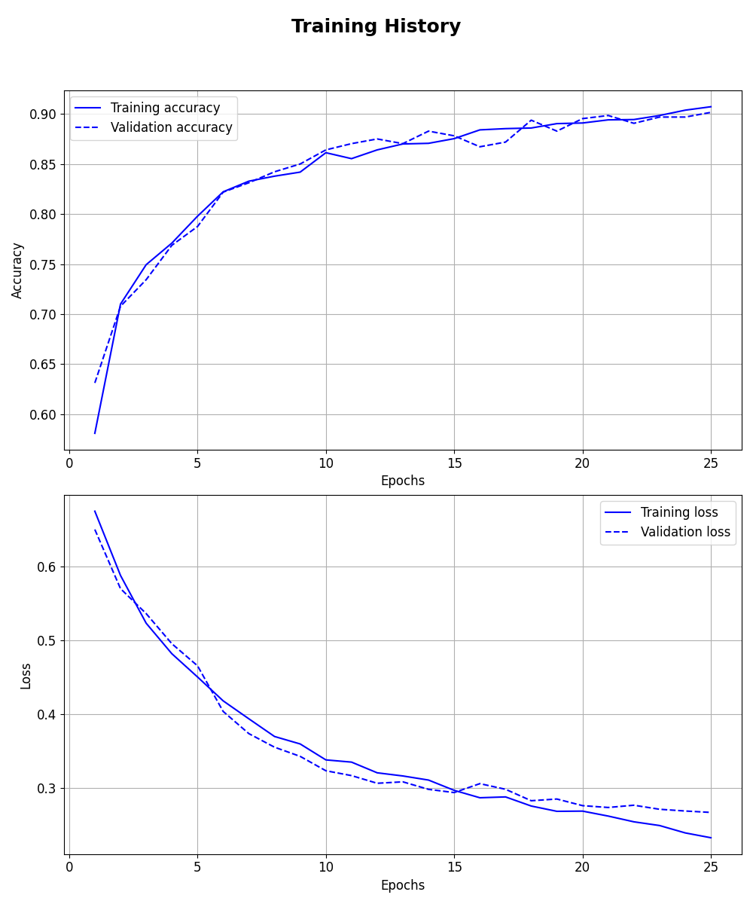

### Detailed Report of Test Set:

|              | precision    | recall       | f1-score     | support      |
| ------------ | ------------ | ------------ | ------------ | ------------ |
| chihuahua    | 0.8992       | 0.8973       | 0.8982       | 477          | 
| muffin       | 0.8825       | 0.8846       | 0.8836       | 416          | 
| micro avg    | 0.8914       | 0.8914       | 0.8914       | 893          | 
| macro avg    | 0.8908       | 0.8909       | 0.8909       | 893          | 
| weighted avg | 0.8914       | 0.8914       | 0.8914       | 893          | 
| samples avg  | 0.8914       | 0.8914       | 0.8914       | 893          | 

## trial_67

*    *Start Time*: 2024-10-20 12:11:04

*    *Duration*: 33.216

*    *Directory*: [Link](./trial_67)

### Hyperparameters:

| Hyperparameter        | Value                 |
| --------------------- | --------------------- |
| units1                | 128                   |
| kernel_size1          | 3                     |
| units2                | 64                    |
| kernel_size2          | 7                     |
| dense_units           | 256                   |
| dropout_rate          | 0.22399197319489095   |
| learning_rate         | 6.077797947394223e-05 |

### Evaluation Metrics:

|           | train     | val       | test      |
| --------- | --------- | --------- | --------- |
| accuracy  | 0.9222    | 0.8922    | 0.8914    | 
| precision | 0.9222    | 0.8922    | 0.8914    | 
| recall    | 0.9222    | 0.8922    | 0.8914    | 
| f1        | 0.9222    | 0.8922    | 0.8914    | 

### Figures:

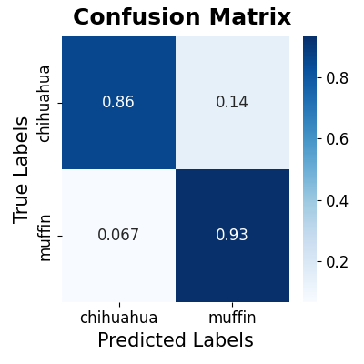

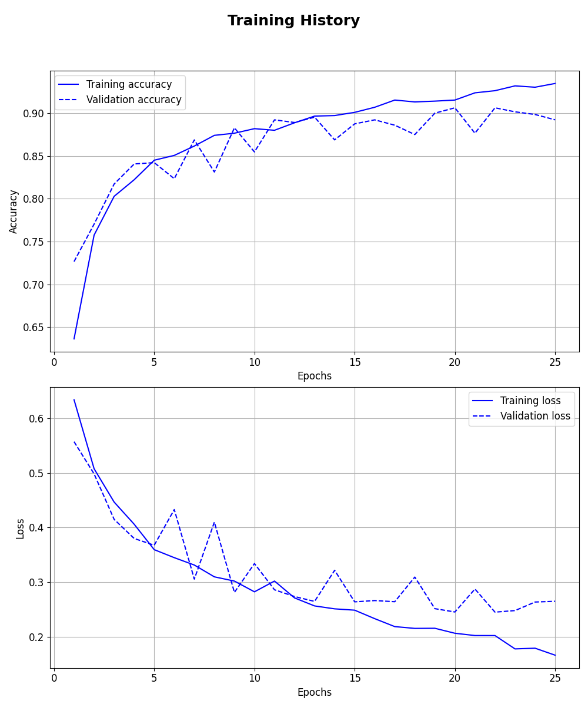

### Detailed Report of Test Set:

|              | precision    | recall       | f1-score     | support      |
| ------------ | ------------ | ------------ | ------------ | ------------ |
| chihuahua    | 0.9358       | 0.8553       | 0.8938       | 477          | 
| muffin       | 0.8490       | 0.9327       | 0.8889       | 416          | 
| micro avg    | 0.8914       | 0.8914       | 0.8914       | 893          | 
| macro avg    | 0.8924       | 0.8940       | 0.8913       | 893          | 
| weighted avg | 0.8954       | 0.8914       | 0.8915       | 893          | 
| samples avg  | 0.8914       | 0.8914       | 0.8914       | 893          | 

## trial_85

*    *Start Time*: 2024-10-20 12:20:32

*    *Duration*: 25.213

*    *Directory*: [Link](./trial_85)

### Hyperparameters:

| Hyperparameter        | Value                 |
| --------------------- | --------------------- |
| units1                | 128                   |
| kernel_size1          | 3                     |
| units2                | 64                    |
| kernel_size2          | 3                     |
| dense_units           | 256                   |
| dropout_rate          | 0.26506799371902673   |
| learning_rate         | 0.0003638055946523595 |

### Evaluation Metrics:

|           | train     | val       | test      |
| --------- | --------- | --------- | --------- |
| accuracy  | 0.9978    | 0.8938    | 0.8914    | 
| precision | 0.9978    | 0.8938    | 0.8914    | 
| recall    | 0.9978    | 0.8938    | 0.8914    | 
| f1        | 0.9978    | 0.8937    | 0.8914    | 

### Figures:

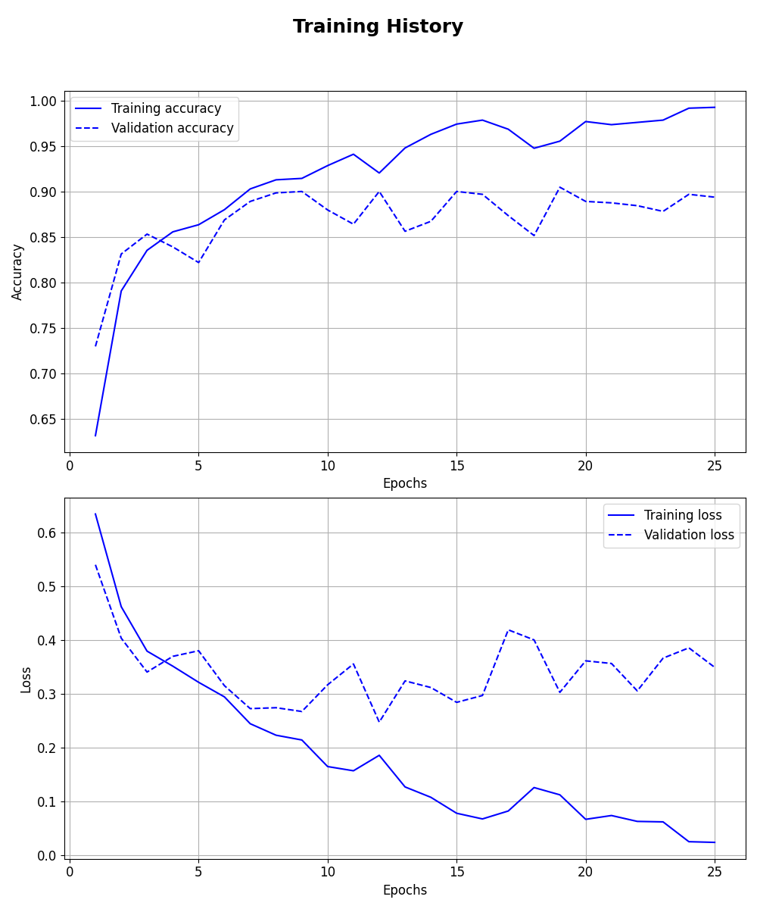

### Detailed Report of Test Set:

|              | precision    | recall       | f1-score     | support      |
| ------------ | ------------ | ------------ | ------------ | ------------ |
| chihuahua    | 0.8800       | 0.9224       | 0.9007       | 477          | 
| muffin       | 0.9059       | 0.8558       | 0.8801       | 416          | 
| micro avg    | 0.8914       | 0.8914       | 0.8914       | 893          | 
| macro avg    | 0.8929       | 0.8891       | 0.8904       | 893          | 
| weighted avg | 0.8920       | 0.8914       | 0.8911       | 893          | 
| samples avg  | 0.8914       | 0.8914       | 0.8914       | 893          | 

## trial_88

*    *Start Time*: 2024-10-20 12:22:05

*    *Duration*: 32.889

*    *Directory*: [Link](./trial_88)

### Hyperparameters:

| Hyperparameter        | Value                 |
| --------------------- | --------------------- |
| units1                | 128                   |
| kernel_size1          | 3                     |
| units2                | 64                    |
| kernel_size2          | 7                     |
| dense_units           | 128                   |
| dropout_rate          | 0.23850497362866155   |
| learning_rate         | 4.658600117151529e-05 |

### Evaluation Metrics:

|           | train     | val       | test      |
| --------- | --------- | --------- | --------- |
| accuracy  | 0.9287    | 0.9016    | 0.8914    | 
| precision | 0.9287    | 0.9016    | 0.8914    | 
| recall    | 0.9287    | 0.9016    | 0.8914    | 
| f1        | 0.9287    | 0.9016    | 0.8914    | 

### Figures:

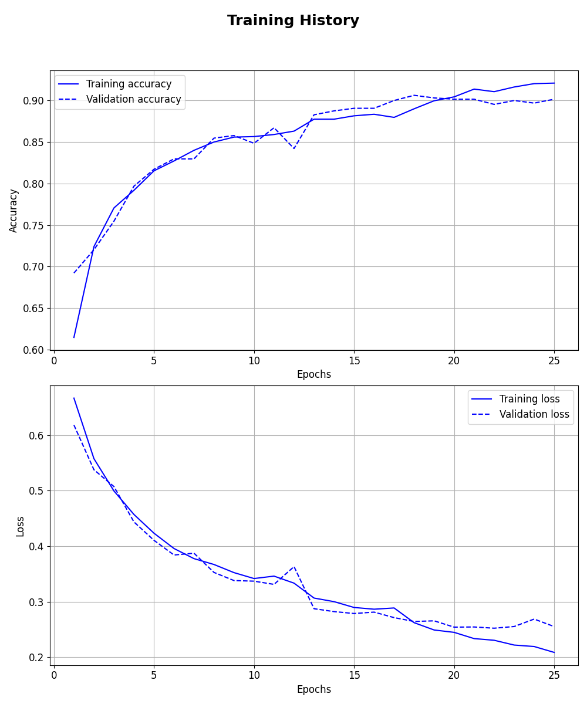

### Detailed Report of Test Set:

|              | precision    | recall       | f1-score     | support      |
| ------------ | ------------ | ------------ | ------------ | ------------ |
| chihuahua    | 0.8800       | 0.9224       | 0.9007       | 477          | 
| muffin       | 0.9059       | 0.8558       | 0.8801       | 416          | 
| micro avg    | 0.8914       | 0.8914       | 0.8914       | 893          | 
| macro avg    | 0.8929       | 0.8891       | 0.8904       | 893          | 
| weighted avg | 0.8920       | 0.8914       | 0.8911       | 893          | 
| samples avg  | 0.8914       | 0.8914       | 0.8914       | 893          | 

## trial_97

*    *Start Time*: 2024-10-20 12:27:00

*    *Duration*: 32.958

*    *Directory*: [Link](./trial_97)

### Hyperparameters:

| Hyperparameter        | Value                 |
| --------------------- | --------------------- |
| units1                | 128                   |
| kernel_size1          | 3                     |
| units2                | 64                    |
| kernel_size2          | 7                     |
| dense_units           | 128                   |
| dropout_rate          | 0.28021837387631926   |
| learning_rate         | 3.076777375370746e-05 |

### Evaluation Metrics:

|           | train     | val       | test      |
| --------- | --------- | --------- | --------- |
| accuracy  | 0.8978    | 0.8906    | 0.8914    | 
| precision | 0.8978    | 0.8906    | 0.8914    | 
| recall    | 0.8978    | 0.8906    | 0.8914    | 
| f1        | 0.8978    | 0.8906    | 0.8914    | 

### Figures:

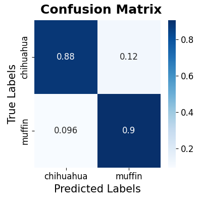

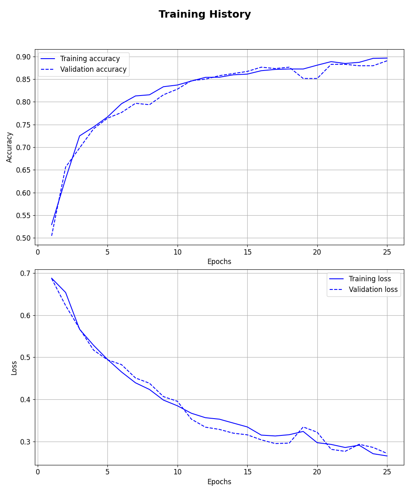

### Detailed Report of Test Set:

|              | precision    | recall       | f1-score     | support      |
| ------------ | ------------ | ------------ | ------------ | ------------ |
| chihuahua    | 0.9130       | 0.8805       | 0.8965       | 477          | 
| muffin       | 0.8684       | 0.9038       | 0.8857       | 416          | 
| micro avg    | 0.8914       | 0.8914       | 0.8914       | 893          | 
| macro avg    | 0.8907       | 0.8922       | 0.8911       | 893          | 
| weighted avg | 0.8922       | 0.8914       | 0.8915       | 893          | 
| samples avg  | 0.8914       | 0.8914       | 0.8914       | 893          | 

## trial_73

*    *Start Time*: 2024-10-20 12:14:01

*    *Duration*: 22.110

*    *Directory*: [Link](./trial_73)

### Hyperparameters:

| Hyperparameter       | Value                |
| -------------------- | -------------------- |
| units1               | 64                   |
| kernel_size1         | 3                    |
| units2               | 64                   |
| kernel_size2         | 7                    |
| dense_units          | 128                  |
| dropout_rate         | 0.15064163870305483  |
| learning_rate        | 0.000100232377282223 |

### Evaluation Metrics:

|           | train     | val       | test      |
| --------- | --------- | --------- | --------- |
| accuracy  | 0.9613    | 0.8828    | 0.8903    | 
| precision | 0.9613    | 0.8828    | 0.8903    | 
| recall    | 0.9613    | 0.8828    | 0.8903    | 
| f1        | 0.9612    | 0.8828    | 0.8903    | 

### Figures:

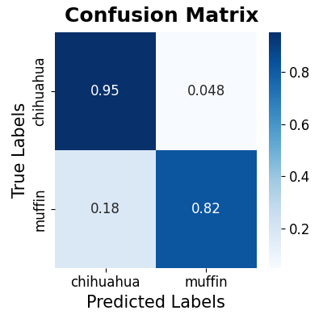

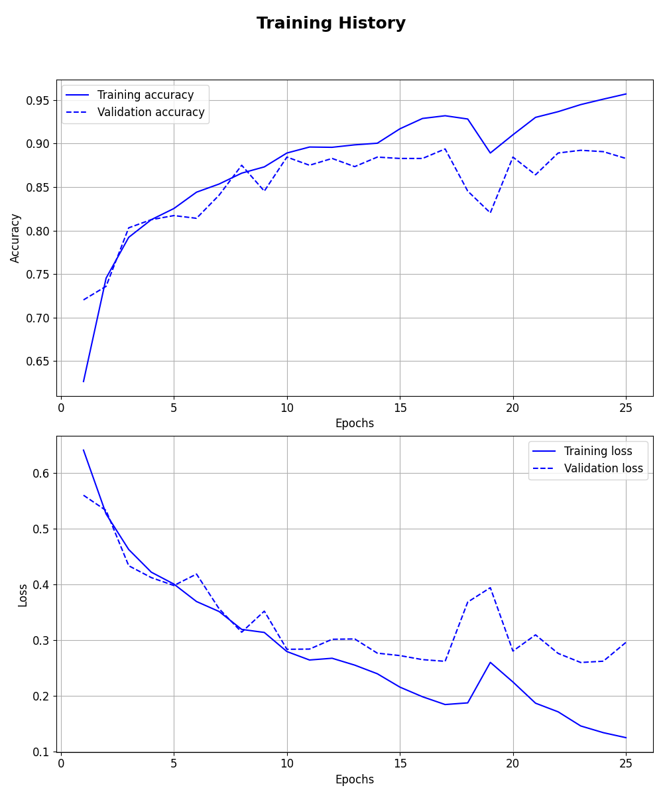

### Detailed Report of Test Set:

|              | precision    | recall       | f1-score     | support      |
| ------------ | ------------ | ------------ | ------------ | ------------ |
| chihuahua    | 0.8582       | 0.9518       | 0.9026       | 477          | 
| muffin       | 0.9368       | 0.8197       | 0.8744       | 416          | 
| micro avg    | 0.8903       | 0.8903       | 0.8903       | 893          | 
| macro avg    | 0.8975       | 0.8857       | 0.8885       | 893          | 
| weighted avg | 0.8948       | 0.8903       | 0.8894       | 893          | 
| samples avg  | 0.8903       | 0.8903       | 0.8903       | 893          | 

## trial_74

*    *Start Time*: 2024-10-20 12:14:24

*    *Duration*: 22.082

*    *Directory*: [Link](./trial_74)

### Hyperparameters:

| Hyperparameter        | Value                 |
| --------------------- | --------------------- |
| units1                | 64                    |
| kernel_size1          | 3                     |
| units2                | 64                    |
| kernel_size2          | 7                     |
| dense_units           | 128                   |
| dropout_rate          | 0.11706417024548972   |
| learning_rate         | 5.477134743619495e-05 |

### Evaluation Metrics:

|           | train     | val       | test      |
| --------- | --------- | --------- | --------- |
| accuracy  | 0.9287    | 0.8906    | 0.8903    | 
| precision | 0.9287    | 0.8906    | 0.8903    | 
| recall    | 0.9287    | 0.8906    | 0.8903    | 
| f1        | 0.9287    | 0.8906    | 0.8903    | 

### Figures:

### Detailed Report of Test Set:

|              | precision    | recall       | f1-score     | support      |
| ------------ | ------------ | ------------ | ------------ | ------------ |
| chihuahua    | 0.8610       | 0.9476       | 0.9022       | 477          | 
| muffin       | 0.9321       | 0.8245       | 0.8750       | 416          | 
| micro avg    | 0.8903       | 0.8903       | 0.8903       | 893          | 
| macro avg    | 0.8965       | 0.8861       | 0.8886       | 893          | 
| weighted avg | 0.8941       | 0.8903       | 0.8895       | 893          | 
| samples avg  | 0.8903       | 0.8903       | 0.8903       | 893          | 

## trial_99

*    *Start Time*: 2024-10-20 12:28:03

*    *Duration*: 32.889

*    *Directory*: [Link](./trial_99)

### Hyperparameters:

| Hyperparameter        | Value                 |
| --------------------- | --------------------- |
| units1                | 128                   |
| kernel_size1          | 3                     |
| units2                | 64                    |
| kernel_size2          | 7                     |
| dense_units           | 128                   |
| dropout_rate          | 0.24789844907416078   |
| learning_rate         | 4.492337467390401e-05 |

### Evaluation Metrics:

|           | train     | val       | test      |
| --------- | --------- | --------- | --------- |
| accuracy  | 0.9162    | 0.8875    | 0.8903    | 
| precision | 0.9162    | 0.8875    | 0.8903    | 
| recall    | 0.9162    | 0.8875    | 0.8903    | 
| f1        | 0.9162    | 0.8875    | 0.8903    | 

### Figures:

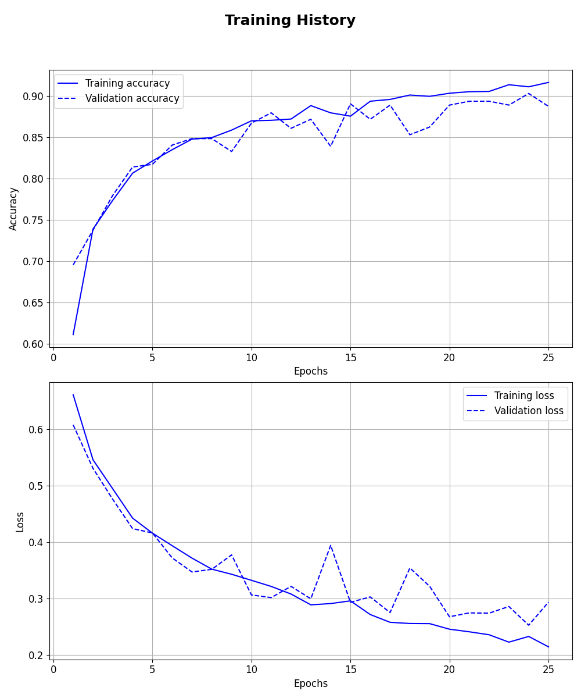

### Detailed Report of Test Set:

|              | precision    | recall       | f1-score     | support      |
| ------------ | ------------ | ------------ | ------------ | ------------ |
| chihuahua    | 0.8503       | 0.9644       | 0.9037       | 477          | 
| muffin       | 0.9517       | 0.8053       | 0.8724       | 416          | 
| micro avg    | 0.8903       | 0.8903       | 0.8903       | 893          | 
| macro avg    | 0.9010       | 0.8848       | 0.8881       | 893          | 
| weighted avg | 0.8975       | 0.8903       | 0.8891       | 893          | 
| samples avg  | 0.8903       | 0.8903       | 0.8903       | 893          | 

## trial_80

*    *Start Time*: 2024-10-20 12:17:30

*    *Duration*: 33.843

*    *Directory*: [Link](./trial_80)

### Hyperparameters:

| Hyperparameter         | Value                  |
| ---------------------- | ---------------------- |
| units1                 | 128                    |
| kernel_size1           | 5                      |
| units2                 | 64                     |
| kernel_size2           | 7                      |
| dense_units            | 256                    |
| dropout_rate           | 0.1720125978938315     |
| learning_rate          | 0.00014725953698654093 |

### Evaluation Metrics:

|           | train     | val       | test      |
| --------- | --------- | --------- | --------- |
| accuracy  | 0.9797    | 0.8922    | 0.8891    | 
| precision | 0.9797    | 0.8922    | 0.8891    | 
| recall    | 0.9797    | 0.8922    | 0.8891    | 
| f1        | 0.9797    | 0.8922    | 0.8891    | 

### Figures:

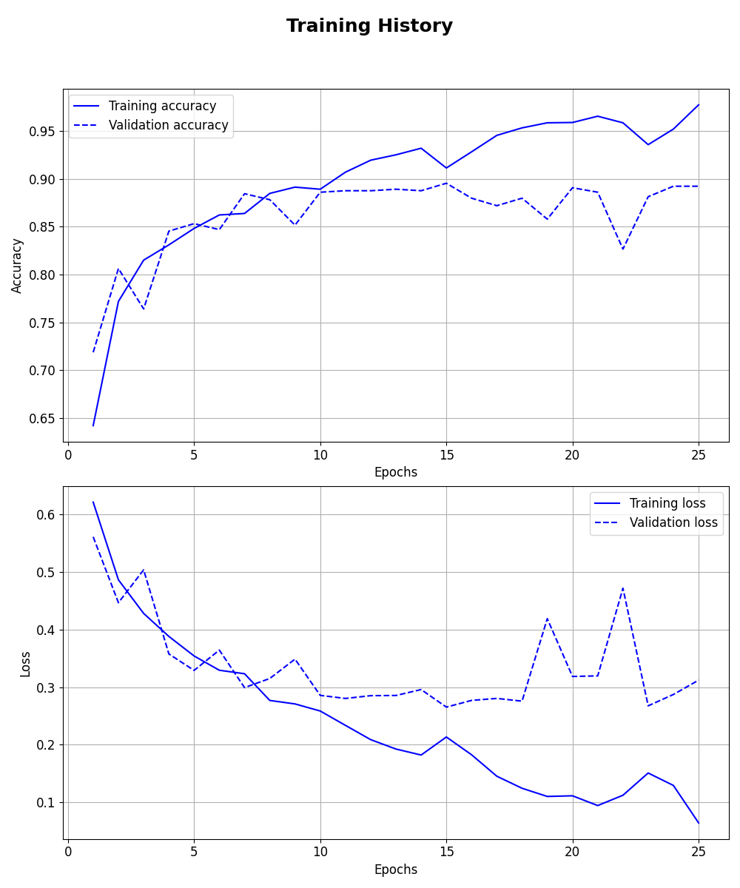

### Detailed Report of Test Set:

|              | precision    | recall       | f1-score     | support      |
| ------------ | ------------ | ------------ | ------------ | ------------ |
| chihuahua    | 0.9109       | 0.8784       | 0.8943       | 477          | 
| muffin       | 0.8661       | 0.9014       | 0.8834       | 416          | 
| micro avg    | 0.8891       | 0.8891       | 0.8891       | 893          | 
| macro avg    | 0.8885       | 0.8899       | 0.8889       | 893          | 
| weighted avg | 0.8900       | 0.8891       | 0.8892       | 893          | 
| samples avg  | 0.8891       | 0.8891       | 0.8891       | 893          | 

## trial_87

*    *Start Time*: 2024-10-20 12:21:30

*    *Duration*: 33.247

*    *Directory*: [Link](./trial_87)

### Hyperparameters:

| Hyperparameter         | Value                  |
| ---------------------- | ---------------------- |
| units1                 | 128                    |
| kernel_size1           | 3                      |
| units2                 | 64                     |
| kernel_size2           | 7                      |
| dense_units            | 512                    |
| dropout_rate           | 0.13316909522628706    |
| learning_rate          | 0.00019327426145732113 |

### Evaluation Metrics:

|           | train     | val       | test      |
| --------- | --------- | --------- | --------- |
| accuracy  | 0.9531    | 0.8734    | 0.8891    | 
| precision | 0.9531    | 0.8734    | 0.8891    | 
| recall    | 0.9531    | 0.8734    | 0.8891    | 
| f1        | 0.9531    | 0.8734    | 0.8891    | 

### Figures:

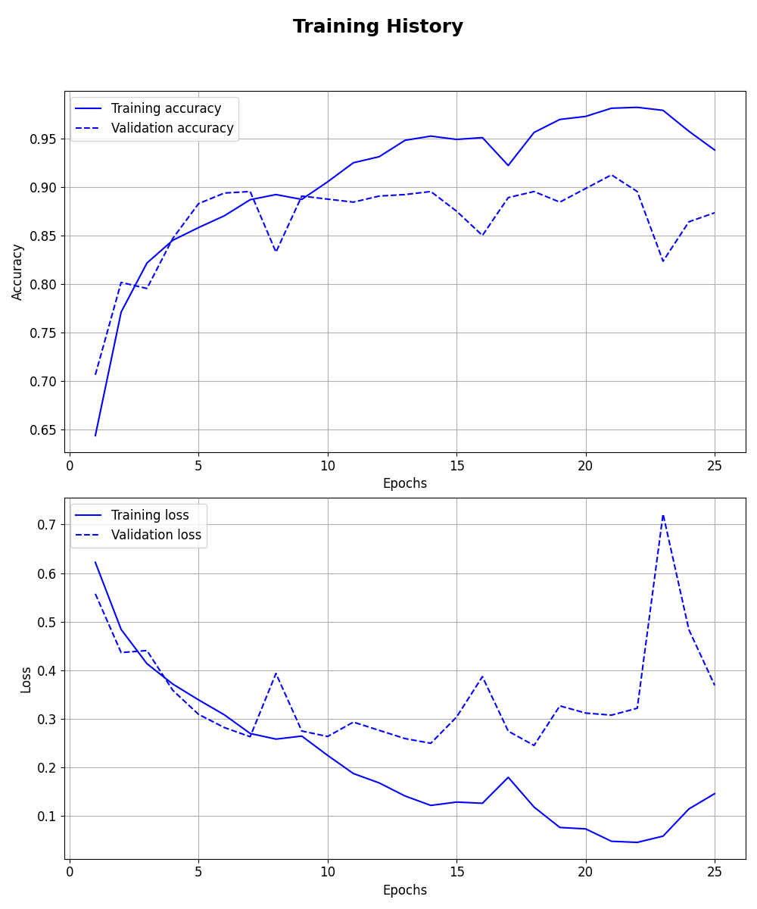

### Detailed Report of Test Set:

|              | precision    | recall       | f1-score     | support      |
| ------------ | ------------ | ------------ | ------------ | ------------ |
| chihuahua    | 0.9479       | 0.8386       | 0.8899       | 477          | 
| muffin       | 0.8365       | 0.9471       | 0.8884       | 416          | 
| micro avg    | 0.8891       | 0.8891       | 0.8891       | 893          | 
| macro avg    | 0.8922       | 0.8928       | 0.8891       | 893          | 
| weighted avg | 0.8960       | 0.8891       | 0.8892       | 893          | 
| samples avg  | 0.8891       | 0.8891       | 0.8891       | 893          | 

## trial_24

*    *Start Time*: 2024-10-20 11:48:20

*    *Duration*: 25.119

*    *Directory*: [Link](./trial_24)

### Hyperparameters:

| Hyperparameter        | Value                 |
| --------------------- | --------------------- |
| units1                | 128                   |
| kernel_size1          | 3                     |
| units2                | 64                    |
| kernel_size2          | 3                     |
| dense_units           | 256                   |
| dropout_rate          | 0.07928769039582001   |
| learning_rate         | 4.088736404840006e-05 |

### Evaluation Metrics:

|           | train     | val       | test      |
| --------- | --------- | --------- | --------- |
| accuracy  | 0.9316    | 0.8984    | 0.8880    | 
| precision | 0.9316    | 0.8984    | 0.8880    | 
| recall    | 0.9316    | 0.8984    | 0.8880    | 
| f1        | 0.9316    | 0.8984    | 0.8880    | 

### Figures:

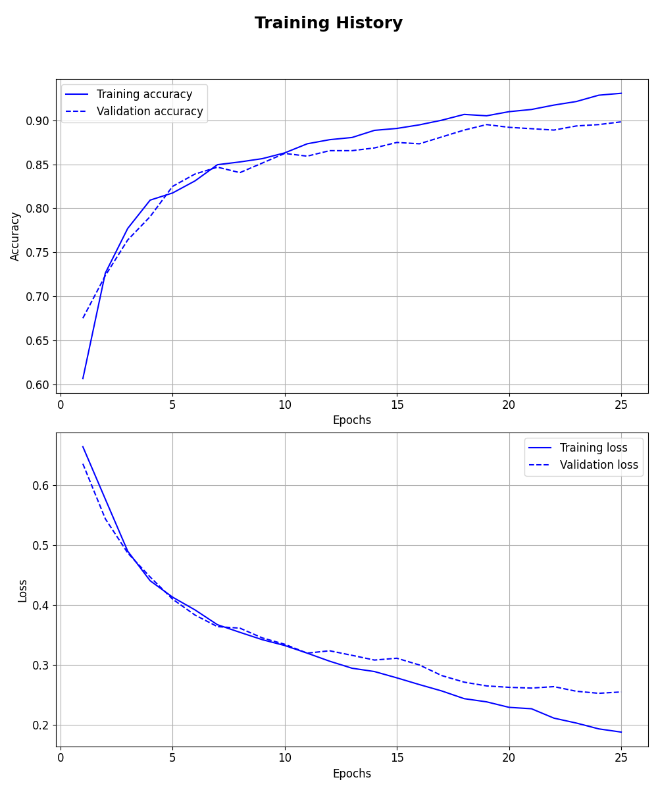

### Detailed Report of Test Set:

|              | precision    | recall       | f1-score     | support      |
| ------------ | ------------ | ------------ | ------------ | ------------ |
| chihuahua    | 0.9071       | 0.8805       | 0.8936       | 477          | 
| muffin       | 0.8674       | 0.8966       | 0.8818       | 416          | 
| micro avg    | 0.8880       | 0.8880       | 0.8880       | 893          | 
| macro avg    | 0.8873       | 0.8886       | 0.8877       | 893          | 
| weighted avg | 0.8886       | 0.8880       | 0.8881       | 893          | 
| samples avg  | 0.8880       | 0.8880       | 0.8880       | 893          | 

## trial_27

*    *Start Time*: 2024-10-20 11:49:38

*    *Duration*: 21.172

*    *Directory*: [Link](./trial_27)

### Hyperparameters:

| Hyperparameter        | Value                 |
| --------------------- | --------------------- |
| units1                | 64                    |
| kernel_size1          | 5                     |
| units2                | 64                    |
| kernel_size2          | 5                     |
| dense_units           | 256                   |
| dropout_rate          | 0.1693889449514277    |
| learning_rate         | 4.069924895131436e-05 |

### Evaluation Metrics:

|           | train     | val       | test      |
| --------- | --------- | --------- | --------- |
| accuracy  | 0.9259    | 0.8797    | 0.8880    | 
| precision | 0.9259    | 0.8797    | 0.8880    | 
| recall    | 0.9259    | 0.8797    | 0.8880    | 
| f1        | 0.9259    | 0.8797    | 0.8880    | 

### Figures:

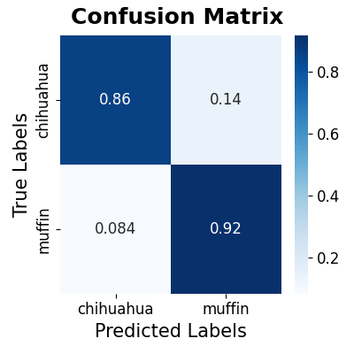

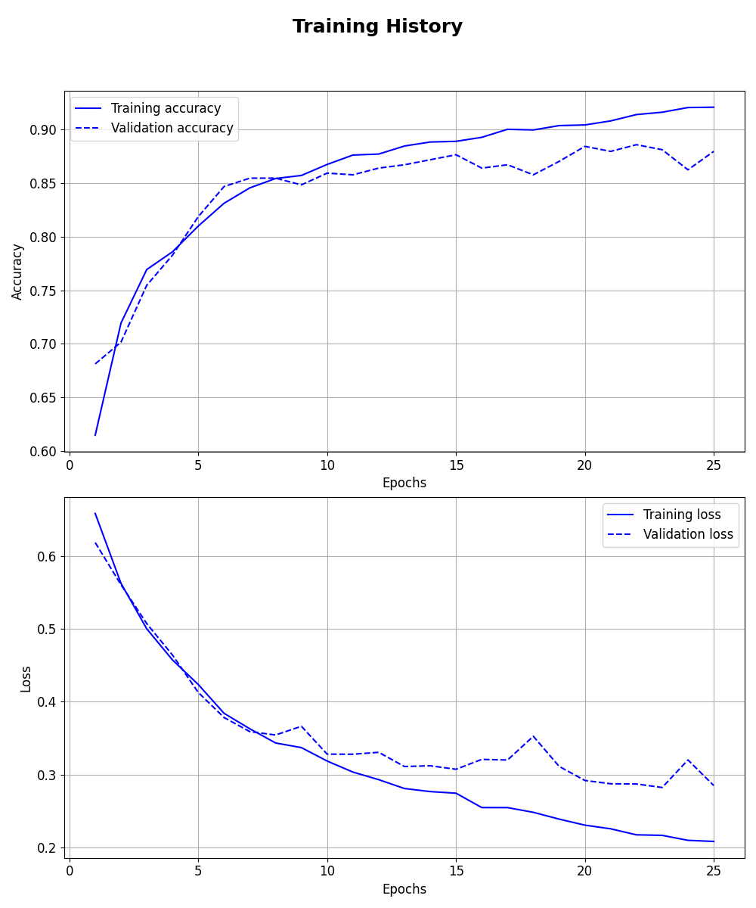

### Detailed Report of Test Set:

|              | precision    | recall       | f1-score     | support      |
| ------------ | ------------ | ------------ | ------------ | ------------ |
| chihuahua    | 0.9217       | 0.8637       | 0.8918       | 477          | 
| muffin       | 0.8543       | 0.9159       | 0.8840       | 416          | 
| micro avg    | 0.8880       | 0.8880       | 0.8880       | 893          | 
| macro avg    | 0.8880       | 0.8898       | 0.8879       | 893          | 
| weighted avg | 0.8903       | 0.8880       | 0.8881       | 893          | 
| samples avg  | 0.8880       | 0.8880       | 0.8880       | 893          | 

## trial_68

*    *Start Time*: 2024-10-20 12:11:38

*    *Duration*: 29.435

*    *Directory*: [Link](./trial_68)

### Hyperparameters:

| Hyperparameter        | Value                 |
| --------------------- | --------------------- |
| units1                | 128                   |
| kernel_size1          | 3                     |
| units2                | 64                    |
| kernel_size2          | 5                     |
| dense_units           | 128                   |
| dropout_rate          | 0.13109653104502805   |
| learning_rate         | 8.754733467486343e-05 |

### Evaluation Metrics:

|           | train     | val       | test      |
| --------- | --------- | --------- | --------- |
| accuracy  | 0.9103    | 0.8797    | 0.8880    | 
| precision | 0.9103    | 0.8797    | 0.8880    | 
| recall    | 0.9103    | 0.8797    | 0.8880    | 
| f1        | 0.9103    | 0.8797    | 0.8880    | 

### Figures:

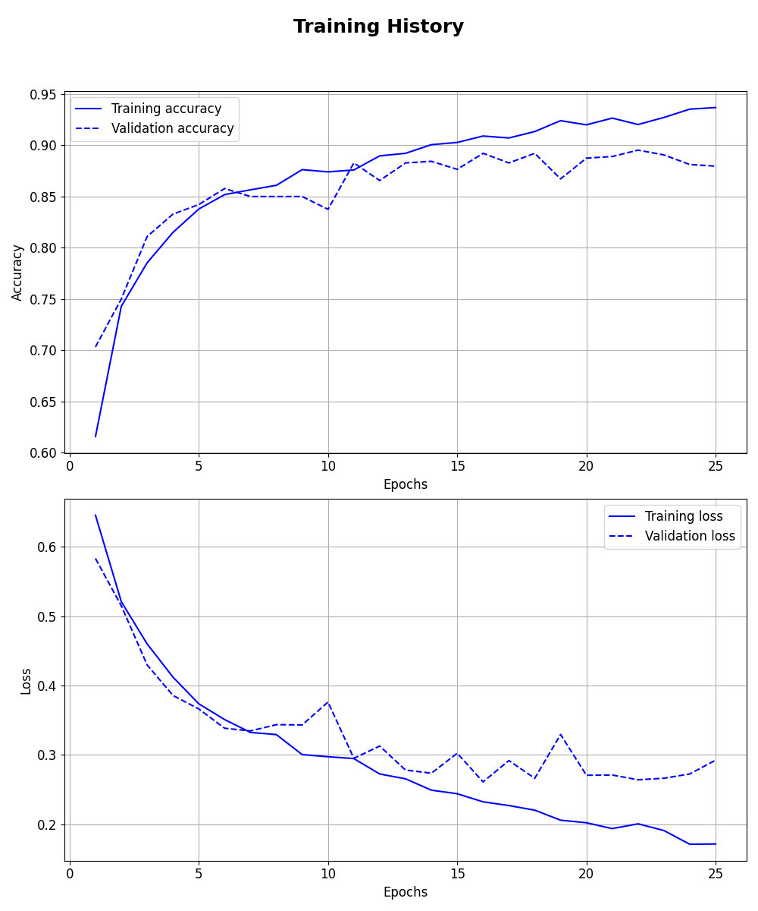

### Detailed Report of Test Set:

|              | precision    | recall       | f1-score     | support      |
| ------------ | ------------ | ------------ | ------------ | ------------ |
| chihuahua    | 0.9394       | 0.8449       | 0.8896       | 477          | 
| muffin       | 0.8405       | 0.9375       | 0.8864       | 416          | 
| micro avg    | 0.8880       | 0.8880       | 0.8880       | 893          | 
| macro avg    | 0.8900       | 0.8912       | 0.8880       | 893          | 
| weighted avg | 0.8933       | 0.8880       | 0.8881       | 893          | 
| samples avg  | 0.8880       | 0.8880       | 0.8880       | 893          | 

## trial_54

*    *Start Time*: 2024-10-20 12:03:59

*    *Duration*: 33.078

*    *Directory*: [Link](./trial_54)

### Hyperparameters:

| Hyperparameter         | Value                  |
| ---------------------- | ---------------------- |
| units1                 | 128                    |
| kernel_size1           | 3                      |
| units2                 | 64                     |
| kernel_size2           | 7                      |
| dense_units            | 256                    |
| dropout_rate           | 0.11888642101807746    |
| learning_rate          | 2.7378369699168327e-05 |

### Evaluation Metrics:

|           | train     | val       | test      |
| --------- | --------- | --------- | --------- |
| accuracy  | 0.9047    | 0.8922    | 0.8869    | 
| precision | 0.9047    | 0.8922    | 0.8869    | 
| recall    | 0.9047    | 0.8922    | 0.8869    | 
| f1        | 0.9047    | 0.8922    | 0.8869    | 

### Figures:

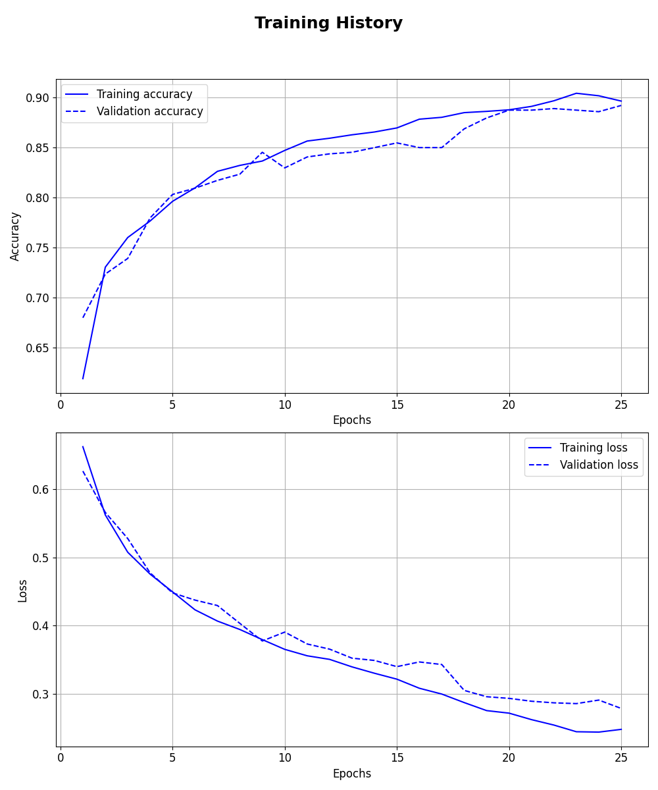

### Detailed Report of Test Set:

|              | precision    | recall       | f1-score     | support      |
| ------------ | ------------ | ------------ | ------------ | ------------ |
| chihuahua    | 0.9196       | 0.8637       | 0.8908       | 477          | 
| muffin       | 0.8539       | 0.9135       | 0.8827       | 416          | 
| micro avg    | 0.8869       | 0.8869       | 0.8869       | 893          | 
| macro avg    | 0.8868       | 0.8886       | 0.8868       | 893          | 
| weighted avg | 0.8890       | 0.8869       | 0.8870       | 893          | 
| samples avg  | 0.8869       | 0.8869       | 0.8869       | 893          | 

## trial_72

*    *Start Time*: 2024-10-20 12:13:37

*    *Duration*: 22.025

*    *Directory*: [Link](./trial_72)

### Hyperparameters:

| Hyperparameter        | Value                 |
| --------------------- | --------------------- |
| units1                | 64                    |
| kernel_size1          | 3                     |
| units2                | 64                    |
| kernel_size2          | 7                     |
| dense_units           | 128                   |
| dropout_rate          | 0.2099163270406869    |
| learning_rate         | 6.965882041809298e-05 |

### Evaluation Metrics:

|           | train     | val       | test      |
| --------- | --------- | --------- | --------- |
| accuracy  | 0.9200    | 0.8828    | 0.8869    | 
| precision | 0.9200    | 0.8828    | 0.8869    | 
| recall    | 0.9200    | 0.8828    | 0.8869    | 
| f1        | 0.9200    | 0.8828    | 0.8869    | 

### Figures:

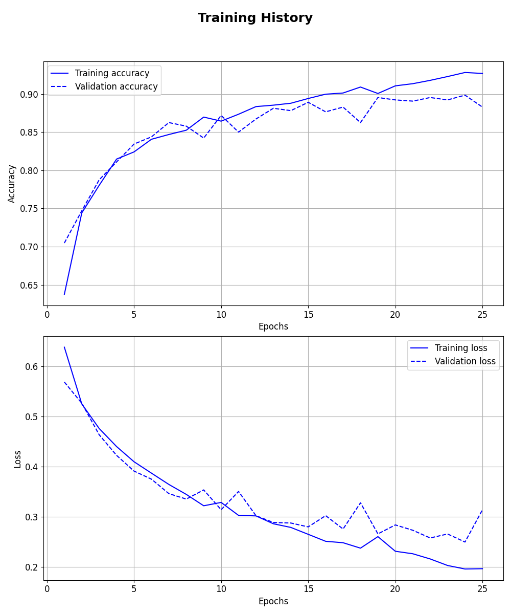

### Detailed Report of Test Set:

|              | precision    | recall       | f1-score     | support      |
| ------------ | ------------ | ------------ | ------------ | ------------ |
| chihuahua    | 0.8394       | 0.9748       | 0.9020       | 477          | 
| muffin       | 0.9646       | 0.7861       | 0.8662       | 416          | 
| micro avg    | 0.8869       | 0.8869       | 0.8869       | 893          | 
| macro avg    | 0.9020       | 0.8805       | 0.8841       | 893          | 
| weighted avg | 0.8977       | 0.8869       | 0.8854       | 893          | 
| samples avg  | 0.8869       | 0.8869       | 0.8869       | 893          | 

## trial_7

*    *Start Time*: 2024-10-20 11:41:23

*    *Duration*: 31.741

*    *Directory*: [Link](./trial_7)

### Hyperparameters:

| Hyperparameter       | Value                |
| -------------------- | -------------------- |
| units1               | 128                  |
| kernel_size1         | 7                    |
| units2               | 64                   |
| kernel_size2         | 5                    |
| dense_units          | 256                  |
| dropout_rate         | 0.2871041535175265   |
| learning_rate        | 0.000524904647657406 |

### Evaluation Metrics:

|           | train     | val       | test      |
| --------- | --------- | --------- | --------- |
| accuracy  | 0.9994    | 0.8609    | 0.8858    | 
| precision | 0.9994    | 0.8609    | 0.8858    | 
| recall    | 0.9994    | 0.8609    | 0.8858    | 
| f1        | 0.9994    | 0.8609    | 0.8858    | 

### Figures:

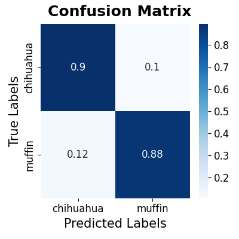

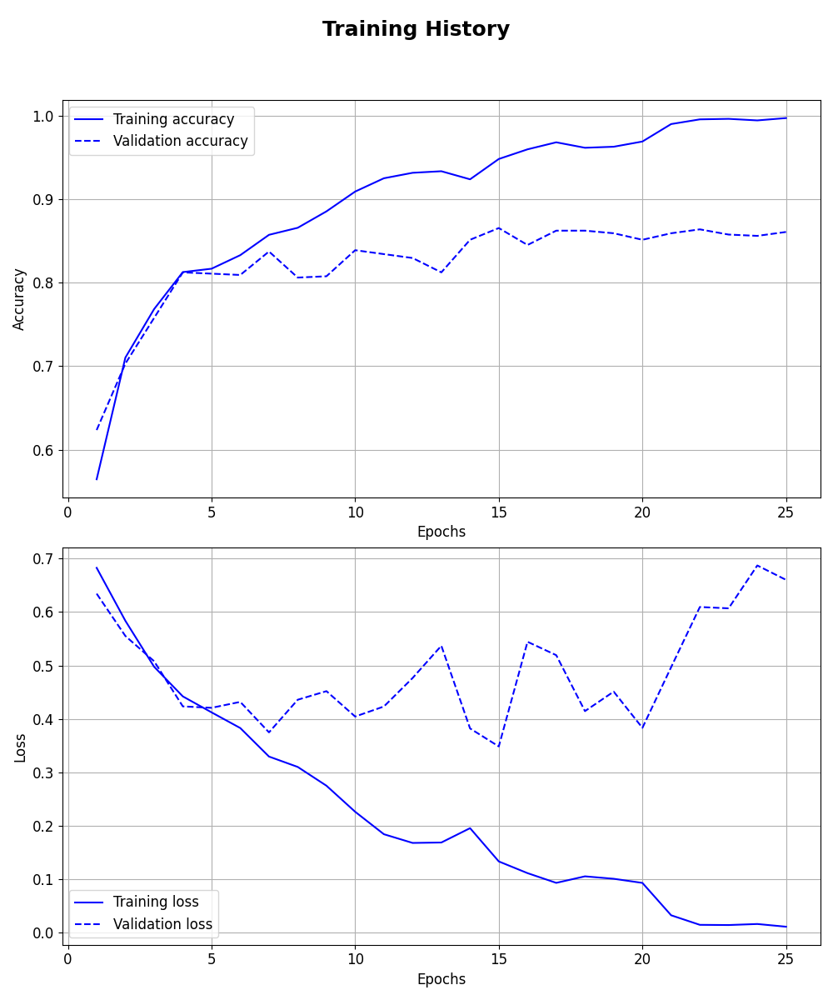

### Detailed Report of Test Set:

|              | precision    | recall       | f1-score     | support      |
| ------------ | ------------ | ------------ | ------------ | ------------ |
| chihuahua    | 0.8914       | 0.8952       | 0.8933       | 477          | 
| muffin       | 0.8792       | 0.8750       | 0.8771       | 416          | 
| micro avg    | 0.8858       | 0.8858       | 0.8858       | 893          | 
| macro avg    | 0.8853       | 0.8851       | 0.8852       | 893          | 
| weighted avg | 0.8858       | 0.8858       | 0.8858       | 893          | 
| samples avg  | 0.8858       | 0.8858       | 0.8858       | 893          | 

## trial_16

*    *Start Time*: 2024-10-20 11:45:05

*    *Duration*: 22.981

*    *Directory*: [Link](./trial_16)

### Hyperparameters:

| Hyperparameter         | Value                  |
| ---------------------- | ---------------------- |
| units1                 | 64                     |
| kernel_size1           | 5                      |
| units2                 | 64                     |
| kernel_size2           | 5                      |
| dense_units            | 512                    |
| dropout_rate           | 0.4354897051769737     |
| learning_rate          | 0.00036409835704126833 |

### Evaluation Metrics:

|           | train     | val       | test      |
| --------- | --------- | --------- | --------- |
| accuracy  | 0.9872    | 0.8703    | 0.8858    | 
| precision | 0.9872    | 0.8703    | 0.8858    | 
| recall    | 0.9872    | 0.8703    | 0.8858    | 
| f1        | 0.9872    | 0.8703    | 0.8858    | 

### Figures:

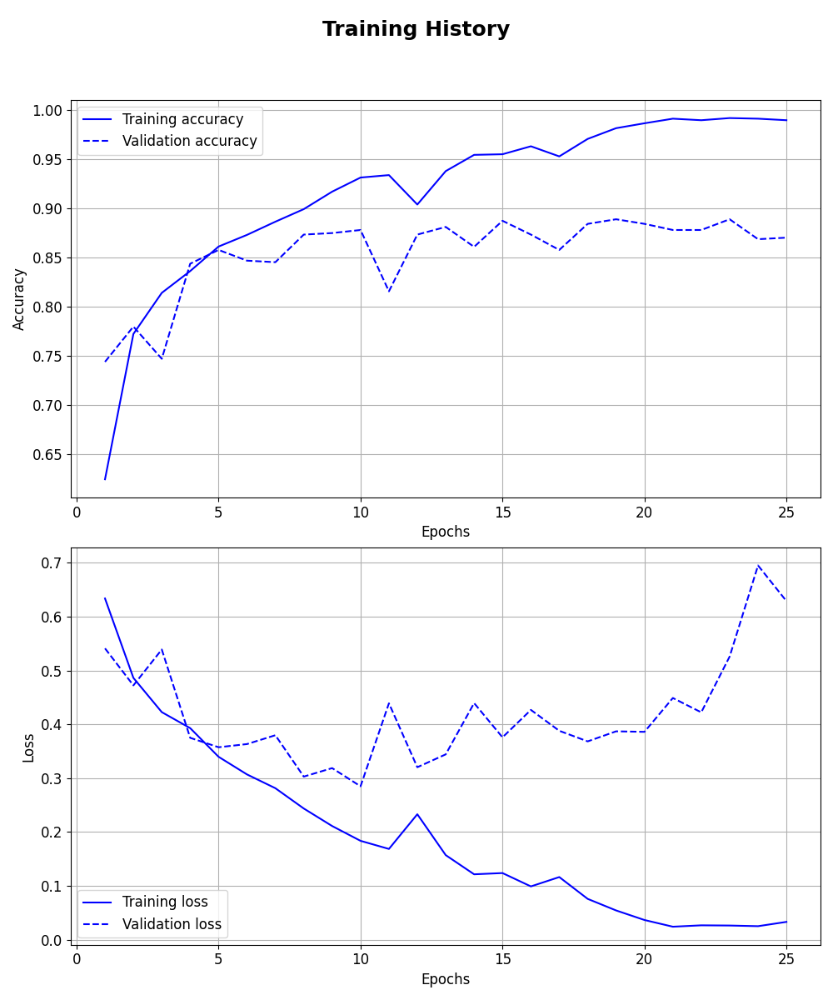

### Detailed Report of Test Set:

|              | precision    | recall       | f1-score     | support      |
| ------------ | ------------ | ------------ | ------------ | ------------ |
| chihuahua    | 0.8415       | 0.9686       | 0.9006       | 477          | 
| muffin       | 0.9564       | 0.7909       | 0.8658       | 416          | 
| micro avg    | 0.8858       | 0.8858       | 0.8858       | 893          | 
| macro avg    | 0.8990       | 0.8797       | 0.8832       | 893          | 
| weighted avg | 0.8950       | 0.8858       | 0.8844       | 893          | 
| samples avg  | 0.8858       | 0.8858       | 0.8858       | 893          | 

## trial_26

*    *Start Time*: 2024-10-20 11:49:11

*    *Duration*: 26.168

*    *Directory*: [Link](./trial_26)

### Hyperparameters:

| Hyperparameter        | Value                 |
| --------------------- | --------------------- |
| units1                | 128                   |
| kernel_size1          | 5                     |
| units2                | 64                    |
| kernel_size2          | 3                     |
| dense_units           | 128                   |
| dropout_rate          | 0.11776526252462811   |
| learning_rate         | 5.079774681443778e-05 |

### Evaluation Metrics:

|           | train     | val       | test      |
| --------- | --------- | --------- | --------- |
| accuracy  | 0.9356    | 0.8984    | 0.8858    | 
| precision | 0.9356    | 0.8984    | 0.8858    | 
| recall    | 0.9356    | 0.8984    | 0.8858    | 
| f1        | 0.9356    | 0.8984    | 0.8858    | 

### Figures:

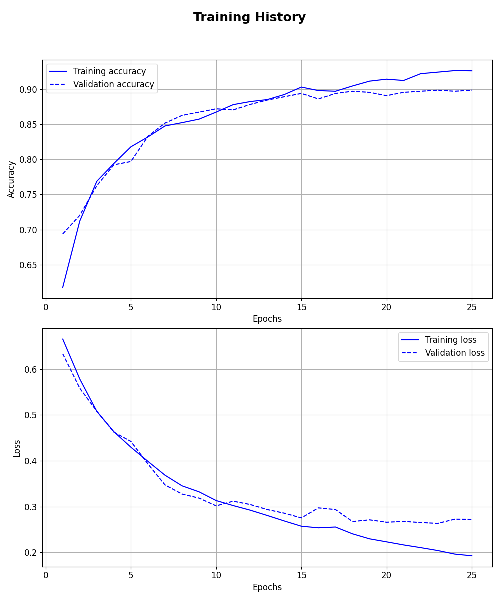

### Detailed Report of Test Set:

|              | precision    | recall       | f1-score     | support      |
| ------------ | ------------ | ------------ | ------------ | ------------ |
| chihuahua    | 0.8743       | 0.9182       | 0.8957       | 477          | 
| muffin       | 0.9005       | 0.8486       | 0.8738       | 416          | 
| micro avg    | 0.8858       | 0.8858       | 0.8858       | 893          | 
| macro avg    | 0.8874       | 0.8834       | 0.8847       | 893          | 
| weighted avg | 0.8865       | 0.8858       | 0.8855       | 893          | 
| samples avg  | 0.8858       | 0.8858       | 0.8858       | 893          | 

## trial_34

*    *Start Time*: 2024-10-20 11:52:49

*    *Duration*: 29.541

*    *Directory*: [Link](./trial_34)

### Hyperparameters:

| Hyperparameter        | Value                 |
| --------------------- | --------------------- |
| units1                | 128                   |
| kernel_size1          | 3                     |
| units2                | 64                    |
| kernel_size2          | 5                     |
| dense_units           | 128                   |
| dropout_rate          | 0.14195976501675875   |
| learning_rate         | 0.0001229566857371417 |

### Evaluation Metrics:

|           | train     | val       | test      |
| --------- | --------- | --------- | --------- |
| accuracy  | 0.9425    | 0.8766    | 0.8847    | 
| precision | 0.9425    | 0.8766    | 0.8847    | 
| recall    | 0.9425    | 0.8766    | 0.8847    | 
| f1        | 0.9425    | 0.8766    | 0.8847    | 

### Figures:

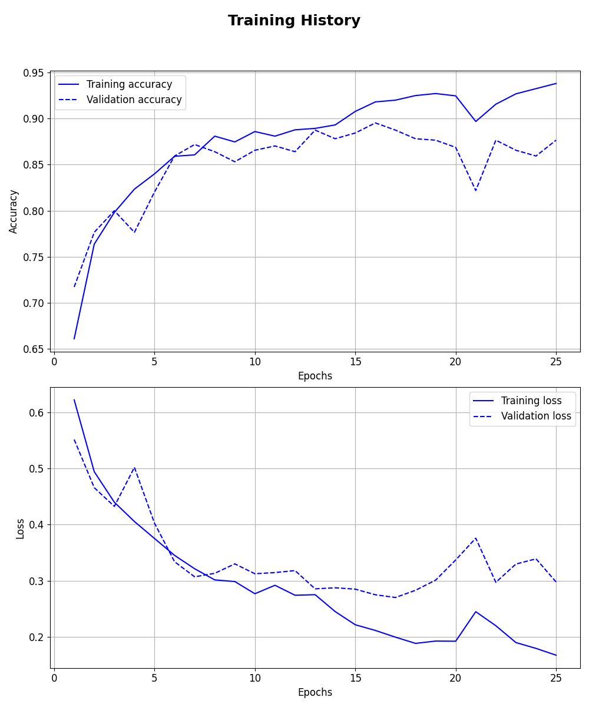

### Detailed Report of Test Set:

|              | precision    | recall       | f1-score     | support      |
| ------------ | ------------ | ------------ | ------------ | ------------ |
| chihuahua    | 0.8450       | 0.9602       | 0.8989       | 477          | 
| muffin       | 0.9459       | 0.7981       | 0.8657       | 416          | 
| micro avg    | 0.8847       | 0.8847       | 0.8847       | 893          | 
| macro avg    | 0.8954       | 0.8791       | 0.8823       | 893          | 
| weighted avg | 0.8920       | 0.8847       | 0.8834       | 893          | 
| samples avg  | 0.8847       | 0.8847       | 0.8847       | 893          | 

## trial_40

*    *Start Time*: 2024-10-20 11:56:03

*    *Duration*: 30.374

*    *Directory*: [Link](./trial_40)

### Hyperparameters:

| Hyperparameter        | Value                 |
| --------------------- | --------------------- |
| units1                | 128                   |
| kernel_size1          | 5                     |
| units2                | 32                    |
| kernel_size2          | 5                     |
| dense_units           | 512                   |
| dropout_rate          | 0.18583592219170775   |
| learning_rate         | 9.666660986054943e-05 |

### Evaluation Metrics:

|           | train     | val       | test      |
| --------- | --------- | --------- | --------- |
| accuracy  | 0.9556    | 0.8906    | 0.8847    | 
| precision | 0.9556    | 0.8906    | 0.8847    | 
| recall    | 0.9556    | 0.8906    | 0.8847    | 
| f1        | 0.9556    | 0.8906    | 0.8847    | 

### Figures:

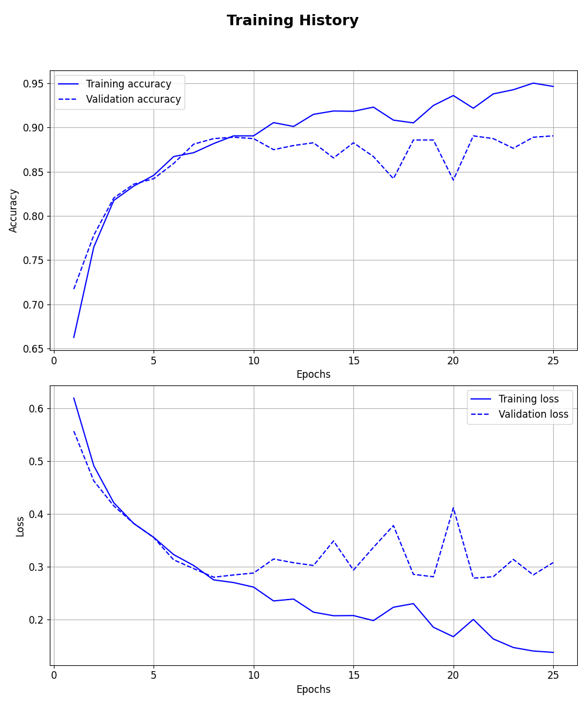

### Detailed Report of Test Set:

|              | precision    | recall       | f1-score     | support      |
| ------------ | ------------ | ------------ | ------------ | ------------ |
| chihuahua    | 0.8596       | 0.9371       | 0.8967       | 477          | 
| muffin       | 0.9196       | 0.8245       | 0.8695       | 416          | 
| micro avg    | 0.8847       | 0.8847       | 0.8847       | 893          | 
| macro avg    | 0.8896       | 0.8808       | 0.8831       | 893          | 
| weighted avg | 0.8875       | 0.8847       | 0.8840       | 893          | 
| samples avg  | 0.8847       | 0.8847       | 0.8847       | 893          | 

## trial_48

*    *Start Time*: 2024-10-20 12:00:27

*    *Duration*: 39.766

*    *Directory*: [Link](./trial_48)

### Hyperparameters:

| Hyperparameter        | Value                 |
| --------------------- | --------------------- |
| units1                | 128                   |
| kernel_size1          | 5                     |
| units2                | 64                    |
| kernel_size2          | 7                     |
| dense_units           | 256                   |
| dropout_rate          | 0.160481532820655     |
| learning_rate         | 8.162775971676084e-05 |

### Evaluation Metrics:

|           | train     | val       | test      |
| --------- | --------- | --------- | --------- |
| accuracy  | 0.9262    | 0.8734    | 0.8847    | 
| precision | 0.9262    | 0.8734    | 0.8847    | 
| recall    | 0.9262    | 0.8734    | 0.8847    | 
| f1        | 0.9262    | 0.8734    | 0.8847    | 

### Figures:

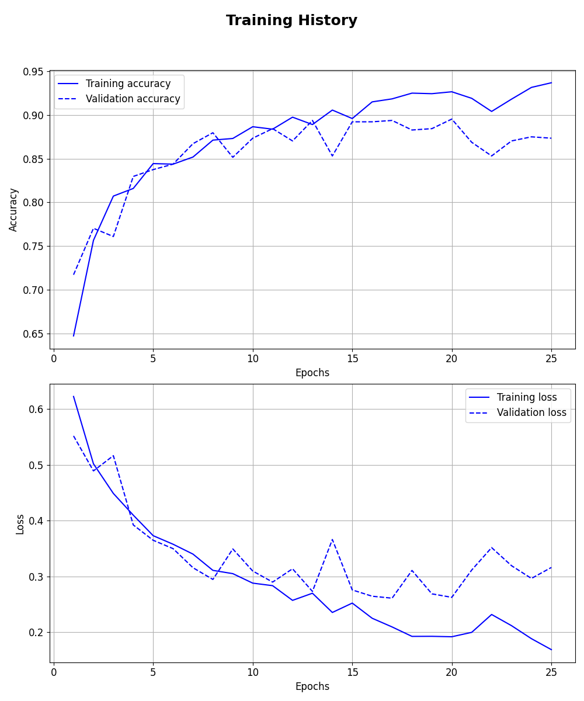

### Detailed Report of Test Set:

|              | precision    | recall       | f1-score     | support      |
| ------------ | ------------ | ------------ | ------------ | ------------ |
| chihuahua    | 0.8351       | 0.9769       | 0.9005       | 477          | 
| muffin       | 0.9672       | 0.7788       | 0.8628       | 416          | 
| micro avg    | 0.8847       | 0.8847       | 0.8847       | 893          | 
| macro avg    | 0.9011       | 0.8779       | 0.8817       | 893          | 
| weighted avg | 0.8966       | 0.8847       | 0.8830       | 893          | 
| samples avg  | 0.8847       | 0.8847       | 0.8847       | 893          | 

## trial_63

*    *Start Time*: 2024-10-20 12:09:04

*    *Duration*: 29.342

*    *Directory*: [Link](./trial_63)

### Hyperparameters:

| Hyperparameter        | Value                 |
| --------------------- | --------------------- |
| units1                | 128                   |
| kernel_size1          | 3                     |
| units2                | 64                    |
| kernel_size2          | 5                     |
| dense_units           | 128                   |
| dropout_rate          | 0.12944573319261857   |
| learning_rate         | 8.264027939545117e-05 |

### Evaluation Metrics:

|           | train     | val       | test      |
| --------- | --------- | --------- | --------- |
| accuracy  | 0.9281    | 0.8875    | 0.8847    | 
| precision | 0.9281    | 0.8875    | 0.8847    | 
| recall    | 0.9281    | 0.8875    | 0.8847    | 
| f1        | 0.9281    | 0.8875    | 0.8847    | 

### Figures:

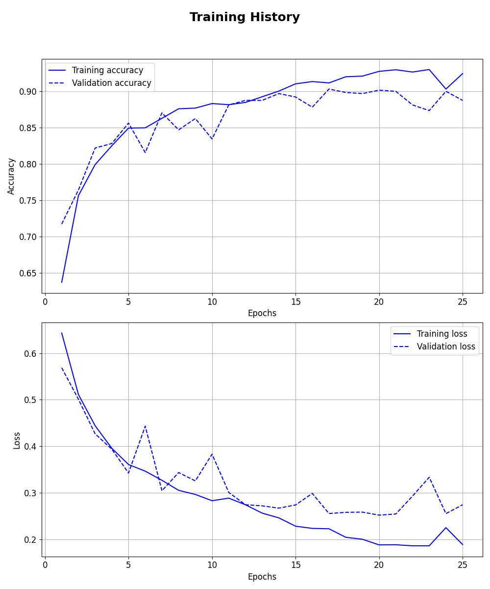

### Detailed Report of Test Set:

|              | precision    | recall       | f1-score     | support      |
| ------------ | ------------ | ------------ | ------------ | ------------ |
| chihuahua    | 0.9231       | 0.8553       | 0.8879       | 477          | 
| muffin       | 0.8470       | 0.9183       | 0.8812       | 416          | 
| micro avg    | 0.8847       | 0.8847       | 0.8847       | 893          | 
| macro avg    | 0.8850       | 0.8868       | 0.8846       | 893          | 
| weighted avg | 0.8876       | 0.8847       | 0.8848       | 893          | 
| samples avg  | 0.8847       | 0.8847       | 0.8847       | 893          | 

## trial_70

*    *Start Time*: 2024-10-20 12:12:43

*    *Duration*: 29.473

*    *Directory*: [Link](./trial_70)

### Hyperparameters:

| Hyperparameter         | Value                  |
| ---------------------- | ---------------------- |
| units1                 | 128                    |
| kernel_size1           | 3                      |
| units2                 | 64                     |
| kernel_size2           | 5                      |
| dense_units            | 128                    |
| dropout_rate           | 0.09280609924700182    |
| learning_rate          | 0.00012934502867174283 |

### Evaluation Metrics:

|           | train     | val       | test      |
| --------- | --------- | --------- | --------- |
| accuracy  | 0.9187    | 0.8703    | 0.8847    | 
| precision | 0.9187    | 0.8703    | 0.8847    | 
| recall    | 0.9187    | 0.8703    | 0.8847    | 
| f1        | 0.9187    | 0.8703    | 0.8847    | 

### Figures:

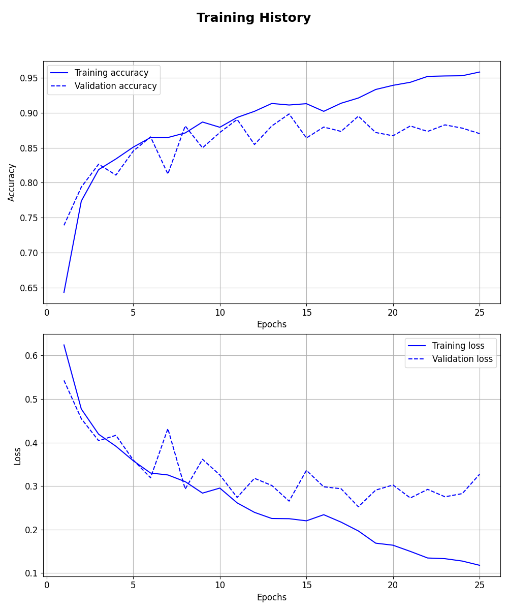

### Detailed Report of Test Set:

|              | precision    | recall       | f1-score     | support      |
| ------------ | ------------ | ------------ | ------------ | ------------ |
| chihuahua    | 0.9474       | 0.8302       | 0.8849       | 477          | 
| muffin       | 0.8295       | 0.9471       | 0.8844       | 416          | 
| micro avg    | 0.8847       | 0.8847       | 0.8847       | 893          | 
| macro avg    | 0.8884       | 0.8887       | 0.8847       | 893          | 
| weighted avg | 0.8924       | 0.8847       | 0.8847       | 893          | 
| samples avg  | 0.8847       | 0.8847       | 0.8847       | 893          | 

## trial_77

*    *Start Time*: 2024-10-20 12:15:44

*    *Duration*: 33.719

*    *Directory*: [Link](./trial_77)

### Hyperparameters:

| Hyperparameter         | Value                  |
| ---------------------- | ---------------------- |
| units1                 | 128                    |
| kernel_size1           | 5                      |
| units2                 | 64                     |
| kernel_size2           | 7                      |
| dense_units            | 256                    |
| dropout_rate           | 0.18328177429112325    |
| learning_rate          | 0.00014985002774766163 |

### Evaluation Metrics:

|           | train     | val       | test      |
| --------- | --------- | --------- | --------- |
| accuracy  | 0.9831    | 0.8953    | 0.8847    | 
| precision | 0.9831    | 0.8953    | 0.8847    | 
| recall    | 0.9831    | 0.8953    | 0.8847    | 
| f1        | 0.9831    | 0.8953    | 0.8847    | 

### Figures:

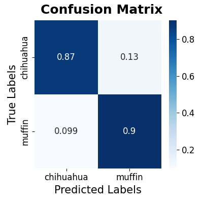

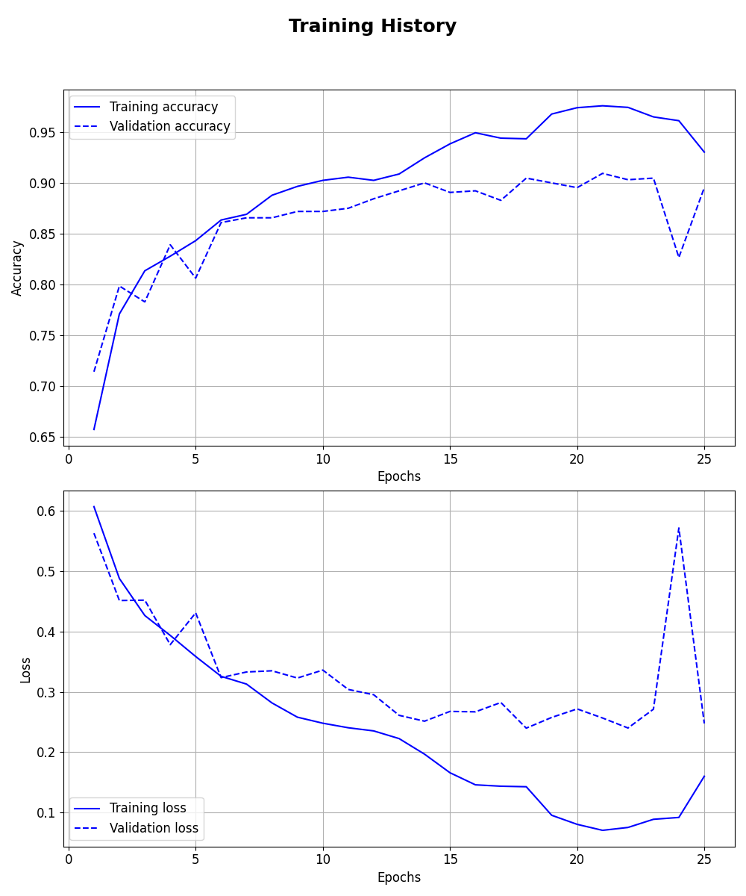

### Detailed Report of Test Set:

|              | precision    | recall       | f1-score     | support      |
| ------------ | ------------ | ------------ | ------------ | ------------ |
| chihuahua    | 0.9101       | 0.8700       | 0.8896       | 477          | 
| muffin       | 0.8581       | 0.9014       | 0.8792       | 416          | 
| micro avg    | 0.8847       | 0.8847       | 0.8847       | 893          | 
| macro avg    | 0.8841       | 0.8857       | 0.8844       | 893          | 
| weighted avg | 0.8859       | 0.8847       | 0.8848       | 893          | 
| samples avg  | 0.8847       | 0.8847       | 0.8847       | 893          | 

## trial_100

*    *Start Time*: 2024-10-20 12:28:37

*    *Duration*: 32.981

*    *Directory*: [Link](./trial_100)

### Hyperparameters:

| Hyperparameter        | Value                 |
| --------------------- | --------------------- |
| units1                | 128                   |
| kernel_size1          | 3                     |
| units2                | 64                    |
| kernel_size2          | 7                     |
| dense_units           | 128                   |
| dropout_rate          | 0.25391158871049163   |
| learning_rate         | 6.385911168784833e-05 |

### Evaluation Metrics:

|           | train     | val       | test      |
| --------- | --------- | --------- | --------- |
| accuracy  | 0.9219    | 0.9000    | 0.8847    | 
| precision | 0.9219    | 0.9000    | 0.8847    | 
| recall    | 0.9219    | 0.9000    | 0.8847    | 
| f1        | 0.9219    | 0.9000    | 0.8847    | 

### Figures:

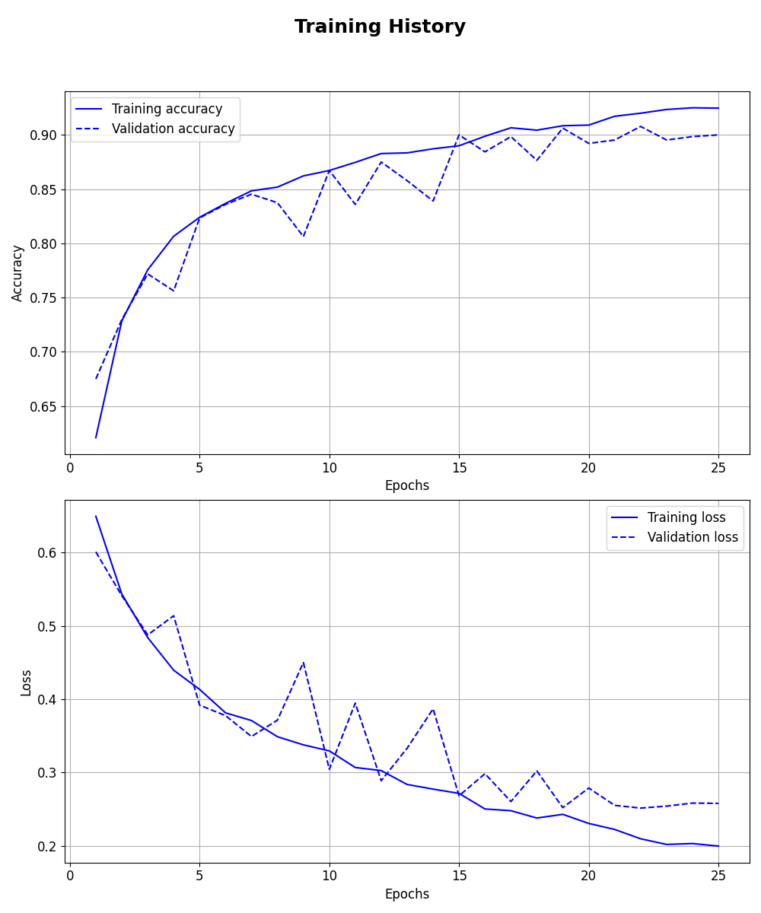

### Detailed Report of Test Set:

|              | precision    | recall       | f1-score     | support      |
| ------------ | ------------ | ------------ | ------------ | ------------ |
| chihuahua    | 0.9269       | 0.8512       | 0.8874       | 477          | 
| muffin       | 0.8440       | 0.9231       | 0.8817       | 416          | 
| micro avg    | 0.8847       | 0.8847       | 0.8847       | 893          | 
| macro avg    | 0.8854       | 0.8871       | 0.8846       | 893          | 
| weighted avg | 0.8883       | 0.8847       | 0.8848       | 893          | 
| samples avg  | 0.8847       | 0.8847       | 0.8847       | 893          | 

## trial_36

*    *Start Time*: 2024-10-20 11:53:59

*    *Duration*: 29.378

*    *Directory*: [Link](./trial_36)

### Hyperparameters:

| Hyperparameter         | Value                  |
| ---------------------- | ---------------------- |
| units1                 | 128                    |
| kernel_size1           | 3                      |
| units2                 | 64                     |
| kernel_size2           | 5                      |
| dense_units            | 128                    |
| dropout_rate           | 0.14458008572699238    |
| learning_rate          | 0.00011419141288334819 |

### Evaluation Metrics:

|           | train     | val       | test      |
| --------- | --------- | --------- | --------- |
| accuracy  | 0.9344    | 0.8781    | 0.8835    | 
| precision | 0.9344    | 0.8781    | 0.8835    | 
| recall    | 0.9344    | 0.8781    | 0.8835    | 
| f1        | 0.9344    | 0.8781    | 0.8835    | 

### Figures:

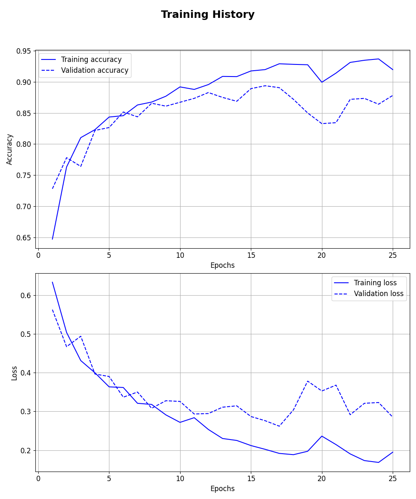

### Detailed Report of Test Set:

|              | precision    | recall       | f1-score     | support      |
| ------------ | ------------ | ------------ | ------------ | ------------ |
| chihuahua    | 0.9409       | 0.8344       | 0.8844       | 477          | 
| muffin       | 0.8319       | 0.9399       | 0.8826       | 416          | 
| micro avg    | 0.8835       | 0.8835       | 0.8835       | 893          | 
| macro avg    | 0.8864       | 0.8871       | 0.8835       | 893          | 
| weighted avg | 0.8901       | 0.8835       | 0.8836       | 893          | 
| samples avg  | 0.8835       | 0.8835       | 0.8835       | 893          | 

## trial_39

*    *Start Time*: 2024-10-20 11:55:33

*    *Duration*: 29.516

*    *Directory*: [Link](./trial_39)

### Hyperparameters:

| Hyperparameter         | Value                  |
| ---------------------- | ---------------------- |
| units1                 | 128                    |
| kernel_size1           | 3                      |
| units2                 | 64                     |
| kernel_size2           | 5                      |
| dense_units            | 128                    |
| dropout_rate           | 0.1308924960756423     |
| learning_rate          | 2.6853967202620856e-05 |

### Evaluation Metrics:

|           | train     | val       | test      |
| --------- | --------- | --------- | --------- |
| accuracy  | 0.8947    | 0.8719    | 0.8835    | 
| precision | 0.8947    | 0.8719    | 0.8835    | 
| recall    | 0.8947    | 0.8719    | 0.8835    | 
| f1        | 0.8947    | 0.8719    | 0.8835    | 

### Figures:

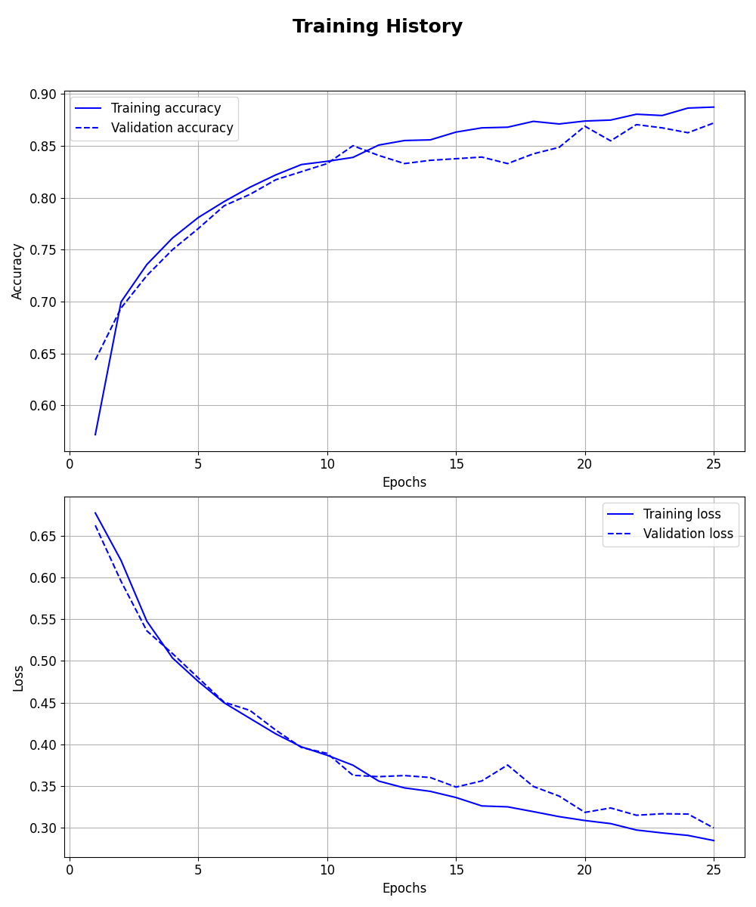

### Detailed Report of Test Set:

|              | precision    | recall       | f1-score     | support      |
| ------------ | ------------ | ------------ | ------------ | ------------ |
| chihuahua    | 0.8723       | 0.9161       | 0.8937       | 477          | 
| muffin       | 0.8980       | 0.8462       | 0.8713       | 416          | 
| micro avg    | 0.8835       | 0.8835       | 0.8835       | 893          | 
| macro avg    | 0.8851       | 0.8811       | 0.8825       | 893          | 
| weighted avg | 0.8842       | 0.8835       | 0.8832       | 893          | 
| samples avg  | 0.8835       | 0.8835       | 0.8835       | 893          | 

## trial_18

*    *Start Time*: 2024-10-20 11:45:51

*    *Duration*: 25.290

*    *Directory*: [Link](./trial_18)

### Hyperparameters:

| Hyperparameter       | Value                |
| -------------------- | -------------------- |
| units1               | 128                  |
| kernel_size1         | 3                    |
| units2               | 32                   |
| kernel_size2         | 3                    |
| dense_units          | 512                  |
| dropout_rate         | 0.015504366887637178 |
| learning_rate        | 1.94910093480993e-05 |

### Evaluation Metrics:

|           | train     | val       | test      |
| --------- | --------- | --------- | --------- |
| accuracy  | 0.9069    | 0.8875    | 0.8824    | 
| precision | 0.9069    | 0.8875    | 0.8824    | 
| recall    | 0.9069    | 0.8875    | 0.8824    | 
| f1        | 0.9069    | 0.8875    | 0.8824    | 

### Figures:

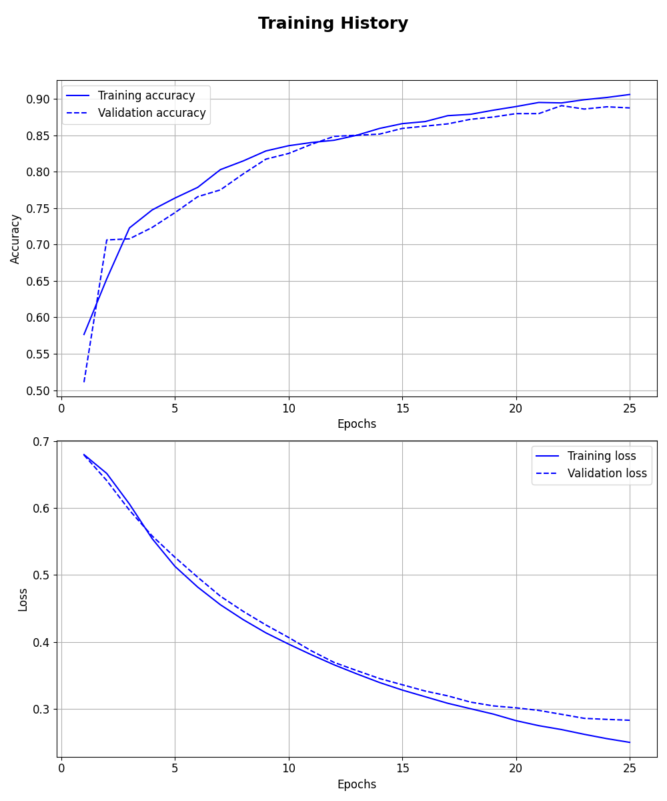

### Detailed Report of Test Set:

|              | precision    | recall       | f1-score     | support      |
| ------------ | ------------ | ------------ | ------------ | ------------ |
| chihuahua    | 0.8720       | 0.9140       | 0.8925       | 477          | 
| muffin       | 0.8957       | 0.8462       | 0.8702       | 416          | 
| micro avg    | 0.8824       | 0.8824       | 0.8824       | 893          | 
| macro avg    | 0.8838       | 0.8801       | 0.8814       | 893          | 
| weighted avg | 0.8830       | 0.8824       | 0.8821       | 893          | 
| samples avg  | 0.8824       | 0.8824       | 0.8824       | 893          | 

## trial_23

*    *Start Time*: 2024-10-20 11:47:53

*    *Duration*: 25.697

*    *Directory*: [Link](./trial_23)

### Hyperparameters:

| Hyperparameter        | Value                 |
| --------------------- | --------------------- |
| units1                | 128                   |
| kernel_size1          | 3                     |
| units2                | 64                    |
| kernel_size2          | 3                     |
| dense_units           | 512                   |
| dropout_rate          | 0.06148611590847644   |
| learning_rate         | 1.643973209954612e-05 |

### Evaluation Metrics:

|           | train     | val       | test      |
| --------- | --------- | --------- | --------- |
| accuracy  | 0.9166    | 0.8828    | 0.8813    | 
| precision | 0.9166    | 0.8828    | 0.8813    | 
| recall    | 0.9166    | 0.8828    | 0.8813    | 
| f1        | 0.9166    | 0.8828    | 0.8813    | 

### Figures:

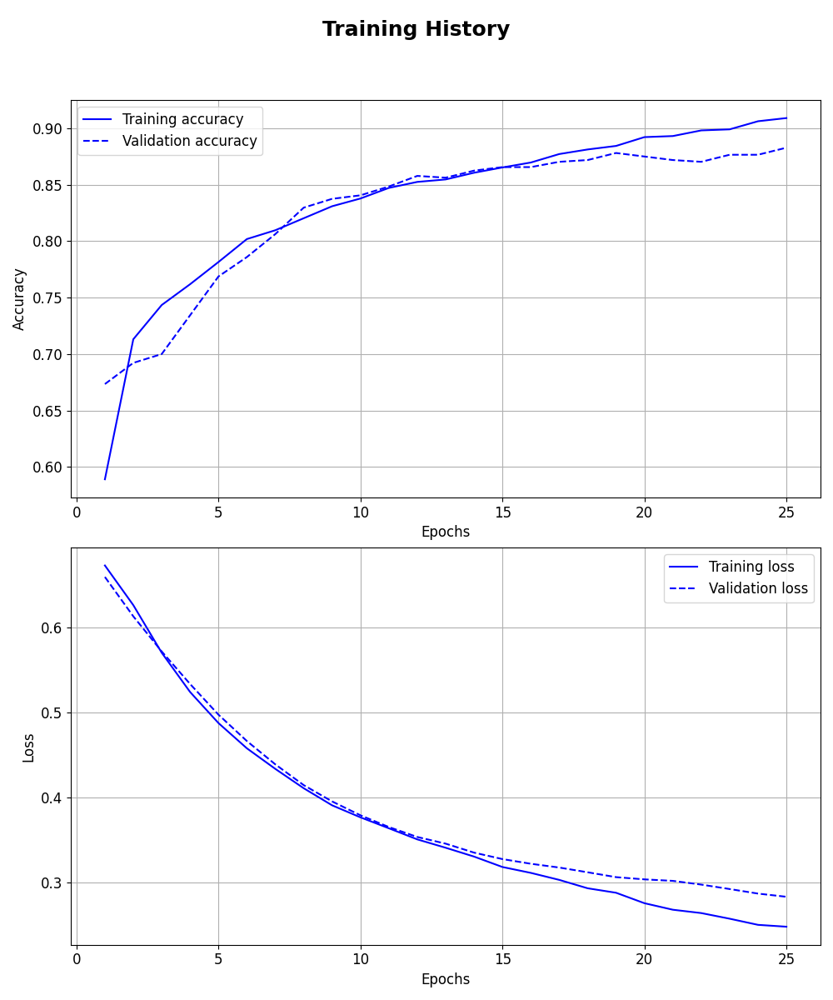

### Detailed Report of Test Set:

|              | precision    | recall       | f1-score     | support      |
| ------------ | ------------ | ------------ | ------------ | ------------ |
| chihuahua    | 0.8793       | 0.9015       | 0.8903       | 477          | 
| muffin       | 0.8837       | 0.8582       | 0.8707       | 416          | 
| micro avg    | 0.8813       | 0.8813       | 0.8813       | 893          | 
| macro avg    | 0.8815       | 0.8798       | 0.8805       | 893          | 
| weighted avg | 0.8814       | 0.8813       | 0.8812       | 893          | 
| samples avg  | 0.8813       | 0.8813       | 0.8813       | 893          | 

## trial_15

*    *Start Time*: 2024-10-20 11:44:41

*    *Duration*: 23.635

*    *Directory*: [Link](./trial_15)

### Hyperparameters:

| Hyperparameter        | Value                 |
| --------------------- | --------------------- |
| units1                | 64                    |
| kernel_size1          | 7                     |
| units2                | 32                    |
| kernel_size2          | 7                     |
| dense_units           | 128                   |
| dropout_rate          | 0.3236004052702324    |
| learning_rate         | 5.805332021270342e-05 |

### Evaluation Metrics:

|           | train     | val       | test      |
| --------- | --------- | --------- | --------- |
| accuracy  | 0.8959    | 0.8719    | 0.8791    | 
| precision | 0.8959    | 0.8719    | 0.8791    | 
| recall    | 0.8959    | 0.8719    | 0.8791    | 
| f1        | 0.8959    | 0.8719    | 0.8791    | 

### Figures:

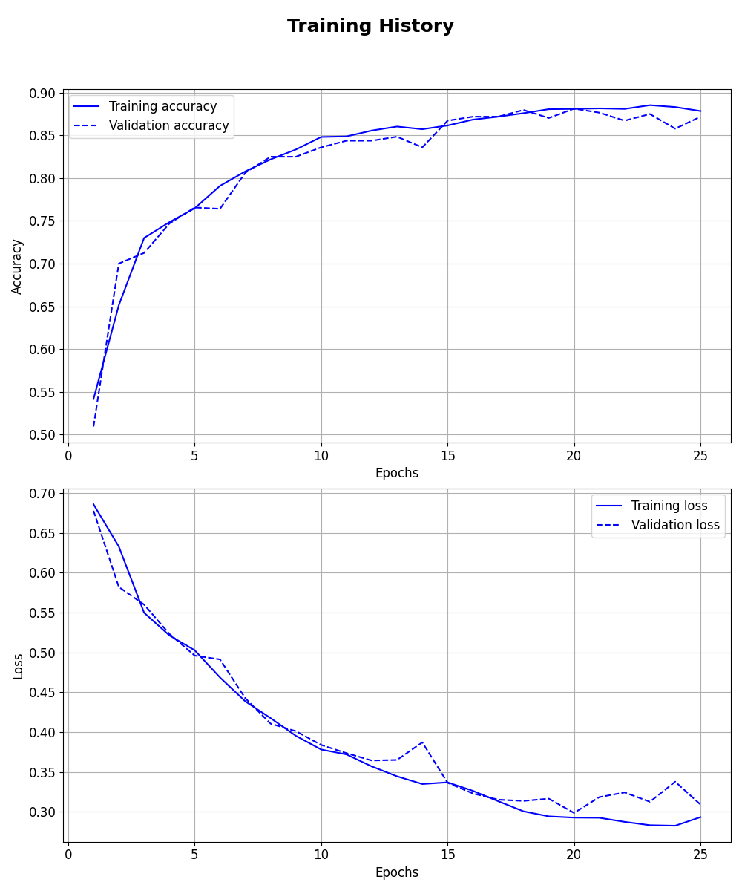

### Detailed Report of Test Set:

|              | precision    | recall       | f1-score     | support      |
| ------------ | ------------ | ------------ | ------------ | ------------ |
| chihuahua    | 0.8758       | 0.9015       | 0.8884       | 477          | 
| muffin       | 0.8831       | 0.8534       | 0.8680       | 416          | 
| micro avg    | 0.8791       | 0.8791       | 0.8791       | 893          | 
| macro avg    | 0.8794       | 0.8774       | 0.8782       | 893          | 
| weighted avg | 0.8792       | 0.8791       | 0.8789       | 893          | 
| samples avg  | 0.8791       | 0.8791       | 0.8791       | 893          | 

## trial_98

*    *Start Time*: 2024-10-20 12:27:34

*    *Duration*: 27.675

*    *Directory*: [Link](./trial_98)

### Hyperparameters:

| Hyperparameter         | Value                  |
| ---------------------- | ---------------------- |
| units1                 | 128                    |
| kernel_size1           | 3                      |
| units2                 | 32                     |
| kernel_size2           | 7                      |
| dense_units            | 128                    |
| dropout_rate           | 0.23012775429620427    |
| learning_rate          | 3.9507636445541945e-05 |

### Evaluation Metrics:

|           | train     | val       | test      |
| --------- | --------- | --------- | --------- |
| accuracy  | 0.8903    | 0.8625    | 0.8779    | 
| precision | 0.8903    | 0.8625    | 0.8779    | 
| recall    | 0.8903    | 0.8625    | 0.8779    | 
| f1        | 0.8903    | 0.8625    | 0.8779    | 

### Figures:

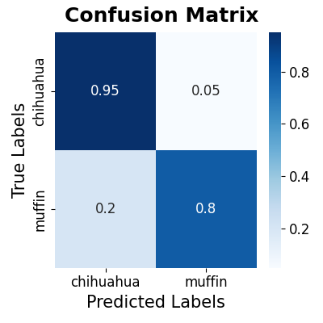

### Detailed Report of Test Set:

|              | precision    | recall       | f1-score     | support      |
| ------------ | ------------ | ------------ | ------------ | ------------ |
| chihuahua    | 0.8420       | 0.9497       | 0.8926       | 477          | 
| muffin       | 0.9324       | 0.7957       | 0.8586       | 416          | 
| micro avg    | 0.8779       | 0.8779       | 0.8779       | 893          | 
| macro avg    | 0.8872       | 0.8727       | 0.8756       | 893          | 
| weighted avg | 0.8841       | 0.8779       | 0.8768       | 893          | 
| samples avg  | 0.8779       | 0.8779       | 0.8779       | 893          | 

## trial_61

*    *Start Time*: 2024-10-20 12:07:59

*    *Duration*: 33.138

*    *Directory*: [Link](./trial_61)

### Hyperparameters:

| Hyperparameter         | Value                  |
| ---------------------- | ---------------------- |
| units1                 | 128                    |
| kernel_size1           | 3                      |
| units2                 | 64                     |
| kernel_size2           | 7                      |
| dense_units            | 256                    |
| dropout_rate           | 0.2917376188205809     |
| learning_rate          | 0.00015021916323067566 |

### Evaluation Metrics:

|           | train     | val       | test      |
| --------- | --------- | --------- | --------- |
| accuracy  | 0.9481    | 0.8859    | 0.8768    | 
| precision | 0.9481    | 0.8859    | 0.8768    | 
| recall    | 0.9481    | 0.8859    | 0.8768    | 
| f1        | 0.9481    | 0.8859    | 0.8768    | 

### Figures:

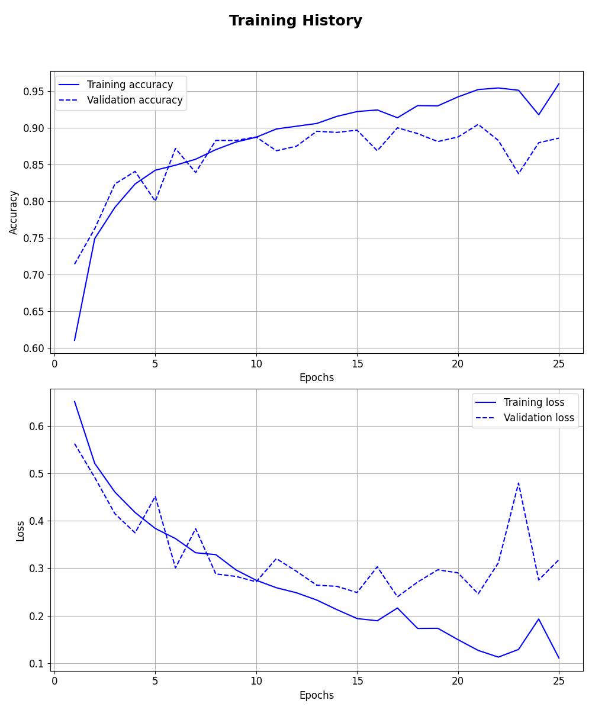

### Detailed Report of Test Set:

|              | precision    | recall       | f1-score     | support      |
| ------------ | ------------ | ------------ | ------------ | ------------ |
| chihuahua    | 0.9297       | 0.8323       | 0.8783       | 477          | 
| muffin       | 0.8283       | 0.9279       | 0.8753       | 416          | 
| micro avg    | 0.8768       | 0.8768       | 0.8768       | 893          | 
| macro avg    | 0.8790       | 0.8801       | 0.8768       | 893          | 
| weighted avg | 0.8825       | 0.8768       | 0.8769       | 893          | 
| samples avg  | 0.8768       | 0.8768       | 0.8768       | 893          | 

## trial_71

*    *Start Time*: 2024-10-20 12:13:13

*    *Duration*: 22.933

*    *Directory*: [Link](./trial_71)

### Hyperparameters:

| Hyperparameter        | Value                 |
| --------------------- | --------------------- |
| units1                | 128                   |
| kernel_size1          | 3                     |
| units2                | 32                    |
| kernel_size2          | 3                     |
| dense_units           | 128                   |
| dropout_rate          | 0.14117755210502736   |
| learning_rate         | 6.434106144148028e-05 |

### Evaluation Metrics:

|           | train     | val       | test      |
| --------- | --------- | --------- | --------- |
| accuracy  | 0.9172    | 0.8922    | 0.8768    | 
| precision | 0.9172    | 0.8922    | 0.8768    | 
| recall    | 0.9172    | 0.8922    | 0.8768    | 
| f1        | 0.9172    | 0.8922    | 0.8768    | 

### Figures:

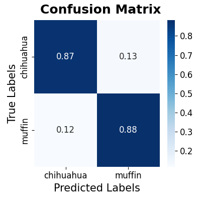

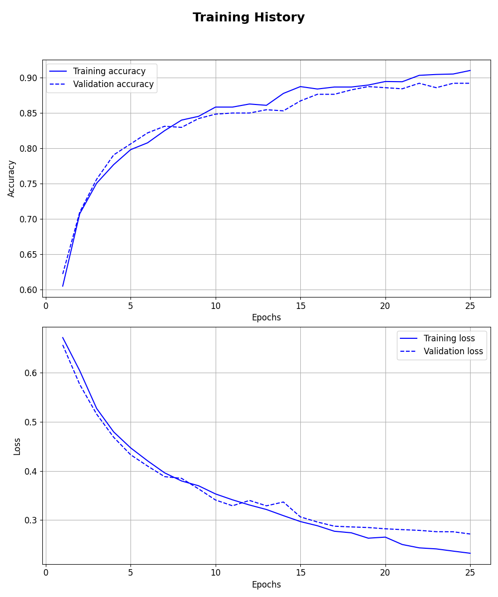

### Detailed Report of Test Set:

|              | precision    | recall       | f1-score     | support      |
| ------------ | ------------ | ------------ | ------------ | ------------ |
| chihuahua    | 0.8946       | 0.8721       | 0.8832       | 477          | 
| muffin       | 0.8575       | 0.8822       | 0.8697       | 416          | 
| micro avg    | 0.8768       | 0.8768       | 0.8768       | 893          | 
| macro avg    | 0.8761       | 0.8772       | 0.8764       | 893          | 
| weighted avg | 0.8773       | 0.8768       | 0.8769       | 893          | 
| samples avg  | 0.8768       | 0.8768       | 0.8768       | 893          | 

## trial_12

*    *Start Time*: 2024-10-20 11:43:43

*    *Duration*: 19.399

*    *Directory*: [Link](./trial_12)

### Hyperparameters:

| Hyperparameter        | Value                 |
| --------------------- | --------------------- |
| units1                | 64                    |
| kernel_size1          | 5                     |
| units2                | 32                    |
| kernel_size2          | 7                     |
| dense_units           | 512                   |
| dropout_rate          | 0.4964779710570115    |
| learning_rate         | 3.551466008199711e-05 |

### Evaluation Metrics:

|           | train     | val       | test      |
| --------- | --------- | --------- | --------- |
| accuracy  | 0.8956    | 0.8766    | 0.8746    | 
| precision | 0.8956    | 0.8766    | 0.8746    | 
| recall    | 0.8956    | 0.8766    | 0.8746    | 
| f1        | 0.8956    | 0.8766    | 0.8746    | 

### Figures:

### Detailed Report of Test Set:

|              | precision    | recall       | f1-score     | support      |
| ------------ | ------------ | ------------ | ------------ | ------------ |
| chihuahua    | 0.8600       | 0.9140       | 0.8862       | 477          | 
| muffin       | 0.8938       | 0.8293       | 0.8603       | 416          | 
| micro avg    | 0.8746       | 0.8746       | 0.8746       | 893          | 
| macro avg    | 0.8769       | 0.8717       | 0.8733       | 893          | 
| weighted avg | 0.8757       | 0.8746       | 0.8741       | 893          | 
| samples avg  | 0.8746       | 0.8746       | 0.8746       | 893          | 

## trial_78

*    *Start Time*: 2024-10-20 12:16:19

*    *Duration*: 33.717

*    *Directory*: [Link](./trial_78)

### Hyperparameters:

| Hyperparameter         | Value                  |
| ---------------------- | ---------------------- |
| units1                 | 128                    |
| kernel_size1           | 5                      |
| units2                 | 64                     |
| kernel_size2           | 7                      |
| dense_units            | 256                    |
| dropout_rate           | 0.19207080563041942    |
| learning_rate          | 0.00022715767826903932 |

### Evaluation Metrics:

|           | train     | val       | test      |
| --------- | --------- | --------- | --------- |
| accuracy  | 0.9697    | 0.8672    | 0.8746    | 
| precision | 0.9697    | 0.8672    | 0.8746    | 
| recall    | 0.9697    | 0.8672    | 0.8746    | 
| f1        | 0.9697    | 0.8672    | 0.8746    | 

### Figures:

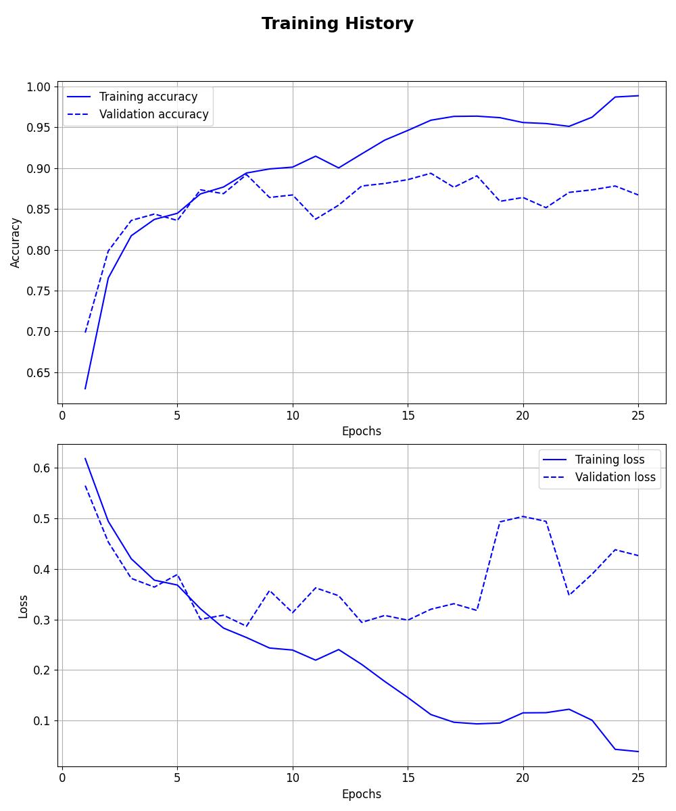

### Detailed Report of Test Set:

|              | precision    | recall       | f1-score     | support      |
| ------------ | ------------ | ------------ | ------------ | ------------ |
| chihuahua    | 0.9138       | 0.8449       | 0.8780       | 477          | 
| muffin       | 0.8363       | 0.9087       | 0.8710       | 416          | 
| micro avg    | 0.8746       | 0.8746       | 0.8746       | 893          | 
| macro avg    | 0.8751       | 0.8768       | 0.8745       | 893          | 
| weighted avg | 0.8777       | 0.8746       | 0.8747       | 893          | 
| samples avg  | 0.8746       | 0.8746       | 0.8746       | 893          | 

## trial_13

*    *Start Time*: 2024-10-20 11:44:03

*    *Duration*: 18.345

*    *Directory*: [Link](./trial_13)

### Hyperparameters:

| Hyperparameter        | Value                 |
| --------------------- | --------------------- |
| units1                | 64                    |
| kernel_size1          | 7                     |
| units2                | 32                    |
| kernel_size2          | 3                     |
| dense_units           | 512                   |
| dropout_rate          | 0.37797444242236816   |
| learning_rate         | 3.366101269326337e-05 |

### Evaluation Metrics:

|           | train     | val       | test      |
| --------- | --------- | --------- | --------- |
| accuracy  | 0.8913    | 0.8594    | 0.8735    | 
| precision | 0.8913    | 0.8594    | 0.8735    | 
| recall    | 0.8913    | 0.8594    | 0.8735    | 
| f1        | 0.8912    | 0.8594    | 0.8735    | 

### Figures:

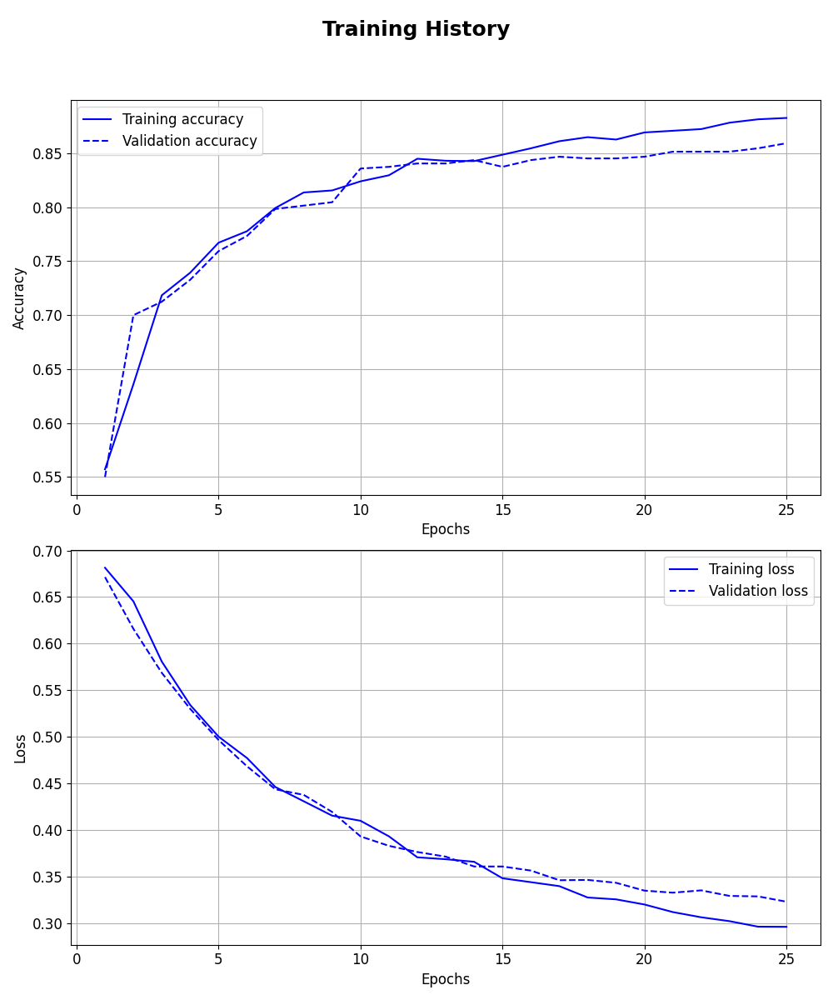

### Detailed Report of Test Set:

|              | precision    | recall       | f1-score     | support      |
| ------------ | ------------ | ------------ | ------------ | ------------ |
| chihuahua    | 0.8872       | 0.8742       | 0.8807       | 477          | 
| muffin       | 0.8582       | 0.8726       | 0.8653       | 416          | 
| micro avg    | 0.8735       | 0.8735       | 0.8735       | 893          | 
| macro avg    | 0.8727       | 0.8734       | 0.8730       | 893          | 
| weighted avg | 0.8737       | 0.8735       | 0.8735       | 893          | 
| samples avg  | 0.8735       | 0.8735       | 0.8735       | 893          | 

## trial_19

*    *Start Time*: 2024-10-20 11:46:17

*    *Duration*: 25.226

*    *Directory*: [Link](./trial_19)

### Hyperparameters:

| Hyperparameter         | Value                  |
| ---------------------- | ---------------------- |
| units1                 | 128                    |
| kernel_size1           | 3                      |
| units2                 | 64                     |
| kernel_size2           | 3                      |
| dense_units            | 256                    |
| dropout_rate           | 0.04303270956003625    |
| learning_rate          | 1.9288492323532306e-05 |

### Evaluation Metrics:

|           | train     | val       | test      |
| --------- | --------- | --------- | --------- |
| accuracy  | 0.9016    | 0.8906    | 0.8735    | 
| precision | 0.9016    | 0.8906    | 0.8735    | 
| recall    | 0.9016    | 0.8906    | 0.8735    | 
| f1        | 0.9016    | 0.8906    | 0.8735    | 

### Figures:

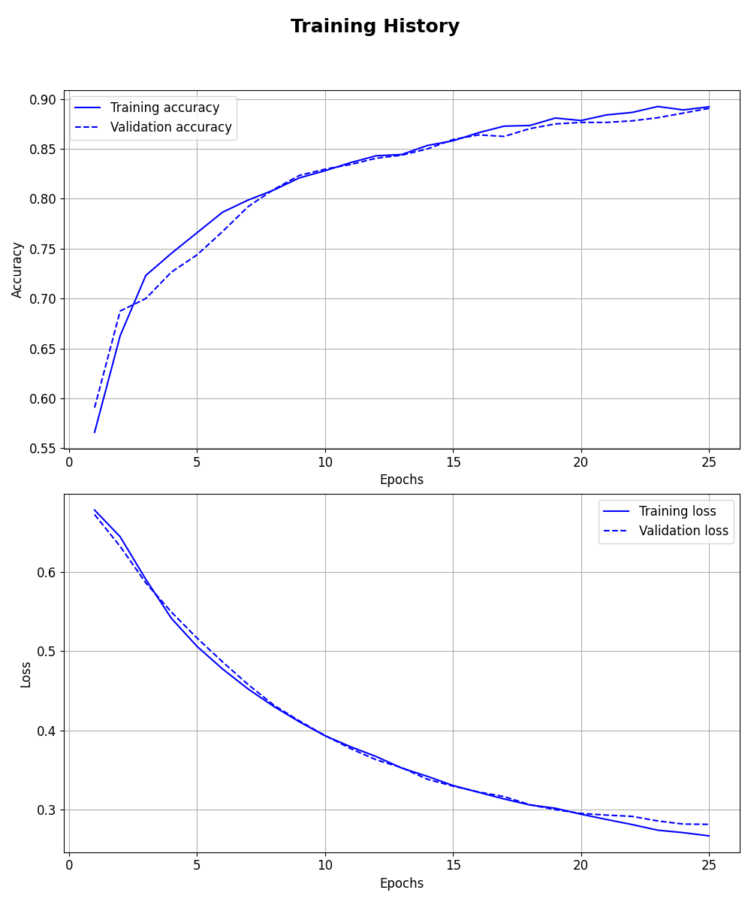

### Detailed Report of Test Set:

|              | precision    | recall       | f1-score     | support      |
| ------------ | ------------ | ------------ | ------------ | ------------ |
| chihuahua    | 0.8597       | 0.9119       | 0.8850       | 477          | 
| muffin       | 0.8915       | 0.8293       | 0.8593       | 416          | 
| micro avg    | 0.8735       | 0.8735       | 0.8735       | 893          | 
| macro avg    | 0.8756       | 0.8706       | 0.8722       | 893          | 
| weighted avg | 0.8745       | 0.8735       | 0.8730       | 893          | 
| samples avg  | 0.8735       | 0.8735       | 0.8735       | 893          | 

## trial_60

*    *Start Time*: 2024-10-20 12:07:26

*    *Duration*: 32.817

*    *Directory*: [Link](./trial_60)

### Hyperparameters:

| Hyperparameter         | Value                  |
| ---------------------- | ---------------------- |
| units1                 | 128                    |
| kernel_size1           | 3                      |
| units2                 | 64                     |
| kernel_size2           | 7                      |
| dense_units            | 128                    |
| dropout_rate           | 0.3437603374751716     |
| learning_rate          | 4.6014787197109964e-05 |

### Evaluation Metrics:

|           | train     | val       | test      |
| --------- | --------- | --------- | --------- |
| accuracy  | 0.8922    | 0.8594    | 0.8723    | 
| precision | 0.8922    | 0.8594    | 0.8723    | 
| recall    | 0.8922    | 0.8594    | 0.8723    | 
| f1        | 0.8922    | 0.8594    | 0.8723    | 

### Figures:

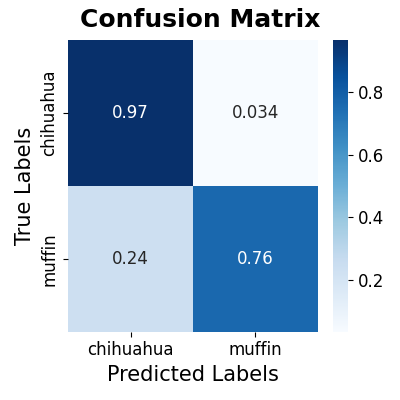

### Detailed Report of Test Set:

|              | precision    | recall       | f1-score     | support      |
| ------------ | ------------ | ------------ | ------------ | ------------ |
| chihuahua    | 0.8247       | 0.9665       | 0.8900       | 477          | 
| muffin       | 0.9521       | 0.7644       | 0.8480       | 416          | 
| micro avg    | 0.8723       | 0.8723       | 0.8723       | 893          | 
| macro avg    | 0.8884       | 0.8654       | 0.8690       | 893          | 
| weighted avg | 0.8840       | 0.8723       | 0.8704       | 893          | 
| samples avg  | 0.8723       | 0.8723       | 0.8723       | 893          | 

## trial_66

*    *Start Time*: 2024-10-20 12:10:33

*    *Duration*: 29.221

*    *Directory*: [Link](./trial_66)

### Hyperparameters:

| Hyperparameter        | Value                 |
| --------------------- | --------------------- |
| units1                | 128                   |
| kernel_size1          | 3                     |
| units2                | 64                    |
| kernel_size2          | 5                     |
| dense_units           | 128                   |
| dropout_rate          | 0.06820916175008601   |
| learning_rate         | 0.0005985747734453099 |

### Evaluation Metrics:

|           | train     | val       | test      |
| --------- | --------- | --------- | --------- |
| accuracy  | 0.9516    | 0.8641    | 0.8712    | 
| precision | 0.9516    | 0.8641    | 0.8712    | 
| recall    | 0.9516    | 0.8641    | 0.8712    | 
| f1        | 0.9516    | 0.8641    | 0.8712    | 

### Figures:

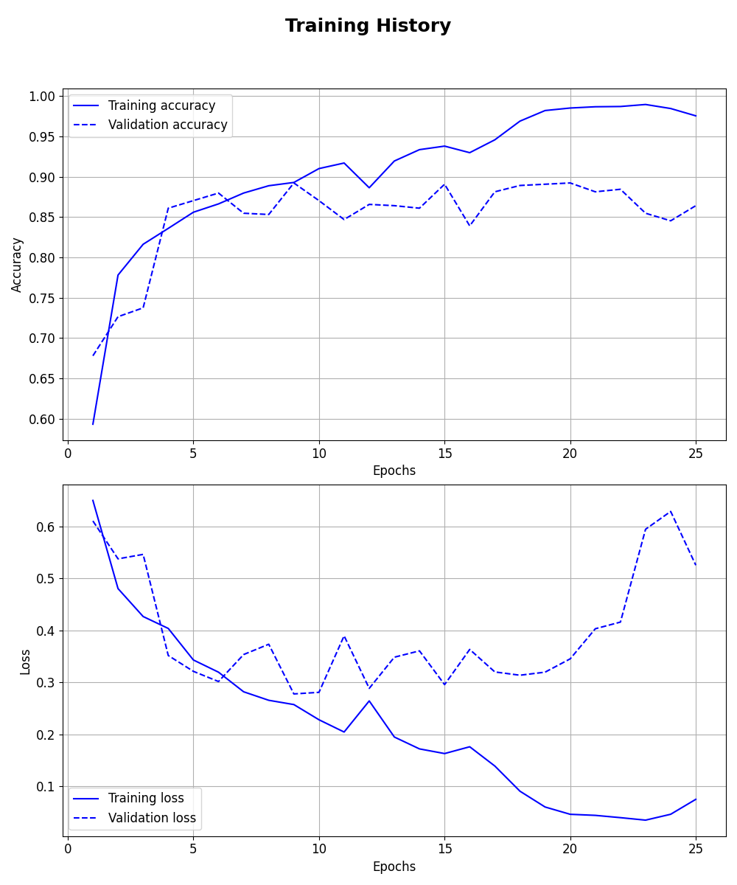

### Detailed Report of Test Set:

|              | precision    | recall       | f1-score     | support      |
| ------------ | ------------ | ------------ | ------------ | ------------ |
| chihuahua    | 0.9132       | 0.8386       | 0.8743       | 477          | 
| muffin       | 0.8308       | 0.9087       | 0.8680       | 416          | 
| micro avg    | 0.8712       | 0.8712       | 0.8712       | 893          | 
| macro avg    | 0.8720       | 0.8736       | 0.8711       | 893          | 
| weighted avg | 0.8748       | 0.8712       | 0.8714       | 893          | 
| samples avg  | 0.8712       | 0.8712       | 0.8712       | 893          | 

## trial_3

*    *Start Time*: 2024-10-20 11:39:16

*    *Duration*: 29.040

*    *Directory*: [Link](./trial_3)

### Hyperparameters:

| Hyperparameter        | Value                 |
| --------------------- | --------------------- |
| units1                | 128                   |
| kernel_size1          | 3                     |
| units2                | 64                    |
| kernel_size2          | 3                     |
| dense_units           | 256                   |
| dropout_rate          | 0.14559779403218226   |
| learning_rate         | 0.0007137825218674884 |

### Evaluation Metrics:

|           | train     | val       | test      |
| --------- | --------- | --------- | --------- |
| accuracy  | 0.9950    | 0.8719    | 0.8701    | 
| precision | 0.9950    | 0.8719    | 0.8701    | 
| recall    | 0.9950    | 0.8719    | 0.8701    | 
| f1        | 0.9950    | 0.8719    | 0.8701    | 

### Figures:

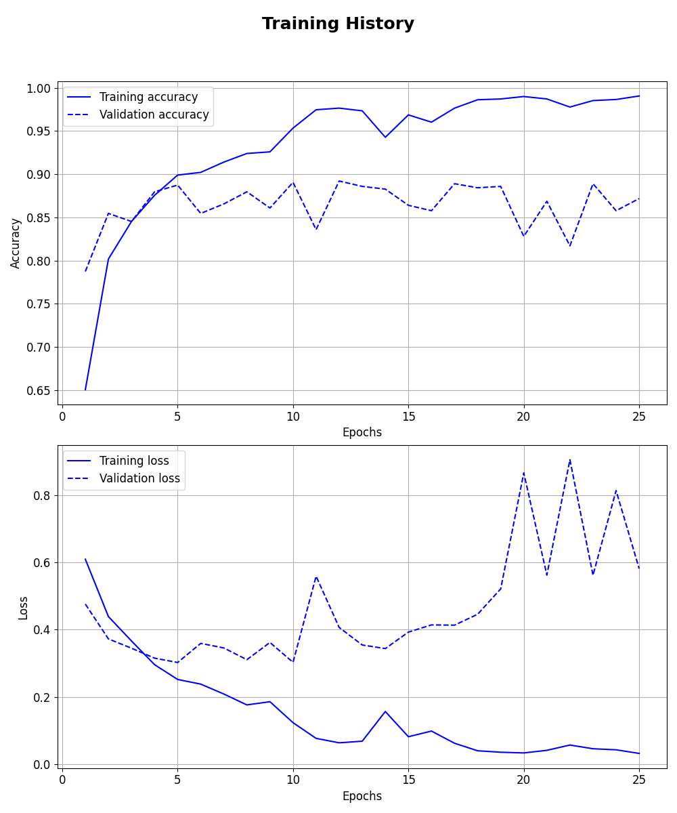

### Detailed Report of Test Set:

|              | precision    | recall       | f1-score     | support      |
| ------------ | ------------ | ------------ | ------------ | ------------ |
| chihuahua    | 0.9413       | 0.8071       | 0.8691       | 477          | 
| muffin       | 0.8099       | 0.9423       | 0.8711       | 416          | 
| micro avg    | 0.8701       | 0.8701       | 0.8701       | 893          | 
| macro avg    | 0.8756       | 0.8747       | 0.8701       | 893          | 
| weighted avg | 0.8801       | 0.8701       | 0.8700       | 893          | 
| samples avg  | 0.8701       | 0.8701       | 0.8701       | 893          | 

## trial_62

*    *Start Time*: 2024-10-20 12:08:34

*    *Duration*: 29.579

*    *Directory*: [Link](./trial_62)

### Hyperparameters:

| Hyperparameter         | Value                  |
| ---------------------- | ---------------------- |
| units1                 | 128                    |
| kernel_size1           | 3                      |
| units2                 | 64                     |
| kernel_size2           | 5                      |
| dense_units            | 128                    |
| dropout_rate           | 0.10108807422564778    |
| learning_rate          | 0.00012275795651540898 |

### Evaluation Metrics:

|           | train     | val       | test      |
| --------- | --------- | --------- | --------- |
| accuracy  | 0.9181    | 0.8578    | 0.8701    | 
| precision | 0.9181    | 0.8578    | 0.8701    | 
| recall    | 0.9181    | 0.8578    | 0.8701    | 
| f1        | 0.9181    | 0.8578    | 0.8701    | 

### Figures:

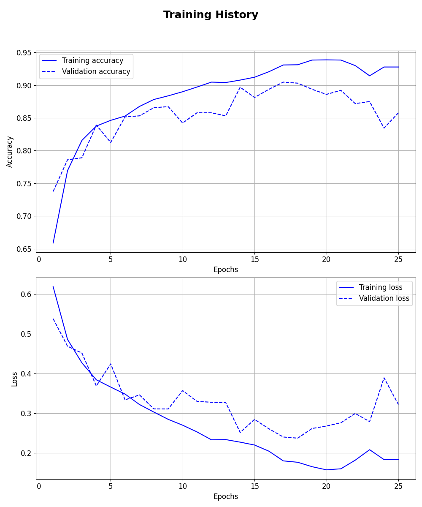

### Detailed Report of Test Set:

|              | precision    | recall       | f1-score     | support      |
| ------------ | ------------ | ------------ | ------------ | ------------ |
| chihuahua    | 0.8150       | 0.9790       | 0.8895       | 477          | 
| muffin       | 0.9688       | 0.7452       | 0.8424       | 416          | 
| micro avg    | 0.8701       | 0.8701       | 0.8701       | 893          | 
| macro avg    | 0.8919       | 0.8621       | 0.8660       | 893          | 
| weighted avg | 0.8866       | 0.8701       | 0.8676       | 893          | 
| samples avg  | 0.8701       | 0.8701       | 0.8701       | 893          | 

## trial_17

*    *Start Time*: 2024-10-20 11:45:29

*    *Duration*: 21.968

*    *Directory*: [Link](./trial_17)

### Hyperparameters:

| Hyperparameter        | Value                 |
| --------------------- | --------------------- |
| units1                | 64                    |
| kernel_size1          | 7                     |
| units2                | 16                    |
| kernel_size2          | 7                     |
| dense_units           | 256                   |
| dropout_rate          | 0.21010554521069352   |
| learning_rate         | 5.366887988521354e-05 |

### Evaluation Metrics:

|           | train     | val       | test      |
| --------- | --------- | --------- | --------- |
| accuracy  | 0.8803    | 0.8687    | 0.8690    | 
| precision | 0.8803    | 0.8687    | 0.8690    | 
| recall    | 0.8803    | 0.8687    | 0.8690    | 
| f1        | 0.8803    | 0.8687    | 0.8690    | 

### Figures:

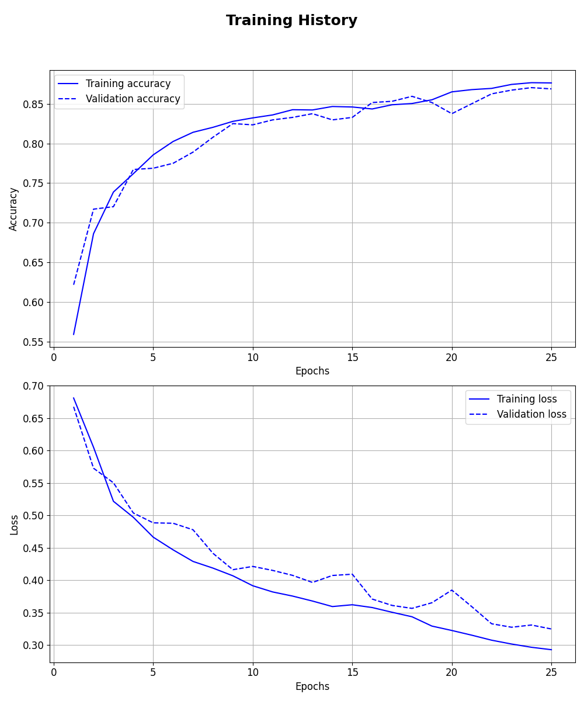

### Detailed Report of Test Set:

|              | precision    | recall       | f1-score     | support      |
| ------------ | ------------ | ------------ | ------------ | ------------ |
| chihuahua    | 0.9018       | 0.8470       | 0.8735       | 477          | 
| muffin       | 0.8360       | 0.8942       | 0.8641       | 416          | 
| micro avg    | 0.8690       | 0.8690       | 0.8690       | 893          | 
| macro avg    | 0.8689       | 0.8706       | 0.8688       | 893          | 
| weighted avg | 0.8711       | 0.8690       | 0.8691       | 893          | 
| samples avg  | 0.8690       | 0.8690       | 0.8690       | 893          | 

## trial_20

*    *Start Time*: 2024-10-20 11:46:43

*    *Duration*: 20.107

*    *Directory*: [Link](./trial_20)

### Hyperparameters:

| Hyperparameter         | Value                  |
| ---------------------- | ---------------------- |
| units1                 | 64                     |
| kernel_size1           | 3                      |
| units2                 | 64                     |
| kernel_size2           | 3                      |
| dense_units            | 128                    |
| dropout_rate           | 0.010481830196475972   |
| learning_rate          | 2.1805273979499866e-05 |

### Evaluation Metrics:

|           | train     | val       | test      |
| --------- | --------- | --------- | --------- |
| accuracy  | 0.8950    | 0.8703    | 0.8690    | 
| precision | 0.8950    | 0.8703    | 0.8690    | 
| recall    | 0.8950    | 0.8703    | 0.8690    | 
| f1        | 0.8950    | 0.8703    | 0.8690    | 

### Figures:

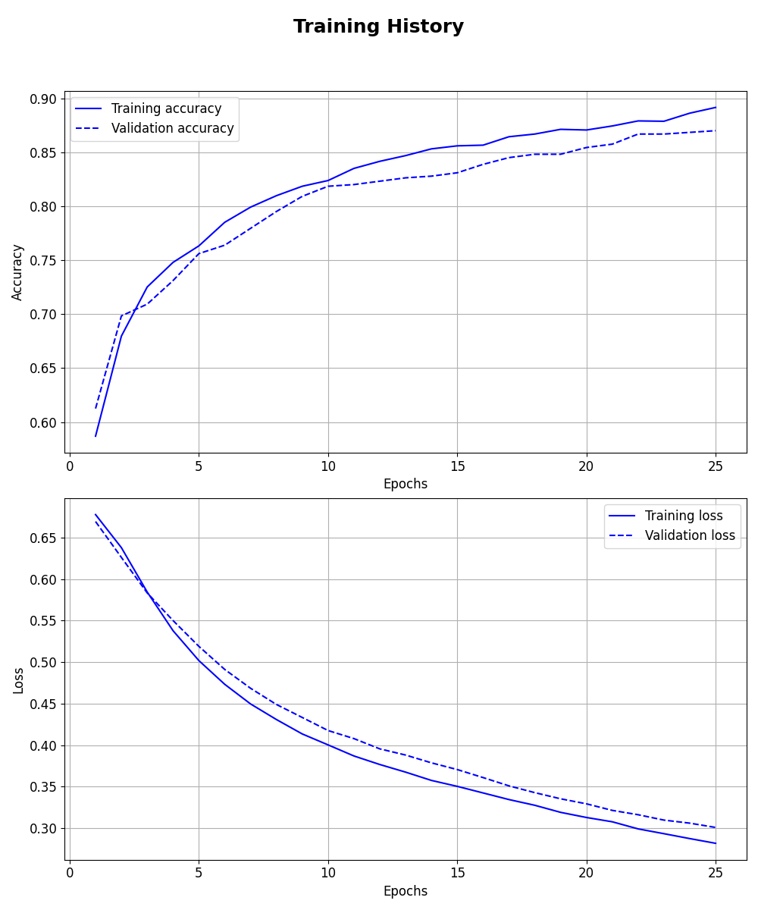

### Detailed Report of Test Set:

|              | precision    | recall       | f1-score     | support      |
| ------------ | ------------ | ------------ | ------------ | ------------ |
| chihuahua    | 0.8719       | 0.8847       | 0.8783       | 477          | 
| muffin       | 0.8655       | 0.8510       | 0.8582       | 416          | 
| micro avg    | 0.8690       | 0.8690       | 0.8690       | 893          | 
| macro avg    | 0.8687       | 0.8678       | 0.8682       | 893          | 
| weighted avg | 0.8689       | 0.8690       | 0.8689       | 893          | 
| samples avg  | 0.8690       | 0.8690       | 0.8690       | 893          | 

## trial_57

*    *Start Time*: 2024-10-20 12:05:42

*    *Duration*: 33.248

*    *Directory*: [Link](./trial_57)

### Hyperparameters:

| Hyperparameter        | Value                 |
| --------------------- | --------------------- |
| units1                | 128                   |
| kernel_size1          | 3                     |
| units2                | 64                    |
| kernel_size2          | 7                     |
| dense_units           | 256                   |
| dropout_rate          | 0.07726906680264775   |
| learning_rate         | 6.242110191760458e-05 |

### Evaluation Metrics:

|           | train     | val       | test      |
| --------- | --------- | --------- | --------- |
| accuracy  | 0.9084    | 0.8813    | 0.8690    | 
| precision | 0.9084    | 0.8813    | 0.8690    | 
| recall    | 0.9084    | 0.8813    | 0.8690    | 
| f1        | 0.9084    | 0.8812    | 0.8690    | 

### Figures:

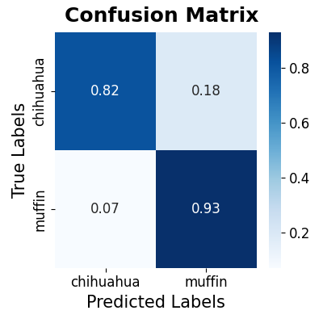

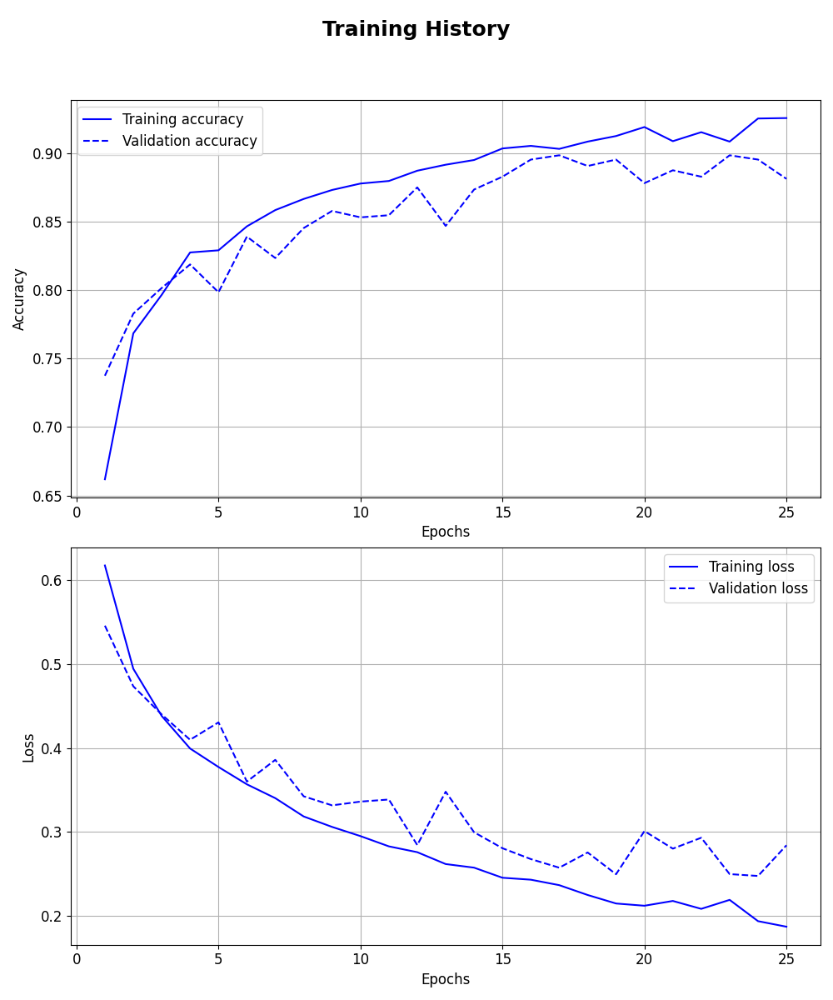

### Detailed Report of Test Set:

|              | precision    | recall       | f1-score     | support      |
| ------------ | ------------ | ------------ | ------------ | ------------ |
| chihuahua    | 0.9306       | 0.8155       | 0.8693       | 477          | 
| muffin       | 0.8147       | 0.9303       | 0.8687       | 416          | 
| micro avg    | 0.8690       | 0.8690       | 0.8690       | 893          | 
| macro avg    | 0.8727       | 0.8729       | 0.8690       | 893          | 
| weighted avg | 0.8766       | 0.8690       | 0.8690       | 893          | 
| samples avg  | 0.8690       | 0.8690       | 0.8690       | 893          | 

## trial_8

*    *Start Time*: 2024-10-20 11:41:56

*    *Duration*: 29.385

*    *Directory*: [Link](./trial_8)

### Hyperparameters:

| Hyperparameter         | Value                  |
| ---------------------- | ---------------------- |
| units1                 | 128                    |
| kernel_size1           | 5                      |
| units2                 | 64                     |
| kernel_size2           | 3                      |
| dense_units            | 256                    |
| dropout_rate           | 0.10948281219395428    |
| learning_rate          | 0.00020019484108021215 |

### Evaluation Metrics:

|           | train     | val       | test      |
| --------- | --------- | --------- | --------- |
| accuracy  | 0.9597    | 0.8656    | 0.8667    | 
| precision | 0.9597    | 0.8656    | 0.8667    | 
| recall    | 0.9597    | 0.8656    | 0.8667    | 
| f1        | 0.9597    | 0.8656    | 0.8667    | 

### Figures:

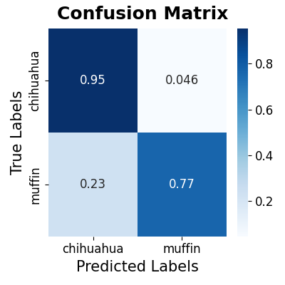

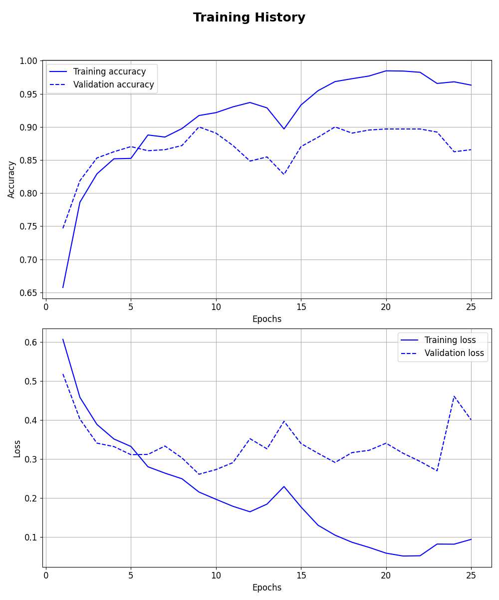

### Detailed Report of Test Set:

|              | precision    | recall       | f1-score     | support      |
| ------------ | ------------ | ------------ | ------------ | ------------ |
| chihuahua    | 0.8243       | 0.9539       | 0.8844       | 477          | 
| muffin       | 0.9355       | 0.7668       | 0.8428       | 416          | 
| micro avg    | 0.8667       | 0.8667       | 0.8667       | 893          | 
| macro avg    | 0.8799       | 0.8604       | 0.8636       | 893          | 
| weighted avg | 0.8761       | 0.8667       | 0.8650       | 893          | 
| samples avg  | 0.8667       | 0.8667       | 0.8667       | 893          | 

## trial_5

*    *Start Time*: 2024-10-20 11:40:16

*    *Duration*: 35.915

*    *Directory*: [Link](./trial_5)

### Hyperparameters:

| Hyperparameter         | Value                  |
| ---------------------- | ---------------------- |
| units1                 | 128                    |
| kernel_size1           | 7                      |
| units2                 | 64                     |
| kernel_size2           | 5                      |
| dense_units            | 256                    |
| dropout_rate           | 0.2760994721061053     |
| learning_rate          | 0.00018135107347751143 |

### Evaluation Metrics:

|           | train     | val       | test      |
| --------- | --------- | --------- | --------- |
| accuracy  | 0.9559    | 0.8766    | 0.8634    | 
| precision | 0.9559    | 0.8766    | 0.8634    | 
| recall    | 0.9559    | 0.8766    | 0.8634    | 
| f1        | 0.9559    | 0.8766    | 0.8634    | 

### Figures:

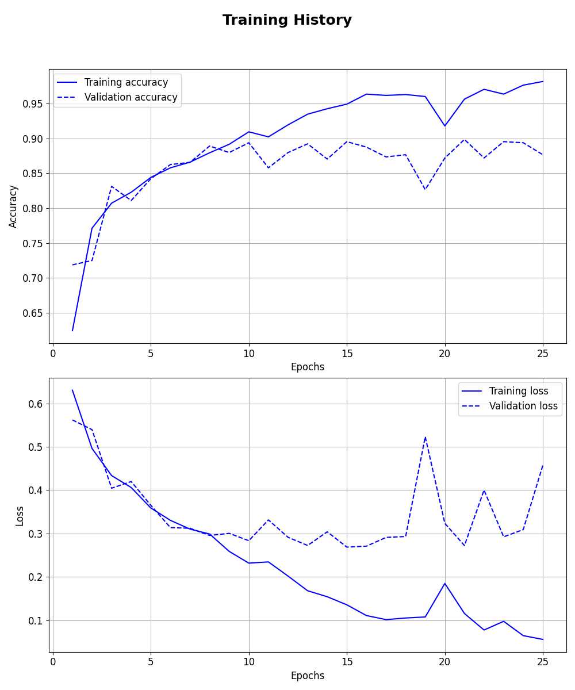

### Detailed Report of Test Set:

|              | precision    | recall       | f1-score     | support      |
| ------------ | ------------ | ------------ | ------------ | ------------ |
| chihuahua    | 0.8076       | 0.9769       | 0.8843       | 477          | 
| muffin       | 0.9652       | 0.7332       | 0.8333       | 416          | 
| micro avg    | 0.8634       | 0.8634       | 0.8634       | 893          | 
| macro avg    | 0.8864       | 0.8551       | 0.8588       | 893          | 
| weighted avg | 0.8810       | 0.8634       | 0.8605       | 893          | 
| samples avg  | 0.8634       | 0.8634       | 0.8634       | 893          | 

## trial_65

*    *Start Time*: 2024-10-20 12:10:03

*    *Duration*: 29.140

*    *Directory*: [Link](./trial_65)

### Hyperparameters:

| Hyperparameter         | Value                  |
| ---------------------- | ---------------------- |
| units1                 | 128                    |
| kernel_size1           | 3                      |
| units2                 | 32                     |
| kernel_size2           | 5                      |
| dense_units            | 128                    |
| dropout_rate           | 0.15819561694140055    |
| learning_rate          | 0.00011011998450543897 |

### Evaluation Metrics:

|           | train     | val       | test      |
| --------- | --------- | --------- | --------- |
| accuracy  | 0.8928    | 0.8781    | 0.8634    | 
| precision | 0.8928    | 0.8781    | 0.8634    | 
| recall    | 0.8928    | 0.8781    | 0.8634    | 
| f1        | 0.8928    | 0.8781    | 0.8634    | 

### Figures:

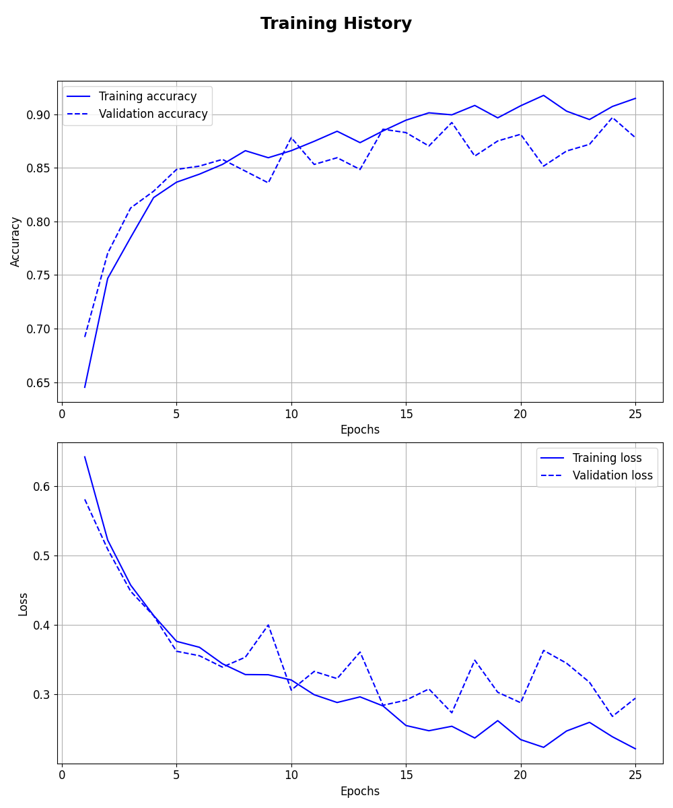

### Detailed Report of Test Set:

|              | precision    | recall       | f1-score     | support      |
| ------------ | ------------ | ------------ | ------------ | ------------ |
| chihuahua    | 0.9257       | 0.8092       | 0.8635       | 477          | 
| muffin       | 0.8088       | 0.9255       | 0.8632       | 416          | 
| micro avg    | 0.8634       | 0.8634       | 0.8634       | 893          | 
| macro avg    | 0.8672       | 0.8674       | 0.8634       | 893          | 
| weighted avg | 0.8712       | 0.8634       | 0.8634       | 893          | 
| samples avg  | 0.8634       | 0.8634       | 0.8634       | 893          | 

## trial_81

*    *Start Time*: 2024-10-20 12:18:05

*    *Duration*: 40.751

*    *Directory*: [Link](./trial_81)

### Hyperparameters:

| Hyperparameter        | Value                 |
| --------------------- | --------------------- |
| units1                | 128                   |
| kernel_size1          | 7                     |
| units2                | 64                    |
| kernel_size2          | 7                     |
| dense_units           | 256                   |
| dropout_rate          | 0.2502323196936779    |
| learning_rate         | 0.0009492963000108242 |

### Evaluation Metrics:

|           | train     | val       | test      |
| --------- | --------- | --------- | --------- |
| accuracy  | 0.9875    | 0.8391    | 0.8634    | 
| precision | 0.9875    | 0.8391    | 0.8634    | 
| recall    | 0.9875    | 0.8391    | 0.8634    | 
| f1        | 0.9875    | 0.8391    | 0.8634    | 

### Figures:

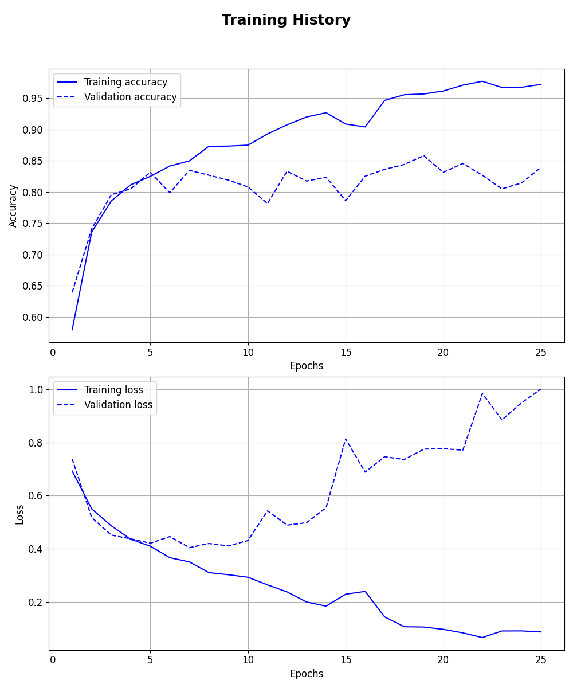

### Detailed Report of Test Set:

|              | precision    | recall       | f1-score     | support      |
| ------------ | ------------ | ------------ | ------------ | ------------ |
| chihuahua    | 0.8675       | 0.8784       | 0.8729       | 477          | 
| muffin       | 0.8585       | 0.8462       | 0.8523       | 416          | 
| micro avg    | 0.8634       | 0.8634       | 0.8634       | 893          | 
| macro avg    | 0.8630       | 0.8623       | 0.8626       | 893          | 
| weighted avg | 0.8633       | 0.8634       | 0.8633       | 893          | 
| samples avg  | 0.8634       | 0.8634       | 0.8634       | 893          | 

## trial_22

*    *Start Time*: 2024-10-20 11:47:30

*    *Duration*: 23.088

*    *Directory*: [Link](./trial_22)

### Hyperparameters:

| Hyperparameter         | Value                  |
| ---------------------- | ---------------------- |
| units1                 | 128                    |
| kernel_size1           | 3                      |
| units2                 | 32                     |
| kernel_size2           | 3                      |
| dense_units            | 256                    |
| dropout_rate           | 0.014798162213735089   |
| learning_rate          | 1.9809353557066022e-05 |

### Evaluation Metrics:

|           | train     | val       | test      |
| --------- | --------- | --------- | --------- |
| accuracy  | 0.8772    | 0.8687    | 0.8611    | 
| precision | 0.8772    | 0.8687    | 0.8611    | 
| recall    | 0.8772    | 0.8687    | 0.8611    | 
| f1        | 0.8772    | 0.8687    | 0.8611    | 

### Figures:

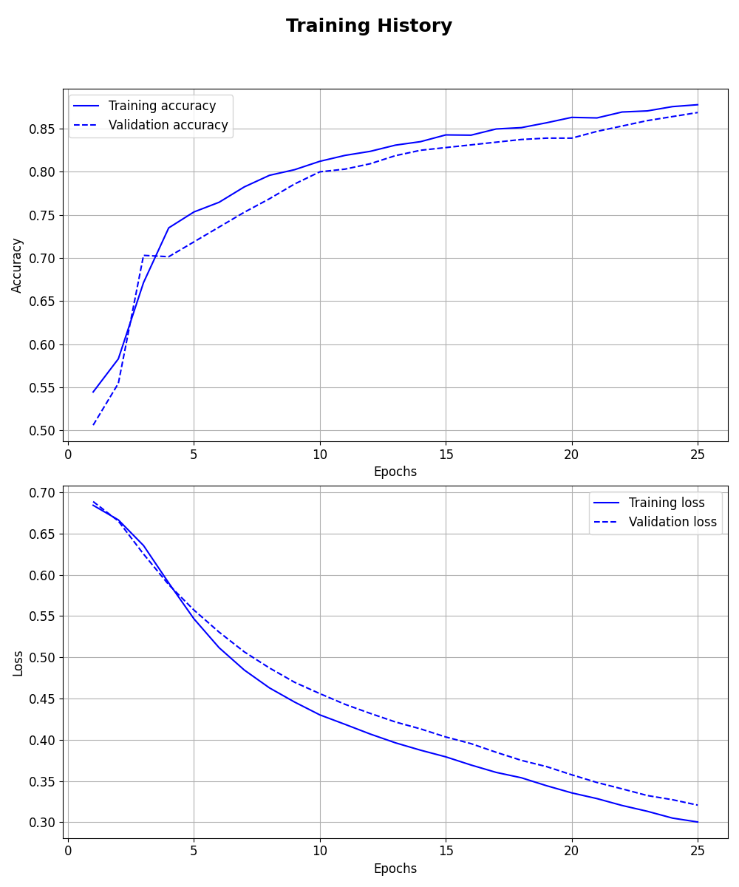

### Detailed Report of Test Set:

|              | precision    | recall       | f1-score     | support      |
| ------------ | ------------ | ------------ | ------------ | ------------ |
| chihuahua    | 0.8580       | 0.8868       | 0.8722       | 477          | 
| muffin       | 0.8650       | 0.8317       | 0.8480       | 416          | 
| micro avg    | 0.8611       | 0.8611       | 0.8611       | 893          | 
| macro avg    | 0.8615       | 0.8593       | 0.8601       | 893          | 
| weighted avg | 0.8613       | 0.8611       | 0.8609       | 893          | 
| samples avg  | 0.8611       | 0.8611       | 0.8611       | 893          | 

## trial_91

*    *Start Time*: 2024-10-20 12:23:45

*    *Duration*: 33.285

*    *Directory*: [Link](./trial_91)

### Hyperparameters:

| Hyperparameter        | Value                 |
| --------------------- | --------------------- |
| units1                | 128                   |
| kernel_size1          | 3                     |
| units2                | 64                    |
| kernel_size2          | 7                     |
| dense_units           | 256                   |
| dropout_rate          | 0.06368166584210488   |
| learning_rate         | 7.019192367553769e-05 |

### Evaluation Metrics:

|           | train     | val       | test      |
| --------- | --------- | --------- | --------- |
| accuracy  | 0.9237    | 0.8562    | 0.8611    | 
| precision | 0.9237    | 0.8562    | 0.8611    | 
| recall    | 0.9237    | 0.8562    | 0.8611    | 
| f1        | 0.9237    | 0.8562    | 0.8611    | 

### Figures:

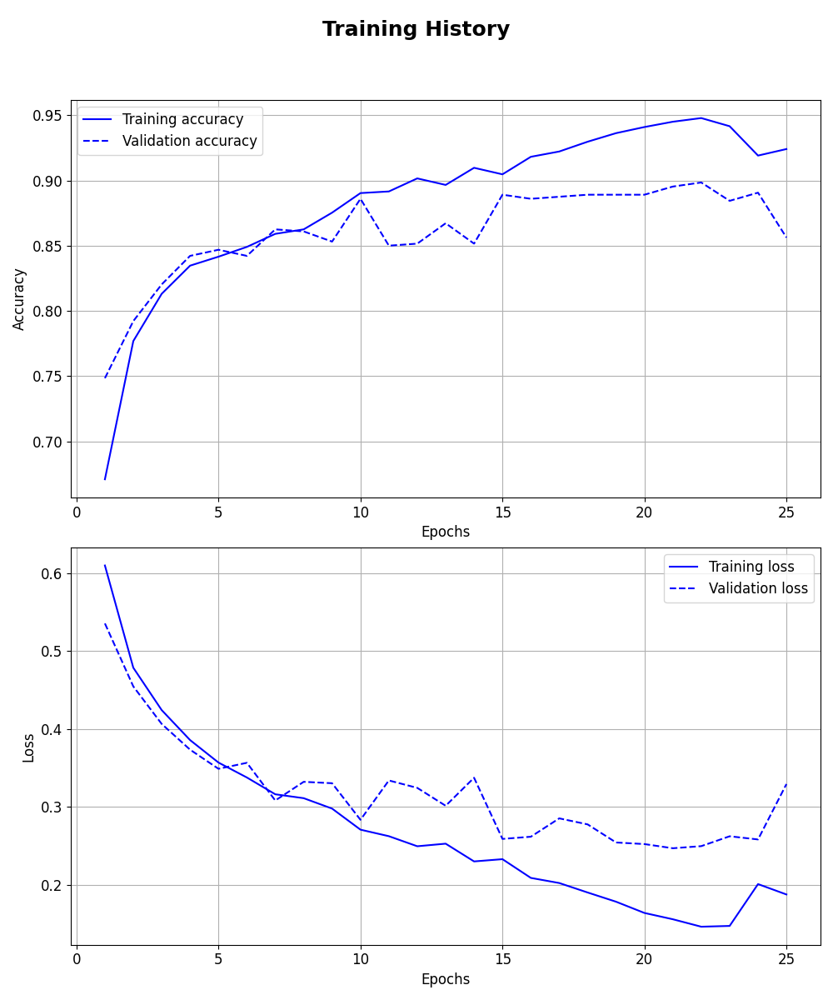

### Detailed Report of Test Set:

|              | precision    | recall       | f1-score     | support      |
| ------------ | ------------ | ------------ | ------------ | ------------ |
| chihuahua    | 0.8091       | 0.9686       | 0.8817       | 477          | 
| muffin       | 0.9534       | 0.7380       | 0.8320       | 416          | 
| micro avg    | 0.8611       | 0.8611       | 0.8611       | 893          | 
| macro avg    | 0.8813       | 0.8533       | 0.8568       | 893          | 
| weighted avg | 0.8763       | 0.8611       | 0.8585       | 893          | 
| samples avg  | 0.8611       | 0.8611       | 0.8611       | 893          | 

## trial_2

*    *Start Time*: 2024-10-20 11:38:38

*    *Duration*: 36.979

*    *Directory*: [Link](./trial_2)

### Hyperparameters:

| Hyperparameter        | Value                 |
| --------------------- | --------------------- |
| units1                | 128                   |
| kernel_size1          | 7                     |
| units2                | 16                    |
| kernel_size2          | 7                     |
| dense_units           | 512                   |
| dropout_rate          | 0.18092229453422404   |
| learning_rate         | 3.026831279306953e-05 |

### Evaluation Metrics:

|           | train     | val       | test      |
| --------- | --------- | --------- | --------- |
| accuracy  | 0.8778    | 0.8562    | 0.8600    | 
| precision | 0.8778    | 0.8562    | 0.8600    | 
| recall    | 0.8778    | 0.8562    | 0.8600    | 
| f1        | 0.8778    | 0.8562    | 0.8600    | 

### Figures:

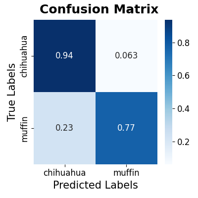

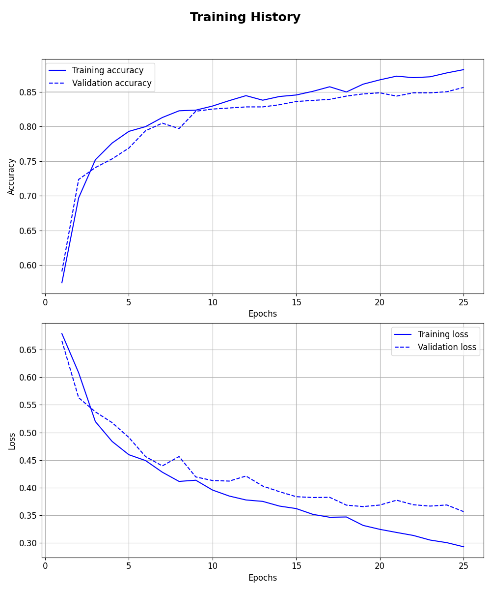

### Detailed Report of Test Set:

|              | precision    | recall       | f1-score     | support      |
| ------------ | ------------ | ------------ | ------------ | ------------ |
| chihuahua    | 0.8247       | 0.9371       | 0.8773       | 477          | 
| muffin       | 0.9145       | 0.7716       | 0.8370       | 416          | 
| micro avg    | 0.8600       | 0.8600       | 0.8600       | 893          | 
| macro avg    | 0.8696       | 0.8544       | 0.8572       | 893          | 
| weighted avg | 0.8666       | 0.8600       | 0.8586       | 893          | 
| samples avg  | 0.8600       | 0.8600       | 0.8600       | 893          | 

## trial_21

*    *Start Time*: 2024-10-20 11:47:04

*    *Duration*: 25.170

*    *Directory*: [Link](./trial_21)

### Hyperparameters:

| Hyperparameter         | Value                  |
| ---------------------- | ---------------------- |
| units1                 | 128                    |
| kernel_size1           | 3                      |
| units2                 | 64                     |
| kernel_size2           | 3                      |
| dense_units            | 256                    |
| dropout_rate           | 0.23707336375983296    |
| learning_rate          | 1.0037508081534541e-05 |

### Evaluation Metrics:

|           | train     | val       | test      |
| --------- | --------- | --------- | --------- |
| accuracy  | 0.8631    | 0.8469    | 0.8511    | 
| precision | 0.8631    | 0.8469    | 0.8511    | 
| recall    | 0.8631    | 0.8469    | 0.8511    | 
| f1        | 0.8631    | 0.8469    | 0.8511    | 

### Figures:

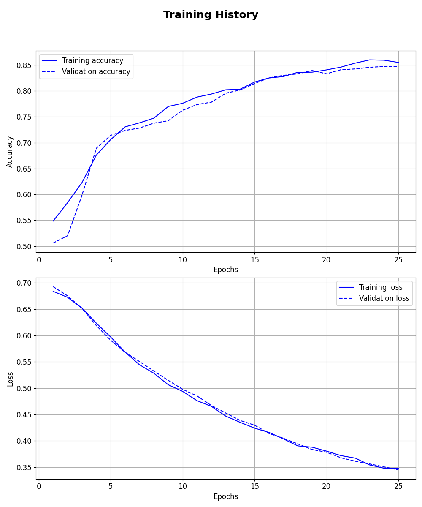

### Detailed Report of Test Set:

|              | precision    | recall       | f1-score     | support      |
| ------------ | ------------ | ------------ | ------------ | ------------ |
| chihuahua    | 0.8440       | 0.8847       | 0.8639       | 477          | 
| muffin       | 0.8601       | 0.8125       | 0.8356       | 416          | 
| micro avg    | 0.8511       | 0.8511       | 0.8511       | 893          | 
| macro avg    | 0.8520       | 0.8486       | 0.8497       | 893          | 
| weighted avg | 0.8515       | 0.8511       | 0.8507       | 893          | 
| samples avg  | 0.8511       | 0.8511       | 0.8511       | 893          | 

## trial_45

*    *Start Time*: 2024-10-20 11:58:45

*    *Duration*: 32.949

*    *Directory*: [Link](./trial_45)

### Hyperparameters:

| Hyperparameter        | Value                 |
| --------------------- | --------------------- |
| units1                | 128                   |
| kernel_size1          | 3                     |
| units2                | 64                    |
| kernel_size2          | 7                     |
| dense_units           | 128                   |
| dropout_rate          | 0.18650058669267355   |
| learning_rate         | 9.305579567950038e-05 |

### Evaluation Metrics:

|           | train     | val       | test      |
| --------- | --------- | --------- | --------- |
| accuracy  | 0.8741    | 0.8562    | 0.8499    | 
| precision | 0.8741    | 0.8562    | 0.8499    | 
| recall    | 0.8741    | 0.8562    | 0.8499    | 
| f1        | 0.8741    | 0.8562    | 0.8499    | 

### Figures:

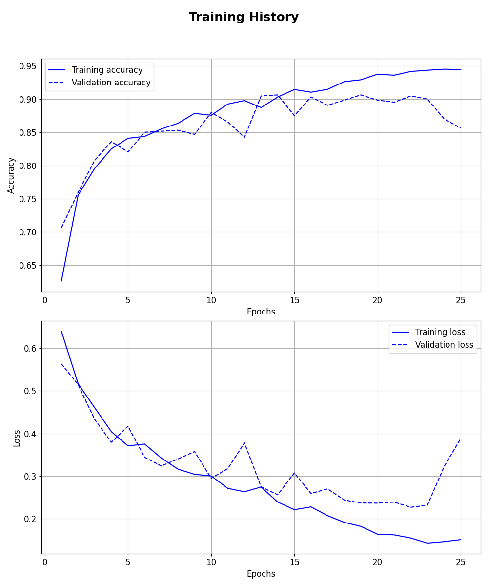

### Detailed Report of Test Set:

|              | precision    | recall       | f1-score     | support      |
| ------------ | ------------ | ------------ | ------------ | ------------ |
| chihuahua    | 0.9598       | 0.7505       | 0.8424       | 477          | 
| muffin       | 0.7712       | 0.9639       | 0.8568       | 416          | 
| micro avg    | 0.8499       | 0.8499       | 0.8499       | 893          | 
| macro avg    | 0.8655       | 0.8572       | 0.8496       | 893          | 
| weighted avg | 0.8719       | 0.8499       | 0.8491       | 893          | 
| samples avg  | 0.8499       | 0.8499       | 0.8499       | 893          | 

## trial_14

*    *Start Time*: 2024-10-20 11:44:22

*    *Duration*: 18.956

*    *Directory*: [Link](./trial_14)

### Hyperparameters:

| Hyperparameter         | Value                  |
| ---------------------- | ---------------------- |
| units1                 | 64                     |
| kernel_size1           | 5                      |
| units2                 | 16                     |
| kernel_size2           | 5                      |
| dense_units            | 512                    |
| dropout_rate           | 0.39398113914126903    |
| learning_rate          | 1.4468742936443877e-05 |

### Evaluation Metrics:

|           | train     | val       | test      |
| --------- | --------- | --------- | --------- |
| accuracy  | 0.8497    | 0.8313    | 0.8466    | 
| precision | 0.8497    | 0.8313    | 0.8466    | 
| recall    | 0.8497    | 0.8313    | 0.8466    | 
| f1        | 0.8497    | 0.8312    | 0.8466    | 

### Figures:

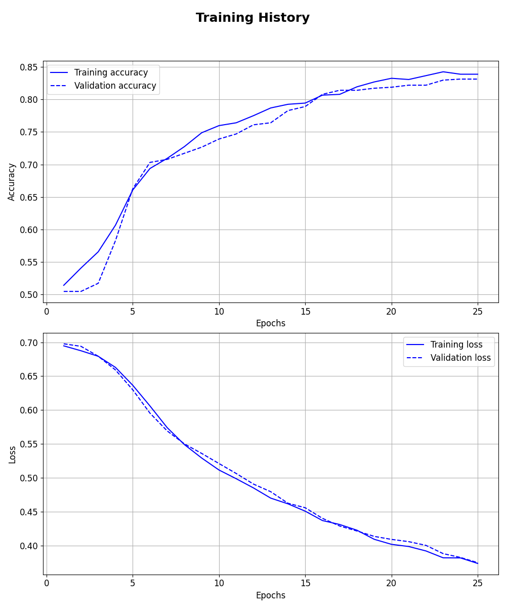

### Detailed Report of Test Set:

|              | precision    | recall       | f1-score     | support      |
| ------------ | ------------ | ------------ | ------------ | ------------ |
| chihuahua    | 0.8617       | 0.8491       | 0.8553       | 477          | 
| muffin       | 0.8298       | 0.8438       | 0.8367       | 416          | 
| micro avg    | 0.8466       | 0.8466       | 0.8466       | 893          | 
| macro avg    | 0.8457       | 0.8464       | 0.8460       | 893          | 
| weighted avg | 0.8468       | 0.8466       | 0.8467       | 893          | 
| samples avg  | 0.8466       | 0.8466       | 0.8466       | 893          | 

## trial_1

*    *Start Time*: 2024-10-20 11:37:59

*    *Duration*: 38.794

*    *Directory*: [Link](./trial_1)

### Hyperparameters:

| Hyperparameter         | Value                  |
| ---------------------- | ---------------------- |
| units1                 | 128                    |
| kernel_size1           | 3                      |
| units2                 | 64                     |
| kernel_size2           | 5                      |
| dense_units            | 512                    |
| dropout_rate           | 0.06702517200773794    |
| learning_rate          | 0.00010873702183533947 |

### Evaluation Metrics:

|           | train     | val       | test      |
| --------- | --------- | --------- | --------- |
| accuracy  | 0.8938    | 0.8250    | 0.8309    | 
| precision | 0.8938    | 0.8250    | 0.8309    | 
| recall    | 0.8938    | 0.8250    | 0.8309    | 
| f1        | 0.8937    | 0.8250    | 0.8309    | 

### Figures:

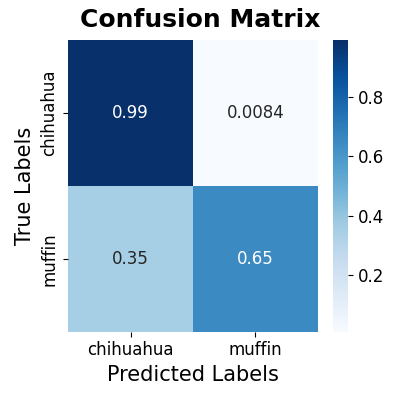

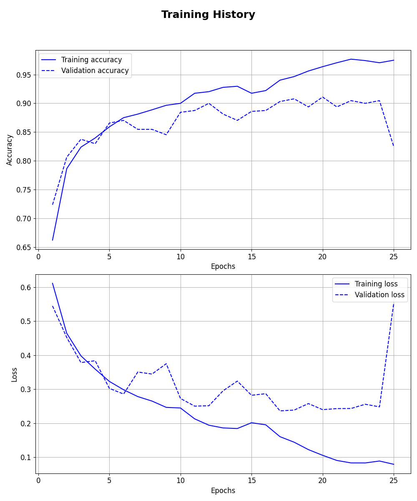

### Detailed Report of Test Set:

|              | precision    | recall       | f1-score     | support      |
| ------------ | ------------ | ------------ | ------------ | ------------ |
| chihuahua    | 0.7629       | 0.9916       | 0.8624       | 477          | 
| muffin       | 0.9853       | 0.6466       | 0.7808       | 416          | 
| micro avg    | 0.8309       | 0.8309       | 0.8309       | 893          | 
| macro avg    | 0.8741       | 0.8191       | 0.8216       | 893          | 
| weighted avg | 0.8665       | 0.8309       | 0.8244       | 893          | 
| samples avg  | 0.8309       | 0.8309       | 0.8309       | 893          | 

## trial_95

*    *Start Time*: 2024-10-20 12:25:51

*    *Duration*: 32.858

*    *Directory*: [Link](./trial_95)

### Hyperparameters:

| Hyperparameter        | Value                 |
| --------------------- | --------------------- |
| units1                | 128                   |
| kernel_size1          | 3                     |
| units2                | 64                    |
| kernel_size2          | 7                     |
| dense_units           | 128                   |
| dropout_rate          | 0.20363599649449604   |
| learning_rate         | 7.714962942593432e-05 |

### Evaluation Metrics:

|           | train     | val       | test      |
| --------- | --------- | --------- | --------- |
| accuracy  | 0.8844    | 0.8344    | 0.8275    | 
| precision | 0.8844    | 0.8344    | 0.8275    | 
| recall    | 0.8844    | 0.8344    | 0.8275    | 
| f1        | 0.8844    | 0.8344    | 0.8275    | 

### Figures:

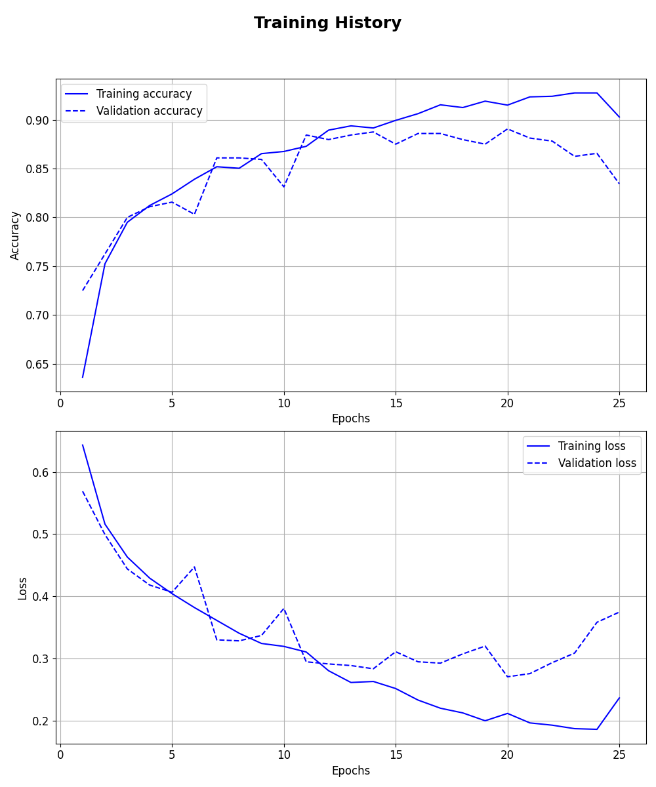

### Detailed Report of Test Set:

|              | precision    | recall       | f1-score     | support      |
| ------------ | ------------ | ------------ | ------------ | ------------ |
| chihuahua    | 0.7652       | 0.9769       | 0.8582       | 477          | 
| muffin       | 0.9613       | 0.6562       | 0.7800       | 416          | 
| micro avg    | 0.8275       | 0.8275       | 0.8275       | 893          | 
| macro avg    | 0.8632       | 0.8166       | 0.8191       | 893          | 
| weighted avg | 0.8565       | 0.8275       | 0.8218       | 893          | 
| samples avg  | 0.8275       | 0.8275       | 0.8275       | 893          | 

## trial_11

*    *Start Time*: 2024-10-20 11:43:18

*    *Duration*: 24.068

*    *Directory*: [Link](./trial_11)

### Hyperparameters:

| Hyperparameter         | Value                  |
| ---------------------- | ---------------------- |
| units1                 | 64                     |
| kernel_size1           | 5                      |
| units2                 | 32                     |
| kernel_size2           | 7                      |
| dense_units            | 128                    |
| dropout_rate           | 0.48517788342021034    |
| learning_rate          | 1.0107733227152883e-05 |

### Evaluation Metrics:

|           | train     | val       | test      |
| --------- | --------- | --------- | --------- |
| accuracy  | 0.8197    | 0.7937    | 0.8052    | 
| precision | 0.8197    | 0.7937    | 0.8052    | 
| recall    | 0.8197    | 0.7937    | 0.8052    | 
| f1        | 0.8197    | 0.7937    | 0.8052    | 

### Figures:

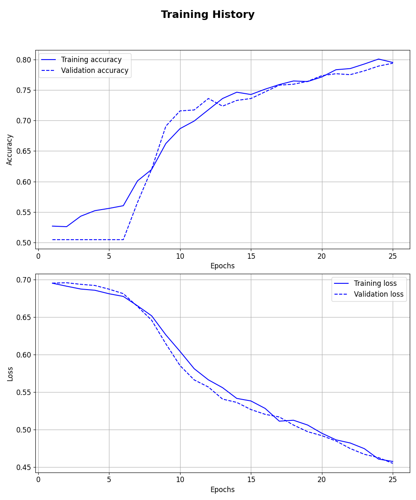

### Detailed Report of Test Set:

|              | precision    | recall       | f1-score     | support      |
| ------------ | ------------ | ------------ | ------------ | ------------ |
| chihuahua    | 0.8137       | 0.8239       | 0.8187       | 477          | 
| muffin       | 0.7951       | 0.7837       | 0.7893       | 416          | 
| micro avg    | 0.8052       | 0.8052       | 0.8052       | 893          | 
| macro avg    | 0.8044       | 0.8038       | 0.8040       | 893          | 
| weighted avg | 0.8050       | 0.8052       | 0.8051       | 893          | 
| samples avg  | 0.8052       | 0.8052       | 0.8052       | 893          | 

