# Experiment Report: Chihuahua vs Muffin Test Experiment

## Metadata

*    *Description*: In this experiment, the best model from the previous experiment is trained with different preprocessing configurations.

*    *Start Time*: 2024-10-26 18:55:26

*    *Last Resume Time*: 2024-10-27 10:27:23

*    *Total Duration*: 8:53:20

*    *Directory*: [Link](./.)

## Initial Visualizations

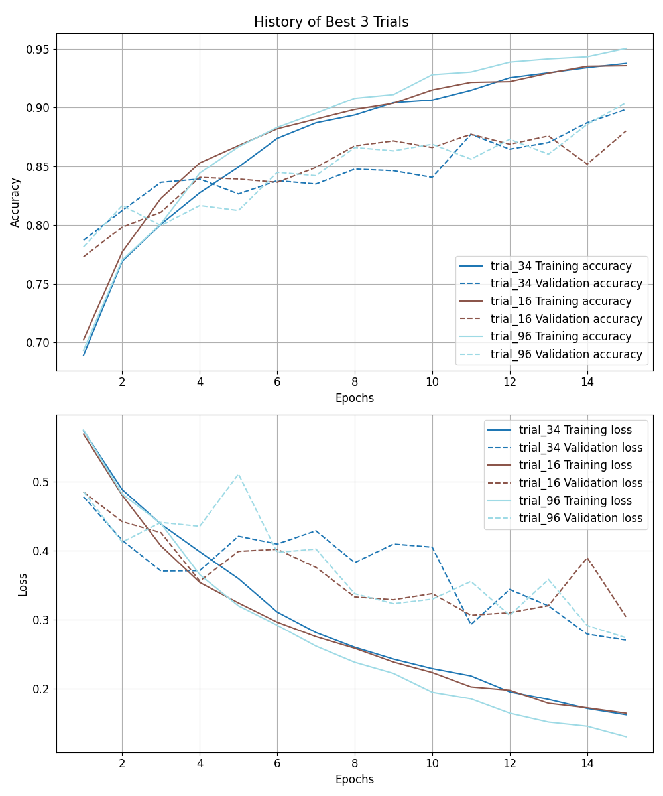

## Summary

### Hyperparameters

|               | normalization | batch_size    | learning_rate | Chapters      |
| ------------- | ------------- | ------------- | ------------- | ------------- |
| trial_34      | standard      | 128           | 5.9402e-05    | [Chapter](#trial_34) | 
| trial_16      | standard      | 128           | 5.2082e-05    | [Chapter](#trial_16) | 
| trial_96      | standard      | 128           | 6.8562e-05    | [Chapter](#trial_96) | 
| trial_15      | standard      | 128           | 8.9743e-05    | [Chapter](#trial_15) | 
| trial_62      | standard      | 128           | 5.0240e-05    | [Chapter](#trial_62) | 
| trial_86      | standard      | 128           | 6.6332e-05    | [Chapter](#trial_86) | 
| trial_95      | standard      | 128           | 5.9956e-05    | [Chapter](#trial_95) | 
| trial_30      | mean          | 128           | 1.3620e-04    | [Chapter](#trial_30) | 
| trial_38      | min_max       | 16            | 2.0473e-04    | [Chapter](#trial_38) | 
| trial_60      | standard      | 256           | 7.5177e-05    | [Chapter](#trial_60) | 
| trial_43      | standard      | 128           | 6.3491e-05    | [Chapter](#trial_43) | 
| trial_28      | standard      | 128           | 8.3217e-05    | [Chapter](#trial_28) | 
| trial_58      | standard      | 128           | 7.2287e-05    | [Chapter](#trial_58) | 
| trial_100     | standard      | 128           | 5.5781e-05    | [Chapter](#trial_100) | 
| trial_44      | standard      | 128           | 6.6010e-05    | [Chapter](#trial_44) | 
| trial_18      | standard      | 128           | 7.3799e-05    | [Chapter](#trial_18) | 
| trial_66      | standard      | 128           | 6.9501e-05    | [Chapter](#trial_66) | 
| trial_74      | standard      | 128           | 6.0203e-05    | [Chapter](#trial_74) | 
| trial_3       | standard      | 128           | 5.0301e-05    | [Chapter](#trial_3) | 
| trial_50      | standard      | 128           | 8.8940e-05    | [Chapter](#trial_50) | 
| trial_21      | standard      | 128           | 1.3471e-04    | [Chapter](#trial_21) | 
| trial_56      | standard      | 128           | 5.4142e-05    | [Chapter](#trial_56) | 
| trial_76      | standard      | 128           | 5.2646e-05    | [Chapter](#trial_76) | 
| trial_12      | standard      | 128           | 5.9266e-05    | [Chapter](#trial_12) | 
| trial_73      | standard      | 128           | 6.6865e-05    | [Chapter](#trial_73) | 
| trial_94      | standard      | 256           | 1.9008e-04    | [Chapter](#trial_94) | 
| trial_75      | standard      | 128           | 6.3332e-05    | [Chapter](#trial_75) | 
| trial_9       | min_max       | 64            | 8.2709e-05    | [Chapter](#trial_9) | 
| trial_69      | standard      | 128           | 8.4142e-05    | [Chapter](#trial_69) | 
| trial_40      | standard      | 64            | 3.2844e-04    | [Chapter](#trial_40) | 
| trial_52      | standard      | 128           | 5.7495e-05    | [Chapter](#trial_52) | 
| trial_22      | standard      | 128           | 5.1957e-05    | [Chapter](#trial_22) | 
| trial_24      | standard      | 128           | 6.0380e-05    | [Chapter](#trial_24) | 
| trial_48      | min_max       | 64            | 5.4806e-05    | [Chapter](#trial_48) | 
| trial_2       | standard      | 128           | 8.0317e-05    | [Chapter](#trial_2) | 
| trial_46      | standard      | 128           | 6.4197e-05    | [Chapter](#trial_46) | 
| trial_53      | standard      | 128           | 7.2546e-05    | [Chapter](#trial_53) | 
| trial_72      | standard      | 64            | 7.9461e-05    | [Chapter](#trial_72) | 
| trial_10      | min_max       | 32            | 4.1427e-04    | [Chapter](#trial_10) | 
| trial_36      | standard      | 64            | 9.3953e-05    | [Chapter](#trial_36) | 
| trial_47      | standard      | 256           | 2.5305e-04    | [Chapter](#trial_47) | 
| trial_39      | mean          | 128           | 6.9407e-05    | [Chapter](#trial_39) | 
| trial_5       | standard      | 128           | 5.5019e-05    | [Chapter](#trial_5) | 
| trial_54      | standard      | 128           | 5.1393e-05    | [Chapter](#trial_54) | 
| trial_1       | standard      | 128           | 6.0041e-05    | [Chapter](#trial_1) | 
| trial_68      | standard      | 128           | 5.3554e-05    | [Chapter](#trial_68) | 
| trial_77      | standard      | 128           | 5.3031e-05    | [Chapter](#trial_77) | 
| trial_41      | min_max       | 128           | 8.3702e-05    | [Chapter](#trial_41) | 
| trial_85      | standard      | 128           | 6.1145e-05    | [Chapter](#trial_85) | 
| trial_14      | min_max       | 64            | 1.0043e-04    | [Chapter](#trial_14) | 
| trial_84      | min_max       | 128           | 9.4475e-05    | [Chapter](#trial_84) | 
| trial_87      | standard      | 128           | 6.6675e-05    | [Chapter](#trial_87) | 
| trial_92      | standard      | 128           | 5.2591e-05    | [Chapter](#trial_92) | 
| trial_93      | mean          | 128           | 8.0891e-05    | [Chapter](#trial_93) | 
| trial_42      | standard      | 128           | 5.6015e-05    | [Chapter](#trial_42) | 
| trial_51      | mean          | 128           | 6.3094e-05    | [Chapter](#trial_51) | 
| trial_59      | standard      | 128           | 8.9090e-05    | [Chapter](#trial_59) | 
| trial_71      | min_max       | 128           | 5.7325e-05    | [Chapter](#trial_71) | 
| trial_31      | standard      | 128           | 1.1000e-04    | [Chapter](#trial_31) | 
| trial_57      | standard      | 128           | 6.2820e-05    | [Chapter](#trial_57) | 
| trial_70      | standard      | 128           | 7.2475e-05    | [Chapter](#trial_70) | 
| trial_89      | standard      | 128           | 7.4472e-05    | [Chapter](#trial_89) | 
| trial_32      | standard      | 128           | 6.7188e-05    | [Chapter](#trial_32) | 
| trial_27      | standard      | 256           | 1.1298e-04    | [Chapter](#trial_27) | 
| trial_63      | mean          | 128           | 5.0116e-05    | [Chapter](#trial_63) | 
| trial_67      | standard      | 128           | 6.3909e-05    | [Chapter](#trial_67) | 
| trial_26      | mean          | 128           | 5.9795e-05    | [Chapter](#trial_26) | 
| trial_78      | standard      | 256           | 5.0103e-05    | [Chapter](#trial_78) | 
| trial_7       | standard      | 128           | 7.1020e-05    | [Chapter](#trial_7) | 
| trial_91      | standard      | 256           | 6.4849e-05    | [Chapter](#trial_91) | 
| trial_65      | standard      | 128           | 5.8423e-05    | [Chapter](#trial_65) | 
| trial_98      | standard      | 128           | 6.8831e-05    | [Chapter](#trial_98) | 
| trial_35      | mean          | 128           | 4.8767e-04    | [Chapter](#trial_35) | 
| trial_79      | mean          | 128           | 5.5929e-05    | [Chapter](#trial_79) | 
| trial_80      | standard      | 128           | 5.8828e-05    | [Chapter](#trial_80) | 
| trial_88      | standard      | 128           | 7.0585e-05    | [Chapter](#trial_88) | 
| trial_99      | standard      | 128           | 6.2439e-05    | [Chapter](#trial_99) | 
| trial_29      | standard      | 64            | 8.4544e-05    | [Chapter](#trial_29) | 
| trial_25      | standard      | 128           | 7.4953e-05    | [Chapter](#trial_25) | 
| trial_19      | standard      | 256           | 1.2388e-04    | [Chapter](#trial_19) | 
| trial_13      | standard      | 128           | 9.8194e-05    | [Chapter](#trial_13) | 
| trial_37      | standard      | 256           | 5.7739e-05    | [Chapter](#trial_37) | 
| trial_11      | standard      | 256           | 6.2253e-05    | [Chapter](#trial_11) | 
| trial_81      | standard      | 128           | 5.2786e-05    | [Chapter](#trial_81) | 
| trial_23      | standard      | 128           | 6.8373e-05    | [Chapter](#trial_23) | 
| trial_45      | standard      | 128           | 7.7032e-05    | [Chapter](#trial_45) | 
| trial_82      | standard      | 256           | 1.0772e-04    | [Chapter](#trial_82) | 
| trial_8       | mean          | 32            | 1.6907e-04    | [Chapter](#trial_8) | 
| trial_17      | standard      | 128           | 5.0023e-05    | [Chapter](#trial_17) | 
| trial_55      | standard      | 128           | 6.0590e-05    | [Chapter](#trial_55) | 
| trial_61      | standard      | 128           | 1.5370e-04    | [Chapter](#trial_61) | 
| trial_33      | standard      | 128           | 7.7881e-05    | [Chapter](#trial_33) | 
| trial_4       | standard      | 256           | 5.0343e-05    | [Chapter](#trial_4) | 
| trial_83      | standard      | 128           | 1.2201e-04    | [Chapter](#trial_83) | 
| trial_20      | standard      | 128           | 7.3724e-05    | [Chapter](#trial_20) | 
| trial_6       | min_max       | 128           | 6.6907e-05    | [Chapter](#trial_6) | 
| trial_64      | standard      | 64            | 5.4852e-05    | [Chapter](#trial_64) | 
| trial_97      | standard      | 128           | 7.5768e-05    | [Chapter](#trial_97) | 
| trial_90      | standard      | 128           | 5.7029e-05    | [Chapter](#trial_90) | 
| trial_49      | standard      | 128           | 1.0219e-04    | [Chapter](#trial_49) | 

### Test Results

|           | accuracy  | precision | recall    | f1        | Chapters  |
| --------- | --------- | --------- | --------- | --------- | --------- |
| trial_34  | 0.9072    | 0.9072    | 0.9072    | 0.9072    | [Chapter](#trial_34) | 
| trial_16  | 0.9044    | 0.9044    | 0.9044    | 0.9044    | [Chapter](#trial_16) | 
| trial_96  | 0.9030    | 0.9030    | 0.9030    | 0.9030    | [Chapter](#trial_96) | 
| trial_15  | 0.8987    | 0.8987    | 0.8987    | 0.8987    | [Chapter](#trial_15) | 
| trial_62  | 0.8987    | 0.8987    | 0.8987    | 0.8987    | [Chapter](#trial_62) | 
| trial_86  | 0.8973    | 0.8973    | 0.8973    | 0.8973    | [Chapter](#trial_86) | 
| trial_95  | 0.8973    | 0.8973    | 0.8973    | 0.8973    | [Chapter](#trial_95) | 
| trial_30  | 0.8945    | 0.8945    | 0.8945    | 0.8945    | [Chapter](#trial_30) | 
| trial_38  | 0.8945    | 0.8945    | 0.8945    | 0.8945    | [Chapter](#trial_38) | 
| trial_60  | 0.8945    | 0.8945    | 0.8945    | 0.8945    | [Chapter](#trial_60) | 
| trial_43  | 0.8931    | 0.8931    | 0.8931    | 0.8931    | [Chapter](#trial_43) | 
| trial_28  | 0.8931    | 0.8931    | 0.8931    | 0.8931    | [Chapter](#trial_28) | 
| trial_58  | 0.8931    | 0.8931    | 0.8931    | 0.8931    | [Chapter](#trial_58) | 
| trial_100 | 0.8931    | 0.8931    | 0.8931    | 0.8931    | [Chapter](#trial_100) | 
| trial_44  | 0.8889    | 0.8889    | 0.8889    | 0.8889    | [Chapter](#trial_44) | 
| trial_18  | 0.8889    | 0.8889    | 0.8889    | 0.8889    | [Chapter](#trial_18) | 
| trial_66  | 0.8889    | 0.8889    | 0.8889    | 0.8889    | [Chapter](#trial_66) | 
| trial_74  | 0.8889    | 0.8889    | 0.8889    | 0.8889    | [Chapter](#trial_74) | 
| trial_3   | 0.8875    | 0.8875    | 0.8875    | 0.8875    | [Chapter](#trial_3) | 
| trial_50  | 0.8875    | 0.8875    | 0.8875    | 0.8875    | [Chapter](#trial_50) | 
| trial_21  | 0.8861    | 0.8861    | 0.8861    | 0.8861    | [Chapter](#trial_21) | 
| trial_56  | 0.8847    | 0.8847    | 0.8847    | 0.8847    | [Chapter](#trial_56) | 
| trial_76  | 0.8847    | 0.8847    | 0.8847    | 0.8847    | [Chapter](#trial_76) | 
| trial_12  | 0.8833    | 0.8833    | 0.8833    | 0.8833    | [Chapter](#trial_12) | 
| trial_73  | 0.8833    | 0.8833    | 0.8833    | 0.8833    | [Chapter](#trial_73) | 
| trial_94  | 0.8833    | 0.8833    | 0.8833    | 0.8833    | [Chapter](#trial_94) | 
| trial_75  | 0.8819    | 0.8819    | 0.8819    | 0.8819    | [Chapter](#trial_75) | 
| trial_9   | 0.8805    | 0.8805    | 0.8805    | 0.8805    | [Chapter](#trial_9) | 
| trial_69  | 0.8805    | 0.8805    | 0.8805    | 0.8805    | [Chapter](#trial_69) | 
| trial_40  | 0.8790    | 0.8790    | 0.8790    | 0.8790    | [Chapter](#trial_40) | 
| trial_52  | 0.8790    | 0.8790    | 0.8790    | 0.8790    | [Chapter](#trial_52) | 
| trial_22  | 0.8790    | 0.8790    | 0.8790    | 0.8790    | [Chapter](#trial_22) | 
| trial_24  | 0.8790    | 0.8790    | 0.8790    | 0.8790    | [Chapter](#trial_24) | 
| trial_48  | 0.8790    | 0.8790    | 0.8790    | 0.8790    | [Chapter](#trial_48) | 
| trial_2   | 0.8790    | 0.8790    | 0.8790    | 0.8790    | [Chapter](#trial_2) | 
| trial_46  | 0.8790    | 0.8790    | 0.8790    | 0.8790    | [Chapter](#trial_46) | 
| trial_53  | 0.8790    | 0.8790    | 0.8790    | 0.8790    | [Chapter](#trial_53) | 
| trial_72  | 0.8790    | 0.8790    | 0.8790    | 0.8790    | [Chapter](#trial_72) | 
| trial_10  | 0.8776    | 0.8776    | 0.8776    | 0.8776    | [Chapter](#trial_10) | 
| trial_36  | 0.8748    | 0.8748    | 0.8748    | 0.8748    | [Chapter](#trial_36) | 
| trial_47  | 0.8748    | 0.8748    | 0.8748    | 0.8748    | [Chapter](#trial_47) | 
| trial_39  | 0.8748    | 0.8748    | 0.8748    | 0.8748    | [Chapter](#trial_39) | 
| trial_5   | 0.8734    | 0.8734    | 0.8734    | 0.8734    | [Chapter](#trial_5) | 
| trial_54  | 0.8734    | 0.8734    | 0.8734    | 0.8734    | [Chapter](#trial_54) | 
| trial_1   | 0.8734    | 0.8734    | 0.8734    | 0.8734    | [Chapter](#trial_1) | 
| trial_68  | 0.8734    | 0.8734    | 0.8734    | 0.8734    | [Chapter](#trial_68) | 
| trial_77  | 0.8734    | 0.8734    | 0.8734    | 0.8734    | [Chapter](#trial_77) | 
| trial_41  | 0.8720    | 0.8720    | 0.8720    | 0.8720    | [Chapter](#trial_41) | 
| trial_85  | 0.8720    | 0.8720    | 0.8720    | 0.8720    | [Chapter](#trial_85) | 
| trial_14  | 0.8706    | 0.8706    | 0.8706    | 0.8706    | [Chapter](#trial_14) | 
| trial_84  | 0.8706    | 0.8706    | 0.8706    | 0.8706    | [Chapter](#trial_84) | 
| trial_87  | 0.8706    | 0.8706    | 0.8706    | 0.8706    | [Chapter](#trial_87) | 
| trial_92  | 0.8706    | 0.8706    | 0.8706    | 0.8706    | [Chapter](#trial_92) | 
| trial_93  | 0.8706    | 0.8706    | 0.8706    | 0.8706    | [Chapter](#trial_93) | 
| trial_42  | 0.8692    | 0.8692    | 0.8692    | 0.8692    | [Chapter](#trial_42) | 
| trial_51  | 0.8692    | 0.8692    | 0.8692    | 0.8692    | [Chapter](#trial_51) | 
| trial_59  | 0.8692    | 0.8692    | 0.8692    | 0.8692    | [Chapter](#trial_59) | 
| trial_71  | 0.8692    | 0.8692    | 0.8692    | 0.8692    | [Chapter](#trial_71) | 
| trial_31  | 0.8678    | 0.8678    | 0.8678    | 0.8678    | [Chapter](#trial_31) | 
| trial_57  | 0.8678    | 0.8678    | 0.8678    | 0.8678    | [Chapter](#trial_57) | 
| trial_70  | 0.8678    | 0.8678    | 0.8678    | 0.8678    | [Chapter](#trial_70) | 
| trial_89  | 0.8678    | 0.8678    | 0.8678    | 0.8678    | [Chapter](#trial_89) | 
| trial_32  | 0.8664    | 0.8664    | 0.8664    | 0.8664    | [Chapter](#trial_32) | 
| trial_27  | 0.8650    | 0.8650    | 0.8650    | 0.8650    | [Chapter](#trial_27) | 
| trial_63  | 0.8650    | 0.8650    | 0.8650    | 0.8650    | [Chapter](#trial_63) | 
| trial_67  | 0.8650    | 0.8650    | 0.8650    | 0.8650    | [Chapter](#trial_67) | 
| trial_26  | 0.8636    | 0.8636    | 0.8636    | 0.8636    | [Chapter](#trial_26) | 
| trial_78  | 0.8636    | 0.8636    | 0.8636    | 0.8636    | [Chapter](#trial_78) | 
| trial_7   | 0.8622    | 0.8622    | 0.8622    | 0.8622    | [Chapter](#trial_7) | 
| trial_91  | 0.8608    | 0.8608    | 0.8608    | 0.8608    | [Chapter](#trial_91) | 
| trial_65  | 0.8579    | 0.8579    | 0.8579    | 0.8579    | [Chapter](#trial_65) | 
| trial_98  | 0.8579    | 0.8579    | 0.8579    | 0.8579    | [Chapter](#trial_98) | 
| trial_35  | 0.8565    | 0.8565    | 0.8565    | 0.8565    | [Chapter](#trial_35) | 
| trial_79  | 0.8565    | 0.8565    | 0.8565    | 0.8565    | [Chapter](#trial_79) | 
| trial_80  | 0.8565    | 0.8565    | 0.8565    | 0.8565    | [Chapter](#trial_80) | 
| trial_88  | 0.8551    | 0.8551    | 0.8551    | 0.8551    | [Chapter](#trial_88) | 
| trial_99  | 0.8537    | 0.8537    | 0.8537    | 0.8537    | [Chapter](#trial_99) | 
| trial_29  | 0.8523    | 0.8523    | 0.8523    | 0.8523    | [Chapter](#trial_29) | 
| trial_25  | 0.8523    | 0.8523    | 0.8523    | 0.8523    | [Chapter](#trial_25) | 
| trial_19  | 0.8509    | 0.8509    | 0.8509    | 0.8509    | [Chapter](#trial_19) | 
| trial_13  | 0.8509    | 0.8509    | 0.8509    | 0.8509    | [Chapter](#trial_13) | 
| trial_37  | 0.8495    | 0.8495    | 0.8495    | 0.8495    | [Chapter](#trial_37) | 
| trial_11  | 0.8495    | 0.8495    | 0.8495    | 0.8495    | [Chapter](#trial_11) | 
| trial_81  | 0.8495    | 0.8495    | 0.8495    | 0.8495    | [Chapter](#trial_81) | 
| trial_23  | 0.8481    | 0.8481    | 0.8481    | 0.8481    | [Chapter](#trial_23) | 
| trial_45  | 0.8481    | 0.8481    | 0.8481    | 0.8481    | [Chapter](#trial_45) | 
| trial_82  | 0.8481    | 0.8481    | 0.8481    | 0.8481    | [Chapter](#trial_82) | 
| trial_8   | 0.8425    | 0.8425    | 0.8425    | 0.8425    | [Chapter](#trial_8) | 
| trial_17  | 0.8411    | 0.8411    | 0.8411    | 0.8411    | [Chapter](#trial_17) | 
| trial_55  | 0.8411    | 0.8411    | 0.8411    | 0.8411    | [Chapter](#trial_55) | 
| trial_61  | 0.8411    | 0.8411    | 0.8411    | 0.8411    | [Chapter](#trial_61) | 
| trial_33  | 0.8354    | 0.8354    | 0.8354    | 0.8354    | [Chapter](#trial_33) | 
| trial_4   | 0.8340    | 0.8340    | 0.8340    | 0.8340    | [Chapter](#trial_4) | 
| trial_83  | 0.8326    | 0.8326    | 0.8326    | 0.8326    | [Chapter](#trial_83) | 
| trial_20  | 0.8312    | 0.8312    | 0.8312    | 0.8312    | [Chapter](#trial_20) | 
| trial_6   | 0.8298    | 0.8298    | 0.8298    | 0.8298    | [Chapter](#trial_6) | 
| trial_64  | 0.8284    | 0.8284    | 0.8284    | 0.8284    | [Chapter](#trial_64) | 
| trial_97  | 0.8200    | 0.8200    | 0.8200    | 0.8200    | [Chapter](#trial_97) | 
| trial_90  | 0.8158    | 0.8158    | 0.8158    | 0.8158    | [Chapter](#trial_90) | 
| trial_49  | 0.7961    | 0.7961    | 0.7961    | 0.7961    | [Chapter](#trial_49) | 

## trial_34

*    *Start Time*: 2024-10-24 13:55:50

*    *Duration*: 0:05:43.490

*    *Directory*: [Link](./trial_34)

### Hyperparameters:

| Hyperparameter        | Value                 |
| --------------------- | --------------------- |
| normalization         | standard              |
| batch_size            | 128                   |
| learning_rate         | 5.940230058742866e-05 |

### Evaluation Metrics:

|           | train     | val       | test      |
| --------- | --------- | --------- | --------- |
| accuracy  | 0.9141    | 0.8984    | 0.9072    | 
| precision | 0.9141    | 0.8984    | 0.9072    | 
| recall    | 0.9141    | 0.8984    | 0.9072    | 
| f1        | 0.9141    | 0.8984    | 0.9072    | 

### Figures:

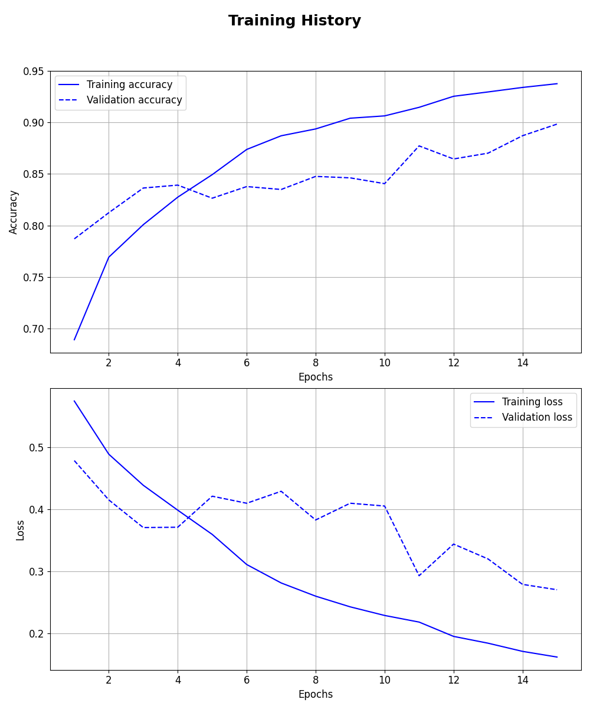

### Detailed Report of Test Set:

|              | precision    | recall       | f1-score     | support      |
| ------------ | ------------ | ------------ | ------------ | ------------ |
| chihuahua    | 0.9185       | 0.9037       | 0.9111       | 374          | 
| muffin       | 0.8950       | 0.9110       | 0.9029       | 337          | 
| micro avg    | 0.9072       | 0.9072       | 0.9072       | 711          | 
| macro avg    | 0.9068       | 0.9074       | 0.9070       | 711          | 
| weighted avg | 0.9074       | 0.9072       | 0.9072       | 711          | 
| samples avg  | 0.9072       | 0.9072       | 0.9072       | 711          | 

## trial_16

*    *Start Time*: 2024-10-24 12:12:17

*    *Duration*: 0:05:43.846

*    *Directory*: [Link](./trial_16)

### Hyperparameters:

| Hyperparameter         | Value                  |
| ---------------------- | ---------------------- |
| normalization          | standard               |
| batch_size             | 128                    |
| learning_rate          | 5.2081769186474414e-05 |

### Evaluation Metrics:

|           | train     | val       | test      |
| --------- | --------- | --------- | --------- |
| accuracy  | 0.9396    | 0.8801    | 0.9044    | 
| precision | 0.9396    | 0.8801    | 0.9044    | 
| recall    | 0.9396    | 0.8801    | 0.9044    | 
| f1        | 0.9396    | 0.8801    | 0.9044    | 

### Figures:

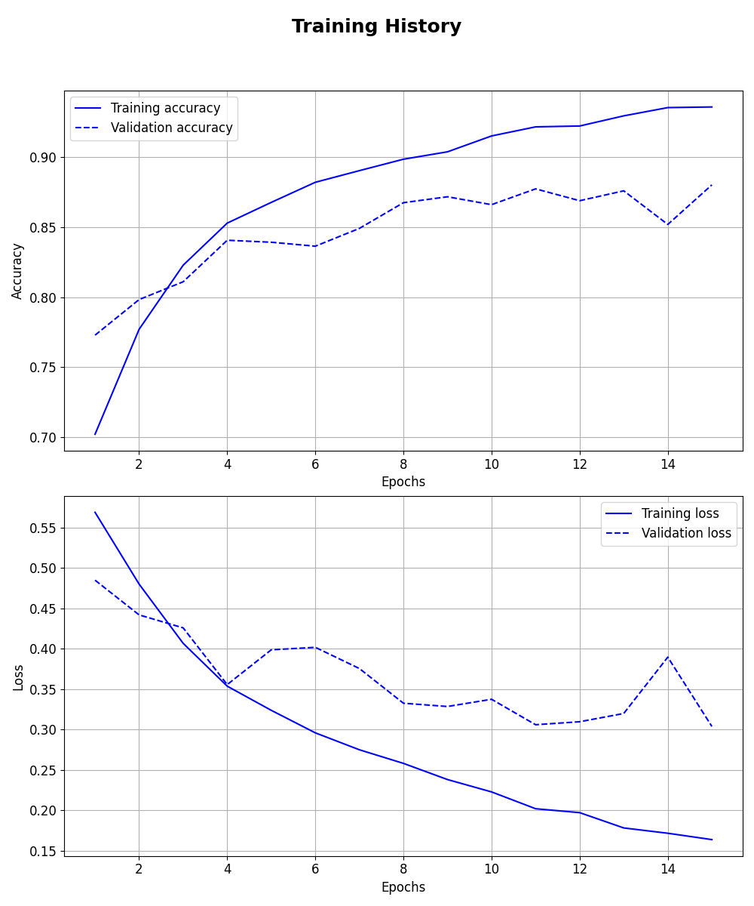

### Detailed Report of Test Set:

|              | precision    | recall       | f1-score     | support      |
| ------------ | ------------ | ------------ | ------------ | ------------ |
| chihuahua    | 0.9005       | 0.9198       | 0.9101       | 374          | 
| muffin       | 0.9088       | 0.8872       | 0.8979       | 337          | 
| micro avg    | 0.9044       | 0.9044       | 0.9044       | 711          | 
| macro avg    | 0.9047       | 0.9035       | 0.9040       | 711          | 
| weighted avg | 0.9045       | 0.9044       | 0.9043       | 711          | 
| samples avg  | 0.9044       | 0.9044       | 0.9044       | 711          | 

## trial_96

*    *Start Time*: 2024-10-27 14:26:42

*    *Duration*: 0:05:47.168

*    *Directory*: [Link](./trial_96)

### Hyperparameters:

| Hyperparameter        | Value                 |
| --------------------- | --------------------- |
| normalization         | standard              |
| batch_size            | 128                   |
| learning_rate         | 6.856245200486332e-05 |

### Evaluation Metrics:

|           | train     | val       | test      |
| --------- | --------- | --------- | --------- |
| accuracy  | 0.9238    | 0.9041    | 0.9030    | 
| precision | 0.9238    | 0.9041    | 0.9030    | 
| recall    | 0.9238    | 0.9041    | 0.9030    | 
| f1        | 0.9238    | 0.9041    | 0.9030    | 

### Figures:

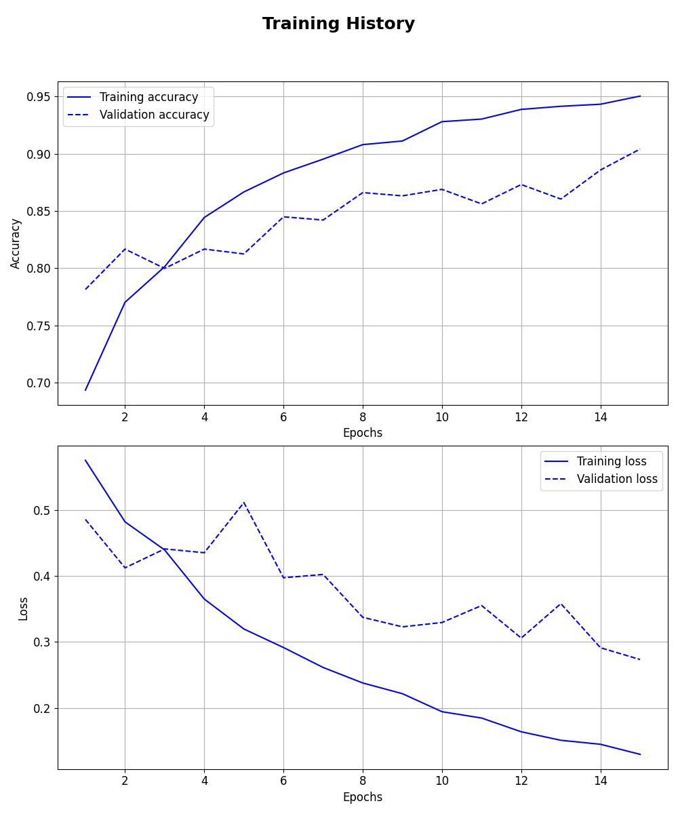

### Detailed Report of Test Set:

|              | precision    | recall       | f1-score     | support      |
| ------------ | ------------ | ------------ | ------------ | ------------ |
| chihuahua    | 0.8900       | 0.9305       | 0.9098       | 374          | 
| muffin       | 0.9187       | 0.8724       | 0.8950       | 337          | 
| micro avg    | 0.9030       | 0.9030       | 0.9030       | 711          | 
| macro avg    | 0.9044       | 0.9014       | 0.9024       | 711          | 
| weighted avg | 0.9036       | 0.9030       | 0.9028       | 711          | 
| samples avg  | 0.9030       | 0.9030       | 0.9030       | 711          | 

## trial_15

*    *Start Time*: 2024-10-24 12:06:34

*    *Duration*: 0:05:41.707

*    *Directory*: [Link](./trial_15)

### Hyperparameters:

| Hyperparameter        | Value                 |
| --------------------- | --------------------- |
| normalization         | standard              |
| batch_size            | 128                   |
| learning_rate         | 8.974258568464486e-05 |

### Evaluation Metrics:

|           | train     | val       | test      |
| --------- | --------- | --------- | --------- |
| accuracy  | 0.9721    | 0.8759    | 0.8987    | 
| precision | 0.9721    | 0.8759    | 0.8987    | 
| recall    | 0.9721    | 0.8759    | 0.8987    | 
| f1        | 0.9721    | 0.8759    | 0.8987    | 

### Figures:

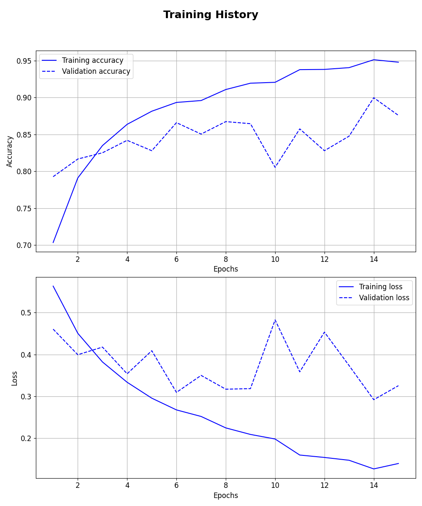

### Detailed Report of Test Set:

|              | precision    | recall       | f1-score     | support      |
| ------------ | ------------ | ------------ | ------------ | ------------ |
| chihuahua    | 0.9548       | 0.8476       | 0.8980       | 374          | 
| muffin       | 0.8496       | 0.9555       | 0.8994       | 337          | 
| micro avg    | 0.8987       | 0.8987       | 0.8987       | 711          | 
| macro avg    | 0.9022       | 0.9015       | 0.8987       | 711          | 
| weighted avg | 0.9049       | 0.8987       | 0.8987       | 711          | 
| samples avg  | 0.8987       | 0.8987       | 0.8987       | 711          | 

## trial_62

*    *Start Time*: 2024-10-27 11:08:44

*    *Duration*: 0:05:45.773

*    *Directory*: [Link](./trial_62)

### Hyperparameters:

| Hyperparameter        | Value                 |
| --------------------- | --------------------- |
| normalization         | standard              |
| batch_size            | 128                   |
| learning_rate         | 5.024002493168523e-05 |

### Evaluation Metrics:

|           | train     | val       | test      |
| --------- | --------- | --------- | --------- |
| accuracy  | 0.9490    | 0.8829    | 0.8987    | 
| precision | 0.9490    | 0.8829    | 0.8987    | 
| recall    | 0.9490    | 0.8829    | 0.8987    | 
| f1        | 0.9490    | 0.8829    | 0.8987    | 

### Figures:

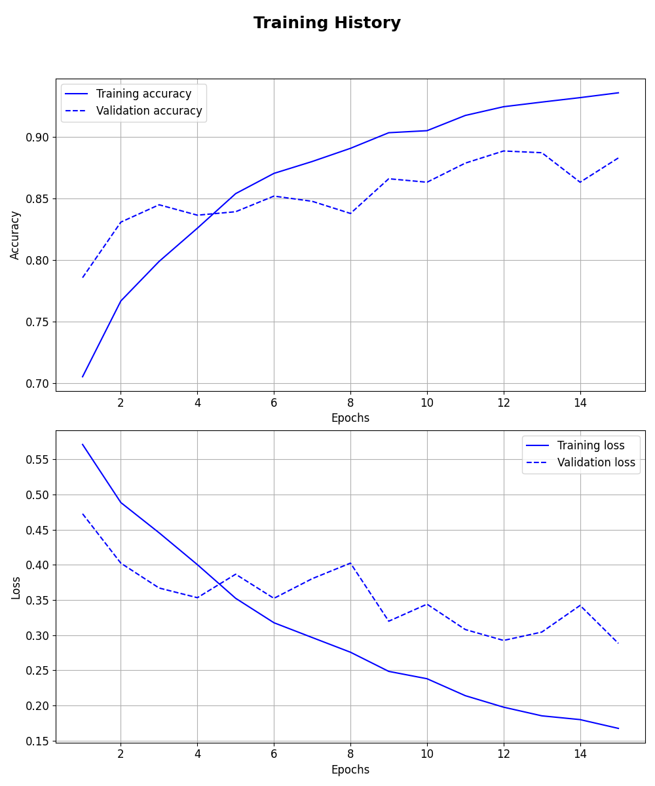

### Detailed Report of Test Set:

|              | precision    | recall       | f1-score     | support      |
| ------------ | ------------ | ------------ | ------------ | ------------ |
| chihuahua    | 0.9126       | 0.8930       | 0.9027       | 374          | 
| muffin       | 0.8841       | 0.9050       | 0.8944       | 337          | 
| micro avg    | 0.8987       | 0.8987       | 0.8987       | 711          | 
| macro avg    | 0.8983       | 0.8990       | 0.8986       | 711          | 
| weighted avg | 0.8991       | 0.8987       | 0.8988       | 711          | 
| samples avg  | 0.8987       | 0.8987       | 0.8987       | 711          | 

## trial_86

*    *Start Time*: 2024-10-27 13:28:32

*    *Duration*: 0:05:46.935

*    *Directory*: [Link](./trial_86)

### Hyperparameters:

| Hyperparameter        | Value                 |
| --------------------- | --------------------- |
| normalization         | standard              |
| batch_size            | 128                   |
| learning_rate         | 6.633234641706978e-05 |

### Evaluation Metrics:

|           | train     | val       | test      |
| --------- | --------- | --------- | --------- |
| accuracy  | 0.9331    | 0.8970    | 0.8973    | 
| precision | 0.9331    | 0.8970    | 0.8973    | 
| recall    | 0.9331    | 0.8970    | 0.8973    | 
| f1        | 0.9331    | 0.8970    | 0.8973    | 

### Figures:

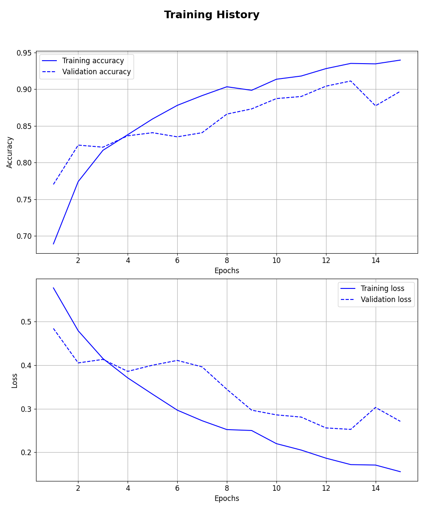

### Detailed Report of Test Set:

|              | precision    | recall       | f1-score     | support      |
| ------------ | ------------ | ------------ | ------------ | ------------ |
| chihuahua    | 0.9192       | 0.8824       | 0.9004       | 374          | 
| muffin       | 0.8750       | 0.9139       | 0.8940       | 337          | 
| micro avg    | 0.8973       | 0.8973       | 0.8973       | 711          | 
| macro avg    | 0.8971       | 0.8981       | 0.8972       | 711          | 
| weighted avg | 0.8983       | 0.8973       | 0.8974       | 711          | 
| samples avg  | 0.8973       | 0.8973       | 0.8973       | 711          | 

## trial_95

*    *Start Time*: 2024-10-27 14:20:54

*    *Duration*: 0:05:45.580

*    *Directory*: [Link](./trial_95)

### Hyperparameters:

| Hyperparameter        | Value                 |
| --------------------- | --------------------- |
| normalization         | standard              |
| batch_size            | 128                   |
| learning_rate         | 5.995569457616868e-05 |

### Evaluation Metrics:

|           | train     | val       | test      |
| --------- | --------- | --------- | --------- |
| accuracy  | 0.9434    | 0.8688    | 0.8973    | 
| precision | 0.9434    | 0.8688    | 0.8973    | 
| recall    | 0.9434    | 0.8688    | 0.8973    | 
| f1        | 0.9434    | 0.8688    | 0.8973    | 

### Figures:

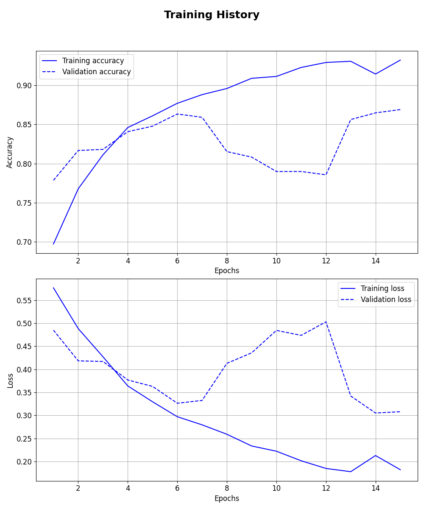

### Detailed Report of Test Set:

|              | precision    | recall       | f1-score     | support      |
| ------------ | ------------ | ------------ | ------------ | ------------ |
| chihuahua    | 0.9216       | 0.8797       | 0.9001       | 374          | 
| muffin       | 0.8729       | 0.9169       | 0.8944       | 337          | 
| micro avg    | 0.8973       | 0.8973       | 0.8973       | 711          | 
| macro avg    | 0.8972       | 0.8983       | 0.8972       | 711          | 
| weighted avg | 0.8985       | 0.8973       | 0.8974       | 711          | 
| samples avg  | 0.8973       | 0.8973       | 0.8973       | 711          | 

## trial_30

*    *Start Time*: 2024-10-24 13:32:48

*    *Duration*: 0:05:44.533

*    *Directory*: [Link](./trial_30)

### Hyperparameters:

| Hyperparameter         | Value                  |
| ---------------------- | ---------------------- |
| normalization          | mean                   |
| batch_size             | 128                    |
| learning_rate          | 0.00013620153957913286 |

### Evaluation Metrics:

|           | train     | val       | test      |
| --------- | --------- | --------- | --------- |
| accuracy  | 0.9618    | 0.8801    | 0.8945    | 
| precision | 0.9618    | 0.8801    | 0.8945    | 
| recall    | 0.9618    | 0.8801    | 0.8945    | 
| f1        | 0.9618    | 0.8801    | 0.8945    | 

### Figures:

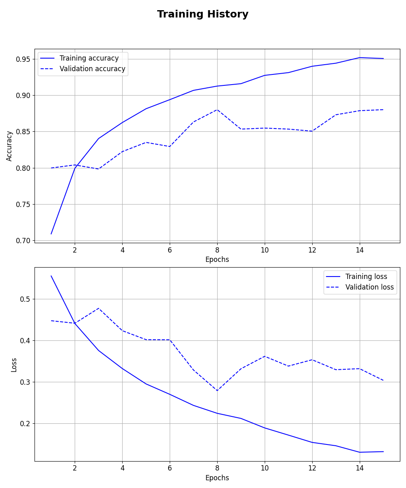

### Detailed Report of Test Set:

|              | precision    | recall       | f1-score     | support      |
| ------------ | ------------ | ------------ | ------------ | ------------ |
| chihuahua    | 0.9096       | 0.8877       | 0.8985       | 374          | 
| muffin       | 0.8786       | 0.9021       | 0.8902       | 337          | 
| micro avg    | 0.8945       | 0.8945       | 0.8945       | 711          | 
| macro avg    | 0.8941       | 0.8949       | 0.8944       | 711          | 
| weighted avg | 0.8949       | 0.8945       | 0.8946       | 711          | 
| samples avg  | 0.8945       | 0.8945       | 0.8945       | 711          | 

## trial_38

*    *Start Time*: 2024-10-24 14:18:57

*    *Duration*: 0:05:56.900

*    *Directory*: [Link](./trial_38)

### Hyperparameters:

| Hyperparameter         | Value                  |
| ---------------------- | ---------------------- |
| normalization          | min_max                |
| batch_size             | 16                     |
| learning_rate          | 0.00020473390753879747 |

### Evaluation Metrics:

|           | train     | val       | test      |
| --------- | --------- | --------- | --------- |
| accuracy  | 0.9799    | 0.8731    | 0.8945    | 
| precision | 0.9799    | 0.8731    | 0.8945    | 
| recall    | 0.9799    | 0.8731    | 0.8945    | 
| f1        | 0.9799    | 0.8731    | 0.8945    | 

### Figures:

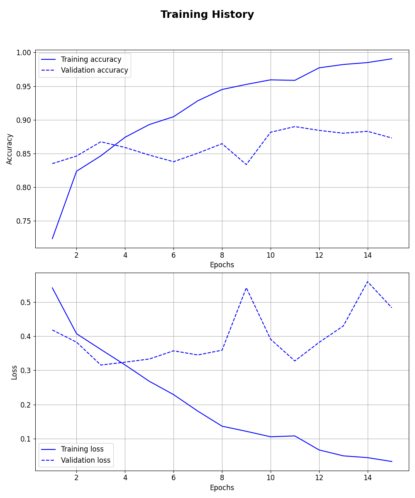

### Detailed Report of Test Set:

|              | precision    | recall       | f1-score     | support      |
| ------------ | ------------ | ------------ | ------------ | ------------ |
| chihuahua    | 0.8945       | 0.9064       | 0.9004       | 374          | 
| muffin       | 0.8946       | 0.8813       | 0.8879       | 337          | 
| micro avg    | 0.8945       | 0.8945       | 0.8945       | 711          | 
| macro avg    | 0.8945       | 0.8939       | 0.8941       | 711          | 
| weighted avg | 0.8945       | 0.8945       | 0.8945       | 711          | 
| samples avg  | 0.8945       | 0.8945       | 0.8945       | 711          | 

## trial_60

*    *Start Time*: 2024-10-27 10:56:39

*    *Duration*: 0:06:20.471

*    *Directory*: [Link](./trial_60)

### Hyperparameters:

| Hyperparameter       | Value                |
| -------------------- | -------------------- |
| normalization        | standard             |
| batch_size           | 256                  |
| learning_rate        | 7.51769233315701e-05 |

### Evaluation Metrics:

|           | train     | val       | test      |
| --------- | --------- | --------- | --------- |
| accuracy  | 0.9229    | 0.8829    | 0.8945    | 
| precision | 0.9229    | 0.8829    | 0.8945    | 
| recall    | 0.9229    | 0.8829    | 0.8945    | 
| f1        | 0.9229    | 0.8829    | 0.8945    | 

### Figures:

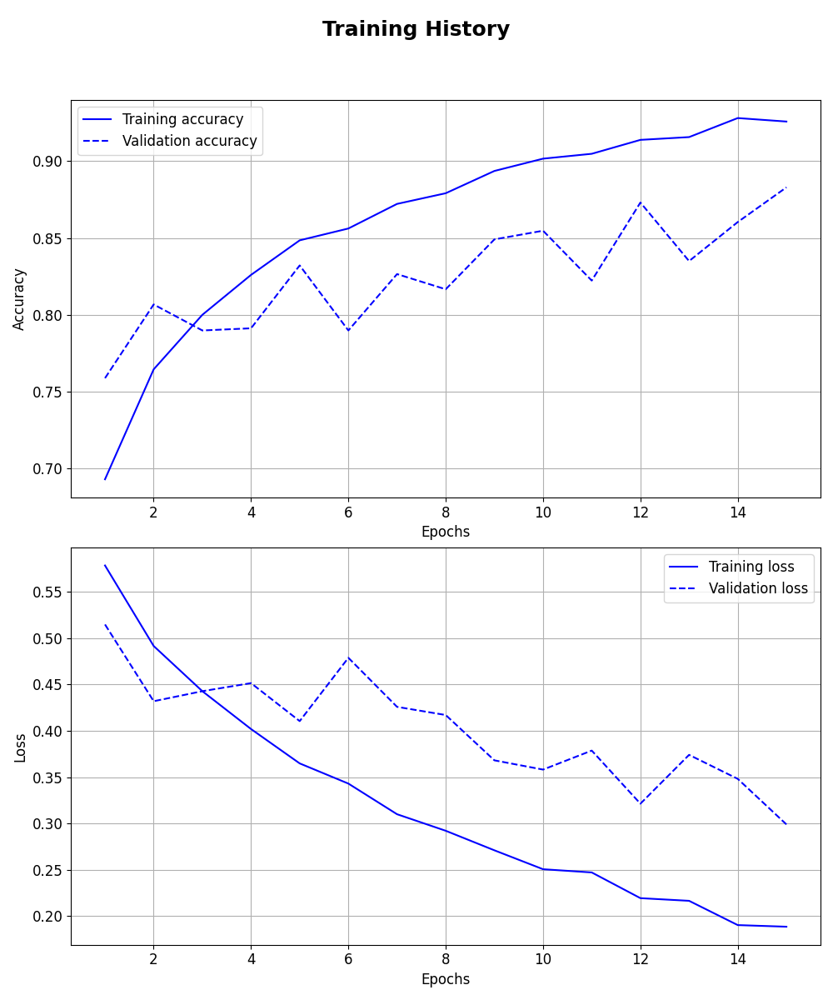

### Detailed Report of Test Set:

|              | precision    | recall       | f1-score     | support      |
| ------------ | ------------ | ------------ | ------------ | ------------ |
| chihuahua    | 0.9008       | 0.8984       | 0.8996       | 374          | 
| muffin       | 0.8876       | 0.8902       | 0.8889       | 337          | 
| micro avg    | 0.8945       | 0.8945       | 0.8945       | 711          | 
| macro avg    | 0.8942       | 0.8943       | 0.8942       | 711          | 
| weighted avg | 0.8945       | 0.8945       | 0.8945       | 711          | 
| samples avg  | 0.8945       | 0.8945       | 0.8945       | 711          | 

## trial_43

*    *Start Time*: 2024-10-24 14:48:04

*    *Duration*: 0:05:45.609

*    *Directory*: [Link](./trial_43)

### Hyperparameters:

| Hyperparameter       | Value                |
| -------------------- | -------------------- |
| normalization        | standard             |
| batch_size           | 128                  |
| learning_rate        | 6.34914580214835e-05 |

### Evaluation Metrics:

|           | train     | val       | test      |
| --------- | --------- | --------- | --------- |
| accuracy  | 0.9556    | 0.8928    | 0.8931    | 
| precision | 0.9556    | 0.8928    | 0.8931    | 
| recall    | 0.9556    | 0.8928    | 0.8931    | 
| f1        | 0.9556    | 0.8928    | 0.8931    | 

### Figures:

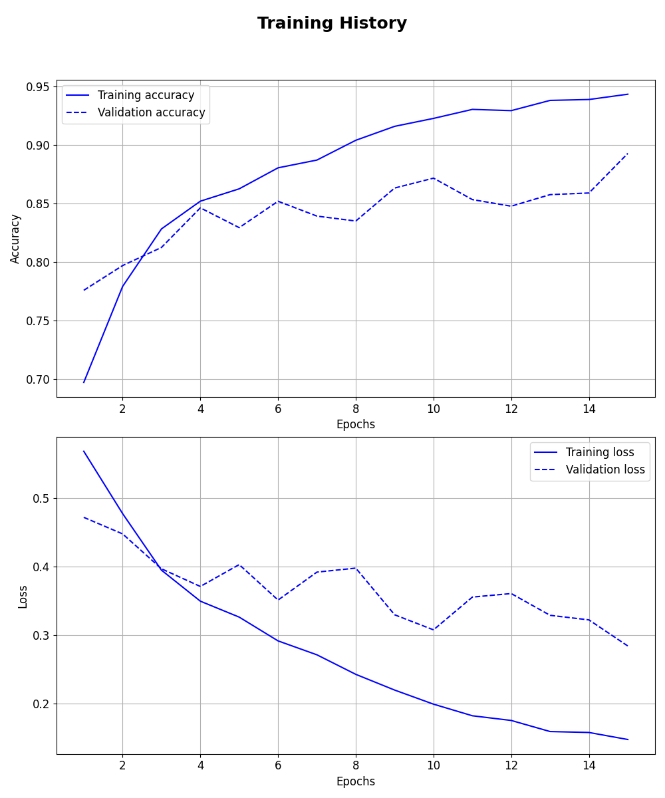

### Detailed Report of Test Set:

|              | precision    | recall       | f1-score     | support      |
| ------------ | ------------ | ------------ | ------------ | ------------ |
| chihuahua    | 0.9257       | 0.8663       | 0.8950       | 374          | 
| muffin       | 0.8615       | 0.9228       | 0.8911       | 337          | 
| micro avg    | 0.8931       | 0.8931       | 0.8931       | 711          | 
| macro avg    | 0.8936       | 0.8946       | 0.8931       | 711          | 
| weighted avg | 0.8953       | 0.8931       | 0.8932       | 711          | 
| samples avg  | 0.8931       | 0.8931       | 0.8931       | 711          | 

## trial_28

*    *Start Time*: 2024-10-24 13:21:20

*    *Duration*: 0:05:41.885

*    *Directory*: [Link](./trial_28)

### Hyperparameters:

| Hyperparameter        | Value                 |
| --------------------- | --------------------- |
| normalization         | standard              |
| batch_size            | 128                   |
| learning_rate         | 8.321656934483455e-05 |

### Evaluation Metrics:

|           | train     | val       | test      |
| --------- | --------- | --------- | --------- |
| accuracy  | 0.9430    | 0.8942    | 0.8931    | 
| precision | 0.9430    | 0.8942    | 0.8931    | 
| recall    | 0.9430    | 0.8942    | 0.8931    | 
| f1        | 0.9430    | 0.8942    | 0.8931    | 

### Figures:

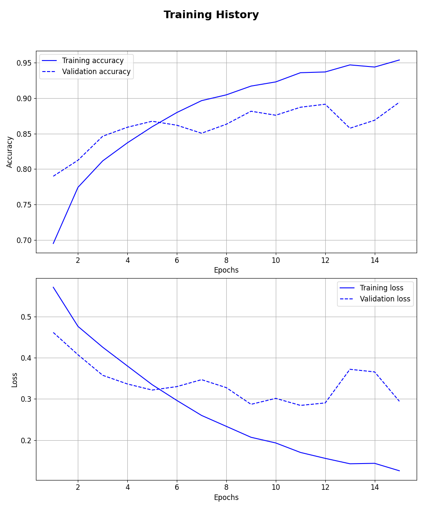

### Detailed Report of Test Set:

|              | precision    | recall       | f1-score     | support      |
| ------------ | ------------ | ------------ | ------------ | ------------ |
| chihuahua    | 0.9233       | 0.8690       | 0.8953       | 374          | 
| muffin       | 0.8635       | 0.9199       | 0.8908       | 337          | 
| micro avg    | 0.8931       | 0.8931       | 0.8931       | 711          | 
| macro avg    | 0.8934       | 0.8944       | 0.8931       | 711          | 
| weighted avg | 0.8950       | 0.8931       | 0.8932       | 711          | 
| samples avg  | 0.8931       | 0.8931       | 0.8931       | 711          | 

## trial_58

*    *Start Time*: 2024-10-27 10:45:03

*    *Duration*: 0:05:47.130

*    *Directory*: [Link](./trial_58)

### Hyperparameters:

| Hyperparameter        | Value                 |
| --------------------- | --------------------- |
| normalization         | standard              |
| batch_size            | 128                   |
| learning_rate         | 7.228703194721559e-05 |

### Evaluation Metrics:

|           | train     | val       | test      |
| --------- | --------- | --------- | --------- |
| accuracy  | 0.9626    | 0.8858    | 0.8931    | 
| precision | 0.9626    | 0.8858    | 0.8931    | 
| recall    | 0.9626    | 0.8858    | 0.8931    | 
| f1        | 0.9626    | 0.8858    | 0.8931    | 

### Figures:

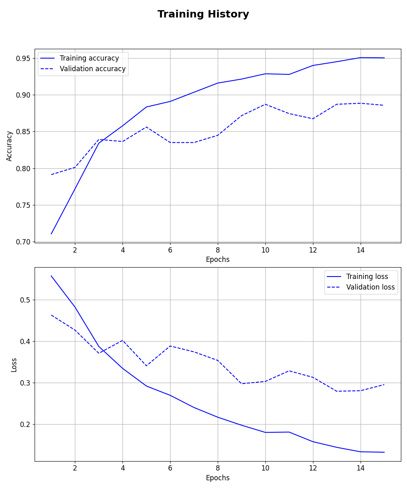

### Detailed Report of Test Set:

|              | precision    | recall       | f1-score     | support      |
| ------------ | ------------ | ------------ | ------------ | ------------ |
| chihuahua    | 0.9306       | 0.8610       | 0.8944       | 374          | 
| muffin       | 0.8575       | 0.9288       | 0.8917       | 337          | 
| micro avg    | 0.8931       | 0.8931       | 0.8931       | 711          | 
| macro avg    | 0.8941       | 0.8949       | 0.8931       | 711          | 
| weighted avg | 0.8960       | 0.8931       | 0.8932       | 711          | 
| samples avg  | 0.8931       | 0.8931       | 0.8931       | 711          | 

## trial_100

*    *Start Time*: 2024-10-27 15:12:13

*    *Duration*: 0:05:47.406

*    *Directory*: [Link](./trial_100)

### Hyperparameters:

| Hyperparameter         | Value                  |
| ---------------------- | ---------------------- |
| normalization          | standard               |
| batch_size             | 128                    |
| learning_rate          | 5.5780621680769646e-05 |

### Evaluation Metrics:

|           | train     | val       | test      |
| --------- | --------- | --------- | --------- |
| accuracy  | 0.9354    | 0.8829    | 0.8931    | 
| precision | 0.9354    | 0.8829    | 0.8931    | 
| recall    | 0.9354    | 0.8829    | 0.8931    | 
| f1        | 0.9354    | 0.8829    | 0.8931    | 

### Figures:

### Detailed Report of Test Set:

|              | precision    | recall       | f1-score     | support      |
| ------------ | ------------ | ------------ | ------------ | ------------ |
| chihuahua    | 0.9162       | 0.8770       | 0.8962       | 374          | 
| muffin       | 0.8697       | 0.9110       | 0.8899       | 337          | 
| micro avg    | 0.8931       | 0.8931       | 0.8931       | 711          | 
| macro avg    | 0.8929       | 0.8940       | 0.8930       | 711          | 
| weighted avg | 0.8942       | 0.8931       | 0.8932       | 711          | 
| samples avg  | 0.8931       | 0.8931       | 0.8931       | 711          | 

## trial_44

*    *Start Time*: 2024-10-24 14:53:51

*    *Duration*: 0:05:43.235

*    *Directory*: [Link](./trial_44)

### Hyperparameters:

| Hyperparameter       | Value                |
| -------------------- | -------------------- |
| normalization        | standard             |
| batch_size           | 128                  |
| learning_rate        | 6.60100066888519e-05 |

### Evaluation Metrics:

|           | train     | val       | test      |
| --------- | --------- | --------- | --------- |
| accuracy  | 0.9445    | 0.8984    | 0.8889    | 
| precision | 0.9445    | 0.8984    | 0.8889    | 
| recall    | 0.9445    | 0.8984    | 0.8889    | 
| f1        | 0.9445    | 0.8984    | 0.8889    | 

### Figures:

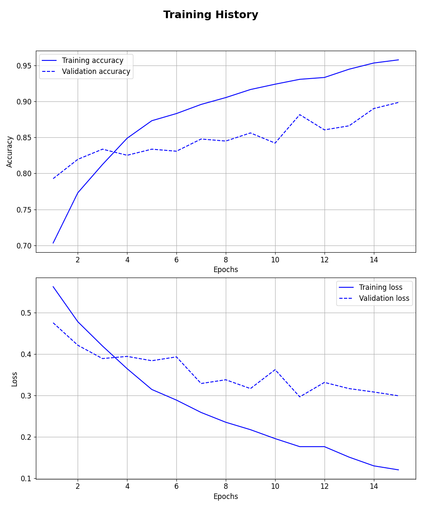

### Detailed Report of Test Set:

|              | precision    | recall       | f1-score     | support      |
| ------------ | ------------ | ------------ | ------------ | ------------ |
| chihuahua    | 0.9019       | 0.8850       | 0.8934       | 374          | 
| muffin       | 0.8750       | 0.8932       | 0.8840       | 337          | 
| micro avg    | 0.8889       | 0.8889       | 0.8889       | 711          | 
| macro avg    | 0.8885       | 0.8891       | 0.8887       | 711          | 
| weighted avg | 0.8892       | 0.8889       | 0.8889       | 711          | 
| samples avg  | 0.8889       | 0.8889       | 0.8889       | 711          | 

## trial_18

*    *Start Time*: 2024-10-24 12:23:47

*    *Duration*: 0:05:44.590

*    *Directory*: [Link](./trial_18)

### Hyperparameters:

| Hyperparameter       | Value                |
| -------------------- | -------------------- |
| normalization        | standard             |
| batch_size           | 128                  |
| learning_rate        | 7.37988176449707e-05 |

### Evaluation Metrics:

|           | train     | val       | test      |
| --------- | --------- | --------- | --------- |
| accuracy  | 0.9425    | 0.8815    | 0.8889    | 
| precision | 0.9425    | 0.8815    | 0.8889    | 
| recall    | 0.9425    | 0.8815    | 0.8889    | 
| f1        | 0.9425    | 0.8815    | 0.8889    | 

### Figures:

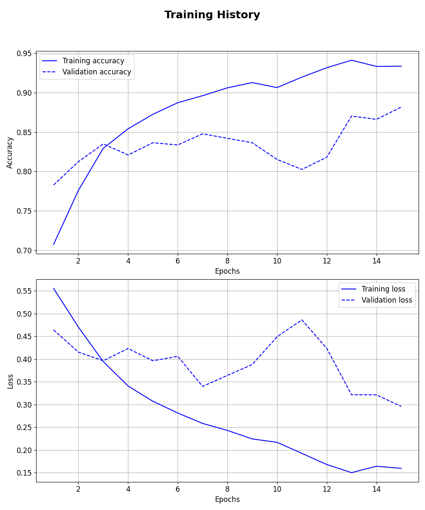

### Detailed Report of Test Set:

|              | precision    | recall       | f1-score     | support      |
| ------------ | ------------ | ------------ | ------------ | ------------ |
| chihuahua    | 0.8851       | 0.9064       | 0.8956       | 374          | 
| muffin       | 0.8933       | 0.8694       | 0.8812       | 337          | 
| micro avg    | 0.8889       | 0.8889       | 0.8889       | 711          | 
| macro avg    | 0.8892       | 0.8879       | 0.8884       | 711          | 
| weighted avg | 0.8890       | 0.8889       | 0.8888       | 711          | 
| samples avg  | 0.8889       | 0.8889       | 0.8889       | 711          | 

## trial_66

*    *Start Time*: 2024-10-27 11:32:01

*    *Duration*: 0:05:47.623

*    *Directory*: [Link](./trial_66)

### Hyperparameters:

| Hyperparameter        | Value                 |
| --------------------- | --------------------- |
| normalization         | standard              |
| batch_size            | 128                   |
| learning_rate         | 6.950102086553015e-05 |

### Evaluation Metrics:

|           | train     | val       | test      |
| --------- | --------- | --------- | --------- |
| accuracy  | 0.9617    | 0.8688    | 0.8889    | 
| precision | 0.9617    | 0.8688    | 0.8889    | 
| recall    | 0.9617    | 0.8688    | 0.8889    | 
| f1        | 0.9617    | 0.8688    | 0.8889    | 

### Figures:

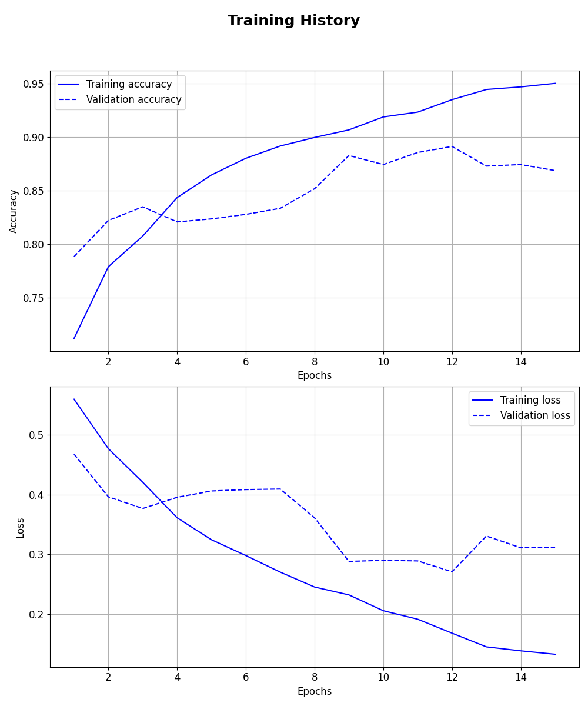

### Detailed Report of Test Set:

|              | precision    | recall       | f1-score     | support      |
| ------------ | ------------ | ------------ | ------------ | ------------ |
| chihuahua    | 0.8892       | 0.9011       | 0.8951       | 374          | 
| muffin       | 0.8886       | 0.8754       | 0.8819       | 337          | 
| micro avg    | 0.8889       | 0.8889       | 0.8889       | 711          | 
| macro avg    | 0.8889       | 0.8882       | 0.8885       | 711          | 
| weighted avg | 0.8889       | 0.8889       | 0.8888       | 711          | 
| samples avg  | 0.8889       | 0.8889       | 0.8889       | 711          | 

## trial_74

*    *Start Time*: 2024-10-27 12:18:56

*    *Duration*: 0:05:48.431

*    *Directory*: [Link](./trial_74)

### Hyperparameters:

| Hyperparameter        | Value                 |
| --------------------- | --------------------- |
| normalization         | standard              |
| batch_size            | 128                   |
| learning_rate         | 6.020347466434934e-05 |

### Evaluation Metrics:

|           | train     | val       | test      |
| --------- | --------- | --------- | --------- |
| accuracy  | 0.9466    | 0.8843    | 0.8889    | 
| precision | 0.9466    | 0.8843    | 0.8889    | 
| recall    | 0.9466    | 0.8843    | 0.8889    | 
| f1        | 0.9466    | 0.8843    | 0.8889    | 

### Figures:

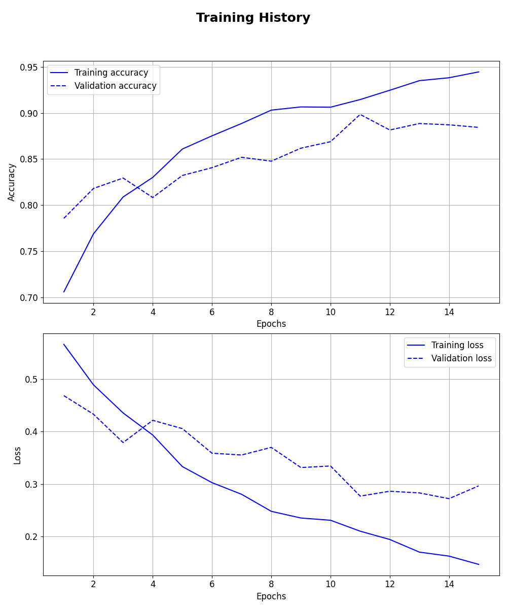

### Detailed Report of Test Set:

|              | precision    | recall       | f1-score     | support      |
| ------------ | ------------ | ------------ | ------------ | ------------ |
| chihuahua    | 0.9132       | 0.8717       | 0.8919       | 374          | 
| muffin       | 0.8644       | 0.9080       | 0.8857       | 337          | 
| micro avg    | 0.8889       | 0.8889       | 0.8889       | 711          | 
| macro avg    | 0.8888       | 0.8898       | 0.8888       | 711          | 
| weighted avg | 0.8901       | 0.8889       | 0.8890       | 711          | 
| samples avg  | 0.8889       | 0.8889       | 0.8889       | 711          | 

## trial_3

*    *Start Time*: 2024-10-26 19:07:24

*    *Duration*: 0:05:46.577

*    *Directory*: [Link](./trial_3)

### Hyperparameters:

| Hyperparameter        | Value                 |
| --------------------- | --------------------- |
| normalization         | standard              |
| batch_size            | 128                   |
| learning_rate         | 5.030101399580956e-05 |

### Evaluation Metrics:

|           | train     | val       | test      |
| --------- | --------- | --------- | --------- |
| accuracy  | 0.9202    | 0.8858    | 0.8875    | 
| precision | 0.9202    | 0.8858    | 0.8875    | 
| recall    | 0.9202    | 0.8858    | 0.8875    | 
| f1        | 0.9202    | 0.8858    | 0.8875    | 

### Figures:

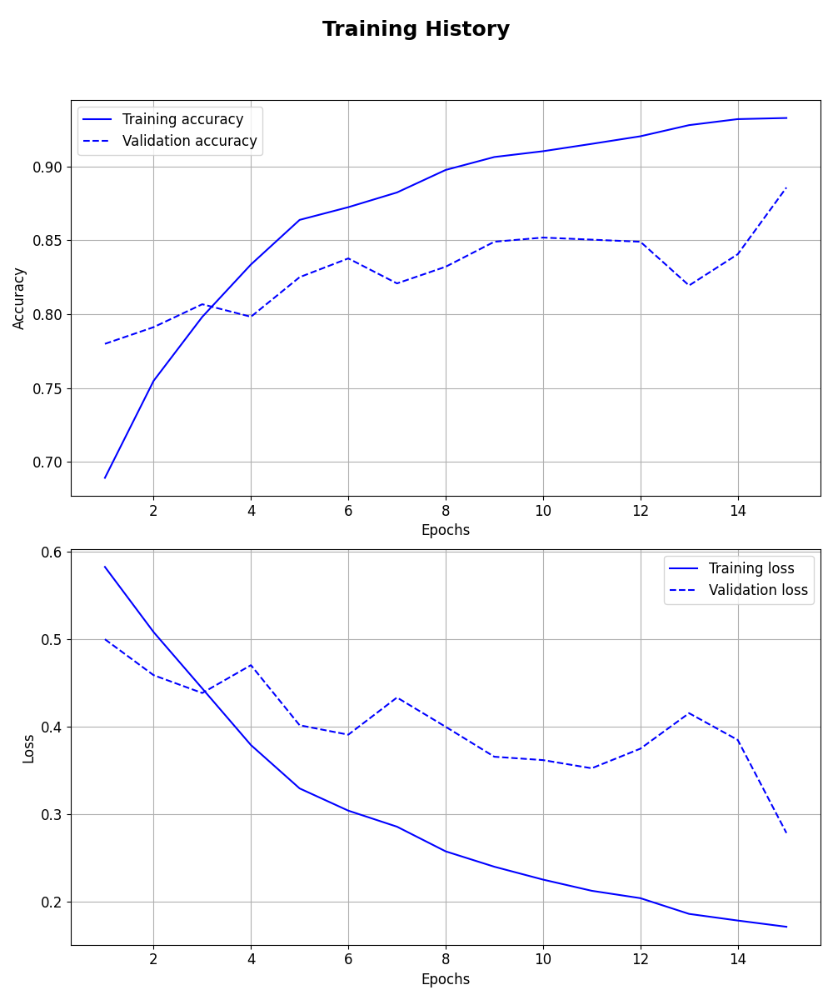

### Detailed Report of Test Set:

|              | precision    | recall       | f1-score     | support      |
| ------------ | ------------ | ------------ | ------------ | ------------ |
| chihuahua    | 0.8889       | 0.8984       | 0.8936       | 374          | 
| muffin       | 0.8859       | 0.8754       | 0.8806       | 337          | 
| micro avg    | 0.8875       | 0.8875       | 0.8875       | 711          | 
| macro avg    | 0.8874       | 0.8869       | 0.8871       | 711          | 
| weighted avg | 0.8875       | 0.8875       | 0.8874       | 711          | 
| samples avg  | 0.8875       | 0.8875       | 0.8875       | 711          | 

## trial_50

*    *Start Time*: 2024-10-24 15:28:29

*    *Duration*: 0:05:43.224

*    *Directory*: [Link](./trial_50)

### Hyperparameters:

| Hyperparameter        | Value                 |
| --------------------- | --------------------- |
| normalization         | standard              |
| batch_size            | 128                   |
| learning_rate         | 8.893987938763024e-05 |

### Evaluation Metrics:

|           | train     | val       | test      |
| --------- | --------- | --------- | --------- |
| accuracy  | 0.9514    | 0.8900    | 0.8875    | 
| precision | 0.9514    | 0.8900    | 0.8875    | 
| recall    | 0.9514    | 0.8900    | 0.8875    | 
| f1        | 0.9514    | 0.8900    | 0.8875    | 

### Figures:

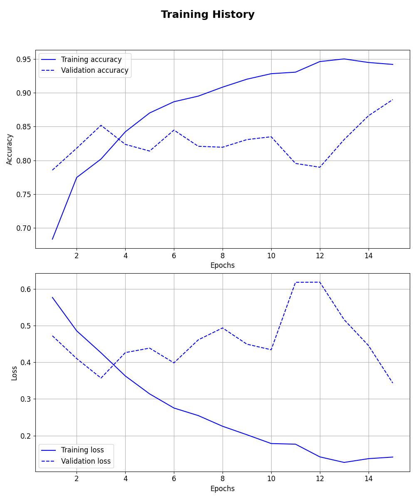

### Detailed Report of Test Set:

|              | precision    | recall       | f1-score     | support      |
| ------------ | ------------ | ------------ | ------------ | ------------ |
| chihuahua    | 0.9349       | 0.8449       | 0.8876       | 374          | 
| muffin       | 0.8445       | 0.9347       | 0.8873       | 337          | 
| micro avg    | 0.8875       | 0.8875       | 0.8875       | 711          | 
| macro avg    | 0.8897       | 0.8898       | 0.8875       | 711          | 
| weighted avg | 0.8921       | 0.8875       | 0.8875       | 711          | 
| samples avg  | 0.8875       | 0.8875       | 0.8875       | 711          | 

## trial_21

*    *Start Time*: 2024-10-24 12:41:04

*    *Duration*: 0:05:43.658

*    *Directory*: [Link](./trial_21)

### Hyperparameters:

| Hyperparameter        | Value                 |
| --------------------- | --------------------- |
| normalization         | standard              |
| batch_size            | 128                   |
| learning_rate         | 0.0001347092690350312 |

### Evaluation Metrics:

|           | train     | val       | test      |
| --------- | --------- | --------- | --------- |
| accuracy  | 0.9790    | 0.8942    | 0.8861    | 
| precision | 0.9790    | 0.8942    | 0.8861    | 
| recall    | 0.9790    | 0.8942    | 0.8861    | 
| f1        | 0.9790    | 0.8942    | 0.8861    | 

### Figures:

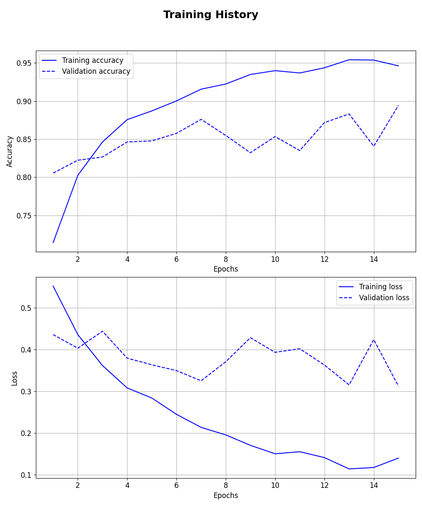

### Detailed Report of Test Set:

|              | precision    | recall       | f1-score     | support      |
| ------------ | ------------ | ------------ | ------------ | ------------ |
| chihuahua    | 0.8949       | 0.8877       | 0.8913       | 374          | 
| muffin       | 0.8765       | 0.8843       | 0.8804       | 337          | 
| micro avg    | 0.8861       | 0.8861       | 0.8861       | 711          | 
| macro avg    | 0.8857       | 0.8860       | 0.8858       | 711          | 
| weighted avg | 0.8862       | 0.8861       | 0.8861       | 711          | 
| samples avg  | 0.8861       | 0.8861       | 0.8861       | 711          | 

## trial_56

*    *Start Time*: 2024-10-27 10:33:30

*    *Duration*: 0:05:46.154

*    *Directory*: [Link](./trial_56)

### Hyperparameters:

| Hyperparameter        | Value                 |
| --------------------- | --------------------- |
| normalization         | standard              |
| batch_size            | 128                   |
| learning_rate         | 5.414190677428918e-05 |

### Evaluation Metrics:

|           | train     | val       | test      |
| --------- | --------- | --------- | --------- |
| accuracy  | 0.9405    | 0.8858    | 0.8847    | 
| precision | 0.9405    | 0.8858    | 0.8847    | 
| recall    | 0.9405    | 0.8858    | 0.8847    | 
| f1        | 0.9405    | 0.8858    | 0.8847    | 

### Figures:

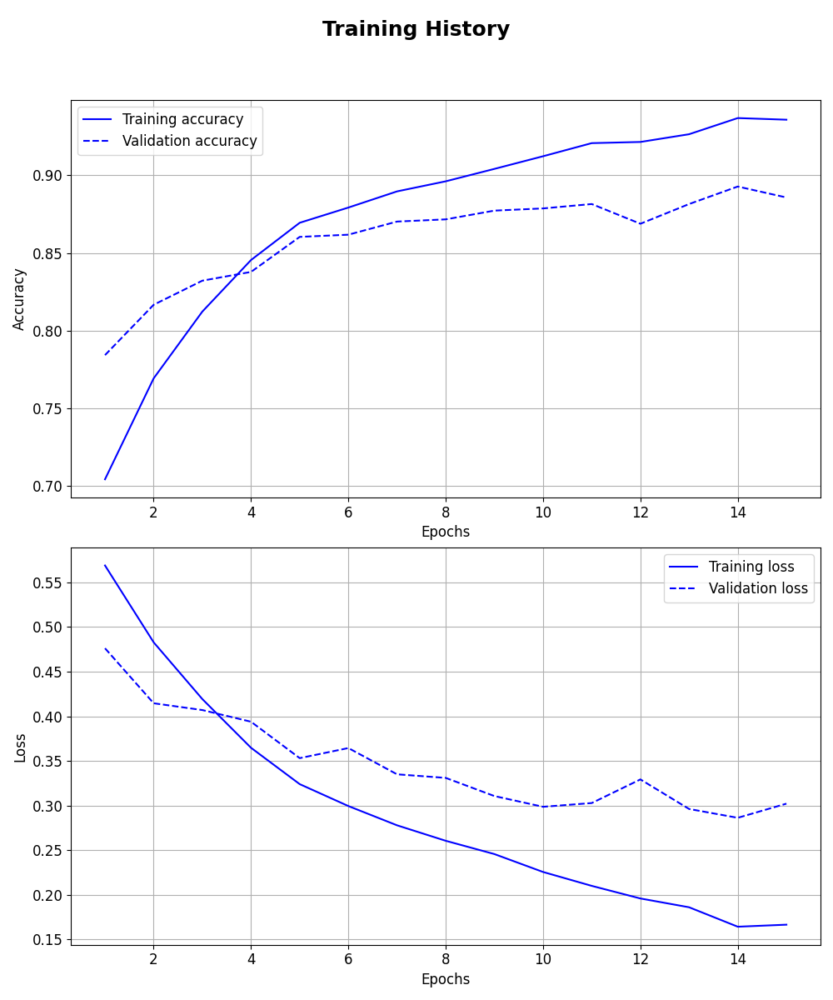

### Detailed Report of Test Set:

|              | precision    | recall       | f1-score     | support      |
| ------------ | ------------ | ------------ | ------------ | ------------ |
| chihuahua    | 0.9269       | 0.8476       | 0.8855       | 374          | 
| muffin       | 0.8455       | 0.9258       | 0.8839       | 337          | 
| micro avg    | 0.8847       | 0.8847       | 0.8847       | 711          | 
| macro avg    | 0.8862       | 0.8867       | 0.8847       | 711          | 
| weighted avg | 0.8883       | 0.8847       | 0.8847       | 711          | 
| samples avg  | 0.8847       | 0.8847       | 0.8847       | 711          | 

## trial_76

*    *Start Time*: 2024-10-27 12:30:34

*    *Duration*: 0:05:46.854

*    *Directory*: [Link](./trial_76)

### Hyperparameters:

| Hyperparameter        | Value                 |
| --------------------- | --------------------- |
| normalization         | standard              |
| batch_size            | 128                   |
| learning_rate         | 5.264597373986665e-05 |

### Evaluation Metrics:

|           | train     | val       | test      |
| --------- | --------- | --------- | --------- |
| accuracy  | 0.9088    | 0.8773    | 0.8847    | 
| precision | 0.9088    | 0.8773    | 0.8847    | 
| recall    | 0.9088    | 0.8773    | 0.8847    | 
| f1        | 0.9088    | 0.8773    | 0.8847    | 

### Figures:

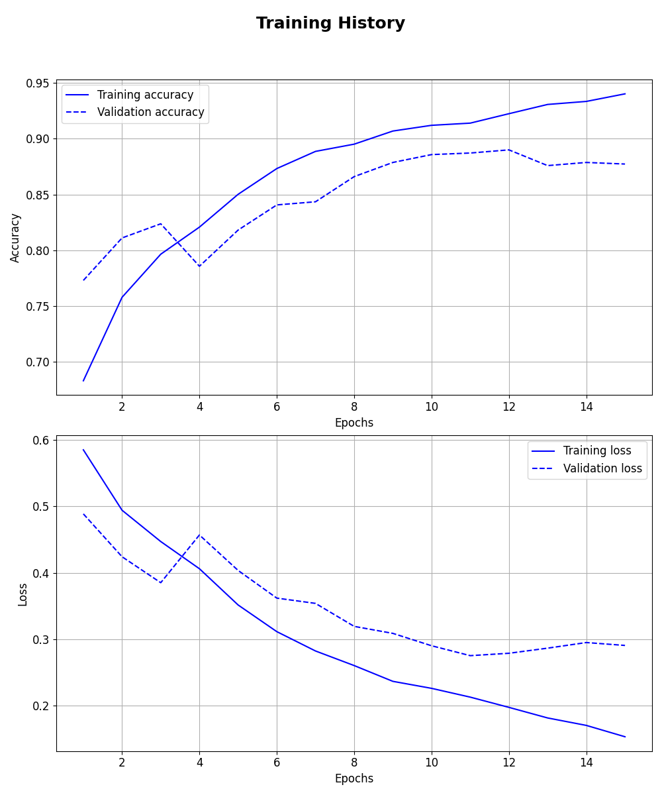

### Detailed Report of Test Set:

|              | precision    | recall       | f1-score     | support      |
| ------------ | ------------ | ------------ | ------------ | ------------ |
| chihuahua    | 0.8596       | 0.9332       | 0.8949       | 374          | 
| muffin       | 0.9180       | 0.8309       | 0.8723       | 337          | 
| micro avg    | 0.8847       | 0.8847       | 0.8847       | 711          | 
| macro avg    | 0.8888       | 0.8820       | 0.8836       | 711          | 
| weighted avg | 0.8873       | 0.8847       | 0.8842       | 711          | 
| samples avg  | 0.8847       | 0.8847       | 0.8847       | 711          | 

## trial_12

*    *Start Time*: 2024-10-24 11:49:23

*    *Duration*: 0:05:42.355

*    *Directory*: [Link](./trial_12)

### Hyperparameters:

| Hyperparameter        | Value                 |
| --------------------- | --------------------- |
| normalization         | standard              |
| batch_size            | 128                   |
| learning_rate         | 5.926602301178002e-05 |

### Evaluation Metrics:

|           | train     | val       | test      |
| --------- | --------- | --------- | --------- |
| accuracy  | 0.9608    | 0.8533    | 0.8833    | 
| precision | 0.9608    | 0.8533    | 0.8833    | 
| recall    | 0.9608    | 0.8533    | 0.8833    | 
| f1        | 0.9608    | 0.8533    | 0.8833    | 

### Figures:

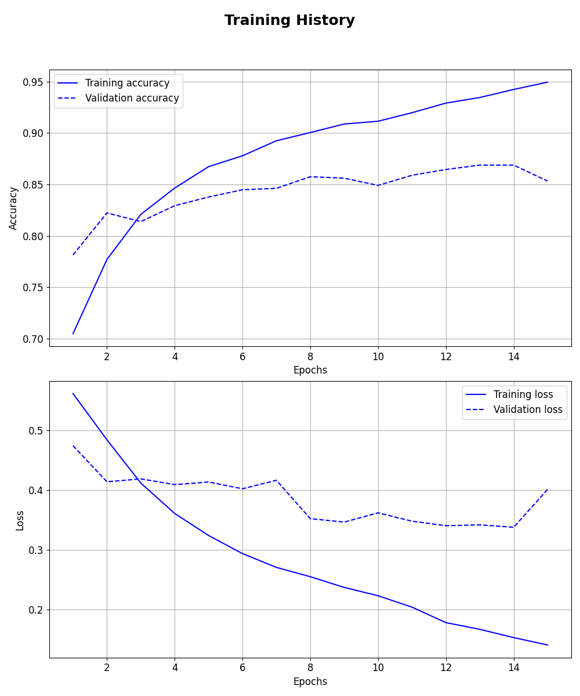

### Detailed Report of Test Set:

|              | precision    | recall       | f1-score     | support      |
| ------------ | ------------ | ------------ | ------------ | ------------ |
| chihuahua    | 0.9533       | 0.8182       | 0.8806       | 374          | 
| muffin       | 0.8256       | 0.9555       | 0.8858       | 337          | 
| micro avg    | 0.8833       | 0.8833       | 0.8833       | 711          | 
| macro avg    | 0.8895       | 0.8868       | 0.8832       | 711          | 
| weighted avg | 0.8928       | 0.8833       | 0.8831       | 711          | 
| samples avg  | 0.8833       | 0.8833       | 0.8833       | 711          | 

## trial_73

*    *Start Time*: 2024-10-27 12:13:07

*    *Duration*: 0:05:47.241

*    *Directory*: [Link](./trial_73)

### Hyperparameters:

| Hyperparameter        | Value                 |
| --------------------- | --------------------- |
| normalization         | standard              |
| batch_size            | 128                   |
| learning_rate         | 6.686534316065796e-05 |

### Evaluation Metrics:

|           | train     | val       | test      |
| --------- | --------- | --------- | --------- |
| accuracy  | 0.9691    | 0.8731    | 0.8833    | 
| precision | 0.9691    | 0.8731    | 0.8833    | 
| recall    | 0.9691    | 0.8731    | 0.8833    | 
| f1        | 0.9691    | 0.8731    | 0.8833    | 

### Figures:

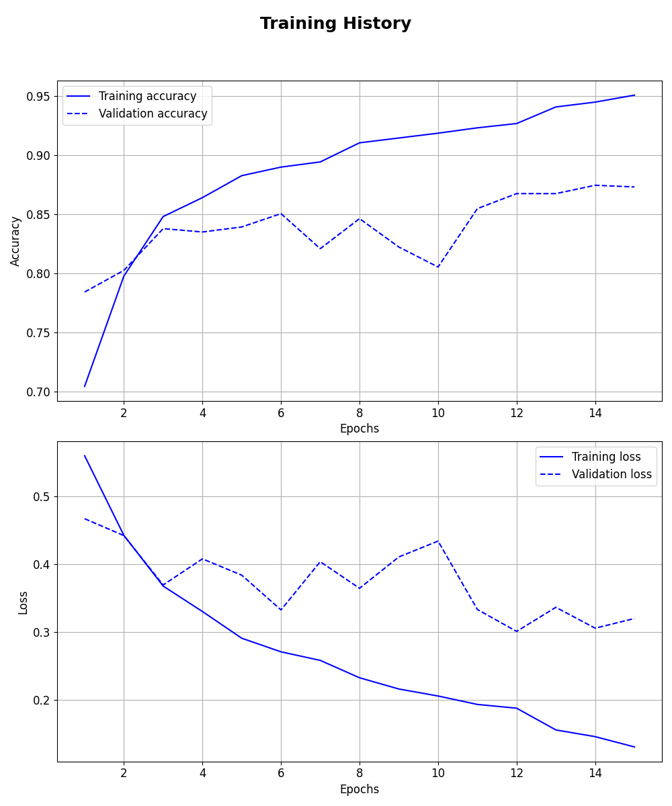

### Detailed Report of Test Set:

|              | precision    | recall       | f1-score     | support      |
| ------------ | ------------ | ------------ | ------------ | ------------ |
| chihuahua    | 0.9053       | 0.8690       | 0.8868       | 374          | 
| muffin       | 0.8608       | 0.8991       | 0.8795       | 337          | 
| micro avg    | 0.8833       | 0.8833       | 0.8833       | 711          | 
| macro avg    | 0.8830       | 0.8840       | 0.8832       | 711          | 
| weighted avg | 0.8842       | 0.8833       | 0.8833       | 711          | 
| samples avg  | 0.8833       | 0.8833       | 0.8833       | 711          | 

## trial_94

*    *Start Time*: 2024-10-27 14:15:05

*    *Duration*: 0:05:47.830

*    *Directory*: [Link](./trial_94)

### Hyperparameters:

| Hyperparameter         | Value                  |
| ---------------------- | ---------------------- |
| normalization          | standard               |
| batch_size             | 256                    |
| learning_rate          | 0.00019008372869416744 |

### Evaluation Metrics:

|           | train     | val       | test      |
| --------- | --------- | --------- | --------- |
| accuracy  | 0.9811    | 0.8731    | 0.8833    | 
| precision | 0.9811    | 0.8731    | 0.8833    | 
| recall    | 0.9811    | 0.8731    | 0.8833    | 
| f1        | 0.9811    | 0.8731    | 0.8833    | 

### Figures:

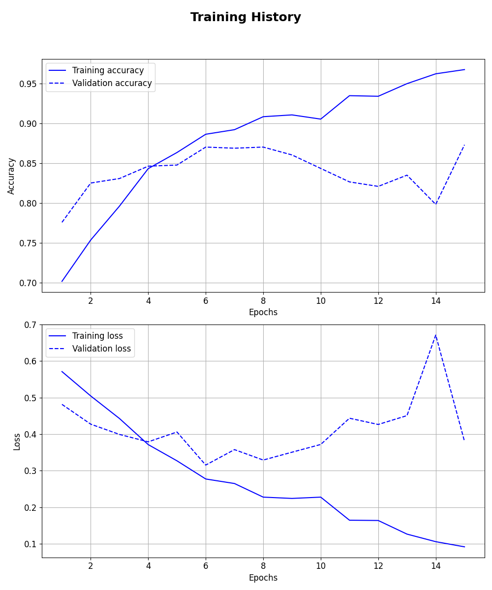

### Detailed Report of Test Set:

|              | precision    | recall       | f1-score     | support      |
| ------------ | ------------ | ------------ | ------------ | ------------ |
| chihuahua    | 0.9369       | 0.8342       | 0.8826       | 374          | 
| muffin       | 0.8360       | 0.9377       | 0.8839       | 337          | 
| micro avg    | 0.8833       | 0.8833       | 0.8833       | 711          | 
| macro avg    | 0.8865       | 0.8860       | 0.8833       | 711          | 
| weighted avg | 0.8891       | 0.8833       | 0.8832       | 711          | 
| samples avg  | 0.8833       | 0.8833       | 0.8833       | 711          | 

## trial_75

*    *Start Time*: 2024-10-27 12:24:46

*    *Duration*: 0:05:46.646

*    *Directory*: [Link](./trial_75)

### Hyperparameters:

| Hyperparameter        | Value                 |
| --------------------- | --------------------- |
| normalization         | standard              |
| batch_size            | 128                   |
| learning_rate         | 6.333189431174439e-05 |

### Evaluation Metrics:

|           | train     | val       | test      |
| --------- | --------- | --------- | --------- |
| accuracy  | 0.9580    | 0.8674    | 0.8819    | 
| precision | 0.9580    | 0.8674    | 0.8819    | 
| recall    | 0.9580    | 0.8674    | 0.8819    | 
| f1        | 0.9580    | 0.8674    | 0.8819    | 

### Figures:

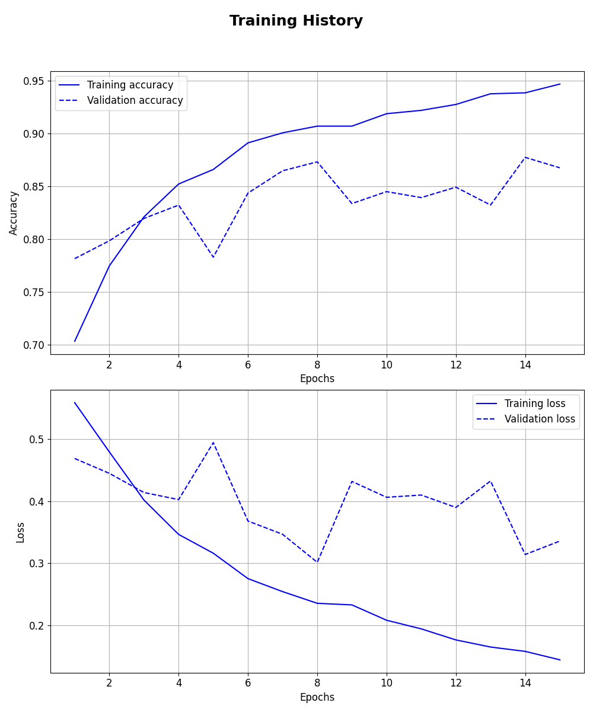

### Detailed Report of Test Set:

|              | precision    | recall       | f1-score     | support      |
| ------------ | ------------ | ------------ | ------------ | ------------ |
| chihuahua    | 0.9341       | 0.8342       | 0.8814       | 374          | 
| muffin       | 0.8355       | 0.9347       | 0.8824       | 337          | 
| micro avg    | 0.8819       | 0.8819       | 0.8819       | 711          | 
| macro avg    | 0.8848       | 0.8845       | 0.8819       | 711          | 
| weighted avg | 0.8874       | 0.8819       | 0.8818       | 711          | 
| samples avg  | 0.8819       | 0.8819       | 0.8819       | 711          | 

## trial_9

*    *Start Time*: 2024-10-24 11:32:06

*    *Duration*: 0:05:44.011

*    *Directory*: [Link](./trial_9)

### Hyperparameters:

| Hyperparameter        | Value                 |
| --------------------- | --------------------- |
| normalization         | min_max               |
| batch_size            | 64                    |
| learning_rate         | 8.270933741837025e-05 |

### Evaluation Metrics:

|           | train     | val       | test      |
| --------- | --------- | --------- | --------- |
| accuracy  | 0.9591    | 0.8815    | 0.8805    | 
| precision | 0.9591    | 0.8815    | 0.8805    | 
| recall    | 0.9591    | 0.8815    | 0.8805    | 
| f1        | 0.9591    | 0.8815    | 0.8805    | 

### Figures:

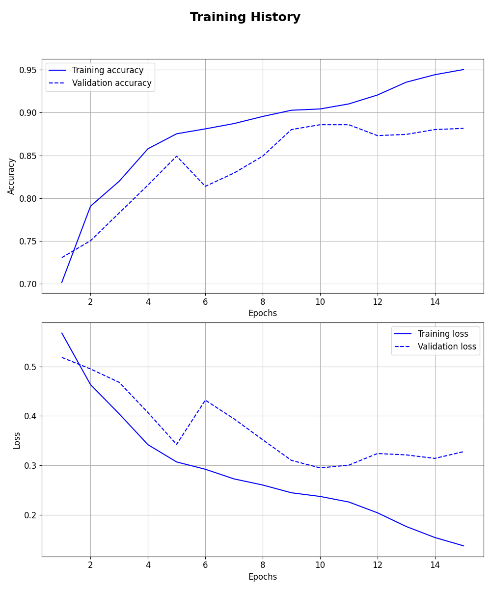

### Detailed Report of Test Set:

|              | precision    | recall       | f1-score     | support      |
| ------------ | ------------ | ------------ | ------------ | ------------ |
| chihuahua    | 0.9213       | 0.8449       | 0.8815       | 374          | 
| muffin       | 0.8424       | 0.9199       | 0.8794       | 337          | 
| micro avg    | 0.8805       | 0.8805       | 0.8805       | 711          | 
| macro avg    | 0.8818       | 0.8824       | 0.8804       | 711          | 
| weighted avg | 0.8839       | 0.8805       | 0.8805       | 711          | 
| samples avg  | 0.8805       | 0.8805       | 0.8805       | 711          | 

## trial_69

*    *Start Time*: 2024-10-27 11:49:25

*    *Duration*: 0:05:48.234

*    *Directory*: [Link](./trial_69)

### Hyperparameters:

| Hyperparameter        | Value                 |
| --------------------- | --------------------- |
| normalization         | standard              |
| batch_size            | 128                   |
| learning_rate         | 8.414169062224173e-05 |

### Evaluation Metrics:

|           | train     | val       | test      |
| --------- | --------- | --------- | --------- |
| accuracy  | 0.9780    | 0.8561    | 0.8805    | 
| precision | 0.9780    | 0.8561    | 0.8805    | 
| recall    | 0.9780    | 0.8561    | 0.8805    | 
| f1        | 0.9780    | 0.8561    | 0.8805    | 

### Figures:

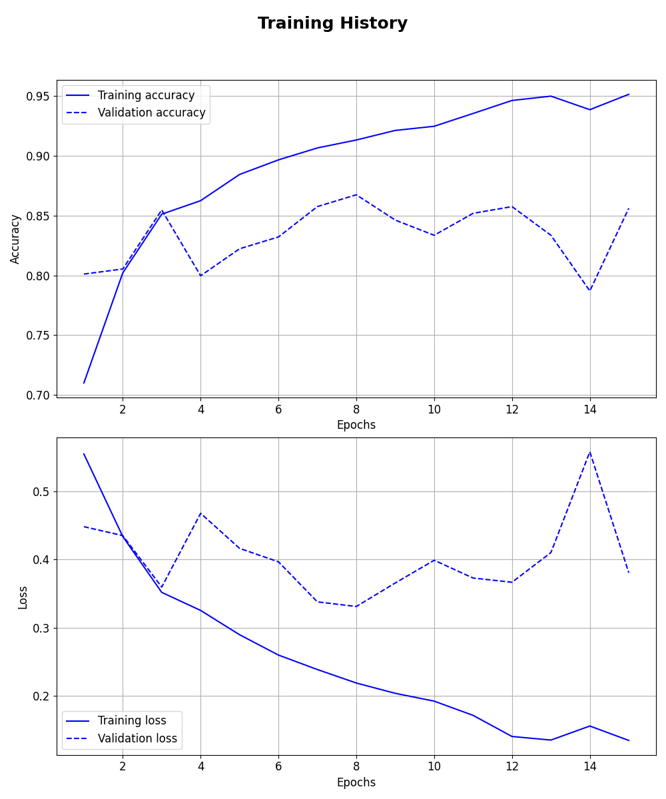

### Detailed Report of Test Set:

|              | precision    | recall       | f1-score     | support      |
| ------------ | ------------ | ------------ | ------------ | ------------ |
| chihuahua    | 0.9419       | 0.8235       | 0.8787       | 374          | 
| muffin       | 0.8281       | 0.9436       | 0.8821       | 337          | 
| micro avg    | 0.8805       | 0.8805       | 0.8805       | 711          | 
| macro avg    | 0.8850       | 0.8836       | 0.8804       | 711          | 
| weighted avg | 0.8880       | 0.8805       | 0.8803       | 711          | 
| samples avg  | 0.8805       | 0.8805       | 0.8805       | 711          | 

## trial_40

*    *Start Time*: 2024-10-24 14:30:45

*    *Duration*: 0:05:45.881

*    *Directory*: [Link](./trial_40)

### Hyperparameters:

| Hyperparameter        | Value                 |
| --------------------- | --------------------- |
| normalization         | standard              |
| batch_size            | 64                    |
| learning_rate         | 0.0003284361253908182 |

### Evaluation Metrics:

|           | train     | val       | test      |
| --------- | --------- | --------- | --------- |
| accuracy  | 0.9902    | 0.8829    | 0.8790    | 
| precision | 0.9902    | 0.8829    | 0.8790    | 
| recall    | 0.9902    | 0.8829    | 0.8790    | 
| f1        | 0.9902    | 0.8829    | 0.8790    | 

### Figures:

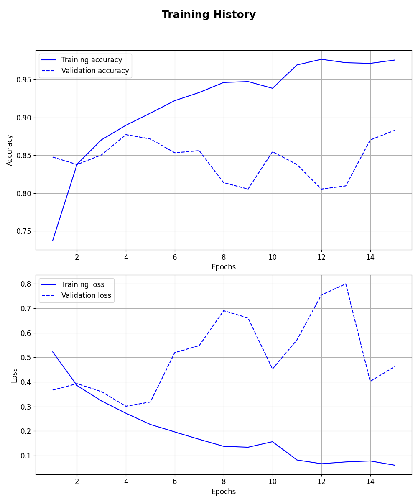

### Detailed Report of Test Set:

|              | precision    | recall       | f1-score     | support      |
| ------------ | ------------ | ------------ | ------------ | ------------ |
| chihuahua    | 0.9114       | 0.8529       | 0.8812       | 374          | 
| muffin       | 0.8476       | 0.9080       | 0.8768       | 337          | 
| micro avg    | 0.8790       | 0.8790       | 0.8790       | 711          | 
| macro avg    | 0.8795       | 0.8805       | 0.8790       | 711          | 
| weighted avg | 0.8812       | 0.8790       | 0.8791       | 711          | 
| samples avg  | 0.8790       | 0.8790       | 0.8790       | 711          | 

## trial_52

*    *Start Time*: 2024-10-24 15:39:59

*    *Duration*: 0:05:42.311

*    *Directory*: [Link](./trial_52)

### Hyperparameters:

| Hyperparameter        | Value                 |
| --------------------- | --------------------- |
| normalization         | standard              |
| batch_size            | 128                   |
| learning_rate         | 5.749495138375783e-05 |

### Evaluation Metrics:

|           | train     | val       | test      |
| --------- | --------- | --------- | --------- |
| accuracy  | 0.9461    | 0.8646    | 0.8790    | 
| precision | 0.9461    | 0.8646    | 0.8790    | 
| recall    | 0.9461    | 0.8646    | 0.8790    | 
| f1        | 0.9461    | 0.8646    | 0.8790    | 

### Figures:

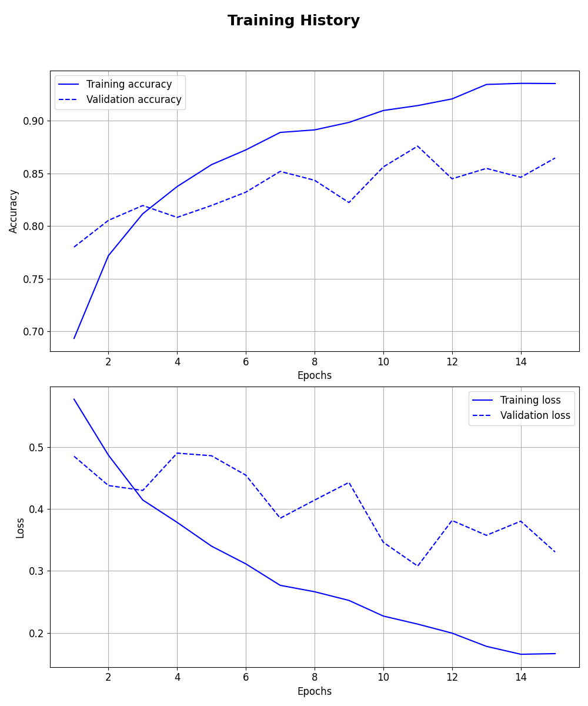

### Detailed Report of Test Set:

|              | precision    | recall       | f1-score     | support      |
| ------------ | ------------ | ------------ | ------------ | ------------ |
| chihuahua    | 0.9286       | 0.8342       | 0.8789       | 374          | 
| muffin       | 0.8347       | 0.9288       | 0.8792       | 337          | 
| micro avg    | 0.8790       | 0.8790       | 0.8790       | 711          | 
| macro avg    | 0.8816       | 0.8815       | 0.8790       | 711          | 
| weighted avg | 0.8841       | 0.8790       | 0.8790       | 711          | 
| samples avg  | 0.8790       | 0.8790       | 0.8790       | 711          | 

## trial_22

*    *Start Time*: 2024-10-24 12:46:49

*    *Duration*: 0:05:43.322

*    *Directory*: [Link](./trial_22)

### Hyperparameters:

| Hyperparameter        | Value                 |
| --------------------- | --------------------- |
| normalization         | standard              |
| batch_size            | 128                   |
| learning_rate         | 5.195724544108992e-05 |

### Evaluation Metrics:

|           | train     | val       | test      |
| --------- | --------- | --------- | --------- |
| accuracy  | 0.9586    | 0.8547    | 0.8790    | 
| precision | 0.9586    | 0.8547    | 0.8790    | 
| recall    | 0.9586    | 0.8547    | 0.8790    | 
| f1        | 0.9586    | 0.8547    | 0.8790    | 

### Figures:

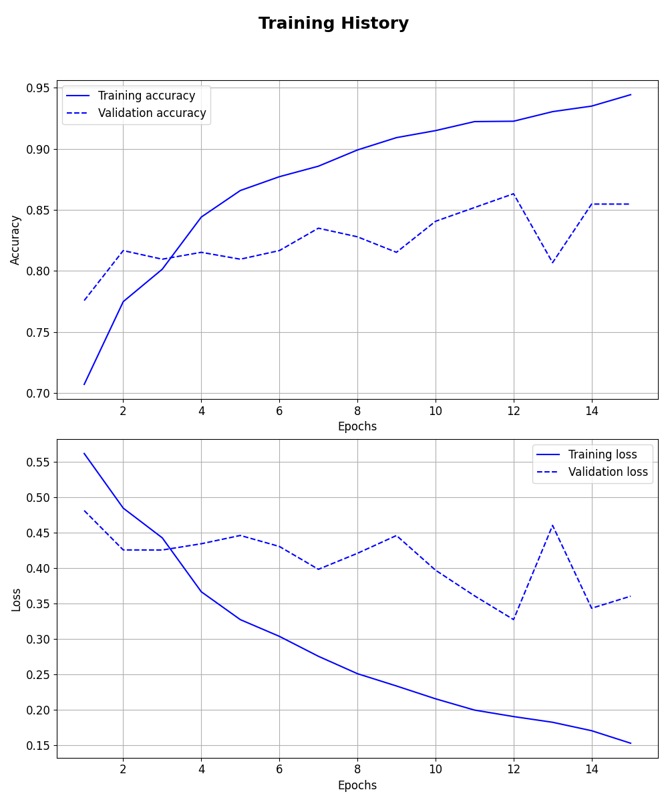

### Detailed Report of Test Set:

|              | precision    | recall       | f1-score     | support      |
| ------------ | ------------ | ------------ | ------------ | ------------ |
| chihuahua    | 0.9528       | 0.8102       | 0.8757       | 374          | 
| muffin       | 0.8193       | 0.9555       | 0.8822       | 337          | 
| micro avg    | 0.8790       | 0.8790       | 0.8790       | 711          | 
| macro avg    | 0.8861       | 0.8828       | 0.8790       | 711          | 
| weighted avg | 0.8896       | 0.8790       | 0.8788       | 711          | 
| samples avg  | 0.8790       | 0.8790       | 0.8790       | 711          | 

## trial_24

*    *Start Time*: 2024-10-24 12:58:20

*    *Duration*: 0:05:41.696

*    *Directory*: [Link](./trial_24)

### Hyperparameters:

| Hyperparameter        | Value                 |
| --------------------- | --------------------- |
| normalization         | standard              |
| batch_size            | 128                   |
| learning_rate         | 6.038010386044716e-05 |

### Evaluation Metrics:

|           | train     | val       | test      |
| --------- | --------- | --------- | --------- |
| accuracy  | 0.9500    | 0.8674    | 0.8790    | 
| precision | 0.9500    | 0.8674    | 0.8790    | 
| recall    | 0.9500    | 0.8674    | 0.8790    | 
| f1        | 0.9500    | 0.8674    | 0.8790    | 

### Figures:

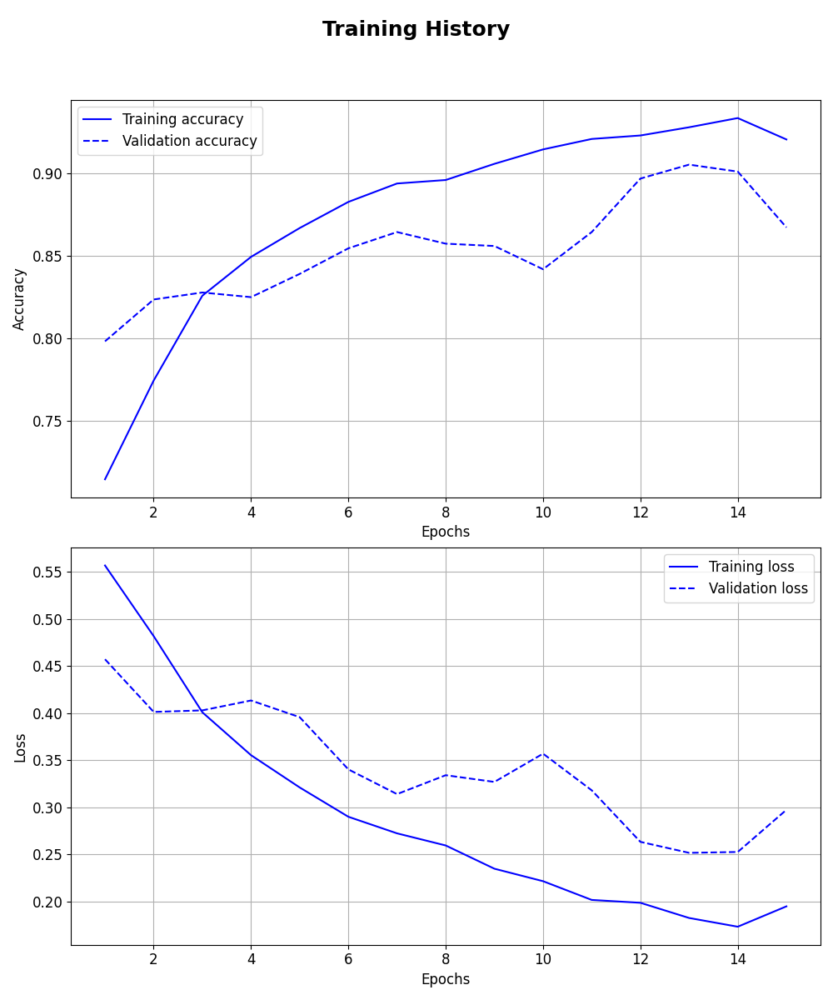

### Detailed Report of Test Set:

|              | precision    | recall       | f1-score     | support      |
| ------------ | ------------ | ------------ | ------------ | ------------ |
| chihuahua    | 0.9417       | 0.8209       | 0.8771       | 374          | 
| muffin       | 0.8260       | 0.9436       | 0.8809       | 337          | 
| micro avg    | 0.8790       | 0.8790       | 0.8790       | 711          | 
| macro avg    | 0.8838       | 0.8822       | 0.8790       | 711          | 
| weighted avg | 0.8869       | 0.8790       | 0.8789       | 711          | 
| samples avg  | 0.8790       | 0.8790       | 0.8790       | 711          | 

## trial_48

*    *Start Time*: 2024-10-24 15:16:57

*    *Duration*: 0:05:45.407

*    *Directory*: [Link](./trial_48)

### Hyperparameters:

| Hyperparameter         | Value                  |
| ---------------------- | ---------------------- |
| normalization          | min_max                |
| batch_size             | 64                     |
| learning_rate          | 5.4805598691575897e-05 |

### Evaluation Metrics:

|           | train     | val       | test      |
| --------- | --------- | --------- | --------- |
| accuracy  | 0.9366    | 0.8618    | 0.8790    | 
| precision | 0.9366    | 0.8618    | 0.8790    | 
| recall    | 0.9366    | 0.8618    | 0.8790    | 
| f1        | 0.9366    | 0.8618    | 0.8790    | 

### Figures:

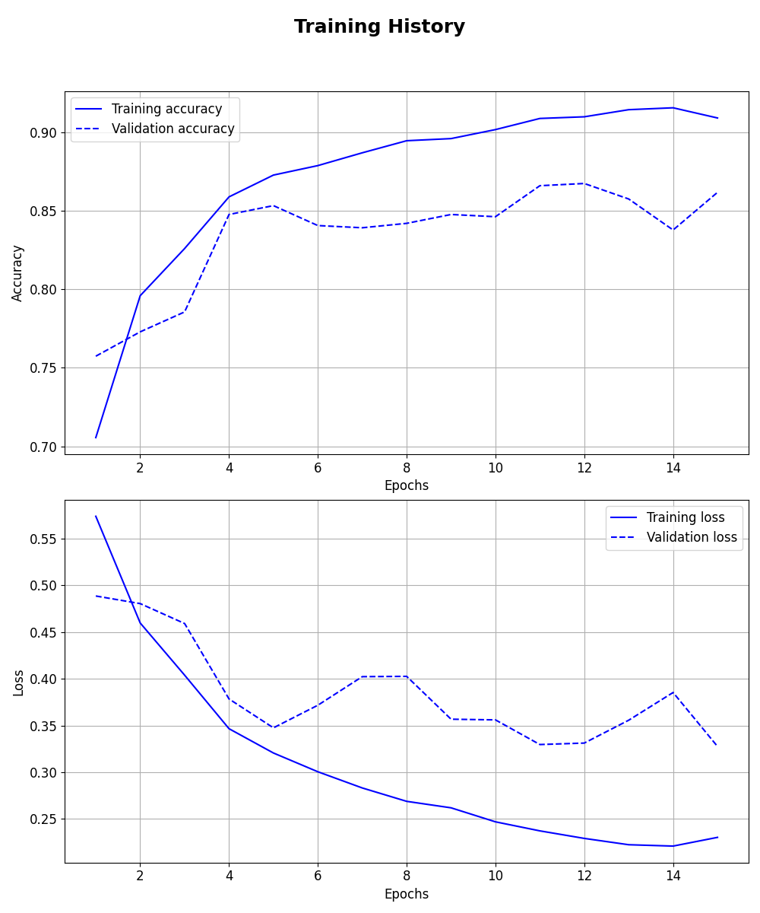

### Detailed Report of Test Set:

|              | precision    | recall       | f1-score     | support      |
| ------------ | ------------ | ------------ | ------------ | ------------ |
| chihuahua    | 0.9235       | 0.8396       | 0.8796       | 374          | 
| muffin       | 0.8383       | 0.9228       | 0.8785       | 337          | 
| micro avg    | 0.8790       | 0.8790       | 0.8790       | 711          | 
| macro avg    | 0.8809       | 0.8812       | 0.8790       | 711          | 
| weighted avg | 0.8831       | 0.8790       | 0.8791       | 711          | 
| samples avg  | 0.8790       | 0.8790       | 0.8790       | 711          | 

## trial_2

*    *Start Time*: 2024-10-26 19:01:32

*    *Duration*: 0:05:49.936

*    *Directory*: [Link](./trial_2)

### Hyperparameters:

| Hyperparameter        | Value                 |
| --------------------- | --------------------- |
| normalization         | standard              |
| batch_size            | 128                   |
| learning_rate         | 8.031652071126985e-05 |

### Evaluation Metrics:

|           | train     | val       | test      |
| --------- | --------- | --------- | --------- |
| accuracy  | 0.9771    | 0.8702    | 0.8790    | 
| precision | 0.9771    | 0.8702    | 0.8790    | 
| recall    | 0.9771    | 0.8702    | 0.8790    | 
| f1        | 0.9771    | 0.8702    | 0.8790    | 

### Figures:

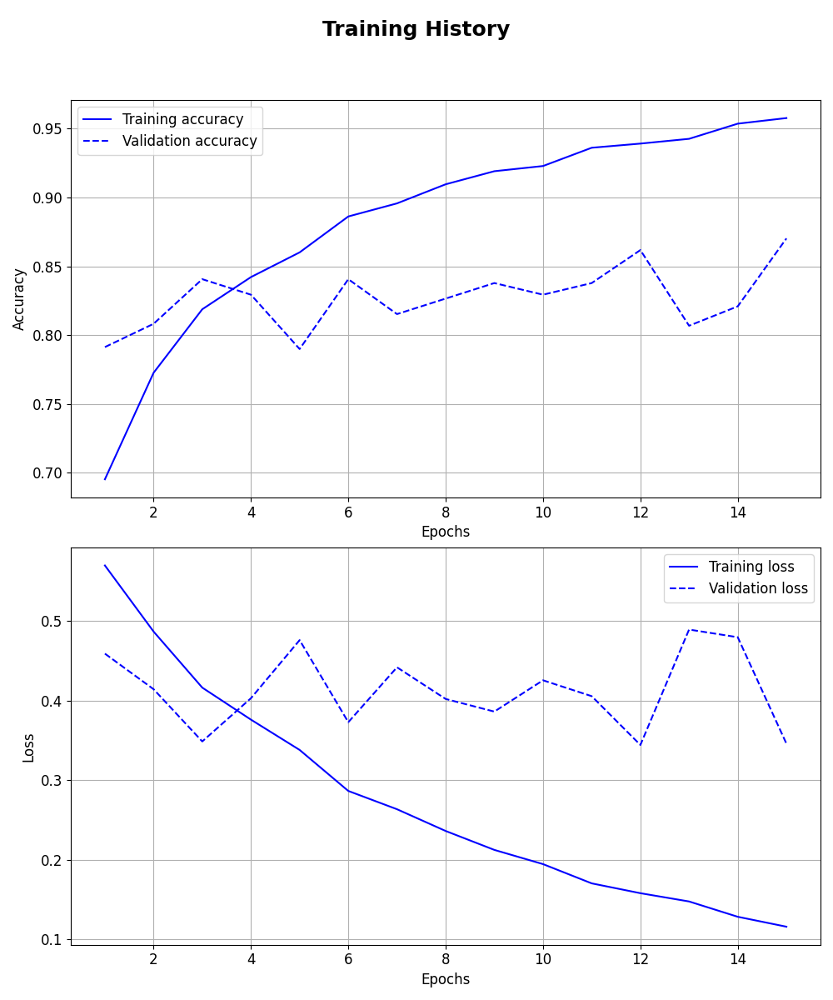

### Detailed Report of Test Set:

|              | precision    | recall       | f1-score     | support      |
| ------------ | ------------ | ------------ | ------------ | ------------ |
| chihuahua    | 0.9390       | 0.8235       | 0.8775       | 374          | 
| muffin       | 0.8277       | 0.9407       | 0.8806       | 337          | 
| micro avg    | 0.8790       | 0.8790       | 0.8790       | 711          | 
| macro avg    | 0.8834       | 0.8821       | 0.8790       | 711          | 
| weighted avg | 0.8862       | 0.8790       | 0.8789       | 711          | 
| samples avg  | 0.8790       | 0.8790       | 0.8790       | 711          | 

## trial_46

*    *Start Time*: 2024-10-24 15:05:24

*    *Duration*: 0:05:45.281

*    *Directory*: [Link](./trial_46)

### Hyperparameters:

| Hyperparameter        | Value                 |
| --------------------- | --------------------- |
| normalization         | standard              |
| batch_size            | 128                   |
| learning_rate         | 6.419737105342103e-05 |

### Evaluation Metrics:

|           | train     | val       | test      |
| --------- | --------- | --------- | --------- |
| accuracy  | 0.9573    | 0.8674    | 0.8790    | 
| precision | 0.9573    | 0.8674    | 0.8790    | 
| recall    | 0.9573    | 0.8674    | 0.8790    | 
| f1        | 0.9573    | 0.8674    | 0.8790    | 

### Figures:

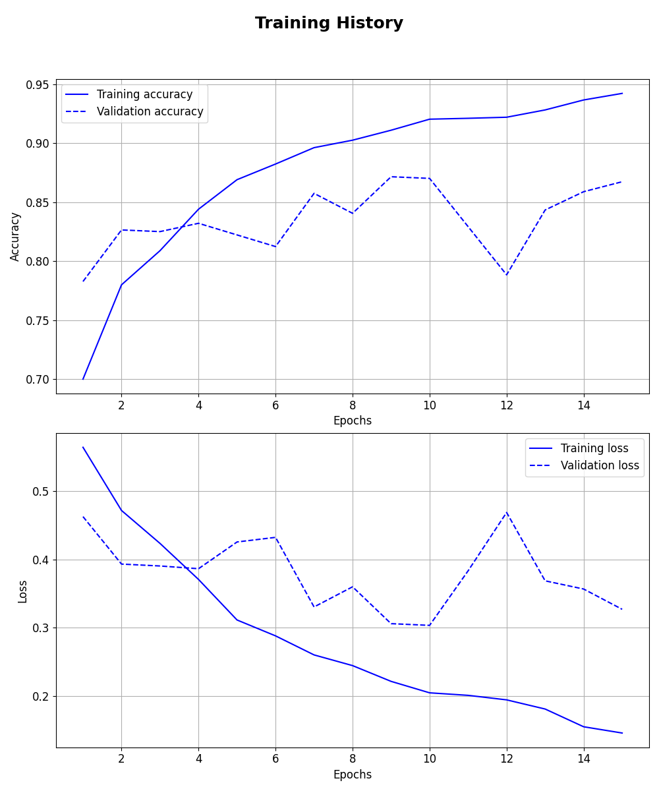

### Detailed Report of Test Set:

|              | precision    | recall       | f1-score     | support      |
| ------------ | ------------ | ------------ | ------------ | ------------ |
| chihuahua    | 0.9472       | 0.8155       | 0.8764       | 374          | 
| muffin       | 0.8226       | 0.9496       | 0.8815       | 337          | 
| micro avg    | 0.8790       | 0.8790       | 0.8790       | 711          | 
| macro avg    | 0.8849       | 0.8825       | 0.8790       | 711          | 
| weighted avg | 0.8882       | 0.8790       | 0.8789       | 711          | 
| samples avg  | 0.8790       | 0.8790       | 0.8790       | 711          | 

## trial_53

*    *Start Time*: 2024-10-24 15:45:43

*    *Duration*: 0:05:42.890

*    *Directory*: [Link](./trial_53)

### Hyperparameters:

| Hyperparameter        | Value                 |
| --------------------- | --------------------- |
| normalization         | standard              |
| batch_size            | 128                   |
| learning_rate         | 7.254639933188494e-05 |

### Evaluation Metrics:

|           | train     | val       | test      |
| --------- | --------- | --------- | --------- |
| accuracy  | 0.9668    | 0.8575    | 0.8790    | 
| precision | 0.9668    | 0.8575    | 0.8790    | 
| recall    | 0.9668    | 0.8575    | 0.8790    | 
| f1        | 0.9668    | 0.8575    | 0.8790    | 

### Figures:

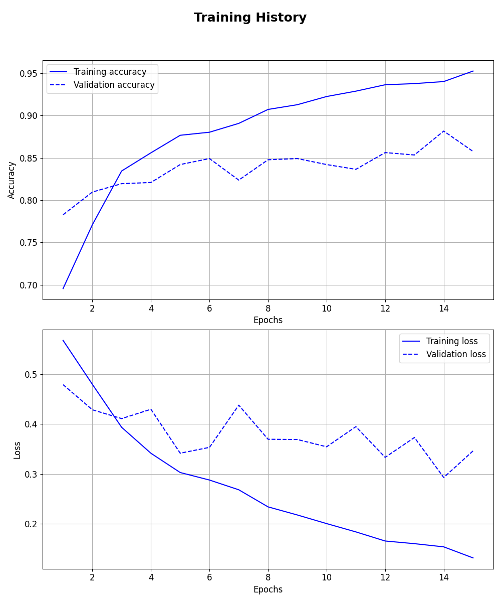

### Detailed Report of Test Set:

|              | precision    | recall       | f1-score     | support      |
| ------------ | ------------ | ------------ | ------------ | ------------ |
| chihuahua    | 0.9528       | 0.8102       | 0.8757       | 374          | 
| muffin       | 0.8193       | 0.9555       | 0.8822       | 337          | 
| micro avg    | 0.8790       | 0.8790       | 0.8790       | 711          | 
| macro avg    | 0.8861       | 0.8828       | 0.8790       | 711          | 
| weighted avg | 0.8896       | 0.8790       | 0.8788       | 711          | 
| samples avg  | 0.8790       | 0.8790       | 0.8790       | 711          | 

## trial_72

*    *Start Time*: 2024-10-27 12:06:50

*    *Duration*: 0:06:15.727

*    *Directory*: [Link](./trial_72)

### Hyperparameters:

| Hyperparameter        | Value                 |
| --------------------- | --------------------- |
| normalization         | standard              |
| batch_size            | 64                    |
| learning_rate         | 7.946057574027285e-05 |

### Evaluation Metrics:

|           | train     | val       | test      |
| --------- | --------- | --------- | --------- |
| accuracy  | 0.9848    | 0.8604    | 0.8790    | 
| precision | 0.9848    | 0.8604    | 0.8790    | 
| recall    | 0.9848    | 0.8604    | 0.8790    | 
| f1        | 0.9848    | 0.8604    | 0.8790    | 

### Figures:

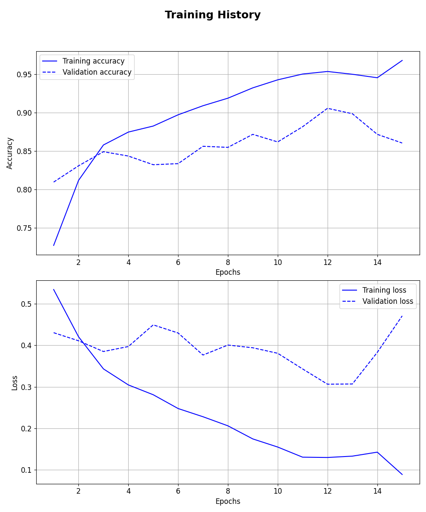

### Detailed Report of Test Set:

|              | precision    | recall       | f1-score     | support      |
| ------------ | ------------ | ------------ | ------------ | ------------ |
| chihuahua    | 0.9528       | 0.8102       | 0.8757       | 374          | 
| muffin       | 0.8193       | 0.9555       | 0.8822       | 337          | 
| micro avg    | 0.8790       | 0.8790       | 0.8790       | 711          | 
| macro avg    | 0.8861       | 0.8828       | 0.8790       | 711          | 
| weighted avg | 0.8896       | 0.8790       | 0.8788       | 711          | 
| samples avg  | 0.8790       | 0.8790       | 0.8790       | 711          | 

## trial_10

*    *Start Time*: 2024-10-24 11:37:52

*    *Duration*: 0:05:45.990

*    *Directory*: [Link](./trial_10)

### Hyperparameters:

| Hyperparameter         | Value                  |
| ---------------------- | ---------------------- |
| normalization          | min_max                |
| batch_size             | 32                     |
| learning_rate          | 0.00041427185155288145 |

### Evaluation Metrics:

|           | train     | val       | test      |
| --------- | --------- | --------- | --------- |
| accuracy  | 0.9620    | 0.8646    | 0.8776    | 
| precision | 0.9620    | 0.8646    | 0.8776    | 
| recall    | 0.9620    | 0.8646    | 0.8776    | 
| f1        | 0.9620    | 0.8646    | 0.8776    | 

### Figures:

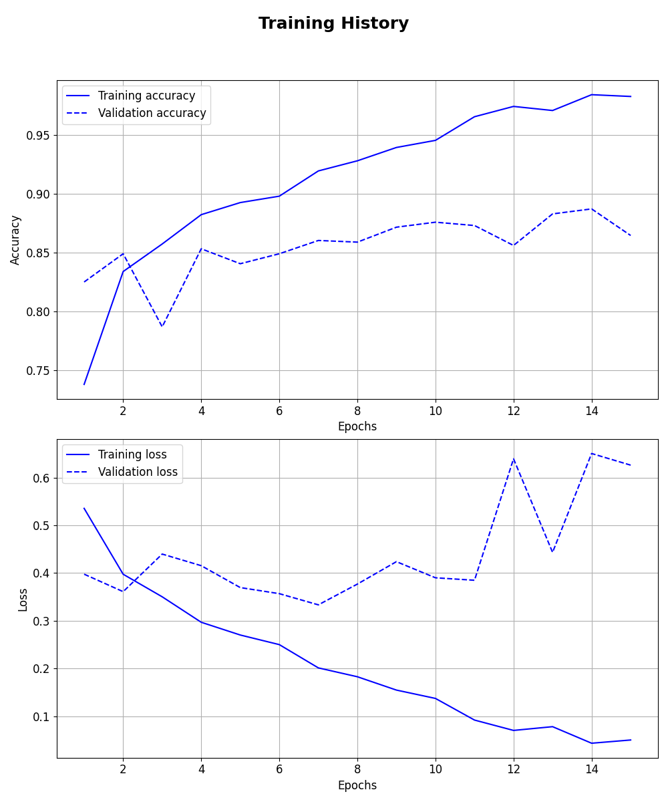

### Detailed Report of Test Set:

|              | precision    | recall       | f1-score     | support      |
| ------------ | ------------ | ------------ | ------------ | ------------ |
| chihuahua    | 0.8329       | 0.9599       | 0.8919       | 374          | 
| muffin       | 0.9464       | 0.7864       | 0.8590       | 337          | 
| micro avg    | 0.8776       | 0.8776       | 0.8776       | 711          | 
| macro avg    | 0.8897       | 0.8731       | 0.8755       | 711          | 
| weighted avg | 0.8867       | 0.8776       | 0.8763       | 711          | 
| samples avg  | 0.8776       | 0.8776       | 0.8776       | 711          | 

## trial_36

*    *Start Time*: 2024-10-24 14:07:23

*    *Duration*: 0:05:47.086

*    *Directory*: [Link](./trial_36)

### Hyperparameters:

| Hyperparameter        | Value                 |
| --------------------- | --------------------- |
| normalization         | standard              |
| batch_size            | 64                    |
| learning_rate         | 9.395264280263828e-05 |

### Evaluation Metrics:

|           | train     | val       | test      |
| --------- | --------- | --------- | --------- |
| accuracy  | 0.9876    | 0.8646    | 0.8748    | 
| precision | 0.9876    | 0.8646    | 0.8748    | 
| recall    | 0.9876    | 0.8646    | 0.8748    | 
| f1        | 0.9876    | 0.8646    | 0.8748    | 

### Figures:

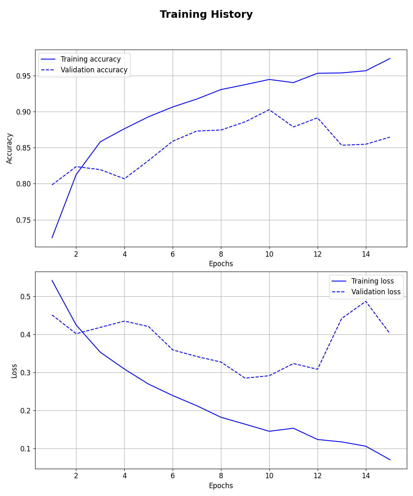

### Detailed Report of Test Set:

|              | precision    | recall       | f1-score     | support      |
| ------------ | ------------ | ------------ | ------------ | ------------ |
| chihuahua    | 0.9495       | 0.8048       | 0.8712       | 374          | 
| muffin       | 0.8147       | 0.9525       | 0.8782       | 337          | 
| micro avg    | 0.8748       | 0.8748       | 0.8748       | 711          | 
| macro avg    | 0.8821       | 0.8787       | 0.8747       | 711          | 
| weighted avg | 0.8856       | 0.8748       | 0.8745       | 711          | 
| samples avg  | 0.8748       | 0.8748       | 0.8748       | 711          | 

## trial_47

*    *Start Time*: 2024-10-24 15:11:11

*    *Duration*: 0:05:43.775

*    *Directory*: [Link](./trial_47)

### Hyperparameters:

| Hyperparameter         | Value                  |
| ---------------------- | ---------------------- |
| normalization          | standard               |
| batch_size             | 256                    |
| learning_rate          | 0.00025305054466329103 |

### Evaluation Metrics:

|           | train     | val       | test      |
| --------- | --------- | --------- | --------- |
| accuracy  | 0.9858    | 0.8632    | 0.8748    | 
| precision | 0.9858    | 0.8632    | 0.8748    | 
| recall    | 0.9858    | 0.8632    | 0.8748    | 
| f1        | 0.9858    | 0.8632    | 0.8748    | 

### Figures:

### Detailed Report of Test Set:

|              | precision    | recall       | f1-score     | support      |
| ------------ | ------------ | ------------ | ------------ | ------------ |
| chihuahua    | 0.9385       | 0.8155       | 0.8727       | 374          | 
| muffin       | 0.8212       | 0.9407       | 0.8769       | 337          | 
| micro avg    | 0.8748       | 0.8748       | 0.8748       | 711          | 
| macro avg    | 0.8799       | 0.8781       | 0.8748       | 711          | 
| weighted avg | 0.8829       | 0.8748       | 0.8747       | 711          | 
| samples avg  | 0.8748       | 0.8748       | 0.8748       | 711          | 

## trial_39

*    *Start Time*: 2024-10-24 14:24:56

*    *Duration*: 0:05:47.625

*    *Directory*: [Link](./trial_39)

### Hyperparameters:

| Hyperparameter       | Value                |
| -------------------- | -------------------- |
| normalization        | mean                 |
| batch_size           | 128                  |
| learning_rate        | 6.94074315304222e-05 |

### Evaluation Metrics:

|           | train     | val       | test      |
| --------- | --------- | --------- | --------- |
| accuracy  | 0.9336    | 0.8731    | 0.8748    | 
| precision | 0.9336    | 0.8731    | 0.8748    | 
| recall    | 0.9336    | 0.8731    | 0.8748    | 
| f1        | 0.9336    | 0.8731    | 0.8748    | 

### Figures:

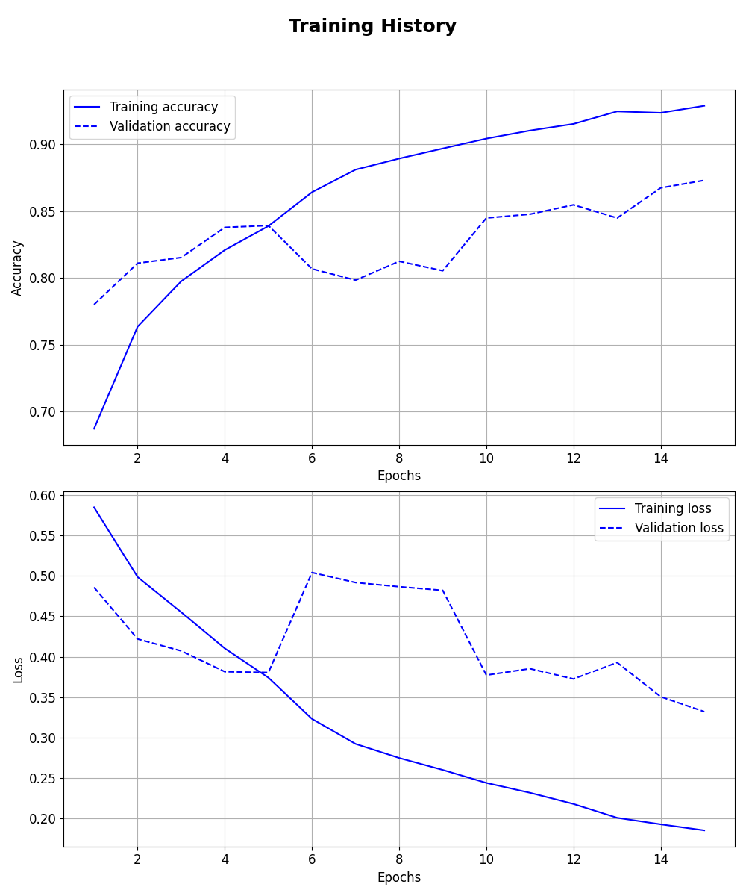

### Detailed Report of Test Set:

|              | precision    | recall       | f1-score     | support      |
| ------------ | ------------ | ------------ | ------------ | ------------ |
| chihuahua    | 0.9385       | 0.8155       | 0.8727       | 374          | 
| muffin       | 0.8212       | 0.9407       | 0.8769       | 337          | 
| micro avg    | 0.8748       | 0.8748       | 0.8748       | 711          | 
| macro avg    | 0.8799       | 0.8781       | 0.8748       | 711          | 
| weighted avg | 0.8829       | 0.8748       | 0.8747       | 711          | 
| samples avg  | 0.8748       | 0.8748       | 0.8748       | 711          | 

## trial_5

*    *Start Time*: 2024-10-26 19:19:30

*    *Duration*: 0:05:46.832

*    *Directory*: [Link](./trial_5)

### Hyperparameters:

| Hyperparameter        | Value                 |
| --------------------- | --------------------- |
| normalization         | standard              |
| batch_size            | 128                   |
| learning_rate         | 5.501885452747271e-05 |

### Evaluation Metrics:

|           | train     | val       | test      |
| --------- | --------- | --------- | --------- |
| accuracy  | 0.9506    | 0.8561    | 0.8734    | 
| precision | 0.9506    | 0.8561    | 0.8734    | 
| recall    | 0.9506    | 0.8561    | 0.8734    | 
| f1        | 0.9506    | 0.8561    | 0.8734    | 

### Figures:

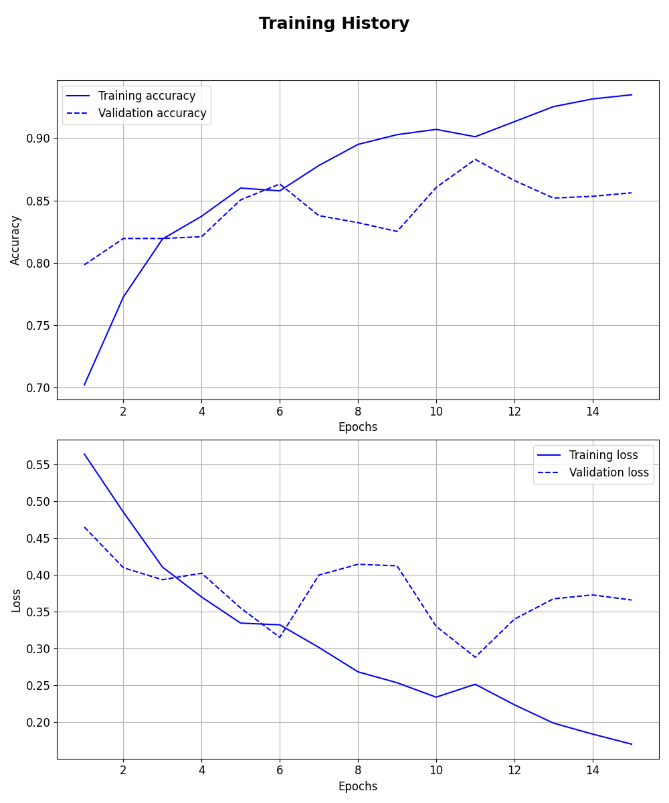

### Detailed Report of Test Set:

|              | precision    | recall       | f1-score     | support      |
| ------------ | ------------ | ------------ | ------------ | ------------ |
| chihuahua    | 0.9610       | 0.7914       | 0.8680       | 374          | 
| muffin       | 0.8065       | 0.9644       | 0.8784       | 337          | 
| micro avg    | 0.8734       | 0.8734       | 0.8734       | 711          | 
| macro avg    | 0.8837       | 0.8779       | 0.8732       | 711          | 
| weighted avg | 0.8878       | 0.8734       | 0.8729       | 711          | 
| samples avg  | 0.8734       | 0.8734       | 0.8734       | 711          | 

## trial_54

*    *Start Time*: 2024-10-24 15:51:28

*    *Duration*: 0:05:45.106

*    *Directory*: [Link](./trial_54)

### Hyperparameters:

| Hyperparameter         | Value                  |
| ---------------------- | ---------------------- |
| normalization          | standard               |
| batch_size             | 128                    |
| learning_rate          | 5.1392689515924926e-05 |

### Evaluation Metrics:

|           | train     | val       | test      |
| --------- | --------- | --------- | --------- |
| accuracy  | 0.9585    | 0.8646    | 0.8734    | 
| precision | 0.9585    | 0.8646    | 0.8734    | 
| recall    | 0.9585    | 0.8646    | 0.8734    | 
| f1        | 0.9585    | 0.8646    | 0.8734    | 

### Figures:

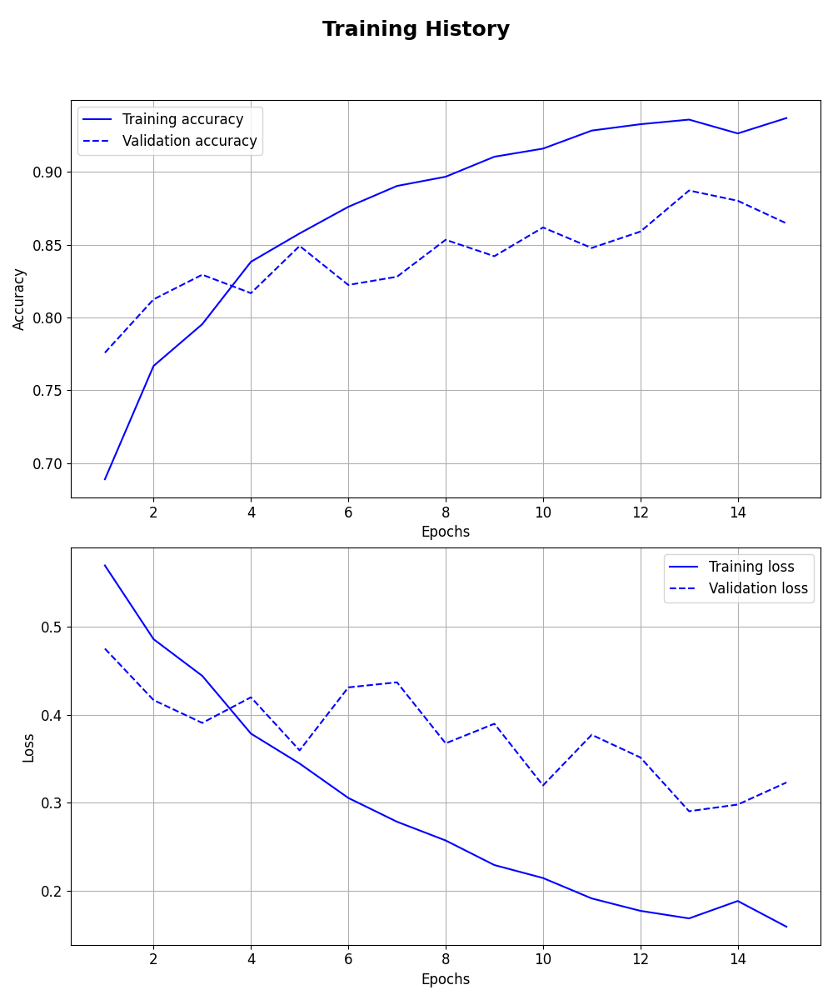

### Detailed Report of Test Set:

|              | precision    | recall       | f1-score     | support      |
| ------------ | ------------ | ------------ | ------------ | ------------ |
| chihuahua    | 0.9303       | 0.8209       | 0.8722       | 374          | 
| muffin       | 0.8241       | 0.9318       | 0.8747       | 337          | 
| micro avg    | 0.8734       | 0.8734       | 0.8734       | 711          | 
| macro avg    | 0.8772       | 0.8763       | 0.8734       | 711          | 
| weighted avg | 0.8800       | 0.8734       | 0.8733       | 711          | 
| samples avg  | 0.8734       | 0.8734       | 0.8734       | 711          | 

## trial_1

*    *Start Time*: 2024-10-26 18:55:26

*    *Duration*: 0:06:04.886

*    *Directory*: [Link](./trial_1)

### Hyperparameters:

| Hyperparameter        | Value                 |
| --------------------- | --------------------- |
| normalization         | standard              |
| batch_size            | 128                   |
| learning_rate         | 6.004148739685118e-05 |

### Evaluation Metrics:

|           | train     | val       | test      |
| --------- | --------- | --------- | --------- |
| accuracy  | 0.9457    | 0.8759    | 0.8734    | 
| precision | 0.9457    | 0.8759    | 0.8734    | 
| recall    | 0.9457    | 0.8759    | 0.8734    | 
| f1        | 0.9457    | 0.8759    | 0.8734    | 

### Figures:

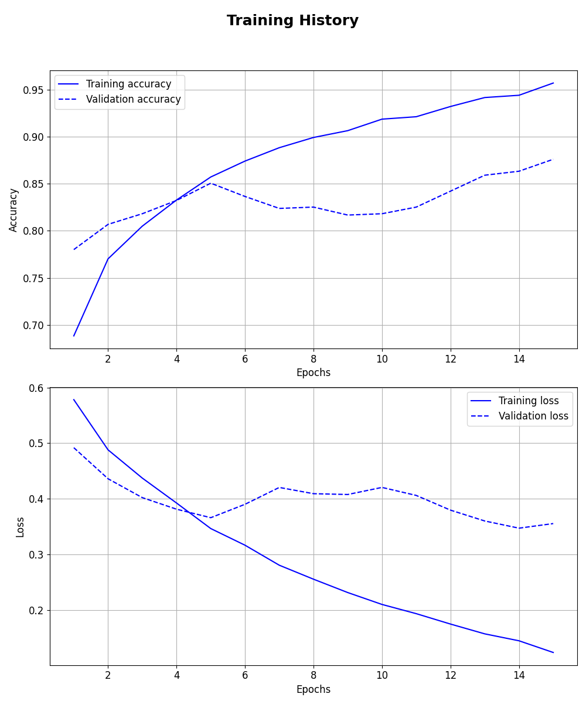

### Detailed Report of Test Set:

|              | precision    | recall       | f1-score     | support      |
| ------------ | ------------ | ------------ | ------------ | ------------ |
| chihuahua    | 0.9128       | 0.8396       | 0.8747       | 374          | 
| muffin       | 0.8365       | 0.9110       | 0.8722       | 337          | 
| micro avg    | 0.8734       | 0.8734       | 0.8734       | 711          | 
| macro avg    | 0.8747       | 0.8753       | 0.8734       | 711          | 
| weighted avg | 0.8766       | 0.8734       | 0.8735       | 711          | 
| samples avg  | 0.8734       | 0.8734       | 0.8734       | 711          | 

## trial_68

*    *Start Time*: 2024-10-27 11:43:39

*    *Duration*: 0:05:44.159

*    *Directory*: [Link](./trial_68)

### Hyperparameters:

| Hyperparameter         | Value                  |
| ---------------------- | ---------------------- |
| normalization          | standard               |
| batch_size             | 128                    |
| learning_rate          | 5.3554439205832066e-05 |

### Evaluation Metrics:

|           | train     | val       | test      |
| --------- | --------- | --------- | --------- |
| accuracy  | 0.9520    | 0.8463    | 0.8734    | 
| precision | 0.9520    | 0.8463    | 0.8734    | 
| recall    | 0.9520    | 0.8463    | 0.8734    | 
| f1        | 0.9520    | 0.8463    | 0.8734    | 

### Figures:

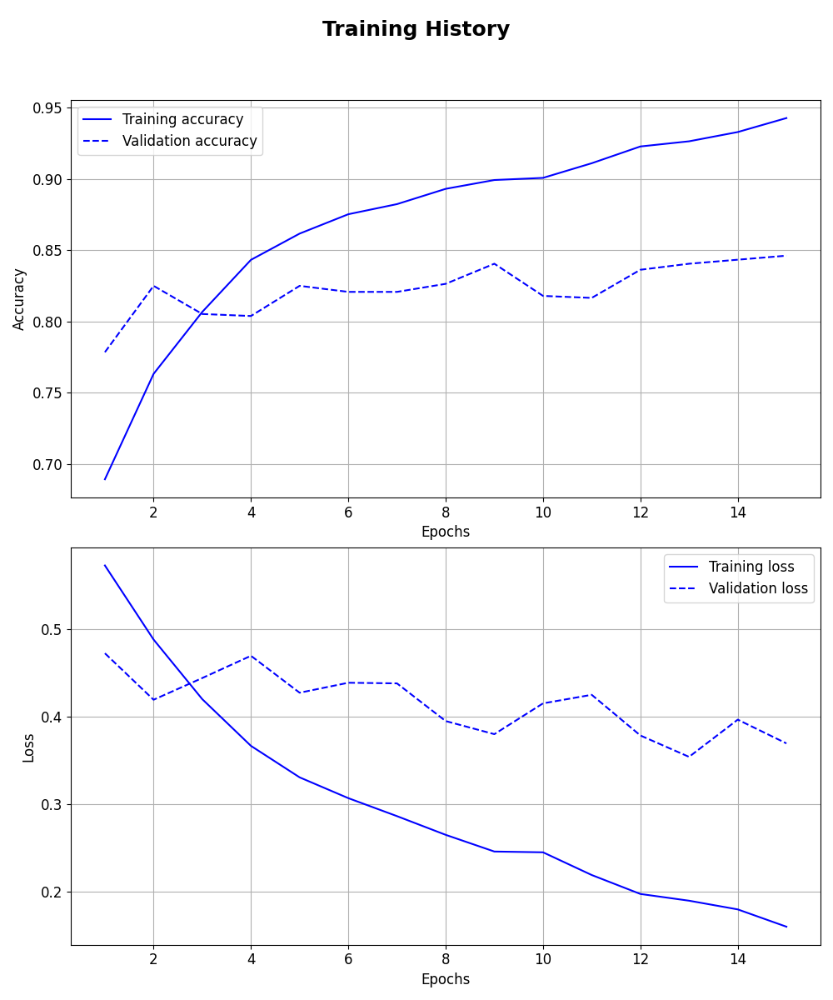

### Detailed Report of Test Set:

|              | precision    | recall       | f1-score     | support      |
| ------------ | ------------ | ------------ | ------------ | ------------ |
| chihuahua    | 0.9329       | 0.8182       | 0.8718       | 374          | 
| muffin       | 0.8225       | 0.9347       | 0.8750       | 337          | 
| micro avg    | 0.8734       | 0.8734       | 0.8734       | 711          | 
| macro avg    | 0.8777       | 0.8764       | 0.8734       | 711          | 
| weighted avg | 0.8806       | 0.8734       | 0.8733       | 711          | 
| samples avg  | 0.8734       | 0.8734       | 0.8734       | 711          | 

## trial_77

*    *Start Time*: 2024-10-27 12:36:23

*    *Duration*: 0:05:47.921

*    *Directory*: [Link](./trial_77)

### Hyperparameters:

| Hyperparameter        | Value                 |
| --------------------- | --------------------- |
| normalization         | standard              |
| batch_size            | 128                   |
| learning_rate         | 5.303121265843926e-05 |

### Evaluation Metrics:

|           | train     | val       | test      |
| --------- | --------- | --------- | --------- |
| accuracy  | 0.9399    | 0.8745    | 0.8734    | 
| precision | 0.9399    | 0.8745    | 0.8734    | 
| recall    | 0.9399    | 0.8745    | 0.8734    | 
| f1        | 0.9399    | 0.8745    | 0.8734    | 

### Figures:

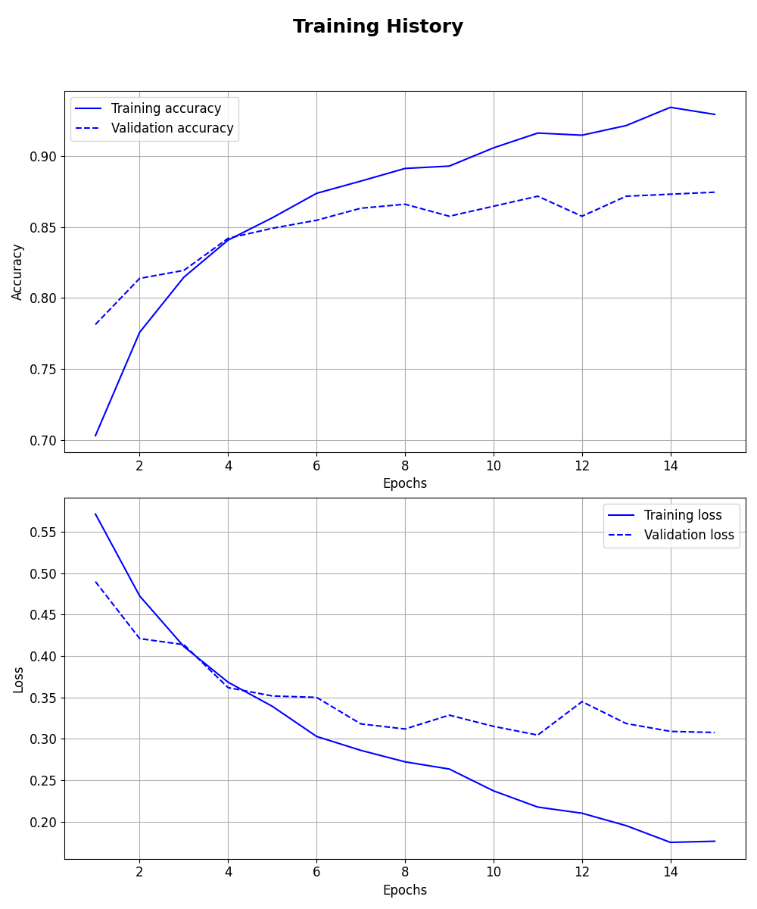

### Detailed Report of Test Set:

|              | precision    | recall       | f1-score     | support      |
| ------------ | ------------ | ------------ | ------------ | ------------ |
| chihuahua    | 0.9104       | 0.8422       | 0.8750       | 374          | 
| muffin       | 0.8384       | 0.9080       | 0.8718       | 337          | 
| micro avg    | 0.8734       | 0.8734       | 0.8734       | 711          | 
| macro avg    | 0.8744       | 0.8751       | 0.8734       | 711          | 
| weighted avg | 0.8763       | 0.8734       | 0.8735       | 711          | 
| samples avg  | 0.8734       | 0.8734       | 0.8734       | 711          | 

## trial_41

*    *Start Time*: 2024-10-24 14:36:33

*    *Duration*: 0:05:43.097

*    *Directory*: [Link](./trial_41)

### Hyperparameters:

| Hyperparameter        | Value                 |
| --------------------- | --------------------- |
| normalization         | min_max               |
| batch_size            | 128                   |
| learning_rate         | 8.370175995685282e-05 |

### Evaluation Metrics:

|           | train     | val       | test      |
| --------- | --------- | --------- | --------- |
| accuracy  | 0.9307    | 0.8731    | 0.8720    | 
| precision | 0.9307    | 0.8731    | 0.8720    | 
| recall    | 0.9307    | 0.8731    | 0.8720    | 
| f1        | 0.9307    | 0.8731    | 0.8720    | 

### Figures:

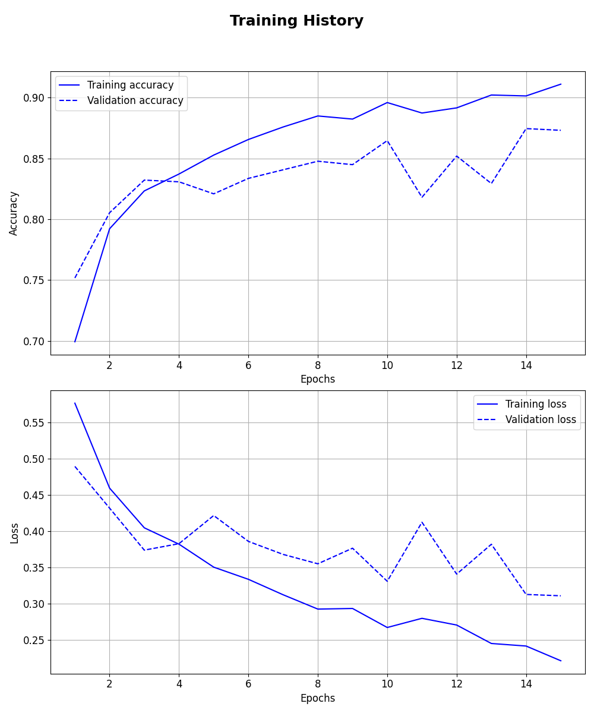

### Detailed Report of Test Set:

|              | precision    | recall       | f1-score     | support      |
| ------------ | ------------ | ------------ | ------------ | ------------ |
| chihuahua    | 0.9150       | 0.8342       | 0.8727       | 374          | 
| muffin       | 0.8324       | 0.9139       | 0.8713       | 337          | 
| micro avg    | 0.8720       | 0.8720       | 0.8720       | 711          | 
| macro avg    | 0.8737       | 0.8741       | 0.8720       | 711          | 
| weighted avg | 0.8758       | 0.8720       | 0.8720       | 711          | 
| samples avg  | 0.8720       | 0.8720       | 0.8720       | 711          | 

## trial_85

*    *Start Time*: 2024-10-27 13:22:45

*    *Duration*: 0:05:45.307

*    *Directory*: [Link](./trial_85)

### Hyperparameters:

| Hyperparameter        | Value                 |
| --------------------- | --------------------- |
| normalization         | standard              |
| batch_size            | 128                   |
| learning_rate         | 6.114491757454854e-05 |

### Evaluation Metrics:

|           | train     | val       | test      |
| --------- | --------- | --------- | --------- |
| accuracy  | 0.9585    | 0.8533    | 0.8720    | 
| precision | 0.9585    | 0.8533    | 0.8720    | 
| recall    | 0.9585    | 0.8533    | 0.8720    | 
| f1        | 0.9585    | 0.8533    | 0.8720    | 

### Figures:

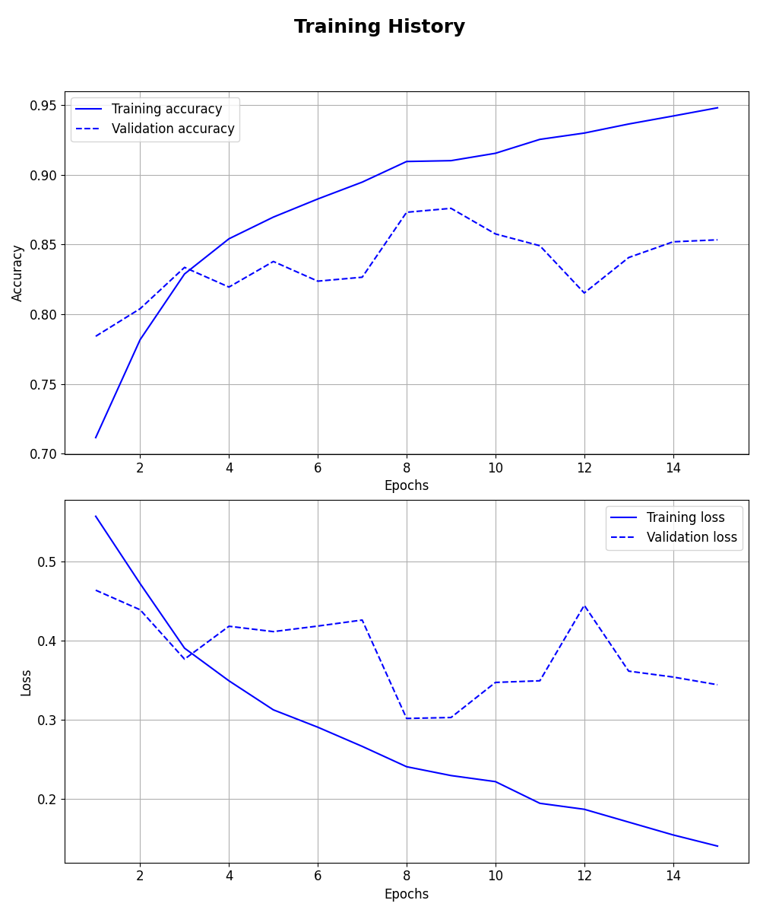

### Detailed Report of Test Set:

|              | precision    | recall       | f1-score     | support      |
| ------------ | ------------ | ------------ | ------------ | ------------ |
| chihuahua    | 0.9521       | 0.7968       | 0.8675       | 374          | 
| muffin       | 0.8090       | 0.9555       | 0.8762       | 337          | 
| micro avg    | 0.8720       | 0.8720       | 0.8720       | 711          | 
| macro avg    | 0.8806       | 0.8761       | 0.8719       | 711          | 
| weighted avg | 0.8843       | 0.8720       | 0.8716       | 711          | 
| samples avg  | 0.8720       | 0.8720       | 0.8720       | 711          | 

## trial_14

*    *Start Time*: 2024-10-24 12:00:50

*    *Duration*: 0:05:43.157

*    *Directory*: [Link](./trial_14)

### Hyperparameters:

| Hyperparameter         | Value                  |
| ---------------------- | ---------------------- |
| normalization          | min_max                |
| batch_size             | 64                     |
| learning_rate          | 0.00010042710457387923 |

### Evaluation Metrics:

|           | train     | val       | test      |
| --------- | --------- | --------- | --------- |
| accuracy  | 0.9688    | 0.8632    | 0.8706    | 
| precision | 0.9688    | 0.8632    | 0.8706    | 
| recall    | 0.9688    | 0.8632    | 0.8706    | 
| f1        | 0.9688    | 0.8632    | 0.8706    | 

### Figures:

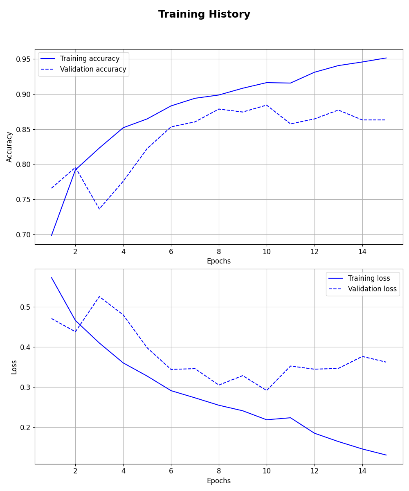

### Detailed Report of Test Set:

|              | precision    | recall       | f1-score     | support      |
| ------------ | ------------ | ------------ | ------------ | ------------ |
| chihuahua    | 0.9222       | 0.8235       | 0.8701       | 374          | 
| muffin       | 0.8249       | 0.9228       | 0.8711       | 337          | 
| micro avg    | 0.8706       | 0.8706       | 0.8706       | 711          | 
| macro avg    | 0.8735       | 0.8732       | 0.8706       | 711          | 
| weighted avg | 0.8761       | 0.8706       | 0.8706       | 711          | 
| samples avg  | 0.8706       | 0.8706       | 0.8706       | 711          | 

## trial_84

*    *Start Time*: 2024-10-27 13:16:59

*    *Duration*: 0:05:44.673

*    *Directory*: [Link](./trial_84)

### Hyperparameters:

| Hyperparameter        | Value                 |
| --------------------- | --------------------- |
| normalization         | min_max               |
| batch_size            | 128                   |
| learning_rate         | 9.447526127301049e-05 |

### Evaluation Metrics:

|           | train     | val       | test      |
| --------- | --------- | --------- | --------- |
| accuracy  | 0.9457    | 0.8575    | 0.8706    | 
| precision | 0.9457    | 0.8575    | 0.8706    | 
| recall    | 0.9457    | 0.8575    | 0.8706    | 
| f1        | 0.9457    | 0.8575    | 0.8706    | 

### Figures:

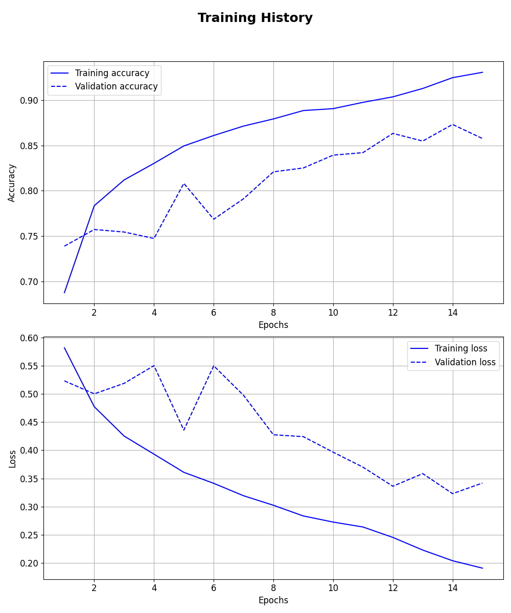

### Detailed Report of Test Set:

|              | precision    | recall       | f1-score     | support      |
| ------------ | ------------ | ------------ | ------------ | ------------ |
| chihuahua    | 0.9222       | 0.8235       | 0.8701       | 374          | 
| muffin       | 0.8249       | 0.9228       | 0.8711       | 337          | 
| micro avg    | 0.8706       | 0.8706       | 0.8706       | 711          | 
| macro avg    | 0.8735       | 0.8732       | 0.8706       | 711          | 
| weighted avg | 0.8761       | 0.8706       | 0.8706       | 711          | 
| samples avg  | 0.8706       | 0.8706       | 0.8706       | 711          | 

## trial_87

*    *Start Time*: 2024-10-27 13:34:21

*    *Duration*: 0:05:45.989

*    *Directory*: [Link](./trial_87)

### Hyperparameters:

| Hyperparameter        | Value                 |
| --------------------- | --------------------- |
| normalization         | standard              |
| batch_size            | 128                   |
| learning_rate         | 6.667523468854389e-05 |

### Evaluation Metrics:

|           | train     | val       | test      |
| --------- | --------- | --------- | --------- |
| accuracy  | 0.9665    | 0.8618    | 0.8706    | 
| precision | 0.9665    | 0.8618    | 0.8706    | 
| recall    | 0.9665    | 0.8618    | 0.8706    | 
| f1        | 0.9665    | 0.8618    | 0.8706    | 

### Figures:

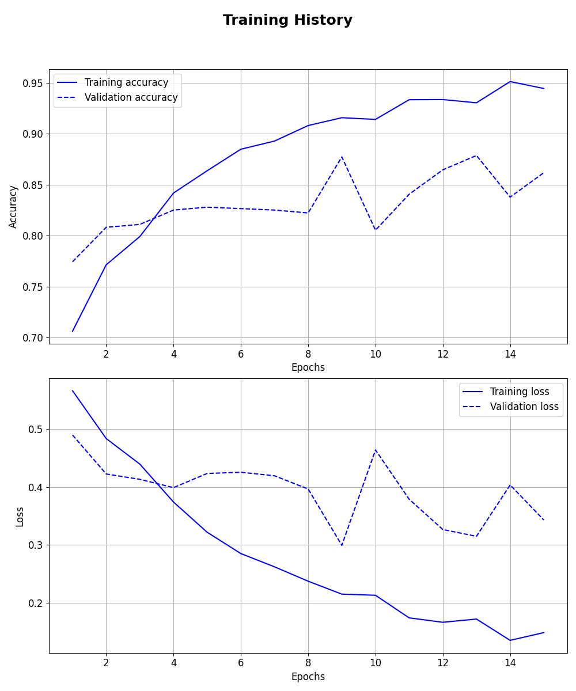

### Detailed Report of Test Set:

|              | precision    | recall       | f1-score     | support      |
| ------------ | ------------ | ------------ | ------------ | ------------ |
| chihuahua    | 0.9548       | 0.7914       | 0.8655       | 374          | 
| muffin       | 0.8055       | 0.9585       | 0.8753       | 337          | 
| micro avg    | 0.8706       | 0.8706       | 0.8706       | 711          | 
| macro avg    | 0.8802       | 0.8750       | 0.8704       | 711          | 
| weighted avg | 0.8840       | 0.8706       | 0.8702       | 711          | 
| samples avg  | 0.8706       | 0.8706       | 0.8706       | 711          | 

## trial_92

*    *Start Time*: 2024-10-27 14:03:29

*    *Duration*: 0:05:47.064

*    *Directory*: [Link](./trial_92)

### Hyperparameters:

| Hyperparameter        | Value                 |
| --------------------- | --------------------- |
| normalization         | standard              |
| batch_size            | 128                   |
| learning_rate         | 5.259118895331817e-05 |

### Evaluation Metrics:

|           | train     | val       | test      |
| --------- | --------- | --------- | --------- |
| accuracy  | 0.9593    | 0.8505    | 0.8706    | 
| precision | 0.9593    | 0.8505    | 0.8706    | 
| recall    | 0.9593    | 0.8505    | 0.8706    | 
| f1        | 0.9593    | 0.8505    | 0.8706    | 

### Figures:

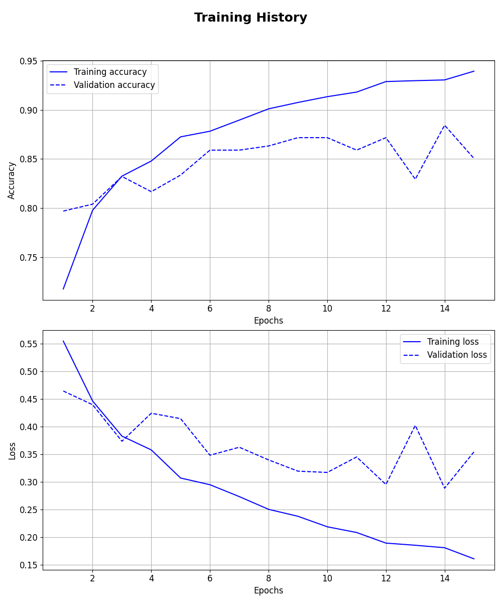

### Detailed Report of Test Set:

|              | precision    | recall       | f1-score     | support      |
| ------------ | ------------ | ------------ | ------------ | ------------ |
| chihuahua    | 0.9519       | 0.7941       | 0.8659       | 374          | 
| muffin       | 0.8070       | 0.9555       | 0.8750       | 337          | 
| micro avg    | 0.8706       | 0.8706       | 0.8706       | 711          | 
| macro avg    | 0.8795       | 0.8748       | 0.8704       | 711          | 
| weighted avg | 0.8832       | 0.8706       | 0.8702       | 711          | 
| samples avg  | 0.8706       | 0.8706       | 0.8706       | 711          | 

## trial_93

*    *Start Time*: 2024-10-27 14:09:18

*    *Duration*: 0:05:44.848

*    *Directory*: [Link](./trial_93)

### Hyperparameters:

| Hyperparameter        | Value                 |
| --------------------- | --------------------- |
| normalization         | mean                  |
| batch_size            | 128                   |
| learning_rate         | 8.089144574527342e-05 |

### Evaluation Metrics:

|           | train     | val       | test      |
| --------- | --------- | --------- | --------- |
| accuracy  | 0.9445    | 0.8731    | 0.8706    | 
| precision | 0.9445    | 0.8731    | 0.8706    | 
| recall    | 0.9445    | 0.8731    | 0.8706    | 
| f1        | 0.9445    | 0.8731    | 0.8706    | 

### Figures:

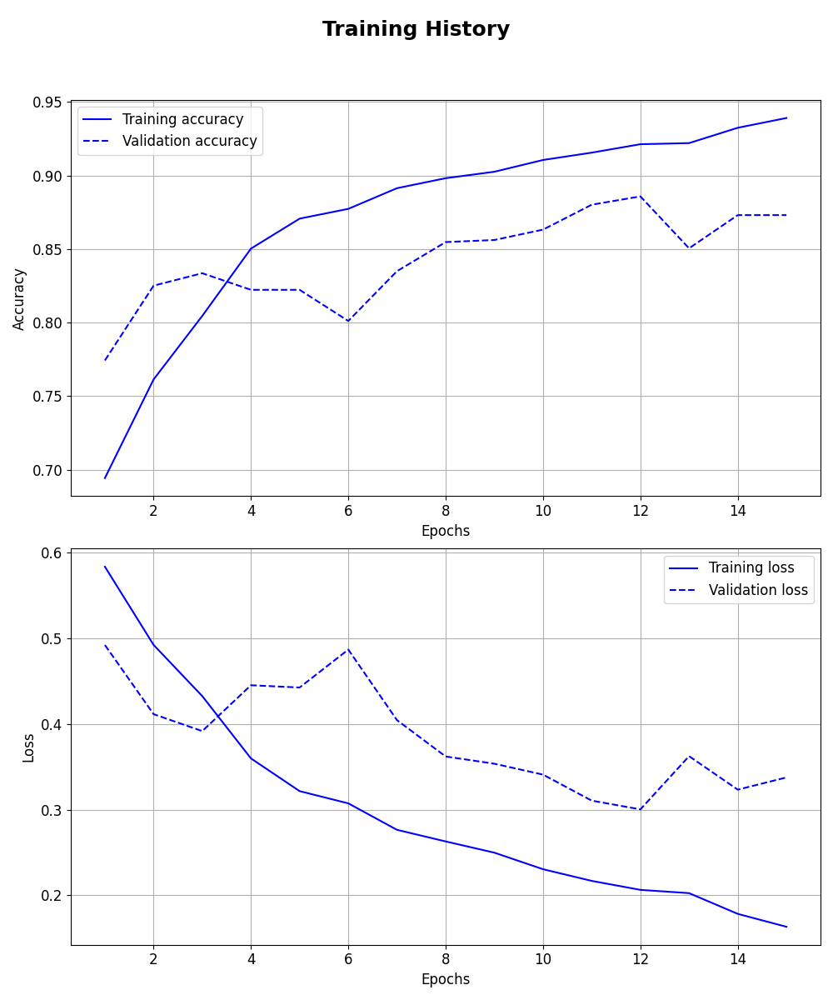

### Detailed Report of Test Set:

|              | precision    | recall       | f1-score     | support      |
| ------------ | ------------ | ------------ | ------------ | ------------ |
| chihuahua    | 0.8672       | 0.8904       | 0.8786       | 374          | 
| muffin       | 0.8746       | 0.8487       | 0.8614       | 337          | 
| micro avg    | 0.8706       | 0.8706       | 0.8706       | 711          | 
| macro avg    | 0.8709       | 0.8695       | 0.8700       | 711          | 
| weighted avg | 0.8707       | 0.8706       | 0.8705       | 711          | 
| samples avg  | 0.8706       | 0.8706       | 0.8706       | 711          | 

## trial_42

*    *Start Time*: 2024-10-24 14:42:18

*    *Duration*: 0:05:43.980

*    *Directory*: [Link](./trial_42)

### Hyperparameters:

| Hyperparameter        | Value                 |
| --------------------- | --------------------- |
| normalization         | standard              |
| batch_size            | 128                   |
| learning_rate         | 5.601496307037658e-05 |

### Evaluation Metrics:

|           | train     | val       | test      |
| --------- | --------- | --------- | --------- |
| accuracy  | 0.9463    | 0.8618    | 0.8692    | 
| precision | 0.9463    | 0.8618    | 0.8692    | 
| recall    | 0.9463    | 0.8618    | 0.8692    | 
| f1        | 0.9463    | 0.8618    | 0.8692    | 

### Figures:

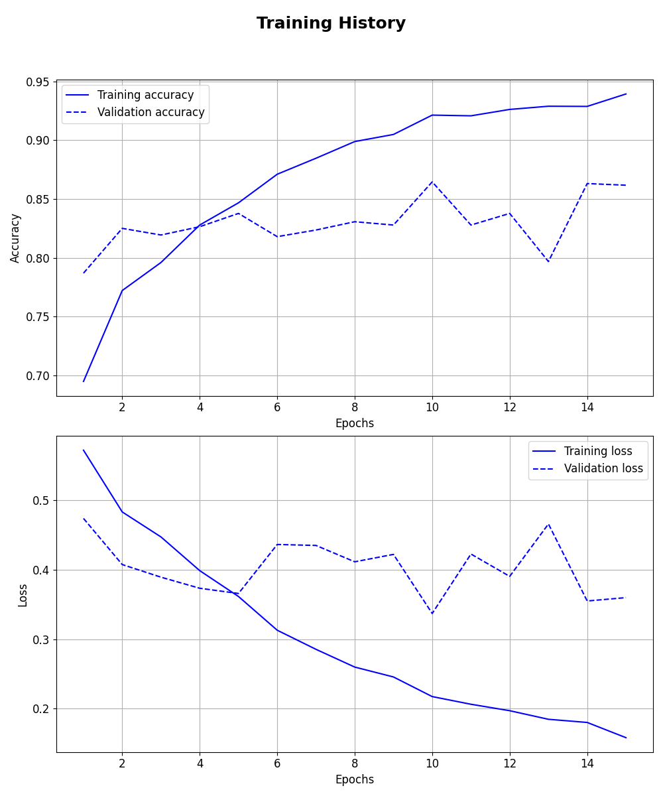

### Detailed Report of Test Set:

|              | precision    | recall       | f1-score     | support      |
| ------------ | ------------ | ------------ | ------------ | ------------ |
| chihuahua    | 0.9518       | 0.7914       | 0.8642       | 374          | 
| muffin       | 0.8050       | 0.9555       | 0.8738       | 337          | 
| micro avg    | 0.8692       | 0.8692       | 0.8692       | 711          | 
| macro avg    | 0.8784       | 0.8735       | 0.8690       | 711          | 
| weighted avg | 0.8822       | 0.8692       | 0.8688       | 711          | 
| samples avg  | 0.8692       | 0.8692       | 0.8692       | 711          | 

## trial_51

*    *Start Time*: 2024-10-24 15:34:14

*    *Duration*: 0:05:42.843

*    *Directory*: [Link](./trial_51)

### Hyperparameters:

| Hyperparameter        | Value                 |
| --------------------- | --------------------- |
| normalization         | mean                  |
| batch_size            | 128                   |
| learning_rate         | 6.309423726799978e-05 |

### Evaluation Metrics:

|           | train     | val       | test      |
| --------- | --------- | --------- | --------- |
| accuracy  | 0.9363    | 0.8590    | 0.8692    | 
| precision | 0.9363    | 0.8590    | 0.8692    | 
| recall    | 0.9363    | 0.8590    | 0.8692    | 
| f1        | 0.9363    | 0.8590    | 0.8692    | 

### Figures:

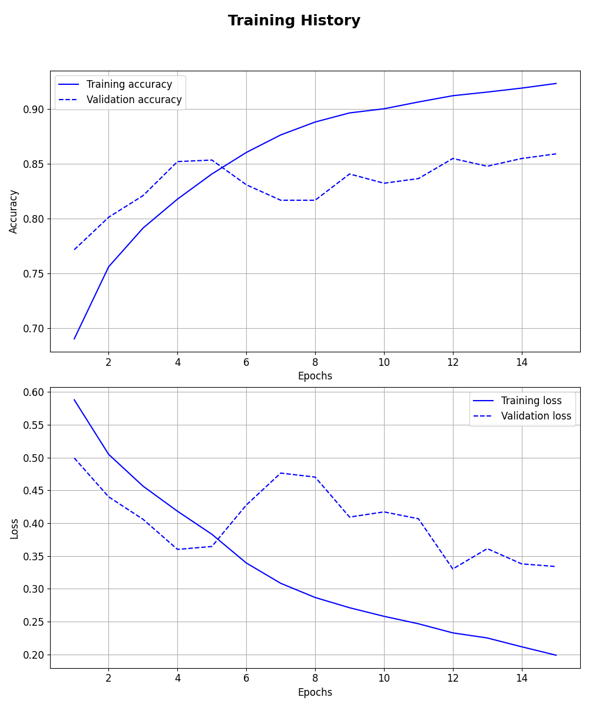

### Detailed Report of Test Set:

|              | precision    | recall       | f1-score     | support      |
| ------------ | ------------ | ------------ | ------------ | ------------ |
| chihuahua    | 0.9404       | 0.8021       | 0.8658       | 374          | 
| muffin       | 0.8112       | 0.9436       | 0.8724       | 337          | 
| micro avg    | 0.8692       | 0.8692       | 0.8692       | 711          | 
| macro avg    | 0.8758       | 0.8729       | 0.8691       | 711          | 
| weighted avg | 0.8792       | 0.8692       | 0.8689       | 711          | 
| samples avg  | 0.8692       | 0.8692       | 0.8692       | 711          | 

## trial_59

*    *Start Time*: 2024-10-27 10:50:51

*    *Duration*: 0:05:46.611

*    *Directory*: [Link](./trial_59)

### Hyperparameters:

| Hyperparameter        | Value                 |
| --------------------- | --------------------- |
| normalization         | standard              |
| batch_size            | 128                   |
| learning_rate         | 8.909048954015925e-05 |

### Evaluation Metrics:

|           | train     | val       | test      |
| --------- | --------- | --------- | --------- |
| accuracy  | 0.9784    | 0.8688    | 0.8692    | 
| precision | 0.9784    | 0.8688    | 0.8692    | 
| recall    | 0.9784    | 0.8688    | 0.8692    | 
| f1        | 0.9784    | 0.8688    | 0.8692    | 

### Figures:

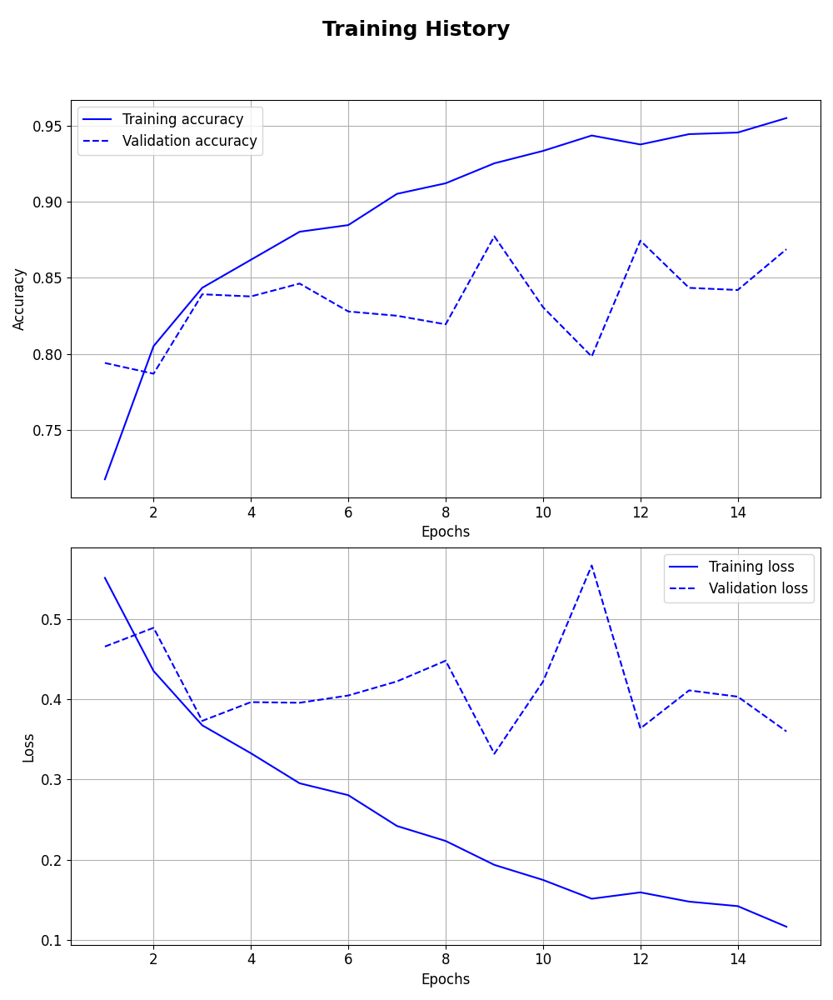

### Detailed Report of Test Set:

|              | precision    | recall       | f1-score     | support      |
| ------------ | ------------ | ------------ | ------------ | ------------ |
| chihuahua    | 0.9096       | 0.8342       | 0.8703       | 374          | 
| muffin       | 0.8315       | 0.9080       | 0.8681       | 337          | 
| micro avg    | 0.8692       | 0.8692       | 0.8692       | 711          | 
| macro avg    | 0.8706       | 0.8711       | 0.8692       | 711          | 
| weighted avg | 0.8726       | 0.8692       | 0.8692       | 711          | 
| samples avg  | 0.8692       | 0.8692       | 0.8692       | 711          | 

## trial_71

*    *Start Time*: 2024-10-27 12:01:03

*    *Duration*: 0:05:45.798

*    *Directory*: [Link](./trial_71)

### Hyperparameters:

| Hyperparameter        | Value                 |
| --------------------- | --------------------- |
| normalization         | min_max               |
| batch_size            | 128                   |
| learning_rate         | 5.732474227053105e-05 |

### Evaluation Metrics:

|           | train     | val       | test      |
| --------- | --------- | --------- | --------- |
| accuracy  | 0.9126    | 0.8463    | 0.8692    | 
| precision | 0.9126    | 0.8463    | 0.8692    | 
| recall    | 0.9126    | 0.8463    | 0.8692    | 
| f1        | 0.9126    | 0.8463    | 0.8692    | 

### Figures:

### Detailed Report of Test Set:

|              | precision    | recall       | f1-score     | support      |
| ------------ | ------------ | ------------ | ------------ | ------------ |
| chihuahua    | 0.9323       | 0.8102       | 0.8670       | 374          | 
| muffin       | 0.8161       | 0.9347       | 0.8714       | 337          | 
| micro avg    | 0.8692       | 0.8692       | 0.8692       | 711          | 
| macro avg    | 0.8742       | 0.8724       | 0.8692       | 711          | 
| weighted avg | 0.8772       | 0.8692       | 0.8690       | 711          | 
| samples avg  | 0.8692       | 0.8692       | 0.8692       | 711          | 

## trial_31

*    *Start Time*: 2024-10-24 13:38:34

*    *Duration*: 0:05:43.448

*    *Directory*: [Link](./trial_31)

### Hyperparameters:

| Hyperparameter         | Value                  |
| ---------------------- | ---------------------- |
| normalization          | standard               |
| batch_size             | 128                    |
| learning_rate          | 0.00011000045438919689 |

### Evaluation Metrics:

|           | train     | val       | test      |
| --------- | --------- | --------- | --------- |
| accuracy  | 0.9804    | 0.8477    | 0.8678    | 
| precision | 0.9804    | 0.8477    | 0.8678    | 
| recall    | 0.9804    | 0.8477    | 0.8678    | 
| f1        | 0.9804    | 0.8477    | 0.8678    | 

### Figures:

### Detailed Report of Test Set:

|              | precision    | recall       | f1-score     | support      |
| ------------ | ------------ | ------------ | ------------ | ------------ |
| chihuahua    | 0.9667       | 0.7754       | 0.8605       | 374          | 
| muffin       | 0.7956       | 0.9703       | 0.8743       | 337          | 
| micro avg    | 0.8678       | 0.8678       | 0.8678       | 711          | 
| macro avg    | 0.8811       | 0.8729       | 0.8674       | 711          | 
| weighted avg | 0.8856       | 0.8678       | 0.8671       | 711          | 
| samples avg  | 0.8678       | 0.8678       | 0.8678       | 711          | 

## trial_57

*    *Start Time*: 2024-10-27 10:39:17

*    *Duration*: 0:05:44.089

*    *Directory*: [Link](./trial_57)

### Hyperparameters:

| Hyperparameter        | Value                 |
| --------------------- | --------------------- |
| normalization         | standard              |
| batch_size            | 128                   |
| learning_rate         | 6.282039870279009e-05 |

### Evaluation Metrics:

|           | train     | val       | test      |
| --------- | --------- | --------- | --------- |
| accuracy  | 0.9535    | 0.8575    | 0.8678    | 
| precision | 0.9535    | 0.8575    | 0.8678    | 
| recall    | 0.9535    | 0.8575    | 0.8678    | 
| f1        | 0.9535    | 0.8575    | 0.8678    | 

### Figures:

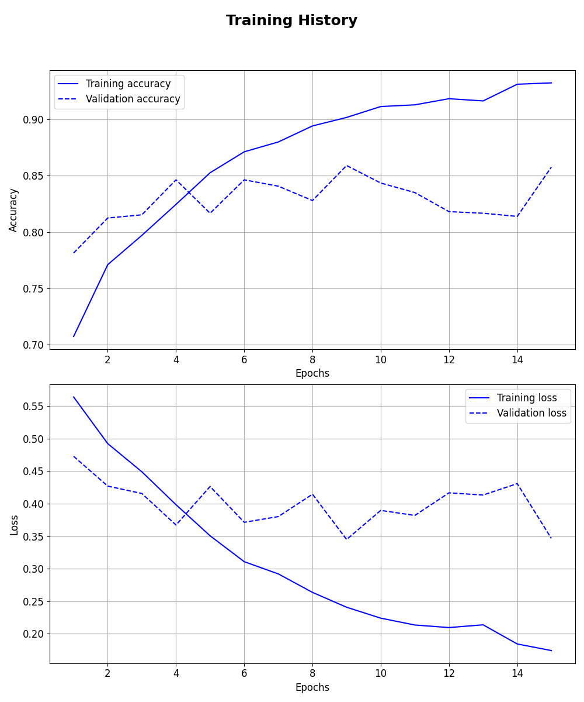

### Detailed Report of Test Set:

|              | precision    | recall       | f1-score     | support      |
| ------------ | ------------ | ------------ | ------------ | ------------ |
| chihuahua    | 0.9667       | 0.7754       | 0.8605       | 374          | 
| muffin       | 0.7956       | 0.9703       | 0.8743       | 337          | 
| micro avg    | 0.8678       | 0.8678       | 0.8678       | 711          | 
| macro avg    | 0.8811       | 0.8729       | 0.8674       | 711          | 
| weighted avg | 0.8856       | 0.8678       | 0.8671       | 711          | 
| samples avg  | 0.8678       | 0.8678       | 0.8678       | 711          | 

## trial_70

*    *Start Time*: 2024-10-27 11:55:15

*    *Duration*: 0:05:46.643

*    *Directory*: [Link](./trial_70)

### Hyperparameters:

| Hyperparameter        | Value                 |
| --------------------- | --------------------- |
| normalization         | standard              |
| batch_size            | 128                   |
| learning_rate         | 7.247535890992744e-05 |

### Evaluation Metrics:

|           | train     | val       | test      |
| --------- | --------- | --------- | --------- |
| accuracy  | 0.9639    | 0.8336    | 0.8678    | 
| precision | 0.9639    | 0.8336    | 0.8678    | 
| recall    | 0.9639    | 0.8336    | 0.8678    | 
| f1        | 0.9639    | 0.8336    | 0.8678    | 

### Figures:

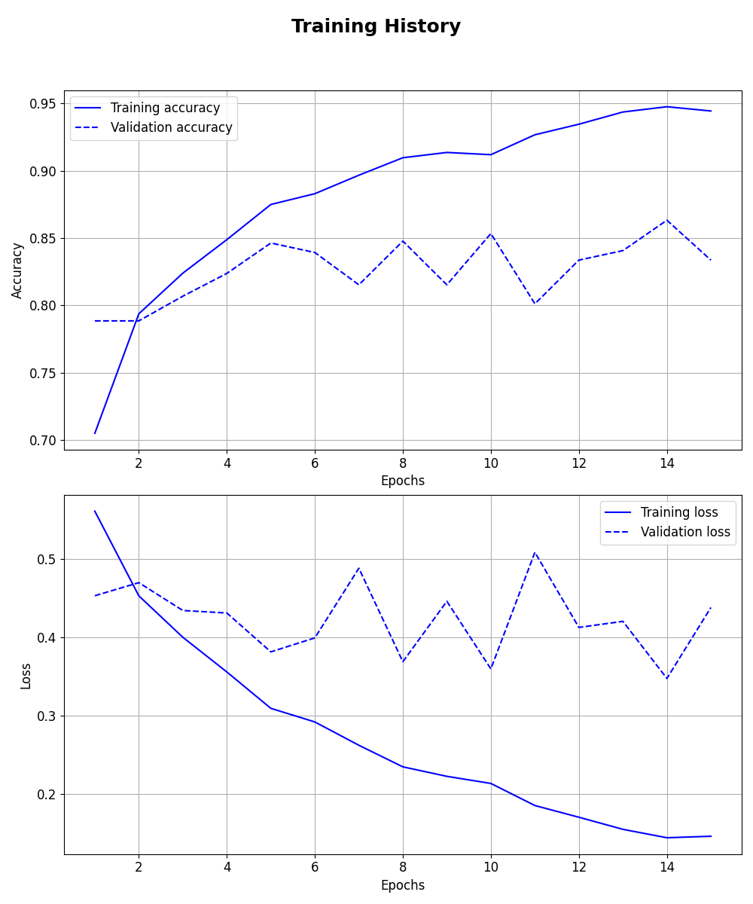

### Detailed Report of Test Set:

|              | precision    | recall       | f1-score     | support      |
| ------------ | ------------ | ------------ | ------------ | ------------ |
| chihuahua    | 0.9636       | 0.7781       | 0.8609       | 374          | 
| muffin       | 0.7971       | 0.9674       | 0.8740       | 337          | 
| micro avg    | 0.8678       | 0.8678       | 0.8678       | 711          | 
| macro avg    | 0.8803       | 0.8727       | 0.8675       | 711          | 
| weighted avg | 0.8847       | 0.8678       | 0.8671       | 711          | 
| samples avg  | 0.8678       | 0.8678       | 0.8678       | 711          | 

## trial_89

*    *Start Time*: 2024-10-27 13:45:59

*    *Duration*: 0:05:48.704

*    *Directory*: [Link](./trial_89)

### Hyperparameters:

| Hyperparameter       | Value                |
| -------------------- | -------------------- |
| normalization        | standard             |
| batch_size           | 128                  |
| learning_rate        | 7.44722341442053e-05 |

### Evaluation Metrics:

|           | train     | val       | test      |
| --------- | --------- | --------- | --------- |
| accuracy  | 0.9730    | 0.8646    | 0.8678    | 
| precision | 0.9730    | 0.8646    | 0.8678    | 
| recall    | 0.9730    | 0.8646    | 0.8678    | 
| f1        | 0.9730    | 0.8646    | 0.8678    | 

### Figures:

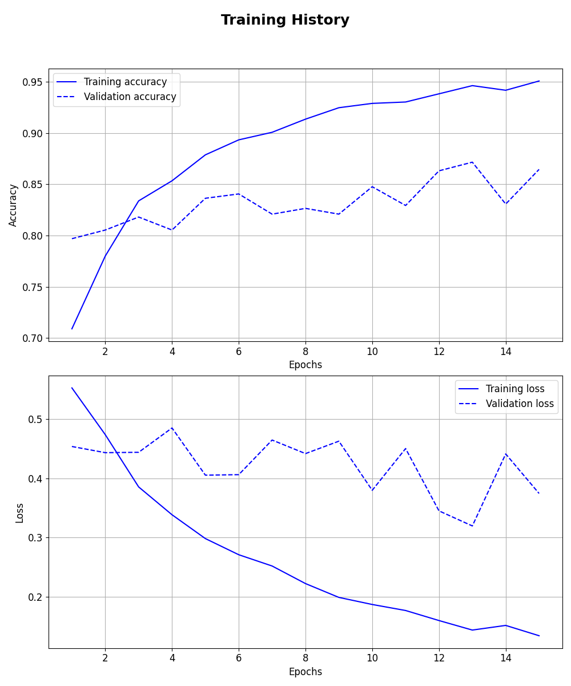

### Detailed Report of Test Set:

|              | precision    | recall       | f1-score     | support      |
| ------------ | ------------ | ------------ | ------------ | ------------ |
| chihuahua    | 0.9192       | 0.8209       | 0.8672       | 374          | 
| muffin       | 0.8223       | 0.9199       | 0.8683       | 337          | 
| micro avg    | 0.8678       | 0.8678       | 0.8678       | 711          | 
| macro avg    | 0.8707       | 0.8704       | 0.8678       | 711          | 
| weighted avg | 0.8732       | 0.8678       | 0.8678       | 711          | 
| samples avg  | 0.8678       | 0.8678       | 0.8678       | 711          | 

## trial_32

*    *Start Time*: 2024-10-24 13:44:20

*    *Duration*: 0:05:44.510

*    *Directory*: [Link](./trial_32)

### Hyperparameters:

| Hyperparameter        | Value                 |
| --------------------- | --------------------- |
| normalization         | standard              |
| batch_size            | 128                   |
| learning_rate         | 6.718826763702805e-05 |

### Evaluation Metrics:

|           | train     | val       | test      |
| --------- | --------- | --------- | --------- |
| accuracy  | 0.9591    | 0.8590    | 0.8664    | 
| precision | 0.9591    | 0.8590    | 0.8664    | 
| recall    | 0.9591    | 0.8590    | 0.8664    | 
| f1        | 0.9591    | 0.8590    | 0.8664    | 

### Figures:

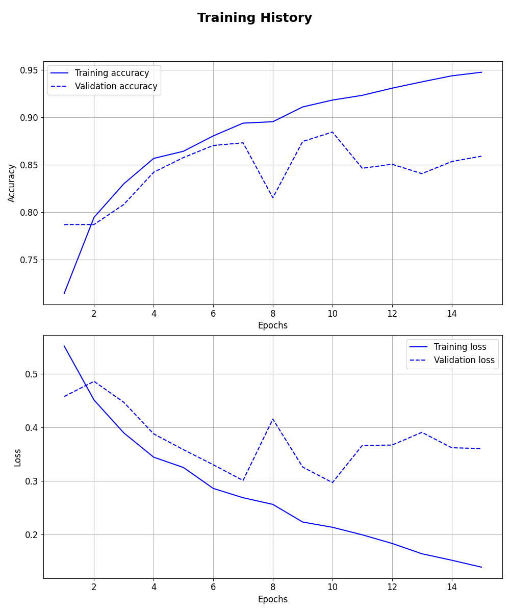

### Detailed Report of Test Set:

|              | precision    | recall       | f1-score     | support      |
| ------------ | ------------ | ------------ | ------------ | ------------ |
| chihuahua    | 0.9373       | 0.7995       | 0.8629       | 374          | 
| muffin       | 0.8087       | 0.9407       | 0.8697       | 337          | 
| micro avg    | 0.8664       | 0.8664       | 0.8664       | 711          | 
| macro avg    | 0.8730       | 0.8701       | 0.8663       | 711          | 
| weighted avg | 0.8763       | 0.8664       | 0.8661       | 711          | 
| samples avg  | 0.8664       | 0.8664       | 0.8664       | 711          | 

## trial_27

*    *Start Time*: 2024-10-24 13:15:36

*    *Duration*: 0:05:42.229

*    *Directory*: [Link](./trial_27)

### Hyperparameters:

| Hyperparameter        | Value                 |
| --------------------- | --------------------- |
| normalization         | standard              |
| batch_size            | 256                   |
| learning_rate         | 0.0001129814597597072 |

### Evaluation Metrics:

|           | train     | val       | test      |
| --------- | --------- | --------- | --------- |
| accuracy  | 0.9505    | 0.8702    | 0.8650    | 
| precision | 0.9505    | 0.8702    | 0.8650    | 
| recall    | 0.9505    | 0.8702    | 0.8650    | 
| f1        | 0.9505    | 0.8702    | 0.8650    | 

### Figures:

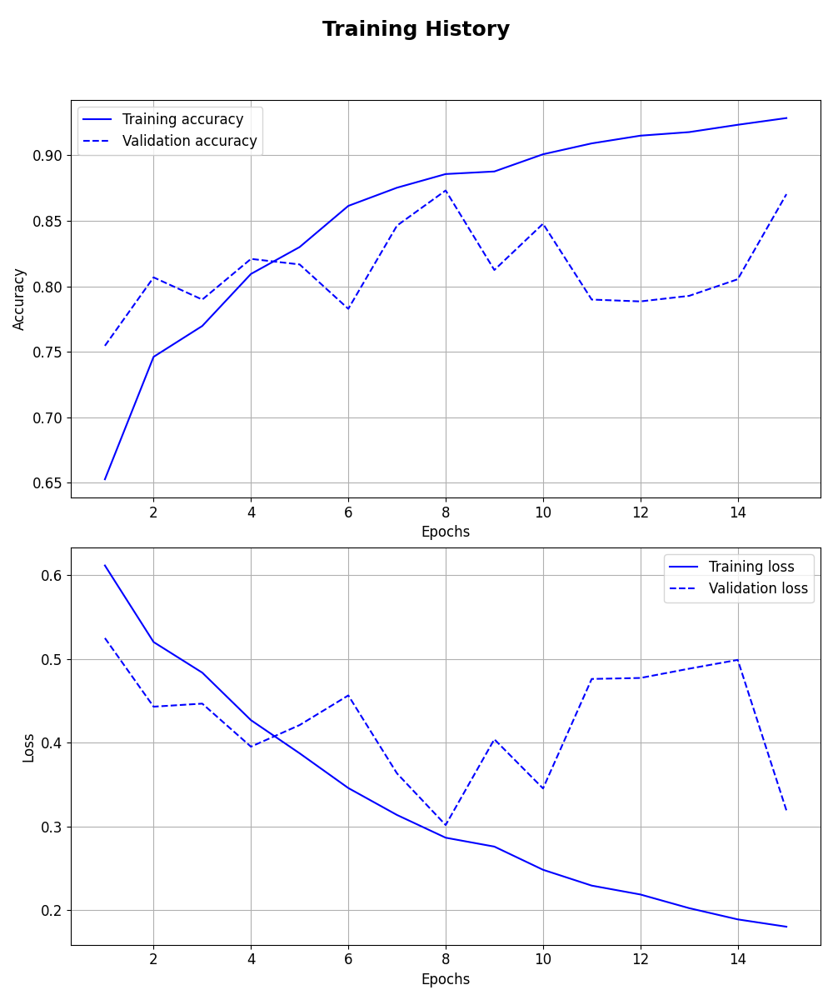

### Detailed Report of Test Set:

|              | precision    | recall       | f1-score     | support      |
| ------------ | ------------ | ------------ | ------------ | ------------ |
| chihuahua    | 0.9212       | 0.8128       | 0.8636       | 374          | 
| muffin       | 0.8163       | 0.9228       | 0.8663       | 337          | 
| micro avg    | 0.8650       | 0.8650       | 0.8650       | 711          | 
| macro avg    | 0.8687       | 0.8678       | 0.8650       | 711          | 
| weighted avg | 0.8715       | 0.8650       | 0.8649       | 711          | 
| samples avg  | 0.8650       | 0.8650       | 0.8650       | 711          | 

## trial_63

*    *Start Time*: 2024-10-27 11:14:31

*    *Duration*: 0:05:46.102

*    *Directory*: [Link](./trial_63)

### Hyperparameters:

| Hyperparameter        | Value                 |
| --------------------- | --------------------- |
| normalization         | mean                  |
| batch_size            | 128                   |
| learning_rate         | 5.011557763759476e-05 |

### Evaluation Metrics:

|           | train     | val       | test      |
| --------- | --------- | --------- | --------- |
| accuracy  | 0.9153    | 0.8547    | 0.8650    | 
| precision | 0.9153    | 0.8547    | 0.8650    | 
| recall    | 0.9153    | 0.8547    | 0.8650    | 
| f1        | 0.9153    | 0.8547    | 0.8650    | 

### Figures:

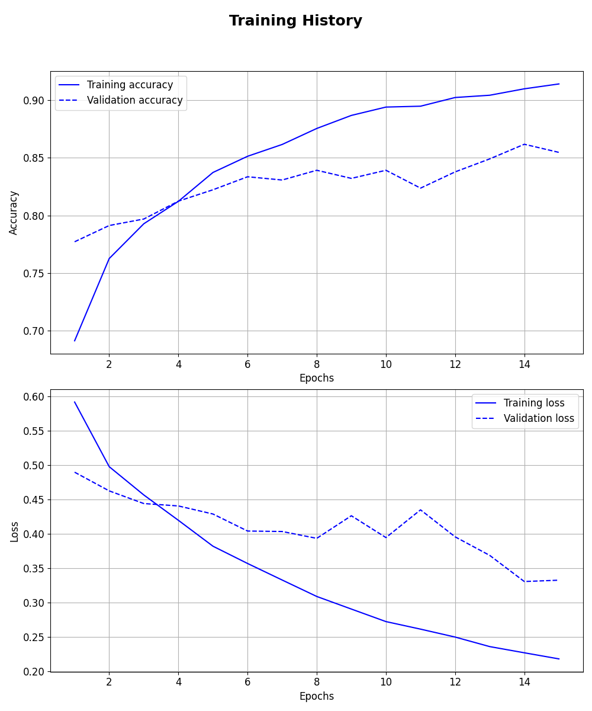

### Detailed Report of Test Set:

|              | precision    | recall       | f1-score     | support      |
| ------------ | ------------ | ------------ | ------------ | ------------ |
| chihuahua    | 0.9427       | 0.7914       | 0.8605       | 374          | 
| muffin       | 0.8035       | 0.9466       | 0.8692       | 337          | 
| micro avg    | 0.8650       | 0.8650       | 0.8650       | 711          | 
| macro avg    | 0.8731       | 0.8690       | 0.8648       | 711          | 
| weighted avg | 0.8767       | 0.8650       | 0.8646       | 711          | 
| samples avg  | 0.8650       | 0.8650       | 0.8650       | 711          | 

## trial_67

*    *Start Time*: 2024-10-27 11:37:51

*    *Duration*: 0:05:47.353

*    *Directory*: [Link](./trial_67)

### Hyperparameters:

| Hyperparameter        | Value                 |
| --------------------- | --------------------- |
| normalization         | standard              |
| batch_size            | 128                   |
| learning_rate         | 6.390896013158943e-05 |

### Evaluation Metrics:

|           | train     | val       | test      |
| --------- | --------- | --------- | --------- |
| accuracy  | 0.9259    | 0.8505    | 0.8650    | 
| precision | 0.9259    | 0.8505    | 0.8650    | 
| recall    | 0.9259    | 0.8505    | 0.8650    | 
| f1        | 0.9259    | 0.8505    | 0.8650    | 

### Figures:

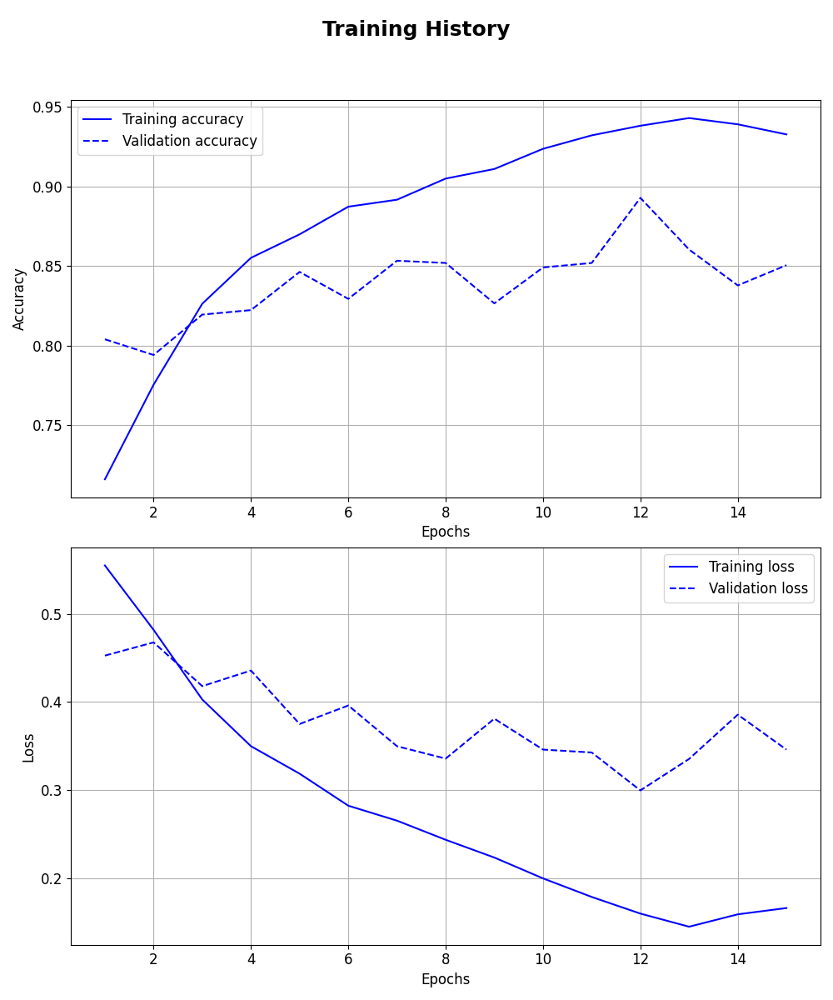

### Detailed Report of Test Set:

|              | precision    | recall       | f1-score     | support      |
| ------------ | ------------ | ------------ | ------------ | ------------ |
| chihuahua    | 0.8248       | 0.9439       | 0.8803       | 374          | 
| muffin       | 0.9258       | 0.7774       | 0.8452       | 337          | 
| micro avg    | 0.8650       | 0.8650       | 0.8650       | 711          | 
| macro avg    | 0.8753       | 0.8606       | 0.8627       | 711          | 
| weighted avg | 0.8727       | 0.8650       | 0.8636       | 711          | 
| samples avg  | 0.8650       | 0.8650       | 0.8650       | 711          | 

## trial_26

*    *Start Time*: 2024-10-24 13:09:50

*    *Duration*: 0:05:44.935

*    *Directory*: [Link](./trial_26)

### Hyperparameters:

| Hyperparameter        | Value                 |
| --------------------- | --------------------- |
| normalization         | mean                  |
| batch_size            | 128                   |
| learning_rate         | 5.979451031301974e-05 |

### Evaluation Metrics:

|           | train     | val       | test      |
| --------- | --------- | --------- | --------- |
| accuracy  | 0.9298    | 0.8434    | 0.8636    | 
| precision | 0.9298    | 0.8434    | 0.8636    | 
| recall    | 0.9298    | 0.8434    | 0.8636    | 
| f1        | 0.9298    | 0.8434    | 0.8636    | 

### Figures:

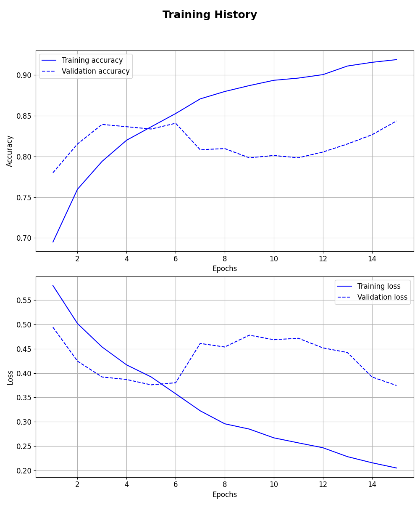

### Detailed Report of Test Set:

|              | precision    | recall       | f1-score     | support      |
| ------------ | ------------ | ------------ | ------------ | ------------ |
| chihuahua    | 0.9541       | 0.7781       | 0.8571       | 374          | 
| muffin       | 0.7956       | 0.9585       | 0.8694       | 337          | 
| micro avg    | 0.8636       | 0.8636       | 0.8636       | 711          | 
| macro avg    | 0.8748       | 0.8683       | 0.8633       | 711          | 
| weighted avg | 0.8790       | 0.8636       | 0.8630       | 711          | 
| samples avg  | 0.8636       | 0.8636       | 0.8636       | 711          | 

## trial_78

*    *Start Time*: 2024-10-27 12:42:12

*    *Duration*: 0:05:47.346

*    *Directory*: [Link](./trial_78)

### Hyperparameters:

| Hyperparameter        | Value                 |
| --------------------- | --------------------- |
| normalization         | standard              |
| batch_size            | 256                   |
| learning_rate         | 5.010317408085337e-05 |

### Evaluation Metrics:

|           | train     | val       | test      |
| --------- | --------- | --------- | --------- |
| accuracy  | 0.9137    | 0.8322    | 0.8636    | 
| precision | 0.9137    | 0.8322    | 0.8636    | 
| recall    | 0.9137    | 0.8322    | 0.8636    | 
| f1        | 0.9137    | 0.8322    | 0.8636    | 

### Figures:

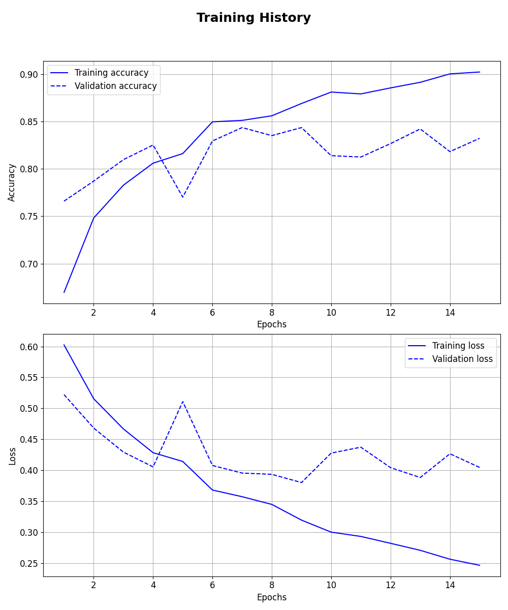

### Detailed Report of Test Set:

|              | precision    | recall       | f1-score     | support      |
| ------------ | ------------ | ------------ | ------------ | ------------ |
| chihuahua    | 0.9511       | 0.7807       | 0.8576       | 374          | 
| muffin       | 0.7970       | 0.9555       | 0.8691       | 337          | 
| micro avg    | 0.8636       | 0.8636       | 0.8636       | 711          | 
| macro avg    | 0.8741       | 0.8681       | 0.8633       | 711          | 
| weighted avg | 0.8781       | 0.8636       | 0.8630       | 711          | 
| samples avg  | 0.8636       | 0.8636       | 0.8636       | 711          | 

## trial_7

*    *Start Time*: 2024-10-26 19:31:06

*    *Duration*: 0:05:47.644

*    *Directory*: [Link](./trial_7)

### Hyperparameters:

| Hyperparameter        | Value                 |
| --------------------- | --------------------- |
| normalization         | standard              |
| batch_size            | 128                   |
| learning_rate         | 7.101980406624568e-05 |

### Evaluation Metrics:

|           | train     | val       | test      |
| --------- | --------- | --------- | --------- |
| accuracy  | 0.9659    | 0.8575    | 0.8622    | 
| precision | 0.9659    | 0.8575    | 0.8622    | 
| recall    | 0.9659    | 0.8575    | 0.8622    | 
| f1        | 0.9659    | 0.8575    | 0.8622    | 

### Figures:

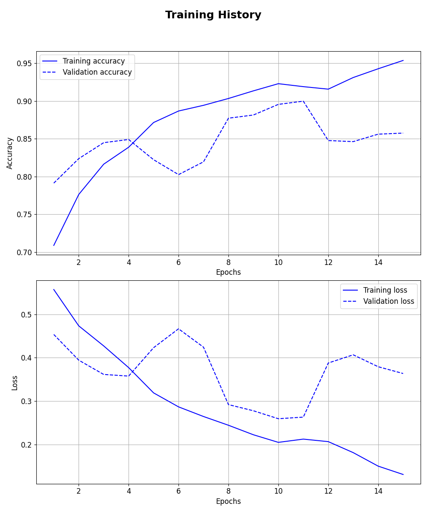

### Detailed Report of Test Set:

|              | precision    | recall       | f1-score     | support      |
| ------------ | ------------ | ------------ | ------------ | ------------ |
| chihuahua    | 0.9510       | 0.7781       | 0.8559       | 374          | 
| muffin       | 0.7951       | 0.9555       | 0.8679       | 337          | 
| micro avg    | 0.8622       | 0.8622       | 0.8622       | 711          | 
| macro avg    | 0.8730       | 0.8668       | 0.8619       | 711          | 
| weighted avg | 0.8771       | 0.8622       | 0.8616       | 711          | 
| samples avg  | 0.8622       | 0.8622       | 0.8622       | 711          | 

## trial_91

*    *Start Time*: 2024-10-27 13:57:39

*    *Duration*: 0:05:48.658

*    *Directory*: [Link](./trial_91)

### Hyperparameters:

| Hyperparameter        | Value                 |
| --------------------- | --------------------- |
| normalization         | standard              |
| batch_size            | 256                   |
| learning_rate         | 6.484871426115078e-05 |

### Evaluation Metrics:

|           | train     | val       | test      |
| --------- | --------- | --------- | --------- |
| accuracy  | 0.9310    | 0.8336    | 0.8608    | 
| precision | 0.9310    | 0.8336    | 0.8608    | 
| recall    | 0.9310    | 0.8336    | 0.8608    | 
| f1        | 0.9310    | 0.8336    | 0.8608    | 

### Figures:

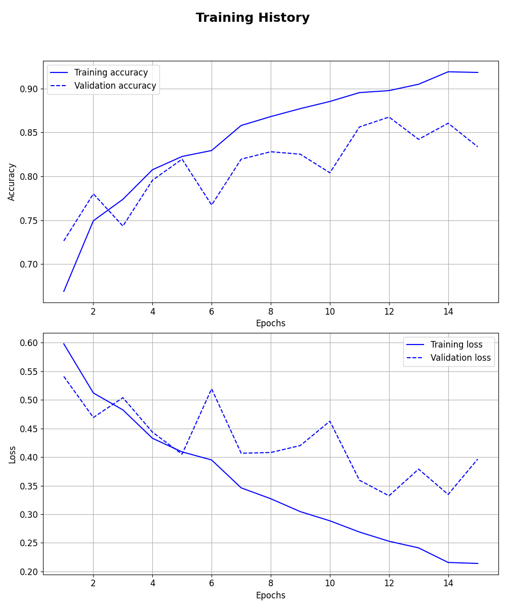

### Detailed Report of Test Set:

|              | precision    | recall       | f1-score     | support      |
| ------------ | ------------ | ------------ | ------------ | ------------ |
| chihuahua    | 0.9479       | 0.7781       | 0.8546       | 374          | 
| muffin       | 0.7946       | 0.9525       | 0.8664       | 337          | 
| micro avg    | 0.8608       | 0.8608       | 0.8608       | 711          | 
| macro avg    | 0.8712       | 0.8653       | 0.8605       | 711          | 
| weighted avg | 0.8752       | 0.8608       | 0.8602       | 711          | 
| samples avg  | 0.8608       | 0.8608       | 0.8608       | 711          | 

## trial_65

*    *Start Time*: 2024-10-27 11:26:14

*    *Duration*: 0:05:46.173

*    *Directory*: [Link](./trial_65)

### Hyperparameters:

| Hyperparameter        | Value                 |
| --------------------- | --------------------- |
| normalization         | standard              |
| batch_size            | 128                   |
| learning_rate         | 5.842274274517951e-05 |

### Evaluation Metrics:

|           | train     | val       | test      |
| --------- | --------- | --------- | --------- |
| accuracy  | 0.9567    | 0.8336    | 0.8579    | 
| precision | 0.9567    | 0.8336    | 0.8579    | 
| recall    | 0.9567    | 0.8336    | 0.8579    | 
| f1        | 0.9567    | 0.8336    | 0.8579    | 

### Figures:

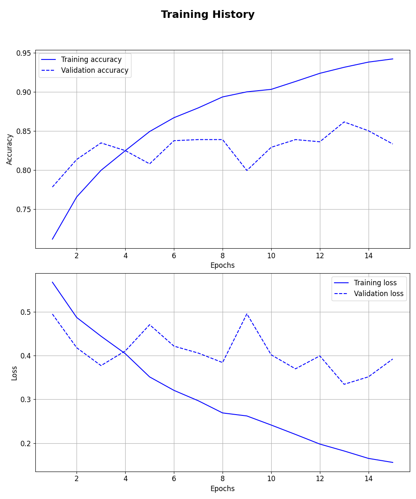

### Detailed Report of Test Set:

|              | precision    | recall       | f1-score     | support      |
| ------------ | ------------ | ------------ | ------------ | ------------ |
| chihuahua    | 0.9417       | 0.7781       | 0.8521       | 374          | 
| muffin       | 0.7935       | 0.9466       | 0.8633       | 337          | 
| micro avg    | 0.8579       | 0.8579       | 0.8579       | 711          | 
| macro avg    | 0.8676       | 0.8623       | 0.8577       | 711          | 
| weighted avg | 0.8715       | 0.8579       | 0.8574       | 711          | 
| samples avg  | 0.8579       | 0.8579       | 0.8579       | 711          | 

## trial_98

*    *Start Time*: 2024-10-27 14:38:20

*    *Duration*: 0:28:05.059

*    *Directory*: [Link](./trial_98)

### Hyperparameters:

| Hyperparameter        | Value                 |
| --------------------- | --------------------- |
| normalization         | standard              |
| batch_size            | 128                   |
| learning_rate         | 6.883100243535456e-05 |

### Evaluation Metrics:

|           | train     | val       | test      |
| --------- | --------- | --------- | --------- |
| accuracy  | 0.9573    | 0.8279    | 0.8579    | 
| precision | 0.9573    | 0.8279    | 0.8579    | 
| recall    | 0.9573    | 0.8279    | 0.8579    | 
| f1        | 0.9573    | 0.8279    | 0.8579    | 

### Figures:

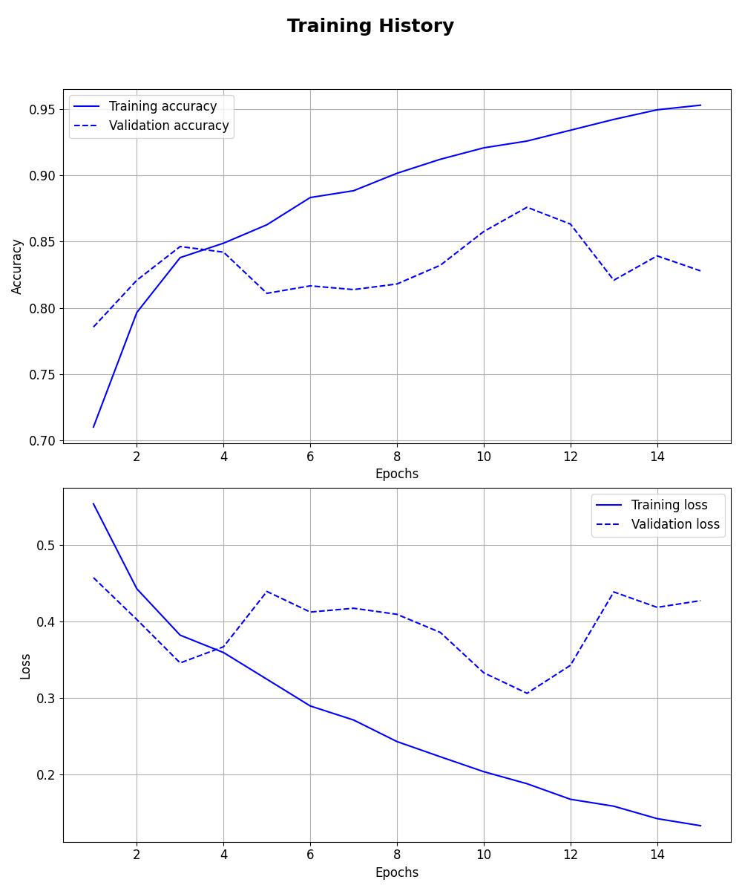

### Detailed Report of Test Set:

|              | precision    | recall       | f1-score     | support      |
| ------------ | ------------ | ------------ | ------------ | ------------ |
| chihuahua    | 0.9659       | 0.7567       | 0.8486       | 374          | 
| muffin       | 0.7823       | 0.9703       | 0.8662       | 337          | 
| micro avg    | 0.8579       | 0.8579       | 0.8579       | 711          | 
| macro avg    | 0.8741       | 0.8635       | 0.8574       | 711          | 
| weighted avg | 0.8789       | 0.8579       | 0.8569       | 711          | 
| samples avg  | 0.8579       | 0.8579       | 0.8579       | 711          | 

## trial_35

*    *Start Time*: 2024-10-24 14:01:35

*    *Duration*: 0:05:46.107

*    *Directory*: [Link](./trial_35)

### Hyperparameters:

| Hyperparameter         | Value                  |
| ---------------------- | ---------------------- |
| normalization          | mean                   |
| batch_size             | 128                    |
| learning_rate          | 0.00048766641603334427 |

### Evaluation Metrics:

|           | train     | val       | test      |
| --------- | --------- | --------- | --------- |
| accuracy  | 0.9673    | 0.8449    | 0.8565    | 
| precision | 0.9673    | 0.8449    | 0.8565    | 
| recall    | 0.9673    | 0.8449    | 0.8565    | 
| f1        | 0.9673    | 0.8449    | 0.8565    | 

### Figures:

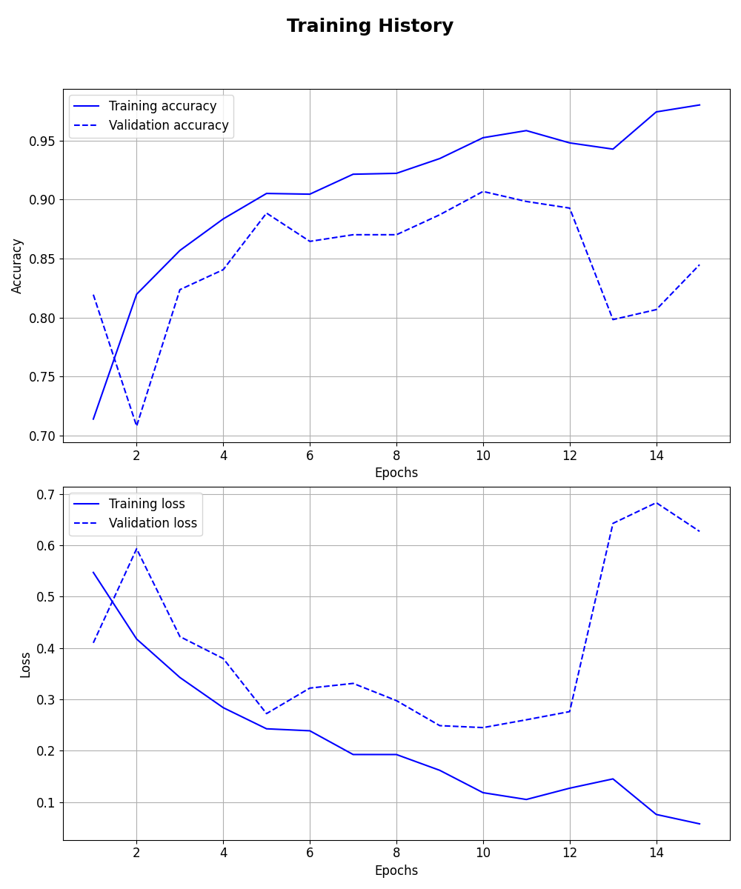

### Detailed Report of Test Set:

|              | precision    | recall       | f1-score     | support      |
| ------------ | ------------ | ------------ | ------------ | ------------ |
| chihuahua    | 0.9359       | 0.7807       | 0.8513       | 374          | 
| muffin       | 0.7945       | 0.9407       | 0.8614       | 337          | 
| micro avg    | 0.8565       | 0.8565       | 0.8565       | 711          | 
| macro avg    | 0.8652       | 0.8607       | 0.8564       | 711          | 
| weighted avg | 0.8689       | 0.8565       | 0.8561       | 711          | 
| samples avg  | 0.8565       | 0.8565       | 0.8565       | 711          | 

## trial_79

*    *Start Time*: 2024-10-27 12:48:01

*    *Duration*: 0:05:46.252

*    *Directory*: [Link](./trial_79)

### Hyperparameters:

| Hyperparameter        | Value                 |
| --------------------- | --------------------- |
| normalization         | mean                  |
| batch_size            | 128                   |
| learning_rate         | 5.592854002655101e-05 |

### Evaluation Metrics:

|           | train     | val       | test      |
| --------- | --------- | --------- | --------- |
| accuracy  | 0.9159    | 0.8561    | 0.8565    | 
| precision | 0.9159    | 0.8561    | 0.8565    | 
| recall    | 0.9159    | 0.8561    | 0.8565    | 
| f1        | 0.9159    | 0.8561    | 0.8565    | 

### Figures:

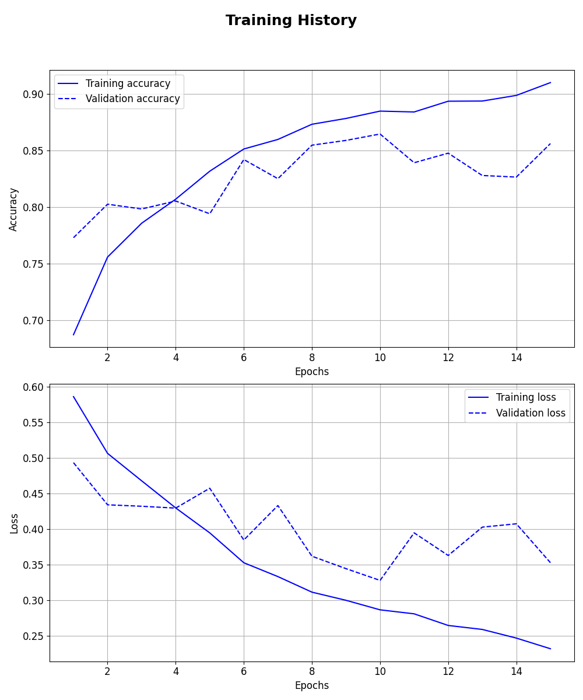

### Detailed Report of Test Set:

|              | precision    | recall       | f1-score     | support      |
| ------------ | ------------ | ------------ | ------------ | ------------ |
| chihuahua    | 0.9224       | 0.7941       | 0.8534       | 374          | 
| muffin       | 0.8021       | 0.9258       | 0.8595       | 337          | 
| micro avg    | 0.8565       | 0.8565       | 0.8565       | 711          | 
| macro avg    | 0.8622       | 0.8600       | 0.8565       | 711          | 
| weighted avg | 0.8653       | 0.8565       | 0.8563       | 711          | 
| samples avg  | 0.8565       | 0.8565       | 0.8565       | 711          | 

## trial_80

*    *Start Time*: 2024-10-27 12:53:49

*    *Duration*: 0:05:46.228

*    *Directory*: [Link](./trial_80)

### Hyperparameters:

| Hyperparameter         | Value                  |
| ---------------------- | ---------------------- |
| normalization          | standard               |
| batch_size             | 128                    |
| learning_rate          | 5.8828252205874735e-05 |

### Evaluation Metrics:

|           | train     | val       | test      |
| --------- | --------- | --------- | --------- |
| accuracy  | 0.9635    | 0.8660    | 0.8565    | 
| precision | 0.9635    | 0.8660    | 0.8565    | 
| recall    | 0.9635    | 0.8660    | 0.8565    | 
| f1        | 0.9635    | 0.8660    | 0.8565    | 

### Figures:

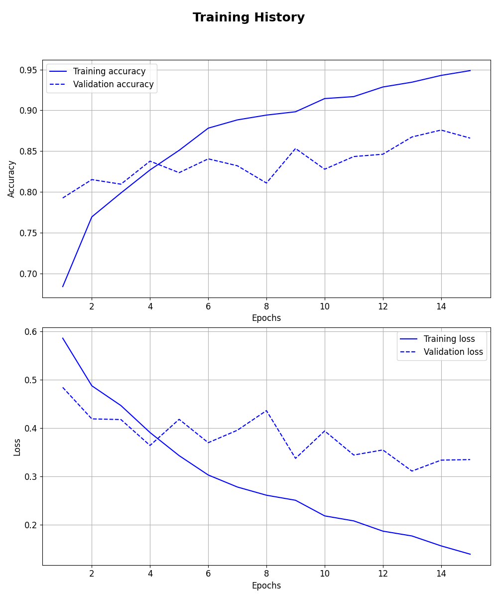

### Detailed Report of Test Set:

|              | precision    | recall       | f1-score     | support      |
| ------------ | ------------ | ------------ | ------------ | ------------ |
| chihuahua    | 0.9121       | 0.8048       | 0.8551       | 374          | 
| muffin       | 0.8084       | 0.9139       | 0.8579       | 337          | 
| micro avg    | 0.8565       | 0.8565       | 0.8565       | 711          | 
| macro avg    | 0.8603       | 0.8594       | 0.8565       | 711          | 
| weighted avg | 0.8630       | 0.8565       | 0.8565       | 711          | 
| samples avg  | 0.8565       | 0.8565       | 0.8565       | 711          | 

## trial_88

*    *Start Time*: 2024-10-27 13:40:08

*    *Duration*: 0:05:49.138

*    *Directory*: [Link](./trial_88)

### Hyperparameters:

| Hyperparameter        | Value                 |
| --------------------- | --------------------- |
| normalization         | standard              |
| batch_size            | 128                   |
| learning_rate         | 7.058495156162403e-05 |

### Evaluation Metrics:

|           | train     | val       | test      |
| --------- | --------- | --------- | --------- |
| accuracy  | 0.9600    | 0.8449    | 0.8551    | 
| precision | 0.9600    | 0.8449    | 0.8551    | 
| recall    | 0.9600    | 0.8449    | 0.8551    | 
| f1        | 0.9600    | 0.8449    | 0.8551    | 

### Figures:

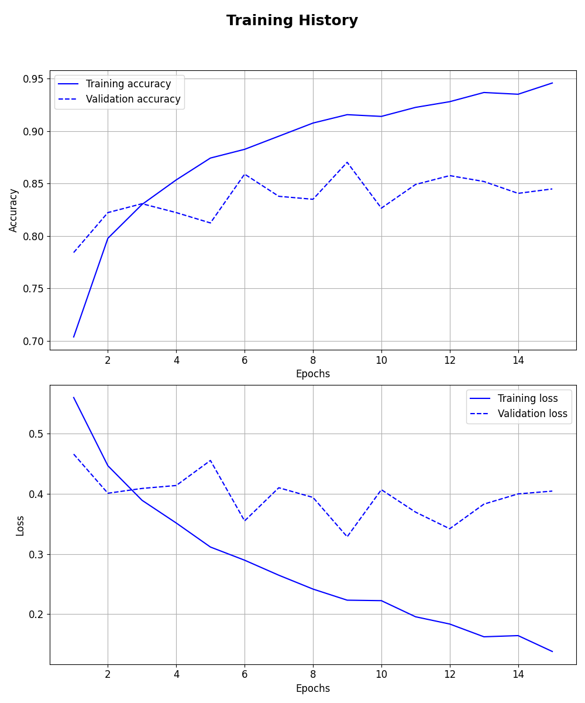

### Detailed Report of Test Set:

|              | precision    | recall       | f1-score     | support      |
| ------------ | ------------ | ------------ | ------------ | ------------ |
| chihuahua    | 0.9502       | 0.7647       | 0.8474       | 374          | 
| muffin       | 0.7854       | 0.9555       | 0.8621       | 337          | 
| micro avg    | 0.8551       | 0.8551       | 0.8551       | 711          | 
| macro avg    | 0.8678       | 0.8601       | 0.8548       | 711          | 
| weighted avg | 0.8721       | 0.8551       | 0.8544       | 711          | 
| samples avg  | 0.8551       | 0.8551       | 0.8551       | 711          | 

## trial_99

*    *Start Time*: 2024-10-27 15:06:27

*    *Duration*: 0:05:44.271

*    *Directory*: [Link](./trial_99)

### Hyperparameters:

| Hyperparameter        | Value                 |
| --------------------- | --------------------- |
| normalization         | standard              |
| batch_size            | 128                   |
| learning_rate         | 6.243893018332356e-05 |

### Evaluation Metrics:

|           | train     | val       | test      |
| --------- | --------- | --------- | --------- |
| accuracy  | 0.9656    | 0.8350    | 0.8537    | 
| precision | 0.9656    | 0.8350    | 0.8537    | 
| recall    | 0.9656    | 0.8350    | 0.8537    | 
| f1        | 0.9656    | 0.8350    | 0.8537    | 

### Figures:

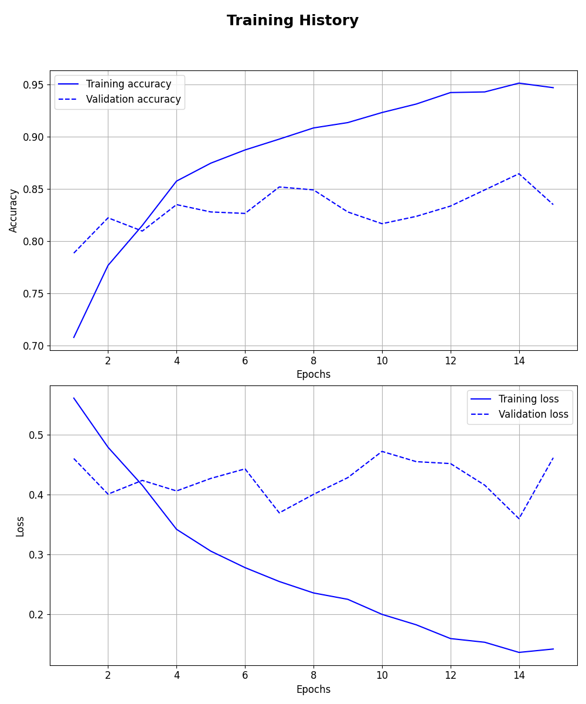

### Detailed Report of Test Set:

|              | precision    | recall       | f1-score     | support      |
| ------------ | ------------ | ------------ | ------------ | ------------ |
| chihuahua    | 0.9530       | 0.7594       | 0.8452       | 374          | 
| muffin       | 0.7821       | 0.9585       | 0.8613       | 337          | 
| micro avg    | 0.8537       | 0.8537       | 0.8537       | 711          | 
| macro avg    | 0.8676       | 0.8589       | 0.8533       | 711          | 
| weighted avg | 0.8720       | 0.8537       | 0.8529       | 711          | 
| samples avg  | 0.8537       | 0.8537       | 0.8537       | 711          | 

## trial_29

*    *Start Time*: 2024-10-24 13:27:03

*    *Duration*: 0:05:43.086

*    *Directory*: [Link](./trial_29)

### Hyperparameters:

| Hyperparameter        | Value                 |
| --------------------- | --------------------- |
| normalization         | standard              |
| batch_size            | 64                    |
| learning_rate         | 8.454376570947408e-05 |

### Evaluation Metrics:

|           | train     | val       | test      |
| --------- | --------- | --------- | --------- |
| accuracy  | 0.9899    | 0.8519    | 0.8523    | 
| precision | 0.9899    | 0.8519    | 0.8523    | 
| recall    | 0.9899    | 0.8519    | 0.8523    | 
| f1        | 0.9899    | 0.8519    | 0.8523    | 

### Figures:

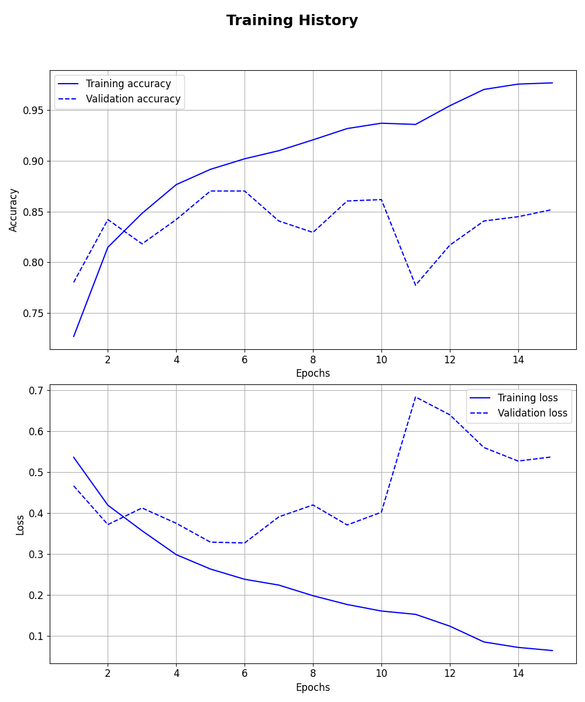

### Detailed Report of Test Set:

|              | precision    | recall       | f1-score     | support      |
| ------------ | ------------ | ------------ | ------------ | ------------ |
| chihuahua    | 0.9468       | 0.7620       | 0.8444       | 374          | 
| muffin       | 0.7829       | 0.9525       | 0.8594       | 337          | 
| micro avg    | 0.8523       | 0.8523       | 0.8523       | 711          | 
| macro avg    | 0.8649       | 0.8573       | 0.8519       | 711          | 
| weighted avg | 0.8692       | 0.8523       | 0.8516       | 711          | 
| samples avg  | 0.8523       | 0.8523       | 0.8523       | 711          | 

## trial_25

*    *Start Time*: 2024-10-24 13:04:04

*    *Duration*: 0:05:44.362

*    *Directory*: [Link](./trial_25)

### Hyperparameters:

| Hyperparameter        | Value                 |
| --------------------- | --------------------- |
| normalization         | standard              |
| batch_size            | 128                   |
| learning_rate         | 7.495330309767856e-05 |

### Evaluation Metrics:

|           | train     | val       | test      |
| --------- | --------- | --------- | --------- |
| accuracy  | 0.9445    | 0.8491    | 0.8523    | 
| precision | 0.9445    | 0.8491    | 0.8523    | 
| recall    | 0.9445    | 0.8491    | 0.8523    | 
| f1        | 0.9445    | 0.8491    | 0.8523    | 

### Figures:

### Detailed Report of Test Set:

|              | precision    | recall       | f1-score     | support      |
| ------------ | ------------ | ------------ | ------------ | ------------ |
| chihuahua    | 0.9590       | 0.7513       | 0.8426       | 374          | 
| muffin       | 0.7775       | 0.9644       | 0.8609       | 337          | 
| micro avg    | 0.8523       | 0.8523       | 0.8523       | 711          | 
| macro avg    | 0.8683       | 0.8579       | 0.8518       | 711          | 
| weighted avg | 0.8730       | 0.8523       | 0.8513       | 711          | 
| samples avg  | 0.8523       | 0.8523       | 0.8523       | 711          | 

## trial_19

*    *Start Time*: 2024-10-24 12:29:33

*    *Duration*: 0:05:45.880

*    *Directory*: [Link](./trial_19)

### Hyperparameters:

| Hyperparameter        | Value                 |
| --------------------- | --------------------- |
| normalization         | standard              |
| batch_size            | 256                   |
| learning_rate         | 0.0001238764053988583 |

### Evaluation Metrics:

|           | train     | val       | test      |
| --------- | --------- | --------- | --------- |
| accuracy  | 0.9476    | 0.8166    | 0.8509    | 
| precision | 0.9476    | 0.8166    | 0.8509    | 
| recall    | 0.9476    | 0.8166    | 0.8509    | 
| f1        | 0.9476    | 0.8166    | 0.8509    | 

### Figures:

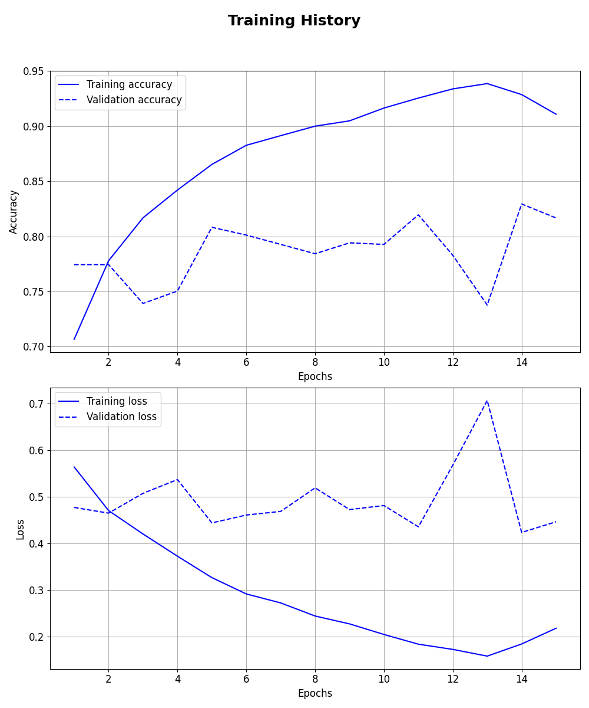

### Detailed Report of Test Set:

|              | precision    | recall       | f1-score     | support      |
| ------------ | ------------ | ------------ | ------------ | ------------ |
| chihuahua    | 0.9685       | 0.7406       | 0.8394       | 374          | 
| muffin       | 0.7718       | 0.9733       | 0.8609       | 337          | 
| micro avg    | 0.8509       | 0.8509       | 0.8509       | 711          | 
| macro avg    | 0.8701       | 0.8570       | 0.8501       | 711          | 
| weighted avg | 0.8753       | 0.8509       | 0.8496       | 711          | 
| samples avg  | 0.8509       | 0.8509       | 0.8509       | 711          | 

## trial_13

*    *Start Time*: 2024-10-24 11:55:06

*    *Duration*: 0:05:41.707

*    *Directory*: [Link](./trial_13)

### Hyperparameters:

| Hyperparameter        | Value                 |
| --------------------- | --------------------- |
| normalization         | standard              |
| batch_size            | 128                   |
| learning_rate         | 9.819422880680574e-05 |

### Evaluation Metrics:

|           | train     | val       | test      |
| --------- | --------- | --------- | --------- |
| accuracy  | 0.9798    | 0.8519    | 0.8509    | 
| precision | 0.9798    | 0.8519    | 0.8509    | 
| recall    | 0.9798    | 0.8519    | 0.8509    | 
| f1        | 0.9798    | 0.8519    | 0.8509    | 

### Figures:

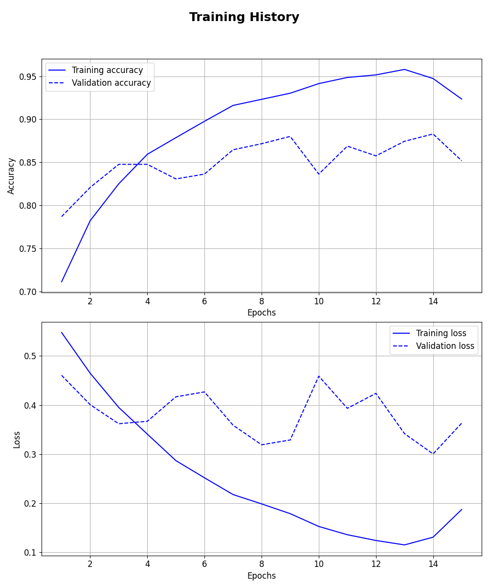

### Detailed Report of Test Set:

|              | precision    | recall       | f1-score     | support      |
| ------------ | ------------ | ------------ | ------------ | ------------ |
| chihuahua    | 0.9408       | 0.7647       | 0.8437       | 374          | 
| muffin       | 0.7838       | 0.9466       | 0.8575       | 337          | 
| micro avg    | 0.8509       | 0.8509       | 0.8509       | 711          | 
| macro avg    | 0.8623       | 0.8556       | 0.8506       | 711          | 
| weighted avg | 0.8664       | 0.8509       | 0.8502       | 711          | 
| samples avg  | 0.8509       | 0.8509       | 0.8509       | 711          | 

## trial_37

*    *Start Time*: 2024-10-24 14:13:12

*    *Duration*: 0:05:43.610

*    *Directory*: [Link](./trial_37)

### Hyperparameters:

| Hyperparameter        | Value                 |
| --------------------- | --------------------- |
| normalization         | standard              |
| batch_size            | 256                   |
| learning_rate         | 5.773892670661637e-05 |

### Evaluation Metrics:

|           | train     | val       | test      |
| --------- | --------- | --------- | --------- |
| accuracy  | 0.9277    | 0.8279    | 0.8495    | 
| precision | 0.9277    | 0.8279    | 0.8495    | 
| recall    | 0.9277    | 0.8279    | 0.8495    | 
| f1        | 0.9277    | 0.8279    | 0.8495    | 

### Figures:

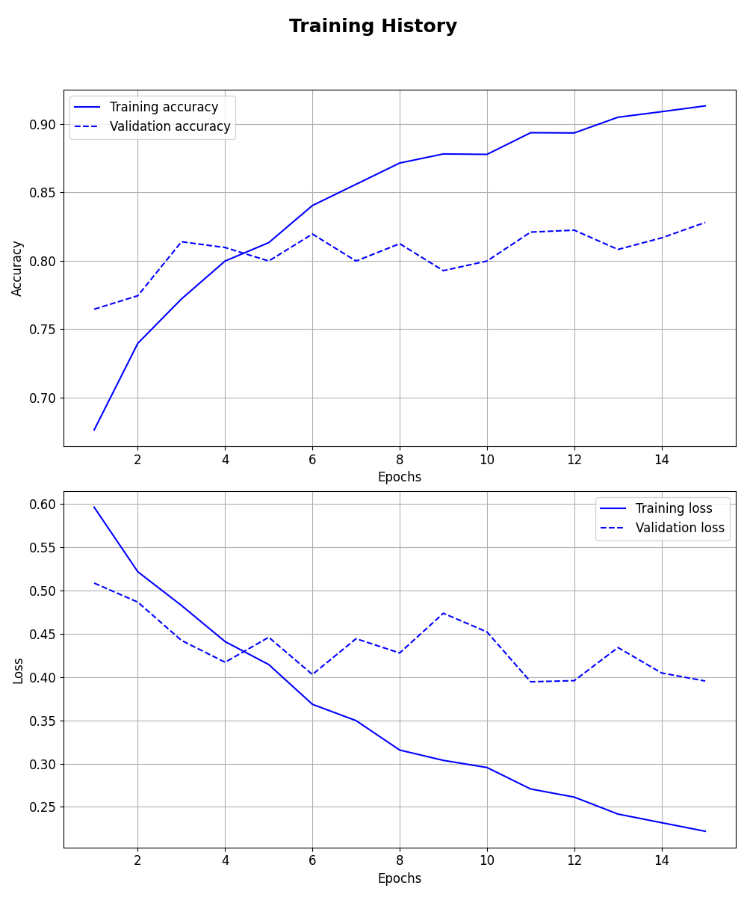

### Detailed Report of Test Set:

|              | precision    | recall       | f1-score     | support      |
| ------------ | ------------ | ------------ | ------------ | ------------ |
| chihuahua    | 0.9465       | 0.7567       | 0.8410       | 374          | 
| muffin       | 0.7791       | 0.9525       | 0.8571       | 337          | 
| micro avg    | 0.8495       | 0.8495       | 0.8495       | 711          | 
| macro avg    | 0.8628       | 0.8546       | 0.8491       | 711          | 
| weighted avg | 0.8672       | 0.8495       | 0.8487       | 711          | 
| samples avg  | 0.8495       | 0.8495       | 0.8495       | 711          | 

## trial_11

*    *Start Time*: 2024-10-24 11:43:39

*    *Duration*: 0:05:41.949

*    *Directory*: [Link](./trial_11)

### Hyperparameters:

| Hyperparameter        | Value                 |
| --------------------- | --------------------- |
| normalization         | standard              |
| batch_size            | 256                   |
| learning_rate         | 6.225327425239959e-05 |

### Evaluation Metrics:

|           | train     | val       | test      |
| --------- | --------- | --------- | --------- |
| accuracy  | 0.9259    | 0.8279    | 0.8495    | 
| precision | 0.9259    | 0.8279    | 0.8495    | 
| recall    | 0.9259    | 0.8279    | 0.8495    | 
| f1        | 0.9259    | 0.8279    | 0.8495    | 

### Figures:

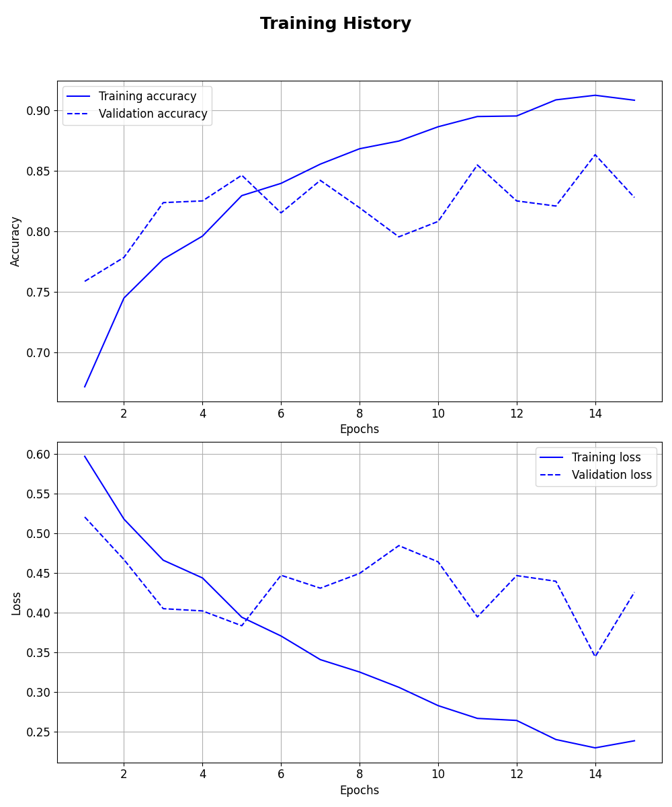

### Detailed Report of Test Set:

|              | precision    | recall       | f1-score     | support      |
| ------------ | ------------ | ------------ | ------------ | ------------ |
| chihuahua    | 0.9684       | 0.7380       | 0.8376       | 374          | 
| muffin       | 0.7700       | 0.9733       | 0.8598       | 337          | 
| micro avg    | 0.8495       | 0.8495       | 0.8495       | 711          | 
| macro avg    | 0.8692       | 0.8556       | 0.8487       | 711          | 
| weighted avg | 0.8744       | 0.8495       | 0.8481       | 711          | 
| samples avg  | 0.8495       | 0.8495       | 0.8495       | 711          | 

## trial_81

*    *Start Time*: 2024-10-27 12:59:37

*    *Duration*: 0:05:45.393

*    *Directory*: [Link](./trial_81)

### Hyperparameters:

| Hyperparameter        | Value                 |
| --------------------- | --------------------- |
| normalization         | standard              |
| batch_size            | 128                   |
| learning_rate         | 5.278635724264208e-05 |

### Evaluation Metrics:

|           | train     | val       | test      |
| --------- | --------- | --------- | --------- |
| accuracy  | 0.9473    | 0.8307    | 0.8495    | 
| precision | 0.9473    | 0.8307    | 0.8495    | 
| recall    | 0.9473    | 0.8307    | 0.8495    | 
| f1        | 0.9473    | 0.8307    | 0.8495    | 

### Figures:

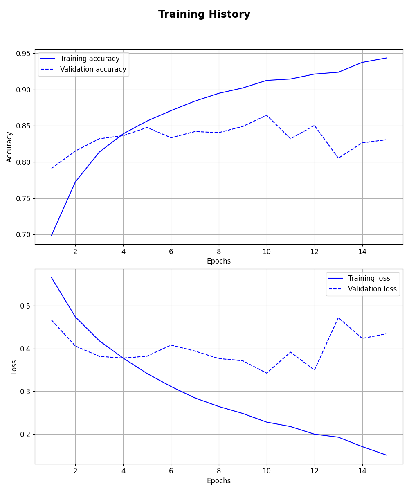

### Detailed Report of Test Set:

|              | precision    | recall       | f1-score     | support      |
| ------------ | ------------ | ------------ | ------------ | ------------ |
| chihuahua    | 0.9465       | 0.7567       | 0.8410       | 374          | 
| muffin       | 0.7791       | 0.9525       | 0.8571       | 337          | 
| micro avg    | 0.8495       | 0.8495       | 0.8495       | 711          | 
| macro avg    | 0.8628       | 0.8546       | 0.8491       | 711          | 
| weighted avg | 0.8672       | 0.8495       | 0.8487       | 711          | 
| samples avg  | 0.8495       | 0.8495       | 0.8495       | 711          | 

## trial_23

*    *Start Time*: 2024-10-24 12:52:34

*    *Duration*: 0:05:44.448

*    *Directory*: [Link](./trial_23)

### Hyperparameters:

| Hyperparameter        | Value                 |
| --------------------- | --------------------- |
| normalization         | standard              |
| batch_size            | 128                   |
| learning_rate         | 6.837322101450409e-05 |

### Evaluation Metrics:

|           | train     | val       | test      |
| --------- | --------- | --------- | --------- |
| accuracy  | 0.9514    | 0.8011    | 0.8481    | 
| precision | 0.9514    | 0.8011    | 0.8481    | 
| recall    | 0.9514    | 0.8011    | 0.8481    | 
| f1        | 0.9514    | 0.8011    | 0.8481    | 

### Figures:

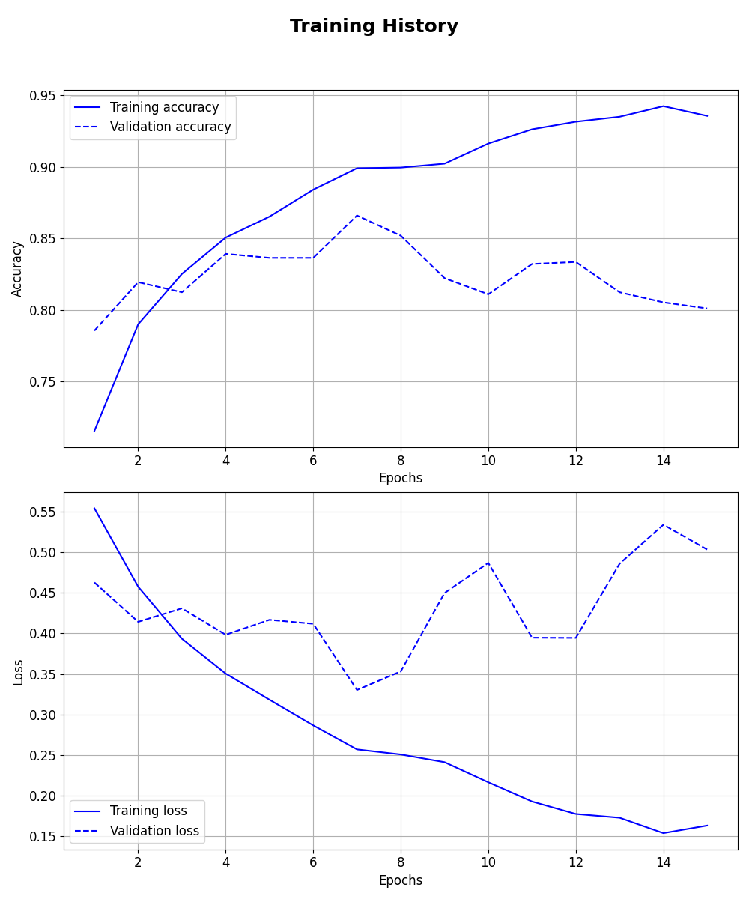

### Detailed Report of Test Set:

|              | precision    | recall       | f1-score     | support      |
| ------------ | ------------ | ------------ | ------------ | ------------ |
| chihuahua    | 0.9716       | 0.7326       | 0.8354       | 374          | 
| muffin       | 0.7669       | 0.9763       | 0.8590       | 337          | 
| micro avg    | 0.8481       | 0.8481       | 0.8481       | 711          | 
| macro avg    | 0.8693       | 0.8544       | 0.8472       | 711          | 
| weighted avg | 0.8746       | 0.8481       | 0.8466       | 711          | 
| samples avg  | 0.8481       | 0.8481       | 0.8481       | 711          | 

## trial_45

*    *Start Time*: 2024-10-24 14:59:36

*    *Duration*: 0:05:45.754

*    *Directory*: [Link](./trial_45)

### Hyperparameters:

| Hyperparameter        | Value                 |
| --------------------- | --------------------- |
| normalization         | standard              |
| batch_size            | 128                   |
| learning_rate         | 7.703186480610244e-05 |

### Evaluation Metrics:

|           | train     | val       | test      |
| --------- | --------- | --------- | --------- |
| accuracy  | 0.9523    | 0.8293    | 0.8481    | 
| precision | 0.9523    | 0.8293    | 0.8481    | 
| recall    | 0.9523    | 0.8293    | 0.8481    | 
| f1        | 0.9523    | 0.8293    | 0.8481    | 

### Figures:

### Detailed Report of Test Set:

|              | precision    | recall       | f1-score     | support      |
| ------------ | ------------ | ------------ | ------------ | ------------ |
| chihuahua    | 0.9586       | 0.7433       | 0.8373       | 374          | 
| muffin       | 0.7720       | 0.9644       | 0.8575       | 337          | 
| micro avg    | 0.8481       | 0.8481       | 0.8481       | 711          | 
| macro avg    | 0.8653       | 0.8539       | 0.8474       | 711          | 
| weighted avg | 0.8702       | 0.8481       | 0.8469       | 711          | 
| samples avg  | 0.8481       | 0.8481       | 0.8481       | 711          | 

## trial_82

*    *Start Time*: 2024-10-27 13:05:24

*    *Duration*: 0:05:45.622

*    *Directory*: [Link](./trial_82)

### Hyperparameters:

| Hyperparameter        | Value                 |
| --------------------- | --------------------- |
| normalization         | standard              |
| batch_size            | 256                   |
| learning_rate         | 0.0001077238648299383 |

### Evaluation Metrics:

|           | train     | val       | test      |
| --------- | --------- | --------- | --------- |
| accuracy  | 0.9537    | 0.8251    | 0.8481    | 
| precision | 0.9537    | 0.8251    | 0.8481    | 
| recall    | 0.9537    | 0.8251    | 0.8481    | 
| f1        | 0.9537    | 0.8251    | 0.8481    | 

### Figures:

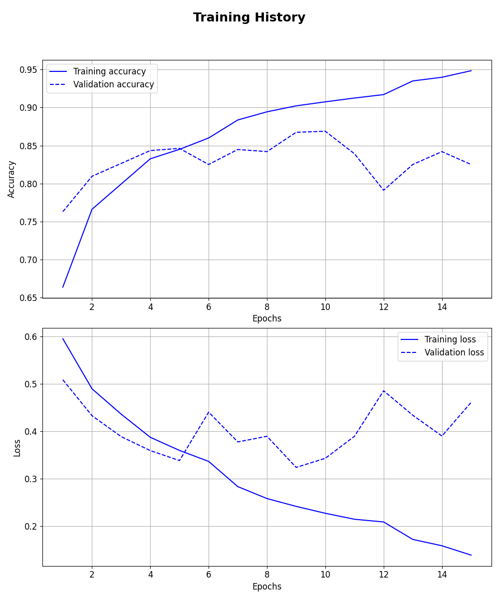

### Detailed Report of Test Set:

|              | precision    | recall       | f1-score     | support      |
| ------------ | ------------ | ------------ | ------------ | ------------ |
| chihuahua    | 0.9555       | 0.7460       | 0.8378       | 374          | 
| muffin       | 0.7733       | 0.9614       | 0.8571       | 337          | 
| micro avg    | 0.8481       | 0.8481       | 0.8481       | 711          | 
| macro avg    | 0.8644       | 0.8537       | 0.8475       | 711          | 
| weighted avg | 0.8691       | 0.8481       | 0.8470       | 711          | 
| samples avg  | 0.8481       | 0.8481       | 0.8481       | 711          | 

## trial_8

*    *Start Time*: 2024-10-24 11:26:12

*    *Duration*: 0:05:52.691

*    *Directory*: [Link](./trial_8)

### Hyperparameters:

| Hyperparameter         | Value                  |
| ---------------------- | ---------------------- |
| normalization          | mean                   |
| batch_size             | 32                     |
| learning_rate          | 0.00016907271685302836 |

### Evaluation Metrics:

|           | train     | val       | test      |
| --------- | --------- | --------- | --------- |
| accuracy  | 0.9934    | 0.8561    | 0.8425    | 
| precision | 0.9934    | 0.8561    | 0.8425    | 
| recall    | 0.9934    | 0.8561    | 0.8425    | 
| f1        | 0.9934    | 0.8561    | 0.8425    | 

### Figures:

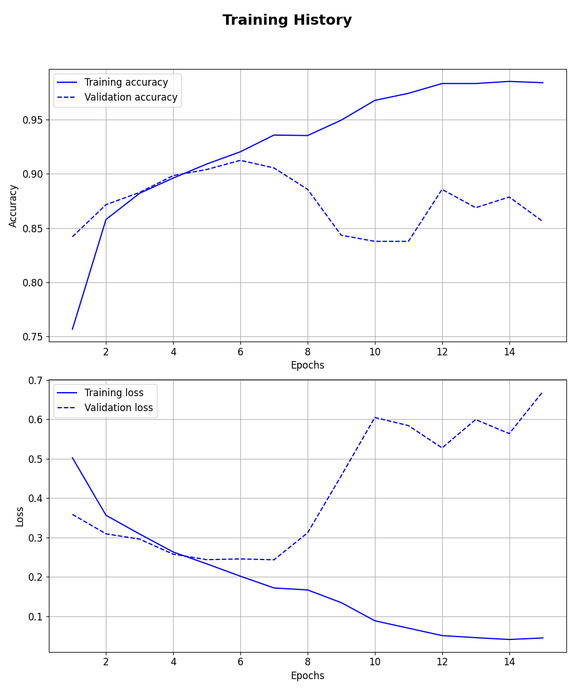

### Detailed Report of Test Set:

|              | precision    | recall       | f1-score     | support      |
| ------------ | ------------ | ------------ | ------------ | ------------ |
| chihuahua    | 0.9338       | 0.7540       | 0.8343       | 374          | 
| muffin       | 0.7751       | 0.9407       | 0.8499       | 337          | 
| micro avg    | 0.8425       | 0.8425       | 0.8425       | 711          | 
| macro avg    | 0.8544       | 0.8473       | 0.8421       | 711          | 
| weighted avg | 0.8585       | 0.8425       | 0.8417       | 711          | 
| samples avg  | 0.8425       | 0.8425       | 0.8425       | 711          | 

## trial_17

*    *Start Time*: 2024-10-24 12:18:03

*    *Duration*: 0:05:43.169

*    *Directory*: [Link](./trial_17)

### Hyperparameters:

| Hyperparameter       | Value                |
| -------------------- | -------------------- |
| normalization        | standard             |
| batch_size           | 128                  |
| learning_rate        | 5.00225082367396e-05 |

### Evaluation Metrics:

|           | train     | val       | test      |
| --------- | --------- | --------- | --------- |
| accuracy  | 0.9469    | 0.8265    | 0.8411    | 
| precision | 0.9469    | 0.8265    | 0.8411    | 
| recall    | 0.9469    | 0.8265    | 0.8411    | 
| f1        | 0.9469    | 0.8265    | 0.8411    | 

### Figures:

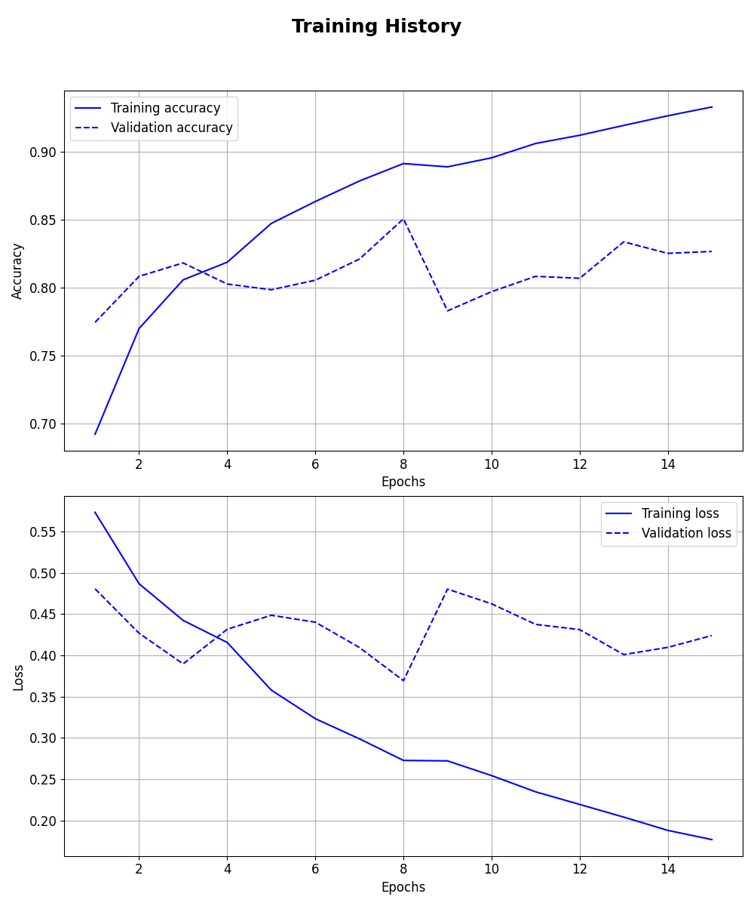

### Detailed Report of Test Set:

|              | precision    | recall       | f1-score     | support      |
| ------------ | ------------ | ------------ | ------------ | ------------ |
| chihuahua    | 0.9547       | 0.7326       | 0.8290       | 374          | 
| muffin       | 0.7642       | 0.9614       | 0.8515       | 337          | 
| micro avg    | 0.8411       | 0.8411       | 0.8411       | 711          | 
| macro avg    | 0.8594       | 0.8470       | 0.8403       | 711          | 
| weighted avg | 0.8644       | 0.8411       | 0.8397       | 711          | 
| samples avg  | 0.8411       | 0.8411       | 0.8411       | 711          | 

## trial_55

*    *Start Time*: 2024-10-27 10:27:24

*    *Duration*: 0:06:04.162

*    *Directory*: [Link](./trial_55)

### Hyperparameters:

| Hyperparameter        | Value                 |
| --------------------- | --------------------- |
| normalization         | standard              |
| batch_size            | 128                   |
| learning_rate         | 6.059013772837206e-05 |

### Evaluation Metrics:

|           | train     | val       | test      |
| --------- | --------- | --------- | --------- |
| accuracy  | 0.9597    | 0.8166    | 0.8411    | 
| precision | 0.9597    | 0.8166    | 0.8411    | 
| recall    | 0.9597    | 0.8166    | 0.8411    | 
| f1        | 0.9597    | 0.8166    | 0.8411    | 

### Figures:

### Detailed Report of Test Set:

|              | precision    | recall       | f1-score     | support      |
| ------------ | ------------ | ------------ | ------------ | ------------ |
| chihuahua    | 0.9677       | 0.7219       | 0.8270       | 374          | 
| muffin       | 0.7593       | 0.9733       | 0.8531       | 337          | 
| micro avg    | 0.8411       | 0.8411       | 0.8411       | 711          | 
| macro avg    | 0.8635       | 0.8476       | 0.8400       | 711          | 
| weighted avg | 0.8689       | 0.8411       | 0.8393       | 711          | 
| samples avg  | 0.8411       | 0.8411       | 0.8411       | 711          | 

## trial_61

*    *Start Time*: 2024-10-27 11:03:01

*    *Duration*: 0:05:41.639

*    *Directory*: [Link](./trial_61)

### Hyperparameters:

| Hyperparameter        | Value                 |
| --------------------- | --------------------- |
| normalization         | standard              |
| batch_size            | 128                   |
| learning_rate         | 0.0001537011675546025 |

### Evaluation Metrics:

|           | train     | val       | test      |
| --------- | --------- | --------- | --------- |
| accuracy  | 0.9751    | 0.8279    | 0.8411    | 
| precision | 0.9751    | 0.8279    | 0.8411    | 
| recall    | 0.9751    | 0.8279    | 0.8411    | 
| f1        | 0.9751    | 0.8279    | 0.8411    | 

### Figures:

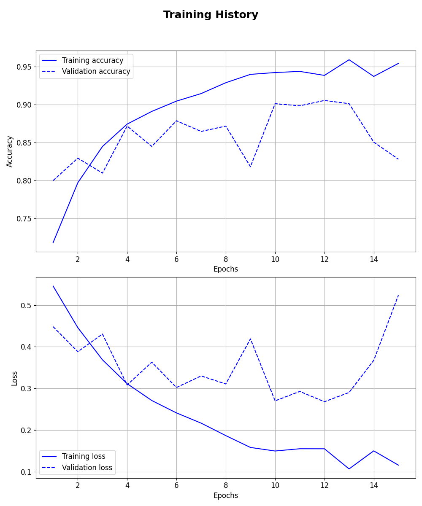

### Detailed Report of Test Set:

|              | precision    | recall       | f1-score     | support      |
| ------------ | ------------ | ------------ | ------------ | ------------ |
| chihuahua    | 0.9711       | 0.7193       | 0.8264       | 374          | 
| muffin       | 0.7581       | 0.9763       | 0.8534       | 337          | 
| micro avg    | 0.8411       | 0.8411       | 0.8411       | 711          | 
| macro avg    | 0.8646       | 0.8478       | 0.8399       | 711          | 
| weighted avg | 0.8701       | 0.8411       | 0.8392       | 711          | 
| samples avg  | 0.8411       | 0.8411       | 0.8411       | 711          | 

## trial_33

*    *Start Time*: 2024-10-24 13:50:06

*    *Duration*: 0:05:42.024

*    *Directory*: [Link](./trial_33)

### Hyperparameters:

| Hyperparameter        | Value                 |
| --------------------- | --------------------- |
| normalization         | standard              |
| batch_size            | 128                   |
| learning_rate         | 7.788116549848595e-05 |

### Evaluation Metrics:

|           | train     | val       | test      |
| --------- | --------- | --------- | --------- |
| accuracy  | 0.9567    | 0.8293    | 0.8354    | 
| precision | 0.9567    | 0.8293    | 0.8354    | 
| recall    | 0.9567    | 0.8293    | 0.8354    | 
| f1        | 0.9567    | 0.8293    | 0.8354    | 

### Figures:

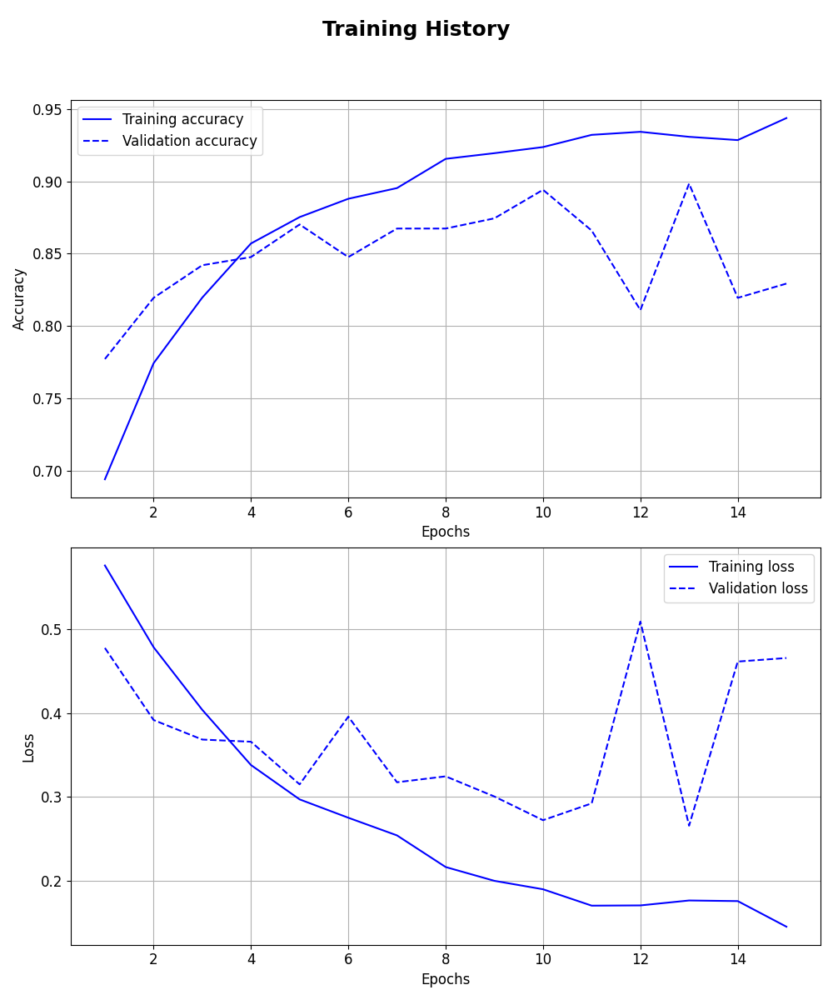

### Detailed Report of Test Set:

|              | precision    | recall       | f1-score     | support      |
| ------------ | ------------ | ------------ | ------------ | ------------ |
| chihuahua    | 0.9477       | 0.7273       | 0.8230       | 374          | 
| muffin       | 0.7594       | 0.9555       | 0.8463       | 337          | 
| micro avg    | 0.8354       | 0.8354       | 0.8354       | 711          | 
| macro avg    | 0.8536       | 0.8414       | 0.8346       | 711          | 
| weighted avg | 0.8585       | 0.8354       | 0.8340       | 711          | 
| samples avg  | 0.8354       | 0.8354       | 0.8354       | 711          | 

## trial_4

*    *Start Time*: 2024-10-26 19:13:11

*    *Duration*: 0:06:17.665

*    *Directory*: [Link](./trial_4)

### Hyperparameters:

| Hyperparameter         | Value                  |
| ---------------------- | ---------------------- |
| normalization          | standard               |
| batch_size             | 256                    |
| learning_rate          | 5.0342866223944814e-05 |

### Evaluation Metrics:

|           | train     | val       | test      |
| --------- | --------- | --------- | --------- |
| accuracy  | 0.9135    | 0.8068    | 0.8340    | 
| precision | 0.9135    | 0.8068    | 0.8340    | 
| recall    | 0.9135    | 0.8068    | 0.8340    | 
| f1        | 0.9135    | 0.8068    | 0.8340    | 

### Figures:

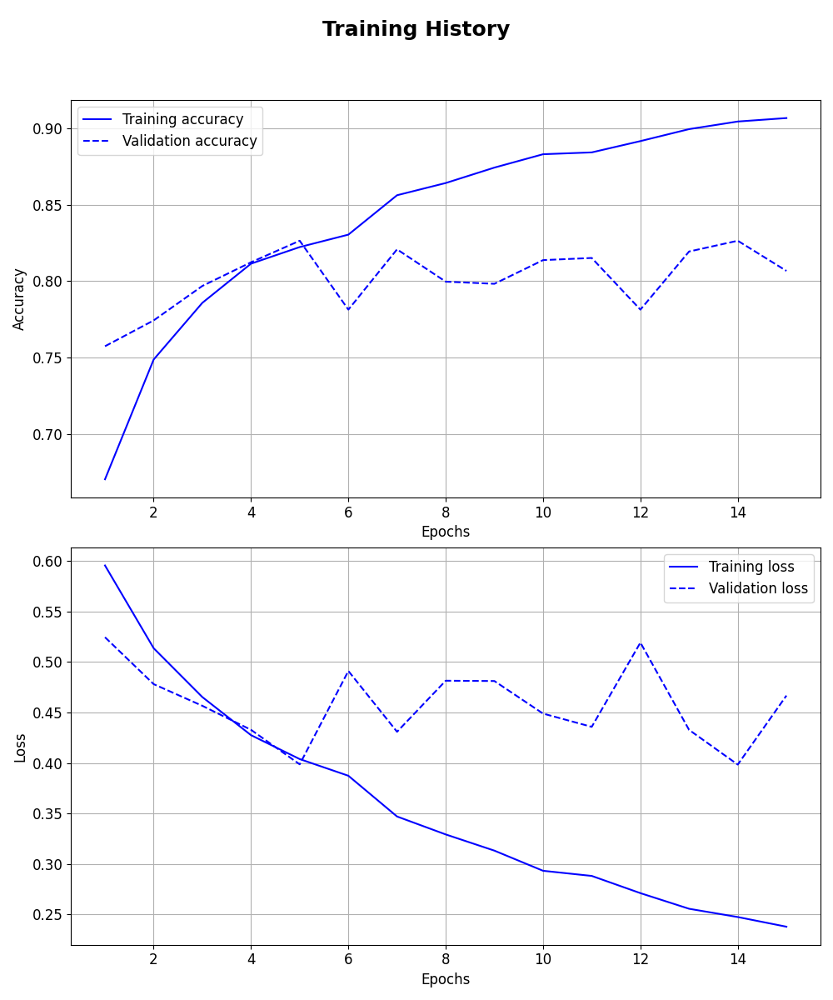

### Detailed Report of Test Set:

|              | precision    | recall       | f1-score     | support      |
| ------------ | ------------ | ------------ | ------------ | ------------ |
| chihuahua    | 0.9672       | 0.7086       | 0.8179       | 374          | 
| muffin       | 0.7506       | 0.9733       | 0.8475       | 337          | 
| micro avg    | 0.8340       | 0.8340       | 0.8340       | 711          | 
| macro avg    | 0.8589       | 0.8409       | 0.8327       | 711          | 
| weighted avg | 0.8645       | 0.8340       | 0.8320       | 711          | 
| samples avg  | 0.8340       | 0.8340       | 0.8340       | 711          | 

## trial_83

*    *Start Time*: 2024-10-27 13:11:11

*    *Duration*: 0:05:45.629

*    *Directory*: [Link](./trial_83)

### Hyperparameters:

| Hyperparameter         | Value                  |
| ---------------------- | ---------------------- |
| normalization          | standard               |
| batch_size             | 128                    |
| learning_rate          | 0.00012200816131602754 |

### Evaluation Metrics:

|           | train     | val       | test      |
| --------- | --------- | --------- | --------- |
| accuracy  | 0.9508    | 0.8251    | 0.8326    | 
| precision | 0.9508    | 0.8251    | 0.8326    | 
| recall    | 0.9508    | 0.8251    | 0.8326    | 
| f1        | 0.9508    | 0.8251    | 0.8326    | 

### Figures:

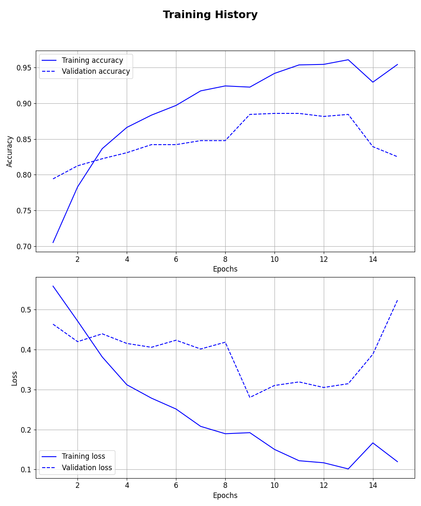

### Detailed Report of Test Set:

|              | precision    | recall       | f1-score     | support      |
| ------------ | ------------ | ------------ | ------------ | ------------ |
| chihuahua    | 0.9705       | 0.7032       | 0.8155       | 374          | 
| muffin       | 0.7477       | 0.9763       | 0.8468       | 337          | 
| micro avg    | 0.8326       | 0.8326       | 0.8326       | 711          | 
| macro avg    | 0.8591       | 0.8397       | 0.8312       | 711          | 
| weighted avg | 0.8649       | 0.8326       | 0.8304       | 711          | 
| samples avg  | 0.8326       | 0.8326       | 0.8326       | 711          | 

## trial_20

*    *Start Time*: 2024-10-24 12:35:21

*    *Duration*: 0:05:41.603

*    *Directory*: [Link](./trial_20)

### Hyperparameters:

| Hyperparameter        | Value                 |
| --------------------- | --------------------- |
| normalization         | standard              |
| batch_size            | 128                   |
| learning_rate         | 7.372387730917785e-05 |

### Evaluation Metrics:

|           | train     | val       | test      |
| --------- | --------- | --------- | --------- |
| accuracy  | 0.9582    | 0.7969    | 0.8312    | 
| precision | 0.9582    | 0.7969    | 0.8312    | 
| recall    | 0.9582    | 0.7969    | 0.8312    | 
| f1        | 0.9582    | 0.7969    | 0.8312    | 

### Figures:

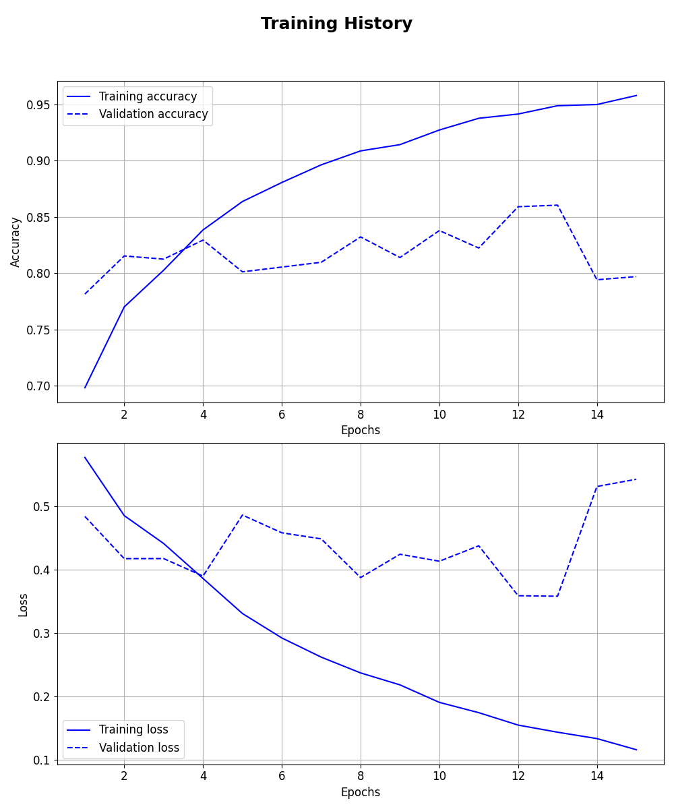

### Detailed Report of Test Set:

|              | precision    | recall       | f1-score     | support      |
| ------------ | ------------ | ------------ | ------------ | ------------ |
| chihuahua    | 0.9704       | 0.7005       | 0.8137       | 374          | 
| muffin       | 0.7460       | 0.9763       | 0.8458       | 337          | 
| micro avg    | 0.8312       | 0.8312       | 0.8312       | 711          | 
| macro avg    | 0.8582       | 0.8384       | 0.8297       | 711          | 
| weighted avg | 0.8640       | 0.8312       | 0.8289       | 711          | 
| samples avg  | 0.8312       | 0.8312       | 0.8312       | 711          | 

## trial_6

*    *Start Time*: 2024-10-26 19:25:19

*    *Duration*: 0:05:45.543

*    *Directory*: [Link](./trial_6)

### Hyperparameters:

| Hyperparameter        | Value                 |
| --------------------- | --------------------- |
| normalization         | min_max               |
| batch_size            | 128                   |
| learning_rate         | 6.690709331522522e-05 |

### Evaluation Metrics:

|           | train     | val       | test      |
| --------- | --------- | --------- | --------- |
| accuracy  | 0.8975    | 0.7969    | 0.8298    | 
| precision | 0.8975    | 0.7969    | 0.8298    | 
| recall    | 0.8975    | 0.7969    | 0.8298    | 
| f1        | 0.8975    | 0.7969    | 0.8298    | 

### Figures:

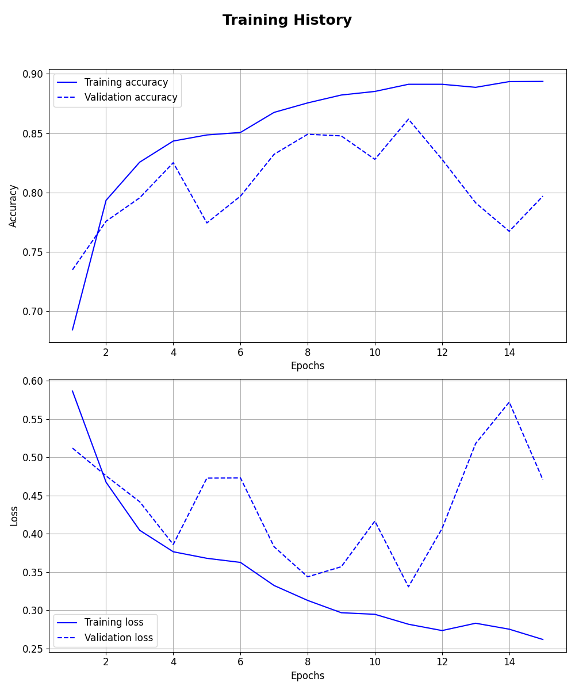

### Detailed Report of Test Set:

|              | precision    | recall       | f1-score     | support      |
| ------------ | ------------ | ------------ | ------------ | ------------ |
| chihuahua    | 0.9502       | 0.7139       | 0.8153       | 374          | 
| muffin       | 0.7512       | 0.9585       | 0.8422       | 337          | 
| micro avg    | 0.8298       | 0.8298       | 0.8298       | 711          | 
| macro avg    | 0.8507       | 0.8362       | 0.8288       | 711          | 
| weighted avg | 0.8558       | 0.8298       | 0.8281       | 711          | 
| samples avg  | 0.8298       | 0.8298       | 0.8298       | 711          | 

## trial_64

*    *Start Time*: 2024-10-27 11:20:19

*    *Duration*: 0:05:53.868

*    *Directory*: [Link](./trial_64)

### Hyperparameters:

| Hyperparameter         | Value                  |
| ---------------------- | ---------------------- |
| normalization          | standard               |
| batch_size             | 64                     |
| learning_rate          | 5.4852445588876624e-05 |

### Evaluation Metrics:

|           | train     | val       | test      |
| --------- | --------- | --------- | --------- |
| accuracy  | 0.9541    | 0.8025    | 0.8284    | 
| precision | 0.9541    | 0.8025    | 0.8284    | 
| recall    | 0.9541    | 0.8025    | 0.8284    | 
| f1        | 0.9541    | 0.8025    | 0.8284    | 

### Figures:

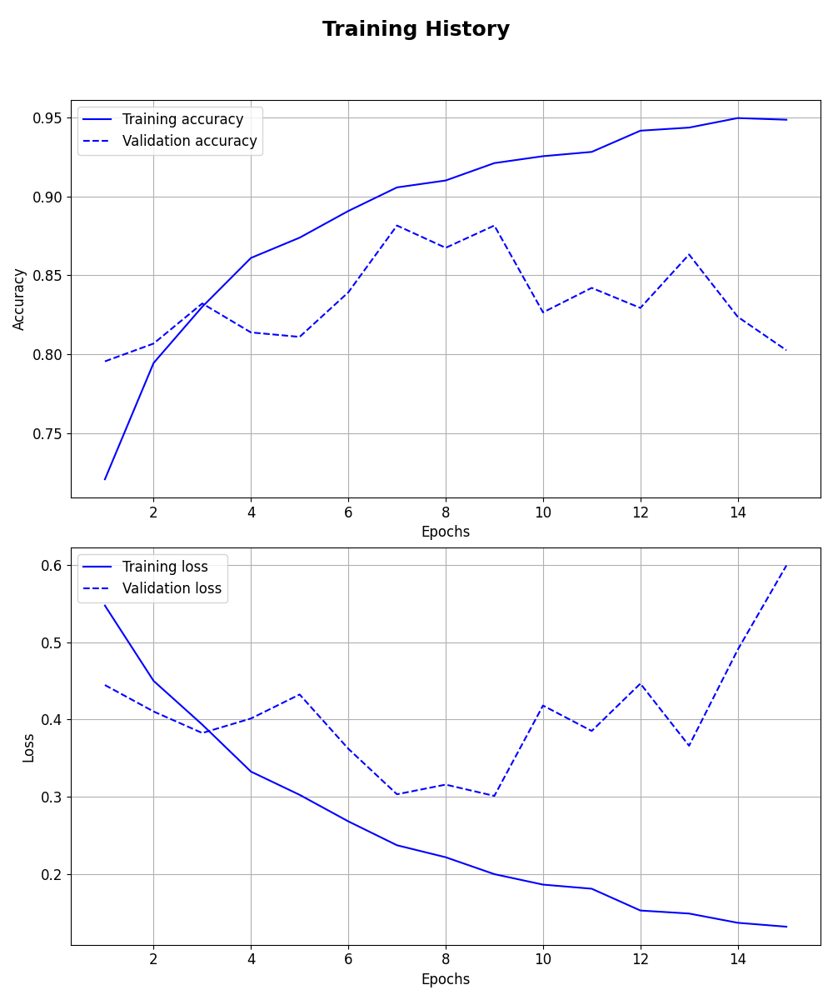

### Detailed Report of Test Set:

|              | precision    | recall       | f1-score     | support      |
| ------------ | ------------ | ------------ | ------------ | ------------ |
| chihuahua    | 0.9737       | 0.6925       | 0.8094       | 374          | 
| muffin       | 0.7416       | 0.9792       | 0.8440       | 337          | 
| micro avg    | 0.8284       | 0.8284       | 0.8284       | 711          | 
| macro avg    | 0.8576       | 0.8359       | 0.8267       | 711          | 
| weighted avg | 0.8637       | 0.8284       | 0.8258       | 711          | 
| samples avg  | 0.8284       | 0.8284       | 0.8284       | 711          | 

## trial_97

*    *Start Time*: 2024-10-27 14:32:31

*    *Duration*: 0:05:47.840

*    *Directory*: [Link](./trial_97)

### Hyperparameters:

| Hyperparameter        | Value                 |
| --------------------- | --------------------- |
| normalization         | standard              |
| batch_size            | 128                   |
| learning_rate         | 7.576763453780522e-05 |

### Evaluation Metrics:

|           | train     | val       | test      |
| --------- | --------- | --------- | --------- |
| accuracy  | 0.9353    | 0.7983    | 0.8200    | 
| precision | 0.9353    | 0.7983    | 0.8200    | 
| recall    | 0.9353    | 0.7983    | 0.8200    | 
| f1        | 0.9353    | 0.7983    | 0.8200    | 

### Figures:

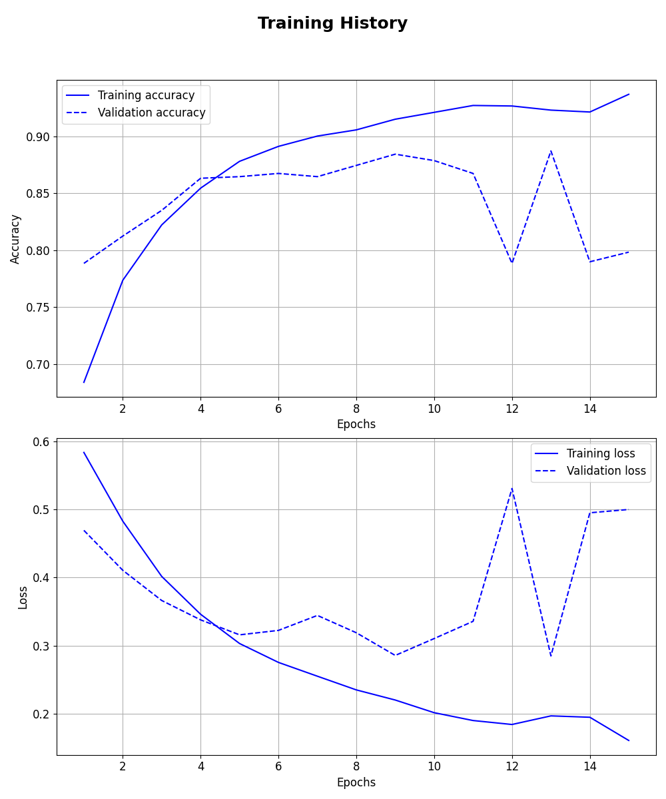

### Detailed Report of Test Set:

|              | precision    | recall       | f1-score     | support      |
| ------------ | ------------ | ------------ | ------------ | ------------ |
| chihuahua    | 0.9767       | 0.6738       | 0.7975       | 374          | 
| muffin       | 0.7307       | 0.9822       | 0.8380       | 337          | 
| micro avg    | 0.8200       | 0.8200       | 0.8200       | 711          | 
| macro avg    | 0.8537       | 0.8280       | 0.8177       | 711          | 
| weighted avg | 0.8601       | 0.8200       | 0.8167       | 711          | 
| samples avg  | 0.8200       | 0.8200       | 0.8200       | 711          | 

## trial_90

*    *Start Time*: 2024-10-27 13:51:50

*    *Duration*: 0:05:47.036

*    *Directory*: [Link](./trial_90)

### Hyperparameters:

| Hyperparameter        | Value                 |
| --------------------- | --------------------- |
| normalization         | standard              |
| batch_size            | 128                   |
| learning_rate         | 5.702920484127834e-05 |

### Evaluation Metrics:

|           | train     | val       | test      |
| --------- | --------- | --------- | --------- |
| accuracy  | 0.9206    | 0.7898    | 0.8158    | 
| precision | 0.9206    | 0.7898    | 0.8158    | 
| recall    | 0.9206    | 0.7898    | 0.8158    | 
| f1        | 0.9206    | 0.7898    | 0.8158    | 

### Figures:

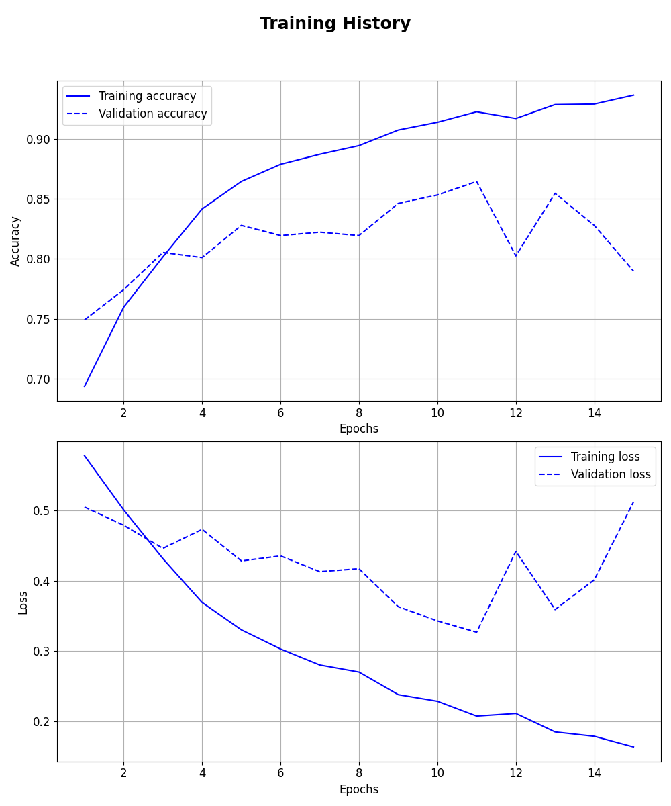

### Detailed Report of Test Set:

|              | precision    | recall       | f1-score     | support      |
| ------------ | ------------ | ------------ | ------------ | ------------ |
| chihuahua    | 0.9620       | 0.6765       | 0.7943       | 374          | 
| muffin       | 0.7299       | 0.9703       | 0.8331       | 337          | 
| micro avg    | 0.8158       | 0.8158       | 0.8158       | 711          | 
| macro avg    | 0.8459       | 0.8234       | 0.8137       | 711          | 
| weighted avg | 0.8520       | 0.8158       | 0.8127       | 711          | 
| samples avg  | 0.8158       | 0.8158       | 0.8158       | 711          | 

## trial_49

*    *Start Time*: 2024-10-24 15:22:44

*    *Duration*: 0:05:42.849

*    *Directory*: [Link](./trial_49)

### Hyperparameters:

| Hyperparameter        | Value                 |
| --------------------- | --------------------- |
| normalization         | standard              |
| batch_size            | 128                   |
| learning_rate         | 0.0001021875120742384 |

### Evaluation Metrics:

|           | train     | val       | test      |
| --------- | --------- | --------- | --------- |
| accuracy  | 0.9437    | 0.7772    | 0.7961    | 
| precision | 0.9437    | 0.7772    | 0.7961    | 
| recall    | 0.9437    | 0.7772    | 0.7961    | 
| f1        | 0.9437    | 0.7772    | 0.7961    | 

### Figures:

### Detailed Report of Test Set:

|              | precision    | recall       | f1-score     | support      |
| ------------ | ------------ | ------------ | ------------ | ------------ |
| chihuahua    | 0.9673       | 0.6337       | 0.7658       | 374          | 
| muffin       | 0.7060       | 0.9763       | 0.8194       | 337          | 
| micro avg    | 0.7961       | 0.7961       | 0.7961       | 711          | 
| macro avg    | 0.8367       | 0.8050       | 0.7926       | 711          | 
| weighted avg | 0.8435       | 0.7961       | 0.7912       | 711          | 
| samples avg  | 0.7961       | 0.7961       | 0.7961       | 711          | 

