# Experiment Report: Chihuahua vs Muffin Test Experiment

## Metadata

*    *Description*: In this experiment, transfer learning techniques is used with MobileNetV2 as the base model.

*    *Start Time*: 2024-10-23 08:22:04

*    *Total Duration*: 0:38:27.281

*    *Directory*: [Link](./.)

## Initial Visualizations

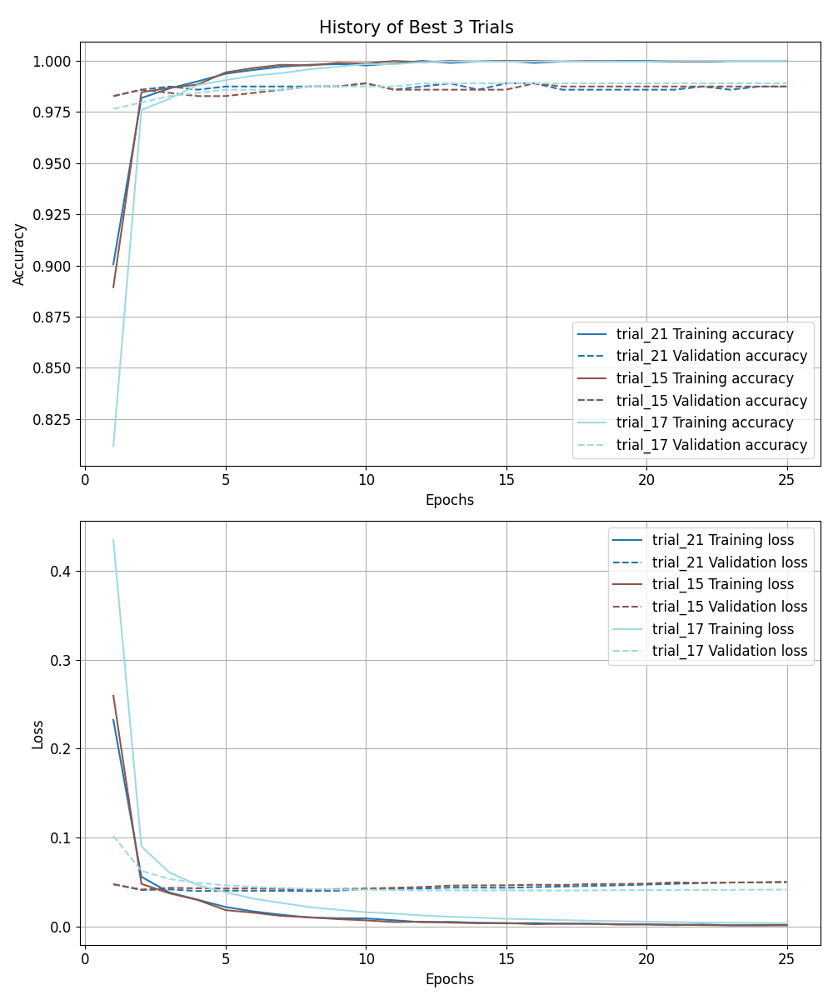

## Summary

### Hyperparameters

|               | dense_units   | dropout_rate  | learning_rate | Chapters      |
| ------------- | ------------- | ------------- | ------------- | ------------- |
| trial_21      | 512           | 0.3730        | 1.3844e-04    | [Chapter](#trial_21) | 
| trial_15      | 512           | 0.3499        | 1.7879e-04    | [Chapter](#trial_15) | 
| trial_17      | 512           | 0.0149        | 5.9917e-05    | [Chapter](#trial_17) | 
| trial_37      | 512           | 0.4726        | 3.1889e-04    | [Chapter](#trial_37) | 
| trial_39      | 512           | 0.1508        | 4.2027e-05    | [Chapter](#trial_39) | 
| trial_81      | 256           | 0.3878        | 3.8357e-05    | [Chapter](#trial_81) | 
| trial_100     | 256           | 0.4836        | 6.5734e-05    | [Chapter](#trial_100) | 
| trial_3       | 512           | 0.0843        | 2.7931e-04    | [Chapter](#trial_3) | 
| trial_33      | 512           | 0.2181        | 5.2672e-05    | [Chapter](#trial_33) | 
| trial_40      | 512           | 0.4087        | 7.6301e-05    | [Chapter](#trial_40) | 
| trial_46      | 256           | 0.4707        | 5.6318e-05    | [Chapter](#trial_46) | 
| trial_55      | 256           | 0.4742        | 1.2641e-04    | [Chapter](#trial_55) | 
| trial_61      | 256           | 0.0412        | 9.2436e-05    | [Chapter](#trial_61) | 
| trial_4       | 512           | 0.4680        | 7.1570e-05    | [Chapter](#trial_4) | 
| trial_5       | 512           | 0.0783        | 5.5250e-04    | [Chapter](#trial_5) | 
| trial_6       | 512           | 0.2954        | 7.1180e-04    | [Chapter](#trial_6) | 
| trial_10      | 256           | 0.3988        | 9.6096e-04    | [Chapter](#trial_10) | 
| trial_16      | 128           | 0.1997        | 4.7826e-05    | [Chapter](#trial_16) | 
| trial_28      | 512           | 0.3810        | 1.0984e-04    | [Chapter](#trial_28) | 
| trial_36      | 512           | 0.4317        | 1.1203e-04    | [Chapter](#trial_36) | 
| trial_49      | 512           | 0.0922        | 2.6655e-04    | [Chapter](#trial_49) | 
| trial_54      | 256           | 0.4976        | 6.5576e-05    | [Chapter](#trial_54) | 
| trial_73      | 512           | 0.3555        | 3.9509e-05    | [Chapter](#trial_73) | 
| trial_76      | 512           | 0.3458        | 3.0282e-05    | [Chapter](#trial_76) | 
| trial_85      | 512           | 0.4411        | 1.0764e-04    | [Chapter](#trial_85) | 
| trial_1       | 512           | 0.2624        | 7.9696e-05    | [Chapter](#trial_1) | 
| trial_8       | 512           | 0.1308        | 5.8907e-04    | [Chapter](#trial_8) | 
| trial_9       | 256           | 0.3292        | 7.0295e-05    | [Chapter](#trial_9) | 
| trial_12      | 128           | 0.3482        | 9.1874e-05    | [Chapter](#trial_12) | 
| trial_14      | 256           | 0.2000        | 1.9858e-04    | [Chapter](#trial_14) | 
| trial_25      | 512           | 0.3976        | 3.2110e-05    | [Chapter](#trial_25) | 
| trial_34      | 512           | 0.1719        | 8.2208e-05    | [Chapter](#trial_34) | 
| trial_43      | 512           | 0.3694        | 2.9045e-05    | [Chapter](#trial_43) | 
| trial_48      | 512           | 0.2353        | 1.5418e-04    | [Chapter](#trial_48) | 
| trial_50      | 256           | 0.4913        | 7.0991e-05    | [Chapter](#trial_50) | 
| trial_63      | 512           | 0.2742        | 3.3489e-05    | [Chapter](#trial_63) | 
| trial_64      | 512           | 0.3187        | 6.1486e-05    | [Chapter](#trial_64) | 
| trial_70      | 512           | 0.4798        | 2.1450e-05    | [Chapter](#trial_70) | 
| trial_79      | 512           | 0.2290        | 2.2220e-05    | [Chapter](#trial_79) | 
| trial_82      | 512           | 0.4596        | 5.1544e-05    | [Chapter](#trial_82) | 
| trial_84      | 512           | 0.4149        | 8.5533e-05    | [Chapter](#trial_84) | 
| trial_86      | 512           | 0.4647        | 5.6658e-05    | [Chapter](#trial_86) | 
| trial_95      | 256           | 0.3430        | 4.8117e-05    | [Chapter](#trial_95) | 
| trial_98      | 512           | 0.4677        | 4.4193e-05    | [Chapter](#trial_98) | 
| trial_13      | 256           | 0.4925        | 4.6471e-05    | [Chapter](#trial_13) | 
| trial_23      | 512           | 0.4549        | 1.6903e-05    | [Chapter](#trial_23) | 
| trial_24      | 512           | 0.4988        | 3.9520e-05    | [Chapter](#trial_24) | 
| trial_27      | 512           | 0.3048        | 2.3184e-05    | [Chapter](#trial_27) | 
| trial_29      | 512           | 0.4617        | 3.6306e-05    | [Chapter](#trial_29) | 
| trial_30      | 512           | 0.2459        | 6.4885e-05    | [Chapter](#trial_30) | 
| trial_45      | 512           | 0.3954        | 3.6010e-05    | [Chapter](#trial_45) | 
| trial_53      | 256           | 0.4248        | 4.6276e-05    | [Chapter](#trial_53) | 
| trial_58      | 256           | 0.4091        | 4.9585e-05    | [Chapter](#trial_58) | 
| trial_72      | 512           | 0.3449        | 3.1388e-05    | [Chapter](#trial_72) | 
| trial_75      | 512           | 0.3820        | 2.4419e-05    | [Chapter](#trial_75) | 
| trial_83      | 512           | 0.4323        | 6.9865e-05    | [Chapter](#trial_83) | 
| trial_87      | 512           | 0.3099        | 5.6631e-05    | [Chapter](#trial_87) | 
| trial_97      | 256           | 0.4031        | 5.2903e-05    | [Chapter](#trial_97) | 
| trial_99      | 512           | 0.1753        | 3.9522e-05    | [Chapter](#trial_99) | 
| trial_32      | 512           | 0.2554        | 6.3071e-05    | [Chapter](#trial_32) | 
| trial_47      | 512           | 0.3365        | 1.9859e-05    | [Chapter](#trial_47) | 
| trial_52      | 256           | 0.4495        | 7.5983e-05    | [Chapter](#trial_52) | 
| trial_60      | 256           | 0.3935        | 4.2434e-05    | [Chapter](#trial_60) | 
| trial_62      | 256           | 0.3612        | 2.6502e-05    | [Chapter](#trial_62) | 
| trial_69      | 512           | 0.4175        | 1.1297e-05    | [Chapter](#trial_69) | 
| trial_78      | 512           | 0.2987        | 1.4558e-05    | [Chapter](#trial_78) | 
| trial_89      | 256           | 0.4017        | 4.4728e-05    | [Chapter](#trial_89) | 
| trial_90      | 256           | 0.3985        | 4.4637e-05    | [Chapter](#trial_90) | 
| trial_91      | 128           | 0.4522        | 5.7990e-05    | [Chapter](#trial_91) | 
| trial_92      | 256           | 0.4234        | 7.1652e-05    | [Chapter](#trial_92) | 
| trial_93      | 256           | 0.3772        | 2.8308e-05    | [Chapter](#trial_93) | 
| trial_96      | 512           | 0.4037        | 4.1627e-05    | [Chapter](#trial_96) | 
| trial_18      | 512           | 0.4185        | 2.8536e-05    | [Chapter](#trial_18) | 
| trial_22      | 512           | 0.4479        | 2.8183e-05    | [Chapter](#trial_22) | 
| trial_35      | 512           | 0.2926        | 2.6328e-05    | [Chapter](#trial_35) | 
| trial_38      | 512           | 0.3230        | 1.9300e-05    | [Chapter](#trial_38) | 
| trial_42      | 512           | 0.4298        | 3.0103e-05    | [Chapter](#trial_42) | 
| trial_51      | 128           | 0.4874        | 9.2223e-05    | [Chapter](#trial_51) | 
| trial_7       | 128           | 0.4203        | 2.0133e-05    | [Chapter](#trial_7) | 
| trial_19      | 512           | 0.4279        | 2.2084e-05    | [Chapter](#trial_19) | 
| trial_31      | 512           | 0.2478        | 1.4445e-05    | [Chapter](#trial_31) | 
| trial_41      | 256           | 0.2815        | 2.2112e-05    | [Chapter](#trial_41) | 
| trial_56      | 512           | 0.4466        | 2.4985e-05    | [Chapter](#trial_56) | 
| trial_57      | 256           | 0.3823        | 3.5187e-05    | [Chapter](#trial_57) | 
| trial_65      | 512           | 0.3793        | 1.7097e-05    | [Chapter](#trial_65) | 
| trial_71      | 512           | 0.2040        | 1.6559e-05    | [Chapter](#trial_71) | 
| trial_74      | 512           | 0.3808        | 2.4129e-05    | [Chapter](#trial_74) | 
| trial_77      | 512           | 0.4065        | 1.7912e-05    | [Chapter](#trial_77) | 
| trial_80      | 512           | 0.3357        | 2.6248e-05    | [Chapter](#trial_80) | 
| trial_88      | 512           | 0.3713        | 3.1777e-05    | [Chapter](#trial_88) | 
| trial_2       | 256           | 0.1134        | 2.6026e-05    | [Chapter](#trial_2) | 
| trial_20      | 512           | 0.4441        | 1.0340e-05    | [Chapter](#trial_20) | 
| trial_68      | 512           | 0.4878        | 1.9085e-05    | [Chapter](#trial_68) | 
| trial_94      | 256           | 0.2660        | 3.4252e-05    | [Chapter](#trial_94) | 
| trial_59      | 128           | 0.4607        | 3.5020e-05    | [Chapter](#trial_59) | 
| trial_66      | 512           | 0.3833        | 1.6344e-05    | [Chapter](#trial_66) | 
| trial_11      | 512           | 0.4780        | 1.1353e-05    | [Chapter](#trial_11) | 
| trial_44      | 512           | 0.3652        | 1.2883e-05    | [Chapter](#trial_44) | 
| trial_67      | 512           | 0.4352        | 1.3043e-05    | [Chapter](#trial_67) | 
| trial_26      | 512           | 0.4442        | 1.5032e-05    | [Chapter](#trial_26) | 

### Test Results

|           | accuracy  | precision | recall    | f1        | Chapters  |
| --------- | --------- | --------- | --------- | --------- | --------- |
| trial_21  | 0.9910    | 0.9910    | 0.9910    | 0.9910    | [Chapter](#trial_21) | 
| trial_15  | 0.9899    | 0.9899    | 0.9899    | 0.9899    | [Chapter](#trial_15) | 
| trial_17  | 0.9899    | 0.9899    | 0.9899    | 0.9899    | [Chapter](#trial_17) | 
| trial_37  | 0.9899    | 0.9899    | 0.9899    | 0.9899    | [Chapter](#trial_37) | 
| trial_39  | 0.9899    | 0.9899    | 0.9899    | 0.9899    | [Chapter](#trial_39) | 
| trial_81  | 0.9899    | 0.9899    | 0.9899    | 0.9899    | [Chapter](#trial_81) | 
| trial_100 | 0.9899    | 0.9899    | 0.9899    | 0.9899    | [Chapter](#trial_100) | 
| trial_3   | 0.9888    | 0.9888    | 0.9888    | 0.9888    | [Chapter](#trial_3) | 
| trial_33  | 0.9888    | 0.9888    | 0.9888    | 0.9888    | [Chapter](#trial_33) | 
| trial_40  | 0.9888    | 0.9888    | 0.9888    | 0.9888    | [Chapter](#trial_40) | 
| trial_46  | 0.9888    | 0.9888    | 0.9888    | 0.9888    | [Chapter](#trial_46) | 
| trial_55  | 0.9888    | 0.9888    | 0.9888    | 0.9888    | [Chapter](#trial_55) | 
| trial_61  | 0.9888    | 0.9888    | 0.9888    | 0.9888    | [Chapter](#trial_61) | 
| trial_4   | 0.9877    | 0.9877    | 0.9877    | 0.9877    | [Chapter](#trial_4) | 
| trial_5   | 0.9877    | 0.9877    | 0.9877    | 0.9877    | [Chapter](#trial_5) | 
| trial_6   | 0.9877    | 0.9877    | 0.9877    | 0.9877    | [Chapter](#trial_6) | 
| trial_10  | 0.9877    | 0.9877    | 0.9877    | 0.9877    | [Chapter](#trial_10) | 
| trial_16  | 0.9877    | 0.9877    | 0.9877    | 0.9877    | [Chapter](#trial_16) | 
| trial_28  | 0.9877    | 0.9877    | 0.9877    | 0.9877    | [Chapter](#trial_28) | 
| trial_36  | 0.9877    | 0.9877    | 0.9877    | 0.9877    | [Chapter](#trial_36) | 
| trial_49  | 0.9877    | 0.9877    | 0.9877    | 0.9877    | [Chapter](#trial_49) | 
| trial_54  | 0.9877    | 0.9877    | 0.9877    | 0.9877    | [Chapter](#trial_54) | 
| trial_73  | 0.9877    | 0.9877    | 0.9877    | 0.9877    | [Chapter](#trial_73) | 
| trial_76  | 0.9877    | 0.9877    | 0.9877    | 0.9877    | [Chapter](#trial_76) | 
| trial_85  | 0.9877    | 0.9877    | 0.9877    | 0.9877    | [Chapter](#trial_85) | 
| trial_1   | 0.9866    | 0.9866    | 0.9866    | 0.9866    | [Chapter](#trial_1) | 
| trial_8   | 0.9866    | 0.9866    | 0.9866    | 0.9866    | [Chapter](#trial_8) | 
| trial_9   | 0.9866    | 0.9866    | 0.9866    | 0.9866    | [Chapter](#trial_9) | 
| trial_12  | 0.9866    | 0.9866    | 0.9866    | 0.9866    | [Chapter](#trial_12) | 
| trial_14  | 0.9866    | 0.9866    | 0.9866    | 0.9866    | [Chapter](#trial_14) | 
| trial_25  | 0.9866    | 0.9866    | 0.9866    | 0.9866    | [Chapter](#trial_25) | 
| trial_34  | 0.9866    | 0.9866    | 0.9866    | 0.9866    | [Chapter](#trial_34) | 
| trial_43  | 0.9866    | 0.9866    | 0.9866    | 0.9866    | [Chapter](#trial_43) | 
| trial_48  | 0.9866    | 0.9866    | 0.9866    | 0.9866    | [Chapter](#trial_48) | 
| trial_50  | 0.9866    | 0.9866    | 0.9866    | 0.9866    | [Chapter](#trial_50) | 
| trial_63  | 0.9866    | 0.9866    | 0.9866    | 0.9866    | [Chapter](#trial_63) | 
| trial_64  | 0.9866    | 0.9866    | 0.9866    | 0.9866    | [Chapter](#trial_64) | 
| trial_70  | 0.9866    | 0.9866    | 0.9866    | 0.9866    | [Chapter](#trial_70) | 
| trial_79  | 0.9866    | 0.9866    | 0.9866    | 0.9866    | [Chapter](#trial_79) | 
| trial_82  | 0.9866    | 0.9866    | 0.9866    | 0.9866    | [Chapter](#trial_82) | 
| trial_84  | 0.9866    | 0.9866    | 0.9866    | 0.9866    | [Chapter](#trial_84) | 
| trial_86  | 0.9866    | 0.9866    | 0.9866    | 0.9866    | [Chapter](#trial_86) | 
| trial_95  | 0.9866    | 0.9866    | 0.9866    | 0.9866    | [Chapter](#trial_95) | 
| trial_98  | 0.9866    | 0.9866    | 0.9866    | 0.9866    | [Chapter](#trial_98) | 
| trial_13  | 0.9854    | 0.9854    | 0.9854    | 0.9854    | [Chapter](#trial_13) | 
| trial_23  | 0.9854    | 0.9854    | 0.9854    | 0.9854    | [Chapter](#trial_23) | 
| trial_24  | 0.9854    | 0.9854    | 0.9854    | 0.9854    | [Chapter](#trial_24) | 
| trial_27  | 0.9854    | 0.9854    | 0.9854    | 0.9854    | [Chapter](#trial_27) | 
| trial_29  | 0.9854    | 0.9854    | 0.9854    | 0.9854    | [Chapter](#trial_29) | 
| trial_30  | 0.9854    | 0.9854    | 0.9854    | 0.9854    | [Chapter](#trial_30) | 
| trial_45  | 0.9854    | 0.9854    | 0.9854    | 0.9854    | [Chapter](#trial_45) | 
| trial_53  | 0.9854    | 0.9854    | 0.9854    | 0.9854    | [Chapter](#trial_53) | 
| trial_58  | 0.9854    | 0.9854    | 0.9854    | 0.9854    | [Chapter](#trial_58) | 
| trial_72  | 0.9854    | 0.9854    | 0.9854    | 0.9854    | [Chapter](#trial_72) | 
| trial_75  | 0.9854    | 0.9854    | 0.9854    | 0.9854    | [Chapter](#trial_75) | 
| trial_83  | 0.9854    | 0.9854    | 0.9854    | 0.9854    | [Chapter](#trial_83) | 
| trial_87  | 0.9854    | 0.9854    | 0.9854    | 0.9854    | [Chapter](#trial_87) | 
| trial_97  | 0.9854    | 0.9854    | 0.9854    | 0.9854    | [Chapter](#trial_97) | 
| trial_99  | 0.9854    | 0.9854    | 0.9854    | 0.9854    | [Chapter](#trial_99) | 
| trial_32  | 0.9843    | 0.9843    | 0.9843    | 0.9843    | [Chapter](#trial_32) | 
| trial_47  | 0.9843    | 0.9843    | 0.9843    | 0.9843    | [Chapter](#trial_47) | 
| trial_52  | 0.9843    | 0.9843    | 0.9843    | 0.9843    | [Chapter](#trial_52) | 
| trial_60  | 0.9843    | 0.9843    | 0.9843    | 0.9843    | [Chapter](#trial_60) | 
| trial_62  | 0.9843    | 0.9843    | 0.9843    | 0.9843    | [Chapter](#trial_62) | 
| trial_69  | 0.9843    | 0.9843    | 0.9843    | 0.9843    | [Chapter](#trial_69) | 
| trial_78  | 0.9843    | 0.9843    | 0.9843    | 0.9843    | [Chapter](#trial_78) | 
| trial_89  | 0.9843    | 0.9843    | 0.9843    | 0.9843    | [Chapter](#trial_89) | 
| trial_90  | 0.9843    | 0.9843    | 0.9843    | 0.9843    | [Chapter](#trial_90) | 
| trial_91  | 0.9843    | 0.9843    | 0.9843    | 0.9843    | [Chapter](#trial_91) | 
| trial_92  | 0.9843    | 0.9843    | 0.9843    | 0.9843    | [Chapter](#trial_92) | 
| trial_93  | 0.9843    | 0.9843    | 0.9843    | 0.9843    | [Chapter](#trial_93) | 
| trial_96  | 0.9843    | 0.9843    | 0.9843    | 0.9843    | [Chapter](#trial_96) | 
| trial_18  | 0.9832    | 0.9832    | 0.9832    | 0.9832    | [Chapter](#trial_18) | 
| trial_22  | 0.9832    | 0.9832    | 0.9832    | 0.9832    | [Chapter](#trial_22) | 
| trial_35  | 0.9832    | 0.9832    | 0.9832    | 0.9832    | [Chapter](#trial_35) | 
| trial_38  | 0.9832    | 0.9832    | 0.9832    | 0.9832    | [Chapter](#trial_38) | 
| trial_42  | 0.9832    | 0.9832    | 0.9832    | 0.9832    | [Chapter](#trial_42) | 
| trial_51  | 0.9832    | 0.9832    | 0.9832    | 0.9832    | [Chapter](#trial_51) | 
| trial_7   | 0.9821    | 0.9821    | 0.9821    | 0.9821    | [Chapter](#trial_7) | 
| trial_19  | 0.9821    | 0.9821    | 0.9821    | 0.9821    | [Chapter](#trial_19) | 
| trial_31  | 0.9821    | 0.9821    | 0.9821    | 0.9821    | [Chapter](#trial_31) | 
| trial_41  | 0.9821    | 0.9821    | 0.9821    | 0.9821    | [Chapter](#trial_41) | 
| trial_56  | 0.9821    | 0.9821    | 0.9821    | 0.9821    | [Chapter](#trial_56) | 
| trial_57  | 0.9821    | 0.9821    | 0.9821    | 0.9821    | [Chapter](#trial_57) | 
| trial_65  | 0.9821    | 0.9821    | 0.9821    | 0.9821    | [Chapter](#trial_65) | 
| trial_71  | 0.9821    | 0.9821    | 0.9821    | 0.9821    | [Chapter](#trial_71) | 
| trial_74  | 0.9821    | 0.9821    | 0.9821    | 0.9821    | [Chapter](#trial_74) | 
| trial_77  | 0.9821    | 0.9821    | 0.9821    | 0.9821    | [Chapter](#trial_77) | 
| trial_80  | 0.9821    | 0.9821    | 0.9821    | 0.9821    | [Chapter](#trial_80) | 
| trial_88  | 0.9821    | 0.9821    | 0.9821    | 0.9821    | [Chapter](#trial_88) | 
| trial_2   | 0.9810    | 0.9810    | 0.9810    | 0.9810    | [Chapter](#trial_2) | 
| trial_20  | 0.9810    | 0.9810    | 0.9810    | 0.9810    | [Chapter](#trial_20) | 
| trial_68  | 0.9810    | 0.9810    | 0.9810    | 0.9810    | [Chapter](#trial_68) | 
| trial_94  | 0.9810    | 0.9810    | 0.9810    | 0.9810    | [Chapter](#trial_94) | 
| trial_59  | 0.9798    | 0.9798    | 0.9798    | 0.9798    | [Chapter](#trial_59) | 
| trial_66  | 0.9798    | 0.9798    | 0.9798    | 0.9798    | [Chapter](#trial_66) | 
| trial_11  | 0.9787    | 0.9787    | 0.9787    | 0.9787    | [Chapter](#trial_11) | 
| trial_44  | 0.9787    | 0.9787    | 0.9787    | 0.9787    | [Chapter](#trial_44) | 
| trial_67  | 0.9787    | 0.9787    | 0.9787    | 0.9787    | [Chapter](#trial_67) | 
| trial_26  | 0.9765    | 0.9765    | 0.9765    | 0.9765    | [Chapter](#trial_26) | 

## trial_21

*    *Start Time*: 2024-10-23 08:29:46

*    *Duration*: 22.219

*    *Directory*: [Link](./trial_21)

### Hyperparameters:

| Hyperparameter        | Value                 |
| --------------------- | --------------------- |
| dense_units           | 512                   |
| dropout_rate          | 0.37297082287883704   |
| learning_rate         | 0.0001384397871457689 |

### Evaluation Metrics:

|           | train     | val       | test      |
| --------- | --------- | --------- | --------- |
| accuracy  | 1.0000    | 0.9875    | 0.9910    | 
| precision | 1.0000    | 0.9875    | 0.9910    | 
| recall    | 1.0000    | 0.9875    | 0.9910    | 
| f1        | 1.0000    | 0.9875    | 0.9910    | 

### Figures:

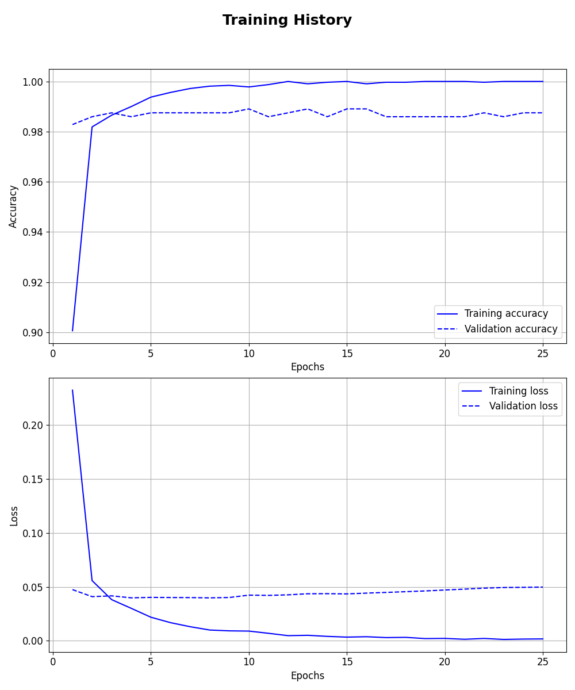

### Detailed Report of Test Set:

|              | precision    | recall       | f1-score     | support      |
| ------------ | ------------ | ------------ | ------------ | ------------ |
| chihuahua    | 0.9916       | 0.9916       | 0.9916       | 477          | 
| muffin       | 0.9904       | 0.9904       | 0.9904       | 416          | 
| micro avg    | 0.9910       | 0.9910       | 0.9910       | 893          | 
| macro avg    | 0.9910       | 0.9910       | 0.9910       | 893          | 
| weighted avg | 0.9910       | 0.9910       | 0.9910       | 893          | 
| samples avg  | 0.9910       | 0.9910       | 0.9910       | 893          | 

## trial_15

*    *Start Time*: 2024-10-23 08:27:29

*    *Duration*: 21.757

*    *Directory*: [Link](./trial_15)

### Hyperparameters:

| Hyperparameter        | Value                 |
| --------------------- | --------------------- |
| dense_units           | 512                   |
| dropout_rate          | 0.3498629787301412    |
| learning_rate         | 0.0001787861330161876 |

### Evaluation Metrics:

|           | train     | val       | test      |
| --------- | --------- | --------- | --------- |
| accuracy  | 1.0000    | 0.9875    | 0.9899    | 
| precision | 1.0000    | 0.9875    | 0.9899    | 
| recall    | 1.0000    | 0.9875    | 0.9899    | 
| f1        | 1.0000    | 0.9875    | 0.9899    | 

### Figures:

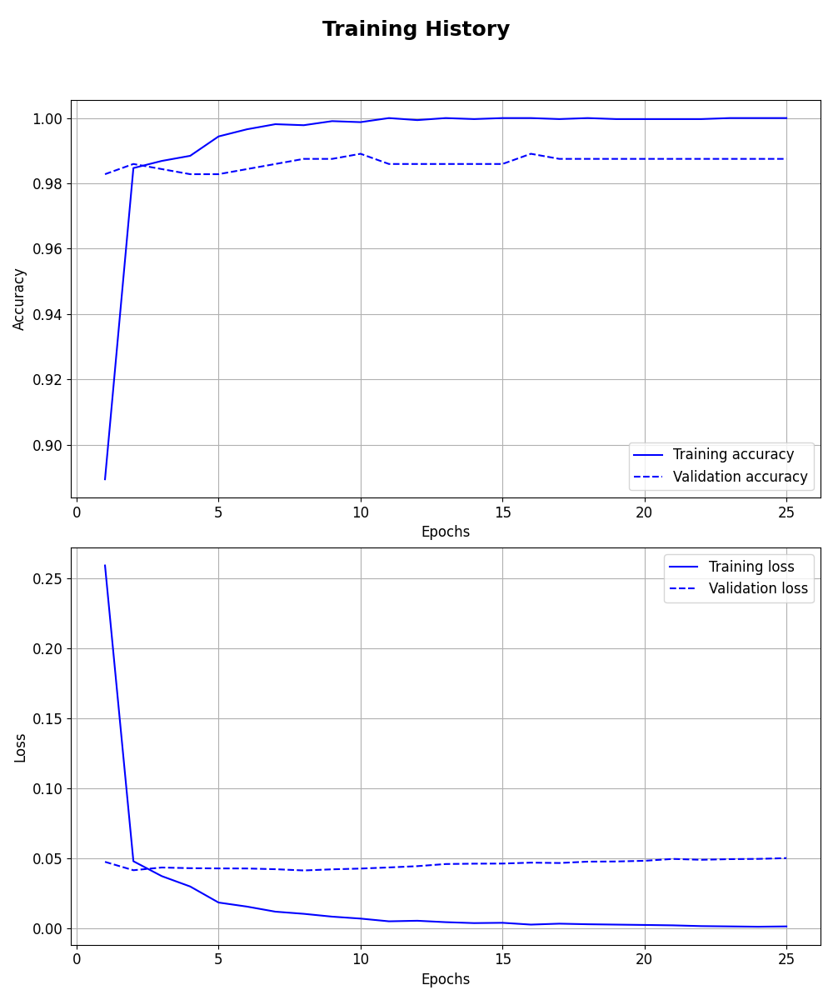

### Detailed Report of Test Set:

|              | precision    | recall       | f1-score     | support      |
| ------------ | ------------ | ------------ | ------------ | ------------ |
| chihuahua    | 0.9895       | 0.9916       | 0.9906       | 477          | 
| muffin       | 0.9904       | 0.9880       | 0.9892       | 416          | 
| micro avg    | 0.9899       | 0.9899       | 0.9899       | 893          | 
| macro avg    | 0.9900       | 0.9898       | 0.9899       | 893          | 
| weighted avg | 0.9899       | 0.9899       | 0.9899       | 893          | 
| samples avg  | 0.9899       | 0.9899       | 0.9899       | 893          | 

## trial_17

*    *Start Time*: 2024-10-23 08:28:14

*    *Duration*: 21.756

*    *Directory*: [Link](./trial_17)

### Hyperparameters:

| Hyperparameter         | Value                  |
| ---------------------- | ---------------------- |
| dense_units            | 512                    |
| dropout_rate           | 0.014878109879033652   |
| learning_rate          | 5.9917108510509317e-05 |

### Evaluation Metrics:

|           | train     | val       | test      |
| --------- | --------- | --------- | --------- |
| accuracy  | 1.0000    | 0.9891    | 0.9899    | 
| precision | 1.0000    | 0.9891    | 0.9899    | 
| recall    | 1.0000    | 0.9891    | 0.9899    | 
| f1        | 1.0000    | 0.9891    | 0.9899    | 

### Figures:

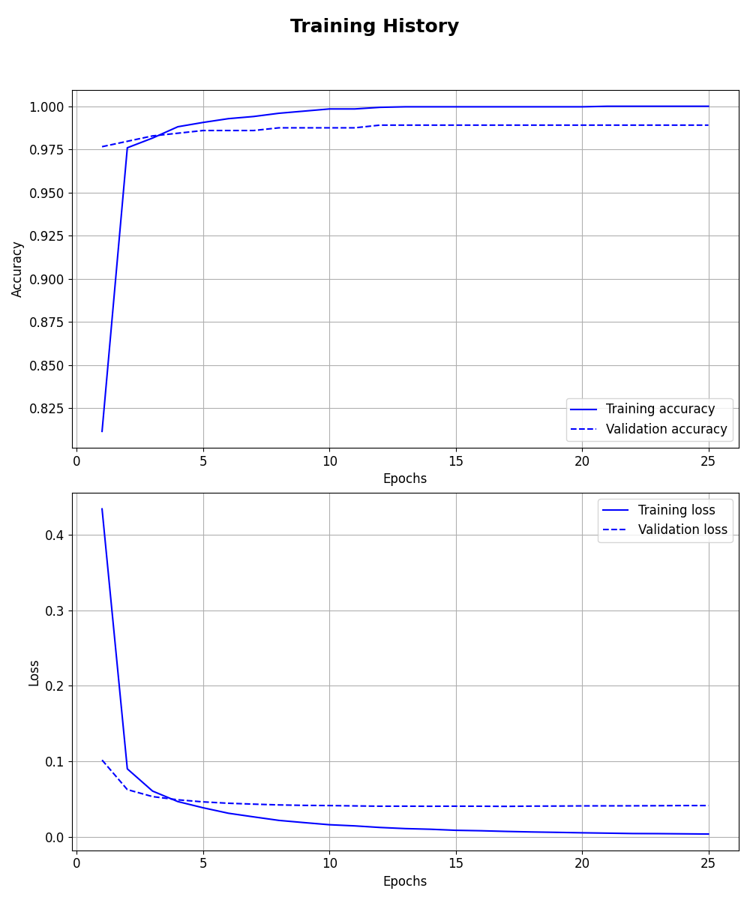

### Detailed Report of Test Set:

|              | precision    | recall       | f1-score     | support      |
| ------------ | ------------ | ------------ | ------------ | ------------ |
| chihuahua    | 0.9895       | 0.9916       | 0.9906       | 477          | 
| muffin       | 0.9904       | 0.9880       | 0.9892       | 416          | 
| micro avg    | 0.9899       | 0.9899       | 0.9899       | 893          | 
| macro avg    | 0.9900       | 0.9898       | 0.9899       | 893          | 
| weighted avg | 0.9899       | 0.9899       | 0.9899       | 893          | 
| samples avg  | 0.9899       | 0.9899       | 0.9899       | 893          | 

## trial_37

*    *Start Time*: 2024-10-23 08:35:51

*    *Duration*: 20.820

*    *Directory*: [Link](./trial_37)

### Hyperparameters:

| Hyperparameter         | Value                  |
| ---------------------- | ---------------------- |
| dense_units            | 512                    |
| dropout_rate           | 0.4726499428054811     |
| learning_rate          | 0.00031889400925616323 |

### Evaluation Metrics:

|           | train     | val       | test      |
| --------- | --------- | --------- | --------- |
| accuracy  | 1.0000    | 0.9891    | 0.9899    | 
| precision | 1.0000    | 0.9891    | 0.9899    | 
| recall    | 1.0000    | 0.9891    | 0.9899    | 
| f1        | 1.0000    | 0.9891    | 0.9899    | 

### Figures:

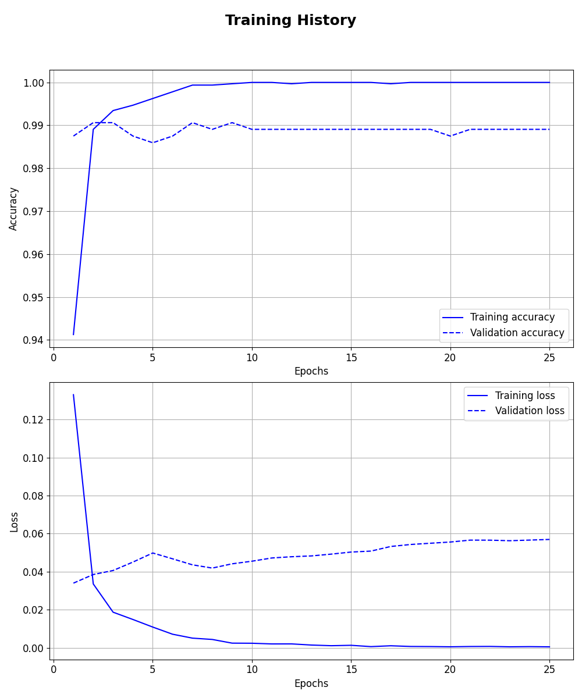

### Detailed Report of Test Set:

|              | precision    | recall       | f1-score     | support      |
| ------------ | ------------ | ------------ | ------------ | ------------ |
| chihuahua    | 0.9895       | 0.9916       | 0.9906       | 477          | 
| muffin       | 0.9904       | 0.9880       | 0.9892       | 416          | 
| micro avg    | 0.9899       | 0.9899       | 0.9899       | 893          | 
| macro avg    | 0.9900       | 0.9898       | 0.9899       | 893          | 
| weighted avg | 0.9899       | 0.9899       | 0.9899       | 893          | 
| samples avg  | 0.9899       | 0.9899       | 0.9899       | 893          | 

## trial_39

*    *Start Time*: 2024-10-23 08:36:36

*    *Duration*: 21.335

*    *Directory*: [Link](./trial_39)

### Hyperparameters:

| Hyperparameter        | Value                 |
| --------------------- | --------------------- |
| dense_units           | 512                   |
| dropout_rate          | 0.1508362457263543    |
| learning_rate         | 4.202743652731754e-05 |

### Evaluation Metrics:

|           | train     | val       | test      |
| --------- | --------- | --------- | --------- |
| accuracy  | 0.9997    | 0.9906    | 0.9899    | 
| precision | 0.9997    | 0.9906    | 0.9899    | 
| recall    | 0.9997    | 0.9906    | 0.9899    | 
| f1        | 0.9997    | 0.9906    | 0.9899    | 

### Figures:

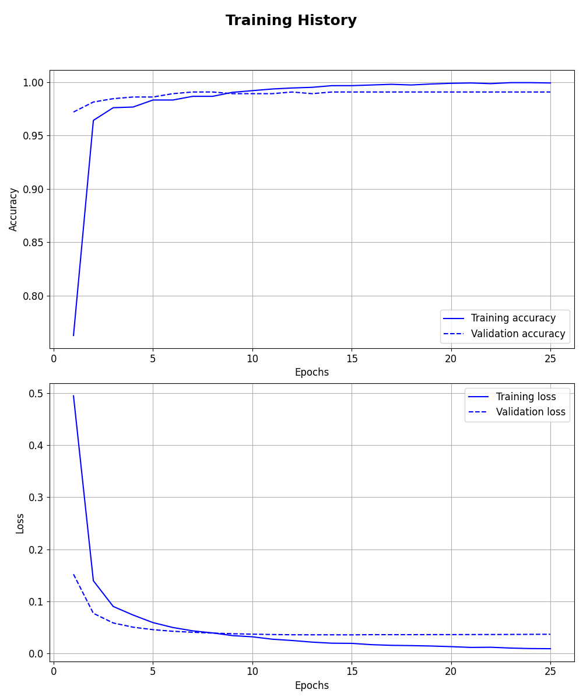

### Detailed Report of Test Set:

|              | precision    | recall       | f1-score     | support      |
| ------------ | ------------ | ------------ | ------------ | ------------ |
| chihuahua    | 0.9895       | 0.9916       | 0.9906       | 477          | 
| muffin       | 0.9904       | 0.9880       | 0.9892       | 416          | 
| micro avg    | 0.9899       | 0.9899       | 0.9899       | 893          | 
| macro avg    | 0.9900       | 0.9898       | 0.9899       | 893          | 
| weighted avg | 0.9899       | 0.9899       | 0.9899       | 893          | 
| samples avg  | 0.9899       | 0.9899       | 0.9899       | 893          | 

## trial_81

*    *Start Time*: 2024-10-23 08:52:38

*    *Duration*: 21.149

*    *Directory*: [Link](./trial_81)

### Hyperparameters:

| Hyperparameter       | Value                |
| -------------------- | -------------------- |
| dense_units          | 256                  |
| dropout_rate         | 0.38778698593275246  |
| learning_rate        | 3.83569205117789e-05 |

### Evaluation Metrics:

|           | train     | val       | test      |
| --------- | --------- | --------- | --------- |
| accuracy  | 0.9991    | 0.9859    | 0.9899    | 
| precision | 0.9991    | 0.9859    | 0.9899    | 
| recall    | 0.9991    | 0.9859    | 0.9899    | 
| f1        | 0.9991    | 0.9859    | 0.9899    | 

### Figures:

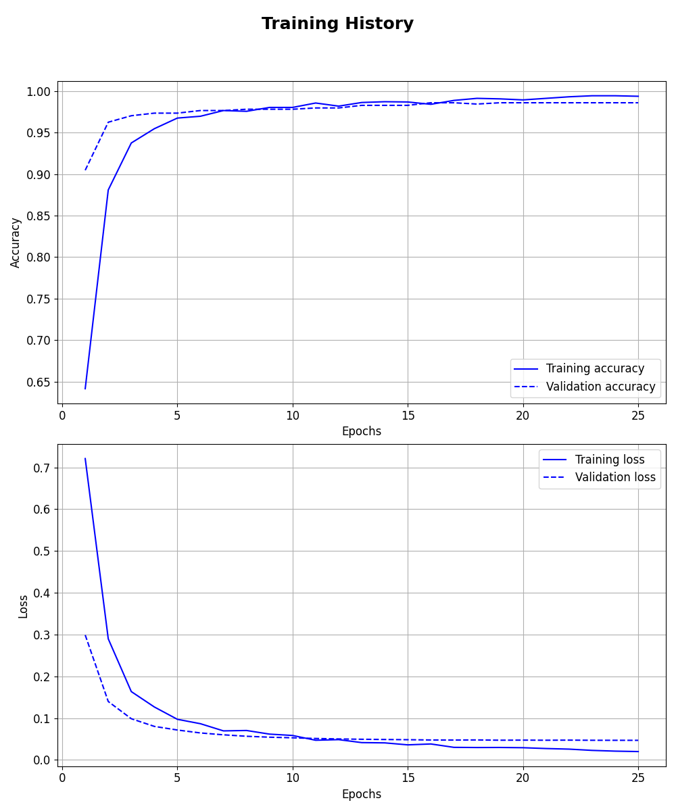

### Detailed Report of Test Set:

|              | precision    | recall       | f1-score     | support      |
| ------------ | ------------ | ------------ | ------------ | ------------ |
| chihuahua    | 0.9895       | 0.9916       | 0.9906       | 477          | 
| muffin       | 0.9904       | 0.9880       | 0.9892       | 416          | 
| micro avg    | 0.9899       | 0.9899       | 0.9899       | 893          | 
| macro avg    | 0.9900       | 0.9898       | 0.9899       | 893          | 
| weighted avg | 0.9899       | 0.9899       | 0.9899       | 893          | 
| samples avg  | 0.9899       | 0.9899       | 0.9899       | 893          | 

## trial_100

*    *Start Time*: 2024-10-23 09:00:07

*    *Duration*: 21.233

*    *Directory*: [Link](./trial_100)

### Hyperparameters:

| Hyperparameter        | Value                 |
| --------------------- | --------------------- |
| dense_units           | 256                   |
| dropout_rate          | 0.4836133389966789    |
| learning_rate         | 6.573374917041436e-05 |

### Evaluation Metrics:

|           | train     | val       | test      |
| --------- | --------- | --------- | --------- |
| accuracy  | 0.9997    | 0.9875    | 0.9899    | 
| precision | 0.9997    | 0.9875    | 0.9899    | 
| recall    | 0.9997    | 0.9875    | 0.9899    | 
| f1        | 0.9997    | 0.9875    | 0.9899    | 

### Figures:

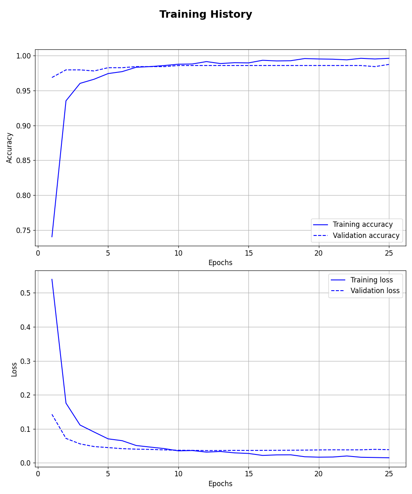

### Detailed Report of Test Set:

|              | precision    | recall       | f1-score     | support      |
| ------------ | ------------ | ------------ | ------------ | ------------ |
| chihuahua    | 0.9875       | 0.9937       | 0.9906       | 477          | 
| muffin       | 0.9927       | 0.9856       | 0.9891       | 416          | 
| micro avg    | 0.9899       | 0.9899       | 0.9899       | 893          | 
| macro avg    | 0.9901       | 0.9896       | 0.9899       | 893          | 
| weighted avg | 0.9899       | 0.9899       | 0.9899       | 893          | 
| samples avg  | 0.9899       | 0.9899       | 0.9899       | 893          | 

## trial_3

*    *Start Time*: 2024-10-23 08:22:59

*    *Duration*: 21.576

*    *Directory*: [Link](./trial_3)

### Hyperparameters:

| Hyperparameter        | Value                 |
| --------------------- | --------------------- |
| dense_units           | 512                   |
| dropout_rate          | 0.08429978400405025   |
| learning_rate         | 0.0002793144305653529 |

### Evaluation Metrics:

|           | train     | val       | test      |
| --------- | --------- | --------- | --------- |
| accuracy  | 1.0000    | 0.9906    | 0.9888    | 
| precision | 1.0000    | 0.9906    | 0.9888    | 
| recall    | 1.0000    | 0.9906    | 0.9888    | 
| f1        | 1.0000    | 0.9906    | 0.9888    | 

### Figures:

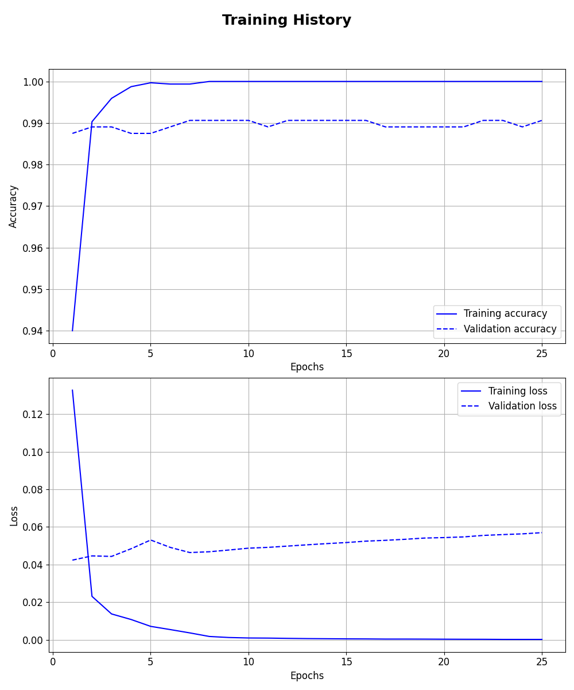

### Detailed Report of Test Set:

|              | precision    | recall       | f1-score     | support      |
| ------------ | ------------ | ------------ | ------------ | ------------ |
| chihuahua    | 0.9895       | 0.9895       | 0.9895       | 477          | 
| muffin       | 0.9880       | 0.9880       | 0.9880       | 416          | 
| micro avg    | 0.9888       | 0.9888       | 0.9888       | 893          | 
| macro avg    | 0.9887       | 0.9887       | 0.9887       | 893          | 
| weighted avg | 0.9888       | 0.9888       | 0.9888       | 893          | 
| samples avg  | 0.9888       | 0.9888       | 0.9888       | 893          | 

## trial_33

*    *Start Time*: 2024-10-23 08:34:22

*    *Duration*: 20.776

*    *Directory*: [Link](./trial_33)

### Hyperparameters:

| Hyperparameter        | Value                 |
| --------------------- | --------------------- |
| dense_units           | 512                   |
| dropout_rate          | 0.2180607039962844    |
| learning_rate         | 5.267201197600086e-05 |

### Evaluation Metrics:

|           | train     | val       | test      |
| --------- | --------- | --------- | --------- |
| accuracy  | 0.9997    | 0.9875    | 0.9888    | 
| precision | 0.9997    | 0.9875    | 0.9888    | 
| recall    | 0.9997    | 0.9875    | 0.9888    | 
| f1        | 0.9997    | 0.9875    | 0.9888    | 

### Figures:

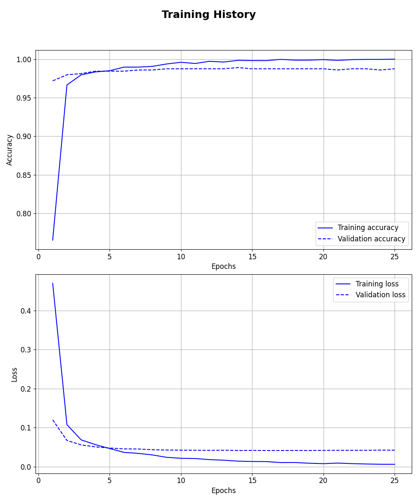

### Detailed Report of Test Set:

|              | precision    | recall       | f1-score     | support      |
| ------------ | ------------ | ------------ | ------------ | ------------ |
| chihuahua    | 0.9895       | 0.9895       | 0.9895       | 477          | 
| muffin       | 0.9880       | 0.9880       | 0.9880       | 416          | 
| micro avg    | 0.9888       | 0.9888       | 0.9888       | 893          | 
| macro avg    | 0.9887       | 0.9887       | 0.9887       | 893          | 
| weighted avg | 0.9888       | 0.9888       | 0.9888       | 893          | 
| samples avg  | 0.9888       | 0.9888       | 0.9888       | 893          | 

## trial_40

*    *Start Time*: 2024-10-23 08:36:59

*    *Duration*: 21.168

*    *Directory*: [Link](./trial_40)

### Hyperparameters:

| Hyperparameter       | Value                |
| -------------------- | -------------------- |
| dense_units          | 512                  |
| dropout_rate         | 0.4087129735892046   |
| learning_rate        | 7.63009029761099e-05 |

### Evaluation Metrics:

|           | train     | val       | test      |
| --------- | --------- | --------- | --------- |
| accuracy  | 1.0000    | 0.9906    | 0.9888    | 
| precision | 1.0000    | 0.9906    | 0.9888    | 
| recall    | 1.0000    | 0.9906    | 0.9888    | 
| f1        | 1.0000    | 0.9906    | 0.9888    | 

### Figures:

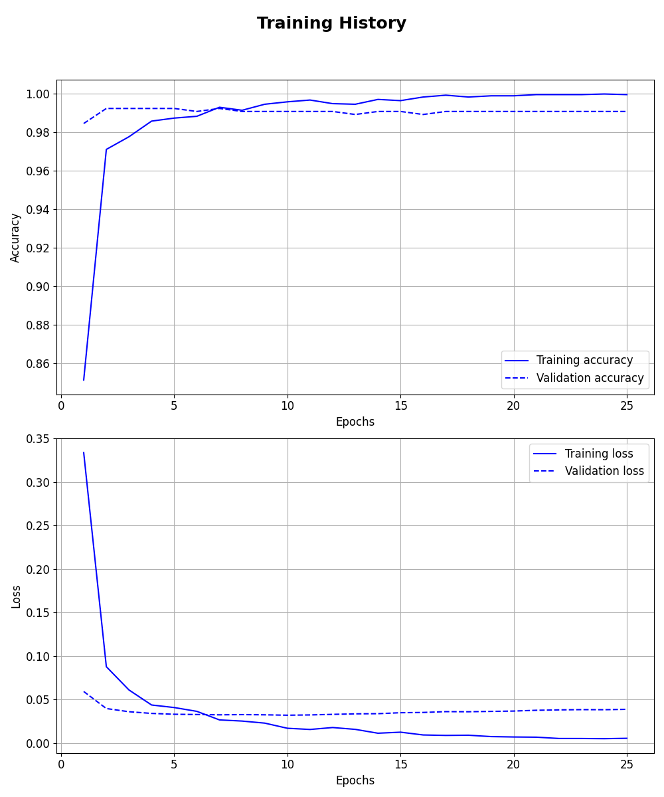

### Detailed Report of Test Set:

|              | precision    | recall       | f1-score     | support      |
| ------------ | ------------ | ------------ | ------------ | ------------ |
| chihuahua    | 0.9875       | 0.9916       | 0.9895       | 477          | 
| muffin       | 0.9903       | 0.9856       | 0.9880       | 416          | 
| micro avg    | 0.9888       | 0.9888       | 0.9888       | 893          | 
| macro avg    | 0.9889       | 0.9886       | 0.9887       | 893          | 
| weighted avg | 0.9888       | 0.9888       | 0.9888       | 893          | 
| samples avg  | 0.9888       | 0.9888       | 0.9888       | 893          | 

## trial_46

*    *Start Time*: 2024-10-23 08:39:14

*    *Duration*: 21.188

*    *Directory*: [Link](./trial_46)

### Hyperparameters:

| Hyperparameter        | Value                 |
| --------------------- | --------------------- |
| dense_units           | 256                   |
| dropout_rate          | 0.4707118638297069    |
| learning_rate         | 5.631849360621576e-05 |

### Evaluation Metrics:

|           | train     | val       | test      |
| --------- | --------- | --------- | --------- |
| accuracy  | 0.9994    | 0.9859    | 0.9888    | 
| precision | 0.9994    | 0.9859    | 0.9888    | 
| recall    | 0.9994    | 0.9859    | 0.9888    | 
| f1        | 0.9994    | 0.9859    | 0.9888    | 

### Figures:

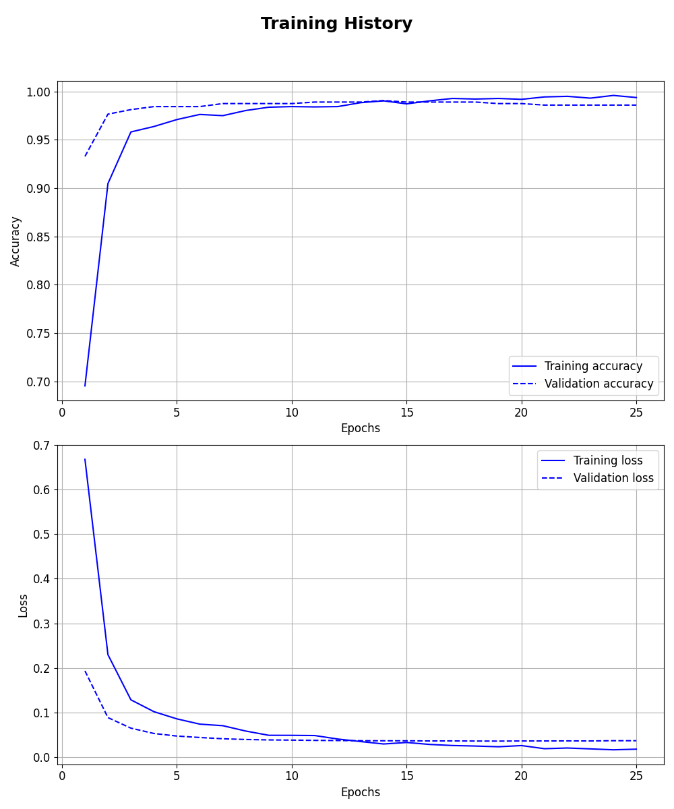

### Detailed Report of Test Set:

|              | precision    | recall       | f1-score     | support      |
| ------------ | ------------ | ------------ | ------------ | ------------ |
| chihuahua    | 0.9875       | 0.9916       | 0.9895       | 477          | 
| muffin       | 0.9903       | 0.9856       | 0.9880       | 416          | 
| micro avg    | 0.9888       | 0.9888       | 0.9888       | 893          | 
| macro avg    | 0.9889       | 0.9886       | 0.9887       | 893          | 
| weighted avg | 0.9888       | 0.9888       | 0.9888       | 893          | 
| samples avg  | 0.9888       | 0.9888       | 0.9888       | 893          | 

## trial_55

*    *Start Time*: 2024-10-23 08:42:39

*    *Duration*: 21.320

*    *Directory*: [Link](./trial_55)

### Hyperparameters:

| Hyperparameter         | Value                  |
| ---------------------- | ---------------------- |
| dense_units            | 256                    |
| dropout_rate           | 0.4741560241283936     |
| learning_rate          | 0.00012641427064081926 |

### Evaluation Metrics:

|           | train     | val       | test      |
| --------- | --------- | --------- | --------- |
| accuracy  | 1.0000    | 0.9906    | 0.9888    | 
| precision | 1.0000    | 0.9906    | 0.9888    | 
| recall    | 1.0000    | 0.9906    | 0.9888    | 
| f1        | 1.0000    | 0.9906    | 0.9888    | 

### Figures:

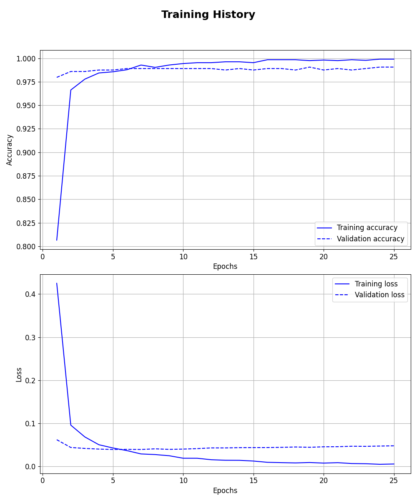

### Detailed Report of Test Set:

|              | precision    | recall       | f1-score     | support      |
| ------------ | ------------ | ------------ | ------------ | ------------ |
| chihuahua    | 0.9875       | 0.9916       | 0.9895       | 477          | 
| muffin       | 0.9903       | 0.9856       | 0.9880       | 416          | 
| micro avg    | 0.9888       | 0.9888       | 0.9888       | 893          | 
| macro avg    | 0.9889       | 0.9886       | 0.9887       | 893          | 
| weighted avg | 0.9888       | 0.9888       | 0.9888       | 893          | 
| samples avg  | 0.9888       | 0.9888       | 0.9888       | 893          | 

## trial_61

*    *Start Time*: 2024-10-23 08:44:56

*    *Duration*: 20.937

*    *Directory*: [Link](./trial_61)

### Hyperparameters:

| Hyperparameter       | Value                |
| -------------------- | -------------------- |
| dense_units          | 256                  |
| dropout_rate         | 0.04116007444355935  |
| learning_rate        | 9.24357044353985e-05 |

### Evaluation Metrics:

|           | train     | val       | test      |
| --------- | --------- | --------- | --------- |
| accuracy  | 1.0000    | 0.9906    | 0.9888    | 
| precision | 1.0000    | 0.9906    | 0.9888    | 
| recall    | 1.0000    | 0.9906    | 0.9888    | 
| f1        | 1.0000    | 0.9906    | 0.9888    | 

### Figures:

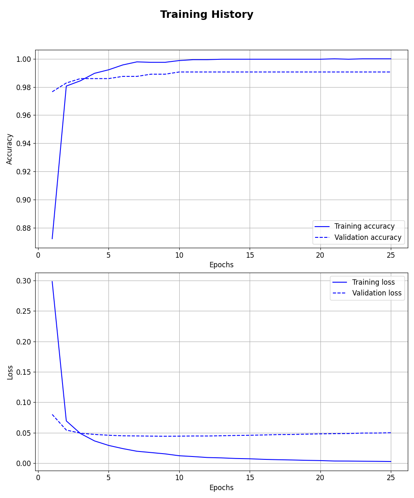

### Detailed Report of Test Set:

|              | precision    | recall       | f1-score     | support      |
| ------------ | ------------ | ------------ | ------------ | ------------ |
| chihuahua    | 0.9895       | 0.9895       | 0.9895       | 477          | 
| muffin       | 0.9880       | 0.9880       | 0.9880       | 416          | 
| micro avg    | 0.9888       | 0.9888       | 0.9888       | 893          | 
| macro avg    | 0.9887       | 0.9887       | 0.9887       | 893          | 
| weighted avg | 0.9888       | 0.9888       | 0.9888       | 893          | 
| samples avg  | 0.9888       | 0.9888       | 0.9888       | 893          | 

## trial_4

*    *Start Time*: 2024-10-23 08:23:21

*    *Duration*: 21.483

*    *Directory*: [Link](./trial_4)

### Hyperparameters:

| Hyperparameter        | Value                 |
| --------------------- | --------------------- |
| dense_units           | 512                   |
| dropout_rate          | 0.4680168863573586    |
| learning_rate         | 7.157047207151639e-05 |

### Evaluation Metrics:

|           | train     | val       | test      |
| --------- | --------- | --------- | --------- |
| accuracy  | 0.9997    | 0.9922    | 0.9877    | 
| precision | 0.9997    | 0.9922    | 0.9877    | 
| recall    | 0.9997    | 0.9922    | 0.9877    | 
| f1        | 0.9997    | 0.9922    | 0.9877    | 

### Figures:

### Detailed Report of Test Set:

|              | precision    | recall       | f1-score     | support      |
| ------------ | ------------ | ------------ | ------------ | ------------ |
| chihuahua    | 0.9854       | 0.9916       | 0.9885       | 477          | 
| muffin       | 0.9903       | 0.9832       | 0.9867       | 416          | 
| micro avg    | 0.9877       | 0.9877       | 0.9877       | 893          | 
| macro avg    | 0.9879       | 0.9874       | 0.9876       | 893          | 
| weighted avg | 0.9877       | 0.9877       | 0.9877       | 893          | 
| samples avg  | 0.9877       | 0.9877       | 0.9877       | 893          | 

## trial_5

*    *Start Time*: 2024-10-23 08:23:43

*    *Duration*: 21.562

*    *Directory*: [Link](./trial_5)

### Hyperparameters:

| Hyperparameter        | Value                 |
| --------------------- | --------------------- |
| dense_units           | 512                   |
| dropout_rate          | 0.07827462948739278   |
| learning_rate         | 0.0005524964939387456 |

### Evaluation Metrics:

|           | train     | val       | test      |
| --------- | --------- | --------- | --------- |
| accuracy  | 1.0000    | 0.9891    | 0.9877    | 
| precision | 1.0000    | 0.9891    | 0.9877    | 
| recall    | 1.0000    | 0.9891    | 0.9877    | 
| f1        | 1.0000    | 0.9891    | 0.9877    | 

### Figures:

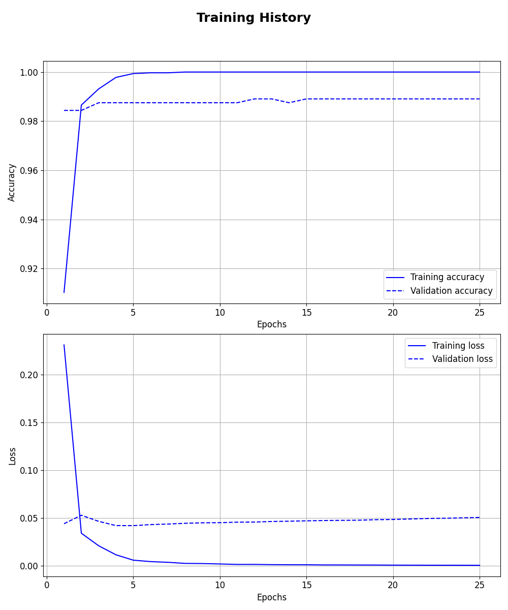

### Detailed Report of Test Set:

|              | precision    | recall       | f1-score     | support      |
| ------------ | ------------ | ------------ | ------------ | ------------ |
| chihuahua    | 0.9854       | 0.9916       | 0.9885       | 477          | 
| muffin       | 0.9903       | 0.9832       | 0.9867       | 416          | 
| micro avg    | 0.9877       | 0.9877       | 0.9877       | 893          | 
| macro avg    | 0.9879       | 0.9874       | 0.9876       | 893          | 
| weighted avg | 0.9877       | 0.9877       | 0.9877       | 893          | 
| samples avg  | 0.9877       | 0.9877       | 0.9877       | 893          | 

## trial_6

*    *Start Time*: 2024-10-23 08:24:05

*    *Duration*: 21.820

*    *Directory*: [Link](./trial_6)

### Hyperparameters:

| Hyperparameter        | Value                 |
| --------------------- | --------------------- |
| dense_units           | 512                   |
| dropout_rate          | 0.29543369776324463   |
| learning_rate         | 0.0007118010766530988 |

### Evaluation Metrics:

|           | train     | val       | test      |
| --------- | --------- | --------- | --------- |
| accuracy  | 1.0000    | 0.9906    | 0.9877    | 
| precision | 1.0000    | 0.9906    | 0.9877    | 
| recall    | 1.0000    | 0.9906    | 0.9877    | 
| f1        | 1.0000    | 0.9906    | 0.9877    | 

### Figures:

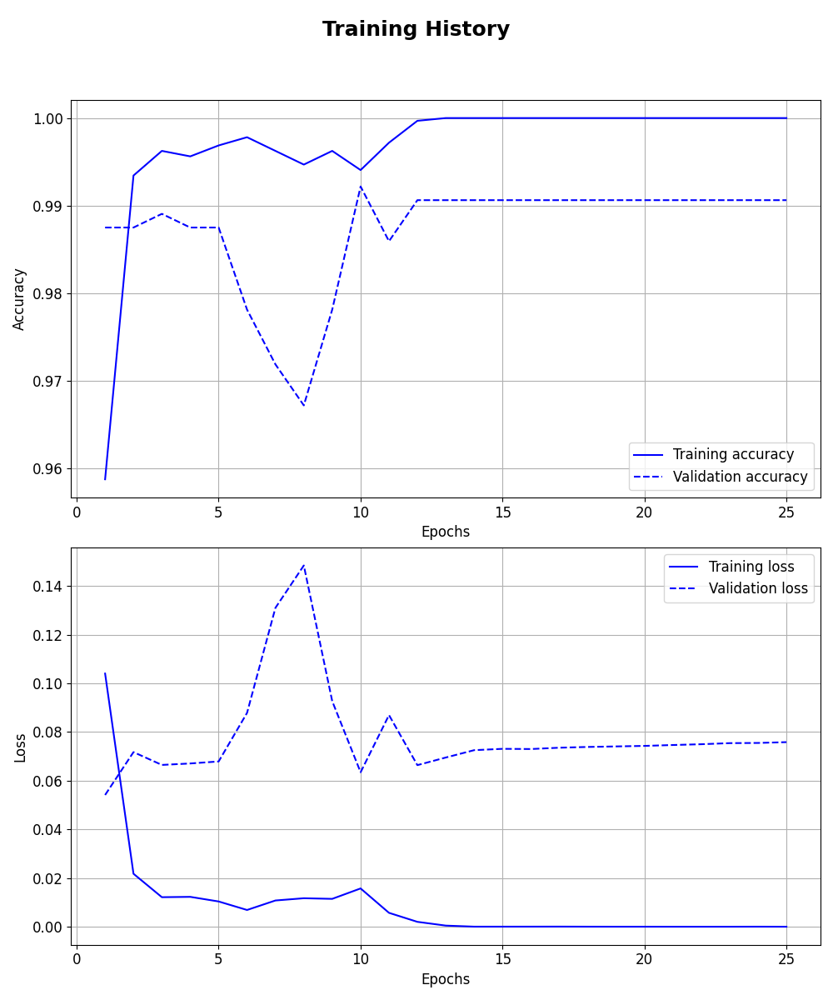

### Detailed Report of Test Set:

|              | precision    | recall       | f1-score     | support      |
| ------------ | ------------ | ------------ | ------------ | ------------ |
| chihuahua    | 0.9854       | 0.9916       | 0.9885       | 477          | 
| muffin       | 0.9903       | 0.9832       | 0.9867       | 416          | 
| micro avg    | 0.9877       | 0.9877       | 0.9877       | 893          | 
| macro avg    | 0.9879       | 0.9874       | 0.9876       | 893          | 
| weighted avg | 0.9877       | 0.9877       | 0.9877       | 893          | 
| samples avg  | 0.9877       | 0.9877       | 0.9877       | 893          | 

## trial_10

*    *Start Time*: 2024-10-23 08:25:37

*    *Duration*: 21.519

*    *Directory*: [Link](./trial_10)

### Hyperparameters:

| Hyperparameter        | Value                 |
| --------------------- | --------------------- |
| dense_units           | 256                   |
| dropout_rate          | 0.3988108945579785    |
| learning_rate         | 0.0009609575441407858 |

### Evaluation Metrics:

|           | train     | val       | test      |
| --------- | --------- | --------- | --------- |
| accuracy  | 1.0000    | 0.9906    | 0.9877    | 
| precision | 1.0000    | 0.9906    | 0.9877    | 
| recall    | 1.0000    | 0.9906    | 0.9877    | 
| f1        | 1.0000    | 0.9906    | 0.9877    | 

### Figures:

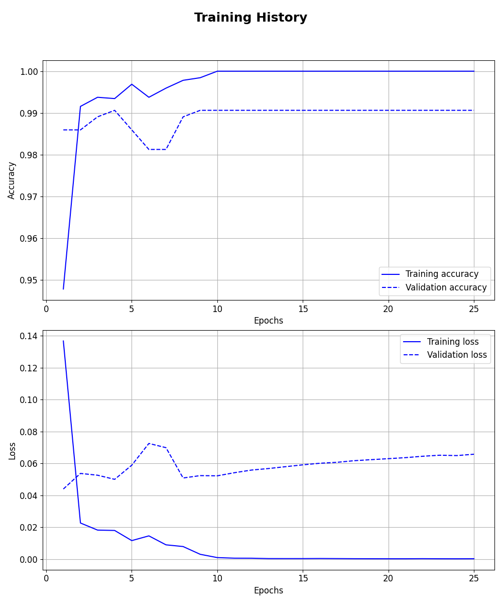

### Detailed Report of Test Set:

|              | precision    | recall       | f1-score     | support      |
| ------------ | ------------ | ------------ | ------------ | ------------ |
| chihuahua    | 0.9895       | 0.9874       | 0.9885       | 477          | 
| muffin       | 0.9856       | 0.9880       | 0.9868       | 416          | 
| micro avg    | 0.9877       | 0.9877       | 0.9877       | 893          | 
| macro avg    | 0.9876       | 0.9877       | 0.9876       | 893          | 
| weighted avg | 0.9877       | 0.9877       | 0.9877       | 893          | 
| samples avg  | 0.9877       | 0.9877       | 0.9877       | 893          | 

## trial_16

*    *Start Time*: 2024-10-23 08:27:51

*    *Duration*: 22.034

*    *Directory*: [Link](./trial_16)

### Hyperparameters:

| Hyperparameter        | Value                 |
| --------------------- | --------------------- |
| dense_units           | 128                   |
| dropout_rate          | 0.1996611639069833    |
| learning_rate         | 4.782575734681498e-05 |

### Evaluation Metrics:

|           | train     | val       | test      |
| --------- | --------- | --------- | --------- |
| accuracy  | 0.9975    | 0.9859    | 0.9877    | 
| precision | 0.9975    | 0.9859    | 0.9877    | 
| recall    | 0.9975    | 0.9859    | 0.9877    | 
| f1        | 0.9975    | 0.9859    | 0.9877    | 

### Figures:

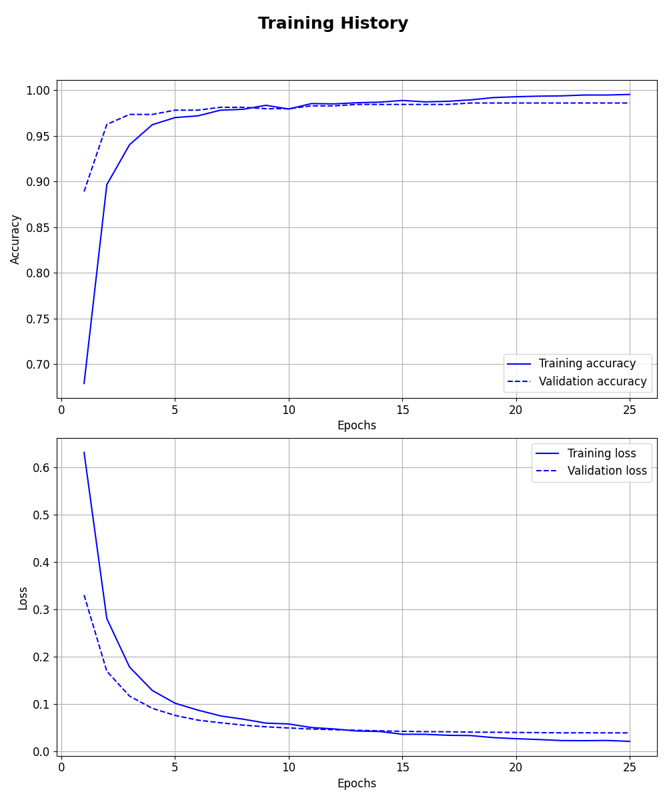

### Detailed Report of Test Set:

|              | precision    | recall       | f1-score     | support      |
| ------------ | ------------ | ------------ | ------------ | ------------ |
| chihuahua    | 0.9874       | 0.9895       | 0.9885       | 477          | 
| muffin       | 0.9880       | 0.9856       | 0.9868       | 416          | 
| micro avg    | 0.9877       | 0.9877       | 0.9877       | 893          | 
| macro avg    | 0.9877       | 0.9875       | 0.9876       | 893          | 
| weighted avg | 0.9877       | 0.9877       | 0.9877       | 893          | 
| samples avg  | 0.9877       | 0.9877       | 0.9877       | 893          | 

## trial_28

*    *Start Time*: 2024-10-23 08:32:27

*    *Duration*: 21.869

*    *Directory*: [Link](./trial_28)

### Hyperparameters:

| Hyperparameter        | Value                 |
| --------------------- | --------------------- |
| dense_units           | 512                   |
| dropout_rate          | 0.3809758064792372    |
| learning_rate         | 0.0001098387636226933 |

### Evaluation Metrics:

|           | train     | val       | test      |
| --------- | --------- | --------- | --------- |
| accuracy  | 1.0000    | 0.9891    | 0.9877    | 
| precision | 1.0000    | 0.9891    | 0.9877    | 
| recall    | 1.0000    | 0.9891    | 0.9877    | 
| f1        | 1.0000    | 0.9891    | 0.9877    | 

### Figures:

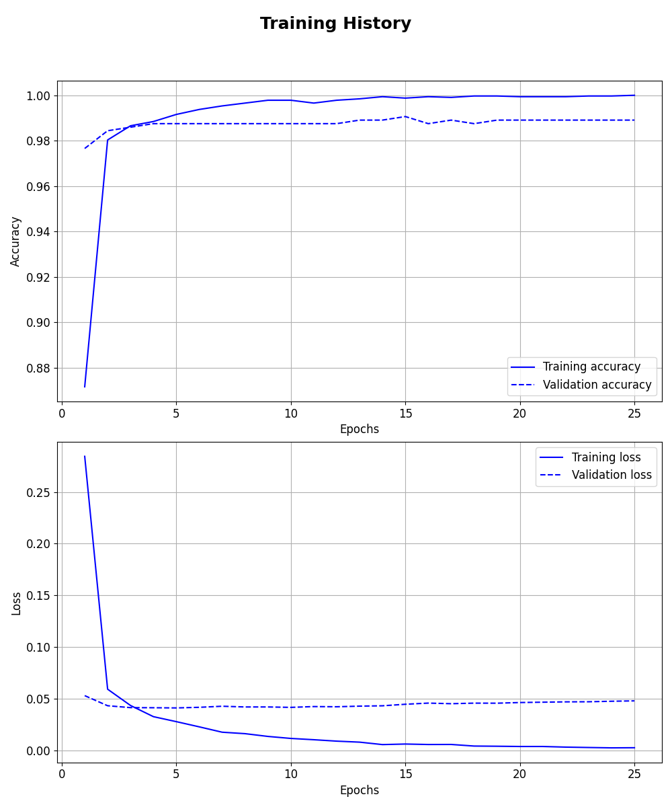

### Detailed Report of Test Set:

|              | precision    | recall       | f1-score     | support      |
| ------------ | ------------ | ------------ | ------------ | ------------ |
| chihuahua    | 0.9895       | 0.9874       | 0.9885       | 477          | 
| muffin       | 0.9856       | 0.9880       | 0.9868       | 416          | 
| micro avg    | 0.9877       | 0.9877       | 0.9877       | 893          | 
| macro avg    | 0.9876       | 0.9877       | 0.9876       | 893          | 
| weighted avg | 0.9877       | 0.9877       | 0.9877       | 893          | 
| samples avg  | 0.9877       | 0.9877       | 0.9877       | 893          | 

## trial_36

*    *Start Time*: 2024-10-23 08:35:29

*    *Duration*: 21.104

*    *Directory*: [Link](./trial_36)

### Hyperparameters:

| Hyperparameter         | Value                  |
| ---------------------- | ---------------------- |
| dense_units            | 512                    |
| dropout_rate           | 0.43170926310932817    |
| learning_rate          | 0.00011203017744595551 |

### Evaluation Metrics:

|           | train     | val       | test      |
| --------- | --------- | --------- | --------- |
| accuracy  | 1.0000    | 0.9875    | 0.9877    | 
| precision | 1.0000    | 0.9875    | 0.9877    | 
| recall    | 1.0000    | 0.9875    | 0.9877    | 
| f1        | 1.0000    | 0.9875    | 0.9877    | 

### Figures:

### Detailed Report of Test Set:

|              | precision    | recall       | f1-score     | support      |
| ------------ | ------------ | ------------ | ------------ | ------------ |
| chihuahua    | 0.9854       | 0.9916       | 0.9885       | 477          | 
| muffin       | 0.9903       | 0.9832       | 0.9867       | 416          | 
| micro avg    | 0.9877       | 0.9877       | 0.9877       | 893          | 
| macro avg    | 0.9879       | 0.9874       | 0.9876       | 893          | 
| weighted avg | 0.9877       | 0.9877       | 0.9877       | 893          | 
| samples avg  | 0.9877       | 0.9877       | 0.9877       | 893          | 

## trial_49

*    *Start Time*: 2024-10-23 08:40:22

*    *Duration*: 20.705

*    *Directory*: [Link](./trial_49)

### Hyperparameters:

| Hyperparameter        | Value                 |
| --------------------- | --------------------- |
| dense_units           | 512                   |
| dropout_rate          | 0.09217618197653099   |
| learning_rate         | 0.0002665494075470057 |

### Evaluation Metrics:

|           | train     | val       | test      |
| --------- | --------- | --------- | --------- |
| accuracy  | 1.0000    | 0.9891    | 0.9877    | 
| precision | 1.0000    | 0.9891    | 0.9877    | 
| recall    | 1.0000    | 0.9891    | 0.9877    | 
| f1        | 1.0000    | 0.9891    | 0.9877    | 

### Figures:

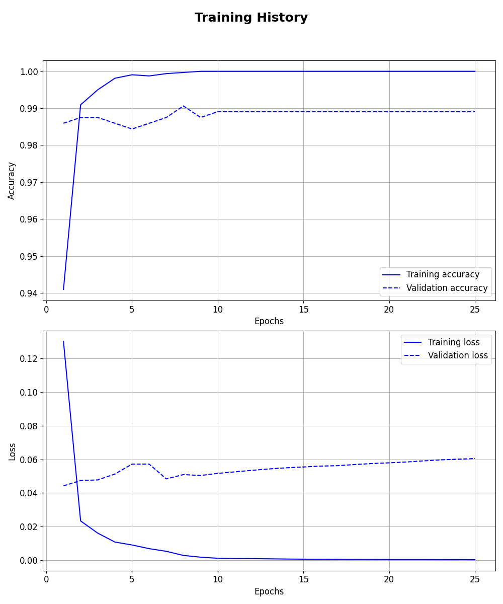

### Detailed Report of Test Set:

|              | precision    | recall       | f1-score     | support      |
| ------------ | ------------ | ------------ | ------------ | ------------ |
| chihuahua    | 0.9874       | 0.9895       | 0.9885       | 477          | 
| muffin       | 0.9880       | 0.9856       | 0.9868       | 416          | 
| micro avg    | 0.9877       | 0.9877       | 0.9877       | 893          | 
| macro avg    | 0.9877       | 0.9875       | 0.9876       | 893          | 
| weighted avg | 0.9877       | 0.9877       | 0.9877       | 893          | 
| samples avg  | 0.9877       | 0.9877       | 0.9877       | 893          | 

## trial_54

*    *Start Time*: 2024-10-23 08:42:15

*    *Duration*: 21.441

*    *Directory*: [Link](./trial_54)

### Hyperparameters:

| Hyperparameter        | Value                 |
| --------------------- | --------------------- |
| dense_units           | 256                   |
| dropout_rate          | 0.49759303307516434   |
| learning_rate         | 6.557601844650474e-05 |

### Evaluation Metrics:

|           | train     | val       | test      |
| --------- | --------- | --------- | --------- |
| accuracy  | 0.9997    | 0.9891    | 0.9877    | 
| precision | 0.9997    | 0.9891    | 0.9877    | 
| recall    | 0.9997    | 0.9891    | 0.9877    | 
| f1        | 0.9997    | 0.9891    | 0.9877    | 

### Figures:

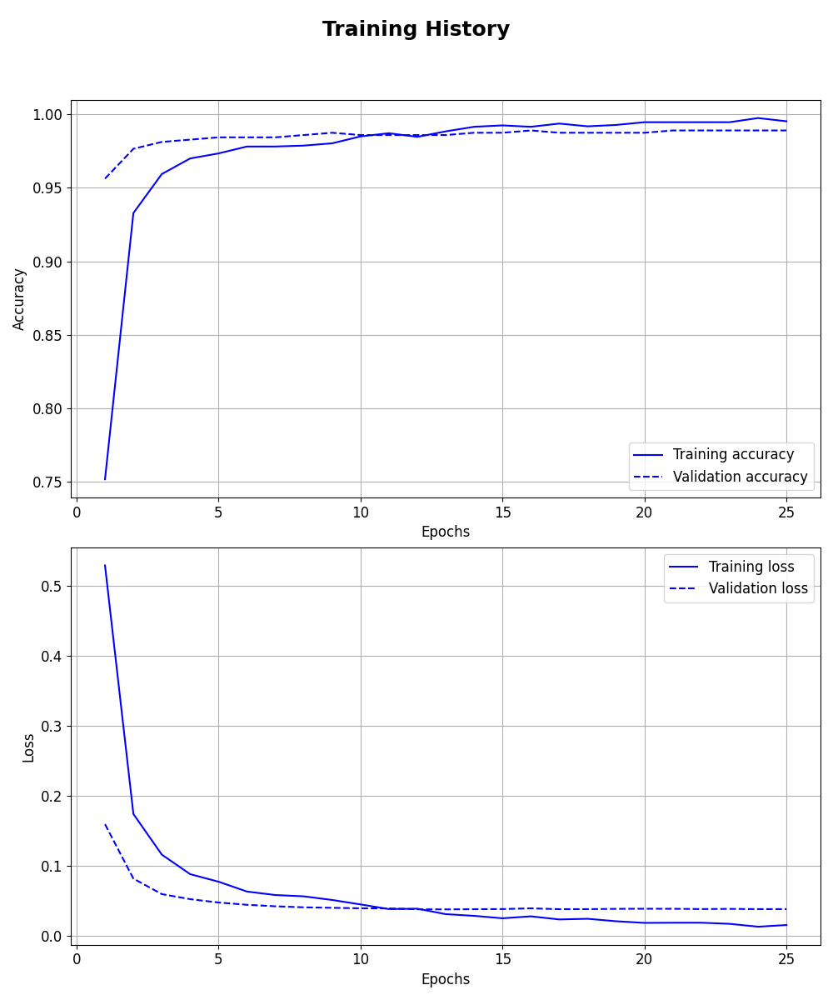

### Detailed Report of Test Set:

|              | precision    | recall       | f1-score     | support      |
| ------------ | ------------ | ------------ | ------------ | ------------ |
| chihuahua    | 0.9854       | 0.9916       | 0.9885       | 477          | 
| muffin       | 0.9903       | 0.9832       | 0.9867       | 416          | 
| micro avg    | 0.9877       | 0.9877       | 0.9877       | 893          | 
| macro avg    | 0.9879       | 0.9874       | 0.9876       | 893          | 
| weighted avg | 0.9877       | 0.9877       | 0.9877       | 893          | 
| samples avg  | 0.9877       | 0.9877       | 0.9877       | 893          | 

## trial_73

*    *Start Time*: 2024-10-23 08:49:31

*    *Duration*: 21.177

*    *Directory*: [Link](./trial_73)

### Hyperparameters:

| Hyperparameter         | Value                  |
| ---------------------- | ---------------------- |
| dense_units            | 512                    |
| dropout_rate           | 0.3555426514924586     |
| learning_rate          | 3.9508998773954047e-05 |

### Evaluation Metrics:

|           | train     | val       | test      |
| --------- | --------- | --------- | --------- |
| accuracy  | 0.9997    | 0.9906    | 0.9877    | 
| precision | 0.9997    | 0.9906    | 0.9877    | 
| recall    | 0.9997    | 0.9906    | 0.9877    | 
| f1        | 0.9997    | 0.9906    | 0.9877    | 

### Figures:

### Detailed Report of Test Set:

|              | precision    | recall       | f1-score     | support      |
| ------------ | ------------ | ------------ | ------------ | ------------ |
| chihuahua    | 0.9874       | 0.9895       | 0.9885       | 477          | 
| muffin       | 0.9880       | 0.9856       | 0.9868       | 416          | 
| micro avg    | 0.9877       | 0.9877       | 0.9877       | 893          | 
| macro avg    | 0.9877       | 0.9875       | 0.9876       | 893          | 
| weighted avg | 0.9877       | 0.9877       | 0.9877       | 893          | 
| samples avg  | 0.9877       | 0.9877       | 0.9877       | 893          | 

## trial_76

*    *Start Time*: 2024-10-23 08:50:41

*    *Duration*: 21.042

*    *Directory*: [Link](./trial_76)

### Hyperparameters:

| Hyperparameter         | Value                  |
| ---------------------- | ---------------------- |
| dense_units            | 512                    |
| dropout_rate           | 0.345841062578444      |
| learning_rate          | 3.0282110791216976e-05 |

### Evaluation Metrics:

|           | train     | val       | test      |
| --------- | --------- | --------- | --------- |
| accuracy  | 0.9997    | 0.9891    | 0.9877    | 
| precision | 0.9997    | 0.9891    | 0.9877    | 
| recall    | 0.9997    | 0.9891    | 0.9877    | 
| f1        | 0.9997    | 0.9891    | 0.9877    | 

### Figures:

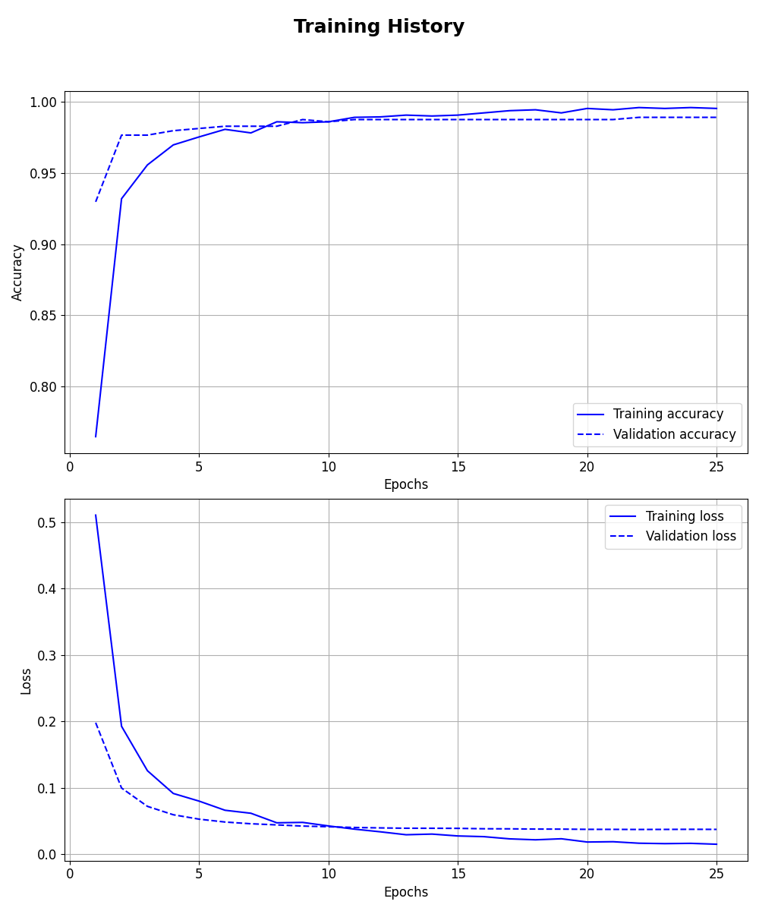

### Detailed Report of Test Set:

|              | precision    | recall       | f1-score     | support      |
| ------------ | ------------ | ------------ | ------------ | ------------ |
| chihuahua    | 0.9895       | 0.9874       | 0.9885       | 477          | 
| muffin       | 0.9856       | 0.9880       | 0.9868       | 416          | 
| micro avg    | 0.9877       | 0.9877       | 0.9877       | 893          | 
| macro avg    | 0.9876       | 0.9877       | 0.9876       | 893          | 
| weighted avg | 0.9877       | 0.9877       | 0.9877       | 893          | 
| samples avg  | 0.9877       | 0.9877       | 0.9877       | 893          | 

## trial_85

*    *Start Time*: 2024-10-23 08:54:11

*    *Duration*: 21.029

*    *Directory*: [Link](./trial_85)

### Hyperparameters:

| Hyperparameter         | Value                  |
| ---------------------- | ---------------------- |
| dense_units            | 512                    |
| dropout_rate           | 0.44109290889221453    |
| learning_rate          | 0.00010763541276588227 |

### Evaluation Metrics:

|           | train     | val       | test      |
| --------- | --------- | --------- | --------- |
| accuracy  | 1.0000    | 0.9922    | 0.9877    | 
| precision | 1.0000    | 0.9922    | 0.9877    | 
| recall    | 1.0000    | 0.9922    | 0.9877    | 
| f1        | 1.0000    | 0.9922    | 0.9877    | 

### Figures:

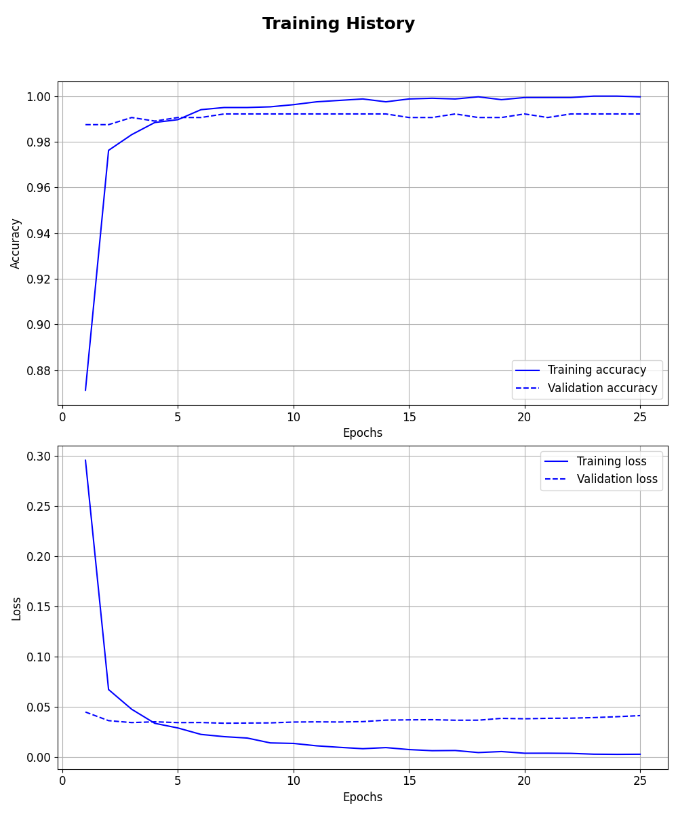

### Detailed Report of Test Set:

|              | precision    | recall       | f1-score     | support      |
| ------------ | ------------ | ------------ | ------------ | ------------ |
| chihuahua    | 0.9854       | 0.9916       | 0.9885       | 477          | 
| muffin       | 0.9903       | 0.9832       | 0.9867       | 416          | 
| micro avg    | 0.9877       | 0.9877       | 0.9877       | 893          | 
| macro avg    | 0.9879       | 0.9874       | 0.9876       | 893          | 
| weighted avg | 0.9877       | 0.9877       | 0.9877       | 893          | 
| samples avg  | 0.9877       | 0.9877       | 0.9877       | 893          | 

## trial_1

*    *Start Time*: 2024-10-23 08:22:04

*    *Duration*: 30.008

*    *Directory*: [Link](./trial_1)

### Hyperparameters:

| Hyperparameter        | Value                 |
| --------------------- | --------------------- |
| dense_units           | 512                   |
| dropout_rate          | 0.2624114358502948    |
| learning_rate         | 7.969597262267634e-05 |

### Evaluation Metrics:

|           | train     | val       | test      |
| --------- | --------- | --------- | --------- |
| accuracy  | 1.0000    | 0.9891    | 0.9866    | 
| precision | 1.0000    | 0.9891    | 0.9866    | 
| recall    | 1.0000    | 0.9891    | 0.9866    | 
| f1        | 1.0000    | 0.9891    | 0.9866    | 

### Figures:

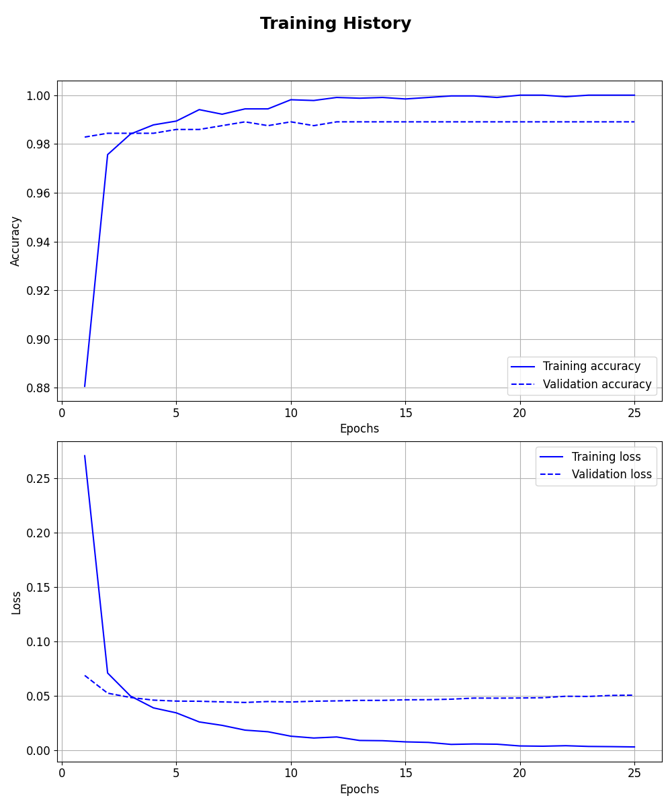

### Detailed Report of Test Set:

|              | precision    | recall       | f1-score     | support      |
| ------------ | ------------ | ------------ | ------------ | ------------ |
| chihuahua    | 0.9854       | 0.9895       | 0.9874       | 477          | 
| muffin       | 0.9879       | 0.9832       | 0.9855       | 416          | 
| micro avg    | 0.9866       | 0.9866       | 0.9866       | 893          | 
| macro avg    | 0.9867       | 0.9863       | 0.9865       | 893          | 
| weighted avg | 0.9866       | 0.9866       | 0.9866       | 893          | 
| samples avg  | 0.9866       | 0.9866       | 0.9866       | 893          | 

## trial_8

*    *Start Time*: 2024-10-23 08:24:52

*    *Duration*: 21.735

*    *Directory*: [Link](./trial_8)

### Hyperparameters:

| Hyperparameter        | Value                 |
| --------------------- | --------------------- |
| dense_units           | 512                   |
| dropout_rate          | 0.1307636892195046    |
| learning_rate         | 0.0005890714206015307 |

### Evaluation Metrics:

|           | train     | val       | test      |
| --------- | --------- | --------- | --------- |
| accuracy  | 1.0000    | 0.9891    | 0.9866    | 
| precision | 1.0000    | 0.9891    | 0.9866    | 
| recall    | 1.0000    | 0.9891    | 0.9866    | 
| f1        | 1.0000    | 0.9891    | 0.9866    | 

### Figures:

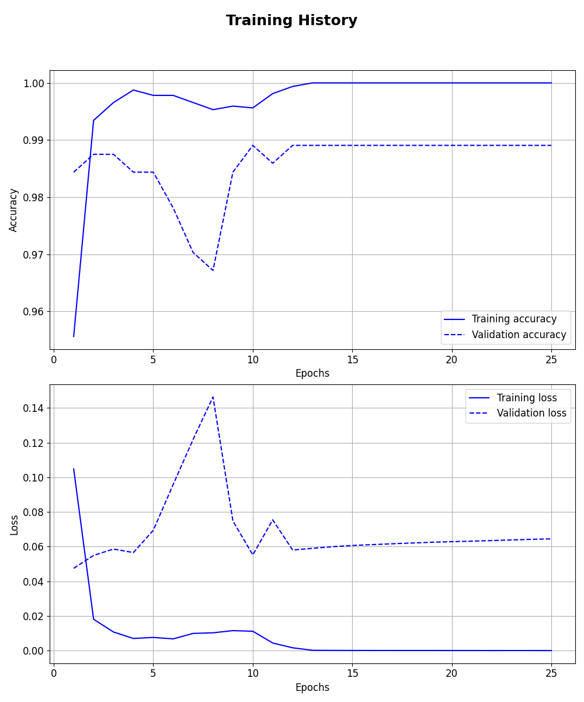

### Detailed Report of Test Set:

|              | precision    | recall       | f1-score     | support      |
| ------------ | ------------ | ------------ | ------------ | ------------ |
| chihuahua    | 0.9874       | 0.9874       | 0.9874       | 477          | 
| muffin       | 0.9856       | 0.9856       | 0.9856       | 416          | 
| micro avg    | 0.9866       | 0.9866       | 0.9866       | 893          | 
| macro avg    | 0.9865       | 0.9865       | 0.9865       | 893          | 
| weighted avg | 0.9866       | 0.9866       | 0.9866       | 893          | 
| samples avg  | 0.9866       | 0.9866       | 0.9866       | 893          | 

## trial_9

*    *Start Time*: 2024-10-23 08:25:14

*    *Duration*: 21.742

*    *Directory*: [Link](./trial_9)

### Hyperparameters:

| Hyperparameter        | Value                 |
| --------------------- | --------------------- |
| dense_units           | 256                   |
| dropout_rate          | 0.3292201193965158    |
| learning_rate         | 7.029537736162967e-05 |

### Evaluation Metrics:

|           | train     | val       | test      |
| --------- | --------- | --------- | --------- |
| accuracy  | 0.9997    | 0.9891    | 0.9866    | 
| precision | 0.9997    | 0.9891    | 0.9866    | 
| recall    | 0.9997    | 0.9891    | 0.9866    | 
| f1        | 0.9997    | 0.9891    | 0.9866    | 

### Figures:

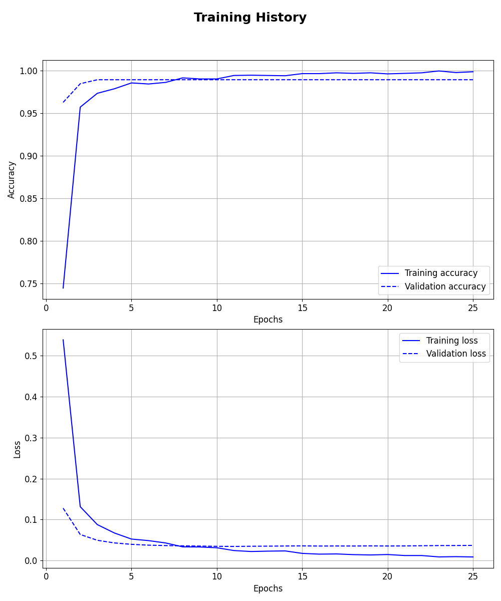

### Detailed Report of Test Set:

|              | precision    | recall       | f1-score     | support      |
| ------------ | ------------ | ------------ | ------------ | ------------ |
| chihuahua    | 0.9874       | 0.9874       | 0.9874       | 477          | 
| muffin       | 0.9856       | 0.9856       | 0.9856       | 416          | 
| micro avg    | 0.9866       | 0.9866       | 0.9866       | 893          | 
| macro avg    | 0.9865       | 0.9865       | 0.9865       | 893          | 
| weighted avg | 0.9866       | 0.9866       | 0.9866       | 893          | 
| samples avg  | 0.9866       | 0.9866       | 0.9866       | 893          | 

## trial_12

*    *Start Time*: 2024-10-23 08:26:21

*    *Duration*: 21.290

*    *Directory*: [Link](./trial_12)

### Hyperparameters:

| Hyperparameter        | Value                 |
| --------------------- | --------------------- |
| dense_units           | 128                   |
| dropout_rate          | 0.34815267373225034   |
| learning_rate         | 9.187434166164443e-05 |

### Evaluation Metrics:

|           | train     | val       | test      |
| --------- | --------- | --------- | --------- |
| accuracy  | 0.9997    | 0.9875    | 0.9866    | 
| precision | 0.9997    | 0.9875    | 0.9866    | 
| recall    | 0.9997    | 0.9875    | 0.9866    | 
| f1        | 0.9997    | 0.9875    | 0.9866    | 

### Figures:

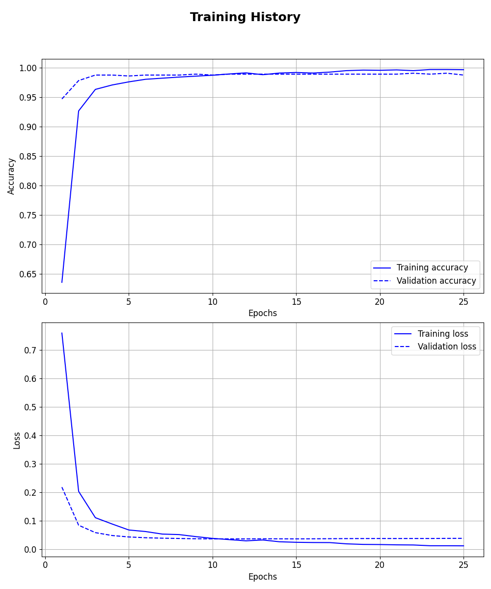

### Detailed Report of Test Set:

|              | precision    | recall       | f1-score     | support      |
| ------------ | ------------ | ------------ | ------------ | ------------ |
| chihuahua    | 0.9854       | 0.9895       | 0.9874       | 477          | 
| muffin       | 0.9879       | 0.9832       | 0.9855       | 416          | 
| micro avg    | 0.9866       | 0.9866       | 0.9866       | 893          | 
| macro avg    | 0.9867       | 0.9863       | 0.9865       | 893          | 
| weighted avg | 0.9866       | 0.9866       | 0.9866       | 893          | 
| samples avg  | 0.9866       | 0.9866       | 0.9866       | 893          | 

## trial_14

*    *Start Time*: 2024-10-23 08:27:06

*    *Duration*: 21.987

*    *Directory*: [Link](./trial_14)

### Hyperparameters:

| Hyperparameter         | Value                  |
| ---------------------- | ---------------------- |
| dense_units            | 256                    |
| dropout_rate           | 0.20003419531135136    |
| learning_rate          | 0.00019858388415220065 |

### Evaluation Metrics:

|           | train     | val       | test      |
| --------- | --------- | --------- | --------- |
| accuracy  | 1.0000    | 0.9891    | 0.9866    | 
| precision | 1.0000    | 0.9891    | 0.9866    | 
| recall    | 1.0000    | 0.9891    | 0.9866    | 
| f1        | 1.0000    | 0.9891    | 0.9866    | 

### Figures:

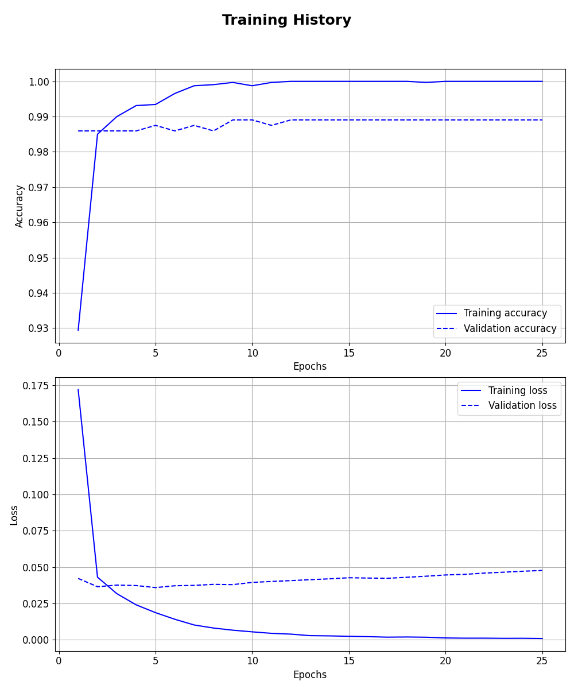

### Detailed Report of Test Set:

|              | precision    | recall       | f1-score     | support      |
| ------------ | ------------ | ------------ | ------------ | ------------ |
| chihuahua    | 0.9854       | 0.9895       | 0.9874       | 477          | 
| muffin       | 0.9879       | 0.9832       | 0.9855       | 416          | 
| micro avg    | 0.9866       | 0.9866       | 0.9866       | 893          | 
| macro avg    | 0.9867       | 0.9863       | 0.9865       | 893          | 
| weighted avg | 0.9866       | 0.9866       | 0.9866       | 893          | 
| samples avg  | 0.9866       | 0.9866       | 0.9866       | 893          | 

## trial_25

*    *Start Time*: 2024-10-23 08:31:17

*    *Duration*: 21.888

*    *Directory*: [Link](./trial_25)

### Hyperparameters:

| Hyperparameter         | Value                  |
| ---------------------- | ---------------------- |
| dense_units            | 512                    |
| dropout_rate           | 0.39764931776526286    |
| learning_rate          | 3.2109528653206545e-05 |

### Evaluation Metrics:

|           | train     | val       | test      |
| --------- | --------- | --------- | --------- |
| accuracy  | 0.9994    | 0.9891    | 0.9866    | 
| precision | 0.9994    | 0.9891    | 0.9866    | 
| recall    | 0.9994    | 0.9891    | 0.9866    | 
| f1        | 0.9994    | 0.9891    | 0.9866    | 

### Figures:

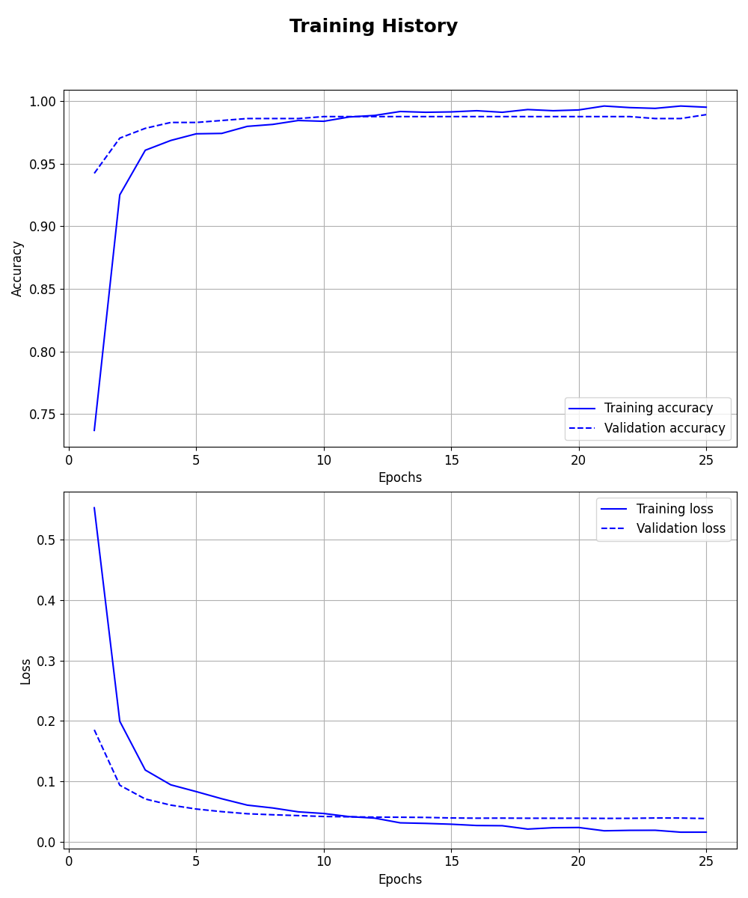

### Detailed Report of Test Set:

|              | precision    | recall       | f1-score     | support      |
| ------------ | ------------ | ------------ | ------------ | ------------ |
| chihuahua    | 0.9874       | 0.9874       | 0.9874       | 477          | 
| muffin       | 0.9856       | 0.9856       | 0.9856       | 416          | 
| micro avg    | 0.9866       | 0.9866       | 0.9866       | 893          | 
| macro avg    | 0.9865       | 0.9865       | 0.9865       | 893          | 
| weighted avg | 0.9866       | 0.9866       | 0.9866       | 893          | 
| samples avg  | 0.9866       | 0.9866       | 0.9866       | 893          | 

## trial_34

*    *Start Time*: 2024-10-23 08:34:44

*    *Duration*: 21.220

*    *Directory*: [Link](./trial_34)

### Hyperparameters:

| Hyperparameter        | Value                 |
| --------------------- | --------------------- |
| dense_units           | 512                   |
| dropout_rate          | 0.17190958015271368   |
| learning_rate         | 8.220839878308844e-05 |

### Evaluation Metrics:

|           | train     | val       | test      |
| --------- | --------- | --------- | --------- |
| accuracy  | 1.0000    | 0.9906    | 0.9866    | 
| precision | 1.0000    | 0.9906    | 0.9866    | 
| recall    | 1.0000    | 0.9906    | 0.9866    | 
| f1        | 1.0000    | 0.9906    | 0.9866    | 

### Figures:

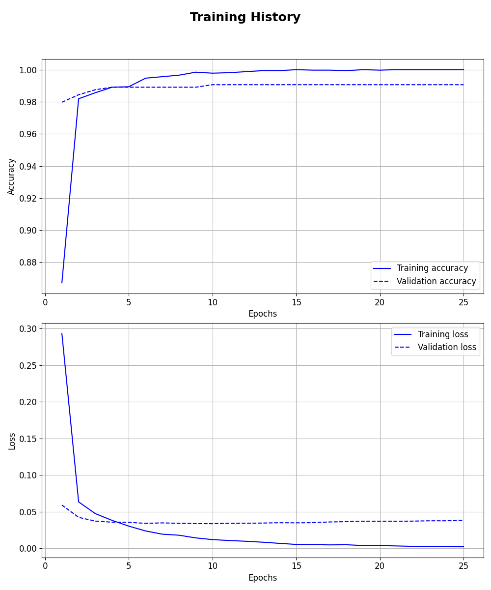

### Detailed Report of Test Set:

|              | precision    | recall       | f1-score     | support      |
| ------------ | ------------ | ------------ | ------------ | ------------ |
| chihuahua    | 0.9854       | 0.9895       | 0.9874       | 477          | 
| muffin       | 0.9879       | 0.9832       | 0.9855       | 416          | 
| micro avg    | 0.9866       | 0.9866       | 0.9866       | 893          | 
| macro avg    | 0.9867       | 0.9863       | 0.9865       | 893          | 
| weighted avg | 0.9866       | 0.9866       | 0.9866       | 893          | 
| samples avg  | 0.9866       | 0.9866       | 0.9866       | 893          | 

## trial_43

*    *Start Time*: 2024-10-23 08:38:06

*    *Duration*: 21.109

*    *Directory*: [Link](./trial_43)

### Hyperparameters:

| Hyperparameter         | Value                  |
| ---------------------- | ---------------------- |
| dense_units            | 512                    |
| dropout_rate           | 0.36943303438175445    |
| learning_rate          | 2.9045082135588245e-05 |

### Evaluation Metrics:

|           | train     | val       | test      |
| --------- | --------- | --------- | --------- |
| accuracy  | 0.9984    | 0.9891    | 0.9866    | 
| precision | 0.9984    | 0.9891    | 0.9866    | 
| recall    | 0.9984    | 0.9891    | 0.9866    | 
| f1        | 0.9984    | 0.9891    | 0.9866    | 

### Figures:

### Detailed Report of Test Set:

|              | precision    | recall       | f1-score     | support      |
| ------------ | ------------ | ------------ | ------------ | ------------ |
| chihuahua    | 0.9834       | 0.9916       | 0.9875       | 477          | 
| muffin       | 0.9903       | 0.9808       | 0.9855       | 416          | 
| micro avg    | 0.9866       | 0.9866       | 0.9866       | 893          | 
| macro avg    | 0.9868       | 0.9862       | 0.9865       | 893          | 
| weighted avg | 0.9866       | 0.9866       | 0.9866       | 893          | 
| samples avg  | 0.9866       | 0.9866       | 0.9866       | 893          | 

## trial_48

*    *Start Time*: 2024-10-23 08:40:00

*    *Duration*: 21.075

*    *Directory*: [Link](./trial_48)

### Hyperparameters:

| Hyperparameter         | Value                  |
| ---------------------- | ---------------------- |
| dense_units            | 512                    |
| dropout_rate           | 0.23531825762468442    |
| learning_rate          | 0.00015417964513227822 |

### Evaluation Metrics:

|           | train     | val       | test      |
| --------- | --------- | --------- | --------- |
| accuracy  | 1.0000    | 0.9922    | 0.9866    | 
| precision | 1.0000    | 0.9922    | 0.9866    | 
| recall    | 1.0000    | 0.9922    | 0.9866    | 
| f1        | 1.0000    | 0.9922    | 0.9866    | 

### Figures:

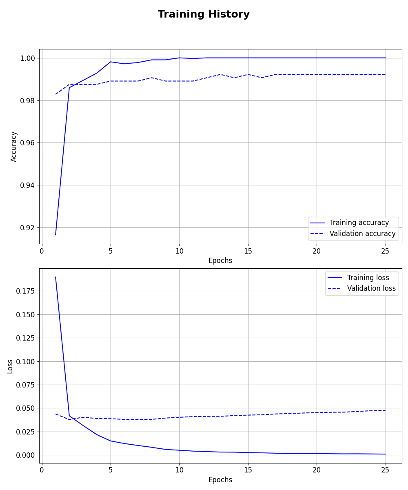

### Detailed Report of Test Set:

|              | precision    | recall       | f1-score     | support      |
| ------------ | ------------ | ------------ | ------------ | ------------ |
| chihuahua    | 0.9854       | 0.9895       | 0.9874       | 477          | 
| muffin       | 0.9879       | 0.9832       | 0.9855       | 416          | 
| micro avg    | 0.9866       | 0.9866       | 0.9866       | 893          | 
| macro avg    | 0.9867       | 0.9863       | 0.9865       | 893          | 
| weighted avg | 0.9866       | 0.9866       | 0.9866       | 893          | 
| samples avg  | 0.9866       | 0.9866       | 0.9866       | 893          | 

## trial_50

*    *Start Time*: 2024-10-23 08:40:45

*    *Duration*: 20.924

*    *Directory*: [Link](./trial_50)

### Hyperparameters:

| Hyperparameter        | Value                 |
| --------------------- | --------------------- |
| dense_units           | 256                   |
| dropout_rate          | 0.4912893792446536    |
| learning_rate         | 7.099086820467418e-05 |

### Evaluation Metrics:

|           | train     | val       | test      |
| --------- | --------- | --------- | --------- |
| accuracy  | 0.9997    | 0.9891    | 0.9866    | 
| precision | 0.9997    | 0.9891    | 0.9866    | 
| recall    | 0.9997    | 0.9891    | 0.9866    | 
| f1        | 0.9997    | 0.9891    | 0.9866    | 

### Figures:

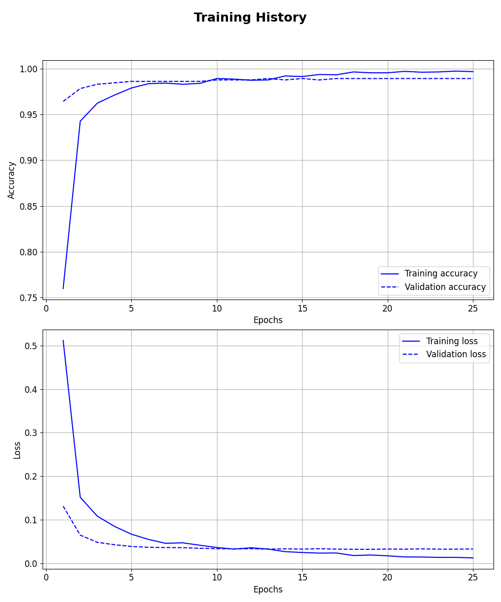

### Detailed Report of Test Set:

|              | precision    | recall       | f1-score     | support      |
| ------------ | ------------ | ------------ | ------------ | ------------ |
| chihuahua    | 0.9854       | 0.9895       | 0.9874       | 477          | 
| muffin       | 0.9879       | 0.9832       | 0.9855       | 416          | 
| micro avg    | 0.9866       | 0.9866       | 0.9866       | 893          | 
| macro avg    | 0.9867       | 0.9863       | 0.9865       | 893          | 
| weighted avg | 0.9866       | 0.9866       | 0.9866       | 893          | 
| samples avg  | 0.9866       | 0.9866       | 0.9866       | 893          | 

## trial_63

*    *Start Time*: 2024-10-23 08:45:42

*    *Duration*: 20.804

*    *Directory*: [Link](./trial_63)

### Hyperparameters:

| Hyperparameter        | Value                 |
| --------------------- | --------------------- |
| dense_units           | 512                   |
| dropout_rate          | 0.2742267436792667    |
| learning_rate         | 3.348863238587228e-05 |

### Evaluation Metrics:

|           | train     | val       | test      |
| --------- | --------- | --------- | --------- |
| accuracy  | 0.9997    | 0.9875    | 0.9866    | 
| precision | 0.9997    | 0.9875    | 0.9866    | 
| recall    | 0.9997    | 0.9875    | 0.9866    | 
| f1        | 0.9997    | 0.9875    | 0.9866    | 

### Figures:

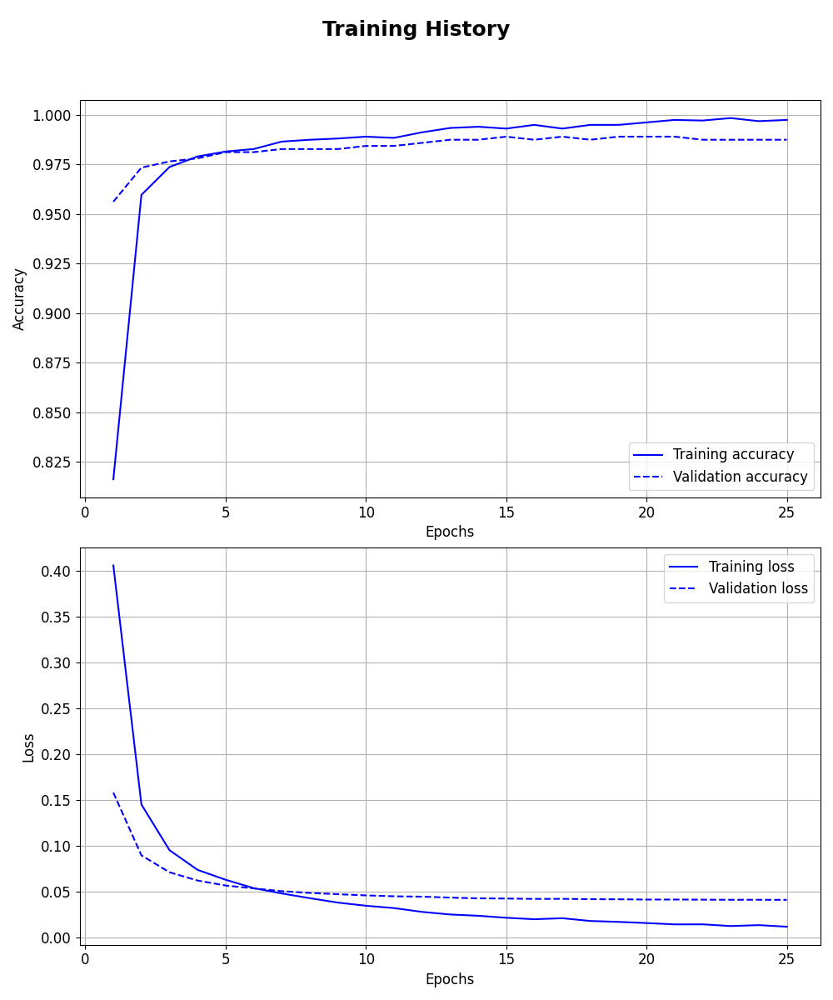

### Detailed Report of Test Set:

|              | precision    | recall       | f1-score     | support      |
| ------------ | ------------ | ------------ | ------------ | ------------ |
| chihuahua    | 0.9834       | 0.9916       | 0.9875       | 477          | 
| muffin       | 0.9903       | 0.9808       | 0.9855       | 416          | 
| micro avg    | 0.9866       | 0.9866       | 0.9866       | 893          | 
| macro avg    | 0.9868       | 0.9862       | 0.9865       | 893          | 
| weighted avg | 0.9866       | 0.9866       | 0.9866       | 893          | 
| samples avg  | 0.9866       | 0.9866       | 0.9866       | 893          | 

## trial_64

*    *Start Time*: 2024-10-23 08:46:05

*    *Duration*: 21.285

*    *Directory*: [Link](./trial_64)

### Hyperparameters:

| Hyperparameter        | Value                 |
| --------------------- | --------------------- |
| dense_units           | 512                   |
| dropout_rate          | 0.31869402281028714   |
| learning_rate         | 6.148599596779192e-05 |

### Evaluation Metrics:

|           | train     | val       | test      |
| --------- | --------- | --------- | --------- |
| accuracy  | 1.0000    | 0.9875    | 0.9866    | 
| precision | 1.0000    | 0.9875    | 0.9866    | 
| recall    | 1.0000    | 0.9875    | 0.9866    | 
| f1        | 1.0000    | 0.9875    | 0.9866    | 

### Figures:

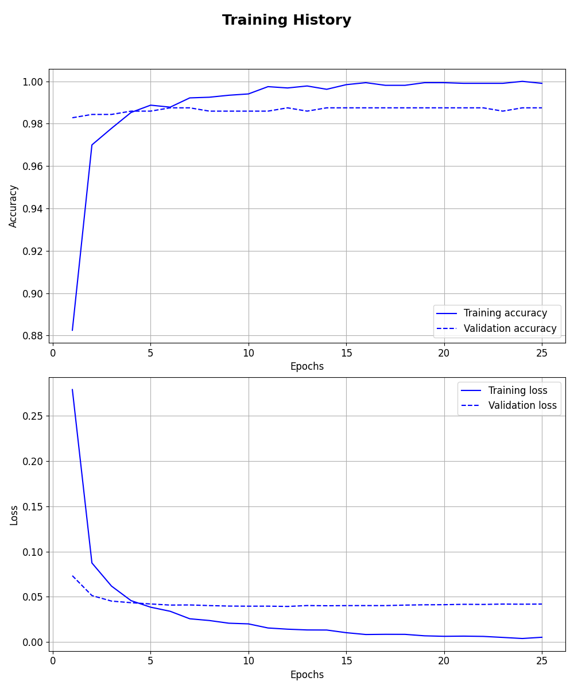

### Detailed Report of Test Set:

|              | precision    | recall       | f1-score     | support      |
| ------------ | ------------ | ------------ | ------------ | ------------ |
| chihuahua    | 0.9874       | 0.9874       | 0.9874       | 477          | 
| muffin       | 0.9856       | 0.9856       | 0.9856       | 416          | 
| micro avg    | 0.9866       | 0.9866       | 0.9866       | 893          | 
| macro avg    | 0.9865       | 0.9865       | 0.9865       | 893          | 
| weighted avg | 0.9866       | 0.9866       | 0.9866       | 893          | 
| samples avg  | 0.9866       | 0.9866       | 0.9866       | 893          | 

## trial_70

*    *Start Time*: 2024-10-23 08:48:23

*    *Duration*: 20.821

*    *Directory*: [Link](./trial_70)

### Hyperparameters:

| Hyperparameter         | Value                  |
| ---------------------- | ---------------------- |
| dense_units            | 512                    |
| dropout_rate           | 0.47978812577570157    |
| learning_rate          | 2.1450448596466712e-05 |

### Evaluation Metrics:

|           | train     | val       | test      |
| --------- | --------- | --------- | --------- |
| accuracy  | 0.9950    | 0.9891    | 0.9866    | 
| precision | 0.9950    | 0.9891    | 0.9866    | 
| recall    | 0.9950    | 0.9891    | 0.9866    | 
| f1        | 0.9950    | 0.9891    | 0.9866    | 

### Figures:

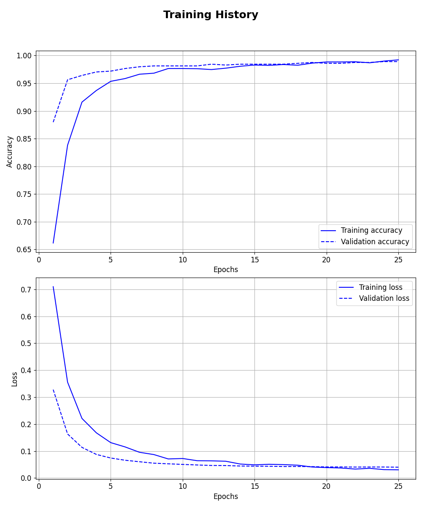

### Detailed Report of Test Set:

|              | precision    | recall       | f1-score     | support      |
| ------------ | ------------ | ------------ | ------------ | ------------ |
| chihuahua    | 0.9854       | 0.9895       | 0.9874       | 477          | 
| muffin       | 0.9879       | 0.9832       | 0.9855       | 416          | 
| micro avg    | 0.9866       | 0.9866       | 0.9866       | 893          | 
| macro avg    | 0.9867       | 0.9863       | 0.9865       | 893          | 
| weighted avg | 0.9866       | 0.9866       | 0.9866       | 893          | 
| samples avg  | 0.9866       | 0.9866       | 0.9866       | 893          | 

## trial_79

*    *Start Time*: 2024-10-23 08:51:51

*    *Duration*: 21.206

*    *Directory*: [Link](./trial_79)

### Hyperparameters:

| Hyperparameter         | Value                  |
| ---------------------- | ---------------------- |
| dense_units            | 512                    |
| dropout_rate           | 0.2290329227560618     |
| learning_rate          | 2.2220489627034217e-05 |

### Evaluation Metrics:

|           | train     | val       | test      |
| --------- | --------- | --------- | --------- |
| accuracy  | 0.9975    | 0.9891    | 0.9866    | 
| precision | 0.9975    | 0.9891    | 0.9866    | 
| recall    | 0.9975    | 0.9891    | 0.9866    | 
| f1        | 0.9975    | 0.9891    | 0.9866    | 

### Figures:

### Detailed Report of Test Set:

|              | precision    | recall       | f1-score     | support      |
| ------------ | ------------ | ------------ | ------------ | ------------ |
| chihuahua    | 0.9874       | 0.9874       | 0.9874       | 477          | 
| muffin       | 0.9856       | 0.9856       | 0.9856       | 416          | 
| micro avg    | 0.9866       | 0.9866       | 0.9866       | 893          | 
| macro avg    | 0.9865       | 0.9865       | 0.9865       | 893          | 
| weighted avg | 0.9866       | 0.9866       | 0.9866       | 893          | 
| samples avg  | 0.9866       | 0.9866       | 0.9866       | 893          | 

## trial_82

*    *Start Time*: 2024-10-23 08:53:01

*    *Duration*: 20.728

*    *Directory*: [Link](./trial_82)

### Hyperparameters:

| Hyperparameter         | Value                  |
| ---------------------- | ---------------------- |
| dense_units            | 512                    |
| dropout_rate           | 0.45955507713388793    |
| learning_rate          | 5.1543911055239724e-05 |

### Evaluation Metrics:

|           | train     | val       | test      |
| --------- | --------- | --------- | --------- |
| accuracy  | 0.9997    | 0.9891    | 0.9866    | 
| precision | 0.9997    | 0.9891    | 0.9866    | 
| recall    | 0.9997    | 0.9891    | 0.9866    | 
| f1        | 0.9997    | 0.9891    | 0.9866    | 

### Figures:

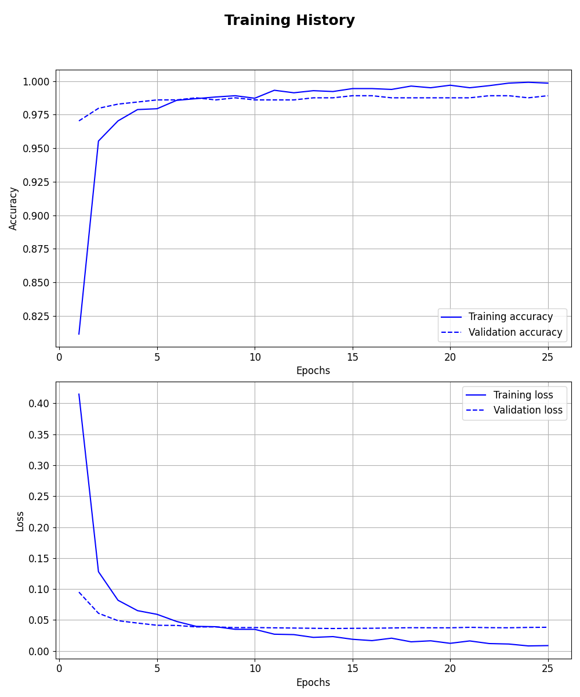

### Detailed Report of Test Set:

|              | precision    | recall       | f1-score     | support      |
| ------------ | ------------ | ------------ | ------------ | ------------ |
| chihuahua    | 0.9854       | 0.9895       | 0.9874       | 477          | 
| muffin       | 0.9879       | 0.9832       | 0.9855       | 416          | 
| micro avg    | 0.9866       | 0.9866       | 0.9866       | 893          | 
| macro avg    | 0.9867       | 0.9863       | 0.9865       | 893          | 
| weighted avg | 0.9866       | 0.9866       | 0.9866       | 893          | 
| samples avg  | 0.9866       | 0.9866       | 0.9866       | 893          | 

## trial_84

*    *Start Time*: 2024-10-23 08:53:48

*    *Duration*: 21.206

*    *Directory*: [Link](./trial_84)

### Hyperparameters:

| Hyperparameter        | Value                 |
| --------------------- | --------------------- |
| dense_units           | 512                   |
| dropout_rate          | 0.4149387707870665    |
| learning_rate         | 8.553330943422604e-05 |

### Evaluation Metrics:

|           | train     | val       | test      |
| --------- | --------- | --------- | --------- |
| accuracy  | 1.0000    | 0.9906    | 0.9866    | 
| precision | 1.0000    | 0.9906    | 0.9866    | 
| recall    | 1.0000    | 0.9906    | 0.9866    | 
| f1        | 1.0000    | 0.9906    | 0.9866    | 

### Figures:

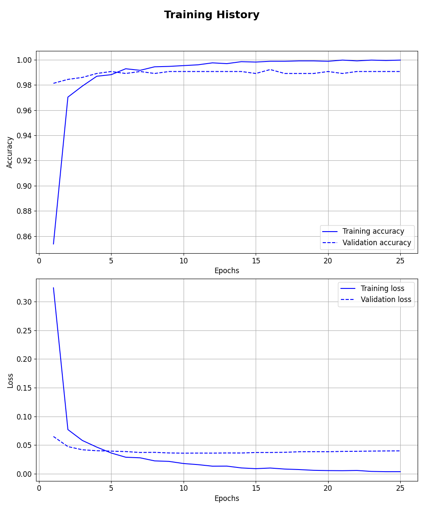

### Detailed Report of Test Set:

|              | precision    | recall       | f1-score     | support      |
| ------------ | ------------ | ------------ | ------------ | ------------ |
| chihuahua    | 0.9854       | 0.9895       | 0.9874       | 477          | 
| muffin       | 0.9879       | 0.9832       | 0.9855       | 416          | 
| micro avg    | 0.9866       | 0.9866       | 0.9866       | 893          | 
| macro avg    | 0.9867       | 0.9863       | 0.9865       | 893          | 
| weighted avg | 0.9866       | 0.9866       | 0.9866       | 893          | 
| samples avg  | 0.9866       | 0.9866       | 0.9866       | 893          | 

## trial_86

*    *Start Time*: 2024-10-23 08:54:35

*    *Duration*: 21.263

*    *Directory*: [Link](./trial_86)

### Hyperparameters:

| Hyperparameter         | Value                  |
| ---------------------- | ---------------------- |
| dense_units            | 512                    |
| dropout_rate           | 0.46470019053602923    |
| learning_rate          | 5.6657742801569646e-05 |

### Evaluation Metrics:

|           | train     | val       | test      |
| --------- | --------- | --------- | --------- |
| accuracy  | 0.9997    | 0.9922    | 0.9866    | 
| precision | 0.9997    | 0.9922    | 0.9866    | 
| recall    | 0.9997    | 0.9922    | 0.9866    | 
| f1        | 0.9997    | 0.9922    | 0.9866    | 

### Figures:

### Detailed Report of Test Set:

|              | precision    | recall       | f1-score     | support      |
| ------------ | ------------ | ------------ | ------------ | ------------ |
| chihuahua    | 0.9854       | 0.9895       | 0.9874       | 477          | 
| muffin       | 0.9879       | 0.9832       | 0.9855       | 416          | 
| micro avg    | 0.9866       | 0.9866       | 0.9866       | 893          | 
| macro avg    | 0.9867       | 0.9863       | 0.9865       | 893          | 
| weighted avg | 0.9866       | 0.9866       | 0.9866       | 893          | 
| samples avg  | 0.9866       | 0.9866       | 0.9866       | 893          | 

## trial_95

*    *Start Time*: 2024-10-23 08:58:08

*    *Duration*: 21.299

*    *Directory*: [Link](./trial_95)

### Hyperparameters:

| Hyperparameter       | Value                |
| -------------------- | -------------------- |
| dense_units          | 256                  |
| dropout_rate         | 0.34298465091440145  |
| learning_rate        | 4.81166016688479e-05 |

### Evaluation Metrics:

|           | train     | val       | test      |
| --------- | --------- | --------- | --------- |
| accuracy  | 0.9994    | 0.9891    | 0.9866    | 
| precision | 0.9994    | 0.9891    | 0.9866    | 
| recall    | 0.9994    | 0.9891    | 0.9866    | 
| f1        | 0.9994    | 0.9891    | 0.9866    | 

### Figures:

### Detailed Report of Test Set:

|              | precision    | recall       | f1-score     | support      |
| ------------ | ------------ | ------------ | ------------ | ------------ |
| chihuahua    | 0.9814       | 0.9937       | 0.9875       | 477          | 
| muffin       | 0.9927       | 0.9784       | 0.9855       | 416          | 
| micro avg    | 0.9866       | 0.9866       | 0.9866       | 893          | 
| macro avg    | 0.9870       | 0.9860       | 0.9865       | 893          | 
| weighted avg | 0.9866       | 0.9866       | 0.9866       | 893          | 
| samples avg  | 0.9866       | 0.9866       | 0.9866       | 893          | 

## trial_98

*    *Start Time*: 2024-10-23 08:59:20

*    *Duration*: 21.146

*    *Directory*: [Link](./trial_98)

### Hyperparameters:

| Hyperparameter        | Value                 |
| --------------------- | --------------------- |
| dense_units           | 512                   |
| dropout_rate          | 0.46773348294272665   |
| learning_rate         | 4.419328732857195e-05 |

### Evaluation Metrics:

|           | train     | val       | test      |
| --------- | --------- | --------- | --------- |
| accuracy  | 0.9994    | 0.9875    | 0.9866    | 
| precision | 0.9994    | 0.9875    | 0.9866    | 
| recall    | 0.9994    | 0.9875    | 0.9866    | 
| f1        | 0.9994    | 0.9875    | 0.9866    | 

### Figures:

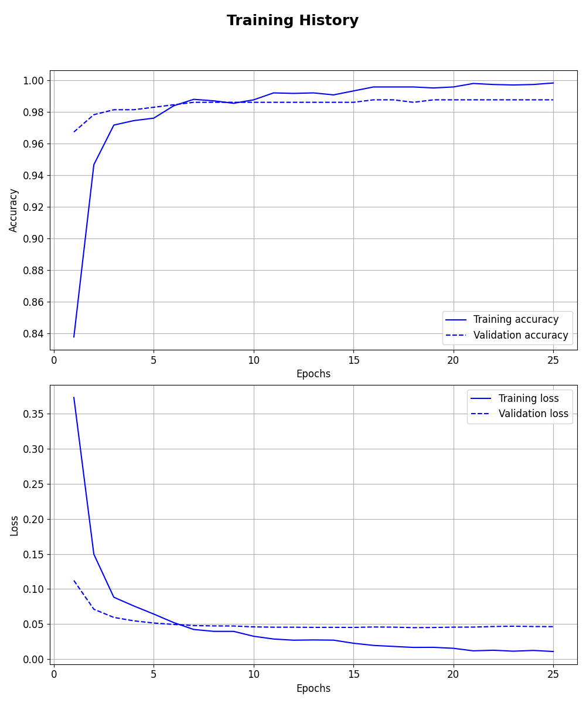

### Detailed Report of Test Set:

|              | precision    | recall       | f1-score     | support      |
| ------------ | ------------ | ------------ | ------------ | ------------ |
| chihuahua    | 0.9854       | 0.9895       | 0.9874       | 477          | 
| muffin       | 0.9879       | 0.9832       | 0.9855       | 416          | 
| micro avg    | 0.9866       | 0.9866       | 0.9866       | 893          | 
| macro avg    | 0.9867       | 0.9863       | 0.9865       | 893          | 
| weighted avg | 0.9866       | 0.9866       | 0.9866       | 893          | 
| samples avg  | 0.9866       | 0.9866       | 0.9866       | 893          | 

## trial_13

*    *Start Time*: 2024-10-23 08:26:43

*    *Duration*: 21.864

*    *Directory*: [Link](./trial_13)

### Hyperparameters:

| Hyperparameter        | Value                 |
| --------------------- | --------------------- |
| dense_units           | 256                   |
| dropout_rate          | 0.49252397089297045   |
| learning_rate         | 4.647064078616779e-05 |

### Evaluation Metrics:

|           | train     | val       | test      |
| --------- | --------- | --------- | --------- |
| accuracy  | 0.9991    | 0.9891    | 0.9854    | 
| precision | 0.9991    | 0.9891    | 0.9854    | 
| recall    | 0.9991    | 0.9891    | 0.9854    | 
| f1        | 0.9991    | 0.9891    | 0.9854    | 

### Figures:

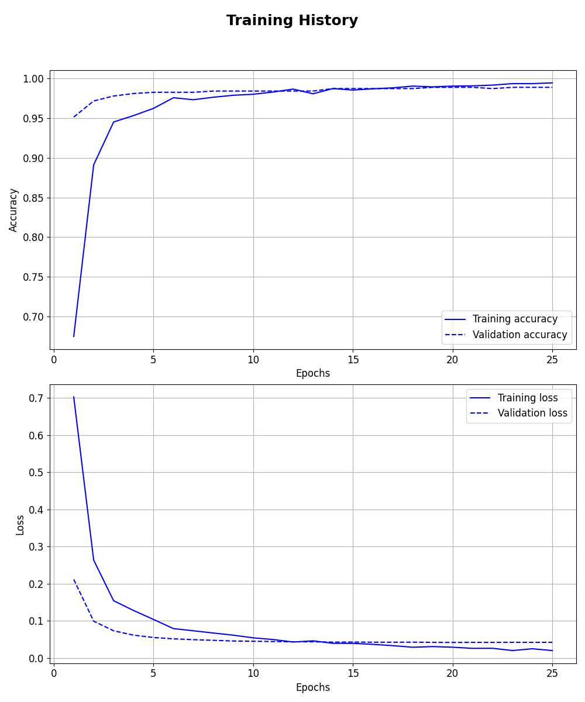

### Detailed Report of Test Set:

|              | precision    | recall       | f1-score     | support      |
| ------------ | ------------ | ------------ | ------------ | ------------ |
| chihuahua    | 0.9813       | 0.9916       | 0.9864       | 477          | 
| muffin       | 0.9903       | 0.9784       | 0.9843       | 416          | 
| micro avg    | 0.9854       | 0.9854       | 0.9854       | 893          | 
| macro avg    | 0.9858       | 0.9850       | 0.9854       | 893          | 
| weighted avg | 0.9855       | 0.9854       | 0.9854       | 893          | 
| samples avg  | 0.9854       | 0.9854       | 0.9854       | 893          | 

## trial_23

*    *Start Time*: 2024-10-23 08:30:32

*    *Duration*: 21.975

*    *Directory*: [Link](./trial_23)

### Hyperparameters:

| Hyperparameter         | Value                  |
| ---------------------- | ---------------------- |
| dense_units            | 512                    |
| dropout_rate           | 0.4549081297169313     |
| learning_rate          | 1.6902568080827105e-05 |

### Evaluation Metrics:

|           | train     | val       | test      |
| --------- | --------- | --------- | --------- |
| accuracy  | 0.9947    | 0.9875    | 0.9854    | 
| precision | 0.9947    | 0.9875    | 0.9854    | 
| recall    | 0.9947    | 0.9875    | 0.9854    | 
| f1        | 0.9947    | 0.9875    | 0.9854    | 

### Figures:

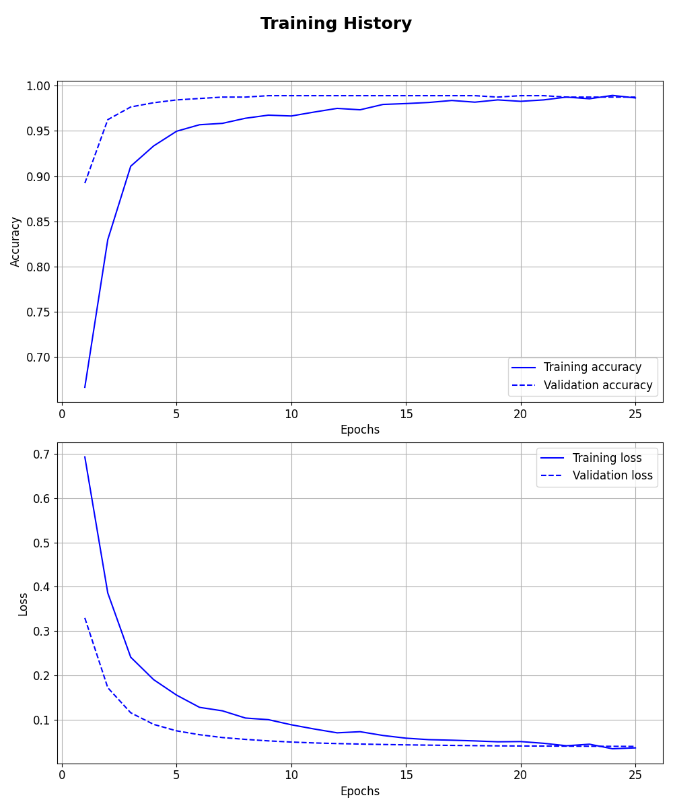

### Detailed Report of Test Set:

|              | precision    | recall       | f1-score     | support      |
| ------------ | ------------ | ------------ | ------------ | ------------ |
| chihuahua    | 0.9813       | 0.9916       | 0.9864       | 477          | 
| muffin       | 0.9903       | 0.9784       | 0.9843       | 416          | 
| micro avg    | 0.9854       | 0.9854       | 0.9854       | 893          | 
| macro avg    | 0.9858       | 0.9850       | 0.9854       | 893          | 
| weighted avg | 0.9855       | 0.9854       | 0.9854       | 893          | 
| samples avg  | 0.9854       | 0.9854       | 0.9854       | 893          | 

## trial_24

*    *Start Time*: 2024-10-23 08:30:55

*    *Duration*: 21.896

*    *Directory*: [Link](./trial_24)

### Hyperparameters:

| Hyperparameter        | Value                 |
| --------------------- | --------------------- |
| dense_units           | 512                   |
| dropout_rate          | 0.49878765733810654   |
| learning_rate         | 3.952030104345121e-05 |

### Evaluation Metrics:

|           | train     | val       | test      |
| --------- | --------- | --------- | --------- |
| accuracy  | 0.9994    | 0.9906    | 0.9854    | 
| precision | 0.9994    | 0.9906    | 0.9854    | 
| recall    | 0.9994    | 0.9906    | 0.9854    | 
| f1        | 0.9994    | 0.9906    | 0.9854    | 

### Figures:

### Detailed Report of Test Set:

|              | precision    | recall       | f1-score     | support      |
| ------------ | ------------ | ------------ | ------------ | ------------ |
| chihuahua    | 0.9833       | 0.9895       | 0.9864       | 477          | 
| muffin       | 0.9879       | 0.9808       | 0.9843       | 416          | 
| micro avg    | 0.9854       | 0.9854       | 0.9854       | 893          | 
| macro avg    | 0.9856       | 0.9851       | 0.9854       | 893          | 
| weighted avg | 0.9855       | 0.9854       | 0.9854       | 893          | 
| samples avg  | 0.9854       | 0.9854       | 0.9854       | 893          | 

## trial_27

*    *Start Time*: 2024-10-23 08:32:04

*    *Duration*: 21.989

*    *Directory*: [Link](./trial_27)

### Hyperparameters:

| Hyperparameter        | Value                 |
| --------------------- | --------------------- |
| dense_units           | 512                   |
| dropout_rate          | 0.30477403789907076   |
| learning_rate         | 2.318374365780824e-05 |

### Evaluation Metrics:

|           | train     | val       | test      |
| --------- | --------- | --------- | --------- |
| accuracy  | 0.9991    | 0.9891    | 0.9854    | 
| precision | 0.9991    | 0.9891    | 0.9854    | 
| recall    | 0.9991    | 0.9891    | 0.9854    | 
| f1        | 0.9991    | 0.9891    | 0.9854    | 

### Figures:

### Detailed Report of Test Set:

|              | precision    | recall       | f1-score     | support      |
| ------------ | ------------ | ------------ | ------------ | ------------ |
| chihuahua    | 0.9833       | 0.9895       | 0.9864       | 477          | 
| muffin       | 0.9879       | 0.9808       | 0.9843       | 416          | 
| micro avg    | 0.9854       | 0.9854       | 0.9854       | 893          | 
| macro avg    | 0.9856       | 0.9851       | 0.9854       | 893          | 
| weighted avg | 0.9855       | 0.9854       | 0.9854       | 893          | 
| samples avg  | 0.9854       | 0.9854       | 0.9854       | 893          | 

## trial_29

*    *Start Time*: 2024-10-23 08:32:49

*    *Duration*: 22.463

*    *Directory*: [Link](./trial_29)

### Hyperparameters:

| Hyperparameter         | Value                  |
| ---------------------- | ---------------------- |
| dense_units            | 512                    |
| dropout_rate           | 0.46173954185919874    |
| learning_rate          | 3.6306078734837315e-05 |

### Evaluation Metrics:

|           | train     | val       | test      |
| --------- | --------- | --------- | --------- |
| accuracy  | 0.9994    | 0.9891    | 0.9854    | 
| precision | 0.9994    | 0.9891    | 0.9854    | 
| recall    | 0.9994    | 0.9891    | 0.9854    | 
| f1        | 0.9994    | 0.9891    | 0.9854    | 

### Figures:

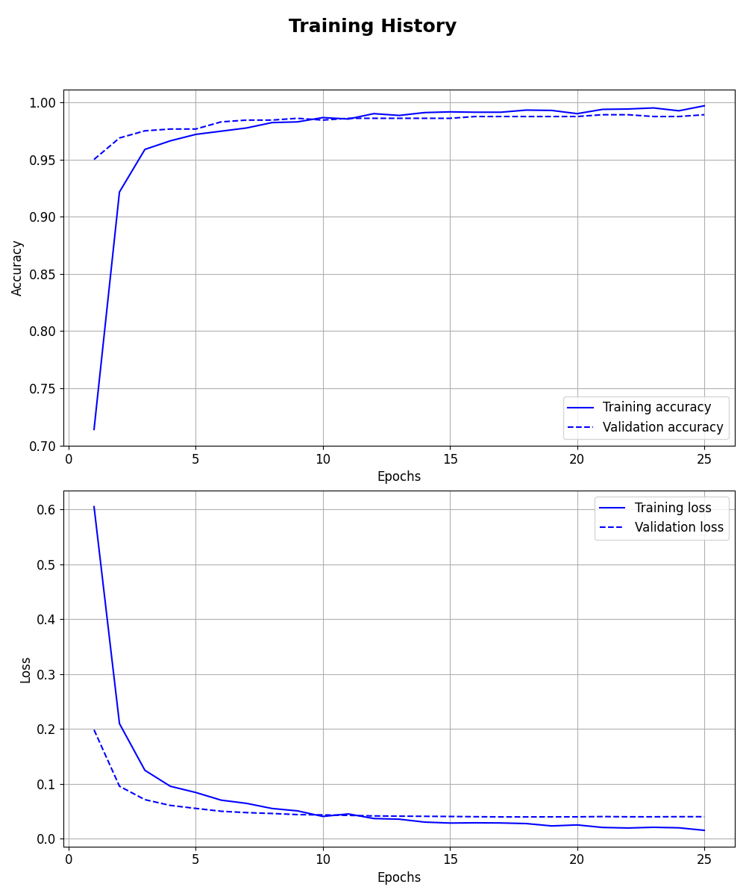

### Detailed Report of Test Set:

|              | precision    | recall       | f1-score     | support      |
| ------------ | ------------ | ------------ | ------------ | ------------ |
| chihuahua    | 0.9833       | 0.9895       | 0.9864       | 477          | 
| muffin       | 0.9879       | 0.9808       | 0.9843       | 416          | 
| micro avg    | 0.9854       | 0.9854       | 0.9854       | 893          | 
| macro avg    | 0.9856       | 0.9851       | 0.9854       | 893          | 
| weighted avg | 0.9855       | 0.9854       | 0.9854       | 893          | 
| samples avg  | 0.9854       | 0.9854       | 0.9854       | 893          | 

## trial_30

*    *Start Time*: 2024-10-23 08:33:13

*    *Duration*: 22.129

*    *Directory*: [Link](./trial_30)

### Hyperparameters:

| Hyperparameter        | Value                 |
| --------------------- | --------------------- |
| dense_units           | 512                   |
| dropout_rate          | 0.24587512950015097   |
| learning_rate         | 6.488483616352618e-05 |

### Evaluation Metrics:

|           | train     | val       | test      |
| --------- | --------- | --------- | --------- |
| accuracy  | 1.0000    | 0.9906    | 0.9854    | 
| precision | 1.0000    | 0.9906    | 0.9854    | 
| recall    | 1.0000    | 0.9906    | 0.9854    | 
| f1        | 1.0000    | 0.9906    | 0.9854    | 

### Figures:

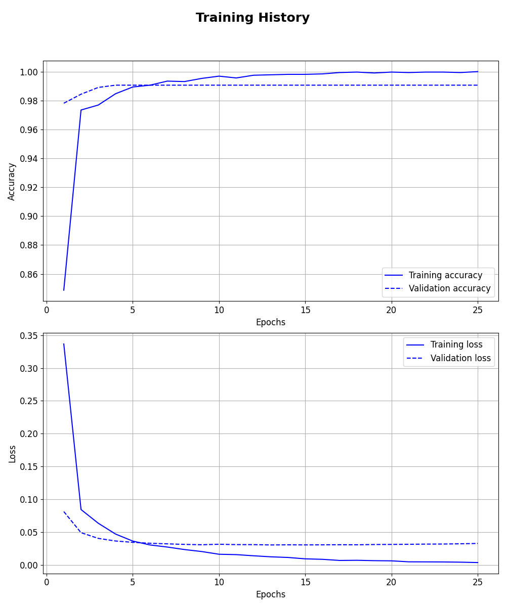

### Detailed Report of Test Set:

|              | precision    | recall       | f1-score     | support      |
| ------------ | ------------ | ------------ | ------------ | ------------ |
| chihuahua    | 0.9833       | 0.9895       | 0.9864       | 477          | 
| muffin       | 0.9879       | 0.9808       | 0.9843       | 416          | 
| micro avg    | 0.9854       | 0.9854       | 0.9854       | 893          | 
| macro avg    | 0.9856       | 0.9851       | 0.9854       | 893          | 
| weighted avg | 0.9855       | 0.9854       | 0.9854       | 893          | 
| samples avg  | 0.9854       | 0.9854       | 0.9854       | 893          | 

## trial_45

*    *Start Time*: 2024-10-23 08:38:52

*    *Duration*: 20.788

*    *Directory*: [Link](./trial_45)

### Hyperparameters:

| Hyperparameter        | Value                 |
| --------------------- | --------------------- |
| dense_units           | 512                   |
| dropout_rate          | 0.39540503612922046   |
| learning_rate         | 3.600985307344948e-05 |

### Evaluation Metrics:

|           | train     | val       | test      |
| --------- | --------- | --------- | --------- |
| accuracy  | 0.9994    | 0.9891    | 0.9854    | 
| precision | 0.9994    | 0.9891    | 0.9854    | 
| recall    | 0.9994    | 0.9891    | 0.9854    | 
| f1        | 0.9994    | 0.9891    | 0.9854    | 

### Figures:

### Detailed Report of Test Set:

|              | precision    | recall       | f1-score     | support      |
| ------------ | ------------ | ------------ | ------------ | ------------ |
| chihuahua    | 0.9833       | 0.9895       | 0.9864       | 477          | 
| muffin       | 0.9879       | 0.9808       | 0.9843       | 416          | 
| micro avg    | 0.9854       | 0.9854       | 0.9854       | 893          | 
| macro avg    | 0.9856       | 0.9851       | 0.9854       | 893          | 
| weighted avg | 0.9855       | 0.9854       | 0.9854       | 893          | 
| samples avg  | 0.9854       | 0.9854       | 0.9854       | 893          | 

## trial_53

*    *Start Time*: 2024-10-23 08:41:53

*    *Duration*: 20.874

*    *Directory*: [Link](./trial_53)

### Hyperparameters:

| Hyperparameter        | Value                 |
| --------------------- | --------------------- |
| dense_units           | 256                   |
| dropout_rate          | 0.42479549383515847   |
| learning_rate         | 4.627558308920554e-05 |

### Evaluation Metrics:

|           | train     | val       | test      |
| --------- | --------- | --------- | --------- |
| accuracy  | 0.9981    | 0.9891    | 0.9854    | 
| precision | 0.9981    | 0.9891    | 0.9854    | 
| recall    | 0.9981    | 0.9891    | 0.9854    | 
| f1        | 0.9981    | 0.9891    | 0.9854    | 

### Figures:

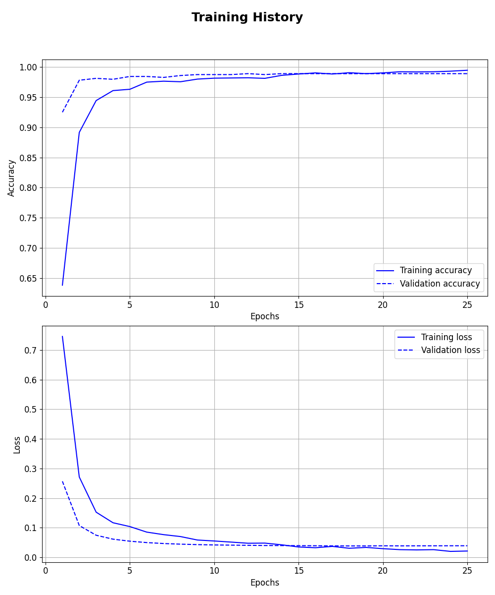

### Detailed Report of Test Set:

|              | precision    | recall       | f1-score     | support      |
| ------------ | ------------ | ------------ | ------------ | ------------ |
| chihuahua    | 0.9833       | 0.9895       | 0.9864       | 477          | 
| muffin       | 0.9879       | 0.9808       | 0.9843       | 416          | 
| micro avg    | 0.9854       | 0.9854       | 0.9854       | 893          | 
| macro avg    | 0.9856       | 0.9851       | 0.9854       | 893          | 
| weighted avg | 0.9855       | 0.9854       | 0.9854       | 893          | 
| samples avg  | 0.9854       | 0.9854       | 0.9854       | 893          | 

## trial_58

*    *Start Time*: 2024-10-23 08:43:47

*    *Duration*: 21.290

*    *Directory*: [Link](./trial_58)

### Hyperparameters:

| Hyperparameter         | Value                  |
| ---------------------- | ---------------------- |
| dense_units            | 256                    |
| dropout_rate           | 0.4090904234949702     |
| learning_rate          | 4.9584634639340204e-05 |

### Evaluation Metrics:

|           | train     | val       | test      |
| --------- | --------- | --------- | --------- |
| accuracy  | 0.9997    | 0.9891    | 0.9854    | 
| precision | 0.9997    | 0.9891    | 0.9854    | 
| recall    | 0.9997    | 0.9891    | 0.9854    | 
| f1        | 0.9997    | 0.9891    | 0.9854    | 

### Figures:

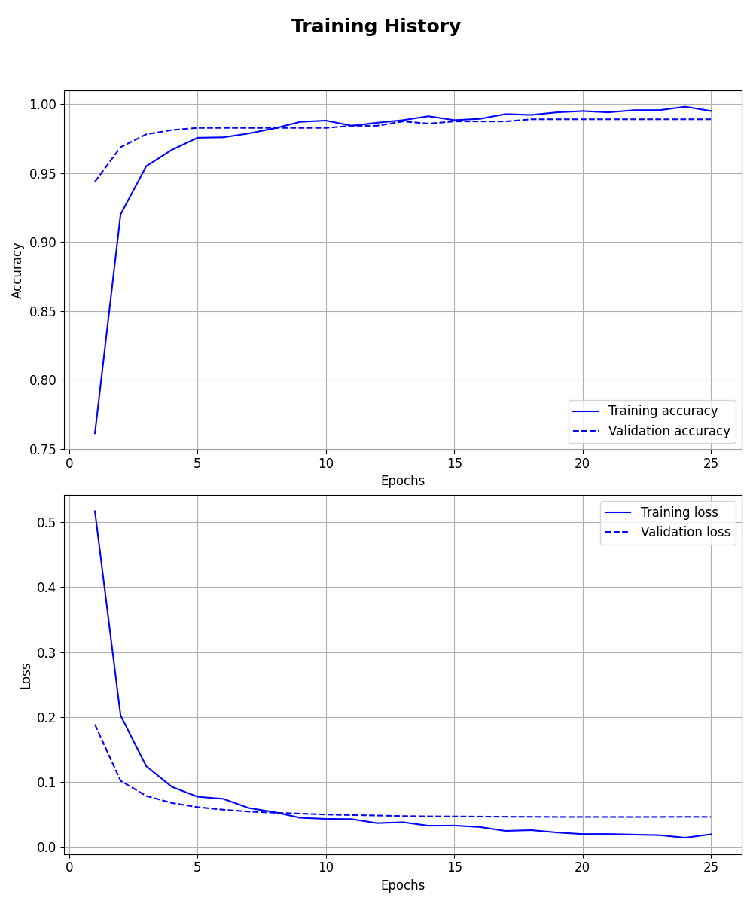

### Detailed Report of Test Set:

|              | precision    | recall       | f1-score     | support      |
| ------------ | ------------ | ------------ | ------------ | ------------ |
| chihuahua    | 0.9833       | 0.9895       | 0.9864       | 477          | 
| muffin       | 0.9879       | 0.9808       | 0.9843       | 416          | 
| micro avg    | 0.9854       | 0.9854       | 0.9854       | 893          | 
| macro avg    | 0.9856       | 0.9851       | 0.9854       | 893          | 
| weighted avg | 0.9855       | 0.9854       | 0.9854       | 893          | 
| samples avg  | 0.9854       | 0.9854       | 0.9854       | 893          | 

## trial_72

*    *Start Time*: 2024-10-23 08:49:09

*    *Duration*: 20.680

*    *Directory*: [Link](./trial_72)

### Hyperparameters:

| Hyperparameter         | Value                  |
| ---------------------- | ---------------------- |
| dense_units            | 512                    |
| dropout_rate           | 0.34490183168503535    |
| learning_rate          | 3.1388262919109246e-05 |

### Evaluation Metrics:

|           | train     | val       | test      |
| --------- | --------- | --------- | --------- |
| accuracy  | 0.9994    | 0.9906    | 0.9854    | 
| precision | 0.9994    | 0.9906    | 0.9854    | 
| recall    | 0.9994    | 0.9906    | 0.9854    | 
| f1        | 0.9994    | 0.9906    | 0.9854    | 

### Figures:

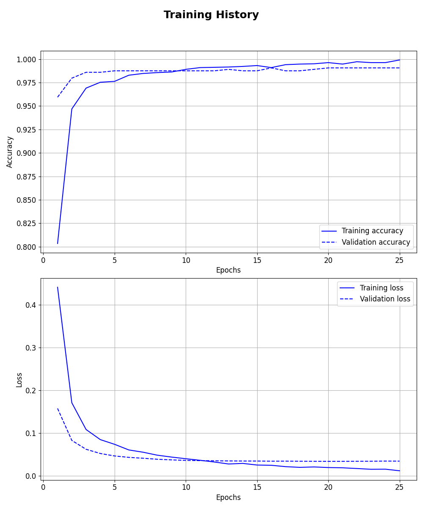

### Detailed Report of Test Set:

|              | precision    | recall       | f1-score     | support      |
| ------------ | ------------ | ------------ | ------------ | ------------ |
| chihuahua    | 0.9813       | 0.9916       | 0.9864       | 477          | 
| muffin       | 0.9903       | 0.9784       | 0.9843       | 416          | 
| micro avg    | 0.9854       | 0.9854       | 0.9854       | 893          | 
| macro avg    | 0.9858       | 0.9850       | 0.9854       | 893          | 
| weighted avg | 0.9855       | 0.9854       | 0.9854       | 893          | 
| samples avg  | 0.9854       | 0.9854       | 0.9854       | 893          | 

## trial_75

*    *Start Time*: 2024-10-23 08:50:18

*    *Duration*: 21.284

*    *Directory*: [Link](./trial_75)

### Hyperparameters:

| Hyperparameter         | Value                  |
| ---------------------- | ---------------------- |
| dense_units            | 512                    |
| dropout_rate           | 0.3819852054237187     |
| learning_rate          | 2.4418983769808748e-05 |

### Evaluation Metrics:

|           | train     | val       | test      |
| --------- | --------- | --------- | --------- |
| accuracy  | 0.9978    | 0.9875    | 0.9854    | 
| precision | 0.9978    | 0.9875    | 0.9854    | 
| recall    | 0.9978    | 0.9875    | 0.9854    | 
| f1        | 0.9978    | 0.9875    | 0.9854    | 

### Figures:

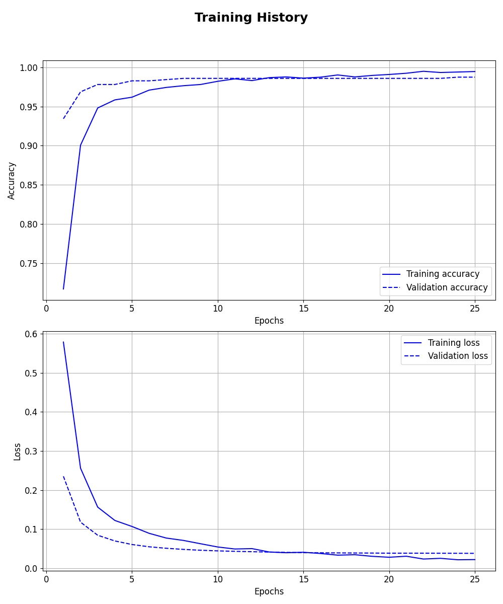

### Detailed Report of Test Set:

|              | precision    | recall       | f1-score     | support      |
| ------------ | ------------ | ------------ | ------------ | ------------ |
| chihuahua    | 0.9854       | 0.9874       | 0.9864       | 477          | 
| muffin       | 0.9855       | 0.9832       | 0.9844       | 416          | 
| micro avg    | 0.9854       | 0.9854       | 0.9854       | 893          | 
| macro avg    | 0.9854       | 0.9853       | 0.9854       | 893          | 
| weighted avg | 0.9854       | 0.9854       | 0.9854       | 893          | 
| samples avg  | 0.9854       | 0.9854       | 0.9854       | 893          | 

## trial_83

*    *Start Time*: 2024-10-23 08:53:24

*    *Duration*: 20.981

*    *Directory*: [Link](./trial_83)

### Hyperparameters:

| Hyperparameter        | Value                 |
| --------------------- | --------------------- |
| dense_units           | 512                   |
| dropout_rate          | 0.43230926153980137   |
| learning_rate         | 6.986509072830372e-05 |

### Evaluation Metrics:

|           | train     | val       | test      |
| --------- | --------- | --------- | --------- |
| accuracy  | 1.0000    | 0.9875    | 0.9854    | 
| precision | 1.0000    | 0.9875    | 0.9854    | 
| recall    | 1.0000    | 0.9875    | 0.9854    | 
| f1        | 1.0000    | 0.9875    | 0.9854    | 

### Figures:

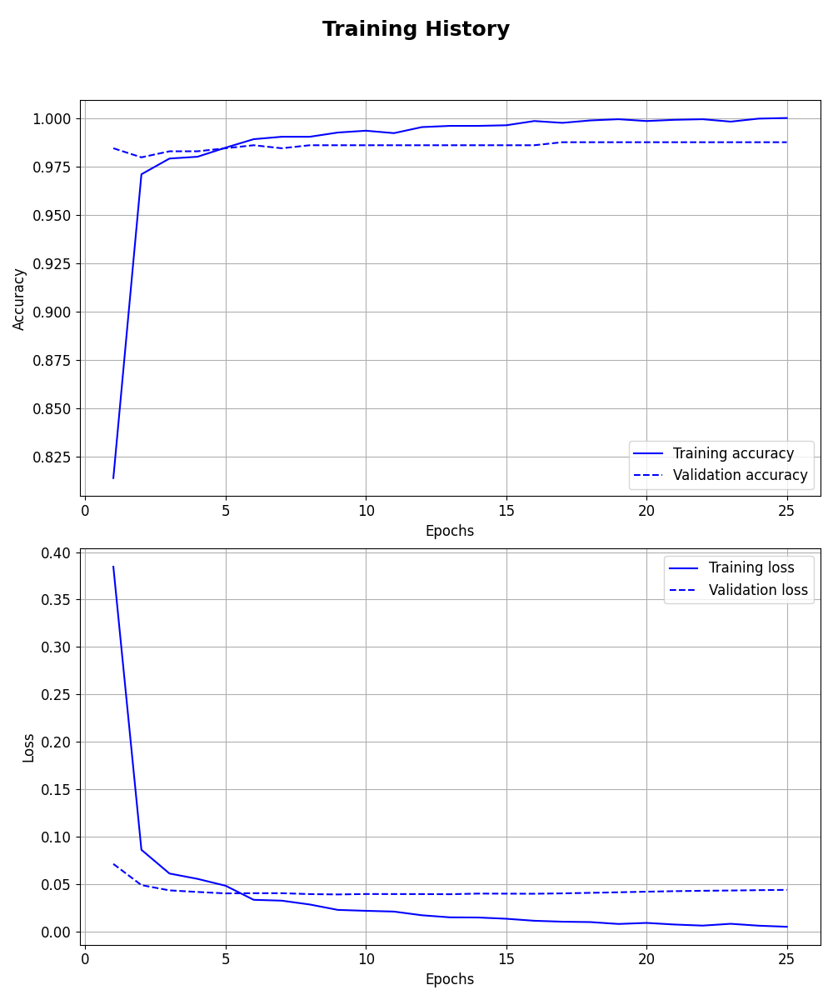

### Detailed Report of Test Set:

|              | precision    | recall       | f1-score     | support      |
| ------------ | ------------ | ------------ | ------------ | ------------ |
| chihuahua    | 0.9833       | 0.9895       | 0.9864       | 477          | 
| muffin       | 0.9879       | 0.9808       | 0.9843       | 416          | 
| micro avg    | 0.9854       | 0.9854       | 0.9854       | 893          | 
| macro avg    | 0.9856       | 0.9851       | 0.9854       | 893          | 
| weighted avg | 0.9855       | 0.9854       | 0.9854       | 893          | 
| samples avg  | 0.9854       | 0.9854       | 0.9854       | 893          | 

## trial_87

*    *Start Time*: 2024-10-23 08:54:58

*    *Duration*: 21.312

*    *Directory*: [Link](./trial_87)

### Hyperparameters:

| Hyperparameter         | Value                  |
| ---------------------- | ---------------------- |
| dense_units            | 512                    |
| dropout_rate           | 0.3099414236402392     |
| learning_rate          | 5.6630939847702524e-05 |

### Evaluation Metrics:

|           | train     | val       | test      |
| --------- | --------- | --------- | --------- |
| accuracy  | 1.0000    | 0.9891    | 0.9854    | 
| precision | 1.0000    | 0.9891    | 0.9854    | 
| recall    | 1.0000    | 0.9891    | 0.9854    | 
| f1        | 1.0000    | 0.9891    | 0.9854    | 

### Figures:

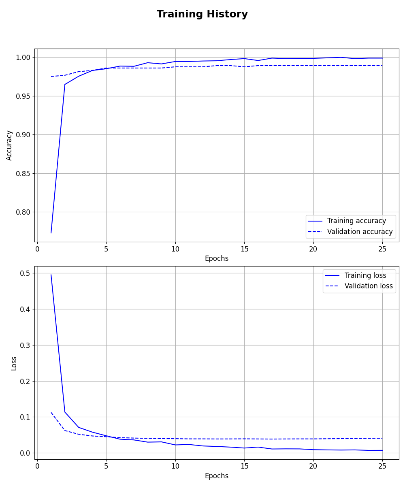

### Detailed Report of Test Set:

|              | precision    | recall       | f1-score     | support      |
| ------------ | ------------ | ------------ | ------------ | ------------ |
| chihuahua    | 0.9833       | 0.9895       | 0.9864       | 477          | 
| muffin       | 0.9879       | 0.9808       | 0.9843       | 416          | 
| micro avg    | 0.9854       | 0.9854       | 0.9854       | 893          | 
| macro avg    | 0.9856       | 0.9851       | 0.9854       | 893          | 
| weighted avg | 0.9855       | 0.9854       | 0.9854       | 893          | 
| samples avg  | 0.9854       | 0.9854       | 0.9854       | 893          | 

## trial_97

*    *Start Time*: 2024-10-23 08:58:56

*    *Duration*: 21.574

*    *Directory*: [Link](./trial_97)

### Hyperparameters:

| Hyperparameter        | Value                 |
| --------------------- | --------------------- |
| dense_units           | 256                   |
| dropout_rate          | 0.40308957002035894   |
| learning_rate         | 5.290346177015095e-05 |

### Evaluation Metrics:

|           | train     | val       | test      |
| --------- | --------- | --------- | --------- |
| accuracy  | 0.9994    | 0.9875    | 0.9854    | 
| precision | 0.9994    | 0.9875    | 0.9854    | 
| recall    | 0.9994    | 0.9875    | 0.9854    | 
| f1        | 0.9994    | 0.9875    | 0.9854    | 

### Figures:

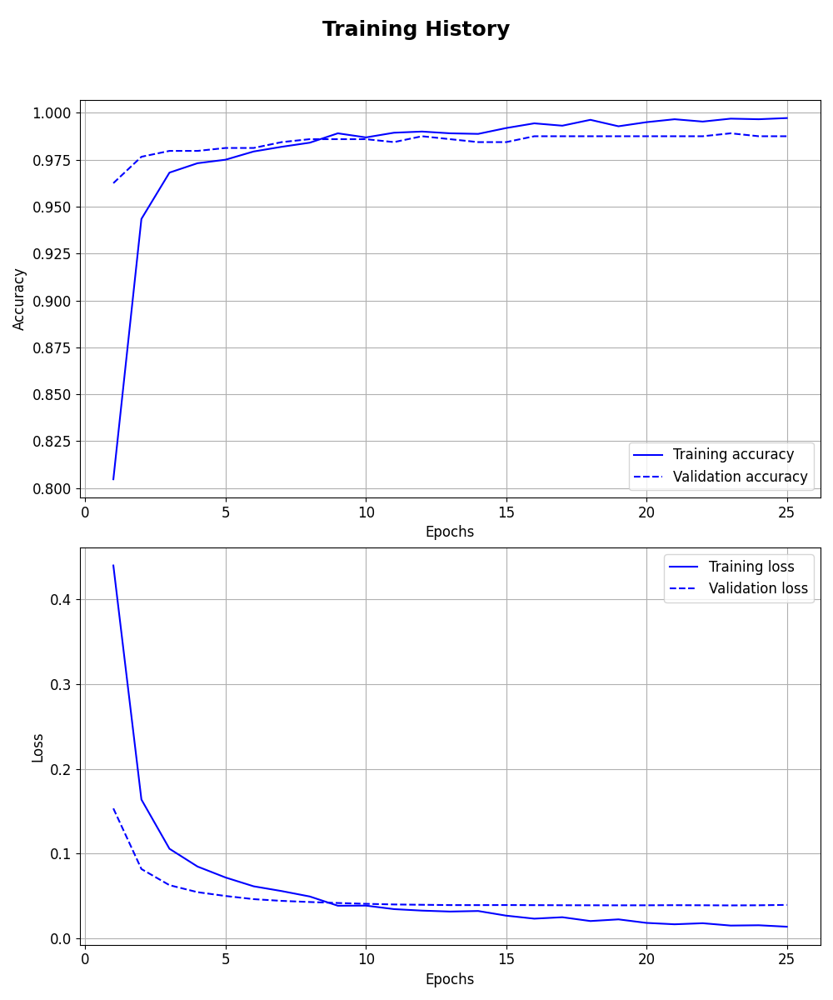

### Detailed Report of Test Set:

|              | precision    | recall       | f1-score     | support      |
| ------------ | ------------ | ------------ | ------------ | ------------ |
| chihuahua    | 0.9813       | 0.9916       | 0.9864       | 477          | 
| muffin       | 0.9903       | 0.9784       | 0.9843       | 416          | 
| micro avg    | 0.9854       | 0.9854       | 0.9854       | 893          | 
| macro avg    | 0.9858       | 0.9850       | 0.9854       | 893          | 
| weighted avg | 0.9855       | 0.9854       | 0.9854       | 893          | 
| samples avg  | 0.9854       | 0.9854       | 0.9854       | 893          | 

## trial_99

*    *Start Time*: 2024-10-23 08:59:44

*    *Duration*: 20.928

*    *Directory*: [Link](./trial_99)

### Hyperparameters:

| Hyperparameter         | Value                  |
| ---------------------- | ---------------------- |
| dense_units            | 512                    |
| dropout_rate           | 0.175252793639213      |
| learning_rate          | 3.9522254339898235e-05 |

### Evaluation Metrics:

|           | train     | val       | test      |
| --------- | --------- | --------- | --------- |
| accuracy  | 0.9997    | 0.9891    | 0.9854    | 
| precision | 0.9997    | 0.9891    | 0.9854    | 
| recall    | 0.9997    | 0.9891    | 0.9854    | 
| f1        | 0.9997    | 0.9891    | 0.9854    | 

### Figures:

### Detailed Report of Test Set:

|              | precision    | recall       | f1-score     | support      |
| ------------ | ------------ | ------------ | ------------ | ------------ |
| chihuahua    | 0.9833       | 0.9895       | 0.9864       | 477          | 
| muffin       | 0.9879       | 0.9808       | 0.9843       | 416          | 
| micro avg    | 0.9854       | 0.9854       | 0.9854       | 893          | 
| macro avg    | 0.9856       | 0.9851       | 0.9854       | 893          | 
| weighted avg | 0.9855       | 0.9854       | 0.9854       | 893          | 
| samples avg  | 0.9854       | 0.9854       | 0.9854       | 893          | 

## trial_32

*    *Start Time*: 2024-10-23 08:33:59

*    *Duration*: 21.257

*    *Directory*: [Link](./trial_32)

### Hyperparameters:

| Hyperparameter        | Value                 |
| --------------------- | --------------------- |
| dense_units           | 512                   |
| dropout_rate          | 0.2554172602383897    |
| learning_rate         | 6.307066167514853e-05 |

### Evaluation Metrics:

|           | train     | val       | test      |
| --------- | --------- | --------- | --------- |
| accuracy  | 1.0000    | 0.9875    | 0.9843    | 
| precision | 1.0000    | 0.9875    | 0.9843    | 
| recall    | 1.0000    | 0.9875    | 0.9843    | 
| f1        | 1.0000    | 0.9875    | 0.9843    | 

### Figures:

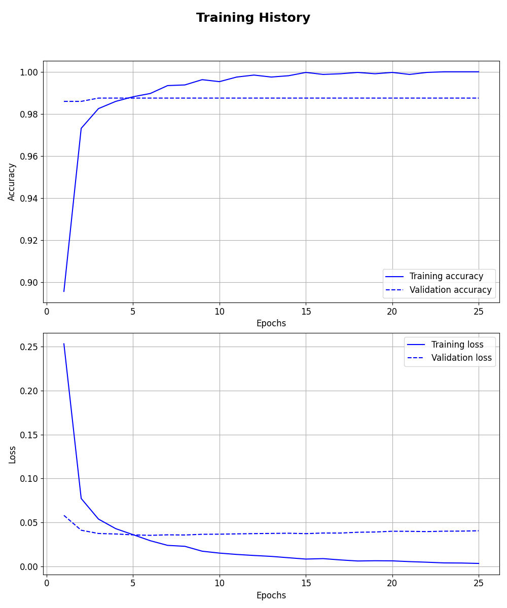

### Detailed Report of Test Set:

|              | precision    | recall       | f1-score     | support      |
| ------------ | ------------ | ------------ | ------------ | ------------ |
| chihuahua    | 0.9813       | 0.9895       | 0.9854       | 477          | 
| muffin       | 0.9879       | 0.9784       | 0.9831       | 416          | 
| micro avg    | 0.9843       | 0.9843       | 0.9843       | 893          | 
| macro avg    | 0.9846       | 0.9839       | 0.9842       | 893          | 
| weighted avg | 0.9844       | 0.9843       | 0.9843       | 893          | 
| samples avg  | 0.9843       | 0.9843       | 0.9843       | 893          | 

## trial_47

*    *Start Time*: 2024-10-23 08:39:37

*    *Duration*: 21.314

*    *Directory*: [Link](./trial_47)

### Hyperparameters:

| Hyperparameter        | Value                 |
| --------------------- | --------------------- |
| dense_units           | 512                   |
| dropout_rate          | 0.33648935595104096   |
| learning_rate         | 1.985872849744353e-05 |

### Evaluation Metrics:

|           | train     | val       | test      |
| --------- | --------- | --------- | --------- |
| accuracy  | 0.9953    | 0.9906    | 0.9843    | 
| precision | 0.9953    | 0.9906    | 0.9843    | 
| recall    | 0.9953    | 0.9906    | 0.9843    | 
| f1        | 0.9953    | 0.9906    | 0.9843    | 

### Figures:

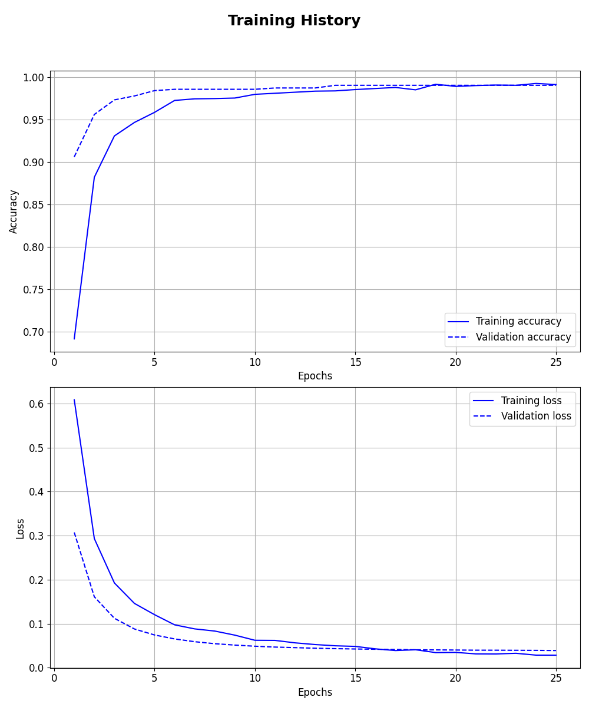

### Detailed Report of Test Set:

|              | precision    | recall       | f1-score     | support      |
| ------------ | ------------ | ------------ | ------------ | ------------ |
| chihuahua    | 0.9793       | 0.9916       | 0.9854       | 477          | 
| muffin       | 0.9902       | 0.9760       | 0.9831       | 416          | 
| micro avg    | 0.9843       | 0.9843       | 0.9843       | 893          | 
| macro avg    | 0.9848       | 0.9838       | 0.9842       | 893          | 
| weighted avg | 0.9844       | 0.9843       | 0.9843       | 893          | 
| samples avg  | 0.9843       | 0.9843       | 0.9843       | 893          | 

## trial_52

*    *Start Time*: 2024-10-23 08:41:30

*    *Duration*: 21.284

*    *Directory*: [Link](./trial_52)

### Hyperparameters:

| Hyperparameter        | Value                 |
| --------------------- | --------------------- |
| dense_units           | 256                   |
| dropout_rate          | 0.4494865543599071    |
| learning_rate         | 7.598301801980728e-05 |

### Evaluation Metrics:

|           | train     | val       | test      |
| --------- | --------- | --------- | --------- |
| accuracy  | 0.9997    | 0.9891    | 0.9843    | 
| precision | 0.9997    | 0.9891    | 0.9843    | 
| recall    | 0.9997    | 0.9891    | 0.9843    | 
| f1        | 0.9997    | 0.9891    | 0.9843    | 

### Figures:

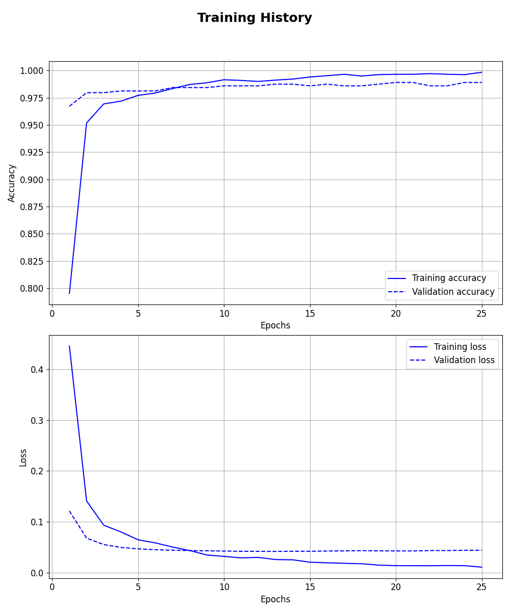

### Detailed Report of Test Set:

|              | precision    | recall       | f1-score     | support      |
| ------------ | ------------ | ------------ | ------------ | ------------ |
| chihuahua    | 0.9833       | 0.9874       | 0.9854       | 477          | 
| muffin       | 0.9855       | 0.9808       | 0.9831       | 416          | 
| micro avg    | 0.9843       | 0.9843       | 0.9843       | 893          | 
| macro avg    | 0.9844       | 0.9841       | 0.9842       | 893          | 
| weighted avg | 0.9843       | 0.9843       | 0.9843       | 893          | 
| samples avg  | 0.9843       | 0.9843       | 0.9843       | 893          | 

## trial_60

*    *Start Time*: 2024-10-23 08:44:33

*    *Duration*: 21.149

*    *Directory*: [Link](./trial_60)

### Hyperparameters:

| Hyperparameter        | Value                 |
| --------------------- | --------------------- |
| dense_units           | 256                   |
| dropout_rate          | 0.39354215127719533   |
| learning_rate         | 4.243379739172321e-05 |

### Evaluation Metrics:

|           | train     | val       | test      |
| --------- | --------- | --------- | --------- |
| accuracy  | 0.9981    | 0.9891    | 0.9843    | 
| precision | 0.9981    | 0.9891    | 0.9843    | 
| recall    | 0.9981    | 0.9891    | 0.9843    | 
| f1        | 0.9981    | 0.9891    | 0.9843    | 

### Figures:

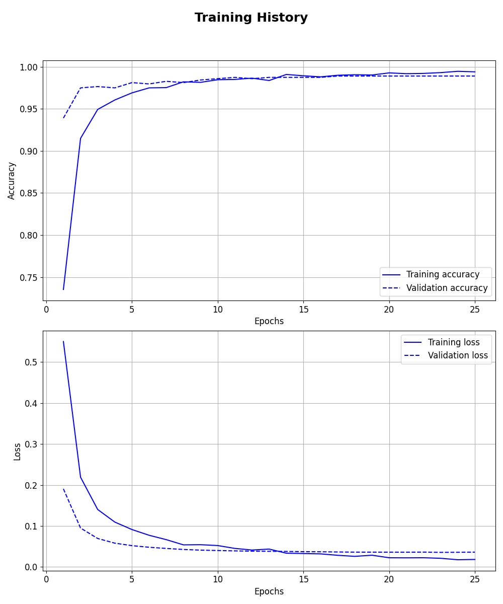

### Detailed Report of Test Set:

|              | precision    | recall       | f1-score     | support      |
| ------------ | ------------ | ------------ | ------------ | ------------ |
| chihuahua    | 0.9833       | 0.9874       | 0.9854       | 477          | 
| muffin       | 0.9855       | 0.9808       | 0.9831       | 416          | 
| micro avg    | 0.9843       | 0.9843       | 0.9843       | 893          | 
| macro avg    | 0.9844       | 0.9841       | 0.9842       | 893          | 
| weighted avg | 0.9843       | 0.9843       | 0.9843       | 893          | 
| samples avg  | 0.9843       | 0.9843       | 0.9843       | 893          | 

## trial_62

*    *Start Time*: 2024-10-23 08:45:19

*    *Duration*: 21.079

*    *Directory*: [Link](./trial_62)

### Hyperparameters:

| Hyperparameter        | Value                 |
| --------------------- | --------------------- |
| dense_units           | 256                   |
| dropout_rate          | 0.36123171188871395   |
| learning_rate         | 2.650223222168248e-05 |

### Evaluation Metrics:

|           | train     | val       | test      |
| --------- | --------- | --------- | --------- |
| accuracy  | 0.9953    | 0.9891    | 0.9843    | 
| precision | 0.9953    | 0.9891    | 0.9843    | 
| recall    | 0.9953    | 0.9891    | 0.9843    | 
| f1        | 0.9953    | 0.9891    | 0.9843    | 

### Figures:

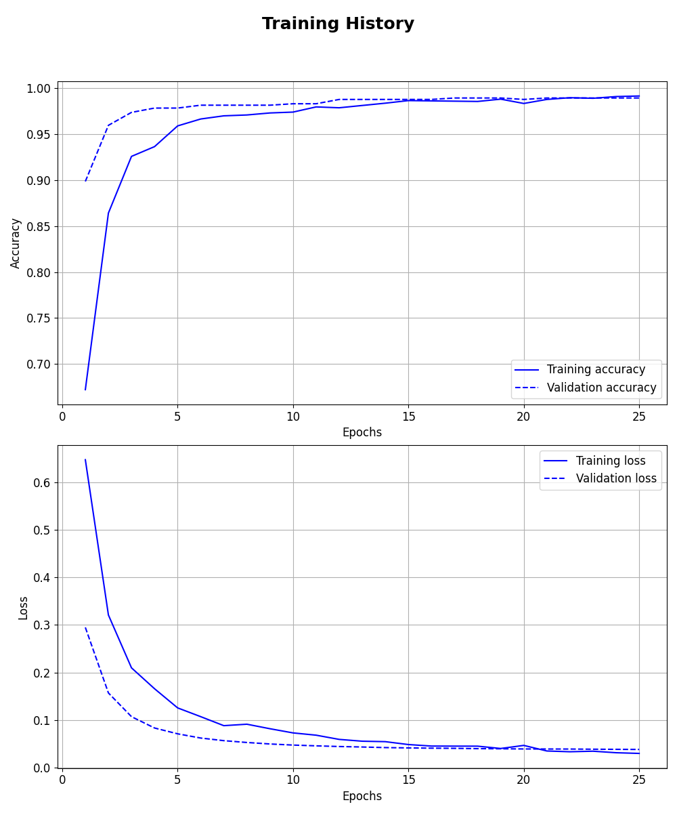

### Detailed Report of Test Set:

|              | precision    | recall       | f1-score     | support      |
| ------------ | ------------ | ------------ | ------------ | ------------ |
| chihuahua    | 0.9773       | 0.9937       | 0.9854       | 477          | 
| muffin       | 0.9926       | 0.9736       | 0.9830       | 416          | 
| micro avg    | 0.9843       | 0.9843       | 0.9843       | 893          | 
| macro avg    | 0.9850       | 0.9836       | 0.9842       | 893          | 
| weighted avg | 0.9845       | 0.9843       | 0.9843       | 893          | 
| samples avg  | 0.9843       | 0.9843       | 0.9843       | 893          | 

## trial_69

*    *Start Time*: 2024-10-23 08:48:00

*    *Duration*: 21.091

*    *Directory*: [Link](./trial_69)

### Hyperparameters:

| Hyperparameter         | Value                  |
| ---------------------- | ---------------------- |
| dense_units            | 512                    |
| dropout_rate           | 0.4175081029473965     |
| learning_rate          | 1.1297334059161129e-05 |

### Evaluation Metrics:

|           | train     | val       | test      |
| --------- | --------- | --------- | --------- |
| accuracy  | 0.9906    | 0.9891    | 0.9843    | 
| precision | 0.9906    | 0.9891    | 0.9843    | 
| recall    | 0.9906    | 0.9891    | 0.9843    | 
| f1        | 0.9906    | 0.9891    | 0.9843    | 

### Figures:

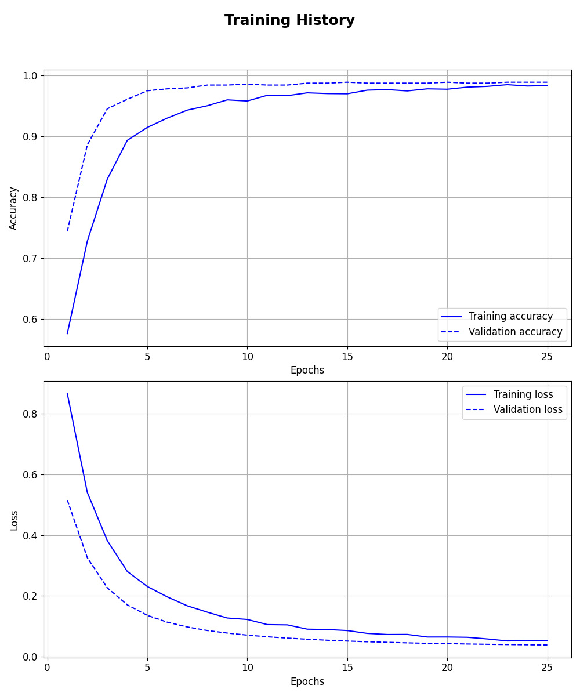

### Detailed Report of Test Set:

|              | precision    | recall       | f1-score     | support      |
| ------------ | ------------ | ------------ | ------------ | ------------ |
| chihuahua    | 0.9813       | 0.9895       | 0.9854       | 477          | 
| muffin       | 0.9879       | 0.9784       | 0.9831       | 416          | 
| micro avg    | 0.9843       | 0.9843       | 0.9843       | 893          | 
| macro avg    | 0.9846       | 0.9839       | 0.9842       | 893          | 
| weighted avg | 0.9844       | 0.9843       | 0.9843       | 893          | 
| samples avg  | 0.9843       | 0.9843       | 0.9843       | 893          | 

## trial_78

*    *Start Time*: 2024-10-23 08:51:28

*    *Duration*: 21.001

*    *Directory*: [Link](./trial_78)

### Hyperparameters:

| Hyperparameter         | Value                  |
| ---------------------- | ---------------------- |
| dense_units            | 512                    |
| dropout_rate           | 0.2987290456087326     |
| learning_rate          | 1.4558488937695981e-05 |

### Evaluation Metrics:

|           | train     | val       | test      |
| --------- | --------- | --------- | --------- |
| accuracy  | 0.9944    | 0.9844    | 0.9843    | 
| precision | 0.9944    | 0.9844    | 0.9843    | 
| recall    | 0.9944    | 0.9844    | 0.9843    | 
| f1        | 0.9944    | 0.9844    | 0.9843    | 

### Figures:

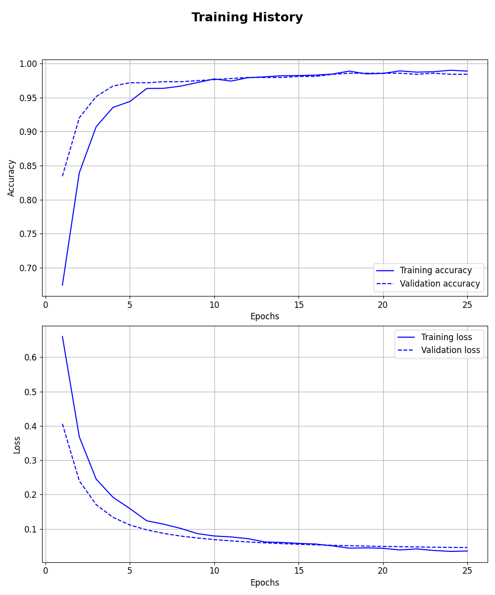

### Detailed Report of Test Set:

|              | precision    | recall       | f1-score     | support      |
| ------------ | ------------ | ------------ | ------------ | ------------ |
| chihuahua    | 0.9793       | 0.9916       | 0.9854       | 477          | 
| muffin       | 0.9902       | 0.9760       | 0.9831       | 416          | 
| micro avg    | 0.9843       | 0.9843       | 0.9843       | 893          | 
| macro avg    | 0.9848       | 0.9838       | 0.9842       | 893          | 
| weighted avg | 0.9844       | 0.9843       | 0.9843       | 893          | 
| samples avg  | 0.9843       | 0.9843       | 0.9843       | 893          | 

## trial_89

*    *Start Time*: 2024-10-23 08:55:46

*    *Duration*: 21.210

*    *Directory*: [Link](./trial_89)

### Hyperparameters:

| Hyperparameter        | Value                 |
| --------------------- | --------------------- |
| dense_units           | 256                   |
| dropout_rate          | 0.40166549302181703   |
| learning_rate         | 4.472827058679623e-05 |

### Evaluation Metrics:

|           | train     | val       | test      |
| --------- | --------- | --------- | --------- |
| accuracy  | 0.9987    | 0.9875    | 0.9843    | 
| precision | 0.9987    | 0.9875    | 0.9843    | 
| recall    | 0.9987    | 0.9875    | 0.9843    | 
| f1        | 0.9987    | 0.9875    | 0.9843    | 

### Figures:

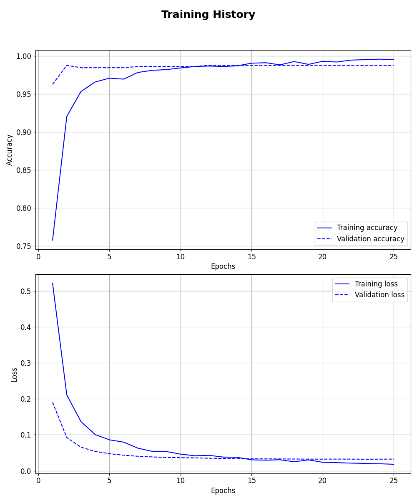

### Detailed Report of Test Set:

|              | precision    | recall       | f1-score     | support      |
| ------------ | ------------ | ------------ | ------------ | ------------ |
| chihuahua    | 0.9833       | 0.9874       | 0.9854       | 477          | 
| muffin       | 0.9855       | 0.9808       | 0.9831       | 416          | 
| micro avg    | 0.9843       | 0.9843       | 0.9843       | 893          | 
| macro avg    | 0.9844       | 0.9841       | 0.9842       | 893          | 
| weighted avg | 0.9843       | 0.9843       | 0.9843       | 893          | 
| samples avg  | 0.9843       | 0.9843       | 0.9843       | 893          | 

## trial_90

*    *Start Time*: 2024-10-23 08:56:09

*    *Duration*: 21.413

*    *Directory*: [Link](./trial_90)

### Hyperparameters:

| Hyperparameter        | Value                 |
| --------------------- | --------------------- |
| dense_units           | 256                   |
| dropout_rate          | 0.39851293472332594   |
| learning_rate         | 4.463734526008971e-05 |

### Evaluation Metrics:

|           | train     | val       | test      |
| --------- | --------- | --------- | --------- |
| accuracy  | 0.9987    | 0.9922    | 0.9843    | 
| precision | 0.9987    | 0.9922    | 0.9843    | 
| recall    | 0.9987    | 0.9922    | 0.9843    | 
| f1        | 0.9987    | 0.9922    | 0.9843    | 

### Figures:

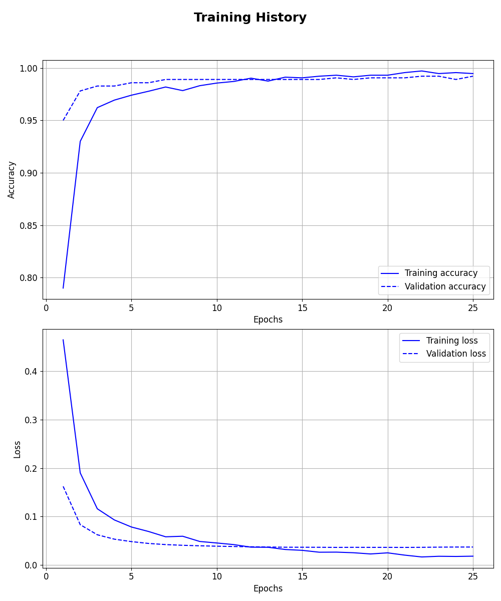

### Detailed Report of Test Set:

|              | precision    | recall       | f1-score     | support      |
| ------------ | ------------ | ------------ | ------------ | ------------ |
| chihuahua    | 0.9813       | 0.9895       | 0.9854       | 477          | 
| muffin       | 0.9879       | 0.9784       | 0.9831       | 416          | 
| micro avg    | 0.9843       | 0.9843       | 0.9843       | 893          | 
| macro avg    | 0.9846       | 0.9839       | 0.9842       | 893          | 
| weighted avg | 0.9844       | 0.9843       | 0.9843       | 893          | 
| samples avg  | 0.9843       | 0.9843       | 0.9843       | 893          | 

## trial_91

*    *Start Time*: 2024-10-23 08:56:33

*    *Duration*: 20.991

*    *Directory*: [Link](./trial_91)

### Hyperparameters:

| Hyperparameter        | Value                 |
| --------------------- | --------------------- |
| dense_units           | 128                   |
| dropout_rate          | 0.4521993710777526    |
| learning_rate         | 5.798958175745282e-05 |

### Evaluation Metrics:

|           | train     | val       | test      |
| --------- | --------- | --------- | --------- |
| accuracy  | 0.9959    | 0.9859    | 0.9843    | 
| precision | 0.9959    | 0.9859    | 0.9843    | 
| recall    | 0.9959    | 0.9859    | 0.9843    | 
| f1        | 0.9959    | 0.9859    | 0.9843    | 

### Figures:

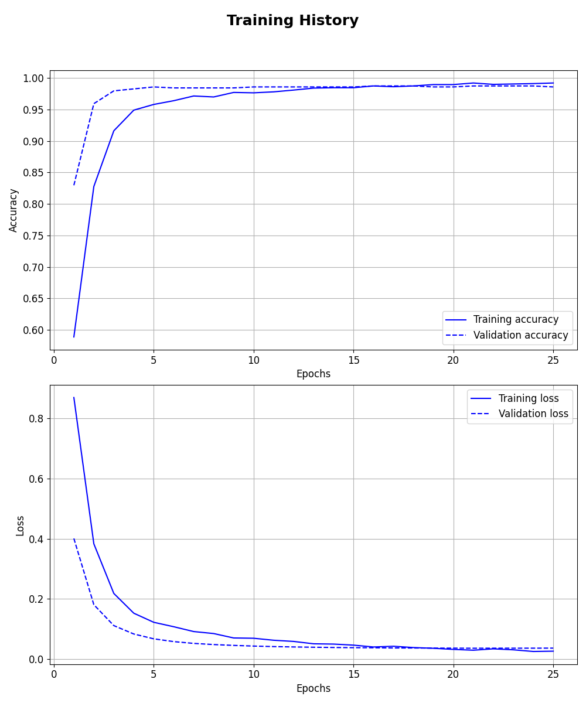

### Detailed Report of Test Set:

|              | precision    | recall       | f1-score     | support      |
| ------------ | ------------ | ------------ | ------------ | ------------ |
| chihuahua    | 0.9813       | 0.9895       | 0.9854       | 477          | 
| muffin       | 0.9879       | 0.9784       | 0.9831       | 416          | 
| micro avg    | 0.9843       | 0.9843       | 0.9843       | 893          | 
| macro avg    | 0.9846       | 0.9839       | 0.9842       | 893          | 
| weighted avg | 0.9844       | 0.9843       | 0.9843       | 893          | 
| samples avg  | 0.9843       | 0.9843       | 0.9843       | 893          | 

## trial_92

*    *Start Time*: 2024-10-23 08:56:57

*    *Duration*: 21.340

*    *Directory*: [Link](./trial_92)

### Hyperparameters:

| Hyperparameter       | Value                |
| -------------------- | -------------------- |
| dense_units          | 256                  |
| dropout_rate         | 0.4234111774988462   |
| learning_rate        | 7.16516950697305e-05 |

### Evaluation Metrics:

|           | train     | val       | test      |
| --------- | --------- | --------- | --------- |
| accuracy  | 0.9997    | 0.9891    | 0.9843    | 
| precision | 0.9997    | 0.9891    | 0.9843    | 
| recall    | 0.9997    | 0.9891    | 0.9843    | 
| f1        | 0.9997    | 0.9891    | 0.9843    | 

### Figures:

### Detailed Report of Test Set:

|              | precision    | recall       | f1-score     | support      |
| ------------ | ------------ | ------------ | ------------ | ------------ |
| chihuahua    | 0.9813       | 0.9895       | 0.9854       | 477          | 
| muffin       | 0.9879       | 0.9784       | 0.9831       | 416          | 
| micro avg    | 0.9843       | 0.9843       | 0.9843       | 893          | 
| macro avg    | 0.9846       | 0.9839       | 0.9842       | 893          | 
| weighted avg | 0.9844       | 0.9843       | 0.9843       | 893          | 
| samples avg  | 0.9843       | 0.9843       | 0.9843       | 893          | 

## trial_93

*    *Start Time*: 2024-10-23 08:57:20

*    *Duration*: 21.179

*    *Directory*: [Link](./trial_93)

### Hyperparameters:

| Hyperparameter         | Value                  |
| ---------------------- | ---------------------- |
| dense_units            | 256                    |
| dropout_rate           | 0.377242687199327      |
| learning_rate          | 2.8307555769685253e-05 |

### Evaluation Metrics:

|           | train     | val       | test      |
| --------- | --------- | --------- | --------- |
| accuracy  | 0.9947    | 0.9875    | 0.9843    | 
| precision | 0.9947    | 0.9875    | 0.9843    | 
| recall    | 0.9947    | 0.9875    | 0.9843    | 
| f1        | 0.9947    | 0.9875    | 0.9843    | 

### Figures:

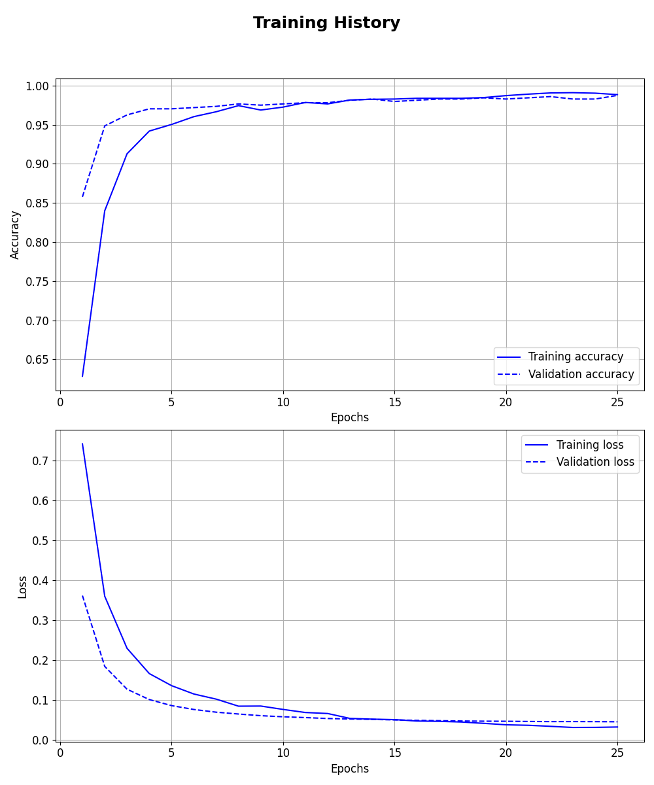

### Detailed Report of Test Set:

|              | precision    | recall       | f1-score     | support      |
| ------------ | ------------ | ------------ | ------------ | ------------ |
| chihuahua    | 0.9813       | 0.9895       | 0.9854       | 477          | 
| muffin       | 0.9879       | 0.9784       | 0.9831       | 416          | 
| micro avg    | 0.9843       | 0.9843       | 0.9843       | 893          | 
| macro avg    | 0.9846       | 0.9839       | 0.9842       | 893          | 
| weighted avg | 0.9844       | 0.9843       | 0.9843       | 893          | 
| samples avg  | 0.9843       | 0.9843       | 0.9843       | 893          | 

## trial_96

*    *Start Time*: 2024-10-23 08:58:32

*    *Duration*: 21.421

*    *Directory*: [Link](./trial_96)

### Hyperparameters:

| Hyperparameter         | Value                  |
| ---------------------- | ---------------------- |
| dense_units            | 512                    |
| dropout_rate           | 0.40371571994873595    |
| learning_rate          | 4.1626665217130035e-05 |

### Evaluation Metrics:

|           | train     | val       | test      |
| --------- | --------- | --------- | --------- |
| accuracy  | 0.9997    | 0.9906    | 0.9843    | 
| precision | 0.9997    | 0.9906    | 0.9843    | 
| recall    | 0.9997    | 0.9906    | 0.9843    | 
| f1        | 0.9997    | 0.9906    | 0.9843    | 

### Figures:

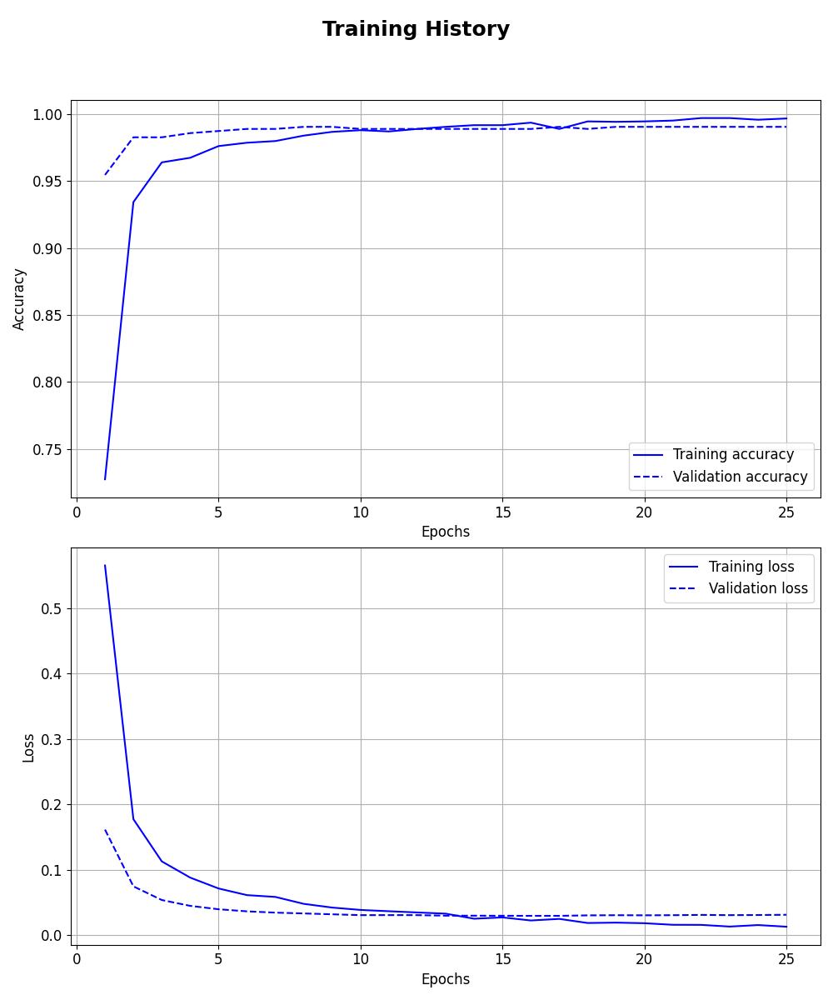

### Detailed Report of Test Set:

|              | precision    | recall       | f1-score     | support      |
| ------------ | ------------ | ------------ | ------------ | ------------ |
| chihuahua    | 0.9813       | 0.9895       | 0.9854       | 477          | 
| muffin       | 0.9879       | 0.9784       | 0.9831       | 416          | 
| micro avg    | 0.9843       | 0.9843       | 0.9843       | 893          | 
| macro avg    | 0.9846       | 0.9839       | 0.9842       | 893          | 
| weighted avg | 0.9844       | 0.9843       | 0.9843       | 893          | 
| samples avg  | 0.9843       | 0.9843       | 0.9843       | 893          | 

## trial_18

*    *Start Time*: 2024-10-23 08:28:37

*    *Duration*: 22.111

*    *Directory*: [Link](./trial_18)

### Hyperparameters:

| Hyperparameter         | Value                  |
| ---------------------- | ---------------------- |
| dense_units            | 512                    |
| dropout_rate           | 0.41850228623510344    |
| learning_rate          | 2.8536446734542353e-05 |

### Evaluation Metrics:

|           | train     | val       | test      |
| --------- | --------- | --------- | --------- |
| accuracy  | 0.9981    | 0.9906    | 0.9832    | 
| precision | 0.9981    | 0.9906    | 0.9832    | 
| recall    | 0.9981    | 0.9906    | 0.9832    | 
| f1        | 0.9981    | 0.9906    | 0.9832    | 

### Figures:

### Detailed Report of Test Set:

|              | precision    | recall       | f1-score     | support      |
| ------------ | ------------ | ------------ | ------------ | ------------ |
| chihuahua    | 0.9793       | 0.9895       | 0.9844       | 477          | 
| muffin       | 0.9878       | 0.9760       | 0.9819       | 416          | 
| micro avg    | 0.9832       | 0.9832       | 0.9832       | 893          | 
| macro avg    | 0.9835       | 0.9827       | 0.9831       | 893          | 
| weighted avg | 0.9833       | 0.9832       | 0.9832       | 893          | 
| samples avg  | 0.9832       | 0.9832       | 0.9832       | 893          | 

## trial_22

*    *Start Time*: 2024-10-23 08:30:09

*    *Duration*: 22.045

*    *Directory*: [Link](./trial_22)

### Hyperparameters:

| Hyperparameter         | Value                  |
| ---------------------- | ---------------------- |
| dense_units            | 512                    |
| dropout_rate           | 0.44792604915790446    |
| learning_rate          | 2.8183415668140906e-05 |

### Evaluation Metrics:

|           | train     | val       | test      |
| --------- | --------- | --------- | --------- |
| accuracy  | 0.9978    | 0.9906    | 0.9832    | 
| precision | 0.9978    | 0.9906    | 0.9832    | 
| recall    | 0.9978    | 0.9906    | 0.9832    | 
| f1        | 0.9978    | 0.9906    | 0.9832    | 

### Figures:

### Detailed Report of Test Set:

|              | precision    | recall       | f1-score     | support      |
| ------------ | ------------ | ------------ | ------------ | ------------ |
| chihuahua    | 0.9793       | 0.9895       | 0.9844       | 477          | 
| muffin       | 0.9878       | 0.9760       | 0.9819       | 416          | 
| micro avg    | 0.9832       | 0.9832       | 0.9832       | 893          | 
| macro avg    | 0.9835       | 0.9827       | 0.9831       | 893          | 
| weighted avg | 0.9833       | 0.9832       | 0.9832       | 893          | 
| samples avg  | 0.9832       | 0.9832       | 0.9832       | 893          | 

## trial_35

*    *Start Time*: 2024-10-23 08:35:06

*    *Duration*: 21.387

*    *Directory*: [Link](./trial_35)

### Hyperparameters:

| Hyperparameter         | Value                  |
| ---------------------- | ---------------------- |
| dense_units            | 512                    |
| dropout_rate           | 0.2926226204881526     |
| learning_rate          | 2.6327528577677017e-05 |

### Evaluation Metrics:

|           | train     | val       | test      |
| --------- | --------- | --------- | --------- |
| accuracy  | 0.9991    | 0.9859    | 0.9832    | 
| precision | 0.9991    | 0.9859    | 0.9832    | 
| recall    | 0.9991    | 0.9859    | 0.9832    | 
| f1        | 0.9991    | 0.9859    | 0.9832    | 

### Figures:

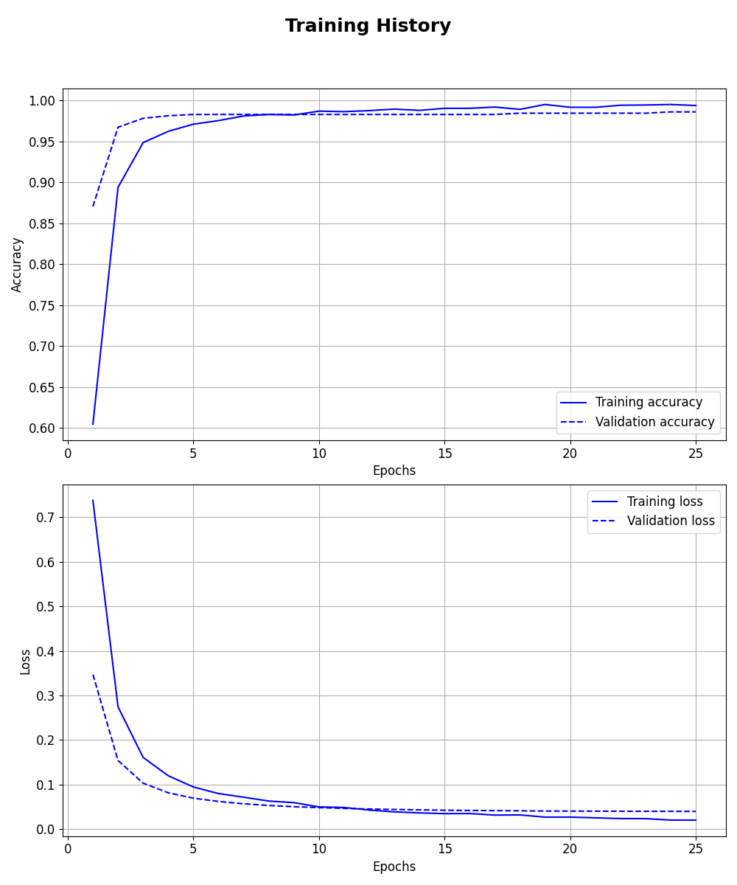

### Detailed Report of Test Set:

|              | precision    | recall       | f1-score     | support      |
| ------------ | ------------ | ------------ | ------------ | ------------ |
| chihuahua    | 0.9833       | 0.9853       | 0.9843       | 477          | 
| muffin       | 0.9831       | 0.9808       | 0.9819       | 416          | 
| micro avg    | 0.9832       | 0.9832       | 0.9832       | 893          | 
| macro avg    | 0.9832       | 0.9830       | 0.9831       | 893          | 
| weighted avg | 0.9832       | 0.9832       | 0.9832       | 893          | 
| samples avg  | 0.9832       | 0.9832       | 0.9832       | 893          | 

## trial_38

*    *Start Time*: 2024-10-23 08:36:14

*    *Duration*: 20.919

*    *Directory*: [Link](./trial_38)

### Hyperparameters:

| Hyperparameter        | Value                 |
| --------------------- | --------------------- |
| dense_units           | 512                   |
| dropout_rate          | 0.3230135735755826    |
| learning_rate         | 1.930034078695228e-05 |

### Evaluation Metrics:

|           | train     | val       | test      |
| --------- | --------- | --------- | --------- |
| accuracy  | 0.9937    | 0.9875    | 0.9832    | 
| precision | 0.9937    | 0.9875    | 0.9832    | 
| recall    | 0.9937    | 0.9875    | 0.9832    | 
| f1        | 0.9937    | 0.9875    | 0.9832    | 

### Figures:

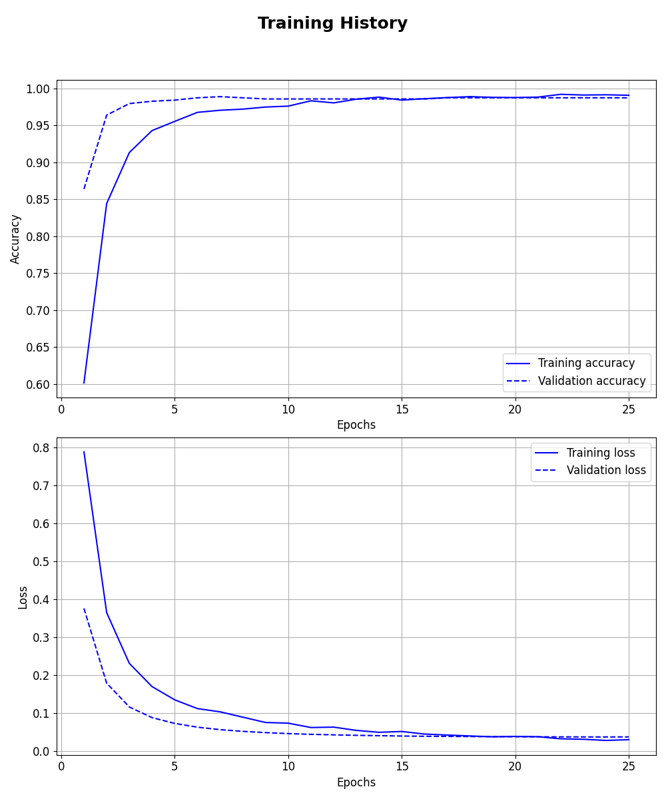

### Detailed Report of Test Set:

|              | precision    | recall       | f1-score     | support      |
| ------------ | ------------ | ------------ | ------------ | ------------ |
| chihuahua    | 0.9773       | 0.9916       | 0.9844       | 477          | 
| muffin       | 0.9902       | 0.9736       | 0.9818       | 416          | 
| micro avg    | 0.9832       | 0.9832       | 0.9832       | 893          | 
| macro avg    | 0.9837       | 0.9826       | 0.9831       | 893          | 
| weighted avg | 0.9833       | 0.9832       | 0.9832       | 893          | 
| samples avg  | 0.9832       | 0.9832       | 0.9832       | 893          | 

## trial_42

*    *Start Time*: 2024-10-23 08:37:44

*    *Duration*: 21.079

*    *Directory*: [Link](./trial_42)

### Hyperparameters:

| Hyperparameter         | Value                  |
| ---------------------- | ---------------------- |
| dense_units            | 512                    |
| dropout_rate           | 0.429782411318927      |
| learning_rate          | 3.0103469814009053e-05 |

### Evaluation Metrics:

|           | train     | val       | test      |
| --------- | --------- | --------- | --------- |
| accuracy  | 0.9987    | 0.9906    | 0.9832    | 
| precision | 0.9987    | 0.9906    | 0.9832    | 
| recall    | 0.9987    | 0.9906    | 0.9832    | 
| f1        | 0.9987    | 0.9906    | 0.9832    | 

### Figures:

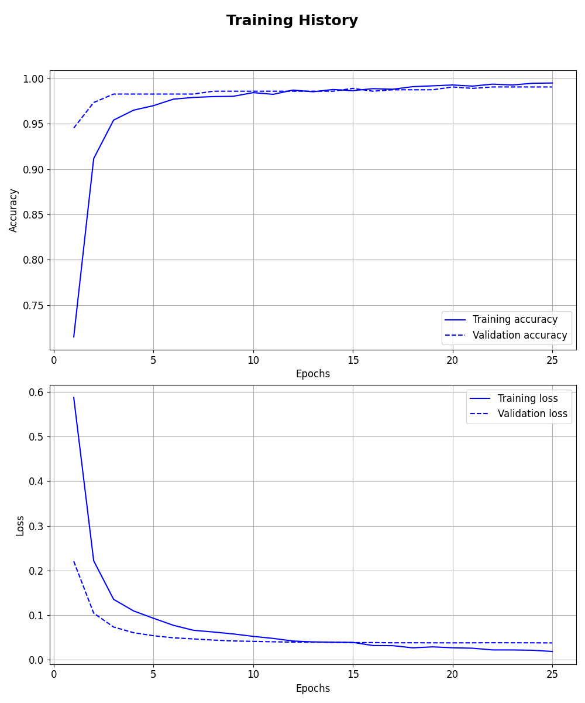

### Detailed Report of Test Set:

|              | precision    | recall       | f1-score     | support      |
| ------------ | ------------ | ------------ | ------------ | ------------ |
| chihuahua    | 0.9812       | 0.9874       | 0.9843       | 477          | 
| muffin       | 0.9855       | 0.9784       | 0.9819       | 416          | 
| micro avg    | 0.9832       | 0.9832       | 0.9832       | 893          | 
| macro avg    | 0.9834       | 0.9829       | 0.9831       | 893          | 
| weighted avg | 0.9832       | 0.9832       | 0.9832       | 893          | 
| samples avg  | 0.9832       | 0.9832       | 0.9832       | 893          | 

## trial_51

*    *Start Time*: 2024-10-23 08:41:07

*    *Duration*: 21.018

*    *Directory*: [Link](./trial_51)

### Hyperparameters:

| Hyperparameter        | Value                 |
| --------------------- | --------------------- |
| dense_units           | 128                   |
| dropout_rate          | 0.48740510209775534   |
| learning_rate         | 9.222321316683178e-05 |

### Evaluation Metrics:

|           | train     | val       | test      |
| --------- | --------- | --------- | --------- |
| accuracy  | 0.9997    | 0.9891    | 0.9832    | 
| precision | 0.9997    | 0.9891    | 0.9832    | 
| recall    | 0.9997    | 0.9891    | 0.9832    | 
| f1        | 0.9997    | 0.9891    | 0.9832    | 

### Figures:

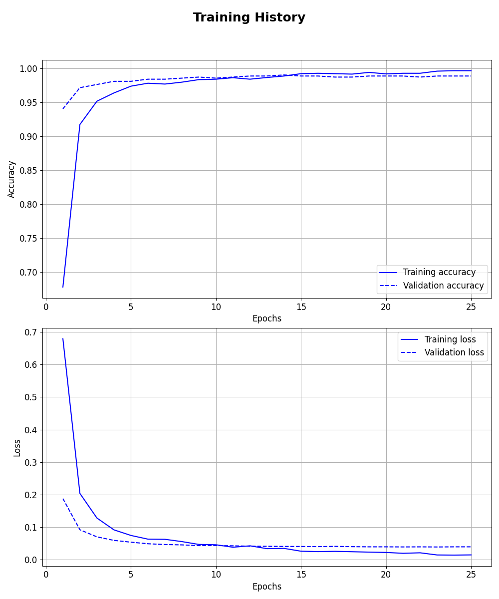

### Detailed Report of Test Set:

|              | precision    | recall       | f1-score     | support      |
| ------------ | ------------ | ------------ | ------------ | ------------ |
| chihuahua    | 0.9793       | 0.9895       | 0.9844       | 477          | 
| muffin       | 0.9878       | 0.9760       | 0.9819       | 416          | 
| micro avg    | 0.9832       | 0.9832       | 0.9832       | 893          | 
| macro avg    | 0.9835       | 0.9827       | 0.9831       | 893          | 
| weighted avg | 0.9833       | 0.9832       | 0.9832       | 893          | 
| samples avg  | 0.9832       | 0.9832       | 0.9832       | 893          | 

## trial_7

*    *Start Time*: 2024-10-23 08:24:27

*    *Duration*: 23.807

*    *Directory*: [Link](./trial_7)

### Hyperparameters:

| Hyperparameter        | Value                 |
| --------------------- | --------------------- |
| dense_units           | 128                   |
| dropout_rate          | 0.420268175071424     |
| learning_rate         | 2.013323535809419e-05 |

### Evaluation Metrics:

|           | train     | val       | test      |
| --------- | --------- | --------- | --------- |
| accuracy  | 0.9884    | 0.9844    | 0.9821    | 
| precision | 0.9884    | 0.9844    | 0.9821    | 
| recall    | 0.9884    | 0.9844    | 0.9821    | 
| f1        | 0.9884    | 0.9844    | 0.9821    | 

### Figures:

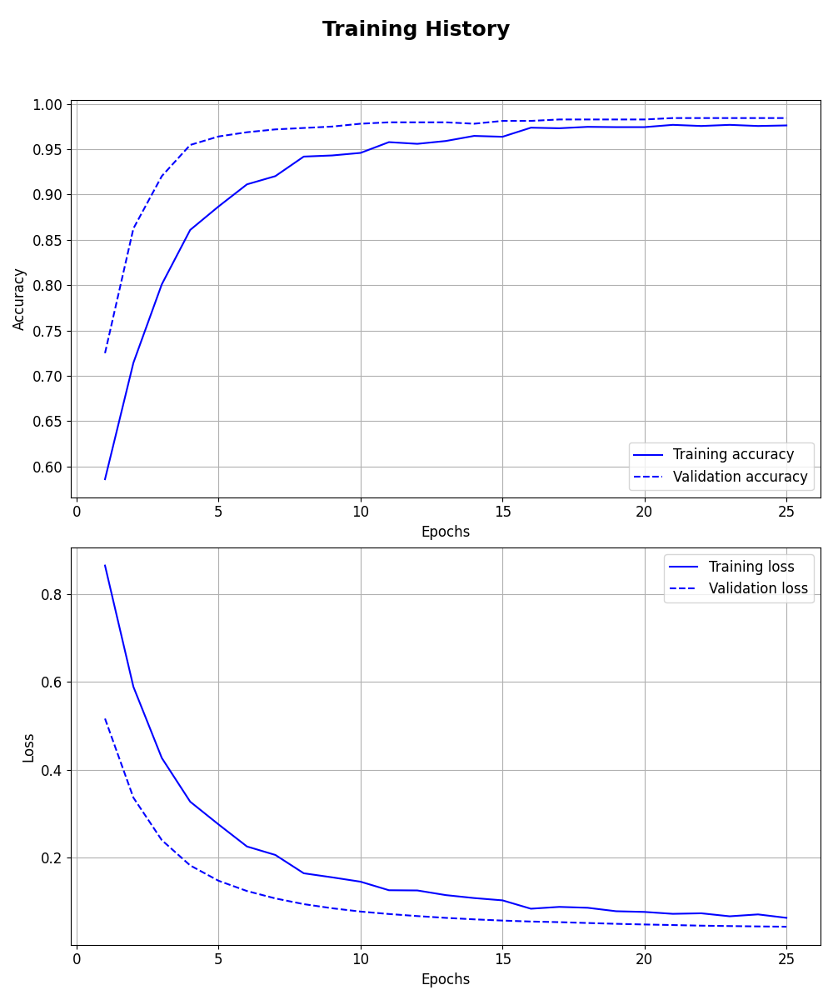

### Detailed Report of Test Set:

|              | precision    | recall       | f1-score     | support      |
| ------------ | ------------ | ------------ | ------------ | ------------ |
| chihuahua    | 0.9792       | 0.9874       | 0.9833       | 477          | 
| muffin       | 0.9854       | 0.9760       | 0.9807       | 416          | 
| micro avg    | 0.9821       | 0.9821       | 0.9821       | 893          | 
| macro avg    | 0.9823       | 0.9817       | 0.9820       | 893          | 
| weighted avg | 0.9821       | 0.9821       | 0.9821       | 893          | 
| samples avg  | 0.9821       | 0.9821       | 0.9821       | 893          | 

## trial_19

*    *Start Time*: 2024-10-23 08:29:00

*    *Duration*: 21.985

*    *Directory*: [Link](./trial_19)

### Hyperparameters:

| Hyperparameter         | Value                  |
| ---------------------- | ---------------------- |
| dense_units            | 512                    |
| dropout_rate           | 0.42789838205012715    |
| learning_rate          | 2.2083880170354025e-05 |

### Evaluation Metrics:

|           | train     | val       | test      |
| --------- | --------- | --------- | --------- |
| accuracy  | 0.9962    | 0.9891    | 0.9821    | 
| precision | 0.9962    | 0.9891    | 0.9821    | 
| recall    | 0.9962    | 0.9891    | 0.9821    | 
| f1        | 0.9962    | 0.9891    | 0.9821    | 

### Figures:

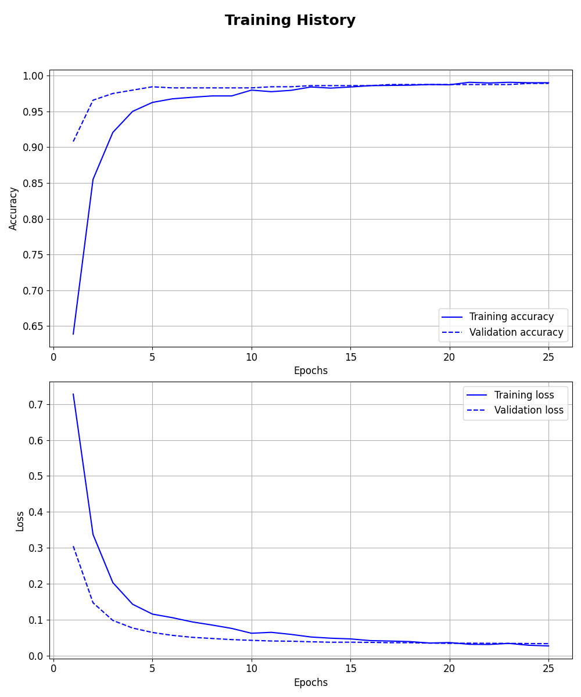

### Detailed Report of Test Set:

|              | precision    | recall       | f1-score     | support      |
| ------------ | ------------ | ------------ | ------------ | ------------ |
| chihuahua    | 0.9772       | 0.9895       | 0.9833       | 477          | 
| muffin       | 0.9878       | 0.9736       | 0.9806       | 416          | 
| micro avg    | 0.9821       | 0.9821       | 0.9821       | 893          | 
| macro avg    | 0.9825       | 0.9815       | 0.9820       | 893          | 
| weighted avg | 0.9822       | 0.9821       | 0.9821       | 893          | 
| samples avg  | 0.9821       | 0.9821       | 0.9821       | 893          | 

## trial_31

*    *Start Time*: 2024-10-23 08:33:36

*    *Duration*: 20.905

*    *Directory*: [Link](./trial_31)

### Hyperparameters:

| Hyperparameter         | Value                  |
| ---------------------- | ---------------------- |
| dense_units            | 512                    |
| dropout_rate           | 0.2478321279349705     |
| learning_rate          | 1.4444587503272052e-05 |

### Evaluation Metrics:

|           | train     | val       | test      |
| --------- | --------- | --------- | --------- |
| accuracy  | 0.9947    | 0.9891    | 0.9821    | 
| precision | 0.9947    | 0.9891    | 0.9821    | 
| recall    | 0.9947    | 0.9891    | 0.9821    | 
| f1        | 0.9947    | 0.9891    | 0.9821    | 

### Figures:

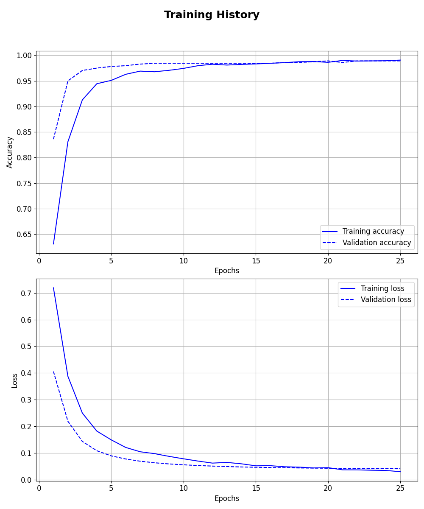

### Detailed Report of Test Set:

|              | precision    | recall       | f1-score     | support      |
| ------------ | ------------ | ------------ | ------------ | ------------ |
| chihuahua    | 0.9792       | 0.9874       | 0.9833       | 477          | 
| muffin       | 0.9854       | 0.9760       | 0.9807       | 416          | 
| micro avg    | 0.9821       | 0.9821       | 0.9821       | 893          | 
| macro avg    | 0.9823       | 0.9817       | 0.9820       | 893          | 
| weighted avg | 0.9821       | 0.9821       | 0.9821       | 893          | 
| samples avg  | 0.9821       | 0.9821       | 0.9821       | 893          | 

## trial_41

*    *Start Time*: 2024-10-23 08:37:21

*    *Duration*: 21.320

*    *Directory*: [Link](./trial_41)

### Hyperparameters:

| Hyperparameter         | Value                  |
| ---------------------- | ---------------------- |
| dense_units            | 256                    |
| dropout_rate           | 0.28150916358604805    |
| learning_rate          | 2.2112280316430957e-05 |

### Evaluation Metrics:

|           | train     | val       | test      |
| --------- | --------- | --------- | --------- |
| accuracy  | 0.9956    | 0.9875    | 0.9821    | 
| precision | 0.9956    | 0.9875    | 0.9821    | 
| recall    | 0.9956    | 0.9875    | 0.9821    | 
| f1        | 0.9956    | 0.9875    | 0.9821    | 

### Figures:

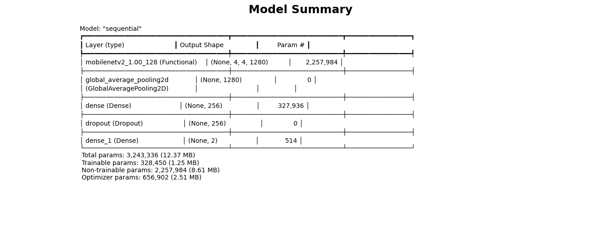

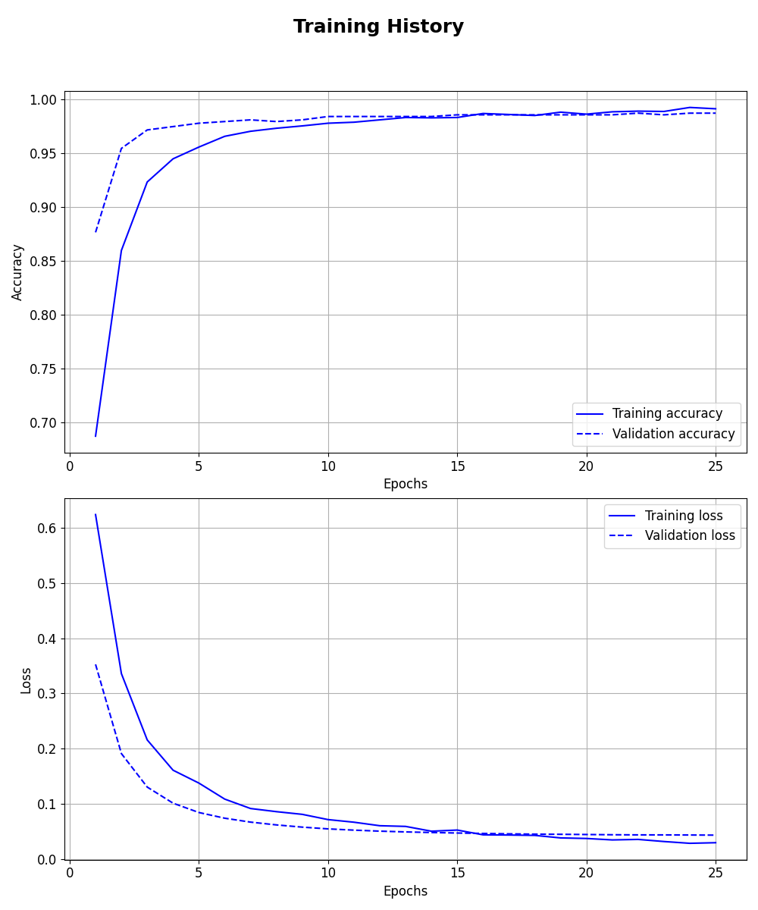

### Detailed Report of Test Set:

|              | precision    | recall       | f1-score     | support      |
| ------------ | ------------ | ------------ | ------------ | ------------ |
| chihuahua    | 0.9812       | 0.9853       | 0.9833       | 477          | 
| muffin       | 0.9831       | 0.9784       | 0.9807       | 416          | 
| micro avg    | 0.9821       | 0.9821       | 0.9821       | 893          | 
| macro avg    | 0.9822       | 0.9818       | 0.9820       | 893          | 
| weighted avg | 0.9821       | 0.9821       | 0.9821       | 893          | 
| samples avg  | 0.9821       | 0.9821       | 0.9821       | 893          | 

## trial_56

*    *Start Time*: 2024-10-23 08:43:02

*    *Duration*: 21.312

*    *Directory*: [Link](./trial_56)

### Hyperparameters:

| Hyperparameter         | Value                  |
| ---------------------- | ---------------------- |
| dense_units            | 512                    |
| dropout_rate           | 0.4465505326886864     |
| learning_rate          | 2.4985339986144867e-05 |

### Evaluation Metrics:

|           | train     | val       | test      |
| --------- | --------- | --------- | --------- |
| accuracy  | 0.9962    | 0.9875    | 0.9821    | 
| precision | 0.9962    | 0.9875    | 0.9821    | 
| recall    | 0.9962    | 0.9875    | 0.9821    | 
| f1        | 0.9962    | 0.9875    | 0.9821    | 

### Figures:

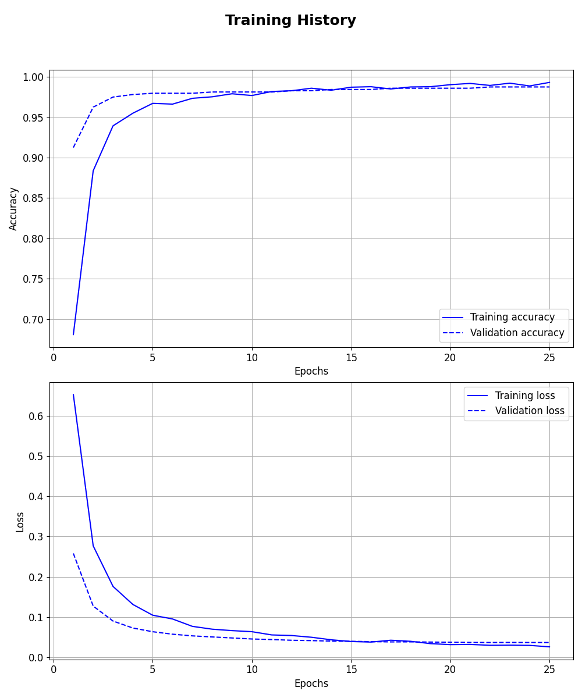

### Detailed Report of Test Set:

|              | precision    | recall       | f1-score     | support      |
| ------------ | ------------ | ------------ | ------------ | ------------ |
| chihuahua    | 0.9792       | 0.9874       | 0.9833       | 477          | 
| muffin       | 0.9854       | 0.9760       | 0.9807       | 416          | 
| micro avg    | 0.9821       | 0.9821       | 0.9821       | 893          | 
| macro avg    | 0.9823       | 0.9817       | 0.9820       | 893          | 
| weighted avg | 0.9821       | 0.9821       | 0.9821       | 893          | 
| samples avg  | 0.9821       | 0.9821       | 0.9821       | 893          | 

## trial_57

*    *Start Time*: 2024-10-23 08:43:25

*    *Duration*: 20.993

*    *Directory*: [Link](./trial_57)

### Hyperparameters:

| Hyperparameter        | Value                 |
| --------------------- | --------------------- |
| dense_units           | 256                   |
| dropout_rate          | 0.3822743621870885    |
| learning_rate         | 3.518681469076561e-05 |

### Evaluation Metrics:

|           | train     | val       | test      |
| --------- | --------- | --------- | --------- |
| accuracy  | 0.9975    | 0.9891    | 0.9821    | 
| precision | 0.9975    | 0.9891    | 0.9821    | 
| recall    | 0.9975    | 0.9891    | 0.9821    | 
| f1        | 0.9975    | 0.9891    | 0.9821    | 

### Figures:

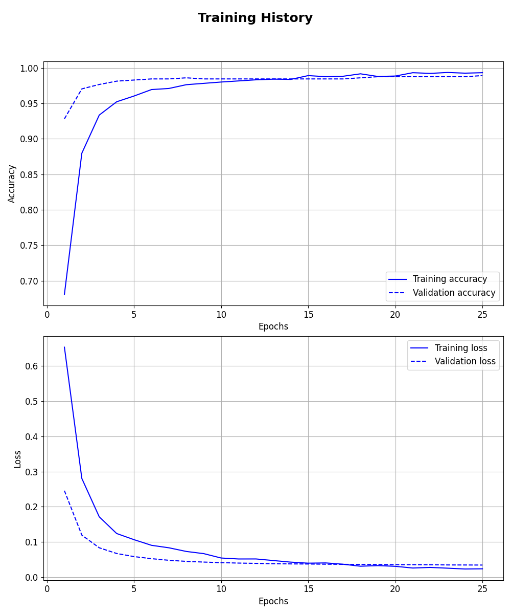

### Detailed Report of Test Set:

|              | precision    | recall       | f1-score     | support      |
| ------------ | ------------ | ------------ | ------------ | ------------ |
| chihuahua    | 0.9772       | 0.9895       | 0.9833       | 477          | 
| muffin       | 0.9878       | 0.9736       | 0.9806       | 416          | 
| micro avg    | 0.9821       | 0.9821       | 0.9821       | 893          | 
| macro avg    | 0.9825       | 0.9815       | 0.9820       | 893          | 
| weighted avg | 0.9822       | 0.9821       | 0.9821       | 893          | 
| samples avg  | 0.9821       | 0.9821       | 0.9821       | 893          | 

## trial_65

*    *Start Time*: 2024-10-23 08:46:28

*    *Duration*: 21.033

*    *Directory*: [Link](./trial_65)

### Hyperparameters:

| Hyperparameter        | Value                 |
| --------------------- | --------------------- |
| dense_units           | 512                   |
| dropout_rate          | 0.3792502377823683    |
| learning_rate         | 1.709664451817053e-05 |

### Evaluation Metrics:

|           | train     | val       | test      |
| --------- | --------- | --------- | --------- |
| accuracy  | 0.9944    | 0.9891    | 0.9821    | 
| precision | 0.9944    | 0.9891    | 0.9821    | 
| recall    | 0.9944    | 0.9891    | 0.9821    | 
| f1        | 0.9944    | 0.9891    | 0.9821    | 

### Figures:

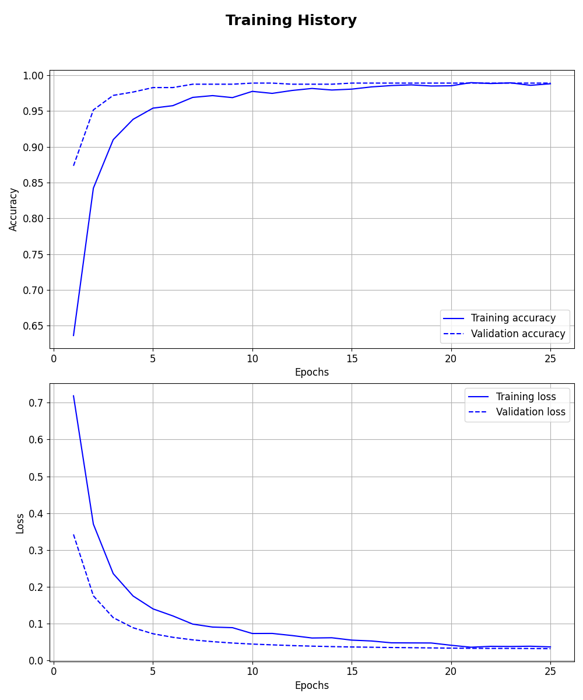

### Detailed Report of Test Set:

|              | precision    | recall       | f1-score     | support      |
| ------------ | ------------ | ------------ | ------------ | ------------ |
| chihuahua    | 0.9792       | 0.9874       | 0.9833       | 477          | 
| muffin       | 0.9854       | 0.9760       | 0.9807       | 416          | 
| micro avg    | 0.9821       | 0.9821       | 0.9821       | 893          | 
| macro avg    | 0.9823       | 0.9817       | 0.9820       | 893          | 
| weighted avg | 0.9821       | 0.9821       | 0.9821       | 893          | 
| samples avg  | 0.9821       | 0.9821       | 0.9821       | 893          | 

## trial_71

*    *Start Time*: 2024-10-23 08:48:46

*    *Duration*: 20.842

*    *Directory*: [Link](./trial_71)

### Hyperparameters:

| Hyperparameter       | Value                |
| -------------------- | -------------------- |
| dense_units          | 512                  |
| dropout_rate         | 0.20404534679600567  |
| learning_rate        | 1.65588951200883e-05 |

### Evaluation Metrics:

|           | train     | val       | test      |
| --------- | --------- | --------- | --------- |
| accuracy  | 0.9944    | 0.9859    | 0.9821    | 
| precision | 0.9944    | 0.9859    | 0.9821    | 
| recall    | 0.9944    | 0.9859    | 0.9821    | 
| f1        | 0.9944    | 0.9859    | 0.9821    | 

### Figures:

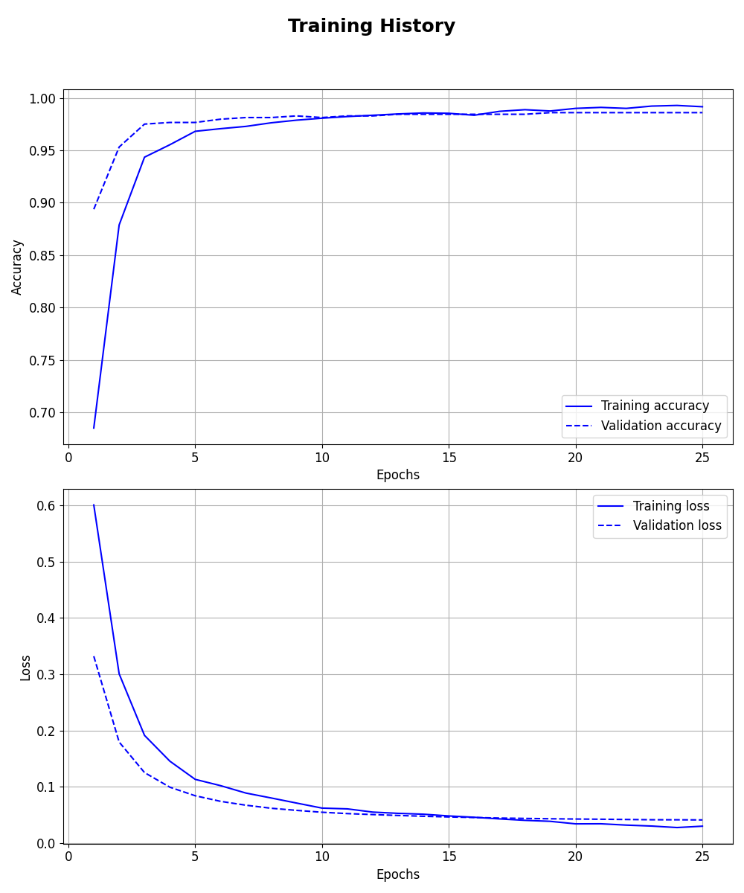

### Detailed Report of Test Set:

|              | precision    | recall       | f1-score     | support      |
| ------------ | ------------ | ------------ | ------------ | ------------ |
| chihuahua    | 0.9792       | 0.9874       | 0.9833       | 477          | 
| muffin       | 0.9854       | 0.9760       | 0.9807       | 416          | 
| micro avg    | 0.9821       | 0.9821       | 0.9821       | 893          | 
| macro avg    | 0.9823       | 0.9817       | 0.9820       | 893          | 
| weighted avg | 0.9821       | 0.9821       | 0.9821       | 893          | 
| samples avg  | 0.9821       | 0.9821       | 0.9821       | 893          | 

## trial_74

*    *Start Time*: 2024-10-23 08:49:55

*    *Duration*: 21.162

*    *Directory*: [Link](./trial_74)

### Hyperparameters:

| Hyperparameter         | Value                  |
| ---------------------- | ---------------------- |
| dense_units            | 512                    |
| dropout_rate           | 0.3807571660972885     |
| learning_rate          | 2.4128773899546423e-05 |

### Evaluation Metrics:

|           | train     | val       | test      |
| --------- | --------- | --------- | --------- |
| accuracy  | 0.9972    | 0.9859    | 0.9821    | 
| precision | 0.9972    | 0.9859    | 0.9821    | 
| recall    | 0.9972    | 0.9859    | 0.9821    | 
| f1        | 0.9972    | 0.9859    | 0.9821    | 

### Figures:

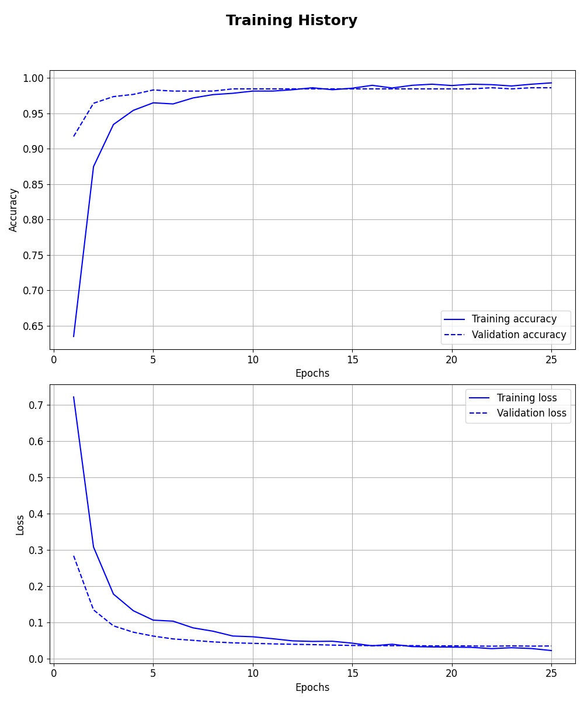

### Detailed Report of Test Set:

|              | precision    | recall       | f1-score     | support      |
| ------------ | ------------ | ------------ | ------------ | ------------ |
| chihuahua    | 0.9772       | 0.9895       | 0.9833       | 477          | 
| muffin       | 0.9878       | 0.9736       | 0.9806       | 416          | 
| micro avg    | 0.9821       | 0.9821       | 0.9821       | 893          | 
| macro avg    | 0.9825       | 0.9815       | 0.9820       | 893          | 
| weighted avg | 0.9822       | 0.9821       | 0.9821       | 893          | 
| samples avg  | 0.9821       | 0.9821       | 0.9821       | 893          | 

## trial_77

*    *Start Time*: 2024-10-23 08:51:05

*    *Duration*: 21.146

*    *Directory*: [Link](./trial_77)

### Hyperparameters:

| Hyperparameter        | Value                 |
| --------------------- | --------------------- |
| dense_units           | 512                   |
| dropout_rate          | 0.4065218139303472    |
| learning_rate         | 1.791178358168555e-05 |

### Evaluation Metrics:

|           | train     | val       | test      |
| --------- | --------- | --------- | --------- |
| accuracy  | 0.9950    | 0.9859    | 0.9821    | 
| precision | 0.9950    | 0.9859    | 0.9821    | 
| recall    | 0.9950    | 0.9859    | 0.9821    | 
| f1        | 0.9950    | 0.9859    | 0.9821    | 

### Figures:

### Detailed Report of Test Set:

|              | precision    | recall       | f1-score     | support      |
| ------------ | ------------ | ------------ | ------------ | ------------ |
| chihuahua    | 0.9772       | 0.9895       | 0.9833       | 477          | 
| muffin       | 0.9878       | 0.9736       | 0.9806       | 416          | 
| micro avg    | 0.9821       | 0.9821       | 0.9821       | 893          | 
| macro avg    | 0.9825       | 0.9815       | 0.9820       | 893          | 
| weighted avg | 0.9822       | 0.9821       | 0.9821       | 893          | 
| samples avg  | 0.9821       | 0.9821       | 0.9821       | 893          | 

## trial_80

*    *Start Time*: 2024-10-23 08:52:15

*    *Duration*: 20.895

*    *Directory*: [Link](./trial_80)

### Hyperparameters:

| Hyperparameter         | Value                  |
| ---------------------- | ---------------------- |
| dense_units            | 512                    |
| dropout_rate           | 0.33567484538066134    |
| learning_rate          | 2.6247992542590503e-05 |

### Evaluation Metrics:

|           | train     | val       | test      |
| --------- | --------- | --------- | --------- |
| accuracy  | 0.9978    | 0.9891    | 0.9821    | 
| precision | 0.9978    | 0.9891    | 0.9821    | 
| recall    | 0.9978    | 0.9891    | 0.9821    | 
| f1        | 0.9978    | 0.9891    | 0.9821    | 

### Figures:

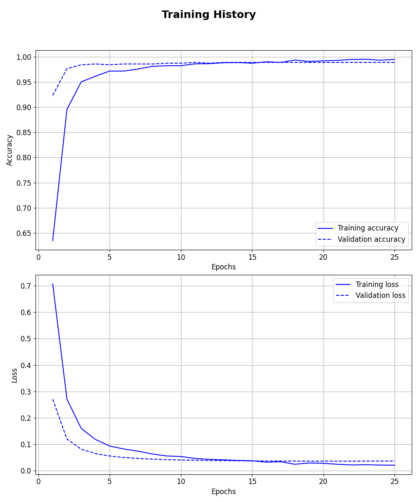

### Detailed Report of Test Set:

|              | precision    | recall       | f1-score     | support      |
| ------------ | ------------ | ------------ | ------------ | ------------ |
| chihuahua    | 0.9792       | 0.9874       | 0.9833       | 477          | 
| muffin       | 0.9854       | 0.9760       | 0.9807       | 416          | 
| micro avg    | 0.9821       | 0.9821       | 0.9821       | 893          | 
| macro avg    | 0.9823       | 0.9817       | 0.9820       | 893          | 
| weighted avg | 0.9821       | 0.9821       | 0.9821       | 893          | 
| samples avg  | 0.9821       | 0.9821       | 0.9821       | 893          | 

## trial_88

*    *Start Time*: 2024-10-23 08:55:22

*    *Duration*: 21.151

*    *Directory*: [Link](./trial_88)

### Hyperparameters:

| Hyperparameter        | Value                 |
| --------------------- | --------------------- |
| dense_units           | 512                   |
| dropout_rate          | 0.37132090000481177   |
| learning_rate         | 3.177687855006244e-05 |

### Evaluation Metrics:

|           | train     | val       | test      |
| --------- | --------- | --------- | --------- |
| accuracy  | 0.9987    | 0.9875    | 0.9821    | 
| precision | 0.9987    | 0.9875    | 0.9821    | 
| recall    | 0.9987    | 0.9875    | 0.9821    | 
| f1        | 0.9987    | 0.9875    | 0.9821    | 

### Figures:

### Detailed Report of Test Set:

|              | precision    | recall       | f1-score     | support      |
| ------------ | ------------ | ------------ | ------------ | ------------ |
| chihuahua    | 0.9792       | 0.9874       | 0.9833       | 477          | 
| muffin       | 0.9854       | 0.9760       | 0.9807       | 416          | 
| micro avg    | 0.9821       | 0.9821       | 0.9821       | 893          | 
| macro avg    | 0.9823       | 0.9817       | 0.9820       | 893          | 
| weighted avg | 0.9821       | 0.9821       | 0.9821       | 893          | 
| samples avg  | 0.9821       | 0.9821       | 0.9821       | 893          | 

## trial_2

*    *Start Time*: 2024-10-23 08:22:34

*    *Duration*: 24.230

*    *Directory*: [Link](./trial_2)

### Hyperparameters:

| Hyperparameter         | Value                  |
| ---------------------- | ---------------------- |
| dense_units            | 256                    |
| dropout_rate           | 0.11335966061241398    |
| learning_rate          | 2.6026128455996584e-05 |

### Evaluation Metrics:

|           | train     | val       | test      |
| --------- | --------- | --------- | --------- |
| accuracy  | 0.9962    | 0.9875    | 0.9810    | 
| precision | 0.9962    | 0.9875    | 0.9810    | 
| recall    | 0.9962    | 0.9875    | 0.9810    | 
| f1        | 0.9962    | 0.9875    | 0.9810    | 

### Figures:

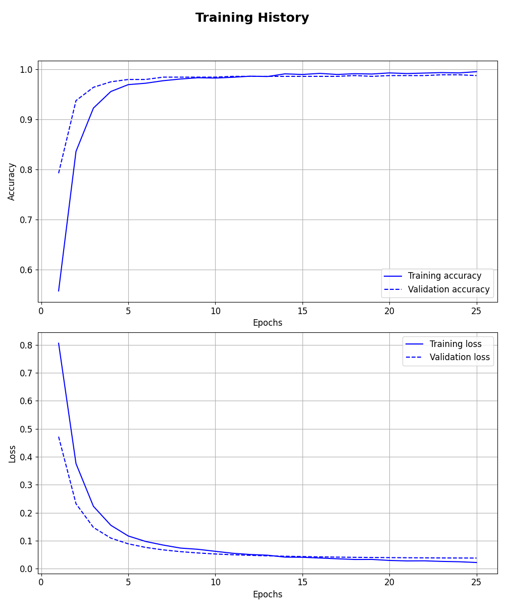

### Detailed Report of Test Set:

|              | precision    | recall       | f1-score     | support      |
| ------------ | ------------ | ------------ | ------------ | ------------ |
| chihuahua    | 0.9812       | 0.9832       | 0.9822       | 477          | 
| muffin       | 0.9807       | 0.9784       | 0.9795       | 416          | 
| micro avg    | 0.9810       | 0.9810       | 0.9810       | 893          | 
| macro avg    | 0.9809       | 0.9808       | 0.9809       | 893          | 
| weighted avg | 0.9810       | 0.9810       | 0.9810       | 893          | 
| samples avg  | 0.9810       | 0.9810       | 0.9810       | 893          | 

## trial_20

*    *Start Time*: 2024-10-23 08:29:22

*    *Duration*: 22.213

*    *Directory*: [Link](./trial_20)

### Hyperparameters:

| Hyperparameter         | Value                  |
| ---------------------- | ---------------------- |
| dense_units            | 512                    |
| dropout_rate           | 0.4440579190933088     |
| learning_rate          | 1.0339583539131823e-05 |

### Evaluation Metrics:

|           | train     | val       | test      |
| --------- | --------- | --------- | --------- |
| accuracy  | 0.9878    | 0.9875    | 0.9810    | 
| precision | 0.9878    | 0.9875    | 0.9810    | 
| recall    | 0.9878    | 0.9875    | 0.9810    | 
| f1        | 0.9878    | 0.9875    | 0.9810    | 

### Figures:

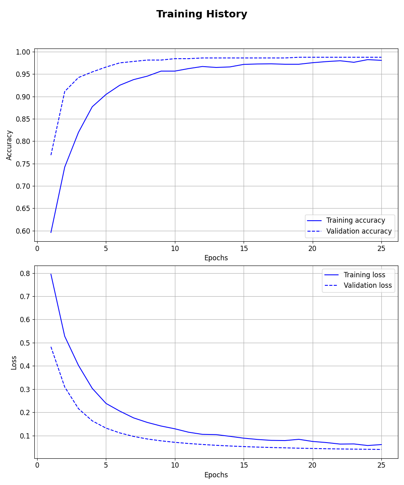

### Detailed Report of Test Set:

|              | precision    | recall       | f1-score     | support      |
| ------------ | ------------ | ------------ | ------------ | ------------ |
| chihuahua    | 0.9733       | 0.9916       | 0.9823       | 477          | 
| muffin       | 0.9902       | 0.9688       | 0.9793       | 416          | 
| micro avg    | 0.9810       | 0.9810       | 0.9810       | 893          | 
| macro avg    | 0.9817       | 0.9802       | 0.9808       | 893          | 
| weighted avg | 0.9811       | 0.9810       | 0.9809       | 893          | 
| samples avg  | 0.9810       | 0.9810       | 0.9810       | 893          | 

## trial_68

*    *Start Time*: 2024-10-23 08:47:37

*    *Duration*: 20.930

*    *Directory*: [Link](./trial_68)

### Hyperparameters:

| Hyperparameter        | Value                 |
| --------------------- | --------------------- |
| dense_units           | 512                   |
| dropout_rate          | 0.48783591226737677   |
| learning_rate         | 1.908518229919593e-05 |

### Evaluation Metrics:

|           | train     | val       | test      |
| --------- | --------- | --------- | --------- |
| accuracy  | 0.9944    | 0.9859    | 0.9810    | 
| precision | 0.9944    | 0.9859    | 0.9810    | 
| recall    | 0.9944    | 0.9859    | 0.9810    | 
| f1        | 0.9944    | 0.9859    | 0.9810    | 

### Figures:

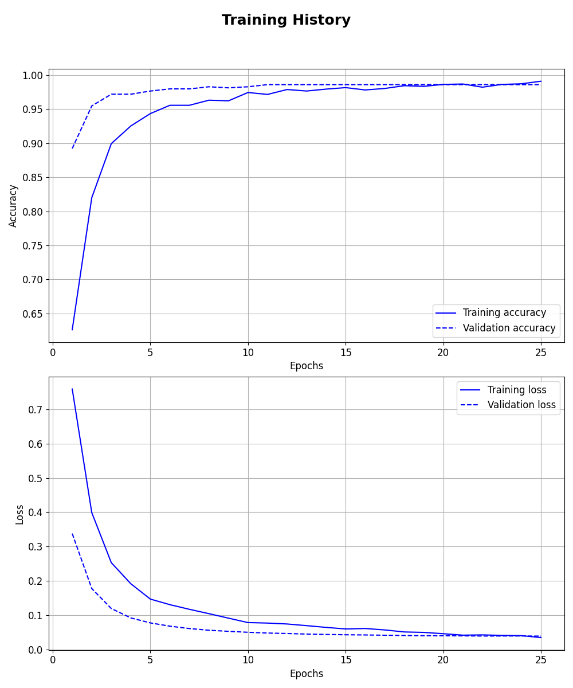

### Detailed Report of Test Set:

|              | precision    | recall       | f1-score     | support      |
| ------------ | ------------ | ------------ | ------------ | ------------ |
| chihuahua    | 0.9752       | 0.9895       | 0.9823       | 477          | 
| muffin       | 0.9878       | 0.9712       | 0.9794       | 416          | 
| micro avg    | 0.9810       | 0.9810       | 0.9810       | 893          | 
| macro avg    | 0.9815       | 0.9803       | 0.9809       | 893          | 
| weighted avg | 0.9811       | 0.9810       | 0.9810       | 893          | 
| samples avg  | 0.9810       | 0.9810       | 0.9810       | 893          | 

## trial_94

*    *Start Time*: 2024-10-23 08:57:44

*    *Duration*: 21.020

*    *Directory*: [Link](./trial_94)

### Hyperparameters:

| Hyperparameter        | Value                 |
| --------------------- | --------------------- |
| dense_units           | 256                   |
| dropout_rate          | 0.26597813048668306   |
| learning_rate         | 3.425150625695044e-05 |

### Evaluation Metrics:

|           | train     | val       | test      |
| --------- | --------- | --------- | --------- |
| accuracy  | 0.9975    | 0.9875    | 0.9810    | 
| precision | 0.9975    | 0.9875    | 0.9810    | 
| recall    | 0.9975    | 0.9875    | 0.9810    | 
| f1        | 0.9975    | 0.9875    | 0.9810    | 

### Figures:

### Detailed Report of Test Set:

|              | precision    | recall       | f1-score     | support      |
| ------------ | ------------ | ------------ | ------------ | ------------ |
| chihuahua    | 0.9752       | 0.9895       | 0.9823       | 477          | 
| muffin       | 0.9878       | 0.9712       | 0.9794       | 416          | 
| micro avg    | 0.9810       | 0.9810       | 0.9810       | 893          | 
| macro avg    | 0.9815       | 0.9803       | 0.9809       | 893          | 
| weighted avg | 0.9811       | 0.9810       | 0.9810       | 893          | 
| samples avg  | 0.9810       | 0.9810       | 0.9810       | 893          | 

## trial_59

*    *Start Time*: 2024-10-23 08:44:11

*    *Duration*: 20.786

*    *Directory*: [Link](./trial_59)

### Hyperparameters:

| Hyperparameter         | Value                  |
| ---------------------- | ---------------------- |
| dense_units            | 128                    |
| dropout_rate           | 0.4606890123413379     |
| learning_rate          | 3.5020321804385535e-05 |

### Evaluation Metrics:

|           | train     | val       | test      |
| --------- | --------- | --------- | --------- |
| accuracy  | 0.9934    | 0.9875    | 0.9798    | 
| precision | 0.9934    | 0.9875    | 0.9798    | 
| recall    | 0.9934    | 0.9875    | 0.9798    | 
| f1        | 0.9934    | 0.9875    | 0.9798    | 

### Figures:

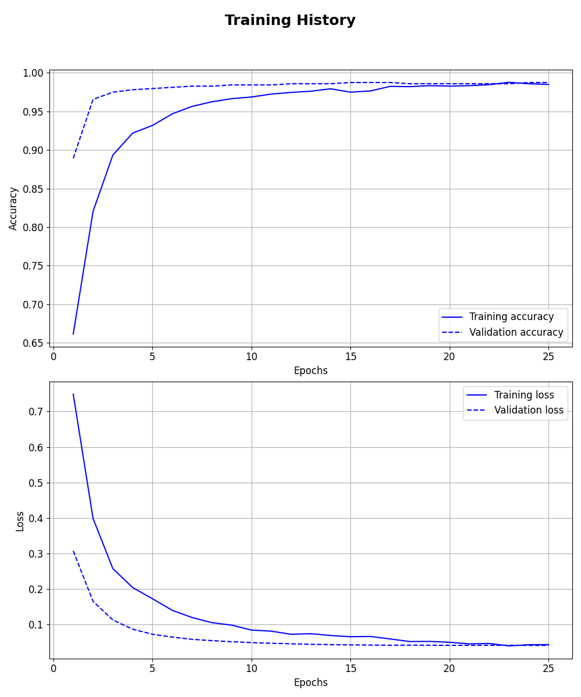

### Detailed Report of Test Set:

|              | precision    | recall       | f1-score     | support      |
| ------------ | ------------ | ------------ | ------------ | ------------ |
| chihuahua    | 0.9732       | 0.9895       | 0.9813       | 477          | 
| muffin       | 0.9877       | 0.9688       | 0.9782       | 416          | 
| micro avg    | 0.9798       | 0.9798       | 0.9798       | 893          | 
| macro avg    | 0.9805       | 0.9791       | 0.9797       | 893          | 
| weighted avg | 0.9800       | 0.9798       | 0.9798       | 893          | 
| samples avg  | 0.9798       | 0.9798       | 0.9798       | 893          | 

## trial_66

*    *Start Time*: 2024-10-23 08:46:51

*    *Duration*: 21.025

*    *Directory*: [Link](./trial_66)

### Hyperparameters:

| Hyperparameter        | Value                 |
| --------------------- | --------------------- |
| dense_units           | 512                   |
| dropout_rate          | 0.3833154196834341    |
| learning_rate         | 1.634410508999156e-05 |

### Evaluation Metrics:

|           | train     | val       | test      |
| --------- | --------- | --------- | --------- |
| accuracy  | 0.9947    | 0.9859    | 0.9798    | 
| precision | 0.9947    | 0.9859    | 0.9798    | 
| recall    | 0.9947    | 0.9859    | 0.9798    | 
| f1        | 0.9947    | 0.9859    | 0.9798    | 

### Figures:

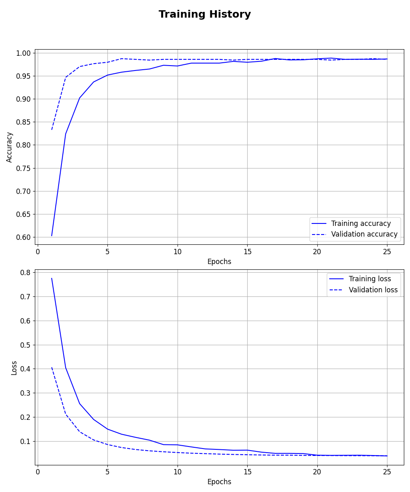

### Detailed Report of Test Set:

|              | precision    | recall       | f1-score     | support      |
| ------------ | ------------ | ------------ | ------------ | ------------ |
| chihuahua    | 0.9771       | 0.9853       | 0.9812       | 477          | 
| muffin       | 0.9830       | 0.9736       | 0.9783       | 416          | 
| micro avg    | 0.9798       | 0.9798       | 0.9798       | 893          | 
| macro avg    | 0.9801       | 0.9794       | 0.9797       | 893          | 
| weighted avg | 0.9799       | 0.9798       | 0.9798       | 893          | 
| samples avg  | 0.9798       | 0.9798       | 0.9798       | 893          | 

## trial_11

*    *Start Time*: 2024-10-23 08:25:59

*    *Duration*: 21.623

*    *Directory*: [Link](./trial_11)

### Hyperparameters:

| Hyperparameter        | Value                 |
| --------------------- | --------------------- |
| dense_units           | 512                   |
| dropout_rate          | 0.47798041416634385   |
| learning_rate         | 1.135292534178908e-05 |

### Evaluation Metrics:

|           | train     | val       | test      |
| --------- | --------- | --------- | --------- |
| accuracy  | 0.9928    | 0.9891    | 0.9787    | 
| precision | 0.9928    | 0.9891    | 0.9787    | 
| recall    | 0.9928    | 0.9891    | 0.9787    | 
| f1        | 0.9928    | 0.9891    | 0.9787    | 

### Figures:

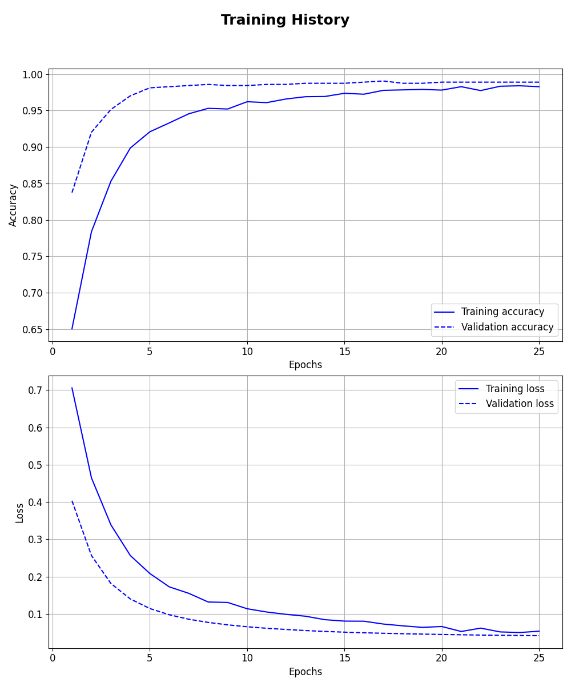

### Detailed Report of Test Set:

|              | precision    | recall       | f1-score     | support      |
| ------------ | ------------ | ------------ | ------------ | ------------ |
| chihuahua    | 0.9751       | 0.9853       | 0.9802       | 477          | 
| muffin       | 0.9830       | 0.9712       | 0.9770       | 416          | 
| micro avg    | 0.9787       | 0.9787       | 0.9787       | 893          | 
| macro avg    | 0.9790       | 0.9782       | 0.9786       | 893          | 
| weighted avg | 0.9788       | 0.9787       | 0.9787       | 893          | 
| samples avg  | 0.9787       | 0.9787       | 0.9787       | 893          | 

## trial_44

*    *Start Time*: 2024-10-23 08:38:29

*    *Duration*: 21.254

*    *Directory*: [Link](./trial_44)

### Hyperparameters:

| Hyperparameter         | Value                  |
| ---------------------- | ---------------------- |
| dense_units            | 512                    |
| dropout_rate           | 0.365182597129303      |
| learning_rate          | 1.2883070605895913e-05 |

### Evaluation Metrics:

|           | train     | val       | test      |
| --------- | --------- | --------- | --------- |
| accuracy  | 0.9931    | 0.9906    | 0.9787    | 
| precision | 0.9931    | 0.9906    | 0.9787    | 
| recall    | 0.9931    | 0.9906    | 0.9787    | 
| f1        | 0.9931    | 0.9906    | 0.9787    | 

### Figures:

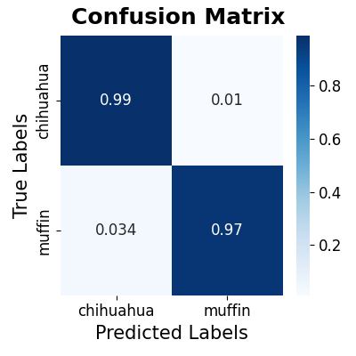

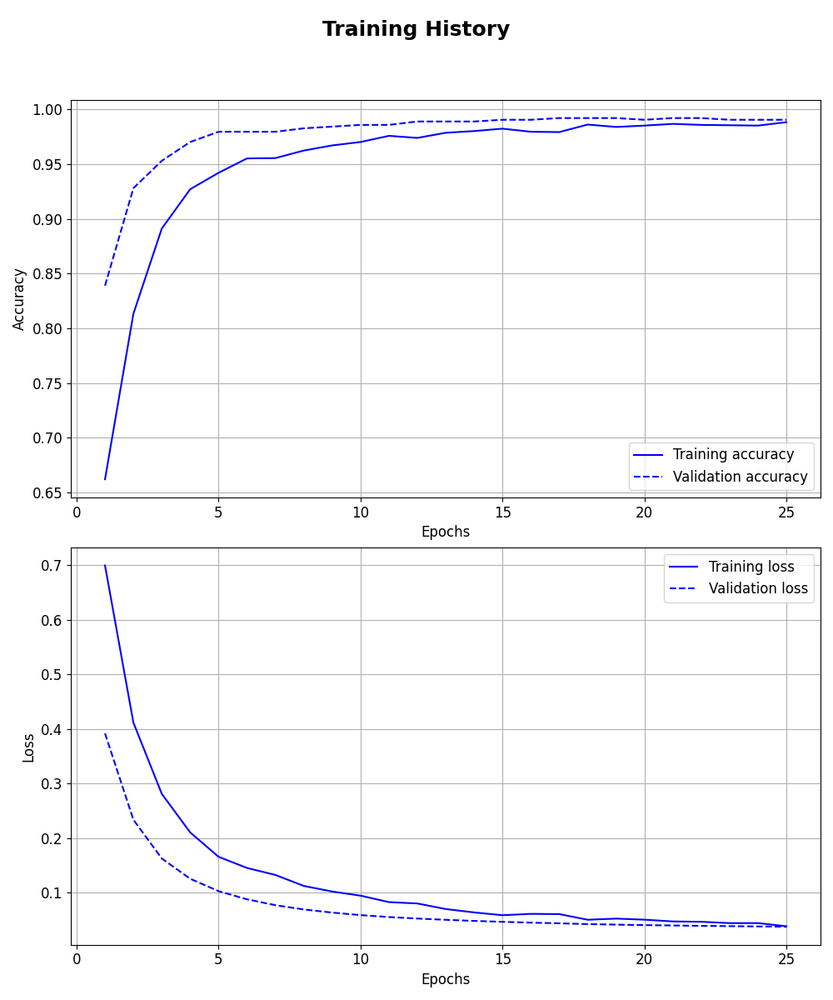

### Detailed Report of Test Set:

|              | precision    | recall       | f1-score     | support      |
| ------------ | ------------ | ------------ | ------------ | ------------ |
| chihuahua    | 0.9712       | 0.9895       | 0.9803       | 477          | 
| muffin       | 0.9877       | 0.9663       | 0.9769       | 416          | 
| micro avg    | 0.9787       | 0.9787       | 0.9787       | 893          | 
| macro avg    | 0.9795       | 0.9779       | 0.9786       | 893          | 
| weighted avg | 0.9789       | 0.9787       | 0.9787       | 893          | 
| samples avg  | 0.9787       | 0.9787       | 0.9787       | 893          | 

## trial_67

*    *Start Time*: 2024-10-23 08:47:14

*    *Duration*: 20.948

*    *Directory*: [Link](./trial_67)

### Hyperparameters:

| Hyperparameter         | Value                  |
| ---------------------- | ---------------------- |
| dense_units            | 512                    |
| dropout_rate           | 0.4351654716716183     |
| learning_rate          | 1.3042658639188106e-05 |

### Evaluation Metrics:

|           | train     | val       | test      |
| --------- | --------- | --------- | --------- |
| accuracy  | 0.9912    | 0.9859    | 0.9787    | 
| precision | 0.9912    | 0.9859    | 0.9787    | 
| recall    | 0.9912    | 0.9859    | 0.9787    | 
| f1        | 0.9912    | 0.9859    | 0.9787    | 

### Figures:

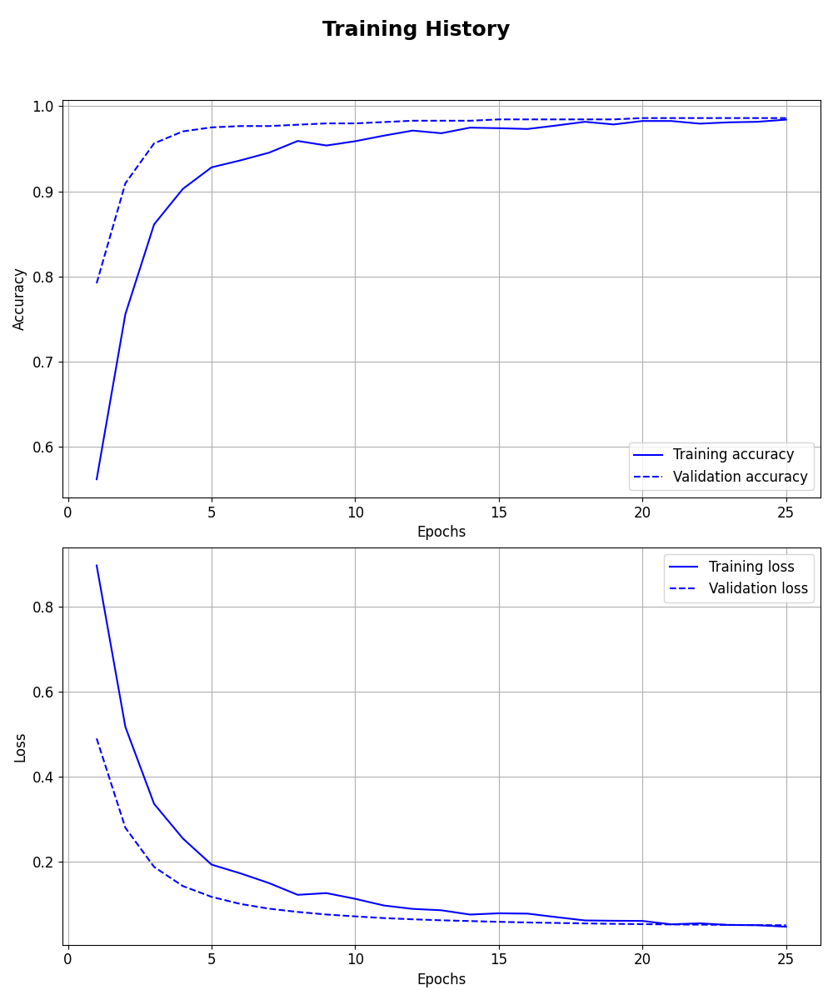

### Detailed Report of Test Set:

|              | precision    | recall       | f1-score     | support      |
| ------------ | ------------ | ------------ | ------------ | ------------ |
| chihuahua    | 0.9751       | 0.9853       | 0.9802       | 477          | 
| muffin       | 0.9830       | 0.9712       | 0.9770       | 416          | 
| micro avg    | 0.9787       | 0.9787       | 0.9787       | 893          | 
| macro avg    | 0.9790       | 0.9782       | 0.9786       | 893          | 
| weighted avg | 0.9788       | 0.9787       | 0.9787       | 893          | 
| samples avg  | 0.9787       | 0.9787       | 0.9787       | 893          | 

## trial_26

*    *Start Time*: 2024-10-23 08:31:40

*    *Duration*: 22.256

*    *Directory*: [Link](./trial_26)

### Hyperparameters:

| Hyperparameter         | Value                  |
| ---------------------- | ---------------------- |
| dense_units            | 512                    |
| dropout_rate           | 0.44421113381181854    |
| learning_rate          | 1.5031842129389874e-05 |

### Evaluation Metrics:

|           | train     | val       | test      |
| --------- | --------- | --------- | --------- |
| accuracy  | 0.9931    | 0.9875    | 0.9765    | 
| precision | 0.9931    | 0.9875    | 0.9765    | 
| recall    | 0.9931    | 0.9875    | 0.9765    | 
| f1        | 0.9931    | 0.9875    | 0.9765    | 

### Figures:

### Detailed Report of Test Set:

|              | precision    | recall       | f1-score     | support      |
| ------------ | ------------ | ------------ | ------------ | ------------ |
| chihuahua    | 0.9730       | 0.9832       | 0.9781       | 477          | 
| muffin       | 0.9805       | 0.9688       | 0.9746       | 416          | 
| micro avg    | 0.9765       | 0.9765       | 0.9765       | 893          | 
| macro avg    | 0.9768       | 0.9760       | 0.9764       | 893          | 
| weighted avg | 0.9765       | 0.9765       | 0.9765       | 893          | 
| samples avg  | 0.9765       | 0.9765       | 0.9765       | 893          | 

