# Experiment Report: MNIST Digits Experiment

## Metadata

*    *Description*: In this experiment, a neural network is trained with different hyperparameters to classify MNIST digits.

*    *Start Time*: 2025-03-12 15:28:06

*    *Last Resume Time*: 2025-03-12 15:32:27

*    *Total Duration*: 0:02:10.094

*    *Directory*: [Link](./.)

## Initial Visualizations

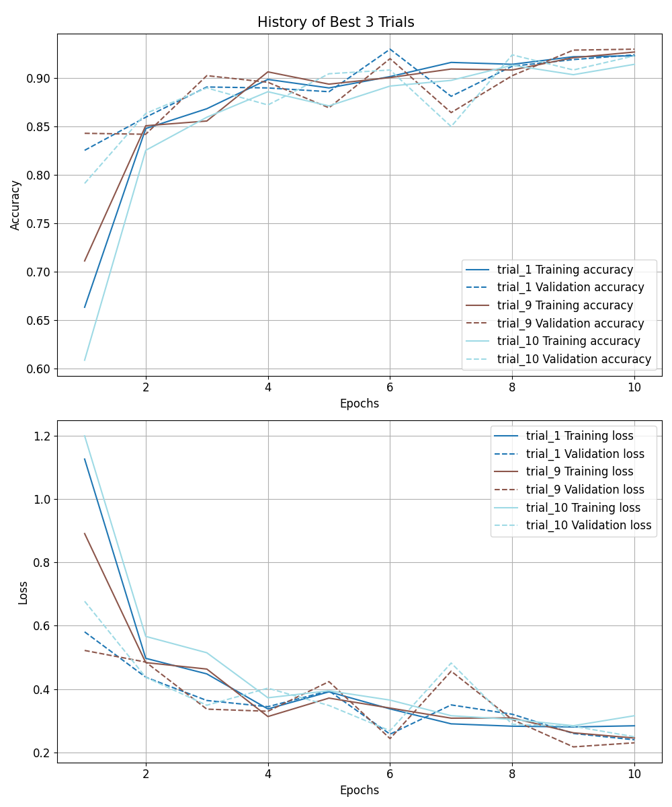

## Summary

### Hyperparameters

|               | units1        | units2        | learning_rate | Chapters      |
| ------------- | ------------- | ------------- | ------------- | ------------- |
| trial_1       | 128           | 32            | 0.0015        | [Chapter](#trial_1) | 
| trial_9       | 128           | 128           | 0.0035        | [Chapter](#trial_9) | 
| trial_10      | 32            | 64            | 0.0033        | [Chapter](#trial_10) | 
| trial_7       | 128           | 64            | 0.0133        | [Chapter](#trial_7) | 
| trial_6       | 32            | 64            | 0.0057        | [Chapter](#trial_6) | 
| trial_3       | 128           | 128           | 0.0134        | [Chapter](#trial_3) | 
| trial_8       | 128           | 64            | 0.0285        | [Chapter](#trial_8) | 
| trial_5       | 32            | 64            | 0.0250        | [Chapter](#trial_5) | 
| trial_4       | 64            | 128           | 0.0248        | [Chapter](#trial_4) | 
| trial_2       | 32            | 128           | 0.0357        | [Chapter](#trial_2) | 

### Test Results

|           | accuracy  | precision | recall    | f1        | Chapters  |
| --------- | --------- | --------- | --------- | --------- | --------- |
| trial_1   | 0.9870    | 0.9519    | 0.9187    | 0.9350    | [Chapter](#trial_1) | 
| trial_9   | 0.9851    | 0.9388    | 0.9143    | 0.9264    | [Chapter](#trial_9) | 
| trial_10  | 0.9850    | 0.9448    | 0.9063    | 0.9252    | [Chapter](#trial_10) | 
| trial_7   | 0.9829    | 0.9388    | 0.9002    | 0.9191    | [Chapter](#trial_7) | 
| trial_6   | 0.9789    | 0.9208    | 0.8679    | 0.8936    | [Chapter](#trial_6) | 
| trial_3   | 0.9785    | 0.9322    | 0.8609    | 0.8951    | [Chapter](#trial_3) | 
| trial_8   | 0.9767    | 0.9265    | 0.8494    | 0.8863    | [Chapter](#trial_8) | 
| trial_5   | 0.9753    | 0.9180    | 0.8366    | 0.8754    | [Chapter](#trial_5) | 
| trial_4   | 0.9649    | 0.8832    | 0.7526    | 0.8127    | [Chapter](#trial_4) | 
| trial_2   | 0.8910    | 0.6990    | 0.2681    | 0.3875    | [Chapter](#trial_2) | 

## trial_1

*    *Start Time*: 2025-03-12 15:32:27

*    *Duration*: 13.710

*    *Directory*: [Link](./trial_1)

### Hyperparameters:

| Hyperparameter        | Value                 |
| --------------------- | --------------------- |
| units1                | 128                   |
| units2                | 32                    |
| learning_rate         | 0.0015234195168745124 |

### Evaluation Metrics:

|           | train     | val       | test      |
| --------- | --------- | --------- | --------- |
| accuracy  | 0.9861    | 0.9847    | 0.9870    | 
| precision | 0.9463    | 0.9427    | 0.9519    | 
| recall    | 0.9145    | 0.9064    | 0.9187    | 
| f1        | 0.9301    | 0.9242    | 0.9350    | 

### Figures:

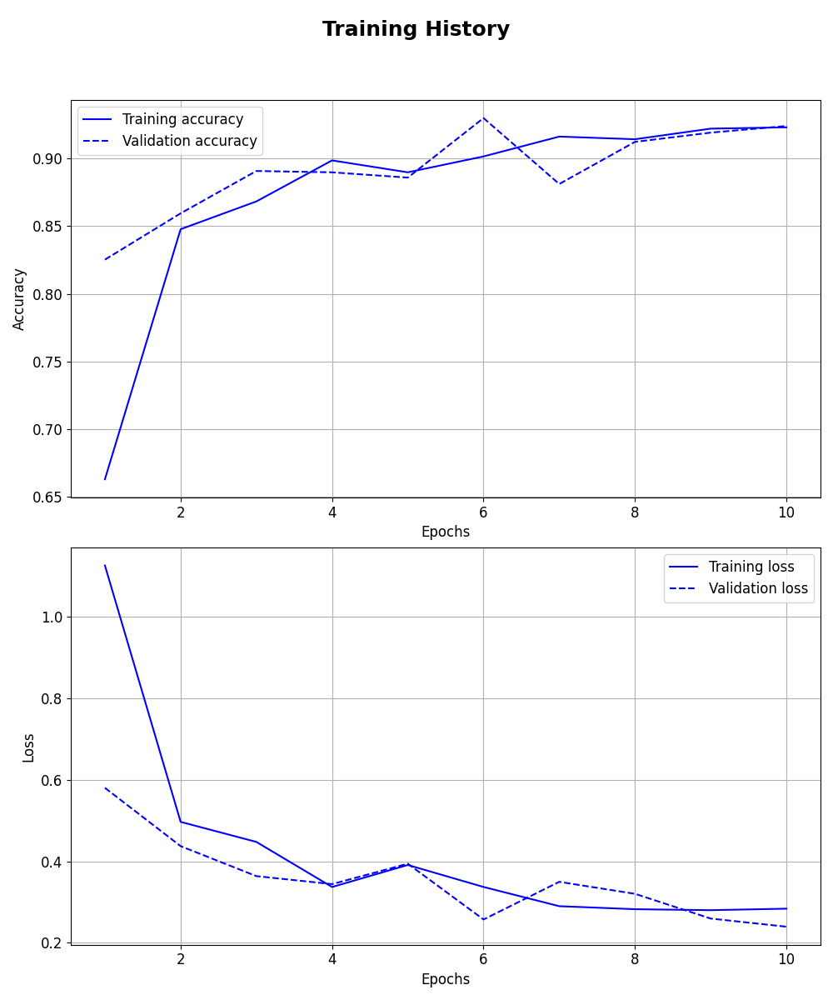

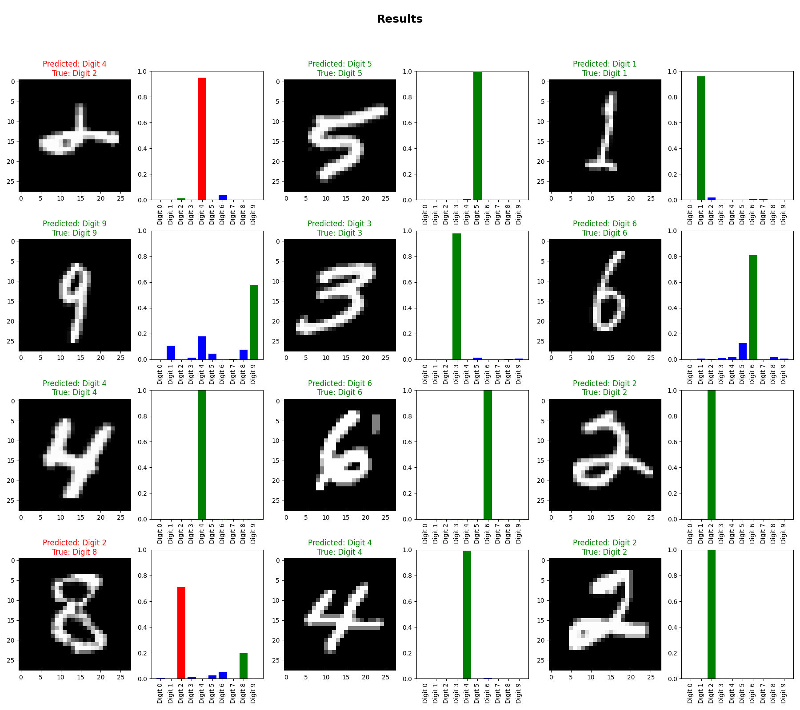

### Detailed Report of Test Set:

|              | precision    | recall       | f1-score     | support      |
| ------------ | ------------ | ------------ | ------------ | ------------ |
| Digit 0      | 0.9665       | 0.9582       | 0.9623       | 693          | 
| Digit 1      | 0.9431       | 0.9795       | 0.9609       | 829          | 
| Digit 2      | 0.9005       | 0.9437       | 0.9216       | 710          | 
| Digit 3      | 0.9209       | 0.9016       | 0.9111       | 671          | 
| Digit 4      | 0.9509       | 0.9342       | 0.9425       | 684          | 
| Digit 5      | 0.9106       | 0.9258       | 0.9181       | 660          | 
| Digit 6      | 0.9766       | 0.9515       | 0.9639       | 701          | 
| Digit 7      | 0.9535       | 0.9469       | 0.9502       | 715          | 
| Digit 8      | 0.9098       | 0.9045       | 0.9071       | 691          | 
| Digit 9      | 0.9141       | 0.8896       | 0.9017       | 670          | 
| micro avg    | 0.9348       | 0.9348       | 0.9348       | 7024         | 
| macro avg    | 0.9346       | 0.9335       | 0.9339       | 7024         | 
| weighted avg | 0.9350       | 0.9348       | 0.9348       | 7024         | 
| samples avg  | 0.9348       | 0.9348       | 0.9348       | 7024         | 

## trial_9

*    *Start Time*: 2025-03-12 15:34:10

*    *Duration*: 12.388

*    *Directory*: [Link](./trial_9)

### Hyperparameters:

| Hyperparameter        | Value                 |
| --------------------- | --------------------- |
| units1                | 128                   |
| units2                | 128                   |
| learning_rate         | 0.0034716752942109113 |

### Evaluation Metrics:

|           | train     | val       | test      |
| --------- | --------- | --------- | --------- |
| accuracy  | 0.9853    | 0.9844    | 0.9851    | 
| precision | 0.9393    | 0.9387    | 0.9388    | 
| recall    | 0.9153    | 0.9103    | 0.9143    | 
| f1        | 0.9271    | 0.9242    | 0.9264    | 

### Figures:

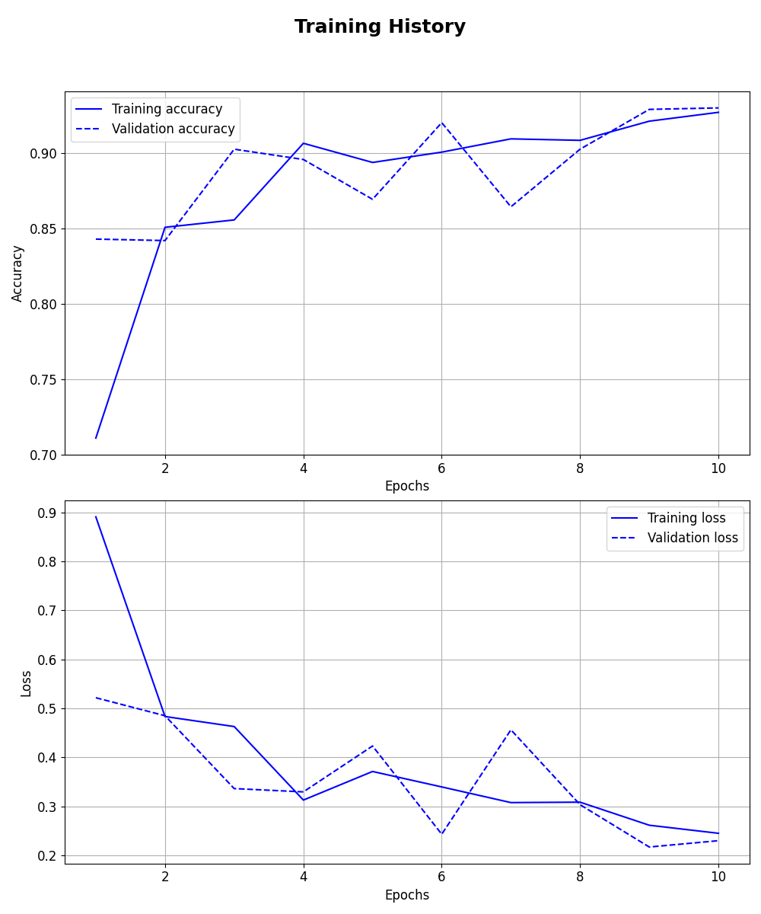

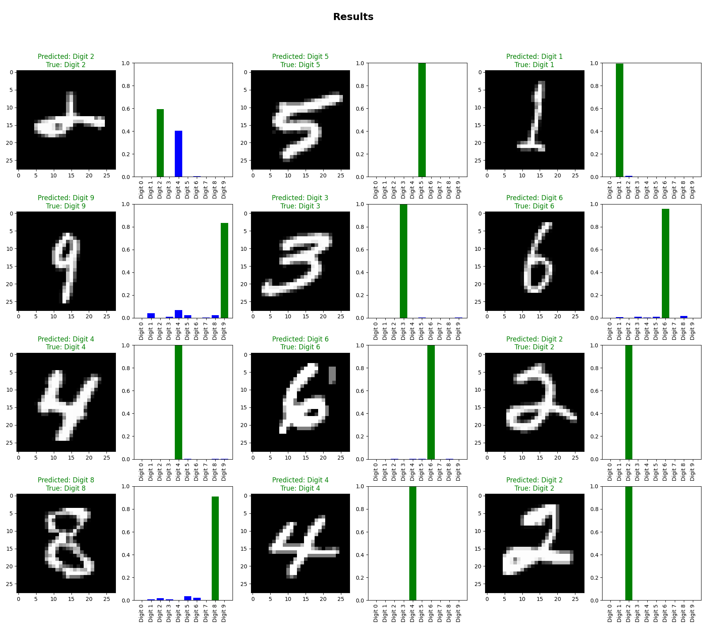

### Detailed Report of Test Set:

|              | precision    | recall       | f1-score     | support      |
| ------------ | ------------ | ------------ | ------------ | ------------ |
| Digit 0      | 0.9577       | 0.9466       | 0.9521       | 693          | 
| Digit 1      | 0.9518       | 0.9771       | 0.9643       | 829          | 
| Digit 2      | 0.9060       | 0.9366       | 0.9211       | 710          | 
| Digit 3      | 0.8558       | 0.9374       | 0.8947       | 671          | 
| Digit 4      | 0.9570       | 0.9108       | 0.9333       | 684          | 
| Digit 5      | 0.8879       | 0.9121       | 0.8999       | 660          | 
| Digit 6      | 0.9850       | 0.9372       | 0.9605       | 701          | 
| Digit 7      | 0.9747       | 0.9175       | 0.9452       | 715          | 
| Digit 8      | 0.8838       | 0.8915       | 0.8876       | 691          | 
| Digit 9      | 0.8959       | 0.8731       | 0.8844       | 670          | 
| micro avg    | 0.9253       | 0.9253       | 0.9253       | 7024         | 
| macro avg    | 0.9256       | 0.9240       | 0.9243       | 7024         | 
| weighted avg | 0.9267       | 0.9253       | 0.9255       | 7024         | 
| samples avg  | 0.9253       | 0.9253       | 0.9253       | 7024         | 

## trial_10

*    *Start Time*: 2025-03-12 15:34:24

*    *Duration*: 11.415

*    *Directory*: [Link](./trial_10)

### Hyperparameters:

| Hyperparameter        | Value                 |
| --------------------- | --------------------- |
| units1                | 32                    |
| units2                | 64                    |
| learning_rate         | 0.0032756369286111382 |

### Evaluation Metrics:

|           | train     | val       | test      |
| --------- | --------- | --------- | --------- |
| accuracy  | 0.9852    | 0.9835    | 0.9850    | 
| precision | 0.9452    | 0.9383    | 0.9448    | 
| recall    | 0.9081    | 0.8997    | 0.9063    | 
| f1        | 0.9263    | 0.9186    | 0.9252    | 

### Figures:

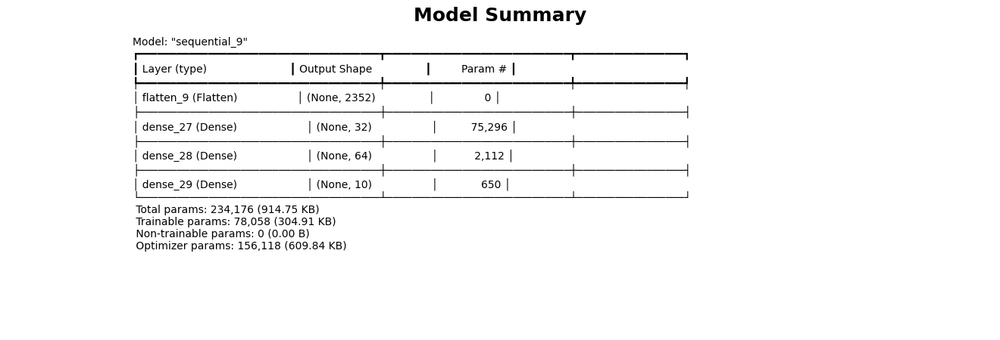

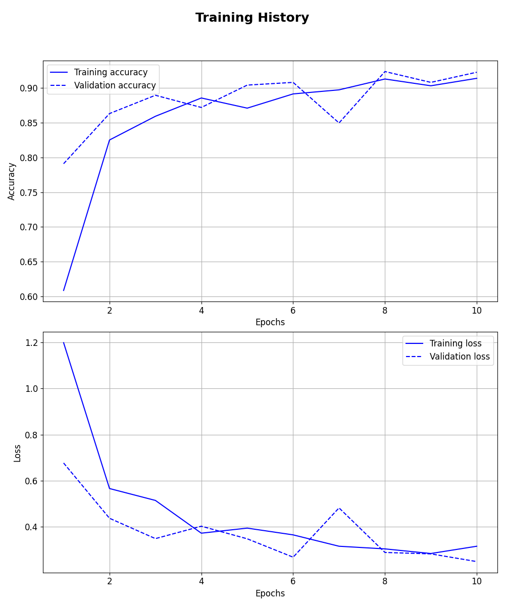

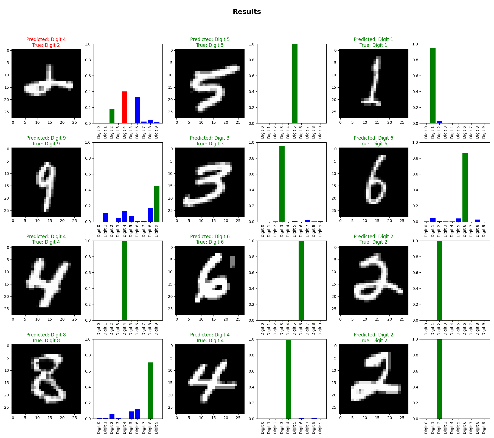

### Detailed Report of Test Set:

|              | precision    | recall       | f1-score     | support      |
| ------------ | ------------ | ------------ | ------------ | ------------ |
| Digit 0      | 0.9502       | 0.9639       | 0.9570       | 693          | 
| Digit 1      | 0.9585       | 0.9747       | 0.9665       | 829          | 
| Digit 2      | 0.9019       | 0.9197       | 0.9107       | 710          | 
| Digit 3      | 0.8898       | 0.9270       | 0.9080       | 671          | 
| Digit 4      | 0.9578       | 0.9298       | 0.9436       | 684          | 
| Digit 5      | 0.8678       | 0.8955       | 0.8814       | 660          | 
| Digit 6      | 0.9746       | 0.9301       | 0.9518       | 701          | 
| Digit 7      | 0.9302       | 0.9510       | 0.9405       | 715          | 
| Digit 8      | 0.8854       | 0.9059       | 0.8956       | 691          | 
| Digit 9      | 0.9303       | 0.8373       | 0.8814       | 670          | 
| micro avg    | 0.9250       | 0.9250       | 0.9250       | 7024         | 
| macro avg    | 0.9247       | 0.9235       | 0.9237       | 7024         | 
| weighted avg | 0.9257       | 0.9250       | 0.9249       | 7024         | 
| samples avg  | 0.9250       | 0.9250       | 0.9250       | 7024         | 

## trial_7

*    *Start Time*: 2025-03-12 15:33:45

*    *Duration*: 11.576

*    *Directory*: [Link](./trial_7)

### Hyperparameters:

| Hyperparameter       | Value                |
| -------------------- | -------------------- |
| units1               | 128                  |
| units2               | 64                   |
| learning_rate        | 0.013301330591864046 |

### Evaluation Metrics:

|           | train     | val       | test      |
| --------- | --------- | --------- | --------- |
| accuracy  | 0.9832    | 0.9821    | 0.9829    | 
| precision | 0.9400    | 0.9363    | 0.9388    | 
| recall    | 0.8985    | 0.8912    | 0.9002    | 
| f1        | 0.9188    | 0.9132    | 0.9191    | 

### Figures:

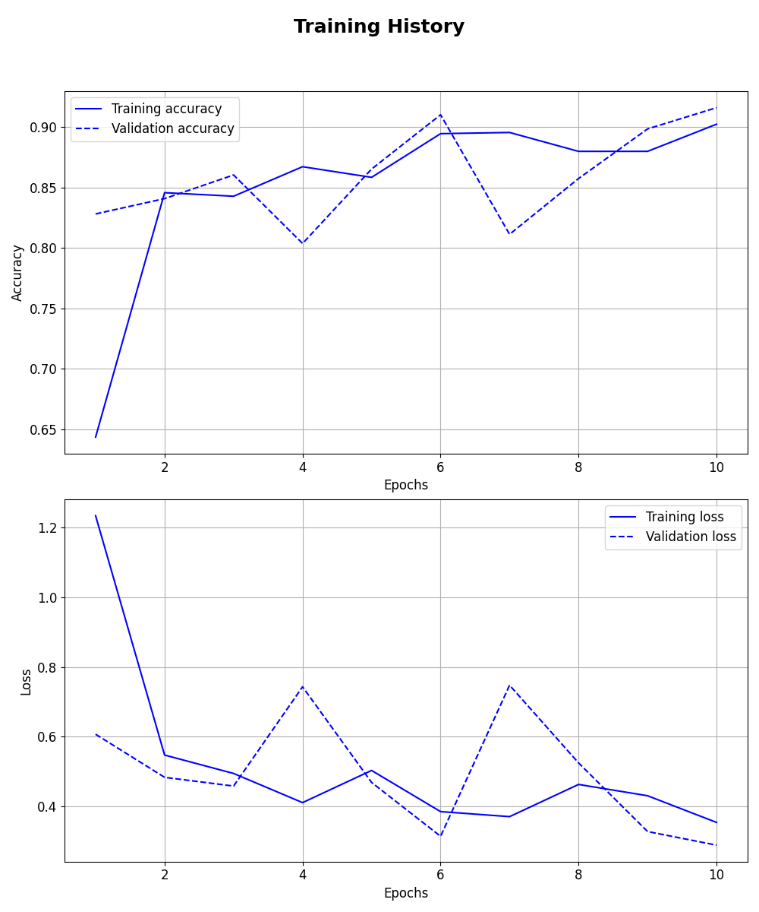

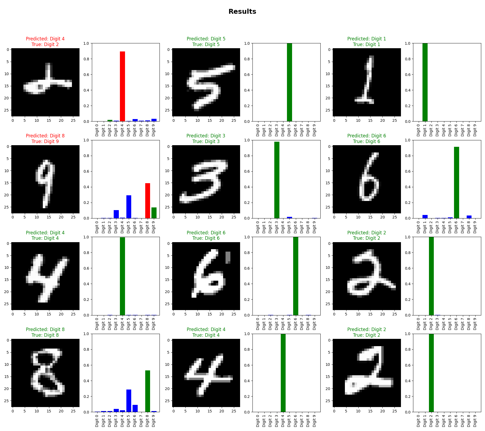

### Detailed Report of Test Set:

|              | precision    | recall       | f1-score     | support      |
| ------------ | ------------ | ------------ | ------------ | ------------ |
| Digit 0      | 0.9733       | 0.9466       | 0.9598       | 693          | 
| Digit 1      | 0.9675       | 0.9698       | 0.9687       | 829          | 
| Digit 2      | 0.9223       | 0.8859       | 0.9037       | 710          | 
| Digit 3      | 0.8381       | 0.9106       | 0.8729       | 671          | 
| Digit 4      | 0.9296       | 0.9269       | 0.9283       | 684          | 
| Digit 5      | 0.8844       | 0.9045       | 0.8944       | 660          | 
| Digit 6      | 0.9484       | 0.9444       | 0.9464       | 701          | 
| Digit 7      | 0.9373       | 0.9203       | 0.9287       | 715          | 
| Digit 8      | 0.8162       | 0.9320       | 0.8703       | 691          | 
| Digit 9      | 0.9413       | 0.7896       | 0.8588       | 670          | 
| micro avg    | 0.9146       | 0.9146       | 0.9146       | 7024         | 
| macro avg    | 0.9159       | 0.9131       | 0.9132       | 7024         | 
| weighted avg | 0.9173       | 0.9146       | 0.9147       | 7024         | 
| samples avg  | 0.9146       | 0.9146       | 0.9146       | 7024         | 

## trial_6

*    *Start Time*: 2025-03-12 15:33:32

*    *Duration*: 11.375

*    *Directory*: [Link](./trial_6)

### Hyperparameters:

| Hyperparameter       | Value                |
| -------------------- | -------------------- |
| units1               | 32                   |
| units2               | 64                   |
| learning_rate        | 0.005683132937340711 |

### Evaluation Metrics:

|           | train     | val       | test      |
| --------- | --------- | --------- | --------- |
| accuracy  | 0.9788    | 0.9769    | 0.9789    | 
| precision | 0.9193    | 0.9125    | 0.9208    | 
| recall    | 0.8711    | 0.8624    | 0.8679    | 
| f1        | 0.8945    | 0.8867    | 0.8936    | 

### Figures:

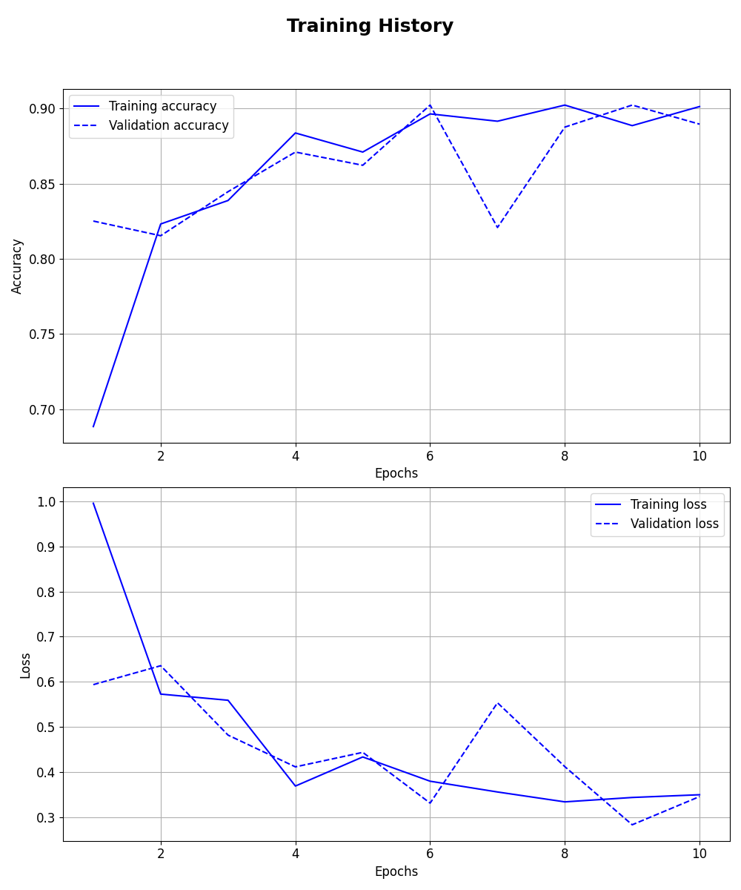

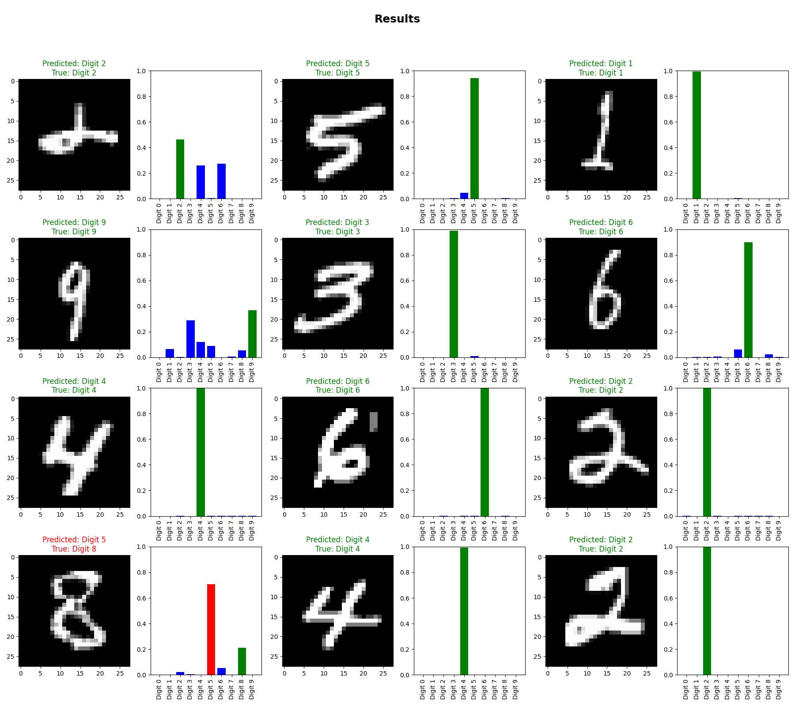

### Detailed Report of Test Set:

|              | precision    | recall       | f1-score     | support      |
| ------------ | ------------ | ------------ | ------------ | ------------ |
| Digit 0      | 0.9692       | 0.9538       | 0.9615       | 693          | 
| Digit 1      | 0.9368       | 0.9650       | 0.9507       | 829          | 
| Digit 2      | 0.8921       | 0.9085       | 0.9002       | 710          | 
| Digit 3      | 0.8843       | 0.8882       | 0.8862       | 671          | 
| Digit 4      | 0.8953       | 0.9123       | 0.9037       | 684          | 
| Digit 5      | 0.6970       | 0.9409       | 0.8008       | 660          | 
| Digit 6      | 0.9358       | 0.9572       | 0.9464       | 701          | 
| Digit 7      | 0.9205       | 0.9552       | 0.9375       | 715          | 
| Digit 8      | 0.9404       | 0.7077       | 0.8076       | 691          | 
| Digit 9      | 0.9427       | 0.7373       | 0.8275       | 670          | 
| micro avg    | 0.8946       | 0.8946       | 0.8946       | 7024         | 
| macro avg    | 0.9014       | 0.8926       | 0.8922       | 7024         | 
| weighted avg | 0.9030       | 0.8946       | 0.8942       | 7024         | 
| samples avg  | 0.8946       | 0.8946       | 0.8946       | 7024         | 

## trial_3

*    *Start Time*: 2025-03-12 15:32:55

*    *Duration*: 12.401

*    *Directory*: [Link](./trial_3)

### Hyperparameters:

| Hyperparameter       | Value                |
| -------------------- | -------------------- |
| units1               | 128                  |
| units2               | 128                  |
| learning_rate        | 0.013392061506961936 |

### Evaluation Metrics:

|           | train     | val       | test      |
| --------- | --------- | --------- | --------- |
| accuracy  | 0.9790    | 0.9769    | 0.9785    | 
| precision | 0.9326    | 0.9278    | 0.9322    | 
| recall    | 0.8639    | 0.8515    | 0.8609    | 
| f1        | 0.8969    | 0.8880    | 0.8951    | 

### Figures:

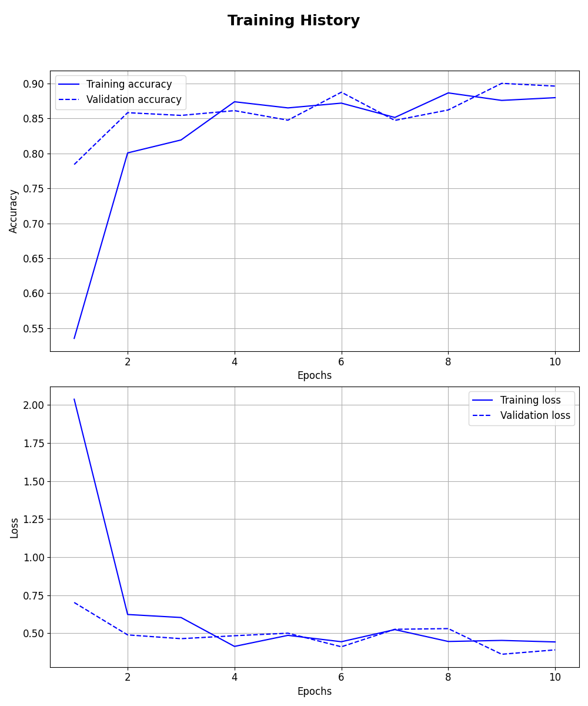

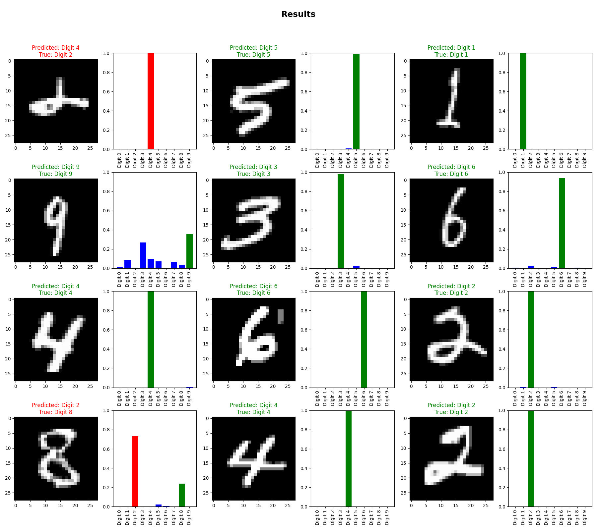

### Detailed Report of Test Set:

|              | precision    | recall       | f1-score     | support      |
| ------------ | ------------ | ------------ | ------------ | ------------ |
| Digit 0      | 0.9233       | 0.9726       | 0.9473       | 693          | 
| Digit 1      | 0.9714       | 0.9409       | 0.9559       | 829          | 
| Digit 2      | 0.8537       | 0.9042       | 0.8782       | 710          | 
| Digit 3      | 0.8413       | 0.8614       | 0.8513       | 671          | 
| Digit 4      | 0.8775       | 0.9108       | 0.8938       | 684          | 
| Digit 5      | 0.8142       | 0.8833       | 0.8474       | 660          | 
| Digit 6      | 0.9616       | 0.8930       | 0.9260       | 701          | 
| Digit 7      | 0.9138       | 0.9343       | 0.9239       | 715          | 
| Digit 8      | 0.8710       | 0.9088       | 0.8895       | 691          | 
| Digit 9      | 0.8929       | 0.6970       | 0.7829       | 670          | 
| micro avg    | 0.8925       | 0.8925       | 0.8925       | 7024         | 
| macro avg    | 0.8921       | 0.8906       | 0.8896       | 7024         | 
| weighted avg | 0.8942       | 0.8925       | 0.8917       | 7024         | 
| samples avg  | 0.8925       | 0.8925       | 0.8925       | 7024         | 

## trial_8

*    *Start Time*: 2025-03-12 15:33:57

*    *Duration*: 12.213

*    *Directory*: [Link](./trial_8)

### Hyperparameters:

| Hyperparameter       | Value                |
| -------------------- | -------------------- |
| units1               | 128                  |
| units2               | 64                   |
| learning_rate        | 0.028500260400307252 |

### Evaluation Metrics:

|           | train     | val       | test      |
| --------- | --------- | --------- | --------- |
| accuracy  | 0.9777    | 0.9767    | 0.9767    | 
| precision | 0.9289    | 0.9240    | 0.9265    | 
| recall    | 0.8528    | 0.8458    | 0.8494    | 
| f1        | 0.8892    | 0.8832    | 0.8863    | 

### Figures:

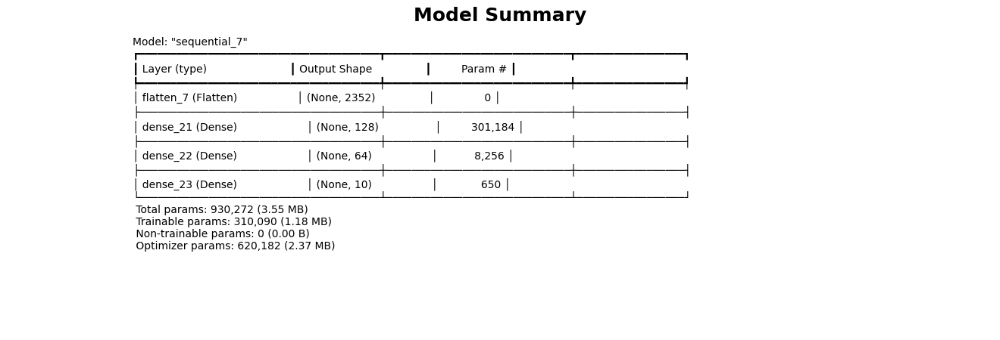

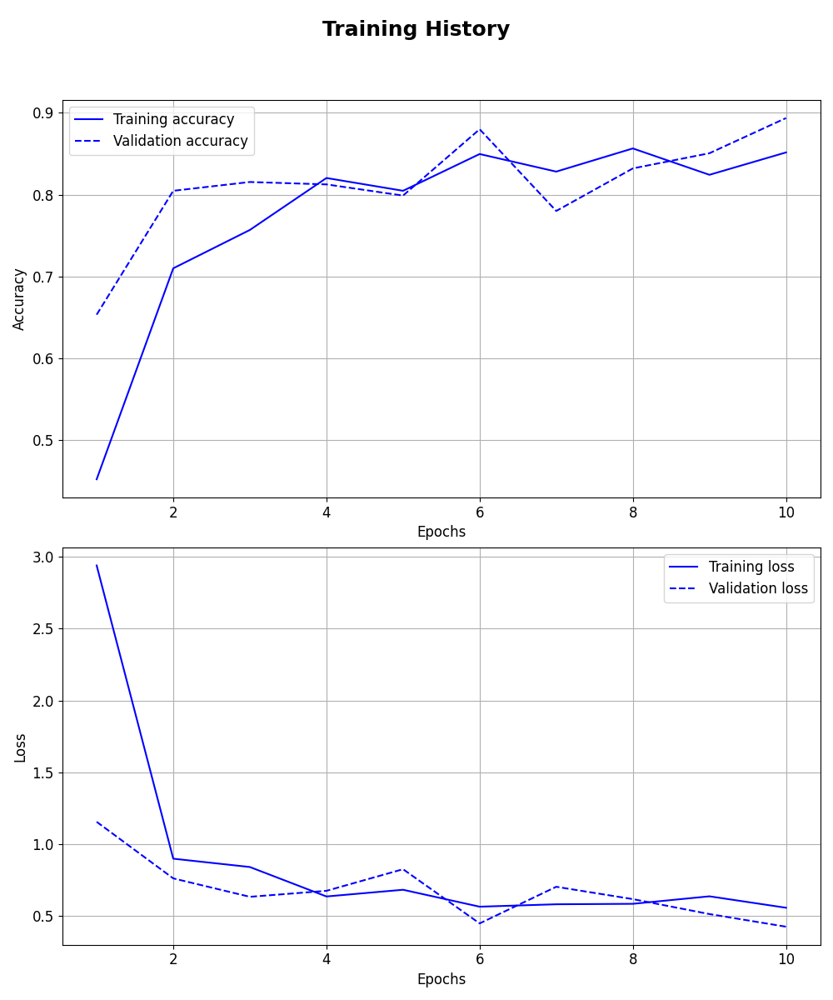

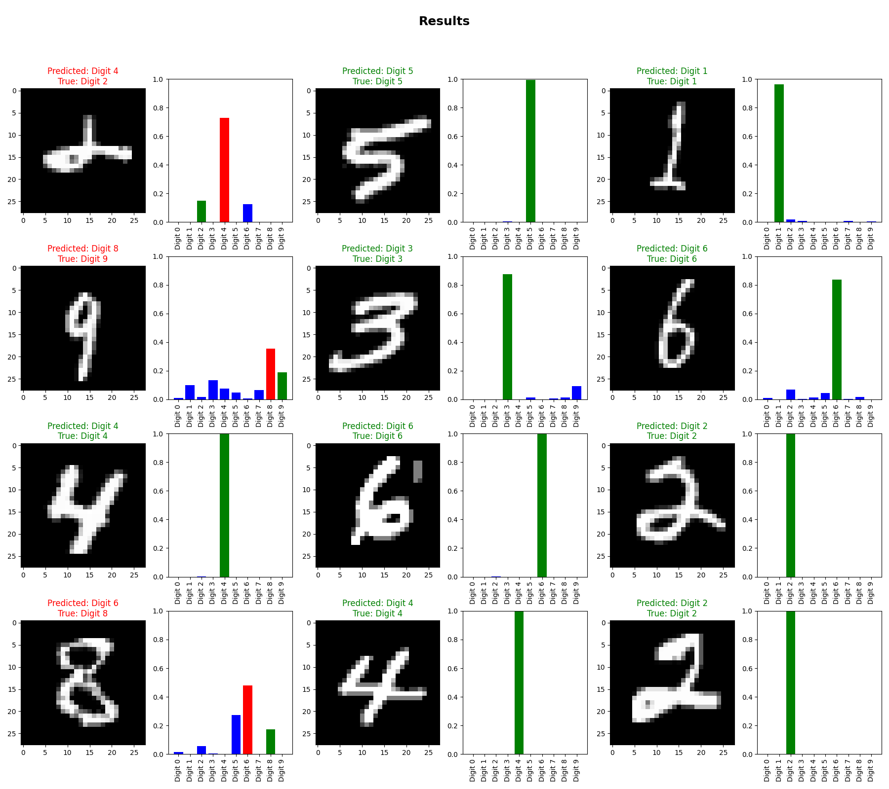

### Detailed Report of Test Set:

|              | precision    | recall       | f1-score     | support      |
| ------------ | ------------ | ------------ | ------------ | ------------ |
| Digit 0      | 0.9713       | 0.9278       | 0.9491       | 693          | 
| Digit 1      | 0.9690       | 0.9421       | 0.9554       | 829          | 
| Digit 2      | 0.9118       | 0.8296       | 0.8687       | 710          | 
| Digit 3      | 0.8680       | 0.8525       | 0.8602       | 671          | 
| Digit 4      | 0.9362       | 0.8363       | 0.8834       | 684          | 
| Digit 5      | 0.8663       | 0.7758       | 0.8185       | 660          | 
| Digit 6      | 0.8418       | 0.9715       | 0.9020       | 701          | 
| Digit 7      | 0.9502       | 0.9077       | 0.9285       | 715          | 
| Digit 8      | 0.7560       | 0.9103       | 0.8260       | 691          | 
| Digit 9      | 0.7986       | 0.8642       | 0.8301       | 670          | 
| micro avg    | 0.8837       | 0.8837       | 0.8837       | 7024         | 
| macro avg    | 0.8869       | 0.8818       | 0.8822       | 7024         | 
| weighted avg | 0.8891       | 0.8837       | 0.8843       | 7024         | 
| samples avg  | 0.8837       | 0.8837       | 0.8837       | 7024         | 

## trial_5

*    *Start Time*: 2025-03-12 15:33:20

*    *Duration*: 10.425

*    *Directory*: [Link](./trial_5)

### Hyperparameters:

| Hyperparameter       | Value                |
| -------------------- | -------------------- |
| units1               | 32                   |
| units2               | 64                   |
| learning_rate        | 0.025006331188302998 |

### Evaluation Metrics:

|           | train     | val       | test      |
| --------- | --------- | --------- | --------- |
| accuracy  | 0.9736    | 0.9725    | 0.9753    | 
| precision | 0.9102    | 0.9077    | 0.9180    | 
| recall    | 0.8303    | 0.8287    | 0.8366    | 
| f1        | 0.8684    | 0.8664    | 0.8754    | 

### Figures:

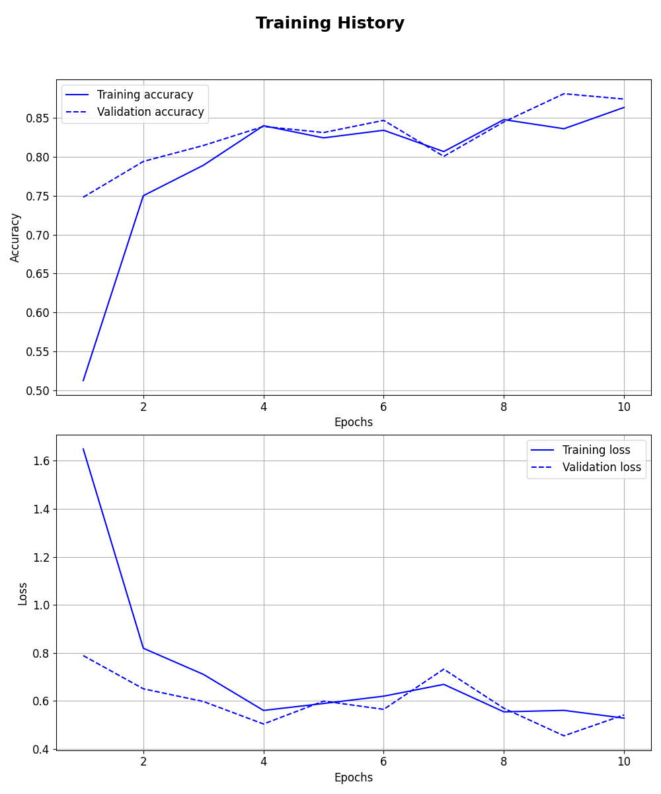

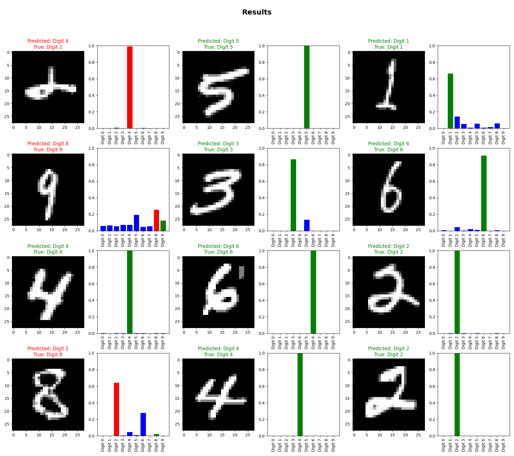

### Detailed Report of Test Set:

|              | precision    | recall       | f1-score     | support      |
| ------------ | ------------ | ------------ | ------------ | ------------ |
| Digit 0      | 0.9498       | 0.9553       | 0.9525       | 693          | 
| Digit 1      | 0.9774       | 0.9385       | 0.9575       | 829          | 
| Digit 2      | 0.8013       | 0.8972       | 0.8465       | 710          | 
| Digit 3      | 0.9067       | 0.7824       | 0.8400       | 671          | 
| Digit 4      | 0.9012       | 0.8801       | 0.8905       | 684          | 
| Digit 5      | 0.7680       | 0.8076       | 0.7873       | 660          | 
| Digit 6      | 0.9152       | 0.9544       | 0.9344       | 701          | 
| Digit 7      | 0.9065       | 0.8951       | 0.9008       | 715          | 
| Digit 8      | 0.7503       | 0.8784       | 0.8093       | 691          | 
| Digit 9      | 0.9144       | 0.7493       | 0.8236       | 670          | 
| micro avg    | 0.8763       | 0.8763       | 0.8763       | 7024         | 
| macro avg    | 0.8791       | 0.8738       | 0.8742       | 7024         | 
| weighted avg | 0.8812       | 0.8763       | 0.8766       | 7024         | 
| samples avg  | 0.8763       | 0.8763       | 0.8763       | 7024         | 

## trial_4

*    *Start Time*: 2025-03-12 15:33:08

*    *Duration*: 11.280

*    *Directory*: [Link](./trial_4)

### Hyperparameters:

| Hyperparameter       | Value                |
| -------------------- | -------------------- |
| units1               | 64                   |
| units2               | 128                  |
| learning_rate        | 0.024798126957179527 |

### Evaluation Metrics:

|           | train     | val       | test      |
| --------- | --------- | --------- | --------- |
| accuracy  | 0.9653    | 0.9650    | 0.9649    | 
| precision | 0.8834    | 0.8834    | 0.8832    | 
| recall    | 0.7521    | 0.7497    | 0.7526    | 
| f1        | 0.8125    | 0.8111    | 0.8127    | 

### Figures:

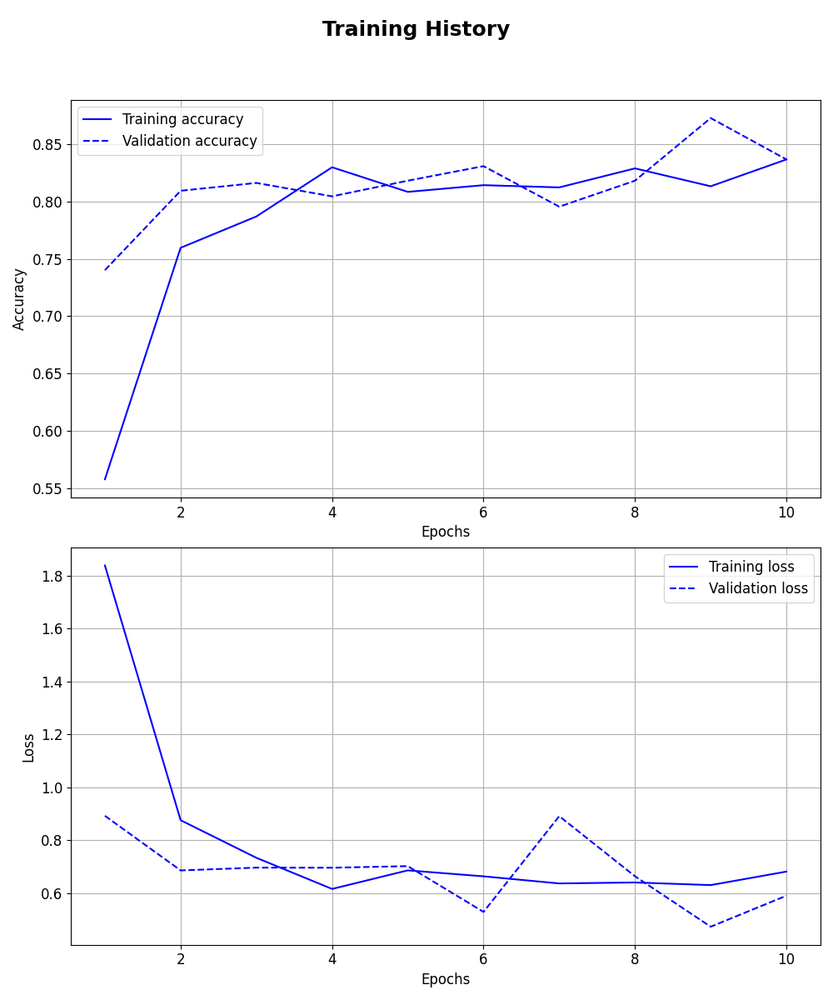

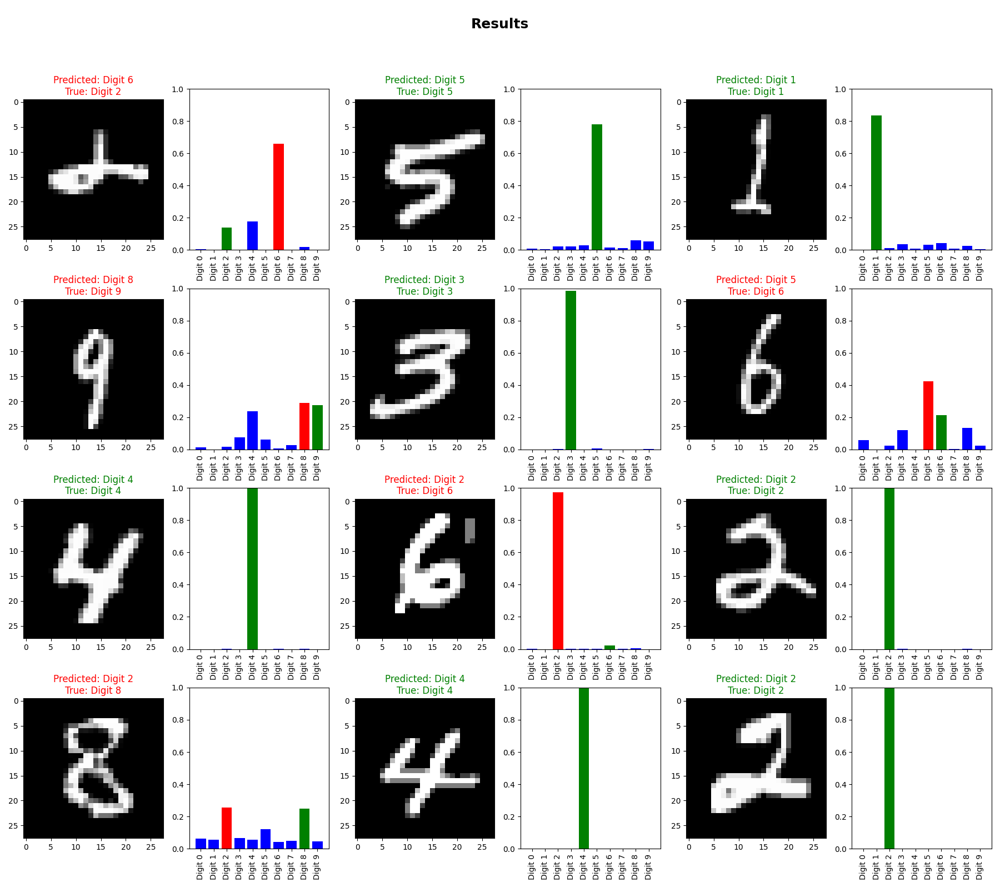

### Detailed Report of Test Set:

|              | precision    | recall       | f1-score     | support      |
| ------------ | ------------ | ------------ | ------------ | ------------ |
| Digit 0      | 0.9203       | 0.9668       | 0.9430       | 693          | 
| Digit 1      | 0.9722       | 0.8444       | 0.9038       | 829          | 
| Digit 2      | 0.7120       | 0.8324       | 0.7675       | 710          | 
| Digit 3      | 0.7693       | 0.8897       | 0.8252       | 671          | 
| Digit 4      | 0.8777       | 0.8918       | 0.8847       | 684          | 
| Digit 5      | 0.9010       | 0.5379       | 0.6736       | 660          | 
| Digit 6      | 0.9528       | 0.8060       | 0.8733       | 701          | 
| Digit 7      | 0.8344       | 0.8881       | 0.8604       | 715          | 
| Digit 8      | 0.5977       | 0.9204       | 0.7248       | 691          | 
| Digit 9      | 0.9309       | 0.6433       | 0.7608       | 670          | 
| micro avg    | 0.8243       | 0.8243       | 0.8243       | 7024         | 
| macro avg    | 0.8468       | 0.8221       | 0.8217       | 7024         | 
| weighted avg | 0.8488       | 0.8243       | 0.8242       | 7024         | 
| samples avg  | 0.8243       | 0.8243       | 0.8243       | 7024         | 

## trial_2

*    *Start Time*: 2025-03-12 15:32:42

*    *Duration*: 11.619

*    *Directory*: [Link](./trial_2)

### Hyperparameters:

| Hyperparameter    | Value             |
| ----------------- | ----------------- |
| units1            | 32                |
| units2            | 128               |
| learning_rate     | 0.035748049504503 |

### Evaluation Metrics:

|           | train     | val       | test      |
| --------- | --------- | --------- | --------- |
| accuracy  | 0.8899    | 0.8896    | 0.8910    | 
| precision | 0.6949    | 0.6993    | 0.6990    | 
| recall    | 0.2620    | 0.2633    | 0.2681    | 
| f1        | 0.3805    | 0.3826    | 0.3875    | 

### Figures:

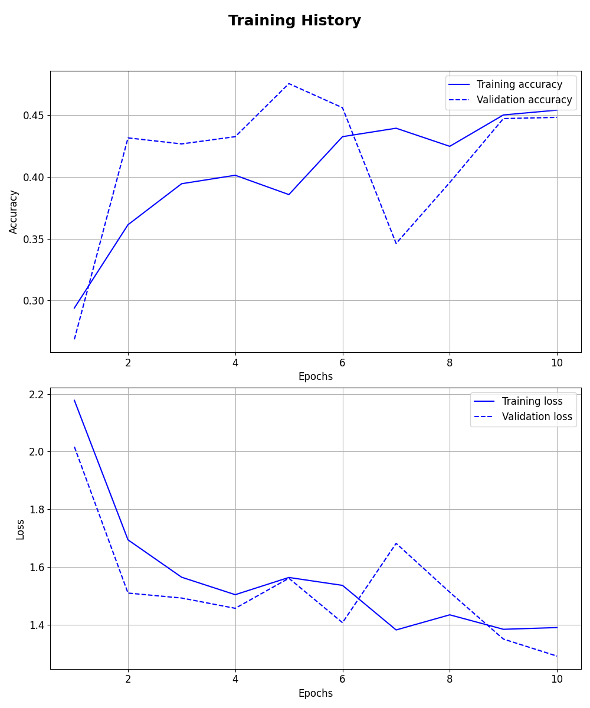

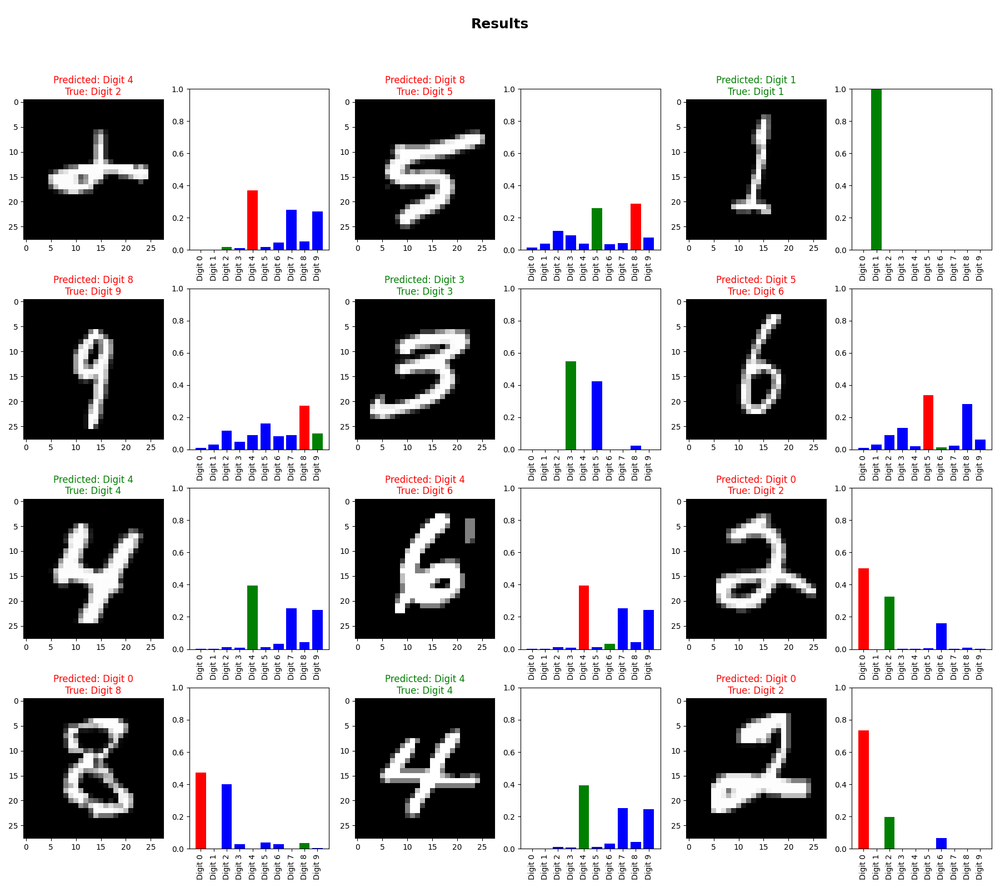

### Detailed Report of Test Set:

|              | precision    | recall       | f1-score     | support      |
| ------------ | ------------ | ------------ | ------------ | ------------ |
| Digit 0      | 0.5348       | 0.9091       | 0.6734       | 693          | 
| Digit 1      | 0.9643       | 0.9445       | 0.9543       | 829          | 
| Digit 2      | 0.2744       | 0.2577       | 0.2658       | 710          | 
| Digit 3      | 0.5693       | 0.7288       | 0.6392       | 671          | 
| Digit 4      | 0.2935       | 0.9225       | 0.4453       | 684          | 
| Digit 5      | 0.2939       | 0.3500       | 0.3195       | 660          | 
| Digit 6      | 0.5000       | 0.2183       | 0.3039       | 701          | 
| Digit 7      | 0.0000e+00   | 0.0000e+00   | 0.0000e+00   | 715          | 
| Digit 8      | 0.3608       | 0.1331       | 0.1945       | 691          | 
| Digit 9      | 0.3636       | 0.0060       | 0.0117       | 670          | 
| micro avg    | 0.4550       | 0.4550       | 0.4550       | 7024         | 
| macro avg    | 0.4155       | 0.4470       | 0.3808       | 7024         | 
| weighted avg | 0.4250       | 0.4550       | 0.3910       | 7024         | 
| samples avg  | 0.4550       | 0.4550       | 0.4550       | 7024         | 

