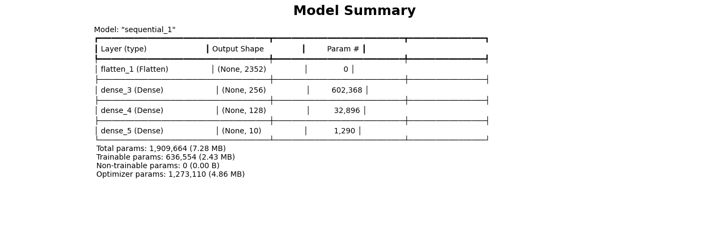
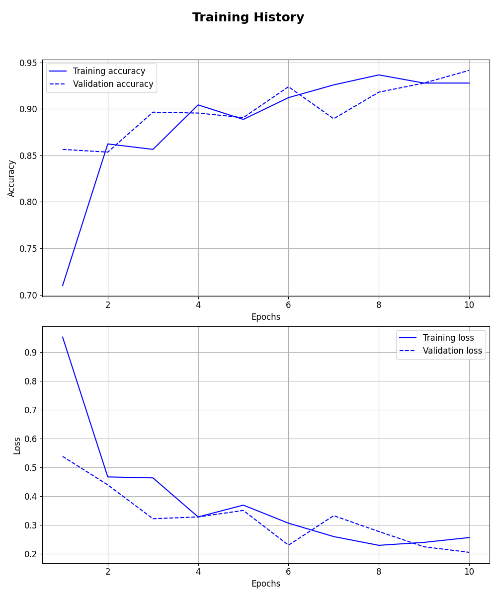
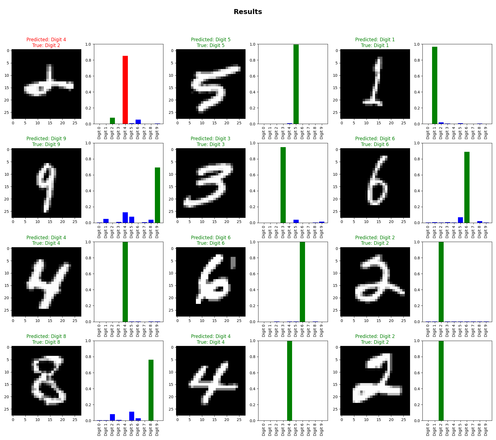
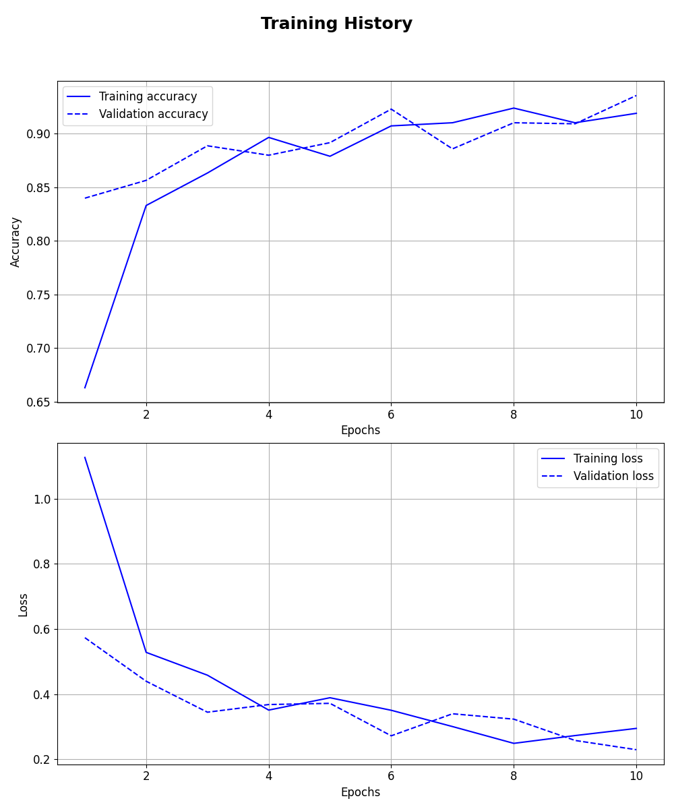
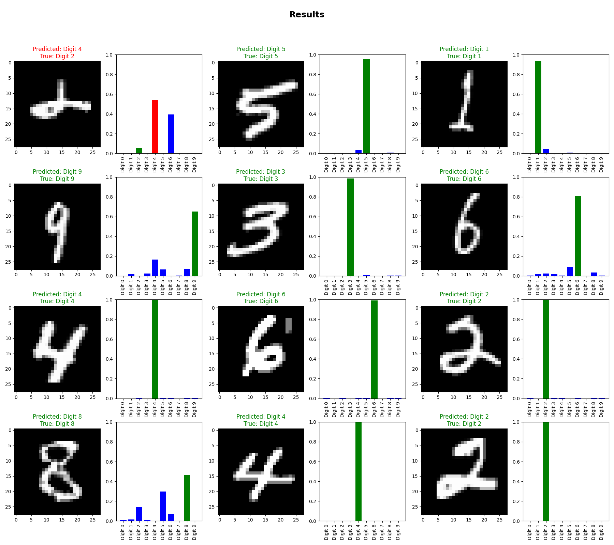

# Experiment Report: MNIST Digits Experiment (Low-Level)

## Metadata

*    *Description*: In this experiment, a neural network is trained with different hyperparameters to classify MNIST digits.

*    *Start Time*: 2025-03-23 12:37:22

*    *Last Resume Time*: 2025-03-23 12:39:11

*    *Total Duration*: 0:00:29.47

*    *Directory*: [Link](./.)

## Summary

### Hyperparameters

|               | units1        | units2        | learning_rate | Chapters      |
| ------------- | ------------- | ------------- | ------------- | ------------- |
| Trial 2       | 256           | 128           | 1.0000e-03    | [Chapter](#trial-2) | 
| Trial 1       | 128           | 64            | 1.0000e-03    | [Chapter](#trial-1) | 

### Test Results

|           | accuracy  | precision | recall    | f1        | Chapters  |
| --------- | --------- | --------- | --------- | --------- | --------- |
| Trial 2   | 0.9882    | 0.9525    | 0.9247    | 0.9384    | [Chapter](#trial-2) | 
| Trial 1   | 0.9862    | 0.9502    | 0.9129    | 0.9312    | [Chapter](#trial-1) | 

## Trial 2

*    *Start Time*: 2025-03-23 12:39:25

*    *Duration*: 13.769

*    *Directory*: [Link](./trial_2)

### Hyperparameters:

| Hyperparameter | Value         |
| ------------- | ------------- |
| units1        | 256           |
| units2        | 128           |
| learning_rate | 0.001         |

### Evaluation Metrics:

|           | train     | val       | test      |
| --------- | --------- | --------- | --------- |
| accuracy  | 0.9882    | 0.9867    | 0.9882    | 
| precision | 0.9555    | 0.9503    | 0.9525    | 
| recall    | 0.9273    | 0.9174    | 0.9247    | 
| f1        | 0.9412    | 0.9336    | 0.9384    | 

### Figures:

### Detailed Report of Test Set:

|              | precision    | recall       | f1-score     | support      |
| ------------ | ------------ | ------------ | ------------ | ------------ |
| Digit 0      | 0.9617       | 0.9784       | 0.9700       | 693          | 
| Digit 1      | 0.9553       | 0.9795       | 0.9672       | 829          | 
| Digit 2      | 0.9468       | 0.9282       | 0.9374       | 710          | 
| Digit 3      | 0.9529       | 0.9046       | 0.9281       | 671          | 
| Digit 4      | 0.9495       | 0.9342       | 0.9418       | 684          | 
| Digit 5      | 0.9037       | 0.9530       | 0.9277       | 660          | 
| Digit 6      | 0.9808       | 0.9472       | 0.9637       | 701          | 
| Digit 7      | 0.9426       | 0.9650       | 0.9537       | 715          | 
| Digit 8      | 0.8957       | 0.9320       | 0.9135       | 691          | 
| Digit 9      | 0.9186       | 0.8761       | 0.8969       | 670          | 
| micro avg    | 0.9409       | 0.9409       | 0.9409       | 7024         | 
| macro avg    | 0.9408       | 0.9398       | 0.9400       | 7024         | 
| weighted avg | 0.9413       | 0.9409       | 0.9408       | 7024         | 
| samples avg  | 0.9409       | 0.9409       | 0.9409       | 7024         | 

## Trial 1

*    *Start Time*: 2025-03-23 12:39:11

*    *Duration*: 13.940

*    *Directory*: [Link](./trial_1)

### Hyperparameters:

| Hyperparameter | Value         |
| ------------- | ------------- |
| units1        | 128           |
| units2        | 64            |
| learning_rate | 0.001         |

### Evaluation Metrics:

|           | train     | val       | test      |
| --------- | --------- | --------- | --------- |
| accuracy  | 0.9857    | 0.9850    | 0.9862    | 
| precision | 0.9473    | 0.9456    | 0.9502    | 
| recall    | 0.9121    | 0.9044    | 0.9129    | 
| f1        | 0.9294    | 0.9245    | 0.9312    | 

### Figures:

### Detailed Report of Test Set:

|              | precision    | recall       | f1-score     | support      |
| ------------ | ------------ | ------------ | ------------ | ------------ |
| Digit 0      | 0.9693       | 0.9582       | 0.9637       | 693          | 
| Digit 1      | 0.9397       | 0.9783       | 0.9586       | 829          | 
| Digit 2      | 0.9062       | 0.9394       | 0.9225       | 710          | 
| Digit 3      | 0.9063       | 0.9225       | 0.9143       | 671          | 
| Digit 4      | 0.9503       | 0.9225       | 0.9362       | 684          | 
| Digit 5      | 0.8922       | 0.9152       | 0.9035       | 660          | 
| Digit 6      | 0.9734       | 0.9387       | 0.9557       | 701          | 
| Digit 7      | 0.9371       | 0.9580       | 0.9474       | 715          | 
| Digit 8      | 0.9156       | 0.9103       | 0.9129       | 691          | 
| Digit 9      | 0.9212       | 0.8552       | 0.8870       | 670          | 
| micro avg    | 0.9312       | 0.9312       | 0.9312       | 7024         | 
| macro avg    | 0.9311       | 0.9298       | 0.9302       | 7024         | 
| weighted avg | 0.9316       | 0.9312       | 0.9311       | 7024         | 
| samples avg  | 0.9312       | 0.9312       | 0.9312       | 7024         | 

