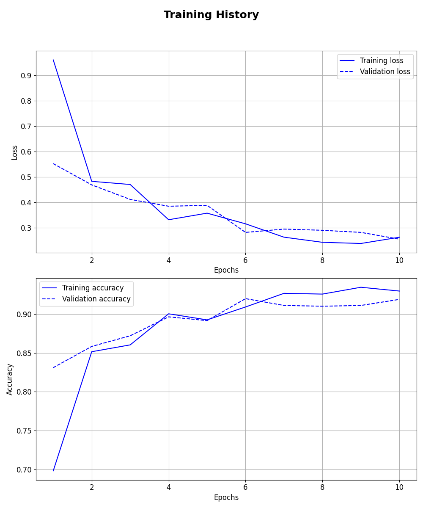
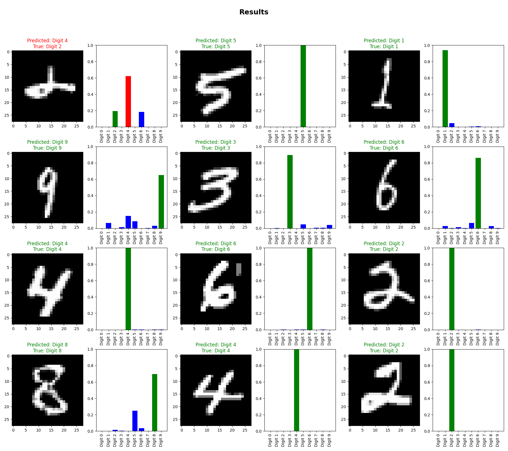
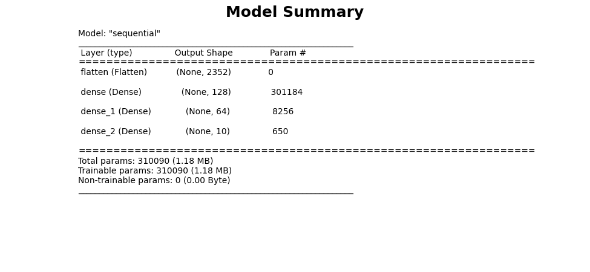
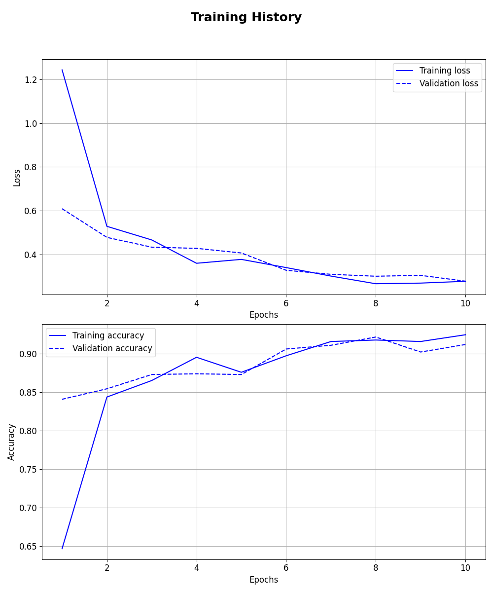
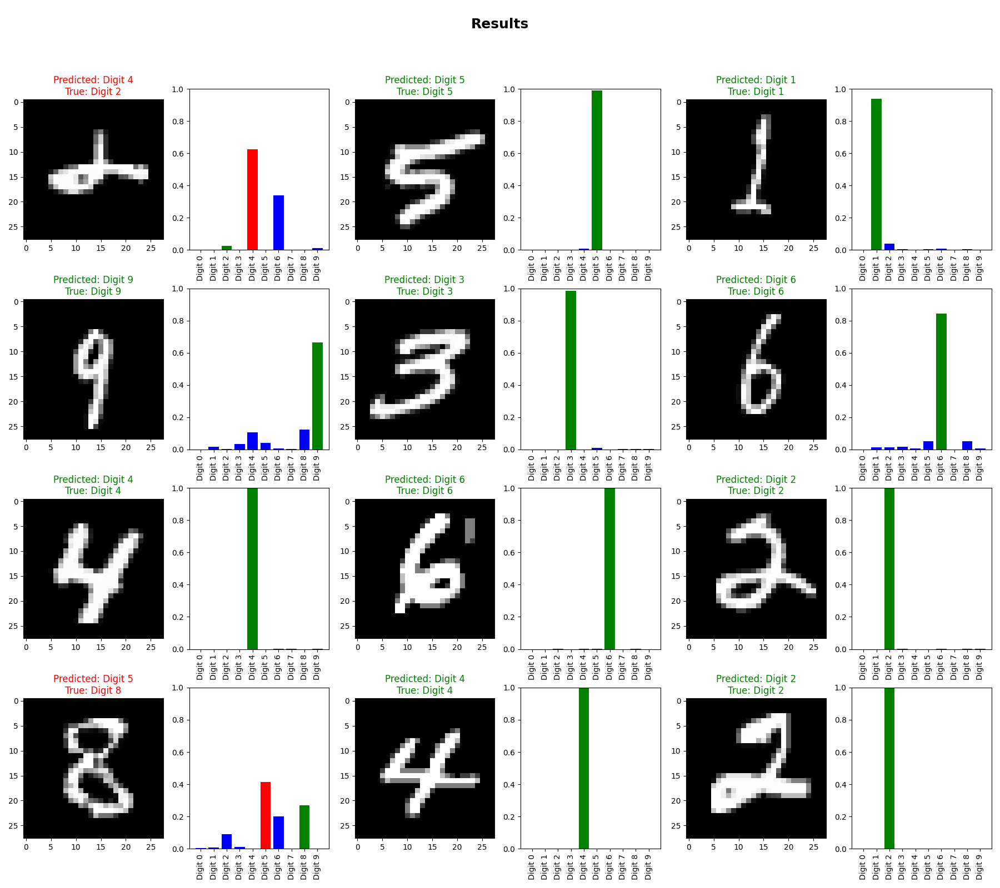

# Experiment Report: MNIST Digits Experiment

## Metadata

*    *Description*: In this experiment, a neural network is trained with different hyperparameters to classify MNIST digits.

*    *Start Time*: 2024-10-08 11:54:30

*    *Total Duration*: 0:00:17.585

*    *Directory*: [Link](./.)

## Summary

### Hyperparameters

|               | units1        | units2        | learning_rate | Chapters      |
| ------------- | ------------- | ------------- | ------------- | ------------- |
| Trial 2       | 256           | 128           | 0.0010        | [Chapter](#trial-2) | 
| Trial 1       | 128           | 64            | 0.0010        | [Chapter](#trial-1) | 

### Test Results

|           | accuracy  | precision | recall    | f1        | Chapters  |
| --------- | --------- | --------- | --------- | --------- | --------- |
| Trial 2   | 0.9871    | 0.9525    | 0.9197    | 0.9358    | [Chapter](#trial-2) | 
| Trial 1   | 0.9865    | 0.9506    | 0.9150    | 0.9325    | [Chapter](#trial-1) | 

## Trial 2

*    *Start Time*: 2024-10-08 11:54:39

*    *Duration*: 08.101

*    *Directory*: [Link](./trial_2)

### Hyperparameters:

| Hyperparameter | Value         |
| ------------- | ------------- |
| units1        | 256           |
| units2        | 128           |
| learning_rate | 0.001         |

### Evaluation Metrics:

|           | train     | val       | test      |
| --------- | --------- | --------- | --------- |
| accuracy  | 0.9869    | 0.9858    | 0.9871    | 
| precision | 0.9510    | 0.9486    | 0.9525    | 
| recall    | 0.9208    | 0.9130    | 0.9197    | 
| f1        | 0.9356    | 0.9305    | 0.9358    | 

### Figures:

### Detailed Report of Test Set:

|              | precision    | recall       | f1-score     | support      |
| ------------ | ------------ | ------------ | ------------ | ------------ |
| Digit 0      | 0.9670       | 0.9726       | 0.9698       | 693          | 
| Digit 1      | 0.9588       | 0.9831       | 0.9708       | 829          | 
| Digit 2      | 0.9058       | 0.9479       | 0.9264       | 710          | 
| Digit 3      | 0.9475       | 0.8882       | 0.9169       | 671          | 
| Digit 4      | 0.9707       | 0.9211       | 0.9452       | 684          | 
| Digit 5      | 0.8436       | 0.9561       | 0.8963       | 660          | 
| Digit 6      | 0.9751       | 0.9501       | 0.9624       | 701          | 
| Digit 7      | 0.9615       | 0.9427       | 0.9520       | 715          | 
| Digit 8      | 0.9293       | 0.8944       | 0.9115       | 691          | 
| Digit 9      | 0.9014       | 0.8866       | 0.8939       | 670          | 
| micro avg    | 0.9355       | 0.9355       | 0.9355       | 7024         | 
| macro avg    | 0.9361       | 0.9343       | 0.9345       | 7024         | 
| weighted avg | 0.9370       | 0.9355       | 0.9357       | 7024         | 
| samples avg  | 0.9355       | 0.9355       | 0.9355       | 7024         | 

## Trial 1

*    *Start Time*: 2024-10-08 11:54:30

*    *Duration*: 08.194

*    *Directory*: [Link](./trial_1)

### Hyperparameters:

| Hyperparameter | Value         |
| ------------- | ------------- |
| units1        | 128           |
| units2        | 64            |
| learning_rate | 0.001         |

### Evaluation Metrics:

|           | train     | val       | test      |
| --------- | --------- | --------- | --------- |
| accuracy  | 0.9863    | 0.9843    | 0.9865    | 
| precision | 0.9499    | 0.9456    | 0.9506    | 
| recall    | 0.9136    | 0.9074    | 0.9150    | 
| f1        | 0.9314    | 0.9261    | 0.9325    | 

### Figures:

### Detailed Report of Test Set:

|              | precision    | recall       | f1-score     | support      |
| ------------ | ------------ | ------------ | ------------ | ------------ |
| Digit 0      | 0.9710       | 0.9668       | 0.9689       | 693          | 
| Digit 1      | 0.9642       | 0.9747       | 0.9694       | 829          | 
| Digit 2      | 0.8980       | 0.9423       | 0.9196       | 710          | 
| Digit 3      | 0.8903       | 0.9195       | 0.9047       | 671          | 
| Digit 4      | 0.9496       | 0.9371       | 0.9433       | 684          | 
| Digit 5      | 0.9021       | 0.9212       | 0.9115       | 660          | 
| Digit 6      | 0.9782       | 0.9586       | 0.9683       | 701          | 
| Digit 7      | 0.9633       | 0.9175       | 0.9398       | 715          | 
| Digit 8      | 0.9127       | 0.8929       | 0.9027       | 691          | 
| Digit 9      | 0.8887       | 0.8821       | 0.8854       | 670          | 
| micro avg    | 0.9324       | 0.9324       | 0.9324       | 7024         | 
| macro avg    | 0.9318       | 0.9313       | 0.9314       | 7024         | 
| weighted avg | 0.9329       | 0.9324       | 0.9325       | 7024         | 
| samples avg  | 0.9324       | 0.9324       | 0.9324       | 7024         | 

