# Experiment Report: MNIST Digits Experiment

## Metadata

*    *Description*: This experiment demonstrates the MultiClassResearcher class using the MNIST digits dataset. It involves a simple feedforward neural network with manually set hyperparameters across multiple trials.

*    *Start Time*: 2024-08-01 15:14:27

*    *Total Duration*: 0:00:37.225

*    *Directory*: [Link](./.)

## Initial Visualizations

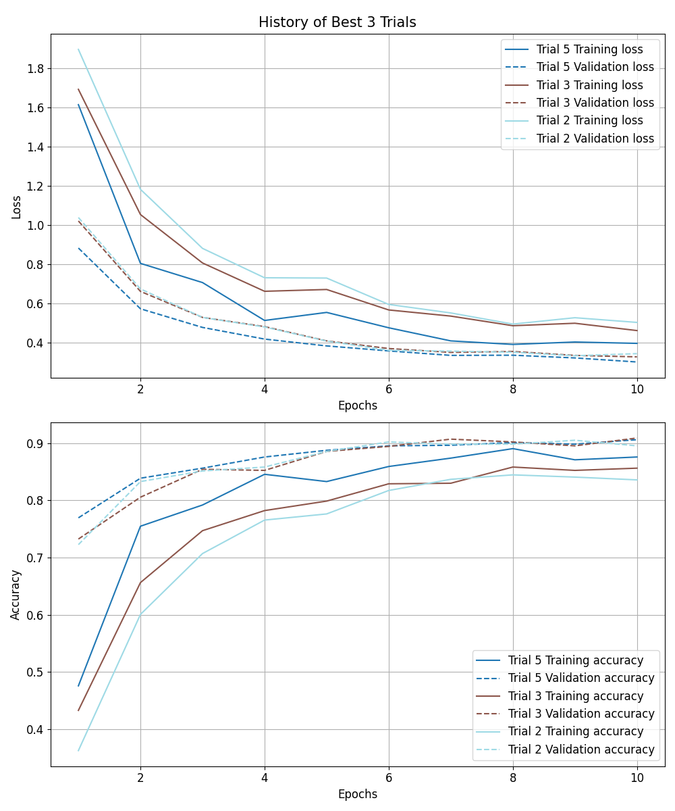

## Summary

### Hyperparameters

|               | units1        | units2        | dropout1      | dropout2      | learning_rate | Chapters      |
| ------------- | ------------- | ------------- | ------------- | ------------- | ------------- | ------------- |
| Trial 5       | 256           | 128           | 0.3000        | 0.3000        | 0.0005        | [Chapter](#trial-5) | 
| Trial 3       | 128           | 64            | 0.3000        | 0.3000        | 0.0010        | [Chapter](#trial-3) | 
| Trial 2       | 256           | 128           | 0.5000        | 0.5000        | 0.0010        | [Chapter](#trial-2) | 
| Trial 1       | 128           | 64            | 0.5000        | 0.5000        | 0.0010        | [Chapter](#trial-1) | 
| Trial 4       | 128           | 64            | 0.5000        | 0.5000        | 0.0005        | [Chapter](#trial-4) | 

### Test Results

|           | accuracy  | precision | recall    | f1        | Chapters  |
| --------- | --------- | --------- | --------- | --------- | --------- |
| Trial 5   | 0.9849    | 0.9494    | 0.9006    | 0.9244    | [Chapter](#trial-5) | 
| Trial 3   | 0.9839    | 0.9439    | 0.8918    | 0.9171    | [Chapter](#trial-3) | 
| Trial 2   | 0.9819    | 0.9386    | 0.8831    | 0.9100    | [Chapter](#trial-2) | 
| Trial 1   | 0.9794    | 0.9421    | 0.8448    | 0.8908    | [Chapter](#trial-1) | 
| Trial 4   | 0.9765    | 0.9439    | 0.8104    | 0.8721    | [Chapter](#trial-4) | 

## Trial 5

*    *Start Time*: 2024-08-01 15:14:57

*    *Duration*: 07.276

*    *Directory*: [Link](./Trial_5)

### Hyperparameters:

| Hyperparameter | Value         |
| ------------- | ------------- |
| units1        | 256           |
| units2        | 128           |
| dropout1      | 0.3           |
| dropout2      | 0.3           |
| learning_rate | 0.0005        |

### Evaluation Metrics:

|           | train     | val       | test      |
| --------- | --------- | --------- | --------- |
| accuracy  | 0.9852    | 0.9841    | 0.9849    | 
| precision | 0.9502    | 0.9487    | 0.9494    | 
| recall    | 0.9026    | 0.8987    | 0.9006    | 
| f1        | 0.9258    | 0.9230    | 0.9244    | 

### Figures:

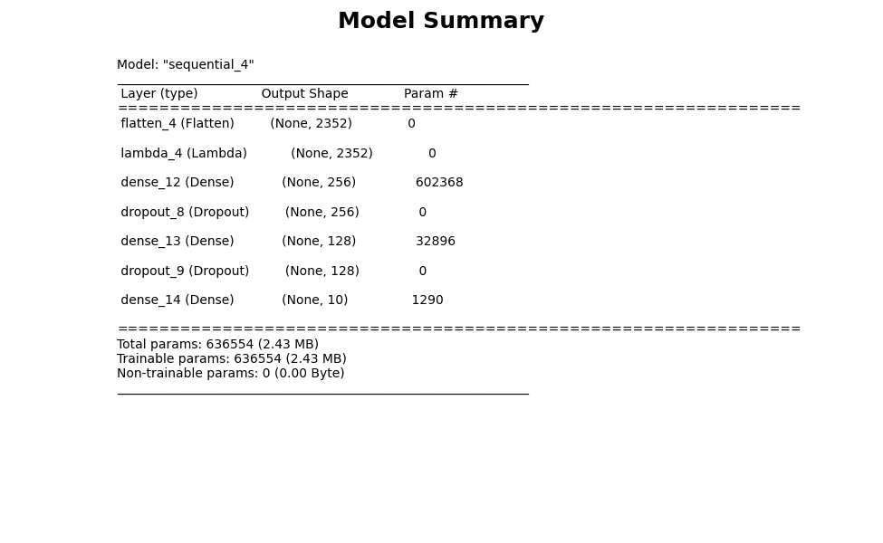

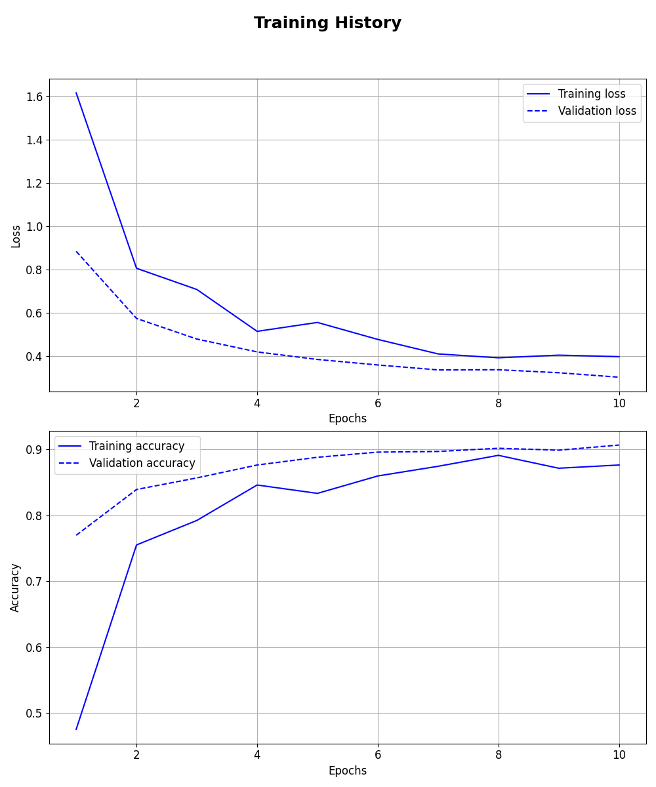

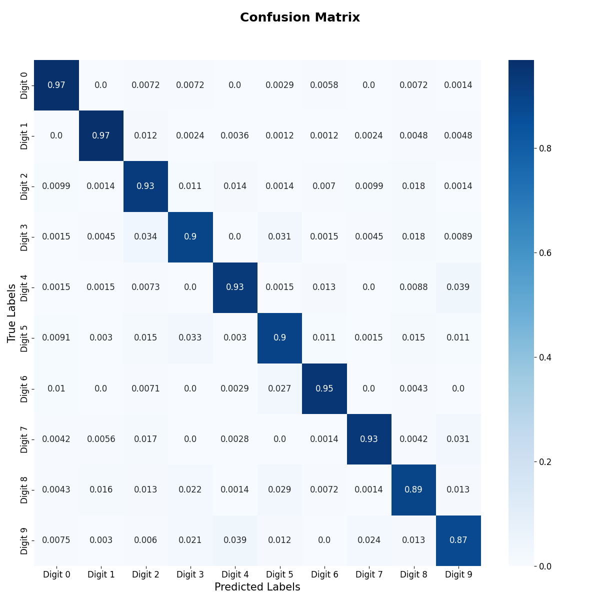

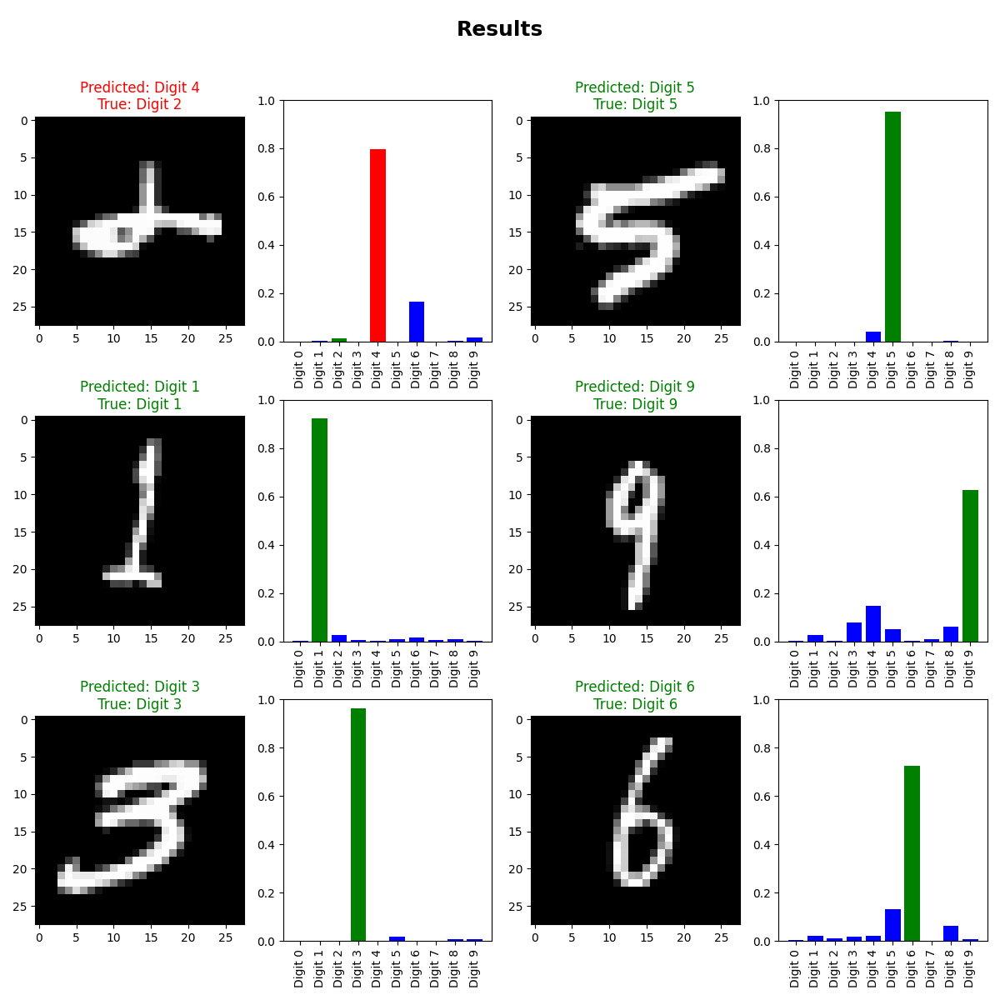

### Detailed Report of Test Set:

|              | precision    | recall       | f1-score     | support      |
| ------------ | ------------ | ------------ | ------------ | ------------ |
| Digit 0      | 0.9531       | 0.9683       | 0.9606       | 693          | 
| Digit 1      | 0.9709       | 0.9674       | 0.9692       | 829          | 
| Digit 2      | 0.8878       | 0.9254       | 0.9062       | 710          | 
| Digit 3      | 0.9010       | 0.8957       | 0.8984       | 671          | 
| Digit 4      | 0.9324       | 0.9269       | 0.9296       | 684          | 
| Digit 5      | 0.8904       | 0.8985       | 0.8944       | 660          | 
| Digit 6      | 0.9527       | 0.9486       | 0.9507       | 701          | 
| Digit 7      | 0.9570       | 0.9343       | 0.9455       | 715          | 
| Digit 8      | 0.9047       | 0.8929       | 0.8988       | 691          | 
| Digit 9      | 0.8839       | 0.8746       | 0.8792       | 670          | 
| micro avg    | 0.9245       | 0.9245       | 0.9245       | 7024         | 
| macro avg    | 0.9234       | 0.9233       | 0.9233       | 7024         | 
| weighted avg | 0.9247       | 0.9245       | 0.9246       | 7024         | 
| samples avg  | 0.9245       | 0.9245       | 0.9245       | 7024         | 

## Trial 3

*    *Start Time*: 2024-08-01 15:14:42

*    *Duration*: 06.529

*    *Directory*: [Link](./Trial_3)

### Hyperparameters:

| Hyperparameter | Value         |
| ------------- | ------------- |
| units1        | 128           |
| units2        | 64            |
| dropout1      | 0.3           |
| dropout2      | 0.3           |
| learning_rate | 0.001         |

### Evaluation Metrics:

|           | train     | val       | test      |
| --------- | --------- | --------- | --------- |
| accuracy  | 0.9834    | 0.9826    | 0.9839    | 
| precision | 0.9442    | 0.9382    | 0.9439    | 
| recall    | 0.8930    | 0.8885    | 0.8918    | 
| f1        | 0.9179    | 0.9127    | 0.9171    | 

### Figures:

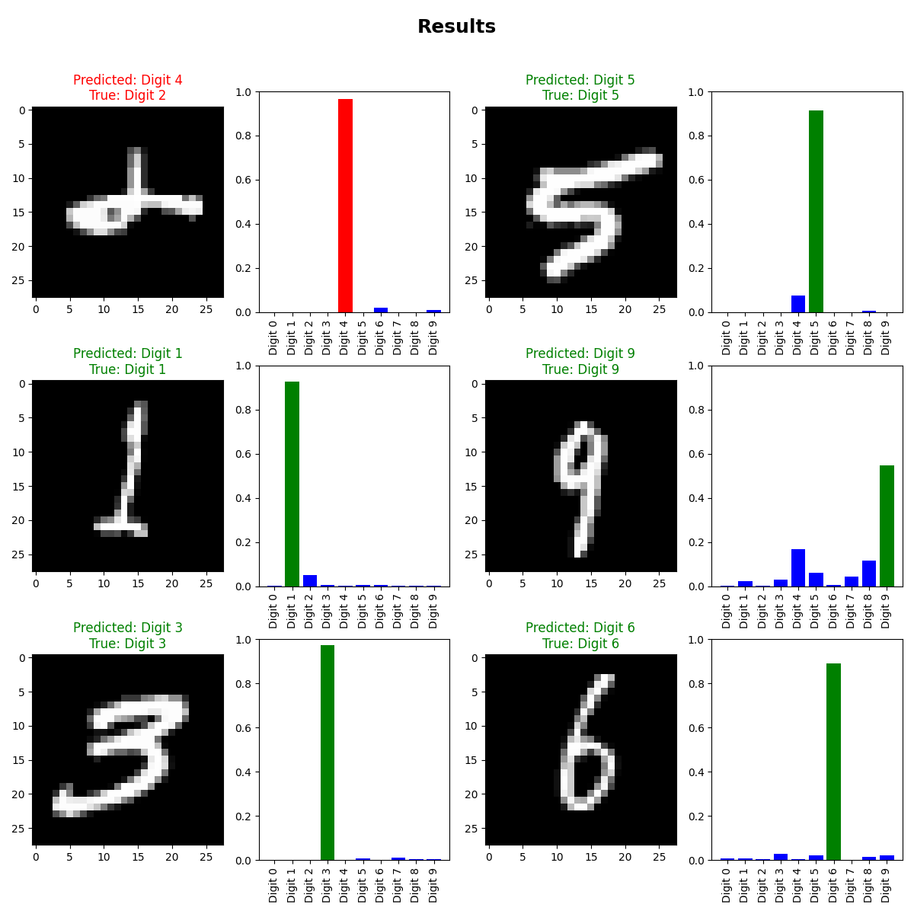

### Detailed Report of Test Set:

|              | precision    | recall       | f1-score     | support      |
| ------------ | ------------ | ------------ | ------------ | ------------ |
| Digit 0      | 0.9738       | 0.9639       | 0.9688       | 693          | 
| Digit 1      | 0.9731       | 0.9602       | 0.9666       | 829          | 
| Digit 2      | 0.9000       | 0.9127       | 0.9063       | 710          | 
| Digit 3      | 0.8482       | 0.9240       | 0.8845       | 671          | 
| Digit 4      | 0.8949       | 0.9459       | 0.9197       | 684          | 
| Digit 5      | 0.9119       | 0.8470       | 0.8782       | 660          | 
| Digit 6      | 0.9514       | 0.9501       | 0.9507       | 701          | 
| Digit 7      | 0.9380       | 0.9315       | 0.9347       | 715          | 
| Digit 8      | 0.8933       | 0.8842       | 0.8887       | 691          | 
| Digit 9      | 0.9014       | 0.8597       | 0.8801       | 670          | 
| micro avg    | 0.9193       | 0.9193       | 0.9193       | 7024         | 
| macro avg    | 0.9186       | 0.9179       | 0.9178       | 7024         | 
| weighted avg | 0.9200       | 0.9193       | 0.9193       | 7024         | 
| samples avg  | 0.9193       | 0.9193       | 0.9193       | 7024         | 

## Trial 2

*    *Start Time*: 2024-08-01 15:14:35

*    *Duration*: 07.216

*    *Directory*: [Link](./Trial_2)

### Hyperparameters:

| Hyperparameter | Value         |
| ------------- | ------------- |
| units1        | 256           |
| units2        | 128           |
| dropout1      | 0.5           |
| dropout2      | 0.5           |
| learning_rate | 0.001         |

### Evaluation Metrics:

|           | train     | val       | test      |
| --------- | --------- | --------- | --------- |
| accuracy  | 0.9816    | 0.9812    | 0.9819    | 
| precision | 0.9361    | 0.9336    | 0.9386    | 
| recall    | 0.8819    | 0.8772    | 0.8831    | 
| f1        | 0.9082    | 0.9045    | 0.9100    | 

### Figures:

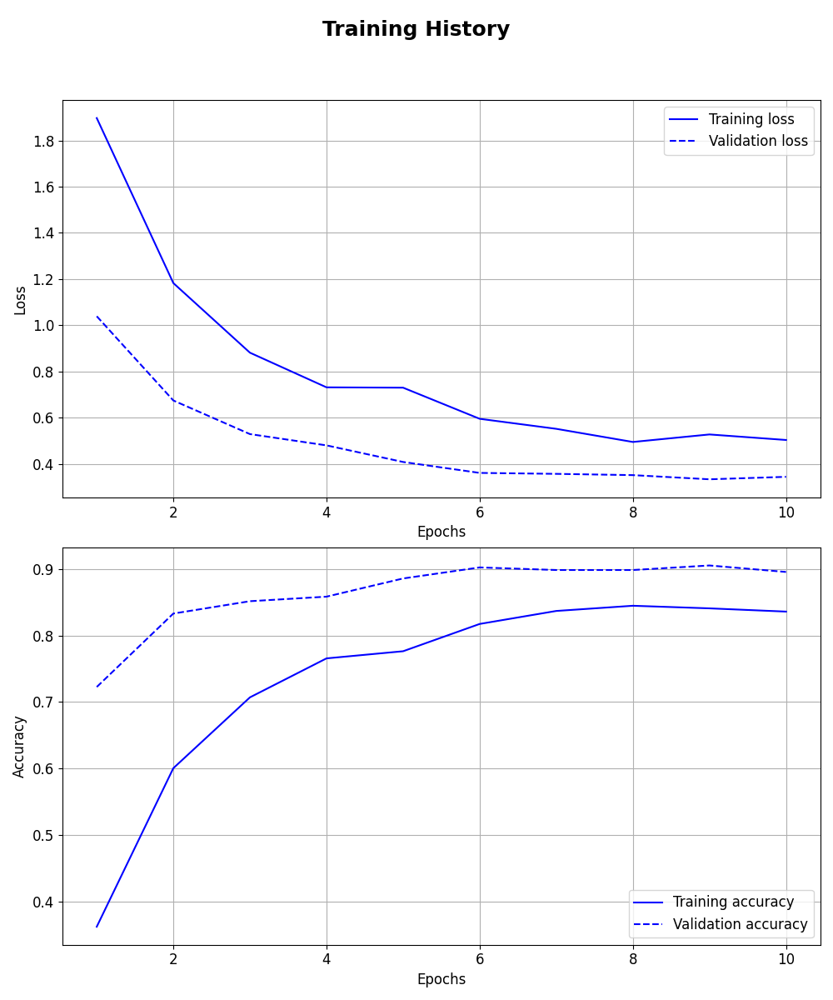

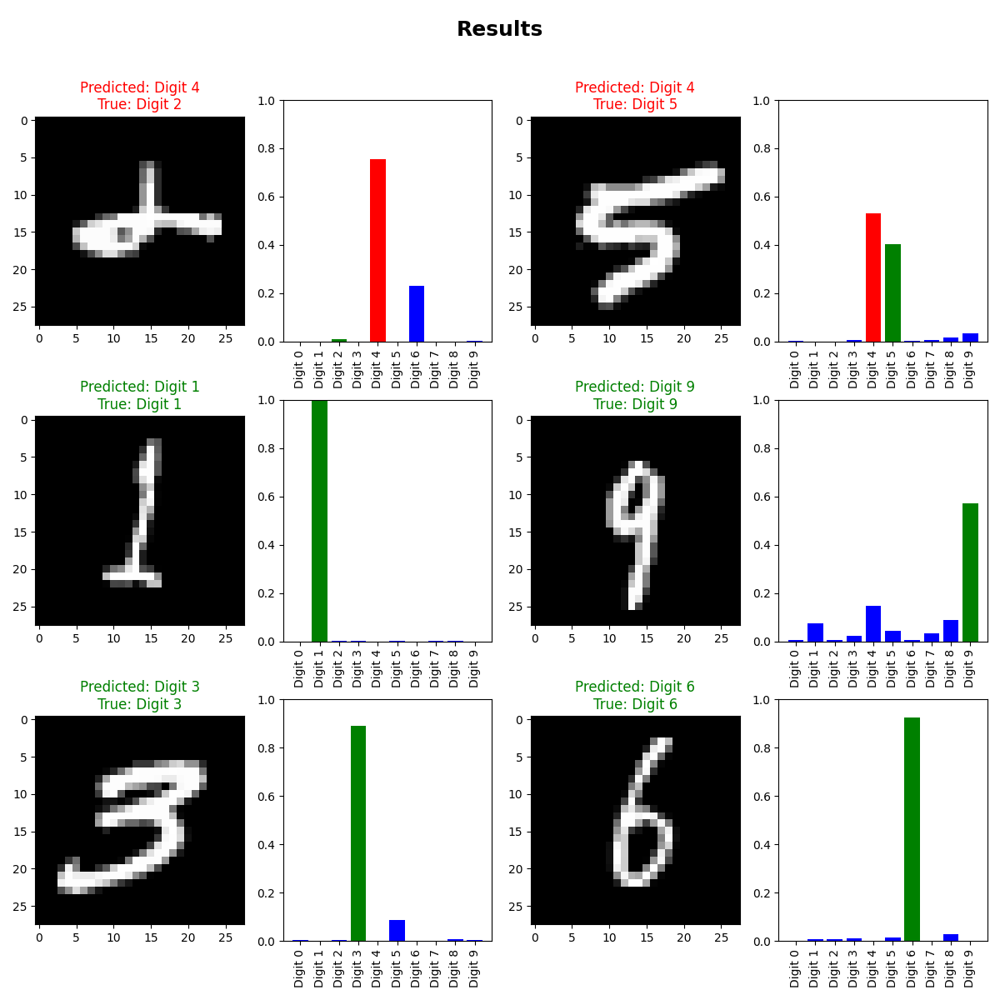

### Detailed Report of Test Set:

|              | precision    | recall       | f1-score     | support      |
| ------------ | ------------ | ------------ | ------------ | ------------ |
| Digit 0      | 0.9190       | 0.9827       | 0.9498       | 693          | 
| Digit 1      | 0.8885       | 0.9807       | 0.9323       | 829          | 
| Digit 2      | 0.9399       | 0.8592       | 0.8977       | 710          | 
| Digit 3      | 0.8672       | 0.8957       | 0.8812       | 671          | 
| Digit 4      | 0.8944       | 0.9415       | 0.9174       | 684          | 
| Digit 5      | 0.9103       | 0.8606       | 0.8847       | 660          | 
| Digit 6      | 0.9475       | 0.9529       | 0.9502       | 701          | 
| Digit 7      | 0.9554       | 0.8993       | 0.9265       | 715          | 
| Digit 8      | 0.9078       | 0.8408       | 0.8730       | 691          | 
| Digit 9      | 0.8735       | 0.8657       | 0.8696       | 670          | 
| micro avg    | 0.9096       | 0.9096       | 0.9096       | 7024         | 
| macro avg    | 0.9104       | 0.9079       | 0.9083       | 7024         | 
| weighted avg | 0.9105       | 0.9096       | 0.9091       | 7024         | 
| samples avg  | 0.9096       | 0.9096       | 0.9096       | 7024         | 

## Trial 1

*    *Start Time*: 2024-08-01 15:14:27

*    *Duration*: 06.936

*    *Directory*: [Link](./Trial_1)

### Hyperparameters:

| Hyperparameter | Value         |
| ------------- | ------------- |
| units1        | 128           |
| units2        | 64            |
| dropout1      | 0.5           |
| dropout2      | 0.5           |
| learning_rate | 0.001         |

### Evaluation Metrics:

|           | train     | val       | test      |
| --------- | --------- | --------- | --------- |
| accuracy  | 0.9795    | 0.9794    | 0.9794    | 
| precision | 0.9418    | 0.9384    | 0.9421    | 
| recall    | 0.8444    | 0.8415    | 0.8448    | 
| f1        | 0.8905    | 0.8873    | 0.8908    | 

### Figures:

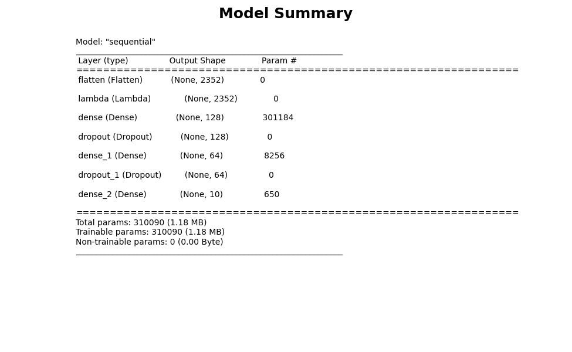

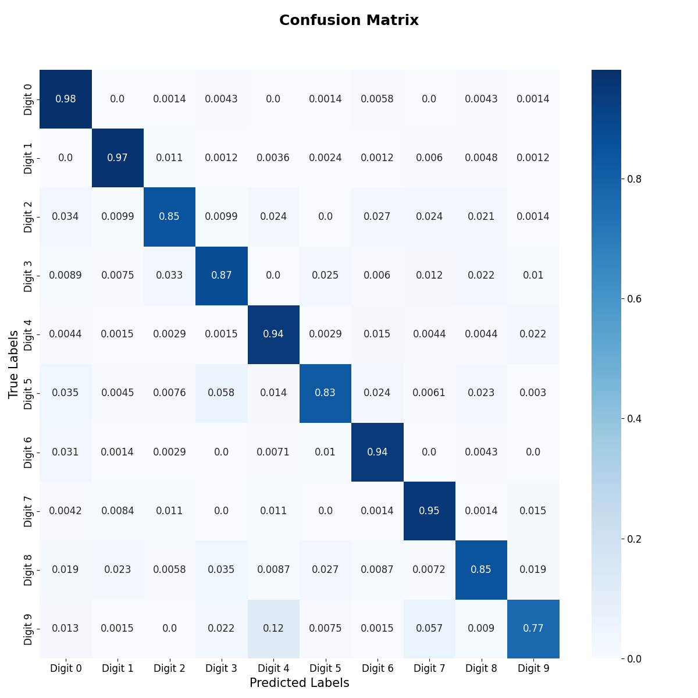

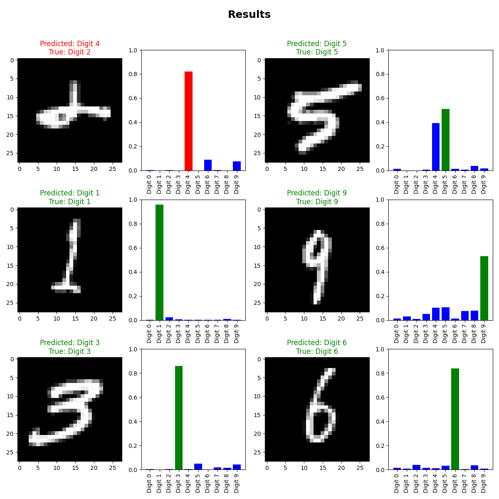

### Detailed Report of Test Set:

|              | precision    | recall       | f1-score     | support      |
| ------------ | ------------ | ------------ | ------------ | ------------ |
| Digit 0      | 0.8685       | 0.9812       | 0.9214       | 693          | 
| Digit 1      | 0.9526       | 0.9686       | 0.9605       | 829          | 
| Digit 2      | 0.9192       | 0.8493       | 0.8829       | 710          | 
| Digit 3      | 0.8683       | 0.8748       | 0.8716       | 671          | 
| Digit 4      | 0.8342       | 0.9415       | 0.8846       | 684          | 
| Digit 5      | 0.9114       | 0.8258       | 0.8665       | 660          | 
| Digit 6      | 0.9142       | 0.9429       | 0.9284       | 701          | 
| Digit 7      | 0.8943       | 0.9469       | 0.9198       | 715          | 
| Digit 8      | 0.9000       | 0.8466       | 0.8725       | 691          | 
| Digit 9      | 0.9099       | 0.7687       | 0.8333       | 670          | 
| micro avg    | 0.8969       | 0.8969       | 0.8969       | 7024         | 
| macro avg    | 0.8973       | 0.8946       | 0.8941       | 7024         | 
| weighted avg | 0.8985       | 0.8969       | 0.8959       | 7024         | 
| samples avg  | 0.8969       | 0.8969       | 0.8969       | 7024         | 

## Trial 4

*    *Start Time*: 2024-08-01 15:14:49

*    *Duration*: 06.831

*    *Directory*: [Link](./Trial_4)

### Hyperparameters:

| Hyperparameter | Value         |
| ------------- | ------------- |
| units1        | 128           |
| units2        | 64            |
| dropout1      | 0.5           |
| dropout2      | 0.5           |
| learning_rate | 0.0005        |

### Evaluation Metrics:

|           | train     | val       | test      |
| --------- | --------- | --------- | --------- |
| accuracy  | 0.9770    | 0.9768    | 0.9765    | 
| precision | 0.9444    | 0.9383    | 0.9439    | 
| recall    | 0.8036    | 0.8002    | 0.8104    | 
| f1        | 0.8683    | 0.8638    | 0.8721    | 

### Figures:

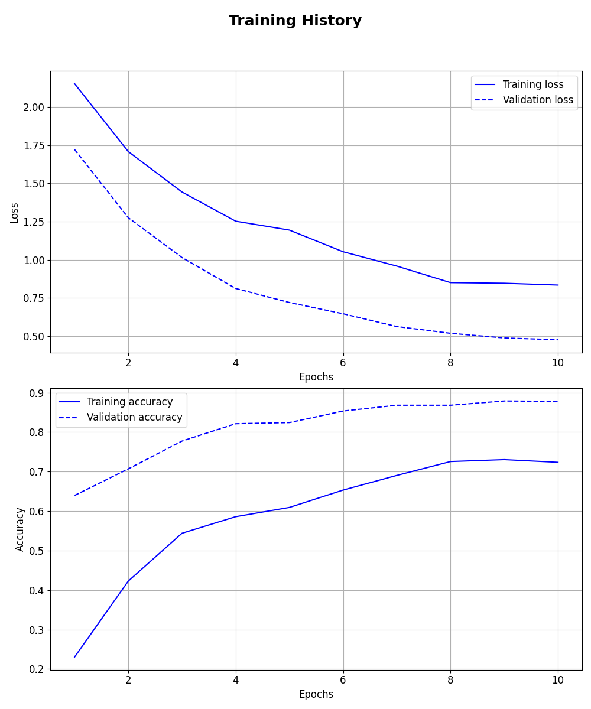

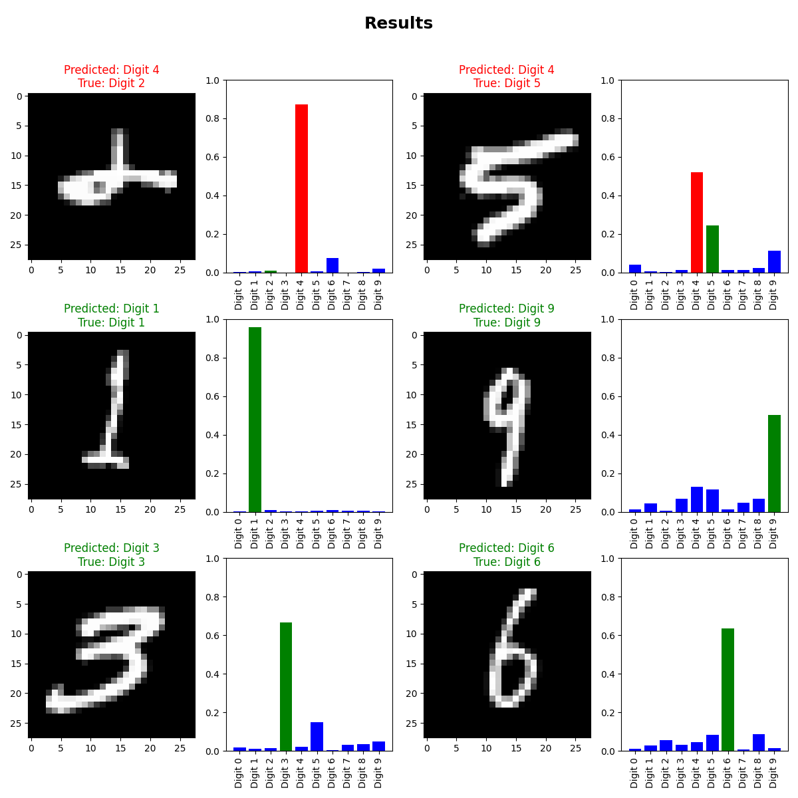

### Detailed Report of Test Set:

|              | precision    | recall       | f1-score     | support      |
| ------------ | ------------ | ------------ | ------------ | ------------ |
| Digit 0      | 0.9137       | 0.9784       | 0.9449       | 693          | 
| Digit 1      | 0.9272       | 0.9674       | 0.9469       | 829          | 
| Digit 2      | 0.9273       | 0.8085       | 0.8638       | 710          | 
| Digit 3      | 0.7696       | 0.9061       | 0.8323       | 671          | 
| Digit 4      | 0.8784       | 0.8874       | 0.8829       | 684          | 
| Digit 5      | 0.8897       | 0.7697       | 0.8253       | 660          | 
| Digit 6      | 0.9373       | 0.9387       | 0.9380       | 701          | 
| Digit 7      | 0.9154       | 0.9231       | 0.9192       | 715          | 
| Digit 8      | 0.8789       | 0.7670       | 0.8192       | 691          | 
| Digit 9      | 0.7986       | 0.8582       | 0.8273       | 670          | 
| micro avg    | 0.8827       | 0.8827       | 0.8827       | 7024         | 
| macro avg    | 0.8836       | 0.8804       | 0.8800       | 7024         | 
| weighted avg | 0.8853       | 0.8827       | 0.8820       | 7024         | 
| samples avg  | 0.8827       | 0.8827       | 0.8827       | 7024         | 

