# Experiment Report: Shoe vs Ankle Boot Experiment

## Metadata

*    *Description*: Binary classification on Fashion MNIST dataset (Sneaker vs Ankle Boot)

*    *Start Time*: 2024-08-01 10:55:04

*    *Total Duration*: 0:00:16.976

*    *Directory*: [Link](./.)

## Initial Visualizations

## Summary

### Hyperparameters

|               | units1        | dropout1      | units2        | dropout2      | learning_rate | Chapters      |
| ------------- | ------------- | ------------- | ------------- | ------------- | ------------- | ------------- |
| Trial 3       | 64            | 0.1000        | 32            | 0.1000        | 0.0010        | [Chapter](#trial-3) | 
| Trial 1       | 128           | 0.2000        | 64            | 0.2000        | 0.0010        | [Chapter](#trial-1) | 
| Trial 2       | 256           | 0.3000        | 128           | 0.3000        | 0.0010        | [Chapter](#trial-2) | 
| Trial 4       | 128           | 0.2000        | 128           | 0.2000        | 0.0005        | [Chapter](#trial-4) | 
| Trial 5       | 256           | 0.4000        | 128           | 0.4000        | 0.0001        | [Chapter](#trial-5) | 

### Test Results

|           | accuracy  | precision | recall    | f1        | Chapters  |
| --------- | --------- | --------- | --------- | --------- | --------- |
| Trial 3   | 0.9600    | 0.9512    | 0.9709    | 0.9609    | [Chapter](#trial-3) | 
| Trial 1   | 0.9558    | 0.9545    | 0.9584    | 0.9565    | [Chapter](#trial-1) | 
| Trial 2   | 0.9508    | 0.9697    | 0.9321    | 0.9506    | [Chapter](#trial-2) | 
| Trial 4   | 0.9508    | 0.9324    | 0.9737    | 0.9526    | [Chapter](#trial-4) | 
| Trial 5   | 0.9340    | 0.9232    | 0.9488    | 0.9358    | [Chapter](#trial-5) | 

## Trial 3

*    *Start Time*: 2024-08-01 10:55:11

*    *Duration*: 02.571

*    *Directory*: [Link](./Trial_3)

### Hyperparameters:

| Hyperparameter | Value         |
| ------------- | ------------- |
| units1        | 64            |
| dropout1      | 0.1           |
| units2        | 32            |
| dropout2      | 0.1           |
| learning_rate | 0.001         |

### Evaluation Metrics:

|           | train     | val       | test      |
| --------- | --------- | --------- | --------- |
| accuracy  | 0.9605    | 0.9571    | 0.9600    | 
| precision | 0.9539    | 0.9467    | 0.9512    | 
| recall    | 0.9679    | 0.9676    | 0.9709    | 
| f1        | 0.9608    | 0.9570    | 0.9609    | 

### Figures:

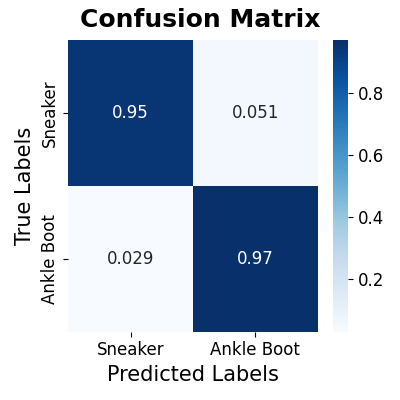

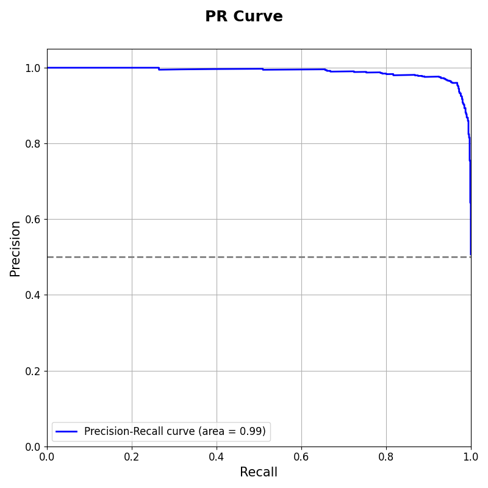

### Detailed Report of Test Set:

|              | precision    | recall       | f1-score     | support      |
| ------------ | ------------ | ------------ | ------------ | ------------ |
| Sneaker      | 0.9694       | 0.9487       | 0.9590       | 702          | 
| Ankle Boot   | 0.9512       | 0.9709       | 0.9609       | 722          | 
| macro avg    | 0.9603       | 0.9598       | 0.9599       | 1424         | 
| weighted avg | 0.9602       | 0.9600       | 0.9600       | 1424         | 

## Trial 1

*    *Start Time*: 2024-08-01 10:55:04

*    *Duration*: 03.027

*    *Directory*: [Link](./Trial_1)

### Hyperparameters:

| Hyperparameter | Value         |
| ------------- | ------------- |
| units1        | 128           |
| dropout1      | 0.2           |
| units2        | 64            |
| dropout2      | 0.2           |
| learning_rate | 0.001         |

### Evaluation Metrics:

|           | train     | val       | test      |
| --------- | --------- | --------- | --------- |
| accuracy  | 0.9613    | 0.9542    | 0.9558    | 
| precision | 0.9594    | 0.9464    | 0.9545    | 
| recall    | 0.9634    | 0.9617    | 0.9584    | 
| f1        | 0.9614    | 0.9540    | 0.9565    | 

### Figures:

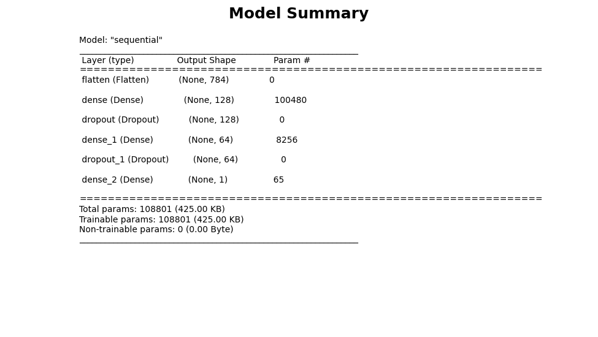

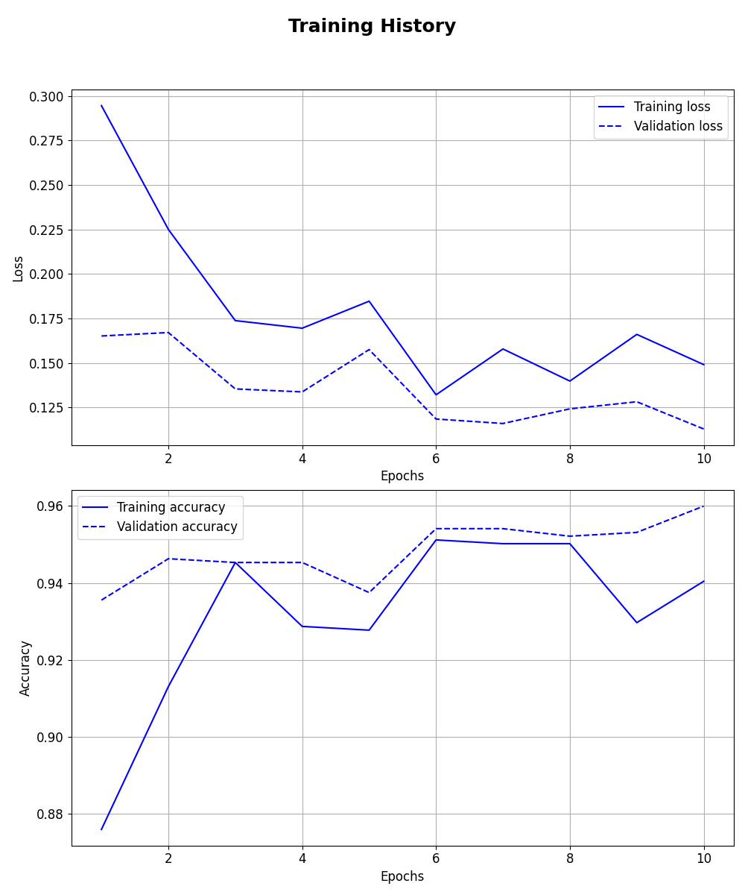

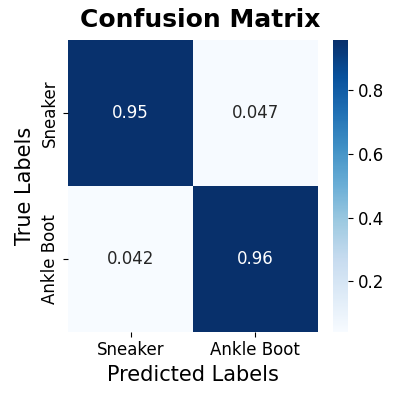

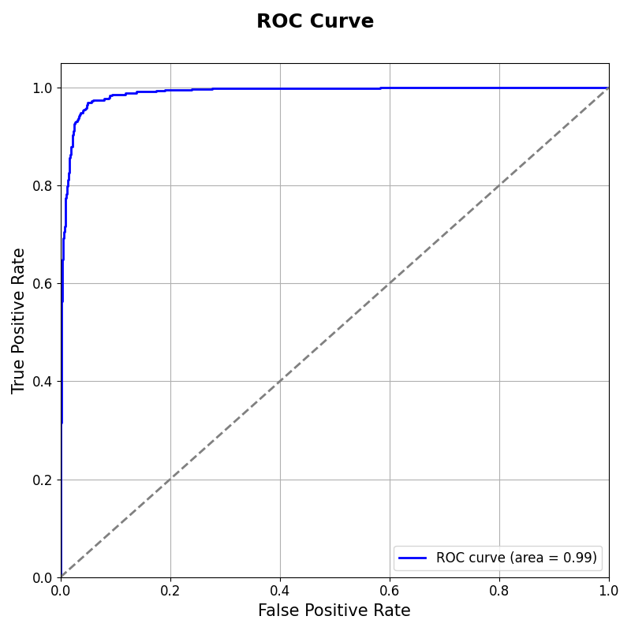

### Detailed Report of Test Set:

|              | precision    | recall       | f1-score     | support      |
| ------------ | ------------ | ------------ | ------------ | ------------ |
| Sneaker      | 0.9571       | 0.9530       | 0.9550       | 702          | 
| Ankle Boot   | 0.9545       | 0.9584       | 0.9565       | 722          | 
| macro avg    | 0.9558       | 0.9557       | 0.9557       | 1424         | 
| weighted avg | 0.9558       | 0.9558       | 0.9558       | 1424         | 

## Trial 2

*    *Start Time*: 2024-08-01 10:55:07

*    *Duration*: 03.043

*    *Directory*: [Link](./Trial_2)

### Hyperparameters:

| Hyperparameter | Value         |
| ------------- | ------------- |
| units1        | 256           |
| dropout1      | 0.3           |
| units2        | 128           |
| dropout2      | 0.3           |
| learning_rate | 0.001         |

### Evaluation Metrics:

|           | train     | val       | test      |
| --------- | --------- | --------- | --------- |
| accuracy  | 0.9579    | 0.9564    | 0.9508    | 
| precision | 0.9760    | 0.9654    | 0.9697    | 
| recall    | 0.9389    | 0.9455    | 0.9321    | 
| f1        | 0.9571    | 0.9554    | 0.9506    | 

### Figures:

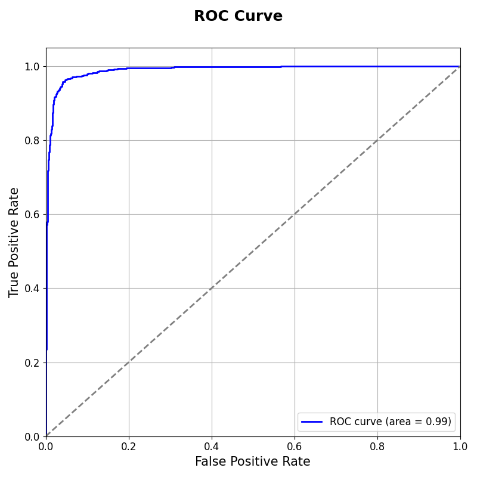

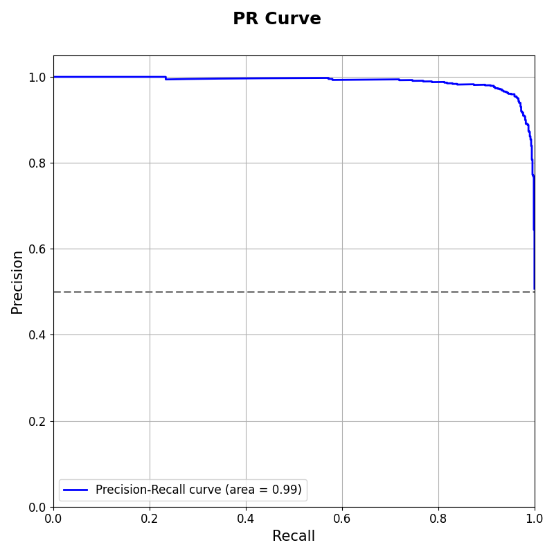

### Detailed Report of Test Set:

|              | precision    | recall       | f1-score     | support      |
| ------------ | ------------ | ------------ | ------------ | ------------ |
| Sneaker      | 0.9329       | 0.9701       | 0.9511       | 702          | 
| Ankle Boot   | 0.9697       | 0.9321       | 0.9506       | 722          | 
| macro avg    | 0.9513       | 0.9511       | 0.9508       | 1424         | 
| weighted avg | 0.9516       | 0.9508       | 0.9508       | 1424         | 

## Trial 4

*    *Start Time*: 2024-08-01 10:55:14

*    *Duration*: 02.946

*    *Directory*: [Link](./Trial_4)

### Hyperparameters:

| Hyperparameter | Value         |
| ------------- | ------------- |
| units1        | 128           |
| dropout1      | 0.2           |
| units2        | 128           |
| dropout2      | 0.2           |
| learning_rate | 0.0005        |

### Evaluation Metrics:

|           | train     | val       | test      |
| --------- | --------- | --------- | --------- |
| accuracy  | 0.9563    | 0.9542    | 0.9508    | 
| precision | 0.9397    | 0.9326    | 0.9324    | 
| recall    | 0.9750    | 0.9779    | 0.9737    | 
| f1        | 0.9570    | 0.9547    | 0.9526    | 

### Figures:

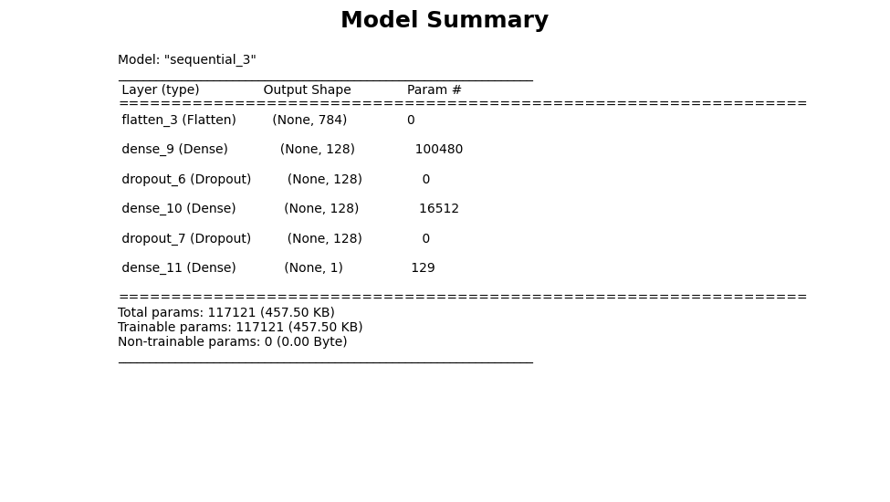

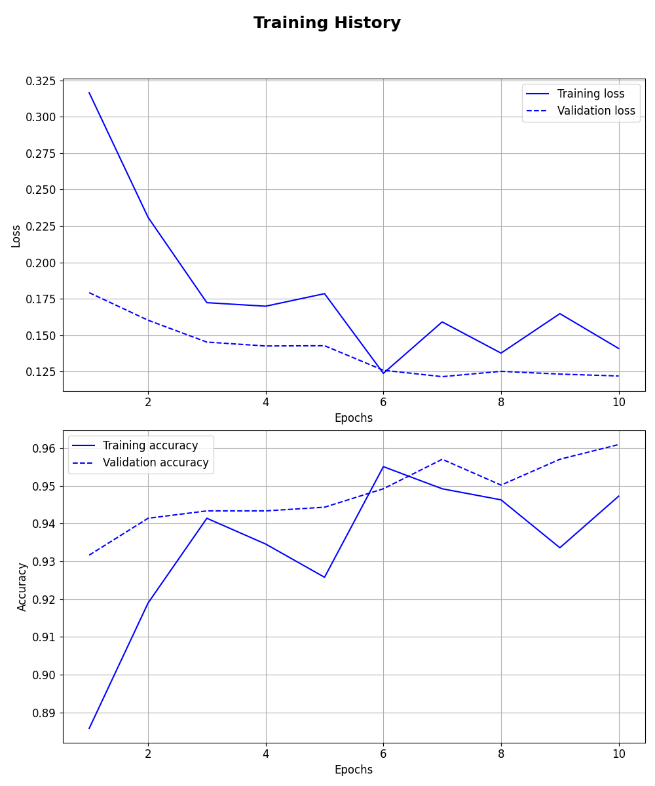

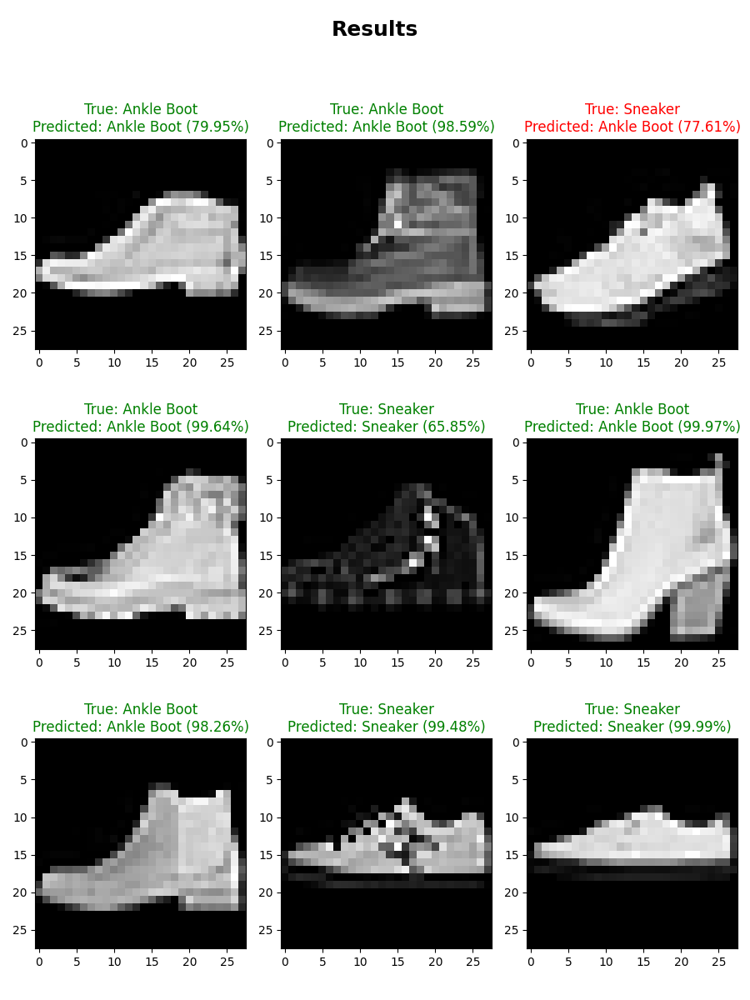

### Detailed Report of Test Set:

|              | precision    | recall       | f1-score     | support      |
| ------------ | ------------ | ------------ | ------------ | ------------ |
| Sneaker      | 0.9716       | 0.9274       | 0.9490       | 702          | 
| Ankle Boot   | 0.9324       | 0.9737       | 0.9526       | 722          | 
| macro avg    | 0.9520       | 0.9505       | 0.9508       | 1424         | 
| weighted avg | 0.9517       | 0.9508       | 0.9508       | 1424         | 

## Trial 5

*    *Start Time*: 2024-08-01 10:55:17

*    *Duration*: 03.145

*    *Directory*: [Link](./Trial_5)

### Hyperparameters:

| Hyperparameter | Value         |
| ------------- | ------------- |
| units1        | 256           |
| dropout1      | 0.4           |
| units2        | 128           |
| dropout2      | 0.4           |
| learning_rate | 0.0001        |

### Evaluation Metrics:

|           | train     | val       | test      |
| --------- | --------- | --------- | --------- |
| accuracy  | 0.9305    | 0.9302    | 0.9340    | 
| precision | 0.9107    | 0.9066    | 0.9232    | 
| recall    | 0.9546    | 0.9573    | 0.9488    | 
| f1        | 0.9322    | 0.9312    | 0.9358    | 

### Figures:

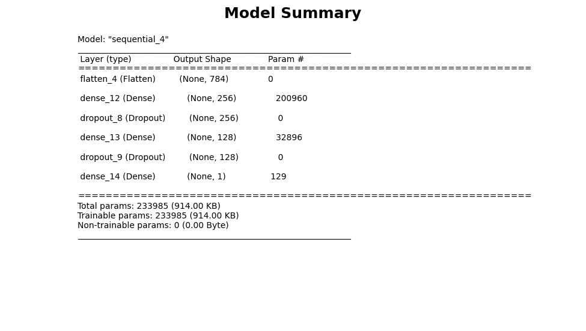

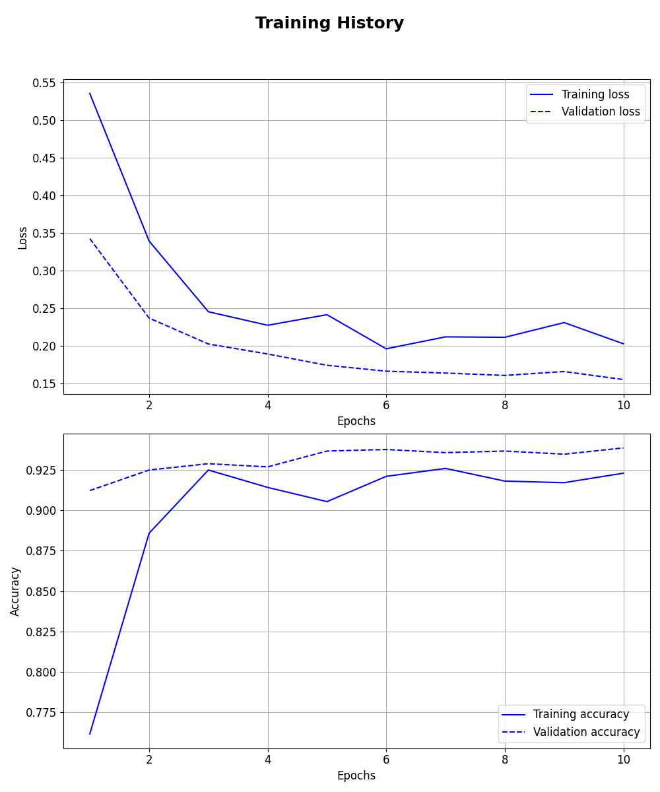

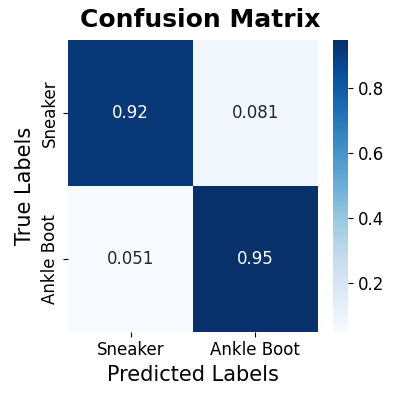

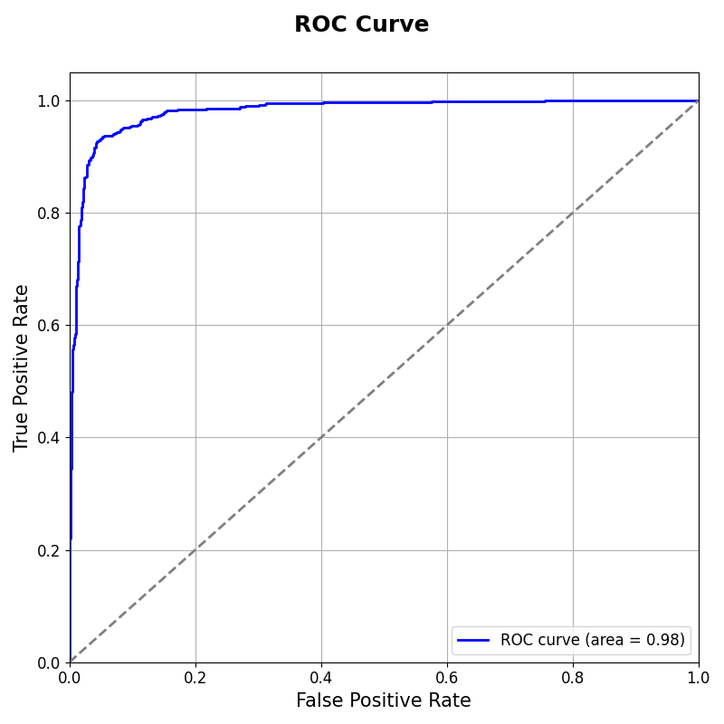

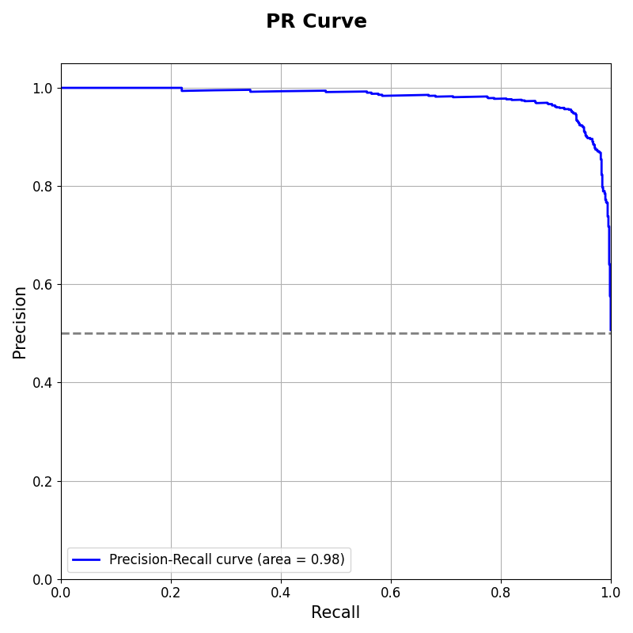

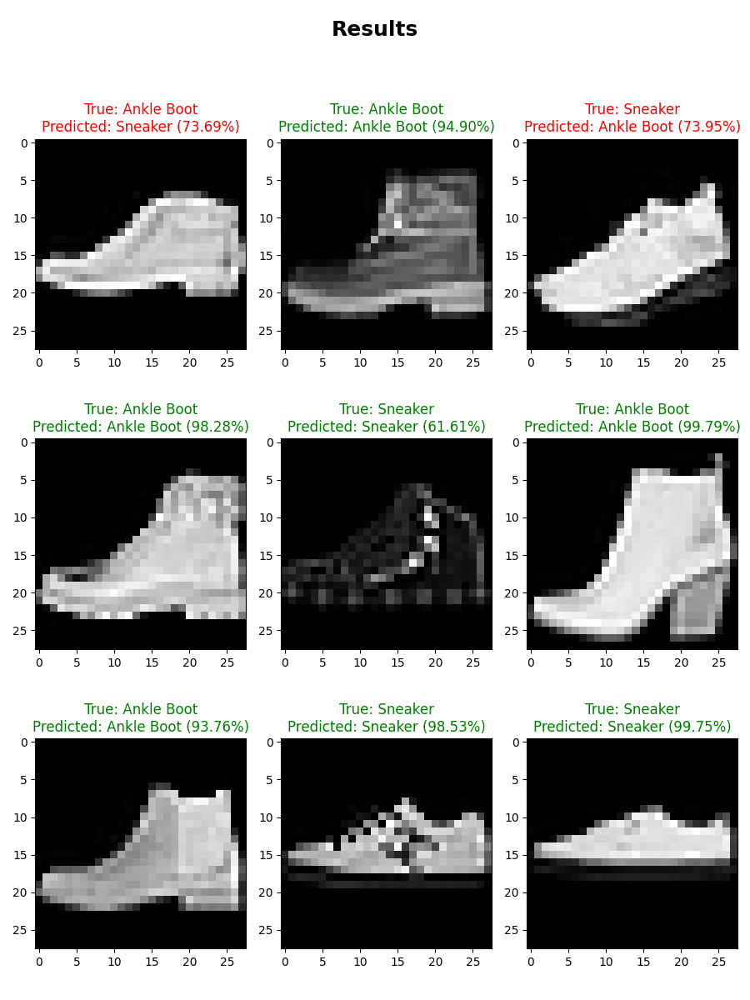

### Detailed Report of Test Set:

|              | precision    | recall       | f1-score     | support      |
| ------------ | ------------ | ------------ | ------------ | ------------ |
| Sneaker      | 0.9457       | 0.9188       | 0.9321       | 702          | 
| Ankle Boot   | 0.9232       | 0.9488       | 0.9358       | 722          | 
| macro avg    | 0.9345       | 0.9338       | 0.9339       | 1424         | 
| weighted avg | 0.9343       | 0.9340       | 0.9340       | 1424         | 

