# Experiment Report: Shoe vs Ankle Boot Experiment

## Metadata

*    *Description*: Binary classification on Fashion MNIST dataset (Sneaker vs Ankle Boot)

*    *Start Time*: 2025-01-20 10:52:29

*    *Total Duration*: 0:00:27.983

*    *Directory*: [Link](./.)

## Initial Visualizations

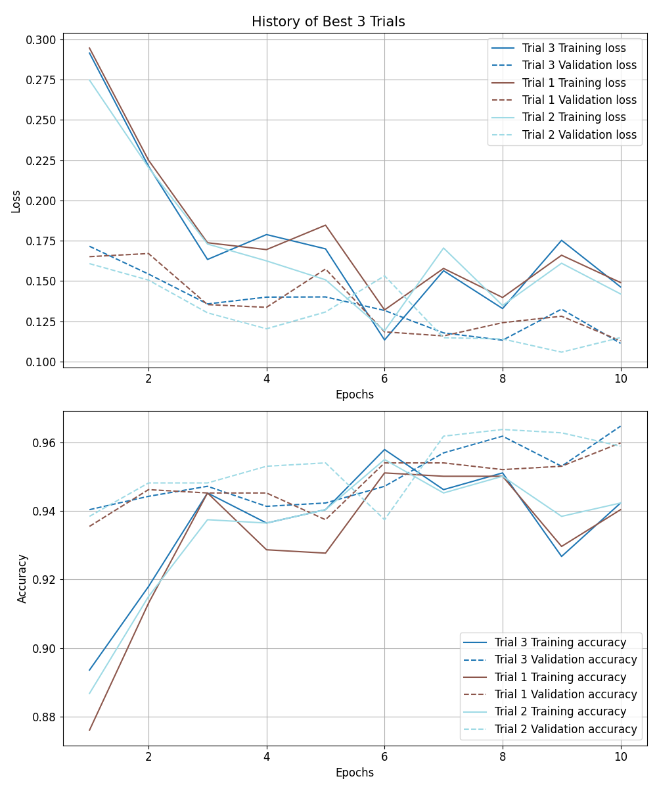

## Summary

### Hyperparameters

|               | units1        | dropout1      | units2        | dropout2      | learning_rate | Chapters      |
| ------------- | ------------- | ------------- | ------------- | ------------- | ------------- | ------------- |
| Trial 2       | 256           | 0.3000        | 128           | 0.3000        | 1.0000e-03    | [Chapter](#trial-2) | 
| Trial 1       | 128           | 0.2000        | 64            | 0.2000        | 1.0000e-03    | [Chapter](#trial-1) | 
| Trial 4       | 128           | 0.2000        | 128           | 0.2000        | 5.0000e-04    | [Chapter](#trial-4) | 
| Trial 3       | 64            | 0.1000        | 32            | 0.1000        | 1.0000e-03    | [Chapter](#trial-3) | 
| Trial 5       | 256           | 0.4000        | 128           | 0.4000        | 1.0000e-04    | [Chapter](#trial-5) | 

### Test Results

|           | accuracy  | precision | recall    | f1        | Chapters  |
| --------- | --------- | --------- | --------- | --------- | --------- |
| Trial 2   | 0.9586    | 0.9636    | 0.9543    | 0.9589    | [Chapter](#trial-2) | 
| Trial 1   | 0.9551    | 0.9621    | 0.9488    | 0.9554    | [Chapter](#trial-1) | 
| Trial 4   | 0.9551    | 0.9422    | 0.9709    | 0.9563    | [Chapter](#trial-4) | 
| Trial 3   | 0.9501    | 0.9670    | 0.9335    | 0.9500    | [Chapter](#trial-3) | 
| Trial 5   | 0.9298    | 0.9114    | 0.9543    | 0.9323    | [Chapter](#trial-5) | 

## Trial 2

*    *Start Time*: 2025-01-20 10:52:35

*    *Duration*: 05.362

*    *Directory*: [Link](./trial_2)

### Hyperparameters:

| Hyperparameter | Value         |
| ------------- | ------------- |
| units1        | 256           |
| dropout1      | 0.3           |
| units2        | 128           |
| dropout2      | 0.3           |
| learning_rate | 0.001         |

### Evaluation Metrics:

|           | train     | val       | test      |
| --------- | --------- | --------- | --------- |
| accuracy  | 0.9621    | 0.9557    | 0.9586    | 
| precision | 0.9709    | 0.9598    | 0.9636    | 
| recall    | 0.9527    | 0.9499    | 0.9543    | 
| f1        | 0.9617    | 0.9548    | 0.9589    | 

### Figures:

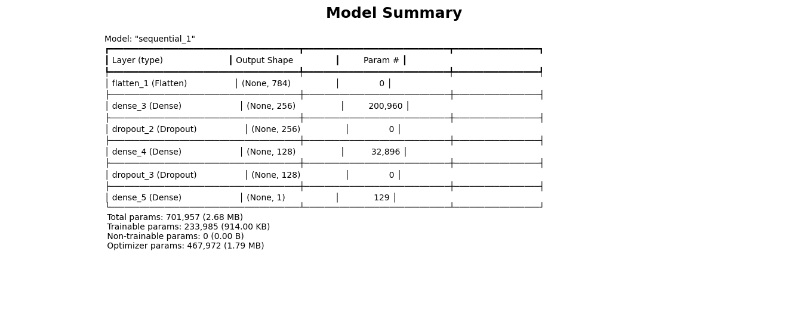

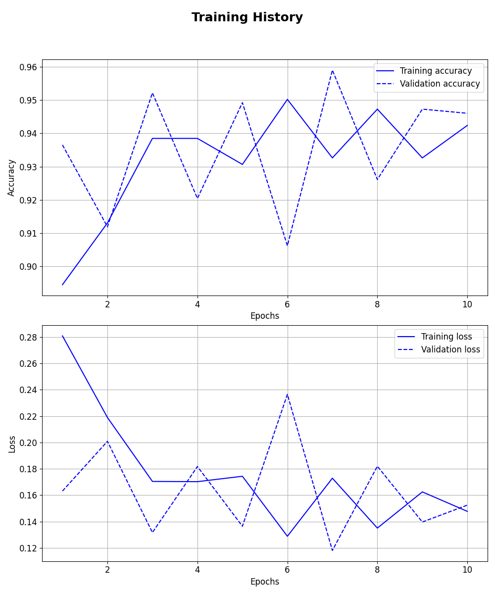

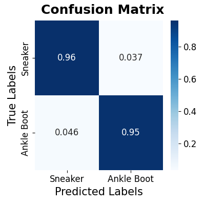

### Detailed Report of Test Set:

|              | precision    | recall       | f1-score     | support      |
| ------------ | ------------ | ------------ | ------------ | ------------ |
| Sneaker      | 0.9535       | 0.9630       | 0.9582       | 702          | 
| Ankle Boot   | 0.9636       | 0.9543       | 0.9589       | 722          | 
| macro avg    | 0.9585       | 0.9586       | 0.9586       | 1424         | 
| weighted avg | 0.9586       | 0.9586       | 0.9586       | 1424         | 

## Trial 1

*    *Start Time*: 2025-01-20 10:52:29

*    *Duration*: 05.934

*    *Directory*: [Link](./trial_1)

### Hyperparameters:

| Hyperparameter | Value         |
| ------------- | ------------- |
| units1        | 128           |
| dropout1      | 0.2           |
| units2        | 64            |
| dropout2      | 0.2           |
| learning_rate | 0.001         |

### Evaluation Metrics:

|           | train     | val       | test      |
| --------- | --------- | --------- | --------- |
| accuracy  | 0.9605    | 0.9549    | 0.9551    | 
| precision | 0.9727    | 0.9625    | 0.9621    | 
| recall    | 0.9477    | 0.9455    | 0.9488    | 
| f1        | 0.9600    | 0.9539    | 0.9554    | 

### Figures:

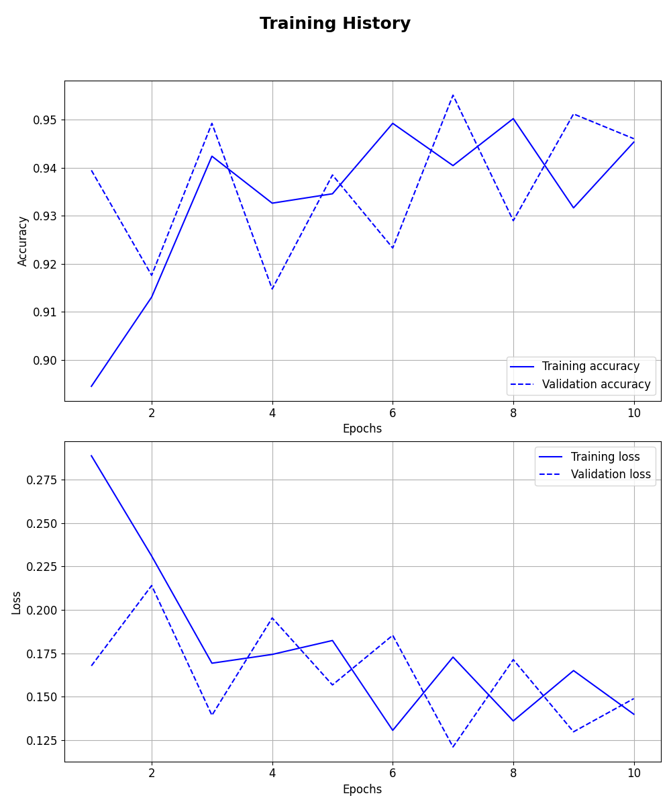

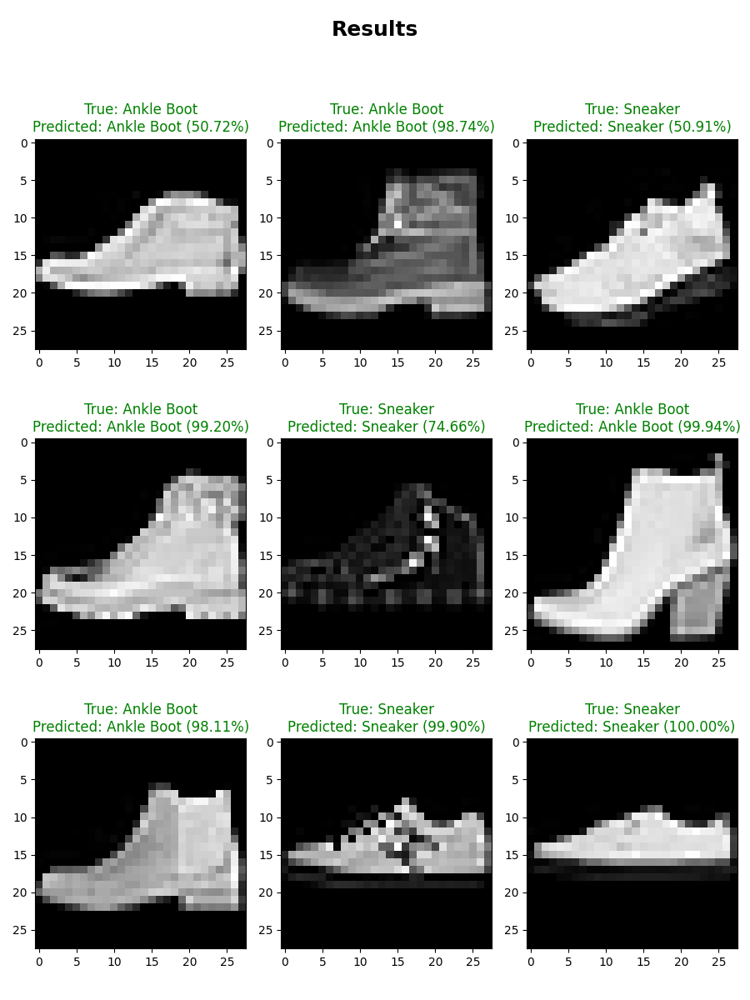

### Detailed Report of Test Set:

|              | precision    | recall       | f1-score     | support      |
| ------------ | ------------ | ------------ | ------------ | ------------ |
| Sneaker      | 0.9480       | 0.9615       | 0.9547       | 702          | 
| Ankle Boot   | 0.9621       | 0.9488       | 0.9554       | 722          | 
| macro avg    | 0.9551       | 0.9551       | 0.9551       | 1424         | 
| weighted avg | 0.9552       | 0.9551       | 0.9551       | 1424         | 

## Trial 4

*    *Start Time*: 2025-01-20 10:52:46

*    *Duration*: 04.944

*    *Directory*: [Link](./trial_4)

### Hyperparameters:

| Hyperparameter | Value         |
| ------------- | ------------- |
| units1        | 128           |
| dropout1      | 0.2           |
| units2        | 128           |
| dropout2      | 0.2           |
| learning_rate | 0.0005        |

### Evaluation Metrics:

|           | train     | val       | test      |
| --------- | --------- | --------- | --------- |
| accuracy  | 0.9575    | 0.9578    | 0.9551    | 
| precision | 0.9465    | 0.9417    | 0.9422    | 
| recall    | 0.9698    | 0.9750    | 0.9709    | 
| f1        | 0.9580    | 0.9580    | 0.9563    | 

### Figures:

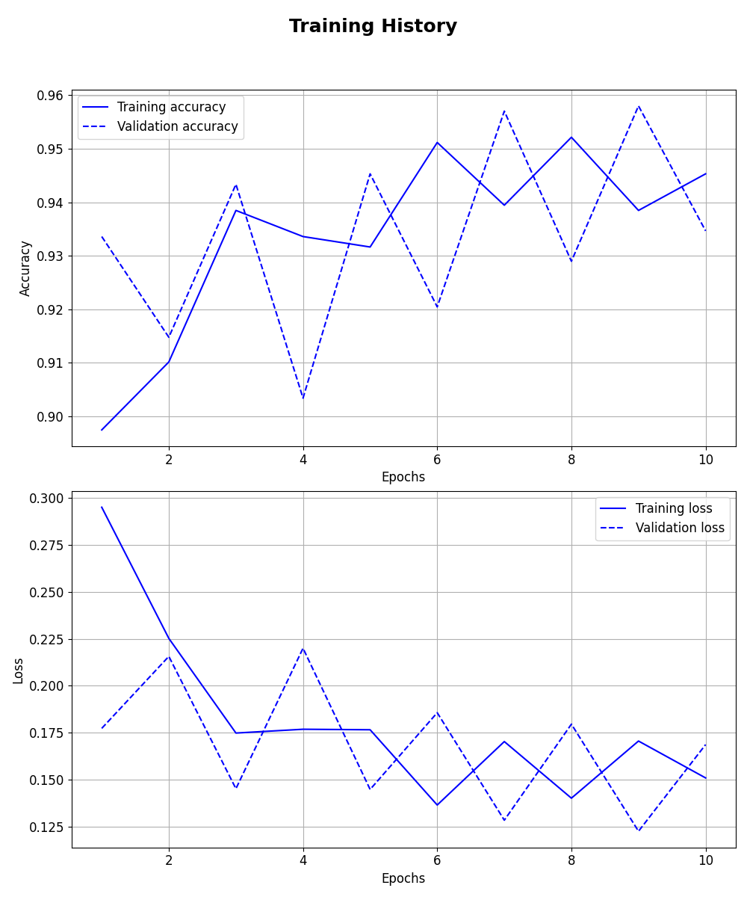

### Detailed Report of Test Set:

|              | precision    | recall       | f1-score     | support      |
| ------------ | ------------ | ------------ | ------------ | ------------ |
| Sneaker      | 0.9691       | 0.9387       | 0.9537       | 702          | 
| Ankle Boot   | 0.9422       | 0.9709       | 0.9563       | 722          | 
| macro avg    | 0.9557       | 0.9548       | 0.9550       | 1424         | 
| weighted avg | 0.9555       | 0.9551       | 0.9550       | 1424         | 

## Trial 3

*    *Start Time*: 2025-01-20 10:52:41

*    *Duration*: 04.819

*    *Directory*: [Link](./trial_3)

### Hyperparameters:

| Hyperparameter | Value         |
| ------------- | ------------- |
| units1        | 64            |
| dropout1      | 0.1           |
| units2        | 32            |
| dropout2      | 0.1           |
| learning_rate | 0.001         |

### Evaluation Metrics:

|           | train     | val       | test      |
| --------- | --------- | --------- | --------- |
| accuracy  | 0.9596    | 0.9578    | 0.9501    | 
| precision | 0.9802    | 0.9740    | 0.9670    | 
| recall    | 0.9380    | 0.9396    | 0.9335    | 
| f1        | 0.9587    | 0.9565    | 0.9500    | 

### Figures:

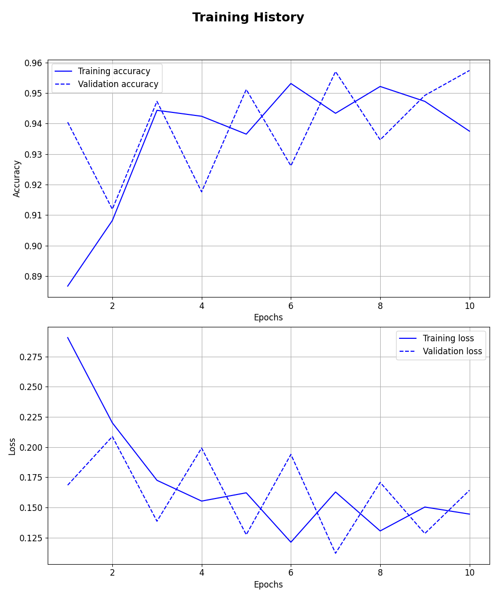

### Detailed Report of Test Set:

|              | precision    | recall       | f1-score     | support      |
| ------------ | ------------ | ------------ | ------------ | ------------ |
| Sneaker      | 0.9340       | 0.9672       | 0.9503       | 702          | 
| Ankle Boot   | 0.9670       | 0.9335       | 0.9500       | 722          | 
| macro avg    | 0.9505       | 0.9504       | 0.9501       | 1424         | 
| weighted avg | 0.9507       | 0.9501       | 0.9501       | 1424         | 

## Trial 5

*    *Start Time*: 2025-01-20 10:52:52

*    *Duration*: 04.637

*    *Directory*: [Link](./trial_5)

### Hyperparameters:

| Hyperparameter | Value         |
| ------------- | ------------- |
| units1        | 256           |
| dropout1      | 0.4           |
| units2        | 128           |
| dropout2      | 0.4           |
| learning_rate | 0.0001        |

### Evaluation Metrics:

|           | train     | val       | test      |
| --------- | --------- | --------- | --------- |
| accuracy  | 0.9267    | 0.9302    | 0.9298    | 
| precision | 0.8990    | 0.9021    | 0.9114    | 
| recall    | 0.9614    | 0.9632    | 0.9543    | 
| f1        | 0.9291    | 0.9316    | 0.9323    | 

### Figures:

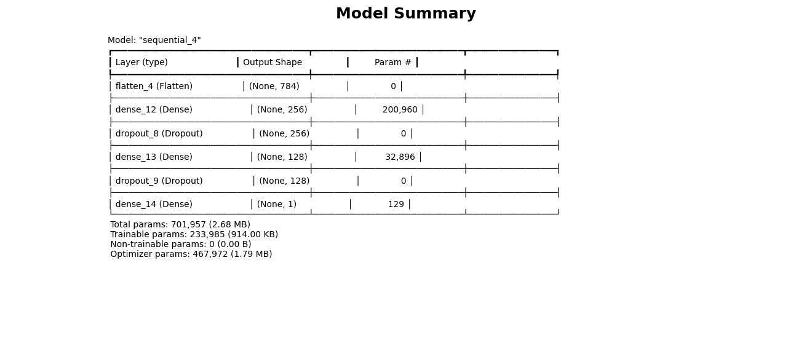

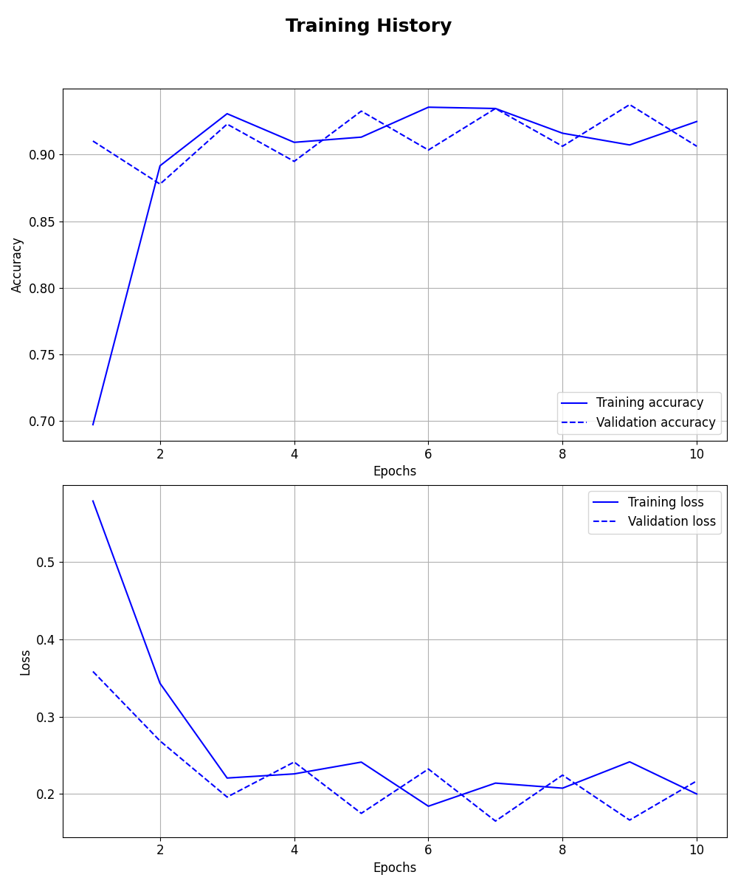

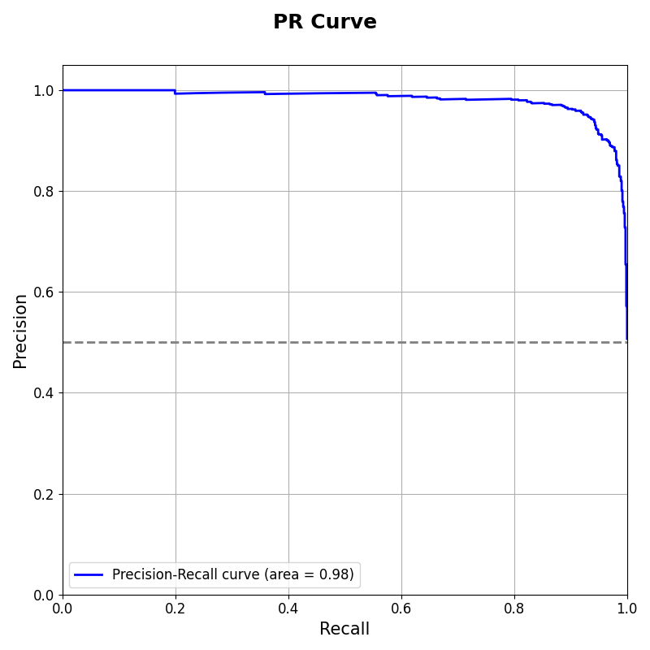

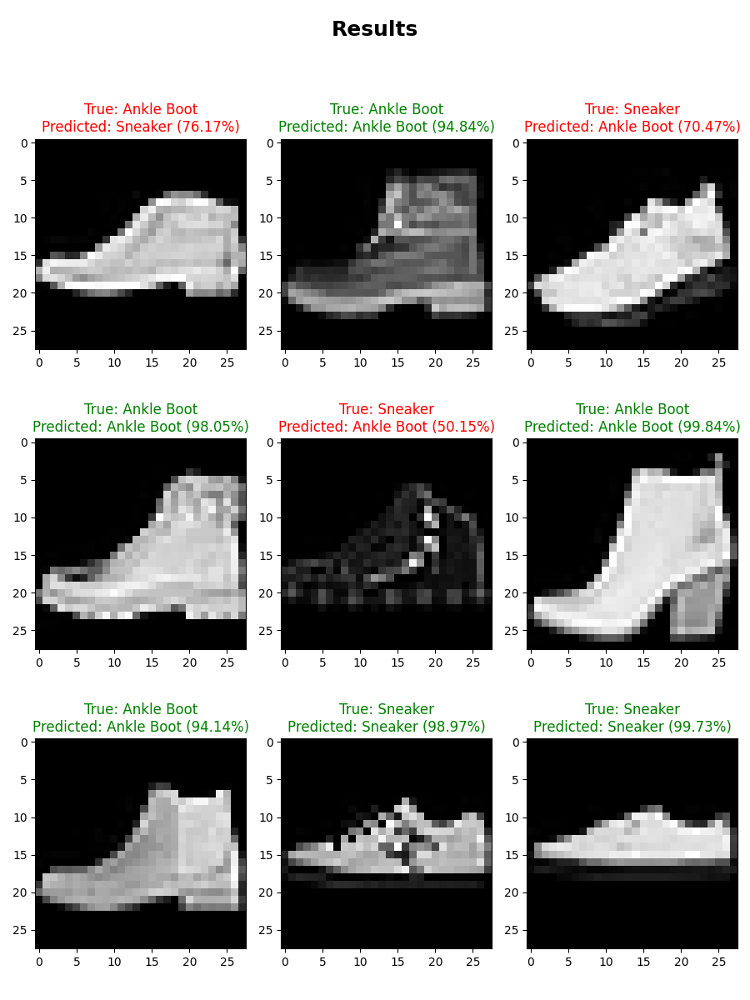

### Detailed Report of Test Set:

|              | precision    | recall       | f1-score     | support      |
| ------------ | ------------ | ------------ | ------------ | ------------ |
| Sneaker      | 0.9506       | 0.9046       | 0.9270       | 702          | 
| Ankle Boot   | 0.9114       | 0.9543       | 0.9323       | 722          | 
| macro avg    | 0.9310       | 0.9294       | 0.9297       | 1424         | 
| weighted avg | 0.9307       | 0.9298       | 0.9297       | 1424         | 

