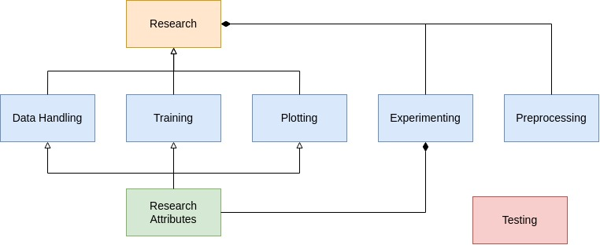

.. include:: header.rst

.. _About:

.. _About_Installation:

Installation
-----------------------------------------------

To install the library, use the following command:

.. code-block:: bash

  pip install --index-url https://test.pypi.org/simple/ --extra-index-url https://pypi.org/simple/ imlresearch

----

.. _About_Architecture:

Architecture
-----------------------------------------------

The framework allocates its low-level responsibilities to five research modules listed below:
  
* :ref:`Data Handling <Modules_Data_Handling>`  
  Converts raw input data into a format suitable for model training.

* :ref:`Preprocessing <Modules_Preprocessing>`  
  Prepares data for training, including operations like resizing, normalization, and augmentation.

* :ref:`Plotting <Modules_Plotting>`  
  Visualizes data, model performance, and results.

* :ref:`Training <Modules_Training>`  
  Manages model training, predictions, and evaluations.

* :ref:`Experimenting <Modules_Experimenting>`  
  Oversees the experiment lifecycle, manages trials, stores assets in an experiment directory, and generates experiment reports.

To facilitate seamless interaction between the research modules and the creation of a high-level class, shared attributes are defined in the ``ResearchAttributes`` class. This class contains attributes that are utilized across the research modules. The high-level class, named ``Researcher``, is constructed using inheritance or composition of the research modules.

.. list-table::
   :widths: auto
   :header-rows: 1

   * - **Name**
     - **Format**
     - **Description**
   * - ``datasets_container``
     - ``dict``
     - Contains datasets when split.
   * - ``label_manager``
     - ``LabelManager``
     - Instance for managing labels.
   * - ``outputs_container``
     - ``dict (Tuple)``
     - Contains true and predicted outputs as ``(y_true, y_pred)`` for each dataset. 
       Dataset names are replaced with ``'outputs'``. Example: ``'train_outputs'``.
   * - ``model``
     - ``tf.keras.Model``
     - Keras model instance used for training and evaluation.
   * - ``training_history``
     - ``dict``
     - Tracks the training history of the model after fitting, accessed via the ``'history'`` attribute.
   * - ``evaluation_metrics``
     - ``dict``
     - Evaluation metrics in the format: ``{Set_Name: {Metric: Value}}``. Can be set externally.
   * - ``figures``
     - ``dict``
     - Stores figures in the format: ``{figure_name: figure}``.
  
----

.. _About_License:

License and Copyright
----------------------
|IMLResearch| is available under the open-source :title:`MIT` license. Please read the full text of the :title:`MIT` license agreement, available in the distribution material (file LICENSE) and `here <https://opensource.org/licenses/MIT>`_, to ensure that your use case complies with the guidelines of the license.
