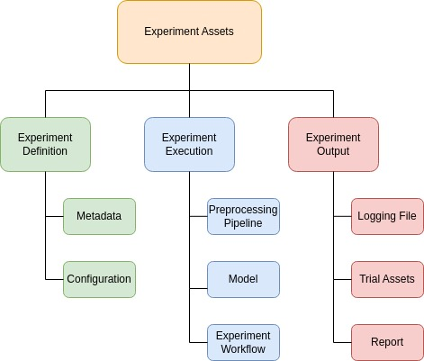
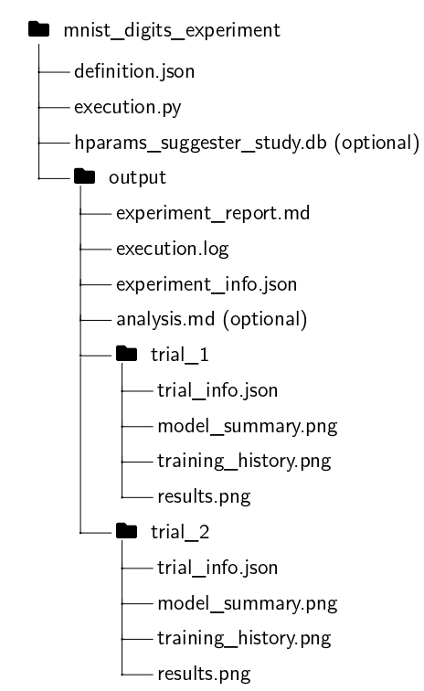

.. include:: header.rst

.. _Recipes:

.. _Recipes_Recommendation:

Recommendation
-----------------------------------------------
To ensure a clear and organized structure for conducting experiments, we recommend
the separation of concerns. This is accomplished by dividing the experiment assets into three
categories: experiment definition, execution, and outputs.

The following sections explain the implementation of the three categories and demonstrate an experiment using the *MNIST Digit* dataset :cite:`mnist1998`. For real-world examples, visit the `ImageMLResearch demo directory <https://github.com/SiulRek/ImageMLResearch/tree/api-development/demo>`_.

.. _Recipes_DefiningExperiment:

Defining an Experiment
-----------------------------------------------

The *experiment definition* category contains assets specific to each experiment, including metadata 
(e.g., name, directory, sorting metric) and trial configurations. These assets are stored in JSON format. You can find an example below.

.. **Example: MNIST Digits Experiment Definition (Manual Trial Configuration)**

.. _Recipes_ExampleExperimentDefinition:
.. code-block:: json

    {
        "experiment_metadata": {
            "name": "MNIST Digits Experiment",
            "description": "A neural network is trained with different hyperparameters to classify MNIST digits.",
            "directory": "demo/mnist_digits_experiment",
            "sort_metric": "accuracy"
        },
        "trial_definitions": [
            {
                "name": "Trial 1",
                "hyperparameters": {
                    "units1": 128,
                    "units2": 64,
                    "learning_rate": 0.001
                }
            },
            {
                "name": "Trial 2",
                "hyperparameters": {
                    "units1": 256,
                    "units2": 128,
                    "learning_rate": 0.001
                }
            }
        ]
    }

To load the trials, use the ``load_experiment_definition()`` function inside the ``utils`` module. This function reads the experiment metadata and trial configurations from the JSON file. The function signature is as follows:

.. function:: load_experiment_definition(definition_json)

    Loads experiment metadata and trial definitions from a JSON file.

    :param definition_json: The path to the JSON file containing the experiment definition.
    :type definition_json: str

    :returns: A tuple containing:
    
        - **experiment_metadata** (*dict*) -- Experiment metadata including name, description, and directory.
        - **trial_definitions** (*iterator*) -- An iterator for generating trial definitions.

    The JSON file is expected to contain two keys:

    - ``experiment_metadata`` (dict): Contains metadata about the experiment.
    - ``trial_definitions`` (list or dict): Specifies trial definitions, either as a list of predefined trials (see example above) or a configuration for generating them automatically (see :ref:`Recipes_HyperparameterTuning`).

.. _Recipes_ExecutingExperiment:

Executing the Experiment
-----------------------------------------------

Overview
^^^^^^^^

The experiment execution establishes the actual experiment workflow, encompassing:

- Data loading
- Data preparation and preprocessing
- Model creation and training
- Plotting and evaluation

To maintain reproducibility, it is recommended to design the experiment workflow within a single Python script, leveraging the framework’s capabilities. The script should reside in the experiment directory and be exclusively used for the specific experiment.

Workflow
^^^^^^^^

The code above demonstrates a complete execution script for the MNIST Digit experiment:

Steps:

1. Load the dataset and reshape it to include three channels.
2. Convert the dataset to the TFDS format.
3. Apply a preprocessing pipeline (e.g., reversing the scaling of pixel values).
4. Execute trials sequentially, where each trial:

   - Creates, trains, and evaluates a neural network for a specific hyperparameter combination.
   - Generates experiment outcomes, including the experiment report, using the underlying framework.

Example Implementation
^^^^^^^^^^^^^^^^^^^^^^
.. code-block:: python

    import os
    import tensorflow as tf
    from imlresearch.utils import load_experiment_definition
    from imlresearch.preprocessing_steps import ReverseScaler, TypeCaster
    from imlresearch.researcher import MultiClassResearcher

    def load_dataset():
        (X_train, Y_train), (X_test, Y_test) = tf.keras.datasets.mnist.load_data()
        X = tf.concat([X_train, X_test], axis=0)
        X = tf.stack([X] * 3, axis=-1)
        Y = tf.concat([Y_train, Y_test], axis=0)
        Y = tf.one_hot(Y, 10)
        dataset = tf.data.Dataset.from_tensor_slices((X, Y))
        return dataset

    def create_preprocessing_pipeline():
        return [ReverseScaler(255), TypeCaster(output_dtype="float32")]

    def make_model(hyperparameters):
        model = tf.keras.models.Sequential(
            [
                tf.keras.layers.Flatten(input_shape=(28, 28, 3)),
                tf.keras.layers.Dense(hyperparameters["units1"], activation="relu"),
                tf.keras.layers.Dense(hyperparameters["units2"], activation="relu"),
                tf.keras.layers.Dense(10, activation="softmax"),
            ]
        )
        model.compile(
            optimizer=tf.keras.optimizers.Adam(
                learning_rate=hyperparameters["learning_rate"]
            ),
            loss="categorical_crossentropy",
            metrics=["accuracy"],
        )
        return model

    def make_experiment(experimant_metadata, trial_definitions):
        # Experiment Setup
        researcher = MultiClassResearcher(
            class_names=["Digit " + str(i) for i in range(10)]
        )
        dataset = load_dataset()
        researcher.load_dataset(dataset)
        preprocessing_pipe = create_preprocessing_pipeline()
        researcher.apply_preprocessing_pipeline(preprocessing_pipe)
        researcher.prepare_datasets(batch_size=32, shuffle_seed=42)
        researcher.split_dataset(train_size=0.8, val_size=0.1, test_size=0.1)

        # Experiment Execution
        with researcher.run_experiment(**experimant_metadata) as experiment:
            for trial_definition in trial_definitions:
                with experiment.run_trial(**trial_definition) as trial:
                    if trial.already_runned:
                        continue
                    model = make_model(trial_definition["hyperparameters"])
                    researcher.set_compiled_model(model)
                    researcher.fit_predict_evaluate(
                        epochs=10, steps_per_epoch=32, validation_steps=32
                    )
                    researcher.plot_model_summary()
                    researcher.plot_training_history(title="Training History")
                    researcher.plot_results(grid_size=(4, 3), prediction_bar=True)

    if __name__ == "__main__":
        json_path = os.path.join(
            os.path.dirname(os.path.abspath(__file__)), "definition.json"
        )
        experiment_metadata, trial_definitions = load_experiment_definition(json_path)
        make_experiment(experiment_metadata, trial_definitions)

.. _Recipes_ExperimentOutputs:

Experiment Outputs
-----------------------------------------------

The experiment results are stored in the ``output`` folder, generated for each experiment. Key files include:

- ``experiment_info.json``: Contains experiment-specific metadata, figure paths, and trial names.
- ``execution.log``: Tracks experiment progress.
- ``experiment_report.md``: Automatically generated experiment report.
- ``analysis.md`` *(optional)*: Analysis performed by ChatGPT (enabled via ``ask_for_analysis=True`` in the ``Experiment`` class).
- ``hparams_suggester_study.db`` *(optional)*: Hyperparameter optimization study by Optuna (enabled in case trials are generated automatically, find more in :ref:`Recipes_HyperparameterTuning`).

Each trial has its own folder containing:

- ``trial_info.json``: Trial-specific metadata and figure paths, training history, and evaluation metrics.
- ``*.png``: Figures generated and tracked during the trial.

Below is the folder structure of the experiment assets for the MNIST Digits experiment:

The experiment report consolidates data from ``_info.json`` files and figures into a structured summary. The ``definition.json`` and ``execution.json`` files, along with the ``output`` folder, form the complete set of experiment assets. Download the generated report for the MNIST Digits experiment from the following link:

:download:`MNIST Digits Experiment Report (PDF) <documents/mnist_digits_report.pdf>`.

.. _Recipes_HyperparameterTuning:

Hyperparameter Tuning
-----------------------------------------------

To leverage hyperparameter tuning, the framework builds on `Optuna <https://optuna.org/>`_, a hyperparameter optimization library. To use this feature, the ``definition.json`` file should contain a configuration for generating trials automatically. The ``trial_definitions`` key should include ``hparams_configs``, where you can specify the hyperparameters to tune and their respective search spaces. Additionally, you need to specify the number of trials to run using the ``num_trials`` key.

The following hyperparameter types are supported:

- **int:**  
  Specifies a range of integer values with the following attributes:

  - ``low``: The minimum value.  
  - ``high``: The maximum value.  
  - ``step``: The increment step between values.  
  - ``nearest_power2`` (optional, default: ``false``): Whether to compute the nearest power of 2.  

- **float:**  
  Specifies a range of floating-point values with the following attributes:  
  
  - ``low``: The minimum value.  
  - ``high``: The maximum value.  
  - ``log`` (optional, default: ``false``): Whether to sample logarithmically.

- **categorical:**  
  Defines a set of discrete choices, where each trial selects a value from the specified list.  

  - ``choices``: A list of possible categorical values.

Below is an example of an automatic trial configuration for the MNIST Digits experiment:

.. _Recipes_ExampleExperimentDefinitionAutomatic:
.. code-block:: json

    {
    "experiment_metadata": {
        "name": "MNIST Digits Experiment",
        "description": "In this experiment, a neural network is trained with different hyperparameters to classify MNIST digits.",
        "directory": "demo/mnist_digits_experiment_auto",
        "sort_metric": "accuracy"
    },
    "trial_definitions": {
        "hparams_configs": {
        "units1": {
            "type": "int",
            "low": 32,
            "high": 128,
            "step": 32,
            "nearest_power2": true
        },
        "units2": {
            "type": "int",
            "low": 32,
            "high": 128,
            "step": 32,
            "nearest_power2": true
        },
        "learning_rate": {
            "type": "float",
            "low": 1e-3,
            "high": 1e-1,
            "log": true
        }
    },
    "num_trials": 10
    }
    }

The generated report for the MNIST Digits experiment with automatic trial configuration can be downloaded from the following link:

:download:`MNIST Digits Experiment Report (Automatic) (PDF) <documents/mnist_digits_report_auto.pdf>`.
