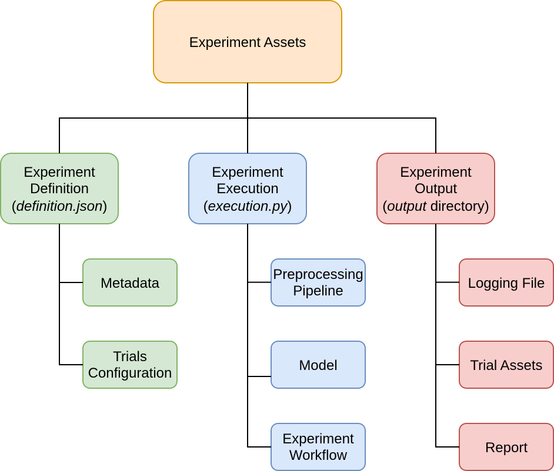
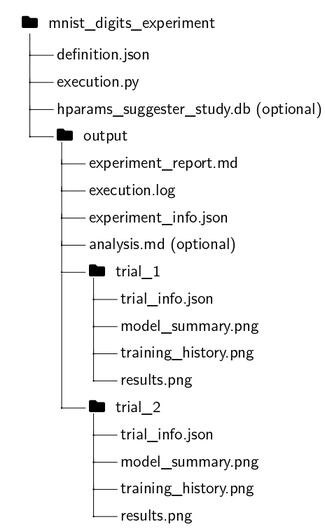

# Summary

`ImageMLResearch` is an open-source Python toolkit that streamlines and standardizes image-based machine learning (ML) research. While ML has achieved remarkable success in computer vision, the complexity of research workflows remains a barrier to reproducibility and accessibility. Many projects rely on loosely connected scripts or notebooks, leading to fragmented experiment management and limited reproducibility.

`ImageMLResearch` addresses this gap by providing a modular Python package with a clear API, without requiring intrusive dashboards or command-line interfaces. Built on widely adopted libraries such as TensorFlow [@abadi2016tensorflow], Keras [@chollet2015keras], and Optuna [@akiba2019optuna], it offers a lightweight, research-oriented approach to reproducible image-based ML experimentation. The toolkit is designed to support education, exploratory research, and the development of more robust experiment management practices.

# Statement of Need

Image-based machine learning workflows are often constructed from ad hoc scripts or notebooks, making it difficult to maintain a clear structure between data handling, preprocessing, training, and evaluation. This fragmentation contributes to poor reproducibility and hinders systematic experimentation [@gundersen2018reproducible; @pineau2021improving; @hutson2018reproducibility].

While modern machine learning libraries provide powerful computational building blocks, they do not enforce a coherent structure for managing experiments. As a result, researchers must manually coordinate configurations, results, and documentation, which increases cognitive overhead and the likelihood of irreproducible outcomes.

`ImageMLResearch` was developed to address these challenges by providing a lightweight, structured framework for defining, executing, and documenting image-based machine learning experiments in a reproducible manner.

# State of the Field

A variety of tools exist to support machine learning experimentation and reproducibility. Core frameworks such as TensorFlow [@abadi2016tensorflow] and PyTorch [@paszke2019pytorch] provide flexible abstractions for model development and training but leave experiment organization and result management largely to the user.

Experiment tracking platforms such as MLflow [@zaharia2018mlflow] and Weights & Biases [@biewald2020wandb] address this limitation by offering centralized logging, visualization dashboards, and metadata management. While powerful, these systems typically rely on external services and introduce additional infrastructure and configuration overhead, which can be a barrier in lightweight academic or educational settings.

In contrast, `ImageMLResearch` focuses on structuring the full experiment lifecycle for image-based machine learning within a self-contained Python package. Rather than emphasizing dashboards or large-scale tracking, it prioritizes transparent configuration, deterministic experiment definitions, and file-based artifacts tailored to image data. This positions the toolkit between low-level ML frameworks and full-scale experiment management platforms, addressing the needs of reproducible, small-to-medium-scale image-based research projects.

# Software Design

`ImageMLResearch` is implemented in Python and integrates TensorFlow, Keras, and Optuna. It provides five research modules:

* **Data Handling** – for structured dataset loading and preparation
* **Preprocessing** – for image normalization and augmentation
* **Plotting** – for visualizing data distributions, training curves, and results
* **Training** – for orchestrating model construction and optimization
* **Experimenting** – for automated runs, logging, and evaluation

These modules are coordinated through high-level `Researcher` classes that integrate the experiment lifecycle. Assets are organized into **definition**, **execution**, and **output** layers, ensuring clear separation of concerns. The toolkit automatically tracks logs, figures, and experiment metadata, generating human-readable markdown reports. Hyperparameter optimization is supported through Optuna, and a proof-of-concept AI-assisted analysis feature demonstrates automated interpretation of experiment results.

The software design emphasizes reproducibility through explicit configuration and deterministic experiment definitions. The modular structure allows individual components (e.g., preprocessing or training strategies) to be replaced without changing the surrounding experiment orchestration, supporting method comparison and benchmarking with minimal boilerplate. The design focuses on simplicity and reproducibility by using TensorFlow as a single framework, avoiding added complexity from supporting multiple backends. File-based outputs keep results easy to inspect and share, and JSON configuration provides a clear, structured format despite being less flexible than alternatives.

# Research Impact Statement

ImageMLResearch is designed to lower the barrier to systematic experimentation in academic and educational settings. By standardizing workflows from data preparation to reporting, the toolkit allows researchers to focus on hypothesis-driven investigation rather than infrastructure maintenance.

In research contexts, the software supports rigorous benchmarking and method comparison, which are essential for reproducible and peer-reviewed machine learning studies. ImageMLResearch was used within the FFG-funded ENDLESS research project to ensure that complex image-classification experiments remained reproducible across collaborating research teams.

In educational settings, the toolkit provides a structured framework for teaching best practices in machine learning experimentation. By enforcing a clear separation between experimental definitions and generated outputs, it encourages students to approach machine learning experiments as structured scientific studies rather than collections of disconnected trial-and-error scripts.

# AI Usage Disclosure

OpenAI’s ChatGPT was used to enhance clarity and readability of the manuscript. AI-assisted code completion and consistency checks were performed using GitHub Copilot during software development. All AI-generated suggestions were reviewed, verified, and edited by the authors to ensure correctness and scientific accuracy.

The authors maintain full responsibility for the software's architecture, the implementation of the core research logic, and the scientific validity of the experimental results. All AI-suggested content was manually audited, refined, and verified to ensure it meets the rigorous standards of research software. No core algorithmic logic or novel research methodology was generated by AI.

# Illustrative Example

The structure of an `ImageMLResearch` experiment is illustrated in the diagram below.

The metadata specifies the experiment name, directory, and sorting metric, while trials can be configured either manually or generated automatically through hyperparameter tuning. For example, running an MNIST digit experiment with two trials produces the following directory structure.

# Quality Control

`ImageMLResearch` is maintained under version control with Git and GitHub. Unit tests are implemented with Python’s unittest framework for each module, executed with a dedicated test runner that reports pass/fail/error logs. Code quality is enforced using Pylint [@pylint] and Ruff [@ruff] in accordance with PEP 8. AI-assisted consistency checks are performed with GitHub Copilot.

# Acknowledgements

Developed under the FFG Coin ENDLESS Research Project.

# References
