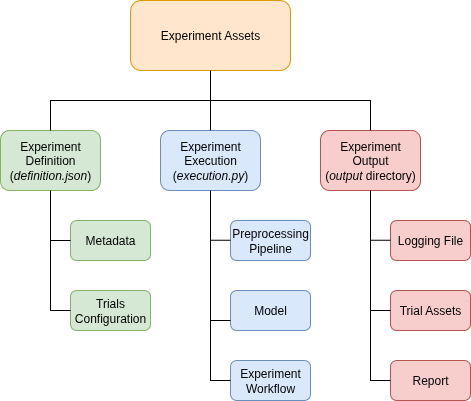

# ImageMLResearch: A Python Toolkit for Reproducible Image-Based ML Experiments

`ImageMLResearch` is an open-source Python toolkit that streamlines and standardizes image-based machine learning (ML) research. While ML has achieved remarkable success in computer vision, the complexity of research workflows remains a barrier to reproducibility and accessibility. Many projects rely on loosely connected scripts or notebooks, leading to fragmented experiment management and limited reproducibility.

`ImageMLResearch` addresses this gap by providing a modular Python package with a clear API, without requiring intrusive dashboards or command-line interfaces. Built on widely adopted libraries such as TensorFlow [@abadi2016tensorflow], Keras [@chollet2015keras], and Optuna [@akiba2019optuna], it offers a lightweight, research-oriented approach to reproducible image-based ML experimentation. The toolkit is designed to support education, exploratory research, and the development of more robust experiment management practices.

## Statement of Need
Image-based machine learning workflows are often constructed from ad hoc scripts or notebooks, making it difficult to maintain a clear structure between data handling, preprocessing, training, and evaluation. This fragmentation contributes to poor reproducibility and hinders systematic experimentation [@gundersen2018reproducible; @pineau2021improving; @hutson2018reproducibility]. 

General-purpose frameworks such as TensorFlow [@abadi2016tensorflow] and PyTorch [@paszke2019pytorch] provide the computational foundations but do not prescribe experiment organization. Tools such as MLflow [@zaharia2018mlflow] and Weights & Biases [@biewald2020wandb] extend functionality with experiment tracking and visualization, yet they often require additional infrastructure that can be burdensome in lightweight academic projects.

`ImageMLResearch` addresses this gap by structuring the experiment lifecycle for image classification into modular components. It supports the consistent definition, execution, and documentation of experiments without reliance on external services. This makes the toolkit especially suited for exploratory research, and smaller projects where transparent and reproducible experiment management is essential.

## State of the Field

Reproducibility and systematic experimentation are longstanding challenges in image-based machine learning research. Existing tools such as experiment tracking platforms (e.g., MLflow, Weights & Biases) and workflow managers provide infrastructure for logging metrics and managing runs, but they are often agnostic to domain-specific requirements in image analysis. As a result, researchers frequently rely on custom scripts and ad hoc conventions to manage datasets, preprocessing pipelines, model variants, and evaluation protocols, which complicates reproducibility and comparison across experiments.

ImageMLResearch addresses this gap by focusing specifically on image-based machine learning workflows and by tightly integrating experiment configuration, dataset handling, preprocessing, model training, and evaluation within a unified, reproducible framework. Unlike generic experiment trackers, the toolkit emphasizes transparent configuration, deterministic experiment definitions, and structured output artifacts tailored to image data. This design reduces boilerplate code and lowers the barrier to conducting controlled, comparable experiments in image-based research settings.

## Software Description

`ImageMLResearch` is implemented in Python and integrates TensorFlow, Keras, and Optuna. It provides five research modules:

* **Data Handling** – for structured dataset loading and preparation
* **Preprocessing** – for image normalization and augmentation
* **Plotting** – for visualizing data distributions, training curves, and results
* **Training** – for orchestrating model construction and optimization
* **Experimenting** – for automated runs, logging, and evaluation

These modules are coordinated through high-level `Researcher` classes that integrate the experiment lifecycle. Assets are organized into **definition**, **execution**, and **output** layers, ensuring clear separation of concerns. The toolkit automatically tracks logs, figures, and experiment metadata, generating human-readable markdown reports. Hyperparameter optimization is supported through Optuna, and a proof-of-concept AI-assisted analysis feature demonstrates automated interpretation of experiment results.

## Illustrative Example
The structure of an `ImageMLResearch` experiment is illustrated in the diagram below.

The metadata specifies the experiment name, directory, and sorting metric, while trials can be configured either manually or generated automatically through hyperparameter tuning. For example, running an MNIST digit experiment with two trials produces the following directory structure.

## Quality Control

`ImageMLResearch` is maintained under version control with Git and GitHub. Unit tests are implemented with Python’s unittest framework for each module, executed with a dedicated test runner that reports pass/fail/error logs. Code quality is enforced using Pylint and Ruff in accordance with PEP 8. AI-assisted consistency checks are performed with GitHub Copilot.

## Acknowledgements

Developed under the FFG Coin ENDLESS Research Project.

